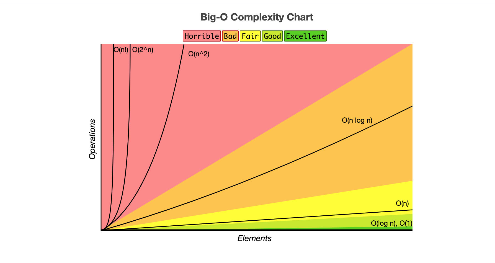
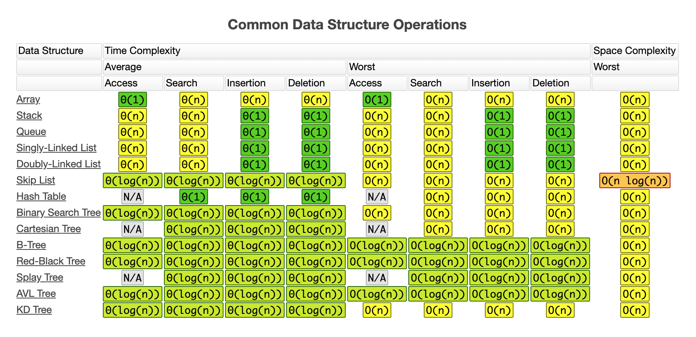
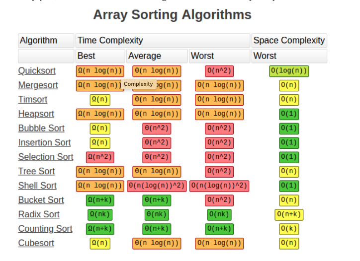
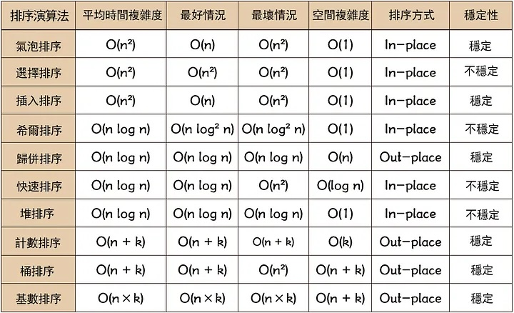
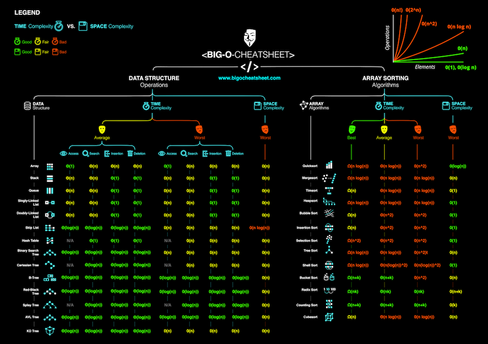
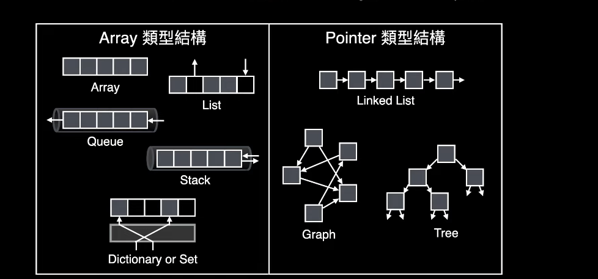
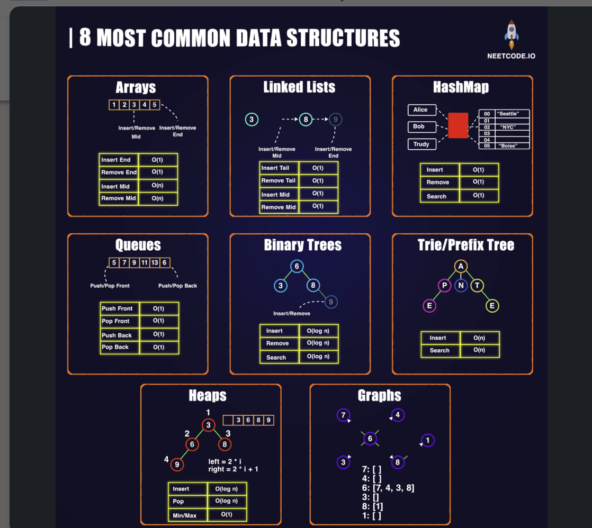
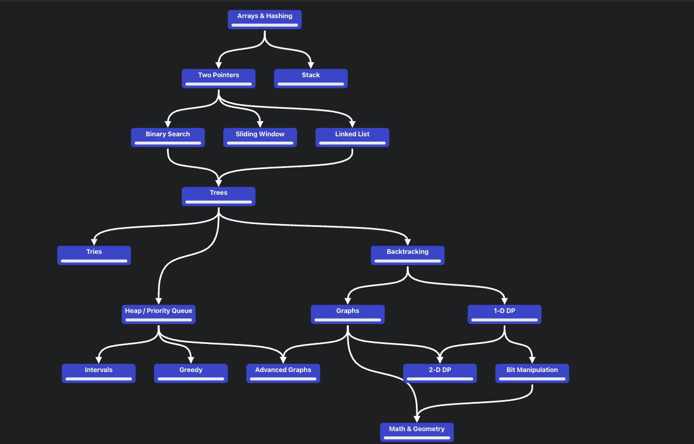

<h1 align="center"><a href="https://leetcode.com/problemset/algorithms/">CS_BASICS</a></h1>

<h5 align="center"><a href="https://www.bigocheatsheet.com/">pic_source</a></h5>

<p align="center"></p>

<p align="center"></p>

<p align="center"></p>

<p align="center"></p>

<p align="center"></p>

<p align="center"></p>

<p align="center"></p>

<p align="center"></p>

[](https://star-history.com/#yennanliu/CS_basics&Date)


## Cmd

```bash
# 1) (claude code) add time, space complexity to java class
claude

/add-time-space BinarySearch
/add-time-space BFS

# ....
```


## Resource

* LC classics problems
	- [Blind Curated 75](https://leetcode.com/list/xoqag3yj/)
	- [Grind 75](https://www.techinterviewhandbook.org/grind75/)
	- [Grind 169](https://www.techinterviewhandbook.org/grind75/?weeks=28&hours=6)
	- [leetcode wiki repo](https://github.com/doocs/leetcode)
	- [leetcode wiki](https://leetcode.doocs.org/)
	- [LC 官神Github題目分類整理](https://github.com/wisdompeak/LeetCode/tree/master)
	- [LC top 100 likes](https://leetcode.com/studyplan/top-100-liked/)
	- [neetcode 150 LC list](https://neetcode.io/practice)
		- [My Brain after 569 Leetcode Problems](https://youtu.be/8wysIxzqgPI)
	- [jiakaobo LC](https://www.jiakaobo.com/leetcode.html) : LC code & video
	- [LC pattern @ blind](https://www.teamblind.com/post/New-Year-Gift---Curated-List-of-Top-100-LeetCode-Questions-to-Save-Your-Time-OaM1orEU) : Curated-List-of-Top-100-LeetCode-Questions-to-Save-Your-Time
	- [LC Algorithm Problem Classification](https://www.programcreek.com/2013/08/leetcode-problem-classification/)
	- [cheatsheet-leetcode-a4](https://cheatsheet.dennyzhang.com/cheatsheet-leetcode-a4)
	- [14-patterns-to-ace-any-coding-interview-question](https://hackernoon.com/14-patterns-to-ace-any-coding-interview-question-c5bb3357f6ed)
	- [grokking-the-coding-interview](https://www.educative.io/courses/grokking-the-coding-interview)


* LC experiences
	- [LC難度表](https://zerotrac.github.io/leetcode_problem_rating/#/)
		- 數字越高, 題目越難, 挑與自己LC排名接近的題庫
		- (e.g. LC rank ~= 1600, pick 1600 problem)
	- [代碼隨想錄](https://github.com/youngyangyang04/leetcode-master)
	- [Leetcode cookbook](https://github.com/halfrost/LeetCode-Go)
	- [fucking-algorithm](https://github.com/labuladong/fucking-algorithm)
	- [fucking-algorithm website](https://labuladong.github.io/algo/)
	- [FAANG 面試準備經驗與建議（一）](https://arthur-lin.medium.com/faang-%E9%9D%A2%E8%A9%A6%E6%BA%96%E5%82%99%E7%B6%93%E9%A9%97%E8%88%87%E5%BB%BA%E8%AD%B0-%E4%B8%80-b7add6a7b9a6)
	- [FAANG 面試準備經驗與建議（二）](https://arthur-lin.medium.com/faang-%E9%9D%A2%E8%A9%A6%E6%BA%96%E5%82%99%E7%B6%93%E9%A9%97%E8%88%87%E5%BB%BA%E8%AD%B0-%E4%BA%8C-%E6%A8%A1%E6%93%AC%E9%9D%A2%E8%A9%A6%E8%88%87%E8%B3%87%E6%BA%90%E4%BB%8B%E7%B4%B9-b06cc097b665)
	- [LC 小知識](https://ithelp.ithome.com.tw/articles/10299626)
	- [Meta SWE isnterview prep](https://www.metacareers.com/profile/trial/?redirect=job_details&chooseView=Arrays)
	- [0到100的軟體工程師面試之路](https://ithelp.ithome.com.tw/users/20152262/ironman/5615?page=2)
	- 來和大家聊聊我是如何刷題的 : pt1, pt2, pt3
		- https://blog.csdn.net/azl397985856/article/details/110358828
		- https://mp.weixin.qq.com/s/guCR2DCTGoWf4ojeqq2M8A
		- https://mp.weixin.qq.com/s/P_RMRmugmxvIHGyn2EHl7g

* LC Flow
	- high level idea : data structure, algorithm
	- offer time & space complexity
	- code implementation
	- offer test case (consider edge case)
	- discussion & follow up

- [Resource.md](./doc/Resource.md) - `Resource` for coding interview (**keep updating**)
- [Teach yourself CS](https://teachyourselfcs.com/)
- [MindMapCodeInterview](./doc/cheatsheet/mind_map_code_interview.png) - Mind map for coding interview 
- [CodeInterviewCheatsheet](./doc/cheatsheet/code_interview_cheatsheet.pdf) - Coding interview cheetsheet
- [repl.it](https://repl.it/) - Coding online!

* Visualization
	- [Algorithms viz](https://www.cs.usfca.edu/~galles/visualization/Algorithms.html)
	- [visualgo - DFS / BFS](https://visualgo.net/en/dfsbfs?slide=1) - DFS, BFS visualization
	- [visualgo - linkedlist](https://visualgo.net/en/list) - Linkedlist visualization
	- [visualgo - BST](https://visualgo.net/bn/bst) - binary search tree visualization
	- [toptal-sorting-algorithms](https://www.toptal.com/developers/sorting-algorithms)- sorting algorithms online

- [How to: Work at Google](https://www.youtube.com/watch?v=XKu_SEDAykw) — Example Coding/Engineering Interview
- [bit_manipulation.md](./doc/bit_manipulation.md) - Bit Manipulation Cheat Sheet
- [Py TimeComplexity](https://wiki.python.org/moin/TimeComplexity) - Py basic data structure `Time Complexity` ref
- [Py data model](https://docs.python.org/3/reference/datamodel.html) - Python data model doc 
- [pgexercises](https://pgexercises.com/questions/aggregates/) - Postgre exercises
- [sqlservertutorial](https://www.sqlservertutorial.net/)
- [Books](https://github.com/yennanliu/data_science_repo/tree/master/book)
- [freecodecamp - data-structures](https://www.freecodecamp.org/news/tag/data-structures/)
- [LC interview-experience](https://leetcode.com/discuss/interview-experience?currentPage=1&orderBy=hot&query=)
- [Cheatsheet](https://github.com/yennanliu/CS_basics/tree/master/doc/cheatsheet)

* Data structure
	- [py core data structure interview](https://python.plainenglish.io/python-for-interviewing-an-overview-of-the-core-data-structures-666abdf8b698)

* System design
	- [system_design readme](https://github.com/yennanliu/CS_basics/tree/master/system_design)
	- [sys_design_resource](https://github.com/yennanliu/CS_basics/blob/master/system_design/sys_design_resource.md)

* Tools
	- https://coderpad.io/
	- https://codeshare.io/
	- http://sqlfiddle.com/

* LC SQL resources
	- [LC SQL resource](./doc/lc_sql_resource.md)

## Algorithms content

* [Bit Manipulation](https://github.com/yennanliu/CS_basics#bit-manipulation)
* [Array](https://github.com/yennanliu/CS_basics#array)
* [String](https://github.com/yennanliu/CS_basics#string)
* [Linked List](https://github.com/yennanliu/CS_basics#linked-list)
* [Stack](https://github.com/yennanliu/CS_basics#stack)
* [Queue](https://github.com/yennanliu/CS_basics#queue)
* [Heap](https://github.com/yennanliu/CS_basics#heap)
* [Tree](https://github.com/yennanliu/CS_basics#tree)
* [Hash Table](https://github.com/yennanliu/CS_basics#hash-table)
* [Math](https://github.com/yennanliu/CS_basics#math)
* [Two Pointers](https://github.com/yennanliu/CS_basics#two-pointers)
* [Scan Line](https://github.com/yennanliu/CS_basics#scan-line)
* [Sort](https://github.com/yennanliu/CS_basics#sort)
* [Recursion](https://github.com/yennanliu/CS_basics#recursion)
* [Binary Search](https://github.com/yennanliu/CS_basics#binary-search)
* [Binary Search Tree](https://github.com/yennanliu/CS_basics#binary-search-tree)
* [Breadth-First Search](https://github.com/yennanliu/CS_basics#breadth-first-search)
* [Depth-First Search](https://github.com/yennanliu/CS_basics#depth-first-search)
* [Backtracking](https://github.com/yennanliu/CS_basics#backtracking)
* [Dynamic Programming](https://github.com/yennanliu/CS_basics#dynamic-programming)
* [Greedy](https://github.com/yennanliu/CS_basics#greedy)
* [Graph](https://github.com/yennanliu/CS_basics#graph)
* [Geometry](https://github.com/yennanliu/CS_basics#geometry)
* [Prefix Sum](https://github.com/yennanliu/CS_basics#prefix-sum)
* [Simulation](https://github.com/yennanliu/CS_basics#simulation)
* [Design](https://github.com/yennanliu/CS_basics#Design)
* [Concurrency](https://github.com/yennanliu/CS_basics#Concurrency)

## Database

* [SQL](https://github.com/yennanliu/CS_basics#sql)

## Shell

* [Shell Script](https://github.com/yennanliu/CS_basics#shell-script)

<br>

# Progress 

## Note tags

The `Note` column of every problem table carries three kinds of tag, all written by
[`script/fix_readme_tags.py`](script/fix_readme_tags.py) from vendored data — so fix the
data, not the row:

| Tag | Means | Source |
|-----|-------|--------|
| `array`, `dp`, `two pointers`, … | the technique the row is filed under, plus LeetCode's own topics for it | [`data/lc_topic_tags.json`](data/lc_topic_tags.json) |
| `fb`, `amazon`, `apple`, `netflix`, `google` (FAANG), plus `microsoft`, `uber`, `linkedin`, `bloomberg` | companies known to ask it | [`data/company_lc_tags.json`](data/company_lc_tags.json) |
| `blind75`, `neetcode150`, `neetcode250`, `top100liked` | the curated lists it sits on | [`data/problem_lists.json`](data/problem_lists.json) |

The three NeetCode lists nest, so a row names only the narrowest one it is on:
`blind75` already implies NeetCode 150 and 250, and `neetcode150` implies 250.
`top100liked` is LeetCode's own list and cuts across all three, so it stands on its own.
NeetCode's full 972-problem catalogue is deliberately not tagged — it would mark 607
rows without saying which to do first.

```bash
python3 script/fix_readme_tags.py --report   # what would change
python3 script/fix_readme_tags.py            # rewrite the Note column
```

## Data Structure

|  #  | Title | Solution | Use case | Comment | Status|
| --- | ----- | -------- | ---- | ----- | ---- |
||`Linear`| | | | |
||Array| [Py](./data_structure/python/array.py) | | | AGAIN*|
||Queue| [Py (array)](./data_structure/python/queue_array.py), [Py (linkedlist)](./data_structure/python/queue_linkedlist.py), [JS](./data_structure/js/queue.js) | | | AGAIN*|
||Stack| [Py](./data_structure/python/stack.py), [JS (linkedlist)](./data_structure/js/stack_linkedlist.js), [JS (array)](./data_structure/js/stack_array.js) | | | OK|
||Hash table| [Py](./data_structure/python/hash_table.py), [JS](./data_structure/js/hash_table.js) | usually for improving `time complexity B(O)` via extra space complexity (time-space tradeoff)|`good basic`| AGAIN****|
||`Linear, Pointer`| | | | |
||LinkedList| [Py](./data_structure/python/linkedList.py), [JS](./data_structure/js/linkedlist.js), [Java](./leetcode_java/src/main/java/DataStructure/ListNode.java) | | | OK**|
||Doubly LinkedList| [Python](./data_structure/python/doublylinkedlist.py), [JS](./data_structure/js/doublylinkedList.js) | | | AGAIN|
||`Non Linear, Pointer`| | | | |
||Tree| [Py](./data_structure/python/tree.py) | | | AGAIN**|
||Binary search Tree (BST)| [Python](./data_structure/python/binary_search_tree.py), [JS](./data_structure/js/binary_search_tree.js), [Java](leetcode_java/src/main/java/DataStructure/BST.java) | | | AGAIN|
||Binary Tree| [Py](./data_structure/python/binary_tree.py) | | | AGAIN**|
||Trie| [Py](./data_structure/python/trie.py) | | | AGAIN|
||Heap| [heap.py](./data_structure/python/heap.py), [MinHeap.py](./data_structure/python/MinHeap.py), [MaxHeap.py](./data_structure/python/MaxHeap.py), [MinHeap.java](leetcode_java/src/main/java/DataStructure/MinHeap.java), [MaxHeap.java](leetcode_java/src/main/java/DataStructure/MaxHeap.java) | | | AGAIN|
||Priority Queue (PQ)| [Py 1](./data_structure/python/pq_1.py), [Py 2](./data_structure/python/pq_2.py), [Py 3](./data_structure/python/pq_3.py) | | | AGAIN|
||`Graph`| | | | |
||Graph| [Py](./data_structure/python/graph.py), [JS](./data_structure/js/graph.js). [Java1](./algorithm/java/Graph.java), [Java2](./algorithm/java/GraphClient.java) | | | OK***|
||DirectedEdge|  [Java](leetcode_java/src/main/java/DataStructure/DirectedEdge.java) | | | AGAIN|


## Algorithm

|  #  | Title | Solution | Use case | Comment | Time complexity | Space complexity | Status|
| --- | ----- | -------- | ---- | ----- | ---- | ---- | ---- |
||Binary search|[Python](./algorithm/python/binary_search.py) | [complexity ref](https://www.geeksforgeeks.org/complexity-analysis-of-binary-search/) | `Best : O(1), Avg : O(log N), Worst : O(log N)` | | | AGAIN| 
||Linear search|[Python](./algorithm/python/linear_search.py) | | | | | AGAIN| 
||Breadth-first search (BFS)| [Python](./algorithm/python/bfs.py)|`FIND SHORTEST PATH`|| | | AGAIN***| 
||Depth-first search (DFS) |[Python](./algorithm/python/dfs.py)| `TO CHECK IF SOMETHING EXIST`| `inorder`, `postorder`, `postorder (can recreate a tree)`|Adjacency List: `O(V+E)`,  Adjacency Matrix: `O(V^2)`| `O(V)`  (V:Vertices, E:Edges)| AGAIN***| 
||Bubble sort| [Python](./algorithm/python/bubble_sort.py)| | | | | OK* (3)|  
||Insertion sort| [Python](./algorithm/python/insertion_sort.py), [InsertionSort.java](./leetcode_java/src/main/java/AlgorithmJava/InsertionSort.java)|`stable` sort| work very fast for `nearly sorted` array| `Best :O(n), Average : O(n^2), Worst : O(n^2)`| Worst : O(1)| AGAIN| 
||Bucket sort| [Python](./algorithm/python/bucket_sort.py), [BucketSort.java](./leetcode_java/src/main/java/AlgorithmJava/BucketSort.java) | | | | | AGAIN| 
||Quick sort| [quick_sort.py](./algorithm/python/quick_sort.py), [quick_sort_v2.py](./algorithm/python/quick_sort_v2.py), [QuickSort.java](./leetcode_java/src/main/java/AlgorithmJava/QuickSort.java), [QuickSortV2.java](./leetcode_java/src/main/java/AlgorithmJava/QuickSortV2.java), [QuickSortV3.java](./leetcode_java/src/main/java/AlgorithmJava/QuickSortV3.java)| NOTE !!!, `avg is NLogN, worst is N**2`, [big O ref](https://www.geeksforgeeks.org/time-and-space-complexity-analysis-of-quick-sort/), [big O ref 2](https://rust-algo.club/sorting/quicksort/) | `Best : O(N Log N), Avg : O(N Log N), Worst : O(N^2)` | || AGAIN***| 
||Heap sort| [Python](./algorithm/python/heap_sort.py)| [big O ref](https://rust-algo.club/sorting/heapsort/index.html) |`Best : O(N Log N), Avg : O(N Log N), Worst : O(N Log N)` | || AGAIN**| 
||Merge sort|[merge_sort.py](./algorithm/python/merge_sort.py), [merge_sort_topdown.py](./algorithm/python/merge_sort_topdown.py), [mergesort_bottomup.py](./algorithm/python/merge_sort_bottomup.py), [MergeSortTopDown.java](./leetcode_java/src/main/java/AlgorithmJava/MergeSortTopDown.java), [MergeSort.java](./leetcode_java/src/main/java/AlgorithmJava/MergeSort.java) [SQL](./algorithm/sql/Mergesort.sql) | | | `Best : O(N Log N), Avg : O(N Log N), Worst : O(N Log N)` | O(N)| OK* (2)| 
||Pancake sort| [Python](./algorithm/python/pancake_sort.py) | | | | | AGAIN| 
||Selection sort| [Python](./algorithm/python/selection_sort.py), [JS](./algorithm/js/selection_sort.js) | | | | |  AGAIN| 
||Topological sort| [Python](./algorithm/python/topological_sort.py), [Java](./leetcode_java/src/main/java/AlgorithmJava/TopologicalSort.java), [Java V2](./leetcode_java/src/main/java/AlgorithmJava/TopologicalSortV2.java)  | | Topological Sort is a algorithm can find "ordering" on an "order dependency" graph | | | AGAIN| 
||md5 | [Python](./algorithm/python/md5.py) | | | | | AGAIN| 
||Union Find | [Python 1](./algorithm/python/union_find.py), [Python 2](./algorithm/python/union_find_if_cyclic.py), [Java 1](./leetcode_java/src/main/java/AlgorithmJava/UnionFind.java), [Java 2](./leetcode_java/src/main/java/AlgorithmJava/UnionFind2.java), [Java 3](./leetcode_java/src/main/java/AlgorithmJava/UnionFind3.java) | | ||| AGAIN| 
||Dynamic programming|[JS 1](./algorithm/js/dp_demo_1.js), [fibonacci_dp JS](./algorithm/js/fibonacci_dp.js) | | | | | AGAIN|
||Dijkstra|[Python](./algorithm/python/dijkstra.py),[Java 1](./leetcode_java/src/main/java/AlgorithmJava/Dijkstra_1.java), [Java 2](./leetcode_java/src/main/java/AlgorithmJava/Dijkstra_2.java)||||| AGAIN***| 
||Floyd-Warshall|[Python](./algorithm/python/floyd_warshall.py), [Java 1](./leetcode_java/src/main/java/AlgorithmJava/FloydWarshall_1.java), [Java 2](./leetcode_java/src/main/java/AlgorithmJava/FloydWarshall_2.java)||| | LC 2642| not start
||Bellman-Ford|[Python](./algorithm/python/bellman_ford.py)||| | | not start
||Quick Find |[Python](./algorithm/python/quick_find.py), [Java](./algorithm/java/QuickFindUF.java) | init : O(N), union : O(N), find : O(1)|simple, but slow | | |AGAIN| 
||Quick Union | [Java](./algorithm/java/QuickUnionUF.java), [Java v2](./leetcode_java/src/main/java/AlgorithmJava/QuickUnion.java) | init : O(N), union : O(N), find : O(N)| lazy approach, route compression, optimized Quick Find|| | AGAIN| 
||Quick Union (Improvements) ||| lazy approach, path compression|| | AGAIN| 
||Priority Queue (`unsorted`) | [Java](./algorithm/java/UnorderedMaxPQ.java) || | || AGAIN| 
||LRU cache | [Python](./algorithm/python/lru_cache.py) || LC 146 | | | AGAIN| 
||LFU Cache | [Python](./algorithm/python/lfu_cache.py) || LC 460 | | | AGAIN| 
||DifferenceArray | [Java](./leetcode_java/src/main/java/AlgorithmJava/DifferenceArray.java) || LC 1109, 370 | | | AGAIN| 
||Kadane Algo | [Java](./leetcode_java/src/main/java/AlgorithmJava/KadaneAlgo.java) || LC 53, 152,918 | | | AGAIN| 
||Patience sorting (LIS) | [Python](./algorithm/python/patience_sorting.py) | `longest increasing subsequence in O(N log N)`, longest chainable run | [cheatsheet](./doc/cheatsheet/patience_sorting.md), the pile count is the LIS length (Dilworth), LC 300, 334, 354, 1964, 1713 | O(N log N) | O(N) | not start|

## Array

|  #  | Title | Solution | Time | Space | Difficulty | Note | Status |
|-----|-------|----------|------|-------|------------|------|--------|
| 0004 | [Median of Two Sorted Arrays](https://leetcode.com/problems/median-of-two-sorted-arrays/) | [Python](./leetcode_python/Array/median-of-two-sorted-arrays.py), [Java](./leetcode_java/src/main/java/LeetCodeJava/Array/MedianOfTwoSortedArrays.java) | _O(log(min(m, n)))_ | _O(1)_ | Hard | **binary search**, binary search on partition, median, heapq (brute), `amazon`, `google`, `apple`, `fb`, `microsoft`, `uber`, `linkedin`, `bloomberg`, `neetcode150`, `top100liked` | AGAIN* (1) |
| 0010 | [Regular Expression Matching](https://leetcode.com/problems/regular-expression-matching/) | [Python](./leetcode_python/Array/regular-expression-matching.py),  [Java](./leetcode_java/src/main/java/LeetCodeJava/Array/RegularExpressionMatching.java) | _O(m * n)_ | _O(m * n)_ | Hard | **dp**, recursion, 2D dp, LC 44, `fb`, `google`, `amazon`, `apple`, `microsoft`, `uber`, `bloomberg`, `neetcode150` | AGAIN (not start) |
| 0015 | [3 Sum](https://leetcode.com/problems/3sum/) | [Python](./leetcode_python/Array/3sum.py), [Java](./leetcode_java/src/main/java/LeetCodeJava/Array/ThreeSum.java) | _O(n^2)_ | _O(1)_ | Medium | **two pointers**, good basic, check with `# 001 Two Sum`, `#018 4 sum`, `amazon`, `fb`, `google`, `apple`, `microsoft`, `uber`, `bloomberg`, `blind75`, `top100liked` | OK******* (7) |
| 0016 | [3 Sum Closest](https://leetcode.com/problems/3sum-closest/) | [Python](./leetcode_python/Array/3sum-closest.py), [Java](./leetcode_java/src/main/java/LeetCodeJava/Array/ThreeSumClosest.java) | _O(n^2)_ | _O(1)_ | Medium | **two pointers**, `basic`, `good trick`, `3 sum`, `google`, `fb`, `apple`, `microsoft`, `goldman sachs`, `amazon`, `uber`, `bloomberg` | AGAIN******* (3) |
| 0018 | [4 Sum](https://leetcode.com/problems/4sum/) | [Python](./leetcode_python/Array/4sum.py), [Java](./leetcode_java/src/main/java/LeetCodeJava/Array/FourSum.java) | _O(n^3)_ | _O(1)_ | Medium | **two pointers**, `k sum`, check `#016 3 sum`, `# 454 4 SUM II`, good trick, `fb`, `google`, `amazon`, `apple`, `microsoft`, `neetcode250` | AGAIN******** (4) |
| 0026 | [Remove Duplicates from Sorted Array](https://leetcode.com/problems/remove-duplicates-from-sorted-array/) | [Python](./leetcode_python/Array/remove-duplicates-from-sorted-array.py), [Scala](./leetcode_scala/Array/removeDuplicates.scala), [Java](./leetcode_java/src/main/java/LeetCodeJava/Array/RemoveDuplicatesFromSortedArray.java) | _O(n)_ | _O(1)_ | Easy | **two pointers**, MUST, `basic`, `good trick`, `microsoft`, `fb`, `google`, `amazon`, `apple`, `uber`, `neetcode250` | AGAIN************** (11) |
| 0027 | [Remove Element](https://leetcode.com/problems/remove-element/) | [Python](./leetcode_python/Array/remove-element.py), [Java](./leetcode_java/src/main/java/LeetCodeJava/Array/RemoveElement.java) | _O(n)_ | _O(1)_ | Easy | **two pointers**, MUST, `amazon`, `google`, `fb`, `apple`, `microsoft`, `uber`, `neetcode250` | AGAIN****** (2)(MUST) |
| 0031 | [Next Permutation](https://leetcode.com/problems/next-permutation/) | [Python](./leetcode_python/Array/next-permutation.py),  [Scala](./leetcode_scala/Array/nextPermutation.scala), [Java](./leetcode_java/src/main/java/LeetCodeJava/Array/NextPermutation.java) | _O(n)_ | _O(1)_ | Medium | **array**, good trick, 2 pointers, `uber`, `goldman sachs`, `google`, `amazon`, `fb`, `apple`, `microsoft`, `bloomberg`, `top100liked` | AGAIN****************** (9) (MUST) |
| 0041 | [First Missing Positive](https://leetcode.com/problems/first-missing-positive/) | [Python](./leetcode_python/Array/first-missing-positive.py), [Java](./leetcode_java/src/main/java/LeetCodeJava/Array/FirstMissingPositive.java) | _O(n)_ | _O(1)_ | Hard | **array**, good trick, hash key, `amazon`, `fb`, `google`, `apple`, `uber`, `microsoft`, `bloomberg`, `neetcode250`, `top100liked` | OK** (2) |
| 0048 | [Rotate Image](https://leetcode.com/problems/rotate-image/) | [Python](./leetcode_python/Array/rotate-image.py), [Java](./leetcode_java/src/main/java/LeetCodeJava/Array/RotateImage.java) | _O(n^2)_ | _O(1)_ | Medium | **array**, `basic`, `i, j->j, i` `transpose matrix`, `garena`, `amazon`, `apple`, `google`, `fb`, `microsoft`, `uber`, `bloomberg`, `blind75`, `top100liked` | AGAIN************* (5) (MUST) |
| 0054 | [Spiral Matrix](https://leetcode.com/problems/spiral-matrix/) | [Python](./leetcode_python/Array/spiral-matrix.py), [Java](./leetcode_java/src/main/java/LeetCodeJava/Array/SpiralMatrix.java) | _O(m * n)_ | _O(1)_ | Medium | **array**, good basic, array boundary, matrix, `amazon`, `google`, `fb`, `apple`, `microsoft`, `uber`, `linkedin`, `bloomberg`, `blind75`, `top100liked` | AGAIN**** (4) |
| 0056 | [Merge Intervals](https://leetcode.com/problems/merge-intervals/) | [Python](./leetcode_python/Array/merge-intervals.py), [Java](./leetcode_java/src/main/java/LeetCodeJava/Array/MergeIntervals.java) | _O(nlogn)_ | _O(n)_ | Medium | **interval**, `good trick`, 057 Insert Interval, `twitter`, `microsoft`, `uber`, `google`, `amazon`, `fb`, `apple`, `linkedin`, `bloomberg`, `blind75`, `top100liked`, `netflix` | OK********* (6) (but AGAIN) |
| 0057 | [Insert Interval](https://leetcode.com/problems/insert-interval/) | [Python](./leetcode_python/Array/insert-interval.py), [Java](./leetcode_java/src/main/java/LeetCodeJava/Array/InsertInterval.java) | _O(n)_ | _O(n)_ | Medium | **interval**, good basic, `056 Merge Intervals`, java array, list basic, `google`, `amazon`, `fb`, `apple`, `microsoft`, `uber`, `linkedin`, `blind75` | AGAIN**********  (5) (MUST!) |
| 0059 | [Spiral Matrix II](https://leetcode.com/problems/spiral-matrix-ii/) | [Python](./leetcode_python/Array/spiral-matrix-ii.py), [Java](./leetcode_java/src/main/java/LeetCodeJava/Array/SpiralMatrixII.java) | _O(n^2)_ | _O(1)_ | Medium | **array**, check `# 054 Spiral Matrix`, `amazon`, `google`, `fb`, `apple`, `microsoft`, `uber` | AGAIN** (2) |
| 0066 | [Plus One](https://leetcode.com/problems/plus-one/) | [Python](./leetcode_python/Array/plus-one.py), [Java](./leetcode_java/src/main/java/LeetCodeJava/Array/PlusOne.java) | _O(n)_ | _O(1)_ | Easy | **array**, `basic`, `digit`, `google`, `amazon`, `fb`, `apple`, `microsoft`, `neetcode150` | AGAIN** (3) |
| 0073 | [Set Matrix Zeroes](https://leetcode.com/problems/set-matrix-zeroes/) | [Python](./leetcode_python/Array/set-matrix-zeroes.py), [Java](./leetcode_java/src/main/java/LeetCodeJava/Array/SetMatrixZeroes.java) | _O(m * n)_ | _O(1)_ | Medium | **array**, `matrix`, `amazon`, `google`, `fb`, `apple`, `microsoft`, `blind75`, `top100liked` | OK* (4) |
| 0080 | [Remove Duplicates from Sorted Array II](https://leetcode.com/problems/remove-duplicates-from-sorted-array-ii/) | [Python](./leetcode_python/Array/remove-duplicates-from-sorted-array-ii.py), [Java](./leetcode_java/src/main/java/LeetCodeJava/Array/RemoveDuplicatesFromSortedArray2.java) | _O(n)_ | _O(1)_ | Medium | **array**, `two pointers`, AGAIN, `basic`, `trick`, `fb`, `#26 Remove Duplicates from Sorted Array`, `google`, `amazon`, `apple`, `microsoft` | AGAIN************ (8) |
| 0118 | [Pascal's Triangle](https://leetcode.com/problems/pascals-triangle/) | [Python](./leetcode_python/Array/pascals-triangle.py), [Java](./leetcode_java/src/main/java/LeetCodeJava/Array/PascalSTriangle.java) | _O(n^2)_ | _O(1)_ excluding output | Easy | **array**, `trick`, `basic`, `google`, `amazon`, `fb`, `apple`, `microsoft`, `uber`, `bloomberg`, `top100liked` | AGAIN** (2) |
| 0119 | [Pascal's Triangle II](https://leetcode.com/problems/pascals-triangle-ii/) | [Python](./leetcode_python/Array/pascals-triangle-ii.py), [Java](./leetcode_java/src/main/java/LeetCodeJava/Array/PascalSTriangleII.java) | _O(n^2)_ | _O(n)_ | Easy | **array**, check with `# 118 Pascal's Triangle`, `amazon`, `google`, `microsoft` | OK** (4) |
| 0121 | [Best Time to Buy and Sell Stock](https://leetcode.com/problems/best-time-to-buy-and-sell-stock/) | [Python](./leetcode_python/Array/best-time-to-buy-and-sell-stock.py), [Java](./leetcode_java/src/main/java/LeetCodeJava/Array/BestTimeToBuyAndSellStock.java) | _O(n)_ | _O(1)_ | Easy | **array**, `dp`, `basic`, `greedy`, `uber`, `microsoft`, `amazon`, `fb`, `google`, `apple`, `bloomberg`, `blind75`, `top100liked` | OK****** (7) (but again) |
| 0157 | [Read N Characters Given Read4](https://leetcode.com/problems/read-n-characters-given-read4/) | [Python](./leetcode_python/Array/read-n-characters-given-read4.py), [Java](./leetcode_java/src/main/java/LeetCodeJava/Array/ReadNCharactersGivenRead4.java) | _O(n)_ | _O(1)_ | Easy | **array**, 🔒, buffer, `google`, `amazon`, `fb`, `microsoft` | AGAIN**** (3) |
| 0163 | [Missing Ranges](https://leetcode.com/problems/missing-ranges/) | [Python](./leetcode_python/Array/missing-ranges.py),  [Java](./leetcode_java/src/main/java/LeetCodeJava/Array/MissingRanges.java) | _O(n)_ | _O(1)_ | Medium | **array**, two pointer, 🔒, `google`, `amazon`, `fb` | OK******* (4) |
| 0169 | [Majority Element](https://leetcode.com/problems/majority-element/) | [Python](./leetcode_python/Array/majority-element.py), [Java](./leetcode_java/src/main/java/LeetCodeJava/Array/MajorityElement.java) | _O(n)_ | _O(1)_ | Easy | **array**, Boyer-Moore majority vote, LC 229, `basic`, `amazon`, `google`, `fb`, `apple`, `microsoft`, `neetcode250`, `top100liked` | OK* |
| 0189 | [Rotate Array](https://leetcode.com/problems/rotate-array/) | [Python](./leetcode_python/Array/rotate-array.py), [Java](./leetcode_java/src/main/java/LeetCodeJava/Array/RotateArray.java) | _O(n)_ | _O(1)_ | Medium | **array**, k % len(nums), good basic, `amazon`, `google`, `fb`, `apple`, `microsoft`, `bloomberg`, `neetcode250`, `top100liked` | OK* (7) (but again) |
| 0209 | [Minimum Size Subarray Sum](https://leetcode.com/problems/minimum-size-subarray-sum/) | [Python](./leetcode_python/Array/minimum-size-subarray-sum.py), [Java](./leetcode_java/src/main/java/LeetCodeJava/Array/MinimumSizeSubarraySum.java) | _O(n)_ | _O(1)_ | Medium | **array**, good basic, sliding window, `Binary Search`, `trick`, `2 pointers`, `fb`, `google`, `amazon`, `apple`, `microsoft`, `uber`, `bloomberg`, `neetcode250` | OK********** (7) (but again) |
| 0215 | [Kth Largest Element in an Array](https://leetcode.com/problems/kth-largest-element-in-an-array/) | [Python](./leetcode_python/Array/kth-largest-element-in-an-array.py), [Java](./leetcode_java/src/main/java/LeetCodeJava/Array/KthLargestElementInAnArray.java) | _O(n)_ ~ _O(n^2)_ | _O(1)_ | Medium | **array**, EPI, `quick sort`, bubble sort, sort, `amazon`, `fb`, `google`, `apple`, `microsoft`, `uber`, `linkedin`, `bloomberg`, `neetcode150`, `top100liked` | OK* (2) |
| 0228 | [Summary Ranges](https://leetcode.com/problems/summary-ranges/) | [Python](./leetcode_python/Array/summary-ranges.py), [Java](./leetcode_java/src/main/java/LeetCodeJava/Array/SummaryRanges.java) | _O(n)_ | _O(1)_ | Easy | **array**, check `# 163 Missing Ranges`, `good basic`, `google`, `amazon`, `fb`, `microsoft`, `uber` | OK********* (5) |
| 0229 | [Majority Element II](https://leetcode.com/problems/majority-element-ii/) | [Python](./leetcode_python/Array/majority-element-ii.py), [Java](./leetcode_java/src/main/java/LeetCodeJava/Array/MajorityElement2.java) | _O(n)_ | _O(1)_ | Medium | **array**, Boyer-Moore majority vote (2 candidates), LC 169, `good trick`, `amazon`, `google`, `apple`, `microsoft`, `bloomberg`, `neetcode250` | OK |
| 0238 | [Product of Array Except Self](https://leetcode.com/problems/product-of-array-except-self/) | [Python](./leetcode_python/Array/product-of-array-except-self.py), [Java](./leetcode_java/src/main/java/LeetCodeJava/Array/ProductOfArrayExceptSelf.java) | _O(n)_ | _O(1)_ | Medium | **array**, left, right array, LintCode, `good trick`, `apple`, `microsoft`, `amazon`, `fb`, `google`, `uber`, `linkedin`, `blind75`, `top100liked` | OK******* (but again)(6) |
| 0240 | [Search a 2D Matrix II](https://leetcode.com/problems/search-a-2d-matrix-ii/) | [Python](./leetcode_python/Array/search-a-2d-matrix-ii.py), [Java](./leetcode_java/src/main/java/LeetCodeJava/Array/SearchA2DMatrixII.java) | _O(m + n)_ | _O(1)_ | Medium | **array**, LintCode, `basic`, `matrix`, `trick`, `binary search`, check `# 74 Search a 2D Matrix`, `amazon`, `apple`, `google`, `fb`, `microsoft`, `uber`, `top100liked` | OK***** (7) (but again) |
| 0243 | [Shortest Word Distance](https://leetcode.com/problems/shortest-word-distance/) | [Python](./leetcode_python/Array/shortest-word-distance.py), [Java](./leetcode_java/src/main/java/LeetCodeJava/Array/ShortestWordDistance.java) | _O(n)_ | _O(1)_ | Easy | **array**, 🔒, `basic`, `google`, `amazon`, `microsoft`, `uber`, `linkedin` | OK* |
| 0245 | [Shortest Word Distance III](https://leetcode.com/problems/shortest-word-distance-iii/) | [Python](./leetcode_python/Array/shortest-word-distance-iii.py), [Java](./leetcode_java/src/main/java/LeetCodeJava/Array/ShortestWordDistanceIII.java) | _O(n)_ | _O(1)_ | Medium | **array**, 🔒, check `Shortest Word Distance I II III`, `google`, `apple`, `microsoft`, `linkedin` | OK* |
| 0251 | [Flatten 2D Vector](https://leetcode.com/problems/flatten-2d-vector/) | [Python](./leetcode_python/Array/flatten-2d-vector.py), [Java](./leetcode_java/src/main/java/LeetCodeJava/Array/Flatten2DVector.java) | ctor: _O(1)_, next: _O(1)_ amortized | _O(1)_ | Medium | **design**, 🔒, `good basic`, check`# 341 Flatten Nested List Iterator`, `google`, `airbnb`, `twitter`, `amazon`, `fb`, `apple`, `uber` | AGAIN******** (5) |
| 0277 | [Find the Celebrity](https://leetcode.com/problems/find-the-celebrity/) | [Python](./leetcode_python/Array/find-the-celebrity.py), [Java](./leetcode_java/src/main/java/LeetCodeJava/Array/FindTheCelebrity.java) | _O(n)_ | _O(1)_ | Medium | **array**, graph, 🔒, `fb`, `amazon`, `trick`, `two pointers`, `interactive`, `google`, `apple`, `microsoft`, `uber`, `linkedin` | AGAIN********** (5) |
| 0287 | [Find the Duplicate Number](https://leetcode.com/problems/find-the-duplicate-number/) | [Python](./leetcode_python/Array/find_the_duplicate_number.py), [Java](./leetcode_java/src/main/java/LeetCodeJava/Array/FindTheDuplicateNumber.java) | _O(n)_ | _O(1)_ | Medium | **two pointers**, good trick, Floyd cycle detection, binary search on value, check `# 142 Linked List Cycle II`, `amazon`, `google`, `fb`, `apple`, `microsoft`, `uber`, `bloomberg`, `neetcode150`, `top100liked` | OK* (2) |
| 0289 | [Game of Life](https://leetcode.com/problems/game-of-life/) | [Python](./leetcode_python/Array/game-of-life.py), [Java](./leetcode_java/src/main/java/LeetCodeJava/Array/GameOfLife.java) | _O(m * n)_ | _O(1)_ | Medium | **array**, simultaneous, matrix, `complex`, `google`, `amazon`, `fb`, `apple`, `microsoft` | AGAIN*** (4) |
| 0293 | [Flip Game](https://leetcode.com/problems/flip-game/) | [Python](./leetcode_python/Array/flip-game.py), [Java](./leetcode_java/src/main/java/LeetCodeJava/Array/FlipGame.java) | _O(n^2)_ | _O(n)_ | Easy | **array**, 🔒, `basic`, `string`, `google` | AGAIN* |
| 0308 | [Range Sum Query 2D - Mutable](https://leetcode.com/problems/range-sum-query-2d-mutable/) | [Python](./leetcode_python/Array/range-sum-query-2d-mutable.py), [Java](./leetcode_java/src/main/java/LeetCodeJava/Array/RangeSumQuery2DMutable.java) | ctor: _O(m * n)_, update: _O(logm * logn)_, query: _O(logm * logn)_ | _O(m * n)_ | Hard | **array**, LC 303, LC 304, pre-sum, binary indexed tree (BIT), segment tree, 🔒, `google`, `fb` | AGAIN(1)***** not start |
| 0311 | [Sparse Matrix Multiplication](https://leetcode.com/problems/sparse-matrix-multiplication/) | [Python](./leetcode_python/Array/sparse-matrix-multiplication.py), [Java](./leetcode_java/src/main/java/LeetCodeJava/Array/SparseMatrixMultiplication.java) | _O(m * n * l)_ | _O(m * l)_ | Medium | **array**, 🔒, matrix, `basic`, `fb`, `google`, `amazon`, `apple`, `linkedin` | OK**** (5) |
| 0334 | [Increasing Triplet Subsequence](https://leetcode.com/problems/increasing-triplet-subsequence/) | [Python](./leetcode_python/Array/increasing-triplet-subsequence.py), [Java](./leetcode_java/src/main/java/LeetCodeJava/Array/IncreasingTripletSubsequence.java) | _O(n)_ | _O(1)_ | Medium | **array**, AGAIN, check LC 300, `trick`, `fb`, `google`, `amazon`, `uber` | OK***** (but again) (4) |
| 0335 | [Self Crossing](https://leetcode.com/problems/self-crossing) | [Java](./leetcode_java/src/main/java/LeetCodeJava/Array/SelfCrossing.java) | _O(n)_ | _O(1)_ | Hard | **array**, geometry, `google`, `amazon` | Again (not start) |
| 0370 | [Range Addition](https://leetcode.com/problems/range-addition/) | [Python](./leetcode_python/Array/range-addition.py), [Java](./leetcode_java/src/main/java/LeetCodeJava/Array/RangeAddition.java) | _O(k + n)_ | _O(n)_ | Medium | **prefix sum**, prefix, diff array, check `# 598 Range Addition II`, `amazon`, LC 1109, LC 1094, `google` | AGAIN************** (4) (MUST) |
| 0384 | [Shuffle an Array](https://leetcode.com/problems/shuffle-an-array/) | [Python](./leetcode_python/Array/shuffle-an-array.py), [Java](./leetcode_java/src/main/java/LeetCodeJava/Array/ShuffleAnArray.java) | ctor: _O(n)_, shuffle: _O(n)_ | _O(n)_ | Medium | **design**, EPI, `trick`, `google`, `amazon`, `fb`, `apple`, `microsoft`, `uber`, `linkedin` | OK* |
| 0396 | [Rotate Function](https://leetcode.com/problems/rotate-function/) | [Python](./leetcode_python/Array/rotate-function.py), [Java](./leetcode_java/src/main/java/LeetCodeJava/Array/RotateFunction.java) | _O(n)_ | _O(1)_ | Medium | **array**, can pass, math, `trick`, `amazon`, `google`, `apple` | AGAIN*** (3) |
| 0412 | [Fizz Buzz](https://leetcode.com/problems/fizz-buzz/) | [Python](./leetcode_python/Array/fizz-buzz.py), [Scala](./leetcode_scala/Array/fizzBuzz.scala), [Java](./leetcode_java/src/main/java/LeetCodeJava/Array/FizzBuzz.java) | _O(n)_ | _O(1)_ | Easy | **array**, `basic`, string, simulation, LC 1195, `math`, `google`, `amazon`, `fb`, `apple`, `microsoft`, `linkedin` | OK |
| 0414 | [Third Maximum Number](https://leetcode.com/problems/third-maximum-number/) | [Python](./leetcode_python/Array/third-maximum-number.py), [Java](./leetcode_java/src/main/java/LeetCodeJava/Array/ThirdMaximumNumber.java) | _O(n)_ | _O(1)_ | Easy | **array**, `good basic`, `amazon`, `google`, `fb`, `apple`, `microsoft` | OK* (4) |
| 0419 | [Battleships in a Board](https://leetcode.com/problems/battleships-in-a-board/) | [Python](./leetcode_python/Array/battleships-in-a-board.py), [Java](./leetcode_java/src/main/java/LeetCodeJava/Array/BattleshipsInABoard.java) | _O(m * n)_ | _O(1)_ | Medium | **array**, `matrix`, count only top-left cell of each ship, no extra space, LC 200, `amazon`, `google`, `fb`, `apple`, `microsoft` | AGAIN* |
| 0422 | [Valid Word Square](https://leetcode.com/problems/valid-word-square/) | [Python](./leetcode_python/Array/valid-word-square.py), [Java](./leetcode_java/src/main/java/LeetCodeJava/Array/ValidWordSquare.java) | _O(m * n)_ | _O(1)_ | Easy | **array**, 🔒, `basic`, `matrix`, `google` | AGAIN* |
| 0442 | [Find All Duplicates in an Array](https://leetcode.com/problems/find-all-duplicates-in-an-array/) | [Python](./leetcode_python/Array/find-all-duplicates-in-an-array.py), [Java](./leetcode_java/src/main/java/LeetCodeJava/Array/FindAllDuplicatesInAnArray.java) | _O(n)_ | _O(1)_ | Medium | **array**, index-as-hash (negative marking), LC 448, LC 41, `good trick`, `amazon`, `google`, `fb`, `apple`, `microsoft` | OK* |
| 0448 | [Find All Numbers Disappeared in an Array](https://leetcode.com/problems/find-all-numbers-disappeared-in-an-array/) | [Python](./leetcode_python/Array/find-all-numbers-disappeared-in-an-array.py), [Java](./leetcode_java/src/main/java/LeetCodeJava/Array/FindAllNumbersDisappearedInAnArray.java) | _O(n)_ | _O(1)_ | Easy | **array**, index-as-hash (negative marking), LC 442, LC 41, `good basic`, `google`, `amazon`, `fb`, `apple`, `microsoft` | OK |
| 0498 | [Diagonal Traverse](https://leetcode.com/problems/diagonal-traverse/) | [Python](./leetcode_python/Array/diagonal_traverse.py), [Java](./leetcode_java/src/main/java/LeetCodeJava/Array/DiagonalTraverse.java) | _O(m * n)_ | _O(1)_ excluding output | Medium | **array**, `matrix`, Diagonal, `google`, `fb`, `amazon`, `apple`, `microsoft` | AGAIN****** (5) |
| 0531 | [Lonely Pixel I](https://leetcode.com/problems/lonely-pixel-i/) | [Python](./leetcode_python/Array/lonely-pixel-i.py), [Java](./leetcode_java/src/main/java/LeetCodeJava/Array/LonelyPixelI.java) | _O(m * n)_ | _O(m + n)_ | Medium | **array**, 🔒, `matrix`, `basic`, `google`, `microsoft` | AGAIN* |
| 0533 | [Lonely Pixel II](https://leetcode.com/problems/lonely-pixel-ii/) | [Python](./leetcode_python/Array/lonely-pixel-ii.py), [Java](./leetcode_java/src/main/java/LeetCodeJava/Array/LonelyPixelII.java) | _O(m * n)_ | _O(m * n)_ | Medium | **array**, 🔒, `matrix`, row-pattern hashing, LC 531, `google` | AGAIN (not start*) |
| 0565 | [Array Nesting](https://leetcode.com/problems/array-nesting/) | [Python](./leetcode_python/Array/array-nesting.py), [Java](./leetcode_java/src/main/java/LeetCodeJava/Array/ArrayNesting.java) | _O(n)_ | _O(1)_ | Medium | **array**, `union find`, `dfs`, `apple`, `google` | AGAIN**** (1) |
| 0566 | [Reshape the Matrix](https://leetcode.com/problems/reshape-the-matrix/) | [Python](./leetcode_python/Array/reshape-the-matrix.py), [Java](./leetcode_java/src/main/java/LeetCodeJava/Array/ReshapeTheMatrix.java) | _O(m * n)_ | _O(m * n)_ | Easy | **array**, `basic`, `matrix`, `fb` | AGAIN** |
| 0581 | [Shortest Unsorted Continuous Subarray](https://leetcode.com/problems/shortest-unsorted-continuous-subarray/) | [Python](./leetcode_python/Array/shortest-unsorted-continuous-subarray.py), [Java](./leetcode_java/src/main/java/LeetCodeJava/Array/ShortestUnsortedContinuousSubarray.java) | _O(n)_ | _O(1)_ | Easy | **array**, `basic`, `google`, `amazon`, `fb`, `apple`, `microsoft`, `bloomberg` | AGAIN* |
| 0605 | [Can Place Flowers](https://leetcode.com/problems/can-place-flowers/) | [Python](./leetcode_python/Array/can-place-flowers.py), [Java](./leetcode_java/src/main/java/LeetCodeJava/Array/CanPlaceFlowers.java) | _O(n)_ | _O(1)_ | Easy | **array**, `pass vs continue`, `amazon`, `fb`, `apple`, `microsoft`, `linkedin` | OK* |
| 0624 | [Maximum Distance in Arrays](https://leetcode.com/problems/maximum-distance-in-arrays/) | [Python](./leetcode_python/Array/maximum-distance-in-arrays.py), [Java](./leetcode_java/src/main/java/LeetCodeJava/Array/MaximumDistanceInArrays.java) | _O(n)_ | _O(1)_ | Easy | **array**, 🔒, track running max excluding the current array, `good trick` | AGAIN* |
| 0643 | [Maximum Average Subarray I](https://leetcode.com/problems/maximum-average-subarray-i/) | [Python](./leetcode_python/Array/maximum-average-subarray-i.py), [Java](./leetcode_java/src/main/java/LeetCodeJava/Array/MaximumAverageSubarrayI.java) | _O(n)_ | _O(1)_ | Easy | **array**, `Math`, `basic`, `google`, `amazon`, `fb` | AGAIN* |
| 0661 | [Image Smoother](https://leetcode.com/problems/image-smoother/) | [Python](./leetcode_python/Array/image-smoother.py), [Java](./leetcode_java/src/main/java/LeetCodeJava/Array/ImageSmoother.java) | _O(m * n)_ | _O(m * n)_ | Easy | **array**, `matrix`, `basic`, `amazon`, `fb`, `apple`, `microsoft` | OK***** (4) (but again!) |
| 0665 | [Non-decreasing Array](https://leetcode.com/problems/non-decreasing-array/) | [Python](./leetcode_python/Array/non-decreasing-array.py), [Java](./leetcode_java/src/main/java/LeetCodeJava/Array/NonDecreasingArray.java) | _O(n)_ | _O(1)_ | Easy | **array**, `greedy`, at most one modification, decide nums[i-1] vs nums[i+1], `good trick`, `google`, `amazon`, `fb` | AGAIN (not start) |
| 0667 | [Beautiful Arrangement II](https://leetcode.com/problems/beautiful-arrangement-ii/) | [Python](./leetcode_python/Array/beautiful-arrangement-ii.py), [Java](./leetcode_java/src/main/java/LeetCodeJava/Array/BeautifulArrangementII.java) | _O(n)_ | _O(1)_ | Medium | **array**, `math`, construct k distinct diffs then run out, `trick`, `google` | AGAIN (not start) |
| 0670 | [Maximum Swap](https://leetcode.com/problems/maximum-swap/) | [Python](./leetcode_python/Array/maximum-swap.py), [Java](./leetcode_java/src/main/java/LeetCodeJava/Array/MaximumSwap.java) | _O(n)_ | _O(n)_ | Medium | **array**, `good basic`, n = number of digits, last-occurrence index, string + pointers, `fb`, `math`, `greedy`, `google`, `amazon`, `apple`, `microsoft` | AGAIN************ (9) (MUST) |
| 0674 | [Longest Continuous Increasing Subsequence](https://leetcode.com/problems/longest-continuous-increasing-subsequence/) | [Python](./leetcode_python/Array/longest-continuous-increasing-subsequence.py), [Java](./leetcode_java/src/main/java/LeetCodeJava/Array/LongestContinuousIncreasingSubsequence.java) | _O(n)_ | _O(1)_ | Easy | **array**, `good basic`, `dp`, `2 pointers`, `fb`, `google`, `amazon`, `apple`, `microsoft` | OK*** (5) |
| 0697 | [Degree of an Array](https://leetcode.com/problems/degree-of-an-array/) | [Python](./leetcode_python/Array/degree-of-an-array.py), [Java](./leetcode_java/src/main/java/LeetCodeJava/Array/DegreeOfAnArray.java) | _O(n)_ | _O(n)_ | Easy | **array**, `hash table`, degree + first/last index, `good basic` | AGAIN (not start) |
| 0713 | [Subarray Product Less Than K](https://leetcode.com/problems/subarray-product-less-than-k/) | [Python](./leetcode_python/Array/subarray-product-less-than-k.py), [Java](./leetcode_java/src/main/java/LeetCodeJava/Array/SubarrayProductLessThanK.java) | _O(n)_ | _O(1)_ | Medium | **array**, `basic`, `sliding window`, good trick, `google`, `amazon`, `fb`, `microsoft` | OK****** (3) (but again) |
| 0717 | [1-bit and 2-bit Characters](https://leetcode.com/problems/1-bit-and-2-bit-characters/) | [Python](./leetcode_python/Array/1-bit-and-2-bit-characters.py), [Java](./leetcode_java/src/main/java/LeetCodeJava/Array/OneBitAnd2BitCharacters.java) | _O(n)_ | _O(1)_ | Easy | **array**, Greedy, `google`, `amazon`, `apple` | AGAIN (not start) |
| 0723 | [Candy Crush](https://leetcode.com/problems/candy-crush/) | [Python](./leetcode_python/Array/candy-crush.py), [Java](./leetcode_java/src/main/java/LeetCodeJava/Array/CandyCrush.java) | _O((R * C)^2)_ | _O(1)_ | Medium | **array**, `complex`, `google`, `fb`, `uber`, `bloomberg` | AGAIN (not start) |
| 0724 | [Find Pivot Index](https://leetcode.com/problems/find-pivot-index/) | [Python](./leetcode_python/Array/find-pivot-index.py), [Java](./leetcode_java/src/main/java/LeetCodeJava/Array/FindPivotIndex.java) | _O(n)_ | _O(1)_ | Easy | **array**, good basic, prefix-sum, `google`, `amazon`, `fb`, `apple`, `microsoft`, `uber` | OK**** (2) |
| 0729 | [My Calendar I](https://leetcode.com/problems/my-calendar-i/) | [Python](./leetcode_python/Array/my-calendar-i.py), [Java](./leetcode_java/src/main/java/LeetCodeJava/Array/MyCalendar1.java) | _O(nlogn)_ | _O(n)_ | Medium | **array**, good basic, interval, `google`, `amazon`, `fb`, `apple`, `microsoft` | AGAIN**** (1) |
| 0731 | [My Calendar II](https://leetcode.com/problems/my-calendar-ii/) | [Python](./leetcode_python/Array/my-calendar-ii.py), [Java](./leetcode_java/src/main/java/LeetCodeJava/Array/MyCalendar2.java) | _O(n^2)_ | _O(n)_ | Medium | **array**, `trick`, good trick, scanning line, `google`, `amazon`, `microsoft` | AGAIN******** (4) |
| 0747 | [Largest Number At Least Twice of Others](https://leetcode.com/problems/largest-number-at-least-twice-of-others/) | [Python](./leetcode_python/Array/largest-number-at-least-twice-of-others.py), [Java](./leetcode_java/src/main/java/LeetCodeJava/Array/LargestNumberAtLeastTwiceOfOthers.java) | _O(n)_ | _O(1)_ | Easy | **array**, `good basic`, `data structure`, `google` | OK* |
| 0755 | [Pour Water](https://leetcode.com/problems/pour-water/) | [Python](./leetcode_python/Array/pour-water.py), [Java](./leetcode_java/src/main/java/LeetCodeJava/Array/PourWater.java) | _O(v * n)_ | _O(1)_ | Medium | **array**, `complex` | AGAIN (not start) |
| 0759 | [Employee Free Time](https://leetcode.com/problems/employee-free-time/) | [Python](./leetcode_python/Array/employee-free-time.py), [Java](./leetcode_java/src/main/java/LeetCodeJava/Array/EmployeeFreeTime.java) | _O(nlogn)_ | _O(n)_ | Hard | **interval**, LC 56 and LC 986, heap, merger intervals, scanning line, `amazon`, `fb`, `google`, `uber`, `airbnb`, `apple`, `microsoft` | AGAIN********** (2) (not start) |
| 0766 | [Toeplitz Matrix](https://leetcode.com/problems/toeplitz-matrix/) | [Python](./leetcode_python/Array/toeplitz-matrix.py), [Java](./leetcode_java/src/main/java/LeetCodeJava/Array/ToeplitzMatrix.java) | _O(m * n)_ | _O(1)_ | Easy | **array**, `basic`, `matrix`, `google`, `amazon`, `fb`, `apple` | AGAIN* (2) |
| 0769 | [Max Chunks To Make Sorted](https://leetcode.com/problems/max-chunks-to-make-sorted/) | [Python](./leetcode_python/Array/max-chunks-to-make-sorted.py), [Java](./leetcode_java/src/main/java/LeetCodeJava/Array/MaxChunksToMakeSorted.java) | _O(n)_ | _O(1)_ | Medium | **prefix sum**, LC 768, good trick, stack, array, `google`, `greedy`, `amazon`, `microsoft`, `uber` | AGAIN*** (2) |
| 0792 | [Number of Matching Subsequences](https://leetcode.com/problems/number-of-matching-subsequences/) | [Python](./leetcode_python/Array/number-of-matching-subsequences.py), [Java](./leetcode_java/src/main/java/LeetCodeJava/Array/NumberOfMatchingSubsequences.java) | _O(n + w)_ | _O(w)_ | Medium | **hash table**, basic, hash map, `google`, `amazon`, `fb`, `apple` | AGAIN**** (2) |
| 0794 | [Valid Tic-Tac-Toe State](https://leetcode.com/problems/valid-tic-tac-toe-state/) | [Python](./leetcode_python/Array/valid-tic-tac-toe-state.py), [Java](./leetcode_java/src/main/java/LeetCodeJava/Array/ValidTicTacToeState.java) | _O(1)_ | _O(1)_ | Medium | **array**, `complex`, `google`, `amazon`, `fb`, `apple`, `microsoft` | AGAIN |
| 0795 | [Number of Subarrays with Bounded Maximum](https://leetcode.com/problems/number-of-subarrays-with-bounded-maximum/) | [Python](./leetcode_python/Array/number-of-subarrays-with-bounded-maximum.py), [Java](./leetcode_java/src/main/java/LeetCodeJava/Array/NumberOfSubarraysWithBoundedMaximum.java) | _O(n)_ | _O(1)_ | Medium | **array**, count subarrays with max in [left, right], `two pointers`, `trick`, `google`, `amazon`, `apple`, `microsoft` | AGAIN (not start*) |
| 0807 | [Max Increase to Keep City Skyline](https://leetcode.com/problems/max-increase-to-keep-city-skyline/) | [Python](./leetcode_python/Array/max-increase-to-keep-city-skyline.py), [Java](./leetcode_java/src/main/java/LeetCodeJava/Array/MaxIncreaseToKeepCitySkyline.java) | _O(n^2)_ | _O(n)_ | Medium | **array**, `matrix`, row max + col max, `greedy`, `good basic`, `google`, `amazon` | AGAIN* |
| 0821 | [Shortest Distance to a Character](https://leetcode.com/problems/shortest-distance-to-a-character/) | [Python](./leetcode_python/Array/shortest-distance-to-a-character.py), [Java](./leetcode_java/src/main/java/LeetCodeJava/Array/ShortestDistanceToACharacter.java) | _O(n)_ | _O(1)_ excluding output | Easy | **array**, `basic`, `trick`, `google`, `apple` | AGAIN** |
| 0830 | [Positions of Large Groups](https://leetcode.com/problems/positions-of-large-groups/) | [Python](./leetcode_python/Array/positions-of-large-groups.py), [Java](./leetcode_java/src/main/java/LeetCodeJava/Array/PositionsOfLargeGroups.java) | _O(n)_ | _O(1)_ | Easy | **array**, `basic`, `string`, `google` | AGAIN* |
| 0832 | [Flipping an Image](https://leetcode.com/problems/flipping-an-image/) | [Python](./leetcode_python/Array/flipping-an-image.py), [Java](./leetcode_java/src/main/java/LeetCodeJava/Array/FlippingAnImage.java) | _O(n^2)_ | _O(1)_ | Easy | **array**, `matrix`, reverse each row then invert, `two pointers`, `basic`, `google`, `fb` | AGAIN* |
| 0835 | [Image Overlap](https://leetcode.com/problems/image-overlap/) | [Python](./leetcode_python/Array/image-overlap.py), [Java](./leetcode_java/src/main/java/LeetCodeJava/Array/ImageOverlap.java) | _O(n^4)_ | _O(n^2)_ | Medium | **array**, `matrix`, brute-force all shifts, count overlaps with a delta hashmap, `google` | AGAIN (not start) |
| 0840 | [Magic Squares In Grid](https://leetcode.com/problems/magic-squares-in-grid/) | [Python](./leetcode_python/Array/magic-squares-in-grid.py), [Java](./leetcode_java/src/main/java/LeetCodeJava/Array/MagicSquaresInGrid.java) | _O(m * n)_ | _O(1)_ | Easy | **array**, `complex`, `google` | AGAIN (not start) |
| 0842 | [Split Array into Fibonacci Sequence](https://leetcode.com/problems/split-array-into-fibonacci-sequence/) | [Python](./leetcode_python/Array/split-array-into-fibonacci-sequence.py), [Java](./leetcode_java/src/main/java/LeetCodeJava/Array/SplitArrayIntoFibonacciSequence.java) | _O(n^3)_ | _O(n)_ | Medium | **array**, check `# 306 Addictive Number`, `basic`, `dfs`, `fibonacci`, `string`, `backtracking`, `amazon` | AGAIN* (not start) |
| 0845 | [Longest Mountain in Array](https://leetcode.com/problems/longest-mountain-in-array/) | [Python](./leetcode_python/Array/longest-mountain-in-array.py), [Java](./leetcode_java/src/main/java/LeetCodeJava/Array/LongestMountainInArray.java) | _O(n)_ | _O(1)_ | Medium | **array**, `basic`, 2 pointers expansion, `google`, `amazon` | AGAIN************ (2)(MUST) |
| 0849 | [Maximize Distance to Closest Person](https://leetcode.com/problems/maximize-distance-to-closest-person/) | [Python](./leetcode_python/Array/maximize-distance-to-closest-person.py), [Java](./leetcode_java/src/main/java/LeetCodeJava/Array/MaximizeDistanceToClosestPerson.java) | _O(n)_ | _O(1)_ | Medium | **array**, `basic`, 2 pointers, LC 855, `google`, `amazon`, `microsoft` | AGAIN********* (2) |
| 0860 | [Lemonade Change](https://leetcode.com/problems/lemonade-change/) | [Python](./leetcode_python/Array/lemonade-change.py), [Java](./leetcode_java/src/main/java/LeetCodeJava/Array/LemonadeChange.java) | _O(n)_ | _O(1)_ | Easy | **array**, `amazon`, `apple`, `neetcode250` | OK* (2) |
| 0868 | [Transpose Matrix](https://leetcode.com/problems/transpose-matrix/) | [Python](./leetcode_python/Array/transpose-matrix.py), [Java](./leetcode_java/src/main/java/LeetCodeJava/BitManipulation/BinaryGap.java) | _O(r * c)_ | _O(r * c)_ | Easy | **array**, `basic`, `bit manipulation` | OK* |
| 0885 | [Spiral Matrix III](https://leetcode.com/problems/spiral-matrix-iii/) | [Python](./leetcode_python/Array/spiral-matrix-iii.py), [Java](./leetcode_java/src/main/java/LeetCodeJava/Array/SpiralMatrixIII.java) | _O(max(m, n)^2)_ | _O(1)_ | Medium | **array**, `basic`, `fb` | AGAIN* (not start) |
| 0888 | [Fair Candy Swap](https://leetcode.com/problems/fair-candy-swap/) | [Python](./leetcode_python/Array/fair-candy-swap.py), [Java](./leetcode_java/src/main/java/LeetCodeJava/Array/FairCandySwap.java) | _O(m + n)_ | _O(m + n)_ | Easy | **array**, `basic`, `trick`, `amazon`, `uber` | OK* |
| 0896 | [Monotonic Array](https://leetcode.com/problems/monotonic-array/) | [Python](./leetcode_python/Array/monotonic-array.py), [Java](./leetcode_java/src/main/java/LeetCodeJava/Array/MonotonicArray.java) | _O(n)_ | _O(1)_ | Easy | **array**, `all`, `fb`, `amazon` | OK |
| 0905 | [Sort Array By Parity](https://leetcode.com/problems/sort-array-by-parity/) | [Python](./leetcode_python/Array/sort-array-by-parity.py),  [Java](./leetcode_java/src/main/java/LeetCodeJava/Array/SortArrayByParity.java) | _O(n)_ | _O(1)_ | Easy | **array**, custom sort, 2 pointers, `google`, `amazon`, `fb`, `apple`, `microsoft` | AGAIN***** (1)(MUST) |
| 0909 | [Snakes and Ladders](https://leetcode.com/problems/snakes-and-ladders/) | [Python](./leetcode_python/Array/snakes-and-ladders.py), [Java](./leetcode_java/src/main/java/LeetCodeJava/Array/SnakesAndLadders.java) | _O(n^2)_ | _O(n^2)_ | Medium | **array**, matrix, bfs, `complex`, `amazon`, `google`, `apple`, `microsoft`, `uber` | AGAIN***** (3) |
| 0915 | [Partition Array into Disjoint Intervals](https://leetcode.com/problems/partition-array-into-disjoint-intervals/) | [Python](./leetcode_python/Array/partition-array-into-disjoint-intervals.py), [Java](./leetcode_java/src/main/java/LeetCodeJava/Array/PartitionArrayIntoDisjointIntervals.java) | _O(n)_ | _O(n)_ | Medium | **array**, `basic`, `trick`, `amazon`, `microsoft` | AGAIN* (not start) |
| 0918 | [Maximum Sum Circular Subarray](https://leetcode.com/problems/maximum-sum-circular-subarray/) | [Python](./leetcode_python/Array/maximum-sum-circular-subarray.py),  [Java](./leetcode_java/src/main/java/LeetCodeJava/Array/maxSubarraySumCircular.java) | _O(n)_ | _O(1)_ | Medium | **array**, check `# 053 Maximum Subarray`, `basic`, `trick`, `google`, `amazon`, `fb`, `uber`, `neetcode250` | AGAIN** (2) |
| 0921 | [Minimum Add to Make Parentheses Valid](https://leetcode.com/problems/minimum-add-to-make-parentheses-valid/) | [Python](./leetcode_python/Array/minimum-add-to-make-parentheses-valid.py), [Java](./leetcode_java/src/main/java/LeetCodeJava/Array/MinimumAddToMakeParenthesesValid.java) | _O(n)_ | _O(1)_ | Medium | **array**, `basic`, `trick`, `string`, `stack`, `greedy`, `amazon`, `fb`, `microsoft` | AGAIN** |
| 0922 | [Sort Array By Parity II](https://leetcode.com/problems/sort-array-by-parity-ii/) | [Python](./leetcode_python/Array/sort-array-by-parity-ii.py), [Java](./leetcode_java/src/main/java/LeetCodeJava/Array/SortArrayByParityII.java) | _O(n)_ | _O(1)_ | Easy | **array**, `basic`, `amazon`, `microsoft` | AGAIN* |
| 0923 | [3Sum With Multiplicity](https://leetcode.com/problems/3sum-with-multiplicity/) | [Python](./leetcode_python/Array/3sum-with-multiplicity.py), [Java](./leetcode_java/src/main/java/LeetCodeJava/Array/ThreeSumWithMultiplicity.java) | _O(n^2)_ | _O(n)_ | Medium | **array**, LC 15, count pairs with a Counter, combination math, `trick` | AGAIN (not start) |
| 0932 | [Beautiful Array](https://leetcode.com/problems/beautiful-array/) | [Python](./leetcode_python/Array/beautiful-array.py), [Java](./leetcode_java/src/main/java/LeetCodeJava/Array/BeautifulArray.java) | _O(nlogn)_ | _O(n)_ | Medium | **array**, divide and conquer, odd/even split, `trick`, `google`, `fb` | AGAIN** (not start) (1) |
| 0941 | [Valid Mountain Array](https://leetcode.com/problems/valid-mountain-array/) | [Python](./leetcode_python/Array/valid-mountain-array.py), [Java](./leetcode_java/src/main/java/LeetCodeJava/Array/ValidMountainArray.java) | _O(n)_ | _O(1)_ | Easy | **array**, `basic`, `good basic`, `google`, `amazon`, `uber` | AGAIN* |
| 0945 | [Minimum Increment to Make Array Unique](https://leetcode.com/problems/minimum-increment-to-make-array-unique/) | [Python](./leetcode_python/Array/minimum-increment-to-make-array-unique.py), [Java](./leetcode_java/src/main/java/LeetCodeJava/Array/MinimumIncrementToMakeArrayUnique.java) | _O(nlogn)_ | _O(n)_ | Medium | **array**, `trick`, `good`, `uber` | AGAIN** |
| 0947 | [Most Stones Removed with Same Row or Column](https://leetcode.com/problems/most-stones-removed-with-same-row-or-column/) | [Python](./leetcode_python/Array/most-stones-removed-with-same-row-or-column.py), [Java](./leetcode_java/src/main/java/LeetCodeJava/Array/MostStonesRemovedWithSameRowOrColumn.java) | _O(n * a(n))_ | _O(n)_ | Medium | **array**, Union Find on row/col keys, dfs, `trick`, `google`, `hash table`, `amazon`, `apple`, `uber` | AGAIN** (1) (not start) |
| 0949 | [Largest Time for Given Digits](https://leetcode.com/problems/largest-time-for-given-digits/) | [Python](./leetcode_python/Array/largest-time-for-given-digits.py), [Java](./leetcode_java/src/main/java/LeetCodeJava/Array/LargestTimeForGivenDigits.java) | _O(1)_ | _O(1)_ | Easy | **array**, brute force all 4! digit permutations, `math`, `basic`, `google`, `amazon` | OK* |
| 0950 | [Reveal Cards In Increasing Order](https://leetcode.com/problems/reveal-cards-in-increasing-order/) | [Python](./leetcode_python/Array/reveal-cards-in-increasing-order.py), [Java](./leetcode_java/src/main/java/LeetCodeJava/Array/RevealCardsInIncreasingOrder.java) | _O(nlogn)_ | _O(n)_ | Medium | **array**, sort + deque simulation, queue, 2 pointers, `google`, `amazon` | AGAIN (not start) (2) |
| 0954 | [Array of Doubled Pairs](https://leetcode.com/problems/array-of-doubled-pairs/) | [Python](./leetcode_python/Array/array-of-doubled-pairs.py), [Java](./leetcode_java/src/main/java/LeetCodeJava/Array/ArrayOfDoubledPairs.java) | _O(n + klogk)_ | _O(k)_ | Medium | **array**, `counter`, `dict`, `trick`, `google`, `amazon`, `uber` | AGAIN** |
| 0961 | [N-Repeated Element in Size 2N Array](https://leetcode.com/problems/n-repeated-element-in-size-2n-array/) | [Python](./leetcode_python/Array/n-repeated-element-in-size-2n-array.py), [Java](./leetcode_java/src/main/java/LeetCodeJava/Array/NRepeatedElementInSize2NArray.java) | _O(n)_ | _O(1)_ | Easy | **array**, LC 217, hash table / count, `basic`, `apple` | OK |
| 0989 | [Add to Array-Form of Integer](https://leetcode.com/problems/add-to-array-form-of-integer/) | [Python](./leetcode_python/Array/add-to-array-form-of-integer.py), [Java](./leetcode_java/src/main/java/LeetCodeJava/Array/AddToArrayFormOfInteger.java) | _O(n)_ | _O(1)_ | Easy | **array**, add xxx to sum, `fb`, `google` | AGAIN (not start) |
| 1007 | [Minimum Domino Rotations For Equal Row](https://leetcode.com/problems/minimum-domino-rotations-for-equal-row/description/) | [Java](./leetcode_java/src/main/java/LeetCodeJava/Array/minimumDominoRotationsForEqualRow.java) | _O(n)_ | _O(1)_ | Medium | **array**, `google`, dp, `amazon`, `apple` | AGAIN (1) |
| 1014 | [Best Sightseeing Pair](https://leetcode.com/problems/best-sightseeing-pair/) | [Python](./leetcode_python/Array/best_sightseeing_pair.py), [Java](./leetcode_java/src/main/java/LeetCodeJava/Array/BestSightseeingPair.java) | _O(n)_ | _O(1)_ | Medium | **array**, dp, good basic, Spotify, `google` | AGAIN (not start) |
| 1027 | [Longest Arithmetic Subsequence](https://leetcode.com/problems/longest-arithmetic-subsequence/) | [Python](./leetcode_python/Array/longest-arithmetic-subsequence.py), [Java](./leetcode_java/src/main/java/LeetCodeJava/Array/LongestArithmeticSubsequence.java) | _O(n^2)_ | _O(n^2)_ | Medium | **array**, dp, hash table, trick, `google`, `amazon`, `fb`, `microsoft`, `uber` | AGAIN*** (not start) |
| 1031 | [Maximum Sum of Two Non-Overlapping Subarrays](https://leetcode.com/problems/maximum-sum-of-two-non-overlapping-subarrays/description/) | [Python](./leetcode_python/Array/maximum-sum-of-two-non-overlapping-subarrays.py), [Java](./leetcode_java/src/main/java/LeetCodeJava/Array/MaximumSumOfTwoNonOverlappingSubarrays.java) | _O(n)_ | _O(n)_ | Medium | **array**, prefix sum+slide window, good trick, `google`, `amazon`, `fb` | AGAIN*************** (3)(MUST) |
| 1041 | [Robot Bounded In Circle](https://leetcode.com/problems/robot-bounded-in-circle/) | [Python](./leetcode_python/Array/robot-bounded-in-circle.py), [Java](./leetcode_java/src/main/java/LeetCodeJava/Array/RobotBoundedInCircle.java) | _O(n)_ | _O(1)_ | Medium | **array**, math, `amazon`, `string`, `simulation`, `google`, `apple`, `microsoft` | AGAIN** (2) |
| 1074 | [Number of Submatrices That Sum to Target](https://leetcode.com/problems/number-of-submatrices-that-sum-to-target) | [Java](./leetcode_java/src/main/java/LeetCodeJava/Array/NumberOfSubmatricesThatSumToTarget.java) | _O(m^2 * n)_ | _O(n)_ | Hard | **array**, hashmap, prefix sum, `google`, `amazon`, `fb`, `apple`, `microsoft` | AGAIN (not start) |
| 1089 | [Duplicate Zeros](https://leetcode.com/problems/duplicate-zeros) | [Java](./leetcode_java/src/main/java/LeetCodeJava/Array/DuplicateZeros.java) | _O(n)_ | _O(1)_ | Easy | **array**, `two pointers`, in-place shift from the back, `good trick`, `google`, `amazon`, `microsoft` | AGAIN (not start) |
| 1094 | [Car Pooling]( https://leetcode.com/problems/car-pooling/) | [Python](./leetcode_python/Array/car-pooling.py), [Java](./leetcode_java/src/main/java/LeetCodeJava/Array/CarPooling.java) | _O(n + k)_ | _O(k)_ | Medium | **array**, range addition, prefix sum, LC 370, `google`, `amazon`, `fb`, `microsoft`, `neetcode250` | AGAIN********** (5) (MUST) |
| 1109 | [ Corporate Flight Bookings](https://leetcode.com/problems/corporate-flight-bookings/) | [Python](./leetcode_python/Array/corporate-flight-bookings.py), [Java](./leetcode_java/src/main/java/LeetCodeJava/Array/CorporateFlightBookings.java) | _O(n + k)_ | _O(n)_ | Medium | **array**, LC 370, difference array, good basic, `amazon`, `google` | AGAIN********* (MUST) (3) |
| 1248 | [Count Number of Nice Subarrays](https://leetcode.com/problems/count-number-of-nice-subarrays/) | [Python](./leetcode_python/Array/count-number-of-nice-subarrays.py), [Java](./leetcode_java/src/main/java/LeetCodeJava/Array/CountNumberOfNiceSubarrays.java) | _O(n)_ | _O(n)_ | Medium | **array**, LC 828, map, Prefix sum, exactly K with at most K, `amazon` | AGAIN********************* (4) (MUST) |
| 1272 | [Remove Interval](https://leetcode.com/problems/remove-interval/) | [Java](./leetcode_java/src/main/java/LeetCodeJava/Array/RemoveInterval.java) | _O(n)_ | _O(n)_ | Medium | **array**, `google` | AGAIN (not start) |
| 1275 | [Find Winner on a Tic Tac Toe Game](https://leetcode.com/problems/find-winner-on-a-tic-tac-toe-game/) | [Python](./leetcode_python/Array/find-winner-on-a-tic-tac-toe-game.py), [Java](./leetcode_java/src/main/java/LeetCodeJava/Array/FindWinnerOnATicTacToeGame.java) | _O(1)_ | _O(1)_ | Easy | **array**, `amazon`, `google`, `fb`, `apple`, `microsoft` | AGAIN (not start) |
| 1288 | [Remove Covered Intervals](https://leetcode.com/problems/remove-covered-intervals) | [Java](./leetcode_java/src/main/java/LeetCodeJava/Array/RemoveCoveredIntervals.java) | _O(nlogn)_ | _O(1)_ | Medium | **array**, greedy, interval, `amazon`, `fb`, `apple` | AGAIN (not start) |
| 1314 | [Matrix Block Sum](https://leetcode.com/problems/matrix-block-sum) | [Java](./leetcode_java/src/main/java/LeetCodeJava/Array/MatrixBlockSum.java) | _O(m * n)_ | _O(m * n)_ | Medium | **array**, prefix sum, dp, matrix sum, `google`, `amazon`, `fb`, `apple` | AGAIN (not start) |
| 1431 | [Kids With the Greatest Number of Candies](https://leetcode.com/problems/kids-with-the-greatest-number-of-candies) | [Java](./leetcode_java/src/main/java/LeetCodeJava/Array/KidsWithTheGreatestNumberOfCandies.java) | _O(n)_ | _O(1)_ excluding output | Easy | **array**, compare each candy count with the max, `basic`, `google`, `amazon`, `uber` | AGAIN (not start) |
| 1470 | [Shuffle the Array](https://leetcode.com/problems/shuffle-the-array) | [Java](./leetcode_java/src/main/java/LeetCodeJava/Array/ShuffleTheArray.java) | _O(n)_ | _O(1)_ excluding output | Easy | **array**, index mapping, 2 pointers, `basic`, `google`, `amazon`, `apple`, `uber` | AGAIN (not start) |
| 1564 | [Put Boxes Into the Warehouse I](https://leetcode.com/problems/put-boxes-into-the-warehouse-i/) | [Java](./leetcode_java/src/main/java/LeetCodeJava/Array/PutBoxesIntoTheWarehouseI.java) | _O(nlogn)_ | _O(m)_ | Medium | **array**, `google` | AGAIN (not start) |
| 1567 | [Maximum Length of Subarray With Positive Product](https://leetcode.com/problems/maximum-length-of-subarray-with-positive-product/) | [Python](./leetcode_python/Array/maximum-length-of-subarray-with-positive-product.py), [Java](./leetcode_java/src/main/java/LeetCodeJava/Array/MaximumLengthOfSubarrayWithPositiveProduct.java) | _O(n)_ | _O(1)_ | Medium | **array**, good trick, dp, 2 pointers, `amazon`, `microsoft` | AGAIN**** (1) (not start) |
| 1672 | [Richest Customer Wealth](https://leetcode.com/problems/richest-customer-wealth) | [Java](./leetcode_java/src/main/java/LeetCodeJava/Array/RichestCustomerWealth.java) | _O(m * n)_ | _O(1)_ | Easy | **array**, row sum then max, `matrix`, `basic`, `google`, `amazon`, `apple`, `uber` | OK |
| 1806 | [Minimum Number of Operations to Reinitialize a Permutation](https://leetcode.com/problems/minimum-number-of-operations-to-reinitialize-a-permutation/description/) | [Java](./leetcode_java/src/main/java/LeetCodeJava/Array/MinimumNumberOfOperationsToReinitializeAPermutation.java) | _O(n)_ | _O(n)_ | Medium | **array**, brute force, `google` | AGAIN (not start) |
| 1914 | [Cyclically Rotating a Grid](https://leetcode.com/problems/cyclically-rotating-a-grid/) | [Python](./leetcode_python/Array/cyclically-rotating-a-grid.py), [Java](./leetcode_java/src/main/java/LeetCodeJava/Array/CyclicallyRotatingAGrid.java) | _O(m * n)_ | _O(m * n)_ | Medium | **array**, brute force, dequeue`amazon`, `amazon` | AGAIN (not start) |
| 1920 | [Build Array from Permutation](https://leetcode.com/problems/build-array-from-permutation) | [Java](./leetcode_java/src/main/java/LeetCodeJava/Array/BuildArrayFromPermutation.java) | _O(n)_ | _O(1)_ excluding output | Easy | **array**, index mapping, `basic`, `google`, `amazon`, `fb`, `apple`, `uber` | AGAIN (not start) |
| 1929 | [Concatenation of Array](https://leetcode.com/problems/concatenation-of-array) | [Java](./leetcode_java/src/main/java/LeetCodeJava/Array/ConcatenationOfArray.java) | _O(n)_ | _O(1)_ excluding output | Easy | **array**, concatenate, `basic`, `google`, `neetcode250` | AGAIN (not start) |
| 1991 | [Find the Middle Index in Array](https://leetcode.com/problems/find-the-middle-index-in-array) | [Java](./leetcode_java/src/main/java/LeetCodeJava/Array/FindTheMiddleIndexInArray.java) | _O(n)_ | _O(1)_ | Easy | **array**, prefix sum, LC 724, `good basic` | AGAIN (not start) |
| 2033 | [Minimum Operations to Make a Uni-Value Grid](https://leetcode.com/problems/minimum-operations-to-make-a-uni-value-grid/) | [Python](./leetcode_python/Array/minimum-operations-to-make-a-uni-value-grid.py) | _O(m * n * log(m * n))_ | _O(m * n)_ | Medium | **array**, feasible iff all values agree mod x, median minimizes sum of abs deviation, sort, math, LC weekly | AGAIN(1) |
| 2079 | [Watering Plants](https://leetcode.com/problems/watering-plants) | [Java](./leetcode_java/src/main/java/LeetCodeJava/Array/WateringPlants.java) | _O(n)_ | _O(1)_ | Medium | **array**, `google` | AGAIN (not start) |
| 2553 | [Separate the Digits in an Array](https://leetcode.com/problems/separate-the-digits-in-an-array) | [Java](./leetcode_java/src/main/java/LeetCodeJava/Array/SeparateTheDigitsInAnArray.java) | _O(n * d)_ | _O(1)_ excluding output | Easy | **array**, weekly 97 | OK |
| 2640 | [Find the Score of All Prefixes of an Array](https://leetcode.com/problems/find-the-score-of-all-prefixes-of-an-array) | [Java](./leetcode_java/src/main/java/LeetCodeJava/Array/FindTheScoreOfAllPrefixesOfAnArray.java) | _O(n)_ | _O(1)_ excluding output | Medium | **array**, lc weekly 102 | OK (1) |
| 2644 | [Find the Maximum Divisibility Score](https://leetcode.com/problems/find-the-maximum-divisibility-score) | [Java](./leetcode_java/src/main/java/LeetCodeJava/Array/FindTheMaximumDivisibilityScore.java) | _O(n * m)_ | _O(1)_ | Easy | **array**, sort | Again (1) |
| 3195 | [Find the Minimum Area to Cover All Ones I](https://leetcode.com/problems/find-the-minimum-area-to-cover-all-ones-i/description/) | [Java](./leetcode_java/src/main/java/LeetCodeJava/Array/findTheMinimumAreaToCoverAllOnesI.java) | _O(m * n)_ | _O(1)_ | Medium | **array**, LC weekly | AGAIN (1) |
| 3964 | [Minimum Lights to Illuminate a Road](https://leetcode.com/problems/minimum-lights-to-illuminate-a-road/description/) | [Python](./leetcode_python/Array/minimum-lights-to-illuminate-a-road.py), [Java](./leetcode_java/src/main/java/LeetCodeJava/Array/MinimumLightsToIlluminateARoad.java) | _O(n)_ | _O(n)_ | Medium | **array**, diff array, LC bi weekly | AGAIN (1) |
| 4052 | [Cyclically Shift Rows and Columns](https://leetcode.com/problems/cyclically-shift-rows-and-columns/description/) | [Python](./leetcode_python/Array/cyclically-shift-rows-and-columns.py) | _O(n^2)_ | _O(n^2)_ | Easy | **array**, matrix simulation, rows first THEN cols, write into a NEW grid (in-place overwrites unread cells), composed one-pass index as V0-1, LC weekly | AGAIN(1) |


## Set

|  #  | Title | Solution | Time | Space | Difficulty | Note | Status |
|-----|-------|----------|------|-------|------------|------|--------|
| 1316 | [Distinct Echo Substrings](https://leetcode.com/problems/distinct-echo-substrings) | [Java](./leetcode_java/src/main/java/LeetCodeJava/Set/DistinctEchoSubstrings.java) | _O(n^2)_ | _O(n^2)_ | Hard | **set**, set of substrings, rolling hash / Rabin-Karp for O(n^2), `trick`, `string`, `trie`, `google` | Again (not start) |
| 1436 | [Destination City](https://leetcode.com/problems/destination-city) | [Java](./leetcode_java/src/main/java/LeetCodeJava/Set/DestinationCity.java) | _O(n)_ | _O(n)_ | Easy | **set**, set of outgoing cities, find the city with no outgoing path, `basic`, `google` | Again (1) |
| 2357 | [Make Array Zero by Subtracting Equal Amounts](https://leetcode.com/problems/make-array-zero-by-subtracting-equal-amounts/description/) | [Java](./leetcode_java/src/main/java/LeetCodeJava/Set/makeArrayZeroBySubtractingEqualAmounts.java) | _O(n)_ | _O(n)_ | Easy | **set**, count distinct non-zero values, `good trick` | Again (1) |
| 2657 | [Find the Prefix Common Array of Two Arrays](https://leetcode.com/problems/find-the-prefix-common-array-of-two-arrays) | [Java](./leetcode_java/src/main/java/LeetCodeJava/Set/FindThePrefixCommonArrayOfTwoArrays.java) | _O(n)_ | _O(n)_ | Medium | **set**, frequency array + running common count, good trick, weekly_103 | Again**** (1) |
| 2682 | [Find the Losers of the Circular Game](https://leetcode.com/problems/find-the-losers-of-the-circular-game) | [Java](./leetcode_java/src/main/java/LeetCodeJava/Set/FindTheLosersOfTheCircularGame.java) | _O(n)_ | _O(n)_ | Easy | **set**, simulate the circular jumps until a friend repeats, hashset, `basic` | Again (1) |


## Slide Window

|  #  | Title | Solution | Time | Space | Difficulty | Note | Status |
|-----|-------|----------|------|-------|------------|------|--------|
| 0030 | [Substring with Concatenation of All Words](https://leetcode.com/problems/substring-with-concatenation-of-all-words/description/) | [Java](./leetcode_java/src/main/java/LeetCodeJava/SlideWindow/SubstringwithConcatenationOfAllWords.java) | _O(n * l)_ | _O(m * l)_ | Hard | **sliding window**, hashmap word count, fixed-size window of `l` chars, LC 76, `good trick`, `google`, `amazon`, `fb`, `apple`, `microsoft` | AGAIN(not start) |
| 0768 | [Max Chunks To Make Sorted II](https://leetcode.com/problems/max-chunks-to-make-sorted-ii) | [Java](./leetcode_java/src/main/java/LeetCodeJava/SlideWindow/MaxChunksToMakeSorted2.java) | _O(n)_ | _O(n)_ | Hard | **sliding window**, LC 769, prefix max vs suffix min, monotonic stack, `good trick`, `array`, `greedy`, `google`, `amazon`, `microsoft` | AGAIN(not start) |
| 1004 | [Max Consecutive Ones III](https://leetcode.com/problems/max-consecutive-ones-iii/) | [Java](./leetcode_java/src/main/java/LeetCodeJava/SlideWindow/MaxConsecutiveOnes3.java) | _O(n)_ | _O(1)_ | Medium | **sliding window**, longest window with at most k zeros, LC 487, LC 424, `good basic`, `google`, `amazon`, `fb`, `apple`, `microsoft` | Again (1) |
| 1423 | [Maximum Points You Can Obtain from Cards](https://leetcode.com/problems/maximum-points-you-can-obtain-from-cards/) | [Python](./leetcode_python/slide_window/maximum-points-you-can-obtain-from-cards.py) | _O(n)_ | _O(1)_ | Medium | **slide window**, window the complement: minimise the block you leave, `good trick`, `google`, `amazon`, `apple`, `uber` | AGAIN(1) |
| 1461 | [Check If a String Contains All Binary Codes of Size K](https://leetcode.com/problems/check-if-a-string-contains-all-binary-codes-of-size-k/) | [Python](./leetcode_python/slide_window/check-if-a-string-contains-all-binary-codes-of-size-k.py) | _O(n)_ | _O(2^k)_ | Medium | **slide window**, rolling window as an int + set, pigeonhole early exit, `bit manipulation`, `rolling hash`, `google` | AGAIN(1) |
| 1658 | [Minimum Operations to Reduce X to Zero](https://leetcode.com/problems/minimum-operations-to-reduce-x-to-zero) | [Python](./leetcode_python/slide_window/minimum-operations-to-reduce-x-to-zero.py), [Java](./leetcode_java/src/main/java/LeetCodeJava/SlideWindow/MinimumOperationsToReduceXToZero.java) | _O(n)_ | _O(1)_ | Medium | **sliding window**, turn "remove from both ends" into "longest middle subarray with sum total-x", `good trick`, `google`, `amazon` | AGAIN******** (1)(MUST) |
| 1838 | [Frequency of the Most Frequent Element](https://leetcode.com/problems/frequency-of-the-most-frequent-element/description/) | [Java](./leetcode_java/src/main/java/LeetCodeJava/SlideWindow/FrequencyOfTheMostFrequentElement.java), [Python](./leetcode_python/slide_window/frequency_of_the_most_frequent_element.py) | _O(nlogn)_ | _O(1)_ | Medium | **sliding window**, sort + sliding window with sum, binary search on the answer, `good trick`, `amazon`, `microsoft` | AGAIN******** (1)(good) |
| 1839 | [Longest Substring Of All Vowels in Order](https://leetcode.com/problems/longest-substring-of-all-vowels-in-order/description/) | [Python](./leetcode_python/slide_window//longest_substring_of_all_vowels_in_order.py), [Java](./leetcode_java/src/main/java/LeetCodeJava/SlideWindow/LongestSubstringOfAllVowelsInOrder.java) | _O(n)_ | _O(1)_ | Medium | **sliding window**, window must be non-decreasing and cover all 5 vowels, `basic` | AGAIN** (1)(good) |
| 1888 | [Minimum Number of Flips to Make The Binary String Alternating](https://leetcode.com/problems/minimum-number-of-flips-to-make-the-binary-string-alternating/) | [Python](./leetcode_python/slide_window/minimum-number-of-flips-to-make-the-binary-string-alternating.py) | _O(n)_ | _O(1)_ | Medium | **slide window**, double the string = every rotation, score both alternating targets at once, `good trick`, `google` | AGAIN(1) |
| 2555 | [Maximize Win From Two Segments](https://leetcode.com/problems/maximize-win-from-two-segments) | [Java](./leetcode_java/src/main/java/LeetCodeJava/SlideWindow/MaximizeWinFromTwoSegments.java) | _O(n)_ | _O(n)_ | Medium | **sliding window**, best window ending at i + best window before i, prefix dp, weekly 97 | AGAIN (not start) |
| 2962 | [Count Subarrays Where Max Element Appears at Least K Times](https://leetcode.com/problems/count-subarrays-where-max-element-appears-at-least-k-times) | [Java](./leetcode_java/src/main/java/LeetCodeJava/SlideWindow/CountSubarraysWhereMaxElementAppearsAtLeastKTimes.java) | _O(n)_ | _O(1)_ | Medium | **sliding window**, count windows containing the max at least k times, `good trick`, weekly 375 | AGAIN************ (3) |
| 3090 | [Maximum Length Substring With Two Occurrences](https://leetcode.com/problems/maximum-length-substring-with-two-occurrences) | [Java](./leetcode_java/src/main/java/LeetCodeJava/SlideWindow/MaximumLengthSubstringWithTwoOccurrences.java) | _O(n)_ | _O(1)_ | Easy | **sliding window**, longest window where every char appears at most twice, weekly 390 | AGAIN (1) |


## Hash Table

|  #  | Title | Solution | Time | Space | Difficulty | Note | Status |
|-----|-------|----------|------|-------|------------|------|--------|
| 0001 | [Two Sum](https://leetcode.com/problems/two-sum/) | [Python](./leetcode_python/Hash_table/two-sum.py), [Java](./leetcode_java/src/main/java/LeetCodeJava/HashTable/TwoSum.java),[Scala](./leetcode_scala/Hash_table/twoSum.scala) | _O(n)_ | _O(n)_ | Easy | **hash table**, `good basic`, `apple`, `amazon`, `uber`, `grab`, `fb`, `google`, `microsoft`, `linkedin`, `bloomberg`, `blind75`, `top100liked` | OK*** (6) (but again) |
| 0003 | [Longest Substring Without Repeating Characters](https://leetcode.com/problems/longest-substring-without-repeating-characters/) | [Python](./leetcode_python/Hash_table/longest-substring-without-repeating-characters.py), [Java](./leetcode_java/src/main/java/LeetCodeJava/HashTable/LongestSubstringWithoutRepeatingCharacters.java) | _O(n)_ | _O(1)_ | Medium | **hash table**, 2 pointers, optimized (SLIDING WINDOW + DICT), `good trick`, `hashMap`, MUST, `apple`, `amazon`, `fb`, `google`, `microsoft`, `uber`, `bloomberg`, `blind75`, `top100liked` | AGAIN**************** (12) (but AGAIN) |
| 0036 | [Valid Sudoku](https://leetcode.com/problems/valid-sudoku/) | [Python](./leetcode_python/Hash_table/valid-sudoku.py), [Java](./leetcode_java/src/main/java/LeetCodeJava/Array/ValidSudoku.java) | _O(9^2)_ | _O(9^2)_ | Medium | **hash table**, array, hashset, `uber`, `apple`, `amazon`, `google`, `fb`, `microsoft`, `neetcode150` | OK**** (3) (again) |
| 0049 | [Group Anagrams](https://leetcode.com/problems/group-anagrams/) | [Python](./leetcode_python/Hash_table/group-anagrams.py), [Scala](./leetcode_scala/Hash_table/group-anagrams.scala), [Java](./leetcode_java/src/main/java/LeetCodeJava/HashTable/GroupAnagrams.java) | _O(n * glogg)_ | _O(n * g)_ | Medium | **hash table**, `good basic`, dict, `trick`, `dict + sort`, `uber`, `amazon`, `fb`, `google`, `apple`, `microsoft`, `bloomberg`, `blind75`, `top100liked` | OK ********** (6) |
| 0170 | [Two Sum III - Data structure design](https://leetcode.com/problems/two-sum-iii-data-structure-design/) | [Python ](./leetcode_python/Hash_table/two-sum-iii-data-structure-design.py), [Java](./leetcode_java/src/main/java/LeetCodeJava/HashTable/TwoSumIIIDataStructureDesign.java) | add: _O(1)_, find: _O(n)_ | _O(n)_ | Easy | **hash table**, 🔒, `trick`, `good basic`, `linkedin`, `fb` | OK*** (4) |
| 0187 | [Repeated DNA Sequences](https://leetcode.com/problems/repeated-dna-sequences/) | [Python ](./leetcode_python/Hash_table/repeated-dna-sequences.py), [Java](./leetcode_java/src/main/java/LeetCodeJava/HashTable/RepeatedDNASequences.java) | _O(n)_ | _O(n)_ | Medium | **hash table**, `basic`, `trick`, `set`, `linkedin`, `google`, `amazon`, `apple` | AGAIN** |
| 0202 | [Happy Number](https://leetcode.com/problems/happy-number/) | [Python ](./leetcode_python/Hash_table/happy-number.py), [Java](./leetcode_java/src/main/java/LeetCodeJava/HashTable/HappyNumber.java) | _O(k)_ | _O(k)_ | Easy | **hash table**, `twitter`, `airbnb`, `uber`, `google`, `amazon`, `fb`, `apple`, `microsoft`, `bloomberg`, `neetcode150` | AGAIN** (4) |
| 0204 | [Count Primes](https://leetcode.com/problems/count-primes/) | [Python ](./leetcode_python/Hash_table/count-primes.py), [Java](./leetcode_java/src/main/java/LeetCodeJava/HashTable/CountPrimes.java) | _O(nloglogn)_ | _O(n)_ | Medium | **hash table**, Sieve of Eratosthenes, `good trick`, cache, `microsoft`, `amazon`, `array`, `math`, `number theory`, `google`, `apple` | AGAIN******** (5) |
| 0205 | [Isomorphic Strings](https://leetcode.com/problems/isomorphic-strings/) | [Python](./leetcode_python/Hash_table/isomorphic-strings.py), [Java](./leetcode_java/src/main/java/LeetCodeJava/HashTable/IsomorphicStrings.java) | _O(n)_ | _O(1)_ | Easy | **hash table**, `basic`, `trick`, `bloomberg`, `google`, `amazon`, `fb`, `apple`, `uber`, `linkedin` | AGAIN** |
| 0217 | [Contains Duplicate](https://leetcode.com/problems/contains-duplicate/) | [Python ](./leetcode_python/Hash_table/contains-duplicate.py), [Java](./leetcode_java/src/main/java/LeetCodeJava/HashTable/ContainsDuplicate.java) | _O(n)_ | _O(n)_ | Easy | **hash table**, `yahoo`, `airbnb`, `google`, `amazon`, `fb`, `apple`, `microsoft`, `uber`, `blind75` | OK |
| 0219 | [Contains Duplicate II](https://leetcode.com/problems/contains-duplicate-ii/) | [Python ](./leetcode_python/Hash_table/contains-duplicate-ii.py),[Java](./leetcode_java/src/main/java/LeetCodeJava/HashTable/ContainsDuplicate2.java) | _O(n)_ | _O(n)_ | Easy | **hash table**, `basic`, `trick`, `google`, `amazon`, `fb`, `apple`, `neetcode250` | AGAIN* |
| 0244 | [Shortest Word Distance II](https://leetcode.com/problems/shortest-word-distance-ii/) | [Python ](./leetcode_python/Hash_table/shortest-word-distance-ii.py), [Java](./leetcode_java/src/main/java/LeetCodeJava/HashTable/ShortestWordDistanceII.java) | ctor: _O(n)_, lookup: _O(a + b)_ | _O(n)_ | Medium | **hash table**, 🔒, `amazon`, `uber`, `linkedin` | AGAIN (not start*) |
| 0246 | [Strobogrammatic Number](https://leetcode.com/problems/strobogrammatic-number/) | [Python](./leetcode_python/Hash_table/strobogrammatic-number.py), [Java](./leetcode_java/src/main/java/LeetCodeJava/HashTable/StrobogrammaticNumber.java) | _O(n)_ | _O(1)_ | Easy | **hash table**, 🔒, `google`, `fb`, `microsoft` | OK* (5) |
| 0249 | [Group Shifted Strings](https://leetcode.com/problems/group-shifted-strings/) | [Python ](./leetcode_python/Hash_table/group-shifted-strings.py), [Java](./leetcode_java/src/main/java/LeetCodeJava/HashTable/GroupShiftedStrings.java) | _O(n * l)_ | _O(n * l)_ | Medium | **hash table**, LC 49, 🔒, hashmap, char, `apple`, `uber`, `google`, `amazon`, `fb` | OK *****(6) (but again) |
| 0266 | [Palindrome Permutation](https://leetcode.com/problems/palindrome-permutation/) | [Python ](./leetcode_python/Hash_table/palindrome-permutation.py), [Java](./leetcode_java/src/main/java/LeetCodeJava/HashTable/PalindromePermutation.java) | _O(n)_ | _O(1)_ | Easy | **hash table**, 🔒, `google`, `amazon`, `fb`, `microsoft`, `uber`, `bloomberg` | OK |
| 0288 | [Unique Word Abbreviation](https://leetcode.com/problems/unique-word-abbreviation/) | [Python ](./leetcode_python/Hash_table/unique-word-abbreviation.py), [Java](./leetcode_java/src/main/java/LeetCodeJava/HashTable/UniqueWordAbbreviation.java) | ctor: _O(n)_, lookup: _O(1)_ | _O(k)_ | Medium | **hash table**, 🔒, ?, `google`, `fb` | AGAIN (2)(not start) |
| 0290 | [Word Pattern](https://leetcode.com/problems/word-pattern/) | [Python ](./leetcode_python/Hash_table/word-pattern.py), [Java](./leetcode_java/src/main/java/LeetCodeJava/HashTable/WordPattern.java) | _O(n)_ | _O(c)_ | Easy | **hash table**, `basic`, chcek `# 205 Isomorphic Strings`, `good basic`, `for ptn, word in zip(pattern, words)`, `dropbox`, `uber`, `google`, `amazon`, `fb`, `apple`, `microsoft` | AGAIN* (3) |
| 0299 | [Bulls and Cows](https://leetcode.com/problems/bulls-and-cows/) | [Python ](./leetcode_python/Hash_table/bulls-and-cows.py), [Java](./leetcode_java/src/main/java/LeetCodeJava/HashTable/BullsAndCows.java) | _O(n)_ | _O(1)_ | Easy | **hash table**, `trick`, `map(operator.eq, a, b)`, `amazon`, `airbnb`, `google` | AGAIN*  (3) |
| 0314 | [Binary Tree Vertical Order Traversal](https://leetcode.com/problems/binary-tree-vertical-order-traversal/) | [Python ](./leetcode_python/Hash_table/binary-tree-vertical-order-traversal.py), [Java](./leetcode_java/src/main/java/LeetCodeJava/HashTable/BinaryTreeVerticalOrderTraversal.java) | _O(n)_ | _O(n)_ | Medium | **hash table**, LC 987, 🔒, `BFS`, `DFS`, `tree`, `trick`, `google`, `amazon`, `fb`, `microsoft`, `apple` | OK****  (6) |
| 0325 | [Maximum Size Subarray Sum Equals k](https://leetcode.com/problems/maximum-size-subarray-sum-equals-k/) | [Python](./leetcode_python/Hash_table/maximum-size-subarray-sum-equals-k.py), [Java](./leetcode_java/src/main/java/LeetCodeJava/HashTable/MaximumSizeSubarraySumEqualsK.java) | _O(n)_ | _O(n)_ | Medium | **hash table**, prefix sum, 🔒, `hashmap`, `good trick`, `dict`, `fb`, `google`, `amazon`, `apple`, `microsoft` | AGAIN***************** (8) (MUST) |
| 0336 | [Palindrome Pairs](https://leetcode.com/problems/palindrome-pairs/description/) | [Java](./leetcode_java/src/main/java/LeetCodeJava/HashTable/PalindromePairs.java) | _O(n * l^2)_ | _O(n * l)_ | Hard | **hash table**, LC 49, Anagrams, string op, hashmap, sub-string, `google`, `amazon`, `fb`, `apple`, `uber` | Again******* (2)(again) |
| 0356 | [Line Reflection](https://leetcode.com/problems/line-reflection/) | [Python ](./leetcode_python/Hash_table/line-reflection.py), [Java](./leetcode_java/src/main/java/LeetCodeJava/HashTable/LineReflection.java) | _O(n)_ | _O(n)_ | Medium | **hash table**, 🔒, Hash, Two Pointers, `math`, `google`, `amazon` | AGAIN (not start) |
| 0359 | [Logger Rate Limiter](https://leetcode.com/problems/logger-rate-limiter/) | [Python](./leetcode_python/Hash_table/logger_rate_lmiter.py.py), [Java](./leetcode_java/src/main/java/LeetCodeJava/HashTable/LoggerRateLimiter.java) | _O(1), amortized_ | _O(k)_ | Easy | **hash table**, 🔒, `google`, `amazon`, `fb`, `apple`, `microsoft`, `uber` | OK |
| 0387 | [First Unique Character in a String](https://leetcode.com/problems/first-unique-character-in-a-string/) | [Python ](./leetcode_python/Hash_table/first-unique-character-in-a-string.py), [Java](./leetcode_java/src/main/java/LeetCodeJava/HashTable/FirstUniqueCharacterInAString.java) | _O(n)_ | _O(n)_ | Easy | **hash table**, `amazon`, `apple`, `fb`, `google`, `microsoft`, `bloomberg` | OK |
| 0388 | [Longest Absolute File Path](https://leetcode.com/problems/longest-absolute-file-path/) | [Python ](./leetcode_python/Hash_table/longest-absolute-file-path.py), [Java](./leetcode_java/src/main/java/LeetCodeJava/HashTable/LongestAbsoluteFilePath.java) | _O(n)_ | _O(d)_ | Medium | **hash table**, stack, good trick, file system, `google`, `string`, `dfs`, `amazon`, `fb`, `apple`, `uber` | AGAIN******* (3) |
| 0409 | [Longest Palindrome](https://leetcode.com/problems/longest-palindrome/) | [Python ](./leetcode_python/Hash_table/longest-palindrome.py), [Java](./leetcode_java/src/main/java/LeetCodeJava/HashTable/LongestPalindrome.java) | _O(n)_ | _O(1)_ | Easy | **hash table**, count char pairs, add 1 if any odd count remains, `basic`, `google`, `amazon` | OK* |
| 0424 | [Longest Repeating Character Replacement](https://leetcode.com/problems/longest-repeating-character-replacement/) | [Python](./leetcode_python/Hash_table/longest-repeating-character-replacement.py), [Java](./leetcode_java/src/main/java/LeetCodeJava/HashTable/LongestRepeatingCharacterReplacement.java) | _O(n)_ | _O(1)_ | Medium | **hash table**, hash map, max_freq, `silding window`, `good trick`, LC blind pattern, `google`, `amazon`, `fb`, `apple`, `microsoft`, `uber`, `blind75` | AGAIN**************** (10) (MUST) |
| 0438 | [Find All Anagrams in a String](https://leetcode.com/problems/find-all-anagrams-in-a-string/) | [Python ](./leetcode_python/Hash_table/find-all-anagrams-in-a-string.py), [Java](./leetcode_java/src/main/java/LeetCodeJava/HashTable/FindAllAnagramsInAString.java) | _O(n)_ | _O(1)_ | Medium | **hash table**, `trick`, `AGAIN`, `sliding window`, `acc Counter`, `amazon`, `fb`, `apple`, `google`, `uber`, `yahoo`, `microsoft`, `bloomberg`, `top100liked` | AGAIN************** (11)(must) |
| 0447 | [Number of Boomerangs](https://leetcode.com/problems/number-of-boomerangs/) | [Python ](./leetcode_python/Hash_table/number-of-boomerangs.py), [Java](./leetcode_java/src/main/java/LeetCodeJava/HashTable/NumberOfBoomerangs.java) | _O(n^2)_ | _O(n)_ | Easy | **hash table**, `trick`, `google` | AGAIN (3) (not start) |
| 0454 | [4Sum II](https://leetcode.com/problems/4sum-ii/) | [Python ](./leetcode_python/Hash_table/4sum-ii.py), [Java](./leetcode_java/src/main/java/LeetCodeJava/HashTable/FourSumII.java) | _O(n^2)_ | _O(n^2)_ | Medium | **hash table**, check LC 018 4SUM, `trick`, `basic`, `amazon`, `google`, `fb`, `apple`, `uber` | AGAIN** |
| 0463 | [Island Perimeter](https://leetcode.com/problems/island-perimeter/) | [Python ](./leetcode_python/Hash_table/island_perimeter.py), [Java](./leetcode_java/src/main/java/LeetCodeJava/HashTable/IslandPerimeter.java) | _O(m * n)_ | _O(1)_ | Easy | **hash table**, count cells then subtract shared edges, `matrix`, `basic`, `google`, `fb`, `amazon`, `array`, `dfs`, `bfs`, `apple`, `microsoft`, `bloomberg`, `neetcode250` | AGAIN** (2) |
| 0470 | [Implement Rand10() Using Rand7()](https://leetcode.com/problems/implement-rand10-using-rand7/) | [Python ](./leetcode_python/Hash_table/implement-rand10-using-rand7.py), [Java](./leetcode_java/src/main/java/LeetCodeJava/HashTable/ImplementRand10UsingRand7.java) | _O(1)_ | _O(1)_ | Medium | **hash table**, `trick`, `google`, `math`, `apple`, `microsoft`, `uber` | AGAIN** (3) |
| 0473 | [Matchsticks to Square](https://leetcode.com/problems/matchsticks-to-square/) | [Python ](./leetcode_python/Hash_table/matchsticks-to-square.py), [Java](./leetcode_java/src/main/java/LeetCodeJava/HashTable/MatchsticksToSquare.java) | _O(n * s * 2^n)_ | _O(n * (2^n + s))_ | Medium | **hash table**, good trick, backtrack, `array`, `dp`, `amazon`, `microsoft`, `neetcode250` | AGAIN****** (2) |
| 0523 | [Continuous Subarray Sum](https://leetcode.com/problems/continuous-subarray-sum/) | [Python ](./leetcode_python/Hash_table/continuous-subarray-sum.py), [Java](./leetcode_java/src/main/java/LeetCodeJava/HashTable/ContinuousSubarraySum.java) | _O(n)_ | _O(k)_ | Medium | **hash table**, sub array sum, check `# 560 Subarray Sum Equals K`, `good trick`, `substring`, `AGAIN`, `microsoft`, `fb`, `apple`, `google`, `amazon` | AGAIN*************** (10) (MUST) |
| 0525 | [Contiguous Array](https://leetcode.com/problems/contiguous-array/) | [Python](./leetcode_python/Hash_table/contiguous-array.py), [Java](./leetcode_java/src/main/java/LeetCodeJava/HashTable/ContiguousArray.java) | _O(n)_ | _O(n)_ | Medium | **hash table**, sub-array sum, LC 560, 525, 974, `good basic`, `array`, `hashmap`, `fb`, `amazon`, `google`, `apple` | AGAIN****************** (12) (MUST) |
| 0532 | [K-diff Pairs in an Array](https://leetcode.com/problems/k-diff-pairs-in-an-array/) | [Python ](./leetcode_python/Hash_table/k-diff-pairs-in-an-array.py), [Java](./leetcode_java/src/main/java/LeetCodeJava/HashTable/KDiffPairsInAnArray.java) | _O(n)_ | _O(n)_ | Medium | **hash table**, `basic`, `collections.Counter()`, `a-b =k -> a = k + b `, `amazon`, `google`, `fb`, `apple`, `microsoft`, `uber`, `bloomberg` | AGAIN********** (6) |
| 0554 | [Brick Wall](https://leetcode.com/problems/brick-wall/) | [Python ](./leetcode_python/Hash_table/brick-wall.py), [Java](./leetcode_java/src/main/java/LeetCodeJava/HashTable/BrickWall.java) | _O(n)_ | _O(m)_ | Medium | **hash table**, LC 252, gap map, `trick`, `hash map`, `bloomberg`, `fb`, grab, `google` | AGAIN******** (6) |
| 0560 | [Subarray Sum Equals K](https://leetcode.com/problems/subarray-sum-equals-k/) | [Python](./leetcode_python/Hash_table/subarray-sum-equals-k.py), [Java](./leetcode_java/src/main/java/LeetCodeJava/HashTable/SubarraySumEqualsK.java) | _O(n)_ | _O(n)_ | Medium | **hash table**, LC 560, 525, 974, prefix sum, `must check`, check `# 523 Continuous Subarray Sum`, LC 1268, `basic`, `substring`, `good trick`, `google`, `fb`, `amazon`, `apple`, `microsoft`, `uber`, `bloomberg`, `neetcode250`, `top100liked` | AGAIN***************** (8) (MUST) |
| 0561 | [Array Partition I](https://leetcode.com/problems/array-partition-i/) | [Python ](./leetcode_python/Hash_table/array-partition-i.py), [Java](./leetcode_java/src/main/java/LeetCodeJava/HashTable/ArrayPartitionI.java) | _O(nlogn)_ | _O(1)_ | Easy | **hash table**, sort then sum every other element, `greedy`, `good trick`, `array`, `amazon`, `apple` | OK |
| 0575 | [Distribute Candies](https://leetcode.com/problems/distribute-candies/) | [Python ](./leetcode_python/Hash_table/distribute-candies.py), [Java](./leetcode_java/src/main/java/LeetCodeJava/HashTable/DistributeCandies.java) | _O(n)_ | _O(n)_ | Easy | **hash table**, min(distinct kinds, n / 2), hashset, `basic`, `microsoft` | OK |
| 0594 | [Longest Harmonious Subsequence](https://leetcode.com/problems/longest-harmonious-subsequence/) | [Python ](./leetcode_python/Hash_table/longest-harmonious-subsequence.py), [Java](./leetcode_java/src/main/java/LeetCodeJava/HashTable/LongestHarmoniousSubsequence.java) | _O(n)_ | _O(n)_ | Easy | **hash table**, `basic`, `good trick` | OK* (3) |
| 0599 | [Minimum Index Sum of Two Lists](https://leetcode.com/problems/minimum-index-sum-of-two-lists/) | [Python ](./leetcode_python/Hash_table/minimum-index-sum-of-two-lists.py), [Java](./leetcode_java/src/main/java/LeetCodeJava/HashTable/MinimumIndexSumOfTwoLists.java) | _O((m + n) * l)_ | _O(m * l)_ | Easy | **hash table**, `yelp`, `apple` | OK* |
| 0609 | [Find Duplicate File in System](https://leetcode.com/problems/find-duplicate-file-in-system/) | [Python ](./leetcode_python/Hash_table/find-duplicate-file-in-system.py), [Java](./leetcode_java/src/main/java/LeetCodeJava/HashTable/FindDuplicateFileInSystem.java) | _O(n * l)_ | _O(n * l)_ | Medium | **hash table**, `collections.defaultdict(list)`, `dropbox`, `google`, `amazon`, `fb`, `apple`, `microsoft` | OK* |
| 0657 | [Robot Return to Origin](https://leetcode.com/problems/robot-return-to-origin/) | [Python ](./leetcode_python/Array/rebot_return_to_origin.py), [Java](./leetcode_java/src/main/java/LeetCodeJava/Array/RobotReturnToOrigin.java) | _O(n)_ | _O(1)_ | Easy | **hash table**, `amazon`, `string`, `simulation`, `google` | OK (2) |
| 0710 | [Random Pick with Blacklist](https://leetcode.com/problems/random-pick-with-blacklist) | [Java](./leetcode_java/src/main/java/LeetCodeJava/HashTable/RandomPickWithBlacklist.java) | ctor: _O(b)_, pick: _O(1)_ | _O(b)_ | Hard | **hash table**, hashmap, `google`, `amazon`, `uber` | AGAIN (not start) |
| 0748 | [Shortest Completing Word](https://leetcode.com/problems/shortest-completing-word/) | [Python ](./leetcode_python/Hash_table/shortest-completing-word.py), [Java](./leetcode_java/src/main/java/LeetCodeJava/HashTable/ShortestCompletingWord.java) | _O(n)_ | _O(1)_ | Easy | **hash table**, `collections.Counter`, `google`, `linkedin` | AGAIN* (3) |
| 0760 | [Find Anagram Mappings](https://leetcode.com/problems/find-anagram-mappings/) | [Python ](./leetcode_python/Hash_table/find-anagram-mappings.py), [Java](./leetcode_java/src/main/java/LeetCodeJava/HashTable/FindAnagramMappings.java) | _O(n)_ | _O(n)_ | Easy | **hash table**, `basic`, `collections.defaultdict`, `google` | OK |
| 0771 | [Jewels and Stones](https://leetcode.com/problems/jewels-and-stones/) | [Python ](./leetcode_python/Hash_table/jewels-and-stones.py), [Java](./leetcode_java/src/main/java/LeetCodeJava/HashTable/JewelsAndStones.java) | _O(m + n)_ | _O(n)_ | Easy | **hash table**, `amazon`, `google`, `fb`, `apple`, `uber` | OK (2) |
| 0811 | [Subdomain Visit Count](https://leetcode.com/problems/subdomain-visit-count/) | [Python ](./leetcode_python/Hash_table/subdomain-visit-count.py), [Java](./leetcode_java/src/main/java/LeetCodeJava/HashTable/SubdomainVisitCount.java) | _O(n)_ | _O(n)_ | Easy | **hash table**, `indeed`, `bloomberg`, `google`, `amazon` | AGAIN (not start) |
| 0822 | [Card Flipping Game](https://leetcode.com/problems/card-flipping-game/) | [Python ](./leetcode_python/Hash_table/card-flipping-game.py), [Java](./leetcode_java/src/main/java/LeetCodeJava/HashTable/CardFlippingGame.java) | _O(n)_ | _O(n)_ | Medium | **hash table**, `good basic` | AGAIN* (3) |
| 0825 | [Friends Of Appropriate Ages](https://leetcode.com/problems/friends-of-appropriate-ages/) | [Python ](./leetcode_python/Hash_table/friends-of-appropriate-ages.py), [Java](./leetcode_java/src/main/java/LeetCodeJava/HashTable/FriendsOfAppropriateAges.java) | _O(a^2 + n)_ | _O(a)_ | Medium | **hash table**, `good basic`, `counter`, `AGAIN`, `fb`, `array`, `two pointers`, `binary search` | AGAIN***** (5) |
| 0869 | [Reordered Power of 2](https://leetcode.com/problems/reordered-power-of-2/) | [Python ](./leetcode_python/Hash_table/reordered-power-of-2.py), [Java](./leetcode_java/src/main/java/LeetCodeJava/HashTable/ReorderedPowerOf2.java) | _O(1)_ | _O(1)_ | Medium | **hash table**, `trick`, `basic`, `bit manipulation`, `bit` | AGAIN* |
| 0873 | [Length of Longest Fibonacci Subsequence](https://leetcode.com/problems/length-of-longest-fibonacci-subsequence/) | [Python ](./leetcode_python/Hash_table/length-of-longest-fibonacci-subsequence.py), [Java](./leetcode_java/src/main/java/LeetCodeJava/HashTable/LengthOfLongestFibonacciSubsequence.java) | _O(n^2)_ | _O(n)_ | Medium | **hash table**, `trick`, `DP`, `Fibonacci`, `set`, `amazon`, `apple` | AGAIN** |
| 0957 | [Prison Cells After N Days](https://leetcode.com/problems/prison-cells-after-n-days/) | [Python ](./leetcode_python/Hash_table/prison-cells-after-n-days.py), [Java](./leetcode_java/src/main/java/LeetCodeJava/HashTable/PrisonCellsAfterNDays.java) | _O(1)_ | _O(1)_ | Medium | **hash table**, `trick`, `DP`, `mod`, `amazon`, `apple` | AGAIN (not start) |
| 0966 | [Vowel Spellchecker](https://leetcode.com/problems/vowel-spellchecker/) | [Python ](./leetcode_python/Hash_table/vowel-spellchecker.py), [Java](./leetcode_java/src/main/java/LeetCodeJava/HashTable/VowelSpellchecker.java) | _O(n)_ | _O(w)_ | Medium | **hash table**, `trick`, `dict`, `set`, `amazon` | AGAIN (not start) |
| 0974 | [Subarray Sums Divisible by K](https://leetcode.com/problems/subarray-sums-divisible-by-k/) | [Python ](./leetcode_python/Hash_table/subarray-sums-divisible-by-k.py), [Java](./leetcode_java/src/main/java/LeetCodeJava/HashTable/SubarraySumsDivisibleByK.java) | _O(n)_ | _O(k)_ | Medium | **hash table**, LC 560, 525, 974, prefix, hashmap, `google`, `amazon`, `fb`, `apple` | AGAIN*************** (7)(MUST) |
| 0992 | [Subarrays with K Different Integers](https://leetcode.com/problems/subarrays-with-k-different-integers/) | [Python ](./leetcode_python/Hash_table/subarrays-with-k-different-integers.py), [Java](./leetcode_java/src/main/java/LeetCodeJava/HashTable/SubarraysWithKDifferentIntegers.java) | _O(n)_ | _O(k)_ | Hard | **hash table**, trick, hashmap, slide window, `amazon`, `google`, `apple`, `uber` | AGAIN**** (1) |
| 1010 | [Pairs of Songs With Total Durations Divisible by 60](https://leetcode.com/problems/pairs-of-songs-with-total-durations-divisible-by-60/) | [Python ](./leetcode_python/Hash_table/pairs-of-songs-with-total-durations-divisible-by-60.py), [Java](./leetcode_java/src/main/java/LeetCodeJava/HashTable/PairsOfSongsWithTotalDurationsDivisibleBy60.java) | _O(n)_ | _O(1)_ | Medium | **hash table**, good basicm dict, array, `amazon`, `google` | AGAIN********* (4) (MUST) |
| 1099 | [Two Sum Less Than K](https://leetcode.com/problems/two-sum-less-than-k/) | [Python ](./leetcode_python/Hash_table/two-sum-less-than-k.py), [Java](./leetcode_java/src/main/java/LeetCodeJava/HashTable/TwoSumLessThanK.java) | _O(nlogn)_ | _O(1)_ | Medium | **hash table**, dict, sort, `amazon`, `array`, `two pointers`, `binary search`, `fb` | AGAIN* (1) (not start) |
| 1121 | [Divide Array Into Increasing Sequences](https://leetcode.com/problems/divide-array-into-increasing-sequences) | [Java](./leetcode_java/src/main/java/LeetCodeJava/HashTable/DivideArrayIntoIncreasingSequences.java) | _O(n)_ | _O(1)_ | Hard | **hash table**, dict, `google`, `array`, `counting` | Again (not start) |
| 1131 | [Rank Transform of an Array](https://leetcode.com/problems/rank-transform-of-an-array/) | [Python ](./leetcode_python/Hash_table/rank-transform-of-an-array.py), [Java](./leetcode_java/src/main/java/LeetCodeJava/HashTable/RankTransformOfAnArray.java) | _O(nlogn)_ | _O(n)_ | Easy | **hash table**, dict, array, `amazon`, `math`, `google`, `microsoft` | OK* (1) |
| 1170 | [Compare Strings by Frequency of the Smallest Character](https://leetcode.com/problems/compare-strings-by-frequency-of-the-smallest-character/description/) | [Java](./leetcode_java/src/main/java/LeetCodeJava/HashTable/CompareStringsByFrequencyOfTheSmallestCharacter.java) | _O((m + n) * l + nlogn)_ | _O(n)_ | Medium | **hash table**, hashmap, binary search, `google`, `amazon` | AGAIN*** (1)s |
| 1257 | [Smallest Common Region](https://leetcode.com/problems/smallest-common-region) | [Java](./leetcode_java/src/main/java/LeetCodeJava/HashTable/SmallestCommonRegion.java) | _O(n)_ | _O(n)_ | Medium | **hash table**, hashmap, good trick, lowest common ancestor (LCA), `amazon` | AGAIN (not start) |
| 1296 | [Divide Array in Sets of K Consecutive Numbers](https://leetcode.com/problems/divide-array-in-sets-of-k-consecutive-numbers/) | [Python ](./leetcode_python/Hash_table/divide-array-in-sets-of-k-consecutive-numbers.py), [Java](./leetcode_java/src/main/java/LeetCodeJava/Heap/HandOfStraights.java) | _O(nlogn)_ | _O(n)_ | Medium | **hash table**, LC 846, dict, `google` | AGAIN (not start) |
| 1726 | [Tuple with Same Product](https://leetcode.com/problems/tuple-with-same-product) | [Python ](./leetcode_python/Hash_table/tuple-with-same-product.py), [Java](./leetcode_java/src/main/java/LeetCodeJava/HashTable/TupleWithSameProduct.java) | _O(n^2)_ | _O(n^2)_ | Medium | **hash table**, hashmap, sort, 2 pointers, brute force, good basic, `google` | AGAIN**** (1)(MUST) |
| 1794 | [Count Pairs of Equal Substrings With Minimum Difference](https://leetcode.com/problems/count-pairs-of-equal-substrings-with-minimum-difference) | [Java](./leetcode_java/src/main/java/LeetCodeJava/HashTable/CountPairsOfEqualSubstringsWithMinimumDifference.java) | _O(m + n)_ | _O(1)_ | Medium | **hash table**, first, last idx, hashmap, trick, `google` | AGAIN**** (1)(not start) |
| 1923 | [Longest Common Subpath](https://leetcode.com/problems/longest-common-subpath/) | [Python](./leetcode_python/Hash_table/longest-common-subpath.py), [Java](./leetcode_java/src/main/java/LeetCodeJava/HashTable/LongestCommonSubpath.java) | _O(m * nlogn)_ | _O(n)_ | Hard | **hash table**, hash, bit, `amazon`, `array`, `binary search`, `rolling hash` | AGAIN (not start) |
| 2506 | [Count Pairs Of Similar Strings](https://leetcode.com/problems/count-pairs-of-similar-strings/description/) | [Java](./leetcode_java/src/main/java/LeetCodeJava/HashTable/CountPairsOfSimilarStrings.java) | _O(n * l)_ | _O(n)_ | Easy | **hash table**, hashmap, LC weekly | AGAIN (1) |
| 2592 | [Maximize Greatness of an Array](https://leetcode.com/problems/maximize-greatness-of-an-array) | [Java](./leetcode_java/src/main/java/LeetCodeJava/HashTable/MaximizeGreatnessOfAnArray.java) | _O(nlogn)_ | _O(1)_ | Medium | **hash table**, Treemap, 2 pointers, LC weekly, `array`, `greedy` | AGAIN (1) |
| 2615 | [Sum of Distances](https://leetcode.com/problems/sum-of-distances) |[Python ](./leetcode_python/Hash_table/sum-of-distances.py),  [Java](./leetcode_java/src/main/java/LeetCodeJava/HashTable/SumOfDistances.java) | _O(n)_ | _O(n)_ | Medium | **hash table**, good basic, left-right dist, prefix sum, hashmap, LC weekly | AGAIN************** (5)(MUST) |
| 2766 | [Relocate Marbles](https://leetcode.com/problems/relocate-marbles) | [Java](./leetcode_java/src/main/java/LeetCodeJava/HashTable/RelocateMarbles.java) | _O(n + m)_ | _O(n)_ | Medium | **hash table**, hashset, hashmap LC weekly, good trick | AGAIN******(1) |
| 2768 | [Number of Black Blocks](https://leetcode.com/problems/number-of-black-blocks/) | [Java](./leetcode_java/src/main/java/LeetCodeJava/HashTable/NumberOfBlackBlocks.java) | _O(n)_ | _O(n)_ | Medium | **hash table**, hashmap, LC weekly | AGAIN(1) (not srart) |
| 2870 | [Minimum Number of Operations to Make Array Empty](https://leetcode.com/problems/minimum-number-of-operations-to-make-array-empty) | [Java](./leetcode_java/src/main/java/LeetCodeJava/HashTable/MinimumNumberOfOperationsToMakeArrayEmpty.java) | _O(n)_ | _O(n)_ | Medium | **hash table**, LC 2244, hashmap, count, LC weekly | AGAIN (1) |
| 2963 | [Count the Number of Good Partitions](https://leetcode.com/problems/count-the-number-of-good-partitions) | [Java](./leetcode_java/src/main/java/LeetCodeJava/HashTable/CountTheNumberOfGoodPartitions.java) | _O(n)_ | _O(n)_ | Hard | **hash table**, LC weekly | AGAIN (1) (not start) |
| 3121 | [Count the Number of Special Characters II](https://leetcode.com/problems/count-the-number-of-special-characters-ii) | [Java](./leetcode_java/src/main/java/LeetCodeJava/HashTable/CountTheNumberOfSpecialCharacters2.java) | _O(n)_ | _O(1)_ | Medium | **hash table**, greedy, hashmap | AGAIN(1) (not srart) |
| 4007 | [Minimum Initial Strength to Defeat All Monsters](https://leetcode.com/problems/minimum-initial-strength-to-defeat-all-monsters/description/) | [Python](./leetcode_python/Hash_table//widest-possible-fence.py), [Java](./leetcode_java/src/main/java/LeetCodeJava/BinarySearch/MinimumInitialStrengthToDefeatAllMonsters.java) | _O(n + m + nlog(sum))_ | _O(n)_ | Medium | **hash table**, good trick, hashmap pair, LC weekly | AGAIN(1) (not srart) |
| 4038 | [Count Integers Appearing in a Single Block](https://leetcode.com/problems/count-integers-appearing-in-a-single-block/) | [Python](./leetcode_python/Hash_table/count-integers-appearing-in-a-single-block.py) | _O(n)_ | _O(n)_ | Easy | **hash table**, hashmap, `span == cnt` trick, first/last idx, LC weekly | AGAIN(1) |


## Linked list


|  #  | Title | Solution | Time | Space | Difficulty | Note | Status |
|-----|-------|----------|------|-------|------------|------|--------|
| 0002 | [Add Two Numbers](https://leetcode.com/problems/add-two-numbers/) | [Python](./leetcode_python/Linked_list/add-two-numbers.py), [Java](./leetcode_java/src/main/java/LeetCodeJava/LinkedList/AddTwoNumbers.java) | _O(n)_ | _O(1)_ | Medium | **linked list**, check `# 445 Add Two Numbers II`, `basic`, `airbnb`, `amazon`, `fb`, `google`, `apple`, `microsoft`, `uber`, `linkedin`, `bloomberg`, `neetcode150`, `top100liked` | OK**** (6) (but again) |
| 0021 | [Merge Two Sorted Lists](https://leetcode.com/problems/merge-two-sorted-lists/) | [Python](./leetcode_python/Linked_list/merge-two-sorted-lists.py), [Java](./leetcode_java/src/main/java/LeetCodeJava/LinkedList/MergeTwoSortedLists.java) | _O(n)_ | _O(1)_ | Easy | **linked list**, `uber`, `amazon`, `apple`, `fb`, `google`, `microsoft`, `linkedin`, `bloomberg`, `blind75`, `top100liked` | OK******** (6) (but again) |
| 0023 | [Merge k sorted lists](https://leetcode.com/problems/merge-k-sorted-lists/) | [Python](./leetcode_python/Linked_list/merge-k-sorted-lists.py), [Java](./leetcode_java/src/main/java/LeetCodeJava/LinkedList/MergeKSortedLists.java) | _O(nlogk)_ | _O(k)_ | Hard | **linked list**, check `#21 Merge Two Sorted Lists`, `amazon`, `google`, `fb`, `apple`, `microsoft`, `uber`, `linkedin`, `bloomberg`, `blind75`, `top100liked` | OK**** (2) (but again !!! |
| 0024 | [Swap Nodes in Pairs](https://leetcode.com/problems/swap-nodes-in-pairs/) | [Python](./leetcode_python/Linked_list/swap-nodes-in-pairs.py), [Java](./leetcode_java/src/main/java/LeetCodeJava/LinkedList/SwapNodesInPairs.java) | _O(n)_ | _O(1)_ | Medium | **linked list**, `GOOD basic`, LC 100 like, `uber`, `amazon`, `fb`, `google`, `apple`, `microsoft`, `bloomberg`, `top100liked` | AGAIN****************** (9) (MUST) |
| 0025 | [Reverse Nodes in k-Group](https://leetcode.com/problems/reverse-nodes-in-k-group/) | [Python](./leetcode_python/Linked_list/reverse-nodes-in-k-group.py), [Java](./leetcode_java/src/main/java/LeetCodeJava/LinkedList/ReverseNodesInKGroup.java) | _O(n)_ | _O(1)_ | Hard | **linked list**, good trick, reverse linkedlist, reverse K linkedlist, `amazon`, `google`, `fb`, `microsoft`, `apple`, `uber`, `neetcode150`, `top100liked` | AGAIN********** (4) |
| 0061 | [Rotate List](https://leetcode.com/problems/rotate-list/) | [Python](./leetcode_python/Linked_list/rotate-list.py), [Java](./leetcode_java/src/main/java/LeetCodeJava/LinkedList/RotateList.java) | _O(n)_ | _O(1)_ | Medium | **linked list**, `basic`, `amazon`, `apple`, `microsoft`, `linkedin` | AGAIN (2) |
| 0082 | [Remove Duplicates from Sorted List II](https://leetcode.com/problems/remove-duplicates-from-sorted-list-ii/) | [Python](./leetcode_python/Linked_list/remove-duplicates-from-sorted-list-ii.py), [Java](./leetcode_java/src/main/java/LeetCodeJava/LinkedList/RemoveDuplicatesFromSortedList2.java) | _O(n)_ | _O(1)_ | Medium | **linked list**, good basic, check `# 083 Remove Duplicates from Sorted List`, `google`, `amazon`, `fb`, `apple`, `microsoft`, `bloomberg` | AGAIN (3) ***** |
| 0083 | [Remove Duplicates from Sorted List](https://leetcode.com/problems/remove-duplicates-from-sorted-list/) | [Python](./leetcode_python/Linked_list/remove-duplicates-from-sorted-list.py), [Java](./leetcode_java/src/main/java/LeetCodeJava/LinkedList/RemoveDuplicatesFromSortedList.java) | _O(n)_ | _O(1)_ | Easy | **linked list**, `basic`, `google`, `amazon`, `fb`, `apple`, `microsoft` | OK* |
| 0092 | [Reverse Linked List II](https://leetcode.com/problems/reverse-linked-list-ii/) | [Python](./leetcode_python/Linked_list/reverse-linked-list-ii.py), [Java](./leetcode_java/src/main/java/LeetCodeJava/LinkedList/ReverseLinkedList2.java) | _O(n)_ | _O(1)_ | Medium | **linked list**, LC 206, reverse k nodes, `good trick`, `fb`, `apple`, `google`, `amazon`, `microsoft`, `bloomberg`, `neetcode250` | AGAIN*************** (10) (MUST) |
| 0138 | [Copy List with Random Pointer](https://leetcode.com/problems/copy-list-with-random-pointer/) | [Python](./leetcode_python/Linked_list/copy-list-with-random-pointer.py), [Java](./leetcode_java/src/main/java/LeetCodeJava/LinkedList/CopyListWithRandomPointer.java) | _O(n)_ | _O(n)_ | Medium | **linked list**, trick, recursive, `hash table`, `uber`, `microsoft`, `amazon`, `fb`, `google`, `apple`, `bloomberg`, `neetcode150`, `top100liked` | AGAIN******* (7) |
| 0160 | [Intersection of Two Linked Lists](https://leetcode.com/problems/intersection-of-two-linked-lists/) | [Python](./leetcode_python/Linked_list/intersection-of-two-linked-lists.py), [Java](./leetcode_java/src/main/java/LeetCodeJava/LinkedList/IntersectionOfTwoLinkedLists.java) | _O(m + n)_ | _O(1)_ | Easy | **linked list**, basic, hash table, 2 pointers, `airbnb`, `amazon`, `fb`, `google`, `apple`, `microsoft`, `uber`, `linkedin`, `bloomberg`, `top100liked` | OK******* (7) (again!) |
| 0203 | [Remove Linked List Elements](https://leetcode.com/problems/remove-linked-list-elements/) | [Python](./leetcode_python/Linked_list/remove-linked-list-elements.py) , [Java](./leetcode_java/src/main/java/LeetCodeJava/LinkedList/RemoveLinkedListElements.java) | _O(n)_ | _O(1)_ | Easy | **linked list**, linked list basic, `amazon`, `google`, `fb`, `apple`, `microsoft`, `bloomberg` | AGAIN**** (3) |
| 0206 | [Reverse Linked List](https://leetcode.com/problems/reverse-linked-list/) | [Python](./leetcode_python/Linked_list/reverse-linked-list.py), [Java](./leetcode_java/src/main/java/LeetCodeJava/LinkedList/ReverseLinkedList.java) | _O(n)_ | _O(1)_ | Easy | **linked list**, `good basic`, `amazon`, `fb`, `google`, `apple`, `microsoft`, `uber`, `bloomberg`, `blind75`, `top100liked` | OK*********** (9) (MUST again) |
| 0234 | [Palindrome Linked List](https://leetcode.com/problems/palindrome-linked-list/) | [Python](./leetcode_python/Linked_list/palindrome-linked-list.py), [Java](./leetcode_java/src/main/java/LeetCodeJava/LinkedList/PalindromeLinkedList.java) | _O(n)_ | _O(1)_ | Easy | **linked list**, `amazon`, `fb`, `google`, `apple`, `microsoft`, `uber`, `top100liked` | OK (4) |
| 0237 | [Delete Node in a Linked List](https://leetcode.com/problems/delete-node-in-a-linked-list/) | [Python](./leetcode_python/Linked_list/delete-node-in-a-linked-list.py), [Java](./leetcode_java/src/main/java/LeetCodeJava/LinkedList/DeleteNodeInALinkedList.java) | _O(1)_ | _O(1)_ | Easy | **linked list**, LintCode, `apple`, `google`, `amazon`, `fb`, `microsoft` | OK * (1) (but again) |
| 0328 | [Odd Even Linked List](https://leetcode.com/problems/odd-even-linked-list/) | [Python](./leetcode_python/Linked_list/odd-even-linked-list.py), [Java](./leetcode_java/src/main/java/LeetCodeJava/LinkedList/OddEvenLinkedList.java) | _O(n)_ | _O(1)_ | Medium | **linked list**, `basic`, `google`, `amazon`, `fb`, `apple`, `microsoft`, `bloomberg` | OK** (2) |
| 0369 | [Plus One Linked List](https://leetcode.com/problems/plus-one-linked-list/) | [Python](./leetcode_python/Linked_list/plus-one-linked-list.py), [Java](./leetcode_java/src/main/java/LeetCodeJava/LinkedList/PlusOneLinkedList.java) | _O(n)_ | _O(1)_ | Medium | **linked list**, 🔒, `basic`, `google`, `amazon` | AGAIN****** (3) |
| 0430 | [Flatten a Multilevel Doubly Linked List](https://leetcode.com/problems/flatten-a-multilevel-doubly-linked-list/) | [Python](./leetcode_python/Linked_list/flatten_a_multilevel_doubly_linked_list.py), [Java](./leetcode_java/src/main/java/LeetCodeJava/LinkedList/FlattenMultilevelDoublyLinkedList.java) | _O(n)_ | _O(n)_ | Medium | **linked list**, `good trick`, `doubly linked list`, `dfs`, iterative, stack, `fb`, `google`, `amazon`, `microsoft`, `uber`, `bloomberg` | AGAIN******** (6) |
| 0445 | [Add Two Numbers II](https://leetcode.com/problems/add-two-numbers-ii/) | [Python](./leetcode_python/Linked_list/add-two-numbers-ii.py), [Java](./leetcode_java/src/main/java/LeetCodeJava/LinkedList/AddTwoNumbers2.java) | _O(m + n)_ | _O(m + n)_ | Medium | **linked list**, `trick`, string, `good basic`, `amazon`, `google`, `fb`, `apple`, `microsoft`, `uber`, `bloomberg` | AGAIN*** (3) |
| 0707 | [Design Linked List](https://leetcode.com/problems/design-linked-list/) | [Python](./leetcode_python/Linked_list/design_linked_list.py), [Java](./leetcode_java/src/main/java/LeetCodeJava/LinkedList/DesignLinkedList.java) | get/addAtIndex/deleteAtIndex: _O(n)_, addAtHead/addAtTail: _O(1)_ | _O(n)_ | Medium | **linked list**, linked list basic OP, `google`, `amazon`, `apple`, `microsoft` | AGAIN (1) |
| 0708 | [Insert into a Cyclic Sorted List](https://leetcode.com/problems/insert-into-a-sorted-circular-linked-list) | [Python](./leetcode_python/Linked_list/insert_into_a_cyclic_sorted_sorted_linked_list.py), [Java](./leetcode_java/src/main/java/LeetCodeJava/LinkedList/InsertIntoACyclicSortedList.java) | _O(n)_ | _O(1)_ | Medium | **linked list**, `AGAIN`, `cyclic linked list`, `good trick`, `google`, `amazon`, `fb`, `microsoft` | AGAIN******** (4) |
| 0725 | [Split Linked List in Parts](https://leetcode.com/problems/split-linked-list-in-parts/) | [Python](./leetcode_python/Linked_list/split-linked-list-in-parts.py), [Java](./leetcode_java/src/main/java/LeetCodeJava/LinkedList/SplitLinkedListInParts.java) | _O(n + k)_ | _O(1)_ | Medium | **linked list**, mod, split linked list, good trick, `amazon`, `google`, `apple` | AGAIN************ (6) (again) |
| 0817 | [Linked List Components](https://leetcode.com/problems/linked-list-components/) | [Python](./leetcode_python/Linked_list/linked-list-components.py), [Java](./leetcode_java/src/main/java/LeetCodeJava/LinkedList/LinkedListComponents.java) | _O(m + n)_ | _O(m)_ | Medium | **linked list**, set, array, `google` | AGAIN** (1) |
| 1836 | [Remove Duplicates From an Unsorted Linked List](https://leetcode.com/problems/remove-duplicates-from-an-unsorted-linked-list/) | [Java](./leetcode_java/src/main/java/LeetCodeJava/LinkedList/RemoveDuplicatesFromAnUnsortedLinkedList.java) | _O(n)_ | _O(n)_ | Medium | **linked list**, hashset of seen values, dummy head, `good basic`, `microsoft` | AGAIN (not start) |


## Stack

|  #  | Title | Solution | Time | Space | Difficulty | Note | Status |
|-----|-------|----------|------|-------|------------|------|--------|
| 0020 | [Valid Parentheses](https://leetcode.com/problems/valid-parentheses/) | [Python](./leetcode_python/Stack/valid-parentheses.py), [Java](./leetcode_java/src/main/java/LeetCodeJava/Stack/ValidParentheses.java) | _O(n)_ | _O(n)_ | Easy | **stack**, `good basic`, `fb`, `amazon`, `google`, `apple`, `microsoft`, `uber`, `linkedin`, `bloomberg`, `blind75`, `top100liked` | OK** (6) |
| 0032 | [Longest Valid Parentheses](https://leetcode.com/problems/longest-valid-parentheses/) | [Python](./leetcode_python/Stack/longest-valid-parentheses.py), [Java](./leetcode_java/src/main/java/LeetCodeJava/Stack/LongestValidParentheses.java) | _O(n)_ | _O(n)_ | Hard | **stack**, brute force, dp, deque, `amazon`, `fb`, `microsoft`, `google`, `apple`, `uber`, `top100liked` | AGAIN********** (3) |
| 0071 | [Simplify Path](https://leetcode.com/problems/simplify-path/) | [Python](./leetcode_python/Stack/simplify-path.py), [Java](./leetcode_java/src/main/java/LeetCodeJava/Stack/SimplifyPath.java) | _O(n)_ | _O(n)_ | Medium | **stack**, `basic`, `amazon`, `fb`, `google`, `apple`, `microsoft`, `uber`, `neetcode250` | AGAIN******** (5) |
| 0085 | [Maximal Rectangle](https://leetcode.com/problems/maximal-rectangle/) | [Python](./leetcode_python/Stack/maximal-rectangle.py), [Java](./leetcode_java/src/main/java/LeetCodeJava/Stack/MaximalRectangle.java) | _O(m * n)_ | _O(n)_ | Hard | **stack**, top-100-like, brute force, dp, LC 84, `google`, `amazon`, `apple`, `fb`, `microsoft`, `uber` | AGAIN (not start) |
| 0101 | [Symmetric Tree](https://leetcode.com/problems/symmetric-tree/) | [Python](./leetcode_python/Stack/symmetric-tree.py), [Java](./leetcode_java/src/main/java/LeetCodeJava/Stack/SymmetricTree.java) | _O(n)_ | _O(h)_ | Easy | **stack**, `good basic`, `bfs`, `dfs`, `linkedin`, `microsoft`, `amazon`, `fb`, `google`, `tree`, `apple`, `uber`, `bloomberg`, `top100liked` | AGAIN************* (7) |
| 0150 | [Evaluate Reverse Polish Notation](https://leetcode.com/problems/evaluate-reverse-polish-notation/) | [Python](./leetcode_python/Stack/evaluate-reverse-polish-notation.py), [Java](./leetcode_java/src/main/java/LeetCodeJava/Stack/EvaluateReversePolishNotation.java) | _O(n)_ | _O(n)_ | Medium | **stack**, good trick, `amazon`, `google`, `fb`, `apple`, `microsoft`, `uber`, `linkedin`, `neetcode150` | AGAIN********* (5) |
| 0155 | [Min Stack](https://leetcode.com/problems/min-stack/) | [Python](./leetcode_python/Stack/min-stack.py), [Java](./leetcode_java/src/main/java/LeetCodeJava/Stack/MinStack_.java) | _O(1)_ per op | _O(n)_ | Medium | **stack**, basic, data structure, `amazon`, `google`, `fb`, `apple`, `microsoft`, `uber`, `linkedin`, `bloomberg`, `neetcode150`, `top100liked` | OK (but again)*********** (7) |
| 0173 | [Binary Search Tree Iterator](https://leetcode.com/problems/binary-search-tree-iterator/) | [Python](./leetcode_python/Stack/binary-search-tree-iterator.py), [Java](./leetcode_java/src/main/java/LeetCodeJava/Stack/BinarySearchTreeIterator.java) | ctor: _O(h)_, next: _O(1)_ amortized, hasNext: _O(1)_ | _O(h)_ | Medium | **stack**, `good basic`, `tree`, `microsoft`, `linkedin`, `google`, `amazon`, `fb`, `apple`, `uber`, `bloomberg` | OK***** (5) |
| 0224 | [Basic Calculator](https://leetcode.com/problems/basic-calculator/) | [Python](./leetcode_python/Stack/basic-calculator.py), [Java](./leetcode_java/src/main/java/LeetCodeJava/Stack/BasicCalculator.java) | _O(n)_ | _O(n)_ | Hard | **stack**, `basic`, `trick`, LC 227, 772, `amazon`, `google`, `fb`, `apple`, `microsoft`, `uber` | AGAIN******* (3) |
| 0227 | [Basic Calculator II](https://leetcode.com/problems/basic-calculator-ii/) | [Python](./leetcode_python/Stack/basic-calculator-ii.py), [Java](./leetcode_java/src/main/java/LeetCodeJava/Stack/BasicCalculator2.java) | _O(n)_ | _O(n)_ | Medium | **stack**, delay op, LC 224, 772, `good trick`, `airbnb`, `fb`, `amazon`, `google`, `apple`, `microsoft`, `uber` | AGAIN************** (8) (MUST) |
| 0232 | [Implement Queue using Stacks](https://leetcode.com/problems/implement-queue-using-stacks/) | [Python](./leetcode_python/Stack/implement-queue-using-stacks.py), [Java](./leetcode_java/src/main/java/LeetCodeJava/Stack/ImplementQueueUsingStacks.java) | _O(1), amortized_ | _O(n)_ | Easy | **stack**, stack-queue, EPI, LintCode, `amazon`, `google`, `fb`, `apple`, `microsoft`, `uber`, `bloomberg`, `neetcode250` | AGAIN*** (3)(MUST) |
| 0255 | [Verify Preorder Sequence in Binary Search Tree](https://leetcode.com/problems/verify-preorder-sequence-in-binary-search-tree/) | [Python](./leetcode_python/Stack/verify-preorder-sequence-in-binary-search-tree.py), [Java](./leetcode_java/src/main/java/LeetCodeJava/Stack/VerifyPreorderSequenceInBinarySearchTree.java) | _O(n)_ | _O(n)_ | Medium | **stack**, 🔒, `uber` | AGAIN (not start) |
| 0321 | [Create Maximum Number](https://leetcode.com/problems/create-maximum-number) | [Java](./leetcode_java/src/main/java/LeetCodeJava/Stack/CreateMaximumNumber.java) | _O(k^2 * (m + n))_ | _O(m + n)_ | Hard | **stack**, dp, greedy, mono-stack, `google`, `amazon`, `apple` | AGAIN (not start) (2) |
| 0331 | [Verify Preorder Serialization of a Binary Tree](https://leetcode.com/problems/verify-preorder-serialization-of-a-binary-tree/) | [Python](./leetcode_python/Stack/verify-preorder-serialization-of-a-binary-tree.py), [Java](./leetcode_java/src/main/java/LeetCodeJava/Stack/VerifyPreorderSerializationOfABinaryTree.java) | _O(n)_ | _O(1)_ | Medium | **stack**, slot counting (no stack needed), preorder serialization, `good trick`, `google` | AGAIN (not start) |
| 0341 | [Flatten Nested List Iterator](https://leetcode.com/problems/flatten-nested-list-iterator/) | [Python](./leetcode_python/Stack/flatten-nested-list-iterator.py), [Java](./leetcode_java/src/main/java/LeetCodeJava/Stack/FlattenNestedListIterator.java) | _O(n)_ | _O(n)_ | Medium | **stack**, LC 284, 🔒 Iterator, generator, `good basic`, `amazon`, `fb***`, `google`, `fb`, `apple`, `microsoft`, `uber`, `linkedin` | AGAIN********* (6) |
| 0385 | [Mini Parser](https://leetcode.com/problems/mini-parser/) | [Python](./leetcode_python/Stack/mini-parser.py), [Java](./leetcode_java/src/main/java/LeetCodeJava/Stack/MiniParser.java) | _O(n)_ | _O(n)_ | Medium | **stack**, parse nested list, recursion, `good basic`, `google` | AGAIN |
| 0394 | [Decode String](https://leetcode.com/problems/decode-string/) | [Python](./leetcode_python/Stack/decode-string.py), [Java](./leetcode_java/src/main/java/LeetCodeJava/Stack/DecodeString.java) | _O(n)_ | _O(n)_ | Medium | **stack**, good basic!!!!, pre num string, LC 224, 227, `amazon`, `google`, `fb`, `apple`, `microsoft`, `uber`, `bloomberg`, `neetcode250`, `top100liked` | AGAIN******************* (10) (MUST) |
| 0439 | [Ternary Expression Parser](https://leetcode.com/problems/ternary-expression-parser/) | [Python](./leetcode_python/Stack/ternary-expression-parser.py), [Java](./leetcode_java/src/main/java/LeetCodeJava/Stack/TernaryExpressionParser.java) | _O(n)_ | _O(n)_ | Medium | **stack**, 🔒 | AGAIN (not start) |
| 0456 | [132 Pattern](https://leetcode.com/problems/132-pattern/) | [Python](./leetcode_python/Stack/132-pattern.py), [Java](./leetcode_java/src/main/java/LeetCodeJava/Stack/L132Pattern.java) | _O(n)_ | _O(n)_ | Medium | **stack**, binary search, `google`, `amazon`, `microsoft` | AGAIN (not start) |
| 0496 | [Next Greater Element I](https://leetcode.com/problems/next-greater-element-i/) | [Python](./leetcode_python/Stack/next_greater_element_i.py), [Java](./leetcode_java/src/main/java/LeetCodeJava/Stack/NextGreaterElement_I.java) | _O(n)_ | _O(n)_ | Easy | **stack**, good basic, mono stack, LC 739, LC 503, LC 406, `google`, `amazon`, `fb`, `apple`, `microsoft`, `bloomberg` | OK*************** (6) (but again) |
| 0503 | [Next Greater Element II](https://leetcode.com/problems/next-greater-element-ii/) | [Python](./leetcode_python/Stack/next_greater_element_ii.py), [Java](./leetcode_java/src/main/java/LeetCodeJava/Stack/NextGreaterElement_II.java) | _O(n)_ | _O(n)_ | Medium | **stack**, good basic, LC 739, LC 503, LC 406, next_big_val_idx, `google`, `amazon`, `fb`, `apple`, `microsoft`, `bloomberg` | AGAIN************* (7) |
| 0591 | [Tag Validator](https://leetcode.com/problems/tag-validator) | [Java](./leetcode_java/src/main/java/LeetCodeJava/Stack/TagValidator.java) | _O(n)_ | _O(n)_ | Hard | **stack**, parse tags + CDATA, `complex`, string, `google`, `amazon`, `microsoft`, `uber` | AGAIN (not start) |
| 0636 | [Exclusive Time of Functions](https://leetcode.com/problems/exclusive-time-of-functions/) | [Python](./leetcode_python/Stack/exclusive-time-of-functions.py), [Java](./leetcode_java/src/main/java/LeetCodeJava/Stack/ExclusiveTimeOfFunctions.java) | _O(n)_ | _O(n)_ | Medium | **stack**, `trick`, `AGAIN`, `uber`, `fb`, `google`, `amazon`, `apple`, `microsoft`, `linkedin` | AGAIN********** (4) |
| 0682 | [Baseball Game](https://leetcode.com/problems/baseball-game/) | [Python](./leetcode_python/Stack/baseball-game.py), [Java](./leetcode_java/src/main/java/LeetCodeJava/Stack/BaseballGame.java) | _O(n)_ | _O(n)_ | Easy | **stack**, good basic, `amazon`, `google`, `neetcode250` | OK* (3) |
| 0735 | [Asteroid Collision](https://leetcode.com/problems/asteroid-collision/) | [Python](./leetcode_python/Stack/asteroid-collision.py), [Java](./leetcode_java/src/main/java/LeetCodeJava/Stack/AsteroidCollision.java) | _O(n)_ | _O(n)_ | Medium | **stack**, good basic, `microsoft`, `goldman sachs`, `fb`, `amazon`, `google`, `uber`, `neetcode250` | AGAIN************** (5) |
| 0739 | [Daily Temperatures](https://leetcode.com/problems/daily-temperatures/) | [Python](./leetcode_python/Stack/daily-temperatures.py), [Java](./leetcode_java/src/main/java/LeetCodeJava/Stack/DailyTemperatures.java) | _O(n)_ | _O(n)_ | Medium | **stack**, LC 739, LC 503, LC 406, LC 496, LC 42, Monotonic stack, good trick, `amazon`, `google`, `fb`, `apple`, `microsoft`, `uber`, `linkedin`, `bloomberg`, `neetcode150`, `top100liked` | AGAIN******************* (12) (MUST) |
| 0772 | [Basic Calculator III](https://leetcode.com/problems/basic-calculator-iii/) | [Java](./leetcode_java/src/main/java/LeetCodeJava/Stack/BasicCalculatorIII.java) | _O(n)_ | _O(n)_ | Hard | **stack**, check LC 224, 227, `google`, `amazon`, `fb`, `apple`, `microsoft`, `uber` | AGAIN (not start) |
| 0853 | [Car Fleet](https://leetcode.com/problems/car-fleet/) | [Python](./leetcode_python/Stack/car-fleet.py), [Java](./leetcode_java/src/main/java/LeetCodeJava/Stack/CarFleet.java) | _O(nlogn)_ | _O(n)_ | Medium | **stack**, good basic, `google`, `amazon`, `neetcode150` | AGAIN********* (5) |
| 0856 | [Score of Parentheses](https://leetcode.com/problems/score-of-parentheses/) | [Python](./leetcode_python/Stack/score-of-parentheses.py), [Java](./leetcode_java/src/main/java/LeetCodeJava/Stack/ScoreIOfParentheses.java) | _O(n)_ | _O(n)_ | Medium | **stack**, stack of scores, or count depth on each `()`, `good trick`, `google`, `amazon`, `fb` | AGAIN (not start) |
| 0872 | [Leaf-Similar Trees](https://leetcode.com/problems/leaf-similar-trees/) | [Python](./leetcode_python/Stack/leaf-similar-trees.py),  [Java](./leetcode_java/src/main/java/LeetCodeJava/Stack/LeafSimilarTrees.java) | _O(n)_ | _O(h)_ | Easy | **stack**, top down, bottom up dfs, good basic, `tree`, `binary tree`, `google`, `amazon`, `fb` | AGAIN***** (MUST) |
| 0895 | [Maximum Frequency Stack](https://leetcode.com/problems/maximum-frequency-stack/) | [Python](./leetcode_python/Stack/maximum-frequency-stack.py), [Java](./leetcode_java/src/main/java/LeetCodeJava/Stack/MaximumFrequencyStack.java) | push: _O(1)_, pop: _O(1)_ | _O(n)_ | Hard | **stack**, good basic, heap, design, `amazon`, `apple`, `linkedin`, `microsoft`, `twitter`, `google`, `fb`, `uber`, `neetcode250` | AGAIN********** (1) (not start) |
| 0901 | [Online Stock Span](https://leetcode.com/problems/online-stock-span/) | [Python](./leetcode_python/Stack/online-stock-span.py), [Java](./leetcode_java/src/main/java/LeetCodeJava/Stack/OnlineStockSpan.java) | _O(n)_ | _O(n)_ | Medium | **stack**, mono stack, good basic, `google`, `amazon`, `fb`, `microsoft`, `neetcode250` | AGAIN***** (2) |
| 0946 | [Validate Stack Sequences](https://leetcode.com/problems/validate-stack-sequences/) | [Python](./leetcode_python/Stack/validate-stack-sequences.py), [Java](./leetcode_java/src/main/java/LeetCodeJava/Stack/ValidateStackSequences.java) | _O(n)_ | _O(n)_ | Medium | **stack**, simulate push/pop with one stack, `good basic`, `google`, `amazon`, `fb`, `microsoft`, `linkedin` | AGAIN |
| 1028 | [Recover a Tree From Preorder Traversal](https://leetcode.com/problems/recover-a-tree-from-preorder-traversal) | [Java](./leetcode_java/src/main/java/LeetCodeJava/Stack/RecoverATreeFromPreorderTraversal.java) | _O(n)_ | _O(n)_ | Hard | **stack**, brute force, `google`, `string`, `tree`, `dfs`, `amazon`, `linkedin` | AGAIN (not start) |
| 1047 | [Remove All Adjacent Duplicates in String](https://leetcode.com/problems/remove-all-adjacent-duplicates-in-string/) | [Python](./leetcode_python/Stack/remove-all-adjacent-duplicates-in-string.py), [Java](./leetcode_java/src/main/java/LeetCodeJava/Stack/RemoveAllAdjacentDuplicatesInString.java) | _O(n)_ | _O(n)_ | Easy | **stack**, good basic, LC 1209, `fb`, `amazon`, `google`, `apple`, `microsoft`, `uber`, `bloomberg` | AGAIN************ (3) (MUST) |
| 1081 | [Smallest Subsequence of Distinct Characters](https://leetcode.com/problems/smallest-subsequence-of-distinct-characters) | [Java](./leetcode_java/src/main/java/LeetCodeJava/Stack/SmallestSubsequenceOfDistinctCharacters.java) | _O(n)_ | _O(n)_ | Medium | **stack**, LC 316, `google`, `amazon` | AGAIN (1) |
| 1209 | [Remove All Adjacent Duplicates in String II](https://leetcode.com/problems/remove-all-adjacent-duplicates-in-string-ii/) | [Python](./leetcode_python/Stack/remove-all-adjacent-duplicates-in-string-ii.py), [Java](./leetcode_java/src/main/java/LeetCodeJava/Stack/RemoveAllAdjacentDuplicatesInString2.java) | _O(n)_ | _O(n)_ | Medium | **stack**, LC 1047, good basic, two pointers, greedy, `fb`, amamzon, `apple`, spotify, `google`, `amazon`, `microsoft`, `bloomberg` | AGAIN***************** (4) (MUST) |
| 1544 | [Make The String Great](https://leetcode.com/problems/make-the-string-great) | [Java](./leetcode_java/src/main/java/LeetCodeJava/Stack/MakeTheStringGreat.java) | _O(n)_ | _O(n)_ | Easy | **stack**, LC 1047, remove adjacent opposite-case pairs, `basic`, `google` | AGAIN(1) |
| 1703 | [Minimum Adjacent Swaps for K Consecutive Ones](https://leetcode.com/problems/minimum-adjacent-swaps-for-k-consecutive-ones/) | [Python](./leetcode_python/Stack/minimum-adjacent-swaps-for-k-consecutive-ones.py), [Java](./leetcode_java/src/main/java/LeetCodeJava/Stack/MinimumAdjacentSwapsForKConsecutiveOnes.java) | _O(n)_ | _O(n)_ | Hard | **stack**, heap, sliding window, `amazon`, `array`, `greedy`, `google`, `microsoft` | AGAIN (not start) |
| 1896 | [Minimum Cost to Change the Final Value of Expression](https://leetcode.com/problems/minimum-cost-to-change-the-final-value-of-expression/) | [Python](./leetcode_python/Stack/minimum-cost-to-change-the-final-value-of-expression.py), [Java](./leetcode_java/src/main/java/LeetCodeJava/Stack/MinimumCostToChangeTheFinalValueOfExpression.java) | _O(n)_ | _O(n)_ | Hard | **stack**, complex, dp, dp+stack, dfs, `amazon`, `google` | AGAIN (not start) |
| 2104 | [Sum of Subarray Ranges](https://leetcode.com/problems/sum-of-subarray-ranges/) | [Python](./leetcode_python/Two_Pointers/sum-of-subarray-ranges.py), [Java](./leetcode_java/src/main/java/LeetCodeJava/Stack/SumOfSubarrayRanges.java) | _O(n)_ | _O(n)_ | Medium | **stack**, LC 907, good basic, monotonic stack, brute force, dp, `amazon` | AGAIN************ (5) |
| 2289 | [Steps to Make Array Non-decreasing](https://leetcode.com/problems/steps-to-make-array-non-decreasing) | [Python](./leetcode_python/Stack/steps-to-make-array-non-decreasing.py), [Java](./leetcode_java/src/main/java/LeetCodeJava/Stack/StepsToMakeArrayNonDecreasing.java) | _O(n)_ | _O(n)_ | Medium | **stack**, mono stack, mono stack + dp, good trick | AGAIN************  (2) (MUST) |
| 4045 | [Count Robot Groups](https://leetcode.com/problems/count-robot-groups/description/) | [Python](./leetcode_python/Stack/count-robot-groups.py) | _O(n)_ | _O(1)_ | Medium | **stack**, car fleet (LC 853), right -> left scan, merge keeps the rightmost robot's state, t=0 touch chains via the neighbour, LC weekly | AGAIN(1) |
| 4054 | [Count Shadow Pairs I](https://leetcode.com/problems/count-shadow-pairs-i/description/) | [Python](./leetcode_python/Stack/count-shadow-pairs-i.py) | _O(n)_ | _O(n)_ | Medium | **stack**, MONOTONIC STACK (NEXT STRICTLY SMALLER) — pairs(i) = window size − equal-value chain, pop on >= not >, O(n^2) early-break draft kept as V0-1, good trick, Frequency Grouping, LC weekly | AGAIN************ (1) (MUST) |


## Tree

|  #  | Title | Solution | Time | Space | Difficulty | Note | Status |
|-----|-------|----------|------|-------|------------|------|--------|
| 0094 | [Binary Tree Inorder Traversal](https://leetcode.com/problems/binary-tree-inorder-traversal/) | [Python](./leetcode_python/Tree/binary-tree-inorder-traversal.py), [Java](./leetcode_java/src/main/java/LeetCodeJava/Tree/BinaryTreeInorderTraversal.java) | _O(n)_ | _O(h)_ | Medium | **tree**, iteration, recursion, `good basic`, `Morris Traversal`, `microsoft`, `fb`, `google`, `amazon`, `bloomberg`, `neetcode250`, `top100liked` | AGAIN********* (4) (MUST) |
| 0124 | [Binary Tree Maximum Path Sum](https://leetcode.com/problems/binary-tree-maximum-path-sum/) | [Python](./leetcode_python/Tree/binary-tree-maximum-path-sum.py), [Java](./leetcode_java/src/main/java/LeetCodeJava/Tree/BinaryTreeMaximumPathSum.java) | _O(n)_ | _O(h)_ | Hard | **tree**, `google`, `amazon`, `fb`, `microsoft`, `twitter`, `apple`, `uber`, `bloomberg`, `blind75`, `top100liked` | AGAIN*********** (6) (MUST) |
| 0144 | [Binary Tree Preorder Traversal](https://leetcode.com/problems/binary-tree-preorder-traversal/) | [Python](./leetcode_python/Tree/binary-tree-preorder-traversal.py), [Java](./leetcode_java/src/main/java/LeetCodeJava/Tree/BinaryTreePreorderTraversal.java) | _O(n)_ | _O(h)_ | Medium | **tree**, `Morris Traversal`, `google`, `amazon`, `apple`, `uber`, `neetcode250` | OK |
| 0145 | [Binary Tree Postorder Traversal](https://leetcode.com/problems/binary-tree-postorder-traversal/) | [Java](./leetcode_java/src/main/java/LeetCodeJava/Tree/BinaryTreePostorderTraversal.java) | _O(n)_ | _O(h)_ | Medium | **tree**, `Morris Traversal`, `google`, `amazon`, `fb`, `apple`, `neetcode250` | OK |
| 0208 | [Implement Trie (Prefix Tree)](https://leetcode.com/problems/implement-trie-prefix-tree/) | [Python](./leetcode_python/Tree/implement-trie-prefix-tree.py), [Java](./leetcode_java/src/main/java/LeetCodeJava/Trie/ImplementTrie.java) | insert/search/startsWith: _O(l)_ | _O(t)_ | Medium | **tree**, dict tree, LC 211, trie, `amazon`, `fb`, `google`, `apple`, `microsoft`, `uber`, `bloomberg`, `blind75`, `top100liked` | AGAIN************** (7) (MUST) |
| 0211 | [Design Add and Search Words Data Structure](https://leetcode.com/problems/add-and-search-word-data-structure-design/) | [Python](./leetcode_python/Tree/add-and-search-word-data-structure-design.py), [Java](./leetcode_java/src/main/java/LeetCodeJava/Trie/DesignAddAndSearchWordsDataStructure.java) | add: _O(l)_, search: _O(n * l)_ worst | _O(t)_ | Medium | **tree**, `Trie`, recursive, node, hashMap, do `# 208 first`, `amazon`, `fb`, `google`, `apple`, `microsoft`, `uber`, `blind75` | AGAIN*********** (9) (MUST) |
| 0226 | [Invert Binary Tree](https://leetcode.com/problems/invert-binary-tree/) | [Python](./leetcode_python/Tree/invert-binary-tree.py), [Java](./leetcode_java/src/main/java/LeetCodeJava/Tree/InvertBinaryTree.java) | _O(n)_ | _O(h)_ | Easy | **tree**, good basic, `google`, `amazon`, `fb`, `apple`, `microsoft`, `uber`, `bloomberg`, `blind75`, `top100liked` | OK******* (4) (but again) |
| 0250 | [Count Univalue Subtrees](https://leetcode.com/problems/count-univalue-subtrees/) | [Python](./leetcode_python/Depth-First-Search/count-univalue-subtrees.py), [Java](./leetcode_java/src/main/java/LeetCodeJava/Tree/CountUnivalueSubtrees.java) | _O(n)_ | _O(h)_ | Medium | **tree**, LC 572, `google`, `amazon`, `fb`, `bloomberg` | not start |
| 0297 | [Serialize and Deserialize Binary Tree](https://leetcode.com/problems/serialize-and-deserialize-binary-tree/description/?envType=list&envId=xoqag3yj) | [Python](./leetcode_python/Tree/serialize-and-deserialize-binary-tree.py), [Java](./leetcode_java/src/main/java/LeetCodeJava/Tree/SerializeAndDeserializeBinaryTree.java) | _O(n)_ | _O(n)_ | Hard | **tree**, LC 449, BFS, DFS, Binary Tree, `google`, `amazon`, `fb`, `apple`, `microsoft`, `uber`, `linkedin`, `bloomberg`, `blind75` | again******* (4) |
| 0307 | [Range Sum Query - Mutable](https://leetcode.com/problems/range-sum-query-mutable/) | [Python](./leetcode_python/Tree/range-sum-query-mutable.py), [Java](./leetcode_java/src/main/java/LeetCodeJava/Tree/RangeSumQueryMutable.java) | ctor: _O(n)_, update: _O(logn)_, query:  _O(logn)_ | _O(n)_ | Medium | **tree**, LintCode, DFS, Segment Tree, BIT, check `#303 Range Sum Query - Immutable`, `google`, `array`, `divide and conquer`, `design`, `amazon`, `fb` | AGAIN* (2)(not start) |
| 0427 | [Construct Quad Tree](https://leetcode.com/problems/construct-quad-tree/) | [Java](./leetcode_java/src/main/java/LeetCodeJava/Tree/ConstructQuadTree.java) | _O(n^2 * logn)_ | _O(logn)_ | Medium | **tree**, Quadtrees, `google`, `amazon`, `apple`, `microsoft`, `uber`, `neetcode250` | again (not start) |
| 0508 | [ Most Frequent Subtree Sum](https://leetcode.com/problems/most-frequent-subtree-sum/) | [Python](./leetcode_python/Tree/most_frequent_subtree_sum.py), [Java](./leetcode_java/src/main/java/LeetCodeJava/Tree/MostFrequentSubtreeSum.java) | _O(n)_ | _O(n)_ | Medium | **tree**, dfs, bfs, good basic, `amazon`, `google`, `apple` | OK*********** (4) (but again MUST) |
| 0536 | [Construct Binary Tree from String](https://leetcode.com/problems/construct-binary-tree-from-string/) | [Python](./leetcode_python/Tree/construct-binary-tree-from-string.py), [Java](./leetcode_java/src/main/java/LeetCodeJava/Tree/ConstructBinaryTreeFromString.java) | _O(n)_ | _O(h)_ | Medium | **tree**, 🔒, recursive, str->tree, check LC 606, `amazon`, `google`, `fb` | AGAIN******** (6) |
| 0538 | [Convert BST to Greater Tree](https://leetcode.com/problems/convert-bst-to-greater-tree/) | [Python](./leetcode_python/Tree/convert-bst-to-greater-tree.py), [Java](./leetcode_java/src/main/java/LeetCodeJava/Tree/ConvertBstToGreaterTree.java) | _O(n)_ | _O(h)_ | Medium | **tree**, good basic, dfs, BST, cum sum, `amazon`, `fb`, `microsoft` | OK************** (6)(MUST) |
| 0543 | [Diameter of Binary Tree](https://leetcode.com/problems/diameter-of-binary-tree/) | [Python](./leetcode_python/Tree/diameter-of-binary-tree.py), [Java](./leetcode_java/src/main/java/LeetCodeJava/Tree/DiameterOfBinaryTree.java) | _O(n)_ | _O(h)_ | Easy | **tree**, dfs, `trick`, `google`, `amazon`, `fb`, `apple`, `microsoft`, `bloomberg`, `neetcode150`, `top100liked` | AGAIN*********** (7)(MUST) |
| 0545 | [Boundary of Binary Tree](https://leetcode.com/problems/boundary-of-binary-tree/) | [Python](./leetcode_python/Tree/boundary-of-binary-tree.py), [Java](./leetcode_java/src/main/java/LeetCodeJava/Tree/BoundaryOfBinaryTree.java) | _O(n)_ | _O(h)_ | Medium | **tree**, recursive, dfs, tree boundary, 🔒, `good trick`, `amazon`, `google`, `fb`, `apple`, `microsoft`, `uber` | AGAIN********* (6) |
| 0548 | [Split Array with Equal Sum](https://leetcode.com/problems/split-array-with-equal-sum/) | [Python](./leetcode_python/Tree/split-array-with-equal-sum.py), [Java](./leetcode_java/src/main/java/LeetCodeJava/Tree/SplitArrayWithEqualSum.java) | _O(n^2)_ | _O(n)_ | Medium | **tree**, 🔒, `good trick`, `array`, `hash table`, `prefix sum`, `fb` | AGAIN*** (2) |
| 0563 | [Binary Tree Tilt](https://leetcode.com/problems/binary-tree-tilt/) | [Python](./leetcode_python/Tree/binary-tree-tilt.py), [Java](./leetcode_java/src/main/java/LeetCodeJava/Tree/BinaryTreeTilt.java) | _O(n)_ | _O(h)_ | Easy | **tree**, post-order dfs, subtree sum, `good basic` | AGAIN |
| 0572 | [Subtree of Another Tree](https://leetcode.com/problems/subtree-of-another-tree/) | [Python](./leetcode_python/Tree/subtree-of-another-tree.py), [Java](./leetcode_java/src/main/java/LeetCodeJava/Tree/SubtreeOfAnotherTree.java) | _O(m * n)_ | _O(h)_ | Easy | **tree**, LC 100, recursive call recursion func, good basic, dfs, bfs, `amazon`, `fb`, `google`, `microsoft`, `bloomberg`, `blind75` | OK************* (10) (but again) |
| 0606 | [Construct String from Binary Tree](https://leetcode.com/problems/construct-string-from-binary-tree/) | [Python](./leetcode_python/Tree/construct-string-from-binary-tree.py), [Java](./leetcode_java/src/main/java/LeetCodeJava/Tree/ConstructStringFromBinaryTree.java) | _O(n)_ | _O(h)_ | Easy | **tree**, good basic, tree->str, dfs, LC 536, `amazon`, `fb` | OK************ (8) (again!) |
| 0617 | [Merge Two Binary Trees](https://leetcode.com/problems/merge-two-binary-trees/) | [Python](./leetcode_python/Tree/merge-two-binary-trees.py), [Java](./leetcode_java/src/main/java/LeetCodeJava/Tree/MergeTwoBinaryTrees.java) | _O(n)_ | _O(h)_ | Easy | **tree**, dfs, bfs, `good basic`, `amazon`, `google`, `fb`, `apple`, `microsoft`, `uber` | OK************* (7) (but again) |
| 0623 | [Add One Row to Tree](https://leetcode.com/problems/add-one-row-to-tree/) | [Python](./leetcode_python/Tree/add-one-row-to-tree.py), [Java](./leetcode_java/src/main/java/LeetCodeJava/Tree/AddOneRowToTree.java) | _O(n)_ | _O(h)_ | Medium | **tree**, `good basic`, `dfs`, `bfs`, re-connect tree, `microsoft` | AGAIN***************** (5)(MUST) |
| 0637 | [Average of Levels in Binary Tree](https://leetcode.com/problems/average-of-levels-in-binary-tree/) | [Python](./leetcode_python/Tree/average-of-levels-in-binary-tree.py), [Java](./leetcode_java/src/main/java/LeetCodeJava/Tree/AverageOfLevelsInBinaryTree.java) | _O(n)_ | _O(h)_ | Easy | **tree**, `bfs`, `dfs`, `good basic`, `fb`, `google`, `amazon`, `microsoft` | OK*** (4) |
| 0652 | [Find Duplicate Subtrees](https://leetcode.com/problems/find-duplicate-subtrees/) | [Python](./leetcode_python/Tree/find-duplicate-subtrees.py), [Java](./leetcode_java/src/main/java/LeetCodeJava/Tree/FindDuplicateSubtrees.java) | _O(n)_ | _O(n)_ | Medium | **tree**, good basic, serialization, path, bfs, dfs, Hashmap, `amazon`, `google`, `fb`, `microsoft`, `bloomberg` | AGAIN************** (9)(MUST) |
| 0653 | [Two Sum IV - Input is a BST](https://leetcode.com/problems/two-sum-iv-input-is-a-bst/) | [Python](./leetcode_python/Tree/two-sum-iv-input-is-a-bst.py), [Java](./leetcode_java/src/main/java/LeetCodeJava/Tree/TwoSumIV.java) | _O(n)_ | _O(h)_ | Easy | **tree**, Two Pointers, `2 sum`, `bfs`, `dfs`, `amazon`, `fb`, `google`, `microsoft`, `uber` | OK******* (4) |
| 0654 | [Maximum Binary Tree](https://leetcode.com/problems/maximum-binary-tree/) | [Python](./leetcode_python/Tree/maximum-binary-tree.py), [Java](./leetcode_java/src/main/java/LeetCodeJava/Tree/MaximumBinaryTree.java) | _O(n)_ ~ _O(n^2)_ | _O(n)_ | Medium | **tree**, LintCode, Descending Stack, `good basic`, `google`, `amazon`, `fb`, `apple`, `microsoft` | AGAIN* (2) |
| 0655 | [Print Binary Tree](https://leetcode.com/problems/print-binary-tree/) | [Python](./leetcode_python/Tree/print-binary-tree.py), [Java](./leetcode_java/src/main/java/LeetCodeJava/Tree/PrintBinaryTree.java) | _O(n)_ | _O(n)_ | Medium | **tree**, matrix, dfs, bfs, good basic, `google`, `amazon`, `fb`, `uber`, `linkedin` | AGAIN****** (3) |
| 0662 | [Maximum Width of Binary Tree](https://leetcode.com/problems/maximum-width-of-binary-tree/) | [Python](./leetcode_python/Tree/maximum-width-of-binary-tree.py), [Java](./leetcode_java/src/main/java/LeetCodeJava/Tree/MaximumWidthOfBinaryTree.java) | _O(n)_ | _O(n)_ | Medium | **tree**, tree width, bfs, dfs, `trick`, `amazon`, `google`, `fb`, `apple`, `microsoft`, `bloomberg` | AGAIN************* (5)(MUST) |
| 0663 | [Equal Tree Partition](https://leetcode.com/problems/equal-tree-partition/) | [Python](./leetcode_python/Tree/equal-tree-partition.py), [Java](./leetcode_java/src/main/java/LeetCodeJava/Tree/EqualTreePartition.java) | _O(n)_ | _O(n)_ | Medium | **tree**, `# LC 508`, AGAIN, 🔒, Hash, dfs, `trick`, `good trick`, `amazon`, `fb` | OK******** (8) |
| 0677 | [Map Sum Pairs](https://leetcode.com/problems/map-sum-pairs/) | [Python](./leetcode_python/Tree/map-sum-pairs.py), [Java](./leetcode_java/src/main/java/LeetCodeJava/Tree/MapSumPairs.java) | insert: _O(l)_, sum: _O(p + t)_ | _O(t)_ | Medium | **tree**, Trie, `trick`, `hard`, `google` | AGAIN* (2) (not start) |
| 0683 | [K Empty Slots](https://leetcode.com/problems/k-empty-slots/) | [Python](./leetcode_python/Tree/k-empty-slots.py), [Java](./leetcode_java/src/main/java/LeetCodeJava/Tree/KEmptySlots.java) | _O(n)_ | _O(n)_ | Hard | **tree**, BST, bucket, `google`, `array`, `binary indexed tree`, `segment tree`, `amazon` | not start |
| 0684 | [Redundant Connection](https://leetcode.com/problems/redundant-connection/) | [Python](./leetcode_python/Tree/redundant-connection.py), [Java](./leetcode_java/src/main/java/LeetCodeJava/Tree/RedundantConnection.java) | _O(n)_ | _O(n)_ | Medium | **tree**, dfs, graph, Union Find, `basic`, `bfs`, `google`, `amazon`, `neetcode150` | AGAIN****** (3) (not start) |
| 0687 | [Longest Univalue Path](https://leetcode.com/problems/longest-univalue-path/) | [Python](./leetcode_python/Tree/longest-univalue-path.py), [Java](./leetcode_java/src/main/java/LeetCodeJava/Tree/LongestUnivaluePath.java) | _O(n)_ | _O(h)_ | Medium | **tree**, dfs, good basic, path, `google`, `amazon` | AGAIN********* (5) |
| 0701 | [Insert into a Binary Search Tree](https://leetcode.com/problems/insert-into-a-binary-search-tree/) | [Python](./leetcode_python/Tree/insert-into-a-binary-search-tree.py), [Java](./leetcode_java/src/main/java/LeetCodeJava/Tree/InsertIntoABinarySearchTree.java), [Java-followup](./leetcode_java/src/main/java/LeetCodeJava/Tree/InsertIntoABinarySearchTreeFollowup.java) | _O(h)_ | _O(h)_ | Medium | **tree**, good basic, BST, BFS, DFS, `google`, `amazon`, `fb`, `microsoft`, `linkedin`, `neetcode250` | OK***** (3) |
| 0814 | [Binary Tree Pruning](https://leetcode.com/problems/binary-tree-pruning/) | [Python](./leetcode_python/Tree/binary-tree-pruning.py), [Java](./leetcode_java/src/main/java/LeetCodeJava/Tree/BinaryTreePruning.java) | _O(n)_ | _O(h)_ | Medium | **tree**, prune, good basic, DFS, `basic`, LC 1325, `google`, `amazon`, `fb`, `apple` | AGAIN*********** (3)(MUST) |
| 0834 | [Sum of Distances in Tree](https://leetcode.com/problems/sum-of-distances-in-tree/) | [Java](./leetcode_java/src/main/java/LeetCodeJava/Tree/SumOfDistancesInTree.java) | _O(n)_ | _O(n)_ | Hard | **tree**, DP, re-rooting pattern, `google`, `amazon`, `apple` | AGAIN****** (1) (not start) |
| 0863 | [All Nodes Distance K in Binary Tree](https://leetcode.com/problems/all-nodes-distance-k-in-binary-tree/) | [Python](./leetcode_python/Tree/all-nodes-distance-k-in-binary-tree.py), [Java](./leetcode_java/src/main/java/LeetCodeJava/Tree/AllNodesDistanceKInBinaryTree.java) | _O(n)_ | _O(n)_ | Medium | **tree**, LC 752, tree -> graph, radiate outward, DFS + BFS, good basic, `amazon`, `google`, `fb`, `apple`, `microsoft`, `uber` | AGAIN****************  (5)(MUST) |
| 0865 | [Smallest Subtree with all the Deepest Nodes](https://leetcode.com/problems/smallest-subtree-with-all-the-deepest-nodes/) | [Python](./leetcode_python/Tree/smallest-subtree-with-all-the-deepest-nodes.py), [Java](./leetcode_java/src/main/java/LeetCodeJava/Tree/SmallestSubtreeWithAllTheDeepestNodes.java) | _O(n)_ | _O(h)_ | Medium | **tree**, LC 1123, LCA, dfs, `basic`, `amazon`, `fb` | AGAIN***************** (6)(MUST) |
| 0889 | [Construct Binary Tree from Preorder and Postorder Traversal](https://leetcode.com/problems/construct-binary-tree-from-preorder-and-postorder-traversal/) | [Python](./leetcode_python/Tree/construct-binary-tree-from-preorder-and-postorder-traversal.py), [Java](./leetcode_java/src/main/java/LeetCodeJava/Tree/ConstructBinaryTreeFromPreorderAndPostorderTraversal.java) | _O(n)_ | _O(h)_ | Medium | **tree**, `DFS`, `stack`, `trick`, recursive, `google`, `amazon`, `fb`, `uber` | AGAIN** (2) (not start*) |
| 0897 | [Increasing Order Search Tree](https://leetcode.com/problems/increasing-order-search-tree/) | [Python](./leetcode_python/Tree/increasing-order-search-tree.py), [Java](./leetcode_java/src/main/java/LeetCodeJava/Tree/IncreasingOrderSearchTree.java) | _O(n)_ | _O(h)_ | Easy | **tree**, `DFS`, `good basic`, `inorder`, `google`, `amazon`, `fb`, `apple` | AGAIN** (2) |
| 0919 | [Complete Binary Tree Inserter](https://leetcode.com/problems/complete-binary-tree-inserter/) | [Python](./leetcode_python/Tree/complete-binary-tree-inserter.py), [Java](./leetcode_java/src/main/java/LeetCodeJava/Tree/CompleteBinaryTreeInserter.java) | ctor: _O(n)_ <br> insert: _O(1)_ <br> get_root: _O(1)_ | _O(n)_ | Medium | **tree**, `bst`, `google`, `amazon`, `fb`, `microsoft` | AGAIN**  (2) |
| 0938 | [Range Sum of BST](https://leetcode.com/problems/range-sum-of-bst/) | [Python](./leetcode_python/Tree/range-sum-of-bst.py), [Java](./leetcode_java/src/main/java/LeetCodeJava/BinarySearchTree/RangeSumOfBST.java) | _O(n)_ | _O(h)_ | Easy | **tree**, DFS, check `# 108 Convert Sorted Array to Binary Search Tree`, `google`, `amazon`, `fb`, `apple`, `microsoft` | OK* (2) |
| 0951 | [Flip Equivalent Binary Trees](https://leetcode.com/problems/flip-equivalent-binary-trees/) | [Python](./leetcode_python/Tree/flip-equivalent-binary-trees.py), [Java](./leetcode_java/src/main/java/LeetCodeJava/Tree/FlipEquivalentBinaryTrees.java) | _O(n)_ | _O(h)_ | Medium | **tree**, recursion, DFS, `google`, `amazon`, `fb` | AGAIN***s (3) |
| 0958 | [Check Completeness of a Binary Tree](https://leetcode.com/problems/check-completeness-of-a-binary-tree/) | [Python](./leetcode_python/Tree/check-completeness-of-a-binary-tree.py), [Java](./leetcode_java/src/main/java/LeetCodeJava/Tree/CheckCompletenessOfABinaryTree.java) | _O(n)_ | _O(w)_ | Medium | **tree**, `BFS`, `DFS`, `basic`, `google`, `amazon`, `fb`, `microsoft` | AGAIN** (2) |
| 0965 | [Univalued Binary Tree](https://leetcode.com/problems/univalued-binary-tree/) | [Python](./leetcode_python/Tree/univalued-binary-tree.py), [Java](./leetcode_java/src/main/java/LeetCodeJava/Tree/UnivaluedBinaryTree.java) | _O(n)_ | _O(h)_ | Easy | **tree**, `DFS`, `BFS`, `good basic`, `google` | AGAIN** (2) |
| 0971 | [Flip Binary Tree To Match Preorder Traversal](https://leetcode.com/problems/flip-binary-tree-to-match-preorder-traversal/) | [Python](./leetcode_python/Tree/flip-binary-tree-to-match-preorder-traversal.py), [Java](./leetcode_java/src/main/java/LeetCodeJava/Tree/FlipBinaryTreeToMatchPreorderTraversal.java) | _O(n)_ | _O(h)_ | Medium | **tree**, DFS, `trick` | AGAIN** (2) (not start) |
| 0979 | [Distribute Coins in Binary Tree](https://leetcode.com/problems/distribute-coins-in-binary-tree/) | [Python](./leetcode_python/Tree/distribute-coins-in-binary-tree.py), [Java](./leetcode_java/src/main/java/LeetCodeJava/Tree/DistributeCoinsInBinaryTree.java) | _O(n)_ | _O(h)_ | Medium | **tree**, DFS, `trick`, `google`, `amazon`, `fb`, `microsoft` | AGAIN************ (3) (MUSTS) |
| 1032 | [Stream of Characters](https://leetcode.com/problems/stream-of-characters/description/) | [Java](./leetcode_java/src/main/java/LeetCodeJava/Tree/StreamOfCharacters.java) | ctor: _O(t)_, query: _O(l)_ | _O(t)_ | Hard | **tree**, trie, node, `google`, `amazon`, `fb`, `microsoft` | AGAIN****** (1) |
| 1157 | [Online Majority Element In Subarray](https://leetcode.com/problems/online-majority-element-in-subarray) | [Java](./leetcode_java/src/main/java/LeetCodeJava/Tree/OnlineMajorityElementInSubarray.java) | ctor: _O(n)_, query: _O(klogn)_ | _O(n)_ | Hard | **tree**, `google`, `array`, `binary search`, `design` | AGAIN (not start) |
| 1325 | [Delete Leaves With a Given Value](https://leetcode.com/problems/delete-leaves-with-a-given-value) | [Java](./leetcode_java/src/main/java/LeetCodeJava/Tree/DeleteLeavesWithAGivenValue.java), [Python](./leetcode_python/Tree/delete-leaves-with-a-given-value.py) | _O(n)_ | _O(h)_ | Medium | **tree**, dfs, post-order, LC 450, 814, `google`, `amazon`, `neetcode250` | AGAIN********** (4)(MUST) |
| 1339 | [Maximum Product of Splitted Binary Tree](https://leetcode.com/problems/maximum-product-of-splitted-binary-tree/) | [Python](./leetcode_python/Tree/maximum-product-of-splitted-binary-tree.py), [Java](./leetcode_java/src/main/java/LeetCodeJava/Tree/MaximumProductOfSplittedBinaryTree.java) | _O(n)_ | _O(h)_ | Medium | **tree**, dfs, `amazon` | AGAIN*** (1) (not start) |
| 1372 | [Longest ZigZag Path in a Binary Tree](https://leetcode.com/problems/longest-zigzag-path-in-a-binary-tree/) | [Python](./leetcode_python/Tree/longest-zigzag-path-in-a-binary-tree.py), [Java](./leetcode_java/src/main/java/LeetCodeJava/Tree/LongestZigZagPathInABinaryTree.java) | _O(n)_ | _O(h)_ | Medium | **tree**, dfs, bfs, post order, good trick, `amazon` | AGAIN*** (1) (not start) |
| 1448 | [Count Good Nodes in Binary Tree](https://leetcode.com/problems/count-good-nodes-in-binary-tree/) | [Python](./leetcode_python/Tree/count-good-nodes-in-binary-tree.py), [Java](./leetcode_java/src/main/java/LeetCodeJava/Tree/CountGoodNodesInBinaryTree.java) | _O(n)_ | _O(h)_ | Medium | **tree**, max in path, dfs, bfs, good trick, needcode, `google`, `amazon`, `microsoft`, `neetcode150` | AGAIN************* (3) (MUST) |
| 1522 | [Diameter of N-Ary Tree](https://leetcode.com/problems/diameter-of-n-ary-tree/) | [Java](./leetcode_java/src/main/java/LeetCodeJava/Tree/DiameterOfNAryTree.java) | _O(n)_ | _O(h)_ | Medium | **tree**, LC 543, `fb`, `microsoft` | AGAIN (not start) |
| 1666 | [Change the Root of a Binary Tree](https://leetcode.com/problems/change-the-root-of-a-binary-tree/) | [Java](./leetcode_java/src/main/java/LeetCodeJava/Tree/ChangeTheRootOfABinaryTree.java) | _O(h)_ | _O(h)_ | Medium | **tree**, LC 1448, good trick, `google` | AGAIN (1) (not start) |
| 1740 | [Find Distance in a Binary Tree](https://leetcode.com/problems/find-distance-in-a-binary-tree/description/) | [Python](./leetcode_python/Tree/find-distance-in-a-binary-tree.py), [Java](./leetcode_java/src/main/java/LeetCodeJava/Tree/FindDistanceInABinaryTree.java) | _O(n)_ | _O(h)_ | Medium | **tree**, LCA, node dist, DFS, good basic, `google`, `amazon`, `apple` | AGAIN*************** (5)(MUST) |
| 2331 | [Evaluate Boolean Binary Tree](https://leetcode.com/problems/evaluate-boolean-binary-tree) | [Java](./leetcode_java/src/main/java/LeetCodeJava/Tree/EvaluateBooleanBinaryTree.java) | _O(n)_ | _O(h)_ | Easy | **tree**, DFS, good basic | OK (1)**** |
| 2415 | [Reverse Odd Levels of Binary Tree](https://leetcode.com/problems/reverse-odd-levels-of-binary-tree) | [Java](./leetcode_java/src/main/java/LeetCodeJava/Tree/ReverseOddLevelsOfBinaryTree.java) | _O(n)_ | _O(n)_ | Medium | **tree**, LC 226, dfs, bfs | AGAIN (not start) |
| 2509 | [Cycle Length Queries in a Tree](https://leetcode.com/problems/cycle-length-queries-in-a-tree) | [Java](./leetcode_java/src/main/java/LeetCodeJava/Tree/CycleLengthQueriesInATree.java) | _O(q * logn)_ | _O(1)_ | Hard | **tree**, LC weekly | AGAIN (not start) |
| 2641 | [Cousins in Binary Tree II](https://leetcode.com/problems/cousins-in-binary-tree-ii) | [Java](./leetcode_java/src/main/java/LeetCodeJava/Tree/CousinsInBinaryTree2.java) | _O(n)_ | _O(n)_ | Medium | **tree**, LC weekly, LC 993 | AGAIN (1) |
| 2707 | [Extra Characters in a String](https://leetcode.com/problems/extra-characters-in-a-string/) | [Java](./leetcode_java/src/main/java/LeetCodeJava/Trie/ExtraCharactersInAString.java) | _O(n^2)_ | _O(n + t)_ | Medium | **tree**, dp, Trie, `neetcode250` | AGAIN (not start) |
| 3093 | [Longest Common Suffix Queries](https://leetcode.com/problems/longest-common-suffix-queries) | [Java](./leetcode_java/src/main/java/LeetCodeJava/Trie/LongestCommonSuffixQueries.java) | _O(t + q * l)_ | _O(t)_ | Hard | **tree**, Trie | AGAIN (not start) |


## Heap

|  #  | Title | Solution | Time | Space | Difficulty | Note | Status |
|-----|-------|----------|------|-------|------------|------|--------|
| 0264 | [Ugly Number II](https://leetcode.com/problems/ugly-number-ii/) | [Python](./leetcode_python/Heap/ugly-number-ii.py), [Java](./leetcode_java/src/main/java/LeetCodeJava/Heap/UglyNumber2.java) | _O(n)_ | _O(n)_ | Medium | **heap**, good trick, LC 263, LC 313, LintCode, DP, `microsoft`, `google`, `amazon`, `apple` | AGAIN*********** (4) (MUST) |
| 0295 | [Find Median from Data Stream](https://leetcode.com/problems/find-median-from-data-stream/) | [Python](./leetcode_python/Heap/find_median_from_data_stream.py), [Java](./leetcode_java/src/main/java/LeetCodeJava/Heap/FindMedianFromDataStream.java) | addNum: _O(logn)_, findMedian: _O(1)_ | _O(n)_ | Hard | **heap**, priority queue, trick, stream, `amazon`, `google`, `fb`, `apple`, `microsoft`, `uber`, `bloomberg`, `blind75`, `top100liked`, `netflix` | AGAIN****** (6) |
| 0313 | [Super Ugly Number](https://leetcode.com/problems/super-ugly-number/) | [Python](./leetcode_python/Heap/super-ugly-number.py), [Java](./leetcode_java/src/main/java/LeetCodeJava/Heap/SuperUglyNumber.java) | _O(n * k)_ | _O(n + k)_ | Medium | **heap**, BST, `array`, `math`, `dp`, `google`, `amazon`, `fb`, `apple` | AGAIN (not start*) |
| 0373 | [Find K Pairs with Smallest Sums](https://leetcode.com/problems/find-k-pairs-with-smallest-sums/) | [Python](./leetcode_python/Heap/find-k-pairs-with-smallest-sums.py), [Java](./leetcode_java/src/main/java/LeetCodeJava/Heap/FindKPairsWithSmallestSums.java) | _O(k * log(min(n, m, k)))_ | _O(min(n, m, k))_ | Medium | **heap**, `google`, good basic, `amazon`, `fb`, `apple`, `microsoft`, `uber`, `linkedin` | AGAIN******* (1) |
| 0378 | [Kth Smallest Element in a Sorted Matrix](https://leetcode.com/problems/kth-smallest-element-in-a-sorted-matrix/) | [Python](./leetcode_python/Heap/kth-smallest-element-in-a-sorted-matrix.py), [Java](./leetcode_java/src/main/java/LeetCodeJava/Heap/KthSmallestElementInASortedMatrix.java) | _O(klogn)_ | _O(k)_ | Medium | **heap**, binary search, matrix, LintCode, `google`, `amazon`, `fb`, `apple`, `microsoft`, `uber` | AGAIN** (1) |
| 0502 | [IPO](https://leetcode.com/problems/ipo/) | [Java](./leetcode_java/src/main/java/LeetCodeJava/Heap/IPO.java) | _O(nlogn)_ | _O(n)_ | Hard | **heap**, PQ, `amazon`, `uber`, `neetcode250` | AGAIN (not start) |
| 0506 | [Relative Ranks](https://leetcode.com/problems/relative-ranks) | [Java](./leetcode_java/src/main/java/LeetCodeJava/Heap/RelativeRanks.java) | _O(nlogn)_ | _O(n)_ | Easy | **heap**, PQ, sort, hashmap, `google` | AGAIN (not start) |
| 0703 | [Kth Largest Element in a Stream](https://leetcode.com/problems/kth-largest-element-in-a-stream/) | [Python](./leetcode_python/Heap/kth_largest_element_in_a_stream.py), [Java](./leetcode_java/src/main/java/LeetCodeJava/Heap/KthLargestElementInAStream.java) | ctor: _O(nlogk)_, add: _O(logk)_ | _O(k)_ | Easy | **heap**, priority queue, `amazon`, `google`, `fb`, `apple`, `microsoft`, `neetcode150` | AGAIN******** (5) |
| 0846 | [Hand of Straights](https://leetcode.com/problems/hand-of-straights/) | [Python](./leetcode_python/Heap/hand-of-straights.py), [Java](./leetcode_java/src/main/java/LeetCodeJava/Heap/HandOfStraights.java) | _O(nlogn)_ | _O(n)_ | Medium | **heap**, LC 1296, good basic, PQ, Treemap, hashmap, `google`, `array`, `greedy`, `apple`, `neetcode150` | OK******** (3) |
| 0855 | [Exam Room](https://leetcode.com/problems/exam-room/) | [Python](./leetcode_python/Heap/exam-room.py), [Java](./leetcode_java/src/main/java/LeetCodeJava/Heap/ExamRoom.java) | seat: _O(logn)_ <br> leave: _O(logn)_ | _O(n)_ | Medium | **heap**, treeSet, BST, Hash, `trick`, LC 849, `google`, `fb`, `uber` | AGAIN* (3) (not start) |
| 1046 | [Last Stone Weight](https://leetcode.com/problems/last-stone-weight/) | [Python](./leetcode_python/Heap/last-stone-weight.py), [Java](./leetcode_java/src/main/java/LeetCodeJava/Heap/LastStoneWeight.java) | _O(nlogn)_ | _O(n)_ | Easy | **heap**, Priority Queue, `google`, `amazon`, `neetcode150` | OK |
| 1054 | [Distant Barcodes](https://leetcode.com/problems/distant-barcodes) | [Java](./leetcode_java/src/main/java/LeetCodeJava/Heap/DistantBarcodes.java) | _O(nlogn)_ | _O(n)_ | Medium | **heap**, PQ, LC 767, `amazon` | Again (1) |
| 1130 | [Minimum Cost Tree From Leaf Values](https://leetcode.com/problems/minimum-cost-tree-from-leaf-values/) | [Python](./leetcode_python/Heap/minimum-cost-tree-from-leaf-values.py), [Java](./leetcode_java/src/main/java/LeetCodeJava/Heap/MinimumCostTreeFromLeafValues.java) | _O(n)_ | _O(n)_ | Medium | **heap**, LC 1167, monotonic stack (O(n)) or interval dp (O(n^3)), greedy, `array`, `amazon` | not start |
| 1167 | [Minimum Cost to Connect Sticks](https://leetcode.com/problems/minimum-cost-to-connect-sticks/) | [Python](./leetcode_python/Heap/minimum-cost-to-connect-sticks.py), [Java](./leetcode_java/src/main/java/LeetCodeJava/Heap/MinimumCostToConnectSticks.java) | _O(nlogn)_ | _O(n)_ | Medium | **heap**, LC 1130, good basic, `amazon`, `google` | AGAIN***** (3) |
| 1353 | [Maximum Number of Events That Can Be Attended](https://leetcode.com/problems/maximum-number-of-events-that-can-be-attended/) | [Python](./leetcode_python/Heap/maximum-number-of-events-that-can-be-attended.py), [Java](./leetcode_java/src/main/java/LeetCodeJava/Heap/MaximumNumberOfEventsThatCanBeAttended.java) | _O(nlogn)_ | _O(n)_ | Medium | **heap**, LC 252, 253, good trick, meeting room, PRIORITY QUEUE, `fb`, `twitter`, `amazon`, `google`, `apple`, `microsoft` | AGAIN********* (4) MUST |
| 1383 | [Maximum Performance of a Team](https://leetcode.com/problems/maximum-performance-of-a-team) | [Java](./leetcode_java/src/main/java/LeetCodeJava/Heap/MaximumPerformanceOfAeam.java) | _O(nlogn)_ | _O(n)_ | Hard | **heap**, PQ, `amazon` | AGAIN***** (1) |
| 1405 | [Longest Happy String](https://leetcode.com/problems/longest-happy-string/) | [Python](./leetcode_python/Heap/longest-happy-string.py), [Java](./leetcode_java/src/main/java/LeetCodeJava/Heap/LongestHappyString.java) | _O(n)_ | _O(1)_ | Medium | **heap**, PQ, most_freq, LC 767, `amazon`, `microsoft`, `neetcode250` | AGAIN*************  (2) (MUST) |
| 1438 | [Longest Continuous Subarray With Absolute Diff Less Than or Equal to Limit](https://leetcode.com/problems/longest-continuous-subarray-with-absolute-diff-less-than-or-equal-to-limit) | [Java](./leetcode_java/src/main/java/LeetCodeJava/Heap/LongestContinuousSubarrayWithAbsoluteDiffLessThanOrEqualToLimit.java) | _O(n)_ | _O(n)_ | Medium | **heap**, PQ, treemap, dequeue, `google`, `amazon`, `uber` | AGAIN (not start) |
| 1481 | [Least Number of Unique Integers after K Removals](https://leetcode.com/problems/least-number-of-unique-integers-after-k-removals/) | [Python](./leetcode_python/Heap/least-number-of-unique-integers-after-k-removals.py), [Java](./leetcode_java/src/main/java/LeetCodeJava/Heap/LeastNumberOfUniqueIntegersAfterKRemovals.java) | _O(nlogn)_ | _O(n)_ | Medium | **heap**, good trick, greedy, Counter, dict, `amazon`, `array`, `fb` | AGAIN******** (3) |
| 1642 | [Furthest Building You Can Reach](https://leetcode.com/problems/furthest-building-you-can-reach/) | [Python](./leetcode_python/Heap/furthest-building-you-can-reach.py) | _O(nlogn)_ | _O(n)_ | Medium | **heap**, min-heap keeps the `ladders` biggest climbs, pay bricks for the smallest, `greedy`, `good trick`, `google`, `amazon`, `microsoft` | AGAIN(1) |
| 1647 | [Minimum Deletions to Make Character Frequencies Unique](https://leetcode.com/problems/minimum-deletions-to-make-character-frequencies-unique) | [Java](./leetcode_java/src/main/java/LeetCodeJava/Heap/MinimumDeletionsToMakeCharacterFrequenciesUnique.java) | _O(nlogn)_ | _O(n)_ | Medium | **heap**, greedy, PQ, good trick, `hash table`, `string`, `amazon`, `apple`, `microsoft` | AGAIN***********(2) |
| 1675 | [Minimize Deviation in Array](https://leetcode.com/problems/minimize-deviation-in-array) | [Java](./leetcode_java/src/main/java/LeetCodeJava/Heap/MinimizeDeviationInArray.java) | _O(nlogn * logM)_ | _O(n)_ | Hard | **heap**, PQ, `amazon` | AGAIN (not start) |
| 1834 | [Single-Threaded CPU](https://leetcode.com/problems/single-threaded-cpu) | [Java](./leetcode_java/src/main/java/LeetCodeJava/Heap/SingleThreadedCPU.java) | _O(nlogn)_ | _O(n)_ | Medium | **heap**, good trick, pq, `google`, `fb`, `neetcode250` | AGAIN***** (1) |
| 1882 | [Process Tasks Using Servers](https://leetcode.com/problems/process-tasks-using-servers/) | [Python](./leetcode_python/Heap/process-tasks-using-servers.py) | _O((n + m) * logn)_ | _O(n)_ | Medium | **heap**, two heaps (free by weight / busy by free-time), wait branch clocks from free_at not j, LC 1834, `google`, `amazon` | AGAIN(1) |
| 2406 | [Divide Intervals Into Minimum Number of Groups](https://leetcode.com/problems/divide-intervals-into-minimum-number-of-groups) | [Python](./leetcode_python/Heap/divide-intervals-into-minimum-number-of-groups.py),  [Java](./leetcode_java/src/main/java/LeetCodeJava/Heap/DivideIntervalsIntoMinimumNumberOfGroups.java) | _O(nlogn)_ | _O(n)_ | Medium | **heap**, LC 253, PQ, sort, scan line, good basic | AGAIN********** (2) (MUST) |
| 2542 | [Maximum Subsequence Score](https://leetcode.com/problems/maximum-subsequence-score) | [Java](./leetcode_java/src/main/java/LeetCodeJava/Heap/MaximumSubsequenceScore.java) | _O(nlogn)_ | _O(n)_ | Medium | **heap**, pq with pair, good trick, sort | AGAIN (1) |
| 2593 | [Find Score of an Array After Marking All Elements](https://leetcode.com/problems/find-score-of-an-array-after-marking-all-elements/description/) | [Java](./leetcode_java/src/main/java/LeetCodeJava/Heap/FindScoreOfAnArrayAfterMarkingAllElements.java) | _O(nlogn)_ | _O(n)_ | Medium | **heap**, good trick, pq, sort, slide window, LC weekly | AGAIN***** (1) |
| 3092 | [Most Frequent IDs](https://leetcode.com/problems/most-frequent-ids) | [Python](./leetcode_python/Heap/most-frequent-ids.py), [Java](./leetcode_java/src/main/java/LeetCodeJava/Heap/MostFrequentIDs.java) | _O(nlogn)_ | _O(n)_ | Medium | **heap**, PQ, lazy delete, hashmap, LC weekly | AGAIN********** (MUST) (1) |


## Bit Manipulation

|  #  | Title | Solution | Time | Space | Difficulty | Note | Status |
|-----|-------|----------|------|-------|------------|------|--------|
| 0136 | [Single Number](https://leetcode.com/problems/single-number/) | [Python](./leetcode_python/Bit_Manipulation/single-number.py), [Java](./leetcode_java/src/main/java/LeetCodeJava/BitManipulation/SingleNumber.java) | _O(n)_ | _O(1)_ | Easy | **bit manipulation**, `airbnb`, `amazon`, `fb`, `google`, `apple`, `microsoft`, `uber`, `bloomberg`, `neetcode150`, `top100liked` | OK |
| 0137 | [Single Number II](https://leetcode.com/problems/single-number-ii/) | [Python](./leetcode_python/Bit_Manipulation/single-number-ii.py), [Java](./leetcode_java/src/main/java/LeetCodeJava/BitManipulation/SingleNumber2.java) | _O(n)_ | _O(1)_ | Medium | **bit manipulation**, LC 136, count bits mod 3 / ones-twos state machine, `good trick`, `google`, `amazon`, `fb`, `apple`, `microsoft` | OK |
| 0190 | [Reverse Bits](https://leetcode.com/problems/reverse-bits/) | [Python](./leetcode_python/Bit_Manipulation/reverse-bits.py), [Java](./leetcode_java/src/main/java/LeetCodeJava/BitManipulation/ReverseBits.java) | _O(1)_ | _O(1)_ | Easy | **bit manipulation**, bit, `apple`, `google`, `amazon`, `fb`, `microsoft`, `blind75` | AGAIN*** (2) |
| 0191 | [Number of 1 Bits](https://leetcode.com/problems/number-of-1-bits/) | [Python](./leetcode_python/Bit_Manipulation/number-of-1-bits.py),  [Java](./leetcode_java/src/main/java/LeetCodeJava/BitManipulation/numberOfOneBits.java) | _O(1)_ | _O(1)_ | Easy | **bit manipulation**, `apple`, `google`, `amazon`, `fb`, `microsoft`, `blind75` | OK* |
| 0201 | [Bitwise AND of Numbers Range](https://leetcode.com/problems/bitwise-and-of-numbers-range/) | [Python](./leetcode_python/Bit_Manipulation/bitwise-and-of-numbers-range.py), [Java](./leetcode_java/src/main/java/LeetCodeJava/BitManipulation/BitwiseANDOfNumbersRange.java) | _O(1)_ | _O(1)_ | Medium | **bit manipulation**, common binary prefix, shift right until m == n, `trick`, `amazon`, `fb`, `neetcode250` | AGAIN (not start) |
| 0231 | [Power of Two](https://leetcode.com/problems/power-of-two/) | [Python](./leetcode_python/Bit_Manipulation/power-of-two.py), [Java](./leetcode_java/src/main/java/LeetCodeJava/BitManipulation/PowerOfTwo.java) | _O(1)_ | _O(1)_ | Easy | **bit manipulation**, good basic, `amazon`, `google`, `apple`, `microsoft` | OK*** (3) |
| 0260 | [Single Number III](https://leetcode.com/problems/single-number-iii/) | [Python](./leetcode_python/Bit_Manipulation/single-number-iii.py), [Java](./leetcode_java/src/main/java/LeetCodeJava/BitManipulation/SingleNumberIII.java) | _O(n)_ | _O(1)_ | Medium | **bit manipulation**, `xor`, `^=`, `^`, `google`, `amazon`, `fb`, `apple` | AGAIN* |
| 0268 | [Missing Number](https://leetcode.com/problems/missing-number/) | [Python](./leetcode_python/Bit_Manipulation/missing-number.py), [Java](./leetcode_java/src/main/java/LeetCodeJava/BitManipulation/MissingNumber.java) | _O(n)_ | _O(1)_ | Easy | **bit manipulation**, `xor`, `amazon`, `fb`, `google`, `apple`, `microsoft`, `bloomberg`, `blind75` | OK* (2) |
| 0318 | [Maximum Product of Word Lengths](https://leetcode.com/problems/maximum-product-of-word-lengths/) | [Python](./leetcode_python/Bit_Manipulation/maximum-product-of-word-lengths.py), [Java](./leetcode_java/src/main/java/LeetCodeJava/BitManipulation/MaximumProductOfWordLengths.java) | _O(n^2 + n * l)_ | _O(n)_ | Medium | **bit manipulation**, Counting Sort, Pruning, `google` | AGAIN (not start) |
| 0342 | [Power of Four](https://leetcode.com/problems/power-of-four/) | [Python](./leetcode_python/Bit_Manipulation/power-of-four.py), [Java](./leetcode_java/src/main/java/LeetCodeJava/BitManipulation/PowerOfFour.java) | _O(1)_ | _O(1)_ | Easy | **bit manipulation**, `power of num` | OK* |
| 0371 | [Sum of Two Integers](https://leetcode.com/problems/sum-of-two-integers/) | [Python](./leetcode_python/Bit_Manipulation/sum-of-two-integers.py), [Java](./leetcode_java/src/main/java/LeetCodeJava/BitManipulation/SumOfTwoIntegers.java) | _O(1)_ | _O(1)_ | Medium | **bit manipulation**, `good basic`, `fb`, `amazon`, `apple`, `microsoft`, `uber`, `blind75` | AGAIN********* (5) (bit op not start) |
| 0389 | [Find the Difference](https://leetcode.com/problems/find-the-difference/) | [Python](./leetcode_python/Bit_Manipulation/find-the-difference.py), [Java](./leetcode_java/src/main/java/LeetCodeJava/BitManipulation/FindTheDifference.java) | _O(n)_ | _O(1)_ | Easy | **bit manipulation**, `amazon`, `google`, `fb` | OK (2) |
| 0393 | [UTF-8 Validation](https://leetcode.com/problems/utf-8-validation/) | [Python](./leetcode_python/Bit_Manipulation/utf-8-validation.py), [Java](./leetcode_java/src/main/java/LeetCodeJava/BitManipulation/UTF8Validation.java) | _O(n)_ | _O(1)_ | Medium | **bit manipulation**, `utf-8 encoding`, `google`, `fb`, `amazon`, `apple` | AGAIN**** (not start*) (5) |
| 0401 | [Binary Watch](https://leetcode.com/problems/binary-watch/) | [Python](./leetcode_python/Bit_Manipulation/binary-watch.py), [Java](./leetcode_java/src/main/java/LeetCodeJava/BitManipulation/BinaryWatch.java) | _O(1)_ | _O(1)_ | Easy | **bit manipulation**, enumerate the 12 * 60 times or use bit count, brute force, `basic`, `google`, `apple` | OK* |
| 0421 | [Maximum XOR of Two Numbers in an Array](https://leetcode.com/problems/maximum-xor-of-two-numbers-in-an-array/) | [Python](./leetcode_python/Bit_Manipulation/maximum-xor-of-two-numbers-in-an-array.py), [Java](./leetcode_java/src/main/java/LeetCodeJava/BitManipulation/MaximumXOROfTwoNumbersInAnArray.java) | _O(n)_ | _O(n)_ | Medium | **bit manipulation**, Trie of bits or prefix hashset, greedy from the MSB, `good trick`, `google`, `amazon`, `microsoft` | AGAIN (not start) |
| 0461 | [Hamming Distance](https://leetcode.com/problems/hamming-distance/) | [Python](./leetcode_python/Bit_Manipulation/hamming-distance.py), [Java](./leetcode_java/src/main/java/LeetCodeJava/BitManipulation/HammingDistance.java) | _O(1)_ | _O(1)_ | Easy | **bit manipulation**, `fb`, `google`, `amazon` | OK* (2) |
| 0462 | [Minimum Moves to Equal Array Elements II](https://leetcode.com/problems/minimum-moves-to-equal-array-elements-ii/) | [Python](./leetcode_python/Bit_Manipulation/minimum-moves-to-equal-array-elements-ii.py), [Java](./leetcode_java/src/main/java/LeetCodeJava/BitManipulation/MinimumMovesToEqualArrayElementsII.java) | _O(n)_  on average | _O(1)_ | Medium | **bit manipulation**, median minimizes the sum of absolute diffs, quick select, sort, `math`, `array`, `microsoft` | AGAIN* |
| 0477 | [Total Hamming Distance](https://leetcode.com/problems/total-hamming-distance/) | [Python](./leetcode_python/Bit_Manipulation/total-hamming-distance.py), [Java](./leetcode_java/src/main/java/LeetCodeJava/BitManipulation/TotalHammingDistance.java) | _O(n)_ | _O(1)_ | Medium | **bit manipulation**, `fb`, `amazon` | AGAIN****** (not start*) (4) |
| 0645 | [Set Mismatch](https://leetcode.com/problems/set-mismatch/) | [Python](./leetcode_python/Bit_Manipulation/set-mismatch.py), [Java](./leetcode_java/src/main/java/LeetCodeJava/BitManipulation/SetMismatch.java) | _O(n)_ | _O(1)_ | Easy | **bit manipulation**, `amazon`, `fb` | OK* (3) |
| 0693 | [Binary Number with Alternating Bits](https://leetcode.com/problems/binary-number-with-alternating-bits/) | [Python](./leetcode_python/Bit_Manipulation/binary-number-with-alternating-bits.py), [Java](./leetcode_java/src/main/java/LeetCodeJava/BitManipulation/BinaryNumberWithAlternatingBits.java) | _O(1)_ | _O(1)_ | Easy | **bit manipulation**, `trick` | AGAIN* |
| 0762 | [Prime Number of Set Bits in Binary Representation](https://leetcode.com/problems/prime-number-of-set-bits-in-binary-representation/) | [Python](./leetcode_python/Bit_Manipulation/prime-number-of-set-bits-in-binary-representation.py), [Java](./leetcode_java/src/main/java/LeetCodeJava/BitManipulation/PrimeNumberOfSetBitsInBinaryRepresentation.java) | _O(1)_ | _O(1)_ | Easy | **bit manipulation**, `basic`, `prime number`, `amazon` | OK* (4) |
| 0868 | [Binary Gap](https://leetcode.com/problems/binary-gap/) | [Python](./leetcode_python/Bit_Manipulation/binary-gap.py), [Java](./leetcode_java/src/main/java/LeetCodeJava/BitManipulation/BinaryGap.java) | _O(1)_ | _O(1)_ | Easy | **bit manipulation**, `trick`, `linear scan` | AGAIN* |
| 0898 | [Bitwise ORs of Subarrays](https://leetcode.com/problems/bitwise-ors-of-subarrays/) | [Python](./leetcode_python/Bit_Manipulation/bitwise-ors-of-subarrays.py), [Java](./leetcode_java/src/main/java/LeetCodeJava/BitManipulation/BitwiseORsOfSubarrays.java) | _O(n * logM)_ | _O(logM)_ | Medium | **bit manipulation**, set of distinct ORs per index (at most logM), `good trick`, `amazon` | AGAIN (not start) |
| 1573 | [Number of Ways to Split a String](https://leetcode.com/problems/number-of-ways-to-split-a-string/) | [Python](./leetcode_python/Bit_Manipulation/number-of-ways-to-split-a-string.py), [Java](./leetcode_java/src/main/java/LeetCodeJava/BitManipulation/NumberOfWaysToSplitAString.java) | _O(n)_ | _O(1)_ | Medium | **bit manipulation**, `amazon`, binary, `math`, `string` | AGAIN** (not start) |
| 1915 | [Number of Wonderful Substrings](https://leetcode.com/problems/number-of-wonderful-substrings/) | [Python](./leetcode_python/Bit_Manipulation/number-of-wonderful-substrings.py), [Java](./leetcode_java/src/main/java/LeetCodeJava/BitManipulation/BitwiseOROfEvenNumbersInAnArray.java) | _O(n)_ | _O(1)_ | Medium | **bit manipulation**, bit mask, bit, prefix sum, dp, `amazon`, `google` | AGAIN*** (2) (not start) |
| 2683 | [Neighboring Bitwise XOR](https://leetcode.com/problems/neighboring-bitwise-xor) | [Java](./leetcode_java/src/main/java/LeetCodeJava/BitManipulation/NeighboringBitwiseXOR.java) | _O(n)_ | _O(1)_ | Medium | **bit manipulation**, bit op, simulation LC weekly 345 | AGAIN*** (1) |
| 2871 | [Split Array Into Maximum Number of Subarrays](https://leetcode.com/problems/split-array-into-maximum-number-of-subarrays) | [Java](./leetcode_java/src/main/java/LeetCodeJava/BitManipulation/SplitArrayIntoMaximumNumberOfSubarrays.java) | _O(n)_ | _O(1)_ | Medium | **bit manipulation**, bit op, LC weekly | AGAIN*** (1) |
| 3688 | [Bitwise OR of Even Numbers in an Array](https://leetcode.com/problems/number-of-wonderful-substrings/) | [Java](./leetcode_java/src/main/java/LeetCodeJava/BitManipulation/BitwiseOROfEvenNumbersInAnArray.java) | _O(n)_ | _O(1)_ | Easy | **bit manipulation**, bit mask | OK |


## String

|  #  | Title | Solution | Time | Space | Difficulty | Note | Status |
|-----|-------|----------|------|-------|------------|------|--------|
| 0005 | [Longest Palindromic Substring](https://leetcode.com/problems/longest-palindromic-substring/) | [Python](./leetcode_python/String/longest-palindromic-substring.py), [Java](./leetcode_java/src/main/java/LeetCodeJava/String/LongestPalindromicSubstring.java) | _O(n^2)_ | _O(1)_ | Medium | **string**, LC 647, good trick, 2 pointer, recursive, `Manacher's Algorithm`, LC 100 like, `DP`, `uber`, `amazon`, `fb`, `google`, `apple`, `microsoft`, `bloomberg`, `blind75`, `top100liked` | AGAIN******************* (8)(MUST) |
| 0006 | [ZigZag Conversion](https://leetcode.com/problems/zigzag-conversion/) | [Python](./leetcode_python/String/zigzag-conversion.py), [Java](./leetcode_java/src/main/java/LeetCodeJava/String/ZigzagConversion.java) | _O(n)_ | _O(n)_ | Medium | **string**, simulate the rows, `basic`, `trick`, `google`, `amazon`, `fb`, `apple`, `microsoft`, `uber` | AGAIN (not start) |
| 0008 | [String to Integer (atoi)](https://leetcode.com/problems/string-to-integer-atoi/) | [Python](./leetcode_python/String/string-to-integer-atoi.py), [Java](./leetcode_java/src/main/java/LeetCodeJava/String/StringToIntegerAtoi.java) | _O(n)_ | _O(1)_ | Medium | **string**, string op, `regular expression`, `uber`, `amazon`, `fb`, `google`, `apple`, `microsoft`, `linkedin`, `bloomberg` | AGAIN***** (5) |
| 0014 | [Longest Common Prefix](https://leetcode.com/problems/longest-common-prefix/) | [Python](./leetcode_python/String/longest-common-prefix.py), [Java](./leetcode_java/src/main/java/LeetCodeJava/String/LongestCommonPrefix.java) | _O(n * k)_ | _O(1)_ | Easy | **string**, `good basic`, LCP, prefix, binary search, scan, `google`, `amazon`, `fb`, `apple`, `microsoft`, `uber`, `bloomberg`, `neetcode250` | AGAIN !!!!!!!!!! (5) |
| 0028 | [Implement strStr()](https://leetcode.com/problems/implement-strstr/) | [Python](./leetcode_python/String/implement-strstr.py), [Java](./leetcode_java/src/main/java/LeetCodeJava/String/FindTheIndexOfTheFirstOccurrenceInString.java) | _O(n + k)_ | _O(k)_ | Easy | **string**, `KMP Algorithm`, `fb`, `google`, `amazon`, `apple`, `microsoft`, `uber`, `bloomberg` | OK (3) |
| 0028 | [Find the Index of the First Occurrence in a String](https://leetcode.com/problems/find-the-index-of-the-first-occurrence-in-a-string/description/) | [Java](./leetcode_java/src/main/java/LeetCodeJava/String/FindTheIndexOfTheFirstOccurrenceInAString.java) | _O(n + k)_ | _O(k)_ | Easy | **string**, duplicate of LC 28, `KMP Algorithm`, `Rabin-Karp Algorithm`, two pointers, `google`, `amazon`, `fb`, `apple`, `microsoft`, `uber`, `bloomberg` | OK (3) |
| 0038 | [Count and Say](https://leetcode.com/problems/count-and-say/) | [Python](./leetcode_python/String/count-and-say.py), [Java](./leetcode_java/src/main/java/LeetCodeJava/String/CountAndSay.java) | _O(n * 2^n)_ | _O(2^n)_ | Medium | **string**, `recursion`, `iteration`, basic, `fb`, `google`, `amazon`, `apple`, `microsoft` | AGAIN*********** (5) |
| 0043 | [Multiply Strings](https://leetcode.com/problems/multiply-strings/) | [Python](./leetcode_python/String/multiply-strings.py), [Java](./leetcode_java/src/main/java/LeetCodeJava/String/MultiplyStrings.java) | _O(m * n)_ | _O(m + n)_ | Medium | **string**, `twitter`, `fb`, `google`, `amazon`, `apple`, `microsoft`, `uber`, `neetcode150` | AGAIN*** (3) |
| 0058 | [Length of Last Word](https://leetcode.com/problems/length-of-last-word/) | [Python](./leetcode_python/String/length-of-last-word.py), [Java](./leetcode_java/src/main/java/LeetCodeJava/String/LengthOfLastWord.java) | _O(n)_ | _O(1)_ | Easy | **string**, scan from the end, `basic`, `google`, `amazon`, `fb`, `microsoft` | OK |
| 0067 | [Add Binary](https://leetcode.com/problems/add-binary/) | [Python](./leetcode_python/String/add-binary.py), [Java](./leetcode_java/src/main/java/LeetCodeJava/String/AddBinary.java) | _O(n)_ | _O(1)_ | Easy | **string**, bit op, `good basic`, `fb`, `amazon`, `google`, `apple`, `microsoft`, `uber`, `neetcode250` | OK***** (7) (but again) |
| 0076 | [Minimum Window Substring](https://leetcode.com/problems/minimum-window-substring/) | [Python](./leetcode_python/String/minimum_window_substring.py), [Java](./leetcode_java/src/main/java/LeetCodeJava/String/MinimumWindowSubstring.java) | _O(m + n)_ | _O(k)_ | Hard | **string**, slide window, good pattern, `google`, `amazon`, `fb`, `apple`, `microsoft`, `uber`, `linkedin`, `bloomberg`, `blind75`, `top100liked` | AGAIN*********** (3) |
| 0125 | [Valid Palindrome](https://leetcode.com/problems/valid-palindrome/) | [Python](./leetcode_python/String/valid-palindrome.py), [Java](./leetcode_java/src/main/java/LeetCodeJava/String/ValidPalindrome.java) | _O(n)_ | _O(1)_ | Easy | **string**, LC 680, `amazon`, `fb`, `google`, `apple`, `microsoft`, `linkedin`, `bloomberg`, `blind75` | OK |
| 0151 | [Reverse Words in a String](https://leetcode.com/problems/reverse-words-in-a-string/) | [Python](./leetcode_python/String/reverse-words-in-a-string.py), [Java](./leetcode_java/src/main/java/LeetCodeJava/String/ReverseWordsInAString.java) | _O(n)_ | _O(1)_ | Medium | **string**, `amazon`, `fb`, `google`, `apple`, `microsoft`, `uber` | OK (2) |
| 0161 | [One Edit Distance](https://leetcode.com/problems/one-edit-distance/) | [Python](./leetcode_python/String/one-edit-distance.py), [Java](./leetcode_java/src/main/java/LeetCodeJava/String/OneEditDistance.java) | _O(m + n)_ | _O(1)_ | Medium | **string**, 🔒, DP, 2 pointers, `fb`, `google`, `amazon`, `apple`, `microsoft`, `uber` | AGAIN ************ (6)(MUST) |
| 0165 | [Compare Version Numbers](https://leetcode.com/problems/compare-version-numbers/) | [Python](./leetcode_python/String/compare-version-numbers.py), [Java](./leetcode_java/src/main/java/LeetCodeJava/String/CompareVersionNumbers.java) | _O(n)_ | _O(1)_ | Medium | **string**, good basic, `amazon`, `apple`, `google`, `microsoft` | OK** (5) |
| 0186 | [Reverse Words in a String II](https://leetcode.com/problems/reverse-words-in-a-string-ii/) | [Python](./leetcode_python/String/reverse-words-in-a-string-ii.py), [Java](./leetcode_java/src/main/java/LeetCodeJava/String/ReverseWordsInAStringII.java) | _O(n)_ | _O(1)_ | Medium | **string**, LC 151, LC 557, 🔒, `microsoft`, `uber`, `amazon`, `fb` | AGAIN*  (3) |
| 0242 | [Valid Anagram](https://leetcode.com/problems/valid-anagram/) | [Python](./leetcode_python/String/valid-anagram.py), [Java](./leetcode_java/src/main/java/LeetCodeJava/String/ValidAnagram.java) | _O(n)_ | _O(1)_ | Easy | **string**, LintCode, `amazon`, `fb`, `google`, `apple`, `microsoft`, `uber`, `bloomberg`, `blind75` | OK |
| 0271 | [Encode and Decode Strings](https://leetcode.com/problems/encode-and-decode-strings/) | [Python](./leetcode_python/String/encode-and-decode-strings.py), [Java](./leetcode_java/src/main/java/LeetCodeJava/String/EncodeAndDecodeStrings.java) | _O(n)_ | _O(1)_ | Medium | **string**, decode-encode, string op, check `# 394 Decode String`, 🔒, `google`, `fb`, `apple`, `microsoft`, `uber`, `blind75` | AGAIN******* (4) |
| 0306 | [Addictive Number](https://leetcode.com/problems/additive-number/) | [Python](./leetcode_python/String/additive-number.py), [Java](./leetcode_java/src/main/java/LeetCodeJava/String/AddictiveNumber.java) | _O(n^3)_ | _O(n)_ | Medium | **string**, backtracking over the first two numbers, big-int add, `dfs`, LC 842, `google` | AGAIN (not start*) |
| 0340 | [Longest Substring with At Most K Distinct Characters ](https://leetcode.com/problems/longest-substring-with-at-most-k-distinct-characters/) | [Python](./leetcode_python/String/longest-substring-with-at-most-k-distinct-characters.py), [Java](./leetcode_java/src/main/java/LeetCodeJava/String/LongestSubstringWithAtMostKDistinctCharacters.java) | _O(n)_ | _O(k)_ | Hard | **string**, sliding window, `google`, `amazon`, `fb`, `microsoft`, `uber`, `bloomberg` | not start |
| 0383 | [Ransom Note](https://leetcode.com/problems/ransom-note/) | [Python](./leetcode_python/String/ransom-note.py), [Java](./leetcode_java/src/main/java/LeetCodeJava/String/RansomNote.java) | _O(n)_ | _O(1)_ | Easy | **string**, EPI, `apple`, `google`, `amazon`, `fb`, `microsoft` | OK* |
| 0405 | [Convert a Number to Hexadecimal](https://leetcode.com/problems/convert-a-number-to-hexadecimal/) | [Python](./leetcode_python/String/convert-a-number-to-hexadecimal.py), [Java](./leetcode_java/src/main/java/LeetCodeJava/String/ConvertANumberToHexadecimal.java) | _O(n)_ | _O(1)_ | Easy | **string**, `basics` `decimal -> Hexadecimal`, `google`, `amazon`, `fb` | AGAIN |
| 0408 | [Valid Word Abbreviation](https://leetcode.com/problems/valid-word-abbreviation/) | [Python](./leetcode_python/String/valid-word-abbreviation.py), [Java](./leetcode_java/src/main/java/LeetCodeJava/String/ValidWordAbbreviation.java) | _O(n)_ | _O(1)_ | Easy | **string**, 🔒, `google`, `fb` | AGAIN (not start) |
| 0415 | [Add Strings](https://leetcode.com/problems/add-strings/) | [Python](./leetcode_python/String/add-strings.py), [Java](./leetcode_java/src/main/java/LeetCodeJava/String/AddStrings.java) | _O(n)_ | _O(1)_ | Easy | **string**, `good basic`, `add xxx to sum`, `airbnb`, `google`, `fb`, `amazon`, `apple`, `microsoft`, `uber`, `bloomberg` | OK****** (4) |
| 0434 | [Number of Segments in a String](https://leetcode.com/problems/number-of-segments-in-a-string/) | [Python](./leetcode_python/String/number-of-segments-in-a-string.py), [Java](./leetcode_java/src/main/java/LeetCodeJava/String/NumberOfSegmentsInAString.java) | _O(n)_ | _O(1)_ | Easy | **string**, count word starts, split, `basic`, `apple` | OK |
| 0443 | [String Compression](https://leetcode.com/problems/string-compression/) | [Python](./leetcode_python/String/string-compression.py), [Java](./leetcode_java/src/main/java/LeetCodeJava/String/StringCompression.java) | _O(n)_ | _O(1)_ | Easy | **string**, shoptify, `basics`, `google`, `amazon`, `fb`, `apple`, `microsoft`, `bloomberg` | AGAIN** |
| 0459 | [Repeated Substring Pattern](https://leetcode.com/problems/repeated-substring-pattern/) | [Python](./leetcode_python/String/repeated-substring-pattern.py), [Java](./leetcode_java/src/main/java/LeetCodeJava/String/RepeatedSubstringPattern.java) | _O(n)_ | _O(n)_ | Easy | **string**, good basic, `KMP Algorithm`, `amazon`, `google`, `fb`, `microsoft` | OK*** (6) |
| 0468 | [Validate IP Address](https://leetcode.com/problems/validate-ip-address/) | [Python](./leetcode_python/String/validate-ip-address.py), [Java](./leetcode_java/src/main/java/LeetCodeJava/String/ValidateIPAddress.java) | _O(1)_ | _O(1)_ | Medium | **string**, `ip basic`, `twitter`, `fb`, `amazon`, `google`, `microsoft` | AGAIN****** (5) |
| 0482 | [License Key Formatting](https://leetcode.com/problems/license-key-formatting/) | [Python](./leetcode_python/String/license-key-formatting.py), [Java](./leetcode_java/src/main/java/LeetCodeJava/String/LicenseKeyFormatting.java) | _O(n)_ | _O(1)_ | Easy | **string**, basic, `google`, `amazon` | OK** (4) (again) |
| 0520 | [Detect Capital](https://leetcode.com/problems/detect-capital/) | [Python](./leetcode_python/String/detect-capital.py), [Java](./leetcode_java/src/main/java/LeetCodeJava/String/DetectCapital.java) | _O(l)_ | _O(1)_ | Easy | **string**, three valid cases (all upper / all lower / leading capital), `basic`, `google`, `amazon` | OK |
| 0521 | [Longest Uncommon Subsequence I](https://leetcode.com/problems/longest-uncommon-subsequence-i/) | [Python](./leetcode_python/String/longest-uncommon-subsequence-i.py), [Java](./leetcode_java/src/main/java/LeetCodeJava/String/LongestUncommonSubsequenceI.java) | _O(min(a, b))_ | _O(1)_ | Easy | **string**, if the two strings differ the answer is max(len), `trick`, `google` | OK* |
| 0522 | [Longest Uncommon Subsequence II](https://leetcode.com/problems/longest-uncommon-subsequence-ii/) | [Python](./leetcode_python/String/longest-uncommon-subsequence-ii.py), [Java](./leetcode_java/src/main/java/LeetCodeJava/String/LongestUncommonSubsequenceII.java) | _O(l * n^2)_ | _O(1)_ | Medium | **string**, sort, compare all pairs, LC 521, `google`, `apple` | AGAIN (not start) |
| 0524 | [Longest Word in Dictionary through Deleting](https://leetcode.com/problems/longest-word-in-dictionary-through-deleting/) | [Python](./leetcode_python/String/longest-word-in-dictionary-through-deleting.py), [Java](./leetcode_java/src/main/java/LeetCodeJava/String/LongestWordInDictionaryThroughDeleting.java) | _O(d * l + d * logd)_ | _O(1)_ | Medium | **string**, good basic, sort, 2 pointers, subsequence check, `google` | AGAIN*********** (2) |
| 0539 | [Minimum Time Difference](https://leetcode.com/problems/minimum-time-difference/) | [Python](./leetcode_python/String/minimum-time-difference.py), [Java](./leetcode_java/src/main/java/LeetCodeJava/String/MinimumTimeDifference.java) | _O(nlogn)_ | _O(n)_ | Medium | **string**, `basic`, `map & zip trick`, `google`, `apple` | AGAIN** |
| 0541 | [Reverse String II](https://leetcode.com/problems/reverse-string-ii/) | [Python](./leetcode_python/String/reverse-string-ii.py), [Java](./leetcode_java/src/main/java/LeetCodeJava/String/ReverseString2.java) | _O(n)_ | _O(1)_ | Easy | **string**, reverse every 2k block, `basic`, `google`, `amazon`, `apple`, `microsoft` | AGAIN**** (1) |
| 0551 | [Student Attendance Record I](https://leetcode.com/problems/student-attendance-record-i/) | [Python](./leetcode_python/String/student-attendance-record-i.py), [Java](./leetcode_java/src/main/java/LeetCodeJava/String/StudentAttendanceRecord.java) | _O(n)_ | _O(1)_ | Easy | **string**, count `A` and 3 consecutive `L`, `basic`, `google` | OK** |
| 0556 | [Next Greater Element III](https://leetcode.com/problems/next-greater-element-iii/) | [Python](./leetcode_python/String/next-greater-element-iii.py), [Java](./leetcode_java/src/main/java/LeetCodeJava/String/NextGreaterElementIII.java) | _O(n)_ | _O(n)_ | Medium | **string**, LC 31 next permutation applied to digits, `good trick`, `amazon`, `fb`, `apple`, `microsoft` | AGAIN (not start) |
| 0557 | [Reverse Words in a String III](https://leetcode.com/problems/reverse-words-in-a-string-iii/) | [Python](./leetcode_python/String/reverse-words-in-a-string-iii.py), [Java](./leetcode_java/src/main/java/LeetCodeJava/String/ReverseWordsInAStringIII.java) | _O(n)_ | _O(1)_ | Easy | **string**, split, reverse each word, `basic`, `google`, `amazon`, `apple`, `microsoft` | OK |
| 0616 | [Add Bold Tag in String](https://leetcode.com/problems/add-bold-tag-in-string/) | [Python](./leetcode_python/String/add-bold-tag-in-string.py), [Java](./leetcode_java/src/main/java/LeetCodeJava/String/AddBoldTagInString.java) | _O(n * d * l)_ | _O(n)_ | Medium | **string**, LC 758, 🔒, `google`, `fb` | AGAIN (not start) |
| 0647 | [Palindromic Substrings](https://leetcode.com/problems/palindromic-substrings/) | [Python](./leetcode_python/String/palindromic-substrings.py), [Java](./leetcode_java/src/main/java/LeetCodeJava/String/PalindromicSubstrings.java) | _O(n^2)_ | _O(1)_ | Medium | **string**, LC 005, greedy, 2D DP, expand from center, 2 pointers, `good basic`, `Manacher's Algorithm`, `linkedin`, `amazon`, `fb`, `google`, `apple`, `microsoft`, `uber`, `blind75` | OK************** (10) (MUST) |
| 0648 | [Replace Words](https://leetcode.com/problems/replace-words/) | [Python](./leetcode_python/String/replace-words.py), [Java](./leetcode_java/src/main/java/LeetCodeJava/String/ReplaceWords.java) | _O(n)_ | _O(t)_ | Medium | **string**, Trie, hashset, `good basic`, `amazon`, `fb`, `uber` | AGAIN (2)******* |
| 0657 | [Judge Route Circle](https://leetcode.com/articles/judge-route-circle/) | [Python](./leetcode_python/String/judge-route-circle.py), [Java](./leetcode_java/src/main/java/LeetCodeJava/Array/RobotReturnToOrigin.java) | _O(n)_ | _O(1)_ | Easy | **string**, count moves per direction, LC 1041, `basic`, `google`, `amazon` | OK |
| 0678 | [Valid Parenthesis String](https://leetcode.com/problems/valid-parenthesis-string/) | [Python](./leetcode_python/String/valid-palindrome.py), [Java](./leetcode_java/src/main/java/LeetCodeJava/String/ValidParenthesisString.java) | _O(n)_ | _O(1)_ | Medium | **string**, greedy, dp, stack, `good trick`, `google`, `amazon`, `fb`, `apple`, `microsoft`, `uber`, `neetcode150` | AGAIN********** (3) (MUST) |
| 0680 | [Valid Palindrome II](https://leetcode.com/problems/valid-palindrome-ii/) | [Python](./leetcode_python/String/valid-palindrome-ii.py), [Java](./leetcode_java/src/main/java/LeetCodeJava/String/ValidPalindrome2.java) | _O(n)_ | _O(1)_ | Easy | **string**, LC 125, two pointers, `good basic`, Palindrome, `fb`, `google`, `amazon`, `apple`, `microsoft`, `neetcode250` | AGAIN************* (4) (MUST) |
| 0681 | [Next Closest Time](https://leetcode.com/problems/next-closest-time/) | [Python](./leetcode_python/String/next-closest-time.py), [Java](./leetcode_java/src/main/java/LeetCodeJava/String/NextClosestTime.java) | _O(1)_ | _O(1)_ | Medium | **string**, `subset of set`, `<=`, `strptime`, `google`, `fb`, `amazon`, `uber` | OK*** (5) |
| 0686 | [Repeated String Match](https://leetcode.com/problems/repeated-string-match/) | [Python](./leetcode_python/String/repeated-string-match.py), [Java](./leetcode_java/src/main/java/LeetCodeJava/String/RepeatedStringMatch.java) | _O(n + m)_ | _O(1)_ | Medium | **string**, brute force, math, `Rabin-Karp Algorithm`, `google`, `amazon`, `fb` | AGAIN**** (3) |
| 0696 | [Count Binary Substrings](https://leetcode.com/problems/count-binary-substrings/) | [Python](./leetcode_python/String/count-binary-substrings.py), [Java](./leetcode_java/src/main/java/LeetCodeJava/String/CountBinarySubstrings.java) | _O(n)_ | _O(1)_ | Easy | **string**, good trick, linear scan, group sub-string, `amazon`, `google` | AGAIN******* (3) (MUST) |
| 0720 | [Longest Word in Dictionary](https://leetcode.com/problems/longest-word-in-dictionary/) | [Python](./leetcode_python/String/longest-word-in-dictionary.py), [Java](./leetcode_java/src/main/java/LeetCodeJava/String/LongestWordInDictionary.java) | _O(n * l)_ | _O(t)_ | Medium | **string**, Trie, DFS, good trick, `google`, `amazon`, `fb` | AGAIN**** (1) |
| 0722 | [Remove Comments](https://leetcode.com/problems/remove-comments/) | [Python](./leetcode_python/String/remove-comments.py), [Java](./leetcode_java/src/main/java/LeetCodeJava/String/RemoveComments.java) | _O(n)_ | _O(k)_ | Medium | **string**, `google`, `amazon`, `fb`, `apple`, `microsoft`, `uber` | AGAIN (1) |
| 0734 | [Sentence Similarity](https://leetcode.com/problems/sentence-similarity/) | [Python ](./leetcode_python/String/sentence-similarity.py), [Java](./leetcode_java/src/main/java/LeetCodeJava/String/SentenceSimilarity.java) | _O(n + p)_ | _O(p)_ | Easy | **string**, good basic, graph, `hash table`, `collections.defaultdict(set)`, `google`, `fb` | OK***** (5) |
| 0751 | [IP to CIDR](https://leetcode.com/problems/ip-to-cidr/) | [Python](./leetcode_python/String/ip-to-cidr.py), [Java](./leetcode_java/src/main/java/LeetCodeJava/String/IPToCIDR.java) | _O(n)_ | _O(1)_ | Medium | **string**, 🔒, bit manipulation, largest CIDR block that fits, `ip`, `google` | AGAIN (not start*) |
| 0758 | [Bold Words in String](https://leetcode.com/contest/weekly-contest-66/problems/bold-words-in-string/) | [Python](./leetcode_python/String/bold-words-in-string.py), [Java](./leetcode_java/src/main/java/LeetCodeJava/String/BoldWordsInString.java) | _O(n * l)_ | _O(t)_ | Easy | **string**, 🔒, LC 616, variant of [Add Bold Tag in String](https://leetcode.com/problems/add-bold-tag-in-string/), `google` | AGAIN (not start) |
| 0791 | [Custom Sort String](https://leetcode.com/problems/custom-sort-string/) | [Python](./leetcode_python/String/custom-sort-string.py), [Java](./leetcode_java/src/main/java/LeetCodeJava/String/CustomSortString.java) | _O(n)_ | _O(1)_ | Medium | **string**, `good basic`, sort, counter, `amazon`, `fb`, `google`, `uber` | AGAIN************ (7) (MUST) |
| 0796 | [Rotate String](https://leetcode.com/problems/rotate-string/) | [Python](./leetcode_python/String/rotate-string.py), [Java](./leetcode_java/src/main/java/LeetCodeJava/String/RotateString.java) | _O(n)_ | _O(1)_ | Easy | **string**, good basic, `KMP Algorithm`, `Rabin-Karp Algorithm`, `amazon`, `google`, `apple`, `microsoft`, `linkedin` | OK**** (2)(but again) |
| 0804 | [Unique Morse Code Words](https://leetcode.com/problems/unique-morse-code-words/) | [Python](./leetcode_python/String/unique-morse-code-words.py), [Java](./leetcode_java/src/main/java/LeetCodeJava/String/UniqueMorseCodeWords.java) | _O(n)_ | _O(n)_ | Easy | **string**, map letters to morse, hashset of transformations, `basic`, `google`, `apple`, `microsoft` | OK* |
| 0806 | [Number of Lines To Write String](https://leetcode.com/problems/number-of-lines-to-write-string/) | [Python](./leetcode_python/String/number-of-lines-to-write-string.py), [Java](./leetcode_java/src/main/java/LeetCodeJava/String/NumberOfLinesToWriteString.java) | _O(n)_ | _O(1)_ | Easy | **string**, greedy line filling, `basic`, `google` | OK* |
| 0809 | [Expressive Words](https://leetcode.com/problems/expressive-words/) | [Python](./leetcode_python/String/expressive-words.py), [Java](./leetcode_java/src/main/java/LeetCodeJava/String/ExpressiveWords.java) | _O(n + s)_ | _O(l + s)_ | Medium | **string**, 2 pointers, group len, good basic, `google`, `amazon`, `fb` | AGAIN****** (2) |
| 0816 | [Ambiguous Coordinates](https://leetcode.com/problems/ambiguous-coordinates/) | [Python](./leetcode_python/String/ambiguous-coordinates.py), [Java](./leetcode_java/src/main/java/LeetCodeJava/String/AmbiguousCoordinates.java) | _O(n^4)_ | _O(n)_ | Medium | **string**, trick, `google` | AGAIN**** (1) |
| 0819 | [Most Common Word](https://leetcode.com/problems/most-common-word/) | [Python](./leetcode_python/String/most-common-word.py), [Java](./leetcode_java/src/main/java/LeetCodeJava/String/MostCommonWord.java) | _O(m + n)_ | _O(m + n)_ | Easy | **string**, `regular expression`, `amazon`, `google`, `microsoft` | OK** (2) |
| 0820 | [Short Encoding of Words](https://leetcode.com/problems/short-encoding-of-words/) | [Python](./leetcode_python/String/short-encoding-of-words.py), [Java](./leetcode_java/src/main/java/LeetCodeJava/String/ShortEncodingOfWords.java) | _O(n)_ | _O(t)_ | Medium | **string**, Trie, `amazon` | AGAIN (not start) |
| 0824 | [Goat Latin](https://leetcode.com/problems/goat-latin/) | [Python](./leetcode_python/String/goat-latin.py), [Java](./leetcode_java/src/main/java/LeetCodeJava/String/GoatLatin.java) | _O(n + w^2)_ | _O(l)_ | Easy | **string**, `string basic`, `fb`, `google` | OK |
| 0828 | [Count Unique Characters of All Substrings of a Given String](https://leetcode.com/problems/count-unique-characters-of-all-substrings-of-a-given-string/) | [Python](./leetcode_python/String/count-unique-characters-of-all-substrings-of-a-given-string.py), [Java](./leetcode_java/src/main/java/LeetCodeJava/String/CountUniqueCharactersOfAllSubstringsOfAGivenString.java) | _O(n)_ | _O(1)_ | Hard | **string**, LC 1248, count each char's contribution (prev/next same char), dp, `amazon`, `google` | AGAIN*** (2) |
| 0831 | [Masking Personal Information](https://leetcode.com/problems/masking-personal-information/) | [Python](./leetcode_python/String/masking-personal-information.py), [Java](./leetcode_java/src/main/java/LeetCodeJava/String/MaskingPersonalInformation.java) | _O(1)_ | _O(1)_ | Medium | **string**, `regular expression` | OK* |
| 0833 | [Find And Replace in String](https://leetcode.com/problems/find-and-replace-in-string/) | [Python](./leetcode_python/String/find-and-replace-in-string.py), [Java](./leetcode_java/src/main/java/LeetCodeJava/String/FindAndReplaceInString.java) | _O(n + m)_ | _O(n)_ | Medium | **string**, good basic, string op, hashmap, `google`, `amazon`, `fb`, `microsoft`, `linkedin` | AGAIN****** (3) |
| 0848 | [Shifting Letters](https://leetcode.com/problems/shifting-letters/) | [Python](./leetcode_python/String/shifting-letters.py), [Java](./leetcode_java/src/main/java/LeetCodeJava/String/ShiftingLetters.java) | _O(n)_ | _O(1)_ | Medium | **string**, `remainder`, `basic`, `amazon`, `fb` | AGAIN** |
| 0859 | [Buddy Strings](https://leetcode.com/problems/buddy-strings/) | [Python](./leetcode_python/String/buddy-strings.py), [Java](./leetcode_java/src/main/java/LeetCodeJava/String/BuddyStrings.java) | _O(n)_ | _O(1)_ | Easy | **string**, compare differing positions, duplicate-char check, `trick`, `google`, `fb` | AGAIN* |
| 0880 | [Decoded String at Index](https://leetcode.com/problems/decoded-string-at-index/) | [Python](./leetcode_python/String/decoded-string-at-index.py), [Java](./leetcode_java/src/main/java/LeetCodeJava/String/DecodedStringAtIndex.java) | _O(n)_ | _O(1)_ | Medium | **string**, `trick`, `amazon` | AGAIN (not start**) |
| 0884 | [Uncommon Words from Two Sentences](https://leetcode.com/problems/uncommon-words-from-two-sentences/) | [Python](./leetcode_python/String/uncommon-words-from-two-sentences.py), [Java](./leetcode_java/src/main/java/LeetCodeJava/String/UncommonWordsFromTwoSentences.java) | _O(m + n)_ | _O(m + n)_ | Easy | **string**, `collections Counter`, `trick`, `google`, `amazon`, `fb`, `microsoft` | OK* |
| 0890 | [Find and Replace Pattern](https://leetcode.com/problems/find-and-replace-pattern/) | [Python](./leetcode_python/String/find-and-replace-in-string.py), [Java](./leetcode_java/src/main/java/LeetCodeJava/String/FindAndReplacePattern.java) | _O(n * l)_ | _O(1)_ | Medium | **string**, hashmap, pattern, LC 49, `google`, `amazon`, `apple` | AGAIN *** (3) |
| 0893 | [Groups of Special-Equivalent Strings](https://leetcode.com/problems/groups-of-special-equivalent-strings/) | [Python](./leetcode_python/String/groups-of-special-equivalent-strings.py), [Java](./leetcode_java/src/main/java/LeetCodeJava/String/GroupsOfSpecialEquivalentStrings.java) | _O(n * l)_ | _O(n)_ | Easy | **string**, sort even- and odd-indexed chars separately, hashset, `trick`, `fb` | AGAIN* |
| 0916 | [Word Subsets](https://leetcode.com/problems/word-subsets/) | [Python](./leetcode_python/String/word-subsets.py), [Java](./leetcode_java/src/main/java/LeetCodeJava/String/WordSubsets.java) | _O(m + n)_ | _O(1)_ | Medium | **string**, max char count across all words in b, Counter, `good trick`, `google`, `amazon`, `fb` | AGAIN (not start) |
| 0917 | [Reverse Only Letters](https://leetcode.com/problems/reverse-only-letters/) | [Python](./leetcode_python/String/reverse-only-letters.py), [Java](./leetcode_java/src/main/java/LeetCodeJava/String/ReverseOnlyLetters.java) | _O(n)_ | _O(1)_ | Easy | **string**, `good basic`, `stack`, `pointer`, `google`, `amazon`, `apple`, `microsoft` | AGAIN**** (1) |
| 0925 | [Long Pressed Name](https://leetcode.com/problems/long-pressed-name/) | [Python](./leetcode_python/String/long-pressed-name.py), [Java](./leetcode_java/src/main/java/LeetCodeJava/String/LongPressedName.java) | _O(n)_ | _O(1)_ | Easy | **string**, `two pointer`, `basic`, `trick`, `google` | AGAIN* |
| 0929 | [Unique Email Addresses](https://leetcode.com/problems/unique-email-addresses/) | [Python](./leetcode_python/String/unique-email-addresses.py), [Java](./leetcode_java/src/main/java/LeetCodeJava/String/UniqueEmailAddresses.java) | _O(n * l)_ | _O(n * l)_ | Easy | **string**, normalize local part (drop dots, cut at +), hashset, `basic`, `google`, `amazon` | OK |
| 0939 | [Minimum Area Rectangle](https://leetcode.com/problems/minimum-area-rectangle/) | [Python](./leetcode_python/String/minimum-area-rectangle.py), [Java](./leetcode_java/src/main/java/LeetCodeJava/String/MinimumAreaRectangle.java) | _O(n^2)_ | _O(n)_ | Medium | **string**, hashmap, brute force, `google`, `array`, `math`, `amazon`, `fb`, `apple`, `microsoft` | AGAIN !!! (2) |
| 0942 | [DI String Match](https://leetcode.com/problems/di-string-match/) | [Python](./leetcode_python/String/di-string-match.py), [Java](./leetcode_java/src/main/java/LeetCodeJava/String/DIStringMatch.java) | _O(n)_ | _O(1)_ | Easy | **string**, good basic, 2 pointers, `google`, `amazon`, `microsoft`, `uber` | AGAIN*** (1) |
| 0944 | [Delete Columns to Make Sorted](https://leetcode.com/problems/delete-columns-to-make-sorted/) | [Python](./leetcode_python/String/delete-columns-to-make-sorted.py), [Java](./leetcode_java/src/main/java/LeetCodeJava/String/DeleteColumnsToMakeSorted.java) | _O(n * l)_ | _O(1)_ | Easy | **string**, count columns that are not sorted, `basic`, `google` | AGAIN (not start) |
| 0953 | [Verifying an Alien Dictionary](https://leetcode.com/problems/verifying-an-alien-dictionary/) | [Python](./leetcode_python/String/verifying-an-alien-dictionary.py), [Java](./leetcode_java/src/main/java/LeetCodeJava/String/VerifyingAnAlienDictionary.java) | _O(n * l)_ | _O(1)_ | Easy | **string**, map chars to the alien order then compare adjacent words, `good basic`, `amazon`, `fb`, `apple`, `microsoft`, `uber`, `neetcode250` | AGAIN********** (3) (MUST) |
| 0955 | [Delete Columns to Make Sorted II](https://leetcode.com/problems/delete-columns-to-make-sorted-ii/) | [Python](./leetcode_python/String/delete-columns-to-make-sorted-ii.py), [Java](./leetcode_java/src/main/java/LeetCodeJava/String/DeleteColumnsToMakeSortedII.java) | _O(n * l)_ | _O(n)_ | Medium | **string**, LC 944, greedy column keeping, `good trick`, `google` | AGAIN (not start) |
| 1119 | [Remove Vowels from a String](https://leetcode.com/problems/remove-vowels-from-a-string/) | [Python](./leetcode_python/String/remove-vowels-from-a-string.py), [Java](./leetcode_java/src/main/java/LeetCodeJava/String/RemoveVowelsFromAString.java) | _O(n)_ | _O(n)_ | Easy | **string**, `amazon` | OK |
| 4006 | [Count Valid Prefixes](https://leetcode.com/problems/count-valid-prefixes/description/) | [Python](./leetcode_python/String/count-valid-prefixes.py), [Java](./leetcode_java/src/main/java/LeetCodeJava/String/CountValidPrefixes.java) | _O(n)_ | _O(1)_ | Easy | **string**, prefix, good basic, LC weekly | OK |
| 4043 | [Count Rotations With Exactly K Equal Adjacent Pairs](https://leetcode.com/problems/count-rotations-with-exactly-k-equal-adjacent-pairs/description/) | [Python](./leetcode_python/String/count-rotations-with-exactly-k-equal-adjacent-pairs.py) | _O(n)_ | _O(1)_ | Easy | **string**, cyclic pairs, a rotation only cuts ONE pair so score is C or C-1, brute force O(n^2) as V0, LC weekly | AGAIN(1) |


## Queue

|  #  | Title | Solution | Time | Space | Difficulty | Note | Status |
|-----|-------|----------|------|-------|------------|------|--------|
| 0239 | [Sliding Window Maximum](https://leetcode.com/problems/sliding-window-maximum/) | [Python](./leetcode_python/Queue/sliding-window-maximum.py), [Java](./leetcode_java/src/main/java/LeetCodeJava/Queue/SlidingWindowMaximum.java) | _O(n)_ | _O(k)_ | Hard | **queue**, sliding window, heap, deque, good trick, `amazon`, `google`, `fb`, `apple`, `microsoft`, `uber`, `bloomberg`, `neetcode150`, `top100liked` | AGAIN************ (6) |
| 0281 | [Zigzag Iterator](https://leetcode.com/problems/zigzag-iterator/) | [Python](./leetcode_python/Queue/zigzag-iterator.py), [Java](./leetcode_java/src/main/java/LeetCodeJava/Queue/ZigzagIterator.java) | _O(n)_ | _O(k)_ | Medium | **queue**, `good basic`, 🔒, `google`, `fb`, `amazon`, `apple` | AGAIN******* (5) |
| 0346 | [Moving Average from Data Stream](https://leetcode.com/problems/moving-average-from-data-stream/) | [Python](./leetcode_python/Queue/moving-average-from-data-stream.py), [Java](./leetcode_java/src/main/java/LeetCodeJava/Queue/MovingAverageFromDataStream.java) | _O(1)_ | _O(w)_ | Easy | **queue**, 🔒, `google`, `fb`, `amazon`, `apple`, `microsoft`, `uber`, `bloomberg` | OK** (6) |
| 0622 | [Design Circular Queue](https://leetcode.com/problems/design-circular-queue/) | [Python](./leetcode_python/Queue/design_circular_queue.py), [Java](./leetcode_java/src/main/java/LeetCodeJava/Queue/DesignCircularQueue.java) | _O(1)_ per op | _O(k)_ | Medium | **queue**, `good basic`, array, linked list, design, `circular queue`, `amazon`, `fb`, `apple`, `airbnb`, `microsoft`, `google`, `neetcode250` | AGAIN************ (3) (MUST) |
| 0933 | [Number of Recent Calls](https://leetcode.com/problems/number-of-recent-calls/) | [Python](./leetcode_python/Queue/number-of-recent-calls.py), [Java](./leetcode_java/src/main/java/LeetCodeJava/Queue/NumberOfRecentCalls.java) | _O(1)_ on average | _O(w)_ | Easy | **queue**, deque, drop pings older than t - 3000, `basic`, `google` | AGAIN** |


## Math

|  #  | Title | Solution | Time | Space | Difficulty | Note | Status |
|-----|-------|----------|------|-------|------------|------|--------|
| 0007 | [Reverse Integer](https://leetcode.com/problems/reverse-integer/) | [Python](./leetcode_python/Math/reverse-integer.py), [Java](./leetcode_java/src/main/java/LeetCodeJava/Math/ReverseInteger.java) | _O(1)_ | _O(1)_ | Medium | **math**, `0x7FFFFFFF`, `amazon`, `apple`, `google`, `fb`, `microsoft`, `uber`, `bloomberg`, `neetcode150` | OK* (3) |
| 0009 | [Palindrome Number](https://leetcode.com/problems/palindrome-number/) | [Python](./leetcode_python/Math/palindrome-number.py), [Java](./leetcode_java/src/main/java/LeetCodeJava/Math/PalindromeNumber.java) | _O(1)_ | _O(1)_ | Easy | **math**, `amazon`, `google`, `fb`, `apple`, `microsoft`, `bloomberg` | OK |
| 0012 | [Integer to Roman](https://leetcode.com/problems/integer-to-roman/) | [Python](./leetcode_python/Math/integer-to-roman.py), [Java](./leetcode_java/src/main/java/LeetCodeJava/Math/IntegerToRoman.java) | _O(1)_ | _O(1)_ | Medium | **math**, `math basic`, `twitter`, `fb`, `amazon`, `google`, `apple`, `microsoft`, `uber`, `linkedin`, `bloomberg` | AGAIN****** (4) |
| 0013 | [Roman to Integer](https://leetcode.com/problems/roman-to-integer/) | [Python](./leetcode_python/Math/roman-to-integer.py), [Java](./leetcode_java/src/main/java/LeetCodeJava/Math/RomanTOInteger.java) | _O(n)_ | _O(1)_ | Easy | **math**, good trick, map, `uber`, `amazon`, `fb`, `google`, `apple`, `microsoft`, `linkedin`, `neetcode250` | AGAIN***** (6) |
| 0029 | [Divide Two Integers](https://leetcode.com/problems/divide-two-integers/) | [Python](./leetcode_python/Math/divide-two-integers.py), [Java](./leetcode_java/src/main/java/LeetCodeJava/Math/DivideTwoIntegers.java) | _O(logn)_ | _O(1)_ | Medium | **math**, `binary search`, `trick`, `fb`, `google`, `amazon`, `apple`, `microsoft`, `uber` | AGAIN*****  (3) |
| 0050 | [Pow(x, n)](https://leetcode.com/problems/powx-n/) | [Python](./leetcode_python/Math/powx-n.py), [Java](./leetcode_java/src/main/java/LeetCodeJava/Math/Pow.java) | _O(logn)_ | _O(logn)_ | Medium | **math**, `good trick`, `amazon`, `fb`, recursion, `google`, `apple`, `microsoft`, `uber`, `linkedin`, `bloomberg`, `neetcode150` | AGAIN****** (4) |
| 0060 | [Permutation Sequence](https://leetcode.com/problems/permutation-sequence/) | [Python](./leetcode_python/Math/permutation-sequence.py), [Java](./leetcode_java/src/main/java/LeetCodeJava/Math/PermutationSequence.java) | _O(n^2)_ | _O(n)_ | Medium | **math**, `Cantor Ordering`, trick, `amazon`, `google`, `fb`, `apple`, `microsoft` | AGAIN*** (2) |
| 0089 | [Gray Code](https://leetcode.com/problems/gray-code/) | [Python](./leetcode_python/Math/gray-code.py), [Java](./leetcode_java/src/main/java/LeetCodeJava/Math/GrayCode.java) | _O(2^n)_ | _O(1)_ | Medium | **math**, bit op, `amazon`, `google`, `microsoft` | AGAIN ********** (6) |
| 0149 | [Max Points on a Line](https://leetcode.com/problems/max-points-on-a-line) | [Java](./leetcode_java/src/main/java/LeetCodeJava/Math/MaxPointsOnALine.java) | _O(n^2)_ | _O(n)_ | Hard | **math**, hashmap, `google`, `amazon`, `apple`, `microsoft`, `uber`, `linkedin` | AGAIN(1) |
| 0166 | [Fraction to Recurring Decimal](https://leetcode.com/problems/fraction-to-recurring-decimal/) | [Python](./leetcode_python/Math/fraction-to-recurring-decimal.py), [Java](./leetcode_java/src/main/java/LeetCodeJava/Math/FractionToRecurringDecimal.java) | _O(n)_ | _O(n)_ | Medium | **math**, hashmap remainder -> index to detect the repeating cycle, `good trick`, `google`, `amazon`, `fb`, `apple`, `uber` | AGAIN (not start) |
| 0168 | [Excel Sheet Column Title](https://leetcode.com/problems/excel-sheet-column-title/) | [Python](./leetcode_python/Math/excel-sheet-column-title.py), [Java](./leetcode_java/src/main/java/LeetCodeJava/Math/ExcelSheetColumnTitle.java) | _O(logn)_ | _O(1)_ | Easy | **math**, trick, residual, AGAIN, `fb`, `google`, `amazon`, `apple`, `microsoft`, `uber`, `neetcode250` | AGAIN****** (5) |
| 0171 | [Excel Sheet Column Number](https://leetcode.com/problems/excel-sheet-column-number/) | [Python](./leetcode_python/Math/excel-sheet-column-number.py), [Java](./leetcode_java/src/main/java/LeetCodeJava/Math/ExcelSheetColumnNumber.java) | _O(n)_ | _O(1)_ | Easy | **math**, base-26 accumulation, LC 168, `basic`, `google`, `amazon`, `fb`, `apple`, `microsoft`, `uber` | AGAIN (not start) |
| 0172 | [Factorial Trailing Zeroes](https://leetcode.com/problems/factorial-trailing-zeroes/) | [Python](./leetcode_python/Math/factorial-trailing-zeroes.py), [Java](./leetcode_java/src/main/java/LeetCodeJava/Math/FactorialTrailingZeroes.java) | _O(logn)_ | _O(1)_ | Easy | **math**, `basic`, `iteration`, `recursion`, `amazon`, `fb`, `microsoft`, `bloomberg` | AGAIN* (2) |
| 0223 | [Rectangle Area](https://leetcode.com/problems/rectangle-area/) | [Python](./leetcode_python/Math/rectangle-area.py), [Java](./leetcode_java/src/main/java/LeetCodeJava/Math/RectangleArea.java) | _O(1)_ | _O(1)_ | Easy | **math**, area sum minus the overlap, `basic`, `amazon`, `fb`, `apple`, `microsoft` | AGAIN |
| 0258 | [Add Digits](https://leetcode.com/problems/add-digits/) | [Python](./leetcode_python/Math/add-digits.py), [Java](./leetcode_java/src/main/java/LeetCodeJava/Math/AddDigits.java) | _O(1)_ | _O(1)_ | Easy | **math**, digital root: 1 + (n - 1) % 9, `trick`, `google`, `amazon`, `apple`, `microsoft` | AGAIN |
| 0263 | [Ugly Number](https://leetcode.com/problems/ugly-number/) | [Python](./leetcode_python/Math/ugly-number.py), [Java](./leetcode_java/src/main/java/LeetCodeJava/Math/UglyNumber.java) | _O(1)_ | _O(1)_ | Easy | **math**, divide out 2, 3, 5, LC 264, `basic`, `amazon`, `apple` | OK* (2) |
| 0273 | [ Integer to English Words](https://leetcode.com/problems/integer-to-english-words/) | [Python](./leetcode_python/Math/integer-to-english-words.py), [Java](./leetcode_java/src/main/java/LeetCodeJava/Math/IntegerToEnglishWords.java) | _O(logn)_ | _O(1)_ | Hard | **math**, `amazon`, passed, `google`, `fb`, `apple`, `microsoft`, `uber`, `linkedin`, `bloomberg` | not start |
| 0292 | [Nim Game](https://leetcode.com/problems/nim-game/) | [Python](./leetcode_python/Math/nim-game.py), [Java](./leetcode_java/src/main/java/LeetCodeJava/Math/NimGame.java) | _O(1)_ | _O(1)_ | Easy | **math**, LintCode, `google` | OK* |
| 0319 | [Bulb Switcher](https://leetcode.com/problems/bulb-switcher/) | [Python](./leetcode_python/Math/bulb-switcher.py), [Java](./leetcode_java/src/main/java/LeetCodeJava/Math/BulbSwitcher.java) | _O(1)_ | _O(1)_ | Medium | **math**, answer is floor(sqrt(n)) - only perfect squares have an odd divisor count, `good trick`, `fb`, `apple`, `microsoft` | AGAIN |
| 0326 | [Power of Three](https://leetcode.com/problems/power-of-three/) | [Python](./leetcode_python/Math/power-of-three.py), [Java](./leetcode_java/src/main/java/LeetCodeJava/Math/PowerOfThree.java) | _O(1)_ | _O(1)_ | Easy | **math**, loop divide by 3, or 3^19 % n == 0, LC 231, LC 342, `basic`, `google`, `apple` | OK |
| 0338 | [Counting Bits](https://leetcode.com/problems/counting-bits/) | [Python](./leetcode_python/Math/counting-bits.py),  [Java](./leetcode_java/src/main/java/LeetCodeJava/Math/CountingBits.java) | _O(n)_ | _O(n)_ | Medium | **math**, dp, bit manipulation, `dp[i] = dp[i >> 1] + (i & 1)`, `good basic`, `google`, `amazon`, `fb`, `apple`, `uber`, `blind75` | OK |
| 0343 | [Integer Break](https://leetcode.com/problems/integer-break/) | [Python](./leetcode_python/Math/integer-break.py), [Java](./leetcode_java/src/main/java/LeetCodeJava/DynamicProgramming/IntegerBreak.java) | _O(n^2)_ | _O(n)_ | Medium | **math**, max product, split into 3s, `trick`, `DP`, `google`, `amazon`, `fb`, `apple`, `neetcode250` | AGAIN********** (3)(MUST) |
| 0365 | [Water and Jug Problem](https://leetcode.com/problems/water-and-jug-problem/) | [Python](./leetcode_python/Math/water-and-jug-problem.py), [Java](./leetcode_java/src/main/java/LeetCodeJava/Math/WaterAndJugProblem.java) | _O(logn)_ | _O(1)_ | Medium | **math**, `Bézout's identity`, `google`, `microsoft`, `uber` | AGAIN (not start) |
| 0372 | [Super Pow](https://leetcode.com/problems/super-pow/) | [Python](./leetcode_python/Math/super-pow.py), [Java](./leetcode_java/src/main/java/LeetCodeJava/Math/SuperPow.java) | _O(n)_ | _O(1)_ | Medium | **math**, modular fast power over the digit array | AGAIN |
| 0382 | [Linked List Random Node](https://leetcode.com/problems/linked-list-random-node/) | [Python](./leetcode_python/Math/linked-list-random-node.py), [Java](./leetcode_java/src/main/java/LeetCodeJava/Math/LinkedListRandomNode.java) | ctor: _O(1)_, getRandom: _O(n)_ | _O(1)_ | Medium | **math**, `Reservoir Sampling`, `google`, `amazon`, `fb` | AGAIN (not start) |
| 0386 | [Lexicographical Numbers](https://leetcode.com/problems/lexicographical-numbers/) | [Python](./leetcode_python/Math/lexicographical-numbers.py), [Java](./leetcode_java/src/main/java/LeetCodeJava/Math/LexicographicalNumbers.java) | _O(n)_ | _O(1)_ excluding output | Medium | **math**, pre-order DFS over the 10-ary number trie, iterative, `good trick`, `google`, `amazon`, `microsoft`, `bloomberg` | AGAIN (not start) |
| 0390 | [Elimination Game](https://leetcode.com/problems/elimination-game/) | [Python](./leetcode_python/Math/elimination-game.py), [Java](./leetcode_java/src/main/java/LeetCodeJava/Math/EliminationGame.java) | _O(logn)_ | _O(1)_ | Medium | **math**, track head / step / remaining count, `good trick`, `amazon`, `bloomberg` | AGAIN (not start) |
| 0398 | [Random Pick Index](https://leetcode.com/problems/random-pick-index/) | [Python](./leetcode_python/Math/random-pick-index.py), [Java](./leetcode_java/src/main/java/LeetCodeJava/Math/RandomPickIndex.java) | ctor: _O(1)_, pick: _O(n)_ | _O(1)_ | Medium | **math**, `Reservoir Sampling`, hashmap of value -> indices, `fb`, `google`, `amazon`, `microsoft` | OK* (4) |
| 0400 | [Nth Digit](https://leetcode.com/problems/nth-digit/) | [Python](./leetcode_python/Math/nth-digit.py), [Java](./leetcode_java/src/main/java/LeetCodeJava/Math/NthDigit.java) | _O(logn)_ | _O(1)_ | Easy | **math**, count digits per length band then locate the number, `google`, `amazon`, `fb` | AGAIN |
| 0413 | [Arithmetic Slices](https://leetcode.com/problems/arithmetic-slices/) | [Python](./leetcode_python/Math/arithmetic-slices.py), [Java](./leetcode_java/src/main/java/LeetCodeJava/Math/ArithmeticSlices.java) | _O(n)_ | _O(1)_ | Medium | **math**, dp, count consecutive runs with the same diff, `good basic`, `amazon`, `array`, `sliding window`, `fb` | OK*** (1) (but again) |
| 0423 | [Reconstruct Original Digits from English](https://leetcode.com/problems/reconstruct-original-digits-from-english/) | [Python](./leetcode_python/Math/reconstruct-original-digits-from-english.py), [Java](./leetcode_java/src/main/java/LeetCodeJava/Math/ReconstructOriginalDigitsFromEnglish.java) | _O(n)_ | _O(1)_ | Medium | **math**, [GCJ2016 - Round 1B](https://code.google.com/codejam/contest/11254486/dashboard#s=p0) | AGAIN (not start) |
| 0441 | [Arranging Coins](https://leetcode.com/problems/arranging-coins/) | [Python](./leetcode_python/Math/arranging-coins.py), [Java](./leetcode_java/src/main/java/LeetCodeJava/Math/ArrangingCoins.java) | _O(logn)_ | _O(1)_ | Easy | **math**, Binary Search on the row count, or the quadratic formula, `amazon`, `apple` | OK |
| 0453 | [Minimum Moves to Equal Array Elements](https://leetcode.com/problems/minimum-moves-to-equal-array-elements/) | [Python](./leetcode_python/Math/minimum-moves-to-equal-array-elements.py), [Java](./leetcode_java/src/main/java/LeetCodeJava/Math/MinimumMovesToEqualArrayElements.java) | _O(n)_ | _O(1)_ | Easy | **math**, incrementing n-1 elements equals decrementing 1, sum - n * min, `trick`, `amazon`, `apple` | AGAIN |
| 0458 | [Poor Pigs](https://leetcode.com/problems/poor-pigs/) | [Python](./leetcode_python/Math/poor-pigs.py), [Java](./leetcode_java/src/main/java/LeetCodeJava/Math/PoorPigs.java) | _O(logn)_ | _O(1)_ | Hard | **math**, information theory, (tests + 1) ^ pigs >= buckets, `good trick` | AGAIN |
| 0469 | [Convex Polygon](https://leetcode.com/problems/convex-polygon/) | [Python](./leetcode_python/Math/convex-polygon.py), [Java](./leetcode_java/src/main/java/LeetCodeJava/Math/ConvexPolygon.java) | _O(n)_ | _O(1)_ | Medium | **math**, 🔒, cross-product sign must stay consistent, `geometry`, `google` | AGAIN (not start) |
| 0470 | [Implement Rand10() Using Rand7()](https://leetcode.com/problems/implement-rand10-using-rand7/) | [Python](./leetcode_python/Math/implement-rand10-using-rand7.py), [Java](./leetcode_java/src/main/java/LeetCodeJava/HashTable/ImplementRand10UsingRand7.java) | _O(1)_ | _O(1)_ | Medium | **math**, rejection sampling, LC 478, `good trick`, `google`, `apple`, `microsoft`, `uber` | AGAIN (not start) |
| 0478 | [Generate Random Point in a Circle](https://leetcode.com/problems/generate-random-point-in-a-circle/) | [Python](./leetcode_python/Math/generate-random-point-in-a-circle.py), [Java](./leetcode_java/src/main/java/LeetCodeJava/Math/GenerateRandomPointInACircle.java) | _O(1)_ | _O(1)_ | Medium | **math**, rejection sampling or inverse transform with sqrt, `geometry`, `fb` | AGAIN (not start) |
| 0497 | [Random Point in Non-overlapping Rectangles](https://leetcode.com/problems/random-point-in-non-overlapping-rectangles/) | [Python](./leetcode_python/Math/random-point-in-non-overlapping-rectangles.py), [Java](./leetcode_java/src/main/java/LeetCodeJava/Math/RandomPointInNonOverlappingRectangles.java) | ctor: _O(n)_ <br> pick: _O(logn)_ | _O(n)_ | Medium | **math**, prefix sum of rectangle areas + binary search, `good trick`, `google` | AGAIN (not start) |
| 0504 | [Base 7](https://leetcode.com/problems/base-7/) | [Python](./leetcode_python/Math/base-7.py), [Java](./leetcode_java/src/main/java/LeetCodeJava/Math/Base7.java) | _O(logn)_ | _O(logn)_ | Easy | **math**, base conversion, good basic, recursion, `google` | AGAIN******** (1) |
| 0517 | [Super Washing Machines](https://leetcode.com/problems/super-washing-machines/) | [Python](./leetcode_python/Math/super-washing-machines.py), [Java](./leetcode_java/src/main/java/LeetCodeJava/Math/SuperWashingMachines.java) | _O(n)_ | _O(1)_ | Hard | **math**, max of (max deficit, max single surplus), `greedy`, `amazon`, `array`, `microsoft` | AGAIN (not start) |
| 0519 | [Random Flip Matrix](https://leetcode.com/problems/random-flip-matrix/) | [Python](./leetcode_python/Math/random-flip-matrix.py), [Java](./leetcode_java/src/main/java/LeetCodeJava/Math/RandomFlipMatrix.java) | ctor: _O(1)_ <br> pick: _O(1)_ reset: _O(n)_ | _O(n)_ | Medium | **math**, hashmap-based virtual Fisher-Yates swap, `good trick`, `google` | AGAIN (not start) |
| 0528 | [Random Pick with Weight](https://leetcode.com/problems/random-pick-with-weight/) | [Python](./leetcode_python/Math/random-pick-with-weight.py), [Java](./leetcode_java/src/main/java/LeetCodeJava/Math/RandomPickWithWeight.java) | _O(logn)_ | _O(n)_ | Medium | **math**, good basic, binary search, prefix sum, `google`, `amazon`, `fb`, `apple`, `microsoft`, `uber`, `linkedin` | AGAIN**** (1) |
| 0537 | [Complex Number Multiplication](https://leetcode.com/problems/complex-number-multiplication/) | [Python](./leetcode_python/Math/complex-number-multiplication.py), [Java](./leetcode_java/src/main/java/LeetCodeJava/Math/ComplexNumberMultiplication.java) | _O(1)_ | _O(1)_ | Medium | **math**, `amazon` | OK (3) |
| 0553 | [Optimal Division](https://leetcode.com/problems/optimal-division/) | [Python](./leetcode_python/Math/optimal-division.py), [Java](./leetcode_java/src/main/java/LeetCodeJava/Math/OptimalDivision.java) | _O(n)_ | _O(1)_ | Medium | **math**, string, `amazon` | OK* (4) |
| 0573 | [Squirrel Simulation](https://leetcode.com/problems/squirrel-simulation/) | [Python](./leetcode_python/Math/squirrel-simulation.py), [Java](./leetcode_java/src/main/java/LeetCodeJava/Math/SquirrelSimulation.java) | _O(n)_ | _O(1)_ | Medium | **math**, 🔒 | AGAIN (not start) |
| 0592 | [Fraction Addition and Subtraction](https://leetcode.com/problems/fraction-addition-and-subtraction/) | [Python](./leetcode_python/Math/fraction-addition-and-subtraction.py), [Java](./leetcode_java/src/main/java/LeetCodeJava/Math/FractionAdditionAndSubtraction.java) | _O(nlogx)_ | _O(n)_ | Medium | **math**, parse signed fractions, reduce with gcd / lcm | AGAIN |
| 0593 | [Valid Square](https://leetcode.com/problems/valid-square/) | [Python](./leetcode_python/Math/valid-square.py), [Java](./leetcode_java/src/main/java/LeetCodeJava/Math/ValidSquare.java) | _O(1)_ | _O(1)_ | Medium | **math**, `google`, `fb` | AGAIN |
| 0598 | [Range Addition II](https://leetcode.com/problems/range-addition-ii/) | [Python](./leetcode_python/Math/range-addition-ii.py), [Java](./leetcode_java/src/main/java/LeetCodeJava/Math/RangeAddition2.java) | _O(p)_ | _O(1)_ | Easy | **math**, answer is min(all a) * min(all b), `trick`, `amazon` | AGAIN |
| 0625 | [Minimum Factorization](https://leetcode.com/problems/minimum-factorization/) | [Python](./leetcode_python/Math/minimum-factorization.py), [Java](./leetcode_java/src/main/java/LeetCodeJava/Math/MinimumFactorization.java) | _O(loga)_ | _O(1)_ | Medium | **math**, 🔒 | OK* |
| 0628 | [Maximum Product of Three Numbers](https://leetcode.com/problems/maximum-product-of-three-numbers/) | [Python](./leetcode_python/Math/maximum-product-of-three-numbers.py), [Java](./leetcode_java/src/main/java/LeetCodeJava/Math/MaximumProductOfThreeNumbers.java) | _O(n)_ | _O(1)_ | Easy | **math**, `amazon`, `google`, `fb`, `apple`, `microsoft`, `uber` | OK (2) |
| 0633 | [Sum of Square Numbers](https://leetcode.com/problems/sum-of-square-numbers/) | [Python](./leetcode_python/Math/sum-of-square-numbers.py), [Java](./leetcode_java/src/main/java/LeetCodeJava/Math/SumOfSquareNumbers.java) | _O(sqrt(c) * logc)_ | _O(1)_ | Easy | **math**, two pointers from 0 to sqrt(c), or test each a, `basic`, `apple`, `linkedin` | OK* |
| 0634 | [Find the Derangement of An Array](https://leetcode.com/problems/find-the-derangement-of-an-array/) | [Python](./leetcode_python/Math/find-the-derangement-of-an-array.py), [Java](./leetcode_java/src/main/java/LeetCodeJava/Math/FindTheDerangementOfAnArray.java) | _O(n)_ | _O(1)_ | Medium | **math**, 🔒, `amazon` | AGAIN (not start) |
| 0640 | [Solve the Equation](https://leetcode.com/problems/solve-the-equation/) | [Python](./leetcode_python/Math/solve-the-equation.py), [Java](./leetcode_java/src/main/java/LeetCodeJava/Math/SolveTheEquation.java) | _O(n)_ | _O(n)_ | Medium | **math**, regular expression, `amazon`, `google`, `fb` | AGAIN*** (3) |
| 0651 | [4 Keys Keyboard](https://leetcode.com/problems/4-keys-keyboard/) | [Python](./leetcode_python/Math/4-keys-keyboard.py), [Java](./leetcode_java/src/main/java/LeetCodeJava/Math/FourKeysKeyboard.java) | _O(n)_ | _O(n)_ | Medium | **math**, 🔒, DP, `google`, `amazon`, `microsoft` | AGAIN (not start) |
| 0672 | [Bulb Switcher II](https://leetcode.com/problems/bulb-switcher-ii/) | [Python](./leetcode_python/Math/bulb-switcher-ii.py), [Java](./leetcode_java/src/main/java/LeetCodeJava/Math/BulbSwitcherII.java) | _O(1)_ | _O(1)_ | Medium | **math**, only 6 distinct states after the first 3 lights, `trick`, `microsoft` | AGAIN (not start) |
| 0728 | [Self Dividing Numbers](https://leetcode.com/problems/self-dividing-numbers/) | [Python](./leetcode_python/Math/self-dividing-numbers.py), [Java](./leetcode_java/src/main/java/LeetCodeJava/Math/SelfDividingNumbers.java) | _O(n)_ | _O(1)_ | Easy | **math**, check that each digit divides the number, `basic` | AGAIN |
| 0754 | [Reach a Number](https://leetcode.com/problems/reach-a-number/) | [Python](./leetcode_python/Math/reach-a-number.py), [Java](./leetcode_java/src/main/java/LeetCodeJava/Math/ReachANumber.java) | _O(logn)_ | _O(1)_ | Medium | **math**, walk to the first triangular number >= target then fix parity, `good trick`, `google`, `amazon` | OK* |
| 0775 | [Global and Local Inversions](https://leetcode.com/problems/global-and-local-inversions/) | [Python](./leetcode_python/Math/global-and-local-inversions.py), [Java](./leetcode_java/src/main/java/LeetCodeJava/Math/GlobalAndLocalInversions.java) | _O(n)_ | _O(1)_ | Medium | **math**, trick, string, `amazon`, `google` | AGAIN** (not start) (3) |
| 0779 | [K-th Symbol in Grammar](https://leetcode.com/problems/k-th-symbol-in-grammar/) | [Python](./leetcode_python/Math/k-th-symbol-in-grammar.py), [Java](./leetcode_java/src/main/java/LeetCodeJava/Math/KThSymbolInGrammar.java) | _O(1)_ | _O(1)_ | Medium | **math**, brute force, binary, recursion, `fb`, `amazon`, `google`, `apple` | AGAIN*** (1) |
| 0781 | [Rabbits in Forest](https://leetcode.com/problems/rabbits-in-forest/) | [Python](./leetcode_python/Math/rabbits-in-forest.py), [Java](./leetcode_java/src/main/java/LeetCodeJava/Math/RabbitsInForest.java) | _O(n)_ | _O(n)_ | Medium | **math**, group rabbits by their answer, ceil division, `good trick` | AGAIN (not start) |
| 0789 | [Escape The Ghosts](https://leetcode.com/problems/escape-the-ghosts/) | [Python](./leetcode_python/Math/escape-the-ghosts.py), [Java](./leetcode_java/src/main/java/LeetCodeJava/Math/EscapeTheGhosts.java) | _O(n)_ | _O(1)_ | Medium | **math**, compare Manhattan distances, `trick`, `google` | AGAIN |
| 0800 | [Similar RGB Color](https://leetcode.com/problems/similar-rgb-color/) | [Python](./leetcode_python/Math/similar-rgb-color.py), [Java](./leetcode_java/src/main/java/LeetCodeJava/Math/SimilarRGBColor.java) | _O(1)_ | _O(1)_ | Easy | **math**, 🔒, `google` | AGAIN (not start) |
| 0812 | [Largest Triangle Area](https://leetcode.com/problems/largest-triangle-area/) | [Python](./leetcode_python/Math/largest-triangle-area.py), [Java](./leetcode_java/src/main/java/LeetCodeJava/Math/LargestTriangleArea.java) | _O(n^3)_ | _O(1)_ | Easy | **math**, shoelace formula over all triples, `geometry`, `google` | AGAIN (not start) |
| 0829 | [Consecutive Numbers Sum](https://leetcode.com/problems/consecutive-numbers-sum/) | [Python](./leetcode_python/Math/consecutive-numbers-sum.py), [Java](./leetcode_java/src/main/java/LeetCodeJava/Math/ConsecutiveNumbersSum.java) | _O(sqrt(n))_ | _O(1)_ | Medium | **math**, count factorizations n = k * m + k(k - 1) / 2, `good trick`, `google`, `amazon`, `uber` | AGAIN |
| 0836 | [Rectangle Overlap](https://leetcode.com/problems/rectangle-overlap/) | [Python](./leetcode_python/Math/rectangle-overlap.py), [Java](./leetcode_java/src/main/java/LeetCodeJava/Math/RectangleOverlap.java) | _O(1)_ | _O(1)_ | Easy | **math**, similar as  223. Rectangle Area, `amazon`, `google`, `fb`, `apple`, `microsoft`, `uber`, `bloomberg` | AGAIN (2) |
| 0858 | [Mirror Reflection](https://leetcode.com/problems/mirror-reflection/) | [Python](./leetcode_python/Math/mirror-reflection.py), [Java](./leetcode_java/src/main/java/LeetCodeJava/Math/MirrorReflection.java) | _O(1)_ | _O(1)_ | Medium | **math**, LCM / parity reasoning, `good trick`, `google`, `fb` | AGAIN (not start) |
| 0866 | [Prime Palindrome](https://leetcode.com/problems/prime-palindrome/) | [Python](./leetcode_python/Math/prime-palindrome.py), [Java](./leetcode_java/src/main/java/LeetCodeJava/Math/PrimePalindrome.java) | _O(n^(1/2) * (logn + n^(1/2)))_ | _O(logn)_ | Medium | **math**, generate palindromes then test primality, even-length ones divide by 11, `amazon` | AGAIN*** |
| 0867 | [Transpose Matrix](https://leetcode.com/problems/transpose-matrix/) | [Java](./leetcode_java/src/main/java/LeetCodeJava/Math/TransposeMatrix.java) | _O(m * n)_ | _O(m * n)_ | Medium | **math**, duplicate of LC 868, `matrix`, `basic`, `array`, `simulation`, `amazon`, `apple`, `neetcode250` | AGAIN* |
| 0883 | [Projection Area of 3D Shapes](https://leetcode.com/problems/projection-area-of-3d-shapes/) | [Python](./leetcode_python/Math/projection-area-of-3d-shapes.py), [Java](./leetcode_java/src/main/java/LeetCodeJava/Math/ProjectionAreaOf3DShapes.java) | _O(n^2)_ | _O(1)_ | Easy | **math**, xy = count of non-zero cells, yz = column max, zx = row max, `matrix` | AGAIN |
| 0891 | [Sum of Subsequence Widths](https://leetcode.com/problems/sum-of-subsequence-widths/) | [Python](./leetcode_python/Math/sum-of-subsequence-widths.py), [Java](./leetcode_java/src/main/java/LeetCodeJava/Math/SumOfSubsequenceWidths.java) | _O(nlogn)_ | _O(1)_ | Hard | **math**, sort, each element contributes as max/min weighted by powers of 2, `amazon` | AGAIN (not start) |
| 0907 | [Sum of Subarray Minimums](https://leetcode.com/problems/sum-of-subarray-minimums/) | [Python](./leetcode_python/Math/sum-of-subarray-minimums.py), [Java](./leetcode_java/src/main/java/LeetCodeJava/Math/SumOfSubarrayMinimums.java) | _O(n)_ | _O(n)_ | Medium | **math**, trick, LC 084, LC 2104, Ascending Stack, `amazon`, `array`, `dp`, `google`, `uber` | AGAIN**** (1) |
| 0908 | [Smallest Range I](https://leetcode.com/problems/smallest-range-i/) | [Python](./leetcode_python/Math/smallest-range-i.py), [Java](./leetcode_java/src/main/java/LeetCodeJava/Math/SmallestRangeI.java) | _O(n)_ | _O(1)_ | Easy | **math**, max(0, max - min - 2k), `basic` | OK* (2) |
| 0910 | [Smallest Range II](https://leetcode.com/problems/smallest-range-ii/) | [Python](./leetcode_python/Math/smallest-range-ii.py), [Java](./leetcode_java/src/main/java/LeetCodeJava/Math/SmallestRangeII.java) | _O(nlogn)_ | _O(1)_ | Medium | **math**, sort then try every split point, `greedy`, `good trick`, `apple` | AGAIN (not start) |
| 0914 | [X of a Kind in a Deck of Cards](https://leetcode.com/problems/x-of-a-kind-in-a-deck-of-cards/) | [Python](./leetcode_python/Math/x-of-a-kind-in-a-deck-of-cards.py), [Java](./leetcode_java/src/main/java/LeetCodeJava/Math/XOfAKindInADeckOfCards.java) | _O(nlogn)_ | _O(n)_ | Easy | **math**, gcd of all group counts must be >= 2, Counter, `google` | AGAIN (not start) |
| 0963 | [Minimum Area Rectangle II](https://leetcode.com/problems/minimum-area-rectangle-ii/) | [Python](./leetcode_python/Math/minimum-area-rectangle-ii.py), [Java](./leetcode_java/src/main/java/LeetCodeJava/Math/MinimumAreaRectangleII.java) | _O(n^2)_ | _O(n)_ | Medium | **math**, hashmap keyed by (center, diagonal length), `geometry`, `google`, `amazon`, `fb` | AGAIN (not start) |
| 0970 | [Powerful Integers](https://leetcode.com/problems/powerful-integers/) | [Python](./leetcode_python/Math/powerful-integers.py), [Java](./leetcode_java/src/main/java/LeetCodeJava/Math/PowerfulIntegers.java) | _O((logn)^2)_ | _O(r)_ | Easy | **math**, `basic`, `amazon` | AGAIN* (2) |
| 1015 | [Smallest Integer Divisible by K](https://leetcode.com/problems/smallest-integer-divisible-by-k) | [Java](./leetcode_java/src/main/java/LeetCodeJava/Math/SmallestIntegerDivisibleByK.java) | _O(k)_ | _O(1)_ | Medium | **math**, track remainder of 1, 11, 111 ... mod k, pigeonhole, `google`, `apple` | AGAIN (not start) |
| 1071 | [ Greatest Common Divisor of Strings](https://leetcode.com/problems/greatest-common-divisor-of-strings/) | [Java](./leetcode_java/src/main/java/LeetCodeJava/Math/GreatestCommonDivisorOfStrings.java) | _O(m + n)_ | _O(1)_ | Easy | **math**, if s1 + s2 == s2 + s1 the answer is the prefix of length gcd(m, n), `good trick`, `amazon`, `neetcode250` | AGAIN (not start) |
| 1342 | [Number of Steps to Reduce a Number to Zero](https://leetcode.com/problems/number-of-steps-to-reduce-a-number-to-zero/) | [Python](./leetcode_python/Math/number-of-steps-to-reduce-a-number-to-zero.py), [Java](./leetcode_java/src/main/java/LeetCodeJava/Math/NumberOfStepsToReduceANumberToZero.java) | _O(logn)_ | _O(1)_ | Easy | **math**, `gra*`, `google`, `amazon`, `apple`, `microsoft` | ok |
| 1492 | [The kth Factor of n](https://leetcode.com/problems/the-kth-factor-of-n/) | [Python](./leetcode_python/Math/the-kth-factor-of-n.py), [Java](./leetcode_java/src/main/java/LeetCodeJava/Math/TheKthFactorOfN.java) | _O(sqrt(n))_ | _O(1)_ | Medium | **math**, `amazon` | AGAIN (not start) |
| 1979 | [Find Greatest Common Divisor of Array](https://leetcode.com/problems/find-greatest-common-divisor-of-array/) | [Python](./leetcode_python/Math/find-greatest-common-divisor-of-array.py), [Java](./leetcode_java/src/main/java/LeetCodeJava/Math/FindGreatestCommonDivisorOfArray.java) | _O(n + log(min))_ | _O(1)_ | Easy | **math**, GCD | not start |
| 2013 | [Detect Squares](https://leetcode.com/problems/detect-squares/description/) | [Java](./leetcode_java/src/main/java/LeetCodeJava/Math/DetectSquares.java) | add: _O(1)_, count: _O(n)_ | _O(n)_ | Medium | **math**, hashmap of point counts, iterate the diagonal point, `array`, `design`, `google`, `neetcode150` | not start |
| 2028 | [Find Missing Observations](https://leetcode.com/problems/find-missing-observations/) | [Python](./leetcode_python/Math/find-missing-observations.py) | _O(n + m)_ | _O(n)_ | Medium | **math**, distribute the missing sum evenly: feasible iff n <= need <= 6 * n, `divmod`, LC weekly | AGAIN (1) |
| 2029 | [Stone Game IX](https://leetcode.com/problems/stone-game-ix/) | [Python](./leetcode_python/Math/stone-game-ix.py) | _O(n)_ | _O(1)_ | Medium | **math**, game theory on counts mod 3, parity of c0 picks the rule, `good trick`, LC weekly | AGAIN (1) |
| 2507 | [Smallest Value After Replacing With Sum of Prime Factors](https://leetcode.com/problems/smallest-value-after-replacing-with-sum-of-prime-factors/description/) | [Java](./leetcode_java/src/main/java/LeetCodeJava/Math/SmallestValueAfterReplacingWithSumOfPrimeFactors.java) | _O(logn * sqrt(n))_ | _O(1)_ | Medium | **math**, LC weekly | again (1) |
| 2614 | [Prime In Diagonal](https://leetcode.com/problems/prime-in-diagonal/description/) | [Java](./leetcode_java/src/main/java/LeetCodeJava/Math/PrimeInDiagonal.java) | _O(n * sqrt(M))_ | _O(1)_ | Easy | **math**, diagonal matrix, good basic, LC weekly | again**** (1) |
| 2807 | [Insert Greatest Common Divisors in Linked List](https://leetcode.com/problems/insert-greatest-common-divisors-in-linked-list) | [Java](./leetcode_java/src/main/java/LeetCodeJava/Math/InsertGreatestCommonDivisorsInLinkedList.java) | _O(n * log(maxV))_ | _O(1)_ | Medium | **math**, walk the list and insert gcd nodes, `linked list`, `basic`, `neetcode250` | OK |
| 2961 | [Double Modular Exponentiation](https://leetcode.com/problems/double-modular-exponentiation) | [Java](./leetcode_java/src/main/java/LeetCodeJava/Math/DoubleModularExponentiation.java) | _O(q * logE)_ | _O(1)_ | Medium | **math**, weekly375 | AGAIN (1) |
| 3091 | [Apply Operations to Make Sum of Array Greater Than or Equal to k](https://leetcode.com/problems/apply-operations-to-make-sum-of-array-greater-than-or-equal-to-k) | [Java](./leetcode_java/src/main/java/LeetCodeJava/Math/ApplyOperationsToMakeSumOfArrayGreaterThanOrEqualToK.java) | _O(1)_ | _O(1)_ | Medium | **math**, LC weekly | AGAIN (1) |
| 3190 | [Find Minimum Operations to Make All Elements Divisible by Three](https://leetcode.com/problems/find-minimum-operations-to-make-all-elements-divisible-by-three/) | [Java](./leetcode_java/src/main/java/LeetCodeJava/Math/FindMinimumOperationsToMakeAllElementsDivisibleByThree.java) | _O(n)_ | _O(1)_ | Easy | **math**, LC weekly | OK |
| 3194 | [Minimum Average of Smallest and Largest Elements](https://leetcode.com/problems/minimum-average-of-smallest-and-largest-elements/description/) | [Java](./leetcode_java/src/main/java/LeetCodeJava/Math/minimumAverageOfSmallestAndLargestElements.java) | _O(nlogn)_ | _O(1)_ | Easy | **math**, LC weekly, `array`, `two pointers`, `sort` | OK |
| 3993 | [Maximum Value of an Alternating Sequence](https://leetcode.com/problems/maximum-value-of-an-alternating-sequence/description/) | [Python](./leetcode_python/Math/maximum-value-of-an-alternating-sequence.py), [Java](./leetcode_java/src/main/java/LeetCodeJava/Math/MaximumValueOfAnAlternatingSequence.java) | _O(1)_ | _O(1)_ | Medium | **math**, LC weekly, good trick | again**** (1) |
| 4053 | [Minimum Operations to Make Every Element Palindromic](https://leetcode.com/problems/minimum-operations-to-make-every-element-palindromic/description/) | [Python](./leetcode_python/Math/minimum-operations-to-make-every-element-palindromic.py) | _O(P log P + n log P)_ | _O(P)_ | Medium | **math**, +2/-2 KEEPS PARITY — BISECT THE NEAREST SAME-PARITY PALINDROME, precomputed palindrome table (a palindrome is fixed by its first half), complex, LC weekly | AGAIN (not start) |


## Scan Line

|  #  | Title | Solution | Time | Space | Difficulty | Note | Status |
|-----|-------|----------|------|-------|------------|------|--------|
| 1943 | [Describe the Painting](https://leetcode.com/problems/describe-the-painting) | [Java](./leetcode_java/src/main/java/LeetCodeJava/ScanLine/DescribeThePainting.java) | _O(nlogn)_ | _O(n)_ | Medium | **scan line**, treeMap, delta, good basic, `google`, `array`, `hash table`, `sort` | AGAIN***** (1)(MUST) |


## Sort

|  #  | Title | Solution | Time | Space | Difficulty | Note | Status |
|-----|-------|----------|------|-------|------------|------|--------|
| 0075 | [Sort Colors](https://leetcode.com/problems/sort-colors/) | [Python](./leetcode_python/Sort/sort-colors.py), [Java](./leetcode_java/src/main/java/LeetCodeJava/Sort/SortColors.java) | _O(n)_ | _O(1)_ | Medium | **sort**, Tri Partition, `two pointers`, `microsoft`, `fb`, `google`, `amazon`, `apple`, `uber`, `bloomberg`, `neetcode250`, `top100liked` | OK** (4) |
| 0088 | [Merge Sorted Array](https://leetcode.com/problems/merge-sorted-array/) | [Python](./leetcode_python/Sort/merge-sorted-array.py),  [Java](./leetcode_java/src/main/java/LeetCodeJava/Sort/MergeSortedArray.java) | _O(m + n)_ | _O(1)_ | Easy | **sort**, `good basic`, merge, `two pointers`, `microsoft`, `amazon`, `fb`, `google`, `apple`, `uber`, `linkedin`, `bloomberg`, `neetcode250` | AGAIN*************  (8) (MUST) |
| 0128 | [Longest Consecutive Sequence](https://leetcode.com/problems/longest-consecutive-sequence/) | [Python](./leetcode_python/Sort/longest-consecutive-sequence.py), [Java](./leetcode_java/src/main/java/LeetCodeJava/Sort/LongestConsecutiveSequence.java) | _O(n)_ | _O(n)_ | Medium | **sort**, 2 pointers, sliding window, `O(N)`, `amazon`, `array`, `hash table`, `union find`, `google`, `fb`, `apple`, `microsoft`, `uber`, `linkedin`, `bloomberg`, `blind75`, `top100liked` | AGAIN*************** (7) (MUST) |
| 0147 | [Insertion Sort List](https://leetcode.com/problems/insertion-sort-list/) | [Python](./leetcode_python/Sort/insertion-sort-list.py), [Java](./leetcode_java/src/main/java/LeetCodeJava/Sort/InsertionSortList.java) | _O(n^2)_ | _O(1)_ | Medium | **sort**, `trick`, `amazon`, `apple`, `microsoft` | AGAIN* (2) |
| 0148 | [Sort List](https://leetcode.com/problems/sort-list/) | [Python](./leetcode_python/Sort/sort-list.py), [Java](./leetcode_java/src/main/java/LeetCodeJava/Sort/SortList.java) | _O(nlogn)_ | _O(logn)_ | Medium | **sort**, `basic`, check `# 21 Merge Two Sorted Lists`, `google`, `amazon`, `fb`, `apple`, `microsoft`, `uber`, `top100liked` | AGAIN** (2) |
| 0164 | [Maximum Gap](https://leetcode.com/problems/maximum-gap) | [Java](./leetcode_java/src/main/java/LeetCodeJava/Sort/MaximumGap.java) | _O(n)_ | _O(n)_ | Medium | **sort**, bucket sort / radix sort, pigeonhole on the gap, `google`, `amazon`, `fb`, `apple`, `microsoft` | OK |
| 0179 | [Largest Number](https://leetcode.com/problems/largest-number/) | [Python](./leetcode_python/Sort/largest-number.py), [Java](./leetcode_java/src/main/java/LeetCodeJava/Sort/LargestNumber.java) | _O(nlogn)_ | _O(n)_ | Medium | **sort**, good basic, sort with lambda, `amazon`, `google`, `fb`, `apple`, `microsoft`, `uber` | AGAIN************ (3) |
| 0252 | [Meeting Rooms](https://leetcode.com/problems/meeting-rooms/) | [Python](./leetcode_python/Sort/meeting-rooms.py), [Java](./leetcode_java/src/main/java/LeetCodeJava/Sort/MeetingRooms.java) | _O(nlogn)_ | _O(n)_ | Easy | **sort**, LC 554, `uber`, `amazon`, `fb`, `google`, `microsoft`, `bloomberg`, `blind75` | OK*** (4) (but again) |
| 0253 | [Meeting Rooms II](https://leetcode.com/problems/meeting-rooms-ii/) | [Python](./leetcode_python/Sort/meeting-rooms-ii.py), [Java](./leetcode_java/src/main/java/LeetCodeJava/Sort/MeetingRooms2.java) | _O(nlogn)_ | _O(n)_ | Medium | **sort**, LC 2406, priority queue (min-heap), `scanning line`, `trick`, `booking.com`, `good`, `uber`, `amazon`, `google`, `fb`, `apple`, `microsoft`, `bloomberg`, `blind75` | AGAIN************ (5) (MUST) |
| 0274 | [H-Index](https://leetcode.com/problems/h-index/) | [Python](./leetcode_python/Sort/h-index.py), [Java](./leetcode_java/src/main/java/LeetCodeJava/Sort/HIndex.java) | _O(n)_ | _O(n)_ | Medium | **sort**, Counting Sort, `good trick`, `fb`, `google`, `amazon`, `apple`, `bloomberg` | AGAIN***** (3) |
| 0280 | [Wiggle Sort](https://leetcode.com/problems/wiggle-sort/) | [Python](./leetcode_python/Sort/wiggle-sort.py), [Java](./leetcode_java/src/main/java/LeetCodeJava/Sort/WiggleSort.java) | _O(n)_ | _O(1)_ | Medium | **sort**, 🔒, `google`, `fb`, `amazon`, `microsoft` | OK*** (3) |
| 0324 | [Wiggle Sort II](https://leetcode.com/problems/wiggle-sort-ii/) | [Python](./leetcode_python/Sort/wiggle-sort-ii.py), [Java](./leetcode_java/src/main/java/LeetCodeJava/Sort/WiggleSort2.java) | _O(n)_  on average | _O(1)_ | Medium | **sort**, variant of [Sort Colors](https://leetcode.com/problems/sort-colors/), Tri Partition, `google`, `amazon`, `fb` | AGAIN**  (2) |
| 0327 | [Count of Range Sum](https://leetcode.com/problems/count-of-range-sum) | [Java](./leetcode_java/src/main/java/LeetCodeJava/Sort/CountOfRangeSum.java) | _O(nlogn)_ | _O(n)_ | Hard | **sort**, merge sort with counting, BIT, segment tree, `array`, `binary search`, `divide and conquer`, `google`, `amazon` | AGAIN (not start) |
| 0347 | [Top K Frequent Elements](https://leetcode.com/problems/top-k-frequent-elements/) | [Python](./leetcode_python/Sort/top-k-frequent-elements.py), [Java](./leetcode_java/src/main/java/LeetCodeJava/HashTable/TopKFrequentElements.java) | _O(n)_ | _O(n)_ | Medium | **sort**, HashMap, Heap, `yelp`, `amazon`, `fb`, GOOD basic, `google`, `apple`, `microsoft`, `uber`, `linkedin`, `bloomberg`, `blind75`, `top100liked` | AGAIN******** (4) |
| 0406 | [Queue Reconstruction by Height](https://leetcode.com/problems/queue-reconstruction-by-height/) | [Python](./leetcode_python/Sort/queue-reconstruction-by-height.py), [Java](./leetcode_java/src/main/java/LeetCodeJava/Greedy/QueueReconstructionByHeight.java) | _O(n^2)_ | _O(n)_ | Medium | **sort**, `basic`, `trick`, `sort by key`, `insert`, `google`, next_big_val, `amazon`, `fb`, `apple`, `microsoft`, `bloomberg` | AGAIN********* (5) |
| 0451 | [Sort Characters By Frequency](https://leetcode.com/problems/sort-characters-by-frequency/) | [Python](./leetcode_python/Sort/sort-characters-by-frequency.py), [Java](./leetcode_java/src/main/java/LeetCodeJava/Sort/SortCharactersByFrequency.java) | _O(nlogn)_ | _O(n)_ | Medium | **sort**, `collections.Counter(s).most_common`, `sorted(count_dict.items() with lambda`, good basic, `amazon`, `google`, `fb`, `apple`, `microsoft`, `uber`, `linkedin`, `bloomberg` | OK* (4) |
| 0493 | [Reverse Pairs](https://leetcode.com/problems/reverse-pairs) | [Java](./leetcode_java/src/main/java/LeetCodeJava/Sort/ReversePairs.java) | _O(nlogn)_ | _O(n)_ | Hard | **sort**, merge sort with counting, or BIT, `good trick`, `array`, `binary search`, `divide and conquer`, `google`, `amazon`, `fb`, `microsoft`, `uber` | AGAIN (not start) |
| 0692 | [Top K Frequent Words](https://leetcode.com/problems/top-k-frequent-words/) | [Python](./leetcode_python/Sort/top-k-frequent-words.py),  [Java](./leetcode_java/src/main/java/LeetCodeJava/Sort/TopKFrequentWords.java) | _O(n + klogk)_ on average | _O(n)_ | Medium | **sort**, `good basic`, Quick Select, Heap, Bucket Sort, `heapq`, `yelp`, `uber`, `amazon`, `fb`, `google`, `apple`, `microsoft`, `linkedin`, `bloomberg` | OK***** (5) |
| 0912 | [Sort an Array](https://leetcode.com/problems/sort-an-array/) | [Python](./leetcode_python/Sort/sort_an_array.py), [Java](./leetcode_java/src/main/java/LeetCodeJava/Sort/SortAnArray.java) | _O(nlogn)_ | _O(n)_ | Medium | **sort**, merge sort, quick sort, `apple`, `amazon`, `microsoft`, `neetcode250` | AGAIN** (1) |
| 0937 | [Reorder Data in Log Files](https://leetcode.com/problems/reorder-data-in-log-files/) | [Python](./leetcode_python/Sort/reorder-data-in-log-files.py), [Java](./leetcode_java/src/main/java/LeetCodeJava/Sort/ReorderDataInLogFiles.java) | _O(nlogn * l)_ | _O(n * l)_ | Medium | **sort**, good basic, `string`, `amazon`, `google`, `apple` | OK**** (3)(again!!!) |
| 0969 | [Pancake Sorting](https://leetcode.com/problems/pancake-sorting/) | [Python](./leetcode_python/Sort/pancake-sorting.py), [Java](./leetcode_java/src/main/java/LeetCodeJava/Sort/PancakeSorting.java) | _O(n^2)_ | _O(1)_ | Medium | **sort**, `fb`, `google`, `amazon`, `apple`, `microsoft`, `uber` | AGAIN********** (4) |
| 0973 | [K Closest Points to Origin](https://leetcode.com/problems/k-closest-points-to-origin/) | [Python](./leetcode_python/Sort/k-closest-points-to-origin.py), [Java](./leetcode_java/src/main/java/LeetCodeJava/Sort/KClosestPointsToOrigin.java) | _O(n)_ on average | _O(1)_ | Medium | **sort**, good trick, sort with func, PQ, Heap, `amazon`, `google`, `fb`, `apple`, `microsoft`, `uber`, `linkedin`, `neetcode150` | OK***** (3)(but again) |
| 0976 | [Largest Perimeter Triangle](https://leetcode.com/problems/largest-perimeter-triangle/) | [Python](./leetcode_python/Sort/largest-perimeter-triangle.py), [Java](./leetcode_java/src/main/java/LeetCodeJava/Sort/LargestPerimeterTriangle.java) | _O(nlogn)_ | _O(1)_ | Easy | **sort**, sort descending then take the first valid triple, `greedy`, `basic` | OK* (2) |
| 1057 | [Campus Bike](https://leetcode.com/problems/campus-bikes/description/) | [Java](./leetcode_java/src/main/java/LeetCodeJava/Sort/CampusBike.java) | _O(m * nlog(m * n))_ | _O(m * n)_ | Medium | **sort**, sort all (dist, worker, bike) triples or bucket by distance, `google`, `amazon` | AGAIN |
| 1066 | [Campus Bike II](https://leetcode.com/problems/campus-bikes-ii/description/) | [Java](./leetcode_java/src/main/java/LeetCodeJava/Sort/CampusBike2.java) | _O(m * 2^n)_ | _O(2^n)_ | Medium | **sort**, bitmask dp over bikes, min cost assignment, `google`, `array`, `backtracking`, `amazon` | AGAIN |
| 1152 | [Analyze User Website Visit Pattern](https://leetcode.com/problems/analyze-user-website-visit-pattern/) | [Python](./leetcode_python/Sort/analyze-user-website-visit-pattern.py), [Java](./leetcode_java/src/main/java/LeetCodeJava/Sort/AnalyzeUserWebsiteVisitPattern.java) | _O(nlogn + u * m^3)_ | _O(n + u * m^3)_ | Medium | **sort**, itertools.combinations, brute force, set, `amazon` | AGAIN***** (2) (not start) |
| 1329 | [Sort the Matrix Diagonally](https://leetcode.com/problems/sort-the-matrix-diagonally) | [Java](./leetcode_java/src/main/java/LeetCodeJava/Sort/SortTheMatrixDiagonally.java) | _O(m * nlog(min(m, n)))_ | _O(m * n)_ | Medium | **sort**, group cells by (i - j), sort each diagonal, PQ, hashMap, `google`, `amazon`, `fb`, `microsoft` | AGAIN (not start) |
| 1877 | [Minimize Maximum Pair Sum in Array](https://leetcode.com/problems/minimize-maximum-pair-sum-in-array) | [Java](./leetcode_java/src/main/java/LeetCodeJava/Sort/MinimizeMaximumPairSumInArray.java) | _O(nlogn)_ | _O(1)_ | Medium | **sort**, good basic, `google` | AGAIN*** (1) |
| 2021 | [Brightest Position on Street](https://leetcode.com/problems/brightest-position-on-street/) | [Python](./leetcode_python/Sort/brightest-position-on-street.py), [Java](./leetcode_java/src/main/java/LeetCodeJava/Sort/BrightestPositionOnStreet.java) | _O(nlogn)_ | _O(n)_ | Medium | **sort**, LC 253 meeting room II, PQ, prefix, diff array, scanning line, trick, `amazon` | AGAIN*********** (3) (MUST) |
| 2284 | [Sender With Largest Word Count](https://leetcode.com/problems/sender-with-largest-word-count/description/) | [Java](./leetcode_java/src/main/java/LeetCodeJava/HashTable/SenderWithLargestWordCount.java) | _O(n)_ | _O(n)_ | Medium | **sort**, LC 347, hashmap, sort by (count, name), `good basic`, `array`, `string` | OK |
| 2345 | [Finding the Number of Visible Mountains](https://leetcode.com/problems/finding-the-number-of-visible-mountains/) | [Java](./leetcode_java/src/main/java/LeetCodeJava/Sort/FindingTheNumberOfVisibleMountains.java) | _O(nlogn)_ | _O(n)_ | Medium | **sort**, monotonic stack, hashmap, interval cover | AGAIN (not start) |
| 2402 | [Meeting Rooms III](https://leetcode.com/problems/meeting-rooms-iii) | [Java](./leetcode_java/src/main/java/LeetCodeJava/Sort/MeetingRooms3.java) | _O(nlogn)_ | _O(n)_ | Hard | **sort**, LC 253, two heaps (free rooms / busy rooms), sort by start, `good trick`, `neetcode250` | AGAIN (not start) |
| 2659 | [Make Array Empty](https://leetcode.com/problems/make-array-empty) | [Java](./leetcode_java/src/main/java/LeetCodeJava/Sort/MakeArrayEmpty.java) | _O(nlogn)_ | _O(n)_ | Hard | **sort**, BIT / sorted index scan, `good trick`, weekly_103 | AGAIN (not start) |


## Two Pointers

|  #  | Title | Solution | Time | Space | Difficulty | Note | Status |
|-----|-------|----------|------|-------|------------|------|--------|
| 0019 | [Remove Nth Node From End of List](https://leetcode.com/problems/remove-nth-node-from-end-of-list/) | [Python](./leetcode_python/Two_Pointers/remove-nth-node-from-end-of-list.py), [Java](./leetcode_java/src/main/java/LeetCodeJava/LinkedList/RemoveNthNodeFromEndOfList.java) | _O(n)_ | _O(1)_ | Medium | **two pointers**, good basic, MUST, `linked list`, `fb`, `google`, `amazon`, `apple`, `microsoft`, `uber`, `blind75`, `top100liked` | AGAIN********** (4) (MUST) |
| 0042 | [Trapping Rain Water](https://leetcode.com/problems/trapping-rain-water/) | [Python](./leetcode_python/Two_Pointers/trapping-rain-water.py), [Java](./leetcode_java/src/main/java/LeetCodeJava/TwoPointer/TrappingRainWater.java) | _O(n)_ | _O(1)_ | Hard | **two pointers**, stack, prefix-suffix array, brute force, `amazon`, `apple`, `google`, `fb`, `microsoft`, `uber`, `bloomberg`, `neetcode150`, `top100liked` | AGAIN******** (3) |
| 0086 | [Partition List](https://leetcode.com/problems/partition-list/) | [Python](./leetcode_python/Two_Pointers/partition-list.py), [Java](./leetcode_java/src/main/java/LeetCodeJava/TwoPointer/PartitionList.java) | _O(n)_ | _O(1)_ | Medium | **two pointers**, two dummy heads then splice, `linked list`, `good basic`, `amazon`, `fb`, `apple`, `microsoft` | OK* |
| 0141 | [Linked List Cycle](https://leetcode.com/problems/linked-list-cycle/) | [Python](./leetcode_python/Two_Pointers/linked-list-cycle.py), [Java](./leetcode_java/src/main/java/LeetCodeJava/TwoPointer/LinkedListCycle.java) | _O(n)_ | _O(1)_ | Easy | **two pointers**, `basic`, `amazon`, `fb`, linked list, check #142, `google`, `apple`, `microsoft`, `linkedin`, `bloomberg`, `blind75`, `top100liked` | OK** (5) |
| 0142 | [Linked List Cycle II](https://leetcode.com/problems/linked-list-cycle-ii/) | [Python](./leetcode_python/Two_Pointers/linked-list-cycle-ii.py), [Java](./leetcode_java/src/main/java/LeetCodeJava/TwoPointer/LinkedListCycle2.java) | _O(n)_ | _O(1)_ | Medium | **two pointers**, linked list, check #141, `google`, `amazon`, `fb`, `apple`, `microsoft`, `linkedin`, `top100liked` | AGAIN****** (4) (again!) |
| 0143 | [Reorder List](https://leetcode.com/problems/reorder-list/) | [Python](./leetcode_python/Two_Pointers/reorder-list.py), [Java](./leetcode_java/src/main/java/LeetCodeJava/LinkedList/ReorderList.java) | _O(n)_ | _O(1)_ | Medium | **two pointers**, LC 021, 206, 876, `good trick`, `inverse linkedlist`, `merge linkedlist`, `fb`, `amazon`, `google`, `apple`, `microsoft`, `uber`, `blind75` | AGAIN************** (6) (MUST) |
| 0167 | [Two Sum II - Input array is sorted](https://leetcode.com/problems/two-sum-ii-input-array-is-sorted/) | [Python](./leetcode_python/Two_Pointers/two-sum-ii-input-array-is-sorted.py),  [Java](./leetcode_java/src/main/java/LeetCodeJava/TwoPointer/TwoSumIIArrayInputIsSorted.java) | _O(n)_ | _O(1)_ | Medium | **two pointers**, dict, binary search, `good basic`, `amazon`, `google`, `fb`, `apple`, `microsoft`, `neetcode150` | OK*  (6) |
| 0214 | [Shortest Palindrome](https://leetcode.com/problems/shortest-palindrome) | [Java](./leetcode_java/src/main/java/LeetCodeJava/TwoPointer/ShortestPalindrome.java) | _O(n)_ | _O(n)_ | Hard | **two pointers**, KMP failure function on s + '#' + reverse(s), `good trick`, `string`, `rolling hash`, `google`, `amazon`, `fb`, `apple`, `microsoft` | AGAIN (not start) |
| 0259 | [3Sum Smaller](https://leetcode.com/problems/3sum-smaller/) | [Python](./leetcode_python/Two_Pointers/3sum-smaller.py), [Java](./leetcode_java/src/main/java/LeetCodeJava/TwoPointer/ThreeSumSmaller.java) | _O(n^2)_ | _O(1)_ | Medium | **two pointers**, 🔒, LintCode, `good trick`, `google`, `fb`, check `#015 3 Sum`, check `#001 two sum` | AGAIN******** (4) |
| 0283 | [Move Zeroes](https://leetcode.com/problems/move-zeroes/) | [Python](./leetcode_python/Two_Pointers/move-zeroes.py), [Java](./leetcode_java/src/main/java/LeetCodeJava/TwoPointer/MoveZeroes.java) | _O(n)_ | _O(1)_ | Easy | **two pointers**, `basic`, `trick`, `shopee`, `fb`, `google`, `amazon`, `apple`, `microsoft`, `uber`, `bloomberg`, `top100liked` | AGAIN********* (6) |
| 0344 | [Reverse String](https://leetcode.com/problems/reverse-string/) | [Python](./leetcode_python/Two_Pointers/reverse-string.py), [Java](./leetcode_java/src/main/java/LeetCodeJava/TwoPointer/ReverseString.java) | _O(n)_ | _O(1)_ | Easy | **two pointers**, swap from both ends in place, `basic`, `google`, `amazon`, `fb`, `apple`, `microsoft`, `uber`, `linkedin`, `bloomberg`, `neetcode250` | OK |
| 0345 | [Reverse Vowels of a String](https://leetcode.com/problems/reverse-vowels-of-a-string/) | [Python](./leetcode_python/Two_Pointers/reverse-vowels-of-a-string.py), [Java](./leetcode_java/src/main/java/LeetCodeJava/TwoPointer/ReverseVowelsOfAString.java) | _O(n)_ | _O(1)_ | Easy | **two pointers**, `google`, `amazon`, `fb`, `apple` | OK** (1) |
| 0349 | [Intersection of Two Arrays](https://leetcode.com/problems/intersection-of-two-arrays/) | [Python](./leetcode_python/Two_Pointers/intersection-of-two-arrays.py), [Java](./leetcode_java/src/main/java/LeetCodeJava/TwoPointer/IntersectionOfTwoArrays.java) | _O(m + n)_ | _O(min(m, n))_ | Easy | **two pointers**, EPI, Hash, Binary Search, `fb`, `google`, `amazon`, `apple`, `microsoft`, `linkedin` | OK |
| 0350 | [Intersection of Two Arrays II](https://leetcode.com/problems/intersection-of-two-arrays-ii/) | [Python](./leetcode_python/Two_Pointers/intersection-of-two-arrays-ii.py), [Java](./leetcode_java/src/main/java/LeetCodeJava/TwoPointer/IntersectionOfTwoArraysII.java) | _O(m + n)_ | _O(1)_ | Easy | **two pointers**, EPI, Hash, Binary Search, `good basic`, `fb`, `google`, `amazon`, `apple`, `microsoft`, `uber`, `linkedin` | OK** (3) |
| 0360 | [Sort Transformed Array](https://leetcode.com/problems/sort-transformed-array/) | [Python](./leetcode_python/Two_Pointers/sort-transformed-array.py), [Java](./leetcode_java/src/main/java/LeetCodeJava/TwoPointer/SortTransformedArray.java) | _O(n)_ | _O(1)_ | Medium | **two pointers**, `trick`, 🔒, `google`, `fb` | AGAIN*** (3) |
| 0457 | [Circular Array Loop](https://leetcode.com/problems/circular-array-loop/) | [Python](./leetcode_python/Two_Pointers/circular-array-loop.py), [Java](./leetcode_java/src/main/java/LeetCodeJava/TwoPointer/CircularArrayLoop.java) | _O(n)_ | _O(1)_ | Medium | **two pointers**, fast/slow pointers per start, same-direction check, `good trick`, `google`, `amazon`, `apple`, `microsoft` | AGAIN (not start) |
| 0567 | [Permutation in String](https://leetcode.com/problems/permutation-in-string/) | [Python](./leetcode_python/Two_Pointers/permutation-in-string.py), [Java](./leetcode_java/src/main/java/LeetCodeJava/TwoPointer/PermutationInString.java) | _O(n)_ | _O(1)_ | Medium | **two pointers**, `sliding window`, counter, hashmap, `good basic`, `microsoft`, `fb`, `google`, `amazon`, `apple`, `uber`, `neetcode150` | AGAIN********* (8)(MUST) |
| 0611 | [Valid Triangle Number](https://leetcode.com/problems/valid-triangle-number/) | [Python](./leetcode_python/Two_Pointers/valid-triangle-number.py), [Java](./leetcode_java/src/main/java/LeetCodeJava/TwoPointer/ValidTriangleNumber.java) | _O(n^2)_ | _O(1)_ | Medium | **two pointers**, sort then two pointers, count valid triples, `good trick`, `amazon`, `apple`, `microsoft`, `uber`, `linkedin`, `bloomberg` | AGAIN (not start) |
| 0777 | [Swap Adjacent in LR String](https://leetcode.com/problems/swap-adjacent-in-lr-string/) | [Python](./leetcode_python/Two_Pointers/swap-adjacent-in-lr-string.py), [Java](./leetcode_java/src/main/java/LeetCodeJava/TwoPointer/SwapAdjacentInLRString.java) | _O(n)_ | _O(1)_ | Medium | **two pointers**, L only moves left, R only moves right, relative order preserved, `good trick`, `google` | AGAIN (not start) |
| 0826 | [Most Profit Assigning Work](https://leetcode.com/problems/most-profit-assigning-work/) | [Python](./leetcode_python/Two_Pointers/most-profit-assigning-work.py), [Java](./leetcode_java/src/main/java/LeetCodeJava/TwoPointer/MostProfitAssigningWork.java) | _O(mlogm + nlogn)_ | _O(n)_ | Medium | **two pointers**, `trick`, `good basic`, `zip+sorted`, `google`, `amazon`, `uber` | OK* |
| 0844 | [Backspace String Compare](https://leetcode.com/problems/backspace-string-compare/) | [Python](./leetcode_python/Two_Pointers/backspace-string-compare.py), [Java](./leetcode_java/src/main/java/LeetCodeJava/TwoPointer/BackspaceStringCompare.java) | _O(m + n)_ | _O(1)_ | Easy | **two pointers**, `good basic`, `stack`, `google`, `fb`, `amazon`, `apple`, `microsoft`, `uber` | OK* (4) |
| 0862 | [Shortest Subarray with Sum at Least K](https://leetcode.com/problems/shortest-subarray-with-sum-at-least-k/) | [Python](./leetcode_python/Two_Pointers/shortest-subarray-with-sum-at-least-k.py), [Java](./leetcode_java/src/main/java/LeetCodeJava/TwoPointer/ShortestSubarrayWithSumAtLeastK.java) | _O(n)_ | _O(n)_ | Hard | **two pointers**, prefix sum + monotonic deque, LC 209, `good trick`, new, `array`, `binary search`, `queue`, `google`, `amazon`, `fb`, `apple`, `microsoft` |  |
| 0876 | [Middle of the Linked List](https://leetcode.com/problems/middle-of-the-linked-list/) | [Python](./leetcode_python/Two_Pointers/middle-of-the-linked-list.py), [Java](./leetcode_java/src/main/java/LeetCodeJava/TwoPointer/MiddleOfTheLinkedList.java) | _O(n)_ | _O(1)_ | Easy | **two pointers**, basic, `amazon`, `apple`, `google`, linkedlist, `fb`, `microsoft` | OK* (2) |
| 0904 | [Fruit Into Baskets](https://leetcode.com/problems/fruit-into-baskets/) | [Python](./leetcode_python/Two_Pointers/fruit-into-baskets.py), [Java](./leetcode_java/src/main/java/LeetCodeJava/TwoPointer/FruitIntoBaskets.java) | _O(n)_ | _O(1)_ | Medium | **two pointers**, slide window, `google`, `array`, `hash table`, `amazon`, `apple` | AGAIN*** (1) |
| 0930 | [Binary Subarrays With Sum](https://leetcode.com/problems/binary-subarrays-with-sum/) | [Python](./leetcode_python/Two_Pointers/binary-subarrays-with-sum.py), [Java](./leetcode_java/src/main/java/LeetCodeJava/TwoPointer/BinarySubarraysWithSum.java) | _O(n)_ | _O(1)_ | Medium | **two pointers**, `trick`, `array`, `hash table`, `sliding window` | AGAIN* (2) (not start) |
| 0977 | [Squares of a Sorted Array](https://leetcode.com/problems/squares-of-a-sorted-array/) | [Python](./leetcode_python/Two_Pointers/squares-of-a-sorted-array.py), [Java](./leetcode_java/src/main/java/LeetCodeJava/TwoPointer/SquaresOfASortedArray.java) | _O(n)_ | _O(1)_ | Easy | **two pointers**, two pointers from both ends, LC 88, `basic`, `google`, `amazon`, `fb`, `apple`, `microsoft`, `uber` | OK |
| 0986 | [Interval List Intersections](https://leetcode.com/problems/interval-list-intersections/description/) | [Python](./leetcode_python/Two_Pointers/interval-list-intersections.py), [Java](./leetcode_java/src/main/java/LeetCodeJava/TwoPointer/IntervalListIntersections.java) | _O(n)_ | _O(1)_ | Medium | **two pointers**, scanning line, good basic, `google`, `amazon`, `fb`, `apple`, `uber` | AGAIN********* (1) (MUST) |
| 1023 | [Camelcase Matching](https://leetcode.com/problems/camelcase-matching) | [Java](./leetcode_java/src/main/java/LeetCodeJava/TwoPointer/CamelcaseMatching.java) | _O(n)_ | _O(1)_ | Medium | **two pointers**, dp, good basic, `google`, `amazon` | AGAIN****** (1) |
| 1055 | [Shortest Way to Form String](https://leetcode.ca/2018-10-20-1055-Shortest-Way-to-Form-String/) | [Python](./leetcode_python/Two_Pointers/shortest_way_to_form_string.py), [Java](./leetcode_java/src/main/java/LeetCodeJava/TwoPointer/ShortestWayToFormString.java) | _O(n * m)_ | _O(1)_ | Medium | **two pointers**, `google`, `fb` | again |
| 1147 | [Longest Chunked Palindrome Decomposition](https://leetcode.com/problems/longest-chunked-palindrome-decomposition) | [Java](./leetcode_java/src/main/java/LeetCodeJava/TwoPointer/LongestChunkedPalindromeDecomposition.java) | _O(n)_ | _O(1)_ | Hard | **two pointers**, rolling hash, `google` | again (not start) |
| 1151 | [Minimum Swaps to Group All 1's Together](https://leetcode.com/problems/minimum-swaps-to-group-all-1s-together/) | [Python](./leetcode_python/Two_Pointers/minimum-swaps-to-group-all-1s-together.py), [Java](./leetcode_java/src/main/java/LeetCodeJava/TwoPointer/MinimumSwapsToGroupAll1STogether.java) | _O(n)_ | _O(1)_ | Medium | **two pointers**, good basic, Deque (Double-ended Queue), `amazon`, `array`, `sliding window` | AGAIN***** (not start ) |
| 1229 | [Meeting Scheduler](https://leetcode.com/problems/meeting-scheduler/) | [Java](./leetcode_java/src/main/java/LeetCodeJava/TwoPointer/MeetingScheduler.java) | _O(n)_ | _O(1)_ | Medium | **two pointers**, sort `amazon`, `google`, `amazon`, `apple`, `microsoft` | AGAIN***** (not start ) |
| 1498 | [Number of Subsequences That Satisfy the Given Sum Condition](https://leetcode.com/problems/number-of-subsequences-that-satisfy-the-given-sum-condition/) | [Python](./leetcode_python/Two_Pointers/number-of-subsequences-that-satisfy-the-given-sum-condition.py) | _O(nlogn)_ | _O(n)_ | Medium | **two pointers**, sort (only min + max matter), 2^(r - l) per left end, precomputed powers, `good trick`, `google`, `amazon`, `fb` | AGAIN(1) |
| 1768 | [Merge Strings Alternately]( https://leetcode.com/problems/merge-strings-alternately) | [Java](./leetcode_java/src/main/java/LeetCodeJava/TwoPointer/MergeStringsAlternately.java) | _O(m + n)_ | _O(m + n)_ | Easy | **two pointers**, merge two strings alternately then append the rest, `basic`, `google`, `uber`, `neetcode250` | OK |
| 1963 | [Minimum Number of Swaps to Make the String Balanced](https://leetcode.com/problems/minimum-number-of-swaps-to-make-the-string-balanced/) | [Python](./leetcode_python/Two_Pointers/minimum-number-of-swaps-to-make-the-string-balanced.py), [Java](./leetcode_java/src/main/java/LeetCodeJava/TwoPointer/MinimumNumberOfSwapsToMakeTheStringBalanced.java) | _O(n)_ | _O(1)_ | Medium | **two pointers**, good basic, greedy, stack, `amazon`, `fb`, `microsoft` | AGAIN******** (2) |
| 3191 | [Minimum Operations to Make Binary Array Elements Equal to One I](https://leetcode.com/problems/minimum-operations-to-make-binary-array-elements-equal-to-one-i/) | [Java](./leetcode_java/src/main/java/LeetCodeJava/TwoPointer/minimumOperationsToMakeBinaryArrayElementsEqualToOneI.java) | _O(n)_ | _O(1)_ | Medium | **two pointers**, greedy flip a window of 3, sliding window, LC 995, `good basic`, `array`, `bit manipulation`, `queue` | Again* (2) |
| 3192 | [Minimum Operations to Make Binary Array Elements Equal to One II](https://leetcode.com/problems/minimum-operations-to-make-binary-array-elements-equal-to-one-ii/) | [Java](./leetcode_java/src/main/java/LeetCodeJava/TwoPointer/minimumOperationsToMakeBinaryArrayElementsEqualToOneII.java) | _O(n)_ | _O(1)_ | Medium | **two pointers**, LC 3191, greedy prefix flip with a running parity counter, `good trick`, `array`, `dp` | Again* (2) |

## Recursion

|  #  | Title | Solution | Time | Space | Difficulty | Note | Status |
|-----|-------|----------|------|-------|------------|------|--------|
| 0010 | [Regular Expression Matching](https://leetcode.com/problems/regular-expression-matching/) | [Python](./leetcode_python/Recursion/regular-expression-matching.py), [Java](./leetcode_java/src/main/java/LeetCodeJava/Array/RegularExpressionMatching.java) | _O(m * n)_ | _O(m * n)_ | Hard | **recursion**, dp, `amazon`, `google`, `fb`, `apple`, `microsoft`, `uber`, `bloomberg`, `neetcode150` | AGAIN (not start) |
| 0095 | [Unique Binary Search Trees II](https://leetcode.com/problems/unique-binary-search-trees-ii/) | [Python](./leetcode_python/Recursion/unique-binary-search-trees-ii.py), [Java](./leetcode_java/src/main/java/LeetCodeJava/Recursion/UniqueBinarySearchTrees2.java) | _O(4^n / n^(3/2))_ | _O(4^n / n^(3/2))_ | Medium | **recursion**, DP, # BSTs = combinations of left × right, `amazon`, `google`, `apple`, `backtracking`, `tree`, `fb`, `microsoft` | AGAIN***************** (1)(MUST) |
| 0098 | [Validate Binary Search Tree](https://leetcode.com/problems/validate-binary-search-tree/) | [Python](./leetcode_python/Recursion/validate-binary-search-tree.py), [Java](./leetcode_java/src/main/java/LeetCodeJava/Recursion/ValidateBinarySearchTree.java) | _O(n)_ | _O(h)_ | Medium | **recursion**, bfs, dfs, `BST`, `microsoft`, `amazon`, `fb`, `google`, `apple`, `linkedin`, `bloomberg`, `blind75`, `top100liked` | AGAIN****************** (11) |
| 0100 | [Same Tree](https://leetcode.com/problems/same-tree/) | [Python](./leetcode_python/Recursion/same-tree.py), [Java](./leetcode_java/src/main/java/LeetCodeJava/Recursion/SameTree.java) | _O(n)_ | _O(h)_ | Easy | **recursion**, dfs, bfs, `good basic`, `amazon`, `tree`, `google`, `fb`, `apple`, `microsoft`, `linkedin`, `bloomberg`, `blind75` | OK****** (5) (but again) |
| 0104 | [Maximum Depth of Binary Tree](https://leetcode.com/problems/maximum-depth-of-binary-tree/) | [Python](./leetcode_python/Recursion/maximum-depth-of-binary-tree.py), [Java](./leetcode_java/src/main/java/LeetCodeJava/Recursion/MaximumDepthOfBinaryTree.java) | _O(n)_ | _O(h)_ | Easy | **recursion**, DFS, BFS, good basic, `amazon`, top down, bottom up, LC 111, `tree`, `google`, `fb`, `apple`, `microsoft`, `uber`, `linkedin`, `bloomberg`, `blind75`, `top100liked` | AGAIN************ (5)(MUST) |
| 0105 | [Construct Binary Tree from Preorder and Inorder Traversal](https://leetcode.com/problems/construct-binary-tree-from-preorder-and-inorder-traversal/) | [Python](./leetcode_python/Recursion/construct-binary-tree-from-preorder-and-inorder-traversal.py), [Java](./leetcode_java/src/main/java/LeetCodeJava/Recursion/ConstructBinaryTreeFromPreorderAndInorderTraversal.java) | _O(n)_ | _O(n)_ | Medium | **recursion**, `trick`, check # 106, `BST`, `microsoft`, `fb`, `google`, `amazon`, `apple`, `uber`, `bloomberg`, `blind75`, `top100liked` | AGAIN********* (9) |
| 0106 | [Construct Binary Tree from Inorder and Postorder Traversal](https://leetcode.com/problems/construct-binary-tree-from-inorder-and-postorder-traversal/) | [Python](./leetcode_python/Recursion/construct-binary-tree-from-inorder-and-postorder-traversal.py), [Java](./leetcode_java/src/main/java/LeetCodeJava/Recursion/ConstructBinaryTreeFromInorderAndPostorderTraversal.java) | _O(n)_ | _O(n)_ | Medium | **recursion**, `trick`, check # 105, `BST`, `microsoft`, `fb`, `google`, `amazon` | AGAIN******* (6) |
| 0108 | [Convert Sorted Array to Binary Search Tree](https://leetcode.com/problems/convert-sorted-array-to-binary-search-tree/) | [Python](./leetcode_python/Recursion/convert-sorted-array-to-binary-search-tree.py), [Java](./leetcode_java/src/main/java/LeetCodeJava/Recursion/ConvertSortedArrayToBinarySearchTree.java) | _O(n)_ | _O(logn)_ | Easy | **recursion**, `good basic`, BST, build tree from sorted array, DFS, LC 109, `google`, `amazon`, `fb`, `apple`, `microsoft`, `bloomberg`, `top100liked` | AGAIN************* (2) (MUST) |
| 0109 | [Convert Sorted List to Binary Search Tree](https://leetcode.com/problems/convert-sorted-list-to-binary-search-tree/) | [Python](./leetcode_python/Recursion/convert-sorted-array-to-binary-search-tree.py), [Java](./leetcode_java/src/main/java/LeetCodeJava/Recursion/ConvertSortedListToBinarySearchTree.java) | _O(n)_ | _O(logn)_ | Medium | **recursion**, `list`, `BST`, `good concept`, `fb`, `google`, `amazon`, `microsoft`, `bloomberg` | AGAIN*** (3) |
| 0110 | [Balanced Binary Tree](https://leetcode.com/problems/balanced-binary-tree/) | [Python](./leetcode_python/Recursion/balanced-binary-tree.py), [Java](./leetcode_java/src/main/java/LeetCodeJava/Recursion/BalancedBinaryTree.java) | _O(n)_ | _O(h)_ | Easy | **recursion**, `good trick`, LC 104, `dfs`, bfs, `amazon`, `fb`, `google`, top-down, bottom-up recursion, `tree`, `binary tree`, `apple`, `microsoft`, `bloomberg`, `neetcode150` | AGAIN************** (8)(MUST) |
| 0111 | [Minimum Depth of Binary Tree](https://leetcode.com/problems/minimum-depth-of-binary-tree/) | [Python](./leetcode_python/Recursion/minimum-depth-of-binary-tree.py), [Java](./leetcode_java/src/main/java/LeetCodeJava/Recursion/MinimumDepthOfBinaryTree.java) | _O(n)_ | _O(h)_ | Easy | **recursion**, `good basic`, `dfs`, `BST`, `amazon`, `fb`, LC 104, `bfs`, `google`, `apple`, `microsoft` | AGAIN******** (5) |
| 0114 | [Flatten Binary Tree to Linked List](https://leetcode.com/problems/flatten-binary-tree-to-linked-list/) | [Python](./leetcode_python/Recursion/flatten-binary-tree-to-linked-list.py), [Java](./leetcode_java/src/main/java/LeetCodeJava/Recursion/FlattenBinaryTreeToLinkedList.java) | _O(n)_ | _O(h)_ | Medium | **recursion**, good trick, Reverse Preorder DFS, `dfs`, `microsoft`, `fb`, `linked list`, `stack`, `tree`, `google`, `amazon`, `apple`, `uber`, `bloomberg`, `top100liked` | AGAIN*************** (6)(MUST) |
| 0116 | [Populating Next Right Pointers in Each Node](https://leetcode.com/problems/populating-next-right-pointers-in-each-node/) | [Python](./leetcode_python/Recursion/populating-next-right-pointers-in-each-node.py), [Java](./leetcode_java/src/main/java/LeetCodeJava/Recursion/PopulatingNextRightPointersInEachNode.java) | _O(n)_ | _O(1)_ | Medium | **recursion**, good basic, bfs, dfs, tree, AGAIN, `fb`, `amazon`, `linked list`, `google`, `apple`, `microsoft`, `bloomberg` | AGAIN************ (6) |
| 0117 | [Populating Next Right Pointers in Each Node II](https://leetcode.com/problems/populating-next-right-pointers-in-each-node-ii/) | [Python](./leetcode_python/Recursion/populating-next-right-pointers-in-each-node-ii.py), [Java](./leetcode_java/src/main/java/LeetCodeJava/Recursion/PopulatingNextRightPointersInEachNode2.java) | _O(n)_ | _O(h)_ | Medium | **recursion**, good basic, prev node, `Populating Next Right Pointers in Each Node I`, bfs, linked list, `amazon`, `fb`, `google`, `tree`, `dfs`, `microsoft`, `bloomberg` | AGAIN************* (4) |
| 0129 | [Sum Root to Leaf Numbers](https://leetcode.com/problems/sum-root-to-leaf-numbers/) | [Python](./leetcode_python/Recursion/sum-root-to-leaf-numbers.py), [Java](./leetcode_java/src/main/java/LeetCodeJava/Recursion/SumRootToLeafNumbers.java) | _O(n)_ | _O(h)_ | Medium | **recursion**, path sum, dfs, good basic, `fb`, `tree`, `binary tree`, `google`, `amazon`, `apple`, `microsoft` | AGAIN******* (5) |
| 0156 | [Binary Tree Upside Down](https://leetcode.com/problems/binary-tree-upside-down/) | [Python](./leetcode_python/Recursion/binary-tree-upside-down.py), [Java](./leetcode_java/src/main/java/LeetCodeJava/Recursion/BinaryTreeUpsideDown.java) | _O(n)_ | _O(1)_ | Medium | **recursion**, 🔒, `tree`, `dfs`, `binary tree`, `linkedin` | AGAIN (not start) |
| 0241 | [Different Ways to Add Parentheses](https://leetcode.com/problems/different-ways-to-add-parentheses/) | [Python](./leetcode_python/Recursion/different-ways-to-add-parentheses.py), [Java](./leetcode_java/src/main/java/LeetCodeJava/Recursion/DifferentWaysToAddParentheses.java) | _O(n * 4^n / n^(3/2))_ | _O(n * 4^n / n^(3/2))_ | Medium | **recursion**, complex, dp, Memoization, `google`, `amazon`, `fb`, `microsoft` | AGAIN (not start) |
| 0298 | [Binary Tree Longest Consecutive Sequence](https://leetcode.com/problems/binary-tree-longest-consecutive-sequence/) | [Python](./leetcode_python/Recursion/binary-tree-longest-consecutive-sequence.py), [Java](./leetcode_java/src/main/java/LeetCodeJava/Recursion/BinaryTreeLongestConsecutiveSequence.java) | _O(n)_ | _O(h)_ | Medium | **recursion**, LC 437, good basic, prev node, bfs, dfs, tree, 🔒, `google`, `binary tree`, `amazon`, `fb`, `uber` | AGAIN *************** (6) (MUST) |
| 0333 | [Largest BST Subtree](https://leetcode.com/problems/largest-bst-subtree/) | [Python](./leetcode_python/Recursion/largest-bst-subtree.py), [Java](./leetcode_java/src/main/java/LeetCodeJava/Recursion/LargestBSTSubtree.java) | _O(n)_ | _O(h)_ | Medium | **recursion**, 🔒, dfs, post-order, return (isBST, min, max, size), LC 98, `dp`, `tree`, `google`, `amazon`, `fb`, `apple`, `microsoft` | AGAIN (not start) |
| 0337 | [House Robber III](https://leetcode.com/problems/house-robber-iii/) | [Python](./leetcode_python/Recursion/house-robber-iii.py), [Java](./leetcode_java/src/main/java/LeetCodeJava/Recursion/HouseRobber3.java) | _O(n)_ | _O(h)_ | Medium | **recursion**, good trick, dp + dfs, tree DP, rob/not-rob state, LC 198, `amazon`, `google`, `fb`, `microsoft`, `uber`, `neetcode250` | AGAIN********** (3)(MUST) |
| 0395 | [Longest Substring with At Least K Repeating Characters](https://leetcode.com/problems/longest-substring-with-at-least-k-repeating-characters/) | [Python](./leetcode_python/Recursion/longest-substring-with-at-least-k-repeating-characters.py), [Java](./leetcode_java/src/main/java/LeetCodeJava/Recursion/LongestSubstringWithAtLeastKRepeatingCharacters.java) | _O(26 * n)_ | _O(1)_ | Medium | **recursion**, slide window, `DIVIDE AND CONQUER`, `good trick`, `fb`, `google`, `amazon`, `apple`, `microsoft`, `uber` | AGAIN************ (4) |
| 0404 | [Sum of Left Leaves](https://leetcode.com/problems/sum-of-left-leaves/) | [Python](./leetcode_python/Recursion/sum-of-left-leaves.py), [Java](./leetcode_java/src/main/java/LeetCodeJava/Recursion/SumOfLeftLeaves.java) | _O(n)_ | _O(h)_ | Easy | **recursion**, tree, bfs, dfs, `amazon`, `google`, `fb`, `apple` | AGAIN**** (4) |
| 0437 | [Path Sum III](https://leetcode.com/problems/path-sum-iii/) | [Python](./leetcode_python/Recursion/path-sum-iii.py), [Java](./leetcode_java/src/main/java/LeetCodeJava/Recursion/PathSum3.java) | _O(n)_ | _O(h)_ | Medium | **recursion**, LC 298, prefix sum, hashmap, dfs, path sum, `good trick`, `uber`, `amazon`, `fb`, `tree`, `binary tree`, `google`, `apple`,`top100liked` | AGAIN*********** (5) (MUST) |
| 0501 | [Find Mode in Binary Search Tree](https://leetcode.com/problems/find-mode-in-binary-search-tree) | [Java](./leetcode_java/src/main/java/LeetCodeJava/Recursion/FindModeInBinarySearchTree.java) | _O(n)_ | _O(h)_ | Medium | **recursion**, dfs, bfs, LC 98, `tree`, `bst`, `google`, `amazon` | OK (1) |
| 0544 | [Output Contest Matches](https://leetcode.com/problems/output-contest-matches/) | [Python](./leetcode_python/Recursion/output-contest-matches.py), [Java](./leetcode_java/src/main/java/LeetCodeJava/Recursion/OutputContestMatches.java) | _O(nlogn)_ | _O(n)_ | Medium | **recursion**, 🔒, recursively pair first with last, string build, `good trick`, `google` | AGAIN |
| 0549 | [Binary Tree Longest Consecutive Sequence II](https://leetcode.com/problems/binary-tree-longest-consecutive-sequence-ii/) | [Python](./leetcode_python/Recursion/binary-tree-longest-consecutive-sequence-ii.py), [Java](./leetcode_java/src/main/java/LeetCodeJava/Recursion/BinaryTreeLongestConsecutiveSequenceII.java) | _O(n)_ | _O(h)_ | Medium | **recursion**, 🔒, `tree`, `dfs`, `binary tree`, `google`, `amazon`, `fb`, `apple` | AGAIN (not start) |
| 0669 | [Trim a Binary Search Tree](https://leetcode.com/problems/trim-a-binary-search-tree/) | [Python](./leetcode_python/Recursion/trim-a-binary-search-tree.py), [Java](./leetcode_java/src/main/java/LeetCodeJava/Recursion/TrimABinarySearchTree.java) | _O(n)_ | _O(h)_ | Medium | **recursion**, good basic, BST trim, dfs, `amazon`, `google`, `fb`, `apple`, `microsoft`, `bloomberg` | AGAIN*********** (6)(MUST) |
| 0671 | [Second Minimum Node In a Binary Tree](https://leetcode.com/problems/second-minimum-node-in-a-binary-tree/) | [Python](./leetcode_python/Recursion/second-minimum-node-in-a-binary-tree.py), [Java](./leetcode_java/src/main/java/LeetCodeJava/Recursion/SecondMinimumNodeInABinaryTree.java) | _O(n)_ | _O(h)_ | Easy | **recursion**, dfs, tree, `binary tree`, `google`, `microsoft`, `uber`, `linkedin` | OK* (2) |
| 0753 | [Cracking the Safes](https://leetcode.com/problems/cracking-the-safe/description/) | [Java](./leetcode_java/src/main/java/LeetCodeJava/Recursion/CrackingTheSafes.java) | _O(k^n * n)_ | _O(k^n * n)_ | Hard | **recursion**, de Bruijn sequence, Hierholzer / dfs over states, `google`, `string`, `graph`, `apple` | AGAIN (not start) |
| 1145 | [Binary Tree Coloring Game](https://leetcode.com/problems/binary-tree-coloring-game/description/) | [Java](./leetcode_java/src/main/java/LeetCodeJava/Recursion/BinaryTreeColoringGame.java) | _O(n)_ | _O(h)_ | Medium | **recursion**, tree, color, `google`, `dfs`, `binary tree` | AGAIN***** (2) |


## Binary Search

|  #  | Title | Solution | Time | Space | Difficulty | Note | Status |
|-----|-------|----------|------|-------|------------|------|--------|
| 0033 | [Search in Rotated Sorted Array](https://leetcode.com/problems/search-in-rotated-sorted-array/) | [Python](./leetcode_python/Binary_Search/search-in-rotated-sorted-array.py), [Java](./leetcode_java/src/main/java/LeetCodeJava/BinarySearch/SearchInRotatedSortedArray.java) | _O(logn)_ | _O(1)_ | Medium | **binary search**, LC 153, 852, `good basic`, check `# 81 Search in Rotated Sorted Array II`, rotation array, `uber`, `amazon`, `fb`, `google`, `apple`, `microsoft`, `linkedin`, `bloomberg`, `blind75`, `top100liked` | AGAIN************ (6) (MUST) |
| 0034 | [Find First and Last Position of Element in Sorted Array](https://leetcode.com/problems/find-first-and-last-position-of-element-in-sorted-array/) | [Python](./leetcode_python/Binary_Search/find-first-and-last-position-of-element-in-sorted-array.py), [Java](./leetcode_java/src/main/java/LeetCodeJava/BinarySearch/FindFirstAndLastPositionOfElementInSortedArray.java) | _O(logn)_ | _O(1)_ | Medium | **binary search**, `amazon`, `fb`, `google`, `apple`, `uber`, `microsoft`, `linkedin`, `bloomberg`, `top100liked` | AGAIN************** (4) (MUST) |
| 0034 | [Search for a Range](https://leetcode.com/problems/search-for-a-range/) | [Python](./leetcode_python/Binary_Search/search-for-a-range.py), [Java](./leetcode_java/src/main/java/LeetCodeJava/BinarySearch/FindFirstAndLastPositionOfElementInSortedArray.java) | _O(logn)_ | _O(1)_ | Medium | **binary search**, duplicate of LC 34, lower bound + upper bound binary search, `google`, `amazon`, `fb`, `apple`, `microsoft`, `uber`, `linkedin`, `bloomberg`, `top100liked` | AGAIN* |
| 0035 | [Search Insert Position](https://leetcode.com/problems/search-insert-position/) | [Python](./leetcode_python/Binary_Search/search-insert-position.py), [Java](./leetcode_java/src/main/java/LeetCodeJava/BinarySearch/SearchInsertPosition.java) | _O(logn)_ | _O(1)_ | Medium | **binary search**, LC 436, binary search on left, good basic, `google`, `amazon`, `fb`, `apple`, `bloomberg`, `neetcode250`, `top100liked` | AGAIN************ (2) (MUST) |
| 0069 | [Sqrt(x)](https://leetcode.com/problems/sqrtx/) | [Python](./leetcode_python/Binary_Search/sqrtx.py), [Java](./leetcode_java/src/main/java/LeetCodeJava/BinarySearch/SqrtX.java) | _O(logn)_ | _O(1)_ | Medium | **binary search**, math, `amazon`, `fb`, `google`, `apple`, `microsoft`, `uber`, `linkedin`, `bloomberg`, `neetcode250` | OK* (4) |
| 0074 | [Search a 2D Matrix](https://leetcode.com/problems/search-a-2d-matrix/) | [Python](./leetcode_python/Binary_Search/search-a-2d-matrix.py), [Java](./leetcode_java/src/main/java/LeetCodeJava/BinarySearch/SearchA2DMatrix.java) | _O(logm + logn)_ | _O(1)_ | Medium | **binary search**, binary search in 2D array, flatten matrix, `amazon`, `google`, `fb`, `apple`, `microsoft`, `uber`, `neetcode150`, `top100liked` | OK**** (BUT AGAIN)(3) |
| 0081 | [Search in Rotated Sorted Array II](https://leetcode.com/problems/search-in-rotated-sorted-array-ii/) | [Python](./leetcode_python/Binary_Search/search-in-rotated-sorted-array-ii.py), [Java](./leetcode_java/src/main/java/LeetCodeJava/BinarySearch/SearchInRotatedSortedArray2.java) | _O(logn)_ | _O(1)_ | Medium | **binary search**, check `# 33 Search in Rotated Sorted Array` first, `array`, `fb`, `amazon`, `linkedin`, `google`, `apple`, `microsoft`, `bloomberg`, `neetcode250` | OK***** (6) |
| 0153 | [Find Minimum in Rotated Sorted Array](https://leetcode.com/problems/find-minimum-in-rotated-sorted-array/) | [Python](./leetcode_python/Binary_Search/find-minimum-in-rotated-sorted-array.py), [Java](./leetcode_java/src/main/java/LeetCodeJava/BinarySearch/FindMinimumInRotatedSortedArray.java) | _O(logn)_ | _O(1)_ | Medium | **binary search**, LC 33, ascending array, good basic, `amazon`, `google`, `fb`, `apple`, `microsoft`, `uber`, `linkedin`, `blind75`, `top100liked` | AGAIN**************** (10)(MUST) |
| 0154 | [Find Minimum in Rotated Sorted Array II](https://leetcode.com/problems/find-minimum-in-rotated-sorted-array-ii/) | [Java](./leetcode_java/src/main/java/LeetCodeJava/BinarySearch/FindMinimumInRotatedSortedArray2.java) | _O(logn)_ | _O(1)_ | Medium | **binary search**, LC 153, `google`, `amazon`, `fb`, `microsoft`, `uber` | AGAIN (not start) |
| 0162 | [Find Peak Element](https://leetcode.com/problems/find-peak-element/) | [Python](./leetcode_python/Binary_Search/find-peak-element.py), [Java](./leetcode_java/src/main/java/LeetCodeJava/BinarySearch/FindPeakElement.java) | _O(logn)_ | _O(1)_ | Medium | **binary search**, good trick, recursive, iterative binary search, `microsoft`, `google`, `fb`, `amazon`, `apple`, `uber`, `bloomberg` | AGAIN********** (6) |
| 0222 | [Count Complete Tree Nodes](https://leetcode.com/problems/count-complete-tree-nodes/) | [Python](./leetcode_python/Binary_Search/count-complete-tree-nodes.py), [Java](./leetcode_java/src/main/java/LeetCodeJava/BinarySearch/CountCompleteTreeNodes.java) | _O((logn)^2)_ | _O(logn)_ | Easy | **binary search**, `google`, tree, `amazon`, `fb`, `microsoft` | OK (again) |
| 0275 | [H-Index II](https://leetcode.com/problems/h-index-ii/) | [Python](./leetcode_python/Binary_Search/h-index-ii.py), [Java](./leetcode_java/src/main/java/LeetCodeJava/BinarySearch/HIndexII.java) | _O(logn)_ | _O(1)_ | Medium | **binary search**, similar as `# 274 H-Index`, `fb`, `google` | AGAIN**** (3) |
| 0278 | [First Bad Version](https://leetcode.com/problems/first-bad-version/) | [Python](./leetcode_python/Binary_Search/first-bad-version.py), [Java](./leetcode_java/src/main/java/LeetCodeJava/BinarySearch/FirstBadVersion.java) | _O(logn)_ | _O(1)_ | Easy | **binary search**, `good basic`, LintCode, `fb`, `google`, `amazon`, `apple`, `microsoft`, `uber` | OK*** (5) (MUST) |
| 0300 | [Longest Increasing Subsequence](https://leetcode.com/problems/longest-increasing-subsequence/) | [Python](./leetcode_python/Binary_Search/longest-increasing-subsequence.py), [Java](./leetcode_java/src/main/java/LeetCodeJava/BinarySearch/LongestIncreasingSubsequence.java) | _O(nlogn)_ | _O(n)_ | Medium | **binary search**, Patience Sorting, `DP good basic`, LintCode, 1D DP, LIS, `amazon`, `fb`, `google`, `apple`, `microsoft`, `uber`, `blind75`, `top100liked` | AGAIN******************* (13) (MUST) |
| 0315 | [Count of Smaller Numbers After Self](https://leetcode.com/problems/count-of-smaller-numbers-after-self/description/) | [Python](./leetcode_python/Binary_Search/count_of_smaller_numbers_after_self.py), [Java](./leetcode_java/src/main/java/LeetCodeJava/BinarySearch/CountOfSmallerNumbersAfterSelf.java) | _O(nlogn)_ | _O(n)_ | Hard | **binary search**, BST, BIT, `google`, `amazon`, `fb`, `apple`, `microsoft`, `uber` | again* |
| 0367 | [Valid Perfect Square](https://leetcode.com/problems/valid-perfect-square/) | [Python](./leetcode_python/Binary_Search/valid-perfect-square.py),  [Java](./leetcode_java/src/main/java/LeetCodeJava/BinarySearch/ValidPerfectSquare.java) | _O(logn)_ | _O(1)_ | Easy | **binary search**, good basic, similar as `# 69 Sqrt(x)`, `google`, `amazon`, `fb`, `microsoft`, `linkedin` | OK* (3) |
| 0374 | [Guess Number Higher or Lower](https://leetcode.com/problems/guess-number-higher-or-lower/) | [Python](./leetcode_python/Binary_Search/guess-number-higher-or-lower.py), [Java](./leetcode_java/src/main/java/LeetCodeJava/BinarySearch/GuessNumberHigherOrLower.java) | _O(logn)_ | _O(1)_ | Easy | **binary search**, classic binary search on the guess API, `good basic`, `google`, `amazon`, `apple`, `neetcode250` | OK* |
| 0410 | [Split Array Largest Sum](https://leetcode.com/problems/split-array-largest-sum/) | [Python](./leetcode_python/Binary_Search/split-array-largest-sum.py), [Java](./leetcode_java/src/main/java/LeetCodeJava/BinarySearch/SplitArrayLargestSum.java) | _O(nlog(sum))_ | _O(1)_ | Hard | **binary search**, `google`, LC 1231, 1552, `amazon`, `fb`, `apple`, `uber`, `neetcode250` | AGAIN (not start) |
| 0436 | [Find Right Interval](https://leetcode.com/problems/find-right-interval/) | [Python](./leetcode_python/Binary_Search/find-right-interval.py), [Java](./leetcode_java/src/main/java/LeetCodeJava/BinarySearch/FindRightInterval.java) | _O(nlogn)_ | _O(n)_ | Medium | **lower bound / binary search**, LC 35, good basic, `google`, `amazon` | AGAIN********** (3) (MUST) |
| 0475 | [Heaters](https://leetcode.com/problems/heaters/) | [Python](./leetcode_python/Binary_Search/heaters.py), [Java](./leetcode_java/src/main/java/LeetCodeJava/BinarySearch/Heaters.java) | _O((m + n) * logn)_ | _O(1)_ | Easy | **binary search**, sort houses and heaters, binary search the nearest heater, two pointers, `google` | AGAIN (not start) |
| 0540 | [Single Element in a Sorted Array](https://leetcode.com/problems/single-element-in-a-sorted-array/description/) | [Python](./leetcode_python/Binary_Search/single-element-in-a-sorted-array.py), [Java](./leetcode_java/src/main/java/LeetCodeJava/BinarySearch/SingleElementInASortedArray.java) | _O(logn)_ | _O(1)_ | Medium | **binary search**, binary search on even indices, pair-XOR check, `good trick`, `google`, `amazon`, `fb`, `apple`, `microsoft` | OK* |
| 0564 | [Find the Closest Palindrome](https://leetcode.com/problems/find-the-closest-palindrome/description/) | [Java](./leetcode_java/src/main/java/LeetCodeJava/BinarySearch/FindTheClosestPalindrome.java) | _O(n)_ | _O(n)_ | Hard | **binary search**, n = number of digits, build 5 palindrome candidates around the prefix, `google`, `math`, `string`, `amazon`, `fb`, `apple`, `microsoft` | AGAIN(not start) |
| 0658 | [Find K Closest Elements](https://leetcode.com/problems/find-k-closest-elements/) | [Python](./leetcode_python/Binary_Search/find-k-closest-elements.py), [Java](./leetcode_java/src/main/java/LeetCodeJava/BinarySearch/FindKClosestElements.java) | _O(logn + k)_ | _O(1)_ | Medium | **binary search**, `good trick`, PQ, binary search find window start point, `amazon`, `fb`, `google`, `apple`, `microsoft`, `uber`, `bloomberg`, `neetcode250` | AGAIN ********************** (9) (MUST) |
| 0704 | [Binary Search](https://leetcode.com/problems/binary-search/) | [Python](./leetcode_python/Binary_Search/binary-search.py) | _O(logn)_ | _O(1)_ | Easy | **binary search**, the closed-interval template, `while l <= r`, `basic`, `google`, `amazon`, `fb`, `apple`, `microsoft`, `uber`, `neetcode150`, `neetcode250` | AGAIN(1) |
| 0744 | [Find Smallest Letter Greater Than Target](https://leetcode.com/problems/find-smallest-letter-greater-than-target/) | [Python](./leetcode_python/Binary_Search/find-smallest-letter-greater-than-target.py), [Java](./leetcode_java/src/main/java/LeetCodeJava/BinarySearch/FindSmallestLetterGreaterThanTarget.java) | _O(logn)_ | _O(1)_ | Easy | **binary search**, upper bound binary search with wraparound, `basic`, `amazon`, `linkedin` | OK* |
| 0774 | [ Minimize Max Distance to Gas Station](https://leetcode.com/problems/minimize-max-distance-to-gas-station/description/) | [Python](./leetcode_python/Binary_Search/minimize-max-distance-to-gas-station.py), [Java](./leetcode_java/src/main/java/LeetCodeJava/BinarySearch/MinimizeMaxDistanceToGasStation.java) | _O(nlog(maxD / eps))_ | _O(1)_ | Hard | **binary search**, binary search on a real-valued answer, PQ, `google` | AGAIN***** (1) |
| 0852 | [Peak Index in a Mountain Array](https://leetcode.com/problems/peak-index-in-a-mountain-array/) | [Python](./leetcode_python/Binary_Search/peak-index-in-a-mountain-array.py), [Java](./leetcode_java/src/main/java/LeetCodeJava/BinarySearch/PeakIndexInAMountainArray.java) | _O(logn)_ | _O(1)_ | Medium | **binary search**, LC 162, LC 33, `amazon`, `google`, `fb`, `apple`, `microsoft`, `uber` | AGAIN****** (2) |
| 0875 | [Koko Eating Bananas](https://leetcode.com/problems/koko-eating-bananas/) | [Python](./leetcode_python/Binary_Search/koko-eating-bananas.py), [Java](./leetcode_java/src/main/java/LeetCodeJava/BinarySearch/KokoEatingBananas.java) | _O(nlogr)_ | _O(1)_ | Medium | **binary search**, left boundary, good basic, `google`, `amazon`, `fb`, `apple`, `neetcode150` | AGAIN******* (4)(MUST) |
| 0894 | [All Possible Full Binary Trees](https://leetcode.com/problems/all-possible-full-binary-trees/) | [Python](./leetcode_python/Binary_Search/all-possible-full-binary-trees.py), [Java](./leetcode_java/src/main/java/LeetCodeJava/BinarySearch/AllPossibleFullBinaryTrees.java) | _O(n * 4^n / n^(3/2))_ | _O(n * 4^n / n^(3/2))_ | Medium | **binary search**, dfs + memoization, Catalan number, only odd n has a full binary tree, `dp`, `recursion`, `google`, `amazon`, `apple` | AGAIN (not start) |
| 0911 | [Online Election](https://leetcode.com/problems/online-election/) | [Python](./leetcode_python/Binary_Search/online-election.py), [Java](./leetcode_java/src/main/java/LeetCodeJava/BinarySearch/OnlineElection.java) | ctor: _O(n)_<br> query : _O(logn)_ | _O(n)_ | Medium | **binary search**, prefix leader array + binary search on the query time, `good basic`, `google`, `apple` | AGAIN (not start) |
| 0981 | [Time Based Key-Value Store](https://leetcode.com/problems/time-based-key-value-store/) | [Python](./leetcode_python/Binary_Search/time-based-key-value-store.py), [Java](./leetcode_java/src/main/java/LeetCodeJava/BinarySearch/TimeBasedKeyValueStore.java) | set: _O(1)_, get: _O(logn)_ | _O(n)_ | Medium | **binary search**, dict, treeMap, floorKey, sort, `apple`, `microsoft`, `amazon`, `google`, `fb`, `uber`, `neetcode150` | AGAIN****** (2) |
| 1011 | [Capacity To Ship Packages Within D Days](https://leetcode.com/problems/capacity-to-ship-packages-within-d-days/) | [Python](./leetcode_python/Binary_Search/capacity-to-ship-packages-within-d-days.py), [Java](./leetcode_java/src/main/java/LeetCodeJava/BinarySearch/CapacityToShipPackagesWithinDDays.java) | _O(nlog(sum))_ | _O(1)_ | Medium | **binary search**, good trick, `amazon`, `apple`, `fb`, `microsoft`, `google`, `uber`, `neetcode250` | AGAIN****** (3) |
| 1060 | [Missing Element in Sorted Array](https://leetcode.com/problems/missing-element-in-sorted-array) | [Java](./leetcode_java/src/main/java/LeetCodeJava/BinarySearch/MissingElementInSortedArray.java) | _O(logn)_ | _O(1)_ | Medium | **binary search**, brute force, good trick, `google`, `amazon`, `fb`, `apple`, `bloomberg` | AGAIN**** (2) |
| 1095 | [Find in Mountain Array](https://leetcode.com/problems/find-in-mountain-array/) | [Java](./leetcode_java/src/main/java/LeetCodeJava/BinarySearch/FindInMountainArray.java) | _O(logn)_ | _O(1)_ | Hard | **binary search**, LC 852 find the peak then binary search each side, MountainArray API, `good trick`, `google`, `amazon`, `apple`, `neetcode250` | AGAIN (not start)s |
| 1150 | [Check If a Number Is Majority Element in a Sorted Array](https://leetcode.com/problems/check-if-a-number-is-majority-element-in-a-sorted-array) | [Java](./leetcode_java/src/main/java/LeetCodeJava/BinarySearch/CheckIfANumberIsMajorityElementInASortedArray.java) | _O(logn)_ | _O(1)_ | Easy | **binary search**, lower + upper bound, count occurrences, `fb` | AGAIN**** (1) |
| 1231 | [Divide Chocolate](https://leetcode.com/problems/divide-chocolate) | [Java](./leetcode_java/src/main/java/LeetCodeJava/BinarySearch/DivideChocolate.java) | _O(nlog(sum))_ | _O(1)_ | Hard | **binary search**, `google`, LC 2616, Maximize Minimum, LC 410, `amazon`, `fb` | AGAIN***** (not start) |
| 1283 | [Find the Smallest Divisor Given a Threshold](https://leetcode.com/problems/find-the-smallest-divisor-given-a-threshold) | [Java](./leetcode_java/src/main/java/LeetCodeJava/BinarySearch/FindTheSmallestDivisorGivenAThreshold.java) | _O(nlog(max))_ | _O(1)_ | Medium | **binary search**, binary search on the divisor, LC 875, `good basic`, `google`, `amazon`, `uber` | AGAIN***** (not start) |
| 1292 | [Maximum Side Length of a Square with Sum Less than or Equal to Threshold](https://leetcode.com/problems/maximum-side-length-of-a-square-with-sum-less-than-or-equal-to-threshold/) | [Python](./leetcode_python/Binary_Search/maximum-side-length-of-a-square-with-sum-less-than-or-equal-to-threshold.py), [Java](./leetcode_java/src/main/java/LeetCodeJava/BinarySearch/MaximumSideLengthOfASquareWithSumLessThanOrEqualToThreshold.java) | _O(m * nlog(min(m, n)))_ | _O(m * n)_ | Medium | **binary search**, 2D prefix-sum, good trick, `google`, `amazon` | AGAIN******* (2) |
| 1482 | [Minimum Number of Days to Make m Bouquets](https://leetcode.com/problems/minimum-number-of-days-to-make-m-bouquets) | [Java](./leetcode_java/src/main/java/LeetCodeJava/BinarySearch/MinimumNumberOfDaysToMakeMBouquets.java) | _O(nlog(max))_ | _O(1)_ | Medium | **binary search**, binary search on the day, greedily count adjacent runs, `good basic`, `google` | AGAIN (not start) |
| 1552 | [Magnetic Force Between Two Balls](https://leetcode.com/problems/magnetic-force-between-two-balls) | [Java](./leetcode_java/src/main/java/LeetCodeJava/BinarySearch/MagneticForceBetweenTwoBalls.java) | _O(nlogn + nlog(max))_ | _O(1)_ | Medium | **binary search**, LC 410, can distribute, `google`, `amazon`, `uber` | AGAIN (1) |
| 1760 | [Minimum Limit of Balls in a Bag](https://leetcode.com/problems/minimum-limit-of-balls-in-a-bag) | [Java](./leetcode_java/src/main/java/LeetCodeJava/BinarySearch/MinimumLimitOfBallsInABag.java) | _O(nlog(max))_ | _O(1)_ | Medium | **binary search**, binary search on the penalty, ceil(count / limit) - 1 operations, `good trick` | AGAIN (1) |
| 1889 | [ Minimum Space Wasted From Packaging](https://leetcode.com/problems/minimum-space-wasted-from-packaging/) | [Python](./leetcode_python/Binary_Search/minimum-space-wasted-from-packaging.py), [Java](./leetcode_java/src/main/java/LeetCodeJava/BinarySearch/MinimumSpaceWastedFromPackaging.java) | _O((m + n) * logn)_ | _O(n)_ | Hard | **binary search**, heap, prefix sum, `amazon` | AGAIN (not start) |
| 1891 | [Cutting Ribbons](https://leetcode.com/problems/cutting-ribbons) | [Java](./leetcode_java/src/main/java/LeetCodeJava/BinarySearch/CuttingRibbons.java) | _O(nlog(max))_ | _O(1)_ | Medium | **binary search**, 🔒, binary search on the ribbon length, `good basic`, `google`, `fb`, `uber` | AGAIN (not start) |
| 2009 | [Minimum Number of Operations to Make Array Continuous](https://leetcode.com/problems/minimum-number-of-operations-to-make-array-continuous/) | [Python](./leetcode_python/Binary_Search/minimum-number-of-operations-to-make-array-continuous.py), [Java](./leetcode_java/src/main/java/LeetCodeJava/BinarySearch/MinimumNumberOfOperationsToMakeArrayContinuous.java) | _O(nlogn)_ | _O(n)_ | Hard | **binary search**, sliding window, dequeue, bisect.bisect_right, `amazon`, `uber` | AGAIN (not start) |
| 2554 | [Maximum Number of Integers to Choose From a Range I](https://leetcode.com/problems/maximum-number-of-integers-to-choose-from-a-range-i) | [Java](./leetcode_java/src/main/java/LeetCodeJava/BinarySearch/MaximumNumberOfIntegersToChooseFromARange1.java) | _O(n)_ | _O(n)_ | Medium | **binary search**, hash set of banned values, greedily take the smallest, weekly 97 | AGAIN (not start) |
| 2594 | [Minimum Time to Repair Cars](https://leetcode.com/problems/minimum-time-to-repair-cars) | [Java](./leetcode_java/src/main/java/LeetCodeJava/BinarySearch/MinimumTimeToRepairCars.java) | _O(nlog(maxT))_ | _O(1)_ | Medium | **binary search**, PQ, trick, weekly 100 | AGAIN***** (1) |
| 2616 | [Minimize the Maximum Difference of Pairs](https://leetcode.com/problems/minimize-the-maximum-difference-of-pairs) | [Java](./leetcode_java/src/main/java/LeetCodeJava/BinarySearch/MinimizeTheMaximumDifferenceOfPairs.java) | _O(nlogn + nlog(max))_ | _O(1)_ | Medium | **binary search**, LC weekly, good trick, Minimize the Maximum, LC 1231 | AGAIN******* (1) |
| 4008 | [Minimum Initial Strength to Defeat All Monsters](https://leetcode.com/problems/minimum-initial-strength-to-defeat-all-monsters/) | [Python](./leetcode_python/Binary_Search/minimum-initial-strength-to-defeat-all-monsters.py), [Java](./leetcode_java/src/main/java/LeetCodeJava/BinarySearch/MinimumInitialStrengthToDefeatAllMonsters.java) | _O(n + m + nlog(sum))_ | _O(n)_ | Medium | **binary search**, LC weekly, good trick | AGAIN* (1) |


## Binary Search Tree

|  #  | Title | Solution | Time | Space | Difficulty | Note | Status |
|-----|-------|----------|------|-------|------------|------|--------|
| 0099 | [Recover Binary Search Tree](https://leetcode.com/problems/recover-binary-search-tree) | [Python](./leetcode_python/Binary_Search_Tree/recover-binary-search-tree.py), [Java](./leetcode_java/src/main/java/LeetCodeJava/BinarySearchTree/RecoverBinarySearchTree.java) | _O(n)_ | _O(h)_ | Medium | **BST**, good trick, BST swap, DFS, inorder, Morris traversal, `google`, `amazon`, `fb`, `apple`, `microsoft`, `uber` | AGAIN******************** (5)(MUST) |
| 0220 | [Contains Duplicate III](https://leetcode.com/problems/contains-duplicate-iii/) | [Python](./leetcode_python/Binary_Search_Tree/contains-duplicate-iii.py), [Java](./leetcode_java/src/main/java/LeetCodeJava/BinarySearchTree/ContainsDuplicateIII.java) | _O(nlogk)_ | _O(k)_ | Medium | **BST**, LC 219, sliding window with TreeSet or bucketing, `good trick`, `array`, `sort`, `google`, `amazon`, `fb`, `apple`, `microsoft` | AGAIN (not start) |
| 0230 | [Kth Smallest Element in a BST](https://leetcode.com/problems/kth-smallest-element-in-a-bst/) | [Python](./leetcode_python/Binary_Search_Tree/kth-smallest-element-in-a-bst.py), [Java](./leetcode_java/src/main/java/LeetCodeJava/BinarySearchTree/KthSmallestElementInABST.java) | _O(max(h, k))_ | _O(min(h, k))_ | Medium | **BST**, good basic BST basic, DFS, BFS, STACK, `amazon`, `google`, `fb`, `apple`, `microsoft`, `uber`, `bloomberg`, `blind75`, `top100liked` | OK********* (4) |
| 0235 | [Lowest Common Ancestor of a Binary Search Tree](https://leetcode.com/problems/lowest-common-ancestor-of-a-binary-search-tree/) | [Python](./leetcode_python/Binary_Search_Tree/lowest-common-ancestor-of-a-binary-search-tree.py), [Java](./leetcode_java/src/main/java/LeetCodeJava/BinarySearchTree/LowestCommonAncestorOfABinarySearchTree.java) | _O(h)_ | _O(1)_ | Medium | **BST**, recursion, iteration, good basic, `LCA`, check `# 236 Lowest Common Ancestor of a Binary Tree`, `amazon`, `fb`, `google`, `apple`, `microsoft`, `uber`, `linkedin`, `blind75` | OK**************** (but again)(10) |
| 0270 | [Closest Binary Search Tree Value](https://leetcode.com/problems/closest-binary-search-tree-value/) | [Python](./leetcode_python/Binary_Search_Tree/closest-binary-search-tree-value.py), [Java](./leetcode_java/src/main/java/LeetCodeJava/BinarySearchTree/ClosestBinarySearchTreeValue.java) | _O(h)_ | _O(1)_ | Easy | **BST**, `good basic`, 🔒, `microsoft`, `google`, `fb`, `amazon`, `linkedin`, `bloomberg` | OK***** (5) |
| 0272 | [Closest Binary Search Tree Value II](https://leetcode.com/problems/closest-binary-search-tree-value-ii) | [Java](./leetcode_java/src/main/java/LeetCodeJava/BinarySearchTree/ClosestBinarySearchTreeValue2.java) | _O(h + k)_ | _O(h + k)_ | Hard | **BST**, `google`, `amazon`, `fb`, closest val, binary search, `linkedin` | AGAIN (1) |
| 0285 | [Inorder Successor in BST](https://leetcode.com/problems/inorder-successor-in-bst/) | [Python](./leetcode_python/Binary_Search_Tree/inorder-successor-in-bst.py), [Java](./leetcode_java/src/main/java/LeetCodeJava/BinarySearchTree/InorderSuccessorInBST.java) | _O(h)_ | _O(1)_ | Medium | **BST**, dfs, good basic, 🔒, `amazon`, `fb`, `google`, `microsoft` | OK** (4) |
| 0426 | [Convert Binary Search Tree to Sorted Doubly Linked List](https://leetcode.com/problems/convert-binary-search-tree-to-sorted-doubly-linked-list/) | [Python](./leetcode_python/Binary_Search_Tree/convert_binary_search_tree_to_sorted_doubly_linked_list.py), [Java](./leetcode_java/src/main/java/LeetCodeJava/BinarySearchTree/ConvertBinarySearchTreeToSortedDoublyLinkedList.java) | _O(n)_ | _O(h)_ | Medium | **BST**, recursion, tree, `linked list`, `good basic` `UBER`, `lyft`, `amazon`, `google`, `fb`, `microsoft`, `uber` | AGAIN*******  (5) (not start) |
| 0449 | [Serialize and Deserialize BST](https://leetcode.com/problems/serialize-and-deserialize-bst/) | [Python](./leetcode_python/Binary_Search_Tree/serialize-and-deserialize-bst.py), [Java](./leetcode_java/src/main/java/LeetCodeJava/BinarySearchTree/SerializeAndDeserializeBST.java) | _O(n)_ | _O(h)_ | Medium | **BST**, LC 297, dfs, bfs, good trick, `serizlize deserizlize`, tree, `amazon`, `fb`, `google`, `apple`, `microsoft`, `uber`, `linkedin` | AGAIN************* (9) (MUST) |
| 0450 | [Delete Node in a BST](https://leetcode.com/problems/delete-node-in-a-bst/) | [Python](./leetcode_python/Binary_Search_Tree/delete-node-in-a-bst.py), [Java](./leetcode_java/src/main/java/LeetCodeJava/BinarySearchTree/DeleteNodeInABST.java) | _O(h)_ | _O(h)_ | Medium | **BST**, good trick, tree, dfs, LC 1325, `google`, `amazon`, `fb`, `apple`, `microsoft`, `uber`, `linkedin`, `neetcode250` | AGAIN***************** (9) (MUST !!!) |
| 0510 | [Inorder Successor in BST II](https://leetcode.com/problems/delete-node-in-a-bst/) | [Java](./leetcode_java/src/main/java/LeetCodeJava/BinarySearchTree/InorderSuccessorInBST2.java) | _O(h)_ | _O(1)_ | Medium | **BST**, parent, `google`, `fb`, `apple`, `microsoft`, `bloomberg` | AGAIN** (1) (not start) |
| 0530 | [Minimum Absolute Difference in BST](https://leetcode.com/problems/minimum-absolute-difference-in-bst/) | [Python](./leetcode_python/Binary_Search_Tree/minimum-absolute-difference-in-bst.py), [Java](./leetcode_java/src/main/java/LeetCodeJava/BinarySearchTree/MinimumAbsoluteDifferenceInBST.java) | _O(n)_ | _O(h)_ | Easy | **BST**, LC 783, `google`, `apple` | AGAIN* |
| 0700 | [Search in a Binary Search Tree](https://leetcode.com/problems/search-in-a-binary-search-tree/) | [Python](./leetcode_python/Binary_Search_Tree/search-in-a-binary-search-tree.py), [Java](./leetcode_java/src/main/java/LeetCodeJava/BinarySearchTree/SearchInABinarySearchTree.java) | _O(h)_ | _O(h)_ | Easy | **BST**, good basic, recursion, iteration amazon, `google`, `amazon`, `apple`, `microsoft`, `uber` | AGAIN*** (1) |
| 0776 | [Split BST](https://leetcode.com/problems/split-bst/) | [Python](./leetcode_python/Binary_Search_Tree/split-bst.py), [Java](./leetcode_java/src/main/java/LeetCodeJava/BinarySearchTree/SplitBST.java) | _O(h)_ | _O(h)_ | Medium | **BST**, 🔒, recursive, iterative, DFS, split, trick, AGAIN, `amazon`, `google`, `fb` | AGAIN************ (9)(MUST) |
| 0783 | [Minimum Distance Between BST Nodes](https://leetcode.com/problems/minimum-distance-between-bst-nodes/) | [Python](./leetcode_python/Binary_Search_Tree/minimum-distance-between-bst-nodes.py), [Java](./leetcode_java/src/main/java/LeetCodeJava/BinarySearchTree/MinimumAbsoluteDifferenceInBST.java) | _O(n)_ | _O(h)_ | Easy | **BST**, LC 530, `google`, `amazon` | OK* |
| 0968 | [Binary Tree Cameras](https://leetcode.com/problems/binary-tree-cameras/) | [Python](./leetcode_python/Binary_Search_Tree/binary-tree-cameras.py), [Java](./leetcode_java/src/main/java/LeetCodeJava/BinarySearchTree/BinaryTreeCameras.java) | _O(n)_ | _O(h)_ | Hard | **BST**, node state, dfs, bottom up, post order, dp, greedy, `microsoft`, `amazon`, `google`, `fb`, `apple` | AGAIN************* (3)(MUST) |
| 1022 | [ Sum of Root To Leaf Binary Numbers](https://leetcode.com/problems/sum-of-root-to-leaf-binary-numbers/) | [Python](./leetcode_python/Binary_Search_Tree/sum-of-root-to-leaf-binary-numbers.py), [Java](./leetcode_java/src/main/java/LeetCodeJava/BinarySearchTree/SumOfRootToLeafBinaryNumbers.java) | _O(n)_ | _O(h)_ | Easy | **BST**, good basic, LC 257, bst path, dfs, bfs, `amazon`, `binary tree`, `google`, `apple` | AGAIN******** (1) (MUST) |
| 1382 | [Balance a Binary Search Tree](https://leetcode.com/problems/balance-a-binary-search-tree) | [Python](./leetcode_python/Binary_Search_Tree/balance-a-binary-search-tree.py), [Java](./leetcode_java/src/main/java/LeetCodeJava/BinarySearchTree/BalanceABinarySearchTree.java) | _O(n)_ | _O(n)_ | Medium | **BST**, LC 105, 106, inorder then rebuild, dfs, good trick, AVL tree, `amazon`, `fb`, `apple` | AGAIN******** (2) |
| 1597 | [Build Binary Expression Tree From Infix Expression](https://leetcode.com/problems/build-binary-expression-tree-from-infix-expression/) | [Python](./leetcode_python/Binary_Search_Tree/build-binary-expression-tree-from-infix-expression.py), [Java](./leetcode_java/src/main/java/LeetCodeJava/BinarySearchTree/BuildBinaryExpressionTreeFromInfixExpression.java) | _O(n)_ | _O(n)_ | Hard | **BST**, LC 224, recursive, iteration, stack, `amazon`, `google`, `string` | AGAIN*** (1) |
| 1644 | [Lowest Common Ancestor of a Binary Search Tree 2](https://leetcode.com/problems/lowest-common-ancestor-of-a-binary-tree-ii) | [Python](./leetcode_python/Depth-First-Search/lowest-common-ancestor-of-a-binary-tree-ii.py), [Java](./leetcode_java/src/main/java/LeetCodeJava/BinarySearchTree/LowestCommonAncestorOfABinaryTree2.java) | _O(n)_ | _O(h)_ | Medium | **BST**, LC 235, 236, dfs, `binary tree`, `google`, `amazon`, `fb`, `microsoft` | AGAIN (1) |

## Breadth-First Search

|  #  | Title | Solution | Time | Space | Difficulty | Note | Status |
|-----|-------|----------|------|-------|------------|------|--------|
| 0102 | [Binary Tree Level Order Traversal](https://leetcode.com/problems/binary-tree-level-order-traversal/) | [Python](./leetcode_python/Breadth-First-Search/binary-tree-level-order-traversal.py), [Java](./leetcode_java/src/main/java/LeetCodeJava/BFS/BinaryTreeLevelOrderTraversal.java) | _O(n)_ | _O(n)_ | Medium | **bfs**, `GOOD basic`, `dfs`, `uber`, `apple`, `amazon`, `fb`, LC 199, `google`, `microsoft`, `linkedin`, `bloomberg`, `blind75`, `top100liked` | AGAIN******* (8) (must) |
| 0103 | [Binary Tree Zigzag Level Order Traversal](https://leetcode.com/problems/binary-tree-zigzag-level-order-traversal/) | [Python](./leetcode_python/Breadth-First-Search/binary-tree-zigzag-level-order-traversal.py), [Java](./leetcode_java/src/main/java/LeetCodeJava/BFS/BinaryTreeZigzagLevelOrderTraversal.java) | _O(n)_ | _O(n)_ | Medium | **bfs**, `amazon`, `fb`, `google`, `apple`, `microsoft`, `uber`, `linkedin`, `bloomberg` | OK |
| 0107 | [Binary Tree Level Order Traversal II](https://leetcode.com/problems/binary-tree-level-order-traversal-ii/) | [Python](./leetcode_python/Breadth-First-Search/binary-tree-level-order-traversal-ii.py), [Java](./leetcode_java/src/main/java/LeetCodeJava/BFS/BinaryTreeLevelOrderTraversal_ii.java) | _O(n)_ | _O(n)_ | Medium | **bfs**, same as `# 102 Binary Tree Level Order Traversal`, `google`, `amazon`, `apple`, `microsoft` | OK* (3) |
| 0126 | [Word Ladder II](https://leetcode.com/problems/word-ladder-ii/) | [Python](./leetcode_python/Breadth-First-Search/word-ladder-ii.py), [Java](./leetcode_java/src/main/java/LeetCodeJava/BFS/WordLadder2.java) | _O(n * l^2)_ | _O(n * l)_ | Hard | **bfs**, complex, trick, dfs, dfs+bfs, check `# 127 Word Ladder`, `amazon`, `google`, `fb`, `microsoft`, `uber`, `linkedin` | AGAIN*** (3) (not start) |
| 0127 | [Word Ladder](https://leetcode.com/problems/word-ladder/) | [Python](./leetcode_python/Breadth-First-Search/word-ladder.py), [Java](./leetcode_java/src/main/java/LeetCodeJava/BFS/WordLadder.java) | _O(n * d)_ | _O(d)_ | Hard | **bfs**, good basic, set, LC 126 Word Ladder II, `uber`, `amazon`, `microsoft`, `fb`, `google`, `apple`, `linkedin`, `bloomberg`, `neetcode150` | AGAIN**************** (12)(MUST) |
| 0130 | [Surrounded Regions](https://leetcode.com/problems/surrounded-regions/) | [Python](./leetcode_python/Breadth-First-Search/surrounded-regions.py), [Java](./leetcode_java/src/main/java/LeetCodeJava/BFS/SurroundedRegions.java) | _O(m * n)_ | _O(m * n)_ | Medium | **bfs**, `dfs`, `union find`, good basic, `amazon`, `google`, `fb`, `apple`, `microsoft`, `uber`, `neetcode150` | AGAIN*********** (5) |
| 0133 | [Clone Graph](https://leetcode.com/problems/clone-graph/) | [Python](./leetcode_python/Breadth-First-Search/clone-graph.py), [Java](./leetcode_java/src/main/java/LeetCodeJava/Graph/CloneGraph.java) | _O(n)_ | _O(n)_ | Medium | **bfs**, good trick, LC 138, `graph`, `dfs`, `uber`, `google`, `amazon`, `fb`, `apple`, `microsoft`, `linkedin`, `blind75` | AGAIN**************** (11) (MUST) |
| 0207 | [Course Schedule](https://leetcode.com/problems/course-schedule/) | [Python](./leetcode_python/Breadth-First-Search/course-schedule.py), [Java](./leetcode_java/src/main/java/LeetCodeJava/BFS/CourseSchedule.java) | _O(V + E)_ | _O(E)_ | Medium | **bfs**, Topological Sort, LC 210, `good trick`, `dfs`, `amazon`, `fb`, `google`, `apple`, `microsoft`, `uber`, `linkedin`, `blind75`, `top100liked` | AGAIN**************** (15) (MUST) |
| 0210 | [Course Schedule II](https://leetcode.com/problems/course-schedule-ii/) | [Python](./leetcode_python/Breadth-First-Search/course-schedule-ii.py), [Java](./leetcode_java/src/main/java/LeetCodeJava/BFS/CourseSchedule2.java) | _O(V + E)_ | _O(E)_ | Medium | **bfs**, Topological Sort, LC 207, dfs, `amazon`, `fb`, `google`, `apple`, `microsoft`, `uber`, `neetcode150` | AGAIN********* (10) (again) |
| 0261 | [Graph Valid Tree](https://leetcode.com/problems/graph-valid-tree/) | [Python](./leetcode_python/Breadth-First-Search/graph-valid-tree.py), [Java](./leetcode_java/src/main/java/LeetCodeJava/BFS/GraphValidTree.java) | _O(V + E)_ | _O(V + E)_ | Medium | **bfs**, `union find`, dfs, grpah, 🔒, `graph`, `google`, `amazon`, `fb`, `microsoft`, `linkedin`, `blind75` | AGAIN************* (12)(MUST) |
| 0286 | [Walls and Gates](https://leetcode.com/problems/walls-and-gates/) | [Python](./leetcode_python/Breadth-First-Search/walls-and-gates.py), [Java](./leetcode_java/src/main/java/LeetCodeJava/BFS/WallsAndGates.java) | _O(m * n)_ | _O(g)_ | Medium | **bfs**, 🔒, `dfs`, `good basic`, `google`, `amazon`, `fb`, `apple`, `microsoft`, `uber`, `neetcode150` | AGAIN******** (8) |
| 0310 | [Minimum Height Trees](https://leetcode.com/problems/minimum-height-trees/) | [Python](./leetcode_python/Breadth-First-Search/minimum-height-trees.py), [Java](./leetcode_java/src/main/java/LeetCodeJava/BFS/MinimumHeightTrees.java) | _O(n)_ | _O(n)_ | Medium | **bfs**, good trick, `undirected` graph, topo sort, Kahn algo, `google`, `amazon`, `fb`, `apple`, `microsoft`, `neetcode250` | AGAIN******* (5) |
| 0317 | [Shortest Distance from All Buildings](https://leetcode.com/problems/shortest-distance-from-all-buildings) | [Java](./leetcode_java/src/main/java/LeetCodeJava/BFS/ShortestDistanceFromAllBuildings.java) | _O(m^2 * n^2)_ | _O(m * n)_ | Hard | **bfs**, multi-source BFS, total Path, cnt matrix, good trick, `google`, `amazon`, `fb`, `microsoft`, `uber` | AGAIN*********** (1)(must) |
| 0407 | [Trapping Rain Water II](https://leetcode.com/problems/trapping-rain-water-ii/description/) | [Java](./leetcode_java/src/main/java/LeetCodeJava/BFS/TrappingRainWater2.java) | _O(m * nlog(m * n))_ | _O(m * n)_ | Hard | **bfs**, PQ, `google`, `amazon`, `fb`, `apple`, `microsoft` | AGAIN (not start) |
| 0429 | [N-ary Tree Level Order Traversal](https://leetcode.com/problems/n-ary-tree-level-order-traversal/) | [Java](./leetcode_java/src/main/java/LeetCodeJava/BFS/NaryTreeLevelOrderTraversal.java) | _O(n)_ | _O(n)_ | Medium | **bfs**, PQ, `google`, `amazon`, `microsoft` | AGAIN*** (1) |
| 0433 | [Minimum Genetic Mutation](https://leetcode.com/problems/minimum-genetic-mutation/) | [Python](./leetcode_python/Breadth-First-Search/minimum-genetic-mutation.py), [Java](./leetcode_java/src/main/java/LeetCodeJava/BFS/MinimumGeneticMutation.java) | _O(n * b)_ | _O(b)_ | Medium | **bfs**, check `# 127 Word Ladder`, `good basic`, `google`, `amazon`, `uber` | AGAIN*** (3) |
| 0444 | [Sequence Reconstruction](https://leetcode.com/problems/sequence-reconstruction/) | [Python](./leetcode_python/Breadth-First-Search/sequence-reconstruction.py), [Java](./leetcode_java/src/main/java/LeetCodeJava/BFS/SequenceReconstruction.java) | _O(n + m)_ | _O(n)_ | Medium | **bfs**, good trick, `Topological Sort`, `google`, `airbnb`, `array`, `graph` | AGAIN******* (4) (not start) |
| 0490 | [The Maze](https://leetcode.com/problems/the-maze/) | [Python](./leetcode_python/Breadth-First-Search/the-maze.py), [Java](./leetcode_java/src/main/java/LeetCodeJava/BFS/TheMaze.java) | _O(max(r, c) * w)_ | _O(w)_ | Medium | **bfs**, `basic`, `dfs`, `amazon`, `fb`, `google`, `microsoft`, `uber` | AGAIN**** (5) |
| 0499 | [The Maze III](https://leetcode.com/problems/the-maze-iii/) | [Java](./leetcode_java/src/main/java/LeetCodeJava/BFS/TheMaze3.java) | _O(m * n * max(m, n) * log(m * n))_ | _O(m * n)_ | Medium | **bfs**, Dijkstra with lexicographically smallest path, roll until a wall, `good trick`, `google`, `microsoft` | AGAIN (not start) |
| 0505 | [The Maze II](https://leetcode.com/problems/the-maze-ii/) | [Python](./leetcode_python/Breadth-First-Search/the-maze-ii.py), [Java](./leetcode_java/src/main/java/LeetCodeJava/BFS/TheMazeII.java) | _O(max(r, c) * wlogw)_ | _O(w)_ | Medium | **bfs**, Dijkstra, `google`, `fb`, `amazon` | AGAIN********* (7)(MUST) |
| 0542 | [01 Matrix](https://leetcode.com/problems/01-matrix/) | [Python](./leetcode_python/Breadth-First-Search/01-matrix.py), [Java](./leetcode_java/src/main/java/LeetCodeJava/BFS/ZeroOneMatrix.java) | _O(m * n)_ | _O(m * n)_ | Medium | **bfs**, multi-source BFS, BFS get min dist, `google`, LC 994, 1765, `amazon`, `fb`, `apple`, `microsoft`, `uber` | AGAIN************* (MUST) (4) |
| 0666 | [Path Sum IV](https://leetcode.com/problems/path-sum-iv/) | [Python](./leetcode_python/Breadth-First-Search/path-sum-iv.py), [Java](./leetcode_java/src/main/java/LeetCodeJava/BFS/PathSumIV.java) | _O(n)_ | _O(n)_ | Medium | **bfs**, 🔒, encode (depth, position) into a hashmap then dfs, tree, `array`, `fb` | AGAIN* (3) (not start) |
| 0675 | [Cut Off Trees for Golf Event](https://leetcode.com/problems/cut-off-trees-for-golf-event/) | [Python](./leetcode_python/Breadth-First-Search/cut-off-trees-for-golf-event.py), [Java](./leetcode_java/src/main/java/LeetCodeJava/BFS/CutOffTreesForGolfEvent.java) | _O((m * n)^2)_ | _O(m * n)_ | Hard | **bfs**, good trick, tree, mult-source BFS, shortest path, `amazon`, `google`, `apple` | AGAIN**************** (3)(must) |
| 0742 | [Closest Leaf in a Binary Tree](https://leetcode.com/problems/closest-leaf-in-a-binary-tree/) | [Python](./leetcode_python/Breadth-First-Search/closest-leaf-in-a-binary-tree.py), [Java](./leetcode_java/src/main/java/LeetCodeJava/BFS/ClosestLeafInaBinaryTree.java) | _O(n)_ | _O(n)_ | Medium | **bfs**, Graph, bfs+dfs, search, `good trick`, `amazon`, `google`, `fb` | AGAIN************** (7)(MUST) |
| 0743 | [Network Delay Time](https://leetcode.com/problems/network-delay-time/) | [Python](./leetcode_python/Breadth-First-Search/network-delay-time.py), [Java](./leetcode_java/src/main/java/LeetCodeJava/BFS/NetworkDelayTime.java) | _O(E * logV)_ | _O(V + E)_ | Medium | **bfs**, Dijkstra, Bellman-Ford, shortest path from one source, `google`, `amazon`, `microsoft`, `uber`, `neetcode150` | AGAIN **** (3) |
| 0752 | [Open the Lock](https://leetcode.com/problems/open-the-lock/) | [Python](./leetcode_python/Breadth-First-Search/open-the-lock.py), [Java](./leetcode_java/src/main/java/LeetCodeJava/BFS/OpenTheLock.java) | _O(k * n^k + d)_ | _O(k * n^k + d)_ | Medium | **bfs**, LC 863, `google`, `amazon`, `fb`, `apple`, `uber`, `neetcode250` | AGAIN (not start) |
| 0787 | [Cheapest Flights Within K Stops](https://leetcode.com/problems/cheapest-flights-within-k-stops/) | [Python](./leetcode_python/Breadth-First-Search/cheapest-flights-within-k-stops.py), [Java](./leetcode_java/src/main/java/LeetCodeJava/BFS/CheapestFlightsWithinKStops.java) | _O(E * logV)_ | _O(E)_ | Medium | **bfs**, `Dijkstra's algorithm`, dfs, graph, priority queue, `amazon`, `apple`, `google`, `airbnb`, `fb`, `microsoft`, `uber`, `bloomberg`, `neetcode150` | AGAIN****** (4) |
| 0815 | [Bus Routes](https://leetcode.com/problems/bus-routes/) | [Python](./leetcode_python/Breadth-First-Search/bus-routes.py), [Java](./leetcode_java/src/main/java/LeetCodeJava/BFS/BusRoutes.java) | _O(V + E)_ | _O(V + E)_ | Hard | **bfs**, shortest route, graph, `amazon`, `google`, good trick, `fb`, `uber` | AGAIN****** (3) |
| 0864 | [Shortest Path to Get All Keys](https://leetcode.com/problems/shortest-path-to-get-all-keys/) | [Python](./leetcode_python/Breadth-First-Search/shortest-path-to-get-all-keys.py), [Java](./leetcode_java/src/main/java/LeetCodeJava/BFS/ShortestPathToGetAllKeys.java) | _O(m * n * 2^k)_ | _O(m * n * 2^k)_ | Hard | **bfs**, Dijkstra, Permutations, `amazon`, `google` | AGAIN (not start) |
| 0886 | [Possible Bipartition](https://leetcode.com/problems/possible-bipartition/) | [Python](./leetcode_python/Breadth-First-Search/possible-bipartition.py), [Java](./leetcode_java/src/main/java/LeetCodeJava/BFS/PossibleBipartition.java) | _O(V + E)_ | _O(V + E)_ | Medium | **bfs**, LC 785, `graph`, dfs, `union find`, `fb`, `google`, `amazon`, `apple`, `microsoft` | AGAIN********** (6) |
| 0934 | [Shortest Bridge](https://leetcode.com/problems/shortest-bridge/) | [Python](./leetcode_python/Breadth-First-Search/shortest-bridge.py), [Java](./leetcode_java/src/main/java/LeetCodeJava/BFS/ShortestBridge.java) | _O(n^2)_ | _O(n^2)_ | Medium | **bfs**, BFS+DFS, multi-src BFS, good trick, `google`, `amazon`, `fb`, `apple`, `microsoft`, `uber` | AGAIN************* (2) |
| 0967 | [Numbers With Same Consecutive Differences](https://leetcode.com/problems/numbers-with-same-consecutive-differences/) | [Python](./leetcode_python/Breadth-First-Search/numbers-with-same-consecutive-differences.py), [Java](./leetcode_java/src/main/java/LeetCodeJava/BFS/NumbersWithSameConsecutiveDifferences.java) | _O(2^n)_ | _O(2^n)_ | Medium | **bfs**, `good trick`, `uber` | AGAIN** (3) |
| 0994 | [Rotting Oranges](https://leetcode.com/problems/rotting-oranges/) | [Python](./leetcode_python/Breadth-First-Search/rotting-oranges.py), [Java](./leetcode_java/src/main/java/LeetCodeJava/BFS/RottingOranges.java) | _O(m * n)_ | _O(m * n)_ | Medium | **bfs**, dp `amazon`, good trick, LC 542, `google`, `amazon`, `fb`, `apple`, `microsoft`, `neetcode150`, `top100liked` | AGAIN********* (MUST) (2) |
| 1091 | [Shortest Path in Binary Matrix](https://leetcode.com/problems/shortest-path-in-binary-matrix/description/) | [Java](./leetcode_java/src/main/java/LeetCodeJava/BFS/ShortestPathInBinaryMatrix.java) | _O(n^2)_ | _O(n^2)_ | Medium | **bfs**, `google`, `amazon`, `fb`, `microsoft`, `uber` | AGAIN (not start) |
| 1110 | [Delete Nodes And Return Forest](https://leetcode.com/problems/delete-nodes-and-return-forest/editorial/) | [Python](./leetcode_python/Breadth-First-Search/delete_nodes_and_return_forest.py), [Java](./leetcode_java/src/main/java/LeetCodeJava/BFS/DeleteNodesAndReturnForest.java) | _O(n)_ | _O(n)_ | Medium | **bfs**, pre+post order DFS, 2 states, prune, tree, `google`, `array`, `hash table`, `amazon`, `fb` | AGAIN************ (4)(MUST) |
| 1136 | [Parallel Courses](https://leetcode.com/problems/parallel-courses/) | [Python](./leetcode_python/Breadth-First-Search/parallel-courses.py) | _O(V + E)_ | _O(V + E)_ | Medium | **bfs**, Topological Sort, Kahn algo, BFS level == 1 semester, 🔒, LC 207, LC 210, `graph`, `google` | AGAIN (1) |
| 1162 | [As Far from Land as Possible](https://leetcode.com/problems/as-far-from-land-as-possible/) | [Python](./leetcode_python/Breadth-First-Search/as-far-from-land-as-possible.py), [Java](./leetcode_java/src/main/java/LeetCodeJava/BFS/AsFarFromLandAsPossible.java) | _O(n^2)_ | _O(n^2)_ | Medium | **bfs**, muti-source bfs, good basic, `amazon`, `google`, `fb`, `microsoft` | AGAIN********* (3)(MUST) |
| 1197 | [Minimum Knight Moves](https://leetcode.com/problems/minimum-knight-moves/description/) | [Java](./leetcode_java/src/main/java/LeetCodeJava/BFS/MinimumKnightMoves.java) | _O(n^2)_ | _O(n^2)_ | Medium | **bfs**, `google`, `amazon`, `fb`, `apple`, `microsoft` | OK (1) |
| 1530 | [Number of Good Leaf Nodes Pairs](https://leetcode.com/problems/number-of-good-leaf-nodes-pairs/description/) | [Python](./leetcode_python/Breadth-First-Search/number-of-good-leaf-nodes-pairs.py), [Java](./leetcode_java/src/main/java/LeetCodeJava/BFS/NumberOfGoodLeafNodesPairs.java) | _O(n * d^2)_ | _O(n)_ | Medium | **bfs**, DFS, node pair, graph, good trick, `tree`, `binary tree`, `google` | AGAIN************ (2)(MUST) |
| 1730 | [Shortest Path to Get Food](https://leetcode.com/problems/shortest-path-to-get-food/) | [Python](./leetcode_python/Breadth-First-Search/shortest-path-to-get-food.py), [Java](./leetcode_java/src/main/java/LeetCodeJava/BFS/ShortestPathToGetFood.java) | _O(m * n)_ | _O(m * n)_ | Medium | **bfs**, shortest path, `amazon`, `google` | OK (2) |
| 1765 | [Map of Highest Peak](https://leetcode.com/problems/map-of-highest-peak) | [Java](./leetcode_java/src/main/java/LeetCodeJava/BFS/MapOfHighestPeak.java) | _O(m * n)_ | _O(m * n)_ | Medium | **bfs**, dp, LC 542, `google`, `microsoft` | again (1)(not start) |
| 1905 | [Count Sub Islands](https://leetcode.com/problems/count-sub-islands) | [Python](./leetcode_python/Breadth-First-Search/count-sub-islands.py), [Java](./leetcode_java/src/main/java/LeetCodeJava/BFS/CountSubIslands.java) | _O(m * n)_ | _O(m * n)_ | Medium | **bfs**, dfs, `amazon` | AGAIN (1) |
| 2115 | [Find All Possible Recipes from Given Supplies](https://leetcode.com/problems/find-all-possible-recipes-from-given-supplies) | [Java](./leetcode_java/src/main/java/LeetCodeJava/BFS/FindAllPossibleRecipesFromGivenSupplies.java) | _O(n + e)_ | _O(n + e)_ | Medium | **bfs**, dfs, topological sort, `google`, `array`, `hash table`, `string` | OK (2) |
| 2684 | [Maximum Number of Moves in a Grid](https://leetcode.com/problems/maximum-number-of-moves-in-a-grid) | [Java](./leetcode_java/src/main/java/LeetCodeJava/BFS/MaximumNumberOfMovesInAGrid.java) | _O(m * n)_ | _O(m * n)_ | Medium | **bfs**, top-down dp, bottom-up dp, LC weekly 345, `array`, `matrix` | again (1) |


## Depth-First Search

|  #  | Title | Solution | Time | Space | Difficulty | Note | Status |
|-----|-------|----------|------|-------|------------|------|--------|
| 0112 | [Path Sum](https://leetcode.com/problems/path-sum/) | [Python](./leetcode_python/Depth-First-Search/path-sum.py), [Scala](./leetcode_scala/Depth-First-Search/path-sum.scala), [Java](./leetcode_java/src/main/java/LeetCodeJava/DFS/PathSum.java) | _O(n)_ | _O(h)_ | Easy | **dfs**, `good concept`, `amazon`, recursion, `google`, `fb`, `apple`, `microsoft`, `linkedin` | AGAIN** (2) |
| 0113 | [Path Sum II](https://leetcode.com/problems/path-sum-ii/) | [Python](./leetcode_python/Depth-First-Search/path-sum-ii.py), [Java](./leetcode_java/src/main/java/LeetCodeJava/DFS/PathSum_ii.java) | _O(n)_ | _O(h)_ | Medium | **dfs**, backtrack, LC 112, `good basic`, `amazon`, `fb`, `google`, `apple`, `microsoft`, `linkedin`, `bloomberg` | AGAIN************ (8)(MUST) |
| 0199 | [Binary Tree Right Side View](https://leetcode.com/problems/binary-tree-right-side-view/) | [Python](./leetcode_python/Depth-First-Search/binary-tree-right-side-view.py), [Java](./leetcode_java/src/main/java/LeetCodeJava/DFS/BinaryTreeRightSideView.java) | _O(n)_ | _O(h)_ | Medium | **dfs**, `good basic`, `bfs`, `apple`, `amazon`, `fb`, LC 102, `google`, `microsoft`, `uber`, `bloomberg`, `neetcode150`, `top100liked` | OK*** (6) |
| 0200 | [Number of Islands](https://leetcode.com/problems/number-of-islands/) | [Python](./leetcode_python/Depth-First-Search/number-of-islands.py), [Java](./leetcode_java/src/main/java/LeetCodeJava/DFS/NumberOfIslands.java) | _O(m * n)_ | _O(m * n)_ | Medium | **dfs**, `bfs`, `good basic`, check `# 694, 711 Number of Distinct Islands`, `apple`, `goldman sachs`, `google`, `amazon`, `fb`, LC 305, `microsoft`, `uber`, `linkedin`, `bloomberg`, `blind75`, `top100liked` | OK****** (6) |
| 0236 | [Lowest Common Ancestor of a Binary Tree](https://leetcode.com/problems/lowest-common-ancestor-of-a-binary-tree/) | [Python](./leetcode_python/Depth-First-Search/lowest-common-ancestor-of-a-binary-tree.py), [Java](./leetcode_java/src/main/java/LeetCodeJava/DFS/LowestCommonAncestorOfABinaryTree.java) | _O(n)_ | _O(h)_ | Medium | **dfs**, `trick`, EPI, `LCA`, LC 1644, 235, `apple`, `amazon`, `linkedin`, `fb`, `google`, `microsoft`, `uber`, `bloomberg`, `top100liked` | AGAIN************* (9) |
| 0247 | [Strobogrammatic Number II](https://leetcode.com/problems/strobogrammatic-number-ii/) | [Python](./leetcode_python/Depth-First-Search/strobogrammatic-number-ii.py), [Java](./leetcode_java/src/main/java/LeetCodeJava/DFS/StrobogrammaticNumber2.java) | _O(n^2 * 5^(n/2))_ | _O(n)_ | Medium | **dfs**, 🔒, check `#246 Strobogrammatic Number`, `good trick`, `google`, `fb`, `array`, `string`, `recursion`, `uber` | AGAIN********  (5) |
| 0257 | [Binary Tree Paths](https://leetcode.com/problems/binary-tree-paths/) | [Python](./leetcode_python/Depth-First-Search/binary-tree-paths.py), [Java](./leetcode_java/src/main/java/LeetCodeJava/DFS/BinaryTreePaths.java) | _O(n * h)_ | _O(h)_ | Easy | **dfs**, good basic, `apple`, `google`, `amazon`, `fb`, top down, bottom up, LC 112, 113, `microsoft` | AGAIN************ (MUST) (7) |
| 0332 | [Reconstruct Itinerary](https://leetcode.com/problems/reconstruct-itinerary/) | [Python](./leetcode_python/Depth-First-Search/reconstruct-itinerary.py), [Java](./leetcode_java/src/main/java/LeetCodeJava/DFS/ReconstructItinerary.java) | _O(E * logE)_ | _O(E)_ | Hard | **dfs**, Hierholzer algo, `yelp`, `google`, `amazon`, `fb`, `apple`, `microsoft`, `uber`, `bloomberg`, `neetcode150` | AGAIN* (3) (not start) |
| 0339 | [Nested List Weight Sum](https://leetcode.com/problems/nested-list-weight-sum/) | [Python](./leetcode_python/Depth-First-Search/nested-list-weight-sum.py), [Java](./leetcode_java/src/main/java/LeetCodeJava/DFS/NestedListWeightSum.java) | _O(n)_ | _O(h)_ | Easy | **dfs**, 🔒, `good basic`, `bfs`, `linkedin`, `fb`, `amazon`, `microsoft`, `uber` | AGAIN*** (3) |
| 0364 | [Nested List Weight Sum II](https://leetcode.com/problems/nested-list-weight-sum-ii/) | [Python](./leetcode_python/Depth-First-Search/nested-list-weight-sum-ii.py), [Java](./leetcode_java/src/main/java/LeetCodeJava/DFS/NestedListWeightSumII.java) | _O(n)_ | _O(h)_ | Medium | **dfs**, 🔒, `linkedin`, `fb` | AGAIN* |
| 0366 | [Find Leaves of Binary Tree](https://leetcode.com/problems/find-leaves-of-binary-tree/) | [Python](./leetcode_python/Depth-First-Search/find-leaves-of-binary-tree.py), [Java](./leetcode_java/src/main/java/LeetCodeJava/DFS/FindLeavesOfBinaryTree.java) | _O(n)_ | _O(h)_ | Medium | **dfs**, 🔒, `linkedin`, `google`, `amazon`, `apple` | AGAIN* |
| 0399 | [Evaluate Division](https://leetcode.com/problems/evaluate-division/) | [Python](./leetcode_python/Depth-First-Search/evaluate-division.py), [Java](./leetcode_java/src/main/java/LeetCodeJava/DFS/EvaluateDivision.java) | _O(q * (V + E))_ | _O(V + E)_ | Medium | **dfs**, `union find`, `good trick`, `union find` `google`, `fb`, `google`, `amazon`, `apple`, `microsoft`, `uber`, `bloomberg`, `neetcode250` | AGAIN************** (9)(MUST) |
| 0417 | [Pacific Atlantic Water Flow](https://leetcode.com/problems/pacific-atlantic-water-flow/) | [Python](./leetcode_python/Depth-First-Search/pacific-atlantic-water-flow.py), [Java](./leetcode_java/src/main/java/LeetCodeJava/DFS/PacificAtlanticWaterFlow.java) | _O(m * n)_ | _O(m * n)_ | Medium | **dfs**, 2 direction dfs, matrix, `microsoft`, `google`, `amazon`, `fb`, `apple`, `uber`, `blind75` | AGAIN** (3) |
| 0464 | [Can I Win](https://leetcode.com/problems/can-i-win/) | [Python](./leetcode_python/Depth-First-Search/can-i-win.py), [Java](./leetcode_java/src/main/java/LeetCodeJava/DFS/CanIWin.java) | _O(n * 2^n)_ | _O(2^n)_ | Medium | **dfs**, `DP`, `linkedin`, `math`, `bit manipulation`, `google`, `amazon` | AGAIN* (not start) |
| 0491 | [Increasing Subsequences](https://leetcode.com/problems/increasing-subsequences/) | [Python](./leetcode_python/Depth-First-Search/increasing_subsequences.py), [Java](./leetcode_java/src/main/java/LeetCodeJava/DFS/IncreasingSubsequences.java) | _O(n * 2^n)_ | _O(n * 2^n)_ | Medium | **dfs**, `trick`, `dfs good trick`, `dp`, `yahoo`, `fb`, `array`, `hash table`, `backtracking`, `google`, `apple` | AGAIN***** (2) |
| 0515 | [Find Largest Value in Each Tree Row](https://leetcode.com/problems/find-largest-value-in-each-tree-row/) | [Python](./leetcode_python/Depth-First-Search/find-largest-value-in-each-tree-row.py), [Java](./leetcode_java/src/main/java/LeetCodeJava/DFS/FindLargestValueInEachTreeRow.java) | _O(n)_ | _O(h)_ | Medium | **dfs**, `good basic`, `linkedin`, `google`, `amazon`, `fb`, `apple`, `microsoft` | AGAIN* (3) |
| 0529 | [Minesweeper](https://leetcode.com/problems/minesweeper/) | [Python](./leetcode_python/Depth-First-Search/minesweeper.py), [Java](./leetcode_java/src/main/java/LeetCodeJava/DFS/Minesweeper.java) | _O(m * n)_ | _O(m * n)_ | Medium | **dfs**, bfs, recursive update, `amazon`, `google`, `fb`, `apple`, `microsoft`, `uber`, `bloomberg` | AGAIN******** (6) |
| 0547 | [Friend Circles](https://leetcode.com/problems/friend-circles/) | [Python](./leetcode_python/Depth-First-Search/friend-circles.py), [Java](./leetcode_java/src/main/java/LeetCodeJava/DFS/NumberOfProvinces.java) | _O(n^2)_ | _O(n)_ | Medium | **dfs**, graph, Union Find, bfs, check `# 733 Flood Fill`, `bloomberg`, `fb`, `google`, `amazon`, `apple`, `microsoft`, `uber`, `linkedin` | AGAIN*** (3) (not start) |
| 0547 | [Number of Provinces](https://leetcode.com/problems/number-of-provinces/) | [Python](./leetcode_python/Depth-First-Search/number-of-provinces.py), [Java](./leetcode_java/src/main/java/LeetCodeJava/DFS/NumberOfProvinces.java) | _O(n^2)_ | _O(n)_ | Medium | **dfs**, bfs, graph, union find, good basic, `apple`, `amazon`, `google`, `fb`, `microsoft`, `uber`, `linkedin` | AGAIN************ (2) (MUST) |
| 0582 | [Kill Process](https://leetcode.com/problems/kill-process/) | [Python](./leetcode_python/Depth-First-Search/kill-process.py), [Java](./leetcode_java/src/main/java/LeetCodeJava/DFS/KillProcess.java) | _O(n)_ | _O(n)_ | Medium | **dfs**, 🔒, BFS, `good basic`, `google`, `amazon`, `microsoft`, `bloomberg` | AGAIN*********** (5) (MUST) |
| 0638 | [Shopping Offers](https://leetcode.com/problems/shopping-offers/) | [Python](./leetcode_python/Depth-First-Search/shopping-offers.py), [Java](./leetcode_java/src/main/java/LeetCodeJava/DFS/ShoppingOffers.java) | _O(n * 2^n)_ | _O(n)_ | Medium | **dfs**, `google`, `array`, `dp`, `backtracking`, `amazon`, `fb`, `apple` | AGAIN (not start*) |
| 0690 | [Employee Importance](https://leetcode.com/problems/employee-importance/) | [Python](./leetcode_python/Depth-First-Search/employee-importance.py), [Java](./leetcode_java/src/main/java/LeetCodeJava/DFS/EmployeeImportance.java) | _O(n)_ | _O(h)_ | Easy | **dfs**, BFS, `good basic`, `uber`, `google`, `amazon` | OK** (3) |
| 0694 | [Number of Distinct Islands](https://leetcode.com/problems/number-of-distinct-islands/) | [Python](./leetcode_python/Depth-First-Search/number-of-distinct-islands.py), [Java](./leetcode_java/src/main/java/LeetCodeJava/DFS/NumberOfDistinctIslands.java) | _O(m * n)_ | _O(m * n)_ | Medium | **dfs**, LC200, LC711, path signature, good pattern, 🔒, `amazon`, `google`, `fb`, `apple`, `microsoft`, `uber`, `linkedin` | AGAIN************* (7) (MUST) |
| 0695 | [Max Area of Island](https://leetcode.com/problems/max-area-of-island/) | [Python](./leetcode_python/Depth-First-Search/max-area-of-island.py), [Java](./leetcode_java/src/main/java/LeetCodeJava/DFS/MaxAreaOfIsland.java) | _O(m * n)_ | _O(m * n)_ | Medium | **dfs**, primitives in java, `amazon`, `microsoft`, `linkedin`, `basic`, `google`, `fb`, `apple`, `bloomberg`, `neetcode150` | AGAIN* (3) |
| 0711 | [Number of Distinct Islands II](https://leetcode.com/problems/number-of-distinct-islands-ii/) | [Python](./leetcode_python/Depth-First-Search/number-of-distinct-islands-ii.py), [Java](./leetcode_java/src/main/java/LeetCodeJava/DFS/NumberOfDistinctIslandSii.java) | _O(m * n * logn)_ | _O(m * n)_ | Hard | **dfs**, complex, check `# 200, 694 Number of Distinct Islands`, `amazon` | OK*** (3) |
| 0721 | [Accounts Merge](https://leetcode.com/problems/accounts-merge/) | [Python ](./leetcode_python/Depth-First-Search/accounts-merge.py), [Java](./leetcode_java/src/main/java/LeetCodeJava/DFS/AccountsMerge.java) | _O(nlogn)_ | _O(n)_ | Medium | **dfs**, Disjoint Set Union (DSU), `Union Find`, `path compression`, `complex`, `fb`, `google`, `amazon`, `microsoft`, `apple`, `twitter`, `uber`, `linkedin`, `neetcode250` | AGAIN******* (4) (not start) |
| 0733 | [Flood Fill](https://leetcode.com/problems/flood-fill/) | [Python](./leetcode_python/Depth-First-Search/flood-fill.py), [Java](./leetcode_java/src/main/java/LeetCodeJava/DFS/FloodFill.java) | _O(m * n)_ | _O(m * n)_ | Easy | **dfs**, `fb`, `amazon`, `good basic`, `google`, `apple`, `microsoft`, `uber`, `bloomberg` | OK**** (5) |
| 0737 | [Sentence Similarity II](https://leetcode.com/problems/sentence-similarity-ii/solution/) | [Python](./leetcode_python/Depth-First-Search/sentence-similarity-ii.py),  [Java](./leetcode_java/src/main/java/LeetCodeJava/DFS/SentenceSimilarity2.java) | _O(n + p)_ | _O(p)_ | Medium | **dfs**, good basic, map, union find, dis-joint, `google`, `amazon` | AGAIN************* (4)(MUST) |
| 0756 | [Pyramid Transition Matrix](https://leetcode.com/problems/pyramid-transition-matrix/) | [Python](./leetcode_python/Depth-First-Search/pyramid-transition-matrix.py), [Java](./leetcode_java/src/main/java/LeetCodeJava/DFS/PyramidTransitionMatrix.java) | _O(a^b)_ | _O(a^b)_ | Medium | **dfs**, dfs over the allowed triples with memo, hashmap of (a, b) -> tops, `string`, `backtracking`, `google`, `amazon` | AGAIN (3) (not start) |
| 0785 | [Is Graph Bipartite?](https://leetcode.com/problems/is-graph-bipartite/) | [Python](./leetcode_python/Depth-First-Search/is-graph-bipartite.py), [Java](./leetcode_java/src/main/java/LeetCodeJava/DFS/IsGraphBipartite.java) | _O(V + E)_ | _O(V)_ | Medium | **dfs**, LC 886, color, `graph`, bfs, `fb`, `amazon`, `google`, `apple`, `microsoft`, `linkedin` | AGAIN******************* (8) |
| 0797 | [All Paths From Source to Target](https://leetcode.com/problems/all-paths-from-source-to-target/) | [Python](./leetcode_python/Depth-First-Search/all-paths-from-source-to-target.py), [Java](./leetcode_java/src/main/java/LeetCodeJava/DFS/AllPathsFromSourceToTarget.java) | _O(n * 2^n)_ | _O(n * 2^n)_ | Medium | **dfs**, `graph`, `dfs classics`, `good basic`, `google`, `amazon`, `fb`, `apple`, `microsoft`, `bloomberg` | AGAIN** (3) |
| 0802 | [Find Eventual Safe States](https://leetcode.com/problems/find-eventual-safe-states/) | [Python](./leetcode_python/Depth-First-Search/find-eventual-safe-states.py), [Java](./leetcode_java/src/main/java/LeetCodeJava/DFS/FindEventualSafeStates.java) | _O(V + E)_ | _O(V)_ | Medium | **dfs**, `Topological Sort`, graph, `google`, `amazon` | AGAIN********** (5) |
| 0827 | [Making A Large Island](https://leetcode.com/problems/making-a-large-island) | [Java](./leetcode_java/src/main/java/LeetCodeJava/DFS/MakingALargeIsland.java) | _O(m * n)_ | _O(m * n)_ | Hard | **dfs**, union find(DSU), 2 pass DFS/BFS, complex, `google`, `amazon`, `fb`, `apple`, `uber` | AGAIN**** (1) |
| 0841 | [Keys and Rooms](https://leetcode.com/problems/keys-and-rooms/) | [Python](./leetcode_python/Depth-First-Search/keys-and-rooms.py), [Java](./leetcode_java/src/main/java/LeetCodeJava/DFS/KeysAndRooms.java) | _O(n + e)_ | _O(n)_ | Medium | **dfs**, `google`, `bfs`, `good basic`, `amazon` | AGAIN*** (3) |
| 0851 | [Loud and Rich](https://leetcode.com/problems/loud-and-rich/) | [Python](./leetcode_python/Depth-First-Search/loud-and-rich.py), [Java](./leetcode_java/src/main/java/LeetCodeJava/DFS/LoudAndRich.java) | _O(n + e)_ | _O(n + e)_ | Medium | **dfs**, `amazon`, `defaultdict`, `good basic` | AGAIN*** (3) |
| 0987 | [Vertical Order Traversal of a Binary Tree](https://leetcode.com/problems/vertical-order-traversal-of-a-binary-tree) | [Java](./leetcode_java/src/main/java/LeetCodeJava/DFS/VerticalOrderTraversalOfABinaryTree.java) | _O(nlogn)_ | _O(n)_ | Hard | **dfs**, LC 314, bfs, tree map, `google`, `amazon`, `fb`, `apple`, `microsoft`, `uber`, `linkedin`, `bloomberg` | AGAIN (not start) |
| 0988 | [Smallest String Starting From Leaf](https://leetcode.com/problems/smallest-string-starting-from-leaf) | [Java](./leetcode_java/src/main/java/LeetCodeJava/DFS/SmallestStringStartingFromLeaf.java) | _O(n * h)_ | _O(h)_ | Medium | **dfs**, bfs, `google`, `apple` | AGAIN (not start) |
| 0990 | [Satisfiability of Equality Equations](https://leetcode.com/problems/satisfiability-of-equality-equations/description/) | [Python](./leetcode_python/Depth-First-Search/satisfiability-of-equality-equations.py), [Java](./leetcode_java/src/main/java/LeetCodeJava/DFS/SatisfiabilityOfEqualityEquations.java) | _O(n * a(n))_ | _O(1)_ | Medium | **dfs**, union find, `array`, `string`, `google`, `amazon` | AGAIN (not start) |
| 1020 | [Number of Enclaves](https://leetcode.com/problems/number-of-enclaves) | [Java](./leetcode_java/src/main/java/LeetCodeJava/DFS/NumberOfEnclaves.java) | _O(m * n)_ | _O(m * n)_ | Medium | **dfs**, flood fill from the border then count what remains, LC 1254, `good basic`, `google` | AGAIN (1) |
| 1087 | [Brace Explansion](https://leetcode.com/problems/brace-expansion/description/) | [Python](./leetcode_python/Depth-First-Search/brace-expansion.py), [Java](./leetcode_java/src/main/java/LeetCodeJava/DFS/BraceExpansion.java) | _O(n * p)_ | _O(n * p)_ | Medium | **dfs**, bfs, prefix sum, backtrack, good trick, Cartesian product, `google`, `string`, `stack`, `amazon` | AGAIN************** (3)(MUST) |
| 1192 | [Critical Connections in a Network](https://leetcode.com/problems/critical-connections-in-a-network/) | [Python](./leetcode_python/Depth-First-Search/critical-connections-in-a-network.py), [Java](./leetcode_java/src/main/java/LeetCodeJava/DFS/CriticalConnectionsInANetwork.java) | _O(n + e)_ | _O(n + e)_ | Hard | **dfs**, Tarjan's algorithm, graph, `fb`, `amazon`, `google`, `apple` | AGAIN** (1) (not start) |
| 1254 | [Number of Closed Islands](https://leetcode.com/problems/number-of-closed-islands) | [Java](./leetcode_java/src/main/java/LeetCodeJava/DFS/NumberOfClosedIslands.java) | _O(m * n)_ | _O(m * n)_ | Medium | **dfs**, bfs, flood, good trick, 2 pass approach, `google`, `amazon`, `fb`, `apple`, `uber` | AGAIN (1)********** |
| 1376 | [Time Needed to Inform All Employees](https://leetcode.com/problems/time-needed-to-inform-all-employees/) | [Python](./leetcode_python/Depth-First-Search/time-needed-to-inform-all-employees.py) | _O(n)_ | _O(n)_ | Medium | **dfs**, invert manager to children first, answer = slowest root-to-leaf path, iterative (n = 10^5), `tree`, `google`, `amazon` | AGAIN(1) |
| 1466 | [Reorder Routes to Make All Paths Lead to the City Zero](https://leetcode.com/problems/reorder-routes-to-make-all-paths-lead-to-the-city-zero/description/) | [Java](./leetcode_java/src/main/java/LeetCodeJava/DFS/ReorderRoutesToMakeAllPathsLeadToTheCityZero.java) | _O(n)_ | _O(n)_ | Medium | **dfs**, bfs, `google`, `amazon` | AGAIN (1) |
| 1644 | [Lowest Common Ancestor of a Binary Tree II](https://leetcode.com/problems/lowest-common-ancestor-of-a-binary-tree-ii/) | [Python](./leetcode_python/Depth-First-Search/lowest-common-ancestor-of-a-binary-tree-ii.py), [Java](./leetcode_java/src/main/java/LeetCodeJava/BinarySearchTree/LowestCommonAncestorOfABinaryTree2.java) | _O(n)_ | _O(h)_ | Medium | **dfs**, LCA, LC 236, `microsoft`, `fb`, `google`, `amazon` | AGAIN (not start) |
| 1650 | [Lowest Common Ancestor of a Binary Tree III](https://leetcode.com/problems/lowest-common-ancestor-of-a-binary-tree-iii/) | [Python](./leetcode_python/Depth-First-Search/lowest-common-ancestor-of-a-binary-tree-iii.py), [Java](./leetcode_java/src/main/java/LeetCodeJava/BinarySearchTree/LowestCommonAncestorOfABinaryTree3.java) | _O(h)_ | _O(h)_ | Medium | **dfs**, `parent node`, good trick, set, dict, LCA, LC 236, `amazon`, `google`, spotify m$, `fb`, `two pointers`, `tree`, `apple`, `microsoft` | AGAIN******** (2) (MUST) |
| 1676 | [Lowest Common Ancestor of a Binary Tree IV](https://leetcode.com/problems/lowest-common-ancestor-of-a-binary-tree-iv/) | [Python](./leetcode_python/Depth-First-Search/lowest-common-ancestor-of-a-binary-tree-iv.py), [Java](./leetcode_java/src/main/java/LeetCodeJava/DFS/LowestCommonAncestorOfABinaryTreeIV.java) | _O(n)_ | _O(h)_ | Medium | **dfs**, `multi node LCA`, LC 236, set, m$, `amazon`, `microsoft` | AGAIN********* (1) (MUST) |
| 2049 | [Count Nodes With the Highest Score](https://leetcode.com/problems/count-nodes-with-the-highest-score/description/) | [Python](./leetcode_python/Depth-First-Search/count-nodes-with-the-highest-score.py), [Java](./leetcode_java/src/main/java/LeetCodeJava/DFS/CountNodesWithTheHighestScore.java) | _O(n)_ | _O(n)_ | Medium | **dfs**, trick, graph, tree, `google` | AGAIN**** (not start) |
| 2316 | [Count Unreachable Pairs of Nodes in an Undirected Graph](https://leetcode.com/problems/count-unreachable-pairs-of-nodes-in-an-undirected-graph) | [Python](./leetcode_python/Depth-First-Search/count-unreachable-pairs-of-nodes-in-an-undirected-graph.py),  [Java](./leetcode_java/src/main/java/LeetCodeJava/DFS/CountUnreachablePairsOfNodesInAnUndirectedGraph.java) | _O(n + e)_ | _O(n + e)_ | Medium | **dfs**, bfs, union find, good trick | AGAIN******** (1) |
| 2658 | [Maximum Number of Fish in a Grid](https://leetcode.com/problems/maximum-number-of-fish-in-a-grid) | [Java](./leetcode_java/src/main/java/LeetCodeJava/DFS/MaximumNumberOfFishInAGrid.java) | _O(m * n)_ | _O(m * n)_ | Medium | **dfs**, bfs, weekly_103 | AGAIN  (1) |
| 2685 | [Count the Number of Complete Components](https://leetcode.com/problems/count-the-number-of-complete-components) | [Java](./leetcode_java/src/main/java/LeetCodeJava/DFS/CountTheNumberOfCompleteComponents.java) | _O(n + e)_ | _O(n + e)_ | Medium | **dfs**, good trick, bfs, union find, LC weekly 345 | AGAIN*** (2) |
| 2872 | [Maximum Number of K-Divisible Components](https://leetcode.com/problems/maximum-number-of-k-divisible-components) | [Java](./leetcode_java/src/main/java/LeetCodeJava/DFS/MaximumNumberOfKDivisibleComponents.java) | _O(n)_ | _O(n)_ | Hard | **dfs**, BFS, topological sort, good trick, post order | AGAIN*** (2) |
| 3319 | [K-th Largest Perfect Subtree Size in Binary Tree](https://leetcode.com/problems/k-th-largest-perfect-subtree-size-in-binary-tree) | [Java](./leetcode_java/src/main/java/LeetCodeJava/DFS/KthLargestPerfectSubtreeSizeInBinaryTree.java) | _O(nlogn)_ | _O(n)_ | Medium | **dfs**, good trick, binary-tree, post order | AGAIN*** (2) |
| 3965 | [Finish Time of Tasks I](https://leetcode.com/problems/finish-time-of-tasks-i/description/) | [Python](./leetcode_python/Depth-First-Search/finish-time-of-tasks-i.py), [Java](./leetcode_java/src/main/java/LeetCodeJava/DFS/FinishTimeOfTasksI.java) | _O(n)_ | _O(n)_ | Medium | **dfs**, max_small_val, LC bi-weekly | AGAIN******** (4)(MUST) |
| 3997 | [Count Dominant Nodes in a Binary Tree](https://leetcode.com/problems/count-dominant-nodes-in-a-binary-tree/description/) | [Python](./leetcode_python/Depth-First-Search/count-dominant-nodes-in-a-binary-tree.py), [Java](./leetcode_java/src/main/java/LeetCodeJava/DFS/CountDominantNodesInABinaryTree.java) | _O(n)_ | _O(h)_ | Medium | **dfs**, LC weekly | AGAIN*** (1) |
| 4015 | [Weighted Sum of a Tree](https://leetcode.com/problems/weighted-sum-of-a-tree/description/) | [Python](./leetcode_python/Depth-First-Search/weighted-sum-of-a-tree.py), [Java](./leetcode_java/src/main/java/LeetCodeJava/DFS/WeightedSumOfATree.java) | _O(n)_ | _O(n)_ | Medium | **dfs**, LC weekly | AGAIN*** (1) |


## Backtracking

|  #  | Title | Solution | Time | Space | Difficulty | Note | Status |
|-----|-------|----------|------|-------|------------|------|--------|
| 0017 | [Letter Combinations of a Phone Number](https://leetcode.com/problems/letter-combinations-of-a-phone-number/) | [Python](./leetcode_python/Backtracking/letter-combinations-of-a-phone-number.py), [Java](./leetcode_java/src/main/java/LeetCodeJava/BackTrack/LetterCombinationsOfAPhoneNumber.java) | _O(n * 4^n)_ | _O(n)_ | Medium | **backtracking**, dfs, `good trick`, `uber`, `amazon`, `google`, `fb`, `apple`, `microsoft`, `bloomberg`, `neetcode150`, `top100liked` | AGAIN************* (11) (MUST) |
| 0022 | [Generate Parentheses](https://leetcode.com/problems/generate-parentheses/) | [Python](./leetcode_python/Backtracking/generate-parentheses.py), [Java](./leetcode_java/src/main/java/LeetCodeJava/BackTrack/GenerateParentheses.java) | _O(4^n / n^(3/2))_ | _O(n)_ | Medium | **backtracking**, LC 20, good basic, stack, backtrac, Divide and Conquer, `amazon`, `google`, `fb`, `apple`, `microsoft`, `uber`, `bloomberg`, `neetcode150`, `top100liked` | OK**************** (5) (but again, MUST) |
| 0037 | [Sudoku Solver](https://leetcode.com/problems/sudoku-solver/) | [Python](./leetcode_python/Backtracking/sudoku-solver.py), [Java](./leetcode_java/src/main/java/LeetCodeJava/BackTrack/SudokuSolver.java) | _O(9^m)_ | _O(m)_ | Hard | **backtracking**, backtrack over the m empty cells, row/col/box bitsets, `google`, `amazon`, `uber`, `fb`, `apple`, `microsoft` | AGAIN(not start) |
| 0039 | [Combination Sum](https://leetcode.com/problems/combination-sum/) | [Python](./leetcode_python/Backtracking/combination-sum.py), [Java](./leetcode_java/src/main/java/LeetCodeJava/BackTrack/CombinationSum.java) | _O(k * n^k)_ | _O(k)_ | Medium | **backtracking**, `dfs`, `good basic`, `uber`, `airbnb`, `amazon`, `fb`, `google`, `apple`, `microsoft`, `linkedin`, `bloomberg`, `blind75`, `top100liked` | OK********* (7) (but again) |
| 0040 | [Combination Sum II](https://leetcode.com/problems/combination-sum-ii/) | [Python](./leetcode_python/Backtracking/combination-sum-ii.py), [Java](./leetcode_java/src/main/java/LeetCodeJava/BackTrack/CombinationSum2.java) | _O(k * C(n, k))_ | _O(k)_ | Medium | **backtracking**, LC 39, avoud duplicated, `amazon`, `fb`, `apple`, `microsoft`, `uber`, `linkedin`, `neetcode150` | AGAIN******* (4) (MUST) |
| 0046 | [Permutations](https://leetcode.com/problems/permutations/) | [Python](./leetcode_python/Backtracking/permutations.py), [Java](./leetcode_java/src/main/java/LeetCodeJava/BackTrack/Permutations.java) | _O(n * n!)_ | _O(n)_ | Medium | **backtracking**, LC #77, 78, `good concept`, `microsoft`, `linkedin`, `amazon`, `fb`, `google`, `apple`, `uber`, `bloomberg`, `neetcode150`, `top100liked` | OK*********** (4) (AGAIN, MUST) |
| 0047 | [Permutations II](https://leetcode.com/problems/permutations-ii/) | [Python](./leetcode_python/Backtracking/permutations-ii.py), [Java](./leetcode_java/src/main/java/LeetCodeJava/BackTrack/Permutations2.java) | _O(n * n!)_ | _O(n)_ | Medium | **backtracking**, LC 46, avoid same layer duplicated, `apple`, `amazon`, `microsoft`, `fb`, `uber`, `linkedin`, `neetcode250` | AGAIN***** (MUST) |
| 0051 | [N-Queens](https://leetcode.com/problems/n-queens/description/) | [Python](./leetcode_python/Backtracking/n-queens.py), [Java](./leetcode_java/src/main/java/LeetCodeJava/BackTrack/NQueens.java) | _O(n!)_ | _O(n^2)_ | Hard | **backtracking**, matrix, `bitmask`, `google`, `amazon`, `fb`, `apple`, `microsoft`, `uber`, `neetcode150`, `top100liked` | AGAIN********* (2)(MUST) |
| 0052 | [N-Queens II](https://leetcode.com/problems/n-queens-ii/description/) | [Python](./leetcode_python/Backtracking/n-queens-ii.py), [Java](./leetcode_java/src/main/java/LeetCodeJava/BackTrack/NQueens2.java) | _O(n!)_ | _O(n)_ | Hard | **backtracking**, matrix, `amazon`, `neetcode250` | AGAIN |
| 0077 | [Combinations](https://leetcode.com/problems/combinations/) | [Python](./leetcode_python/Backtracking/combinations.py),  [Java](./leetcode_java/src/main/java/LeetCodeJava/BackTrack/Combinations.java) | _O(k * C(n, k))_ | _O(k)_ | Medium | **backtracking**, good trick, `google`, `amazon`, `fb`, `apple`, `microsoft`, `neetcode250` | OK************* (5) (but again, MUST) |
| 0078 | [Subsets](https://leetcode.com/problems/subsets/) | [Python](./leetcode_python/Backtracking/subsets.py), [Java](./leetcode_java/src/main/java/LeetCodeJava/BackTrack/Subsets.java) | _O(n * 2^n)_ | _O(n)_ | Medium | **backtracking**, `good concept`, similar as, dfs, `#90 Subsets II `, `uber`, `amazon`, `fb`, `google`, `apple`, `microsoft`, `bloomberg`, `neetcode150`, `top100liked` | AGAIN**************** (7) (MUST again!!!) |
| 0079 | [Word Search](https://leetcode.com/problems/word-search/) | [Python](./leetcode_python/Backtracking/word-search.py), [Java](./leetcode_java/src/main/java/LeetCodeJava/BackTrack/WordSearch.java) | _O(m * n * 4^l)_ | _O(l)_ | Medium | **backtracking**, LC 212, `good trick`, `dfs`, `bloomberg`, `microsoft`, `amazon`, `fb`, `google`, `apple`, `uber`, `linkedin`, `blind75`, `top100liked` | AGAIN*************** (10) (MUST) |
| 0090 | [Subsets II](https://leetcode.com/problems/subsets-ii/) | [Python](./leetcode_python/Backtracking/subsets-ii.py), [Java](./leetcode_java/src/main/java/LeetCodeJava/BackTrack/subsets2.java) | _O(n * 2^n)_ | _O(n)_ | Medium | **backtracking**, good basic, check `# 078 Subsets`, dfs, `fb`, `google`, `amazon`, `apple`, `microsoft`, `uber`, `neetcode150` | AGAIN********* (6) |
| 0093 | [Restore IP Addresses](https://leetcode.com/problems/restore-ip-addresses/) | [Python](./leetcode_python/Backtracking/restore-ip-addresses.py), [Java](./leetcode_java/src/main/java/LeetCodeJava/BackTrack/RestoreIPAddresses.java) | _O(1)_ | _O(1)_ | Medium | **backtracking**, good trick, recursive, IP address, `amazon`, `google`, `fb`, `apple`, `microsoft` | AGAIN****** (4) |
| 0131 | [Palindrome Partitioning](https://leetcode.com/problems/palindrome-partitioning/) | [Python](./leetcode_python/Backtracking/palindrome-partitioning.py), [Java](./leetcode_java/src/main/java/LeetCodeJava/BackTrack/PalindromePartitioning.java) | _O(n * 2^n)_ | _O(n^2)_ | Medium | **backtracking**, dfs, good trick, `amazon`, `google`, `fb`, `apple`, `microsoft`, `uber`,`neetcode150`, `top100liked` | AGAIN************** (9) (MUST) |
| 0139 | [Word Break](https://leetcode.com/problems/word-break/) | [Python](./leetcode_python/Backtracking/word-break.py), [Java](./leetcode_java/src/main/java/LeetCodeJava/BackTrack/WordBreak.java) | _O(n^2 * l)_ | _O(n)_ | Medium | **backtracking**, dfs, `dp`, `good DP basic`, `uber`, `yahoo`, `amazon`, `google`, `fb`, `array`, `hash table`, `string`, `apple`, `microsoft`, `bloomberg`, `blind75`, `top100liked` | AGAIN********************** (9)  (MUST) |
| 0140 | [Word Break II](https://leetcode.com/problems/word-break-ii/) | [Python](./leetcode_python/Backtracking/word-break-ii.py), [Java](./leetcode_java/src/main/java/LeetCodeJava/BackTrack/WordBreak2.java) | _O(n * 2^n)_ | _O(n * 2^n)_ | Hard | **backtracking**, good basic, LC 078, dfs, `dp`, `trick`, `amazon`, `google`, `fb`, `apple`, `microsoft`, `uber`, `bloomberg`, `neetcode250` | AGAIN******** (2) |
| 0212 | [Word Search II](https://leetcode.com/problems/word-search-ii/) | [Python](./leetcode_python/Backtracking/word-search-ii.py), [Java](./leetcode_java/src/main/java/LeetCodeJava/BackTrack/WordSearch2.java) | _O(m * n * 4^l)_ | _O(t)_ | Hard | **backtracking**, LC 208, LC 079, hashset, hashmap, trie, backtrack with trie, `amazon`, `fb`, `apple`, `twitter`, `uber`, `google`, `indeed`, `microsoft`, `blind75` | AGAIN********** (3) |
| 0216 | [Combination Sum III](https://leetcode.com/problems/combination-sum-iii/) | [Python](./leetcode_python/Backtracking/combination-sum-iii.py), [Java](./leetcode_java/src/main/java/LeetCodeJava/BackTrack/CombinationSumIII.java) | _O(k * C(n, k))_ | _O(k)_ | Medium | **backtracking**, LC 39, LC 40, pick k distinct numbers from 1..9, `google`, `amazon`, `microsoft` | AGAIN* |
| 0254 | [Factor Combinations](https://leetcode.com/problems/factor-combinations/) | [Python](./leetcode_python/Backtracking/factor-combinations.py), [Java](./leetcode_java/src/main/java/LeetCodeJava/BackTrack/FactorCombinations.java) | _O(sqrt(n) * f)_ | _O(logn)_ | Medium | **backtracking**, 🔒, f = number of factor combinations, dfs from the smallest factor, `google`, `uber`, `linkedin` | AGAIN (not start) |
| 0267 | [Palindrome Permutation II](https://leetcode.com/problems/palindrome-permutation-ii/) | [Python](./leetcode_python/Backtracking/palindrome-permutation-ii.py), [Java](./leetcode_java/src/main/java/LeetCodeJava/BackTrack/PalindromePermutationII.java) | _O(n * n!)_ | _O(n)_ | Medium | **backtracking**, 🔒, LC 266, permute half then mirror, `google`, `amazon`, `fb`, `uber` | AGAIN (not start*) |
| 0282 | [Expression Add Operators](https://leetcode.com/problems/expression-add-operators/) | [Python](./leetcode_python/Backtracking/expression-add-operators.py) | _O(4^n * n)_ | _O(n)_ | Hard | **backtracking**, carry the last operand so `*` can be undone, leading-zero guard, `complex`, `google`, `amazon`, `fb`, `apple`, `microsoft`, `uber`, `linkedin` | AGAIN(1) |
| 0294 | [Flip Game II](https://leetcode.com/problems/flip-game-ii/) | [Python](./leetcode_python/Backtracking/flip-game-ii.py), [Java](./leetcode_java/src/main/java/LeetCodeJava/BackTrack/FlipGameII.java) | _O(n * 2^n)_ | _O(2^n)_ | Medium | **backtracking**, 🔒, DP, Hash, `google` | AGAIN* |
| 0301 | [Remove Invalid Parentheses](https://leetcode.com/problems/remove-invalid-parentheses/) | [Python](./leetcode_python/Backtracking/remove-invalid-parentheses.py) | _O(2^n * n)_ | _O(2^n * n)_ | Hard | **backtracking**, BFS level by level = minimum removals, LC 20, LC 921, dedupe the frontier, `good trick`, `google`, `amazon`, `fb`, `apple`, `uber`, `bloomberg` | AGAIN(1) |
| 0320 | [Generalized Abbreviation](https://leetcode.com/problems/generalized-abbreviation/) | [Python](./leetcode_python/Backtracking/generalized-abbreviation.py), [Java](./leetcode_java/src/main/java/LeetCodeJava/BackTrack/GeneralizedAbbreviation.java) | _O(n * 2^n)_ | _O(n)_ | Medium | **backtracking**, 🔒, abbreviate or keep each char, bit mask, dfs, `google` | AGAIN (not start*) |
| 0425 | [Word Squares](https://leetcode.com/problems/word-squares/) | [Python](./leetcode_python/Backtracking/word-squares.py) | _O(m * 26^L * L)_ | _O(m * L)_ | Hard | **backtracking**, prefix map, row k is forced by column k, LC 212, `trie`, `good trick`, `google` | AGAIN(1) |
| 0489 | [Robot Room Cleaner](https://leetcode.com/problems/robot-room-cleaner/) | [Python](./leetcode_python/Backtracking/robot-room-cleaner.py), [Java](./leetcode_java/src/main/java/LeetCodeJava/BackTrack/RobotRoomCleaner.java) | _O(m * n)_ | _O(m * n)_ | Hard | **backtracking**, 🔒, `google`, `amazon`, `fb`, `microsoft` | AGAIN (not start) |
| 0526 | [Beautiful Arrangement](https://leetcode.com/problems/beautiful-arrangement/) | [Python](./leetcode_python/Backtracking/beautiful-arrangement.py), [Java](./leetcode_java/src/main/java/LeetCodeJava/BackTrack/BeautifulArrangement.java) | _O(n!)_ | _O(n)_ | Medium | **backtracking**, backtrack with divisibility pruning, bitmask dp, `good trick`, `google`, `amazon` | AGAIN (not start*) |
| 0676 | [Implement Magic Dictionary](https://leetcode.com/problems/implement-magic-dictionary/) | [Python](./leetcode_python/Backtracking/implement-magic-dictionary.py), [Java](./leetcode_java/src/main/java/LeetCodeJava/BackTrack/ImplementMagicDictionary.java) | build: _O(t)_, search: _O(26 * l)_ | _O(t)_ | Medium | **backtracking**, Trie, DFS, `hash table`, `string`, `google`, `amazon`, `fb`, `microsoft` | AGAIN (not start) |
| 0698 | [Partition to K Equal Sum Subsets](https://leetcode.com/problems/partition-to-k-equal-sum-subsets/) | [Python](./leetcode_python/Backtracking/partition-to-k-equal-sum-subsets.py), [Java](./leetcode_java/src/main/java/LeetCodeJava/BackTrack/PartitionToKEqualSumSubsets.java) | _O(n * 2^n)_ | _O(2^n)_ | Medium | **backtracking**, DP, Memoization, similar as `#416 Partition Equal Subset Sum, #473 Matchsticks to Square`, `google`, `amazon`, `fb`, `apple`, `microsoft`, `linkedin`, `neetcode250` | AGAIN****** (2) (MUST) |
| 0718 | [Maximum Length of Repeated Subarray](https://leetcode.com/problems/maximum-length-of-repeated-subarray/) | [Python](./leetcode_python/Backtracking/maximum-length-of-repeated-subarray.py), [Java](./leetcode_java/src/main/java/LeetCodeJava/BackTrack/MaximumLengthOfRepeatedSubarray.java) | _O(m * n)_ | _O(min(m, n))_ | Medium | **backtracking**, DP, Hash, Binary Search, `array`, `google`, `amazon`, `apple` | AGAIN (not start*) |
| 0784 | [Letter Case Permutation](https://leetcode.com/problems/letter-case-permutation/) | [Python](./leetcode_python/Backtracking/letter-case-permutation.py), [Java](./leetcode_java/src/main/java/LeetCodeJava/BackTrack/LetterCasePermutation.java) | _O(n * 2^n)_ | _O(n)_ | Medium | **backtracking**, dfs, recursion, `good trick`, `fb`, `amazon`, `apple`, `microsoft` | AGAIN****** (3) |
| 0980 | [Unique Paths III](https://leetcode.com/problems/unique-paths-iii/) | [Python](./leetcode_python/Backtracking/unique-paths-iii.py), [Java](./leetcode_java/src/main/java/LeetCodeJava/BackTrack/UniquePaths3.java) | _O(3^(m * n))_ | _O(m * n)_ | Hard | **backtracking**, good trick, LC 62, 63, dfs, `amazon`, `google`, `fb`, `apple`, `microsoft` | AGAIN********** (3) |
| 1219 | [Path with Maximum Gold](https://leetcode.com/problems/path-with-maximum-gold/description/) | [Python](./leetcode_python/Backtracking/path-with-maximum-gold.py), [Java](./leetcode_java/src/main/java/LeetCodeJava/BackTrack/PathWithMaximumGold.java) | _O(3^(m * n))_ | _O(m * n)_ | Medium | **backtracking**, dfs, bfs, `google`, `amazon`, `apple` | AGAIN**** (1) |


## Dynamic Programming

|  #  | Title | Solution | Time | Space | Difficulty | Note | Status |
|-----|-------|----------|------|-------|------------|------|--------|
| 0044 | [Wildcard Matching](https://leetcode.com/problems/wildcard-matching/description/) | [Python](./leetcode_python/Dynamic_Programming/wildcard-matching.py) | _O(m * n)_ | _O(m * n)_ | Hard | **dp**, `2D dp`, wildcard, greedy two-pointer, `amazon`, `facebook`, `google` | AGAIN (1) |
| 0053 | [Maximum Subarray](https://leetcode.com/problems/maximum-subarray/) | [Python](./leetcode_python/Dynamic_Programming/maximum-subarray.py), [Java](./leetcode_java/src/main/java/LeetCodeJava/Greedy/MaximumSubarray.java) | _O(n)_ | _O(1)_ | Medium | **dp**, MUST, brute force, Kadane algo, pre-sum array, `dp basic`, `amazon`, `fb`, `google`, `apple`, `microsoft`, `uber`, `linkedin`, `bloomberg`, `blind75`, `top100liked` | AGAIN**************** (8) |
| 0062 | [Unique Paths](https://leetcode.com/problems/unique-paths/) | [Python](./leetcode_python/Dynamic_Programming/unique-paths.py), [Java](./leetcode_java/src/main/java/LeetCodeJava/DynamicProgramming/UniquePaths.java) | _O(m * n)_ | _O(n)_ | Medium | **dp**, `2D dp`, `basic`, `fb`, `google`, `apple`, `amazon`, `microsoft`, `uber`, `bloomberg`, `blind75`, `top100liked` | AGAIN********* (3)(MUST) |
| 0063 | [Unique Paths II](https://leetcode.com/problems/unique-paths-ii/) | [Python](./leetcode_python/Dynamic_Programming/unique-paths-ii.py), [Java](./leetcode_java/src/main/java/LeetCodeJava/DynamicProgramming/UniquePaths2.java) | _O(m * n)_ | _O(n)_ | Medium | **dp**, `trick`, LC 64, dfs + dp, `amazon`, `google`, `fb`, `apple`, `microsoft`, `bloomberg`, `neetcode250` | AGAIN* |
| 0064 | [Minimum Path Sum](https://leetcode.com/problems/minimum-path-sum/) | [Python](./leetcode_python/Dynamic_Programming/minimum-path-sum.py), [Java](./leetcode_java/src/main/java/LeetCodeJava/DynamicProgramming/MinimumPathSum.java) | _O(m * n)_ | _O(n)_ | Medium | **dp**, Sum of grid values, Dijkstra, LC 1631, `amazon`, `google`, `fb`, `apple`, `microsoft`, `uber`, `neetcode250`, `top100liked` | AGAIN******* (3)(MUST) |
| 0070 | [Climbing Stairs](https://leetcode.com/problems/climbing-stairs/) | [Python](./leetcode_python/Dynamic_Programming/climbing-stairs.py), [Java](./leetcode_java/src/main/java/LeetCodeJava/DynamicProgramming/ClimbingStairs.java) | _O(n)_ | _O(1)_ | Easy | **dp**, Matrix Exponentiation, `recursion`, `apple`, `google`, `amazon`, `fb`, `microsoft`, `uber`, `bloomberg`, `blind75`, `top100liked` | OK*  (2) |
| 0072 | [Edit Distance](https://leetcode.com/problems/edit-distance/) | [Python](./leetcode_python/Dynamic_Programming/edit-distance.py), [Java](./leetcode_java/src/main/java/LeetCodeJava/DynamicProgramming/EditDistance.java) | _O(m * n)_ | _O(m * n)_ | Medium | **dp**, `2D DP`, dp state, `apple`, `google`, `amazon`, `fb`, `microsoft`, `uber`, `linkedin`, `bloomberg`, `neetcode150`, `top100liked` | AGAIN(5)************ (MUST) |
| 0091 | [Decode Ways](https://leetcode.com/problems/decode-ways/) | [Python](./leetcode_python/Dynamic_Programming/decode-ways.py), [Java](./leetcode_java/src/main/java/LeetCodeJava/DynamicProgramming/DecodeWays.java) | _O(n)_ | _O(1)_ | Medium | **dp**, `good basic`, `microsoft`, `uber`, `amazon`, `fb`, `google`, `apple`, `bloomberg`, `blind75` | AGAIN*********************** (6) (MUST) |
| 0096 | [Unique Binary Search Trees](https://leetcode.com/problems/unique-binary-search-trees/) | [Python](./leetcode_python/Dynamic_Programming/unique-binary-search-trees.py), [Java](./leetcode_java/src/main/java/LeetCodeJava/DynamicProgramming/UniqueBinarySearchTrees.java) | _O(n^2)_ | _O(n)_ | Medium | **dp**, Math, `fb`, `amazon`, `google`, `apple`, `microsoft`, `bloomberg` | AGAIN* (2) (not start) |
| 0097 | [Interleaving String](https://leetcode.com/problems/interleaving-string/) | [Java](./leetcode_java/src/main/java/LeetCodeJava/DynamicProgramming/InterleavingString.java), [Python](./leetcode_python/Dynamic_Programming/interleaving_string.py) | _O(m * n)_ | _O(n)_ | Medium | **dp**, 1D, 2D DP, state machine, good trick, `google`, `amazon`, `apple`, `microsoft`, `uber`, `bloomberg`, `neetcode150` | again************ (4)(MUST) |
| 0115 | [Distinct Subsequences](https://leetcode.com/problems/distinct-subsequences/) | [Java](./leetcode_java/src/main/java/LeetCodeJava/DynamicProgramming/DistinctSubsequences.java) | _O(m * n)_ | _O(n)_ | Hard | **dp**, 2D dp, good trick, needcode 150, `google`, `amazon`, `apple`, `neetcode150` | AGAIN******** (1) |
| 0120 | [Triangle](https://leetcode.com/problems/triangle/) | [Python](./leetcode_python/Dynamic_Programming/triangle.py), [Java](./leetcode_java/src/main/java/LeetCodeJava/DynamicProgramming/Triangle.java) | _O(m * n)_ | _O(n)_ | Medium | **dp**, `amazon`, `google`, `apple`, `microsoft`, `bloomberg` | AGAIN* (not start) (2) |
| 0123 | [Best Time to Buy and Sell Stock III](https://leetcode.com/problems/best-time-to-buy-and-sell-stock-iii/) | [Python](./leetcode_python/Dynamic_Programming/best-time-to-buy-and-sell-stock-iii.py), [Java](./leetcode_java/src/main/java/LeetCodeJava/DynamicProgramming/BestTimeToBuyAndSellStockIII.java) | _O(n)_ | _O(1)_ | Hard | **dp**, `amazon`, `uber`, `apple`, `google`, `fb`, `microsoft` | AGAIN* (not start) (1) |
| 0132 | [Palindrome Partitioning II](https://leetcode.com/problems/palindrome-partitioning-ii/) | [Python](./leetcode_python/Dynamic_Programming/palindrome-partitioning-ii.py) | _O(n^2)_ | _O(n^2)_ | Hard | **dp**, LC 131, palindrome table + min-cut per prefix in one pass, `2D dp`, `good trick`, `google`, `amazon` | AGAIN(1) |
| 0152 | [Maximum Product Subarray](https://leetcode.com/problems/maximum-product-subarray/) | [Python](./leetcode_python/Dynamic_Programming/maximum-product-subarray.py), [Java](./leetcode_java/src/main/java/LeetCodeJava/DynamicProgramming/MaximumProductSubarray.java) | _O(n)_ | _O(1)_ | Medium | **dp**, Kadane algo, brute force, `google`, `amazon`, `linkedin`, `fb`, `apple`, `microsoft`, `uber`, `blind75`, `top100liked` | AGAIN***** (1) |
| 0198 | [House Robber](https://leetcode.com/problems/house-robber/) | [Python](./leetcode_python/Dynamic_Programming/house-robber.py), [Java](./leetcode_java/src/main/java/LeetCodeJava/DynamicProgramming/HouseRobber.java) | _O(n)_ | _O(1)_ | Easy | **dp**, dp basic, `amazon`, `google`, `fb`, `apple`, `microsoft`, `uber`, `linkedin`, `bloomberg`, `blind75`, `top100liked` | AGAIN*** (2) |
| 0213 | [House Robber II](https://leetcode.com/problems/house-robber-ii/) | [Python](./leetcode_python/Dynamic_Programming/house-robber-ii.py), [Java](./leetcode_java/src/main/java/LeetCodeJava/DynamicProgramming/HouseRobber2.java) | _O(n)_ | _O(1)_ | Medium | **dp**, good trick, LC 198, circular dp, `google`, `amazon`, `apple`, `microsoft`, `blind75` | AGAIN*************** (4)(MUST) |
| 0221 | [Maximal Square](https://leetcode.com/problems/maximal-square/) | [Python](./leetcode_python/Dynamic_Programming/maximal-square.py), [Java](./leetcode_java/src/main/java/LeetCodeJava/DynamicProgramming/MaximalSquare.java) | _O(m * n)_ | _O(n)_ | Medium | **dp**, EPI, `amazon`, `fb`, `google`, `apple`, `microsoft`, `uber`, `bloomberg` | AGAIN** (3) (not start) |
| 0256 | [Paint House](https://leetcode.com/problems/paint-house/) | [Python](./leetcode_python/Dynamic_Programming/paint-house.py), [Java](./leetcode_java/src/main/java/LeetCodeJava/DynamicProgramming/PaintHouse.java) | _O(n)_ | _O(1)_ | Medium | **dp**, `google`, 🔒, `amazon`, `apple`, `linkedin` | AGAIN (2) |
| 0276 | [Paint Fence](https://leetcode.com/problems/paint-fence/) | [Python](./leetcode_python/Dynamic_Programming/paint-fence.py), [Java](./leetcode_java/src/main/java/LeetCodeJava/DynamicProgramming/PaintFence.java) | _O(n)_ | _O(1)_ | Easy | **dp**, good basic, 2 state DP, 🔒, `google` | AGAIN*********(3) |
| 0279 | [Perfect Squares](https://leetcode.com/problems/perfect-squares/) | [Python](./leetcode_python/Dynamic_Programming/perfect-squares.py), [Java](./leetcode_java/src/main/java/LeetCodeJava/DynamicProgramming/PerfectSquares.java) | _O(n * sqrt(n))_ | _O(n)_ | Medium | **dp**, bfs, 0/1  nbounded knapsack, GOOD trick, `google`, `amazon`, `fb`, `apple`, `microsoft`, `uber`, `neetcode250`, `top100liked` | AGAIN************ (3)(MUST) |
| 0303 | [Range Sum Query - Immutable](https://leetcode.com/problems/range-sum-query-immutable/) | [Python](./leetcode_python/Dynamic_Programming/range-sum-query-immutable.py), [Java](./leetcode_java/src/main/java/LeetCodeJava/DynamicProgramming/RangeSumQueryImmutable.java) | ctor: _O(n)_, lookup: _O(1)_ | _O(n)_ | Easy | **dp**, prefix sum, LC 304, `good basic`, `array`, `design`, `google`, `amazon`, `fb`, `bloomberg` | OK |
| 0304 | [Range Sum Query 2D - Immutable](https://leetcode.com/problems/range-sum-query-2d-immutable/) | [Python](./leetcode_python/Dynamic_Programming/range-sum-query-2d-immutable.py), [Java](./leetcode_java/src/main/java/LeetCodeJava/DynamicProgramming/RangeSumQuery2DImmutable.java) | ctor: _O(m * n)_, lookup: _O(1)_ | _O(m * n)_ | Medium | **dp**, prefix sum, NOTE: idx, `trick`, `fb`, `array`, `design`, `matrix`, `google`, `amazon`, `apple`, `microsoft`, `neetcode250` | AGAIN******** (6) |
| 0309 | [Best Time to Buy and Sell Stock with Cooldown](https://leetcode.com/problems/best-time-to-buy-and-sell-stock-with-cooldown/) | [Python](./leetcode_python/Dynamic_Programming/best-time-to-buy-and-sell-stock-with-cooldown.py),  [Java](./leetcode_java/src/main/java/LeetCodeJava/DynamicProgramming/BestTimeToBuyAndSellStockWithCooldown.java) | _O(n)_ | _O(1)_ | Medium | **dp**, 2D dp, n x m array, good basic, `google`, `amazon`, `fb`, `apple`, `neetcode150` | AGAIN********* (1)(MUST) |
| 0312 | [Burst Balloons](https://leetcode.com/problems/burst-balloons/) | [Java](./leetcode_java/src/main/java/LeetCodeJava/DynamicProgramming/BurstBalloons.java) | _O(n^3)_ | _O(n^2)_ | Hard | **dp**, interval dp, think in reverse (which balloon bursts last), `good trick`, `google`, `amazon`, `fb`, `apple`, `microsoft`, `uber`, `neetcode150` | AGAIN (not start) |
| 0322 | [Coin Change](https://leetcode.com/problems/coin-change/) | [Python](./leetcode_python/Dynamic_Programming/coin-change.py), [Java](./leetcode_java/src/main/java/LeetCodeJava/DynamicProgramming/CoinChange.java) | _O(n * k)_ | _O(k)_ | Medium | **dp**, bfs, dfs, grab, `google`, `fb`, `apple`, `amazon`, `microsoft`, `uber`, `linkedin`, `bloomberg`, `blind75`, `top100liked` | AGAIN****************** (7) (MUST) |
| 0329 | [Longest Increasing Path in a Matrix](https://leetcode.com/problems/longest-increasing-path-in-a-matrix) | [Java](./leetcode_java/src/main/java/LeetCodeJava/DynamicProgramming/LongestIncreasingPathInAMatrix.java) | _O(m * n)_ | _O(m * n)_ | Hard | **dp**, good trick, dfs+dp, 2D DP, topo sort, `google`, `amazon`, `fb`, `apple`, `microsoft`, `uber`, `neetcode150` | AGAIN************* (3)(MUST) |
| 0351 | [Android Unlock Patterns](https://leetcode.com/problems/android-unlock-patterns/) | [Python](./leetcode_python/Dynamic_Programming/android-unlock-patterns.py), [Java](./leetcode_java/src/main/java/LeetCodeJava/DynamicProgramming/AndroidUnlockPatterns.java) | _O(9^2 * 2^9)_ | _O(9 * 2^9)_ | Medium | **dp**, 🔒 Backtracking, `google`, `apple` | AGAIN (not start) |
| 0357 | [Count Numbers with Unique Digits](https://leetcode.com/problems/count-numbers-with-unique-digits/) | [Python](./leetcode_python/Dynamic_Programming/count-numbers-with-unique-digits.py), [Java](./leetcode_java/src/main/java/LeetCodeJava/DynamicProgramming/CountNumbersWithUniqueDigits.java) | _O(n)_ | _O(1)_ | Medium | **dp**, Backtracking, Math, `google` | AGAIN (not start) |
| 0361 | [Bomb Enemy](https://leetcode.com/problems/bomb-enemy/) | [Python](./leetcode_python/Dynamic_Programming/bomb-enemy.py), [Java](./leetcode_java/src/main/java/LeetCodeJava/DynamicProgramming/BombEnemy.java) | _O(m * n)_ | _O(m * n)_ | Medium | **dp**, 🔒, `google`, `amazon`, `uber` | AGAIN* (2) |
| 0363 | [Max Sum of Rectangle No Larger Than K](https://leetcode.com/problems/max-sum-of-rectangle-no-larger-than-k/description/) | [Java](./leetcode_java/src/main/java/LeetCodeJava/DynamicProgramming/MaxSumOfRectangleNoLargerThanK.java) | _O(m^2 * nlogn)_ | _O(n)_ | Medium | **dp**, pre-sum. `google`, `array`, `binary search`, `matrix`, `google`, `apple`, `microsoft` | AGAIN* (not start) |
| 0368 | [Largest Divisible Subset](https://leetcode.com/problems/largest-divisible-subset/) | [Python](./leetcode_python/Dynamic_Programming/largest-divisible-subset.py), [Java](./leetcode_java/src/main/java/LeetCodeJava/DynamicProgramming/LargestDivisibleSubset.java) | _O(n^2)_ | _O(n)_ | Medium | **dp**, sort then LIS-style dp, backtrack the chain, `good trick`, `google`, `amazon`, `fb`, `apple`, `microsoft` | AGAIN (not start) |
| 0375 | [Guess Number Higher or Lower II](https://leetcode.com/problems/guess-number-higher-or-lower-ii/) | [Python](./leetcode_python//Dynamic_Programming/guess-number-higher-or-lower-ii.py), [Java](./leetcode_java/src/main/java/LeetCodeJava/DynamicProgramming/GuessNumberHigherOrLowerII.java) | _O(n^3)_ | _O(n^2)_ | Medium | **dp**, interval dp / minimax, pick the cost that minimizes the worst case, `good trick`, `google` | AGAIN (not start) |
| 0377 | [Combination Sum IV](https://leetcode.com/problems/combination-sum-iv/) | [Python](./leetcode_python//Dynamic_Programming/combination-sum-iv.py), [Java](./leetcode_java/src/main/java/LeetCodeJava/DynamicProgramming/CombinationSumIV.java) | _O(n * t)_ | _O(t)_ | Medium | **dp**, LC 518, dp basic, `fb`, `google`, `amazon`, `apple`, `neetcode250` | AGAIN******** (3) |
| 0403 | [Frog Jump](https://leetcode.com/problems/frog-jump/) | [Python](./leetcode_python//Dynamic_Programming/frog-jump.py), [Java](./leetcode_java/src/main/java/LeetCodeJava/DynamicProgramming/FrogJump.java) | _O(n^2)_ | _O(n^2)_ | Hard | **dp**, dfs, bfs, Memoization dfs, `amazon`, `microsoft`, `google`, `fb`, `apple` | AGAIN (not start) |
| 0416 | [Partition Equal Subset Sum](https://leetcode.com/problems/partition-equal-subset-sum/) | [Python](./leetcode_python//Dynamic_Programming/partition-equal-subset-sum.py), [Java](./leetcode_java/src/main/java/LeetCodeJava/DynamicProgramming/PartitionEqualSubsetSum.java) | _O(n * s)_ | _O(s)_ | Medium | **dp**, good basic, 0/1 knapsack, backward, 1d, 2d dp, `fb`, `google`, `apple`, `amazon`, `microsoft`, `uber`, `neetcode150`, `top100liked` | AGAIN******************* (6) (MUST) |
| 0418 | [Sentence Screen Fitting](https://leetcode.com/problems/sentence-screen-fitting/) | [Python](./leetcode_python//Dynamic_Programming/sentence-screen-fitting.py), [Java](./leetcode_java/src/main/java/LeetCodeJava/DynamicProgramming/SentenceScreenFitting.java) | _O(r + n * c)_ | _O(n)_ | Medium | **dp**, 🔒, `google`, `uber` | AGAIN (not start) |
| 0467 | [Unique Substrings in Wraparound String](https://leetcode.com/problems/unique-substrings-in-wraparound-string/) | [Python](./leetcode_python//Dynamic_Programming/unique-substrings-in-wraparound-string.py), [Java](./leetcode_java/src/main/java/LeetCodeJava/DynamicProgramming/UniqueSubstringsInWraparoundString.java) | _O(n)_ | _O(1)_ | Medium | **dp**, longest consecutive substring ending at each letter, `good trick`, `apple` | AGAIN (not start) |
| 0471 | [Encode String with Shortest Length](https://leetcode.com/problems/encode-string-with-shortest-length/) | [Python](./leetcode_python//Dynamic_Programming/encode-string-with-shortest-length.py), [Java](./leetcode_java/src/main/java/LeetCodeJava/DynamicProgramming/EncodeStringWithShortestLength.java) | _O(n^3)_ on average | _O(n^2)_ | Medium | **dp**, 🔒, `google`, `amazon`, `microsoft` | AGAIN (not start) |
| 0472 | [Concatenated Words](https://leetcode.com/problems/concatenated-words/) | [Python](./leetcode_python//Dynamic_Programming/concatenated-words.py), [Java](./leetcode_java/src/main/java/LeetCodeJava/DynamicProgramming/ConcatenatedWords.java) | _O(n * l^2)_ | _O(n * l)_ | Hard | **dp**, `good trick`, trie+dfs, `dfs`, `amazon`, `fb`, `apple`, `microsoft` | AGAIN******** (3) |
| 0474 | [Ones and Zeroes](https://leetcode.com/problems/ones-and-zeroes/) | [Python](./leetcode_python//Dynamic_Programming/ones-and-zeroes.py), [Java](./leetcode_java/src/main/java/LeetCodeJava/DynamicProgramming/OnesAndZeroes.java) | _O(s * m * n)_ | _O(m * n)_ | Medium | **dp**, good basic, 2D 0/1 knapsack, `google`, `amazon` | AGAIN***** (2) (not start) |
| 0486 | [Predict the Winner](https://leetcode.com/problems/predict-the-winner/) | [Python](./leetcode_python//Dynamic_Programming/predict-the-winner.py), [Java](./leetcode_java/src/main/java/LeetCodeJava/DynamicProgramming/PredictTheWinner.java) | _O(n^2)_ | _O(n)_ | Medium | **dp**, `good trick`, 1d, 2d DP, `google`, `amazon`, `uber` | AGAIN********* (again)(MUST) |
| 0494 | [Target Sum](https://leetcode.com/problems/target-sum/) | [Python](./leetcode_python/Dynamic_Programming/target-sum.py), [Java](./leetcode_java/src/main/java/LeetCodeJava/DynamicProgramming/TargetSum.java) | _O(n * s)_ | _O(s)_ | Medium | **dp**, 2D dp, math, `fb`, `google`, `amazon`, `apple`, `microsoft`, `uber`, `neetcode150` | AGAIN****** (1) |
| 0509 | [Fibonacci Number](https://leetcode.com/problems/fibonacci-number/) | [Python](./leetcode_python//Dynamic_Programming/fibonacci-number.py), [Java](./leetcode_java/src/main/java/LeetCodeJava/DynamicProgramming/FibonacciNumber.java) | _O(logn)_ | _O(1)_ | Easy | **dp**, variant of [Climbing Stairs](https://leetcode.com/problems/climbing-stairs/), `Matrix Exponentiation`, Spotify, `google`, `amazon`, `fb`, `apple`, `microsoft` | OK** |
| 0516 | [Longest Palindromic Subsequence](https://leetcode.com/problems/longest-palindromic-subsequence/) | [Python](./leetcode_python//Dynamic_Programming/longest-palindromic-subsequence.py), [Java](./leetcode_java/src/main/java/LeetCodeJava/DynamicProgramming/LongestPalindromicSubsequence.java) | _O(n^2)_ | _O(n)_ | Medium | **dp**, good basic, 2D DP, backward+forward, forward+forward, `uber`, `amazon`, `google`, `fb`, `apple`, `microsoft`, `linkedin` | AGAIN**************** (MUST) |
| 0518 | [Coin Change 2](https://leetcode.com/problems/coin-change-2/) | [Python](./leetcode_python/Dynamic_Programming/coin_change_2.py),  [Java](./leetcode_java/src/main/java/LeetCodeJava/DynamicProgramming/CoinChange2.java) | _O(n * amount)_ | _O(amount)_ | Medium | **dp**, `dp basic`, `good trick`, LC 322, 377, `google`, `fb`, `amazon`, `apple`, `microsoft`, `uber`, `neetcode150` | AGAIN******** (4) |
| 0552 | [Student Attendance Record II](https://leetcode.com/problems/student-attendance-record-ii/description/) | [Java](./leetcode_java/src/main/java/LeetCodeJava/DynamicProgramming/StudentAttendanceRecord2.java) | _O(n)_ | _O(1)_ | Medium | **dp**, `2d, 3d dp`, good trick, `google`, `uber` | AGAIN*********** (3) |
| 0562 | [Longest Line of Consecutive One in Matrix](https://leetcode.com/problems/longest-line-of-consecutive-one-in-matrix/) | [Python](./leetcode_python//Dynamic_Programming/longest-line-of-consecutive-one-in-matrix.py), [Java](./leetcode_java/src/main/java/LeetCodeJava/DynamicProgramming/LongestLineOfConsecutiveOneInMatrix.java) | _O(m * n)_ | _O(n)_ | Medium | **dp**, 🔒, `google` | AGAIN (not start) |
| 0576 | [Out of Boundary Paths](https://leetcode.com/problems/out-of-boundary-paths/) | [Python](./leetcode_python//Dynamic_Programming/out-of-boundary-paths.py), [Java](./leetcode_java/src/main/java/LeetCodeJava/DynamicProgramming/OutOfBoundaryPaths.java) | _O(N * m * n)_ | _O(m * n)_ | Medium | **dp**, `bfs`, `amazon` | AGAIN (not start) |
| 0583 | [Delete Operation for Two Strings](https://leetcode.com/problems/delete-operation-for-two-strings/) | [Python](./leetcode_python//Dynamic_Programming/delete-operation-for-two-strings.py), [Java](./leetcode_java/src/main/java/LeetCodeJava/DynamicProgramming/DeleteOperationForTwoStrings.java) | _O(m * n)_ | _O(n)_ | Medium | **dp**, `google` | AGAIN (not start) |
| 0639 | [Decode Ways 2](https://leetcode.com/problems/decode-ways-ii) | [Java](./leetcode_java/src/main/java/LeetCodeJava/DynamicProgramming/DecodeWays2.java) | _O(n)_ | _O(1)_ | Hard | **dp**, LC 91, state dp with the `*` wildcard, mod 1e9+7, `google`, `amazon`, `fb`, `microsoft` | AGAIN (1) (not start) |
| 0650 | [2 Keys Keyboard](https://leetcode.com/problems/2-keys-keyboard/) | [Python](./leetcode_python//Dynamic_Programming/2-keys-keyboard.py), [Java](./leetcode_java/src/main/java/LeetCodeJava/DynamicProgramming/TwoKeysKeyboard.java) | _O(sqrt(n))_ | _O(1)_ | Medium | **dp**, `dp basic`, `microsoft`, `google`, `amazon` | AGAIN* |
| 0673 | [Number of Longest Increasing Subsequence](https://leetcode.com/problems/number-of-longest-increasing-subsequence/) | [Python](./leetcode_python//Dynamic_Programming/number-of-longest-increasing-subsequence.py), [Java](./leetcode_java/src/main/java/LeetCodeJava/DynamicProgramming/NumberOfLongestIncreasingSubsequence.java) | _O(n^2)_ | _O(n)_ | Medium | **dp**, `good trick`, `fb`, `google`, `amazon` | AGAIN********** (3) |
| 0688 | [Knight Probability in Chessboard](https://leetcode.com/problems/knight-probability-in-chessboard/) | [Python](./leetcode_python//Dynamic_Programming/knight-probability-in-chessboard.py), [Java](./leetcode_java/src/main/java/LeetCodeJava/DynamicProgramming/KnightProbabilityInChessboard.java) | _O(k * n^2)_ | _O(n^2)_ | Medium | **dp**, `dp basic`, `AGAIN`, `microsoft`, `goldman sachs`, `google`, `fb`, `amazon`, `apple` | AGAIN********* (5) |
| 0712 | [Minimum ASCII Delete Sum for Two Strings](https://leetcode.com/problems/minimum-ascii-delete-sum-for-two-strings/) | [Python](./leetcode_python//Dynamic_Programming/minimum-ascii-delete-sum-for-two-strings.py), [Java](./leetcode_java/src/main/java/LeetCodeJava/DynamicProgramming/MinimumASCIIDeleteSumForTwoStrings.java) | _O(m * n)_ | _O(n)_ | Medium | **dp**, LC 583, 2D dp on ASCII sums | AGAIN (not start) |
| 0714 | [Best Time to Buy and Sell Stock with Transaction Fee](https://leetcode.com/problems/best-time-to-buy-and-sell-stock-with-transaction-fee/) | [Python](./leetcode_python//Dynamic_Programming/best-time-to-buy-and-sell-stock-with-transaction-fee.py), [Java](./leetcode_java/src/main/java/LeetCodeJava/DynamicProgramming/BestTimeToBuyAndSellStockWithTransactionFee.java) | _O(n)_ | _O(1)_ | Medium | **dp**, AGAIN, `good basic`, `greedy`, `fb`, `google`, `amazon`, `bloomberg` | AGAIN******** (3) |
| 0727 | [Minimum Window Subsequence](https://leetcode.com/problems/minimum-window-subsequence/description/) | [Java](./leetcode_java/src/main/java/LeetCodeJava/DynamicProgramming/MinimumWindowSubsequence.java) | _O(m * n)_ | _O(m * n)_ | Hard | **dp**, `google`, `amazon`, `fb`, `apple`, `bloomberg` | AGAIN (not start) |
| 0740 | [Delete and Earn](https://leetcode.com/problems/delete-and-earn/) | [Python](./leetcode_python//Dynamic_Programming/delete-and-earn.py), [Java](./leetcode_java/src/main/java/LeetCodeJava/DynamicProgramming/DeleteAndEarn.java) | _O(n + k)_ | _O(k)_ | Medium | **dp**, LC 198, `google`, `amazon`, `fb`, `apple`, `microsoft`, `uber` | AGAIN********* (1)(MUST) |
| 0746 | [Min Cost Climbing Stairs](https://leetcode.com/problems/min-cost-climbing-stairs/) | [Python](./leetcode_python//Dynamic_Programming/min-cost-climbing-stairs.py), [Java](./leetcode_java/src/main/java/LeetCodeJava/DynamicProgramming/MinCostClimbingStairs.java) | _O(n)_ | _O(1)_ | Easy | **dp**, `good dp basic`, `amazon`, `google`, `apple`, `microsoft`, `uber`, `neetcode150` | AGAIN**** (2) |
| 0750 | [Number Of Corner Rectangles](https://leetcode.com/problems/number-of-corner-rectangles/) | [Python](./leetcode_python//Dynamic_Programming/number-of-corner-rectangles.py), [Java](./leetcode_java/src/main/java/LeetCodeJava/DynamicProgramming/NumberOfCornerRectangles.java) | _O(n * m^2)_ | _O(n * m)_ | Medium | **dp**, `fb`, `google` | AGAIN (3) (not start) |
| 0764 | [Largest Plus Sign](https://leetcode.com/problems/largest-plus-sign/) | [Python](./leetcode_python//Dynamic_Programming/largest-plus-sign.py), [Java](./leetcode_java/src/main/java/LeetCodeJava/DynamicProgramming/LargestPlusSign.java) | _O(n^2)_ | _O(n^2)_ | Medium | **dp**, complex, `fb`, `google`, `uber` | AGAIN (not start) (2) |
| 0788 | [Rotated Digits](https://leetcode.com/problems/rotated-digits/) | [Python](./leetcode_python//Dynamic_Programming/rotated-digits.py), [Java](./leetcode_java/src/main/java/LeetCodeJava/DynamicProgramming/RotatedDigits.java) | _O(logn)_ | _O(logn)_ | Easy | **dp**, `Brute Force`, Memoization, `google`, `amazon`, `fb` | OK* |
| 0790 | [Domino and Tromino Tiling](https://leetcode.com/problems/domino-and-tromino-tiling/) | [Python](./leetcode_python//Dynamic_Programming/domino-and-tromino-tiling.py), [Java](./leetcode_java/src/main/java/LeetCodeJava/DynamicProgramming/DominoAndTrominoTiling.java) | _O(logn)_ | _O(1)_ | Medium | **dp**, Matrix Exponentiation, `google`, `amazon` | AGAIN (not start) |
| 0799 | [Champagne Tower](https://leetcode.com/problems/champagne-tower/) | [Python](./leetcode_python//Dynamic_Programming/champagne-tower.py), [Java](./leetcode_java/src/main/java/LeetCodeJava/DynamicProgramming/ChampagneTower.java) | _O(n^2)_ | _O(n)_ | Medium | **dp**, simulate the poured volume flowing down each row, 2D dp, `google` | AGAIN |
| 0801 | [Minimum Swaps To Make Sequences Increasing](https://leetcode.com/problems/minimum-swaps-to-make-sequences-increasing/) | [Python](./leetcode_python//Dynamic_Programming/minimum-swaps-to-make-sequences-increasing.py), [Java](./leetcode_java/src/main/java/LeetCodeJava/DynamicProgramming/MinimumSwapsToMakeSequencesIncreasing.java) | _O(n)_ | _O(1)_ | Medium | **dp**, `amazon`, `fb`, `google`, `apple` | AGAIN***** (not start) (2) |
| 0808 | [Soup Servings](https://leetcode.com/problems/soup-servings/) | [Python](./leetcode_python//Dynamic_Programming/soup-servings.py), [Java](./leetcode_java/src/main/java/LeetCodeJava/DynamicProgramming/SoupServings.java) | _O(1)_ | _O(1)_ | Medium | **dp**, memoized probability dp, converges to 1 for large n, `trick`, `google` | AGAIN (not start) |
| 0813 | [Largest Sum of Averages](https://leetcode.com/problems/largest-sum-of-averages/) | [Python](./leetcode_python//Dynamic_Programming/largest-sum-of-averages.py), [Java](./leetcode_java/src/main/java/LeetCodeJava/DynamicProgramming/LargestSumOfAverages.java) | _O(k * n^2)_ | _O(n)_ | Medium | **dp**, `google`, `amazon`, `apple` | AGAIN (not start) |
| 0823 | [Binary Trees With Factors](https://leetcode.com/problems/binary-trees-with-factors/) | [Python](./leetcode_python/Dynamic_Programming/binary-trees-with-factors.py), [Java](./leetcode_java/src/main/java/LeetCodeJava/DynamicProgramming/BinaryTreesWithFactors.java) | _O(n^2)_ | _O(n)_ | Medium | **dp**, sort + hashmap dp, count trees keyed by root value, `amazon` | AGAIN (not start) |
| 0837 | [New 21 Game](https://leetcode.com/problems/new-21-game/) | [Python](./leetcode_python//Dynamic_Programming/new-21-game.py), [Java](./leetcode_java/src/main/java/LeetCodeJava/DynamicProgramming/New21Game.java) | _O(n)_ | _O(n)_ | Medium | **dp**, trick, math, `google`, `apple`, `uber` | AGAIN (2) (not start) |
| 0838 | [Push Dominoes](https://leetcode.com/problems/push-dominoes/) | [Python](./leetcode_python/Dynamic_Programming/push-dominoes.py), [Java](./leetcode_java/src/main/java/LeetCodeJava/DynamicProgramming/PushDominoes.java) | _O(n)_ | _O(n)_ | Medium | **dp**, `two pointers`, `google`, `amazon` | AGAIN (not start) |
| 0871 | [Minimum Number of Refueling Stops](https://leetcode.com/problems/minimum-number-of-refueling-stops/editorial/) | [Java](./leetcode_java/src/main/java/LeetCodeJava/DynamicProgramming/MinimumNumberOfRefuelingStops.java) | _O(nlogn)_ | _O(n)_ | Hard | **dp**, PQ, good trick, `google`, `amazon`, `apple`, `microsoft`, `uber` | AGAIN***** (1) |
| 0877 | [Stone Game](https://leetcode.com/problems/stone-game/) | [Python](./leetcode_python/Dynamic_Programming/stone-game.py), [Java](./leetcode_java/src/main/java/LeetCodeJava/DynamicProgramming/StoneGame.java) | _O(n^2)_ | _O(n)_ | Medium | **dp**, LC 486, math, game theory, variant of Predict the Winner, `google`, `amazon`, `apple`, `neetcode250` | AGAIN*** (1) |
| 0926 | [Flip String to Monotone Increasing](https://leetcode.com/problems/flip-string-to-monotone-increasing/) | [Python](./leetcode_python/Dynamic_Programming/flip-string-to-monotone-increasing.py), [Java](./leetcode_java/src/main/java/LeetCodeJava/DynamicProgramming/FlipStringToMonotoneIncreasing.java) | _O(n)_ | _O(1)_ | Medium | **dp**, good trick, prefix idx VS str idx, prefix sum, `google`, `amazon` | AGAIN*************** (6)(MUST) |
| 0931 | [Minimum Falling Path Sum](https://leetcode.com/problems/minimum-falling-path-sum/) | [Python](./leetcode_python/Dynamic_Programming/minimum-falling-path-sum.py),  [Java](./leetcode_java/src/main/java/LeetCodeJava/DynamicProgramming/MinimumFallingPathSum.java) | _O(n^2)_ | _O(1)_ | Medium | **dp**, `google`, good basic, `amazon`, `apple` | AGAIN******** (2)(MUST) |
| 0935 | [Knight Dialer](https://leetcode.com/problems/knight-dialer/) | [Python](./leetcode_python/Dynamic_Programming/knight-dialer.py), [Java](./leetcode_java/src/main/java/LeetCodeJava/DynamicProgramming/KnightDialer.java) | _O(logn)_ | _O(1)_ | Medium | **dp**, Matrix Exponentiation, `google`, `microsoft`, `fb`, `amazon`, `apple` | AGAIN (not start) |
| 0983 | [Minimum Cost For Tickets](https://leetcode.com/problems/minimum-cost-for-tickets) | [Java](./leetcode_java/src/main/java/LeetCodeJava/DynamicProgramming/MinimumCostForTickets.java) | _O(n)_ | _O(n)_ | Medium | **dp**, `google`, `amazon`, `fb`, `apple`, `uber` | AGAIN (not start) |
| 1000 | [ Minimum Cost to Merge Stones](https://leetcode.com/problems/minimum-cost-to-merge-stones/) | [Python](./leetcode_python/Dynamic_Programming/minimum-cost-to-merge-stones.py), [Java](./leetcode_java/src/main/java/LeetCodeJava/DynamicProgramming/MinimumCostToMergeStones.java) | _O(n^3 / k)_ | _O(n^2)_ | Hard | **dp**, `amazon`, `google` | AGAIN (not start) |
| 1025 | [Divisor Game](https://leetcode.com/problems/divisor-game) | [Java](./leetcode_java/src/main/java/LeetCodeJava/DynamicProgramming/DivisorGame.java) | _O(1)_ | _O(1)_ | Easy | **dp**, n % 2 == 0 wins, `math`, `good trick`, `google`, `amazon`, `uber` | AGAIN (not start) |
| 1048 | [Longest String Chain](https://leetcode.com/problems/longest-string-chain/description/) | [Java](./leetcode_java/src/main/java/LeetCodeJava/DynamicProgramming/LongestStringChain.java) | _O(n * l^2)_ | _O(n)_ | Medium | **dp**, 1D dp, hashmap, string, good basic, `google`, `amazon`, `fb`, `microsoft` | AGAIN******** (1)(MUST) |
| 1049 | [Last Stone Weight II](https://leetcode.com/problems/last-stone-weight-ii/) | [Python](./leetcode_python/Dynamic_Programming/last-stone-weight-ii.py), [Java](./leetcode_java/src/main/java/LeetCodeJava/DynamicProgramming/LastStoneWeight2.java) | _O(n * s)_ | _O(s)_ | Medium | **dp**, good trick !!!, 0/1 knapsack, minimize abs(S1 - S2), LC 416, 494, `google`, `amazon`, `neetcode250` | AGAIN****** (1) |
| 1137 | [N-th Tribonacci Number](https://leetcode.com/problems/n-th-tribonacci-number/) | [Python](./leetcode_python/Dynamic_Programming/n-th-tribonacci-numbe.py), [Java](./leetcode_java/src/main/java/LeetCodeJava/DynamicProgramming/NthTribonacciNumber.java) | _O(n)_ | _O(1)_ | Easy | **dp**, good basic, `amazon`, `fb`, `neetcode250` | AGAIN** |
| 1140 | [Stone Game II](https://leetcode.com/problems/stone-game-ii) | [Java](./leetcode_java/src/main/java/LeetCodeJava/DynamicProgramming/StoneGame2.java) | _O(n^3)_ | _O(n^2)_ | Medium | **dp**, need_code_250, `google`, `neetcode250` | AGAIN** |
| 1143 | [Longest Common Subsequence](https://leetcode.com/problems/longest-common-subsequence/) | [Python](./leetcode_python/Dynamic_Programming/longest-common-subsequence.py), [Java](./leetcode_java/src/main/java/LeetCodeJava/DynamicProgramming/longestCommonSubsequence.java) | _O(m * n)_ | _O(n)_ | Medium | **dp**, Memoization, 2D dp, `amazon`, `karat`, `google`, `fb`, `microsoft`, `uber`, `blind75`, `top100liked` | AGAIN******************** (6)(DP MUST) |
| 1277 | [Count Square Submatrices with All Ones](https://leetcode.com/problems/count-square-submatrices-with-all-ones) | [Java](./leetcode_java/src/main/java/LeetCodeJava/DynamicProgramming/CountSquareSubmatricesWithAllOnes.java) | _O(m * n)_ | _O(1)_ | Medium | **dp**, `google`, `amazon`, `fb`, `microsoft` | AGAIN(1) (not start) |
| 1312 | [Minimum Insertion Steps to Make a String Palindrome](https://leetcode.com/problems/minimum-insertion-steps-to-make-a-string-palindrome/) | [Python](./leetcode_python/Dynamic_Programming/minimum-insertion-steps-to-make-a-string-palindrome.py), [Java](./leetcode_java/src/main/java/LeetCodeJava/DynamicProgramming/MinimumInsertionStepsToMakeAStringPalindrome.java) | _O(n^2)_ | _O(n)_ | Hard | **dp**, `amazon`, `google`, `apple`, `microsoft` | AGAIN (not start) |
| 1335 | [Minimum Difficulty of a Job Schedule](https://leetcode.com/problems/minimum-difficulty-of-a-job-schedule/) | [Python](./leetcode_python/Dynamic_Programming/minimum-difficulty-of-a-job-schedule.py), [Java](./leetcode_java/src/main/java/LeetCodeJava/DynamicProgramming/MinimumDifficultyOfAJobSchedule.java) | _O(d * n^2)_ | _O(d * n)_ | Hard | **dp**, `amazon`, `google`, `uber` | not start |
| 1406 | [Stone Game III](https://leetcode.com/problems/stone-game-iii) | [Java](./leetcode_java/src/main/java/LeetCodeJava/DynamicProgramming/StoneGame3.java) | _O(n)_ | _O(n)_ | Medium | **dp**, `amazon`, `google`, `neetcode250` | AGAIN (not start) |
| 1617 | [Count Subtrees With Max Distance Between Cities](https://leetcode.com/problems/count-subtrees-with-max-distance-between-cities) | [Java](./leetcode_java/src/main/java/LeetCodeJava/DynamicProgramming/CountSubtreesWithMaxDistanceBetweenCities.java) | _O(n^2 * 2^n)_ | _O(n^2)_ | Hard | **dp**, enumerate subsets with a bitmask, tree diameter per subset, `complex` | AGAIN (not start) |
| 1799 | [Maximize Score After N Operations](https://leetcode.com/problems/maximize-score-after-n-operations/) | [Python](./leetcode_python/Dynamic_Programming/maximize-score-after-n-operations.py), [Java](./leetcode_java/src/main/java/LeetCodeJava/DynamicProgramming/MaximizeScoreAfterNOperations.java) | _O(n^2 * 2^n)_ | _O(2^n)_ | Medium | **dp**, `amazon` | not start |
| 2560 | [House Robber IV](https://leetcode.com/problems/house-robber-iv) | [Java](./leetcode_java/src/main/java/LeetCodeJava/DynamicProgramming/HouseRobberIV.java) | _O(nlog(max))_ | _O(1)_ | Medium | **dp**, binary search | AGAIN (not start) |
| 2646 | [Minimize the Total Price of the Trips](https://leetcode.com/problems/minimize-the-total-price-of-the-trips) | [Java](./leetcode_java/src/main/java/LeetCodeJava/DynamicProgramming/MinimizeTheTotalPriceOfTheTrips.java) | _O(m * n)_ | _O(n)_ | Hard | **dp**, dfs, LC weekly | not start AGAIN (1) |
| 2765 | [Longest Alternating Subarray](https://leetcode.com/problems/longest-alternating-subarray) | [Java](./leetcode_java/src/main/java/LeetCodeJava/DynamicProgramming/LongestAlternatingSubarray.java) | _O(n)_ | _O(1)_ | Easy | **dp**, `2 pointers`, good trick, `array` | AGAIN(1) ***** |
| 2767 | [Partition String Into Minimum Beautiful Substrings](https://leetcode.com/problems/partition-string-into-minimum-beautiful-substrings) | [Java](./leetcode_java/src/main/java/LeetCodeJava/DynamicProgramming/PartitionStringIntoMinimumBeautifulSubstrings.java) | _O(n^2)_ | _O(n)_ | Medium | **dp**, dp over prefixes, powers of 5 written in binary | AGAIN(1) |
| 3122 | [Minimum Number of Operations to Satisfy Conditions](https://leetcode.com/problems/minimum-number-of-operations-to-satisfy-conditions) | [Java](./leetcode_java/src/main/java/LeetCodeJava/DynamicProgramming/MinimumNumberOfOperationsToSatisfyConditions.java) | _O(m * n + n * 100)_ | _O(n * 10)_ | Medium | **dp**, LC weekly, PQ | Again (1) |
| 3196 | [ Maximize Total Cost of Alternating Subarrays](https://leetcode.com/problems/maximize-total-cost-of-alternating-subarrays/description/) | [Java](./leetcode_java/src/main/java/LeetCodeJava/DynamicProgramming/maximizeTotalCostOfAlternatingSubarrays.java) | _O(n)_ | _O(1)_ | Medium | **dp**, LC weekly | Again |
 

## Greedy

|  #  | Title | Solution | Time | Space | Difficulty | Note | Status |
|-----|-------|----------|------|-------|------------|------|--------|
| 0011 | [Container With Most Water](https://leetcode.com/problems/container-with-most-water/) | [Python](./leetcode_python/Greedy/container-with-most-water.py), [Java](./leetcode_java/src/main/java/LeetCodeJava/Greedy/ContainerWithMostWater.java) | _O(n)_ | _O(1)_ | Medium | **greedy**, good basics, `two pointers`, `fb`, `amazon`, `google`, `apple`, `microsoft`, `uber`, `bloomberg`, `blind75`, `top100liked` | OK*** (3) (but again !!) |
| 0045 | [Jump Game II](https://leetcode.com/problems/jump-game-ii/) | [Python](./leetcode_python/Greedy/jump-game-ii.py), [Java](./leetcode_java/src/main/java/LeetCodeJava/Greedy/JumpGame2.java) | _O(n)_ | _O(1)_ | Medium | **greedy**, `google`, `apple`, `fb`, `tesla`, `amazon`, `microsoft`, `uber`, `neetcode150`, `top100liked` | AGAIN******** (4) (MUST) |
| 0055 | [Jump Game](https://leetcode.com/problems/jump-game/) | [Python](./leetcode_python/Greedy/jump-game.py), [Java](./leetcode_java/src/main/java/LeetCodeJava/Greedy/JumpGame.java) | _O(n)_ | _O(1)_ | Medium | **greedy**, good trick, backtrack, DP, `amazon`, `google`, `fb`, `apple`, `microsoft`, `uber`, `blind75`, `top100liked` | AGAIN*********** (9)(MUST) |
| 0084 | [Largest Rectangle in Histogram](https://leetcode.com/problems/largest-rectangle-in-histogram/) | [Python](./leetcode_python/Greedy/largest-rectangle-in-histogram.py), [Java](./leetcode_java/src/main/java/LeetCodeJava/Stack/LargestRectangleInHistogram.java) | _O(n)_ | _O(n)_ | Hard | **greedy**, brute force, good trick, `mono stack`, LC 085, `amazon`, `fb`, `array`, `google`, `apple`, `microsoft`, `uber`, `bloomberg`, `neetcode150`, `top100liked` | AGAIN******** (3) |
| 0122 | [Best Time to Buy and Sell Stock II](https://leetcode.com/problems/best-time-to-buy-and-sell-stock-ii/) | [Python](./leetcode_python/Greedy/best-time-to-buy-and-sell-stock-ii.py),  [Java](./leetcode_java/src/main/java/LeetCodeJava/Greedy/BestTimeToBuyAndSellStock2.java) | _O(n)_ | _O(1)_ | Easy | **greedy**, compare with `#309 Best Time to Buy and Sell Stock with Cooldown `, `#714 Best Time to Buy and Sell Stock with Transaction Fee`, `amazon`, `google`, `fb`, `apple`, `microsoft`, `uber`, `linkedin`, `bloomberg`, `neetcode250` | again* (2) |
| 0134 | [Gas Station](https://leetcode.com/problems/gas-station/) | [Python](./leetcode_python/Greedy/gas-station.py), [Java](./leetcode_java/src/main/java/LeetCodeJava/Greedy/GasStation.java) | _O(n)_ | _O(1)_ | Medium | **greedy**, trick, `amazon`, `google`, `fb`, `apple`, `microsoft`, `uber`, `neetcode150` | AGAIN****** (5) |
| 0135 | [Candy](https://leetcode.com/problems/candy/) | [Python](./leetcode_python/Greedy/candy.py), [Java](./leetcode_java/src/main/java/LeetCodeJava/Greedy/Candy.java) | _O(n)_ | _O(n)_ | Hard | **greedy**, LC 123, boundary, array, `amazon`, `google`, `apple`, `microsoft`, `neetcode250` | AGAIN (2) |
| 0218 | [The Skyline Problem](https://leetcode.com/problems/the-skyline-problem/description/) | [Python](./leetcode_python/Greedy/the_skyline_problem.py), [Java](./leetcode_java/src/main/java/LeetCodeJava/Greedy/TheSkylineProblem.java) | _O(nlogn)_ | _O(n)_ | Hard | **greedy**, brute force, swipe line, Priority Queue, Union Find, Divide-and-Conquer, `apple`, `microsoft`, `array`, `binary indexed tree`, `google`, `amazon`, `fb`, `uber` | AGAIN (not start) |
| 0316 | [Remove Duplicate Letters](https://leetcode.com/problems/remove-duplicate-letters) | [Python](./leetcode_python/Greedy/remove-duplicate-letters.py), [Java](./leetcode_java/src/main/java/LeetCodeJava/Greedy/RemoveDuplicateLetters.java) | _O(n)_ | _O(1)_ | Medium | **greedy**, good trick, MONO stack, char, visited, LC 1081, `google`, `amazon`, `fb`, `apple`, `microsoft` | AGAIN********* (4)(MUST) |
| 0319 | [Bulb Switcher](https://leetcode.com/problems/bulb-switcher/) | [Python](./leetcode_python/Greedy/bulb-switcher.py), [Java](./leetcode_java/src/main/java/LeetCodeJava/Math/BulbSwitcher.java) | _O(1)_ | _O(1)_ | Medium | **greedy**, duplicate of the Math entry, answer is floor(sqrt(n)), `good trick`, `fb`, `apple`, `microsoft` | not start |
| 0330 | [Patching Array](https://leetcode.com/problems/patching-array/) | [Python](./leetcode_python/Greedy/patching-array.py), [Java](./leetcode_java/src/main/java/LeetCodeJava/Greedy/PatchingArray.java) | _O(n)_ | _O(1)_ | Hard | **greedy**, array, `amazon`, `google`, `uber` | AGAIN (not start) |
| 0358 | [Rearrange String k Distance Apart](https://leetcode.com/problems/rearrange-string-k-distance-apart/) | [Python](./leetcode_python/Greedy/rearrange-string-k-distance-apar.py), [Java](./leetcode_java/src/main/java/LeetCodeJava/Greedy/RearrangeStringKDistanceApart.java) | _O(n)_ | _O(k)_ | Hard | **greedy**, PQ, check LC 767, cooldown queue, good trick, `google`, `amazon`, `fb` | AGAIN*** (1) |
| 0376 | [Wiggle Subsequence](https://leetcode.com/problems/wiggle-subsequence/) | [Python](./leetcode_python/Greedy/wiggle-subsequence.py), [Java](./leetcode_java/src/main/java/LeetCodeJava/Greedy/WiggleSubsequence.java) | _O(n)_ | _O(1)_ | Medium | **greedy**, count direction changes, greedy or dp, `good basic`, `amazon`, `apple`, `uber` | AGAIN* |
| 0392 | [Is Subsequence](https://leetcode.com/problems/is-subsequence/) | [Python](./leetcode_python/Greedy/is-subsequence.py), [Java](./leetcode_java/src/main/java/LeetCodeJava/Greedy/IsSubsequence.java) | _O(n)_ | _O(1)_ | Easy | **greedy**, `basics`, 2 pointers, dp, `string`, `google`, `amazon`, `fb`, `uber` | AGAIN********* (1)(MUST) |
| 0397 | [Integer Replacement](https://leetcode.com/problems/integer-replacement/) | [Python](./leetcode_python/Greedy/integer-replacement.py), [Java](./leetcode_java/src/main/java/LeetCodeJava/Greedy/IntegerReplacement.java) | _O(logn)_ | _O(1)_ | Medium | **greedy**, `Recursion basics`, Math, `google`, `amazon`, `microsoft` | OK* |
| 0402 | [Remove K Digits](https://leetcode.com/problems/remove-k-digits/) | [Python](./leetcode_python/Greedy/remove-k-digits.py), [Java](./leetcode_java/src/main/java/LeetCodeJava/Greedy/RemoveKDigits.java) | _O(n)_ | _O(n)_ | Medium | **greedy**, LintCode, mono stack, str, good trick, `google`, `amazon`, `fb`, `microsoft` | AGAIN************* (4)(MUST) |
| 0435 | [Non-overlapping Intervals](https://leetcode.com/problems/non-overlapping-intervals/) | [Python](./leetcode_python/Greedy/non-overlapping-intervals.py), [Java](./leetcode_java/src/main/java/LeetCodeJava/Greedy/NonOverlappingIntervals.java) | _O(nlogn)_ | _O(1)_ | Medium | **greedy**, good trick, inverval, LC 452, Line Sweep, `google`, `amazon`, `fb`, `apple`, `microsoft`, `blind75` | AGAIN**************** (10)(must) |
| 0452 | [Minimum Number of Arrows to Burst Balloons](https://leetcode.com/problems/minimum-number-of-arrows-to-burst-balloons/) | [Python](./leetcode_python/Greedy/minimum-number-of-arrows-to-burst-balloons.py), [Java](./leetcode_java/src/main/java/LeetCodeJava/Greedy/MinimumNumberOfArrowsToBurstBalloons.java) | _O(nlogn)_ | _O(1)_ | Medium | **greedy**, sort, compare i-1 element, overlap, good basic, `google`, `amazon`, `fb`, `apple`, `microsoft`, `uber` | AGAIN***** (3) |
| 0455 | [Assign Cookies](https://leetcode.com/problems/assign-cookies/) | [Python](./leetcode_python/Greedy/assign-cookies.py), [Java](./leetcode_java/src/main/java/LeetCodeJava/Greedy/AssignCookies.java) | _O(nlogn + mlogm)_ | _O(1)_ | Easy | **greedy**, sort both arrays then two pointers, `basic`, `amazon`, `apple` | OK* |
| 0621 | [Task Scheduler](https://leetcode.com/problems/task-scheduler/) | [Python](./leetcode_python/Greedy/task-scheduler.py), [Java](./leetcode_java/src/main/java/LeetCodeJava/Greedy/TaskScheduler.java) | _O(n)_ | _O(1)_ | Medium | **greedy**, `trick`, PQ+queue, compare with 767, cool down, `fb`, `amazon`, `google`, `apple`, `microsoft`, `uber`, `neetcode150` | AGAIN********* (8)(MUST) |
| 0646 | [Maximum Length of Pair Chain](https://leetcode.com/problems/maximum-length-of-pair-chain/) | [Python](./leetcode_python/Greedy/maximum-length-of-pair-chain.py), [Java](./leetcode_java/src/main/java/LeetCodeJava/Greedy/MaximumLengthOfPairChain.java) | _O(nlogn)_ | _O(1)_ | Medium | **greedy**, good trick, similar as `#435 Non-overlapping Intervals`, Line Sweep, `amazon`, `fb`, `apple`, `uber`, `bloomberg` | OK********** (5) (but again) |
| 0649 | [Dota2 Senate](https://leetcode.com/problems/dota2-senate/) | [Python](./leetcode_python/Greedy/dota2-senate.py), [Java](./leetcode_java/src/main/java/LeetCodeJava/Greedy/Dota2Senate.java) | _O(n)_ | _O(n)_ | Medium | **greedy**, complex question, `neetcode250` | AGAIN (not start*) |
| 0659 | [Split Array into Consecutive Subsequences](https://leetcode.com/problems/split-array-into-consecutive-subsequences/) | [Python](./leetcode_python/Greedy/split-array-into-consecutive-subsequences.py), [Java](./leetcode_java/src/main/java/LeetCodeJava/Greedy/SplitArrayIntoConsecutiveSubsequences.java) | _O(n)_ | _O(n)_ | Medium | **greedy**, map, pq, dp, `google`, `uber` | AGAIN***** (1) |
| 0672 | [Bulb Switcher II](https://leetcode.com/problems/bulb-switcher-ii/) | [Python](./leetcode_python/Greedy/bulb-switcher-ii.py), [Java](./leetcode_java/src/main/java/LeetCodeJava/Math/BulbSwitcherII.java) | _O(1)_ | _O(1)_ | Medium | **greedy**, duplicate of the Math entry, only 6 reachable states, `trick`, `bit manipulation`, `dfs`, `microsoft` | not start |
| 0738 | [Monotone Increasing Digits](https://leetcode.com/problems/monotone-increasing-digits/) | [Python](./leetcode_python/Greedy/monotone-increasing-digits.py), [Java](./leetcode_java/src/main/java/LeetCodeJava/Greedy/MonotoneIncreasingDigits.java) | _O(logn)_ | _O(logn)_ | Medium | **greedy**, good trick, string, trick, `amazon` | AGAIN********* (4) |
| 0763 | [Partition Labels](https://leetcode.com/problems/partition-labels/) | [Python](./leetcode_python/Greedy/partition-labels.py), [Java](./leetcode_java/src/main/java/LeetCodeJava/Greedy/PartitionLabels.java) | _O(n)_ | _O(1)_ | Medium | **greedy**, good trick, dict, sliding window, `amazon`, `google`, `fb`, `apple`, `microsoft`, `uber`, `neetcode150`, `top100liked` | AGAIN******* (6) (AGAIN) |
| 0765 | [Couples Holding Hands](https://leetcode.com/problems/couples-holding-hands) | [Java](./leetcode_java/src/main/java/LeetCodeJava/Greedy/CouplesHoldingHands.java) | _O(n)_ | _O(n)_ | Hard | **greedy**, hashmap, union find, `google`, `fb` | AGAIN (not start) |
| 0767 | [Reorganize String](https://leetcode.com/problems/reorganize-string/) | [Python](./leetcode_python/Greedy/reorganize-string.py), [Java](./leetcode_java/src/main/java/LeetCodeJava/Greedy/ReorganizeString.java) | _O(n)_ | _O(1)_ | Medium | **greedy**, LC 1054, compare with 621, PQ, hashmap, `good trick`, `amazon`, `fb`, `google`, `apple`, `microsoft`, `uber`, `neetcode250` | AGAIN****************** (9) (MUST) |
| 0861 | [Score After Flipping Matrix](https://leetcode.com/problems/score-after-flipping-matrix/) | [Python](./leetcode_python/Greedy/score-after-flipping-matrix.py), [Java](./leetcode_java/src/main/java/LeetCodeJava/Greedy/ScoreAfterFlippingMatrix.java) | _O(r * c)_ | _O(1)_ | Medium | **greedy**, greedy: make column 0 all ones, then maximize each column, `good trick`, `amazon` | AGAIN (not start*) |
| 0870 | [Advantage Shuffle](https://leetcode.com/problems/advantage-shuffle/) | [Python](./leetcode_python/Greedy/advantage-shuffle.py), [Java](./leetcode_java/src/main/java/LeetCodeJava/Greedy/AdvantageShuffle.java) | _O(nlogn)_ | _O(n)_ | Medium | **greedy**, sort both then greedily assign the smallest winning card (Tian Ji horse racing), `good trick`, `fb`, `apple` | OK* |
| 0881 | [Boats to Save People](https://leetcode.com/problems/boats-to-save-people/) | [Python](./leetcode_python/Greedy/boats-to-save-people.py), [Java](./leetcode_java/src/main/java/LeetCodeJava/Greedy/BoatsToSavePeople.java) | _O(nlogn)_ | _O(n)_ | Medium | **greedy**, `good trick`, `google`, `amazon`, `neetcode250` | AGAIN* (2) |
| 0948 | [Bag of Tokens](https://leetcode.com/problems/bag-of-tokens/) | [Python](./leetcode_python/Greedy/bag-of-tokens.py), [Java](./leetcode_java/src/main/java/LeetCodeJava/Greedy/BagOfTokens.java) | _O(nlogn)_ | _O(1)_ | Medium | **greedy**, Two Pointers, `google` | AGAIN*** (1) (not start) |
| 0962 | [Maximum Width Ramp](https://leetcode.com/problems/maximum-width-ramp/) | [Python](./leetcode_python/Greedy/maximum-width-ramp.py), [Java](./leetcode_java/src/main/java/LeetCodeJava/Greedy/MaximumWidthRamp.java) | _O(n)_ | _O(n)_ | Medium | **greedy**, Descending Stack, `array`, `two pointers`, `google`, `fb`, `apple` | AGAIN (not start) |
| 0978 | [Longest Turbulent Subarray](https://leetcode.com/problems/longest-turbulent-subarray/) | [Java](./leetcode_java/src/main/java/LeetCodeJava/Greedy/LongestTurbulentSubarray.java) | _O(n)_ | _O(1)_ | Medium | **greedy**, sliding window, `array`, `dp`, `amazon`, `bloomberg`, `neetcode250` | AGAIN (not start) |
| 0984 | [String Without AAA or BBB](https://leetcode.com/problems/string-without-aaa-or-bbb) | [Java](./leetcode_java/src/main/java/LeetCodeJava/Greedy/StringWithoutAAAOrBBB.java), [Python](./leetcode_python/Greedy/string-without-aaa-or-bbb.py) | _O(n)_ | _O(n)_ | Medium | **greedy**, good basic, while, string builder, endsWith, PQ, `microsoft` | AGAIN***** (2) |
| 1024 | [Video Stitching](https://leetcode.com/problems/video-stitching/) | [Python](./leetcode_python/Greedy/video_stitching.py), [Java](./leetcode_java/src/main/java/LeetCodeJava/Greedy/VideoStitching.java) | _O(nlogn)_ | _O(1)_ | Medium | **greedy**, Spotify, `google`, `amazon` | AGAIN (not start) |
| 1102 | [Path With Maximum Minimum Value](https://leetcode.com/problems/path-with-maximum-minimum-value/) | [Python](./leetcode_python/Greedy/path-with-maximum-minimum-value.py), [Java](./leetcode_java/src/main/java/LeetCodeJava/Greedy/PathWithMaximumMinimumValue.java) | _O(m * nlog(m * n))_ | _O(m * n)_ | Medium | **greedy**, dfs, dp, `amazon`, `array`, `binary search`, `google`, `fb` | not start |
| 1375 | [Bulb Switcher III](https://zxi.mytechroad.com/blog/algorithms/array/leetcode-1375-bulb-switcher-iii/) | [Python](./leetcode_python/Greedy/bulb-switcher-iii.py), [Java](./leetcode_java/src/main/java/LeetCodeJava/Greedy/BulbSwitcherIII.java) | _O(n)_ | _O(1)_ | Medium | **greedy**, queue, array, `gra*`, `amazon`, `microsoft` | AGAIN*** (1) |
| 1380 | [Lucky Numbers in a Matrix](https://leetcode.com/problems/lucky-numbers-in-a-matrix) | [Java](./leetcode_java/src/main/java/LeetCodeJava/Greedy/LuckyNumbersInAMatrix.java) | _O(m * n)_ | _O(m + n)_ | Easy | **greedy**, intersect the row minimums with the column maximums, `matrix`, `basic`, `array`, `apple` | AGAIN (1) |
| 1546 | [Maximum Number of Non-Overlapping Subarrays With Sum Equals Target](https://leetcode.com/problems/maximum-number-of-non-overlapping-subarrays-with-sum-equals-target/description/) | [Python](./leetcode_python/Greedy/maximum-number-of-non-overlapping-subarrays-with-sum-equals-target.py), [Java](./leetcode_java/src/main/java/LeetCodeJava/Greedy/MaximumNumberOfNonOverlappingSubarraysWithSumEqualsTarget.java) | _O(n)_ | _O(n)_ | Medium | **greedy**, prefix + greedy, good trick, `google`, `microsoft` | AGAIN*** (1) |
| 1648 | [Sell Diminishing-Valued Colored Balls](https://leetcode.com/problems/sell-diminishing-valued-colored-balls/) | [Python](./leetcode_python/Greedy/sell-diminishing-valued-colored-balls.py), [Java](./leetcode_java/src/main/java/LeetCodeJava/Greedy/SellDiminishingValuedColoredBalls.java) | _O(nlogn)_ | _O(1)_ | Medium | **greedy**, trick, sorting, heapq, binary search, `amazon` | AGAIN*** (2) (not start) |
| 1710 | [Maximum Units on a Truck](https://leetcode.com/problems/maximum-units-on-a-truck/) | [Python](./leetcode_python/Greedy/maximum-units-on-a-truck.py), [Java](./leetcode_java/src/main/java/LeetCodeJava/Greedy/MaximumUnitsOnATruck.java) | _O(nlogn)_ | _O(1)_ | Easy | **greedy**, sort, `amazon`, `apple` | AGAIN******** (3) (MUST) |
| 1791 | [Find Center of Star Graph](https://leetcode.com/problems/find-center-of-star-graph) | [Java](./leetcode_java/src/main/java/LeetCodeJava/Greedy/FindCenterOfStarGraph.java) | _O(1)_ | _O(1)_ | Easy | **greedy**, degree cnt, `graph` | AGAIN (1) |
| 1851 | [Minimum Interval to Include Each Query](https://leetcode.com/problems/minimum-interval-to-include-each-query/description/) | [Java](./leetcode_java/src/main/java/LeetCodeJava/Greedy/MinimumIntervalToIncludeEachQuery.java) | _O(nlogn + qlogq)_ | _O(n + q)_ | Hard | **greedy**, needcode 150, PQ, interval, sort, scan line, Segment Tree, `google`, `array`, `binary search`, `neetcode150` | AGAIN************** (1) |
| 1871 | [Jump Game VII](https://leetcode.com/problems/jump-game-vii/) | [Java](./leetcode_java/src/main/java/LeetCodeJava/Greedy/JumpGame7.java) | _O(n)_ | _O(n)_ | Medium | **greedy**, bfs, `string`, `dp`, `sliding window`, `google`, `amazon`, `neetcode250` | AGAIN (not start) |
| 1899 | [Merge Triplets to Form Target Triplet](https://leetcode.com/problems/merge-triplets-to-form-target-triplet/) | [Java](./leetcode_java/src/main/java/LeetCodeJava/Greedy/MergeTripletsToFormTargetTriplet.java) | _O(n)_ | _O(1)_ | Medium | **greedy**, sort, `amazon`, `google`, `neetcode150` | AGAIN(1) (not srart) |
| 2126 | [Destroying Asteroids](https://leetcode.com/problems/destroying-asteroids) | [Java](./leetcode_java/src/main/java/LeetCodeJava/Greedy/DestroyingAsteroids.java) | _O(nlogn)_ | _O(1)_ | Medium | **greedy**, sort, `google` | AGAIN(1) (not srart) |
| 2279 | [Maximum Bags With Full Capacity of Rocks](https://leetcode.com/problems/maximum-bags-with-full-capacity-of-rocks) | [Java](./leetcode_java/src/main/java/LeetCodeJava/Greedy/MaximumBagsWithFullCapacityOfRocks.java) | _O(nlogn)_ | _O(n)_ | Medium | **greedy**, sort | AGAIN (1) |
| 2591 | [Distribute Money to Maximum Children](https://leetcode.com/problems/distribute-money-to-maximum-children) | [Java](./leetcode_java/src/main/java/LeetCodeJava/Greedy/DistributeMoneyToMaximumChildren.java) | _O(1)_ | _O(1)_ | Easy | **greedy**, LC weekly | AGAIN (1) |
| 2643 | [Row With Maximum Ones](https://leetcode.com/problems/row-with-maximum-ones) | [Java](./leetcode_java/src/main/java/LeetCodeJava/Greedy/RowWithMaximumOnes.java) | _O(m * n)_ | _O(1)_ | Easy | **greedy**, count ones per row, `matrix`, `basic`, `array` | AGAIN(1) (not srart) |
| 2645 | [Minimum Additions to Make Valid String](https://leetcode.com/problems/minimum-additions-to-make-valid-string/) | [Java](./leetcode_java/src/main/java/LeetCodeJava/Greedy/MinimumAdditionsToMakeValidString.java) | _O(n)_ | _O(1)_ | Medium | **greedy**, string | AGAIN(1) (not srart) |
| 2656 | [Maximum Sum With Exactly K Elements](https://leetcode.com/problems/maximum-sum-with-exactly-k-elements) | [Java](./leetcode_java/src/main/java/LeetCodeJava/Greedy/MaximumSumWithExactlyKElements.java) | _O(n)_ | _O(1)_ | Easy | **greedy**, weekly_103 | AGAIN(1) (not srart) |
| 2960 | [Count Tested Devices After Test Operations](https://leetcode.com/problems/count-tested-devices-after-test-operations) | [Java](./leetcode_java/src/main/java/LeetCodeJava/Greedy/CountTestedDevicesAfterTestOperations.java) | _O(n)_ | _O(1)_ | Easy | **greedy**, running count of tested devices acts as the decrement, `good trick`, `array`, `simulation`, `counting` | AGAIN(1) (not srart) |
| 3120 | [Count the Number of Special Characters I](https://leetcode.com/problems/count-the-number-of-special-characters-i) | [Java](./leetcode_java/src/main/java/LeetCodeJava/Greedy/CountTheNumberOfSpecialCharacters1.java) | _O(n)_ | _O(1)_ | Easy | **greedy**, hashset of seen chars, require both cases, LC 3121, `basic`, `string` | AGAIN(1) (not srart) |
| 3689 | [Maximum Total Subarray Value I](https://leetcode.com/problems/merge-triplets-to-form-target-triplet/) | [Java](./leetcode_java/src/main/java/LeetCodeJava/Greedy/MaximumTotalSubarrayValueI.java) | _O(n)_ | _O(1)_ | Medium | **greedy**, math, brute force | OK |
| 3690 | [Split and Merge Array Transformation](https://leetcode.com/problems/merge-triplets-to-form-target-triplet/) | [Java](./leetcode_java/src/main/java/LeetCodeJava/Greedy/SplitAndMergeArrayTransformation.java) | _O(n! * n^4)_ | _O(n! * n)_ | Medium | **greedy**, bfs dfs, `array`, `hash table` | AGAIN (not start) |
| 3691 | [Maximum Total Subarray Value II](https://leetcode.com/problems/merge-triplets-to-form-target-triplet/) | [Java](./leetcode_java/src/main/java/LeetCodeJava/Greedy/MaximumTotalSubarrayValueII.java) | _O((n + k) * logn)_ | _O(nlogn)_ | Hard | **greedy**, brute force, tree | AGAIN |
| 3994 | [Transform Binary String Using Subsequence Sort](https://leetcode.com/problems/minimum-adjacent-swaps-to-partition-array/description/) | [Python](./leetcode_python/Greedy/minimum-adjacent-swaps-to-partition-array.py), [Java](./leetcode_java/src/main/java/LeetCodeJava/Greedy/MinimumAdjacentSwapsToPartitionArray.java) | _O(n)_ | _O(1)_ | Medium | **greedy**, brute force, LC weekly | AGAIN*****(1) |
| 3998 | [Transform Binary String Using Subsequence Sort](https://leetcode.com/problems/transform-binary-string-using-subsequence-sort/description/) | [Python](./leetcode_python/Greedy/transform-binary-string-using-subsequence-sort.py), [Java](./leetcode_java/src/main/java/LeetCodeJava/Greedy/TransformBinaryStringUsingSubsequenceSort.java) | _O(n * m)_ | _O(n)_ | Medium | **greedy**, brute force, prefix, LC weekly | AGAIN |
| 4040 | [Minimum Operations to Form Subset Sum I](https://leetcode.com/problems/minimum-operations-to-form-subset-sum-i/description/) | [Python](./leetcode_python/Dynamic_Programming/minimum-operations-to-form-subset-sum-i.py) | _O(n * sum * logx)_ | _O(sum)_ | Medium | **dp**, group 0/1 knapsack, per-element (value, cost) options, x2 / x//2 chains, LC weekly | AGAIN(1) |


## Graph

|  #  | Title | Solution | Time | Space | Difficulty | Note | Status |
|-----|-------|----------|------|-------|------------|------|--------|
| 0269 | [Alien Dictionary](https://leetcode.com/problems/alien-dictionary/) | [Python](./leetcode_python/Graph/alien-dictionary.py), [Java](./leetcode_java/src/main/java/LeetCodeJava/Graph/AlienDictionary.java) | _O(n * l)_ | _O(1)_ | Hard | **graph**, good trick, dfs, bfs, Topologicals sort, `fb`, `google`, `microsoft`, `airbnb`, `uber`, `amazon`, `apple`, `bloomberg`, `blind75` | AGAIN*************** (7)(MUST) |
| 0305 | [Number of Islands II](https://leetcode.com/problems/number-of-islands-ii) | [Java](./leetcode_java/src/main/java/LeetCodeJava/Graph/NumberOfIslands2.java) | _O(k * a(m * n))_ | _O(m * n)_ | Hard | **graph**, union find, LC 200, `google`, `amazon`, `fb`, `apple`, `uber` | AGAIN (1) |
| 0323 | [Number of Connected Components in an Undirected Graph](https://leetcode.com/problems/number-of-connected-components-in-an-undirected-graph/) | [Python ](./leetcode_python/Graph/number-of-connected-components-in-an-undirected-graph.py),  [Java ](./leetcode_java/src/main/java/LeetCodeJava/Graph/NumberOfConnectedComponentsUndirectedGraph.java) | _O(n + e)_ | _O(n)_ | Medium | **graph**, LC 547, 🔒, bfs, dfs, Union Find, `linkedin`, `amazon`, `fb`, `google`, `microsoft`, `apple`, `blind75` | AGAIN************** (6) (MUST) |
| 0778 | [Swim in Rising Water]( https://leetcode.com/problems/swim-in-rising-water/description/) | [Java ](./leetcode_java/src/main/java/LeetCodeJava/Graph/SwimInRisingWater.java) | _O(n^2 * logn)_ | _O(n^2)_ | Medium | **graph**, Dijkstra, `google`, `amazon`, `fb`, `neetcode150` | AGAIN1 (1) (not start) |
| 0959 | [Regions Cut By Slashes](https://leetcode.com/problems/regions-cut-by-slashes/) | [Python](./leetcode_python/Graph/regions-cut-by-slashes.py), [Java](./leetcode_java/src/main/java/LeetCodeJava/Graph/RegionsCutBySlashes.java) | _O(n^2 * a(n^2))_ | _O(n^2)_ | Medium | **graph**, Union Find, `amazon`, `apple`, `uber` | again |
| 0997 | [Find the Town Judge](https://leetcode.com/problems/find-the-town-judge) | [Python](./leetcode_python/Graph/find-the-town-judge.py), [Java](./leetcode_java/src/main/java/LeetCodeJava/Graph/FindTheTownJudge.java) | _O(n + e)_ | _O(n)_ | Easy | **graph**, in-degree minus out-degree equals n - 1, `good basic`, `google`, `amazon`, `apple`, `neetcode250` | again |
| 1135 | [Connecting Cities With Minimum Cost](https://leetcode.com/problems/connecting-cities-with-minimum-cost/) | [Python](./leetcode_python/Graph/connecting-cities-with-minimum-cost.py), [Java](./leetcode_java/src/main/java/LeetCodeJava/Graph/ConnectingCitiesWithMinimumCost.java) | _O(e * loge)_ | _O(n)_ | Medium | **graph**, union find, Kruskal, prime, `amazon`, `google`, `uber` | AGAIN (not start) |
| 1462 | [Course Schedule IV](https://leetcode.com/problems/course-schedule-iv/) | [Java](./leetcode_java/src/main/java/LeetCodeJava/Graph/CourseScheduleIV.java) | _O(n^3)_ | _O(n^2)_ | Medium | **graph**, Floyd-Warshall reachability, or topological sort with reach sets, LC 207, `amazon`, `uber`, `neetcode250` | AGAIN (not start) |
| 1489 | [Find Critical and Pseudo-Critical Edges in Minimum Spanning Tree](https://leetcode.com/problems/find-critical-and-pseudo-critical-edges-in-minimum-spanning-tree/) | [Java](./leetcode_java/src/main/java/LeetCodeJava/Graph/FindCriticalAndPseudoCriticalEdgesInMinimumSpanningTree.java) | _O(e^2 * a(n))_ | _O(n + e)_ | Hard | **graph**, dfs, bfs, Dijkstra, `amazon`, `neetcode250` | AGAIN (not start) |
| 1514 | [Path with Maximum Probability](https://leetcode.com/problems/path-with-maximum-probability/description/) | [Python](./leetcode_python/Graph/path-with-maximum-probability.py), [Java](./leetcode_java/src/main/java/LeetCodeJava/Graph/PathWithMaximumProbability.java) | _O(e * logn)_ | _O(n + e)_ | Medium | **graph**, Dijkstra, `google` | AGAIN (not start) |
| 1584 | [Min Cost to Connect All Points](https://leetcode.com/problems/min-cost-to-connect-all-points/) | [Java](./leetcode_java/src/main/java/LeetCodeJava/Graph/MinCostToConnectAllPoints.java) | _O(n^2 * logn)_ | _O(n^2)_ | Medium | **graph**, Kruskal algo, Prim algo, advanced graph, `amazon`, `neetcode150` | AGAIN (not start) |
| 1631 | [Path With Minimum Effort](https://leetcode.com/problems/path-with-minimum-effort) | [Python](./leetcode_python/Graph/path-with-minimum-effort.py), [Java](./leetcode_java/src/main/java/LeetCodeJava/Graph/PathWithMinimumEffort.java) | _O(m * nlog(m * n))_ | _O(m * n)_ | Medium | **graph**, `Max of step differences`, dfs, bfs+PQ, LC 64, Dijkstra, `google`, `amazon`, `neetcode250` | AGAIN********** (2)(MUST) |
| 1761 | [Minimum Degree of a Connected Trio in a Graph](https://leetcode.com/problems/minimum-degree-of-a-connected-trio-in-a-graph) | [Java](./leetcode_java/src/main/java/LeetCodeJava/Graph/MinimumDegreeOfAConnectedTrioInAGraph.java) | _O(n^3)_ | _O(n^2)_ | Hard | **graph**, DP, `amazon` | AGAIN (not start) |
| 1971 | [Find if Path Exists in Graph](https://leetcode.com/problems/find-if-path-exists-in-graph) | [Java](./leetcode_java/src/main/java/LeetCodeJava/Graph/FindIfPathExistsInGraph.java) | _O(n + e)_ | _O(n + e)_ | Easy | **graph**, bfs, dfs, union find, `google`, `amazon`, `microsoft` | AGAIN (1) |
| 2290 | [Minimum Obstacle Removal to Reach Corner](https://leetcode.com/problems/minimum-obstacle-removal-to-reach-corner/description/) | [Java](./leetcode_java/src/main/java/LeetCodeJava/Graph/MinimumObstacleRemovalToReachCorner.java) | _O(m * nlog(m * n))_ | _O(m * n)_ | Hard | **graph**, bfs, PQ, Dijkstra classics | AGAIN****** (2)(MUST) |
| 2392 | [Build a Matrix With Conditions](https://leetcode.com/problems/build-a-matrix-with-conditions) | [Java](./leetcode_java/src/main/java/LeetCodeJava/Graph/BuildAMatrixWithConditions.java) | _O(k^2)_ | _O(k^2)_ | Hard | **graph**, dfs, bfs, Dijkstra, `neetcode250` | AGAIN (not start) |
| 2508 | [Add Edges to Make Degrees of All Nodes Even](https://leetcode.com/problems/add-edges-to-make-degrees-of-all-nodes-even/description/) | [Java](./leetcode_java/src/main/java/LeetCodeJava/Graph/AddEdgesToMakeDegreesOfAllNodesEven.java) | _O(n + e)_ | _O(n + e)_ | Hard | **graph**, LC weekly | AGAIN (not start) |
| 2617 | [Minimum Number of Visited Cells in a Grid](https://leetcode.com/problems/minimum-number-of-visited-cells-in-a-grid) | [Java](./leetcode_java/src/main/java/LeetCodeJava/Graph/MinimumNumberOfVisitedCellsInAGrid.java) | _O(m * nlog(m * n))_ | _O(m * n)_ | Hard | **graph**, PQ, stack, LC weekly | AGAIN***** (1) (not start) |
| 2642 | [Design Graph With Shortest Path Calculator](https://leetcode.com/problems/design-graph-with-shortest-path-calculator) | [Java](./leetcode_java/src/main/java/LeetCodeJava/Graph/DesignGraphWithShortestPathCalculator.java) | ctor: _O(n^3)_, addEdge: _O(n^2)_, shortestPath: _O(1)_ | _O(n^2)_ | Medium | **graph**, Dijkstra, floyd warshall, LC weekly 102 | AGAIN******** (2) |
| 2709 | [Greatest Common Divisor Traversal](https://leetcode.com/problems/greatest-common-divisor-traversal/) | [Java](./leetcode_java/src/main/java/LeetCodeJava/Graph/GreatestCommonDivisorTraversal.java) | _O(n * sqrt(maxV) * a(n))_ | _O(n + maxV)_ | Hard | **graph**, union find over shared prime factors, sieve, `complex`, `neetcode250` | AGAIN (not start) |
| 3123 | [Find Edges in Shortest Paths](https://leetcode.com/problems/find-edges-in-shortest-paths) | [Java](./leetcode_java/src/main/java/LeetCodeJava/Graph/FindEdgesInShortestPaths.java) | _O(e * logn)_ | _O(n + e)_ | Hard | **graph**, Dijkstra from both ends, keep edges lying on some shortest path, `good trick` | AGAIN (1) (not start) |


## Geometry

|  #  | Title | Solution | Time | Space | Difficulty | Note | Status |
|-----|-------|----------|------|-------|------------|------|--------|
| 0587 | [Erect the Fence](https://leetcode.com/problems/erect-the-fence/) | [Python](./leetcode_python/Geometry/erect-the-fence.py), [Java](./leetcode_java/src/main/java/LeetCodeJava/Math/ErectTheFence.java) | _O(nlogn)_ | _O(n)_ | Hard | **geometry**, complex, Convex Hull, `Monotone Chain`, `amazon`, `google` | AGAIN (not start) |
| 0892 | [Surface Area of 3D Shapes](https://leetcode.com/problems/surface-area-of-3d-shapes/) | [Java](./leetcode_java/src/main/java/LeetCodeJava/Graph/SurfaceAreaOf3DShapes.java) | _O(n^2)_ | _O(1)_ | Easy | **geometry**, count 6 faces per cube then subtract hidden overlaps, `matrix`, `math`, `amazon` | AGAIN |

## Design

|  #  | Title | Solution | Time | Space | Difficulty | Note | Status |
|-----|-------|----------|------|-------|------------|------|--------|
| 0146 | [LRU Cache](https://leetcode.com/problems/lru-cache/submissions/) | [Python](./leetcode_python/Design/lru-cache.py), [Java](./leetcode_java/src/main/java/LeetCodeJava/LinkedList/LRUCache_.java) | _O(1)_ | _O(k)_ | Medium | **design**, good basic, LRU, dequeue, `Double Linkedlist`, LinkedHashMap, OrderedDict, `amazon`, `google`, `fb`, `apple`, `microsoft`, `uber`, `linkedin`, `bloomberg`, `neetcode150`, `top100liked`, `netflix` | AGAIN********** (5) |
| 0225 | [Implement Stack using Queues](https://leetcode.com/problems/implement-stack-using-queues/) | [Python](./leetcode_python/Design/implement-stack-using-queues.py),  [Java](./leetcode_java/src/main/java/LeetCodeJava/Design/ImplementStackUsingQueues.java) | push: _O(n)_, pop: _O(1)_, top: _O(1)_ | _O(n)_ | Easy | **design**, two queues, or one queue rotated after each push, LC 232, `basic`, `amazon`, `microsoft`, `neetcode250` | AGAIN** (1)(MUST) |
| 0284 | [Peeking Iterator](https://leetcode.com/problems/peeking-iterator/) | [C++](./C++/Design/peeking-iterator.cpp) [Python](./leetcode_python/Design/peeking-iterator.py), [Java](./leetcode_java/src/main/java/LeetCodeJava/Design/PeekingIterator.java) | _O(1)_ | _O(1)_ | Medium | **design**, good basic, `google`, `apple`, `amazon`, `fb`, `microsoft` | not start*** (1) |
| 0348 | [Design Tic-Tac-Toe](https://leetcode.com/problems/design-tic-tac-toe/) | [Python](./leetcode_python/Design/design-tic-tac-toe.py), [Java](./leetcode_java/src/main/java/LeetCodeJava/Design/DesignTicTacToe.java) | _O(1)_ | _O(n^2)_ | Medium | **design**, matrix, array, 🔒, `google`, `fb`, `amazon`, `apple`, `microsoft`, `uber` | AGAIN****** (5) |
| 0353 | [Design Snake Game](https://leetcode.com/problems/design-snake-game/) | [Python](./leetcode_python/Design/design-snake-game.py), [Java](./leetcode_java/src/main/java/LeetCodeJava/Design/DesignSnakeGame.java) | _O(1)_ | _O(s)_ | Medium | **design**, good trick, Deque, 🔒, `amazon`, `google`, `square`, `microsoft`, `fb`, `apple`, `uber` | AGAIN*** (1) |
| 0355 | [Design Twitter](https://leetcode.com/problems/design-twitter/) | [Python](./leetcode_python/Design/design-twitter.py), [Java](./leetcode_java/src/main/java/LeetCodeJava/Design/DesignTwitter.java) | _O(klogu)_ | _O(t + f)_ | Medium | **design**, good trick, data structure, heapq, defaultdict, `amazon`, `apple`, `microsoft`, `neetcode150` | OK******** (6) |
| 0362 | [Design Hit Counter](https://leetcode.com/problems/design-hit-counter/) | [Java](./leetcode_java/src/main/java/LeetCodeJava/Design/DesignHitCounter.java) | _O(1)_, amortized | _O(k)_ | Medium | **design**, 🔒, deque, sliding window count, `google`, `amazon`, `apple`, `microsoft`, `uber`, `linkedin`, `bloomberg` | Again (1) |
| 0379 | [Design Phone Directory](https://leetcode.com/problems/design-phone-directory/) | [Java](./leetcode_java/src/main/java/LeetCodeJava/Design/DesignPhoneDirectory.java) | _O(1)_ | _O(n)_ | Medium | **design**, 🔒, queue, free-slot pool, `google`, `amazon` | AGAIN(1) |
| 0380 | [Insert Delete GetRandom O(1)](https://leetcode.com/problems/insert-delete-getrandom-o1/) | [Python](./leetcode_python/Design/insert_delete_get_random_O_1.py), [Java](./leetcode_java/src/main/java/LeetCodeJava/Design/InsertDeleteGetRandom0_1.java) | _O(1)_ | _O(n)_ | Medium | **design**, set, list, dict, `amazon`, `fb`, `google`, `apple`, `microsoft`, `uber`, `linkedin`, `bloomberg` | OK* (5) |
| 0381 | [Insert Delete GetRandom O(1) - Duplicates allowed](https://leetcode.com/problems/insert-delete-getrandom-o1-duplicates-allowed/) | [C++](./C++/insert-delete-getrandom-o1-duplicates-allowed.cpp) [Python](./leetcode_python/Design/insert-delete-getrandom-o1-duplicates-allowed.py), [Java](./leetcode_java/src/main/java/LeetCodeJava/Design/InsertDeleteGetRandomDuplicatesAllowed.java) | _O(1)_ average | _O(n)_ | Hard | **design**, LC 380, hashmap of value -> index set + swap-with-last, `good trick`, `google`, `amazon`, `fb`, `apple`, `uber`, `linkedin` |  |
| 0432 | [All O\`one Data Structure](https://leetcode.com/problems/all-oone-data-structure/) | [Java](./leetcode_java/src/main/java/LeetCodeJava/Design/AllOOneDataStructure.java) | _O(1)_ per op | _O(n)_ | Hard | **design**, doubly linked list of count buckets + hashmap, LC 146, LC 460, `complex`, `google`, `amazon`, `fb`, `uber`, `linkedin` |  |
| 0460 | [LFU Cache](https://leetcode.com/problems/lfu-cache/) | [Python](./leetcode_python/Design/lfu_cache.py), [Java](./leetcode_java/src/main/java/LeetCodeJava/Design/LFUCache_.java) | _O(1)_ | _O(k)_ | Hard | **design**, Least Frequently Used (LFU) cache, complex, `amazon`, `google`, `fb`, `apple`, `microsoft`, `uber`, `linkedin`, `bloomberg`, `neetcode250` | AGAIN*** (3) |
| 0535 | [Encode and Decode TinyURL](https://leetcode.com/problems/encode-and-decode-tinyurl/) | [Python](./leetcode_python/Design/encode-and-decode-tinyurl.py), [Java](./leetcode_java/src/main/java/LeetCodeJava/Design/EncodeAndDecodeTinyURL.java) | _O(1)_ | _O(n)_ | Medium | **design**, `hash map`, "duplicated", "hash map collision", `uber`, `amazon`, `google`, `fb`, `microsoft` | OK**** (5) |
| 0588 | [Design In-Memory File System](https://leetcode.com/problems/design-in-memory-file-system/) | [Python](./leetcode_python/Design/design-in-memory-file-system.py), [Java](./leetcode_java/src/main/java/LeetCodeJava/Design/DesignInMemoryFileSystem.java) | ls: _O(l + klogk)_<br> mkdir: _O(l)_<br> addContentToFile: _O(l + c)_<br> readContentFromFile: _O(l + c)_ | _O(n + s)_ | Hard | **design**, dict, a bit complex basic, 🔒, shoptify, `amazon`, `google`, `microsoft`, `uber` | AGAIN******* (3) |
| 0604 | [Design Compressed String Iterator](https://leetcode.com/problems/design-compressed-string-iterator/) | [C++](./C++/design-compressed-string-iterator.cpp) [Python](./leetcode_python/Design/design-compressed-string-iterator.py), [Java](./leetcode_java/src/main/java/LeetCodeJava/Design/DesignCompressedStringIterator.java) | ctor: _O(n)_, next/hasNext: _O(1)_ | _O(n)_ | Easy | **design**, 🔒, decode (char, count) pairs lazily, iterator, `google` |  |
| 0631 | [Design Excel Sum Formula](https://leetcode.com/problems/design-excel-sum-formula/) | [C++](./C++/design-excel-sum-formula.cpp) [Python](./leetcode_python/Design/design-excel-sum-formula.py), [Java](./leetcode_java/src/main/java/LeetCodeJava/Design/DesignExcelSumFormula.java) | set: _O(1)_<br>get: _O((r * c)^2)_<br>sum: _O((r * c)^2)_ | _O(r * c)_ | Hard | **design**, 🔒, `google`, `amazon`, `microsoft`, `uber` |  |
| 0635 | [Design Log Storage System](https://leetcode.com/problems/design-log-storage-system/) | [C++](./C++/design-log-storage-system.cpp) [Python](./leetcode_python/Design/design-log-storage-system.py), [Java](./leetcode_java/src/main/java/LeetCodeJava/Design/DesignLogStorageSystem.java) | put: _O(1)_<br> retrieve: _O(n + dlogd)_ | _O(n)_ | Medium | **design**, 🔒, `google`, `amazon` |  |
| 0641 | [Design Circular Deque](https://leetcode.com/problems/design-circular-deque/) | [Python](./leetcode_python/Design/design-circular-dequeue.py), [Java](./leetcode_java/src/main/java/LeetCodeJava/Design/DesignCircularDeque.java) | _O(1)_ per op | _O(k)_ | Medium | **design**, 🔒, circular buffer or doubly linked list, LC 622, `amazon`, `fb` |  |
| 0642 | [Design Search Autocomplete System](https://leetcode.com/problems/design-search-autocomplete-system/) | [Python](./leetcode_python/Design/design_search_autocomplete_system.py), [Java](./leetcode_java/src/main/java/LeetCodeJava/Design/DesignSearchAutocompleteSystem.java) | _O(p^2)_ | _O(p * t + s)_ | Hard | **design**, 🔒, `amazon`, `google`, `fb`, `apple`, `microsoft`, `uber` | AGAIN**** (not start) (5) |
| 0705 | [Design HashSet](https://leetcode.com/problems/design-hashset/) | [Java](./leetcode_java/src/main/java/LeetCodeJava/Design/DesignHashSet.java) | _O(1)_ average | _O(n)_ | Easy | **design**, bucket array + chaining, LC 706, `good basic`, `google`, `microsoft`, `neetcode250` |  |
| 0706 | [Design HashMap](https://leetcode.com/problems/design-hashmap/) | [Java](./leetcode_java/src/main/java/LeetCodeJava/Design/DesignHashMap.java) | _O(1)_ average | _O(n)_ | Easy | **design**, bucket array + chaining, LC 705, `good basic`, `google`, `amazon`, `fb`, `apple`, `microsoft`, `uber`, `linkedin`, `neetcode250` |  |
| 0715 | [Range Module](https://leetcode.com/problems/range-module/) | [C++](./C++/range-module.cpp) [Python](./leetcode_python/Design/range-module.py), [Java](./leetcode_java/src/main/java/LeetCodeJava/Design/RangeModule.java) | add: _O(n)_<br> remove: _O(n)_<br> query: _O(logn)_ | _O(n)_ | Hard | **design**, sorted interval list with binary search, LC 352, TreeMap, segment tree, `google`, `amazon`, `fb`, `linkedin` |  |
| 0716 | [Max Stack](https://leetcode.com/problems/max-stack/) | [Python](./leetcode_python/Design/max-stack.py), [Java](./leetcode_java/src/main/java/LeetCodeJava/Design/MaxStack.java) | push: _O(logn)_<br> pop: _O(logn)_<br> popMax: _O(logn)_<br> top: _O(1)_<br> peekMax: _O(1)_ | _O(n)_ | Hard | **design**, basic, stack, `amazon`, `google`, `fb`, `apple`, `microsoft`, `uber`, `linkedin`, `bloomberg` | again* |
| 0745 | [Prefix and Suffix Search](https://leetcode.com/problems/prefix-and-suffix-search/) | [Python](./leetcode_python/Design/prefix-and-suffix-search.py), [Java](./leetcode_java/src/main/java/LeetCodeJava/Design/PrefixAndSuffixSearch.java) | ctor: _O(w * l^2)_<br> search : _O(p + s)_ | _O(t)_ | Hard | **design**, Trie, `fb`, `google` | Not start* (1) (good basic) |
| 0900 | [RLE Iterator](https://leetcode.com/problems/rle-iterator/) | [C++](./C++/rle-iterator.cpp) [Python](./leetcode_python/Design/rle-iterator.py), [Java](./leetcode_java/src/main/java/LeetCodeJava/Design/RLEIterator.java) | _O(n)_ | _O(1)_ | Medium | **design**, `google`, treemap, array, `amazon` | AGAIN (not start) (1) |
| 1146 | [Snapshot Array](https://leetcode.com/problems/snapshot-array/) | [Java](./leetcode_java/src/main/java/LeetCodeJava/Design/SnapshotArray.java) | set: _O(1)_<br> get: _O(logn)_ | _O(n)_ | Medium | **design**, treeMap, binary search, `google`, `amazon`, `fb`, `apple`, `microsoft`, `uber` | AGAIN*** (1) |
| 1166 | [Design File System](https://leetcode.com/problems/design-file-system/) | [C++](./C++/design-file-system.cpp) [Python](./leetcode_python/Design/design-file-system.py), [Java](./leetcode_java/src/main/java/LeetCodeJava/Design/DesignFileSystem.java) | create: _O(n)_<br>get: _O(n)_ | _O(n)_ | Medium | **design**, 🔒, `google`, `airbnb`, `amazon`, `microsoft` | AGAIN***** (1) |
| 1172 | [Dinner Plate Stacks](https://leetcode.com/problems/dinner-plate-stacks/) | [C++](./C++/dinner-plate-stacks.cpp) [Python](./leetcode_python/Design/dinner-plate-stacks.py), [Java](./leetcode_java/src/main/java/LeetCodeJava/Design/DinnerPlateStacks.java) | push: _O(logn)_<br>pop: _O(1)_, amortized<br>popAtStack: _(logn)_ | _O(n * c)_ | Hard | **design**, PQ of indices of non-full stacks, `good trick` |  |
| 1188 | [Design Bounded Blocking Queue](https://leetcode.com/problems/design-bounded-blocking-queue/description/) | [Java](./leetcode_java/src/main/java/LeetCodeJava/Design/DesignBoundedBlockingQueue.java) | _O(1)_ per op | _O(k)_ | Medium | **design**, `google`, Semaphore, `concurrency`, `amazon`, `apple`, `microsoft`, `uber`, `linkedin` | AGAIN (not start) |
| 1206 | [Design Skiplist](https://leetcode.com/problems/design-skiplist/) | [C++](./C++/design-skiplist.cpp) [Python](./leetcode_python/Design/design-skiplist.py), [Java](./leetcode_java/src/main/java/LeetCodeJava/Design/DesignSkiplist.java) | _O(logn)_, on average | _O(n)_ | Hard | **design**, probabilistic multi-level linked list, `complex`, `google`, `fb`, `microsoft` |  |
| 1236 | [Web Crawler](https://leetcode.com/problems/web-crawler/) | [C++](./C++/web-crawler.cpp) [Python](./letcode_python/Design/web-crawler.py) | _O(V + E)_ | _O(V)_ | Medium | **design**, 🔒, BFS, DFS, `string`, `google`, `amazon`, `fb`, `microsoft` |  |
| 1244 | [Design A Leaderboard](https://leetcode.com/problems/design-a-leaderboard/) | [Python](./leetcode_python/Design/design-a-leaderboard.py), [Java](./leetcode_java/src/main/java/LeetCodeJava/Design/DesignALeaderboard.java) | ctor: _O(1)_<br> add: _O(1)_<br> top: _O(n)_<br> reset: _O(1)_ | _O(n)_ | Medium | **design**, `google`, hashmap, `amazon`, `fb`, `uber` | AGAIN (not start) |
| 1268 | [Search Suggestions System](https://leetcode.com/problems/search-suggestions-system/) | [Python](./leetcode_python/Design/search-suggestions-system.py), [Java](./leetcode_java/src/main/java/LeetCodeJava/Design/SearchSuggestionsSystem.java) | ctor: _O(n * l)_<br> suggest: _O(l^2)_ | _O(t)_ | Medium | **design**, good basic, array, heap, sort, Trie, `amazon`, `string`, `binary search`, `google`, `apple`, `microsoft` | AGAIN******** (3) |
| 1286 | [Iterator for Combination](https://leetcode.com/problems/iterator-for-combination/) | [Python](./eetcode_python/Design/iterator-for-combination.py) | ctor: _O(1)_, next: _O(k)_ | _O(k)_ | Medium | **design**, Stack, `google`, `uber` |  |
| 1381 | [Design a Stack With Increment Operation](https://leetcode.com/problems/design-a-stack-with-increment-operation) | [Java](./leetcode_java/src/main/java/LeetCodeJava/Design/DesignAStackWithIncrementOperation.java) | _O(1)_ per op | _O(n)_ | Medium | **design**, array, stack, lazy increment (`good trick`), linked list, `google`, `amazon` | AGAIN (1) |
| 1429 | [First Unique Number](https://leetcode.com/problems/first-unique-number/) | [Python](./leetcode_python/Design/first-unique-number.py), [Java](./leetcode_java/src/main/java/LeetCodeJava/Design/FirstUniqueNumber.java) | _O(1)_ amortized per op | _O(n)_ | Medium | **design**, good trick, heap, `amazon`, `fb` | AGAIN*** (not start) |
| 1472 | [Design Browser History](https://leetcode.com/problems/design-browser-history/) | [Python](./leetcode_python/Design/design-browser-history.py), [Java](./leetcode_java/src/main/java/LeetCodeJava/Design/DesignBrowserHistory.java) | visit: _O(1)_, back/forward: _O(steps)_ | _O(n)_ | Medium | **design**, two stacks, or a list with a cursor, `good basic`, `google`, `amazon`, `microsoft` | AGAIN |
| 1500 | [Design a File Sharing System](https://leetcode.com/problems/design-a-file-sharing-system/) | [Python](./leetcode_python/Design/design-a-file-sharing-system.py), [Java](./leetcode_java/src/main/java/LeetCodeJava/Design/DesignAFileSharingSystem.java) | join/leave: _O(logn)_, request: _O(n)_ | _O(n)_ | Medium | **design**, 🔒, min-heap of free ids + hashmap of owners, `google` | AGAIN*** (not start) |
| 1603 | [Design Parking System](https://leetcode.com/problems/design-parking-system/) | [Python](./leetcode_python/Design/design-parking-system.py), [Java](./leetcode_java/src/main/java/LeetCodeJava/Design/DesignParkingSystem.java) | _O(1)_ | _O(1)_ | Easy | **design**, `amazon`, `paypal`, `google`, `microsoft` | OK |
| 1628 | [Design an Expression Tree With Evaluate Function](https://leetcode.com/problems/design-an-expression-tree-with-evaluate-function/) | [Python](./leetcode_python/Design/design-an-expression-tree-with-evaluate-function.py), [Java](./leetcode_java/src/main/java/LeetCodeJava/Design/DesignAnExpressionTreeWithEvaluateFunction.java) | build: _O(n)_, evaluate: _O(n)_ | _O(n)_ | Medium | **design**, complex, `amazon` | AGAIN*** (not start) |
| 1656 | [Design an Ordered Stream](https://leetcode.com/problems/design-an-ordered-stream/) | [Python](./leetcode_python/Design/design-an-ordered-stream.py), [Java](./leetcode_java/src/main/java/LeetCodeJava/Design/DesignAnOrderedStream.java) | insert: _O(1)_ amortized | _O(n)_ | Easy | **design**, pointer + bucket array, return the contiguous chunk, `basic` |  |
| 1670 | [Design Front Middle Back Queue](https://leetcode.com/problems/design-front-middle-back-queue/) | [Python](./leetcode_python/Design/design-front-middle-back-queue.py), [Java](./leetcode_java/src/main/java/LeetCodeJava/Design/DesignFrontMiddleBackQueue.java) | _O(1)_ per op | _O(n)_ | Medium | **design**, good basic, `amazon` | AGAIN** (1) (not start) |
| 1756 | [Design Recent Used Queue](https://leetcode.com/problems/design-most-recently-used-queue/) | [Python](./leetcode_python/Design/design-most-recently-used-queue.py), [Java](./leetcode_java/src/main/java/LeetCodeJava/Design/DesignRecentUsedQueue.java) | fetch: _O(k)_ | _O(n)_ | Medium | **design**, 🔒, move-to-front list or BIT, LC 146, `google` | AGAIN |
| 1797 | [Design Authentication Manager](https://leetcode.com/problems/design-authentication-manager/) | [Python](./leetcode_python/Design/design-authentication-manager.py), [Java](./leetcode_java/src/main/java/LeetCodeJava/Design/DesignAuthenticationManager.java) | _O(1)_ amortized | _O(n)_ | Medium | **design**, hashmap | AGAIN |
| 1976 | [Number of Ways to Arrive at Destination](https://leetcode.com/problems/number-of-ways-to-arrive-at-destination/) | [Python](./leetcode_python/Design/number-of-ways-to-arrive-at-destination.py), [Java](./leetcode_java/src/main/java/LeetCodeJava/Design/NumberOfWaysToArriveAtDestination.java) | _O(e * logn)_ | _O(n + e)_ | Medium | **design**, Dijkstra + count shortest paths, dp, mod 1e9+7, `graph`, `topological sort`, `fb` |  |
| 2034 | [Stock Price Fluctuation](https://leetcode.com/problems/stock-price-fluctuation/) | [Python](./leetcode_python/Design/stock-price-fluctuation.py), [Java](./leetcode_java/src/main/java/LeetCodeJava/Design/StockPriceFluctuation.java) | update: _O(logn)_<br> current: _O(1)_<br> maximum/minimum: _O(logn)_ amortized | _O(n)_ | Medium | **design**, hashmap is the source of truth + two lazy heaps, pop stale tops instead of deleting, heap, `good trick`, LC weekly | AGAIN******** (1) (MUST) |


## Prefix Sum

|  #  | Title | Solution | Time | Space | Difficulty | Note | Status |
|-----|-------|----------|------|-------|------------|------|--------|
| 1124 | [Longest Well-Performing Interval](https://leetcode.com/problems/longest-well-performing-interval) | [Python](./leetcode_python/prefix_sum/longest-well-performing-interval.py), [Java](./leetcode_java/src/main/java/LeetCodeJava/PrefixSum/LongestWellPerformingInterval.java) | _O(n)_ | _O(n)_ | Medium | **prefix sum**, hashmap, first idx, Monotonic Stack, good basic, `google` | AGAIN************* (3)(MUST) |
| 2012 | [Sum of Beauty in the Array](https://leetcode.com/problems/sum-of-beauty-in-the-array/description/) | [Python](./leetcode_python/prefix_sum/sum-of-beauty-in-the-array.py) | _O(n)_ | _O(n)_ | Medium | **prefix sum**, good basics, prefix, suffix sum, LC weekly| AGAIN****** (2) |
| 2017 | [Grid Game](https://leetcode.com/problems/grid-game/description/) | [Python](./leetcode_python/prefix_sum/grid-game.py) | _O(n)_ | _O(1)_ | Medium | **prefix sum**, 2 x n grid, path == turning column, prefix (bottom) + suffix (top) sum, minimax, greedy, LC weekly | AGAIN(1) |


## Simulation 

|  #  | Title | Solution | Time | Space | Difficulty | Note | Status |
|-----|-------|----------|------|-------|------------|------|--------|
| 0874 | [Walking Robot Simulation](https://leetcode.com/problems/walking-robot-simulation/) | [C++](./C++/walking-robot-simulation.cpp) [Python](./Python/walking-robot-simulation.py) | _O(n + k)_ | _O(k)_ | Easy | **simulation**, hashset of obstacles, direction array, LC 1041, `good basic`, `amazon` |  |


## Concurrency

|  #  | Title | Solution | Time | Space | Difficulty | Note | Status |
|-----|-------|----------|------|-------|------------|------|--------|
| 1114 | [Print in Order](https://leetcode.com/problems/print-in-order/) | [C++](./C++/print-in-order.cpp) [Python](./Python/print-in-order.py) | _O(n)_ | _O(1)_ | Easy | **concurrency**, two semaphores (or CountDownLatch), enforce sequential ordering, `google`, `amazon`, `apple`, `microsoft`, `bloomberg` |  |
| 1115 | [Print FooBar Alternately](https://leetcode.com/problems/print-foobar-alternately/) | [C++](./C++/print-foobar-alternately.cpp) [Python](./Python/print-foobar-alternately.py) | _O(n)_ | _O(1)_ | Medium | **concurrency**, two semaphores alternating foo/bar |  |
| 1116 | [Print Zero Even Odd](https://leetcode.com/problems/print-zero-even-odd/) | [C++](./C++/print-zero-even-odd.cpp) [Python](./Python/print-zero-even-odd.py) | _O(n)_ | _O(1)_ | Medium | **concurrency**, three semaphores: zero releases even or odd |  |
| 1117 | [Building H2O](https://leetcode.com/problems/building-h2o/) | [C++](./C++/building-h2o.cpp) [Python](./Python/building-h2o.py) | _O(n)_ | _O(1)_ | Hard | **concurrency**, two semaphores sized 2 (H) and 1 (O), barrier per molecule, `linkedin` |  |
| 1188 | [Design Bounded Blocking Queue](https://leetcode.com/problems/design-bounded-blocking-queue/) | [C++](./C++/design-bounded-blocking-queue.cpp) [Python](./Python/design-bounded-blocking-queue.py) | _O(1)_ per op | _O(k)_ | Medium | **concurrency**, 🔒, BlockingQueue with a Condition, or two counting semaphores, producer-consumer, `google`, `amazon`, `apple`, `microsoft`, `uber`, `linkedin` |  |
| 1195 | [Fizz Buzz Multithreaded](https://leetcode.com/problems/fizz-buzz-multithreaded/) | [C++](./C++/fizz-buzz-multithreaded.cpp) [Python](./Python/fizz-buzz-multithreaded.py) | _O(n)_ | _O(1)_ | Medium | **concurrency**, four semaphores, one per printer, LC 412, `apple`, `microsoft` |  |
| 1226 | [The Dining Philosophers](https://leetcode.com/problems/the-dining-philosophers/) | [C++](./C++/the-dining-philosophers.cpp) [Python](./Python/the-dining-philosophers.py) | _O(n)_ | _O(1)_ | Medium | **concurrency**, resource ordering, or allow at most 4 diners, deadlock avoidance, `google`, `apple` |  |
| 1242 | [Web Crawler Multithreaded](https://leetcode.com/problems/web-crawler-multithreaded/) | [C++](./C++/web-crawler-multithreaded.cpp) [Python](./Python/web-crawler-multithreaded.py) | _O(\|V\| + \|E\|)_ | _O(\|V\|)_ | Medium | **concurrency**, 🔒, BFS, DFS, thread pool, `fb`, `microsoft` |  |
| 1279 | [Traffic Light Controlled Intersection](https://leetcode.com/problems/traffic-light-controlled-intersection/) | [C++](./C++/traffic-light-controlled-intersection.cpp) [Python](./Python/traffic-light-controlled-intersection.py) | _O(n)_ | _O(1)_ | Easy | **concurrency**, 🔒, single lock guarding the shared green-light state |  |


## SQL

|  #  | Title | Solution | Time | Space | Difficulty | Note | Status |
|-----|-------|----------|------|-------|------------|------|--------|
| 0175 | [Combine Two Tables](https://leetcode.com/problems/combine-two-tables/) | [MySQL](./leetcode_SQL/combine-two-tables.sql) | _O(m + n)_ | _O(m + n)_ | Easy | **sql**, left join on two tables, `good basic`, `google`, `amazon`, `fb`, `apple` | OK (4) |
| 0176 | [Second Highest Salary](https://leetcode.com/problems/second-highest-salary/) | [MySQL](./leetcode_SQL/Second_Highest_Salary.sql) | _O(n)_ | _O(1)_ | Easy | **sql**, `amazon`, `fb`, `google`, `apple`, `microsoft` | OK  (4) |
| 0177 | [Nth Highest Salary](https://leetcode.com/problems/nth-highest-salary/) | [MySQL](./leetcode_SQL/Nth_Highest_Salary.sql) | _O(n^2)_ | _O(n)_ | Medium | **sql**, `MySQL PROCEDURE`, `SQL FAQ`, `google`, `amazon`, `fb`, `apple`, `uber` | AGAIN*** (3) |
| 0178 | [Rank Scores](https://leetcode.com/problems/rank-scores/) | [MySQL](./leetcode_SQL/rank-scores.sql) | _O(n^2)_ | _O(n)_ | Medium | **sql**, `trick`, `SQL var`, ank, select same table, rank, `amazon`, `fb`, `apple` | AGAIN****** (7) |
| 0180 | [Consecutive Numbers](https://leetcode.com/problems/consecutive-numbers/) | [MySQL](./leetcode_SQL/consecutive-numbers.sql) | _O(n)_ | _O(n)_ | Medium | **sql**, `SQL var`, join same table multi times, `amazon` | OK* (3) |
| 0181 | [Employees Earning More Than Their Managers](https://leetcode.com/problems/employees-earning-more-than-their-managers/) | [MySQL](./leetcode_SQL/employees-earning-more-than-their-managers.sql) | _O(n^2)_ | _O(1)_ | Easy | **sql**, self join on manager id, `good basic`, `google`, `amazon`, `fb`, `apple` | OK |
| 0182 | [Duplicate Emails](https://leetcode.com/problems/duplicate-emails/) | [MySQL](./leetcode_SQL/duplicate-emails.sql) | _O(n^2)_ | _O(n)_ | Easy | **sql**, group by + having count > 1, `good basic` | OK |
| 0183 | [Customers Who Never Order](https://leetcode.com/problems/customers-who-never-order/) | [MySQL](./leetcode_SQL/customers-who-never-order.sql) | _O(n^2)_ | _O(1)_ | Easy | **sql**, left join, `amazon` | OK** (3) (but again) |
| 0184 | [Department Highest Salary](https://leetcode.com/problems/department-highest-salary/) | [MySQL](./leetcode_SQL/department-highest-salary.sql) | _O(n^2)_ | _O(n)_ | Medium | **sql**, `trick`, where, good basic, `amazon`, `fb`, `apple`, `microsoft` | OK***** (but again) (6) |
| 0185 | [Department Top Three Salaries](https://leetcode.com/problems/department-top-three-salaries/) | [MySQL](./leetcode_SQL/department-top-three-salaries.sql) | _O(n^2)_ | _O(n)_ | Hard | **sql**, similiar as `# 0177 Nth Highest Salary`, good trick, top N in group, `google`, `amazon`, `uber`, `netflix` | AGAIN******** (5) |
| 0196 | [Delete Duplicate Emails](https://leetcode.com/problems/delete-duplicate-emails/) | [MySQL](./leetcode_SQL/delete-duplicate-emails.sql) | _O(n^2)_ | _O(n)_ | Easy | **sql**, DELETE with self join, good basic, `SQL FAQ`, `amazon`, `fb` | AGAIN (2) |
| 0197 | [Rising Temperature](https://leetcode.com/problems/rising-temperature/) | [MySQL](./leetcode_SQL/rising-temperature.sql) | _O(n^2)_ | _O(n)_ | Easy | **sql**, self join on date - 1, or LAG window function, `amazon` | OK |
| 0262 | [Trips and Users](https://leetcode.com/problems/trips-and-users/) | [MySQL](./leetcode_SQL/trips-and-users.sql) | _O((t * u) + tlogt)_ | _O(t)_ | Hard | **sql**, case condisions, `amazon`, `fb`, `uber` | OK*  (2) |
| 0511 | [Game Play Analysis I](https://leetcode.com/problems/game-play-analysis-i/) | [MySQL](./leetcode_SQL/game-play-analysis-i.sql) | _O(n)_ | _O(n)_ | Easy | **sql**, 🔒, `amazon` | OK |
| 0512 | [Game Play Analysis II](https://leetcode.com/problems/game-play-analysis-ii/) | [MySQL](./leetcode_SQL/game-play-analysis-ii.sql) | _O(n)_ | _O(n)_ | Easy | **sql**, 🔒, `2 col where` `good trick` | AGAIN**(4) |
| 0534 | [Game Play Analysis III](https://leetcode.com/problems/game-play-analysis-iii/) | [MySQL](./leetcode_SQL/game-play-analysis-iii.sql) | _O(nlogn)_ | _O(n)_ | Medium | **sql**, 🔒, `SQL var`, `tricky`, window func | AGAIN******** (6) |
| 0550 | [Game Play Analysis IV](https://leetcode.com/problems/game-play-analysis-iv/) | [MySQL](./leetcode_SQL/game-play-analysis-iv.sql) | _O(n)_ | _O(n)_ | Medium | **sql**, case, fraction, join, good basic, where min condition | OK*********** (7) (but again) |
| 0569 | [Median Employee Salary](https://leetcode.com/problems/median-employee-salary/description/) | [MySQL](./leetcode_SQL/median_employee_salary.sql) | _O(n)_ | _O(n)_ | Medium | **sql**, medium number, `google` | AGAIN* (not start) |
| 0571 | [Find Median Given Frequency of Numbers](https://leetcode.com/problems/find-median-given-frequency-of-numbers/) | [MySQL](./leetcode_SQL/find_median_given_frequency_of_numbers.sql) | _O(n)_ | _O(n)_ | Medium | **sql**, medium number | AGAIN** (not start) (2) |
| 0577 | [Employee Bonus](https://leetcode.com/problems/employee-bonus/) | [MySQL](./leetcode_SQL/employee_bonus.sql) | _O(n)_ | _O(n)_ | Easy | **sql**, left join + where is null or condition, `good basic` | OK |
| 0578 | [Get Highest Answer Rate Question](https://leetcode.com/problems/get-highest-answer-rate-question/description/) | [MySQL](./leetcode_SQL/get_highest_answer_rate_question.sql) | _O(m + n)_ | _O(n)_ | Medium | **sql**, `fb`, case condition | OK* (3) |
| 0579 | [Find Cumulative Salary of an Employee ](https://leetcode.com/articles/find-cumulative-salary-of-an-employee/) | [MySQL](./leetcode_SQL/find-cumulative-salary-of-an-employee.sql) | _O(n^2)_ | _O(n)_ | Hard | **sql**, window function, `amazon`, good trick | OK***** (5)(but again) |
| 0580 | [Count Student Number in Departments](https://leetcode.com/problems/count-student-number-in-departments/) | [MySQL](./leetcode_SQL/count-student-numbers-in-departments.sql) | _O(m + n)_ | _O(n)_ | Medium | **sql**, 🔒, left join + group by, count students per department | OK*** (2) (but again) |
| 0595 | [Big Countries](https://leetcode.com/problems/big-countries/) | [MySQL](./leetcode_SQL/big_countries.sql) | _O(n)_ | _O(n)_ | Easy | **sql**, simple where with an OR condition, `basic`, `google`, `bloomberg` | OK |
| 0597 | [Friend Requests I: Overall Acceptance Rate](https://leetcode.com/articles/friend-requests-i-overall-acceptance-rate/) | [MySQL](./leetcode_SQL/friend-requests-i-overall-acceptance-rate.sql) | _O(n)_ | _O(n)_ | Medium | **sql**, select distinct, ifnull, `fb` | OK*** (7) |
| 0601 | [Human Traffic of Stadium](https://leetcode.com/problems/human-traffic-of-stadium/) | [MySQL](./leetcode_SQL/human-traffic-of-stadium.sql) | _O(n)_ | _O(n)_ | Hard | **sql**, consecutive nums, `amazon` | OK* (1) |
| 0602 | [Friend Requests II: Who Has Most Friend?](https://leetcode.com/articles/friend-requests-ii-who-has-most-friend/) | [MySQL](./leetcode_SQL/friend-requests-ii-who-has-most-friend.sql) | _O(n)_ | _O(n)_ | Medium | **sql**, union all, `fb`, `amazon` | OK*** (4) |
| 0603 | [Consecutive Available Seats](https://leetcode.com/problems/consecutive-available-seats/description/) | [MySQL](./leetcode_SQL/consecutive_available_seats.sql) | _O(n^2)_ | _O(n)_ | Medium | **sql**, consecutive nums, good basic, cross join, `amazon` | OK***** (3)(but again) |
| 0618 | [Students Report By Geography](https://leetcode.com/problems/students-report-by-geography/) | [MySQL](./leetcode_SQL/students_report_by_geography.sql) | _O(nlogn)_ | _O(n)_ | Hard | **sql**, sql var, `amazon` | AGAIN (not start) |
| 0620 | [Not Boring Movies](https://leetcode.com/problems/not-boring-movies/) | [MySQL](./leetcode_SQL/not_boring_movies.sql) | _O(n)_ | _O(n)_ | Easy | **sql**, simple where + order by, `basic` | OK |
| 0626 | [Exchange Seats](https://leetcode.com/problems/exchange-seats/) | [MySQL](./leetcode_SQL/exchange_seats.sql) | _O(n)_ | _O(n)_ | Medium | **sql**, CASE on id parity, count total rows, good trick, `amazon` | AGAIN (not start) |
| 0627 | [Swap Salary](https://leetcode.com/problems/swap-salary/) | [MySQL](./leetcode_SQL/swap_salary.sql) | _O(n)_ | _O(n)_ | Easy | **sql**, UPDATE with CASE, good basic, `amazon` | OK* (1) (but again) |
| 1045 | [Customers Who Bought All Products](https://leetcode.com/problems/customers-who-bought-all-products/) | [MySQL](./leetcode_SQL/customers-who-bought-all-products.sql) | _O(n + k)_ | _O(n + k)_ | Medium | **sql**, 🔒, where with count, `amazon` | OK*** (4) |
| 1050 | [Actors and Directors Who Cooperated At Least Three Times](https://leetcode.com/problems/actors-and-directors-who-cooperated-at-least-three-times/) | [MySQL](./leetcode_SQL/actors-and-directors-who-cooperated-at-least-three-times.sql) | _O(n)_ | _O(n)_ | Easy | **sql**, 🔒, `amazon` | OK |
| 1068 | [Product Sales Analysis I](https://leetcode.com/problems/product-sales-analysis-i/) | [MySQL](./leetcode_SQL/product-sales-analysis-i.sql) | _O(m + n)_ | _O(m + n)_ | Easy | **sql**, 🔒, `amazon` | OK |
| 1069 | [Product Sales Analysis II](https://leetcode.com/problems/product-sales-analysis-ii/) | [MySQL](./leetcode_SQL/product-sales-analysis-ii.sql) | _O(n)_ | _O(n)_ | Easy | **sql**, 🔒, `amazon` | OK |
| 1070 | [Product Sales Analysis III](https://leetcode.com/problems/product-sales-analysis-iii/) | [MySQL](./leetcode_SQL/product-sales-analysis-iii.sql) | _O(n)_ | _O(n)_ | Medium | **sql**, 🔒, `amazon` | OK |
| 1075 | [Project Employees I](https://leetcode.com/problems/project-employees-i/) | [MySQL](./leetcode_SQL/project-employees-i.sql) | _O(m + n)_ | _O(m + n)_ | Easy | **sql**, 🔒, `fb` | OK |
| 1076 | [Project Employees II](https://leetcode.com/problems/project-employees-ii/) | [MySQL](./leetcode_SQL/project-employees-ii.sql) | _O(n)_ | _O(n)_ | Easy | **sql**, 🔒, `fb` | OK (2) |
| 1077 | [Project Employees III](https://leetcode.com/problems/project-employees-iii/) | [MySQL](./leetcode_SQL/project-employees-iii.sql) | _O((m + n)^2)_ | _O(m + n)_ | Medium | **sql**, 🔒, `tricky where`, `fb` | OK***** (2) (but again) |
| 1082 | [Sales Analysis I](https://leetcode.com/problems/sales-analysis-i/) | [MySQL](./leetcode_SQL/sales-analysis-i.sql) | _O(n)_ | _O(n)_ | Easy | **sql**, 🔒, group by only 1 col, good basic, `amazon` | OK***** (5) (again) |
| 1083 | [Sales Analysis II](https://leetcode.com/problems/sales-analysis-ii/) | [MySQL](./leetcode_SQL/sales-analysis-ii.sql) | _O(m + n)_ | _O(m + n)_ | Easy | **sql**, 🔒, not in, `amazon` | OK*** (3) (again) |
| 1084 | [Sales Analysis III](https://leetcode.com/problems/sales-analysis-iii/) | [MySQL](./leetcode_SQL/sales-analysis-iii.sql) | _O(m + n)_ | _O(m + n)_ | Easy | **sql**, 🔒, `amazon` | OK** (2) |
| 1097 | [Game Play Analysis V](https://leetcode.com/problems/game-play-analysis-v/) | [MySQL](./leetcode_SQL/game-play-analysis-v.sql) | _O(n^2)_ | _O(n)_ | Hard | **sql**, 🔒, `good basic`, `retention`, case condition, data_add, left join | AGAIN******* (8) |
| 1098 | [Unpopular Books](https://leetcode.com/problems/unpopular-books/) | [MySQL](./leetcode_SQL/unpopular-books.sql) | _O(m + n)_ | _O(n)_ | Medium | **sql**, 🔒, where not in, `amazon` | OK* (2) |
| 1107 | [New Users Daily Count](https://leetcode.com/problems/new-users-daily-count/) | [MySQL](./leetcode_SQL/new-users-daily-count.sql) | _O(n)_ | _O(n)_ | Medium | **sql**, 🔒, `amazon`, `linkedin` | OK* |
| 1112 | [Highest Grade For Each Student](https://leetcode.com/problems/highest-grade-for-each-student/) | [MySQL](./leetcode_SQL/highest-grade-for-each-student.sql) | _O(nlogn)_ | _O(n)_ | Medium | **sql**, 🔒, good basic | OK** (4) |
| 1113 | [Reported Posts](https://leetcode.com/problems/reported-posts/) | [MySQL](./leetcode_SQL/reported-posts.sql) | _O(n)_ | _O(n)_ | Easy | **sql**, 🔒, `fb` | OK |
| 1126 | [Active Businesses](https://leetcode.com/problems/active-businesses/) | [MySQL](./leetcode_SQL/active-businesses.sql) | _O(n)_ | _O(n)_ | Medium | **sql**, 🔒, `good basic` | AGAIN*** (3) |
| 1127 | [User Purchase Platform](https://leetcode.com/problems//user-purchase-platform/) | [MySQL](./leetcode_SQL/user-purchase-platform.sql) | _O(n)_ | _O(n)_ | Hard | **sql**, 🔒, `complex`, union all, case, `linkedin` | OK**** (6) (but again) |
| 1132 | [Reported Posts II](https://leetcode.com/problems/reported-posts-ii/) | [MySQL](./leetcode_SQL/reported-posts-ii.sql) | _O(m + n)_ | _O(n)_ | Medium | **sql**, 🔒, `fb` | OK*** (4) |
| 1141 | [User Activity for the Past 30 Days I](https://leetcode.com/problems/user-activity-for-the-past-30-days-i/) | [MySQL](./leetcode_SQL/user-activity-for-the-past-30-days-i.sql) | _O(n)_ | _O(n)_ | Easy | **sql**, 🔒, `fb` | AGAIN* (2) |
| 1142 | [User Activity for the Past 30 Days II](https://leetcode.com/problems/user-activity-for-the-past-30-days-ii/) | [MySQL](./leetcode_SQL/user-activity-for-the-past-30-days-ii.sql) | _O(n)_ | _O(n)_ | Easy | **sql**, 🔒, `fb` | AGAIN* (1) |
| 1148 | [Article Views I](https://leetcode.com/problems/article-views-i/) | [MySQL](./leetcode_SQL/article-views-i.sql) | _O(nlogn)_ | _O(n)_ | Easy | **sql**, 🔒, `linkedin` | OK |
| 1149 | [Article Views II](https://leetcode.com/problems/article-views-ii/) | [MySQL](./leetcode_SQL/article-views-ii.sql) | _O(nlogn)_ | _O(n)_ | Medium | **sql**, 🔒, `amazon`, `linkedin` | OK* |
| 1158 | [Market Analysis I](https://leetcode.com/problems/market-analysis-i/) | [MySQL](./leetcode_SQL/market-analysis-i.sql) | _O(m + n)_ | _O(m + n)_ | Medium | **sql**, 🔒, `case when ... is not null` | AGAIN**** (5) |
| 1159 | [Market Analysis II](https://leetcode.com/problems/market-analysis-ii/) | [MySQL](./leetcode_SQL/market-analysis-ii.sql) | _O(m + n)_ | _O(m + n)_ | Hard | **sql**, 🔒, good trick | AGAIN** (3) |
| 1164 | [Product Price at a Given Date](https://leetcode.com/problems/product-price-at-a-given-date/) | [MySQL](./leetcode_SQL/product-price-at-a-given-date.sql) | _O(mlogn)_ | _O(m)_ | Medium | **sql**, 🔒, good trick, union, case, not in a period, `amazon` | AGAIN******** (2) |
| 1173 | [Immediate Food Delivery I](https://leetcode.com/problems/immediate-food-delivery-i/) | [MySQL](./leetcode_SQL/immediate-food-delivery-i.sql) | _O(n)_ | _O(1)_ | Easy | **sql**, 🔒 | OK |
| 1174 | [Immediate Food Delivery II](https://leetcode.com/problems/immediate-food-delivery-ii/) | [MySQL](./leetcode_SQL/immediate-food-delivery-ii.sql) | _O(n)_ | _O(m)_ | Medium | **sql**, 🔒 | OK**** (3) |
| 1179 | [Reformat Department Table](https://leetcode.com/problems/reformat-department-table/) | [MySQL](./leetcode_SQL/reformat-department-table.sql) | _O(n)_ | _O(n)_ | Easy | **sql**, 🔒, `amazon`, `apple` | OK |
| 1193 | [Monthly Transactions I](https://leetcode.com/problems/monthly-transactions-i/) | [MySQL](./leetcode_SQL/monthly-transactions-i.sql) | _O(n)_ | _O(n)_ | Medium | **sql**, 🔒 | OK (2) |
| 1194 | [Tournament Winners](https://leetcode.com/problems/tournament-winners/) | [MySQL](./leetcode_SQL/tournament-winners.sql) | _O(m + n + nlogn)_ | _O(m + n)_ | Hard | **sql**, 🔒 | AGAIN* |
| 1204 | [Last Person to Fit in the Elevator](https://leetcode.com/problems/last-person-to-fit-in-the-elevator/) | [MySQL](./leetcode_SQL/last-person-to-fit-in-the-elevator.sql) | _O(nlogn)_ | _O(n)_ | Medium | **sql**, 🔒, cumsum, window func, good basic | OK****** (3) |
| 1205 | [Monthly Transactions II](https://leetcode.com/problems/monthly-transactions-ii/) | [MySQL](./leetcode_SQL/monthly-transactions-ii.sql) | _O(n)_ | _O(n)_ | Medium | **sql**, 🔒, good trick, union all, case conditions | OK*** (3) (but again) |
| 1211 | [Queries Quality and Percentage](https://leetcode.com/problems/queries-quality-and-percentage/) | [MySQL](./leetcode_SQL/queries-quality-and-percentage.sql) | _O(n)_ | _O(n)_ | Easy | **sql**, avg with CASE, round, `good basic`, `fb` | OK |
| 1212 | [Team Scores in Football Tournament](https://leetcode.com/problems/team-scores-in-football-tournament/) | [MySQL](./leetcode_SQL/team-scores-in-football-tournament.sql) | _O(nlogn)_ | _O(n)_ | Medium | **sql**, good trick | OK** (2) |
| 1225 | [Report Contiguous Dates](https://leetcode.com/problems/report-contiguous-dates/) | [MySQL](./leetcode_SQL/report-contiguous-dates.sql) | _O(nlogn)_ | _O(n)_ | Hard | **sql**, 🔒, `amazon`, `fb` | AGAIN* (2) (not start) |
| 1241 | [Number of Comments per Post](https://leetcode.com/problems/number-of-comments-per-post/) | [MySQL](./leetcode_SQL/number-of-comments-per-post.sql) | _O(n)_ | _O(n)_ | Easy | **sql**, 🔒, good basic, `fb` | OK**** (5) (but again) |
| 1251 | [Average Selling Price](https://leetcode.com/problems/average-selling-price/) | [MySQL](./leetcode_SQL/average-selling-price.sql) | _O(n)_ | _O(n)_ | Easy | **sql**, 🔒, good basic, `amazon` | OK*** (but again) (3) |
| 1264 | [Page Recommendations](https://leetcode.com/problems/page-recommendations/) | [MySQL](./leetcode_SQL/page-recommendations.sql) | _O(m + n)_ | _O(m)_ | Medium | **sql**, 🔒, `fb` | OK** (2) |
| 1270 | [All People Report to the Given Manager](https://leetcode.com/problems/all-people-report-to-the-given-manager/) | [MySQL](./leetcode_SQL/all-people-report-to-the-given-manager.sql) | _O(n)_ | _O(n)_ | Medium | **sql**, 🔒, good basic, `google`, `amazon` | OK* (3) |
| 1280 | [Students and Examinations](https://leetcode.com/problems/students-and-examinations/) | [MySQL](./leetcode_SQL/students-and-examinations.sql) | _O((m * n) * log(m * n))_ | _O(m * n)_ | Easy | **sql**, 🔒 | OK (1) |
| 1285 | [Find the Start and End Number of Continuous Ranges](https://leetcode.com/problems/find-the-start-and-end-number-of-continuous-ranges/) | [MySQL](./leetcode_SQL/find-the-start-and-end-number-of-continuous-ranges.sql) | _O(n)_ | _O(n)_ | Medium | **sql**, 🔒, variable, `amazon` | AGAIN (not start) (1) |
| 1294 | [Weather Type in Each Country](https://leetcode.com/problems/weather-type-in-each-country/) | [MySQL](./leetcode_SQL/weather-type-in-each-country.sql) | _O(m + n)_ | _O(n)_ | Easy | **sql**, 🔒 | OK (1) |
| 1303 | [Find the Team Size](https://leetcode.com/problems/find-the-team-size/) | [MySQL](./leetcode_SQL/find-the-team-size.sql) | _O(n)_ | _O(n)_ | Easy | **sql**, 🔒, `amazon` | ok (1) |
| 1308 | [Running Total for Different Genders](https://leetcode.com/problems/running-total-for-different-genders/) | [MySQL](./leetcode_SQL/running-total-for-different-genders.sql) | _O(nlogn)_ | _O(n)_ | Medium | **sql**, 🔒, good basic, union all, window func | OK**** (3) |
| 1321 | [Restaurant Growth](https://leetcode.com/problems/restaurant-growth/) | [MySQL](./leetcode_SQL/restaurant-growth.sql) | _O(n^2)_ | _O(n)_ | Medium | **sql**, 🔒, good basic, trick, `amazon` | AGAIN***** (3) |
| 1322 | [Ads Performance](https://leetcode.com/problems/ads-performance/) | [MySQL](./leetcode_SQL/ads-performance.sql) | _O(nlogn)_ | _O(n)_ | Easy | **sql**, 🔒, good basic, `fb` | OK******* (3) (but again) |
| 1327 | [List the Products Ordered in a Period](https://leetcode.com/problems/list-the-products-ordered-in-a-period/) | [MySQL](./leetcode_SQL/list-the-products-ordered-in-a-period.sql) | _O(n)_ | _O(n)_ | Easy | **sql**, 🔒, `amazon` | OK |
| 1336 | [Number of Transactions per Visit](https://leetcode.com/problems/number-of-transactions-per-visit/) | [MySQL](./leetcode_SQL/number-of-transactions-per-visit.sql) | _O(m + n)_ | _O(m + n)_ | Medium | **sql**, 🔒, complex, variable | AGAIN (not start) |
| 1341 | [Movie Rating](https://leetcode.com/problems/movie-rating/) | [MySQL](./leetcode_SQL/movie-rating.sql) | _O(nlogn)_ | _O(n)_ | Medium | **sql**, 🔒 | AGAIN (not start) |
| 1350 | [Students With Invalid Departments](https://leetcode.com/problems/students-with-invalid-departments/) | [MySQL](./leetcode_SQL/students-with-invalid-departments.sql) | _O(n)_ | _O(n)_ | Easy | **sql**, 🔒, `amazon` | OK |
| 1355 | [Activity Participants](https://leetcode.com/problems/activity-participants/) | [MySQL](./leetcode_SQL/activity-participants.sql) | _O(n)_ | _O(n)_ | Medium | **sql**, 🔒 | OK |
| 1364 | [Number of Trusted Contacts of a Customer](https://leetcode.com/problems/number-of-trusted-contacts-of-a-customer/) | [MySQL](./leetcode_SQL/number-of-trusted-contacts-of-a-customer.sql) | _O(n + m + l + nlogn)_ | _O(n + m + l)_ | Medium | **sql**, 🔒 | OK |
| 1369 | [Get the Second Most Recent Activity](https://leetcode.com/problems/get-the-second-most-recent-activity/) | [MySQL](./leetcode_SQL/get-the-second-most-recent-activity.sql) | _O(nlogn)_ | _O(n)_ | Hard | **sql**, 🔒, union, having | OK** (2) (but again) |
| 1378 | [Replace Employee ID With The Unique Identifier](https://leetcode.com/problems/replace-employee-id-with-the-unique-identifier/) | [MySQL](./leetcode_SQL/replace-employee-id-with-the-unique-identifier.sql) | _O(n)_ | _O(n)_ | Easy | **sql**, 🔒 | OK |
| 1384 | [Total Sales Amount by Year](https://leetcode.com/problems/total-sales-amount-by-year/) | [MySQL](./leetcode_SQL/total-sales-amount-by-year.sql) | _O(nlogn)_ | _O(n)_ | Hard | **sql**, 🔒, complex | OK* |
| 1393 | [Capital Gain/Loss](https://leetcode.com/problems/capital-gainloss/) | [MySQL](./leetcode_SQL/capital-gainloss.sql) | _O(n)_ | _O(n)_ | Medium | **sql**, 🔒 | OK |
| 1398 | [Customers Who Bought Products A and B but Not C](https://leetcode.com/problems/customers-who-bought-products-a-and-b-but-not-c/) | [MySQL](./leetcode_SQL/customers-who-bought-products-a-and-b-but-not-c.sql) | _O(m + n)_ | _O(m + n)_ | Medium | **sql**, 🔒, `amazon`, `fb` | OK |
| 1407 | [Top Travellers](https://leetcode.com/problems/top-travellers/) | [MySQL](./leetcode_SQL/top-travellers.sql) | _O(m + nlogn)_ | _O(m + n)_ | Easy | **sql**, 🔒, ifnull | OK* |
| 1412 | [Find the Quiet Students in All Exams](https://leetcode.com/problems/find-the-quiet-students-in-all-exams/) | [MySQL](./leetcode_SQL/find-the-quiet-students-in-all-exams.sql) | _O(m + nlogn)_ | _O(m + n)_ | Hard | **sql**, 🔒, good trick, not in, inner join on multiple cols | OK**** (3) (but again) |
| 1421 | [NPV Queries](https://leetcode.com/problems/npv-queries/) | [MySQL](./leetcode_SQL/npv-queries.sql) | _O(n)_ | _O(n)_ | Medium | **sql**, 🔒, `amazon` | OK |
| 1435 | [Create a Session Bar Chart](https://leetcode.com/problems/create-a-session-bar-chart/) | [MySQL](./leetcode_SQL/create-a-session-bar-chart.sql) | _O(n)_ | _O(1)_ | Easy | **sql**, 🔒 | OK |
| 1440 | [Evaluate Boolean Expression](https://leetcode.com/problems/evaluate-boolean-expression/) | [MySQL](./leetcode_SQL/evaluate-boolean-expression.sql) | _O(n)_ | _O(n)_ | Medium | **sql**, 🔒 | OK |
| 1445 | [Apples & Oranges](https://leetcode.com/problems/apples-oranges/) | [MySQL](./leetcode_SQL/apples-oranges.sql) | _O(n)_ | _O(n)_ | Medium | **sql**, 🔒, `fb` | OK |
| 1454 | [Active Users](https://leetcode.com/problems/active-users/) | [MySQL](./leetcode_SQL/active-users.sql) | _O(nlogn)_ | _O(n)_ | Medium | **sql**, 🔒, good basic, window func, `amazon` | AGAIN*** (2) |
| 1459 | [Rectangles Area](https://leetcode.com/problems/rectangles-area/) | [MySQL](./leetcode_SQL/rectangles-area.sql) | _O(n^2)_ | _O(n^2)_ | Medium | **sql**, 🔒 | OK* |
| 1468 | [Calculate Salaries](https://leetcode.com/problems/calculate-salaries/) | [MySQL](./leetcode_SQL/calculate-salaries.sql) | _O(m + n)_ | _O(m + n)_ | Easy | **sql**, 🔒 | OK* |
| 1479 | [Sales by Day of the Week](https://leetcode.com/problems/sales-by-day-of-the-week/) | [MySQL](./leetcode_SQL/sales-by-day-of-the-week.sql) | _O(m + n)_ | _O(n)_ | Hard | **sql**, 🔒, case, DAYOFWEEK, `amazon` | OK |
| 1484 | [Group Sold Products By The Date](https://leetcode.com/problems/group-sold-products-by-the-date/) | [MySQL](./leetcode_SQL/group-sold-products-by-the-date.sql) | _O(nlogn)_ | _O(n)_ | Easy | **sql**, 🔒, `GROUP_CONCAT` | OK* |
| 1495 | [Friendly Movies Streamed Last Month](https://leetcode.com/problems/friendly-movies-streamed-last-month/) | [MySQL](./leetcode_SQL/friendly-movies-streamed-last-month.sql) | _O(n)_ | _O(n)_ | Easy | **sql**, 🔒, `amazon` | OK |
| 1501 | [Countries You Can Safely Invest In](https://leetcode.com/problems/countries-you-can-safely-invest-in/) | [MySQL](./leetcode_SQL/countries-you-can-safely-invest-in.sql) | _O(n)_ | _O(n)_ | Medium | **sql**, 🔒, good trick, group avg, global avg, SUBSTRING, inner join on `or conditions` | OK****** (4) |
| 1511 | [Customer Order Frequency](https://leetcode.com/problems/customer-order-frequency/) | [MySQL](./leetcode_SQL/customer-order-frequency.sql) | _O(n)_ | _O(n)_ | Easy | **sql**, 🔒, having, like, `amazon`, `fb` | OK* (1) |
| 1517 | [Find Users With Valid E-Mails](https://leetcode.com/problems/find-users-with-valid-e-mails/) | [MySQL](./leetcode_SQL/find-users-with-valid-e-mails.sql) | _O(n)_ | _O(n)_ | Easy | **sql**, 🔒, regular expression, `apple` | AGAIN |
| 1527 | [Patients With a Condition](https://leetcode.com/problems/patients-with-a-condition/) | [MySQL](./leetcode_SQL/patients-with-a-condition.sql) | _O(n)_ | _O(n)_ | Easy | **sql**, 🔒 | OK |
| 1532 | [The Most Recent Three Orders](https://leetcode.com/problems/the-most-recent-three-orders/) | [MySQL](./leetcode_SQL/the-most-recent-three-orders.sql) | _O(nlogn)_ | _O(n)_ | Medium | **sql**, 🔒, window func, good basic | OK** (2) (but again) |
| 1543 | [Fix Product Name Format](https://leetcode.com/problems/fix-product-name-format/) | [MySQL](./leetcode_SQL/fix-product-name-format.sql) | _O(nlogn)_ | _O(n)_ | Easy | **sql**, 🔒, trim | OK |
| 1549 | [The Most Recent Orders for Each Product](https://leetcode.com/problems/the-most-recent-orders-for-each-product/) | [MySQL](./leetcode_SQL/the-most-recent-orders-for-each-product.sql) | _O(nlogn)_ | _O(n)_ | Medium | **sql**, 🔒, max day per id, good basic | OK* (again) |
| 1555 | [Bank Account Summary](https://leetcode.com/problems/bank-account-summary/) | [MySQL](./leetcode_SQL/bank-account-summary.sql) | _O(m + n)_ | _O(m + n)_ | Medium | **sql**, 🔒, union all, good trick | OK**** (2)(but again) |
| 1565 | [Unique Orders and Customers Per Month](https://leetcode.com/problems/unique-orders-and-customers-per-month/) | [MySQL](./leetcode_SQL/unique-orders-and-customers-per-month.sql) | _O(n)_ | _O(n)_ | Easy | **sql**, 🔒 | OK |
| 1571 | [Warehouse Manager](https://leetcode.com/problems/warehouse-manager/) | [MySQL](./leetcode_SQL/warehouse-manager.sql) | _O(n)_ | _O(n)_ | Medium | **sql**, 🔒, `amazon` | OK* (1) |
| 1581 | [Customer Who Visited but Did Not Make Any Transactions](https://leetcode.com/problems/customer-who-visited-but-did-not-make-any-transactions/) | [MySQL](./leetcode_SQL/customer-who-visited-but-did-not-make-any-transactions.sql) | _O(n)_ | _O(n)_ | Easy | **sql**, 🔒, left join, good basic | OK** (2)(but again) |
| 1587 | [Bank Account Summary II](https://leetcode.com/problems/bank-account-summary-ii/) | [MySQL](./leetcode_SQL/bank-account-summary-ii.sql) | _O(m + n)_ | _O(m + n)_ | Easy | **sql**, 🔒 | OK |
| 1596 | [The Most Frequently Ordered Products for Each Customer](https://leetcode.com/problems/the-most-frequently-ordered-products-for-each-customer/) | [MySQL](./leetcode_SQL/the-most-frequently-ordered-products-for-each-customer.sql) | _O(n)_ | _O(n)_ | Medium | **sql**, 🔒, good trick, `rank() ORDER BY count`, get max in each group, `amazon` | OK********* (3)(but again) |
| 1607 | [Sellers With No Sales](https://leetcode.com/problems/sellers-with-no-sales/) | [MySQL](./leetcode_SQL/sellers-with-no-sales.sql) | _O(nlogm)_ | _O(n + m)_ | Medium | **sql**, 🔒 | OK |
| 1613 | [Find the Missing IDs](https://leetcode.com/problems/find-the-missing-ids/) | [MySQL](./leetcode_SQL/find-the-missing-ids.sql) | _O(n^2)_ | _O(n)_ | Medium | **sql**, 🔒, `RECURSIVE CTE`, good trick, `amazon` | AGAIN*** (2) |
| 1623 | [All Valid Triplets That Can Represent a Country](https://leetcode.com/problems/all-valid-triplets-that-can-represent-a-country/) | [MySQL](./leetcode_SQL/all-valid-triplets-that-can-represent-a-country.sql) | _O(n^3)_ | _O(n^3)_ | Easy | **sql**, 🔒, `<>`, `amazon` | AGAIN* (not start) |
| 1633 | [Percentage of Users Attended a Contest](https://leetcode.com/problems/percentage-of-users-attended-a-contest/) | [MySQL](./leetcode_SQL/percentage-of-users-attended-a-contest.sql) | _O(m + nlogn)_ | _O(n)_ | Easy | **sql**, 🔒 | OK |
| 1635 | [Hopper Company Queries I](https://leetcode.com/problems/hopper-company-queries-i/) | [MySQL](./leetcode_SQL/hopper-company-queries-i.sql) | _O(d + r + tlogt)_ | _O(d + r + t)_ | Hard | **sql**, 🔒, complex, `uber` | AGAIN (not start) |
| 1645 | [Hopper Company Queries II](https://leetcode.com/problems/hopper-company-queries-ii/) | [MySQL](./leetcode_SQL/hopper-company-queries-ii.sql) | _O(d + r + tlogt)_ | _O(d + r + t)_ | Hard | **sql**, 🔒, complex, `uber` | AGAIN (not start) |
| 1651 | [Hopper Company Queries III](https://leetcode.com/problems/hopper-company-queries-iii/) | [MySQL](./leetcode_SQL/hopper-company-queries-iii.sql) | _O(d + r + tlogt)_ | _O(d + r + t)_ | Hard | **sql**, 🔒, complex, `uber` | AGAIN (not start) |
| 1661 | [Average Time of Process per Machine](https://leetcode.com/problems/average-time-of-process-per-machine/) | [MySQL](./leetcode_SQL/average-time-of-process-per-machine.sql) | _O(n)_ | _O(n)_ | Easy | **sql**, 🔒, good basic, `amazon`, `fb` | OK* (1) |
| 1667 | [Fix Names in a Table](https://leetcode.com/problems/fix-names-in-a-table/) | [MySQL](./leetcode_SQL/fix-names-in-a-table.sql) | _O(nlogn)_ | _O(n)_ | Easy | **sql**, 🔒, concat, sub-string | OK (1) |
| 1677 | [Product's Worth Over Invoices](https://leetcode.com/problems/products-worth-over-invoices/) | [MySQL](./leetcode_SQL/products-worth-over-invoices.sql) | _O(nlogn)_ | _O(n)_ | Easy | **sql**, 🔒 | OK |
| 1683 | [Invalid Tweets](https://leetcode.com/problems/invalid-tweets/) | [MySQL](./leetcode_SQL/invalid-tweets.sql) | _O(n)_ | _O(n)_ | Easy | **sql**, 🔒 | OK |
| 1693 | [Daily Leads and Partners](https://leetcode.com/problems/daily-leads-and-partners/) | [MySQL](./leetcode_SQL/daily-leads-and-partners.sql) | _O(n)_ | _O(n)_ | Easy | **sql**, 🔒 | OK |
| 1699 | [Number of Calls Between Two Persons](https://leetcode.com/problems/number-of-calls-between-two-persons/) | [MySQL](./leetcode_SQL/number-of-calls-between-two-persons.sql) | _O(n)_ | _O(n)_ | Medium | **sql**, 🔒, cte, union all, `amazon`, `fb` | OK* (1)(but again) |
| 1709 | [Biggest Window Between Visits](https://leetcode.com/problems/biggest-window-between-visits/) | [MySQL](./leetcode_SQL/biggest-window-between-visits.sql) | _O(nlogn)_ | _O(n)_ | Medium | **sql**, 🔒, window func, datediff, coalesce, good trick | AGAIN***** (2) |
| 1715 | [Count Apples and Oranges](https://leetcode.com/problems/count-apples-and-oranges/) | [MySQL](./leetcode_SQL/count-apples-and-oranges.sql) | _O(n)_ | _O(n)_ | Medium | **sql**, 🔒, ifnull | OK (2) |
| 1729 | [Find Followers Count](https://leetcode.com/problems/find-followers-count/) | [MySQL](./leetcode_SQL/find-followers-count.sql) | _O(nlogn)_ | _O(n)_ | Easy | **sql**, 🔒 | OK |
| 1731 | [The Number of Employees Which Report to Each Employee](https://leetcode.com/problems/the-number-of-employees-which-report-to-each-employee/) | [MySQL](./leetcode_SQL/the-number-of-employees-which-report-to-each-employee.sql) | _O(nlogn)_ | _O(n)_ | Easy | **sql**, 🔒 | OK |
| 1741 | [Find Total Time Spent by Each Employee](https://leetcode.com/problems/find-total-time-spent-by-each-employee/) | [MySQL](./leetcode_SQL/find-total-time-spent-by-each-employee.sql) | _O(nlogn)_ | _O(n)_ | Easy | **sql**, 🔒, `amazon` | OK |
| 1747 | [Leetflex Banned Accounts](https://leetcode.com/problems/leetflex-banned-accounts/) | [MySQL](./leetcode_SQL/leetflex-banned-accounts.sql) | _O(n^2)_ | _O(n)_ | Medium | **sql**, 🔒 | OK (2) (but again) |
| 1757 | [Recyclable and Low Fat Products](https://leetcode.com/problems/recyclable-and-low-fat-products/) | [MySQL](./leetcode_SQL/recyclable-and-low-fat-products.sql) | _O(n)_ | _O(n)_ | Easy | **sql**, 🔒, `fb` | OK |
| 1767 | [Find the Subtasks That Did Not Execute](https://leetcode.com/problems/find-the-subtasks-that-did-not-execute/) | [MySQL](./leetcode_SQL/find-the-subtasks-that-did-not-execute.sql) | _O(n * c)_ | _O(n * c)_ | Hard | **sql**, 🔒, `RECURSIVE CTE`, `google` | AGAIN (not start) |
| 1777 | [Product's Price for Each Store](https://leetcode.com/problems/products-price-for-each-store/) | [MySQL](./leetcode_SQL/products-price-for-each-store.sql) | _O(n)_ | _O(n)_ | Easy | **sql**, 🔒, `amazon` | OK (2) |
| 1783 | [Grand Slam Titles](https://leetcode.com/problems/grand-slam-titles/) | [MySQL](./leetcode_SQL/grand-slam-titles.sql) | _O(n)_ | _O(n)_ | Medium | **sql**, 🔒, union all, good basic, `amazon` | OK* (1) (but again) |
| 1789 | [Primary Department for Each Employee](https://leetcode.com/problems/primary-department-for-each-employee/) | [MySQL](./leetcode_SQL/primary-department-for-each-employee.sql) | _O(n)_ | _O(n)_ | Easy | **sql**, 🔒, where id in | OK (1) (but again) |
| 1795 | [Rearrange Products Table](https://leetcode.com/problems/rearrange-products-table/) | [MySQL](./leetcode_SQL/rearrange-products-table.sql) | _O(n)_ | _O(n)_ | Easy | **sql**, 🔒, union all, good basic, `amazon` | OK****** (2) |
| 1809 | [Ad-Free Sessions](https://leetcode.com/problems/ad-free-sessions/) | [MySQL](./leetcode_SQL/ad-free-sessions.sql) | _O(n)_ | _O(n)_ | Easy | **sql**, 🔒, left join where col is null, `amazon` | OK**** (3)(but again) |
| 1811 | [Find Interview Candidates](https://leetcode.com/problems/find-interview-candidates/) | [MySQL](./leetcode_SQL/find-interview-candidates.sql) | _O(nlogn)_ | _O(n)_ | Medium | **sql**, 🔒, union all, cte, where, `good basic`, `amazon` | AGAIN* (2) |
| 1821 | [Find Customers With Positive Revenue this Year](https://leetcode.com/problems/find-customers-with-positive-revenue-this-year/) | [MySQL](./leetcode_SQL/find-customers-with-positive-revenue-this-year.sql) | _O(n)_ | _O(n)_ | Easy | **sql**, 🔒, `google` | OK |
| 1831 | [Maximum Transaction Each Day](https://leetcode.com/problems/maximum-transaction-each-day/) | [MySQL](./leetcode_SQL/maximum-transaction-each-day.sql) | _O(nlogn)_ | _O(n)_ | Medium | **sql**, 🔒, rank(), where on 2 attr, good basic | AGAIN**** (2) |
| 1841 | [League Statistics](https://leetcode.com/problems/league-statistics/) | [MySQL](./leetcode_SQL/league-statistics.sql) | _O(nlogn)_ | _O(n)_ | Medium | **sql**, 🔒, case, complex | AGAIN* (2) |
| 1843 | [Suspicious Bank Accounts](https://leetcode.com/problems/suspicious-bank-accounts/) | [MySQL](./leetcode_SQL/suspicious-bank-accounts.sql) | _O(nlogn)_ | _O(n)_ | Medium | **sql**, 🔒, good trick, window func | OK** (2) (but AGAIN) |
| 1853 | [Convert Date Format](https://leetcode.com/problems/convert-date-format/) | [MySQL](./leetcode_SQL/convert-date-format.sql) | _O(n)_ | _O(n)_ | Easy | **sql**, 🔒 | OK |
| 1867 | [Orders With Maximum Quantity Above Average](https://leetcode.com/problems/orders-with-maximum-quantity-above-average/) | [MySQL](./leetcode_SQL/orders-with-maximum-quantity-above-average.sql) | _O(n)_ | _O(n)_ | Easy | **sql**, 🔒 | OK (1) |
| 1873 | [Calculate Special Bonus](https://leetcode.com/problems/calculate-special-bonus/) | [MySQL](./leetcode_SQL/calculate-special-bonus.sql) | _O(n)_ | _O(n)_ | Easy | **sql**, 🔒, left, odd num | OK (2) |
| 1875 | [Group Employees of the Same Salary](https://leetcode.com/problems/group-employees-of-the-same-salary/) | [MySQL](./leetcode_SQL/group-employees-of-the-same-salary.sql) | _O(nlogn)_ | _O(n)_ | Medium | **sql**, 🔒, complex, good basic | AGAIN* (1) |
| 1890 | [The Latest Login in 2020](https://leetcode.com/problems/the-latest-login-in-2020/) | [MySQL](./leetcode_SQL/the-latest-login-in-2020.sql) | _O(n)_ | _O(n)_ | Easy | **sql**, 🔒 | OK |
| 1892 | [Page Recommendations II](https://leetcode.com/problems/page-recommendations-ii/) | [MySQL](./leetcode_SQL/page-recommendations-ii.sql) | _O(n * m)_ | _O(n * m)_ | Hard | **sql**, 🔒, join on friendship + page likes, `not in`, `fb` | AGAIN*** (1) (not start) |
| 1907 | [Count Salary Categories](https://leetcode.com/problems/count-salary-categories/) | [MySQL](./leetcode_SQL/count-salary-categories.sql) | _O(n)_ | _O(n)_ | Medium | **sql**, 🔒, union all | OK* (1) |
| 1917 | [Leetcodify Friends Recommendations](https://leetcode.com/problems/leetcodify-friends-recommendations/) | [MySQL](./leetcode_SQL/leetcodify-friends-recommendations.sql) | _O(n^2)_ | _O(n^2)_ | Hard | **sql**, 🔒, `NOT EXISTS` | AGAIN*** (2) |
| 1919 | [Leetcodify Similar Friends](https://leetcode.com/problems/leetcodify-similar-friends/) | [MySQL](./leetcode_SQL/leetcodify-similar-friends.sql) | _O(n * l)_ | _O(n * l)_ | Hard | **sql**, 🔒 | AGAIN* (not start) |
| 1934 | [Confirmation Rate](https://leetcode.com/problems/confirmation-rate/) | [MySQL](./leetcode_SQL/confirmation-rate.sql) | _O(n + m)_ | _O(n + m)_ | Medium | **sql**, 🔒, good basic | OK* (1) (but again) |
| 1939 | [Users That Actively Request Confirmation Messages](https://leetcode.com/problems/users-that-actively-request-confirmation-messages/) | [MySQL](./leetcode_SQL/users-that-actively-request-confirmation-messages.sql) | _O(nlogn)_ | _O(n)_ | Easy | **sql**, 🔒, TIMESTAMPDIFF, good basic | OK*** (2) (but again) |
| 1949 | [Strong Friendship](https://leetcode.com/problems/strong-friendship/) | [MySQL](./leetcode_SQL/strong-friendship.sql) | _O(n^3)_ | _O(n^2)_ | Medium | **sql**, 🔒, good basic, self join, where on 2 cols, `fb` | OK* (2) (but again) |
| 1951 | [All the Pairs With the Maximum Number of Common Followers](https://leetcode.com/problems/all-the-pairs-with-the-maximum-number-of-common-followers/) | [MySQL](./leetcode_SQL/all-the-pairs-with-the-maximum-number-of-common-followers.sql) | _O(n^3)_ | _O(n^2)_ | Medium | **sql**, 🔒, good trick | AGAIN* (2) |
| 1965 | [Employees With Missing Information](https://leetcode.com/problems/employees-with-missing-information/) | [MySQL](./leetcode_SQL/employees-with-missing-information.sql) | _O(nlogn)_ | _O(n)_ | Easy | **sql**, 🔒, good basic | OK* (1) (but again) |
| 1972 | [First and Last Call On the Same Day](https://leetcode.com/problems/first-and-last-call-on-the-same-day/) | [MySQL](./leetcode_SQL/first-and-last-call-on-the-same-day.sql) | _O(n)_ | _O(n)_ | Hard | **sql**, 🔒, rank, union all, `amazon` | AGAIN** (2) |
| 1978 | [Employees Whose Manager Left the Company](https://leetcode.com/problems/employees-whose-manager-left-the-company/) | [MySQL](./leetcode_SQL/employees-whose-manager-left-the-company.sql) | _O(nlogn)_ | _O(n)_ | Easy | **sql**, 🔒 | OK (1) |
| 1988 | [Find Cutoff Score for Each School](https://leetcode.com/problems/find-cutoff-score-for-each-schooly/) | [MySQL](./leetcode_SQL/find-cutoff-score-for-each-school.sql) | _O(n * m)_ | _O(n * m)_ | Medium | **sql**, 🔒, no ref | AGAIN (not start) |
| 1990 | [Count the Number of Experiments](https://leetcode.com/problems/count-the-number-of-experiments/) | [MySQL](./leetcode_SQL/count-the-number-of-experiments.sql) | _O(n)_ | _O(n)_ | Easy | **sql**, 🔒, cross join | AGAIN* (1) |
| 2004 | [The Number of Seniors and Juniors to Join the Company](https://leetcode.com/problems/the-number-of-seniors-and-juniors-to-join-the-company/) | [MySQL](./leetcode_SQL/the-number-of-seniors-and-juniors-to-join-the-company.sql) | _O(nlogn)_ | _O(n)_ | Hard | **sql**, 🔒, not ref | AGAIN (not start) |


## Shell Script

|  #  | Title | Solution | Time | Space | Difficulty | Note | Status |
|-----|-------|----------|------|-------|------------|------|--------|
| 0192 | [Word Frequency](https://leetcode.com/problems/word-frequency/) | [Shell](./leetcode_shell/word-frequency.sh) | _O(n)_ | _O(k)_ | Medium | **shell**, awk word count then sort by frequency, `good basic`, `google`, `amazon`, `fb`, `apple` |  |
| 0193 | [Valid Phone Numbers](https://leetcode.com/problems/valid-phone-numbers/) | [Shell](./leetcode_shell/valid-phone-numbers.sh) | _O(n)_ | _O(1)_ | Easy | **shell**, grep with a regular expression, `basic`, `amazon`, `apple`, `uber` |  |
| 0194 | [Transpose File](https://leetcode.com/problems/transpose-file/) | [Shell](./leetcode_shell/transpose-file.sh) | _O(n^2)_ | _O(n^2)_ | Medium | **shell**, awk transpose with a 2D array, `good trick` |  |
| 0195 | [Tenth Line](https://leetcode.com/problems/tenth-line/) | [Shell](./leetcode_shell/tenth-line.sh) | _O(n)_ | _O(1)_ | Easy | **shell**, sed / awk NR == 10, `basic`, `google`, `apple` |  |

<!-- BEGIN kamyu-gap -->

## Newly Added (kamyu104 gap)

Problems imported from the [coverage audit](./doc/lc-coverage-kamyu/README.md) against [kamyu104/LeetCode-Solutions](https://github.com/kamyu104/LeetCode-Solutions).

> These solutions were generated from the problem statements and have **not** been run against LeetCode's judge. Treat them as drafts to review, not as verified-accepted answers.

Ranges covered so far: 0001-1000 (127 problems) and 1001-3687 (1855 problems) — 1982 in total.

### Array

|  #  | Title | Solution | Time | Space | Difficulty | Note | Status |
|-----|-------|----------|------|-------|------------|------|--------|
| 0158 | [Read N Characters Given read4 II - Call Multiple Times](https://leetcode.com/problems/read-n-characters-given-read4-ii-call-multiple-times/) | [Python](./leetcode_python/Array/read-n-characters-given-read4-ii-call-multiple-times.py), [Java](./leetcode_java/src/main/java/LeetCodeJava/Array/ReadNCharactersGivenRead4II.java) | _O(n)_ per read | _O(1)_ | Hard | **array**, 🔒, LC 157, carry the read4 buffer across calls, `good trick`, `google`, `fb`, new, `amazon`, `apple`, `microsoft`, `uber`, `bloomberg` |  |
| 0296 | [Best Meeting Point](https://leetcode.com/problems/best-meeting-point/) | [Python](./leetcode_python/Array/best-meeting-point.py), [Java](./leetcode_java/src/main/java/LeetCodeJava/Array/BestMeetingPoint.java) | _O(m * n)_ | _O(m + n)_ | Hard | **array**, 🔒, median of the row and column coordinates, Manhattan distance, `math`, `good trick`, new, `google`, `amazon`, `fb`, `linkedin` |  |
| 0485 | [Max Consecutive Ones](https://leetcode.com/problems/max-consecutive-ones/) | [Python](./leetcode_python/Array/max-consecutive-ones.py), [Java](./leetcode_java/src/main/java/LeetCodeJava/Array/MaxConsecutiveOnes.java) | _O(n)_ | _O(1)_ | Easy | **array**, running count of consecutive 1s, LC 487, LC 1004, `basic`, new, `google`, `amazon`, `fb`, `apple`, `microsoft` |  |
| 0487 | [Max Consecutive Ones II](https://leetcode.com/problems/max-consecutive-ones-ii/) | [Python](./leetcode_python/Array/max-consecutive-ones-ii.py), [Java](./leetcode_java/src/main/java/LeetCodeJava/Array/MaxConsecutiveOnes2.java) | _O(n)_ | _O(1)_ | Medium | **array**, 🔒, sliding window allowing one flip, LC 1004, `good basic`, new, `google`, `amazon`, `fb`, `microsoft` |  |
| 0495 | [Teemo Attacking](https://leetcode.com/problems/teemo-attacking/) | [Python](./leetcode_python/Array/teemo-attacking.py), [Java](./leetcode_java/src/main/java/LeetCodeJava/Array/TeemoAttacking.java) | _O(n)_ | _O(1)_ | Easy | **array**, sum of min(duration, gap), interval merge, `basic`, new |  |
| 0644 | [Maximum Average Subarray II](https://leetcode.com/problems/maximum-average-subarray-ii/) | [Python](./leetcode_python/Array/maximum-average-subarray-ii.py), [Java](./leetcode_java/src/main/java/LeetCodeJava/Array/MaximumAverageSubarray2.java) | _O(n * log((max - min) / eps))_ | _O(1)_ | Hard | **array**, 🔒, binary search on the real-valued average + prefix sum, LC 643, `good trick`, new, `google` |  |
| 0732 | [My Calendar III](https://leetcode.com/problems/my-calendar-iii/) | [Python](./leetcode_python/Array/my-calendar-iii.py), [Java](./leetcode_java/src/main/java/LeetCodeJava/Array/MyCalendar3.java) | _O(nlogn)_ per book | _O(n)_ | Hard | **array**, LC 729, LC 731, sweep line over a TreeMap of deltas, segment tree, `good trick`, new, `binary search`, `design`, `google`, `amazon`, `fb`, `apple` |  |
| 0803 | [Bricks Falling When Hit](https://leetcode.com/problems/bricks-falling-when-hit/) | [Python](./leetcode_python/Array/bricks-falling-when-hit.py), [Java](./leetcode_java/src/main/java/LeetCodeJava/Array/BricksFallingWhenHit.java) | _O((m * n + h) * a(m * n))_ | _O(m * n)_ | Hard | **array**, reverse thinking, union find with a virtual roof node, LC 200, `complex`, new, `google` |  |
| 0927 | [Three Equal Parts](https://leetcode.com/problems/three-equal-parts/) | [Python](./leetcode_python/Array/three-equal-parts.py), [Java](./leetcode_java/src/main/java/LeetCodeJava/Array/ThreeEqualParts.java) | _O(n)_ | _O(1)_ | Hard | **array**, count the ones then match the suffix blocks, `good trick`, new |  |
| 0952 | [Largest Component Size by Common Factor](https://leetcode.com/problems/largest-component-size-by-common-factor/) | [Python](./leetcode_python/Array/largest-component-size-by-common-factor.py), [Java](./leetcode_java/src/main/java/LeetCodeJava/Array/LargestComponentSizeByCommonFactor.java) | _O(n * sqrt(M) * a(M))_ | _O(M)_ | Hard | **array**, union find over prime factors, sieve, `complex`, new, `google` |  |
| 0985 | [Sum of Even Numbers After Queries](https://leetcode.com/problems/sum-of-even-numbers-after-queries/) | [Python](./leetcode_python/Array/sum-of-even-numbers-after-queries.py), [Java](./leetcode_java/src/main/java/LeetCodeJava/Array/SumOfEvenNumbersAfterQueries.java) | _O(n + m)_ | _O(1)_ excluding output | Medium | **array**, maintain a running even-sum and apply deltas, `good basic`, new |  |
| 0999 | [Available Captures for Rook](https://leetcode.com/problems/available-captures-for-rook/) | [Python](./leetcode_python/Array/available-captures-for-rook.py), [Java](./leetcode_java/src/main/java/LeetCodeJava/Array/AvailableCapturesForRook.java) | _O(m * n)_ | _O(1)_ | Easy | **array**, scan the 4 directions from the rook, `matrix`, `basic`, new |  |
| 1002 | [Find Common Characters](https://leetcode.com/problems/find-common-characters/) | [Python](./leetcode_python/Array/find-common-characters.py) | _O(n * L), n = len(words), L = avg word length_ | _O(1), at most 26 letters_ | Easy | **array**, COUNTER + take the MIN count of each char over all words, new, `google`, `amazon`, `fb`, `apple`, `uber` |  |
| 1013 | [Partition Array Into Three Parts With Equal Sum](https://leetcode.com/problems/partition-array-into-three-parts-with-equal-sum/) | [Python](./leetcode_python/Array/partition-array-into-three-parts-with-equal-sum.py) | _O(n)_ | _O(1)_ | Easy | **array**, PREFIX SUM + GREEDY, new, `amazon`, `microsoft` |  |
| 1018 | [Binary Prefix Divisible By 5](https://leetcode.com/problems/binary-prefix-divisible-by-5/) | [Python](./leetcode_python/Array/binary-prefix-divisible-by-5.py) | _O(n)_ | _O(1), excluding the output_ | Easy | **array**, RUNNING REMAINDER (mod 5), new |  |
| 1030 | [Matrix Cells in Distance Order](https://leetcode.com/problems/matrix-cells-in-distance-order/) | [Python](./leetcode_python/Array/matrix-cells-in-distance-order.py) | _O(m * n * log(m * n))_ | _O(m * n)_ | Easy | **array**, SORT BY MANHATTAN DISTANCE, new |  |
| 1051 | [Height Checker](https://leetcode.com/problems/height-checker/) | [Python](./leetcode_python/Array/height-checker.py) | _O(n log n)_ | _O(n)_ | Easy | **array**, SORT A COPY + COMPARE INDEX BY INDEX, new, `amazon`, `apple` |  |
| 1052 | [Grumpy Bookstore Owner](https://leetcode.com/problems/grumpy-bookstore-owner/) | [Python](./leetcode_python/Array/grumpy-bookstore-owner.py) | _O(n)_ | _O(1)_ | Medium | **array**, FIXED-SIZE SLIDING WINDOW, new, `uber` |  |
| 1072 | [Flip Columns For Maximum Number of Equal Rows](https://leetcode.com/problems/flip-columns-for-maximum-number-of-equal-rows/) | [Python](./leetcode_python/Array/flip-columns-for-maximum-number-of-equal-rows.py) | _O(m * n)_ | _O(m * n)_ | Medium | **array**, HASH MAP + row "normalization", new |  |
| 1085 | [Sum of Digits in the Minimum Number](https://leetcode.com/problems/sum-of-digits-in-the-minimum-number/) | [Python](./leetcode_python/Array/sum-of-digits-in-the-minimum-number.py) | _O(n)_ | _O(1)_ | Easy | **array**, 🔒, find min, sum its digits, return the INVERTED parity, new, `amazon` |  |
| 1093 | [Statistics from a Large Sample](https://leetcode.com/problems/statistics-from-a-large-sample/) | [Python](./leetcode_python/Array/statistics-from-a-large-sample.py) | _O(256)_ | _O(1)_ | Medium | **array**, COUNTING ARRAY (bucket) + prefix walk for the median, new, `microsoft` |  |
| 1144 | [Decrease Elements To Make Array Zigzag](https://leetcode.com/problems/decrease-elements-to-make-array-zigzag/) | [Python](./leetcode_python/Array/decrease-elements-to-make-array-zigzag.py) | _O(n)_ | _O(1)_ | Medium | **array**, GREEDY + ENUMERATE THE 2 PARITIES, new, `google` |  |
| 1184 | [Distance Between Bus Stops](https://leetcode.com/problems/distance-between-bus-stops/) | [Python](./leetcode_python/Array/distance-between-bus-stops.py) | _O(n)_ | _O(1)_ | Easy | **array**, PREFIX SUM on a circle (one arc + its complement), new, `google` |  |
| 1200 | [Minimum Absolute Difference](https://leetcode.com/problems/minimum-absolute-difference/) | [Python](./leetcode_python/Array/minimum-absolute-difference.py) | _O(n log n)_ | _O(n)_ | Easy | **array**, SORT + ADJACENT PAIRS, new, `google`, `amazon`, `uber` |  |
| 1222 | [Queens That Can Attack the King](https://leetcode.com/problems/queens-that-can-attack-the-king/) | [Python](./leetcode_python/Array/queens-that-can-attack-the-king.py) | _O(8 * 8)_ | _O(n)_ | Medium | **array**, SIMULATION / RAY CASTING FROM THE KING, new, `amazon`, `microsoft` |  |
| 1252 | [Cells with Odd Values in a Matrix](https://leetcode.com/problems/cells-with-odd-values-in-a-matrix/) | [Python](./leetcode_python/Array/cells-with-odd-values-in-a-matrix.py) | _O(m + n + k), k = len(indices)_ | _O(m + n)_ | Easy | **array**, COUNT ROWS / COLS ONLY + PARITY MATH, new, `google` |  |
| 1260 | [Shift 2D Grid](https://leetcode.com/problems/shift-2d-grid/) | [Python](./leetcode_python/Array/shift-2d-grid.py) | _O(m * n)_ | _O(m * n)_ | Easy | **array**, FLATTEN THE GRID + INDEX MATH, new, `amazon` |  |
| 1267 | [Count Servers that Communicate](https://leetcode.com/problems/count-servers-that-communicate/) | [Python](./leetcode_python/Array/count-servers-that-communicate.py) | _O(m * n)_ | _O(m + n)_ | Medium | **array**, COUNTING (row count + col count), new, `google`, `microsoft` |  |
| 1295 | [Find Numbers with Even Number of Digits](https://leetcode.com/problems/find-numbers-with-even-number-of-digits/) | [Python](./leetcode_python/Array/find-numbers-with-even-number-of-digits.py) | _O(n log M), M = max(nums)_ | _O(log M)_ | Easy | **array**, cast to STRING and check the length parity, new, `amazon` |  |
| 1304 | [Find N Unique Integers Sum up to Zero](https://leetcode.com/problems/find-n-unique-integers-sum-up-to-zero/) | [Python](./leetcode_python/Array/find-n-unique-integers-sum-up-to-zero.py) | _O(n)_ | _O(n)_ | Easy | **array**, MATH (emit symmetric +/- pairs, plus a lone 0 when n is odd), new, `amazon`, `apple`, `microsoft` |  |
| 1313 | [Decompress Run-Length Encoded List](https://leetcode.com/problems/decompress-run-length-encoded-list/) | [Python](./leetcode_python/Array/decompress-run-length-encoded-list.py) | _O(n + k), k = total output length_ | _O(1) extra, excluding the output list_ | Easy | **array**, simulation, walk the array 2 elements at a time, new, `google`, `amazon`, `apple` |  |
| 1333 | [Filter Restaurants by Vegan-Friendly, Price and Distance](https://leetcode.com/problems/filter-restaurants-by-vegan-friendly-price-and-distance/) | [Python](./leetcode_python/Array/filter-restaurants-by-vegan-friendly-price-and-distance.py) | _O(n + k log k)_ | _O(k)   (k = number of survivors)_ | Medium | **array**, FILTER + SORT (by (-rating, -id)), new, `amazon` |  |
| 1337 | [The K Weakest Rows in a Matrix](https://leetcode.com/problems/the-k-weakest-rows-in-a-matrix/) | [Python](./leetcode_python/Array/the-k-weakest-rows-in-a-matrix.py) | _O(m log n + m log m)_ | _O(m)_ | Easy | **array**, BINARY SEARCH (count 1's per row) + SORT by (count, idx), new, `amazon` |  |
| 1343 | [Number of Sub-arrays of Size K and Average Greater than or Equal to Threshold](https://leetcode.com/problems/number-of-sub-arrays-of-size-k-and-average-greater-than-or-equal-to-threshold/) | [Python](./leetcode_python/Array/number-of-sub-arrays-of-size-k-and-average-greater-than-or-equal-to-threshold.py) | _O(n)_ | _O(1)_ | Medium | **array**, SLIDING WINDOW (fixed size k), new |  |
| 1346 | [Check If N and Its Double Exist](https://leetcode.com/problems/check-if-n-and-its-double-exist/) | [Python](./leetcode_python/Array/check-if-n-and-its-double-exist.py) | _O(n)_ | _O(n)_ | Easy | **array**, HASH SET (one pass), new, `google`, `apple` |  |
| 1351 | [Count Negative Numbers in a Sorted Matrix](https://leetcode.com/problems/count-negative-numbers-in-a-sorted-matrix/) | [Python](./leetcode_python/Array/count-negative-numbers-in-a-sorted-matrix.py) | _O(m + n)_ | _O(1)_ | Easy | **array**, STAIRCASE SEARCH from the bottom-left corner, new, `amazon`, `fb`, `apple`, `microsoft` |  |
| 1389 | [Create Target Array in the Given Order](https://leetcode.com/problems/create-target-array-in-the-given-order/) | [Python](./leetcode_python/Array/create-target-array-in-the-given-order.py) | _O(n^2)_ | _O(n)_ | Easy | **array**, DIRECT SIMULATION (list.insert already does the shifting), new, `amazon`, `apple` |  |
| 1394 | [Find Lucky Integer in an Array](https://leetcode.com/problems/find-lucky-integer-in-an-array/) | [Python](./leetcode_python/Array/find-lucky-integer-in-an-array.py) | _O(n)_ | _O(n)_ | Easy | **array**, COUNTING (a value is lucky when count == value), new |  |
| 1399 | [Count Largest Group](https://leetcode.com/problems/count-largest-group/) | [Python](./leetcode_python/Array/count-largest-group.py) | _O(n * log n)_ | _O(log n)_ | Easy | **array**, COUNTING BY DIGIT SUM (bucket key = sum of digits), new |  |
| 1404 | [Number of Steps to Reduce a Number in Binary Representation to One](https://leetcode.com/problems/number-of-steps-to-reduce-a-number-in-binary-representation-to-one/) | [Python](./leetcode_python/Array/number-of-steps-to-reduce-a-number-in-binary-representation-to-one.py) | _O(n)_ | _O(1)_ | Medium | **array**, BIT SIMULATION (carry), scan from the LSB, new, `amazon` |  |
| 1413 | [Minimum Value to Get Positive Step by Step Sum](https://leetcode.com/problems/minimum-value-to-get-positive-step-by-step-sum/) | [Python](./leetcode_python/Array/minimum-value-to-get-positive-step-by-step-sum.py) | _O(n)_ | _O(1)_ | Easy | **array**, PREFIX SUM, new |  |
| 1426 | [Counting Elements](https://leetcode.com/problems/counting-elements/) | [Python](./leetcode_python/Array/counting-elements.py) | _O(n)_ | _O(n)_ | Easy | **array**, 🔒, HASH TABLE (counter), new |  |
| 1427 | [Perform String Shifts](https://leetcode.com/problems/perform-string-shifts/) | [Python](./leetcode_python/Array/perform-string-shifts.py) | _O(n + m)_ | _O(n)_ | Easy | **array**, 🔒, MATH (collapse all shifts into ONE net left-shift), new |  |
| 1428 | [Leftmost Column with at Least a One](https://leetcode.com/problems/leftmost-column-with-at-least-a-one/) | [Python](./leetcode_python/Array/leftmost-column-with-at-least-a-one.py) | _O(m + n)_ | _O(1)_ | Medium | **array**, 🔒, STAIRCASE SEARCH (start from TOP-RIGHT corner), new, `fb`, `uber` |  |
| 1437 | [Check If All 1's Are at Least Length K Places Away](https://leetcode.com/problems/check-if-all-1s-are-at-least-length-k-places-away/) | [Python](./leetcode_python/Array/check-if-all-1s-are-at-least-length-k-places-away.py) | _O(n)_ | _O(1)_ | Easy | **array**, ONE PASS, TRACK PREVIOUS 1 INDEX, new |  |
| 1450 | [Number of Students Doing Homework at a Given Time](https://leetcode.com/problems/number-of-students-doing-homework-at-a-given-time/) | [Python](./leetcode_python/Array/number-of-students-doing-homework-at-a-given-time.py) | _O(n)_ | _O(1)_ | Easy | **array**, LINEAR SCAN, count intervals covering queryTime, new |  |
| 1460 | [Make Two Arrays Equal by Reversing Sub-arrays](https://leetcode.com/problems/make-two-arrays-equal-by-reversing-sub-arrays/) | [Python](./leetcode_python/Array/make-two-arrays-equal-by-reversing-subarrays.py) | _O(n)_ | _O(n)_ | Easy | **array**, MULTISET EQUALITY (reversals generate every permutation), new, `fb` |  |
| 1464 | [Maximum Product of Two Elements in an Array](https://leetcode.com/problems/maximum-product-of-two-elements-in-an-array/) | [Python](./leetcode_python/Array/maximum-product-of-two-elements-in-an-array.py) | _O(n)_ | _O(1)_ | Easy | **array**, TRACK THE TWO LARGEST VALUES (all values are positive), new, `fb` |  |
| 1465 | [Maximum Area of a Piece of Cake After Horizontal and Vertical Cuts](https://leetcode.com/problems/maximum-area-of-a-piece-of-cake-after-horizontal-and-vertical-cuts/) | [Python](./leetcode_python/Array/maximum-area-of-a-piece-of-cake-after-horizontal-and-vertical-cuts.py) | _O(m log m + n log n)_ | _O(m + n)_ | Medium | **array**, SORT + LARGEST GAP (height and width are independent), new, `amazon` |  |
| 1471 | [The k Strongest Values in an Array](https://leetcode.com/problems/the-k-strongest-values-in-an-array/) | [Python](./leetcode_python/Array/the-k-strongest-values-in-an-array.py) | _O(n log n)_ | _O(n)_ | Medium | **array**, SORT TWICE (find the centre, then rank by the custom "strength"), new, `google` |  |
| 1475 | [Final Prices With a Special Discount in a Shop](https://leetcode.com/problems/final-prices-with-a-special-discount-in-a-shop/) | [Python](./leetcode_python/Array/final-prices-with-a-special-discount-in-a-shop.py) | _O(n)_ | _O(n)_ | Easy | **array**, MONOTONIC STACK ("next smaller OR equal element to the right"), new, `amazon`, `uber` |  |
| 1480 | [Running Sum of 1d Array](https://leetcode.com/problems/running-sum-of-1d-array/) | [Python](./leetcode_python/Array/running-sum-of-1d-array.py) | _O(n)_ | _O(1)_ | Easy | **array**, PREFIX SUM IN PLACE, new, `google`, `amazon`, `apple`, `microsoft`, `uber` |  |
| 1491 | [Average Salary Excluding the Minimum and Maximum Salary](https://leetcode.com/problems/average-salary-excluding-the-minimum-and-maximum-salary/) | [Python](./leetcode_python/Array/average-salary-excluding-the-minimum-and-maximum-salary.py) | _O(n)_ | _O(1)_ | Easy | **array**, SUM MINUS THE EXTREMES (no sorting needed), new, `amazon` |  |
| 1502 | [Can Make Arithmetic Progression From Sequence](https://leetcode.com/problems/can-make-arithmetic-progression-from-sequence/) | [Python](./leetcode_python/Array/can-make-arithmetic-progression-from-sequence.py) | _O(n log n)_ | _O(n)_ | Easy | **array**, SORT + CHECK ADJACENT DIFF, new, `amazon` |  |
| 1503 | [Last Moment Before All Ants Fall Out of a Plank](https://leetcode.com/problems/last-moment-before-all-ants-fall-out-of-a-plank/) | [Python](./leetcode_python/Array/last-moment-before-all-ants-fall-out-of-a-plank.py) | _O(n)_ | _O(1)_ | Medium | **array**, BRAIN TEASER, new, `google` |  |
| 1534 | [Count Good Triplets](https://leetcode.com/problems/count-good-triplets/) | [Python](./leetcode_python/Array/count-good-triplets.py) | _O(n^3)_ | _O(1)_ | Easy | **array**, BRUTE FORCE ENUMERATION WITH EARLY PRUNING, new, `google`, `amazon`, `apple` |  |
| 1535 | [Find the Winner of an Array Game](https://leetcode.com/problems/find-the-winner-of-an-array-game/) | [Python](./leetcode_python/Array/find-the-winner-of-an-array-game.py) | _O(n)_ | _O(1)_ | Medium | **array**, ONE LINEAR SWEEP (no queue simulation needed), new |  |
| 1538 | [Guess the Majority in a Hidden Array](https://leetcode.com/problems/guess-the-majority-in-a-hidden-array/) | [Python](./leetcode_python/Array/guess-the-majority-in-a-hidden-array.py) | _O(n) calls_ | _O(1)_ | Medium | **array**, 🔒, COMPARE EVERY INDEX AGAINST A FIXED REFERENCE INDEX, new, `google` |  |
| 1550 | [Three Consecutive Odds](https://leetcode.com/problems/three-consecutive-odds/) | [Python](./leetcode_python/Array/three-consecutive-odds.py) | _O(n)_ | _O(1)_ | Easy | **array**, RUNNING STREAK COUNTER, new |  |
| 1559 | [Detect Cycles in 2D Grid](https://leetcode.com/problems/detect-cycles-in-2d-grid/) | [Python](./leetcode_python/Array/detect-cycles-in-2d-grid.py) | _O(m * n * alpha)_ | _O(m * n)_ | Medium | **array**, UNION FIND (an edge joining two already-connected cells closes a cycle), new, `amazon`, `fb` |  |
| 1560 | [Most Visited Sector in a Circular Track](https://leetcode.com/problems/most-visited-sector-in-a-circular-track/) | [Python](./leetcode_python/Array/most-visited-sector-in-a-circular-track.py) | _O(n)_ | _O(n)_ | Easy | **array**, MATH (only the first and the last sector matter), new |  |
| 1562 | [Find Latest Group of Size M](https://leetcode.com/problems/find-latest-group-of-size-m/) | [Python](./leetcode_python/Array/find-latest-group-of-size-m.py) | _O(n)_ | _O(n)_ | Medium | **array**, INTERVAL MERGING (track the length stored at each group's two ends), new, `google` |  |
| 1566 | [Detect Pattern of Length M Repeated K or More Times](https://leetcode.com/problems/detect-pattern-of-length-m-repeated-k-or-more-times/) | [Python](./leetcode_python/Array/detect-pattern-of-length-m-repeated-k-or-more-times.py) | _O(n)_ | _O(1)_ | Easy | **array**, RUN COUNTING (a period-m repeat means arr[i] == arr[i + m]), new |  |
| 1572 | [Matrix Diagonal Sum](https://leetcode.com/problems/matrix-diagonal-sum/) | [Python](./leetcode_python/Array/matrix-diagonal-sum.py) | _O(n)_ | _O(1)_ | Easy | **array**, ARRAY (walk both diagonals at once, fix the double-counted centre), new, `amazon` |  |
| 1574 | [Shortest Subarray to be Removed to Make Array Sorted](https://leetcode.com/problems/shortest-subarray-to-be-removed-to-make-array-sorted/) | [Python](./leetcode_python/Array/shortest-subarray-to-be-removed-to-make-array-sorted.py) | _O(n)_ | _O(1)_ | Medium | **array**, TWO POINTERS (keep a non-decreasing prefix + a non-decreasing suffix), new, `amazon` |  |
| 1582 | [Special Positions in a Binary Matrix](https://leetcode.com/problems/special-positions-in-a-binary-matrix/) | [Python](./leetcode_python/Array/special-positions-in-a-binary-matrix.py) | _O(m * n)_ | _O(m + n)_ | Easy | **array**, ROW / COLUMN SUMS (a special 1 is alone in both its lines), new, `google`, `uber` |  |
| 1583 | [Count Unhappy Friends](https://leetcode.com/problems/count-unhappy-friends/) | [Python](./leetcode_python/Array/count-unhappy-friends.py) | _O(n^2)_ | _O(n^2)_ | Medium | **array**, RANK TABLE (O(1) "does a prefer b over c ?" lookups), new |  |
| 1619 | [Mean of Array After Removing Some Elements](https://leetcode.com/problems/mean-of-array-after-removing-some-elements/) | [Python](./leetcode_python/Array/mean-of-array-after-removing-some-elements.py) | _O(n log n)_ | _O(n) for the sorted copy_ | Easy | **array**, SORT + TRIM THE TWO TAILS, new, `google` |  |
| 1629 | [Slowest Key](https://leetcode.com/problems/slowest-key/) | [Python](./leetcode_python/Array/slowest-key.py) | _O(n)_ | _O(1)_ | Easy | **array**, ONE PASS with a (duration, key) tie-break, new, `amazon` |  |
| 1646 | [Get Maximum in Generated Array](https://leetcode.com/problems/get-maximum-in-generated-array/) | [Python](./leetcode_python/Array/get-maximum-in-generated-array.py) | _O(n)_ | _O(n)_ | Easy | **array**, SIMULATION (build the array left to right, every rule looks back), new |  |
| 1652 | [Defuse the Bomb](https://leetcode.com/problems/defuse-the-bomb/) | [Python](./leetcode_python/Array/defuse-the-bomb.py) | _O(n)_ | _O(n) for the output_ | Easy | **array**, SLIDING WINDOW over the circular array, new |  |
| 1700 | [Number of Students Unable to Eat Lunch](https://leetcode.com/problems/number-of-students-unable-to-eat-lunch/) | [Python](./leetcode_python/Array/number-of-students-unable-to-eat-lunch.py) | _O(n)_ | _O(1)_ | Easy | **array**, COUNTING (the queue ORDER is irrelevant -- only how many of each type), new |  |
| 1701 | [Average Waiting Time](https://leetcode.com/problems/average-waiting-time/) | [Python](./leetcode_python/Array/average-waiting-time.py) | _O(n)_ | _O(1)_ | Medium | **array**, SINGLE-SERVER FIFO SIMULATION (track when the chef becomes free), new |  |
| 1706 | [Where Will the Ball Fall](https://leetcode.com/problems/where-will-the-ball-fall/) | [Python](./leetcode_python/Array/where-will-the-ball-fall.py) | _O(m * n)_ | _O(1) excluding the output_ | Medium | **array**, SIMULATION (drop each ball row by row, check the neighbour board), new, `google` |  |
| 1714 | [Sum Of Special Evenly-Spaced Elements In Array](https://leetcode.com/problems/sum-of-special-evenly-spaced-elements-in-array/) | [Python](./leetcode_python/Array/sum-of-special-evenly-spaced-elements-in-array.py) | _O((n + q) * sqrt(n))_ | _O(n * sqrt(n))_ | Hard | **array**, 🔒, SQRT DECOMPOSITION (precompute small steps, brute force big steps), new |  |
| 1732 | [Find the Highest Altitude](https://leetcode.com/problems/find-the-highest-altitude/) | [Python](./leetcode_python/Array/find-the-highest-altitude.py) | _O(n)_ | _O(1)_ | Easy | **array**, RUNNING PREFIX SUM (gain is a difference array), new, `google`, `apple` |  |
| 1738 | [Find Kth Largest XOR Coordinate Value](https://leetcode.com/problems/find-kth-largest-xor-coordinate-value/) | [Python](./leetcode_python/Array/find-kth-largest-xor-coordinate-value.py) | _O(m * n * log(m * n))_ | _O(m * n) for the value list_ | Medium | **array**, 2D PREFIX XOR + SORT, new, `google` |  |
| 1742 | [Maximum Number of Balls in a Box](https://leetcode.com/problems/maximum-number-of-balls-in-a-box/) | [Python](./leetcode_python/Array/maximum-number-of-balls-in-a-box.py) | _O(n * log10(highLimit))_ | _O(1) (a 55-slot array)_ | Easy | **array**, COUNTING BY DIGIT SUM (the box index space is tiny), new, `microsoft` |  |
| 1752 | [Check if Array Is Sorted and Rotated](https://leetcode.com/problems/check-if-array-is-sorted-and-rotated/) | [Python](./leetcode_python/Array/check-if-array-is-sorted-and-rotated.py) | _O(n)_ | _O(1)_ | Easy | **array**, COUNT THE "DROPS" ON THE CIRCULAR ARRAY (a rotation has at most one), new, `amazon` |  |
| 1755 | [Closest Subsequence Sum](https://leetcode.com/problems/closest-subsequence-sum/) | [Python](./leetcode_python/Array/closest-subsequence-sum.py) | _O(2^(n/2) * n)_ | _O(2^(n/2))_ | Hard | **array**, MEET IN THE MIDDLE (n <= 40 -> two halves of at most 2^20 subset sums), new |  |
| 1773 | [Count Items Matching a Rule](https://leetcode.com/problems/count-items-matching-a-rule/) | [Python](./leetcode_python/Array/count-items-matching-a-rule.py) | _O(n)_ | _O(1)_ | Easy | **array**, MAP THE RULE KEY TO A COLUMN INDEX, THEN COUNT, new, `fb`, `apple` |  |
| 1779 | [Find Nearest Point That Has the Same X or Y Coordinate](https://leetcode.com/problems/find-nearest-point-that-has-the-same-x-or-y-coordinate/) | [Python](./leetcode_python/Array/find-nearest-point-that-has-the-same-x-or-y-coordinate.py) | _O(n)_ | _O(1)_ | Easy | **array**, SINGLE PASS, KEEP THE BEST VALID POINT, new, `amazon` |  |
| 1800 | [Maximum Ascending Subarray Sum](https://leetcode.com/problems/maximum-ascending-subarray-sum/) | [Python](./leetcode_python/Array/maximum-ascending-subarray-sum.py) | _O(n)_ | _O(1)_ | Easy | **array**, RUNNING SUM OF THE CURRENT ASCENDING RUN, new |  |
| 1826 | [Faulty Sensor](https://leetcode.com/problems/faulty-sensor/) | [Python](./leetcode_python/Array/faulty-sensor.py) | _O(n)_ | _O(1)_ | Easy | **array**, 🔒, FIRST MISMATCH + TEST BOTH SHIFT HYPOTHESES, new, `fb` |  |
| 1848 | [Minimum Distance to the Target Element](https://leetcode.com/problems/minimum-distance-to-the-target-element/) | [Python](./leetcode_python/Array/minimum-distance-to-the-target-element.py) | _O(n) worst case_ | _O(1)_ | Easy | **array**, EXPAND OUTWARD FROM start (first hit is the answer), new |  |
| 1861 | [Rotating the Box](https://leetcode.com/problems/rotating-the-box/) | [Python](./leetcode_python/Array/rotating-the-box.py) | _O(m * n)_ | _O(m * n) for the output_ | Medium | **array**, SIMULATE GRAVITY FIRST (in the ORIGINAL frame), THEN ROTATE, new, `microsoft`, `uber` |  |
| 1869 | [Longer Contiguous Segments of Ones than Zeros](https://leetcode.com/problems/longer-contiguous-segments-of-ones-than-zeros/) | [Python](./leetcode_python/Array/longer-contiguous-segments-of-ones-than-zeros.py) | _O(n)_ | _O(1)_ | Easy | **array**, SINGLE PASS RUN LENGTH (track both runs at once), new, `amazon` |  |
| 1878 | [Get Biggest Three Rhombus Sums in a Grid](https://leetcode.com/problems/get-biggest-three-rhombus-sums-in-a-grid/) | [Python](./leetcode_python/Array/get-biggest-three-rhombus-sums-in-a-grid.py) | _O(m * n * K^2), K = min(m, n) / 2_ | _O(m * n * K) for the set of sums_ | Medium | **array**, ENUMERATE (TOP CORNER, HALF-DIAGONAL) AND WALK THE BORDER, new, `apple` |  |
| 1886 | [Determine Whether Matrix Can Be Obtained By Rotation](https://leetcode.com/problems/determine-whether-matrix-can-be-obtained-by-rotation/) | [Python](./leetcode_python/Array/determine-whether-matrix-can-be-obtained-by-rotation.py) | _O(n^2)_ | _O(n^2)_ | Easy | **array**, BRUTE FORCE OVER THE 4 ROTATIONS (a 4th rotation is the identity), new, `amazon` |  |
| 1895 | [Largest Magic Square](https://leetcode.com/problems/largest-magic-square/) | [Python](./leetcode_python/Array/largest-magic-square.py) | _O(m * n * min(m,n)^2)_ | _O(m * n)_ | Medium | **array**, PREFIX SUMS PER ROW / PER COLUMN + SHRINKING BRUTE FORCE, new |  |
| 1906 | [Minimum Absolute Difference Queries](https://leetcode.com/problems/minimum-absolute-difference-queries/) | [Python](./leetcode_python/Array/minimum-absolute-difference-queries.py) | _O(n + q * (B + n / B))_ | _O(n / B)_ | Medium | **array**, EXPLOIT THE TINY VALUE RANGE (nums[i] <= 100), new, `google` |  |
| 1909 | [Remove One Element to Make the Array Strictly Increasing](https://leetcode.com/problems/remove-one-element-to-make-the-array-strictly-increasing/) | [Python](./leetcode_python/Array/remove-one-element-to-make-the-array-strictly-increasing.py) | _O(n)_ | _O(1)_ | Easy | **array**, GREEDY SCAN (only the FIRST bad pair matters), new, `fb` |  |
| 1940 | [Longest Common Subsequence Between Sorted Arrays](https://leetcode.com/problems/longest-common-subsequence-between-sorted-arrays/) | [Python](./leetcode_python/Array/longest-common-subsequence-between-sorted-arrays.py) | _O(N + M), N = total elements, M = 101_ | _O(M)_ | Medium | **array**, 🔒, COUNTING (every row is STRICTLY increasing -> LCS == set intersection), new, `google` |  |
| 1958 | [Check if Move is Legal](https://leetcode.com/problems/check-if-move-is-legal/) | [Python](./leetcode_python/Array/check-if-move-is-legal.py) | _O(8 * 8) = O(1)_ | _O(1)_ | Medium | **array**, ENUMERATE 8 DIRECTIONS (walk out from the placed cell), new, `amazon` |  |
| 1966 | [Binary Searchable Numbers in an Unsorted Array](https://leetcode.com/problems/binary-searchable-numbers-in-an-unsorted-array/) | [Python](./leetcode_python/Array/binary-searchable-numbers-in-an-unsorted-array.py) | _O(n)_ | _O(n)_ | Medium | **array**, 🔒, PREFIX MAX + SUFFIX MIN, new, `google` |  |
| 1970 | [Last Day Where You Can Still Cross](https://leetcode.com/problems/last-day-where-you-can-still-cross/) | [Python](./leetcode_python/Array/last-day-where-you-can-still-cross.py) | _O(m*n * alpha(m*n))_ | _O(m*n)_ | Hard | **array**, REVERSE TIME + UNION FIND (flooding is hard to undo, un-flooding is easy), new |  |
| 1983 | [Widest Pair of Indices With Equal Range Sum](https://leetcode.com/problems/widest-pair-of-indices-with-equal-range-sum/) | [Python](./leetcode_python/Array/widest-pair-of-indices-with-equal-range-sum.py) | _O(n)_ | _O(n)_ | Medium | **array**, 🔒, PREFIX SUM OF THE DIFFERENCE + HASH TABLE (longest zero-sum subarray), new |  |
| 1992 | [Find All Groups of Farmland](https://leetcode.com/problems/find-all-groups-of-farmland/) | [Python](./leetcode_python/Array/find-all-groups-of-farmland.py) | _O(m * n)_ | _O(1) besides the output_ | Medium | **array**, SCAN FOR TOP-LEFT CORNERS, THEN WALK THE RECTANGLE EDGES, new |  |
| 1998 | [GCD Sort of an Array](https://leetcode.com/problems/gcd-sort-of-an-array/) | [Python](./leetcode_python/Array/gcd-sort-of-an-array.py) | _O(M log log M + n log M * alpha), M = max(nums)_ | _O(M)_ | Hard | **array**, SIEVE OF SMALLEST PRIME FACTOR + UNION FIND ON VALUES, new, `amazon` |  |
| 2007 | [Find Original Array From Doubled Array](https://leetcode.com/problems/find-original-array-from-doubled-array/) | [Python](./leetcode_python/Array/find-original-array-from-doubled-array.py) | _O(n log n)_ | _O(n)_ | Medium | **array**, GREEDY MATCHING ON A SORTED ARRAY + COUNTER, new, `google` |  |
| 2011 | [Final Value of Variable After Performing Operations](https://leetcode.com/problems/final-value-of-variable-after-performing-operations/) | [Python](./leetcode_python/Array/final-value-of-variable-after-performing-operations.py) | _O(n)_ | _O(1)_ | Easy | **array**, LOOK AT THE MIDDLE CHARACTER ONLY, new |  |
| 2016 | [Maximum Difference Between Increasing Elements](https://leetcode.com/problems/maximum-difference-between-increasing-elements/) | [Python](./leetcode_python/Array/maximum-difference-between-increasing-elements.py) | _O(n)_ | _O(1)_ | Easy | **array**, RUNNING MIN (same shape as LC 121 "best time to buy and sell stock"), new |  |
| 2018 | [Check if Word Can Be Placed In Crossword](https://leetcode.com/problems/check-if-word-can-be-placed-in-crossword/) | [Python](./leetcode_python/Array/check-if-word-can-be-placed-in-crossword.py) | _O(m * n)_ | _O(max(m, n))_ | Medium | **array**, SPLIT EVERY ROW / COLUMN INTO '#'-FREE SLOTS, THEN MATCH, new, `google`, `amazon` |  |
| 2022 | [Convert 1D Array Into 2D Array](https://leetcode.com/problems/convert-1d-array-into-2d-array/) | [Python](./leetcode_python/Array/convert-1d-array-into-2d-array.py) | _O(m * n)_ | _O(1) beyond the output_ | Easy | **array**, SLICING (only feasible when len(original) == m * n), new, `google` |  |
| 2035 | [Partition Array Into Two Arrays to Minimize Sum Difference](https://leetcode.com/problems/partition-array-into-two-arrays-to-minimize-sum-difference/) | [Python](./leetcode_python/Array/partition-array-into-two-arrays-to-minimize-sum-difference.py) | _O(2^n * n)_ | _O(2^n)_ | Hard | **array**, MEET IN THE MIDDLE (2^30 is too big, 2 * 2^15 is not), new |  |
| 2055 | [Plates Between Candles](https://leetcode.com/problems/plates-between-candles/) | [Python](./leetcode_python/Array/plates-between-candles.py) | _O(n + q)_ | _O(n)_ | Medium | **array**, PREFIX SUM OF PLATES + NEAREST-CANDLE ARRAYS (O(1) per query), new, `amazon` |  |
| 2057 | [Smallest Index With Equal Value](https://leetcode.com/problems/smallest-index-with-equal-value/) | [Python](./leetcode_python/Array/smallest-index-with-equal-value.py) | _O(n)_ | _O(1)_ | Easy | **array**, LINEAR SCAN (return on the first hit -> smallest index for free), new, `google` |  |
| 2075 | [Decode the Slanted Ciphertext](https://leetcode.com/problems/decode-the-slanted-ciphertext/) | [Python](./leetcode_python/Array/decode-the-slanted-ciphertext.py) | _O(len(encodedText))_ | _O(len(encodedText))_ | Medium | **array**, READ THE MATRIX BACK ALONG ITS DIAGONALS, new, `amazon` |  |
| 2078 | [Two Furthest Houses With Different Colors](https://leetcode.com/problems/two-furthest-houses-with-different-colors/) | [Python](./leetcode_python/Array/two-furthest-houses-with-different-colors.py) | _O(n)_ | _O(1)_ | Easy | **array**, THE OPTIMAL PAIR ALWAYS INVOLVES HOUSE 0 OR HOUSE n-1, new, `amazon` |  |
| 2098 | [Subsequence of Size K With the Largest Even Sum](https://leetcode.com/problems/subsequence-of-size-k-with-the-largest-even-sum/) | [Python](./leetcode_python/Array/subsequence-of-size-k-with-the-largest-even-sum.py) | _O(n log n)_ | _O(n)_ | Medium | **array**, 🔒, TAKE THE k LARGEST, THEN FIX THE PARITY WITH ONE SWAP, new |  |
| 2099 | [Find Subsequence of Length K With the Largest Sum](https://leetcode.com/problems/find-subsequence-of-length-k-with-the-largest-sum/) | [Python](./leetcode_python/Array/find-subsequence-of-length-k-with-the-largest-sum.py) | _O(n log n)_ | _O(n)_ | Easy | **array**, PICK THE k LARGEST BY INDEX, THEN RESTORE THE ORIGINAL ORDER, new |  |
| 2100 | [Find Good Days to Rob the Bank](https://leetcode.com/problems/find-good-days-to-rob-the-bank/) | [Python](./leetcode_python/Array/find-good-days-to-rob-the-bank.py) | _O(n)_ | _O(n)_ | Medium | **array**, TWO PREFIX ARRAYS — LENGTH OF THE NON-INCREASING RUN ENDING HERE, new, `amazon` |  |
| 2106 | [Maximum Fruits Harvested After at Most K Steps](https://leetcode.com/problems/maximum-fruits-harvested-after-at-most-k-steps/) | [Python](./leetcode_python/Array/maximum-fruits-harvested-after-at-most-k-steps.py) | _O(n)_ | _O(n)_ | Hard | **array**, SLIDING WINDOW OVER THE SORTED POSITIONS + PREFIX SUMS, new |  |
| 2113 | [Elements in Array After Removing and Replacing Elements](https://leetcode.com/problems/elements-in-array-after-removing-and-replacing-elements/) | [Python](./leetcode_python/Array/elements-in-array-after-removing-and-replacing-elements.py) | _O(n + q)_ | _O(q)_ | Medium | **array**, 🔒, THE STATE IS PERIODIC WITH PERIOD 2n — ANSWER EACH QUERY IN O(1), new |  |
| 2121 | [Intervals Between Identical Elements](https://leetcode.com/problems/intervals-between-identical-elements/) | [Python](./leetcode_python/Array/intervals-between-identical-elements.py) | _O(n)_ | _O(n)_ | Medium | **array**, GROUP THE INDICES BY VALUE, THEN ROLL THE SUM ALONG EACH GROUP, new |  |
| 2122 | [Recover the Original Array](https://leetcode.com/problems/recover-the-original-array/) | [Python](./leetcode_python/Array/recover-the-original-array.py) | _O(n^2)_ | _O(n)_ | Hard | **array**, SORT, THEN TRY EVERY CANDIDATE PARTNER FOR THE SMALLEST ELEMENT, new, `google` |  |
| 2128 | [Remove All Ones With Row and Column Flips](https://leetcode.com/problems/remove-all-ones-with-row-and-column-flips/) | [Python](./leetcode_python/Array/remove-all-ones-with-row-and-column-flips.py) | _O(m * n)_ | _O(n)_ | Medium | **array**, 🔒, EVERY ROW MUST EQUAL ROW 0 OR ITS EXACT COMPLEMENT, new, `google` |  |
| 2132 | [Stamping the Grid](https://leetcode.com/problems/stamping-the-grid/) | [Python](./leetcode_python/Array/stamping-the-grid.py) | _O(m * n)_ | _O(m * n)_ | Hard | **array**, 2D PREFIX SUM (where can a stamp go?) + 2D DIFFERENCE ARRAY (what is covered?), new |  |
| 2155 | [All Divisions With the Highest Score of a Binary Array](https://leetcode.com/problems/all-divisions-with-the-highest-score-of-a-binary-array/) | [Python](./leetcode_python/Array/all-divisions-with-the-highest-score-of-a-binary-array.py) | _O(n)_ | _O(n) for the output_ | Medium | **array**, ONE SWEEP, UPDATING THE SCORE INCREMENTALLY, new, `google` |  |
| 2194 | [Cells in a Range on an Excel Sheet](https://leetcode.com/problems/cells-in-a-range-on-an-excel-sheet/) | [Python](./leetcode_python/Array/cells-in-a-range-on-an-excel-sheet.py) | _O(cols * rows)_ | _O(1) beyond the output_ | Easy | **array**, NESTED LOOPS, COLUMN OUTER AND ROW INNER, new |  |
| 2210 | [Count Hills and Valleys in an Array](https://leetcode.com/problems/count-hills-and-valleys-in-an-array/) | [Python](./leetcode_python/Array/count-hills-and-valleys-in-an-array.py) | _O(n)_ | _O(n)_ | Easy | **array**, COLLAPSE EQUAL RUNS FIRST, THEN COUNT LOCAL EXTREMA, new |  |
| 2219 | [Maximum Sum Score of Array](https://leetcode.com/problems/maximum-sum-score-of-array/) | [Python](./leetcode_python/Array/maximum-sum-score-of-array.py) | _O(n)_ | _O(1)_ | Medium | **array**, 🔒, PREFIX / SUFFIX SUM IN ONE PASS, new |  |
| 2237 | [Count Positions on Street With Required Brightness](https://leetcode.com/problems/count-positions-on-street-with-required-brightness/) | [Python](./leetcode_python/Array/count-positions-on-street-with-required-brightness.py) | _O(n + len(lights))_ | _O(n)_ | Medium | **array**, 🔒, DIFFERENCE ARRAY — EACH LAMP IS ONE RANGE INCREMENT, new |  |
| 2239 | [Find Closest Number to Zero](https://leetcode.com/problems/find-closest-number-to-zero/) | [Python](./leetcode_python/Array/find-closest-number-to-zero.py) | _O(n)_ | _O(1)_ | Easy | **array**, SORT KEY = (DISTANCE TO ZERO, NEGATED VALUE), new |  |
| 2245 | [Maximum Trailing Zeros in a Cornered Path](https://leetcode.com/problems/maximum-trailing-zeros-in-a-cornered-path/) | [Python](./leetcode_python/Array/maximum-trailing-zeros-in-a-cornered-path.py) | _O(m * n)_ | _O(m * n)_ | Medium | **array**, TRAILING ZEROS = min(#2, #5) — SO ONLY THE 2/5 EXPONENTS MATTER, new |  |
| 2256 | [Minimum Average Difference](https://leetcode.com/problems/minimum-average-difference/) | [Python](./leetcode_python/Array/minimum-average-difference.py) | _O(n)_ | _O(1)_ | Medium | **array**, RUNNING PREFIX SUM, THE SUFFIX FOLLOWS FROM THE TOTAL, new |  |
| 2270 | [Number of Ways to Split Array](https://leetcode.com/problems/number-of-ways-to-split-array/) | [Python](./leetcode_python/Array/number-of-ways-to-split-array.py) | _O(n)_ | _O(1)_ | Medium | **array**, PREFIX SUM (one pass, total sum known up front), new |  |
| 2271 | [Maximum White Tiles Covered by a Carpet](https://leetcode.com/problems/maximum-white-tiles-covered-by-a-carpet/) | [Python](./leetcode_python/Array/maximum-white-tiles-covered-by-a-carpet.py) | _O(n log n)_ | _O(1) beyond the sort_ | Medium | **array**, SORT + SLIDING WINDOW (an optimal carpet can start on some tile's left end), new |  |
| 2274 | [Maximum Consecutive Floors Without Special Floors](https://leetcode.com/problems/maximum-consecutive-floors-without-special-floors/) | [Python](./leetcode_python/Array/maximum-consecutive-floors-without-special-floors.py) | _O(n log n)_ | _O(n)_ | Medium | **array**, SORT THE SPECIAL FLOORS AND MEASURE THE GAPS BETWEEN THEM, new |  |
| 2293 | [Min Max Game](https://leetcode.com/problems/min-max-game/) | [Python](./leetcode_python/Array/min-max-game.py) | _O(n)_ | _O(n)_ | Easy | **array**, DIRECT SIMULATION OF THE HALVING ROUNDS, new |  |
| 2319 | [Check if Matrix Is X-Matrix](https://leetcode.com/problems/check-if-matrix-is-x-matrix/) | [Python](./leetcode_python/Array/check-if-matrix-is-x-matrix.py) | _O(n^2)_ | _O(1)_ | Easy | **array**, DIRECT SCAN (a cell is on the X iff i == j or i + j == n - 1), new |  |
| 2326 | [Spiral Matrix IV](https://leetcode.com/problems/spiral-matrix-iv/) | [Python](./leetcode_python/Array/spiral-matrix-iv.py) | _O(m * n)_ | _O(m * n) for the output_ | Medium | **array**, WALK THE SPIRAL WITH FOUR SHRINKING BOUNDARIES, new |  |
| 2373 | [Largest Local Values in a Matrix](https://leetcode.com/problems/largest-local-values-in-a-matrix/) | [Python](./leetcode_python/Array/largest-local-values-in-a-matrix.py) | _O(n^2)_ | _O(n^2) for the output_ | Easy | **array**, SLIDE A 3 x 3 WINDOW AND TAKE ITS MAXIMUM, new |  |
| 2382 | [Maximum Segment Sum After Removals](https://leetcode.com/problems/maximum-segment-sum-after-removals/) | [Python](./leetcode_python/Array/maximum-segment-sum-after-removals.py) | _O(n * alpha(n))_ | _O(n)_ | Hard | **array**, RUN THE QUERIES BACKWARDS SO REMOVALS BECOME *INSERTIONS* (union-find), new |  |
| 2391 | [Minimum Amount of Time to Collect Garbage](https://leetcode.com/problems/minimum-amount-of-time-to-collect-garbage/) | [Python](./leetcode_python/Array/minimum-amount-of-time-to-collect-garbage.py) | _O(n)_ | _O(n)_ | Medium | **array**, PICKUP TIME IS FIXED; ONLY THE DRIVING DEPENDS ON THE LAST HOUSE, new |  |
| 2407 | [Longest Increasing Subsequence II](https://leetcode.com/problems/longest-increasing-subsequence-ii/) | [Python](./leetcode_python/Array/longest-increasing-subsequence-ii.py) | _O(n log V)_ | _O(V)_ | Hard | **array**, DP INDEXED BY *VALUE*, WITH A SEGMENT TREE FOR RANGE MAXIMUM, new |  |
| 2428 | [Maximum Sum of an Hourglass](https://leetcode.com/problems/maximum-sum-of-an-hourglass/) | [Python](./leetcode_python/Array/maximum-sum-of-an-hourglass.py) | _O(m * n)_ | _O(1)_ | Medium | **array**, SLIDE THE FIXED 7-CELL SHAPE OVER EVERY 3 x 3 WINDOW, new |  |
| 2432 | [The Employee That Worked on the Longest Task](https://leetcode.com/problems/the-employee-that-worked-on-the-longest-task/) | [Python](./leetcode_python/Array/the-employee-that-worked-on-the-longest-task.py) | _O(len(logs))_ | _O(1)_ | Easy | **array**, EACH TASK'S DURATION IS THE GAP TO THE PREVIOUS LEAVE TIME, new |  |
| 2433 | [Find The Original Array of Prefix Xor](https://leetcode.com/problems/find-the-original-array-of-prefix-xor/) | [Python](./leetcode_python/Array/find-the-original-array-of-prefix-xor.py) | _O(n)_ | _O(n) for the output_ | Medium | **array**, XOR IS ITS OWN INVERSE — arr[i] = pref[i] ^ pref[i-1], new |  |
| 2438 | [Range Product Queries of Powers](https://leetcode.com/problems/range-product-queries-of-powers/) | [Python](./leetcode_python/Array/range-product-queries-of-powers.py) | _O(30 + q * log(sum e))_ | _O(30 + q)_ | Medium | **array**, BIT DECOMPOSITION + PREFIX SUM OF EXPONENTS, new |  |
| 2446 | [Determine if Two Events Have Conflict](https://leetcode.com/problems/determine-if-two-events-have-conflict/) | [Python](./leetcode_python/Array/determine-if-two-events-have-conflict.py) | _O(1)_ | _O(1)_ | Easy | **array**, INTERVAL OVERLAP ON THE RAW STRINGS (HH:MM is zero-padded -> lexicographic order == chronological order), new |  |
| 2460 | [Apply Operations to an Array](https://leetcode.com/problems/apply-operations-to-an-array/) | [Python](./leetcode_python/Array/apply-operations-to-an-array.py) | _O(n)_ | _O(n)_ | Easy | **array**, APPLY THE MERGES LEFT TO RIGHT, THEN A STABLE ZERO-SHIFT, new |  |
| 2482 | [Difference Between Ones and Zeros in Row and Column](https://leetcode.com/problems/difference-between-ones-and-zeros-in-row-and-column/) | [Python](./leetcode_python/Array/difference-between-ones-and-zeros-in-row-and-column.py) | _O(m * n)_ | _O(m + n) besides the output_ | Medium | **array**, ROW / COLUMN ONE-COUNTS (zeros are derived, not counted separately), new |  |
| 2500 | [Delete Greatest Value in Each Row](https://leetcode.com/problems/delete-greatest-value-in-each-row/) | [Python](./leetcode_python/Array/delete-greatest-value-in-each-row.py) | _O(m * n * log n)_ | _O(m * n) for the transposed columns_ | Easy | **array**, SORT EACH ROW + SUM OF COLUMN MAX, new |  |
| 2515 | [Shortest Distance to Target String in a Circular Array](https://leetcode.com/problems/shortest-distance-to-target-string-in-a-circular-array/) | [Python](./leetcode_python/Array/shortest-distance-to-target-string-in-a-circular-array.py) | _O(n * L)_ | _O(1)_ | Easy | **array**, ONE PASS (circular distance = min(clockwise, counter-clockwise)), new |  |
| 2535 | [Difference Between Element Sum and Digit Sum of an Array](https://leetcode.com/problems/difference-between-element-sum-and-digit-sum-of-an-array/) | [Python](./leetcode_python/Array/difference-between-element-sum-and-digit-sum-of-an-array.py) | _O(n * log10(M))_ | _O(1)_ | Easy | **array**, SIMULATION (accumulate both sums in one pass), new |  |
| 2536 | [Increment Submatrices by One](https://leetcode.com/problems/increment-submatrices-by-one/) | [Python](./leetcode_python/Array/increment-submatrices-by-one.py) | _O(q + n^2)_ | _O(1) beyond the output_ | Medium | **array**, 2D DIFFERENCE ARRAY (+ 2D PREFIX SUM TO RESTORE), new |  |
| 2559 | [Count Vowel Strings in Ranges](https://leetcode.com/problems/count-vowel-strings-in-ranges/) | [Python](./leetcode_python/Array/count-vowel-strings-in-ranges.py) | _O(n + m)_ | _O(n)_ | Medium | **array**, PREFIX SUM, new |  |
| 2569 | [Handling Sum Queries After Update](https://leetcode.com/problems/handling-sum-queries-after-update/) | [Python](./leetcode_python/Array/handling-sum-queries-after-update.py) | _O(n + q * log(n))_ | _O(n)_ | Hard | **array**, LAZY SEGMENT TREE (range flip / range count of ones) + RUNNING TOTAL, new |  |
| 2574 | [Left and Right Sum Differences](https://leetcode.com/problems/left-and-right-sum-differences/) | [Python](./leetcode_python/Array/left-and-right-sum-differences.py) | _O(n)_ | _O(1) beyond the output_ | Easy | **array**, RUNNING PREFIX / SUFFIX SUM IN ONE PASS, new |  |
| 2580 | [Count Ways to Group Overlapping Ranges](https://leetcode.com/problems/count-ways-to-group-overlapping-ranges/) | [Python](./leetcode_python/Array/count-ways-to-group-overlapping-ranges.py) | _O(n * log n)_ | _O(n) for the sort_ | Medium | **array**, SORT + MERGE INTERVALS + POWER OF TWO, new |  |
| 2655 | [Find Maximal Uncovered Ranges](https://leetcode.com/problems/find-maximal-uncovered-ranges/) | [Python](./leetcode_python/Array/find-maximal-uncovered-ranges.py) | _O(m * log m)_ | _O(m) for the sort (m = len(ranges))_ | Medium | **array**, 🔒, SORT BY LEFT ENDPOINT + SWEEP THE "FURTHEST COVERED" WATERMARK, new |  |
| 2660 | [Determine the Winner of a Bowling Game](https://leetcode.com/problems/determine-the-winner-of-a-bowling-game/) | [Python](./leetcode_python/Array/determine-the-winner-of-a-bowling-game.py) | _O(n)_ | _O(1)_ | Easy | **array**, SIMULATION (score each player independently, then compare), new |  |
| 2672 | [Number of Adjacent Elements With the Same Color](https://leetcode.com/problems/number-of-adjacent-elements-with-the-same-color/) | [Python](./leetcode_python/Array/number-of-adjacent-elements-with-the-same-color.py) | _O(n + q)_ | _O(n)_ | Medium | **array**, INCREMENTAL COUNTER -- ONLY THE 2 PAIRS TOUCHING `index` CHANGE, new |  |
| 2711 | [Difference of Number of Distinct Values on Diagonals](https://leetcode.com/problems/difference-of-number-of-distinct-values-on-diagonals/) | [Python](./leetcode_python/Array/difference-of-number-of-distinct-values-on-diagonals.py) | _O(m * n)_ | _O(m * n)_ | Medium | **array**, DIAGONAL SWEEP + PREFIX / SUFFIX DISTINCT COUNTS, new |  |
| 2717 | [Semi-Ordered Permutation](https://leetcode.com/problems/semi-ordered-permutation/) | [Python](./leetcode_python/Array/semi-ordered-permutation.py) | _O(n)_ | _O(1)_ | Easy | **array**, MATH (only the positions of 1 and n matter), new |  |
| 2733 | [Neither Minimum nor Maximum](https://leetcode.com/problems/neither-minimum-nor-maximum/) | [Python](./leetcode_python/Array/neither-minimum-nor-maximum.py) | _O(n)_ | _O(1)_ | Easy | **array**, MIN / MAX THEN FIRST SURVIVOR, new |  |
| 2760 | [Longest Even Odd Subarray With Threshold](https://leetcode.com/problems/longest-even-odd-subarray-with-threshold/) | [Python](./leetcode_python/Array/longest-even-odd-subarray-with-threshold.py) | _O(n)_ | _O(1)_ | Easy | **array**, GREEDY SCAN WITHOUT BACKTRACKING (two pointers), new |  |
| 2782 | [Number of Unique Categories](https://leetcode.com/problems/number-of-unique-categories/) | [Python](./leetcode_python/Array/number-of-unique-categories.py) | _O(n^2) haveSameCategory calls_ | _O(n)_ | Medium | **array**, 🔒, REPRESENTATIVE SCAN (INTERACTIVE), new |  |
| 2798 | [Number of Employees Who Met the Target](https://leetcode.com/problems/number-of-employees-who-met-the-target/) | [Python](./leetcode_python/Array/number-of-employees-who-met-the-target.py) | _O(n)_ | _O(1)_ | Easy | **array**, LINEAR COUNT, new |  |
| 2848 | [Points That Intersect With Cars](https://leetcode.com/problems/points-that-intersect-with-cars/) | [Python](./leetcode_python/Array/points-that-intersect-with-cars.py) | _O(n + M)_ | _O(M)  (M = 102, the coordinate range)_ | Easy | **array**, DIFFERENCE ARRAY (line sweep over a tiny coordinate range), new |  |
| 2855 | [Minimum Right Shifts to Sort the Array](https://leetcode.com/problems/minimum-right-shifts-to-sort-the-array/) | [Python](./leetcode_python/Array/minimum-right-shifts-to-sort-the-array.py) | _O(n)_ | _O(1)_ | Easy | **array**, COUNT THE "DROPS" (rotated sorted array detection), new |  |
| 2873 | [Maximum Value of an Ordered Triplet I](https://leetcode.com/problems/maximum-value-of-an-ordered-triplet-i/) | [Python](./leetcode_python/Array/maximum-value-of-an-ordered-triplet-i.py) | _O(n)_ | _O(1)_ | Easy | **array**, ONE PASS, KEEP PREFIX MAX + BEST PREFIX DIFFERENCE, new |  |
| 2903 | [Find Indices With Index and Value Difference I](https://leetcode.com/problems/find-indices-with-index-and-value-difference-i/) | [Python](./leetcode_python/Array/find-indices-with-index-and-value-difference-i.py) | _O(n)_ | _O(1)_ | Easy | **array**, SLIDING "GAP" + RUNNING MIN / MAX INDEX, new |  |
| 2905 | [Find Indices With Index and Value Difference II](https://leetcode.com/problems/find-indices-with-index-and-value-difference-ii/) | [Python](./leetcode_python/Array/find-indices-with-index-and-value-difference-ii.py) | _O(n)_ | _O(1)_ | Medium | **array**, SLIDING "GAP" + RUNNING MIN / MAX INDEX, new |  |
| 3000 | [Maximum Area of Longest Diagonal Rectangle](https://leetcode.com/problems/maximum-area-of-longest-diagonal-rectangle/) | [Python](./leetcode_python/Array/maximum-area-of-longest-diagonal-rectangle.py) | _O(n)_ | _O(1)_ | Easy | **array**, GREEDY ONE PASS ON (DIAGONAL^2, AREA), new |  |
| 3009 | [Maximum Number of Intersections on the Chart](https://leetcode.com/problems/maximum-number-of-intersections-on-the-chart/) | [Python](./leetcode_python/Math/maximum-number-of-intersections-on-the-chart.py) | _O(n log n)_ | _O(n)_ | Hard | **array**, 🔒, EACH SEGMENT IS AN INTERVAL OF y-VALUES — SWEEP FOR THE MAX OVERLAP, new |  |
| 3010 | [Divide an Array Into Subarrays With Minimum Cost I](https://leetcode.com/problems/divide-an-array-into-subarrays-with-minimum-cost-i/) | [Python](./leetcode_python/Array/divide-an-array-into-subarrays-with-minimum-cost-i.py) | _O(n log n)_ | _O(n)_ | Easy | **array**, THE FIRST COST IS FORCED — PICK THE TWO CHEAPEST STARTS FOR THE REST, new |  |
| 3015 | [Count the Number of Houses at a Certain Distance I](https://leetcode.com/problems/count-the-number-of-houses-at-a-certain-distance-i/) | [Python](./leetcode_python/Breadth-First-Search/count-the-number-of-houses-at-a-certain-distance-i.py) | _O(n^2)_ | _O(n)_ | Medium | **array**, n <= 100 — JUST BFS FROM EVERY HOUSE, new |  |
| 3017 | [Count the Number of Houses at a Certain Distance II](https://leetcode.com/problems/count-the-number-of-houses-at-a-certain-distance-ii/) | [Python](./leetcode_python/Math/count-the-number-of-houses-at-a-certain-distance-ii.py) | _O(n)_ | _O(n)_ | Hard | **array**, THE GRAPH IS A CYCLE WITH TWO TAILS — EACH SOURCE ADDS O(1) RANGES, new |  |
| 3026 | [Maximum Good Subarray Sum](https://leetcode.com/problems/maximum-good-subarray-sum/) | [Python](./leetcode_python/Hash_table/maximum-good-subarray-sum.py) | _O(n)_ | _O(n)_ | Medium | **array**, PREFIX SUMS + "CHEAPEST START PER VALUE", new |  |
| 3028 | [Ant on the Boundary](https://leetcode.com/problems/ant-on-the-boundary/) | [Python](./leetcode_python/Array/ant-on-the-boundary.py) | _O(n)_ | _O(1)_ | Easy | **array**, RUNNING PREFIX SUM — COUNT HOW OFTEN IT HITS 0, new |  |
| 3030 | [Find the Grid of Region Average](https://leetcode.com/problems/find-the-grid-of-region-average/) | [Python](./leetcode_python/Array/find-the-grid-of-region-average.py) | _O(m * n)_ | _O(m * n)_ | Medium | **array**, TEST EVERY 3x3 WINDOW, THEN AVERAGE THE PER-REGION AVERAGES, new |  |
| 3033 | [Modify the Matrix](https://leetcode.com/problems/modify-the-matrix/) | [Python](./leetcode_python/Array/modify-the-matrix.py) | _O(m * n)_ | _O(m * n)_ | Easy | **array**, ONE PASS FOR THE COLUMN MAXIMA, ONE PASS TO SUBSTITUTE, new |  |
| 3038 | [Maximum Number of Operations With the Same Score I](https://leetcode.com/problems/maximum-number-of-operations-with-the-same-score-i/) | [Python](./leetcode_python/Array/maximum-number-of-operations-with-the-same-score-i.py) | _O(n)_ | _O(1)_ | Easy | **array**, THE SCORE IS FIXED BY THE FIRST PAIR — THEN JUST WALK FORWARD, new |  |
| 3065 | [Minimum Operations to Exceed Threshold Value I](https://leetcode.com/problems/minimum-operations-to-exceed-threshold-value-i/) | [Python](./leetcode_python/Array/minimum-operations-to-exceed-threshold-value-i.py) | _O(n)_ | _O(1)_ | Easy | **array**, THE OPERATION ALWAYS TAKES THE SMALLEST — SO IT JUST DELETES EVERY VALUE BELOW k, new |  |
| 3069 | [Distribute Elements Into Two Arrays I](https://leetcode.com/problems/distribute-elements-into-two-arrays-i/) | [Python](./leetcode_python/Array/distribute-elements-into-two-arrays-i.py) | _O(n)_ | _O(n)_ | Easy | **array**, DIRECT SIMULATION — ONLY THE TWO TAIL VALUES DECIDE EACH STEP, new |  |
| 3070 | [Count Submatrices with Top-Left Element and Sum Less Than k](https://leetcode.com/problems/count-submatrices-with-top-left-element-and-sum-less-than-k/) | [Python](./leetcode_python/Array/count-submatrices-with-top-left-element-and-sum-less-than-k.py) | _O(m * n)_ | _O(m * n)_ | Medium | **array**, A SUBMATRIX CONTAINING (0,0) *IS* A PREFIX RECTANGLE, new |  |
| 3071 | [Minimum Operations to Write the Letter Y on a Grid](https://leetcode.com/problems/minimum-operations-to-write-the-letter-y-on-a-grid/) | [Python](./leetcode_python/Array/minimum-operations-to-write-the-letter-y-on-a-grid.py) | _O(n^2)_ | _O(1)_ | Medium | **array**, ONLY 6 TARGET COLOURINGS EXIST — COUNT ONCE, THEN SCORE EACH, new |  |
| 3079 | [Find the Sum of Encrypted Integers](https://leetcode.com/problems/find-the-sum-of-encrypted-integers/) | [Python](./leetcode_python/Math/find-the-sum-of-encrypted-integers.py) | _O(n * digits)_ | _O(digits)_ | Easy | **array**, REPEAT THE LARGEST DIGIT AS MANY TIMES AS THERE ARE DIGITS, new |  |
| 3096 | [Minimum Levels to Gain More Points](https://leetcode.com/problems/minimum-levels-to-gain-more-points/) | [Python](./leetcode_python/Array/minimum-levels-to-gain-more-points.py) | _O(n)_ | _O(1)_ | Medium | **array**, SCORES ARE PREFIX SUMS OF +1 / -1 — SCAN FOR THE FIRST SPLIT THAT WINS, new |  |
| 3105 | [Longest Strictly Increasing or Strictly Decreasing Subarray](https://leetcode.com/problems/longest-strictly-increasing-or-strictly-decreasing-subarray/) | [Python](./leetcode_python/Array/longest-strictly-increasing-or-strictly-decreasing-subarray.py) | _O(n)_ | _O(1)_ | Easy | **array**, TWO RUNNING STREAK COUNTERS, ONE PER DIRECTION, new |  |
| 3127 | [Make a Square with the Same Color](https://leetcode.com/problems/make-a-square-with-the-same-color/) | [Python](./leetcode_python/Array/make-a-square-with-the-same-color.py) | _O(1)_ | _O(1)_ | Easy | **array**, A 2x2 BLOCK IS FIXABLE IFF IT IS NOT ALREADY 2-2 SPLIT, new |  |
| 3131 | [Find the Integer Added to Array I](https://leetcode.com/problems/find-the-integer-added-to-array-i/) | [Python](./leetcode_python/Array/find-the-integer-added-to-array-i.py) | _O(n)_ | _O(1)_ | Easy | **array**, A CONSTANT SHIFT MOVES THE MINIMUM BY EXACTLY THAT CONSTANT, new |  |
| 3142 | [Check if Grid Satisfies Conditions](https://leetcode.com/problems/check-if-grid-satisfies-conditions/) | [Python](./leetcode_python/Array/check-if-grid-satisfies-conditions.py) | _O(m * n)_ | _O(1)_ | Easy | **array**, TWO LOCAL CHECKS PER CELL, GUARDED BY THE BOUNDS, new |  |
| 3147 | [Taking Maximum Energy From the Mystic Dungeon](https://leetcode.com/problems/taking-maximum-energy-from-the-mystic-dungeon/) | [Python](./leetcode_python/Dynamic_Programming/taking-maximum-energy-from-the-mystic-dungeon.py) | _O(n)_ | _O(1) beyond the copy_ | Medium | **array**, SUFFIX SUMS ALONG EACH JUMP CHAIN, BUILT FROM THE BACK, new |  |
| 3151 | [Special Array I](https://leetcode.com/problems/special-array-i/) | [Python](./leetcode_python/Array/special-array-i.py) | _O(n)_ | _O(1)_ | Easy | **array**, NEIGHBOURS MUST DISAGREE IN THE LOWEST BIT, new |  |
| 3152 | [Special Array II](https://leetcode.com/problems/special-array-ii/) | [Python](./leetcode_python/Array/special-array-ii.py) | _O(n + q)_ | _O(n)_ | Medium | **array**, PREFIX-COUNT THE *BAD* ADJACENT PAIRS, THEN EACH QUERY IS O(1), new |  |
| 3153 | [Sum of Digit Differences of All Pairs](https://leetcode.com/problems/sum-of-digit-differences-of-all-pairs/) | [Python](./leetcode_python/Math/sum-of-digit-differences-of-all-pairs.py) | _O(n * digits)_ | _O(1)_ | Medium | **array**, HANDLE EACH DIGIT POSITION SEPARATELY AND COUNT THE *AGREEING* PAIRS, new |  |
| 3159 | [Find Occurrences of an Element in an Array](https://leetcode.com/problems/find-occurrences-of-an-element-in-an-array/) | [Python](./leetcode_python/Hash_table/find-occurrences-of-an-element-in-an-array.py) | _O(n + q)_ | _O(n)_ | Medium | **array**, COLLECT THE POSITIONS OF x ONCE, THEN EVERY QUERY IS A LOOKUP, new |  |
| 3173 | [Bitwise OR of Adjacent Elements](https://leetcode.com/problems/bitwise-or-of-adjacent-elements/) | [Python](./leetcode_python/Bit_Manipulation/bitwise-or-of-adjacent-elements.py) | _O(n)_ | _O(n)_ | Easy | **array**, 🔒, ZIP THE ARRAY WITH ITS OWN TAIL, new |  |
| 3187 | [Peaks in Array](https://leetcode.com/problems/peaks-in-array/) | [Python](./leetcode_python/Design/peaks-in-array.py) | _O((n + q) log n)_ | _O(n)_ | Hard | **array**, A FENWICK TREE OVER "IS THIS INDEX A PEAK", REPAIRED LOCALLY ON UPDATES, new |  |
| 3224 | [Minimum Array Changes to Make Differences Equal](https://leetcode.com/problems/minimum-array-changes-to-make-differences-equal/) | [Python](./leetcode_python/Array/minimum-array-changes-to-make-differences-equal.py) | _O(n + k)_ | _O(k)_ | Medium | **array**, SCORE EVERY CANDIDATE X AT ONCE WITH A DIFFERENCE ARRAY, new |  |
| 3285 | [Find Indices of Stable Mountains](https://leetcode.com/problems/find-indices-of-stable-mountains/) | [Python](./leetcode_python/Array/find-indices-of-stable-mountains.py) | _O(n)_ | _O(n)_ | Easy | **array**, A DIRECT READING — LOOK ONE STEP BACK, new |  |
| 3300 | [Minimum Element After Replacement With Digit Sum](https://leetcode.com/problems/minimum-element-after-replacement-with-digit-sum/) | [Python](./leetcode_python/Math/minimum-element-after-replacement-with-digit-sum.py) | _O(n * digits)_ | _O(1)_ | Easy | **array**, DIGIT SUM VIA THE DECIMAL STRING, THEN TAKE THE MINIMUM, new |  |
| 3330 | [Find the Original Typed String I](https://leetcode.com/problems/find-the-original-typed-string-i/) | [Python](./leetcode_python/String/find-the-original-typed-string-i.py) | _O(n)_ | _O(1)_ | Easy | **array**, AT MOST ONE RUN MAY HAVE BEEN OVER-TYPED, AND ONLY BY SOME AMOUNT, new |  |
| 3334 | [Find the Maximum Factor Score of Array](https://leetcode.com/problems/find-the-maximum-factor-score-of-array/) | [Python](./leetcode_python/Math/find-the-maximum-factor-score-of-array.py) | _O(n log max)_ | _O(n)_ | Medium | **array**, PREFIX AND SUFFIX GCD / LCM SO EACH REMOVAL IS AN O(1) COMBINE, new |  |
| 3349 | [Adjacent Increasing Subarrays Detection I](https://leetcode.com/problems/adjacent-increasing-subarrays-detection-i/) | [Python](./leetcode_python/Array/adjacent-increasing-subarrays-detection-i.py) | _O(n * k)_ | _O(1)_ | Easy | **array**, TEST EVERY ANCHOR — THE SECOND BLOCK STARTS EXACTLY k LATER, new |  |
| 3350 | [Adjacent Increasing Subarrays Detection II](https://leetcode.com/problems/adjacent-increasing-subarrays-detection-ii/) | [Python](./leetcode_python/Array/adjacent-increasing-subarrays-detection-ii.py) | _O(n)_ | _O(1)_ | Medium | **array**, SPLIT INTO MAXIMAL RISING RUNS — THE ANSWER LIVES INSIDE OR ACROSS ONE BOUNDARY, new |  |
| 3354 | [Make Array Elements Equal to Zero](https://leetcode.com/problems/make-array-elements-equal-to-zero/) | [Python](./leetcode_python/Array/make-array-elements-equal-to-zero.py) | _O(n * (n + sum(nums)))_ | _O(n)_ | Easy | **array**, THE INPUT IS SMALL — REPLAY THE WHOLE PROCESS FOR EACH START, new |  |
| 3355 | [Zero Array Transformation I](https://leetcode.com/problems/zero-array-transformation-i/) | [Python](./leetcode_python/Array/zero-array-transformation-i.py) | _O(n + q)_ | _O(n)_ | Medium | **array**, THE SUBSETS ARE FREE, SO ONLY THE PER-INDEX *COVERAGE* MATTERS, new |  |
| 3379 | [Transformed Array](https://leetcode.com/problems/transformed-array/) | [Python](./leetcode_python/Array/transformed-array.py) | _O(n)_ | _O(n)_ | Easy | **array**, PYTHON'S MODULO ALREADY WRAPS IN BOTH DIRECTIONS, new |  |
| 3380 | [Maximum Area Rectangle With Point Constraints I](https://leetcode.com/problems/maximum-area-rectangle-with-point-constraints-i/) | [Python](./leetcode_python/Geometry/maximum-area-rectangle-with-point-constraints-i.py) | _O(n^5) worst case with n = 10_ | _O(n)_ | Medium | **array**, ONLY 10 POINTS — TRY EVERY (x1, x2) x (y1, y2) BOX, new |  |
| 3382 | [Maximum Area Rectangle With Point Constraints II](https://leetcode.com/problems/maximum-area-rectangle-with-point-constraints-ii/) | [Python](./leetcode_python/Geometry/maximum-area-rectangle-with-point-constraints-ii.py) | _O(n log n)_ | _O(n)_ | Hard | **array**, SWEEP BY x, PAIRING *VERTICALLY ADJACENT* POINTS, COUNTING WITH A BIT, new |  |
| 3386 | [Button with Longest Push Time](https://leetcode.com/problems/button-with-longest-push-time/) | [Python](./leetcode_python/Array/button-with-longest-push-time.py) | _O(n)_ | _O(1)_ | Easy | **array**, ONE PASS ON THE GAPS BETWEEN CONSECUTIVE PRESSES, new |  |
| 3392 | [Count Subarrays of Length Three With a Condition](https://leetcode.com/problems/count-subarrays-of-length-three-with-a-condition/) | [Python](./leetcode_python/Array/count-subarrays-of-length-three-with-a-condition.py) | _O(n)_ | _O(1)_ | Easy | **array**, SLIDE A WINDOW OF 3 AND TEST THE CONDITION WITHOUT DIVIDING, new |  |
| 3400 | [Maximum Number of Matching Indices After Right Shifts](https://leetcode.com/problems/maximum-number-of-matching-indices-after-right-shifts/) | [Python](./leetcode_python/Array/maximum-number-of-matching-indices-after-right-shifts.py) | _O(n^2)_ | _O(n)_ | Medium | **array**, 🔒, TRY EVERY ROTATION, COMPARE WITH A DOUBLED ARRAY, new |  |
| 3417 | [Zigzag Grid Traversal With Skip](https://leetcode.com/problems/zigzag-grid-traversal-with-skip/) | [Python](./leetcode_python/Array/zigzag-grid-traversal-with-skip.py) | _O(m * n)_ | _O(m * n)_ | Easy | **array**, LINEARISE THE BOUSTROPHEDON ORDER, THEN TAKE EVERY OTHER CELL, new |  |
| 3423 | [Maximum Difference Between Adjacent Elements in a Circular Array](https://leetcode.com/problems/maximum-difference-between-adjacent-elements-in-a-circular-array/) | [Python](./leetcode_python/Array/maximum-difference-between-adjacent-elements-in-a-circular-array.py) | _O(n)_ | _O(1)_ | Easy | **array**, SCAN THE PAIRS, WRAPPING THE INDEX WITH MODULO, new |  |
| 3427 | [Sum of Variable Length Subarrays](https://leetcode.com/problems/sum-of-variable-length-subarrays/) | [Python](./leetcode_python/Array/sum-of-variable-length-subarrays.py) | _O(n)_ | _O(n)_ | Easy | **array**, PREFIX SUMS, ONE RANGE LOOKUP PER INDEX, new |  |
| 3432 | [Count Partitions with Even Sum Difference](https://leetcode.com/problems/count-partitions-with-even-sum-difference/) | [Python](./leetcode_python/Array/count-partitions-with-even-sum-difference.py) | _O(n)_ | _O(1)_ | Easy | **array**, THE PARITY OF THE DIFFERENCE DOES NOT DEPEND ON WHERE YOU CUT, new |  |
| 3440 | [Reschedule Meetings for Maximum Free Time II](https://leetcode.com/problems/reschedule-meetings-for-maximum-free-time-ii/) | [Python](./leetcode_python/Array/reschedule-meetings-for-maximum-free-time-ii.py) | _O(n)_ | _O(n)_ | Medium | **array**, ONE MEETING MAY TELEPORT — ASK WHETHER SOME OTHER GAP CAN HOST IT, new |  |
| 3446 | [Sort Matrix by Diagonals](https://leetcode.com/problems/sort-matrix-by-diagonals/) | [Python](./leetcode_python/Array/sort-matrix-by-diagonals.py) | _O(n^2 log n)_ | _O(n^2)_ | Medium | **array**, GROUP CELLS BY i - j, SORT EACH DIAGONAL IN ITS OWN DIRECTION, new |  |
| 3502 | [Minimum Cost to Reach Every Position](https://leetcode.com/problems/minimum-cost-to-reach-every-position/) | [Python](./leetcode_python/Array/minimum-cost-to-reach-every-position.py) | _O(n)_ | _O(1) extra_ | Easy | **array**, RUNNING PREFIX MINIMUM, new |  |
| 3514 | [Number of Unique XOR Triplets II](https://leetcode.com/problems/number-of-unique-xor-triplets-ii/) | [Python](./leetcode_python/Bit_Manipulation/number-of-unique-xor-triplets-ii.py) | _O(n^2 + V^2) with V = 2048_ | _O(V)_ | Medium | **array**, PAIR XORS FIRST, THEN ONE MORE XOR PASS, new |  |
| 3531 | [Count Covered Buildings](https://leetcode.com/problems/count-covered-buildings/) | [Python](./leetcode_python/Hash_table/count-covered-buildings.py) | _O(m)_ | _O(m)_ | Medium | **array**, ONLY THE EXTREMES OF EACH ROW AND COLUMN CAN FAIL, new |  |
| 3537 | [Fill a Special Grid](https://leetcode.com/problems/fill-a-special-grid/) | [Python](./leetcode_python/Array/fill-a-special-grid.py) | _O(4^n)_ | _O(4^n)_ | Medium | **array**, BUILD BY DOUBLING -- THE FOUR QUADRANTS ARE THE SAME GRID, SHIFTED, new |  |
| 3540 | [Minimum Time to Visit All Houses](https://leetcode.com/problems/minimum-time-to-visit-all-houses/) | [Python](./leetcode_python/Array/minimum-time-to-visit-all-houses.py) | _O(n + q)_ | _O(n)_ | Medium | **array**, 🔒, EACH HOP IS INDEPENDENT -- TWO PREFIX SUMS AROUND THE CIRCLE, new |  |
| 3546 | [Equal Sum Grid Partition I](https://leetcode.com/problems/equal-sum-grid-partition-i/) | [Python](./leetcode_python/Array/equal-sum-grid-partition-i.py) | _O(m * n)_ | _O(n)_ | Medium | **array**, A CUT IS JUST A PREFIX -- CHECK EVERY PREFIX SUM AGAINST HALF THE TOTAL, new |  |
| 3548 | [Equal Sum Grid Partition II](https://leetcode.com/problems/equal-sum-grid-partition-ii/) | [Python](./leetcode_python/Array/equal-sum-grid-partition-ii.py) | _O(m * n)_ | _O(m * n)_ | Hard | **array**, SWEEP EVERY CUT, THEN ASK WHETHER THE EXCESS SITS IN A REMOVABLE CELL, new |  |
| 3549 | [Multiply Two Polynomials](https://leetcode.com/problems/multiply-two-polynomials/) | [Python](./leetcode_python/Array/multiply-two-polynomials.py) | _O(N log N) via the big-int multiply_ | _O(N)_ | Hard | **array**, 🔒, KRONECKER SUBSTITUTION -- LET PYTHON'S BIG-INT MULTIPLY DO THE FFT, new |  |
| 3550 | [Smallest Index With Digit Sum Equal to Index](https://leetcode.com/problems/smallest-index-with-digit-sum-equal-to-index/) | [Python](./leetcode_python/Array/smallest-index-with-digit-sum-equal-to-index.py) | _O(n * d)_ | _O(1)_ | Easy | **array**, SCAN LEFT TO RIGHT AND STOP AT THE FIRST HIT, new |  |
| 3569 | [Maximize Count of Distinct Primes After Split](https://leetcode.com/problems/maximize-count-of-distinct-primes-after-split/) | [Python](./leetcode_python/Array/maximize-count-of-distinct-primes-after-split.py) | _O((n + q) * log n + V log log V)_ | _O(n + V)_ | Hard | **array**, REWRITE THE SPLIT VALUE AS "TOTAL PRIMES + INTERVAL COVERAGE",, new |  |
| 3637 | [Trionic Array I](https://leetcode.com/problems/trionic-array-i/) | [Python](./leetcode_python/Array/trionic-array-i.py) | _O(n)_ | _O(1)_ | Easy | **array**, WALK THE THREE MONOTONE RUNS GREEDILY, new |  |
| 3643 | [Flip Square Submatrix Vertically](https://leetcode.com/problems/flip-square-submatrix-vertically/) | [Python](./leetcode_python/Array/flip-square-submatrix-vertically.py) | _O(k^2)_ | _O(1)_ | Easy | **array**, SWAP MIRRORED ROW SLICES IN PLACE, new |  |
| 3653 | [XOR After Range Multiplication Queries I](https://leetcode.com/problems/xor-after-range-multiplication-queries-i/) | [Python](./leetcode_python/Array/xor-after-range-multiplication-queries-i.py) | _O(q * n)_ | _O(1)_ | Medium | **array**, DIRECT SIMULATION — THE ARITHMETIC PROGRESSION IS SHORT ENOUGH, new |  |
| 3655 | [XOR After Range Multiplication Queries II](https://leetcode.com/problems/xor-after-range-multiplication-queries-ii/) | [Python](./leetcode_python/Array/xor-after-range-multiplication-queries-ii.py) | _O((q + n) * sqrt(n))_ | _O(n + q)_ | Hard | **array**, HEAVY/LIGHT SPLIT ON THE STRIDE, WITH A MULTIPLICATIVE DIFFERENCE, new |  |
| 3674 | [Minimum Operations to Equalize Array](https://leetcode.com/problems/minimum-operations-to-equalize-array/) | [Python](./leetcode_python/Array/minimum-operations-to-equalize-array.py) | _O(n)_ | _O(1)_ | Easy | **array**, ONE WHOLE-ARRAY OPERATION ALWAYS SUFFICES, new |  |
| 3683 | [Earliest Time to Finish One Task](https://leetcode.com/problems/earliest-time-to-finish-one-task/) | [Python](./leetcode_python/Array/earliest-time-to-finish-one-task.py) | _O(n)_ | _O(1)_ | Easy | **array**, EACH TASK'S FINISH TIME IS INDEPENDENT -- TAKE THE MINIMUM, new |  |
| 3687 | [Library Late Fee Calculator](https://leetcode.com/problems/library-late-fee-calculator/) | [Python](./leetcode_python/Array/library-late-fee-calculator.py) | _O(n)_ | _O(1)_ | Easy | **array**, 🔒, PER-BOOK PIECEWISE FEE, SUMMED, new |  |

### Backtracking

|  #  | Title | Solution | Time | Space | Difficulty | Note | Status |
|-----|-------|----------|------|-------|------------|------|--------|
| 0291 | [Word Pattern II](https://leetcode.com/problems/word-pattern-ii/) | [Python](./leetcode_python/Backtracking/word-pattern-ii.py), [Java](./leetcode_java/src/main/java/LeetCodeJava/BackTrack/WordPattern2.java) | _O(n^m)_ | _O(m + n)_ | Medium | **backtracking**, 🔒, LC 290, backtracking with a bijection map, `good trick`, new, `amazon`, `fb`, `uber` |  |
| 0488 | [Zuma Game](https://leetcode.com/problems/zuma-game/) | [Python](./leetcode_python/Backtracking/zuma-game.py), [Java](./leetcode_java/src/main/java/LeetCodeJava/BackTrack/ZumaGame.java) | _O(s * h * b^2)_ | _O(s * (b + h))_ | Hard | **backtracking**, backtracking + memo over (board, hand), `complex`, new, `string`, `dp`, `stack` |  |
| 0679 | [24 Game](https://leetcode.com/problems/24-game/) | [Python](./leetcode_python/Backtracking/24-game.py), [Java](./leetcode_java/src/main/java/LeetCodeJava/BackTrack/TwentyFourGame.java) | _O(1)_ | _O(1)_ | Hard | **backtracking**, backtrack over every pair and operator, float epsilon compare, `good trick`, new, `google`, `amazon`, `apple`, `microsoft`, `uber` |  |
| 0996 | [Number of Squareful Arrays](https://leetcode.com/problems/number-of-squareful-arrays/) | [Python](./leetcode_python/Backtracking/number-of-squareful-arrays.py), [Java](./leetcode_java/src/main/java/LeetCodeJava/BackTrack/NumberOfSquarefulArrays.java) | _O(n!)_ | _O(n)_ | Hard | **backtracking**, permutations with perfect-square adjacency pruning, dedupe same-layer, new, `google`, `apple` |  |
| 1096 | [Brace Expansion II](https://leetcode.com/problems/brace-expansion-ii/) | [Python](./leetcode_python/Backtracking/brace-expansion-ii.py) | _O(L * W)_ | _O(W)_ | Hard | **backtracking**, STACK PARSER (union list + product set per nesting level), new, `google`, `microsoft` |  |
| 1240 | [Tiling a Rectangle with the Fewest Squares](https://leetcode.com/problems/tiling-a-rectangle-with-the-fewest-squares/) | [Python](./leetcode_python/Backtracking/tiling-a-rectangle-with-the-fewest-squares.py) | _exponential (pruned) ; n, m <= 13_ | _O(n * m), recursion depth_ | Hard | **backtracking**, BACKTRACKING + BITMASK (fill the first empty cell, scan row by row), new, `google` |  |
| 1255 | [Maximum Score Words Formed by Letters](https://leetcode.com/problems/maximum-score-words-formed-by-letters/) | [Python](./leetcode_python/Backtracking/maximum-score-words-formed-by-letters.py) | _O(2^n * L)_ | _O(n + L)   n = len(words), L = total word length_ | Hard | **backtracking**, BACKTRACKING (take / skip each word, undo the letter spend on return), new, `google`, `amazon` |  |
| 1258 | [Synonymous Sentences](https://leetcode.com/problems/synonymous-sentences/) | [Python](./leetcode_python/Backtracking/synonymous-sentences.py) | _O(m ^ w * w)_ | _O(n + w), n = number of distinct synonym words_ | Medium | **backtracking**, UNION FIND + BACKTRACK (DFS), new, `google`, `amazon` |  |
| 1307 | [Verbal Arithmetic Puzzle](https://leetcode.com/problems/verbal-arithmetic-puzzle/) | [Python](./leetcode_python/Backtracking/verbal-arithmetic-puzzle.py) | _O(10!) worst case, heavily pruned in practice_ | _O(1), at most 10 distinct letters_ | Hard | **backtracking**, coefficient backtracking, new |  |
| 1379 | [Find a Corresponding Node of a Binary Tree in a Clone of That Tree](https://leetcode.com/problems/find-a-corresponding-node-of-a-binary-tree-in-a-clone-of-that-tree/) | [Python](./leetcode_python/Backtracking/find-a-corresponding-node-of-a-binary-tree-in-a-clone-of-that-tree.py) | _O(n)_ | _O(h), h = tree height (recursion stack)_ | Easy | **backtracking**, walk BOTH trees in lock step (DFS), new, `amazon`, `fb` |  |
| 1593 | [Split a String Into the Max Number of Unique Substrings](https://leetcode.com/problems/split-a-string-into-the-max-number-of-unique-substrings/) | [Python](./leetcode_python/Backtracking/split-a-string-into-the-max-number-of-unique-substrings.py) | _O(2^n * n)_ | _O(n^2)_ | Medium | **backtracking**, BACKTRACKING (n <= 16, try every cut with a "used pieces" set), new, `google`, `microsoft` |  |
| 1659 | [Maximize Grid Happiness](https://leetcode.com/problems/maximize-grid-happiness/) | [Python](./leetcode_python/Backtracking/maximize-grid-happiness.py) | _O(m*n * 3^n * I * E * 3)_ | _O(m*n * 3^n * I * E)_ | Hard | **backtracking**, PROFILE (BROKEN-PROFILE) DP + MEMO, cell by cell, base-3 mask, new |  |
| 1718 | [Construct the Lexicographically Largest Valid Sequence](https://leetcode.com/problems/construct-the-lexicographically-largest-valid-sequence/) | [Python](./leetcode_python/Backtracking/construct-the-lexicographically-largest-valid-sequence.py) | _O(n!) worst case (heavily pruned; n <= 20)_ | _O(n)_ | Medium | **backtracking**, BACKTRACKING, TRY BIG VALUES FIRST (first success = the answer), new, `fb` |  |
| 1723 | [Find Minimum Time to Finish All Jobs](https://leetcode.com/problems/find-minimum-time-to-finish-all-jobs/) | [Python](./leetcode_python/Backtracking/find-minimum-time-to-finish-all-jobs.py) | _O(k^n) worst case, heavily pruned (n <= 12)_ | _O(n + k)_ | Hard | **backtracking**, BACKTRACKING WITH BRANCH-AND-BOUND PRUNING, new, `amazon` |  |
| 1849 | [Splitting a String Into Descending Consecutive Values](https://leetcode.com/problems/splitting-a-string-into-descending-consecutive-values/) | [Python](./leetcode_python/Backtracking/splitting-a-string-into-descending-consecutive-values.py) | _O(n^2)_ | _O(n)_ | Medium | **backtracking**, BACKTRACKING -- only the FIRST piece really branches, new |  |
| 1999 | [Smallest Greater Multiple Made of Two Digits](https://leetcode.com/problems/smallest-greater-multiple-made-of-two-digits/) | [Python](./leetcode_python/Backtracking/smallest-greater-multiple-made-of-two-digits.py) | _O(2^L) with L <= 10 digits before the 2^31 cutoff_ | _O(2^L)_ | Medium | **backtracking**, 🔒, BFS OVER THE DIGIT TREE (generates candidates in increasing order), new |  |
| 2014 | [Longest Subsequence Repeated k Times](https://leetcode.com/problems/longest-subsequence-repeated-k-times/) | [Python](./leetcode_python/Backtracking/longest-subsequence-repeated-k-times.py) | _O(26^L * n) with L <= 7 but the k-repetition prune keeps it tiny_ | _O(number of surviving candidates)_ | Hard | **backtracking**, BFS OVER CANDIDATES (grow level by level, prune with a greedy check), new, `fb` |  |
| 2056 | [Number of Valid Move Combinations On Chessboard](https://leetcode.com/problems/number-of-valid-move-combinations-on-chessboard/) | [Python](./leetcode_python/Backtracking/number-of-valid-move-combinations-on-chessboard.py) | _O((8 * 8)^n) with n <= 4_ | _O(n * 81)_ | Hard | **backtracking**, BACKTRACKING PIECE BY PIECE, RECORDING EACH PIECE'S TIMELINE, new, `fb` |  |
| 2094 | [Finding 3-Digit Even Numbers](https://leetcode.com/problems/finding-3-digit-even-numbers/) | [Python](./leetcode_python/Backtracking/finding-3-digit-even-numbers.py) | _O(1) (bounded by 450 candidates)_ | _O(1)_ | Easy | **backtracking**, ENUMERATE ALL 900 THREE-DIGIT EVEN NUMBERS, CHECK MULTISET SUPPLY, new |  |
| 2443 | [Sum of Number and Its Reverse](https://leetcode.com/problems/sum-of-number-and-its-reverse/) | [Python](./leetcode_python/Backtracking/sum-of-number-and-its-reverse.py) | _O(num * d), d = number of digits_ | _O(d)_ | Medium | **backtracking**, ENUMERATION (the candidate k is bounded, so just scan it), new |  |
| 2664 | [The Knight’s Tour](https://leetcode.com/problems/the-knights-tour/) | [Python](./leetcode_python/Backtracking/the-knights-tour.py) | _O(8^(m*n)) worst case (tiny in practice)_ | _O(m*n)_ | Medium | **backtracking**, 🔒, BACKTRACKING (DFS) OVER THE 8 KNIGHT MOVES, new |  |
| 2698 | [Find the Punishment Number of an Integer](https://leetcode.com/problems/find-the-punishment-number-of-an-integer/) | [Python](./leetcode_python/Backtracking/find-the-punishment-number-of-an-integer.py) | _O(n * 2^d) with d = digits of n^2 (<= 7)_ | _O(d)_ | Medium | **backtracking**, BACKTRACKING OVER THE SPLIT POINTS OF str(i * i), new |  |
| 2741 | [Special Permutations](https://leetcode.com/problems/special-permutations/) | [Python](./leetcode_python/Backtracking/special-permutations.py) | _O(n^2 * 2^n)_ | _O(n * 2^n)_ | Medium | **backtracking**, BACKTRACKING COMPRESSED INTO BITMASK DP (STATE COMPRESSION), new |  |
| 3211 | [Generate Binary Strings Without Adjacent Zeros](https://leetcode.com/problems/generate-binary-strings-without-adjacent-zeros/) | [Python](./leetcode_python/Backtracking/generate-binary-strings-without-adjacent-zeros.py) | _O(n * number of valid strings)_ | _O(n) recursion_ | Medium | **backtracking**, BACKTRACK, REFUSING TO PLACE A '0' AFTER A '0', new |  |
| 3437 | [Permutations III](https://leetcode.com/problems/permutations-iii/) | [Python](./leetcode_python/Backtracking/permutations-iii.py) | _O(n * number of alternating permutations)_ | _O(n)_ | Medium | **backtracking**, 🔒, BACKTRACKING THAT ONLY EVER OFFERS THE OPPOSITE PARITY, new |  |
| 3565 | [Sequential Grid Path Cover](https://leetcode.com/problems/sequential-grid-path-cover/) | [Python](./leetcode_python/Backtracking/sequential-grid-path-cover.py) | _O(m * n * 3^(m * n)) worst case_ | _O(m * n)_ | Medium | **backtracking**, 🔒, BACKTRACKING WITH THE "NEXT WANTED LABEL" AS PART OF THE STATE, new |  |
| 3669 | [Balanced K-Factor Decomposition](https://leetcode.com/problems/balanced-k-factor-decomposition/) | [Python](./leetcode_python/Backtracking/balanced-k-factor-decomposition.py) | _O(d(n)^(k-1) * sqrt(n)) in the worst case, tiny in practice_ | _O(k)_ | Medium | **backtracking**, DFS OVER DIVISORS IN NON-DECREASING ORDER, new |  |

### Binary Heap

|  #  | Title | Solution | Time | Space | Difficulty | Note | Status |
|-----|-------|----------|------|-------|------------|------|--------|
| 0480 | [Sliding Window Median](https://leetcode.com/problems/sliding-window-median/) | [Python](./leetcode_python/Heap/sliding-window-median.py), [Java](./leetcode_java/src/main/java/LeetCodeJava/Heap/SlidingWindowMedian.java) | _O(n * k)_ | _O(k)_ | Hard | **heap**, two heaps with lazy deletion, or SortedList, LC 295, LC 239, `good trick`, new, `google`, `amazon`, `fb`, `apple` |  |
| 0632 | [Smallest Range Covering Elements from K Lists](https://leetcode.com/problems/smallest-range/) | [Python](./leetcode_python/Heap/smallest-range.py), [Java](./leetcode_java/src/main/java/LeetCodeJava/Heap/SmallestRangeCoveringElementsFromKLists.java) | _O(nlogk)_ | _O(k)_ | Hard | **heap**, min-heap over k list pointers while tracking the current max, LC 23, `good trick`, new, `google`, `amazon`, `fb`, `apple`, `microsoft` |  |
| 0857 | [Minimum Cost to Hire K Workers](https://leetcode.com/problems/minimum-cost-to-hire-k-workers/) | [Python](./leetcode_python/Heap/minimum-cost-to-hire-k-workers.py), [Java](./leetcode_java/src/main/java/LeetCodeJava/Heap/MinimumCostToHireKWorkers.java) | _O(nlogn)_ | _O(n)_ | Hard | **heap**, sort by wage/quality ratio + max-heap of quality, `greedy`, `good trick`, new, `google` |  |
| 1439 | [Find the Kth Smallest Sum of a Matrix With Sorted Rows](https://leetcode.com/problems/find-the-kth-smallest-sum-of-a-matrix-with-sorted-rows/) | [Python](./leetcode_python/Heap/find-the-kth-smallest-sum-of-a-matrix-with-sorted-rows.py) | _O(m * k * n log(k * n))_ | _O(k * n)_ | Hard | **heap**, ROW BY ROW MERGE, KEEP ONLY THE k SMALLEST, new, `fb` |  |
| 1606 | [Find Servers That Handled Most Number of Requests](https://leetcode.com/problems/find-servers-that-handled-most-number-of-requests/) | [Python](./leetcode_python/Heap/find-servers-that-handled-most-number-of-requests.py) | _O((n + k) log k)_ | _O(k)_ | Hard | **heap**, MIN-HEAP (busy servers by finish time) + BIT over free servers, new, `apple` |  |
| 1792 | [Maximum Average Pass Ratio](https://leetcode.com/problems/maximum-average-pass-ratio/) | [Python](./leetcode_python/Heap/maximum-average-pass-ratio.py) | _O((n + k) log n)_ | _O(n)_ | Medium | **heap**, MAX HEAP ON THE MARGINAL GAIN (the gain is strictly decreasing per class), new, `amazon` |  |
| 1962 | [Remove Stones to Minimize the Total](https://leetcode.com/problems/remove-stones-to-minimize-the-total/) | [Python](./leetcode_python/Heap/remove-stones-to-minimize-the-total.py) | _O(n + k*log n)_ | _O(n)_ | Medium | **heap**, GREEDY + MAX HEAP, new |  |
| 2054 | [Two Best Non-Overlapping Events](https://leetcode.com/problems/two-best-non-overlapping-events/) | [Python](./leetcode_python/Heap/two-best-non-overlapping-events.py) | _O(n log n)_ | _O(n)_ | Medium | **heap**, SORT BY START + SUFFIX MAX + BINARY SEARCH, new |  |
| 2163 | [Minimum Difference in Sums After Removal of Elements](https://leetcode.com/problems/minimum-difference-in-sums-after-removal-of-elements/) | [Python](./leetcode_python/Heap/minimum-difference-in-sums-after-removal-of-elements.py) | _O(n log n)_ | _O(n)_ | Hard | **heap**, SPLIT POINT + TWO HEAPS — MINIMISE THE LEFT SUM, MAXIMISE THE RIGHT, new |  |
| 2208 | [Minimum Operations to Halve Array Sum](https://leetcode.com/problems/minimum-operations-to-halve-array-sum/) | [Python](./leetcode_python/Heap/minimum-operations-to-halve-array-sum.py) | _O(n log n)_ | _O(n)_ | Medium | **heap**, ALWAYS HALVE THE CURRENT LARGEST — MAX-HEAP, new |  |
| 2386 | [Find the K-Sum of an Array](https://leetcode.com/problems/find-the-k-sum-of-an-array/) | [Python](./leetcode_python/Heap/find-the-k-sum-of-an-array.py) | _O(n log n + k log k)_ | _O(n + k)_ | Hard | **heap**, REDUCE TO "k SMALLEST SUBSET SUMS OF THE ABSOLUTE VALUES", new |  |
| 2462 | [Total Cost to Hire K Workers](https://leetcode.com/problems/total-cost-to-hire-k-workers/) | [Python](./leetcode_python/Heap/total-cost-to-hire-k-workers.py) | _O((k + candidates) log candidates)_ | _O(candidates)_ | Medium | **heap**, TWO MIN-HEAPS, ONE PER END, REFILLED FROM THE SHRINKING MIDDLE, new |  |
| 2519 | [Count the Number of K-Big Indices](https://leetcode.com/problems/count-the-number-of-k-big-indices/) | [Python](./leetcode_python/Heap/count-the-number-of-k-big-indices.py) | _O(n * log k)_ | _O(n)_ | Hard | **heap**, 🔒, TWO SIZE-K MAX HEAPS (keep only the k smallest values on each side), new |  |
| 2530 | [Maximal Score After Applying K Operations](https://leetcode.com/problems/maximal-score-after-applying-k-operations/) | [Python](./leetcode_python/Heap/maximal-score-after-applying-k-operations.py) | _O(n + k * log n)_ | _O(n)_ | Medium | **heap**, GREEDY + MAX HEAP, new |  |
| 2558 | [Take Gifts From the Richest Pile](https://leetcode.com/problems/take-gifts-from-the-richest-pile/) | [Python](./leetcode_python/Heap/take-gifts-from-the-richest-pile.py) | _O(n + k log n)_ | _O(n)_ | Easy | **heap**, MAX HEAP (SIMULATION), new |  |
| 2818 | [Apply Operations to Maximize Score](https://leetcode.com/problems/apply-operations-to-maximize-score/) | [Python](./leetcode_python/Heap/apply-operations-to-maximize-score.py) | _O(V log log V + n log n)_ | _O(V + n)   # V = max(nums) <= 10^5_ | Hard | **heap**, PRIME SCORE (LINEAR SIEVE) + MONOTONIC STACK "DOMINANCE RANGE", new |  |
| 3066 | [Minimum Operations to Exceed Threshold Value II](https://leetcode.com/problems/minimum-operations-to-exceed-threshold-value-ii/) | [Python](./leetcode_python/Heap/minimum-operations-to-exceed-threshold-value-ii.py) | _O(n log n)_ | _O(n)_ | Medium | **heap**, MIN-HEAP — THE OPERATION IS FORCED, SO JUST SIMULATE IT, new |  |
| 3080 | [Mark Elements on Array by Performing Queries](https://leetcode.com/problems/mark-elements-on-array-by-performing-queries/) | [Python](./leetcode_python/Heap/mark-elements-on-array-by-performing-queries.py) | _O((n + sum of k) log n)_ | _O(n)_ | Medium | **heap**, MIN-HEAP BY (VALUE, INDEX) + LAZY SKIPPING OF ALREADY-MARKED ENTRIES, new |  |
| 3256 | [Maximum Value Sum by Placing Three Rooks I](https://leetcode.com/problems/maximum-value-sum-by-placing-three-rooks-i/) | [Python](./leetcode_python/Array/maximum-value-sum-by-placing-three-rooks-i.py) | _O(m * n + m^3)_ | _O(m)_ | Hard | **heap**, ONLY EACH ROW'S TOP THREE CELLS CAN EVER BE USED, new |  |
| 3257 | [Maximum Value Sum by Placing Three Rooks II](https://leetcode.com/problems/maximum-value-sum-by-placing-three-rooks-ii/) | [Python](./leetcode_python/Array/maximum-value-sum-by-placing-three-rooks-ii.py) | _O(m * n log n)_ | _O(m)_ | Hard | **heap**, FIX THE MIDDLE ROW, THEN TAKE THE BEST ROW ABOVE AND BELOW, new |  |
| 3275 | [K-th Nearest Obstacle Queries](https://leetcode.com/problems/k-th-nearest-obstacle-queries/) | [Python](./leetcode_python/Heap/k-th-nearest-obstacle-queries.py) | _O(q log k)_ | _O(k)_ | Medium | **heap**, A BOUNDED MAX-HEAP HOLDING THE k CLOSEST DISTANCES, new |  |
| 3684 | [Maximize Sum of At Most K Distinct Elements](https://leetcode.com/problems/maximize-sum-of-at-most-k-distinct-elements/) | [Python](./leetcode_python/Heap/maximize-sum-of-at-most-k-distinct-elements.py) | _O(n log n)_ | _O(n)_ | Easy | **heap**, DEDUPE FIRST, THEN GREEDILY TAKE THE k LARGEST DISTINCT VALUES, new |  |

### Binary Search

|  #  | Title | Solution | Time | Space | Difficulty | Note | Status |
|-----|-------|----------|------|-------|------------|------|--------|
| 0302 | [Smallest Rectangle Enclosing Black Pixels](https://leetcode.com/problems/smallest-rectangle-enclosing-black-pixels/) | [Python](./leetcode_python/Binary_Search/smallest-rectangle-enclosing-black-pixels.py), [Java](./leetcode_java/src/main/java/LeetCodeJava/BinarySearch/SmallestRectangleEnclosingBlackPixels.java) | _O(mlogn + nlogm)_ | _O(1)_ | Hard | **binary search**, 🔒, binary search each border of the black region, LC 200, `good trick`, new, `google` |  |
| 0354 | [Russian Doll Envelopes](https://leetcode.com/problems/russian-doll-envelopes/) | [Python](./leetcode_python/Binary_Search/russian-doll-envelopes.py), [Java](./leetcode_java/src/main/java/LeetCodeJava/BinarySearch/RussianDollEnvelopes.java) | _O(nlogn)_ | _O(n)_ | Hard | **binary search**, sort by width asc / height desc then LIS, LC 300, `good trick`, new, `google`, `amazon`, `apple`, `microsoft`, `uber` |  |
| 0363 | [Max Sum of Rectangle No Larger Than K](https://leetcode.com/problems/max-sum-of-sub-matrix-no-larger-than-k/) | [Python](./leetcode_python/Binary_Search/max-sum-of-sub-matrix-no-larger-than-k.py), [Java](./leetcode_java/src/main/java/LeetCodeJava/DynamicProgramming/MaxSumOfRectangleNoLargerThanK.java) | _O(m^2 * nlogn)_ | _O(n)_ | Hard | **binary search**, prefix sum per row band + sorted set binary search, LC 304, new, `google`, `apple`, `microsoft` |  |
| 0668 | [Kth Smallest Number in Multiplication Table](https://leetcode.com/problems/kth-smallest-number-in-multiplication-table/) | [Python](./leetcode_python/Binary_Search/kth-smallest-number-in-multiplication-table.py), [Java](./leetcode_java/src/main/java/LeetCodeJava/BinarySearch/KthSmallestNumberInMultiplicationTable.java) | _O(mlog(m * n))_ | _O(1)_ | Hard | **binary search**, binary search on the answer, count values <= x, `good trick`, new, `google`, `amazon`, `uber` |  |
| 0702 | [Search in a Sorted Array of Unknown Size](https://leetcode.com/problems/search-in-a-sorted-array-of-unknown-size/) | [Python](./leetcode_python/Binary_Search/search-in-a-sorted-array-of-unknown-size.py), [Java](./leetcode_java/src/main/java/LeetCodeJava/BinarySearch/SearchInASortedArrayOfUnknownSize.java) | _O(logM)_ | _O(1)_ | Medium | **binary search**, 🔒, exponential search then binary search, ArrayReader API, new, `google`, `amazon`, `fb`, `microsoft` |  |
| 0719 | [Find K-th Smallest Pair Distance](https://leetcode.com/problems/find-k-th-smallest-pair-distance/) | [Python](./leetcode_python/Binary_Search/find-k-th-smallest-pair-distance.py), [Java](./leetcode_java/src/main/java/LeetCodeJava/BinarySearch/FindKthSmallestPairDistance.java) | _O(nlogn + nlogW)_ | _O(1)_ | Hard | **binary search**, binary search on the distance + two pointers to count pairs, `good trick`, new, `google`, `amazon`, `fb` |  |
| 0786 | [K-th Smallest Prime Fraction](https://leetcode.com/problems/k-th-smallest-prime-fraction/) | [Python](./leetcode_python/Binary_Search/k-th-smallest-prime-fraction.py), [Java](./leetcode_java/src/main/java/LeetCodeJava/BinarySearch/KthSmallestPrimeFraction.java) | _O(n + klogn)_ | _O(n)_ | Medium | **binary search**, binary search on the fraction value, or a heap of k candidates, new, `google` |  |
| 0793 | [Preimage Size of Factorial Zeroes Function](https://leetcode.com/problems/preimage-size-of-factorial-zeroes-function/) | [Python](./leetcode_python/Binary_Search/preimage-size-of-factorial-zeroes-function.py), [Java](./leetcode_java/src/main/java/LeetCodeJava/BinarySearch/PreimageSizeOfFactorialZeroesFunction.java) | _O((logk)^2)_ | _O(1)_ | Hard | **binary search**, binary search on the trailing-zero count, LC 172, new, `amazon` |  |
| 0878 | [Nth Magical Number](https://leetcode.com/problems/nth-magical-number/) | [Python](./leetcode_python/Binary_Search/nth-magical-number.py), [Java](./leetcode_java/src/main/java/LeetCodeJava/BinarySearch/NthMagicalNumber.java) | _O(log(n * min(a, b)))_ | _O(1)_ | Hard | **binary search**, binary search + inclusion-exclusion with lcm(a, b), `math`, new, `amazon` |  |
| 1044 | [Longest Duplicate Substring](https://leetcode.com/problems/longest-duplicate-substring/) | [Python](./leetcode_python/Binary_Search/longest-duplicate-substring.py) | _O(n log n)_ | _O(n)_ | Hard | **binary search**, BINARY SEARCH ON LENGTH + RABIN-KARP (rolling hash), new, `google`, `amazon`, `fb`, `apple`, `microsoft`, `uber` |  |
| 1062 | [Longest Repeating Substring](https://leetcode.com/problems/longest-repeating-substring/) | [Python](./leetcode_python/Binary_Search/longest-repeating-substring.py) | _O(n^2 log n)_ | _O(n^2)_ | Medium | **binary search**, 🔒, BINARY SEARCH on the answer + HASH SET, new, `google`, `amazon`, `fb` |  |
| 1064 | [Fixed Point](https://leetcode.com/problems/fixed-point/) | [Python](./leetcode_python/Binary_Search/fixed-point.py) | _O(log n)_ | _O(1)_ | Easy | **binary search**, 🔒, BINARY SEARCH (find first index with arr[i] - i >= 0), new, `uber` |  |
| 1201 | [Ugly Number III](https://leetcode.com/problems/ugly-number-iii/) | [Python](./leetcode_python/Binary_Search/ugly-number-iii.py) | _O(log(2 * 10^9))_ | _O(1)_ | Medium | **binary search**, BINARY SEARCH on ANSWER + INCLUSION-EXCLUSION, new, `google`, `amazon` |  |
| 1228 | [Missing Number In Arithmetic Progression](https://leetcode.com/problems/missing-number-in-arithmetic-progression/) | [Python](./leetcode_python/Binary_Search/missing-number-in-arithmetic-progression.py) | _O(log n)_ | _O(1)_ | Easy | **binary search**, BINARY SEARCH ON THE "STILL IN PLACE" PREDICATE, new, `fb` |  |
| 1274 | [Number of Ships in a Rectangle](https://leetcode.com/problems/number-of-ships-in-a-rectangle/) | [Python](./leetcode_python/Binary_Search/number-of-ships-in-a-rectangle.py) | _O(s * log(max(m, n))), s = number of ships (<= 10)_ | _O(log(max(m, n))), recursion depth_ | Hard | **binary search**, DIVIDE AND CONQUER (quad tree style), new |  |
| 1287 | [Element Appearing More Than 25% In Sorted Array](https://leetcode.com/problems/element-appearing-more-than-25-in-sorted-array/) | [Python](./leetcode_python/Binary_Search/element-appearing-more-than-25-in-sorted-array.py) | _O(n)_ | _O(1)_ | Easy | **binary search**, SORTED ARRAY property + fixed offset check, new, `google`, `fb` |  |
| 1385 | [Find the Distance Value Between Two Arrays](https://leetcode.com/problems/find-the-distance-value-between-two-arrays/) | [Python](./leetcode_python/Binary_Search/find-the-distance-value-between-two-arrays.py) | _O((m + n) log n)_ | _O(n), sorting_ | Easy | **binary search**, sort arr2 + binary search, new, `uber` |  |
| 1533 | [Find the Index of the Large Integer](https://leetcode.com/problems/find-the-index-of-the-large-integer/) | [Python](./leetcode_python/Binary_Search/find-the-index-of-the-large-integer.py) | _O(log n) calls_ | _O(1)_ | Medium | **binary search**, 🔒, BINARY SEARCH ON THE INTERACTIVE COMPARATOR, new, `amazon` |  |
| 1539 | [Kth Missing Positive Number](https://leetcode.com/problems/kth-missing-positive-number/) | [Python](./leetcode_python/Binary_Search/kth-missing-positive-number.py) | _O(log n)_ | _O(1)_ | Easy | **binary search**, BINARY SEARCH ON "HOW MANY ARE MISSING BEFORE INDEX i", new, `google`, `amazon`, `fb`, `apple`, `microsoft` |  |
| 1618 | [Maximum Font to Fit a Sentence in a Screen](https://leetcode.com/problems/maximum-font-to-fit-a-sentence-in-a-screen/) | [Python](./leetcode_python/Binary_Search/maximum-font-to-fit-a-sentence-in-a-screen.py) | _O(len(text) + 26 * log(len(fonts)))_ | _O(26)_ | Medium | **binary search**, 🔒, BINARY SEARCH ON ANSWER (fit() is monotone over fonts), new, `google` |  |
| 1671 | [Minimum Number of Removals to Make Mountain Array](https://leetcode.com/problems/minimum-number-of-removals-to-make-mountain-array/) | [Python](./leetcode_python/Binary_Search/minimum-number-of-removals-to-make-mountain-array.py) | _O(n log n)_ | _O(n)_ | Hard | **binary search**, BIDIRECTIONAL LIS + BINARY SEARCH (keep the longest mountain, drop the rest), new |  |
| 1713 | [Minimum Operations to Make a Subsequence](https://leetcode.com/problems/minimum-operations-to-make-a-subsequence/) | [Python](./leetcode_python/Binary_Search/minimum-operations-to-make-a-subsequence.py) | _O(n * log m)_ | _O(m + n)_ | Hard | **binary search**, LCS -> LIS (target is DISTINCT, so map values to indices) + BINARY SEARCH, new, `google` |  |
| 1802 | [Maximum Value at a Given Index in a Bounded Array](https://leetcode.com/problems/maximum-value-at-a-given-index-in-a-bounded-array/) | [Python](./leetcode_python/Binary_Search/maximum-value-at-a-given-index-in-a-bounded-array.py) | _O(log(maxSum))_ | _O(1)_ | Medium | **binary search**, BINARY SEARCH ON THE ANSWER (feasibility is monotone), new |  |
| 1818 | [Minimum Absolute Sum Difference](https://leetcode.com/problems/minimum-absolute-sum-difference/) | [Python](./leetcode_python/Binary_Search/minimum-absolute-sum-difference.py) | _O(n log n)_ | _O(n)_ | Medium | **binary search**, SORT + BINARY SEARCH FOR THE BEST SINGLE SWAP (maximise the saving), new, `uber` |  |
| 1870 | [Minimum Speed to Arrive on Time](https://leetcode.com/problems/minimum-speed-to-arrive-on-time/) | [Python](./leetcode_python/Binary_Search/minimum-speed-to-arrive-on-time.py) | _O(n * log(10^7))_ | _O(1)_ | Medium | **binary search**, BINARY SEARCH ON THE ANSWER (total time is monotone in speed), new, `google` |  |
| 1901 | [Find a Peak Element II](https://leetcode.com/problems/find-a-peak-element-ii/) | [Python](./leetcode_python/Binary_Search/find-a-peak-element-ii.py) | _O(n log m)_ | _O(1)_ | Medium | **binary search**, BINARY SEARCH ON ROWS (the row max is a peak or points uphill), new, `fb`, `microsoft` |  |
| 1918 | [Kth Smallest Subarray Sum](https://leetcode.com/problems/kth-smallest-subarray-sum/) | [Python](./leetcode_python/Binary_Search/kth-smallest-subarray-sum.py) | _O(n * log(S)), S = sum(nums)_ | _O(1)_ | Medium | **binary search**, 🔒, BINARY SEARCH ON THE ANSWER + SLIDING WINDOW COUNT, new, `google` |  |
| 1964 | [Find the Longest Valid Obstacle Course at Each Position](https://leetcode.com/problems/find-the-longest-valid-obstacle-course-at-each-position/) | [Python](./leetcode_python/Binary_Search/find-the-longest-valid-obstacle-course-at-each-position.py) | _O(n log n)_ | _O(n)_ | Hard | **binary search**, LIS (non-decreasing) via PATIENCE / BINARY SEARCH ON TAILS, new |  |
| 2064 | [Minimized Maximum of Products Distributed to Any Store](https://leetcode.com/problems/minimized-maximum-of-products-distributed-to-any-store/) | [Python](./leetcode_python/Binary_Search/minimized-maximum-of-products-distributed-to-any-store.py) | _O(m log(max q))_ | _O(1)_ | Medium | **binary search**, BINARY SEARCH ON THE ANSWER (minimise the maximum), new |  |
| 2111 | [Minimum Operations to Make the Array K-Increasing](https://leetcode.com/problems/minimum-operations-to-make-the-array-k-increasing/) | [Python](./leetcode_python/Binary_Search/minimum-operations-to-make-the-array-k-increasing.py) | _O(n log n)_ | _O(n)_ | Hard | **binary search**, SPLIT INTO k INDEPENDENT SUBSEQUENCES, KEEP THE LONGEST, new, `amazon` |  |
| 2137 | [Pour Water Between Buckets to Make Water Levels Equal](https://leetcode.com/problems/pour-water-between-buckets-to-make-water-levels-equal/) | [Python](./leetcode_python/Binary_Search/pour-water-between-buckets-to-make-water-levels-equal.py) | _O(n * 100)_ | _O(1)_ | Medium | **binary search**, 🔒, BINARY SEARCH ON THE FINAL WATER LEVEL (a real number), new |  |
| 2187 | [Minimum Time to Complete Trips](https://leetcode.com/problems/minimum-time-to-complete-trips/) | [Python](./leetcode_python/Binary_Search/minimum-time-to-complete-trips.py) | _O(n log(min(time) * totalTrips))_ | _O(1)_ | Medium | **binary search**, BINARY SEARCH ON THE ANSWER (a time, not an index), new |  |
| 2226 | [Maximum Candies Allocated to K Children](https://leetcode.com/problems/maximum-candies-allocated-to-k-children/) | [Python](./leetcode_python/Binary_Search/maximum-candies-allocated-to-k-children.py) | _O(n * log(max(candies)))_ | _O(1)_ | Medium | **binary search**, BINARY SEARCH ON THE ANSWER (monotone feasibility), new |  |
| 2250 | [Count Number of Rectangles Containing Each Point](https://leetcode.com/problems/count-number-of-rectangles-containing-each-point/) | [Python](./leetcode_python/Binary_Search/count-number-of-rectangles-containing-each-point.py) | _O(R log R + P * 100 * log R)_ | _O(R)_ | Medium | **binary search**, HEIGHTS ONLY GO UP TO 100 — BUCKET BY HEIGHT, BINARY SEARCH LENGTHS, new |  |
| 2300 | [Successful Pairs of Spells and Potions](https://leetcode.com/problems/successful-pairs-of-spells-and-potions/) | [Python](./leetcode_python/Binary_Search/successful-pairs-of-spells-and-potions.py) | _O((n + m) log m)_ | _O(m)_ | Medium | **binary search**, SORT THE POTIONS ONCE, BINARY SEARCH THE THRESHOLD PER SPELL, new |  |
| 2333 | [Minimum Sum of Squared Difference](https://leetcode.com/problems/minimum-sum-of-squared-difference/) | [Python](./leetcode_python/Binary_Search/minimum-sum-of-squared-difference.py) | _O(n log(max diff))_ | _O(n)_ | Medium | **binary search**, ONLY abs(nums1[i] - nums2[i]) MATTERS — BINARY SEARCH THE CAP, new |  |
| 2387 | [Median of a Row Wise Sorted Matrix](https://leetcode.com/problems/median-of-a-row-wise-sorted-matrix/) | [Python](./leetcode_python/Binary_Search/median-of-a-row-wise-sorted-matrix.py) | _O(m log n log(max value))_ | _O(1)_ | Medium | **binary search**, 🔒, BINARY SEARCH ON THE VALUE, COUNTING WITH ONE BISECT PER ROW, new |  |
| 2389 | [Longest Subsequence With Limited Sum](https://leetcode.com/problems/longest-subsequence-with-limited-sum/) | [Python](./leetcode_python/Binary_Search/longest-subsequence-with-limited-sum.py) | _O(n log n + m log n)_ | _O(n)_ | Easy | **binary search**, ORDER DOES NOT MATTER — SORT ASCENDING AND PREFIX-SUM, new |  |
| 2448 | [Minimum Cost to Make Array Equal](https://leetcode.com/problems/minimum-cost-to-make-array-equal/) | [Python](./leetcode_python/Binary_Search/minimum-cost-to-make-array-equal.py) | _O(n log n)_ | _O(n)_ | Hard | **binary search**, WEIGHTED MEDIAN (f(x) = sum cost[i] * \|nums[i] - x\| is convex piecewise linear), new |  |
| 2476 | [Closest Nodes Queries in a Binary Search Tree](https://leetcode.com/problems/closest-nodes-queries-in-a-binary-search-tree/) | [Python](./leetcode_python/Binary_Search/closest-nodes-queries-in-a-binary-search-tree.py) | _O(n + q * log n)_ | _O(n)_ | Medium | **binary search**, IN-ORDER TRAVERSAL -> SORTED ARRAY + BINARY SEARCH, new |  |
| 2513 | [Minimize the Maximum of Two Arrays](https://leetcode.com/problems/minimize-the-maximum-of-two-arrays/) | [Python](./leetcode_python/Binary_Search/minimize-the-maximum-of-two-arrays.py) | _O(log(MAX) + log(min(d1, d2)))_ | _O(1)_ | Medium | **binary search**, BINARY SEARCH ON THE ANSWER (+ inclusion-exclusion via LCM), new |  |
| 2517 | [Maximum Tastiness of Candy Basket](https://leetcode.com/problems/maximum-tastiness-of-candy-basket/) | [Python](./leetcode_python/Binary_Search/maximum-tastiness-of-candy-basket.py) | _O(n * log n + n * log(maxPrice))_ | _O(1) beyond the sort_ | Medium | **binary search**, BINARY SEARCH ON THE ANSWER + GREEDY FEASIBILITY CHECK, new |  |
| 2528 | [Maximize the Minimum Powered City](https://leetcode.com/problems/maximize-the-minimum-powered-city/) | [Python](./leetcode_python/Binary_Search/maximize-the-minimum-powered-city.py) | _O(n * log(sum(stations) + k))_ | _O(n)_ | Hard | **binary search**, BINARY SEARCH ON ANSWER + DIFFERENCE ARRAY + GREEDY (sweep left->right), new |  |
| 2529 | [Maximum Count of Positive Integer and Negative Integer](https://leetcode.com/problems/maximum-count-of-positive-integer-and-negative-integer/) | [Python](./leetcode_python/Binary_Search/maximum-count-of-positive-integer-and-negative-integer.py) | _O(log n)_ | _O(1)_ | Easy | **binary search**, BINARY SEARCH ON THE SORTED ARRAY (the follow-up's O(log n)), new |  |
| 2557 | [Maximum Number of Integers to Choose From a Range II](https://leetcode.com/problems/maximum-number-of-integers-to-choose-from-a-range-ii/) | [Python](./leetcode_python/Binary_Search/maximum-number-of-integers-to-choose-from-a-range-ii.py) | _O(m log m + m log n)_ | _O(m)   (m = len(banned))_ | Medium | **binary search**, 🔒, GREEDY (SMALLEST FIRST) + BINARY SEARCH ON EACH FREE GAP, new |  |
| 2602 | [Minimum Operations to Make All Array Elements Equal](https://leetcode.com/problems/minimum-operations-to-make-all-array-elements-equal/) | [Python](./leetcode_python/Binary_Search/minimum-operations-to-make-all-array-elements-equal.py) | _O((n + m) * log n)_ | _O(n)_ | Medium | **binary search**, SORT + PREFIX SUM + BINARY SEARCH, new |  |
| 2702 | [Minimum Operations to Make Numbers Non-positive](https://leetcode.com/problems/minimum-operations-to-make-numbers-non-positive/) | [Python](./leetcode_python/Binary_Search/minimum-operations-to-make-numbers-non-positive.py) | _O(n * log(max(nums)))_ | _O(1)_ | Hard | **binary search**, 🔒, BINARY SEARCH ON THE ANSWER, new |  |
| 3048 | [Earliest Second to Mark Indices I](https://leetcode.com/problems/earliest-second-to-mark-indices-i/) | [Python](./leetcode_python/Binary_Search/earliest-second-to-mark-indices-i.py) | _O(m log m)_ | _O(n + m)_ | Medium | **binary search**, BINARY SEARCH THE DEADLINE, GREEDY CHECK WITH "MARK AT THE LAST CHANCE", new |  |
| 3049 | [Earliest Second to Mark Indices II](https://leetcode.com/problems/earliest-second-to-mark-indices-ii/) | [Python](./leetcode_python/Binary_Search/earliest-second-to-mark-indices-ii.py) | _O(m log m log m)_ | _O(n + m)_ | Hard | **binary search**, BINARY SEARCH THE DEADLINE + A HEAP GREEDY FOR "WHICH INDICES TO ZERO", new |  |
| 3104 | [Find Longest Self-Contained Substring](https://leetcode.com/problems/find-longest-self-contained-substring/) | [Python](./leetcode_python/String/find-longest-self-contained-substring.py) | _O(26 * n)_ | _O(1)_ | Hard | **binary search**, 🔒, THE START MUST BE A FIRST OCCURRENCE — SO THERE ARE AT MOST 26 STARTS, new |  |
| 3116 | [Kth Smallest Amount With Single Denomination Combination](https://leetcode.com/problems/kth-smallest-amount-with-single-denomination-combination/) | [Python](./leetcode_python/Binary_Search/kth-smallest-amount-with-single-denomination-combination.py) | _O(2^n * log(min(coins) * k))_ | _O(2^n)_ | Hard | **binary search**, BINARY SEARCH THE AMOUNT, COUNT WITH INCLUSION-EXCLUSION, new |  |
| 3134 | [Find the Median of the Uniqueness Array](https://leetcode.com/problems/find-the-median-of-the-uniqueness-array/) | [Python](./leetcode_python/Binary_Search/find-the-median-of-the-uniqueness-array.py) | _O(n log n)_ | _O(n)_ | Hard | **binary search**, BINARY SEARCH THE MEDIAN VALUE, COUNT WITH A SLIDING WINDOW, new |  |
| 3135 | [Equalize Strings by Adding or Removing Characters at Ends](https://leetcode.com/problems/equalize-strings-by-adding-or-removing-characters-at-ends/) | [Python](./leetcode_python/Dynamic_Programming/equalize-strings-by-adding-or-removing-characters-at-ends.py) | _O(n * m)_ | _O(m)_ | Medium | **binary search**, 🔒, ONLY A COMMON *SUBSTRING* CAN SURVIVE — SO MAXIMISE ITS LENGTH, new |  |
| 3145 | [Find Products of Elements of Big Array](https://leetcode.com/problems/find-products-of-elements-of-big-array/) | [Python](./leetcode_python/Binary_Search/find-products-of-elements-of-big-array.py) | _O(q * log^2(max index))_ | _O(1)_ | Hard | **binary search**, EVERY ENTRY IS A POWER OF TWO — SO WORK WITH EXPONENT *SUMS*, new |  |
| 3231 | [Minimum Number of Increasing Subsequence to Be Removed](https://leetcode.com/problems/minimum-number-of-increasing-subsequence-to-be-removed/) | [Python](./leetcode_python/Binary_Search/minimum-number-of-increasing-subsequence-to-be-removed.py) | _O(n log n)_ | _O(n)_ | Hard | **binary search**, 🔒, DILWORTH — THE ANSWER IS THE LONGEST NON-INCREASING SUBSEQUENCE, new |  |
| 3233 | [Find the Count of Numbers Which Are Not Special](https://leetcode.com/problems/find-the-count-of-numbers-which-are-not-special/) | [Python](./leetcode_python/Math/find-the-count-of-numbers-which-are-not-special.py) | _O(sqrt(r) log log sqrt(r))_ | _O(sqrt(r))_ | Medium | **binary search**, "EXACTLY TWO PROPER DIVISORS" MEANS x IS THE SQUARE OF A PRIME, new |  |
| 3281 | [Maximize Score of Numbers in Ranges](https://leetcode.com/problems/maximize-score-of-numbers-in-ranges/) | [Python](./leetcode_python/Binary_Search/maximize-score-of-numbers-in-ranges.py) | _O(n log n + n log(range))_ | _O(n)_ | Medium | **binary search**, BINARY SEARCH THE GAP, PLACE GREEDILY LEFT TO RIGHT, new |  |
| 3288 | [Length of the Longest Increasing Path](https://leetcode.com/problems/length-of-the-longest-increasing-path/) | [Python](./leetcode_python/Binary_Search/length-of-the-longest-increasing-path.py) | _O(n log n)_ | _O(n)_ | Hard | **binary search**, TWO STRICT LIS RUNS — ONE BEFORE THE PIVOT, ONE AFTER, new |  |
| 3296 | [Minimum Number of Seconds to Make Mountain Height Zero](https://leetcode.com/problems/minimum-number-of-seconds-to-make-mountain-height-zero/) | [Python](./leetcode_python/Binary_Search/minimum-number-of-seconds-to-make-mountain-height-zero.py) | _O(n log(max T))_ | _O(1)_ | Medium | **binary search**, BINARY SEARCH THE FINISH TIME — THE WORKERS ARE INDEPENDENT, new |  |
| 3356 | [Zero Array Transformation II](https://leetcode.com/problems/zero-array-transformation-ii/) | [Python](./leetcode_python/Binary_Search/zero-array-transformation-ii.py) | _O((n + q) log q)_ | _O(n)_ | Medium | **binary search**, BINARY SEARCH ON THE PREFIX LENGTH, DIFFERENCE ARRAY FOR THE CHECK, new |  |
| 3357 | [Minimize the Maximum Adjacent Element Difference](https://leetcode.com/problems/minimize-the-maximum-adjacent-element-difference/) | [Python](./leetcode_python/Binary_Search/minimize-the-maximum-adjacent-element-difference.py) | _O(n log(max value))_ | _O(n)_ | Hard | **binary search**, BINARY SEARCH THE ANSWER, GREEDY FEASIBILITY WITH TWO CANDIDATE VALUES, new |  |
| 3398 | [Smallest Substring With Identical Characters I](https://leetcode.com/problems/smallest-substring-with-identical-characters-i/) | [Python](./leetcode_python/Binary_Search/smallest-substring-with-identical-characters-i.py) | _O(n^2) worst case_ | _O(1)_ | Hard | **binary search**, THE ANSWER IS MONOTONE — TEST EACH CANDIDATE LENGTH DIRECTLY, new |  |
| 3399 | [Smallest Substring With Identical Characters II](https://leetcode.com/problems/smallest-substring-with-identical-characters-ii/) | [Python](./leetcode_python/Binary_Search/smallest-substring-with-identical-characters-ii.py) | _O(n log n)_ | _O(1)_ | Hard | **binary search**, BINARY SEARCH THE ANSWER, GREEDY FEASIBILITY CHECK, new |  |
| 3520 | [Minimum Threshold for Inversion Pairs Count](https://leetcode.com/problems/minimum-threshold-for-inversion-pairs-count/) | [Python](./leetcode_python/Binary_Search/minimum-threshold-for-inversion-pairs-count.py) | _O(n * log n * log(maxV))_ | _O(n)_ | Medium | **binary search**, 🔒, BINARY SEARCH ON THE THRESHOLD + FENWICK COUNT OF QUALIFYING PAIRS, new |  |
| 3605 | [Minimum Stability Factor of Array](https://leetcode.com/problems/minimum-stability-factor-of-array/) | [Python](./leetcode_python/Binary_Search/minimum-stability-factor-of-array.py) | _O(n * log(max(nums)) + n * log(n))_ | _O(n)_ | Hard | **binary search**, BINARY SEARCH THE ANSWER + GREEDY INTERVAL STABBING WITH GCD RUNS, new |  |

### Binary Search Tree

|  #  | Title | Solution | Time | Space | Difficulty | Note | Status |
|-----|-------|----------|------|-------|------------|------|--------|
| 0352 | [Data Stream as Disjoint Intervals](https://leetcode.com/problems/data-stream-as-disjoint-intervals/) | [Python](./leetcode_python/Binary_Search_Tree/data-stream-as-disjoint-intervals.py), [Java](./leetcode_java/src/main/java/LeetCodeJava/BinarySearchTree/DataStreamAsDisjointIntervals.java) | addNum: _O(n)_, getIntervals: _O(n)_ | _O(n)_ | Hard | **BST**, sorted interval list with binary search insert, TreeMap, LC 228, LC 715, new, `hash table`, `union find`, `google`, `amazon`, `microsoft`, `linkedin` |  |
| 1373 | [Maximum Sum BST in Binary Tree](https://leetcode.com/problems/maximum-sum-bst-in-binary-tree/) | [Python](./leetcode_python/Binary_Search_Tree/maximum-sum-bst-in-binary-tree.py) | _O(n)_ | _O(h)   h = tree height_ | Hard | **binary search tree**, POST-ORDER DFS returning (is_bst, subtree_min, subtree_max, subtree_sum), new, `amazon`, `fb`, `apple` |  |
| 1932 | [Merge BSTs to Create Single BST](https://leetcode.com/problems/merge-bsts-to-create-single-bst/) | [Python](./leetcode_python/Binary_Search_Tree/merge-bsts-to-create-single-bst.py) | _O(n)_ | _O(n)_ | Hard | **binary search tree**, FIND THE UNIQUE OVERALL ROOT, THEN SPLICE + VALIDATE IN ONE DFS, new, `amazon` |  |
| 2426 | [Number of Pairs Satisfying Inequality](https://leetcode.com/problems/number-of-pairs-satisfying-inequality/) | [Python](./leetcode_python/Binary_Search_Tree/number-of-pairs-satisfying-inequality.py) | _O(n log V)_ | _O(V)_ | Hard | **binary search tree**, REARRANGE INTO ONE ARRAY, THEN COUNT WITH A FENWICK TREE, new |  |
| 2689 | [Extract Kth Character From The Rope Tree](https://leetcode.com/problems/extract-kth-character-from-the-rope-tree/) | [Python](./leetcode_python/Binary_Search_Tree/extract-kth-character-from-the-rope-tree.py) | _O(h) where h is the tree height_ | _O(1)_ | Easy | **binary search tree**, 🔒, BINARY-SEARCH STYLE DESCENT (never build the whole string), new |  |
| 2817 | [Minimum Absolute Difference Between Elements With Constraint](https://leetcode.com/problems/minimum-absolute-difference-between-elements-with-constraint/) | [Python](./leetcode_python/Binary_Search_Tree/minimum-absolute-difference-between-elements-with-constraint.py) | _O(n * log n)_ | _O(n)_ | Medium | **binary search tree**, SLIDING "ORDERED SET" OF ELIGIBLE PARTNERS (BST-STYLE PREDECESSOR /, new |  |
| 3072 | [Distribute Elements Into Two Arrays II](https://leetcode.com/problems/distribute-elements-into-two-arrays-ii/) | [Python](./leetcode_python/Binary_Search/distribute-elements-into-two-arrays-ii.py) | _O(n log n)_ | _O(n)_ | Hard | **binary search tree**, TWO FENWICK TREES OVER THE COMPRESSED VALUES, new |  |
| 3073 | [Maximum Increasing Triplet Value](https://leetcode.com/problems/maximum-increasing-triplet-value/) | [Python](./leetcode_python/Binary_Search/maximum-increasing-triplet-value.py) | _O(n log n)_ | _O(n)_ | Medium | **binary search tree**, 🔒, FIX THE MIDDLE, THEN WANT THE BIGGEST VALID LEFT AND RIGHT, new |  |
| 3161 | [Block Placement Queries](https://leetcode.com/problems/block-placement-queries/) | [Python](./leetcode_python/Design/block-placement-queries.py) | _O((n + maxX) log maxX)_ | _O(n + maxX)_ | Hard | **binary search tree**, RUN THE QUERIES BACKWARDS SO INSERTIONS BECOME DELETIONS, new |  |
| 3165 | [Maximum Sum of Subsequence With Non-adjacent Elements](https://leetcode.com/problems/maximum-sum-of-subsequence-with-non-adjacent-elements/) | [Python](./leetcode_python/Design/maximum-sum-of-subsequence-with-non-adjacent-elements.py) | _O((n + q) log n)_ | _O(n)_ | Hard | **binary search tree**, SEGMENT TREE WHOSE NODES CARRY A 2x2 "BOUNDARY" TABLE, new |  |
| 3526 | [Range XOR Queries with Subarray Reversals](https://leetcode.com/problems/range-xor-queries-with-subarray-reversals/) | [Python](./leetcode_python/Binary_Search_Tree/range-xor-queries-with-subarray-reversals.py) | _O(n + q * log n) expected_ | _O(n)_ | Hard | **binary search tree**, 🔒, IMPLICIT TREAP (BALANCED BST KEYED BY POSITION) WITH A LAZY REVERSE FLAG, new |  |

### Bit Manipulation

|  #  | Title | Solution | Time | Space | Difficulty | Note | Status |
|-----|-------|----------|------|-------|------------|------|--------|
| 0411 | [Minimum Unique Word Abbreviation](https://leetcode.com/problems/minimum-unique-word-abbreviation/) | [Python](./leetcode_python/Bit_Manipulation/minimum-unique-word-abbreviation.py), [Java](./leetcode_java/src/main/java/LeetCodeJava/BitManipulation/MinimumUniqueWordAbbreviation.java) | _O(2^m * n)_ | _O(n)_ | Hard | **bit manipulation**, 🔒, bit-mask each word then enumerate abbreviation masks, LC 320, LC 408, new, `google` |  |
| 0476 | [Number Complement](https://leetcode.com/problems/number-complement/) | [Python](./leetcode_python/Bit_Manipulation/number-complement.py), [Java](./leetcode_java/src/main/java/LeetCodeJava/BitManipulation/NumberComplement.java) | _O(1)_ | _O(1)_ | Easy | **bit manipulation**, flip the bits below the highest set bit, LC 190, `basic`, new, `apple` |  |
| 1310 | [XOR Queries of a Subarray](https://leetcode.com/problems/xor-queries-of-a-subarray/) | [Python](./leetcode_python/Bit_Manipulation/xor-queries-of-a-subarray.py) | _O(n + m)_ | _O(n)_ | Medium | **bit manipulation**, prefix XOR, new, `amazon` |  |
| 1318 | [Minimum Flips to Make a OR b Equal to c](https://leetcode.com/problems/minimum-flips-to-make-a-or-b-equal-to-c/) | [Python](./leetcode_python/Bit_Manipulation/minimum-flips-to-make-a-or-b-equal-to-c.py) | _O(32)_ | _O(1)_ | Medium | **bit manipulation**, BIT MANIPULATION (bits are independent -> decide each one alone), new |  |
| 1558 | [Minimum Numbers of Function Calls to Make Target Array](https://leetcode.com/problems/minimum-numbers-of-function-calls-to-make-target-array/) | [Python](./leetcode_python/Bit_Manipulation/minimum-numbers-of-function-calls-to-make-target-array.py) | _O(n * log(max))_ | _O(1)_ | Medium | **bit manipulation**, BIT MANIPULATION (work backwards : halve everything, decrement odds), new, `amazon` |  |
| 1707 | [Maximum XOR With an Element From Array](https://leetcode.com/problems/maximum-xor-with-an-element-from-array/) | [Python](./leetcode_python/Bit_Manipulation/maximum-xor-with-an-element-from-array.py) | _O(n*log n + q*log q + (n + q)*30)_ | _O(n * 30)_ | Hard | **bit manipulation**, OFFLINE QUERIES + BINARY TRIE (sort by m, grow the trie monotonically), new, `google` |  |
| 1720 | [Decode XORed Array](https://leetcode.com/problems/decode-xored-array/) | [Python](./leetcode_python/Bit_Manipulation/decode-xored-array.py) | _O(n)_ | _O(n) for the output_ | Easy | **bit manipulation**, BIT MANIPULATION (XOR is its own inverse), new |  |
| 1734 | [Decode XORed Permutation](https://leetcode.com/problems/decode-xored-permutation/) | [Python](./leetcode_python/Bit_Manipulation/decode-xored-permutation.py) | _O(n)_ | _O(n) for the output_ | Medium | **bit manipulation**, BIT MANIPULATION - recover ONE element first, then unroll the chain, new, `amazon` |  |
| 1829 | [Maximum XOR for Each Query](https://leetcode.com/problems/maximum-xor-for-each-query/) | [Python](./leetcode_python/Bit_Manipulation/maximum-xor-for-each-query.py) | _O(n)_ | _O(1) extra (O(n) output)_ | Medium | **bit manipulation**, RUNNING PREFIX XOR + COMPLEMENT UNDER THE MASK, new, `uber` |  |
| 2151 | [Maximum Good People Based on Statements](https://leetcode.com/problems/maximum-good-people-based-on-statements/) | [Python](./leetcode_python/Bit_Manipulation/maximum-good-people-based-on-statements.py) | _O(2^n * n^2)_ | _O(1)_ | Hard | **bit manipulation**, ENUMERATE EVERY GOOD/BAD ASSIGNMENT (n <= 15 -> 2^15 masks), new |  |
| 2212 | [Maximum Points in an Archery Competition](https://leetcode.com/problems/maximum-points-in-an-archery-competition/) | [Python](./leetcode_python/Bit_Manipulation/maximum-points-in-an-archery-competition.py) | _O(2^12 * 12)_ | _O(1)_ | Medium | **bit manipulation**, ONLY 12 SECTIONS -> ENUMERATE ALL 2^12 SUBSETS BOB COULD WIN, new |  |
| 2220 | [Minimum Bit Flips to Convert Number](https://leetcode.com/problems/minimum-bit-flips-to-convert-number/) | [Python](./leetcode_python/Bit_Manipulation/minimum-bit-flips-to-convert-number.py) | _O(log n)_ | _O(1)_ | Easy | **bit manipulation**, XOR + POPCOUNT (Hamming distance), new |  |
| 2275 | [Largest Combination With Bitwise AND Greater Than Zero](https://leetcode.com/problems/largest-combination-with-bitwise-and-greater-than-zero/) | [Python](./leetcode_python/Bit_Manipulation/largest-combination-with-bitwise-and-greater-than-zero.py) | _O(n * 24)_ | _O(24)_ | Medium | **bit manipulation**, THE AND IS NON-ZERO IFF SOME BIT SURVIVES — COUNT PER BIT COLUMN, new |  |
| 2317 | [Maximum XOR After Operations](https://leetcode.com/problems/maximum-xor-after-operations/) | [Python](./leetcode_python/Bit_Manipulation/maximum-xor-after-operations.py) | _O(n)_ | _O(1)_ | Medium | **bit manipulation**, BIT MANIPULATION (the operation can only CLEAR bits -> answer is OR), new |  |
| 2397 | [Maximum Rows Covered by Columns](https://leetcode.com/problems/maximum-rows-covered-by-columns/) | [Python](./leetcode_python/Bit_Manipulation/maximum-rows-covered-by-columns.py) | _O(2^n * m)_ | _O(m)_ | Medium | **bit manipulation**, BITMASK BRUTE FORCE (n <= 12 -> only 4096 column subsets), new |  |
| 2411 | [Smallest Subarrays With Maximum Bitwise OR](https://leetcode.com/problems/smallest-subarrays-with-maximum-bitwise-or/) | [Python](./leetcode_python/Bit_Manipulation/smallest-subarrays-with-maximum-bitwise-or.py) | _O(n * 30)_ | _O(30)_ | Medium | **bit manipulation**, PER BIT, REMEMBER THE NEAREST INDEX TO THE RIGHT THAT SETS IT, new |  |
| 2419 | [Longest Subarray With Maximum Bitwise AND](https://leetcode.com/problems/longest-subarray-with-maximum-bitwise-and/) | [Python](./leetcode_python/Bit_Manipulation/longest-subarray-with-maximum-bitwise-and.py) | _O(n)_ | _O(1)_ | Medium | **bit manipulation**, ANDing MORE ELEMENTS ONLY CLEARS BITS — SO THE BEST AND IS max(nums), new |  |
| 2425 | [Bitwise XOR of All Pairings](https://leetcode.com/problems/bitwise-xor-of-all-pairings/) | [Python](./leetcode_python/Bit_Manipulation/bitwise-xor-of-all-pairings.py) | _O(n + m)_ | _O(1)_ | Medium | **bit manipulation**, EACH ELEMENT APPEARS ONCE PER ELEMENT OF THE OTHER ARRAY — PARITY DECIDES, new |  |
| 2429 | [Minimize XOR](https://leetcode.com/problems/minimize-xor/) | [Python](./leetcode_python/Bit_Manipulation/minimize-xor.py) | _O(30)_ | _O(1)_ | Medium | **bit manipulation**, SPEND THE BIT BUDGET ON num1's HIGHEST SET BITS, THEN THE LOWEST GAPS, new |  |
| 2505 | [Bitwise OR of All Subsequence Sums](https://leetcode.com/problems/bitwise-or-of-all-subsequence-sums/) | [Python](./leetcode_python/Bit_Manipulation/bitwise-or-of-all-subsequence-sums.py) | _O(n * 32 + 64)_ | _O(64)_ | Medium | **bit manipulation**, 🔒, BIT COUNTING + CARRY PROPAGATION, new |  |
| 2527 | [Find Xor-Beauty of Array](https://leetcode.com/problems/find-xor-beauty-of-array/) | [Python](./leetcode_python/Bit_Manipulation/find-xor-beauty-of-array.py) | _O(n)_ | _O(1)_ | Medium | **bit manipulation**, BIT MANIPULATION / CANCELLATION -> ANSWER IS JUST XOR OF ALL ELEMENTS, new |  |
| 2595 | [Number of Even and Odd Bits](https://leetcode.com/problems/number-of-even-and-odd-bits/) | [Python](./leetcode_python/Bit_Manipulation/number-of-even-and-odd-bits.py) | _O(log n)_ | _O(1)_ | Easy | **bit manipulation**, BIT SCAN (walk bits low -> high, flip the bucket each step), new |  |
| 2859 | [Sum of Values at Indices With K Set Bits](https://leetcode.com/problems/sum-of-values-at-indices-with-k-set-bits/) | [Python](./leetcode_python/Bit_Manipulation/sum-of-values-at-indices-with-k-set-bits.py) | _O(n * log n)_ | _O(1)_ | Easy | **bit manipulation**, POPCOUNT VIA `n & (n - 1)` BIT TRICK, new |  |
| 2935 | [Maximum Strong Pair XOR II](https://leetcode.com/problems/maximum-strong-pair-xor-ii/) | [Python](./leetcode_python/Bit_Manipulation/maximum-strong-pair-xor-ii.py) | _O(n * log n + n * 20)_ | _O(n * 20)_ | Hard | **bit manipulation**, SORT + SLIDING WINDOW OVER A COUNTING BINARY TRIE, new |  |
| 2980 | [Check if Bitwise OR Has Trailing Zeros](https://leetcode.com/problems/check-if-bitwise-or-has-trailing-zeros/) | [Python](./leetcode_python/Bit_Manipulation/check-if-bitwise-or-has-trailing-zeros.py) | _O(n)_ | _O(1)_ | Easy | **bit manipulation**, BIT MANIPULATION (COUNT EVEN NUMBERS), new |  |
| 3125 | [Maximum Number That Makes Result of Bitwise AND Zero](https://leetcode.com/problems/maximum-number-that-makes-result-of-bitwise-and-zero/) | [Python](./leetcode_python/Bit_Manipulation/maximum-number-that-makes-result-of-bitwise-and-zero.py) | _O(1)_ | _O(1)_ | Medium | **bit manipulation**, 🔒, THE ANSWER IS ALWAYS 2^h - 1, WHERE h IS n'S HIGHEST SET BIT, new |  |
| 3133 | [Minimum Array End](https://leetcode.com/problems/minimum-array-end/) | [Python](./leetcode_python/Bit_Manipulation/minimum-array-end.py) | _O(log n + log x)_ | _O(1)_ | Medium | **bit manipulation**, EVERY ELEMENT MUST BE A SUPERSET OF x'S BITS — SO COUNT IN THE FREE BITS, new, `neetcode250` |  |
| 3226 | [Number of Bit Changes to Make Two Integers Equal](https://leetcode.com/problems/number-of-bit-changes-to-make-two-integers-equal/) | [Python](./leetcode_python/Bit_Manipulation/number-of-bit-changes-to-make-two-integers-equal.py) | _O(1)_ | _O(1)_ | Easy | **bit manipulation**, ONLY 1 -> 0 IS ALLOWED, SO k'S BITS MUST BE A SUBSET OF n'S, new |  |
| 3289 | [The Two Sneaky Numbers of Digitville](https://leetcode.com/problems/the-two-sneaky-numbers-of-digitville/) | [Python](./leetcode_python/Hash_table/the-two-sneaky-numbers-of-digitville.py) | _O(n)_ | _O(n)_ | Easy | **bit manipulation**, A SEEN-SET — THE SECOND SIGHTING IDENTIFIES A CULPRIT, new |  |
| 3304 | [Find the K-th Character in String Game I](https://leetcode.com/problems/find-the-k-th-character-in-string-game-i/) | [Python](./leetcode_python/Bit_Manipulation/find-the-k-th-character-in-string-game-i.py) | _O(1)_ | _O(1)_ | Easy | **bit manipulation**, EACH DOUBLING SHIFTS THE COPY BY ONE — SO COUNT THE SET BITS OF k-1, new |  |
| 3307 | [Find the K-th Character in String Game II](https://leetcode.com/problems/find-the-k-th-character-in-string-game-ii/) | [Python](./leetcode_python/Bit_Manipulation/find-the-k-th-character-in-string-game-ii.py) | _O(len(operations))_ | _O(1)_ | Hard | **bit manipulation**, WALK THE OPERATIONS BACKWARDS, FOLDING k INTO THE FIRST HALF, new |  |
| 3314 | [Construct the Minimum Bitwise Array I](https://leetcode.com/problems/construct-the-minimum-bitwise-array-i/) | [Python](./leetcode_python/Bit_Manipulation/construct-the-minimum-bitwise-array-i.py) | _O(n log max)_ | _O(n)_ | Easy | **bit manipulation**, x OR (x+1) ONLY EVER *SETS* A RUN OF LOW BITS — SO CLEAR ONE OF THEM, new |  |
| 3315 | [Construct the Minimum Bitwise Array II](https://leetcode.com/problems/construct-the-minimum-bitwise-array-ii/) | [Python](./leetcode_python/Bit_Manipulation/construct-the-minimum-bitwise-array-ii.py) | _O(n log max)_ | _O(n)_ | Medium | **bit manipulation**, SAME BIT RULE AS LC 3314 — THE VALUES JUST GET BIGGER, new |  |
| 3370 | [Smallest Number With All Set Bits](https://leetcode.com/problems/smallest-number-with-all-set-bits/) | [Python](./leetcode_python/Bit_Manipulation/smallest-number-with-all-set-bits.py) | _O(1)_ | _O(1)_ | Easy | **bit manipulation**, THE ALL-ONES NUMBERS ARE 2^b - 1 — TAKE THE FIRST ONE THAT REACHES n, new |  |
| 3566 | [Partition Array into Two Equal Product Subsets](https://leetcode.com/problems/partition-array-into-two-equal-product-subsets/) | [Python](./leetcode_python/Bit_Manipulation/partition-array-into-two-equal-product-subsets.py) | _O(2^n * n)_ | _O(1)_ | Medium | **bit manipulation**, BITMASK ENUMERATION OVER EVERY SPLIT, new |  |
| 3632 | [Subarrays with XOR at Least K](https://leetcode.com/problems/subarrays-with-xor-at-least-k/) | [Python](./leetcode_python/Bit_Manipulation/subarrays-with-xor-at-least-k.py) | _O(n log C)_ | _O(n)_ | Hard | **bit manipulation**, 🔒, COUNT THE COMPLEMENT, ONE BIT OF K AT A TIME, new |  |
| 3646 | [Next Special Palindrome Number](https://leetcode.com/problems/next-special-palindrome-number/) | [Python](./leetcode_python/Math/next-special-palindrome-number.py) | _O(C log C) where C ~ 1e5 candidates_ | _O(C)_ | Hard | **bit manipulation**, ENUMERATE EVERY SPECIAL NUMBER ONCE, THEN BINARY SEARCH, new |  |

### Breadth-First Search

|  #  | Title | Solution | Time | Space | Difficulty | Note | Status |
|-----|-------|----------|------|-------|------------|------|--------|
| 0499 | [The Maze III](https://leetcode.com/problems/the-maze-iii/) | [Python](./leetcode_python/Breadth-First-Search/the-maze-iii.py), [Java](./leetcode_java/src/main/java/LeetCodeJava/BFS/TheMaze3.java) | _O(m * n * max(m, n) * log(m * n))_ | _O(m * n)_ | Hard | **bfs**, duplicate of the BFS entry, Dijkstra with the lexicographically smallest path, new, `google`, `microsoft` |  |
| 0773 | [Sliding Puzzle](https://leetcode.com/problems/sliding-puzzle/) | [Python](./leetcode_python/Breadth-First-Search/sliding-puzzle.py), [Java](./leetcode_java/src/main/java/LeetCodeJava/BFS/SlidingPuzzle.java) | _O(1)_ | _O(1)_ | Hard | **bfs**, BFS over board states encoded as strings, LC 752, `good trick`, new, `google`, `amazon`, `fb`, `uber` |  |
| 0854 | [K-Similar Strings](https://leetcode.com/problems/k-similar-strings/) | [Python](./leetcode_python/Breadth-First-Search/k-similar-strings.py), [Java](./leetcode_java/src/main/java/LeetCodeJava/BFS/KSimilarStrings.java) | _O(n^2 * n!)_ | _O(n!)_ | Hard | **bfs**, BFS over swap states with pruning, `good trick`, new, `google`, `amazon` |  |
| 0882 | [Reachable Nodes In Subdivided Graph](https://leetcode.com/problems/reachable-nodes-in-subdivided-graph/) | [Python](./leetcode_python/Breadth-First-Search/reachable-nodes-in-subdivided-graph.py), [Java](./leetcode_java/src/main/java/LeetCodeJava/BFS/ReachableNodesInSubdividedGraph.java) | _O(eloge)_ | _O(n + e)_ | Hard | **bfs**, Dijkstra on the original graph then count the subdivided nodes, `good trick`, new, `heap` |  |
| 0913 | [Cat and Mouse](https://leetcode.com/problems/cat-and-mouse/) | [Python](./leetcode_python/Breadth-First-Search/cat-and-mouse.py), [Java](./leetcode_java/src/main/java/LeetCodeJava/BFS/CatAndMouse.java) | _O(n^3)_ | _O(n^2)_ | Hard | **bfs**, minimax BFS over (mouse, cat, turn) states, game theory, `complex`, new, `math`, `dp`, `graph`, `google` |  |
| 1034 | [Coloring A Border](https://leetcode.com/problems/coloring-a-border/) | [Python](./leetcode_python/Breadth-First-Search/coloring-a-border.py) | _O(m * n)_ | _O(m * n)_ | Medium | **bfs**, BFS (collect whole component first, then repaint only its border), new, `amazon`, `fb` |  |
| 1036 | [Escape a Large Maze](https://leetcode.com/problems/escape-a-large-maze/) | [Python](./leetcode_python/Breadth-First-Search/escape-a-large-maze.py) | _O(m^2), m = len(blocked)_ | _O(m^2)_ | Hard | **bfs**, BOUNDED BFS (the key trick), new, `google`, `uber` |  |
| 1129 | [Shortest Path with Alternating Colors](https://leetcode.com/problems/shortest-path-with-alternating-colors/) | [Python](./leetcode_python/Breadth-First-Search/shortest-path-with-alternating-colors.py) | _O(n + m)_ | _O(n + m)_ | Medium | **bfs**, BFS on a "doubled" state graph, new, `google`, `amazon` |  |
| 1161 | [Maximum Level Sum of a Binary Tree](https://leetcode.com/problems/maximum-level-sum-of-a-binary-tree/) | [Python](./leetcode_python/Breadth-First-Search/maximum-level-sum-of-a-binary-tree.py) | _O(n)_ | _O(n)_ | Medium | **bfs**, BFS (level order traversal), new, `google`, `amazon`, `fb`, `microsoft` |  |
| 1203 | [Sort Items by Groups Respecting Dependencies](https://leetcode.com/problems/sort-items-by-groups-respecting-dependencies/) | [Python](./leetcode_python/Breadth-First-Search/sort-items-by-groups-respecting-dependencies.py) | _O(n + m + E), E = total number of beforeItems edges_ | _O(n + m + E)_ | Hard | **bfs**, TWO-LEVEL TOPOLOGICAL SORT (BFS / Kahn), new, `google`, `apple` |  |
| 1210 | [Minimum Moves to Reach Target with Rotations](https://leetcode.com/problems/minimum-moves-to-reach-target-with-rotations/) | [Python](./leetcode_python/Breadth-First-Search/minimum-moves-to-reach-target-with-rotations.py) | _O(n^2)_ | _O(n^2)_ | Hard | **bfs**, BFS on state = (row, col, orientation), new |  |
| 1215 | [Stepping Numbers](https://leetcode.com/problems/stepping-numbers/) | [Python](./leetcode_python/Breadth-First-Search/stepping-numbers.py) | _O(2^d), d = number of digits of high_ | _O(2^d)_ | Medium | **bfs**, 🔒, BFS (build stepping numbers digit by digit), new |  |
| 1245 | [Tree Diameter](https://leetcode.com/problems/tree-diameter/) | [Python](./leetcode_python/Breadth-First-Search/tree-diameter.py) | _O(n)_ | _O(n)_ | Medium | **bfs**, DOUBLE BFS (two-sweep), new, `google`, `amazon`, `fb` |  |
| 1263 | [Minimum Moves to Move a Box to Their Target Location](https://leetcode.com/problems/minimum-moves-to-move-a-box-to-their-target-location/) | [Python](./leetcode_python/Breadth-First-Search/minimum-moves-to-move-a-box-to-their-target-location.py) | _O((m * n)^2)_ | _O((m * n)^2)_ | Hard | **bfs**, 0-1 BFS on state (box position, player position), new, `google`, `fb` |  |
| 1284 | [Minimum Number of Flips to Convert Binary Matrix to Zero Matrix](https://leetcode.com/problems/minimum-number-of-flips-to-convert-binary-matrix-to-zero-matrix/) | [Python](./leetcode_python/Breadth-First-Search/minimum-number-of-flips-to-convert-binary-matrix-to-zero-matrix.py) | _O(2^(m*n) * m * n)_ | _O(2^(m*n))_ | Hard | **bfs**, BFS over BITMASK states, new, `google` |  |
| 1291 | [Sequential Digits](https://leetcode.com/problems/sequential-digits/) | [Python](./leetcode_python/Breadth-First-Search/sequential-digits.py) | _O(1), at most 36 candidates_ | _O(1)_ | Medium | **bfs**, ENUMERATE all sequential numbers (there are only 36 of them), new, `amazon`, `apple` |  |
| 1293 | [Shortest Path in a Grid with Obstacles Elimination](https://leetcode.com/problems/shortest-path-in-a-grid-with-obstacles-elimination/) | [Python](./leetcode_python/Breadth-First-Search/shortest-path-in-a-grid-with-obstacles-elimination.py) | _O(m * n * k)_ | _O(m * n * k)_ | Hard | **bfs**, BFS on the 3D STATE (row, col, remaining_k), new, `google`, `amazon`, `fb`, `apple` |  |
| 1298 | [Maximum Candies You Can Get from Boxes](https://leetcode.com/problems/maximum-candies-you-can-get-from-boxes/) | [Python](./leetcode_python/Breadth-First-Search/maximum-candies-you-can-get-from-boxes.py) | _O(n + total keys + total contained)_ | _O(n)_ | Hard | **bfs**, BFS (a box becomes openable when it is BOTH owned and unlocked), new |  |
| 1302 | [Deepest Leaves Sum](https://leetcode.com/problems/deepest-leaves-sum/) | [Python](./leetcode_python/Breadth-First-Search/deepest-leaves-sum.py) | _O(n)_ | _O(w)   w = max level width_ | Medium | **bfs**, BFS LEVEL ORDER (keep only the last level's sum), new, `google`, `amazon`, `apple`, `microsoft` |  |
| 1306 | [Jump Game III](https://leetcode.com/problems/jump-game-iii/) | [Python](./leetcode_python/Breadth-First-Search/jump-game-iii.py) | _O(n)_ | _O(n)_ | Medium | **bfs**, BFS + visited set, new, `google`, `amazon`, `fb`, `apple` |  |
| 1311 | [Get Watched Videos by Your Friends](https://leetcode.com/problems/get-watched-videos-by-your-friends/) | [Python](./leetcode_python/Breadth-First-Search/get-watched-videos-by-your-friends.py) | _O(n + m + v log v)_ | _O(n + v)_ | Medium | **bfs**, BFS level by level + counting + custom sort, new, `amazon` |  |
| 1345 | [Jump Game IV](https://leetcode.com/problems/jump-game-iv/) | [Python](./leetcode_python/Breadth-First-Search/jump-game-iv.py) | _O(n)_ | _O(n)_ | Hard | **bfs**, BFS (level by level = shortest number of steps), new, `google`, `amazon` |  |
| 1368 | [Minimum Cost to Make at Least One Valid Path in a Grid](https://leetcode.com/problems/minimum-cost-to-make-at-least-one-valid-path-in-a-grid/) | [Python](./leetcode_python/Breadth-First-Search/minimum-cost-to-make-at-least-one-valid-path-in-a-grid.py) | _O(m * n)_ | _O(m * n)_ | Hard | **bfs**, 0-1 BFS (deque), new, `google`, `uber` |  |
| 1602 | [Find Nearest Right Node in Binary Tree](https://leetcode.com/problems/find-nearest-right-node-in-binary-tree/) | [Python](./leetcode_python/Breadth-First-Search/find-nearest-right-node-in-binary-tree.py) | _O(n)_ | _O(width of the tree)_ | Medium | **bfs**, 🔒, LEVEL-ORDER BFS (the "next node right" is the next queue entry), new, `google` |  |
| 1625 | [Lexicographically Smallest String After Applying Operations](https://leetcode.com/problems/lexicographically-smallest-string-after-applying-operations/) | [Python](./leetcode_python/Breadth-First-Search/lexicographically-smallest-string-after-applying-operations.py) | _O(n^2 * 100) worst case_ | _O(n)_ | Medium | **bfs**, ENUMERATE THE REACHABLE SET (rotations x independent digit shifts), new |  |
| 1654 | [Minimum Jumps to Reach Home](https://leetcode.com/problems/minimum-jumps-to-reach-home/) | [Python](./leetcode_python/Breadth-First-Search/minimum-jumps-to-reach-home.py) | _O(LIMIT)_ | _O(LIMIT)_ | Medium | **bfs**, BFS over state (position, came-here-by-backward-jump?), new, `amazon`, `apple` |  |
| 1660 | [Correct a Binary Tree](https://leetcode.com/problems/correct-a-binary-tree/) | [Python](./leetcode_python/Breadth-First-Search/correct-a-binary-tree.py) | _O(n)_ | _O(n)_ | Medium | **bfs**, 🔒, DFS VISITING RIGHT-TO-LEFT (the bad edge points to an ALREADY seen node), new, `google` |  |
| 1728 | [Cat and Mouse II](https://leetcode.com/problems/cat-and-mouse-ii/) | [Python](./leetcode_python/Breadth-First-Search/cat-and-mouse-ii.py) | _O((mn)^2 * (m + n))_ | _O((mn)^2)_ | Hard | **bfs**, GAME THEORY, RETROGRADE ANALYSIS (BFS backwards from terminal states), new, `google` |  |
| 1926 | [Nearest Exit from Entrance in Maze](https://leetcode.com/problems/nearest-exit-from-entrance-in-maze/) | [Python](./leetcode_python/Breadth-First-Search/nearest-exit-from-entrance-in-maze.py) | _O(m * n)_ | _O(m * n)_ | Medium | **bfs**, BFS LEVEL BY LEVEL (unweighted grid -> first border cell reached wins), new, `amazon`, `fb`, `uber` |  |
| 1928 | [Minimum Cost to Reach Destination in Time](https://leetcode.com/problems/minimum-cost-to-reach-destination-in-time/) | [Python](./leetcode_python/Breadth-First-Search/minimum-cost-to-reach-destination-in-time.py) | _O(maxTime * m)_ | _O(maxTime * n)_ | Hard | **bfs**, DP OVER (TIME, CITY) - a "layered graph" shortest path relaxed by time, new, `google`, `fb` |  |
| 2039 | [The Time When the Network Becomes Idle](https://leetcode.com/problems/the-time-when-the-network-becomes-idle/) | [Python](./leetcode_python/Breadth-First-Search/the-time-when-the-network-becomes-idle.py) | _O(V + E)_ | _O(V + E)_ | Medium | **bfs**, BFS SHORTEST PATH FROM NODE 0 + PER-NODE ARITHMETIC, new |  |
| 2045 | [Second Minimum Time to Reach Destination](https://leetcode.com/problems/second-minimum-time-to-reach-destination/) | [Python](./leetcode_python/Breadth-First-Search/second-minimum-time-to-reach-destination.py) | _O(V + E)_ | _O(V + E)_ | Hard | **bfs**, BFS TRACKING THE TWO SMALLEST *EDGE COUNTS* PER NODE, THEN SIMULATE, new |  |
| 2050 | [Parallel Courses III](https://leetcode.com/problems/parallel-courses-iii/) | [Python](./leetcode_python/Breadth-First-Search/parallel-courses-iii.py) | _O(n + m)_ | _O(n + m), m = len(relations)_ | Hard | **bfs**, TOPOLOGICAL SORT + DP (longest path in a DAG, node weight = time), new, `google` |  |
| 2059 | [Minimum Operations to Convert Number](https://leetcode.com/problems/minimum-operations-to-convert-number/) | [Python](./leetcode_python/Breadth-First-Search/minimum-operations-to-convert-number.py) | _O(1000 * n)_ | _O(1000), n = len(nums)_ | Medium | **bfs**, BFS OVER THE 1001 REACHABLE STATES (shortest number of operations), new, `google` |  |
| 2146 | [K Highest Ranked Items Within a Price Range](https://leetcode.com/problems/k-highest-ranked-items-within-a-price-range/) | [Python](./leetcode_python/Breadth-First-Search/k-highest-ranked-items-within-a-price-range.py) | _O(m * n log(m * n))_ | _O(m * n)_ | Medium | **bfs**, BFS FROM THE START, THEN SORT THE COLLECTED ITEMS BY THE RANK TUPLE, new |  |
| 2258 | [Escape the Spreading Fire](https://leetcode.com/problems/escape-the-spreading-fire/) | [Python](./leetcode_python/Breadth-First-Search/escape-the-spreading-fire.py) | _O(m * n * log(m * n))_ | _O(m * n)_ | Hard | **bfs**, BFS THE FIRE ONCE, THEN BINARY SEARCH THE WAITING TIME, new |  |
| 2368 | [Reachable Nodes With Restrictions](https://leetcode.com/problems/reachable-nodes-with-restrictions/) | [Python](./leetcode_python/Breadth-First-Search/reachable-nodes-with-restrictions.py) | _O(n)_ | _O(n)_ | Medium | **bfs**, BFS FROM NODE 0, TREATING RESTRICTED NODES AS WALLS, new |  |
| 2471 | [Minimum Number of Operations to Sort a Binary Tree by Level](https://leetcode.com/problems/minimum-number-of-operations-to-sort-a-binary-tree-by-level/) | [Python](./leetcode_python/Breadth-First-Search/minimum-number-of-operations-to-sort-a-binary-tree-by-level.py) | _O(n log n)_ | _O(n)_ | Medium | **bfs**, PER LEVEL, THE MINIMUM SWAPS TO SORT = size - (number of cycles), new |  |
| 2492 | [Minimum Score of a Path Between Two Cities](https://leetcode.com/problems/minimum-score-of-a-path-between-two-cities/) | [Python](./leetcode_python/Breadth-First-Search/minimum-score-of-a-path-between-two-cities.py) | _O(V + E)_ | _O(V + E)_ | Medium | **bfs**, ROADS MAY BE REUSED — SO EVERY EDGE IN 1's COMPONENT IS REACHABLE, new |  |
| 2493 | [Divide Nodes Into the Maximum Number of Groups](https://leetcode.com/problems/divide-nodes-into-the-maximum-number-of-groups/) | [Python](./leetcode_python/Breadth-First-Search/divide-nodes-into-the-maximum-number-of-groups.py) | _O(V * (V + E))_ | _O(V + E)_ | Hard | **bfs**, THE GROUPING IS A BFS LAYERING — TRY EVERY START, PER COMPONENT, new |  |
| 2503 | [Maximum Number of Points From Grid Queries](https://leetcode.com/problems/maximum-number-of-points-from-grid-queries/) | [Python](./leetcode_python/Breadth-First-Search/maximum-number-of-points-from-grid-queries.py) | _O(m*n*log(m*n) + k*log k)_ | _O(m*n)_ | Hard | **bfs**, OFFLINE QUERIES (SORT) + BEST-FIRST BFS WITH A MIN HEAP, new |  |
| 2577 | [Minimum Time to Visit a Cell In a Grid](https://leetcode.com/problems/minimum-time-to-visit-a-cell-in-a-grid/) | [Python](./leetcode_python/Breadth-First-Search/minimum-time-to-visit-a-cell-in-a-grid.py) | _O(m * n * log(m * n))_ | _O(m * n)_ | Hard | **bfs**, DIJKSTRA (BFS + MIN HEAP) + PARITY WAITING TRICK, new |  |
| 2583 | [Kth Largest Sum in a Binary Tree](https://leetcode.com/problems/kth-largest-sum-in-a-binary-tree/) | [Python](./leetcode_python/Breadth-First-Search/kth-largest-sum-in-a-binary-tree.py) | _O(n * log n)_ | _O(n)_ | Medium | **bfs**, BFS (level order traversal) + SORT, new |  |
| 2603 | [Collect Coins in a Tree](https://leetcode.com/problems/collect-coins-in-a-tree/) | [Python](./leetcode_python/Breadth-First-Search/collect-coins-in-a-tree.py) | _O(n)_ | _O(n)_ | Hard | **bfs**, TOPOLOGICAL (LEAF) PRUNING x 2 ROUNDS, new |  |
| 2612 | [Minimum Reverse Operations](https://leetcode.com/problems/minimum-reverse-operations/) | [Python](./leetcode_python/Breadth-First-Search/minimum-reverse-operations.py) | _O((n + len(banned)) * alpha(n))_ | _O(n)_ | Hard | **bfs**, BFS over an INTERVAL of same-parity targets + UNION-FIND "next unvisited", new |  |
| 2812 | [Find the Safest Path in a Grid](https://leetcode.com/problems/find-the-safest-path-in-a-grid/) | [Python](./leetcode_python/Breadth-First-Search/find-the-safest-path-in-a-grid.py) | _O(n^2 * log n)_ | _O(n^2)_ | Medium | **bfs**, MULTI-SOURCE BFS + MAX-MIN (WIDEST PATH) DIJKSTRA, new |  |
| 2814 | [Minimum Time Takes to Reach Destination Without Drowning](https://leetcode.com/problems/minimum-time-takes-to-reach-destination-without-drowning/) | [Python](./leetcode_python/Breadth-First-Search/minimum-time-takes-to-reach-destination-without-drowning.py) | _O(n * m)_ | _O(n * m)_ | Hard | **bfs**, 🔒, TWO BFS - FLOOD SPREAD FIRST, THEN THE WALKER, new |  |
| 3157 | [Find the Level of Tree with Minimum Sum](https://leetcode.com/problems/find-the-level-of-tree-with-minimum-sum/) | [Python](./leetcode_python/Breadth-First-Search/find-the-level-of-tree-with-minimum-sum.py) | _O(n)_ | _O(width)_ | Medium | **bfs**, 🔒, LEVEL-ORDER BFS, TRACKING THE BEST SUM AND ITS LEVEL, new |  |
| 3286 | [Find a Safe Walk Through a Grid](https://leetcode.com/problems/find-a-safe-walk-through-a-grid/) | [Python](./leetcode_python/Breadth-First-Search/find-a-safe-walk-through-a-grid.py) | _O(m * n)_ | _O(m * n)_ | Medium | **bfs**, 0-1 BFS — MINIMISE THE DAMAGE TAKEN, THEN COMPARE WITH health, new |  |
| 3373 | [Maximize the Number of Target Nodes After Connecting Trees II](https://leetcode.com/problems/maximize-the-number-of-target-nodes-after-connecting-trees-ii/) | [Python](./leetcode_python/Breadth-First-Search/maximize-the-number-of-target-nodes-after-connecting-trees-ii.py) | _O(n + m)_ | _O(n + m)_ | Hard | **bfs**, "EVEN DISTANCE" IS A 2-COLOURING — SO COUNTING COLLAPSES TO PARITIES, new |  |
| 3528 | [Unit Conversion I](https://leetcode.com/problems/unit-conversion-i/) | [Python](./leetcode_python/Graph/unit-conversion-i.py) | _O(n)_ | _O(n)_ | Medium | **bfs**, THE CONVERSIONS FORM A TREE ROOTED AT 0 -- ONE DFS MULTIPLIES ALONG IT, new |  |
| 3535 | [Unit Conversion II](https://leetcode.com/problems/unit-conversion-ii/) | [Python](./leetcode_python/Breadth-First-Search/unit-conversion-ii.py) | _O(n + q * log MOD)_ | _O(n)_ | Medium | **bfs**, 🔒, ROOT THE CONVERSION TREE AT UNIT 0 AND STORE ONE RATIO PER NODE, new |  |
| 3552 | [Grid Teleportation Traversal](https://leetcode.com/problems/grid-teleportation-traversal/) | [Python](./leetcode_python/Breadth-First-Search/grid-teleportation-traversal.py) | _O(m*n)_ | _O(m*n)_ | Medium | **bfs**, 0-1 BFS — TELEPORTS ARE ZERO-COST EDGES, new |  |
| 3568 | [Minimum Moves to Clean the Classroom](https://leetcode.com/problems/minimum-moves-to-clean-the-classroom/) | [Python](./leetcode_python/Breadth-First-Search/minimum-moves-to-clean-the-classroom.py) | _O(m * n * 2^L * energy)_ | _O(m * n * 2^L)_ | Medium | **bfs**, BFS OVER (ROW, COL, COLLECTED-MASK) KEEPING THE BEST ENERGY, new |  |
| 3619 | [Count Islands With Total Value Divisible by K](https://leetcode.com/problems/count-islands-with-total-value-divisible-by-k/) | [Python](./leetcode_python/Breadth-First-Search/count-islands-with-total-value-divisible-by-k.py) | _O(m * n)_ | _O(m * n)_ | Medium | **bfs**, BFS FLOOD FILL, SUMMING EACH COMPONENT AS IT IS CONSUMED, new |  |
| 3629 | [Minimum Jumps to Reach End via Prime Teleportation](https://leetcode.com/problems/minimum-jumps-to-reach-end-via-prime-teleportation/) | [Python](./leetcode_python/Breadth-First-Search/minimum-jumps-to-reach-end-via-prime-teleportation.py) | _O(max(nums) log log max(nums) + n log max(nums))_ | _O(max(nums) + n log max(nums))_ | Medium | **bfs**, BFS + SMALLEST-PRIME-FACTOR SIEVE, EACH PRIME BUCKET USED ONCE, new |  |

### Constructive Algorithms

|  #  | Title | Solution | Time | Space | Difficulty | Note | Status |
|-----|-------|----------|------|-------|------------|------|--------|
| 2202 | [Maximize the Topmost Element After K Moves](https://leetcode.com/problems/maximize-the-topmost-element-after-k-moves/) | [Python](./leetcode_python/Array/maximize-the-topmost-element-after-k-moves.py) | _O(n)_ | _O(1)_ | Medium | **constructive**, CASE ANALYSIS ON WHAT k MOVES CAN REACH, new |  |
| 2335 | [Minimum Amount of Time to Fill Cups](https://leetcode.com/problems/minimum-amount-of-time-to-fill-cups/) | [Python](./leetcode_python/Array/minimum-amount-of-time-to-fill-cups.py) | _O(1)_ | _O(1)_ | Easy | **constructive**, TWO LOWER BOUNDS, AND THE LARGER ONE IS ALWAYS ACHIEVABLE, new |  |
| 2350 | [Shortest Impossible Sequence of Rolls](https://leetcode.com/problems/shortest-impossible-sequence-of-rolls/) | [Python](./leetcode_python/Array/shortest-impossible-sequence-of-rolls.py) | _O(n)_ | _O(k)_ | Hard | **constructive**, GREEDY SEGMENT SPLIT (count complete "all k faces" blocks), new |  |
| 2358 | [Maximum Number of Groups Entering a Competition](https://leetcode.com/problems/maximum-number-of-groups-entering-a-competition/) | [Python](./leetcode_python/Array/maximum-number-of-groups-entering-a-competition.py) | _O(1)_ | _O(1)_ | Medium | **constructive**, MATH / GREEDY (only the group SIZES matter), new |  |
| 2546 | [Apply Bitwise Operations to Make Strings Equal](https://leetcode.com/problems/apply-bitwise-operations-to-make-strings-equal/) | [Python](./leetcode_python/Array/apply-bitwise-operations-to-make-strings-equal.py) | _O(n)_ | _O(1)_ | Medium | **constructive**, CONSTRUCTIVE / INVARIANT ("does the string contain any 1 at all?"), new |  |
| 2610 | [Convert an Array Into a 2D Array With Conditions](https://leetcode.com/problems/convert-an-array-into-a-2d-array-with-conditions/) | [Python](./leetcode_python/Array/convert-an-array-into-a-2d-array-with-conditions.py) | _O(n)_ | _O(n)_ | Medium | **constructive**, COUNTING (bucket the c-th copy of a value into row c), new |  |
| 2647 | [Color the Triangle Red](https://leetcode.com/problems/color-the-triangle-red/) | [Python](./leetcode_python/Array/color-the-triangle-red.py) | _O(n^2) (that is the size of the output itself)_ | _O(1) extra_ | Hard | **constructive**, 🔒, CONSTRUCTIVE / GREEDY PATTERN (walk the rows BOTTOM-UP in blocks of 4), new |  |
| 2654 | [Minimum Number of Operations to Make All Array Elements Equal to 1](https://leetcode.com/problems/minimum-number-of-operations-to-make-all-array-elements-equal-to-1/) | [Python](./leetcode_python/Array/minimum-number-of-operations-to-make-all-array-elements-equal-to-1.py) | _O(n^2 * log(max(nums)))_ | _O(1)_ | Medium | **constructive**, GCD + SHORTEST SUBARRAY WHOSE GCD IS 1, new |  |
| 2728 | [Count Houses in a Circular Street](https://leetcode.com/problems/count-houses-in-a-circular-street/) | [Python](./leetcode_python/Array/count-houses-in-a-circular-street.py) | _O(k)_ | _O(1)_ | Easy | **constructive**, 🔒, INTERACTIVE - NORMALIZE THE STREET, THEN CLOSE-AND-COUNT ONE LAP, new |  |
| 2732 | [Find a Good Subset of the Matrix](https://leetcode.com/problems/find-a-good-subset-of-the-matrix/) | [Python](./leetcode_python/Array/find-a-good-subset-of-the-matrix.py) | _O(m * n + 4^n)_ | _O(2^n)_ | Hard | **constructive**, BITMASK ROWS + PROOF THAT ONLY k = 1 OR k = 2 CAN EVER WIN, new |  |
| 2745 | [Construct the Longest New String](https://leetcode.com/problems/construct-the-longest-new-string/) | [Python](./leetcode_python/Array/construct-the-longest-new-string.py) | _O(1)_ | _O(1)_ | Medium | **constructive**, GREEDY / CASE ANALYSIS ON THE "AA" vs "BB" ALTERNATION, new |  |
| 2753 | [Count Houses in a Circular Street II](https://leetcode.com/problems/count-houses-in-a-circular-street-ii/) | [Python](./leetcode_python/Array/count-houses-in-a-circular-street-ii.py) | _O(k)_ | _O(1)_ | Hard | **constructive**, 🔒, INTERACTIVE / BRAIN TEASER -- use one open door as an anchor, new |  |
| 2811 | [Check if it is Possible to Split Array](https://leetcode.com/problems/check-if-it-is-possible-to-split-array/) | [Python](./leetcode_python/Array/check-if-it-is-possible-to-split-array.py) | _O(n)_ | _O(1)_ | Medium | **constructive**, GREEDY / OBSERVATION ON THE LAST SPLIT, new |  |
| 2829 | [Determine the Minimum Sum of a k-avoiding Array](https://leetcode.com/problems/determine-the-minimum-sum-of-a-k-avoiding-array/) | [Python](./leetcode_python/Array/determine-the-minimum-sum-of-a-k-avoiding-array.py) | _O(n + k)_ | _O(n + k)_ | Medium | **constructive**, GREEDY (take the smallest still-legal integer each time), new |  |
| 2834 | [Find the Minimum Possible Sum of a Beautiful Array](https://leetcode.com/problems/find-the-minimum-possible-sum-of-a-beautiful-array/) | [Python](./leetcode_python/Array/find-the-minimum-possible-sum-of-a-beautiful-array.py) | _O(1)_ | _O(1)_ | Medium | **constructive**, GREEDY + ARITHMETIC SERIES (closed form, no loop), new |  |
| 2849 | [Determine if a Cell Is Reachable at a Given Time](https://leetcode.com/problems/determine-if-a-cell-is-reachable-at-a-given-time/) | [Python](./leetcode_python/Array/determine-if-a-cell-is-reachable-at-a-given-time.py) | _O(1)_ | _O(1)_ | Medium | **constructive**, MATH (Chebyshev distance + a single degenerate case), new |  |
| 2856 | [Minimum Array Length After Pair Removals](https://leetcode.com/problems/minimum-array-length-after-pair-removals/) | [Python](./leetcode_python/Array/minimum-array-length-after-pair-removals.py) | _O(n)_ | _O(1)_ | Medium | **constructive**, MAJORITY-ELEMENT COUNTING (greedy pairing argument), new |  |
| 3139 | [Minimum Cost to Equalize Array](https://leetcode.com/problems/minimum-cost-to-equalize-array/) | [Python](./leetcode_python/Greedy/minimum-cost-to-equalize-array.py) | _O(n + max(nums))_ | _O(1)_ | Hard | **constructive**, FIX THE TARGET, THEN THE ONLY QUESTION IS HOW MANY INCREMENTS PAIR UP, new |  |
| 3260 | [Find the Largest Palindrome Divisible by K](https://leetcode.com/problems/find-the-largest-palindrome-divisible-by-k/) | [Python](./leetcode_python/Greedy/find-the-largest-palindrome-divisible-by-k.py) | _O(n * 10 * k)_ | _O(n * k)_ | Hard | **constructive**, ONLY THE FIRST HALF IS FREE, AND EACH DIGIT HAS A FIXED WEIGHT MOD k, new |  |
| 3375 | [Minimum Operations to Make Array Values Equal to K](https://leetcode.com/problems/minimum-operations-to-make-array-values-equal-to-k/) | [Python](./leetcode_python/Hash_table/minimum-operations-to-make-array-values-equal-to-k.py) | _O(n)_ | _O(n)_ | Easy | **constructive**, EACH OPERATION ERASES EXACTLY ONE DISTINCT VALUE ABOVE k, new |  |
| 3680 | [Generate Schedule](https://leetcode.com/problems/generate-schedule/) | [Python](./leetcode_python/Array/generate-schedule.py) | _O(n^2)_ | _O(1) besides the output_ | Medium | **constructive**, GROUP THE MATCHES BY CIRCULAR GAP, THEN WALK EACH GAP IN ORDER, new |  |

### Depth-First Search

|  #  | Title | Solution | Time | Space | Difficulty | Note | Status |
|-----|-------|----------|------|-------|------------|------|--------|
| 0440 | [K-th Smallest in Lexicographical Order](https://leetcode.com/problems/k-th-smallest-in-lexicographical-order/) | [Python](./leetcode_python/Depth-First-Search/k-th-smallest-in-lexicographical-order.py), [Java](./leetcode_java/src/main/java/LeetCodeJava/DFS/KthSmallestInLexicographicalOrder.java) | _O((logn)^2)_ | _O(1)_ | Hard | **dfs**, count nodes in each 10-ary prefix subtree, LC 386, `good trick`, new, `trie`, `google` |  |
| 0749 | [Contain Virus](https://leetcode.com/problems/contain-virus/) | [Python](./leetcode_python/Depth-First-Search/contain-virus.py), [Java](./leetcode_java/src/main/java/LeetCodeJava/DFS/ContainVirus.java) | _O((m * n)^2)_ | _O(m * n)_ | Hard | **dfs**, simulate rounds, dfs each region, count walls, `complex`, new, `bloomberg` |  |
| 1059 | [All Paths from Source Lead to Destination](https://leetcode.com/problems/all-paths-from-source-lead-to-destination/) | [Python](./leetcode_python/Depth-First-Search/all-paths-from-source-lead-to-destination.py) | _O(V + E)_ | _O(V + E)_ | Medium | **dfs**, 🔒, DFS + 3 color (white / gray / black) cycle detection, new, `google`, `amazon` |  |
| 1202 | [Smallest String With Swaps](https://leetcode.com/problems/smallest-string-with-swaps/) | [Python](./leetcode_python/Depth-First-Search/smallest-string-with-swaps.py) | _O(n log n + m), n = len(s), m = len(pairs)_ | _O(n)_ | Medium | **dfs**, UNION FIND (connected components), new, `google`, `fb`, `apple` |  |
| 1273 | [Delete Tree Nodes](https://leetcode.com/problems/delete-tree-nodes/) | [Python](./leetcode_python/Depth-First-Search/delete-tree-nodes.py) | _O(n)_ | _O(n)_ | Medium | **dfs**, POST ORDER DFS (iterative, so a 10^4 deep chain is safe), new |  |
| 1315 | [Sum of Nodes with Even-Valued Grandparent](https://leetcode.com/problems/sum-of-nodes-with-even-valued-grandparent/) | [Python](./leetcode_python/Depth-First-Search/sum-of-nodes-with-even-valued-grandparent.py) | _O(n)_ | _O(h), h = tree height (recursion depth)_ | Medium | **dfs**, DFS carrying (parent value, grandparent value), new, `amazon` |  |
| 1319 | [Number of Operations to Make Network Connected](https://leetcode.com/problems/number-of-operations-to-make-network-connected/) | [Python](./leetcode_python/Depth-First-Search/number-of-operations-to-make-network-connected.py) | _O((n + m) * a(n))_ | _O(n)   a = inverse Ackermann_ | Medium | **dfs**, UNION FIND (count components; every extra cable can join two of them), new, `amazon`, `fb`, `apple`, `microsoft` |  |
| 1367 | [Linked List in Binary Tree](https://leetcode.com/problems/linked-list-in-binary-tree/) | [Python](./leetcode_python/Depth-First-Search/linked-list-in-binary-tree.py) | _O(n * m)_ | _O(n)_ | Medium | **dfs**, DOUBLE RECURSION (try to "start the match" at every tree node), new, `amazon`, `microsoft` |  |
| 1377 | [Frog Position After T Seconds](https://leetcode.com/problems/frog-position-after-t-seconds/) | [Python](./leetcode_python/Depth-First-Search/frog-position-after-t-seconds.py) | _O(n)_ | _O(n)_ | Hard | **dfs**, DFS on the tree, carry the accumulated probability down, new, `google`, `amazon` |  |
| 1391 | [Check if There is a Valid Path in a Grid](https://leetcode.com/problems/check-if-there-is-a-valid-path-in-a-grid/) | [Python](./leetcode_python/Depth-First-Search/check-if-there-is-a-valid-path-in-a-grid.py) | _O(m * n * alpha(m * n))_ | _O(m * n)_ | Medium | **dfs**, UNION FIND (a street type = a fixed pair of open sides), new, `google`, `uber` |  |
| 1485 | [Clone Binary Tree With Random Pointer](https://leetcode.com/problems/clone-binary-tree-with-random-pointer/) | [Python](./leetcode_python/Depth-First-Search/clone-binary-tree-with-random-pointer.py) | _O(n)_ | _O(n)_ | Medium | **dfs**, 🔒, DFS + OLD->NEW MAP (create the copy BEFORE recursing), new, `amazon`, `fb` |  |
| 1722 | [Minimize Hamming Distance After Swap Operations](https://leetcode.com/problems/minimize-hamming-distance-after-swap-operations/) | [Python](./leetcode_python/Depth-First-Search/minimize-hamming-distance-after-swap-operations.py) | _O(n * alpha(n))_ | _O(n)_ | Medium | **dfs**, UNION FIND + PER-COMPONENT MULTISET, new, `google`, `amazon` |  |
| 1766 | [Tree of Coprimes](https://leetcode.com/problems/tree-of-coprimes/) | [Python](./leetcode_python/Depth-First-Search/tree-of-coprimes.py) | _O(n * 50)_ | _O(n)_ | Hard | **dfs**, DFS + PER-VALUE ANCESTOR STACKS (values are only 1..50), new, `google` |  |
| 1973 | [Count Nodes Equal to Sum of Descendants](https://leetcode.com/problems/count-nodes-equal-to-sum-of-descendants/) | [Python](./leetcode_python/Depth-First-Search/count-nodes-equal-to-sum-of-descendants.py) | _O(n)_ | _O(n)_ | Medium | **dfs**, 🔒, POST-ORDER DFS (bottom-up subtree sums), new, `fb` |  |
| 2065 | [Maximum Path Quality of a Graph](https://leetcode.com/problems/maximum-path-quality-of-a-graph/) | [Python](./leetcode_python/Depth-First-Search/maximum-path-quality-of-a-graph.py) | _O(n + m + 4^(maxTime/min_time))_ | _O(n + m)_ | Hard | **dfs**, EXHAUSTIVE DFS (the time budget bounds the walk length), new, `fb` |  |
| 2192 | [All Ancestors of a Node in a Directed Acyclic Graph](https://leetcode.com/problems/all-ancestors-of-a-node-in-a-directed-acyclic-graph/) | [Python](./leetcode_python/Depth-First-Search/all-ancestors-of-a-node-in-a-directed-acyclic-graph.py) | _O(n * (V + E))_ | _O(V + E)_ | Medium | **dfs**, ONE DFS PER SOURCE — MARK THAT SOURCE ON EVERYTHING IT REACHES, new |  |
| 2246 | [Longest Path With Different Adjacent Characters](https://leetcode.com/problems/longest-path-with-different-adjacent-characters/) | [Python](./leetcode_python/Depth-First-Search/longest-path-with-different-adjacent-characters.py) | _O(n)_ | _O(n)_ | Hard | **dfs**, TREE DP — AT EACH NODE, JOIN ITS TWO BEST DOWNWARD CHAINS, new |  |
| 2265 | [Count Nodes Equal to Average of Subtree](https://leetcode.com/problems/count-nodes-equal-to-average-of-subtree/) | [Python](./leetcode_python/Depth-First-Search/count-nodes-equal-to-average-of-subtree.py) | _O(n)_ | _O(n)_ | Medium | **dfs**, ITERATIVE POST-ORDER DFS (bubble up (sum, count) per subtree), new |  |
| 2322 | [Minimum Score After Removals on a Tree](https://leetcode.com/problems/minimum-score-after-removals-on-a-tree/) | [Python](./leetcode_python/Depth-First-Search/minimum-score-after-removals-on-a-tree.py) | _O(n^2)_ | _O(n)_ | Hard | **dfs**, ROOT THE TREE, THEN AN EDGE IS JUST "THE SUBTREE BELOW IT", new |  |
| 2385 | [Amount of Time for Binary Tree to Be Infected](https://leetcode.com/problems/amount-of-time-for-binary-tree-to-be-infected/) | [Python](./leetcode_python/Depth-First-Search/amount-of-time-for-binary-tree-to-be-infected.py) | _O(n)_ | _O(n)_ | Medium | **dfs**, THE INFECTION IGNORES THE PARENT/CHILD DIRECTION — MAKE IT A GRAPH, new |  |
| 2445 | [Number of Nodes With Value One](https://leetcode.com/problems/number-of-nodes-with-value-one/) | [Python](./leetcode_python/Depth-First-Search/number-of-nodes-with-value-one.py) | _O(n + q)_ | _O(n)_ | Medium | **dfs**, 🔒, LAZY FLIP TAG + TOP-DOWN PROPAGATION (heap-indexed tree, parent = i // 2), new |  |
| 2458 | [Height of Binary Tree After Subtree Removal Queries](https://leetcode.com/problems/height-of-binary-tree-after-subtree-removal-queries/) | [Python](./leetcode_python/Depth-First-Search/height-of-binary-tree-after-subtree-removal-queries.py) | _O(n + m)_ | _O(n)_ | Hard | **dfs**, PRECOMPUTE, FOR EVERY NODE, THE TREE HEIGHT WITHOUT ITS SUBTREE, new |  |
| 2467 | [Most Profitable Path in a Tree](https://leetcode.com/problems/most-profitable-path-in-a-tree/) | [Python](./leetcode_python/Depth-First-Search/most-profitable-path-in-a-tree.py) | _O(n)_ | _O(n)_ | Medium | **dfs**, BOB'S ROUTE IS FIXED — TIME-STAMP IT, THEN LET ALICE PICK A LEAF, new |  |
| 2477 | [Minimum Fuel Cost to Report to the Capital](https://leetcode.com/problems/minimum-fuel-cost-to-report-to-the-capital/) | [Python](./leetcode_python/Depth-First-Search/minimum-fuel-cost-to-report-to-the-capital.py) | _O(n)_ | _O(n)_ | Medium | **dfs**, GREEDY ON SUBTREE SIZES (every edge is crossed ceil(sz / seats) times), new |  |
| 2581 | [Count Number of Possible Root Nodes](https://leetcode.com/problems/count-number-of-possible-root-nodes/) | [Python](./leetcode_python/Depth-First-Search/count-number-of-possible-root-nodes.py) | _O(n + m)_ | _O(n + m)   (m = len(guesses))_ | Hard | **dfs**, REROOTING TREE DP (2 passes, iterative), new |  |
| 2773 | [Height of Special Binary Tree](https://leetcode.com/problems/height-of-special-binary-tree/) | [Python](./leetcode_python/Depth-First-Search/height-of-special-binary-tree.py) | _O(n)_ | _O(n)_ | Medium | **dfs**, 🔒, DFS THAT FILTERS OUT THE FAKE LEAF-TO-LEAF LINKS, new |  |
| 2791 | [Count Paths That Can Form a Palindrome in a Tree](https://leetcode.com/problems/count-paths-that-can-form-a-palindrome-in-a-tree/) | [Python](./leetcode_python/Depth-First-Search/count-paths-that-can-form-a-palindrome-in-a-tree.py) | _O(26 * n)_ | _O(n)_ | Hard | **dfs**, ROOT-TO-NODE XOR BITMASK + PAIR COUNTING, new |  |
| 3004 | [Maximum Subtree of the Same Color](https://leetcode.com/problems/maximum-subtree-of-the-same-color/) | [Python](./leetcode_python/Depth-First-Search/maximum-subtree-of-the-same-color.py) | _O(n)_ | _O(n)_ | Medium | **dfs**, 🔒, POST-ORDER DFS — A SUBTREE IS UNIFORM IFF ALL ITS CHILDREN ARE, new |  |
| 3067 | [Count Pairs of Connectable Servers in a Weighted Tree Network](https://leetcode.com/problems/count-pairs-of-connectable-servers-in-a-weighted-tree-network/) | [Python](./leetcode_python/Depth-First-Search/count-pairs-of-connectable-servers-in-a-weighted-tree-network.py) | _O(n^2)_ | _O(n)_ | Medium | **dfs**, ROOT AT EACH SERVER, COUNT PER BRANCH, MULTIPLY ACROSS BRANCHES, new |  |
| 3203 | [Find Minimum Diameter After Merging Two Trees](https://leetcode.com/problems/find-minimum-diameter-after-merging-two-trees/) | [Python](./leetcode_python/Breadth-First-Search/find-minimum-diameter-after-merging-two-trees.py) | _O(n + m)_ | _O(n + m)_ | Hard | **dfs**, JOIN THE TWO *CENTRES* — THE ANSWER IS A MAX OF THREE TERMS, new |  |
| 3249 | [Count the Number of Good Nodes](https://leetcode.com/problems/count-the-number-of-good-nodes/) | [Python](./leetcode_python/Depth-First-Search/count-the-number-of-good-nodes.py) | _O(n)_ | _O(n)_ | Medium | **dfs**, POST-ORDER SUBTREE SIZES, THEN COMPARE EACH NODE'S CHILDREN, new |  |
| 3327 | [Check if DFS Strings Are Palindromes](https://leetcode.com/problems/check-if-dfs-strings-are-palindromes/) | [Python](./leetcode_python/String/check-if-dfs-strings-are-palindromes.py) | _O(n)_ | _O(n)_ | Hard | **dfs**, ONE GLOBAL DFS STRING — EVERY SUBTREE IS A CONTIGUOUS SLICE OF IT, new |  |
| 3331 | [Find Subtree Sizes After Changes](https://leetcode.com/problems/find-subtree-sizes-after-changes/) | [Python](./leetcode_python/Depth-First-Search/find-subtree-sizes-after-changes.py) | _O(n)_ | _O(n)_ | Medium | **dfs**, ONE DFS CARRYING A STACK OF ANCESTORS PER LETTER, new |  |
| 3367 | [Maximize Sum of Weights after Edge Removals](https://leetcode.com/problems/maximize-sum-of-weights-after-edge-removals/) | [Python](./leetcode_python/Depth-First-Search/maximize-sum-of-weights-after-edge-removals.py) | _O(n log n)_ | _O(n)_ | Hard | **dfs**, TREE DP ON "IS THE EDGE TO MY PARENT KEPT ?", new |  |
| 3590 | [Kth Smallest Path XOR Sum](https://leetcode.com/problems/kth-smallest-path-xor-sum/) | [Python](./leetcode_python/Depth-First-Search/kth-smallest-path-xor-sum.py) | _O((n + q) * log(max_val))_ | _O(n * log(max_val))_ | Hard | **dfs**, MERGEABLE BINARY TRIE OVER THE XOR VALUES, MERGED BOTTOM-UP, new |  |
| 3593 | [Minimum Increments to Equalize Leaf Paths](https://leetcode.com/problems/minimum-increments-to-equalize-leaf-paths/) | [Python](./leetcode_python/Depth-First-Search/minimum-increments-to-equalize-leaf-paths.py) | _O(n)_ | _O(n)_ | Medium | **dfs**, BOTTOM-UP MAX, CHARGING ONE OPERATION PER SHORT CHILD, new |  |
| 3607 | [Power Grid Maintenance](https://leetcode.com/problems/power-grid-maintenance/) | [Python](./leetcode_python/Depth-First-Search/power-grid-maintenance.py) | _O((c + n + q) * log(c))_ | _O(c)_ | Medium | **dfs**, UNION-FIND + PER-GRID MIN-HEAP WITH LAZY DELETION, new |  |

### Design

|  #  | Title | Solution | Time | Space | Difficulty | Note | Status |
|-----|-------|----------|------|-------|------------|------|--------|
| 0381 | [Insert Delete GetRandom O(1) - Duplicates allowed](https://leetcode.com/problems/insert-delete-getrandom-o1-duplicates-allowed/) | [Python](./leetcode_python/Design/insert-delete-getrandom-o1-duplicates-allowed.py), [Java](./leetcode_java/src/main/java/LeetCodeJava/Design/InsertDeleteGetRandomDuplicatesAllowed.java) | _O(1)_ average | _O(n)_ | Hard | **design**, LC 380, hashmap of value -> index set + swap-with-last, `good trick`, new, `google`, `amazon`, `fb`, `apple`, `uber`, `linkedin` |  |
| 0604 | [Design Compressed String Iterator](https://leetcode.com/problems/design-compressed-string-iterator/) | [Python](./leetcode_python/Design/design-compressed-string-iterator.py), [Java](./leetcode_java/src/main/java/LeetCodeJava/Design/DesignCompressedStringIterator.java) | ctor: _O(n)_, next/hasNext: _O(1)_ | _O(n)_ | Easy | **design**, 🔒, decode (char, count) pairs lazily, iterator, LC 900, new, `google` |  |
| 0631 | [Design Excel Sum Formula](https://leetcode.com/problems/design-excel-sum-formula/) | [Python](./leetcode_python/Design/design-excel-sum-formula.py), [Java](./leetcode_java/src/main/java/LeetCodeJava/Design/DesignExcelSumFormula.java) | set: _O(1)_<br>get: _O((r * c)^2)_<br>sum: _O((r * c)^2)_ | _O(r * c)_ | Hard | **design**, 🔒, formula dependency graph, recompute on set, `complex`, new, `google`, `amazon`, `microsoft`, `uber` |  |
| 0641 | [Design Circular Deque](https://leetcode.com/problems/design-circular-deque/) | [Python](./leetcode_python/Design/design-circular-deque.py), [Java](./leetcode_java/src/main/java/LeetCodeJava/Design/DesignCircularDeque.java) | _O(1)_ per op | _O(k)_ | Medium | **design**, circular buffer or doubly linked list, LC 622, `good basic`, new, `amazon`, `fb` |  |
| 0715 | [Range Module](https://leetcode.com/problems/range-module/) | [Python](./leetcode_python/Design/range-module.py), [Java](./leetcode_java/src/main/java/LeetCodeJava/Design/RangeModule.java) | add: _O(n)_<br> remove: _O(n)_<br> query: _O(logn)_ | _O(n)_ | Hard | **design**, sorted interval list, LC 352, TreeMap, segment tree, new, `google`, `amazon`, `fb`, `linkedin` |  |
| 1348 | [Tweet Counts Per Frequency](https://leetcode.com/problems/tweet-counts-per-frequency/) | [Python](./leetcode_python/Design/tweet-counts-per-frequency.py) | _O(log n) per record, O(c * log n) per query (c = number of chunks)_ | _O(n)_ | Medium | **design**, SORTED LIST PER TWEET + BINARY SEARCH per chunk, new, `amazon` |  |
| 1352 | [Product of the Last K Numbers](https://leetcode.com/problems/product-of-the-last-k-numbers/) | [Python](./leetcode_python/Design/product-of-the-last-k-numbers.py) | _O(1) per add / getProduct_ | _O(n)_ | Medium | **design**, PREFIX PRODUCTS, reset on every 0, new, `google`, `amazon`, `apple`, `uber` |  |
| 1357 | [Apply Discount Every n Orders](https://leetcode.com/problems/apply-discount-every-n-orders/) | [Python](./leetcode_python/Design/apply-discount-every-n-orders.py) | _O(m) per getBill (m = #distinct products in that bill), O(k) init_ | _O(k), k = len(products)_ | Medium | **design**, HASH TABLE (product id -> price) + CUSTOMER COUNTER MOD n, new, `fb` |  |
| 1476 | [Subrectangle Queries](https://leetcode.com/problems/subrectangle-queries/) | [Python](./leetcode_python/Design/subrectangle-queries.py) | _O(rows * cols) per update, O(1) per getValue_ | _O(rows * cols)_ | Medium | **design**, BRUTE FORCE UPDATE (just overwrite the cells), new |  |
| 1483 | [Kth Ancestor of a Tree Node](https://leetcode.com/problems/kth-ancestor-of-a-tree-node/) | [Python](./leetcode_python/Design/kth-ancestor-of-a-tree-node.py) | _O(n log n) build, O(log n) per query_ | _O(n log n)_ | Hard | **design**, BINARY LIFTING (jump 2^j steps at a time), new, `google`, `amazon` |  |
| 1570 | [Dot Product of Two Sparse Vectors](https://leetcode.com/problems/dot-product-of-two-sparse-vectors/) | [Python](./leetcode_python/Design/dot-product-of-two-sparse-vectors.py) | _O(n) to build, O(min(k1, k2)) per dot product_ | _O(k), k = number of non-zero entries_ | Medium | **design**, 🔒, HASH TABLE (keep only the non-zero entries), new, `google`, `amazon`, `fb`, `apple`, `microsoft` |  |
| 1586 | [Binary Search Tree Iterator II](https://leetcode.com/problems/binary-search-tree-iterator-ii/) | [Python](./leetcode_python/Design/binary-search-tree-iterator-ii.py) | _O(n) to build, O(1) per call_ | _O(n)_ | Medium | **design**, 🔒, FLATTEN THE BST + CURSOR (in-order gives a sorted array), new, `fb` |  |
| 1600 | [Throne Inheritance](https://leetcode.com/problems/throne-inheritance/) | [Python](./leetcode_python/Design/throne-inheritance.py) | _O(1) for birth / death, O(n) for getInheritanceOrder_ | _O(n)_ | Medium | **design**, N-ARY TREE + PRE-ORDER DFS (the inheritance order IS a pre-order walk), new, `google`, `amazon` |  |
| 1622 | [Fancy Sequence](https://leetcode.com/problems/fancy-sequence/) | [Python](./leetcode_python/Design/fancy-sequence.py) | _O(1) for append (amortised, O(log MOD) for the inverse), O(1) others_ | _O(n)_ | Hard | **design**, LAZY AFFINE TRANSFORM + MODULAR INVERSE, new, `google`, `apple` |  |
| 1804 | [Implement Trie II (Prefix Tree)](https://leetcode.com/problems/implement-trie-ii-prefix-tree/) | [Python](./leetcode_python/Design/implement-trie-ii-prefix-tree.py) | _O(L) per operation, L = len(word)_ | _O(total inserted chars)_ | Medium | **design**, 🔒, TRIE WITH TWO COUNTERS PER NODE (word count + prefix count), new, `apple` |  |
| 1825 | [Finding MK Average](https://leetcode.com/problems/finding-mk-average/) | [Python](./leetcode_python/Design/finding-mk-average.py) | _O(log M) per addElement / calculateMKAverage, M = 10^5_ | _O(M + m)_ | Hard | **design**, SLIDING WINDOW (deque) + FENWICK TREE INDEXED BY VALUE, new, `google` |  |
| 1865 | [Finding Pairs With a Certain Sum](https://leetcode.com/problems/finding-pairs-with-a-certain-sum/) | [Python](./leetcode_python/Design/finding-pairs-with-a-certain-sum.py) | _O(1) per add, O(len(nums1)) per count_ | _O(len(nums2))_ | Medium | **design**, DESIGN - HASH COUNTER ON THE *BIG* ARRAY, LOOP OVER THE *SMALL* ONE, new |  |
| 1912 | [Design Movie Rental System](https://leetcode.com/problems/design-movie-rental-system/) | [Python](./leetcode_python/Design/design-movie-rental-system.py) | _O(m log m) init, O(log m) per rent/drop, O(1) per search/report_ | _O(m), m = len(entries)_ | Hard | **design**, ORDERED SETS (one sorted list per movie + one global sorted list), new |  |
| 1993 | [Operations on Tree](https://leetcode.com/problems/operations-on-tree/) | [Python](./leetcode_python/Design/operations-on-tree.py) | _O(1) lock / unlock, O(n) upgrade_ | _O(n)_ | Medium | **design**, DESIGN - parent array (walk up) + children lists (walk down), new, `google` |  |
| 2043 | [Simple Bank System](https://leetcode.com/problems/simple-bank-system/) | [Python](./leetcode_python/Design/simple-bank-system.py) | _O(1) per operation_ | _O(n)_ | Medium | **design**, PLAIN ARRAY + TWO VALIDATION HELPERS, new |  |
| 2069 | [Walking Robot Simulation II](https://leetcode.com/problems/walking-robot-simulation-ii/) | [Python](./leetcode_python/Design/walking-robot-simulation-ii.py) | _O(width + height) to build, O(1) per call_ | _O(width + height)_ | Medium | **design**, THE ROBOT IS PERMANENTLY ON THE PERIMETER — WALK A CYCLIC RING, new |  |
| 2080 | [Range Frequency Queries](https://leetcode.com/problems/range-frequency-queries/) | [Python](./leetcode_python/Design/range-frequency-queries.py) | _O(n) build, O(log n) per query_ | _O(n)_ | Medium | **design**, VALUE -> SORTED LIST OF ITS INDICES, THEN BINARY SEARCH THE RANGE, new |  |
| 2102 | [Sequentially Ordinal Rank Tracker](https://leetcode.com/problems/sequentially-ordinal-rank-tracker/) | [Python](./leetcode_python/Design/sequentially-ordinal-rank-tracker.py) | _O(log n) per call_ | _O(n)_ | Hard | **design**, TWO HEAPS STRADDLING THE ANSWER POSITION, new, `amazon` |  |
| 2166 | [Design Bitset](https://leetcode.com/problems/design-bitset/) | [Python](./leetcode_python/Design/design-bitset.py) | _O(1) per op except toString(), which is O(size)_ | _O(size)_ | Medium | **design**, STORE THE BITS *AND* A LAZY "INVERTED" FLAG SO flip() IS O(1), new |  |
| 2227 | [Encrypt and Decrypt Strings](https://leetcode.com/problems/encrypt-and-decrypt-strings/) | [Python](./leetcode_python/Design/encrypt-and-decrypt-strings.py) | _init O(sum(len(dictionary[i]))), encrypt O(len(word1)), decrypt O(1)_ | _O(len(keys) + total dictionary length)_ | Hard | **design**, REVERSE THE QUESTION - PRE-ENCRYPT THE DICTIONARY, new |  |
| 2241 | [Design an ATM Machine](https://leetcode.com/problems/design-an-atm-machine/) | [Python](./leetcode_python/Design/design-an-atm-machine.py) | _O(5) per call_ | _O(1)_ | Medium | **design**, FIXED LARGEST-FIRST GREEDY, COMMITTED ONLY IF IT FULLY SUCCEEDS, new |  |
| 2254 | [Design Video Sharing Platform](https://leetcode.com/problems/design-video-sharing-platform/) | [Python](./leetcode_python/Design/design-video-sharing-platform.py) | _O(log n) for upload, O(1) for the rest (watch is O(slice length))_ | _O(total content)_ | Hard | **design**, 🔒, DICT OF LIVE VIDEOS + A MIN-HEAP OF RECYCLED IDs, new |  |
| 2276 | [Count Integers in Intervals](https://leetcode.com/problems/count-integers-in-intervals/) | [Python](./leetcode_python/Design/count-integers-in-intervals.py) | _O(log n) amortised per add, O(1) per count_ | _O(n)_ | Hard | **design**, KEEP THE INTERVALS DISJOINT AND MERGE ON INSERT, new |  |
| 2286 | [Booking Concert Tickets in Groups](https://leetcode.com/problems/booking-concert-tickets-in-groups/) | [Python](./leetcode_python/Design/booking-concert-tickets-in-groups.py) | _O(log n) per gather, amortised O(log n) per scatter_ | _O(n)_ | Hard | **design**, SEGMENT TREE HOLDING (MAX FREE SEATS, TOTAL FREE SEATS) PER ROW, new |  |
| 2296 | [Design a Text Editor](https://leetcode.com/problems/design-a-text-editor/) | [Python](./leetcode_python/Design/design-a-text-editor.py) | _O(k) per call_ | _O(total text)_ | Hard | **design**, TWO STACKS STRADDLING THE CURSOR, new |  |
| 2336 | [Smallest Number in Infinite Set](https://leetcode.com/problems/smallest-number-in-infinite-set/) | [Python](./leetcode_python/Design/smallest-number-in-infinite-set.py) | _O(log n) per call_ | _O(n)_ | Medium | **design**, A FRONTIER COUNTER FOR THE UNTOUCHED TAIL + A MIN-HEAP OF RETURNS, new |  |
| 2349 | [Design a Number Container System](https://leetcode.com/problems/design-a-number-container-system/) | [Python](./leetcode_python/Design/design-a-number-container-system.py) | _O(log n) amortized per change / find_ | _O(n)_ | Medium | **design**, HASH MAP + MIN HEAP WITH LAZY DELETION (avoid an ordered set), new |  |
| 2353 | [Design a Food Rating System](https://leetcode.com/problems/design-a-food-rating-system/) | [Python](./leetcode_python/Design/design-a-food-rating-system.py) | _O(n log n) init, O(log n) amortized per call_ | _O(n)_ | Medium | **design**, HASH MAP + MIN HEAP WITH LAZY DELETION (avoid an ordered set), new |  |
| 2408 | [Design SQL](https://leetcode.com/problems/design-sql/) | [Python](./leetcode_python/Design/design-sql.py) | _O(1) per operation_ | _O(total rows stored)_ | Medium | **design**, 🔒, PER TABLE, A DICT rowId -> ROW PLUS A NEVER-DECREASING ID COUNTER, new |  |
| 2424 | [Longest Uploaded Prefix](https://leetcode.com/problems/longest-uploaded-prefix/) | [Python](./leetcode_python/Design/longest-uploaded-prefix.py) | _O(1) amortised per call_ | _O(n)_ | Medium | **design**, A SET OF UPLOADS PLUS A POINTER THAT ONLY EVER MOVES FORWARD, new |  |
| 2502 | [Design Memory Allocator](https://leetcode.com/problems/design-memory-allocator/) | [Python](./leetcode_python/Design/design-memory-allocator.py) | _O(n) per call_ | _O(n)_ | Medium | **design**, DIRECT SIMULATION ON A UNIT ARRAY, new |  |
| 2526 | [Find Consecutive Integers from a Data Stream](https://leetcode.com/problems/find-consecutive-integers-from-a-data-stream/) | [Python](./leetcode_python/Design/find-consecutive-integers-from-a-data-stream.py) | _O(1) per consec call_ | _O(1)_ | Medium | **design**, RUNNING STREAK COUNTER (no queue needed), new |  |
| 2590 | [Design a Todo List](https://leetcode.com/problems/design-a-todo-list/) | [Python](./leetcode_python/Design/design-a-todo-list.py) | _O(1) addTask, O(n log n) per read, O(n) completeTask_ | _O(n)_ | Medium | **design**, 🔒, HASH MAP (user -> task list) + SORT ON READ, new |  |
| 2671 | [Frequency Tracker](https://leetcode.com/problems/frequency-tracker/) | [Python](./leetcode_python/Design/frequency-tracker.py) | _O(1) per operation_ | _O(n) with n = #distinct numbers added_ | Medium | **design**, TWO COUNTERS -- "count of each number" + "count of each count", new |  |
| 3242 | [Design Neighbor Sum Service](https://leetcode.com/problems/design-neighbor-sum-service/) | [Python](./leetcode_python/Design/design-neighbor-sum-service.py) | _O(n^2) to build, O(1) per query_ | _O(n^2)_ | Easy | **design**, INDEX THE VALUES ONCE, THEN EACH QUERY IS FOUR BOUNDED LOOKUPS, new |  |
| 3408 | [Design Task Manager](https://leetcode.com/problems/design-task-manager/) | [Python](./leetcode_python/Design/design-task-manager.py) | _O(log n) amortised per operation_ | _O(number of pushes)_ | Medium | **design**, MAX-HEAP WITH LAZY DELETION, DICT AS THE SOURCE OF TRUTH, new |  |
| 3508 | [Implement Router](https://leetcode.com/problems/implement-router/) | [Python](./leetcode_python/Design/implement-router.py) | _O(1) add / forward amortised, O(log n) getCount_ | _O(n)_ | Medium | **design**, FIFO QUEUE + PER-DESTINATION TIMESTAMP LIST WITH A CONSUMED POINTER, new |  |

### Dynamic Programming

|  #  | Title | Solution | Time | Space | Difficulty | Note | Status |
|-----|-------|----------|------|-------|------------|------|--------|
| 0087 | [Scramble String](https://leetcode.com/problems/scramble-string/) | [Python](./leetcode_python/Dynamic_Programming/scramble-string.py), [Java](./leetcode_java/src/main/java/LeetCodeJava/DynamicProgramming/ScrambleString.java) | _O(n^4)_ | _O(n^3)_ | Hard | **dp**, 3D interval dp / memoized recursion on (i, j, len), new, `google`, `amazon`, `apple` |  |
| 0174 | [Dungeon Game](https://leetcode.com/problems/dungeon-game/) | [Python](./leetcode_python/Dynamic_Programming/dungeon-game.py), [Java](./leetcode_java/src/main/java/LeetCodeJava/DynamicProgramming/DungeonGame.java) | _O(m * n)_ | _O(m * n)_ | Hard | **dp**, 2D dp filled from the bottom-right, track the min health needed, `good trick`, new, `google`, `amazon`, `microsoft`, `uber` |  |
| 0188 | [Best Time to Buy and Sell Stock IV](https://leetcode.com/problems/best-time-to-buy-and-sell-stock-iv/) | [Python](./leetcode_python/Dynamic_Programming/best-time-to-buy-and-sell-stock-iv.py), [Java](./leetcode_java/src/main/java/LeetCodeJava/DynamicProgramming/BestTimeToBuyAndSellStock4.java) | _O(n * k)_ | _O(k)_ | Hard | **dp**, LC 122, LC 123, k-transaction stock dp, state machine, new, `google`, `amazon`, `fb`, `apple`, `uber` |  |
| 0446 | [Arithmetic Slices II - Subsequence](https://leetcode.com/problems/arithmetic-slices-ii-subsequence/) | [Python](./leetcode_python/Dynamic_Programming/arithmetic-slices-ii-subsequence.py), [Java](./leetcode_java/src/main/java/LeetCodeJava/DynamicProgramming/ArithmeticSlices2Subsequence.java) | _O(n^2)_ | _O(n^2)_ | Hard | **dp**, dp with a hashmap of (index, diff), LC 413, `good trick`, new, `google`, `fb`, `uber` |  |
| 0465 | [Optimal Account Balancing](https://leetcode.com/problems/optimal-account-balancing/) | [Python](./leetcode_python/Dynamic_Programming/optimal-account-balancing.py), [Java](./leetcode_java/src/main/java/LeetCodeJava/DynamicProgramming/OptimalAccountBalancing.java) | _O(m!)_ | _O(m)_ | Hard | **dp**, 🔒, net balances then backtracking over settlements, bitmask dp, new, `google`, `amazon`, `uber` |  |
| 0466 | [Count The Repetitions](https://leetcode.com/problems/count-the-repetitions/) | [Python](./leetcode_python/Dynamic_Programming/count-the-repetitions.py), [Java](./leetcode_java/src/main/java/LeetCodeJava/DynamicProgramming/CountTheRepetitions.java) | _O(l1 * l2 + n1)_ | _O(l2)_ | Hard | **dp**, find the repeating pattern of s2 matches inside s1, `good trick`, new, `amazon` |  |
| 0514 | [Freedom Trail](https://leetcode.com/problems/freedom-trail/) | [Python](./leetcode_python/Dynamic_Programming/freedom-trail.py), [Java](./leetcode_java/src/main/java/LeetCodeJava/DynamicProgramming/FreedomTrail.java) | _O(m * n^2)_ | _O(n)_ | Hard | **dp**, dp over (ring position, key index), precompute char positions, new, `google` |  |
| 0546 | [Remove Boxes](https://leetcode.com/problems/remove-boxes/) | [Python](./leetcode_python/Dynamic_Programming/remove-boxes.py), [Java](./leetcode_java/src/main/java/LeetCodeJava/DynamicProgramming/RemoveBoxes.java) | _O(n^4)_ | _O(n^3)_ | Hard | **dp**, 3D interval dp on (l, r, k attached same-colour boxes), new, `amazon`, `apple`, `uber` |  |
| 0568 | [Maximum Vacation Days](https://leetcode.com/problems/maximum-vacation-days/) | [Python](./leetcode_python/Dynamic_Programming/maximum-vacation-days.py), [Java](./leetcode_java/src/main/java/LeetCodeJava/DynamicProgramming/MaximumVacationDays.java) | _O(k * n^2)_ | _O(n)_ | Hard | **dp**, 🔒, dp over (week, city) with a flight matrix, new, `google`, `fb`, `microsoft` |  |
| 0600 | [Non-negative Integers without Consecutive Ones](https://leetcode.com/problems/non-negative-integers-without-consecutive-ones/) | [Python](./leetcode_python/Dynamic_Programming/non-negative-integers-without-consecutive-ones.py), [Java](./leetcode_java/src/main/java/LeetCodeJava/DynamicProgramming/NonNegativeIntegersWithoutConsecutiveOnes.java) | _O(1)_ | _O(1)_ | Hard | **dp**, digit dp with Fibonacci counts, bit manipulation, `good trick`, new |  |
| 0629 | [K Inverse Pairs Array](https://leetcode.com/problems/k-inverse-pairs-array/) | [Python](./leetcode_python/Dynamic_Programming/k-inverse-pairs-array.py), [Java](./leetcode_java/src/main/java/LeetCodeJava/DynamicProgramming/KInversePairsArray.java) | _O(n * k)_ | _O(k)_ | Hard | **dp**, dp on (n, k) with a sliding-window prefix sum, mod 1e9+7, new |  |
| 0656 | [Coin Path](https://leetcode.com/problems/coin-path/) | [Python](./leetcode_python/Dynamic_Programming/coin-path.py), [Java](./leetcode_java/src/main/java/LeetCodeJava/DynamicProgramming/CoinPath.java) | _O(n * maxJump)_ | _O(n)_ | Hard | **dp**, 🔒, dp from the back, lexicographically smallest path, new, `google` |  |
| 0664 | [Strange Printer](https://leetcode.com/problems/strange-printer/) | [Python](./leetcode_python/Dynamic_Programming/strange-printer.py), [Java](./leetcode_java/src/main/java/LeetCodeJava/DynamicProgramming/StrangePrinter.java) | _O(n^3)_ | _O(n^2)_ | Hard | **dp**, interval dp, print the leftmost char across the whole range, new, `google` |  |
| 0689 | [Maximum Sum of 3 Non-Overlapping Subarrays](https://leetcode.com/problems/maximum-sum-of-3-non-overlapping-subarrays/) | [Python](./leetcode_python/Dynamic_Programming/maximum-sum-of-3-non-overlapping-subarrays.py), [Java](./leetcode_java/src/main/java/LeetCodeJava/DynamicProgramming/MaximumSumOf3NonOverlappingSubarrays.java) | _O(n)_ | _O(n)_ | Hard | **dp**, prefix sums + best-left / best-right arrays, LC 643, new, `google`, `fb` |  |
| 0691 | [Stickers to Spell Word](https://leetcode.com/problems/stickers-to-spell-word/) | [Python](./leetcode_python/Dynamic_Programming/stickers-to-spell-word.py), [Java](./leetcode_java/src/main/java/LeetCodeJava/DynamicProgramming/StickersToSpellWord.java) | _O(2^l * n * l)_ | _O(2^l)_ | Hard | **dp**, bitmask dp over target letters, BFS alternative, new, `fb` |  |
| 0730 | [Count Different Palindromic Subsequences](https://leetcode.com/problems/count-different-palindromic-subsequences/) | [Python](./leetcode_python/Dynamic_Programming/count-different-palindromic-subsequences.py), [Java](./leetcode_java/src/main/java/LeetCodeJava/DynamicProgramming/CountDifferentPalindromicSubsequences.java) | _O(n^2)_ | _O(n^2)_ | Hard | **dp**, interval dp counting distinct palindromic subsequences, mod, new, `google`, `amazon`, `fb`, `apple`, `linkedin` |  |
| 0741 | [Cherry Pickup](https://leetcode.com/problems/cherry-pickup/) | [Python](./leetcode_python/Dynamic_Programming/cherry-pickup.py), [Java](./leetcode_java/src/main/java/LeetCodeJava/DynamicProgramming/CherryPickup.java) | _O(n^3)_ | _O(n^2)_ | Hard | **dp**, two walkers moving simultaneously, 3D dp, LC 1463, new, `google`, `amazon`, `fb`, `uber` |  |
| 0805 | [Split Array With Same Average](https://leetcode.com/problems/split-array-with-same-average/) | [Python](./leetcode_python/Dynamic_Programming/split-array-with-same-average.py), [Java](./leetcode_java/src/main/java/LeetCodeJava/DynamicProgramming/SplitArrayWithSameAverage.java) | _O(2^(n/2))_ | _O(2^(n/2))_ | Hard | **dp**, meet in the middle over subset sums, `good trick`, new, `google`, `amazon`, `apple`, `microsoft`, `uber` |  |
| 0818 | [Race Car](https://leetcode.com/problems/race-car/) | [Python](./leetcode_python/Dynamic_Programming/race-car.py), [Java](./leetcode_java/src/main/java/LeetCodeJava/DynamicProgramming/RaceCar.java) | _O(target * log(target))_ | _O(target)_ | Hard | **dp**, BFS over (position, speed) or dp, `good trick`, new, `google`, `amazon`, `microsoft` |  |
| 0847 | [Shortest Path Visiting All Nodes](https://leetcode.com/problems/shortest-path-visiting-all-nodes/) | [Python](./leetcode_python/Dynamic_Programming/shortest-path-visiting-all-nodes.py), [Java](./leetcode_java/src/main/java/LeetCodeJava/DynamicProgramming/ShortestPathVisitingAllNodes.java) | _O(n^2 * 2^n)_ | _O(n * 2^n)_ | Hard | **dp**, bitmask BFS/dp over visited sets, TSP-style, `good trick`, new, `google`, `amazon`, `fb` |  |
| 0879 | [Profitable Schemes](https://leetcode.com/problems/profitable-schemes/) | [Python](./leetcode_python/Dynamic_Programming/profitable-schemes.py), [Java](./leetcode_java/src/main/java/LeetCodeJava/DynamicProgramming/ProfitableSchemes.java) | _O(m * n * minProfit)_ | _O(n * minProfit)_ | Hard | **dp**, 3D knapsack dp on (members, profit), mod, new, `google`, `linkedin` |  |
| 0903 | [Valid Permutations for DI Sequence](https://leetcode.com/problems/valid-permutations-for-di-sequence/) | [Python](./leetcode_python/Dynamic_Programming/valid-permutations-for-di-sequence.py), [Java](./leetcode_java/src/main/java/LeetCodeJava/DynamicProgramming/ValidPermutationsForDISequence.java) | _O(n^2)_ | _O(n)_ | Hard | **dp**, dp on (index, number of smaller values used), prefix sums, new |  |
| 0920 | [Number of Music Playlists](https://leetcode.com/problems/number-of-music-playlists/) | [Python](./leetcode_python/Dynamic_Programming/number-of-music-playlists.py), [Java](./leetcode_java/src/main/java/LeetCodeJava/DynamicProgramming/NumberOfMusicPlaylists.java) | _O(goal * n)_ | _O(goal * n)_ | Hard | **dp**, combinatorial dp on (songs used, distinct songs), mod, new, `google`, `amazon`, `fb` |  |
| 0940 | [Distinct Subsequences II](https://leetcode.com/problems/distinct-subsequences-ii/) | [Python](./leetcode_python/Dynamic_Programming/distinct-subsequences-ii.py), [Java](./leetcode_java/src/main/java/LeetCodeJava/DynamicProgramming/DistinctSubsequences2.java) | _O(26 * n)_ | _O(1)_ | Hard | **dp**, dp with last-occurrence subtraction per letter, mod, new, `google` |  |
| 0943 | [Find the Shortest Superstring](https://leetcode.com/problems/find-the-shortest-superstring/) | [Python](./leetcode_python/Dynamic_Programming/find-the-shortest-superstring.py), [Java](./leetcode_java/src/main/java/LeetCodeJava/DynamicProgramming/FindTheShortestSuperstring.java) | _O(n^2 * 2^n + n^2 * l)_ | _O(n * 2^n)_ | Hard | **dp**, bitmask dp (TSP) over pairwise overlap, reconstruct the path, new, `google`, `amazon` |  |
| 0956 | [Tallest Billboard](https://leetcode.com/problems/tallest-billboard/) | [Python](./leetcode_python/Dynamic_Programming/tallest-billboard.py), [Java](./leetcode_java/src/main/java/LeetCodeJava/DynamicProgramming/TallestBillboard.java) | _O(n * s)_ | _O(s)_ | Hard | **dp**, dp over the height difference between the two supports, new |  |
| 0960 | [Delete Columns to Make Sorted III](https://leetcode.com/problems/delete-columns-to-make-sorted-iii/) | [Python](./leetcode_python/Dynamic_Programming/delete-columns-to-make-sorted-iii.py), [Java](./leetcode_java/src/main/java/LeetCodeJava/DynamicProgramming/DeleteColumnsToMakeSorted3.java) | _O(m^2 * n)_ | _O(m)_ | Hard | **dp**, LIS over columns, LC 300, LC 944, LC 955, new, `google` |  |
| 0964 | [Least Operators to Express Number](https://leetcode.com/problems/least-operators-to-express-number/) | [Python](./leetcode_python/Dynamic_Programming/least-operators-to-express-number.py), [Java](./leetcode_java/src/main/java/LeetCodeJava/DynamicProgramming/LeastOperatorsToExpressNumber.java) | _O((logt)^2)_ | _O((logt)^2)_ | Hard | **dp**, memoized recursion over base-x digits, `complex`, new |  |
| 0975 | [Odd Even Jump](https://leetcode.com/problems/odd-even-jump/) | [Python](./leetcode_python/Dynamic_Programming/odd-even-jump.py), [Java](./leetcode_java/src/main/java/LeetCodeJava/DynamicProgramming/OddEvenJump.java) | _O(nlogn)_ | _O(n)_ | Hard | **dp**, monotonic stack / TreeMap for the next greater-or-equal, dp from the back, new, `google` |  |
| 1035 | [Uncrossed Lines](https://leetcode.com/problems/uncrossed-lines/) | [Python](./leetcode_python/Dynamic_Programming/uncrossed-lines.py) | _O(m * n)_ | _O(m * n)_ | Medium | **dp**, 2D DP (this is exactly "Longest Common Subsequence"), new, `amazon` |  |
| 1039 | [Minimum Score Triangulation of Polygon](https://leetcode.com/problems/minimum-score-triangulation-of-polygon/) | [Python](./leetcode_python/Dynamic_Programming/minimum-score-triangulation-of-polygon.py) | _O(n^3)_ | _O(n^2)_ | Medium | **dp**, INTERVAL DP, new, `uber` |  |
| 1043 | [Partition Array for Maximum Sum](https://leetcode.com/problems/partition-array-for-maximum-sum/) | [Python](./leetcode_python/Dynamic_Programming/partition-array-for-maximum-sum.py) | _O(n * k)_ | _O(n)_ | Medium | **dp**, 1D DP, new, `amazon`, `fb` |  |
| 1092 | [Shortest Common Supersequence](https://leetcode.com/problems/shortest-common-supersequence/) | [Python](./leetcode_python/Dynamic_Programming/shortest-common-supersequence.py) | _O(m * n)_ | _O(m * n)_ | Hard | **dp**, LCS (2D DP) + BACKTRACK the DP table, new, `google`, `amazon`, `microsoft` |  |
| 1105 | [Filling Bookcase Shelves](https://leetcode.com/problems/filling-bookcase-shelves/) | [Python](./leetcode_python/Dynamic_Programming/filling-bookcase-shelves.py) | _O(n^2)_ | _O(n)_ | Medium | **dp**, 1D DP (partition the ordered list into consecutive shelves), new, `google`, `amazon`, `bloomberg` |  |
| 1125 | [Smallest Sufficient Team](https://leetcode.com/problems/smallest-sufficient-team/) | [Python](./leetcode_python/Dynamic_Programming/smallest-sufficient-team.py) | _O(2^m * n)_ | _O(2^m)   m = len(req_skills), n = len(people)_ | Hard | **dp**, BITMASK DP over skill sets (m <= 16 -> only 2^16 states), new, `google` |  |
| 1139 | [Largest 1-Bordered Square](https://leetcode.com/problems/largest-1-bordered-square/) | [Python](./leetcode_python/Dynamic_Programming/largest-1-bordered-square.py) | _O(m * n * min(m, n))_ | _O(m * n)_ | Medium | **dp**, DP (suffix counts) + ENUMERATION, new, `amazon` |  |
| 1155 | [Number of Dice Rolls With Target Sum](https://leetcode.com/problems/number-of-dice-rolls-with-target-sum/) | [Python](./leetcode_python/Dynamic_Programming/number-of-dice-rolls-with-target-sum.py) | _O(n * k * target)_ | _O(target)_ | Medium | **dp**, 2D DP -> rolling 1D array, new, `google`, `amazon`, `microsoft` |  |
| 1182 | [Shortest Distance to Target Color](https://leetcode.com/problems/shortest-distance-to-target-color/) | [Python](./leetcode_python/Dynamic_Programming/shortest-distance-to-target-color.py) | _O(n + q)_ | _O(n)_ | Medium | **dp**, 🔒, PREFIX / SUFFIX DP (nearest occurrence of each color on each side), new, `google`, `uber` |  |
| 1186 | [Maximum Subarray Sum with One Deletion](https://leetcode.com/problems/maximum-subarray-sum-with-one-deletion/) | [Python](./leetcode_python/Dynamic_Programming/maximum-subarray-sum-with-one-deletion.py) | _O(n)_ | _O(1)_ | Medium | **dp**, KADANE with 2 STATES (DP), new |  |
| 1187 | [Make Array Strictly Increasing](https://leetcode.com/problems/make-array-strictly-increasing/) | [Python](./leetcode_python/Dynamic_Programming/make-array-strictly-increasing.py) | _O(n * m log m)_ | _O(m)_ | Hard | **dp**, DP over "last value kept" + BINARY SEARCH, new, `google` |  |
| 1191 | [K-Concatenation Maximum Sum](https://leetcode.com/problems/k-concatenation-maximum-sum/) | [Python](./leetcode_python/Dynamic_Programming/k-concatenation-maximum-sum.py) | _O(n)_ | _O(1)_ | Medium | **dp**, PREFIX SUM + CASE DISCUSSION, new, `google`, `amazon` |  |
| 1216 | [Valid Palindrome III](https://leetcode.com/problems/valid-palindrome-iii/) | [Python](./leetcode_python/Dynamic_Programming/valid-palindrome-iii.py) | _O(n^2)_ | _O(n^2)_ | Hard | **dp**, 🔒, 2D DP (Longest Palindromic Subsequence), new, `amazon`, `fb` |  |
| 1218 | [Longest Arithmetic Subsequence of Given Difference](https://leetcode.com/problems/longest-arithmetic-subsequence-of-given-difference/) | [Python](./leetcode_python/Dynamic_Programming/longest-arithmetic-subsequence-of-given-difference.py) | _O(n)_ | _O(n)_ | Medium | **dp**, HASH MAP DP, new, `google`, `fb`, `uber` |  |
| 1220 | [Count Vowels Permutation](https://leetcode.com/problems/count-vowels-permutation/) | [Python](./leetcode_python/Dynamic_Programming/count-vowels-permutation.py) | _O(n)_ | _O(1)_ | Hard | **dp**, 1D DP (count by last character), new, `amazon` |  |
| 1223 | [Dice Roll Simulation](https://leetcode.com/problems/dice-roll-simulation/) | [Python](./leetcode_python/Dynamic_Programming/dice-roll-simulation.py) | _O(n * 6 * M), M = max(rollMax)_ | _O(6 * M)_ | Hard | **dp**, 2D DP (last face + current run length), new, `google`, `bloomberg` |  |
| 1230 | [Toss Strange Coins](https://leetcode.com/problems/toss-strange-coins/) | [Python](./leetcode_python/Dynamic_Programming/toss-strange-coins.py) | _O(n * target)_ | _O(target)_ | Medium | **dp**, 1D DP (rolled from the 2D "first i coins, j heads" table), new, `google` |  |
| 1235 | [Maximum Profit in Job Scheduling](https://leetcode.com/problems/maximum-profit-in-job-scheduling/) | [Python](./leetcode_python/Dynamic_Programming/maximum-profit-in-job-scheduling.py) | _O(n log n)_ | _O(n)_ | Hard | **dp**, DP + BINARY SEARCH (weighted interval scheduling), new, `google`, `amazon`, `microsoft`, `uber` |  |
| 1239 | [Maximum Length of a Concatenated String with Unique Characters](https://leetcode.com/problems/maximum-length-of-a-concatenated-string-with-unique-characters/) | [Python](./leetcode_python/Dynamic_Programming/maximum-length-of-a-concatenated-string-with-unique-characters.py) | _O(2^n + L), n = len(arr), L = total chars_ | _O(2^n)_ | Medium | **dp**, BITMASK DP (build set of reachable "used letters" states), new, `amazon`, `microsoft` |  |
| 1246 | [Palindrome Removal](https://leetcode.com/problems/palindrome-removal/) | [Python](./leetcode_python/Dynamic_Programming/palindrome-removal.py) | _O(n^3)_ | _O(n^2)_ | Hard | **dp**, INTERVAL DP, new, `microsoft` |  |
| 1262 | [Greatest Sum Divisible by Three](https://leetcode.com/problems/greatest-sum-divisible-by-three/) | [Python](./leetcode_python/Dynamic_Programming/greatest-sum-divisible-by-three.py) | _O(n)_ | _O(1)_ | Medium | **dp**, DP ON REMAINDER, new, `amazon`, `fb` |  |
| 1269 | [Number of Ways to Stay in the Same Place After Some Steps](https://leetcode.com/problems/number-of-ways-to-stay-in-the-same-place-after-some-steps/) | [Python](./leetcode_python/Dynamic_Programming/number-of-ways-to-stay-in-the-same-place-after-some-steps.py) | _O(steps * min(arrLen, steps))_ | _O(min(arrLen, steps))_ | Hard | **dp**, 1D DP (rolling array), new, `google`, `fb`, `apple` |  |
| 1278 | [Palindrome Partitioning III](https://leetcode.com/problems/palindrome-partitioning-iii/) | [Python](./leetcode_python/Dynamic_Programming/palindrome-partitioning-iii.py) | _O(n^2 * k)_ | _O(n^2)_ | Hard | **dp**, 2 STAGE DP, new |  |
| 1289 | [Minimum Falling Path Sum II](https://leetcode.com/problems/minimum-falling-path-sum-ii/) | [Python](./leetcode_python/Dynamic_Programming/minimum-falling-path-sum-ii.py) | _O(n^3)_ | _O(n)_ | Hard | **dp**, 1D DP (rolling array), new, `google` |  |
| 1301 | [Number of Paths with Max Score](https://leetcode.com/problems/number-of-paths-with-max-score/) | [Python](./leetcode_python/Dynamic_Programming/number-of-paths-with-max-score.py) | _O(n^2)_ | _O(n^2)_ | Hard | **dp**, 2D DP (max score + path count, filled bottom-right -> top-left), new |  |
| 1320 | [Minimum Distance to Type a Word Using Two Fingers](https://leetcode.com/problems/minimum-distance-to-type-a-word-using-two-fingers/) | [Python](./leetcode_python/Dynamic_Programming/minimum-distance-to-type-a-word-using-two-fingers.py) | _O(26 * n)_ | _O(26)_ | Hard | **dp**, DP over "where the OTHER finger rests" (the typing finger is implicit), new, `google` |  |
| 1340 | [Jump Game V](https://leetcode.com/problems/jump-game-v/) | [Python](./leetcode_python/Dynamic_Programming/jump-game-v.py) | _O(n log n + n * d)_ | _O(n)_ | Hard | **dp**, SORT BY VALUE + DP, new |  |
| 1387 | [Sort Integers by The Power Value](https://leetcode.com/problems/sort-integers-by-the-power-value/) | [Python](./leetcode_python/Dynamic_Programming/sort-integers-by-the-power-value.py) | _O(n log n * M), n = hi - lo + 1, M = max chain length_ | _O(n + M)_ | Medium | **dp**, memoized Collatz "power" (top down DP) + sort by (power, value), new, `google` |  |
| 1388 | [Pizza With 3n Slices](https://leetcode.com/problems/pizza-with-3n-slices/) | [Python](./leetcode_python/Dynamic_Programming/pizza-with-3n-slices.py) | _O(n^2)_ | _O(n^2)_ | Hard | **dp**, CIRCULAR HOUSE ROBBER, but taking EXACTLY n slices, new, `google`, `uber` |  |
| 1395 | [Count Number of Teams](https://leetcode.com/problems/count-number-of-teams/) | [Python](./leetcode_python/Dynamic_Programming/count-number-of-teams.py) | _O(n^2)_ | _O(1)_ | Medium | **dp**, FIX THE MIDDLE SOLDIER (count smaller-left / larger-right), new, `google`, `amazon`, `apple` |  |
| 1397 | [Find All Good Strings](https://leetcode.com/problems/find-all-good-strings/) | [Python](./leetcode_python/Dynamic_Programming/find-all-good-strings.py) | _O(n * m * 26)_ | _O(n * m * 4), m = len(evil)_ | Hard | **dp**, DIGIT DP + KMP AUTOMATON (build the string left to right), new, `google` |  |
| 1411 | [Number of Ways to Paint N × 3 Grid](https://leetcode.com/problems/number-of-ways-to-paint-n-3-grid/) | [Python](./leetcode_python/Dynamic_Programming/number-of-ways-to-paint-n-3-grid.py) | _O(n)_ | _O(1)_ | Hard | **dp**, DP on ROW PATTERN TYPE (only 2 shapes matter), new, `google`, `fb` |  |
| 1416 | [Restore The Array](https://leetcode.com/problems/restore-the-array/) | [Python](./leetcode_python/Dynamic_Programming/restore-the-array.py) | _O(n * log10(k))_ | _O(n)_ | Hard | **dp**, DP OVER SUFFIXES (cut the first number, recurse on the rest), new, `amazon` |  |
| 1420 | [Build Array Where You Can Find The Maximum Exactly K Comparisons](https://leetcode.com/problems/build-array-where-you-can-find-the-maximum-exactly-k-comparisons/) | [Python](./leetcode_python/Dynamic_Programming/build-array-where-you-can-find-the-maximum-exactly-k-comparisons.py) | _O(n * m * k)_ | _O(m * k)_ | Hard | **dp**, DP ON (length, prefix max, cost) + PREFIX SUM, new |  |
| 1434 | [Number of Ways to Wear Different Hats to Each Other](https://leetcode.com/problems/number-of-ways-to-wear-different-hats-to-each-other/) | [Python](./leetcode_python/Dynamic_Programming/number-of-ways-to-wear-different-hats-to-each-other.py) | _O(40 * 2^n * n)_ | _O(2^n)_ | Hard | **dp**, BITMASK DP (iterate over HATS, not people), new |  |
| 1444 | [Number of Ways of Cutting a Pizza](https://leetcode.com/problems/number-of-ways-of-cutting-a-pizza/) | [Python](./leetcode_python/Dynamic_Programming/number-of-ways-of-cutting-a-pizza.py) | _O(m * n * k * (m + n))_ | _O(m * n * k)_ | Hard | **dp**, 2D PREFIX SUM + MEMOIZED SEARCH (state = remaining bottom-right block), new, `google` |  |
| 1449 | [Form Largest Integer With Digits That Add up to Target](https://leetcode.com/problems/form-largest-integer-with-digits-that-add-up-to-target/) | [Python](./leetcode_python/Dynamic_Programming/form-largest-integer-with-digits-that-add-up-to-target.py) | _O(target * 9)_ | _O(target)_ | Hard | **dp**, UNBOUNDED KNAPSACK (maximize digit count) + GREEDY RECONSTRUCTION, new, `google` |  |
| 1458 | [Max Dot Product of Two Subsequences](https://leetcode.com/problems/max-dot-product-of-two-subsequences/) | [Python](./leetcode_python/Dynamic_Programming/max-dot-product-of-two-subsequences.py) | _O(m * n)_ | _O(m * n)_ | Hard | **dp**, 2D DP (LCS-like), new |  |
| 1463 | [Cherry Pickup II](https://leetcode.com/problems/cherry-pickup-ii/) | [Python](./leetcode_python/Dynamic_Programming/cherry-pickup-ii.py) | _O(rows * cols^2 * 9)_ | _O(cols^2)_ | Hard | **dp**, DP ON BOTH ROBOTS AT ONCE (they always share the same row), new, `google`, `apple` |  |
| 1467 | [Probability of a Two Boxes Having The Same Number of Distinct Balls](https://leetcode.com/problems/probability-of-a-two-boxes-having-the-same-number-of-distinct-balls/) | [Python](./leetcode_python/Dynamic_Programming/probability-of-a-two-boxes-having-the-same-number-of-distinct-balls.py) | _O(k * n * k * maxBalls)_ | _O(k * n * k)_ | Hard | **dp**, COMBINATORICS + DFS OVER COLORS (count splits, not shuffles), new |  |
| 1473 | [Paint House III](https://leetcode.com/problems/paint-house-iii/) | [Python](./leetcode_python/Dynamic_Programming/paint-house-iii.py) | _O(m * n^2 * target)_ | _O(n * target)_ | Hard | **dp**, DP ON (house, colour, neighborhoods so far), new, `apple` |  |
| 1477 | [Find Two Non-overlapping Sub-arrays Each With Target Sum](https://leetcode.com/problems/find-two-non-overlapping-sub-arrays-each-with-target-sum/) | [Python](./leetcode_python/Dynamic_Programming/find-two-non-overlapping-sub-arrays-each-with-target-sum.py) | _O(n)_ | _O(n)_ | Medium | **dp**, PREFIX SUM HASH + BEST-SO-FAR DP, new, `google` |  |
| 1478 | [Allocate Mailboxes](https://leetcode.com/problems/allocate-mailboxes/) | [Python](./leetcode_python/Dynamic_Programming/allocate-mailboxes.py) | _O(n^2 * k)_ | _O(n^2)_ | Hard | **dp**, INTERVAL COST + PARTITION DP, new, `google`, `amazon` |  |
| 1494 | [Parallel Courses II](https://leetcode.com/problems/parallel-courses-ii/) | [Python](./leetcode_python/Dynamic_Programming/parallel-courses-ii.py) | _O(3^n) worst case_ | _O(2^n)_ | Hard | **dp**, BITMASK + BFS over subsets (n <= 15 -> state = set of taken courses), new, `google` |  |
| 1504 | [Count Submatrices With All Ones](https://leetcode.com/problems/count-submatrices-with-all-ones/) | [Python](./leetcode_python/Dynamic_Programming/count-submatrices-with-all-ones.py) | _O(m^2 * n)_ | _O(m * n)_ | Medium | **dp**, ROW WIDTH DP + ENUMERATE BOTTOM RIGHT CORNER, new, `google`, `microsoft` |  |
| 1510 | [Stone Game IV](https://leetcode.com/problems/stone-game-iv/) | [Python](./leetcode_python/Dynamic_Programming/stone-game-iv.py) | _O(n * sqrt(n))_ | _O(n)_ | Hard | **dp**, GAME DP (win / lose states, bottom up), new, `google`, `apple` |  |
| 1524 | [Number of Sub-arrays With Odd Sum](https://leetcode.com/problems/number-of-sub-arrays-with-odd-sum/) | [Python](./leetcode_python/Dynamic_Programming/number-of-sub-arrays-with-odd-sum.py) | _O(n)_ | _O(1)_ | Medium | **dp**, PREFIX-SUM PARITY COUNTING, new, `google`, `apple` |  |
| 1531 | [String Compression II](https://leetcode.com/problems/string-compression-ii/) | [Python](./leetcode_python/Dynamic_Programming/string-compression-ii.py) | _O(n^2 * k)_ | _O(n * k)_ | Hard | **dp**, DP ON (index, deletions left), BUILDING ONE RUN AT A TIME, new, `google`, `fb`, `microsoft`, `uber` |  |
| 1547 | [Minimum Cost to Cut a Stick](https://leetcode.com/problems/minimum-cost-to-cut-a-stick/) | [Python](./leetcode_python/Dynamic_Programming/minimum-cost-to-cut-a-stick.py) | _O(m^3)_ | _O(m^2)_ | Hard | **dp**, INTERVAL DP (same shape as matrix-chain / burst balloons), new, `google`, `amazon`, `fb` |  |
| 1548 | [The Most Similar Path in a Graph](https://leetcode.com/problems/the-most-similar-path-in-a-graph/) | [Python](./leetcode_python/Dynamic_Programming/the-most-similar-path-in-a-graph.py) | _O(L * (n + m)) with L = len(targetPath)_ | _O(L * n)_ | Hard | **dp**, 🔒, DP OVER (step, city) + PARENT POINTERS TO REBUILD THE PATH, new, `google` |  |
| 1553 | [Minimum Number of Days to Eat N Oranges](https://leetcode.com/problems/minimum-number-of-days-to-eat-n-oranges/) | [Python](./leetcode_python/Dynamic_Programming/minimum-number-of-days-to-eat-n-oranges.py) | _O(log(n)^2)_ | _O(log(n)^2)_ | Hard | **dp**, MEMOIZED DFS (only n//2 and n//3 states are ever reachable), new, `google`, `amazon` |  |
| 1563 | [Stone Game V](https://leetcode.com/problems/stone-game-v/) | [Python](./leetcode_python/Dynamic_Programming/stone-game-v.py) | _O(n^2)_ | _O(n^2)_ | Hard | **dp**, INTERVAL DP + PREFIX MAX (O(n^2), the plain O(n^3) memo is too slow), new |  |
| 1569 | [Number of Ways to Reorder Array to Get Same BST](https://leetcode.com/problems/number-of-ways-to-reorder-array-to-get-same-bst/) | [Python](./leetcode_python/Dynamic_Programming/number-of-ways-to-reorder-array-to-get-same-bst.py) | _O(n^2)_ | _O(n^2)_ | Hard | **dp**, COMBINATORICS + DIVIDE & CONQUER (interleave the two subtrees), new, `google`, `amazon` |  |
| 1575 | [Count All Possible Routes](https://leetcode.com/problems/count-all-possible-routes/) | [Python](./leetcode_python/Dynamic_Programming/count-all-possible-routes.py) | _O(fuel * n^2)_ | _O(fuel * n)_ | Hard | **dp**, DP over (fuel left, city) -- bottom up so no deep recursion, new |  |
| 1594 | [Maximum Non Negative Product in a Matrix](https://leetcode.com/problems/maximum-non-negative-product-in-a-matrix/) | [Python](./leetcode_python/Dynamic_Programming/maximum-non-negative-product-in-a-matrix.py) | _O(m * n)_ | _O(m * n)_ | Medium | **dp**, DP KEEPING BOTH MAX AND MIN (a negative cell flips the two), new, `google`, `amazon` |  |
| 1595 | [Minimum Cost to Connect Two Groups of Points](https://leetcode.com/problems/minimum-cost-to-connect-two-groups-of-points/) | [Python](./leetcode_python/Dynamic_Programming/minimum-cost-to-connect-two-groups-of-points.py) | _O(m * 2^n * n)_ | _O(m * 2^n)_ | Hard | **dp**, BITMASK DP over group 2 (size2 <= 12), new, `google` |  |
| 1626 | [Best Team With No Conflicts](https://leetcode.com/problems/best-team-with-no-conflicts/) | [Python](./leetcode_python/Dynamic_Programming/best-team-with-no-conflicts.py) | _O(n^2)_ | _O(n)_ | Medium | **dp**, SORT + LONGEST-INCREASING-SUBSEQUENCE style DP (max sum variant), new, `uber` |  |
| 1639 | [Number of Ways to Form a Target String Given a Dictionary](https://leetcode.com/problems/number-of-ways-to-form-a-target-string-given-a-dictionary/) | [Python](./leetcode_python/Dynamic_Programming/number-of-ways-to-form-a-target-string-given-a-dictionary.py) | _O(n * (L + m))_ | _O(26 * n + m) with n = word len, m = len(target)_ | Hard | **dp**, DP over COLUMNS (which word we pick never matters, only the count), new, `google`, `microsoft` |  |
| 1655 | [Distribute Repeating Integers](https://leetcode.com/problems/distribute-repeating-integers/) | [Python](./leetcode_python/Dynamic_Programming/distribute-repeating-integers.py) | _O(k * 3^m)_ | _O(2^m)_ | Hard | **dp**, BITMASK DP OVER SUBSETS (m <= 10 customers, <= 50 distinct values), new, `google` |  |
| 1664 | [Ways to Make a Fair Array](https://leetcode.com/problems/ways-to-make-a-fair-array/) | [Python](./leetcode_python/Dynamic_Programming/ways-to-make-a-fair-array.py) | _O(n)_ | _O(1)_ | Medium | **dp**, PREFIX / SUFFIX PARITY SUMS (removing index i flips the parity of the tail), new |  |
| 1681 | [Minimum Incompatibility](https://leetcode.com/problems/minimum-incompatibility/) | [Python](./leetcode_python/Dynamic_Programming/minimum-incompatibility.py) | _O(2^n * n) for the cost table + subset-sum DP_ | _O(2^n)_ | Hard | **dp**, BITMASK DP OVER SUBSETS (n <= 16 -> partition into groups of size m = n/k), new |  |
| 1682 | [Longest Palindromic Subsequence II](https://leetcode.com/problems/longest-palindromic-subsequence-ii/) | [Python](./leetcode_python/Dynamic_Programming/longest-palindromic-subsequence-ii.py) | _O(n^2 * 26)_ | _O(n * 26)_ | Medium | **dp**, 🔒, INTERVAL DP WITH AN EXTRA "LAST PAIRED CHAR" DIMENSION, new |  |
| 1690 | [Stone Game VII](https://leetcode.com/problems/stone-game-vii/) | [Python](./leetcode_python/Dynamic_Programming/stone-game-vii.py) | _O(n^2)_ | _O(n)_ | Medium | **dp**, INTERVAL DP ON THE SCORE DIFFERENCE (zero-sum game -> one table, not two), new |  |
| 1691 | [Maximum Height by Stacking Cuboids](https://leetcode.com/problems/maximum-height-by-stacking-cuboids/) | [Python](./leetcode_python/Dynamic_Programming/maximum-height-by-stacking-cuboids.py) | _O(n^2)_ | _O(n)_ | Hard | **dp**, SORT EACH CUBOID + LIS-STYLE DP (rotation collapses to "sort the dims"), new, `google` |  |
| 1692 | [Count Ways to Distribute Candies](https://leetcode.com/problems/count-ways-to-distribute-candies/) | [Python](./leetcode_python/Dynamic_Programming/count-ways-to-distribute-candies.py) | _O(n * k)_ | _O(k)_ | Hard | **dp**, 🔒, STIRLING NUMBERS OF THE SECOND KIND (bags are indistinguishable), new, `google` |  |
| 1745 | [Palindrome Partitioning IV](https://leetcode.com/problems/palindrome-partitioning-iv/) | [Python](./leetcode_python/Dynamic_Programming/palindrome-partitioning-iv.py) | _O(n^2)_ | _O(n^2)_ | Hard | **dp**, INTERVAL DP PALINDROME TABLE + ENUMERATE THE TWO CUTS, new |  |
| 1746 | [Maximum Subarray Sum After One Operation](https://leetcode.com/problems/maximum-subarray-sum-after-one-operation/) | [Python](./leetcode_python/Dynamic_Programming/maximum-subarray-sum-after-one-operation.py) | _O(n)_ | _O(1)_ | Medium | **dp**, 🔒, KADANE WITH A STATE FLAG (0 = not squared yet, 1 = already squared), new |  |
| 1751 | [Maximum Number of Events That Can Be Attended II](https://leetcode.com/problems/maximum-number-of-events-that-can-be-attended-ii/) | [Python](./leetcode_python/Dynamic_Programming/maximum-number-of-events-that-can-be-attended-ii.py) | _O(n log n + n * k)_ | _O(n * k)_ | Hard | **dp**, DP + BINARY SEARCH (weighted interval scheduling, capped at k picks), new, `amazon` |  |
| 1770 | [Maximum Score from Performing Multiplication Operations](https://leetcode.com/problems/maximum-score-from-performing-multiplication-operations/) | [Python](./leetcode_python/Dynamic_Programming/maximum-score-from-performing-multiplication-operations.py) | _O(m^2)_ | _O(m)_ | Hard | **dp**, DP ON (operation index, how many were taken from the LEFT), new, `google`, `amazon` |  |
| 1771 | [Maximize Palindrome Length From Subsequences](https://leetcode.com/problems/maximize-palindrome-length-from-subsequences/) | [Python](./leetcode_python/Dynamic_Programming/maximize-palindrome-length-from-subsequences.py) | _O((n1 + n2)^2)_ | _O((n1 + n2)^2)_ | Hard | **dp**, LONGEST PALINDROMIC SUBSEQUENCE ON word1 + word2, WITH A CROSSING PAIR, new |  |
| 1774 | [Closest Dessert Cost](https://leetcode.com/problems/closest-dessert-cost/) | [Python](./leetcode_python/Dynamic_Programming/closest-dessert-cost.py) | _O(3^m + n * 3^m)_ | _O(3^m)_ | Medium | **dp**, ENUMERATE EVERY TOPPING COMBINATION (m <= 10 -> at most 3^10 sums), new, `google` |  |
| 1787 | [Make the XOR of All Segments Equal to Zero](https://leetcode.com/problems/make-the-xor-of-all-segments-equal-to-zero/) | [Python](./leetcode_python/Dynamic_Programming/make-the-xor-of-all-segments-equal-to-zero.py) | _O(n * 2^10 + k * 2^10)_ | _O(n + 2^10)_ | Hard | **dp**, DP OVER RESIDUE CLASSES i % k, STATE = RUNNING XOR (values < 2^10), new |  |
| 1803 | [Count Pairs With XOR in a Range](https://leetcode.com/problems/count-pairs-with-xor-in-a-range/) | [Python](./leetcode_python/Dynamic_Programming/count-pairs-with-xor-in-a-range.py) | _O(n * 15)_ | _O(n * 15)_ | Hard | **dp**, BINARY TRIE + PREFIX COUNTING (count(< high+1) - count(< low)), new |  |
| 1857 | [Largest Color Value in a Directed Graph](https://leetcode.com/problems/largest-color-value-in-a-directed-graph/) | [Python](./leetcode_python/Dynamic_Programming/largest-color-value-in-a-directed-graph.py) | _O((n + m) * 26)_ | _O(n * 26)_ | Hard | **dp**, TOPOLOGICAL SORT (KAHN) + DP OVER 26 COLORS, new, `google`, `apple` |  |
| 1866 | [Number of Ways to Rearrange Sticks With K Sticks Visible](https://leetcode.com/problems/number-of-ways-to-rearrange-sticks-with-k-sticks-visible/) | [Python](./leetcode_python/Dynamic_Programming/number-of-ways-to-rearrange-sticks-with-k-sticks-visible.py) | _O(n * k)_ | _O(k)_ | Hard | **dp**, DP (unsigned Stirling numbers of the FIRST kind), new, `google` |  |
| 1872 | [Stone Game VIII](https://leetcode.com/problems/stone-game-viii/) | [Python](./leetcode_python/Dynamic_Programming/stone-game-viii.py) | _O(n)_ | _O(n) for the prefix sums_ | Hard | **dp**, PREFIX SUM + SUFFIX DP (a move is just "pick a prefix boundary"), new |  |
| 1883 | [Minimum Skips to Arrive at Meeting On Time](https://leetcode.com/problems/minimum-skips-to-arrive-at-meeting-on-time/) | [Python](./leetcode_python/Dynamic_Programming/minimum-skips-to-arrive-at-meeting-on-time.py) | _O(n^2)_ | _O(n)_ | Hard | **dp**, DP ON (road index, skips used), MEASURED IN "DISTANCE UNITS", new, `google` |  |
| 1900 | [The Earliest and Latest Rounds Where Players Compete](https://leetcode.com/problems/the-earliest-and-latest-rounds-where-players-compete/) | [Python](./leetcode_python/Dynamic_Programming/the-earliest-and-latest-rounds-where-players-compete.py) | _O(n^4 * log n) states x transitions (n <= 28, trivial in practice)_ | _O(n^3) memo entries_ | Hard | **dp**, MEMOISED SEARCH ON THE STATE (n, position of f, position of s), new, `google` |  |
| 1908 | [Game of Nim](https://leetcode.com/problems/game-of-nim/) | [Python](./leetcode_python/Dynamic_Programming/game-of-nim.py) | _O(n)_ | _O(1)_ | Medium | **dp**, 🔒, GAME THEORY / SPRAGUE-GRUNDY (this is classic Nim -> XOR "nim-sum"), new |  |
| 1931 | [Painting a Grid With Three Different Colors](https://leetcode.com/problems/painting-a-grid-with-three-different-colors/) | [Python](./leetcode_python/Dynamic_Programming/painting-a-grid-with-three-different-colors.py) | _O(3^(2m) + n * V^2) with V = number of valid columns_ | _O(V^2)_ | Hard | **dp**, BITMASK / BASE-3 STATE COMPRESSION DP OVER COLUMNS, new, `google` |  |
| 1937 | [Maximum Number of Points with Cost](https://leetcode.com/problems/maximum-number-of-points-with-cost/) | [Python](./leetcode_python/Dynamic_Programming/maximum-number-of-points-with-cost.py) | _O(m * n)_ | _O(n)_ | Medium | **dp**, ROW DP + PREFIX/SUFFIX MAX (split the abs() into two directions), new, `google`, `amazon` |  |
| 1955 | [Count Number of Special Subsequences](https://leetcode.com/problems/count-number-of-special-subsequences/) | [Python](./leetcode_python/Dynamic_Programming/count-number-of-special-subsequences.py) | _O(n)_ | _O(1)_ | Hard | **dp**, DP ON "WHICH BLOCK ARE WE IN" (3 rolling counters, one pass), new, `amazon` |  |
| 1959 | [Minimum Total Space Wasted With K Resizing Operations](https://leetcode.com/problems/minimum-total-space-wasted-with-k-resizing-operations/) | [Python](./leetcode_python/Dynamic_Programming/minimum-total-space-wasted-with-k-resizing-operations.py) | _O(n^2 * k)_ | _O(n^2 + n*k)_ | Medium | **dp**, PARTITION DP (k resizes == cut nums into k+1 segments), new |  |
| 1960 | [Maximum Product of the Length of Two Palindromic Substrings](https://leetcode.com/problems/maximum-product-of-the-length-of-two-palindromic-substrings/) | [Python](./leetcode_python/Dynamic_Programming/maximum-product-of-the-length-of-two-palindromic-substrings.py) | _O(n)_ | _O(n)_ | Hard | **dp**, MANACHER + PREFIX / SUFFIX BEST PALINDROME, new |  |
| 1977 | [Number of Ways to Separate Numbers](https://leetcode.com/problems/number-of-ways-to-separate-numbers/) | [Python](./leetcode_python/Dynamic_Programming/number-of-ways-to-separate-numbers.py) | _O(n^2)_ | _O(n^2)_ | Hard | **dp**, DP + PREFIX SUM OVER LAST-BLOCK LENGTH + LCP TABLE, new |  |
| 1981 | [Minimize the Difference Between Target and Chosen Elements](https://leetcode.com/problems/minimize-the-difference-between-target-and-chosen-elements/) | [Python](./leetcode_python/Dynamic_Programming/minimize-the-difference-between-target-and-chosen-elements.py) | _O(m * n * S / 64) with S = max total sum_ | _O(S)_ | Medium | **dp**, GROUPED KNAPSACK (reachable-sum bitset, one group per row), new, `amazon` |  |
| 1986 | [Minimum Number of Work Sessions to Finish the Tasks](https://leetcode.com/problems/minimum-number-of-work-sessions-to-finish-the-tasks/) | [Python](./leetcode_python/Dynamic_Programming/minimum-number-of-work-sessions-to-finish-the-tasks.py) | _O(3^n)_ | _O(2^n)_ | Medium | **dp**, BITMASK DP + SUBSET ENUMERATION, new |  |
| 1987 | [Number of Unique Good Subsequences](https://leetcode.com/problems/number-of-unique-good-subsequences/) | [Python](./leetcode_python/Dynamic_Programming/number-of-unique-good-subsequences.py) | _O(n)_ | _O(1)_ | Hard | **dp**, DP ON THE LAST CHARACTER (count DISTINCT strings, not positions), new, `google` |  |
| 1994 | [The Number of Good Subsets](https://leetcode.com/problems/the-number-of-good-subsets/) | [Python](./leetcode_python/Dynamic_Programming/the-number-of-good-subsets.py) | _O(30 * 2^10)_ | _O(2^10)_ | Hard | **dp**, BITMASK KNAPSACK OVER THE 10 PRIMES BELOW 30, new |  |
| 1997 | [First Day Where You Have Been in All the Rooms](https://leetcode.com/problems/first-day-where-you-have-been-in-all-the-rooms/) | [Python](./leetcode_python/Dynamic_Programming/first-day-where-you-have-been-in-all-the-rooms.py) | _O(n)_ | _O(n)_ | Medium | **dp**, DP ON "FIRST ARRIVAL DAY" (prefix invariant), new |  |
| 2002 | [Maximum Product of the Length of Two Palindromic Subsequences](https://leetcode.com/problems/maximum-product-of-the-length-of-two-palindromic-subsequences/) | [Python](./leetcode_python/Dynamic_Programming/maximum-product-of-the-length-of-two-palindromic-subsequences.py) | _O(3^n + 2^n * n)_ | _O(2^n)_ | Medium | **dp**, BITMASK ENUMERATION + SUBMASK ENUMERATION (n <= 12, so 2^n masks is tiny), new |  |
| 2008 | [Maximum Earnings From Taxi](https://leetcode.com/problems/maximum-earnings-from-taxi/) | [Python](./leetcode_python/Dynamic_Programming/maximum-earnings-from-taxi.py) | _O(n + m), m = len(rides)_ | _O(n + m)_ | Medium | **dp**, DP OVER THE ROAD POSITION (weighted interval scheduling on a line), new |  |
| 2019 | [The Score of Students Solving Math Expression](https://leetcode.com/problems/the-score-of-students-solving-math-expression/) | [Python](./leetcode_python/Dynamic_Programming/the-score-of-students-solving-math-expression.py) | _O(n^3 * V^2) with V bounded by 1001 in practice_ | _O(n^2 * V)_ | Hard | **dp**, INTERVAL DP (all possible parenthesizations) + CORRECT EVAL, new, `fb` |  |
| 2031 | [Count Subarrays With More Ones Than Zeros](https://leetcode.com/problems/count-subarrays-with-more-ones-than-zeros/) | [Python](./leetcode_python/Dynamic_Programming/count-subarrays-with-more-ones-than-zeros.py) | _O(n)_ | _O(n)_ | Medium | **dp**, 🔒, MAP 0 -> -1, THEN COUNT PAIRS WITH prefix[j] > prefix[i]  (i < j), new, `google` |  |
| 2044 | [Count Number of Maximum Bitwise-OR Subsets](https://leetcode.com/problems/count-number-of-maximum-bitwise-or-subsets/) | [Python](./leetcode_python/Dynamic_Programming/count-number-of-maximum-bitwise-or-subsets.py) | _O(n * \|distinct ORs\|)_ | _O(\|distinct ORs\|)_ | Medium | **dp**, DP OVER REACHABLE OR VALUES (counts per OR value), new |  |
| 2052 | [Minimum Cost to Separate Sentence Into Rows](https://leetcode.com/problems/minimum-cost-to-separate-sentence-into-rows/) | [Python](./leetcode_python/Dynamic_Programming/minimum-cost-to-separate-sentence-into-rows.py) | _O(n^2)_ | _O(n), n = number of words_ | Medium | **dp**, 🔒, PREFIX SUM + BOTTOM-UP DP (word-break with squared slack cost), new |  |
| 2060 | [Check if an Original String Exists Given Two Encoded Strings](https://leetcode.com/problems/check-if-an-original-string-exists-given-two-encoded-strings/) | [Python](./leetcode_python/Dynamic_Programming/check-if-an-original-string-exists-given-two-encoded-strings.py) | _O(n * m * D), D = O(1000)_ | _O(n * m * D)_ | Hard | **dp**, MEMOISED DFS ON (i, j, diff) - "wildcard budget" matching, new, `fb` |  |
| 2088 | [Count Fertile Pyramids in a Land](https://leetcode.com/problems/count-fertile-pyramids-in-a-land/) | [Python](./leetcode_python/Dynamic_Programming/count-fertile-pyramids-in-a-land.py) | _O(m * n)_ | _O(m * n)_ | Hard | **dp**, DP ON "TALLEST PYRAMID WITH APEX HERE", RUN TWICE (flip the grid), new, `google` |  |
| 2140 | [Solving Questions With Brainpower](https://leetcode.com/problems/solving-questions-with-brainpower/) | [Python](./leetcode_python/Dynamic_Programming/solving-questions-with-brainpower.py) | _O(n)_ | _O(n)_ | Medium | **dp**, SUFFIX DP — dp[i] = BEST SCORE ACHIEVABLE FROM QUESTION i ONWARDS, new |  |
| 2143 | [Choose Numbers From Two Arrays in Range](https://leetcode.com/problems/choose-numbers-from-two-arrays-in-range/) | [Python](./leetcode_python/Dynamic_Programming/choose-numbers-from-two-arrays-in-range.py) | _O(n * S) with S the span of possible differences_ | _O(S)_ | Hard | **dp**, 🔒, ROLLING DP OVER THE RUNNING DIFFERENCE, ALL STARTS AT ONCE, new |  |
| 2167 | [Minimum Time to Remove All Cars Containing Illegal Goods](https://leetcode.com/problems/minimum-time-to-remove-all-cars-containing-illegal-goods/) | [Python](./leetcode_python/Dynamic_Programming/minimum-time-to-remove-all-cars-containing-illegal-goods.py) | _O(n)_ | _O(n)_ | Hard | **dp**, PREFIX / SUFFIX DP AROUND A SPLIT POINT, new, `google` |  |
| 2174 | [Remove All Ones With Row and Column Flips II](https://leetcode.com/problems/remove-all-ones-with-row-and-column-flips-ii/) | [Python](./leetcode_python/Dynamic_Programming/remove-all-ones-with-row-and-column-flips-ii.py) | _O(2^(m*n) * m * n)_ | _O(2^(m*n))_ | Medium | **dp**, 🔒, THE WHOLE GRID FITS IN 15 BITS -> BFS / MEMOISED SEARCH OVER STATES, new, `google` |  |
| 2184 | [Number of Ways to Build Sturdy Brick Wall](https://leetcode.com/problems/number-of-ways-to-build-sturdy-brick-wall/) | [Python](./leetcode_python/Dynamic_Programming/number-of-ways-to-build-sturdy-brick-wall.py) | _O(height * 2^width * width)_ | _O(2^width)_ | Medium | **dp**, 🔒, BITMASK DP OVER ROW "JOINT" PATTERNS + SUBSET-SUM TRANSFORM, new |  |
| 2188 | [Minimum Time to Finish the Race](https://leetcode.com/problems/minimum-time-to-finish-the-race/) | [Python](./leetcode_python/Dynamic_Programming/minimum-time-to-finish-the-race.py) | _O(m * 18 + numLaps * 18)_ | _O(numLaps)_ | Hard | **dp**, PRECOMPUTE "BEST STINT OF k LAPS", THEN A 1D DP OVER THE LAPS, new |  |
| 2189 | [Number of Ways to Build House of Cards](https://leetcode.com/problems/number-of-ways-to-build-house-of-cards/) | [Python](./leetcode_python/Dynamic_Programming/number-of-ways-to-build-house-of-cards.py) | _O(n * sqrt(n))_ | _O(n)_ | Medium | **dp**, 🔒, A ROW OF k TRIANGLES COSTS 3k - 1 CARDS, AND ROW SIZES ARE DISTINCT, new |  |
| 2209 | [Minimum White Tiles After Covering With Carpets](https://leetcode.com/problems/minimum-white-tiles-after-covering-with-carpets/) | [Python](./leetcode_python/Dynamic_Programming/minimum-white-tiles-after-covering-with-carpets.py) | _O(n * numCarpets)_ | _O(n * numCarpets)_ | Hard | **dp**, DP ON (PREFIX LENGTH, CARPETS USED), new |  |
| 2218 | [Maximum Value of K Coins From Piles](https://leetcode.com/problems/maximum-value-of-k-coins-from-piles/) | [Python](./leetcode_python/Dynamic_Programming/maximum-value-of-k-coins-from-piles.py) | _O(k * L), L = total number of coins_ | _O(k)_ | Hard | **dp**, GROUPED KNAPSACK DP (each pile is one "group", pick a prefix of it), new |  |
| 2222 | [Number of Ways to Select Buildings](https://leetcode.com/problems/number-of-ways-to-select-buildings/) | [Python](./leetcode_python/Dynamic_Programming/number-of-ways-to-select-buildings.py) | _O(n)_ | _O(1)_ | Medium | **dp**, COUNTING BY THE MIDDLE BUILDING, new |  |
| 2247 | [Maximum Cost of Trip With K Highways](https://leetcode.com/problems/maximum-cost-of-trip-with-k-highways/) | [Python](./leetcode_python/Dynamic_Programming/maximum-cost-of-trip-with-k-highways.py) | _O(2^n * n^2)_ | _O(2^n * n)_ | Hard | **dp**, 🔒, BITMASK DP OVER (VISITED SET, CURRENT CITY) — A HAMILTONIAN-STYLE WALK, new |  |
| 2266 | [Count Number of Texts](https://leetcode.com/problems/count-number-of-texts/) | [Python](./leetcode_python/Dynamic_Programming/count-number-of-texts.py) | _O(n)_ | _O(n)_ | Medium | **dp**, DP ON EACH EQUAL-DIGIT RUN (tribonacci / tetranacci), multiply the runs, new |  |
| 2267 | [Check if There Is a Valid Parentheses String Path](https://leetcode.com/problems/check-if-there-is-a-valid-parentheses-string-path/) | [Python](./leetcode_python/Dynamic_Programming/check-if-there-is-a-valid-parentheses-string-path.py) | _O(m * n * (m + n) / 64) big-int word ops_ | _O(n * (m + n) / 64)_ | Hard | **dp**, DP OVER REACHABLE BALANCES, kept as a BITSET (one python int per cell), new |  |
| 2291 | [Maximum Profit From Trading Stocks](https://leetcode.com/problems/maximum-profit-from-trading-stocks/) | [Python](./leetcode_python/Dynamic_Programming/maximum-profit-from-trading-stocks.py) | _O(n * budget)_ | _O(budget)_ | Medium | **dp**, 🔒, 0/1 KNAPSACK — WEIGHT = present[i], VALUE = future[i] - present[i], new |  |
| 2297 | [Jump Game VIII](https://leetcode.com/problems/jump-game-viii/) | [Python](./leetcode_python/Dynamic_Programming/jump-game-viii.py) | _O(n)_ | _O(n)_ | Medium | **dp**, 🔒, EACH INDEX HAS AT MOST TWO OUTGOING JUMPS — FIND THEM WITH STACKS, new |  |
| 2304 | [Minimum Path Cost in a Grid](https://leetcode.com/problems/minimum-path-cost-in-a-grid/) | [Python](./leetcode_python/Dynamic_Programming/minimum-path-cost-in-a-grid.py) | _O(m * n^2)_ | _O(n)_ | Medium | **dp**, DP ROW BY ROW (dp[j] = cheapest path reaching row i, column j), new |  |
| 2305 | [Fair Distribution of Cookies](https://leetcode.com/problems/fair-distribution-of-cookies/) | [Python](./leetcode_python/Dynamic_Programming/fair-distribution-of-cookies.py) | _O(k * 3^n)_ | _O(2^n)_ | Medium | **dp**, BITMASK DP OVER SUBSETS (n <= 8, so 2^n masks are cheap), new |  |
| 2312 | [Selling Pieces of Wood](https://leetcode.com/problems/selling-pieces-of-wood/) | [Python](./leetcode_python/Dynamic_Programming/selling-pieces-of-wood.py) | _O(m * n * (m + n))_ | _O(m * n)_ | Hard | **dp**, 2D INTERVAL DP (classic "cut a rod", one dimension at a time), new |  |
| 2313 | [Minimum Flips in Binary Tree to Get Result](https://leetcode.com/problems/minimum-flips-in-binary-tree-to-get-result/) | [Python](./leetcode_python/Dynamic_Programming/minimum-flips-in-binary-tree-to-get-result.py) | _O(n)_ | _O(n)_ | Hard | **dp**, 🔒, TREE DP, 2 STATES PER NODE (cost to make it False / True), new |  |
| 2318 | [Number of Distinct Roll Sequences](https://leetcode.com/problems/number-of-distinct-roll-sequences/) | [Python](./leetcode_python/Dynamic_Programming/number-of-distinct-roll-sequences.py) | _O(n * 6^3)_ | _O(36)_ | Hard | **dp**, DP ON THE LAST TWO ROLLS (only a 6x6 state is needed), new |  |
| 2320 | [Count Number of Ways to Place Houses](https://leetcode.com/problems/count-number-of-ways-to-place-houses/) | [Python](./leetcode_python/Dynamic_Programming/count-number-of-ways-to-place-houses.py) | _O(n)_ | _O(1)_ | Medium | **dp**, FIBONACCI PER SIDE, THEN SQUARE (the two sides are independent), new |  |
| 2327 | [Number of People Aware of a Secret](https://leetcode.com/problems/number-of-people-aware-of-a-secret/) | [Python](./leetcode_python/Dynamic_Programming/number-of-people-aware-of-a-secret.py) | _O(n)_ | _O(n)_ | Medium | **dp**, DP ON "HOW MANY PEOPLE LEARN THE SECRET ON DAY i", new |  |
| 2328 | [Number of Increasing Paths in a Grid](https://leetcode.com/problems/number-of-increasing-paths-in-a-grid/) | [Python](./leetcode_python/Dynamic_Programming/number-of-increasing-paths-in-a-grid.py) | _O(m * n log(m * n))_ | _O(m * n)_ | Hard | **dp**, PROCESS THE CELLS IN ASCENDING VALUE ORDER — NO RECURSION NEEDED, new |  |
| 2361 | [Minimum Costs Using the Train Line](https://leetcode.com/problems/minimum-costs-using-the-train-line/) | [Python](./leetcode_python/Dynamic_Programming/minimum-costs-using-the-train-line.py) | _O(n)_ | _O(1) extra (O(n) for the answer)_ | Hard | **dp**, 🔒, DP WITH 2 STATES (which route we are standing on at each stop), new |  |
| 2369 | [Check if There is a Valid Partition For The Array](https://leetcode.com/problems/check-if-there-is-a-valid-partition-for-the-array/) | [Python](./leetcode_python/Dynamic_Programming/check-if-there-is-a-valid-partition-for-the-array.py) | _O(n)_ | _O(n)_ | Medium | **dp**, LINEAR DP ON PREFIX LENGTHS — ONLY BLOCKS OF SIZE 2 OR 3 EXIST, new |  |
| 2370 | [Longest Ideal Subsequence](https://leetcode.com/problems/longest-ideal-subsequence/) | [Python](./leetcode_python/Dynamic_Programming/longest-ideal-subsequence.py) | _O(26 * n)_ | _O(26)_ | Medium | **dp**, DP KEYED ON THE LAST LETTER, NOT ON THE INDEX, new |  |
| 2378 | [Choose Edges to Maximize Score in a Tree](https://leetcode.com/problems/choose-edges-to-maximize-score-in-a-tree/) | [Python](./leetcode_python/Dynamic_Programming/choose-edges-to-maximize-score-in-a-tree.py) | _O(n)_ | _O(n)_ | Medium | **dp**, 🔒, CLASSIC TREE MATCHING DP — TWO STATES PER NODE, new |  |
| 2380 | [Time Needed to Rearrange a Binary String](https://leetcode.com/problems/time-needed-to-rearrange-a-binary-string/) | [Python](./leetcode_python/Dynamic_Programming/time-needed-to-rearrange-a-binary-string.py) | _O(n)_ | _O(1)_ | Medium | **dp**, TRACK WHEN EACH '1' FINISHES CROSSING THE ZEROS TO ITS LEFT, new |  |
| 2403 | [Minimum Time to Kill All Monsters](https://leetcode.com/problems/minimum-time-to-kill-all-monsters/) | [Python](./leetcode_python/Dynamic_Programming/minimum-time-to-kill-all-monsters.py) | _O(2^n * n)_ | _O(2^n)_ | Hard | **dp**, 🔒, BITMASK DP OVER WHICH MONSTERS ARE ALREADY DEAD, new |  |
| 2420 | [Find All Good Indices](https://leetcode.com/problems/find-all-good-indices/) | [Python](./leetcode_python/Dynamic_Programming/find-all-good-indices.py) | _O(n)_ | _O(n)_ | Medium | **dp**, TWO RUN-LENGTH ARRAYS, ONE FROM EACH DIRECTION, new |  |
| 2430 | [Maximum Deletions on a String](https://leetcode.com/problems/maximum-deletions-on-a-string/) | [Python](./leetcode_python/Dynamic_Programming/maximum-deletions-on-a-string.py) | _O(n^2)_ | _O(n)_ | Hard | **dp**, SUFFIX DP + ROLLING HASH FOR THE O(1) BLOCK COMPARISON, new |  |
| 2431 | [Maximize Total Tastiness of Purchased Fruits](https://leetcode.com/problems/maximize-total-tastiness-of-purchased-fruits/) | [Python](./leetcode_python/Dynamic_Programming/maximize-total-tastiness-of-purchased-fruits.py) | _O(n * maxAmount * maxCoupons)_ | _O(maxAmount * maxCoupons)_ | Medium | **dp**, 🔒, 0/1 KNAPSACK WITH A SECOND DIMENSION FOR THE COUPONS, new |  |
| 2435 | [Paths in Matrix Whose Sum Is Divisible by K](https://leetcode.com/problems/paths-in-matrix-whose-sum-is-divisible-by-k/) | [Python](./leetcode_python/Dynamic_Programming/paths-in-matrix-whose-sum-is-divisible-by-k.py) | _O(m * n * k)_ | _O(n * k)_ | Hard | **dp**, DP ON (cell, remainder) (carry the running sum modulo k as an extra state), new |  |
| 2447 | [Number of Subarrays With GCD Equal to K](https://leetcode.com/problems/number-of-subarrays-with-gcd-equal-to-k/) | [Python](./leetcode_python/Dynamic_Programming/number-of-subarrays-with-gcd-equal-to-k.py) | _O(n * log(max(nums)) * log(max(nums)))_ | _O(log(max(nums)))_ | Medium | **dp**, DP OVER "DISTINCT GCDs ENDING AT i" (a classic logarithmic-state trick), new |  |
| 2463 | [Minimum Total Distance Traveled](https://leetcode.com/problems/minimum-total-distance-traveled/) | [Python](./leetcode_python/Dynamic_Programming/minimum-total-distance-traveled.py) | _O(n * m * limit)_ | _O(n * m)_ | Hard | **dp**, SORT BOTH, THEN DP — AN OPTIMAL ASSIGNMENT NEVER CROSSES, new |  |
| 2464 | [Minimum Subarrays in a Valid Split](https://leetcode.com/problems/minimum-subarrays-in-a-valid-split/) | [Python](./leetcode_python/Dynamic_Programming/minimum-subarrays-in-a-valid-split.py) | _O(n^2 log(max))_ | _O(n)_ | Medium | **dp**, 🔒, PREFIX DP OVER THE CUT POSITIONS, new |  |
| 2466 | [Count Ways To Build Good Strings](https://leetcode.com/problems/count-ways-to-build-good-strings/) | [Python](./leetcode_python/Dynamic_Programming/count-ways-to-build-good-strings.py) | _O(high)_ | _O(high)_ | Medium | **dp**, COUNT BY LENGTH — ONLY THE LENGTH MATTERS, NOT THE CONTENT, new |  |
| 2470 | [Number of Subarrays With LCM Equal to K](https://leetcode.com/problems/number-of-subarrays-with-lcm-equal-to-k/) | [Python](./leetcode_python/Dynamic_Programming/number-of-subarrays-with-lcm-equal-to-k.py) | _O(n^2 log(max))_ | _O(1)_ | Medium | **dp**, EXTEND EACH START WHILE THE RUNNING LCM STILL DIVIDES k, new |  |
| 2475 | [Number of Unequal Triplets in Array](https://leetcode.com/problems/number-of-unequal-triplets-in-array/) | [Python](./leetcode_python/Dynamic_Programming/number-of-unequal-triplets-in-array.py) | _O(n)_ | _O(n)_ | Easy | **dp**, GROUP COUNTING (pick 3 DIFFERENT value-groups, order does not matter), new |  |
| 2478 | [Number of Beautiful Partitions](https://leetcode.com/problems/number-of-beautiful-partitions/) | [Python](./leetcode_python/Dynamic_Programming/number-of-beautiful-partitions.py) | _O(n * k)_ | _O(n * k)_ | Hard | **dp**, DP OVER CUT POSITIONS + PREFIX SUMS, new |  |
| 2495 | [Number of Subarrays Having Even Product](https://leetcode.com/problems/number-of-subarrays-having-even-product/) | [Python](./leetcode_python/Dynamic_Programming/number-of-subarrays-having-even-product.py) | _O(n)_ | _O(1)_ | Medium | **dp**, 🔒, DP (COUNT SUBARRAYS ENDING AT EACH INDEX) + LAST EVEN INDEX, new |  |
| 2510 | [Check if There is a Path With Equal Number of 0's And 1's](https://leetcode.com/problems/check-if-there-is-a-path-with-equal-number-of-0s-and-1s/) | [Python](./leetcode_python/Dynamic_Programming/check-if-there-is-a-path-with-equal-number-of-0s-and-1s.py) | _O(m * n * (m + n) / 64)_ | _O(n * (m + n) / 64)_ | Medium | **dp**, 🔒, DP + BITMASK (bitset of reachable "number of 1's"), new |  |
| 2518 | [Number of Great Partitions](https://leetcode.com/problems/number-of-great-partitions/) | [Python](./leetcode_python/Dynamic_Programming/number-of-great-partitions.py) | _O(n * k)_ | _O(k)_ | Hard | **dp**, COMPLEMENTARY COUNTING + 0/1 KNAPSACK (count subsets with sum < k), new |  |
| 2533 | [Number of Good Binary Strings](https://leetcode.com/problems/number-of-good-binary-strings/) | [Python](./leetcode_python/Dynamic_Programming/number-of-good-binary-strings.py) | _O(maxLength)_ | _O(maxLength)_ | Medium | **dp**, 🔒, DP OVER "APPEND ONE WHOLE BLOCK", new |  |
| 2538 | [Difference Between Maximum and Minimum Price Sum](https://leetcode.com/problems/difference-between-maximum-and-minimum-price-sum/) | [Python](./leetcode_python/Dynamic_Programming/difference-between-maximum-and-minimum-price-sum.py) | _O(n)_ | _O(n)_ | Hard | **dp**, TREE DP -- BEST PATH WITH ONE ENDPOINT'S PRICE DROPPED, new |  |
| 2547 | [Minimum Cost to Split an Array](https://leetcode.com/problems/minimum-cost-to-split-an-array/) | [Python](./leetcode_python/Dynamic_Programming/minimum-cost-to-split-an-array.py) | _O(n^2)_ | _O(n)_ | Hard | **dp**, DP OVER SUFFIXES + INCREMENTAL "APPEARS ONCE" COUNTER, new |  |
| 2552 | [Count Increasing Quadruplets](https://leetcode.com/problems/count-increasing-quadruplets/) | [Python](./leetcode_python/Dynamic_Programming/count-increasing-quadruplets.py) | _O(n^2)_ | _O(n)_ | Hard | **dp**, DP OVER PAIRS (O(n^2) time, O(n) space), new |  |
| 2565 | [Subsequence With the Minimum Score](https://leetcode.com/problems/subsequence-with-the-minimum-score/) | [Python](./leetcode_python/Dynamic_Programming/subsequence-with-the-minimum-score.py) | _O((m + n) + n log n)_ | _O(n)_ | Hard | **dp**, PREFIX / SUFFIX GREEDY MATCH + BINARY SEARCH ON THE WINDOW LENGTH, new |  |
| 2572 | [Count the Number of Square-Free Subsets](https://leetcode.com/problems/count-the-number-of-square-free-subsets/) | [Python](./leetcode_python/Dynamic_Programming/count-the-number-of-square-free-subsets.py) | _O(n + 30 * 2^10)_ | _O(2^10)_ | Medium | **dp**, BITMASK DP OVER THE 10 PRIMES <= 30, new |  |
| 2585 | [Number of Ways to Earn Points](https://leetcode.com/problems/number-of-ways-to-earn-points/) | [Python](./leetcode_python/Dynamic_Programming/number-of-ways-to-earn-points.py) | _O(n * target * count)_ | _O(target)_ | Hard | **dp**, BOUNDED KNAPSACK DP (group / multiple knapsack), new |  |
| 2597 | [The Number of Beautiful Subsets](https://leetcode.com/problems/the-number-of-beautiful-subsets/) | [Python](./leetcode_python/Dynamic_Programming/the-number-of-beautiful-subsets.py) | _O(n log n)_ | _O(n)_ | Medium | **dp**, GROUP BY (value % k) -> HOUSE-ROBBER DP ON EACH CHAIN, new |  |
| 2638 | [Count the Number of K-Free Subsets](https://leetcode.com/problems/count-the-number-of-k-free-subsets/) | [Python](./leetcode_python/Dynamic_Programming/count-the-number-of-k-free-subsets.py) | _O(n * log(n))_ | _O(n)_ | Medium | **dp**, 🔒, GROUP BY (value % k) -> CHAINS -> "HOUSE ROBBER" DP ON EACH CHAIN, new |  |
| 2681 | [Power of Heroes](https://leetcode.com/problems/power-of-heroes/) | [Python](./leetcode_python/Dynamic_Programming/power-of-heroes.py) | _O(n * log(n)) (dominated by the sort)_ | _O(1) extra_ | Hard | **dp**, SORT + RUNNING DP OVER "SUM OF WEIGHTED MAX^2", new |  |
| 2713 | [Maximum Strictly Increasing Cells in a Matrix](https://leetcode.com/problems/maximum-strictly-increasing-cells-in-a-matrix/) | [Python](./leetcode_python/Dynamic_Programming/maximum-strictly-increasing-cells-in-a-matrix.py) | _O(m * n * log(m * n))_ | _O(m * n)_ | Hard | **dp**, SORT BY VALUE + DP with PER-ROW / PER-COLUMN MAXIMA, new |  |
| 2719 | [Count of Integers](https://leetcode.com/problems/count-of-integers/) | [Python](./leetcode_python/Dynamic_Programming/count-of-integers.py) | _O(10 * n * max_sum)_ | _O(n * max_sum)   (n = len(num2) <= 23)_ | Hard | **dp**, DIGIT DP (count [0, hi] then subtract via prefix difference), new |  |
| 2742 | [Painting the Walls](https://leetcode.com/problems/painting-the-walls/) | [Python](./leetcode_python/Dynamic_Programming/painting-the-walls.py) | _O(n^2)_ | _O(n)_ | Hard | **dp**, REPHRASE AS A 0/1 KNAPSACK ("BUY ENOUGH TIME TO COVER n WALLS"), new |  |
| 2746 | [Decremental String Concatenation](https://leetcode.com/problems/decremental-string-concatenation/) | [Python](./leetcode_python/Dynamic_Programming/decremental-string-concatenation.py) | _O(n * 26^2)_ | _O(26^2)_ | Medium | **dp**, DP OVER (FIRST CHAR, LAST CHAR) OF THE ACCUMULATED STRING, new |  |
| 2770 | [Maximum Number of Jumps to Reach the Last Index](https://leetcode.com/problems/maximum-number-of-jumps-to-reach-the-last-index/) | [Python](./leetcode_python/Dynamic_Programming/maximum-number-of-jumps-to-reach-the-last-index.py) | _O(n^2)_ | _O(n)_ | Medium | **dp**, LONGEST-PATH DP ON A DAG (jumps only go forward, so index order works), new |  |
| 2771 | [Longest Non-decreasing Subarray From Two Arrays](https://leetcode.com/problems/longest-non-decreasing-subarray-from-two-arrays/) | [Python](./leetcode_python/Dynamic_Programming/longest-non-decreasing-subarray-from-two-arrays.py) | _O(n)_ | _O(1)_ | Medium | **dp**, DP KEYED ON "WHICH ARRAY DID I TAKE AT i", new |  |
| 2786 | [Visit Array Positions to Maximize Score](https://leetcode.com/problems/visit-array-positions-to-maximize-score/) | [Python](./leetcode_python/Dynamic_Programming/visit-array-positions-to-maximize-score.py) | _O(n)_ | _O(1)_ | Medium | **dp**, DP ON PARITY (2 ROLLING STATES), new |  |
| 2787 | [Ways to Express an Integer as Sum of Powers](https://leetcode.com/problems/ways-to-express-an-integer-as-sum-of-powers/) | [Python](./leetcode_python/Dynamic_Programming/ways-to-express-an-integer-as-sum-of-powers.py) | _O(n * n^(1/x))_ | _O(n)_ | Medium | **dp**, 0/1 KNAPSACK (COUNT SUBSETS SUMMING TO n), new |  |
| 2801 | [Count Stepping Numbers in Range](https://leetcode.com/problems/count-stepping-numbers-in-range/) | [Python](./leetcode_python/Dynamic_Programming/count-stepping-numbers-in-range.py) | _O(L * 10 * 10)_ | _O(L * 10)   L = len(high) <= 100_ | Hard | **dp**, DIGIT DP (COUNT [1, high] - COUNT [1, low - 1]), new |  |
| 2809 | [Minimum Time to Make Array Sum At Most x](https://leetcode.com/problems/minimum-time-to-make-array-sum-at-most-x/) | [Python](./leetcode_python/Dynamic_Programming/minimum-time-to-make-array-sum-at-most-x.py) | _O(n^2)_ | _O(n)_ | Hard | **dp**, SORT BY nums2 + KNAPSACK-STYLE DP OVER "HOW MANY WE ZERO OUT", new |  |
| 2826 | [Sorting Three Groups](https://leetcode.com/problems/sorting-three-groups/) | [Python](./leetcode_python/Dynamic_Programming/sorting-three-groups.py) | _O(n)_ | _O(1)_ | Medium | **dp**, DP (removals = n - longest non-decreasing subsequence), new |  |
| 2827 | [Number of Beautiful Integers in the Range](https://leetcode.com/problems/number-of-beautiful-integers-in-the-range/) | [Python](./leetcode_python/Dynamic_Programming/number-of-beautiful-integers-in-the-range.py) | _O(log(x) * k * d * 10) per bound_ | _O(log(x) * k * d)_ | Hard | **dp**, DIGIT DP + PREFIX SUBTRACTION, new |  |
| 2830 | [Maximize the Profit as the Salesman](https://leetcode.com/problems/maximize-the-profit-as-the-salesman/) | [Python](./leetcode_python/Dynamic_Programming/maximize-the-profit-as-the-salesman.py) | _O(n + m)_ | _O(n + m)_ | Medium | **dp**, DP OVER HOUSES (weighted interval scheduling, bucketed by end), new |  |
| 2858 | [Minimum Edge Reversals So Every Node Is Reachable](https://leetcode.com/problems/minimum-edge-reversals-so-every-node-is-reachable/) | [Python](./leetcode_python/Dynamic_Programming/minimum-edge-reversals-so-every-node-is-reachable.py) | _O(n)_ | _O(n)_ | Hard | **dp**, RE-ROOTING DP (TREE DP) ON THE UNDIRECTED TREE, new |  |
| 2913 | [Subarrays Distinct Element Sum of Squares I](https://leetcode.com/problems/subarrays-distinct-element-sum-of-squares-i/) | [Python](./leetcode_python/Dynamic_Programming/subarrays-distinct-element-sum-of-squares-i.py) | _O(n^2)_ | _O(n)_ | Easy | **dp**, BRUTE FORCE ENUMERATION + INCREMENTAL DISTINCT COUNT, new |  |
| 3018 | [Maximum Number of Removal Queries That Can Be Processed I](https://leetcode.com/problems/maximum-number-of-removal-queries-that-can-be-processed-i/) | [Python](./leetcode_python/Dynamic_Programming/maximum-number-of-removal-queries-that-can-be-processed-i.py) | _O(n^2)_ | _O(n^2)_ | Hard | **dp**, 🔒, DP OVER (TAKEN FROM THE LEFT, TAKEN FROM THE RIGHT), new |  |
| 3020 | [Find the Maximum Number of Elements in Subset](https://leetcode.com/problems/find-the-maximum-number-of-elements-in-subset/) | [Python](./leetcode_python/Hash_table/find-the-maximum-number-of-elements-in-subset.py) | _O(n log log max)_ | _O(n)_ | Medium | **dp**, WALK THE SQUARING CHAIN x, x^2, x^4, ... AND SEE HOW FAR IT SURVIVES, new |  |
| 3040 | [Maximum Number of Operations With the Same Score II](https://leetcode.com/problems/maximum-number-of-operations-with-the-same-score-ii/) | [Python](./leetcode_python/Dynamic_Programming/maximum-number-of-operations-with-the-same-score-ii.py) | _O(n^2)_ | _O(n^2)_ | Medium | **dp**, ONLY 3 POSSIBLE SCORES — FIX ONE, THEN MEMOISED (l, r) SEARCH, new |  |
| 3041 | [Maximize Consecutive Elements in an Array After Modification](https://leetcode.com/problems/maximize-consecutive-elements-in-an-array-after-modification/) | [Python](./leetcode_python/Dynamic_Programming/maximize-consecutive-elements-in-an-array-after-modification.py) | _O(n log n)_ | _O(n)_ | Hard | **dp**, DP ON VALUES — EACH ELEMENT EXTENDS A RUN AS x OR AS x+1, new |  |
| 3077 | [Maximum Strength of K Disjoint Subarrays](https://leetcode.com/problems/maximum-strength-of-k-disjoint-subarrays/) | [Python](./leetcode_python/Dynamic_Programming/maximum-strength-of-k-disjoint-subarrays.py) | _O(n * k)_ | _O(n)_ | Hard | **dp**, DP OVER (SUBARRAYS USED, PREFIX LENGTH), WITH A "STILL OPEN" STATE, new |  |
| 3082 | [Find the Sum of the Power of All Subsequences](https://leetcode.com/problems/find-the-sum-of-the-power-of-all-subsequences/) | [Python](./leetcode_python/Dynamic_Programming/find-the-sum-of-the-power-of-all-subsequences.py) | _O(n * k)_ | _O(k)_ | Hard | **dp**, COUNT *PAIRS* (SUBSEQUENCE S, SUB-SUBSEQUENCE T OF S WITH SUM k), new |  |
| 3098 | [Find the Sum of Subsequence Powers](https://leetcode.com/problems/find-the-sum-of-subsequence-powers/) | [Python](./leetcode_python/Dynamic_Programming/find-the-sum-of-subsequence-powers.py) | _O(n^2 * n * k) = O(n^3 * k) worst case_ | _O(n * k)_ | Hard | **dp**, SUM THE MINIMUM BY *LAYERS* — count(power >= d) SUMMED OVER d, new |  |
| 3101 | [Count Alternating Subarrays](https://leetcode.com/problems/count-alternating-subarrays/) | [Python](./leetcode_python/Dynamic_Programming/count-alternating-subarrays.py) | _O(n)_ | _O(1)_ | Medium | **dp**, COUNT THE ALTERNATING SUBARRAYS *ENDING* AT EACH INDEX, new |  |
| 3117 | [Minimum Sum of Values by Dividing Array](https://leetcode.com/problems/minimum-sum-of-values-by-dividing-array/) | [Python](./leetcode_python/Dynamic_Programming/minimum-sum-of-values-by-dividing-array.py) | _O(n * m * 17)_ | _O(n)_ | Hard | **dp**, DP BY SEGMENT INDEX, CARRYING THE FEW DISTINCT SUFFIX-AND VALUES, new |  |
| 3129 | [Find All Possible Stable Binary Arrays I](https://leetcode.com/problems/find-all-possible-stable-binary-arrays-i/) | [Python](./leetcode_python/Dynamic_Programming/find-all-possible-stable-binary-arrays-i.py) | _O(zero * one)_ | _O(zero * one)_ | Medium | **dp**, "NO SUBARRAY LONGER THAN limit IS UNIFORM" == "NO RUN EXCEEDS limit", new |  |
| 3130 | [Find All Possible Stable Binary Arrays II](https://leetcode.com/problems/find-all-possible-stable-binary-arrays-ii/) | [Python](./leetcode_python/Dynamic_Programming/find-all-possible-stable-binary-arrays-ii.py) | _O(zero * one)_ | _O(zero * one)_ | Hard | **dp**, SAME RECURRENCE AS LC 3129 — IT WAS ALREADY O(zero * one), new |  |
| 3141 | [Maximum Hamming Distances](https://leetcode.com/problems/maximum-hamming-distances/) | [Python](./leetcode_python/Breadth-First-Search/maximum-hamming-distances.py) | _O(m * 2^m)_ | _O(2^m)_ | Hard | **dp**, 🔒, FLIP THE QUESTION — FARTHEST FROM x IS NEAREST TO ~x, new |  |
| 3144 | [Minimum Substring Partition of Equal Character Frequency](https://leetcode.com/problems/minimum-substring-partition-of-equal-character-frequency/) | [Python](./leetcode_python/Dynamic_Programming/minimum-substring-partition-of-equal-character-frequency.py) | _O(n^2)_ | _O(n)_ | Medium | **dp**, DP OVER PREFIXES, EXTENDING THE LAST PIECE LEFTWARDS, new |  |
| 3148 | [Maximum Difference Score in a Grid](https://leetcode.com/problems/maximum-difference-score-in-a-grid/) | [Python](./leetcode_python/Dynamic_Programming/maximum-difference-score-in-a-grid.py) | _O(m * n)_ | _O(n)_ | Medium | **dp**, A MULTI-MOVE PATH TELESCOPES — ONLY THE ENDPOINTS MATTER, new |  |
| 3149 | [Find the Minimum Cost Array Permutation](https://leetcode.com/problems/find-the-minimum-cost-array-permutation/) | [Python](./leetcode_python/Dynamic_Programming/find-the-minimum-cost-array-permutation.py) | _O(2^n * n^2)_ | _O(2^n * n)_ | Hard | **dp**, HAMILTONIAN-CYCLE BITMASK DP, ANCHORED AT 0, new |  |
| 3176 | [Find the Maximum Length of a Good Subsequence I](https://leetcode.com/problems/find-the-maximum-length-of-a-good-subsequence-i/) | [Python](./leetcode_python/Dynamic_Programming/find-the-maximum-length-of-a-good-subsequence-i.py) | _O(n^2 * k)_ | _O(n * k)_ | Medium | **dp**, DP OVER (LAST INDEX TAKEN, CHANGES SPENT), new |  |
| 3177 | [Find the Maximum Length of a Good Subsequence II](https://leetcode.com/problems/find-the-maximum-length-of-a-good-subsequence-ii/) | [Python](./leetcode_python/Dynamic_Programming/find-the-maximum-length-of-a-good-subsequence-ii.py) | _O(n * k)_ | _O(n * k)_ | Hard | **dp**, DROP THE "WHICH EARLIER INDEX" LOOP — KEEP A BEST-PER-VALUE TABLE, new |  |
| 3180 | [Maximum Total Reward Using Operations I](https://leetcode.com/problems/maximum-total-reward-using-operations-i/) | [Python](./leetcode_python/Dynamic_Programming/maximum-total-reward-using-operations-i.py) | _O(n * max value)_ | _O(max value)_ | Medium | **dp**, REACHABLE-TOTALS DP, WITH THE VALUES TAKEN IN INCREASING ORDER, new |  |
| 3181 | [Maximum Total Reward Using Operations II](https://leetcode.com/problems/maximum-total-reward-using-operations-ii/) | [Python](./leetcode_python/Bit_Manipulation/maximum-total-reward-using-operations-ii.py) | _O(n * max / word size)_ | _O(max / word size)_ | Hard | **dp**, SAME REACHABILITY DP, BUT THE SET LIVES IN THE BITS OF ONE BIG INT, new |  |
| 3186 | [Maximum Total Damage With Spell Casting](https://leetcode.com/problems/maximum-total-damage-with-spell-casting/) | [Python](./leetcode_python/Dynamic_Programming/maximum-total-damage-with-spell-casting.py) | _O(n log n)_ | _O(n)_ | Medium | **dp**, GROUP EQUAL DAMAGES, THEN A "HOUSE ROBBER" DP OVER DISTINCT VALUES, new |  |
| 3193 | [Count the Number of Inversions](https://leetcode.com/problems/count-the-number-of-inversions/) | [Python](./leetcode_python/Dynamic_Programming/count-the-number-of-inversions.py) | _O(n * maxCnt)_ | _O(maxCnt)_ | Hard | **dp**, BUILD THE PERMUTATION LEFT TO RIGHT, COUNTING INVERSIONS AS THEY APPEAR, new |  |
| 3197 | [Find the Minimum Area to Cover All Ones II](https://leetcode.com/problems/find-the-minimum-area-to-cover-all-ones-ii/) | [Python](./leetcode_python/Array/find-the-minimum-area-to-cover-all-ones-ii.py) | _O(m * n * (m + n) * ...) — small for 30x30_ | _O(m * n)_ | Hard | **dp**, THREE NON-OVERLAPPING RECTANGLES = TWO GUILLOTINE CUTS, SIX SHAPES, new |  |
| 3201 | [Find the Maximum Length of Valid Subsequence I](https://leetcode.com/problems/find-the-maximum-length-of-valid-subsequence-i/) | [Python](./leetcode_python/Dynamic_Programming/find-the-maximum-length-of-valid-subsequence-i.py) | _O(n)_ | _O(1)_ | Medium | **dp**, THE COMMON PARITY IS EITHER 0 OR 1 — SO THERE ARE ONLY TWO SHAPES, new |  |
| 3202 | [Find the Maximum Length of Valid Subsequence II](https://leetcode.com/problems/find-the-maximum-length-of-valid-subsequence-ii/) | [Python](./leetcode_python/Dynamic_Programming/find-the-maximum-length-of-valid-subsequence-ii.py) | _O(n * k)_ | _O(k)_ | Medium | **dp**, FIX THE COMMON SUM RESIDUE, THEN THE SEQUENCE OF RESIDUES IS FORCED, new |  |
| 3209 | [Number of Subarrays With AND Value of K](https://leetcode.com/problems/number-of-subarrays-with-and-value-of-k/) | [Python](./leetcode_python/Bit_Manipulation/number-of-subarrays-with-and-value-of-k.py) | _O(30 * n)_ | _O(30)_ | Hard | **dp**, THE ANDs OF ALL SUBARRAYS ENDING AT i FORM AT MOST ~30 DISTINCT VALUES, new |  |
| 3212 | [Count Submatrices With Equal Frequency of X and Y](https://leetcode.com/problems/count-submatrices-with-equal-frequency-of-x-and-y/) | [Python](./leetcode_python/Array/count-submatrices-with-equal-frequency-of-x-and-y.py) | _O(m * n)_ | _O(m * n)_ | Medium | **dp**, "CONTAINS grid[0][0]" MEANS IT IS A PREFIX RECTANGLE, new |  |
| 3213 | [Construct String with Minimum Cost](https://leetcode.com/problems/construct-string-with-minimum-cost/) | [Python](./leetcode_python/Dynamic_Programming/construct-string-with-minimum-cost.py) | _O(n * distinct lengths)_ | _O(n + total word length)_ | Hard | **dp**, DP OVER PREFIXES, WITH A ROLLING HASH SO EACH WORD LENGTH IS O(1), new |  |
| 3241 | [Time Taken to Mark All Nodes](https://leetcode.com/problems/time-taken-to-mark-all-nodes/) | [Python](./leetcode_python/Depth-First-Search/time-taken-to-mark-all-nodes.py) | _O(n)_ | _O(n)_ | Hard | **dp**, REROOTING — ONE DOWNWARD PASS, THEN PUSH THE ANSWER OUTWARDS, new |  |
| 3253 | [Construct String with Minimum Cost (Easy)](https://leetcode.com/problems/construct-string-with-minimum-cost-easy/) | [Python](./leetcode_python/Dynamic_Programming/construct-string-with-minimum-cost-easy.py) | _O(n * m * L)_ | _O(n)_ | Medium | **dp**, 🔒, DP OVER PREFIXES, TESTING EACH WORD AS THE LAST PIECE, new |  |
| 3259 | [Maximum Energy Boost From Two Drinks](https://leetcode.com/problems/maximum-energy-boost-from-two-drinks/) | [Python](./leetcode_python/Dynamic_Programming/maximum-energy-boost-from-two-drinks.py) | _O(n)_ | _O(1)_ | Medium | **dp**, TWO ROLLING DP CHAINS, ONE PER DRINK, new |  |
| 3277 | [Maximum XOR Score Subarray Queries](https://leetcode.com/problems/maximum-xor-score-subarray-queries/) | [Python](./leetcode_python/Dynamic_Programming/maximum-xor-score-subarray-queries.py) | _O(n^2 + q)_ | _O(n^2)_ | Hard | **dp**, THE XOR SCORE OBEYS A PASCAL-LIKE RECURRENCE, SO TABULATE IT, new |  |
| 3283 | [Maximum Number of Moves to Kill All Pawns](https://leetcode.com/problems/maximum-number-of-moves-to-kill-all-pawns/) | [Python](./leetcode_python/Breadth-First-Search/maximum-number-of-moves-to-kill-all-pawns.py) | _O(16 * 50^2 + 2^n * n^2)_ | _O(2^n * n)_ | Hard | **dp**, PRECOMPUTE KNIGHT DISTANCES, THEN A MINIMAX BITMASK DP, new |  |
| 3287 | [Find the Maximum Sequence Value of Array](https://leetcode.com/problems/find-the-maximum-sequence-value-of-array/) | [Python](./leetcode_python/Dynamic_Programming/find-the-maximum-sequence-value-of-array.py) | _O(n * k * 7 + n * 128^2)_ | _O(n * k)_ | Hard | **dp**, SPLIT AT EVERY CUT, TRACKING THE ACHIEVABLE ORs AS A 128-BIT SET, new |  |
| 3290 | [Maximum Multiplication Score](https://leetcode.com/problems/maximum-multiplication-score/) | [Python](./leetcode_python/Dynamic_Programming/maximum-multiplication-score.py) | _O(n)_ | _O(1)_ | Medium | **dp**, DP OVER "HOW MANY OF a HAVE BEEN MATCHED SO FAR", new |  |
| 3291 | [Minimum Number of Valid Strings to Form Target I](https://leetcode.com/problems/minimum-number-of-valid-strings-to-form-target-i/) | [Python](./leetcode_python/Greedy/minimum-number-of-valid-strings-to-form-target-i.py) | _O(\|target\| * max word length + total word length)_ | _O(total word length)_ | Medium | **dp**, LONGEST REACH PER START, THEN THE JUMP-GAME GREEDY, new |  |
| 3292 | [Minimum Number of Valid Strings to Form Target II](https://leetcode.com/problems/minimum-number-of-valid-strings-to-form-target-ii/) | [Python](./leetcode_python/String/minimum-number-of-valid-strings-to-form-target-ii.py) | _O(sum of word lengths + \|words\| * \|target\|)_ | _O(\|target\|)_ | Hard | **dp**, Z-FUNCTION PER WORD INSTEAD OF A TRIE WALK, new |  |
| 3316 | [Find Maximum Removals From Source String](https://leetcode.com/problems/find-maximum-removals-from-source-string/) | [Python](./leetcode_python/Dynamic_Programming/find-maximum-removals-from-source-string.py) | _O(n * m)_ | _O(m)_ | Medium | **dp**, DP OVER (SOURCE PREFIX, PATTERN PREFIX) MAXIMISING THE DELETIONS, new |  |
| 3320 | [Count The Number of Winning Sequences](https://leetcode.com/problems/count-the-number-of-winning-sequences/) | [Python](./leetcode_python/Dynamic_Programming/count-the-number-of-winning-sequences.py) | _O(n^2)_ | _O(n)_ | Hard | **dp**, DP OVER (ROUND, BOB'S LAST CREATURE, SCORE DIFFERENCE), new |  |
| 3332 | [Maximum Points Tourist Can Earn](https://leetcode.com/problems/maximum-points-tourist-can-earn/) | [Python](./leetcode_python/Dynamic_Programming/maximum-points-tourist-can-earn.py) | _O(k * n^2)_ | _O(n)_ | Medium | **dp**, DP OVER (DAY, CITY) — EVERY CITY IS A LEGAL START, new |  |
| 3333 | [Find the Original Typed String II](https://leetcode.com/problems/find-the-original-typed-string-ii/) | [Python](./leetcode_python/Dynamic_Programming/find-the-original-typed-string-ii.py) | _O(m * k)_ | _O(k)_ | Hard | **dp**, COUNT EVERYTHING, THEN SUBTRACT THE TOO-SHORT ONES WITH A DP, new |  |
| 3335 | [Total Characters in String After Transformations I](https://leetcode.com/problems/total-characters-in-string-after-transformations-i/) | [Python](./leetcode_python/Dynamic_Programming/total-characters-in-string-after-transformations-i.py) | _O(n + 26 * t)_ | _O(1)_ | Medium | **dp**, ONLY THE 26 LETTER COUNTS MATTER, NOT THE STRING ITSELF, new |  |
| 3336 | [Find the Number of Subsequences With Equal GCD](https://leetcode.com/problems/find-the-number-of-subsequences-with-equal-gcd/) | [Python](./leetcode_python/Dynamic_Programming/find-the-number-of-subsequences-with-equal-gcd.py) | _O(n * reachable states)_ | _O(reachable states)_ | Hard | **dp**, DP OVER THE PAIR OF RUNNING GCDs, WITH 0 STANDING FOR "STILL EMPTY", new |  |
| 3337 | [Total Characters in String After Transformations II](https://leetcode.com/problems/total-characters-in-string-after-transformations-ii/) | [Python](./leetcode_python/Math/total-characters-in-string-after-transformations-ii.py) | _O(26^3 log t + n)_ | _O(26^2)_ | Hard | **dp**, THE ROUND IS A LINEAR MAP ON THE 26 COUNTS — SO EXPONENTIATE IT, new |  |
| 3343 | [Count Number of Balanced Permutations](https://leetcode.com/problems/count-number-of-balanced-permutations/) | [Python](./leetcode_python/Dynamic_Programming/count-number-of-balanced-permutations.py) | _O(10 * slots * sum * max count)_ | _O(slots * sum)_ | Hard | **dp**, SPLIT THE MULTISET BETWEEN THE TWO POSITION CLASSES, THEN COUNT ARRANGEMENTS, new |  |
| 3351 | [Sum of Good Subsequences](https://leetcode.com/problems/sum-of-good-subsequences/) | [Python](./leetcode_python/Dynamic_Programming/sum-of-good-subsequences.py) | _O(n)_ | _O(n)_ | Hard | **dp**, PER-VALUE TALLIES OF "HOW MANY SUBSEQUENCES END HERE" AND "WHAT THEY SUM TO", new |  |
| 3352 | [Count K-Reducible Numbers Less Than N](https://leetcode.com/problems/count-k-reducible-numbers-less-than-n/) | [Python](./leetcode_python/Dynamic_Programming/count-k-reducible-numbers-less-than-n.py) | _O(len(s)^2)_ | _O(len(s)^2)_ | Hard | **dp**, ONE STEP COLLAPSES x TO ITS POPCOUNT — SO GROUP BY POPCOUNT, new |  |
| 3363 | [Find the Maximum Number of Fruits Collected](https://leetcode.com/problems/find-the-maximum-number-of-fruits-collected/) | [Python](./leetcode_python/Dynamic_Programming/find-the-maximum-number-of-fruits-collected.py) | _O(n^2)_ | _O(n^2)_ | Hard | **dp**, THE DIAGONAL CHILD IS FORCED; THE OTHER TWO ARE MIRRORED DPs, new |  |
| 3366 | [Minimum Array Sum](https://leetcode.com/problems/minimum-array-sum/) | [Python](./leetcode_python/Dynamic_Programming/minimum-array-sum.py) | _O(n * op1 * op2)_ | _O(op1 * op2)_ | Medium | **dp**, DP OVER (INDEX, OPERATION-1 BUDGET LEFT, OPERATION-2 BUDGET LEFT), new |  |
| 3372 | [Maximize the Number of Target Nodes After Connecting Trees I](https://leetcode.com/problems/maximize-the-number-of-target-nodes-after-connecting-trees-i/) | [Python](./leetcode_python/Breadth-First-Search/maximize-the-number-of-target-nodes-after-connecting-trees-i.py) | _O(n^2 + m^2)_ | _O(n + m)_ | Medium | **dp**, COUNT WITHIN k IN TREE 1, WITHIN k-1 IN TREE 2, AND TAKE THE BEST BRIDGE, new |  |
| 3381 | [Maximum Subarray Sum With Length Divisible by K](https://leetcode.com/problems/maximum-subarray-sum-with-length-divisible-by-k/) | [Python](./leetcode_python/Dynamic_Programming/maximum-subarray-sum-with-length-divisible-by-k.py) | _O(n)_ | _O(k)_ | Medium | **dp**, PREFIX SUMS, KEEPING THE SMALLEST PREFIX PER INDEX RESIDUE, new |  |
| 3393 | [Count Paths With the Given XOR Value](https://leetcode.com/problems/count-paths-with-the-given-xor-value/) | [Python](./leetcode_python/Dynamic_Programming/count-paths-with-the-given-xor-value.py) | _O(m * n * 16)_ | _O(n * 16)_ | Medium | **dp**, GRID DP OVER THE 4-BIT XOR STATE, new |  |
| 3409 | [Longest Subsequence With Decreasing Adjacent Difference](https://leetcode.com/problems/longest-subsequence-with-decreasing-adjacent-difference/) | [Python](./leetcode_python/Dynamic_Programming/longest-subsequence-with-decreasing-adjacent-difference.py) | _O(n * V) with V = 301_ | _O(V^2)_ | Medium | **dp**, DP KEYED ON (LAST VALUE, DIFFERENCE FLOOR) — VALUES ARE ONLY 1..300, new |  |
| 3414 | [Maximum Score of Non-overlapping Intervals](https://leetcode.com/problems/maximum-score-of-non-overlapping-intervals/) | [Python](./leetcode_python/Dynamic_Programming/maximum-score-of-non-overlapping-intervals.py) | _O(n log n) with a 4-fold constant_ | _O(n)_ | Hard | **dp**, SUFFIX DP OVER (INTERVAL, BUDGET), CARRYING THE WINNING INDEX SET, new |  |
| 3418 | [Maximum Amount of Money Robot Can Earn](https://leetcode.com/problems/maximum-amount-of-money-robot-can-earn/) | [Python](./leetcode_python/Dynamic_Programming/maximum-amount-of-money-robot-can-earn.py) | _O(m * n * 3)_ | _O(n * 3)_ | Medium | **dp**, GRID DP WITH THE NUMBER OF NEUTRALISATIONS USED AS A THIRD AXIS, new |  |
| 3429 | [Paint House IV](https://leetcode.com/problems/paint-house-iv/) | [Python](./leetcode_python/Dynamic_Programming/paint-house-iv.py) | _O(n)_ | _O(1)_ | Medium | **dp**, FOLD THE ROW IN HALF AND WALK BOTH ENDS INWARD TOGETHER, new |  |
| 3434 | [Maximum Frequency After Subarray Operation](https://leetcode.com/problems/maximum-frequency-after-subarray-operation/) | [Python](./leetcode_python/Dynamic_Programming/maximum-frequency-after-subarray-operation.py) | _O(n)_ | _O(max value)_ | Medium | **dp**, ONE KADANE PER CANDIDATE VALUE, ALL 50 RUN AT ONCE VIA AN OFFSET, new |  |
| 3441 | [Minimum Cost Good Caption](https://leetcode.com/problems/minimum-cost-good-caption/) | [Python](./leetcode_python/Dynamic_Programming/minimum-cost-good-caption.py) | _O(26 n)_ | _O(26 n)_ | Hard | **dp**, SUFFIX DP WITH TWO STATES, THEN A GREEDY LEX-SMALLEST REPLAY, new |  |
| 3444 | [Minimum Increments for Target Multiples in an Array](https://leetcode.com/problems/minimum-increments-for-target-multiples-in-an-array/) | [Python](./leetcode_python/Dynamic_Programming/minimum-increments-for-target-multiples-in-an-array.py) | _O(n * 3^t) with t <= 4_ | _O(2^t)_ | Hard | **dp**, BITMASK DP OVER THE (AT MOST 4) TARGETS, new |  |
| 3503 | [Longest Palindrome After Substring Concatenation I](https://leetcode.com/problems/longest-palindrome-after-substring-concatenation-i/) | [Python](./leetcode_python/String/longest-palindrome-after-substring-concatenation-i.py) | _O(n^2 * m^2 * (n+m))_ | _O(n+m)_ | Medium | **dp**, BRUTE FORCE OVER EVERY (SUBSTRING OF s, SUBSTRING OF t) PAIR, new |  |
| 3504 | [Longest Palindrome After Substring Concatenation II](https://leetcode.com/problems/longest-palindrome-after-substring-concatenation-ii/) | [Python](./leetcode_python/Dynamic_Programming/longest-palindrome-after-substring-concatenation-ii.py) | _O(n^2 + m^2 + n*m)_ | _O(n^2 + m^2)_ | Hard | **dp**, PEEL MATCHED OUTER PAIRS UNTIL ONE SIDE RUNS OUT, new |  |
| 3505 | [Minimum Operations to Make Elements Within K Subarrays Equal](https://leetcode.com/problems/minimum-operations-to-make-elements-within-k-subarrays-equal/) | [Python](./leetcode_python/Dynamic_Programming/minimum-operations-to-make-elements-within-k-subarrays-equal.py) | _O(n * log n + n * k)_ | _O(n)_ | Hard | **dp**, SLIDING WINDOW MEDIAN COST + DP OVER THE NUMBER OF PICKED WINDOWS, new |  |
| 3509 | [Maximum Product of Subsequences With an Alternating Sum Equal to K](https://leetcode.com/problems/maximum-product-of-subsequences-with-an-alternating-sum-equal-to-k/) | [Python](./leetcode_python/Dynamic_Programming/maximum-product-of-subsequences-with-an-alternating-sum-equal-to-k.py) | _O(n * P) bigint ops with P the reachable products_ | _O(P)_ | Hard | **dp**, DP KEYED ON (PARITY, PRODUCT), WITH THE SET OF SUMS AS A BITMASK, new |  |
| 3524 | [Find X Value of Array I](https://leetcode.com/problems/find-x-value-of-array-i/) | [Python](./leetcode_python/Dynamic_Programming/find-x-value-of-array-i.py) | _O(n * k)_ | _O(k)_ | Medium | **dp**, ROLLING RESIDUE HISTOGRAM OF ALL SUBARRAYS ENDING AT THE CURRENT INDEX, new |  |
| 3525 | [Find X Value of Array II](https://leetcode.com/problems/find-x-value-of-array-ii/) | [Python](./leetcode_python/Dynamic_Programming/find-x-value-of-array-ii.py) | _O(n * k + q * k * log n)_ | _O(n * k)_ | Hard | **dp**, SEGMENT TREE WHOSE NODE SUMMARISES ALL PREFIXES OF ITS SEGMENT, new |  |
| 3530 | [Maximum Profit from Valid Topological Order in DAG](https://leetcode.com/problems/maximum-profit-from-valid-topological-order-in-dag/) | [Python](./leetcode_python/Dynamic_Programming/maximum-profit-from-valid-topological-order-in-dag.py) | _O(n * 2^n)_ | _O(2^n)_ | Hard | **dp**, BITMASK DP OVER PROCESSED SETS, WITH A MEET-IN-THE-MIDDLE READY TABLE, new |  |
| 3533 | [Concatenated Divisibility](https://leetcode.com/problems/concatenated-divisibility/) | [Python](./leetcode_python/Dynamic_Programming/concatenated-divisibility.py) | _O(2^n * n)_ | _O(2^n)_ | Hard | **dp**, PRECOMPUTE THE REACHABLE REMAINDERS OF EVERY SUBSET, THEN PICK GREEDILY, new |  |
| 3538 | [Merge Operations for Minimum Travel Time](https://leetcode.com/problems/merge-operations-for-minimum-travel-time/) | [Python](./leetcode_python/Dynamic_Programming/merge-operations-for-minimum-travel-time.py) | _O(n^3 * k)_ | _O(n^2 * k)_ | Hard | **dp**, DP OVER (PREVIOUS KEPT SIGN, CURRENT KEPT SIGN, MERGES USED), new |  |
| 3539 | [Find Sum of Array Product of Magical Sequences](https://leetcode.com/problems/find-sum-of-array-product-of-magical-sequences/) | [Python](./leetcode_python/Dynamic_Programming/find-sum-of-array-product-of-magical-sequences.py) | _O(n * m^2 * k)_ | _O(m^2 * k)_ | Hard | **dp**, COUNT BY MULTIPLICITY PER INDEX, AND ADD 2^index WITH A RUNNING CARRY, new |  |
| 3543 | [Maximum Weighted K-Edge Path](https://leetcode.com/problems/maximum-weighted-k-edge-path/) | [Python](./leetcode_python/Dynamic_Programming/maximum-weighted-k-edge-path.py) | _O(k * E * t / 64)_ | _O(n * t / 64)_ | Medium | **dp**, LAYERED DP WHOSE STATE IS A BITSET OF THE ACHIEVABLE PATH SUMS, new |  |
| 3544 | [Subtree Inversion Sum](https://leetcode.com/problems/subtree-inversion-sum/) | [Python](./leetcode_python/Dynamic_Programming/subtree-inversion-sum.py) | _O(n * k)_ | _O(n * k)_ | Hard | **dp**, TREE DP ON THE DISTANCE SINCE THE LAST INVERTED ANCESTOR,, new |  |
| 3562 | [Maximum Profit from Trading Stocks with Discounts](https://leetcode.com/problems/maximum-profit-from-trading-stocks-with-discounts/) | [Python](./leetcode_python/Dynamic_Programming/maximum-profit-from-trading-stocks-with-discounts.py) | _O(n * budget^2) worst case_ | _O(n * budget)_ | Hard | **dp**, TREE KNAPSACK WITH "DID MY BOSS BUY?" AS A SECOND STATE, new |  |
| 3563 | [Lexicographically Smallest String After Adjacent Removals](https://leetcode.com/problems/lexicographically-smallest-string-after-adjacent-removals/) | [Python](./leetcode_python/Dynamic_Programming/lexicographically-smallest-string-after-adjacent-removals.py) | _O(n^3)_ | _O(n^2)_ | Hard | **dp**, INTERVAL DP FOR "CAN VANISH" + SUFFIX DP FOR THE SMALLEST TAIL, new |  |
| 3573 | [Best Time to Buy and Sell Stock V](https://leetcode.com/problems/best-time-to-buy-and-sell-stock-v/) | [Python](./leetcode_python/Dynamic_Programming/best-time-to-buy-and-sell-stock-v.py) | _O(n * k)_ | _O(k)_ | Medium | **dp**, 3-STATE DP (IDLE / LONG OPEN / SHORT OPEN) INDEXED BY TRANSACTION COUNT, new |  |
| 3574 | [Maximize Subarray GCD Score](https://leetcode.com/problems/maximize-subarray-gcd-score/) | [Python](./leetcode_python/Math/maximize-subarray-gcd-score.py) | _O(n^2 * log(max))_ | _O(n)_ | Hard | **dp**, DOUBLING CAN ONLY LIFT THE GCD BY ONE FACTOR OF 2, new |  |
| 3575 | [Maximum Good Subtree Score](https://leetcode.com/problems/maximum-good-subtree-score/) | [Python](./leetcode_python/Dynamic_Programming/maximum-good-subtree-score.py) | _O(n log n * 2^10)_ | _O(n * 2^10)_ | Hard | **dp**, DIGIT-MASK KNAPSACK PER SUBTREE, REUSED VIA SMALL-TO-LARGE MERGING, new |  |
| 3578 | [Count Partitions With Max-Min Difference at Most K](https://leetcode.com/problems/count-partitions-with-max-min-difference-at-most-k/) | [Python](./leetcode_python/Dynamic_Programming/count-partitions-with-max-min-difference-at-most-k.py) | _O(n)_ | _O(n)_ | Medium | **dp**, DP OVER PREFIXES + SLIDING WINDOW OF FEASIBLE CUT POINTS, new |  |
| 3579 | [Minimum Steps to Convert String with Operations](https://leetcode.com/problems/minimum-steps-to-convert-string-with-operations/) | [Python](./leetcode_python/Dynamic_Programming/minimum-steps-to-convert-string-with-operations.py) | _O(n^3 + n^2 * \|S\|)_ | _O(n + \|S\|^2)_ | Hard | **dp**, PARTITION DP OVER SUBSTRINGS + GREEDY PAIRING OF MISMATCHES, new |  |
| 3583 | [Count Special Triplets](https://leetcode.com/problems/count-special-triplets/) | [Python](./leetcode_python/Hash_table/count-special-triplets.py) | _O(n)_ | _O(n)_ | Medium | **dp**, FIX THE MIDDLE INDEX AND MULTIPLY THE TWO SIDE COUNTS, new |  |
| 3592 | [Inverse Coin Change](https://leetcode.com/problems/inverse-coin-change/) | [Python](./leetcode_python/Dynamic_Programming/inverse-coin-change.py) | _O(n^2)_ | _O(n)_ | Medium | **dp**, REBUILD THE COIN-CHANGE DP LEFT TO RIGHT AND READ OFF MISSING COINS, new |  |
| 3595 | [Once Twice](https://leetcode.com/problems/once-twice/) | [Python](./leetcode_python/Dynamic_Programming/once-twice.py) | _O(n)_ | _O(1)_ | Medium | **dp**, 🔒, BIT-COUNT MOD 3, THEN SPLIT ON A BIT WHERE THE TWO ANSWERS DIFFER, new |  |
| 3599 | [Partition Array to Minimize XOR](https://leetcode.com/problems/partition-array-to-minimize-xor/) | [Python](./leetcode_python/Dynamic_Programming/partition-array-to-minimize-xor.py) | _O(k * n^2)_ | _O(n)_ | Medium | **dp**, DP OVER (NUMBER OF PARTS, PREFIX LENGTH), MINIMISING A RUNNING MAX, new |  |
| 3603 | [Minimum Cost Path with Alternating Directions II](https://leetcode.com/problems/minimum-cost-path-with-alternating-directions-ii/) | [Python](./leetcode_python/Dynamic_Programming/minimum-cost-path-with-alternating-directions-ii.py) | _O(m * n)_ | _O(n)_ | Medium | **dp**, GRID DP, WITH THE WAIT COST FOLDED ONTO THE CELL YOU LEAVE, new |  |
| 3610 | [Minimum Number of Primes to Sum to Target](https://leetcode.com/problems/minimum-number-of-primes-to-sum-to-target/) | [Python](./leetcode_python/Dynamic_Programming/minimum-number-of-primes-to-sum-to-target.py) | _O(n * min(m, pi(n)))_ | _O(n)_ | Medium | **dp**, 🔒, UNBOUNDED COIN CHANGE OVER THE FIRST M PRIMES, new |  |
| 3615 | [Longest Palindromic Path in Graph](https://leetcode.com/problems/longest-palindromic-path-in-graph/) | [Python](./leetcode_python/Dynamic_Programming/longest-palindromic-path-in-graph.py) | _O(2^n * n^2)_ | _O(2^n * n)_ | Hard | **dp**, BITMASK DP GROWING THE PALINDROME FROM BOTH ENDS INWARD, new |  |
| 3628 | [Maximum Number of Subsequences After One Inserting](https://leetcode.com/problems/maximum-number-of-subsequences-after-one-inserting/) | [Python](./leetcode_python/String/maximum-number-of-subsequences-after-one-inserting.py) | _O(n)_ | _O(1)_ | Medium | **dp**, COUNT "LCT" SUBSEQUENCES + TRY THE THREE USEFUL INSERTIONS, new |  |
| 3647 | [Maximum Weight in Two Bags](https://leetcode.com/problems/maximum-weight-in-two-bags/) | [Python](./leetcode_python/Dynamic_Programming/maximum-weight-in-two-bags.py) | _O(n * w1 * w2 / 64)_ | _O(w1 * w2 / 64)_ | Medium | **dp**, 🔒, TWO-DIMENSIONAL REACHABILITY (KNAPSACK OVER A PAIR OF LOADS), new |  |
| 3651 | [Minimum Cost Path with Teleportations](https://leetcode.com/problems/minimum-cost-path-with-teleportations/) | [Python](./leetcode_python/Dynamic_Programming/minimum-cost-path-with-teleportations.py) | _O(k * m * n * log(m * n))_ | _O(m * n)_ | Hard | **dp**, ONE MONOTONE DP PER TELEPORT COUNT, LINKED BY A SUFFIX MINIMUM, new |  |
| 3654 | [Minimum Sum After Divisible Sum Deletions](https://leetcode.com/problems/minimum-sum-after-divisible-sum-deletions/) | [Python](./leetcode_python/Dynamic_Programming/minimum-sum-after-divisible-sum-deletions.py) | _O(n)_ | _O(k)_ | Medium | **dp**, PREFIX SUMS MOD k + "BEST dp SEEN AT THIS RESIDUE", new |  |
| 3661 | [Maximum Walls Destroyed by Robots](https://leetcode.com/problems/maximum-walls-destroyed-by-robots/) | [Python](./leetcode_python/Dynamic_Programming/maximum-walls-destroyed-by-robots.py) | _O(n log n + m log m)_ | _O(n + m)_ | Hard | **dp**, SORT BY POSITION, DP OVER "WHICH WAY DID THE PREVIOUS ROBOT FIRE", new |  |
| 3665 | [Twisted Mirror Path Count](https://leetcode.com/problems/twisted-mirror-path-count/) | [Python](./leetcode_python/Dynamic_Programming/twisted-mirror-path-count.py) | _O(m * n)_ | _O(n)_ | Medium | **dp**, DP ON *FLOW THROUGH A CELL*, SPLIT BY THE DIRECTION OF TRAVEL, new |  |
| 3670 | [Maximum Product of Two Integers With No Common Bits](https://leetcode.com/problems/maximum-product-of-two-integers-with-no-common-bits/) | [Python](./leetcode_python/Bit_Manipulation/maximum-product-of-two-integers-with-no-common-bits.py) | _O(2^B * B + n) with B = 20 (nums[i] <= 10^6)_ | _O(2^B)_ | Medium | **dp**, SUM-OVER-SUBSETS DP — BEST PARTNER FOR EVERY MASK, new |  |
| 3685 | [Subsequence Sum After Capping Elements](https://leetcode.com/problems/subsequence-sum-after-capping-elements/) | [Python](./leetcode_python/Dynamic_Programming/subsequence-sum-after-capping-elements.py) | _O(n * k / 64 + k log n)_ | _O(k / 64 + n)_ | Medium | **dp**, SPLIT AT THE CAP -- UNTOUCHED ITEMS KEEP A DP, CAPPED ONES ARE COINS, new |  |
| 3686 | [Number of Stable Subsequences](https://leetcode.com/problems/number-of-stable-subsequences/) | [Python](./leetcode_python/Dynamic_Programming/number-of-stable-subsequences.py) | _O(n)_ | _O(1)_ | Hard | **dp**, DP ON (LAST PARITY, LENGTH OF THE CURRENT PARITY RUN), new |  |

### Geometry

|  #  | Title | Solution | Time | Space | Difficulty | Note | Status |
|-----|-------|----------|------|-------|------------|------|--------|
| 1453 | [Maximum Number of Darts Inside of a Circular Dartboard](https://leetcode.com/problems/maximum-number-of-darts-inside-of-a-circular-dartboard/) | [Python](./leetcode_python/Geometry/maximum-number-of-darts-inside-of-a-circular-dartboard.py) | _O(n^3)_ | _O(1)_ | Hard | **geometry**, GEOMETRY - "the best circle can always be pushed onto 2 points", new, `fb` |  |
| 1515 | [Best Position for a Service Centre](https://leetcode.com/problems/best-position-for-a-service-centre/) | [Python](./leetcode_python/Geometry/best-position-for-a-service-centre.py) | _O(iters * n)_ | _O(1)_ | Hard | **geometry**, GRADIENT DESCENT (geometric median / Weber point), new, `uber` |  |
| 1610 | [Maximum Number of Visible Points](https://leetcode.com/problems/maximum-number-of-visible-points/) | [Python](./leetcode_python/Geometry/maximum-number-of-visible-points.py) | _O(n log n)_ | _O(n)_ | Hard | **geometry**, POLAR ANGLES + SLIDING WINDOW ON A CIRCULAR SORTED ARRAY, new, `google`, `amazon` |  |
| 1924 | [Erect the Fence II](https://leetcode.com/problems/erect-the-fence-ii/) | [Python](./leetcode_python/Geometry/erect-the-fence-ii.py) | _O(n) expected_ | _O(n)_ | Hard | **geometry**, 🔒, WELZL / RANDOMIZED INCREMENTAL MINIMUM ENCLOSING CIRCLE, new, `google` |  |
| 1956 | [Minimum Time For K Virus Variants to Spread](https://leetcode.com/problems/minimum-time-for-k-virus-variants-to-spread/) | [Python](./leetcode_python/Geometry/minimum-time-for-k-virus-variants-to-spread.py) | _O(100 * 100 * n log n)_ | _O(n)_ | Hard | **geometry**, 🔒, ENUMERATE MEETING CELLS + k-TH SMALLEST MANHATTAN DISTANCE, new |  |
| 2101 | [Detonate the Maximum Bombs](https://leetcode.com/problems/detonate-the-maximum-bombs/) | [Python](./leetcode_python/Geometry/detonate-the-maximum-bombs.py) | _O(n^3) worst case (n DFS over n^2 edges)_ | _O(n^2)_ | Medium | **geometry**, BUILD A DIRECTED REACHABILITY GRAPH, THEN DFS FROM EVERY BOMB, new, `google` |  |

### Graph

|  #  | Title | Solution | Time | Space | Difficulty | Note | Status |
|-----|-------|----------|------|-------|------------|------|--------|
| 0924 | [Minimize Malware Spread](https://leetcode.com/problems/minimize-malware-spread/) | [Python](./leetcode_python/Graph/minimize-malware-spread.py), [Java](./leetcode_java/src/main/java/LeetCodeJava/Graph/MinimizeMalwareSpread.java) | _O(n^2 * a(n))_ | _O(n)_ | Hard | **graph**, union find, pick the node in the largest single-infected component, new, `google` |  |
| 0928 | [Minimize Malware Spread II](https://leetcode.com/problems/minimize-malware-spread-ii/) | [Python](./leetcode_python/Graph/minimize-malware-spread-ii.py), [Java](./leetcode_java/src/main/java/LeetCodeJava/Graph/MinimizeMalwareSpread2.java) | _O(n^2 * a(n))_ | _O(n^2)_ | Hard | **graph**, union find over clean nodes, count each infected node's exclusive reach, new |  |
| 0959 | [Regions Cut By Slashes](https://leetcode.com/problems/regions-cut-by-slashes/) | [Python](./leetcode_python/Graph/regions-cut-by-slashes.py), [Java](./leetcode_java/src/main/java/LeetCodeJava/Graph/RegionsCutBySlashes.java) | _O(n^2 * a(n^2))_ | _O(n^2)_ | Medium | **graph**, split each cell into 4 triangles then union find, LC 200, new, `amazon`, `apple`, `uber` |  |
| 1042 | [Flower Planting With No Adjacent](https://leetcode.com/problems/flower-planting-with-no-adjacent/) | [Python](./leetcode_python/Graph/flower-planting-with-no-adjacent.py) | _O(n + e), e = len(paths)_ | _O(n + e)_ | Medium | **graph**, GREEDY GRAPH COLORING, new, `google`, `fb` |  |
| 1101 | [The Earliest Moment When Everyone Become Friends](https://leetcode.com/problems/the-earliest-moment-when-everyone-become-friends/) | [Python](./leetcode_python/Graph/the-earliest-moment-when-everyone-become-friends.py) | _O(m log m)_ | _O(n)_ | Medium | **graph**, 🔒, SORT by timestamp + UNION FIND (count components), new, `google` |  |
| 1168 | [Optimize Water Distribution in a Village](https://leetcode.com/problems/optimize-water-distribution-in-a-village/) | [Python](./leetcode_python/Graph/optimize-water-distribution-in-a-village.py) | _O((m + n) log (m + n))_ | _O(m + n)_ | Hard | **graph**, 🔒, MST (KRUSKAL) + VIRTUAL NODE 0, new, `google`, `fb`, `microsoft` |  |
| 1334 | [Find the City With the Smallest Number of Neighbors at a Threshold Distance](https://leetcode.com/problems/find-the-city-with-the-smallest-number-of-neighbors-at-a-threshold-distance/) | [Python](./leetcode_python/Graph/find-the-city-with-the-smallest-number-of-neighbors-at-a-threshold-distance.py) | _O(n^3)_ | _O(n^2)_ | Medium | **graph**, FLOYD-WARSHALL (all pairs shortest path), new, `apple`, `uber` |  |
| 1349 | [Maximum Students Taking Exam](https://leetcode.com/problems/maximum-students-taking-exam/) | [Python](./leetcode_python/Graph/maximum-students-taking-exam.py) | _O(m * 4^n)_ | _O(2^n)_ | Hard | **graph**, BITMASK DP row by row (n <= 8 -> a row is one byte), new |  |
| 1557 | [Minimum Number of Vertices to Reach All Nodes](https://leetcode.com/problems/minimum-number-of-vertices-to-reach-all-nodes/) | [Python](./leetcode_python/Graph/minimum-number-of-vertices-to-reach-all-nodes.py) | _O(n + E)_ | _O(n)_ | Medium | **graph**, IN-DEGREE (a node with an incoming edge is reachable from elsewhere), new, `google`, `amazon` |  |
| 1568 | [Minimum Number of Days to Disconnect Island](https://leetcode.com/problems/minimum-number-of-days-to-disconnect-island/) | [Python](./leetcode_python/Graph/minimum-number-of-days-to-disconnect-island.py) | _O((m * n)^2)_ | _O(m * n)_ | Hard | **graph**, BRUTE FORCE + DFS (the answer is always 0, 1 or 2), new |  |
| 1579 | [Remove Max Number of Edges to Keep Graph Fully Traversable](https://leetcode.com/problems/remove-max-number-of-edges-to-keep-graph-fully-traversable/) | [Python](./leetcode_python/Graph/remove-max-number-of-edges-to-keep-graph-fully-traversable.py) | _O(E * alpha)_ | _O(n)_ | Hard | **graph**, UNION FIND x2 (add the shared type-3 edges first), new, `uber` |  |
| 1601 | [Maximum Number of Achievable Transfer Requests](https://leetcode.com/problems/maximum-number-of-achievable-transfer-requests/) | [Python](./leetcode_python/Graph/maximum-number-of-achievable-transfer-requests.py) | _O(2^m * m), m = len(requests) <= 16_ | _O(n)_ | Hard | **graph**, BITMASK ENUMERATION (requests.length <= 16 -> 2^16 subsets), new, `amazon` |  |
| 1615 | [Maximal Network Rank](https://leetcode.com/problems/maximal-network-rank/) | [Python](./leetcode_python/Graph/maximal-network-rank.py) | _O(n^2 + E)_ | _O(n^2)_ | Medium | **graph**, DEGREE COUNT + INCLUSION-EXCLUSION over all pairs, new, `amazon`, `microsoft` |  |
| 1627 | [Graph Connectivity With Threshold](https://leetcode.com/problems/graph-connectivity-with-threshold/) | [Python](./leetcode_python/Graph/graph-connectivity-with-threshold.py) | _O(n log n * alpha(n) + q * alpha(n))_ | _O(n)_ | Hard | **graph**, UNION FIND over multiples (sieve-style edge generation), new |  |
| 1697 | [Checking Existence of Edge Length Limited Paths](https://leetcode.com/problems/checking-existence-of-edge-length-limited-paths/) | [Python](./leetcode_python/Graph/checking-existence-of-edge-length-limited-paths.py) | _O((E + Q) log(E + Q)) dominated by the two sorts_ | _O(n + Q)_ | Hard | **graph**, OFFLINE QUERIES + UNION-FIND (sort both sides by weight, add edges once), new, `google` |  |
| 1719 | [Number Of Ways To Reconstruct A Tree](https://leetcode.com/problems/number-of-ways-to-reconstruct-a-tree/) | [Python](./leetcode_python/Graph/number-of-ways-to-reconstruct-a-tree.py) | _O(V^2 + E)_ | _O(V + E), V <= 500_ | Hard | **graph**, DEGREE ORDERING + ADJACENCY SUBSET CHECK, new, `uber` |  |
| 1724 | [Checking Existence of Edge Length Limited Paths II](https://leetcode.com/problems/checking-existence-of-edge-length-limited-paths-ii/) | [Python](./leetcode_python/Graph/checking-existence-of-edge-length-limited-paths-ii.py) | _O(E log E) to build, O(log n) per query_ | _O(n)_ | Hard | **graph**, 🔒, PERSISTENT (VERSIONED) UNION FIND - queries arrive online, so LC 1697's, new, `google` |  |
| 1743 | [Restore the Array From Adjacent Pairs](https://leetcode.com/problems/restore-the-array-from-adjacent-pairs/) | [Python](./leetcode_python/Graph/restore-the-array-from-adjacent-pairs.py) | _O(n)_ | _O(n)_ | Medium | **graph**, GRAPH IS A PATH - START AT A DEGREE-1 ENDPOINT AND WALK IT, new, `uber` |  |
| 1778 | [Shortest Path in a Hidden Grid](https://leetcode.com/problems/shortest-path-in-a-hidden-grid/) | [Python](./leetcode_python/Graph/shortest-path-in-a-hidden-grid.py) | _O(m * n)_ | _O(m * n)_ | Medium | **graph**, 🔒, DFS TO MAP THE HIDDEN GRID, THEN BFS ON THE MAP, new, `google`, `fb` |  |
| 1782 | [Count Pairs Of Nodes](https://leetcode.com/problems/count-pairs-of-nodes/) | [Python](./leetcode_python/Graph/count-pairs-of-nodes.py) | _O(m + n log n + Q * (n + m))_ | _O(n + m)_ | Hard | **graph**, SORTED DEGREES + TWO POINTERS, THEN FIX UP THE SHARED EDGES, new, `google`, `amazon` |  |
| 1786 | [Number of Restricted Paths From First to Last Node](https://leetcode.com/problems/number-of-restricted-paths-from-first-to-last-node/) | [Python](./leetcode_python/Graph/number-of-restricted-paths-from-first-to-last-node.py) | _O((n + m) log n)_ | _O(n + m)_ | Medium | **graph**, DIJKSTRA FROM NODE n, THEN DP IN ORDER OF INCREASING DISTANCE, new, `google` |  |
| 1810 | [Minimum Path Cost in a Hidden Grid](https://leetcode.com/problems/minimum-path-cost-in-a-hidden-grid/) | [Python](./leetcode_python/Graph/minimum-path-cost-in-a-hidden-grid.py) | _O(m*n log(m*n))_ | _O(m*n)_ | Medium | **graph**, 🔒, DFS TO EXPLORE (map the hidden grid) + DIJKSTRA ON THE MAP, new, `google`, `fb` |  |
| 1820 | [Maximum Number of Accepted Invitations](https://leetcode.com/problems/maximum-number-of-accepted-invitations/) | [Python](./leetcode_python/Graph/maximum-number-of-accepted-invitations.py) | _O(m * n * m) worst case (V * E)_ | _O(m + n)_ | Medium | **graph**, 🔒, MAXIMUM BIPARTITE MATCHING (Hungarian / Kuhn's augmenting path), new |  |
| 1879 | [Minimum XOR Sum of Two Arrays](https://leetcode.com/problems/minimum-xor-sum-of-two-arrays/) | [Python](./leetcode_python/Graph/minimum-xor-sum-of-two-arrays.py) | _O(2^n * n)_ | _O(2^n)_ | Hard | **graph**, BITMASK DP (min-cost perfect matching on a tiny bipartite graph), new |  |
| 1947 | [Maximum Compatibility Score Sum](https://leetcode.com/problems/maximum-compatibility-score-sum/) | [Python](./leetcode_python/Graph/maximum-compatibility-score-sum.py) | _O(m^2 * n + 2^m * m)_ | _O(2^m)_ | Medium | **graph**, BITMASK DP OVER THE SET OF USED MENTORS (assignment problem, m <= 8), new, `fb` |  |
| 2076 | [Process Restricted Friend Requests](https://leetcode.com/problems/process-restricted-friend-requests/) | [Python](./leetcode_python/Graph/process-restricted-friend-requests.py) | _O(R * K * alpha(n))_ | _O(n)_ | Hard | **graph**, UNION-FIND WITH A "DRY RUN" CHECK AGAINST EVERY RESTRICTION, new, `google`, `fb` |  |
| 2077 | [Paths in Maze That Lead to Same Room](https://leetcode.com/problems/paths-in-maze-that-lead-to-same-room/) | [Python](./leetcode_python/Graph/paths-in-maze-that-lead-to-same-room.py) | _O(E * n / 64) with set intersection_ | _O(V + E)_ | Medium | **graph**, 🔒, COUNT TRIANGLES BY INTERSECTING THE NEIGHBOUR SETS OF EACH EDGE, new, `google` |  |
| 2092 | [Find All People With Secret](https://leetcode.com/problems/find-all-people-with-secret/) | [Python](./leetcode_python/Graph/find-all-people-with-secret.py) | _O(m log m * alpha(n))_ | _O(n)_ | Hard | **graph**, UNION-FIND PROCESSED IN TIME GROUPS, WITH A ROLLBACK PER GROUP, new, `google`, `fb` |  |
| 2093 | [Minimum Cost to Reach City With Discounts](https://leetcode.com/problems/minimum-cost-to-reach-city-with-discounts/) | [Python](./leetcode_python/Graph/minimum-cost-to-reach-city-with-discounts.py) | _O(E * D * log(V * D))_ | _O(V * D)_ | Medium | **graph**, 🔒, DIJKSTRA ON THE EXPANDED STATE (city, discounts already used), new |  |
| 2097 | [Valid Arrangement of Pairs](https://leetcode.com/problems/valid-arrangement-of-pairs/) | [Python](./leetcode_python/Graph/valid-arrangement-of-pairs.py) | _O(V + E)_ | _O(V + E)_ | Hard | **graph**, EULERIAN PATH (Hierholzer) — each pair is a DIRECTED EDGE, new |  |
| 2123 | [Minimum Operations to Remove Adjacent Ones in Matrix](https://leetcode.com/problems/minimum-operations-to-remove-adjacent-ones-in-matrix/) | [Python](./leetcode_python/Graph/minimum-operations-to-remove-adjacent-ones-in-matrix.py) | _O(V * E) for Kuhn's algorithm_ | _O(V + E)_ | Hard | **graph**, 🔒, MINIMUM VERTEX COVER ON A BIPARTITE GRAPH = MAXIMUM MATCHING (König), new, `amazon` |  |
| 2127 | [Maximum Employees to Be Invited to a Meeting](https://leetcode.com/problems/maximum-employees-to-be-invited-to-a-meeting/) | [Python](./leetcode_python/Graph/maximum-employees-to-be-invited-to-a-meeting.py) | _O(n)_ | _O(n)_ | Hard | **graph**, FUNCTIONAL GRAPH — EITHER ONE BIG CYCLE, OR ALL 2-CYCLES WITH TAILS, new |  |
| 2172 | [Maximum AND Sum of Array](https://leetcode.com/problems/maximum-and-sum-of-array/) | [Python](./leetcode_python/Graph/maximum-and-sum-of-array.py) | _O(2^(2*numSlots) * numSlots)_ | _O(2^(2*numSlots))_ | Hard | **graph**, BITMASK DP OVER *HALF-SLOTS* (each slot split into two seats), new, `google` |  |
| 2203 | [Minimum Weighted Subgraph With the Required Paths](https://leetcode.com/problems/minimum-weighted-subgraph-with-the-required-paths/) | [Python](./leetcode_python/Graph/minimum-weighted-subgraph-with-the-required-paths.py) | _O((V + E) log V)_ | _O(V + E)_ | Hard | **graph**, THE OPTIMAL SUBGRAPH IS A "Y" — THREE DIJKSTRAS, ONE MEETING POINT, new |  |
| 2204 | [Distance to a Cycle in Undirected Graph](https://leetcode.com/problems/distance-to-a-cycle-in-undirected-graph/) | [Python](./leetcode_python/Graph/distance-to-a-cycle-in-undirected-graph.py) | _O(V + E)_ | _O(V + E)_ | Hard | **graph**, 🔒, PEEL THE TREES OFF (Kahn on degree 1), THEN MULTI-SOURCE BFS, new |  |
| 2242 | [Maximum Score of a Node Sequence](https://leetcode.com/problems/maximum-score-of-a-node-sequence/) | [Python](./leetcode_python/Graph/maximum-score-of-a-node-sequence.py) | _O(V + E log 3 + E * 9)_ | _O(V + E)_ | Hard | **graph**, ANCHOR ON THE MIDDLE EDGE, AND ONLY THE TOP-3 NEIGHBOURS CAN MATTER, new |  |
| 2307 | [Check for Contradictions in Equations](https://leetcode.com/problems/check-for-contradictions-in-equations/) | [Python](./leetcode_python/Graph/check-for-contradictions-in-equations.py) | _O(m * alpha(n))_ | _O(n)_ | Hard | **graph**, 🔒, WEIGHTED UNION FIND (w[x] = value(x) / value(root(x))), new |  |
| 2359 | [Find Closest Node to Given Two Nodes](https://leetcode.com/problems/find-closest-node-to-given-two-nodes/) | [Python](./leetcode_python/Graph/find-closest-node-to-given-two-nodes.py) | _O(n)_ | _O(n)_ | Medium | **graph**, FUNCTIONAL GRAPH WALK (out-degree <= 1 -> the reachable set is one chain), new |  |
| 2360 | [Longest Cycle in a Graph](https://leetcode.com/problems/longest-cycle-in-a-graph/) | [Python](./leetcode_python/Graph/longest-cycle-in-a-graph.py) | _O(n)_ | _O(n)_ | Hard | **graph**, FUNCTIONAL GRAPH + VISIT TIMESTAMPS (each node walked once overall), new |  |
| 2473 | [Minimum Cost to Buy Apples](https://leetcode.com/problems/minimum-cost-to-buy-apples/) | [Python](./leetcode_python/Graph/minimum-cost-to-buy-apples.py) | _O(n * m * log m)_ | _O(n + m)_ | Medium | **graph**, 🔒, DIJKSTRA FROM EVERY START CITY (a round trip costs dist * (k + 1)), new |  |
| 2608 | [Shortest Cycle in a Graph](https://leetcode.com/problems/shortest-cycle-in-a-graph/) | [Python](./leetcode_python/Graph/shortest-cycle-in-a-graph.py) | _O(n * (n + m))_ | _O(n + m)_ | Hard | **graph**, BFS FROM EVERY VERTEX (girth of an unweighted graph), new |  |
| 2662 | [Minimum Cost of a Path With Special Roads](https://leetcode.com/problems/minimum-cost-of-a-path-with-special-roads/) | [Python](./leetcode_python/Graph/minimum-cost-of-a-path-with-special-roads.py) | _O(n^2 * log n)_ | _O(n^2) worst case heap (n = #specialRoads)_ | Medium | **graph**, DIJKSTRA ON A TINY GRAPH (start + the <=200 special-road EXITS), new |  |
| 2699 | [Modify Graph Edge Weights](https://leetcode.com/problems/modify-graph-edge-weights/) | [Python](./leetcode_python/Graph/modify-graph-edge-weights.py) | _O(m * n^2)_ | _O(n^2)_ | Hard | **graph**, DIJKSTRA, ACTIVATING THE -1 EDGES ONE BY ONE (greedy), new |  |
| 2714 | [Find Shortest Path with K Hops](https://leetcode.com/problems/find-shortest-path-with-k-hops/) | [Python](./leetcode_python/Graph/find-shortest-path-with-k-hops.py) | _O(E * k * log(V * k))_ | _O(n * k)_ | Hard | **graph**, 🔒, DIJKSTRA on the LAYERED STATE GRAPH (node, #hops used so far), new |  |
| 2737 | [Find the Closest Marked Node](https://leetcode.com/problems/find-the-closest-marked-node/) | [Python](./leetcode_python/Graph/find-the-closest-marked-node.py) | _O(E * log E)_ | _O(V + E)_ | Medium | **graph**, 🔒, DIJKSTRA (SINGLE SOURCE) + MIN OVER THE MARKED SET, new |  |
| 2836 | [Maximize Value of Function in a Ball Passing Game](https://leetcode.com/problems/maximize-value-of-function-in-a-ball-passing-game/) | [Python](./leetcode_python/Graph/maximize-value-of-function-in-a-ball-passing-game.py) | _O(n * log k)_ | _O(n * log k)_ | Hard | **graph**, BINARY LIFTING (a.k.a. sparse table on the functional graph), new |  |
| 3108 | [Minimum Cost Walk in Weighted Graph](https://leetcode.com/problems/minimum-cost-walk-in-weighted-graph/) | [Python](./leetcode_python/Graph/minimum-cost-walk-in-weighted-graph.py) | _O((n + E + Q) * alpha)_ | _O(n)_ | Hard | **graph**, A WALK MAY REUSE EDGES — SO IT CAN AND *EVERY* EDGE OF ITS COMPONENT, new |  |
| 3243 | [Shortest Distance After Road Addition Queries I](https://leetcode.com/problems/shortest-distance-after-road-addition-queries-i/) | [Python](./leetcode_python/Breadth-First-Search/shortest-distance-after-road-addition-queries-i.py) | _O(q * (n + q))_ | _O(n + q)_ | Medium | **graph**, ALL EDGES COST 1 — SO ONE BFS PER QUERY IS ENOUGH AT THIS SIZE, new |  |
| 3244 | [Shortest Distance After Road Addition Queries II](https://leetcode.com/problems/shortest-distance-after-road-addition-queries-ii/) | [Python](./leetcode_python/Greedy/shortest-distance-after-road-addition-queries-ii.py) | _O(n + q)_ | _O(n)_ | Hard | **graph**, THE NON-CROSSING GUARANTEE MAKES THE SHORTCUTS *NEST*, SO JUST SPLICE, new |  |
| 3265 | [Count Almost Equal Pairs I](https://leetcode.com/problems/count-almost-equal-pairs-i/) | [Python](./leetcode_python/Hash_table/count-almost-equal-pairs-i.py) | _O(n^2 * d^2)_ | _O(d)_ | Medium | **graph**, PAD TO A COMMON WIDTH, THEN TEST EVERY SINGLE SWAP, new |  |
| 3267 | [Count Almost Equal Pairs II](https://leetcode.com/problems/count-almost-equal-pairs-ii/) | [Python](./leetcode_python/Hash_table/count-almost-equal-pairs-ii.py) | _O(n * d^4)_ | _O(n)_ | Hard | **graph**, ENUMERATE EVERY STRING REACHABLE FROM x IN AT MOST TWO SWAPS, new |  |
| 3276 | [Select Cells in Grid With Maximum Score](https://leetcode.com/problems/select-cells-in-grid-with-maximum-score/) | [Python](./leetcode_python/Dynamic_Programming/select-cells-in-grid-with-maximum-score.py) | _O(distinct values * 2^m * m)_ | _O(2^m)_ | Hard | **graph**, BITMASK OVER THE ROWS, ITERATING THE DISTINCT VALUES, new |  |
| 3310 | [Remove Methods From Project](https://leetcode.com/problems/remove-methods-from-project/) | [Python](./leetcode_python/Depth-First-Search/remove-methods-from-project.py) | _O(n + E)_ | _O(n + E)_ | Medium | **graph**, MARK THE REACHABLE SET FROM k, THEN CHECK FOR ANY EDGE INTO IT, new |  |
| 3341 | [Find Minimum Time to Reach Last Room I](https://leetcode.com/problems/find-minimum-time-to-reach-last-room-i/) | [Python](./leetcode_python/Heap/find-minimum-time-to-reach-last-room-i.py) | _O(n * m log(n * m))_ | _O(n * m)_ | Medium | **graph**, DIJKSTRA WHERE THE EDGE COST DEPENDS ON THE ARRIVAL TIME, new |  |
| 3342 | [Find Minimum Time to Reach Last Room II](https://leetcode.com/problems/find-minimum-time-to-reach-last-room-ii/) | [Python](./leetcode_python/Heap/find-minimum-time-to-reach-last-room-ii.py) | _O(n * m log(n * m))_ | _O(n * m)_ | Medium | **graph**, SAME DIJKSTRA, BUT THE STEP COST FOLLOWS THE CHESSBOARD PARITY, new |  |
| 3376 | [Minimum Time to Break Locks I](https://leetcode.com/problems/minimum-time-to-break-locks-i/) | [Python](./leetcode_python/Backtracking/minimum-time-to-break-locks-i.py) | _O(n! * n)_ | _O(n)_ | Medium | **graph**, n <= 8, SO TRY EVERY ORDER — THE COST OF AN ORDER IS FORCED, new |  |
| 3377 | [Digit Operations to Make Two Integers Equal](https://leetcode.com/problems/digit-operations-to-make-two-integers-equal/) | [Python](./leetcode_python/Heap/digit-operations-to-make-two-integers-equal.py) | _O(states * digits * 10 log states)_ | _O(states)_ | Medium | **graph**, DIJKSTRA OVER THE NUMBERS, WHERE ENTERING A STATE COSTS ITS VALUE, new |  |
| 3378 | [Count Connected Components in LCM Graph](https://leetcode.com/problems/count-connected-components-in-lcm-graph/) | [Python](./leetcode_python/Graph/count-connected-components-in-lcm-graph.py) | _O(threshold log threshold * alpha)_ | _O(threshold + n)_ | Hard | **graph**, GROUP BY COMMON MULTIPLE — EVERY DIVISOR OF L IS CONNECTED THROUGH L, new |  |
| 3419 | [Minimize the Maximum Edge Weight of Graph](https://leetcode.com/problems/minimize-the-maximum-edge-weight-of-graph/) | [Python](./leetcode_python/Graph/minimize-the-maximum-edge-weight-of-graph.py) | _O((V + E) log V)_ | _O(V + E)_ | Medium | **graph**, REVERSE THE EDGES, THEN RUN A MINIMAX (BOTTLENECK) DIJKSTRA FROM 0, new |  |
| 3435 | [Frequencies of Shortest Supersequences](https://leetcode.com/problems/frequencies-of-shortest-supersequences/) | [Python](./leetcode_python/Graph/frequencies-of-shortest-supersequences.py) | _O(2^V * V) with V <= 16_ | _O(2^V)_ | Hard | **graph**, THE SCS DUPLICATES EXACTLY A "FEEDBACK VERTEX SET" OF THE ORDER GRAPH, new |  |
| 3532 | [Path Existence Queries in a Graph I](https://leetcode.com/problems/path-existence-queries-in-a-graph-i/) | [Python](./leetcode_python/Graph/path-existence-queries-in-a-graph-i.py) | _O(n + q)_ | _O(n)_ | Medium | **graph**, SORTED VALUES MAKE COMPONENTS CONTIGUOUS RUNS, new |  |
| 3534 | [Path Existence Queries in a Graph II](https://leetcode.com/problems/path-existence-queries-in-a-graph-ii/) | [Python](./leetcode_python/Graph/path-existence-queries-in-a-graph-ii.py) | _O((n + q) * log n)_ | _O(n * log n)_ | Hard | **graph**, SORT BY VALUE -> INTERVAL GRAPH -> GREEDY JUMPS VIA BINARY LIFTING, new |  |
| 3536 | [Maximum Product of Two Digits](https://leetcode.com/problems/maximum-product-of-two-digits/) | [Python](./leetcode_python/Math/maximum-product-of-two-digits.py) | _O(d log d) with d <= 10 digits_ | _O(d)_ | Easy | **graph**, TAKE THE TWO LARGEST DIGITS, new |  |
| 3547 | [Maximum Sum of Edge Values in a Graph](https://leetcode.com/problems/maximum-sum-of-edge-values-in-a-graph/) | [Python](./leetcode_python/Graph/maximum-sum-of-edge-values-in-a-graph.py) | _O(n)_ | _O(1)_ | Hard | **graph**, THE GRAPH IS ONE PATH OR ONE CYCLE -- BUILD THE ZIGZAG AROUND n, new |  |
| 3594 | [Minimum Time to Transport All Individuals](https://leetcode.com/problems/minimum-time-to-transport-all-individuals/) | [Python](./leetcode_python/Graph/minimum-time-to-transport-all-individuals.py) | _O(3^n * m * log(2^n * m))_ | _O(3^n)_ | Hard | **graph**, DIJKSTRA OVER (CAMP BITMASK, STAGE, BOAT SIDE), new |  |
| 3600 | [Maximize Spanning Tree Stability with Upgrades](https://leetcode.com/problems/maximize-spanning-tree-stability-with-upgrades/) | [Python](./leetcode_python/Graph/maximize-spanning-tree-stability-with-upgrades.py) | _O(m * alpha(n) * log(M))_ | _O(n)_ | Hard | **graph**, BINARY SEARCH THE STABILITY + UNION-FIND FEASIBILITY CHECK, new |  |
| 3604 | [Minimum Time to Reach Destination in Directed Graph](https://leetcode.com/problems/minimum-time-to-reach-destination-in-directed-graph/) | [Python](./leetcode_python/Graph/minimum-time-to-reach-destination-in-directed-graph.py) | _O((V + E) * log(V))_ | _O(V + E)_ | Medium | **graph**, DIJKSTRA ON EARLIEST ARRIVAL TIME, new |  |
| 3620 | [Network Recovery Pathways](https://leetcode.com/problems/network-recovery-pathways/) | [Python](./leetcode_python/Graph/network-recovery-pathways.py) | _O((n + m) * log m)_ | _O(n + m)_ | Hard | **graph**, BINARY SEARCH THE SCORE + CHEAPEST PATH ON THE DAG, new |  |
| 3650 | [Minimum Cost Path with Edge Reversals](https://leetcode.com/problems/minimum-cost-path-with-edge-reversals/) | [Python](./leetcode_python/Graph/minimum-cost-path-with-edge-reversals.py) | _O((V + E) log V)_ | _O(V + E)_ | Medium | **graph**, MODEL THE REVERSAL AS A SECOND, PRICIER EDGE + DIJKSTRA, new |  |
| 3656 | [Determine if a Simple Graph Exists](https://leetcode.com/problems/determine-if-a-simple-graph-exists/) | [Python](./leetcode_python/Graph/determine-if-a-simple-graph-exists.py) | _O(n log n)_ | _O(n)_ | Medium | **graph**, 🔒, ERDOS-GALLAI THEOREM, new |  |
| 3660 | [Jump Game IX](https://leetcode.com/problems/jump-game-ix/) | [Python](./leetcode_python/Greedy/jump-game-ix.py) | _O(n)_ | _O(n)_ | Medium | **graph**, THE JUMP RELATION IS THE (SYMMETRIC) INVERSION GRAPH, new |  |

### Greedy

|  #  | Title | Solution | Time | Space | Difficulty | Note | Status |
|-----|-------|----------|------|-------|------------|------|--------|
| 0484 | [Find Permutation](https://leetcode.com/problems/find-permutation/) | [Python](./leetcode_python/Greedy/find-permutation.py), [Java](./leetcode_java/src/main/java/LeetCodeJava/Greedy/FindPermutation.java) | _O(n)_ | _O(n)_ | Medium | **greedy**, 🔒, reverse the D runs of the identity permutation, `good trick`, new, `google` |  |
| 0630 | [Course Schedule III](https://leetcode.com/problems/course-schedule-iii/) | [Python](./leetcode_python/Greedy/course-schedule-iii.py), [Java](./leetcode_java/src/main/java/LeetCodeJava/Greedy/CourseSchedule3.java) | _O(nlogn)_ | _O(n)_ | Hard | **greedy**, sort by deadline + max-heap of durations, LC 1353, `good trick`, new, `google`, `amazon`, `microsoft` |  |
| 0757 | [Set Intersection Size At Least Two](https://leetcode.com/problems/set-intersection-size-at-least-two/) | [Python](./leetcode_python/Greedy/set-intersection-size-at-least-two.py), [Java](./leetcode_java/src/main/java/LeetCodeJava/Greedy/SetIntersectionSizeAtLeastTwo.java) | _O(nlogn)_ | _O(1)_ | Hard | **greedy**, sort by end then greedily add the last two points, new, `uber` |  |
| 0798 | [Smallest Rotation with Highest Score](https://leetcode.com/problems/smallest-rotation-with-highest-score/) | [Python](./leetcode_python/Greedy/smallest-rotation-with-highest-score.py), [Java](./leetcode_java/src/main/java/LeetCodeJava/Greedy/SmallestRotationWithHighestScore.java) | _O(n)_ | _O(n)_ | Hard | **greedy**, difference array over rotation scores, `good trick`, new, `prefix sum` |  |
| 0843 | [Guess the Word](https://leetcode.com/problems/guess-the-word/) | [Python](./leetcode_python/Greedy/guess-the-word.py), [Java](./leetcode_java/src/main/java/LeetCodeJava/Greedy/GuessTheWord.java) | _O(g * n^2 * l)_ | _O(n)_ | Hard | **greedy**, minimax guess against the worst-case bucket, interactive, new, `array`, `math`, `string`, `google`, `amazon`, `fb`, `microsoft` |  |
| 0936 | [Stamping The Sequence](https://leetcode.com/problems/stamping-the-sequence/) | [Python](./leetcode_python/Greedy/stamping-the-sequence.py), [Java](./leetcode_java/src/main/java/LeetCodeJava/Greedy/StampingTheSequence.java) | _O(n * (n - m + 1))_ | _O(n * (n - m + 1))_ | Hard | **greedy**, reverse thinking, un-stamp back to '???', `good trick`, new, `google`, `fb` |  |
| 0991 | [Broken Calculator](https://leetcode.com/problems/broken-calculator/) | [Python](./leetcode_python/Greedy/broken-calculator.py), [Java](./leetcode_java/src/main/java/LeetCodeJava/Greedy/BrokenCalculator.java) | _O(log(target))_ | _O(1)_ | Medium | **greedy**, work backwards from the target, halve when even, `good trick`, new |  |
| 0995 | [Minimum Number of K Consecutive Bit Flips](https://leetcode.com/problems/minimum-number-of-k-consecutive-bit-flips/) | [Python](./leetcode_python/Greedy/minimum-number-of-k-consecutive-bit-flips.py), [Java](./leetcode_java/src/main/java/LeetCodeJava/Greedy/MinimumNumberOfKConsecutiveBitFlips.java) | _O(n)_ | _O(n)_ | Hard | **greedy**, sliding window with a flip-difference array, `good trick`, new, `bit manipulation`, `queue`, `google`, `amazon`, `fb`, `microsoft` |  |
| 1005 | [Maximize Sum Of Array After K Negations](https://leetcode.com/problems/maximize-sum-of-array-after-k-negations/) | [Python](./leetcode_python/Greedy/maximize-sum-of-array-after-k-negations.py) | _O(n log n)_ | _O(1), ignoring the sort_ | Easy | **greedy**, GREEDY + SORT, new, `amazon` |  |
| 1029 | [Two City Scheduling](https://leetcode.com/problems/two-city-scheduling/) | [Python](./leetcode_python/Greedy/two-city-scheduling.py) | _O(n log n)_ | _O(1)_ | Medium | **greedy**, GREEDY + SORT ON (aCost - bCost), new, `google`, `amazon`, `fb`, `apple`, `bloomberg` |  |
| 1053 | [Previous Permutation With One Swap](https://leetcode.com/problems/previous-permutation-with-one-swap/) | [Python](./leetcode_python/Greedy/previous-permutation-with-one-swap.py) | _O(n)_ | _O(1)_ | Medium | **greedy**, GREEDY (mirror of "next permutation"), new, `amazon`, `fb`, `microsoft` |  |
| 1058 | [Minimize Rounding Error to Meet Target](https://leetcode.com/problems/minimize-rounding-error-to-meet-target/) | [Python](./leetcode_python/Greedy/minimize-rounding-error-to-meet-target.py) | _O(n log n)_ | _O(n)_ | Medium | **greedy**, 🔒, GREEDY + exact integer (thousandths) arithmetic, new |  |
| 1090 | [Largest Values From Labels](https://leetcode.com/problems/largest-values-from-labels/) | [Python](./leetcode_python/Greedy/largest-values-from-labels.py) | _O(n log n)_ | _O(n)_ | Medium | **greedy**, GREEDY + SORT (big value first) + label counter, new, `google` |  |
| 1111 | [Maximum Nesting Depth of Two Valid Parentheses Strings](https://leetcode.com/problems/maximum-nesting-depth-of-two-valid-parentheses-strings/) | [Python](./leetcode_python/Greedy/maximum-nesting-depth-of-two-valid-parentheses-strings.py) | _O(n)_ | _O(n)_ | Medium | **greedy**, GREEDY (split by DEPTH PARITY), new, `fb`, `apple` |  |
| 1163 | [Last Substring in Lexicographical Order](https://leetcode.com/problems/last-substring-in-lexicographical-order/) | [Python](./leetcode_python/Greedy/last-substring-in-lexicographical-order.py) | _O(n)_ | _O(1)_ | Hard | **greedy**, TWO POINTERS, new |  |
| 1183 | [Maximum Number of Ones](https://leetcode.com/problems/maximum-number-of-ones/) | [Python](./leetcode_python/Greedy/maximum-number-of-ones.py) | _O(width * height + L^2 log L)_ | _O(L^2)   L = sideLength_ | Hard | **greedy**, 🔒, GREEDY over residue classes (the pattern must be periodic mod sideLength), new |  |
| 1196 | [How Many Apples Can You Put into the Basket](https://leetcode.com/problems/how-many-apples-can-you-put-into-the-basket/) | [Python](./leetcode_python/Greedy/how-many-apples-can-you-put-into-the-basket.py) | _O(n log n)_ | _O(n)_ | Easy | **greedy**, 🔒, GREEDY (sort ascending, take the lightest apples first), new |  |
| 1199 | [Minimum Time to Build Blocks](https://leetcode.com/problems/minimum-time-to-build-blocks/) | [Python](./leetcode_python/Greedy/minimum-time-to-build-blocks.py) | _O(n log n)_ | _O(n)_ | Hard | **greedy**, 🔒, GREEDY + MIN HEAP (reverse Huffman-style merging), new, `google` |  |
| 1221 | [Split a String in Balanced Strings](https://leetcode.com/problems/split-a-string-in-balanced-strings/) | [Python](./leetcode_python/Greedy/split-a-string-in-balanced-strings.py) | _O(n)_ | _O(1)_ | Easy | **greedy**, GREEDY + RUNNING BALANCE, new, `google`, `apple` |  |
| 1247 | [Minimum Swaps to Make Strings Equal](https://leetcode.com/problems/minimum-swaps-to-make-strings-equal/) | [Python](./leetcode_python/Greedy/minimum-swaps-to-make-strings-equal.py) | _O(n)_ | _O(1)_ | Medium | **greedy**, GREEDY / COUNTING, new, `amazon`, `fb` |  |
| 1249 | [Minimum Remove to Make Valid Parentheses](https://leetcode.com/problems/minimum-remove-to-make-valid-parentheses/) | [Python](./leetcode_python/Greedy/minimum-remove-to-make-valid-parentheses.py) | _O(n)_ | _O(n)_ | Medium | **greedy**, GREEDY, TWO PASSES, new, `google`, `amazon`, `fb`, `apple`, `microsoft`, `uber` |  |
| 1253 | [Reconstruct a 2-Row Binary Matrix](https://leetcode.com/problems/reconstruct-a-2-row-binary-matrix/) | [Python](./leetcode_python/Greedy/reconstruct-a-2-row-binary-matrix.py) | _O(n)_ | _O(1)_ | Medium | **greedy**, GREEDY (columns with sum 2 are forced ; sum 1 goes to the "richer" row), new |  |
| 1282 | [Group the People Given the Group Size They Belong To](https://leetcode.com/problems/group-the-people-given-the-group-size-they-belong-to/) | [Python](./leetcode_python/Greedy/group-the-people-given-the-group-size-they-belong-to.py) | _O(n)_ | _O(n)_ | Medium | **greedy**, GREEDY + HASH MAP, new, `apple` |  |
| 1326 | [Minimum Number of Taps to Open to Water a Garden](https://leetcode.com/problems/minimum-number-of-taps-to-open-to-water-a-garden/) | [Python](./leetcode_python/Greedy/minimum-number-of-taps-to-open-to-water-a-garden.py) | _O(n)_ | _O(n)_ | Hard | **greedy**, GREEDY / JUMP GAME II (interval covering reduced to minimum jumps), new, `google`, `amazon`, `fb`, `apple` |  |
| 1338 | [Reduce Array Size to The Half](https://leetcode.com/problems/reduce-array-size-to-the-half/) | [Python](./leetcode_python/Greedy/reduce-array-size-to-the-half.py) | _O(n log n)_ | _O(n)_ | Medium | **greedy**, GREEDY + COUNTER, new, `amazon` |  |
| 1354 | [Construct Target Array With Multiple Sums](https://leetcode.com/problems/construct-target-array-with-multiple-sums/) | [Python](./leetcode_python/Greedy/construct-target-array-with-multiple-sums.py) | _O(n log n log m)_ | _O(n)_ | Hard | **greedy**, REVERSE SIMULATION + MAX HEAP, new |  |
| 1386 | [Cinema Seat Allocation](https://leetcode.com/problems/cinema-seat-allocation/) | [Python](./leetcode_python/Greedy/cinema-seat-allocation.py) | _O(m), m = len(reservedSeats)_ | _O(m)_ | Medium | **greedy**, hash map (row -> bitmask of reserved seats) + greedy, new, `amazon`, `microsoft` |  |
| 1400 | [Construct K Palindrome Strings](https://leetcode.com/problems/construct-k-palindrome-strings/) | [Python](./leetcode_python/Greedy/construct-k-palindrome-strings.py) | _O(n)_ | _O(26)_ | Medium | **greedy**, GREEDY / PARITY COUNT (odd-count chars force separate palindromes), new, `uber` |  |
| 1402 | [Reducing Dishes](https://leetcode.com/problems/reducing-dishes/) | [Python](./leetcode_python/Greedy/reducing-dishes.py) | _O(n log n)_ | _O(n)_ | Hard | **greedy**, GREEDY + SORTING, new |  |
| 1403 | [Minimum Subsequence in Non-Increasing Order](https://leetcode.com/problems/minimum-subsequence-in-non-increasing-order/) | [Python](./leetcode_python/Greedy/minimum-subsequence-in-non-increasing-order.py) | _O(n log n)_ | _O(n)_ | Easy | **greedy**, GREEDY + SORTING, new, `amazon` |  |
| 1414 | [Find the Minimum Number of Fibonacci Numbers Whose Sum Is K](https://leetcode.com/problems/find-the-minimum-number-of-fibonacci-numbers-whose-sum-is-k/) | [Python](./leetcode_python/Greedy/find-the-minimum-number-of-fibonacci-numbers-whose-sum-is-k.py) | _O(log k)_ | _O(log k)_ | Medium | **greedy**, GREEDY (Zeckendorf - always take the biggest Fibonacci <= k), new, `google` |  |
| 1419 | [Minimum Number of Frogs Croaking](https://leetcode.com/problems/minimum-number-of-frogs-croaking/) | [Python](./leetcode_python/Greedy/minimum-number-of-frogs-croaking.py) | _O(n)_ | _O(1)_ | Medium | **greedy**, GREEDY COUNTING OF FROGS IN EACH STAGE, new |  |
| 1432 | [Max Difference You Can Get From Changing an Integer](https://leetcode.com/problems/max-difference-you-can-get-from-changing-an-integer/) | [Python](./leetcode_python/Greedy/max-difference-you-can-get-from-changing-an-integer.py) | _O(d)_ | _O(d)_ | Medium | **greedy**, GREEDY, new |  |
| 1433 | [Check If a String Can Break Another String](https://leetcode.com/problems/check-if-a-string-can-break-another-string/) | [Python](./leetcode_python/Greedy/check-if-a-string-can-break-another-string.py) | _O(n log n)_ | _O(n)_ | Medium | **greedy**, GREEDY + SORT, new |  |
| 1488 | [Avoid Flood in The City](https://leetcode.com/problems/avoid-flood-in-the-city/) | [Python](./leetcode_python/Greedy/avoid-flood-in-the-city.py) | _O(n log n)_ | _O(n)_ | Medium | **greedy**, GREEDY + MIN-HEAP KEYED ON THE NEXT RAIN (dry the most urgent lake), new, `google` |  |
| 1518 | [Water Bottles](https://leetcode.com/problems/water-bottles/) | [Python](./leetcode_python/Greedy/water-bottles.py) | _O(numBottles / numExchange)_ | _O(1)_ | Easy | **greedy**, SIMULATION (each trade consumes numExchange - 1 bottles net), new |  |
| 1520 | [Maximum Number of Non-Overlapping Substrings](https://leetcode.com/problems/maximum-number-of-non-overlapping-substrings/) | [Python](./leetcode_python/Greedy/maximum-number-of-non-overlapping-substrings.py) | _O(26 * n)_ | _O(n)_ | Hard | **greedy**, SMALLEST VALID INTERVAL PER LETTER + GREEDY BY EARLIEST END, new, `amazon` |  |
| 1526 | [Minimum Number of Increments on Subarrays to Form a Target Array](https://leetcode.com/problems/minimum-number-of-increments-on-subarrays-to-form-a-target-array/) | [Python](./leetcode_python/Greedy/minimum-number-of-increments-on-subarrays-to-form-a-target-array.py) | _O(n)_ | _O(1)_ | Hard | **greedy**, GREEDY / SUM OF POSITIVE RISES, new, `google` |  |
| 1536 | [Minimum Swaps to Arrange a Binary Grid](https://leetcode.com/problems/minimum-swaps-to-arrange-a-binary-grid/) | [Python](./leetcode_python/Greedy/minimum-swaps-to-arrange-a-binary-grid.py) | _O(n^2)_ | _O(n)_ | Medium | **greedy**, REDUCE EACH ROW TO ITS TRAILING-ZERO COUNT, THEN GREEDY BUBBLING, new |  |
| 1578 | [Minimum Time to Make Rope Colorful](https://leetcode.com/problems/minimum-time-to-make-rope-colorful/) | [Python](./leetcode_python/Greedy/minimum-time-to-make-rope-colorful.py) | _O(n)_ | _O(1)_ | Medium | **greedy**, GREEDY (inside a block of equal colours keep the most expensive one), new, `apple`, `microsoft` |  |
| 1580 | [Put Boxes Into the Warehouse II](https://leetcode.com/problems/put-boxes-into-the-warehouse-ii/) | [Python](./leetcode_python/Greedy/put-boxes-into-the-warehouse-ii.py) | _O(n log n + b log b)_ | _O(n)_ | Medium | **greedy**, 🔒, PREFIX/SUFFIX MIN + GREEDY (a room is reachable from the better side), new, `google` |  |
| 1585 | [Check If String Is Transformable With Substring Sort Operations](https://leetcode.com/problems/check-if-string-is-transformable-with-substring-sort-operations/) | [Python](./leetcode_python/Greedy/check-if-string-is-transformable-with-substring-sort-operations.py) | _O(10 * n)_ | _O(n)_ | Hard | **greedy**, GREEDY + QUEUE PER DIGIT (a sort = bubbling a digit left past bigger ones), new, `google` |  |
| 1589 | [Maximum Sum Obtained of Any Permutation](https://leetcode.com/problems/maximum-sum-obtained-of-any-permutation/) | [Python](./leetcode_python/Greedy/maximum-sum-obtained-of-any-permutation.py) | _O(n log n + q)_ | _O(n)_ | Medium | **greedy**, DIFFERENCE ARRAY + GREEDY (biggest number on the hottest index), new |  |
| 1591 | [Strange Printer II](https://leetcode.com/problems/strange-printer-ii/) | [Python](./leetcode_python/Greedy/strange-printer-ii.py) | _O(C * m * n)_ | _O(m * n + C^2), C <= 60 colours_ | Hard | **greedy**, BOUNDING BOX + TOPOLOGICAL SORT (colour a must be printed before b), new, `google` |  |
| 1599 | [Maximum Profit of Operating a Centennial Wheel](https://leetcode.com/problems/maximum-profit-of-operating-a-centennial-wheel/) | [Python](./leetcode_python/Greedy/maximum-profit-of-operating-a-centennial-wheel.py) | _O(n + total_customers / 4)_ | _O(1)_ | Medium | **greedy**, SIMULATION (profit is only ever checked right after a rotation), new |  |
| 1605 | [Find Valid Matrix Given Row and Column Sums](https://leetcode.com/problems/find-valid-matrix-given-row-and-column-sums/) | [Python](./leetcode_python/Greedy/find-valid-matrix-given-row-and-column-sums.py) | _O(m * n)_ | _O(1) extra (besides the output)_ | Medium | **greedy**, GREEDY (fill each cell with as much as it can possibly take), new, `google` |  |
| 1616 | [Split Two Strings to Make Palindrome](https://leetcode.com/problems/split-two-strings-to-make-palindrome/) | [Python](./leetcode_python/Greedy/split-two-strings-to-make-palindrome.py) | _O(n)_ | _O(n) for the slice comparisons_ | Medium | **greedy**, GREEDY TWO POINTERS (match the outside as far as possible, then, new, `google` |  |
| 1632 | [Rank Transform of a Matrix](https://leetcode.com/problems/rank-transform-of-a-matrix/) | [Python](./leetcode_python/Greedy/rank-transform-of-a-matrix.py) | _O(m * n * log(m * n))_ | _O(m * n)_ | Hard | **greedy**, PROCESS VALUES IN INCREASING ORDER + UNION FIND on rows/cols, new, `google` |  |
| 1653 | [Minimum Deletions to Make String Balanced](https://leetcode.com/problems/minimum-deletions-to-make-string-balanced/) | [Python](./leetcode_python/Greedy/minimum-deletions-to-make-string-balanced.py) | _O(n)_ | _O(1)_ | Medium | **greedy**, RUNNING DP -- keep the best cost for the prefix seen so far, new, `microsoft` |  |
| 1663 | [Smallest String With A Given Numeric Value](https://leetcode.com/problems/smallest-string-with-a-given-numeric-value/) | [Python](./leetcode_python/Greedy/smallest-string-with-a-given-numeric-value.py) | _O(n)_ | _O(n)_ | Medium | **greedy**, GREEDY FROM THE BACK (keep the prefix as small as possible), new |  |
| 1665 | [Minimum Initial Energy to Finish Tasks](https://leetcode.com/problems/minimum-initial-energy-to-finish-tasks/) | [Python](./leetcode_python/Greedy/minimum-initial-energy-to-finish-tasks.py) | _O(n log n)_ | _O(n) for the sort_ | Hard | **greedy**, GREEDY + EXCHANGE-ARGUMENT SORT (do the biggest "slack" tasks LAST), new |  |
| 1673 | [Find the Most Competitive Subsequence](https://leetcode.com/problems/find-the-most-competitive-subsequence/) | [Python](./leetcode_python/Greedy/find-the-most-competitive-subsequence.py) | _O(n)_ | _O(k)_ | Medium | **greedy**, MONOTONIC (INCREASING) STACK + FEASIBILITY GUARD, new, `google`, `amazon` |  |
| 1674 | [Minimum Moves to Make Array Complementary](https://leetcode.com/problems/minimum-moves-to-make-array-complementary/) | [Python](./leetcode_python/Greedy/minimum-moves-to-make-array-complementary.py) | _O(n + limit)_ | _O(limit)_ | Medium | **greedy**, DIFFERENCE ARRAY / LINE SWEEP over every candidate target sum T, new |  |
| 1686 | [Stone Game VI](https://leetcode.com/problems/stone-game-vi/) | [Python](./leetcode_python/Greedy/stone-game-vi.py) | _O(n log n)_ | _O(n)_ | Medium | **greedy**, GREEDY, SORT BY a[i] + b[i] DESCENDING (exchange argument), new |  |
| 1689 | [Partitioning Into Minimum Number Of Deci-Binary Numbers](https://leetcode.com/problems/partitioning-into-minimum-number-of-deci-binary-numbers/) | [Python](./leetcode_python/Greedy/partitioning-into-minimum-number-of-deci-binary-numbers.py) | _O(len(n))_ | _O(1)_ | Medium | **greedy**, GREEDY / MAX DIGIT (each deci-binary number contributes at most 1 per column), new |  |
| 1702 | [Maximum Binary String After Change](https://leetcode.com/problems/maximum-binary-string-after-change/) | [Python](./leetcode_python/Greedy/maximum-binary-string-after-change.py) | _O(n)_ | _O(n)_ | Medium | **greedy**, GREEDY / INVARIANT (op 2 gathers the zeros, op 1 then eats all but one), new |  |
| 1705 | [Maximum Number of Eaten Apples](https://leetcode.com/problems/maximum-number-of-eaten-apples/) | [Python](./leetcode_python/Greedy/maximum-number-of-eaten-apples.py) | _O((n + M) * log n), M = max(days)_ | _O(n)_ | Medium | **greedy**, GREEDY + MIN HEAP (always eat the batch that rots soonest), new, `uber` |  |
| 1708 | [Largest Subarray Length K](https://leetcode.com/problems/largest-subarray-length-k/) | [Python](./leetcode_python/Greedy/largest-subarray-length-k.py) | _O(n)_ | _O(1) excluding the output_ | Easy | **greedy**, 🔒, GREEDY (all values are DISTINCT -> the first element decides everything), new, `google` |  |
| 1717 | [Maximum Score From Removing Substrings](https://leetcode.com/problems/maximum-score-from-removing-substrings/) | [Python](./leetcode_python/Greedy/maximum-score-from-removing-substrings.py) | _O(n)_ | _O(1)_ | Medium | **greedy**, GREEDY + STACK COUNTERS (strip the higher-paying pair first), new, `google` |  |
| 1725 | [Number Of Rectangles That Can Form The Largest Square](https://leetcode.com/problems/number-of-rectangles-that-can-form-the-largest-square/) | [Python](./leetcode_python/Greedy/number-of-rectangles-that-can-form-the-largest-square.py) | _O(n)_ | _O(1)_ | Easy | **greedy**, RUNNING MAX + COUNT (single pass, no sorting), new |  |
| 1727 | [Largest Submatrix With Rearrangements](https://leetcode.com/problems/largest-submatrix-with-rearrangements/) | [Python](./leetcode_python/Greedy/largest-submatrix-with-rearrangements.py) | _O(m * n * log n)_ | _O(n) (heights kept one row at a time)_ | Medium | **greedy**, COLUMN HISTOGRAM + SORT EACH ROW (columns may be permuted freely), new, `google` |  |
| 1733 | [Minimum Number of People to Teach](https://leetcode.com/problems/minimum-number-of-people-to-teach/) | [Python](./leetcode_python/Greedy/minimum-number-of-people-to-teach.py) | _O(k * L + \|S\| * L), k = len(friendships)_ | _O(m * L)_ | Medium | **greedy**, GREEDY / COUNTING (only BROKEN friendships matter, then pick the best language), new |  |
| 1736 | [Latest Time by Replacing Hidden Digits](https://leetcode.com/problems/latest-time-by-replacing-hidden-digits/) | [Python](./leetcode_python/Greedy/latest-time-by-replacing-hidden-digits.py) | _O(1)_ | _O(1)_ | Easy | **greedy**, GREEDY, DIGIT BY DIGIT (earlier digits dominate the value), new, `google` |  |
| 1737 | [Change Minimum Characters to Satisfy One of Three Conditions](https://leetcode.com/problems/change-minimum-characters-to-satisfy-one-of-three-conditions/) | [Python](./leetcode_python/Greedy/change-minimum-characters-to-satisfy-one-of-three-conditions.py) | _O(m + n + 26)_ | _O(26)_ | Medium | **greedy**, LETTER COUNTS + ENUMERATE THE 26 SPLIT POINTS, new, `google` |  |
| 1749 | [Maximum Absolute Sum of Any Subarray](https://leetcode.com/problems/maximum-absolute-sum-of-any-subarray/) | [Python](./leetcode_python/Greedy/maximum-absolute-sum-of-any-subarray.py) | _O(n)_ | _O(1)_ | Medium | **greedy**, KADANE TWICE (max subarray sum AND min subarray sum), new, `amazon` |  |
| 1754 | [Largest Merge Of Two Strings](https://leetcode.com/problems/largest-merge-of-two-strings/) | [Python](./leetcode_python/Greedy/largest-merge-of-two-strings.py) | _O((m + n) * (m + n))_ | _O(m + n)_ | Medium | **greedy**, GREEDY WITH SUFFIX COMPARISON (take from the lexicographically bigger tail), new |  |
| 1758 | [Minimum Changes To Make Alternating Binary String](https://leetcode.com/problems/minimum-changes-to-make-alternating-binary-string/) | [Python](./leetcode_python/Greedy/minimum-changes-to-make-alternating-binary-string.py) | _O(n)_ | _O(1)_ | Easy | **greedy**, COUNTING (there are only two possible alternating targets), new |  |
| 1759 | [Count Number of Homogenous Substrings](https://leetcode.com/problems/count-number-of-homogenous-substrings/) | [Python](./leetcode_python/Greedy/count-number-of-homogenous-substrings.py) | _O(n)_ | _O(1)_ | Medium | **greedy**, GROUP CONSECUTIVE RUNS (a run of length L holds L * (L + 1) / 2 substrings), new |  |
| 1762 | [Buildings With an Ocean View](https://leetcode.com/problems/buildings-with-an-ocean-view/) | [Python](./leetcode_python/Greedy/buildings-with-an-ocean-view.py) | _O(n)_ | _O(1) extra (output excluded)_ | Medium | **greedy**, 🔒, RIGHT TO LEFT SCAN (keep the tallest building seen so far on the right), new, `google`, `amazon`, `fb`, `microsoft` |  |
| 1764 | [Form Array by Concatenating Subarrays of Another Array](https://leetcode.com/problems/form-array-by-concatenating-subarrays-of-another-array/) | [Python](./leetcode_python/Greedy/form-array-by-concatenating-subarrays-of-another-array.py) | _O(len(nums) * sum(len(groups[i])))_ | _O(1)_ | Medium | **greedy**, GREEDY TWO POINTERS (match each group at its earliest possible position), new, `amazon` |  |
| 1769 | [Minimum Number of Operations to Move All Balls to Each Box](https://leetcode.com/problems/minimum-number-of-operations-to-move-all-balls-to-each-box/) | [Python](./leetcode_python/Greedy/minimum-number-of-operations-to-move-all-balls-to-each-box.py) | _O(n)_ | _O(n)_ | Medium | **greedy**, PREFIX SUM IN BOTH DIRECTIONS (cost from the left + cost from the right), new, `google`, `amazon` |  |
| 1775 | [Equal Sum Arrays With Minimum Number of Operations](https://leetcode.com/problems/equal-sum-arrays-with-minimum-number-of-operations/) | [Python](./leetcode_python/Greedy/equal-sum-arrays-with-minimum-number-of-operations.py) | _O(n + m) with counting sort over gains 0..5_ | _O(1)_ | Medium | **greedy**, GREEDY ON THE "GAIN" OF EACH SINGLE CHANGE, new |  |
| 1785 | [Minimum Elements to Add to Form a Given Sum](https://leetcode.com/problems/minimum-elements-to-add-to-form-a-given-sum/) | [Python](./leetcode_python/Greedy/minimum-elements-to-add-to-form-a-given-sum.py) | _O(n)_ | _O(1)_ | Medium | **greedy**, GREEDY (every added element moves the sum by at most `limit`), new |  |
| 1788 | [Maximize the Beauty of the Garden](https://leetcode.com/problems/maximize-the-beauty-of-the-garden/) | [Python](./leetcode_python/Greedy/maximize-the-beauty-of-the-garden.py) | _O(n)_ | _O(n)_ | Hard | **greedy**, 🔒, FIRST OCCURRENCE + PREFIX SUM OF POSITIVE VALUES, new, `amazon` |  |
| 1793 | [Maximum Score of a Good Subarray](https://leetcode.com/problems/maximum-score-of-a-good-subarray/) | [Python](./leetcode_python/Greedy/maximum-score-of-a-good-subarray.py) | _O(n)_ | _O(1)_ | Hard | **greedy**, TWO POINTERS EXPANDING OUT OF k (greedily keep the larger side), new, `google`, `uber` |  |
| 1798 | [Maximum Number of Consecutive Values You Can Make](https://leetcode.com/problems/maximum-number-of-consecutive-values-you-can-make/) | [Python](./leetcode_python/Greedy/maximum-number-of-consecutive-values-you-can-make.py) | _O(n log n)_ | _O(1)_ | Medium | **greedy**, GREEDY ON SORTED COINS (keep the reachable prefix [0, res - 1]), new |  |
| 1801 | [Number of Orders in the Backlog](https://leetcode.com/problems/number-of-orders-in-the-backlog/) | [Python](./leetcode_python/Greedy/number-of-orders-in-the-backlog.py) | _O(n log n)_ | _O(n)_ | Medium | **greedy**, TWO HEAPS SIMULATING AN ORDER BOOK, new, `amazon` |  |
| 1815 | [Maximum Number of Groups Getting Fresh Donuts](https://leetcode.com/problems/maximum-number-of-groups-getting-fresh-donuts/) | [Python](./leetcode_python/Greedy/maximum-number-of-groups-getting-fresh-donuts.py) | _O(b * prod(cnt_i + 1) * b), b = batchSize_ | _O(b * prod(cnt_i + 1))_ | Hard | **greedy**, STATE-COMPRESSION DP OVER REMAINDER COUNTS (order matters only via, new, `google` |  |
| 1824 | [Minimum Sideway Jumps](https://leetcode.com/problems/minimum-sideway-jumps/) | [Python](./leetcode_python/Greedy/minimum-sideway-jumps.py) | _O(n)_ | _O(1)_ | Medium | **greedy**, ROLLING DP OVER 3 LANES (f[j] = min side jumps to stand on lane j+1, new |  |
| 1827 | [Minimum Operations to Make the Array Increasing](https://leetcode.com/problems/minimum-operations-to-make-the-array-increasing/) | [Python](./leetcode_python/Greedy/minimum-operations-to-make-the-array-increasing.py) | _O(n)_ | _O(1)_ | Easy | **greedy**, GREEDY LEFT -> RIGHT (keep every element as small as legally possible), new, `apple` |  |
| 1833 | [Maximum Ice Cream Bars](https://leetcode.com/problems/maximum-ice-cream-bars/) | [Python](./leetcode_python/Greedy/maximum-ice-cream-bars.py) | _O(n + M)_ | _O(M)_ | Medium | **greedy**, GREEDY (buy cheapest first) IMPLEMENTED WITH COUNTING SORT, new |  |
| 1840 | [Maximum Building Height](https://leetcode.com/problems/maximum-building-height/) | [Python](./leetcode_python/Greedy/maximum-building-height.py) | _O(m log m), m = len(restrictions)_ | _O(m)_ | Hard | **greedy**, TIGHTEN THE RESTRICTIONS BOTH WAYS, THEN PEAK BETWEEN NEIGHBOURS, new |  |
| 1842 | [Next Palindrome Using Same Digits](https://leetcode.com/problems/next-palindrome-using-same-digits/) | [Python](./leetcode_python/Greedy/next-palindrome-using-same-digits.py) | _O(n)_ | _O(n)_ | Hard | **greedy**, 🔒, NEXT PERMUTATION OF THE FIRST HALF ONLY, THEN MIRROR, new, `amazon` |  |
| 1850 | [Minimum Adjacent Swaps to Reach the Kth Smallest Number](https://leetcode.com/problems/minimum-adjacent-swaps-to-reach-the-kth-smallest-number/) | [Python](./leetcode_python/Greedy/minimum-adjacent-swaps-to-reach-the-kth-smallest-number.py) | _O(k*n + n^2)_ | _O(n)_ | Medium | **greedy**, APPLY NEXT-PERMUTATION k TIMES, THEN GREEDY BUBBLE COUNT, new, `google` |  |
| 1864 | [Minimum Number of Swaps to Make the Binary String Alternating](https://leetcode.com/problems/minimum-number-of-swaps-to-make-the-binary-string-alternating/) | [Python](./leetcode_python/Greedy/minimum-number-of-swaps-to-make-the-binary-string-alternating.py) | _O(n)_ | _O(1)_ | Medium | **greedy**, GREEDY / COUNTING (only 2 target patterns exist), new, `google` |  |
| 1874 | [Minimize Product Sum of Two Arrays](https://leetcode.com/problems/minimize-product-sum-of-two-arrays/) | [Python](./leetcode_python/Greedy/minimize-product-sum-of-two-arrays.py) | _O(n log n)_ | _O(n) for the sorted copies_ | Medium | **greedy**, 🔒, GREEDY / REARRANGEMENT INEQUALITY (pair smallest with largest), new, `google` |  |
| 1881 | [Maximum Value after Insertion](https://leetcode.com/problems/maximum-value-after-insertion/) | [Python](./leetcode_python/Greedy/maximum-value-after-insertion.py) | _O(len(n))_ | _O(len(n)) for the result string_ | Medium | **greedy**, GREEDY (insert at the FIRST position that improves the digit), new, `microsoft` |  |
| 1887 | [Reduction Operations to Make the Array Elements Equal](https://leetcode.com/problems/reduction-operations-to-make-the-array-elements-equal/) | [Python](./leetcode_python/Greedy/reduction-operations-to-make-the-array-elements-equal.py) | _O(n log n)_ | _O(n) for the sorted copy_ | Medium | **greedy**, SORT + COUNT DISTINCT LEVELS BELOW EACH ELEMENT, new |  |
| 1893 | [Check if All the Integers in a Range Are Covered](https://leetcode.com/problems/check-if-all-the-integers-in-a-range-are-covered/) | [Python](./leetcode_python/Greedy/check-if-all-the-integers-in-a-range-are-covered.py) | _O(n + M), M = 52_ | _O(M)_ | Easy | **greedy**, DIFFERENCE ARRAY (values are bounded by 50), new |  |
| 1894 | [Find the Student that Will Replace the Chalk](https://leetcode.com/problems/find-the-student-that-will-replace-the-chalk/) | [Python](./leetcode_python/Greedy/find-the-student-that-will-replace-the-chalk.py) | _O(n)_ | _O(1)_ | Medium | **greedy**, MODULO THE FULL ROUND, THEN ONE LINEAR SCAN, new |  |
| 1897 | [Redistribute Characters to Make All Strings Equal](https://leetcode.com/problems/redistribute-characters-to-make-all-strings-equal/) | [Python](./leetcode_python/Greedy/redistribute-characters-to-make-all-strings-equal.py) | _O(L), L = total number of characters_ | _O(1), at most 26 counters_ | Easy | **greedy**, COUNTING (characters are conserved, so each total must split evenly), new |  |
| 1911 | [Maximum Alternating Subsequence Sum](https://leetcode.com/problems/maximum-alternating-subsequence-sum/) | [Python](./leetcode_python/Greedy/maximum-alternating-subsequence-sum.py) | _O(n)_ | _O(1)_ | Medium | **greedy**, DP ON PARITY OF THE PICKED LENGTH (2 rolling states, "stock trading" shape), new, `amazon` |  |
| 1913 | [Maximum Product Difference Between Two Pairs](https://leetcode.com/problems/maximum-product-difference-between-two-pairs/) | [Python](./leetcode_python/Greedy/maximum-product-difference-between-two-pairs.py) | _O(n)_ | _O(1)_ | Easy | **greedy**, GREEDY (all values are positive -> take the 2 largest & the 2 smallest), new |  |
| 1921 | [Eliminate Maximum Number of Monsters](https://leetcode.com/problems/eliminate-maximum-number-of-monsters/) | [Python](./leetcode_python/Greedy/eliminate-maximum-number-of-monsters.py) | _O(n log n)_ | _O(n)_ | Medium | **greedy**, GREEDY + SORT BY DEADLINE (classic "shoot the most urgent first"), new, `google` |  |
| 1927 | [Sum Game](https://leetcode.com/problems/sum-game/) | [Python](./leetcode_python/Greedy/sum-game.py) | _O(n)_ | _O(1)_ | Medium | **greedy**, GAME THEORY / CASE ANALYSIS (closed form, no simulation), new |  |
| 1936 | [Add Minimum Number of Rungs](https://leetcode.com/problems/add-minimum-number-of-rungs/) | [Python](./leetcode_python/Greedy/add-minimum-number-of-rungs.py) | _O(n)_ | _O(1)_ | Medium | **greedy**, GREEDY, GAP BY GAP (closed form per gap, no simulation), new |  |
| 1946 | [Largest Number After Mutating Substring](https://leetcode.com/problems/largest-number-after-mutating-substring/) | [Python](./leetcode_python/Greedy/largest-number-after-mutating-substring.py) | _O(n)_ | _O(n)_ | Medium | **greedy**, GREEDY - START AT THE FIRST IMPROVABLE DIGIT, STOP AT THE FIRST LOSS, new |  |
| 1953 | [Maximum Number of Weeks for Which You Can Work](https://leetcode.com/problems/maximum-number-of-weeks-for-which-you-can-work/) | [Python](./leetcode_python/Greedy/maximum-number-of-weeks-for-which-you-can-work.py) | _O(n)_ | _O(1)_ | Medium | **greedy**, GREEDY / "TASK REARRANGEMENT" BOUND (only the biggest project matters), new, `amazon` |  |
| 1975 | [Maximum Matrix Sum](https://leetcode.com/problems/maximum-matrix-sum/) | [Python](./leetcode_python/Greedy/maximum-matrix-sum.py) | _O(n^2)_ | _O(1)_ | Medium | **greedy**, GREEDY / PARITY INVARIANT, new |  |
| 2027 | [Minimum Moves to Convert String](https://leetcode.com/problems/minimum-moves-to-convert-string/) | [Python](./leetcode_python/Greedy/minimum-moves-to-convert-string.py) | _O(n)_ | _O(1)_ | Easy | **greedy**, GREEDY LEFT-TO-RIGHT SCAN, new |  |
| 2030 | [Smallest K-Length Subsequence With Occurrences of a Letter](https://leetcode.com/problems/smallest-k-length-subsequence-with-occurrences-of-a-letter/) | [Python](./leetcode_python/Greedy/smallest-k-length-subsequence-with-occurrences-of-a-letter.py) | _O(n)_ | _O(k)_ | Hard | **greedy**, MONOTONIC STACK ("remove k digits" greedy) + A QUOTA FOR `letter`, new, `google` |  |
| 2036 | [Maximum Alternating Subarray Sum](https://leetcode.com/problems/maximum-alternating-subarray-sum/) | [Python](./leetcode_python/Greedy/maximum-alternating-subarray-sum.py) | _O(n)_ | _O(1)_ | Medium | **greedy**, 🔒, KADANE WITH TWO STATES (the sign the NEXT element would carry), new, `amazon` |  |
| 2037 | [Minimum Number of Moves to Seat Everyone](https://leetcode.com/problems/minimum-number-of-moves-to-seat-everyone/) | [Python](./leetcode_python/Greedy/minimum-number-of-moves-to-seat-everyone.py) | _O(n log n)_ | _O(n)_ | Easy | **greedy**, SORT BOTH, MATCH IN ORDER (rearrangement / exchange argument), new |  |
| 2071 | [Maximum Number of Tasks You Can Assign](https://leetcode.com/problems/maximum-number-of-tasks-you-can-assign/) | [Python](./leetcode_python/Greedy/maximum-number-of-tasks-you-can-assign.py) | _O((n log n) + (m log m) + (n + m) log(min(n, m)))_ | _O(m)_ | Hard | **greedy**, BINARY SEARCH ON THE ANSWER k + GREEDY FEASIBILITY WITH A DEQUE, new, `fb` |  |
| 2086 | [Minimum Number of Food Buckets to Feed the Hamsters](https://leetcode.com/problems/minimum-number-of-food-buckets-to-feed-the-hamsters/) | [Python](./leetcode_python/Greedy/minimum-number-of-buckets-required-to-collect-rainwater-from-houses.py) | _O(n)_ | _O(n)_ | Medium | **greedy**, GREEDY — ALWAYS PREFER THE BUCKET ON THE RIGHT OF A HOUSE, new |  |
| 2087 | [Minimum Cost Homecoming of a Robot in a Grid](https://leetcode.com/problems/minimum-cost-homecoming-of-a-robot-in-a-grid/) | [Python](./leetcode_python/Greedy/minimum-cost-homecoming-of-a-robot-in-a-grid.py) | _O(m + n)_ | _O(1)_ | Medium | **greedy**, THE COST IS PATH-INDEPENDENT — JUST WALK STRAIGHT THERE, new |  |
| 2136 | [Earliest Possible Day of Full Bloom](https://leetcode.com/problems/earliest-possible-day-of-full-bloom/) | [Python](./leetcode_python/Greedy/earliest-possible-day-of-full-bloom.py) | _O(n log n)_ | _O(n)_ | Hard | **greedy**, PLANT THE SLOWEST-GROWING SEEDS FIRST (exchange argument), new |  |
| 2139 | [Minimum Moves to Reach Target Score](https://leetcode.com/problems/minimum-moves-to-reach-target-score/) | [Python](./leetcode_python/Greedy/minimum-moves-to-reach-target-score.py) | _O(log target)_ | _O(1)_ | Medium | **greedy**, WORK BACKWARDS FROM target — HALVE WHENEVER YOU CAN, new |  |
| 2141 | [Maximum Running Time of N Computers](https://leetcode.com/problems/maximum-running-time-of-n-computers/) | [Python](./leetcode_python/Greedy/maximum-running-time-of-n-computers.py) | _O(m log(total / n))_ | _O(1)_ | Hard | **greedy**, BINARY SEARCH ON THE RUNTIME t + A CAPPED-SUM FEASIBILITY TEST, new |  |
| 2144 | [Minimum Cost of Buying Candies With Discount](https://leetcode.com/problems/minimum-cost-of-buying-candies-with-discount/) | [Python](./leetcode_python/Greedy/minimum-cost-of-buying-candies-with-discount.py) | _O(n log n)_ | _O(n)_ | Easy | **greedy**, SORT DESCENDING, SKIP EVERY THIRD CANDY, new |  |
| 2147 | [Number of Ways to Divide a Long Corridor](https://leetcode.com/problems/number-of-ways-to-divide-a-long-corridor/) | [Python](./leetcode_python/Greedy/number-of-ways-to-divide-a-long-corridor.py) | _O(n)_ | _O(n)_ | Hard | **greedy**, PAIR UP THE SEATS, MULTIPLY THE GAPS BETWEEN CONSECUTIVE PAIRS, new |  |
| 2160 | [Minimum Sum of Four Digit Number After Splitting Digits](https://leetcode.com/problems/minimum-sum-of-four-digit-number-after-splitting-digits/) | [Python](./leetcode_python/Greedy/minimum-sum-of-four-digit-number-after-splitting-digits.py) | _O(1)_ | _O(1)_ | Easy | **greedy**, SORT THE DIGITS AND DEAL THEM ALTERNATELY INTO TWO 2-DIGIT NUMBERS, new, `amazon` |  |
| 2165 | [Smallest Value of the Rearranged Number](https://leetcode.com/problems/smallest-value-of-the-rearranged-number/) | [Python](./leetcode_python/Greedy/smallest-value-of-the-rearranged-number.py) | _O(d log d)_ | _O(d)_ | Medium | **greedy**, SIGN DECIDES THE SORT DIRECTION; ZEROS ONLY MATTER WHEN POSITIVE, new |  |
| 2178 | [Maximum Split of Positive Even Integers](https://leetcode.com/problems/maximum-split-of-positive-even-integers/) | [Python](./leetcode_python/Greedy/maximum-split-of-positive-even-integers.py) | _O(sqrt(finalSum))_ | _O(sqrt(finalSum)) for the output_ | Medium | **greedy**, GREEDY (take the smallest unused even number as long as we can), new, `google` |  |
| 2182 | [Construct String With Repeat Limit](https://leetcode.com/problems/construct-string-with-repeat-limit/) | [Python](./leetcode_python/Greedy/construct-string-with-repeat-limit.py) | _O(n + 26^2)_ | _O(n)_ | Medium | **greedy**, GREEDY + COUNTING (emit the largest letter, break runs with the next largest), new |  |
| 2193 | [Minimum Number of Moves to Make Palindrome](https://leetcode.com/problems/minimum-number-of-moves-to-make-palindrome/) | [Python](./leetcode_python/Greedy/minimum-number-of-moves-to-make-palindrome.py) | _O(n^2)_ | _O(n)_ | Hard | **greedy**, GREEDY FROM THE OUTSIDE IN — MATCH s[i] WITH THE RIGHTMOST TWIN, new |  |
| 2195 | [Append K Integers With Minimal Sum](https://leetcode.com/problems/append-k-integers-with-minimal-sum/) | [Python](./leetcode_python/Greedy/append-k-integers-with-minimal-sum.py) | _O(n log n)_ | _O(n)_ | Medium | **greedy**, WALK THE GAPS BETWEEN THE SORTED DISTINCT VALUES, SUMMING WITH GAUSS, new |  |
| 2207 | [Maximize Number of Subsequences in a String](https://leetcode.com/problems/maximize-number-of-subsequences-in-a-string/) | [Python](./leetcode_python/Greedy/maximize-number-of-subsequences-in-a-string.py) | _O(n)_ | _O(1)_ | Medium | **greedy**, COUNT PAIRS IN ONE SWEEP, THEN CHOOSE THE BETTER SINGLE INSERTION, new |  |
| 2214 | [Minimum Health to Beat Game](https://leetcode.com/problems/minimum-health-to-beat-game/) | [Python](./leetcode_python/Greedy/minimum-health-to-beat-game.py) | _O(n)_ | _O(1)_ | Medium | **greedy**, 🔒, SPEND THE SHIELD ON THE BIGGEST HIT — IT ONLY DEPENDS ON THE TOTAL, new |  |
| 2216 | [Minimum Deletions to Make Array Beautiful](https://leetcode.com/problems/minimum-deletions-to-make-array-beautiful/) | [Python](./leetcode_python/Greedy/minimum-deletions-to-make-array-beautiful.py) | _O(n)_ | _O(1)_ | Medium | **greedy**, GREEDY LEFT-TO-RIGHT PAIRING, THEN FIX THE PARITY AT THE END, new |  |
| 2224 | [Minimum Number of Operations to Convert Time](https://leetcode.com/problems/minimum-number-of-operations-to-convert-time/) | [Python](./leetcode_python/Greedy/minimum-number-of-operations-to-convert-time.py) | _O(1)_ | _O(1)_ | Easy | **greedy**, GREEDY (the coin system 1, 5, 15, 60 is canonical -> take the biggest first), new |  |
| 2259 | [Remove Digit From Number to Maximize Result](https://leetcode.com/problems/remove-digit-from-number-to-maximize-result/) | [Python](./leetcode_python/Greedy/remove-digit-from-number-to-maximize-result.py) | _O(n)_ | _O(n)_ | Easy | **greedy**, GREEDY (all candidates have the same length -> compare left to right), new |  |
| 2263 | [Make Array Non-decreasing or Non-increasing](https://leetcode.com/problems/make-array-non-decreasing-or-non-increasing/) | [Python](./leetcode_python/Greedy/make-array-non-decreasing-or-non-increasing.py) | _O(n log n)_ | _O(n)_ | Hard | **greedy**, 🔒, SLOPE TRICK / MAX-HEAP (isotonic L1 regression), new |  |
| 2268 | [Minimum Number of Keypresses](https://leetcode.com/problems/minimum-number-of-keypresses/) | [Python](./leetcode_python/Greedy/minimum-number-of-keypresses.py) | _O(n + 26 log 26)_ | _O(26)_ | Medium | **greedy**, 🔒, GREEDY (exchange argument - cheapest slots go to the most frequent letters), new |  |
| 2285 | [Maximum Total Importance of Roads](https://leetcode.com/problems/maximum-total-importance-of-roads/) | [Python](./leetcode_python/Greedy/maximum-total-importance-of-roads.py) | _O(n log n + len(roads))_ | _O(n)_ | Medium | **greedy**, THE TOTAL IS sum(value[city] * degree[city]) — SO PAIR BIG WITH BIG, new |  |
| 2294 | [Partition Array Such That Maximum Difference Is K](https://leetcode.com/problems/partition-array-such-that-maximum-difference-is-k/) | [Python](./leetcode_python/Greedy/partition-array-such-that-maximum-difference-is-k.py) | _O(n log n)_ | _O(n)_ | Medium | **greedy**, ORDER IS IRRELEVANT — SORT, THEN GREEDILY EXTEND EACH GROUP, new |  |
| 2311 | [Longest Binary Subsequence Less Than or Equal to K](https://leetcode.com/problems/longest-binary-subsequence-less-than-or-equal-to-k/) | [Python](./leetcode_python/Greedy/longest-binary-subsequence-less-than-or-equal-to-k.py) | _O(n)_ | _O(1)_ | Medium | **greedy**, GREEDY FROM THE RIGHT (every '0' is free, take cheap '1's first), new |  |
| 2321 | [Maximum Score Of Spliced Array](https://leetcode.com/problems/maximum-score-of-spliced-array/) | [Python](./leetcode_python/Greedy/maximum-score-of-spliced-array.py) | _O(n)_ | _O(1)_ | Hard | **greedy**, THE SWAP'S EFFECT IS A SUBARRAY SUM OF THE DIFFERENCE — KADANE, new |  |
| 2323 | [Find Minimum Time to Finish All Jobs II](https://leetcode.com/problems/find-minimum-time-to-finish-all-jobs-ii/) | [Python](./leetcode_python/Greedy/find-minimum-time-to-finish-all-jobs-ii.py) | _O(n log n)_ | _O(n)_ | Medium | **greedy**, 🔒, SORT BOTH AND PAIR IN ORDER (rearrangement / exchange argument), new |  |
| 2340 | [Minimum Adjacent Swaps to Make a Valid Array](https://leetcode.com/problems/minimum-adjacent-swaps-to-make-a-valid-array/) | [Python](./leetcode_python/Greedy/minimum-adjacent-swaps-to-make-a-valid-array.py) | _O(n)_ | _O(1)_ | Medium | **greedy**, 🔒, MOVE THE FIRST MINIMUM LEFT AND THE LAST MAXIMUM RIGHT — COUNT THE HOPS, new |  |
| 2366 | [Minimum Replacements to Sort the Array](https://leetcode.com/problems/minimum-replacements-to-sort-the-array/) | [Python](./leetcode_python/Greedy/minimum-replacements-to-sort-the-array.py) | _O(n)_ | _O(1)_ | Hard | **greedy**, GREEDY RIGHT-TO-LEFT (split each value into as few parts as possible,, new |  |
| 2371 | [Minimize Maximum Value in a Grid](https://leetcode.com/problems/minimize-maximum-value-in-a-grid/) | [Python](./leetcode_python/Greedy/minimize-maximum-value-in-a-grid.py) | _O(m * n log(m * n))_ | _O(m * n)_ | Hard | **greedy**, 🔒, ASSIGN VALUES IN INCREASING ORDER, EACH AS SMALL AS ITS ROW/COLUMN ALLOWS, new |  |
| 2375 | [Construct Smallest Number From DI String](https://leetcode.com/problems/construct-smallest-number-from-di-string/) | [Python](./leetcode_python/Greedy/construct-smallest-number-from-di-string.py) | _O(n)_ | _O(n)_ | Medium | **greedy**, PUSH 1, 2, 3, ... ON A STACK AND FLUSH IT AT EVERY 'I', new |  |
| 2383 | [Minimum Hours of Training to Win a Competition](https://leetcode.com/problems/minimum-hours-of-training-to-win-a-competition/) | [Python](./leetcode_python/Greedy/minimum-hours-of-training-to-win-a-competition.py) | _O(n)_ | _O(1)_ | Easy | **greedy**, THE TWO RESOURCES ARE INDEPENDENT — COST THEM SEPARATELY, new |  |
| 2384 | [Largest Palindromic Number](https://leetcode.com/problems/largest-palindromic-number/) | [Python](./leetcode_python/Greedy/largest-palindromic-number.py) | _O(n)_ | _O(n)_ | Medium | **greedy**, BUILD THE LEFT HALF GREEDILY FROM '9' DOWN, THEN PICK A CENTRE, new |  |
| 2405 | [Optimal Partition of String](https://leetcode.com/problems/optimal-partition-of-string/) | [Python](./leetcode_python/Greedy/optimal-partition-of-string.py) | _O(n)_ | _O(26)_ | Medium | **greedy**, EXTEND THE CURRENT PIECE AS FAR AS POSSIBLE, CUT ON THE FIRST REPEAT, new |  |
| 2410 | [Maximum Matching of Players With Trainers](https://leetcode.com/problems/maximum-matching-of-players-with-trainers/) | [Python](./leetcode_python/Greedy/maximum-matching-of-players-with-trainers.py) | _O(n log n + m log m)_ | _O(n + m)_ | Medium | **greedy**, SORT BOTH, THEN A GREEDY TWO-POINTER SWEEP, new |  |
| 2412 | [Minimum Money Required Before Transactions](https://leetcode.com/problems/minimum-money-required-before-transactions/) | [Python](./leetcode_python/Greedy/minimum-money-required-before-transactions.py) | _O(n)_ | _O(1)_ | Hard | **greedy**, WORST ORDER = ALL THE LOSSES FIRST, THEN THE HARDEST REMAINING ONE, new |  |
| 2417 | [Closest Fair Integer](https://leetcode.com/problems/closest-fair-integer/) | [Python](./leetcode_python/Greedy/closest-fair-integer.py) | _O(gap * digits)_ | _O(digits)_ | Medium | **greedy**, 🔒, A FAIR NUMBER MUST HAVE AN EVEN DIGIT COUNT — JUMP OVER ODD LENGTHS, new |  |
| 2422 | [Merge Operations to Turn Array Into a Palindrome](https://leetcode.com/problems/merge-operations-to-turn-array-into-a-palindrome/) | [Python](./leetcode_python/Greedy/merge-operations-to-turn-array-into-a-palindrome.py) | _O(n)_ | _O(n)_ | Medium | **greedy**, 🔒, TWO POINTERS, ALWAYS MERGE ON THE SMALLER SIDE, new |  |
| 2434 | [Using a Robot to Print the Lexicographically Smallest String](https://leetcode.com/problems/using-a-robot-to-print-the-lexicographically-smallest-string/) | [Python](./leetcode_python/Greedy/using-a-robot-to-print-the-lexicographically-smallest-string.py) | _O(n)_ | _O(n)_ | Medium | **greedy**, STACK + SUFFIX MINIMUM — POP WHILE THE TOP CANNOT BE BEATEN, new |  |
| 2436 | [Minimum Split Into Subarrays With GCD Greater Than One](https://leetcode.com/problems/minimum-split-into-subarrays-with-gcd-greater-than-one/) | [Python](./leetcode_python/Greedy/minimum-split-into-subarrays-with-gcd-greater-than-one.py) | _O(n * log(max(nums)))_ | _O(1)_ | Medium | **greedy**, 🔒, GREEDY + RUNNING GCD (extend the current piece as long as gcd stays > 1), new |  |
| 2439 | [Minimize Maximum of Array](https://leetcode.com/problems/minimize-maximum-of-array/) | [Python](./leetcode_python/Greedy/minimize-maximum-of-array.py) | _O(n)_ | _O(1)_ | Medium | **greedy**, GREEDY / PREFIX AVERAGE (value can only ever move LEFT), new |  |
| 2440 | [Create Components With Same Value](https://leetcode.com/problems/create-components-with-same-value/) | [Python](./leetcode_python/Greedy/create-components-with-same-value.py) | _O(n * d(s)), d(s) = number of divisors of s_ | _O(n)_ | Hard | **greedy**, ENUMERATE THE DIVISOR + GREEDY BOTTOM-UP PACKING, new |  |
| 2449 | [Minimum Number of Operations to Make Arrays Similar](https://leetcode.com/problems/minimum-number-of-operations-to-make-arrays-similar/) | [Python](./leetcode_python/Greedy/minimum-number-of-operations-to-make-arrays-similar.py) | _O(n log n)_ | _O(n)_ | Hard | **greedy**, GREEDY MATCH WITHIN EACH PARITY CLASS, new |  |
| 2457 | [Minimum Addition to Make Integer Beautiful](https://leetcode.com/problems/minimum-addition-to-make-integer-beautiful/) | [Python](./leetcode_python/Greedy/minimum-addition-to-make-integer-beautiful.py) | _O(digits^2)_ | _O(1)_ | Medium | **greedy**, CLEAR THE TRAILING DIGITS ONE PLACE AT A TIME, new |  |
| 2459 | [Sort Array by Moving Items to Empty Space](https://leetcode.com/problems/sort-array-by-moving-items-to-empty-space/) | [Python](./leetcode_python/Greedy/sort-array-by-moving-items-to-empty-space.py) | _O(n)_ | _O(n)_ | Hard | **greedy**, 🔒, PERMUTATION CYCLES — THE HOLE RIDES ONE OF THEM FOR FREE, new |  |
| 2472 | [Maximum Number of Non-overlapping Palindrome Substrings](https://leetcode.com/problems/maximum-number-of-non-overlapping-palindrome-substrings/) | [Python](./leetcode_python/Greedy/maximum-number-of-non-overlapping-palindrome-substrings.py) | _O(n^2)_ | _O(n)_ | Hard | **greedy**, INTERVAL SCHEDULING — TAKE THE PALINDROME THAT ENDS EARLIEST, new |  |
| 2479 | [Maximum XOR of Two Non-Overlapping Subtrees](https://leetcode.com/problems/maximum-xor-of-two-non-overlapping-subtrees/) | [Python](./leetcode_python/Greedy/maximum-xor-of-two-non-overlapping-subtrees.py) | _O(n * B)_ | _O(n * B), B = 46 bits_ | Hard | **greedy**, 🔒, SUBTREE SUMS + BINARY TRIE, QUERY ON ENTRY / INSERT ON EXIT, new |  |
| 2483 | [Minimum Penalty for a Shop](https://leetcode.com/problems/minimum-penalty-for-a-shop/) | [Python](./leetcode_python/Greedy/minimum-penalty-for-a-shop.py) | _O(n)_ | _O(1)_ | Medium | **greedy**, SWEEP THE CLOSING HOUR, UPDATING THE PENALTY INCREMENTALLY, new |  |
| 2486 | [Append Characters to String to Make Subsequence](https://leetcode.com/problems/append-characters-to-string-to-make-subsequence/) | [Python](./leetcode_python/Greedy/append-characters-to-string-to-make-subsequence.py) | _O(len(s) + len(t))_ | _O(1)_ | Medium | **greedy**, GREEDY TWO-POINTER MATCH — WHATEVER OF t IS LEFT MUST BE APPENDED, new |  |
| 2498 | [Frog Jump II](https://leetcode.com/problems/frog-jump-ii/) | [Python](./leetcode_python/Greedy/frog-jump-ii.py) | _O(n)_ | _O(1)_ | Medium | **greedy**, GREEDY (SPLIT INTO 2 ALTERNATING PATHS), new |  |
| 2499 | [Minimum Total Cost to Make Arrays Unequal](https://leetcode.com/problems/minimum-total-cost-to-make-arrays-unequal/) | [Python](./leetcode_python/Greedy/minimum-total-cost-to-make-arrays-unequal.py) | _O(n)_ | _O(n)_ | Hard | **greedy**, GREEDY (MANDATORY INDICES + DOMINANT VALUE) + COUNTER, new |  |
| 2522 | [Partition String Into Substrings With Values at Most K](https://leetcode.com/problems/partition-string-into-substrings-with-values-at-most-k/) | [Python](./leetcode_python/Greedy/partition-string-into-substrings-with-values-at-most-k.py) | _O(n)_ | _O(1)_ | Medium | **greedy**, GREEDY (extend the current piece as far as it can legally go), new |  |
| 2541 | [Minimum Operations to Make Array Equal II](https://leetcode.com/problems/minimum-operations-to-make-array-equal-ii/) | [Python](./leetcode_python/Greedy/minimum-operations-to-make-array-equal-ii.py) | _O(n)_ | _O(1)_ | Medium | **greedy**, GREEDY / COUNTING (every op moves exactly k from one slot to another), new |  |
| 2548 | [Maximum Price to Fill a Bag](https://leetcode.com/problems/maximum-price-to-fill-a-bag/) | [Python](./leetcode_python/Greedy/maximum-price-to-fill-a-bag.py) | _O(n * log n)_ | _O(n) for the sorted copy_ | Medium | **greedy**, 🔒, GREEDY (fractional knapsack — take the best price-per-weight first), new |  |
| 2551 | [Put Marbles in Bags](https://leetcode.com/problems/put-marbles-in-bags/) | [Python](./leetcode_python/Greedy/put-marbles-in-bags.py) | _O(n log n)_ | _O(n)_ | Hard | **greedy**, GREEDY (SPLIT POINTS) + SORTING, new |  |
| 2561 | [Rearranging Fruits](https://leetcode.com/problems/rearranging-fruits/) | [Python](./leetcode_python/Greedy/rearranging-fruits.py) | _O(n log n)_ | _O(n)_ | Hard | **greedy**, GREEDY + COUNTING (with a "cheapest fruit as middleman" trick), new |  |
| 2566 | [Maximum Difference by Remapping a Digit](https://leetcode.com/problems/maximum-difference-by-remapping-a-digit/) | [Python](./leetcode_python/Greedy/maximum-difference-by-remapping-a-digit.py) | _O(log(num))_ | _O(log(num))_ | Easy | **greedy**, GREEDY ON THE MOST SIGNIFICANT DIGIT, new |  |
| 2567 | [Minimum Score by Changing Two Elements](https://leetcode.com/problems/minimum-score-by-changing-two-elements/) | [Python](./leetcode_python/Greedy/minimum-score-by-changing-two-elements.py) | _O(n * log(n))_ | _O(n) for the sort_ | Medium | **greedy**, SORT + GREEDY (the low score is always free), new |  |
| 2571 | [Minimum Operations to Reduce an Integer to 0](https://leetcode.com/problems/minimum-operations-to-reduce-an-integer-to-0/) | [Python](./leetcode_python/Greedy/minimum-operations-to-reduce-an-integer-to-0.py) | _O(log(n))_ | _O(1)_ | Medium | **greedy**, GREEDY ON THE LOWEST SET BIT (non-adjacent form / NAF), new |  |
| 2573 | [Find the String with LCP](https://leetcode.com/problems/find-the-string-with-lcp/) | [Python](./leetcode_python/Greedy/find-the-string-with-lcp.py) | _O(n^2)_ | _O(n)_ | Hard | **greedy**, GREEDY CONSTRUCTION + FULL O(n^2) DP RE-VERIFICATION, new |  |
| 2576 | [Find the Maximum Number of Marked Indices](https://leetcode.com/problems/find-the-maximum-number-of-marked-indices/) | [Python](./leetcode_python/Greedy/find-the-maximum-number-of-marked-indices.py) | _O(n * log n)_ | _O(1) beyond the sort_ | Medium | **greedy**, SORT + GREEDY TWO POINTERS, new |  |
| 2578 | [Split With Minimum Sum](https://leetcode.com/problems/split-with-minimum-sum/) | [Python](./leetcode_python/Greedy/split-with-minimum-sum.py) | _O(d * log d)_ | _O(d)   (d = number of digits, <= 10)_ | Easy | **greedy**, SORT DIGITS + GREEDY ALTERNATING DEAL, new |  |
| 2587 | [Rearrange Array to Maximize Prefix Score](https://leetcode.com/problems/rearrange-array-to-maximize-prefix-score/) | [Python](./leetcode_python/Greedy/rearrange-array-to-maximize-prefix-score.py) | _O(n log n)_ | _O(n) for the sorted copy_ | Medium | **greedy**, GREEDY + SORT DESCENDING, new |  |
| 2589 | [Minimum Time to Complete All Tasks](https://leetcode.com/problems/minimum-time-to-complete-all-tasks/) | [Python](./leetcode_python/Greedy/minimum-time-to-complete-all-tasks.py) | _O(n log n + n * m)_ | _O(m), with m = 2001 the time axis_ | Hard | **greedy**, GREEDY (SORT BY END TIME, THEN TURN ON THE LATEST SECONDS), new |  |
| 2599 | [Make the Prefix Sum Non-negative](https://leetcode.com/problems/make-the-prefix-sum-non-negative/) | [Python](./leetcode_python/Greedy/make-the-prefix-sum-non-negative.py) | _O(n log n)_ | _O(n)_ | Medium | **greedy**, 🔒, GREEDY + MIN HEAP (undo the most damaging negative already taken), new |  |
| 2600 | [K Items With the Maximum Sum](https://leetcode.com/problems/k-items-with-the-maximum-sum/) | [Python](./leetcode_python/Greedy/k-items-with-the-maximum-sum.py) | _O(1)_ | _O(1)_ | Easy | **greedy**, GREEDY (take the biggest labels first), new |  |
| 2601 | [Prime Subtraction Operation](https://leetcode.com/problems/prime-subtraction-operation/) | [Python](./leetcode_python/Greedy/prime-subtraction-operation.py) | _O(V log log V + n * pi(V))_ | _O(V)   ; V = 1000 = max value_ | Medium | **greedy**, SIEVE + GREEDY (make every element as small as legally possible), new |  |
| 2604 | [Minimum Time to Eat All Grains](https://leetcode.com/problems/minimum-time-to-eat-all-grains/) | [Python](./leetcode_python/Greedy/minimum-time-to-eat-all-grains.py) | _O((n + m) * log U + n log n + m log m)_ | _O(1) extra_ | Hard | **greedy**, 🔒, BINARY SEARCH ON THE ANSWER + GREEDY FEASIBILITY SWEEP, new |  |
| 2606 | [Find the Substring With Maximum Cost](https://leetcode.com/problems/find-the-substring-with-maximum-cost/) | [Python](./leetcode_python/Greedy/find-the-substring-with-maximum-cost.py) | _O(n)_ | _O(26)_ | Medium | **greedy**, KADANE (MAXIMUM SUBARRAY SUM) ON THE MAPPED VALUES, new |  |
| 2607 | [Make K-Subarray Sums Equal](https://leetcode.com/problems/make-k-subarray-sums-equal/) | [Python](./leetcode_python/Greedy/make-k-subarray-sums-equal.py) | _O(n log n)_ | _O(n)_ | Medium | **greedy**, GCD CYCLE GROUPING + MEDIAN, new |  |
| 2611 | [Mice and Cheese](https://leetcode.com/problems/mice-and-cheese/) | [Python](./leetcode_python/Greedy/mice-and-cheese.py) | _O(n * log(n))_ | _O(n)_ | Medium | **greedy**, GREEDY (start from "mouse 2 eats everything", then buy back k swaps), new |  |
| 2663 | [Lexicographically Smallest Beautiful String](https://leetcode.com/problems/lexicographically-smallest-beautiful-string/) | [Python](./leetcode_python/Greedy/lexicographically-smallest-beautiful-string.py) | _O(n * k)_ | _O(n) for the char list_ | Hard | **greedy**, GREEDY -- "NEXT PERMUTATION" STYLE BUMP, THEN MINIMAL REFILL, new |  |
| 2673 | [Make Costs of Paths Equal in a Binary Tree](https://leetcode.com/problems/make-costs-of-paths-equal-in-a-binary-tree/) | [Python](./leetcode_python/Greedy/make-costs-of-paths-equal-in-a-binary-tree.py) | _O(n)_ | _O(n) for the working copy_ | Medium | **greedy**, BOTTOM-UP GREEDY ON THE HEAP-INDEXED PERFECT TREE, new |  |
| 2680 | [Maximum OR](https://leetcode.com/problems/maximum-or/) | [Python](./leetcode_python/Greedy/maximum-or.py) | _O(n)_ | _O(n)_ | Medium | **greedy**, GREEDY (spend all k doublings on ONE element) + PREFIX / SUFFIX OR, new |  |
| 2697 | [Lexicographically Smallest Palindrome](https://leetcode.com/problems/lexicographically-smallest-palindrome/) | [Python](./leetcode_python/Greedy/lexicographically-smallest-palindrome.py) | _O(n)_ | _O(n) for the mutable char list_ | Easy | **greedy**, GREEDY + TWO POINTERS (each mirrored pair is independent), new |  |
| 2708 | [Maximum Strength of a Group](https://leetcode.com/problems/maximum-strength-of-a-group/) | [Python](./leetcode_python/Greedy/maximum-strength-of-a-group.py) | _O(n log n)_ | _O(n)_ | Medium | **greedy**, GREEDY (take every positive, pair up the negatives), new |  |
| 2712 | [Minimum Cost to Make All Characters Equal](https://leetcode.com/problems/minimum-cost-to-make-all-characters-equal/) | [Python](./leetcode_python/Greedy/minimum-cost-to-make-all-characters-equal.py) | _O(n)_ | _O(1)_ | Medium | **greedy**, GREEDY over the ADJACENT-PAIR BOUNDARIES, new |  |
| 2734 | [Lexicographically Smallest String After Substring Operation](https://leetcode.com/problems/lexicographically-smallest-string-after-substring-operation/) | [Python](./leetcode_python/Greedy/lexicographically-smallest-string-after-substring-operation.py) | _O(n)_ | _O(n)_ | Medium | **greedy**, GREEDY - DECREMENT THE FIRST NON-'a' RUN, new |  |
| 2769 | [Find the Maximum Achievable Number](https://leetcode.com/problems/find-the-maximum-achievable-number/) | [Python](./leetcode_python/Greedy/find-the-maximum-achievable-number.py) | _O(1)_ | _O(1)_ | Easy | **greedy**, GREEDY / MATH (each move closes a gap of 2), new |  |
| 2772 | [Apply Operations to Make All Array Elements Equal to Zero](https://leetcode.com/problems/apply-operations-to-make-all-array-elements-equal-to-zero/) | [Python](./leetcode_python/Greedy/apply-operations-to-make-all-array-elements-equal-to-zero.py) | _O(n)_ | _O(n)_ | Medium | **greedy**, LEFT-TO-RIGHT GREEDY + DIFFERENCE ARRAY, new |  |
| 2789 | [Largest Element in an Array after Merge Operations](https://leetcode.com/problems/largest-element-in-an-array-after-merge-operations/) | [Python](./leetcode_python/Greedy/largest-element-in-an-array-after-merge-operations.py) | _O(n)_ | _O(1)_ | Medium | **greedy**, GREEDY, SCAN FROM THE RIGHT, new |  |
| 2790 | [Maximum Number of Groups With Increasing Length](https://leetcode.com/problems/maximum-number-of-groups-with-increasing-length/) | [Python](./leetcode_python/Greedy/maximum-number-of-groups-with-increasing-length.py) | _O(n log n)_ | _O(1) beyond the sort_ | Hard | **greedy**, SORT + GREEDY PREFIX BUDGET, new |  |
| 2813 | [Maximum Elegance of a K-Length Subsequence](https://leetcode.com/problems/maximum-elegance-of-a-k-length-subsequence/) | [Python](./leetcode_python/Greedy/maximum-elegance-of-a-k-length-subsequence.py) | _O(n * log n)_ | _O(n)_ | Hard | **greedy**, GREEDY (SORT BY PROFIT DESC) + STACK OF "SACRIFICEABLE" DUPLICATES, new |  |
| 2819 | [Minimum Relative Loss After Buying Chocolates](https://leetcode.com/problems/minimum-relative-loss-after-buying-chocolates/) | [Python](./leetcode_python/Greedy/minimum-relative-loss-after-buying-chocolates.py) | _O((n + q) * log n)_ | _O(n)_ | Hard | **greedy**, 🔒, SORT + PREFIX SUMS + GREEDY SHAPE ("CHEAP PREFIX + EXPENSIVE SUFFIX"), new |  |
| 2825 | [Make String a Subsequence Using Cyclic Increments](https://leetcode.com/problems/make-string-a-subsequence-using-cyclic-increments/) | [Python](./leetcode_python/Greedy/make-string-a-subsequence-using-cyclic-increments.py) | _O(m + n)_ | _O(1)_ | Medium | **greedy**, GREEDY TWO POINTERS (relaxed subsequence match), new |  |
| 2835 | [Minimum Operations to Form Subsequence With Target Sum](https://leetcode.com/problems/minimum-operations-to-form-subsequence-with-target-sum/) | [Python](./leetcode_python/Greedy/minimum-operations-to-form-subsequence-with-target-sum.py) | _O(n + 32 * 32)_ | _O(32)_ | Hard | **greedy**, GREEDY + BIT MANIPULATION (low bit -> high bit, split only on demand), new |  |
| 2842 | [Count K-Subsequences of a String With Maximum Beauty](https://leetcode.com/problems/count-k-subsequences-of-a-string-with-maximum-beauty/) | [Python](./leetcode_python/Greedy/count-k-subsequences-of-a-string-with-maximum-beauty.py) | _O(n + 26 log 26)_ | _O(26)_ | Hard | **greedy**, GREEDY (pick the k biggest frequencies) + COMBINATORICS, new |  |
| 2844 | [Minimum Operations to Make a Special Number](https://leetcode.com/problems/minimum-operations-to-make-a-special-number/) | [Python](./leetcode_python/Greedy/minimum-operations-to-make-a-special-number.py) | _O(4 * n)_ | _O(1)_ | Medium | **greedy**, GREEDY - only the LAST TWO digits decide divisibility by 25, new |  |
| 2860 | [Happy Students](https://leetcode.com/problems/happy-students/) | [Python](./leetcode_python/Greedy/happy-students.py) | _O(n * log n)_ | _O(1) beyond the sort_ | Medium | **greedy**, SORT + ENUMERATE THE GROUP SIZE, new |  |
| 2868 | [The Wording Game](https://leetcode.com/problems/the-wording-game/) | [Python](./leetcode_python/Greedy/the-wording-game.py) | _O(m + n)_ | _O(1)_ | Hard | **greedy**, 🔒, GREEDY SIMULATION + TWO POINTERS, new |  |
| 2914 | [Minimum Number of Changes to Make Binary String Beautiful](https://leetcode.com/problems/minimum-number-of-changes-to-make-binary-string-beautiful/) | [Python](./leetcode_python/Greedy/minimum-number-of-changes-to-make-binary-string-beautiful.py) | _O(n)_ | _O(1)_ | Medium | **greedy**, GREEDY / PAIRING (fixed blocks of 2), new |  |
| 3002 | [Maximum Size of a Set After Removals](https://leetcode.com/problems/maximum-size-of-a-set-after-removals/) | [Python](./leetcode_python/Greedy/maximum-size-of-a-set-after-removals.py) | _O(n)_ | _O(n)_ | Medium | **greedy**, GREEDY — SPEND EACH ARRAY'S HALF ON ITS *EXCLUSIVE* VALUES FIRST, new |  |
| 3003 | [Maximize the Number of Partitions After Operations](https://leetcode.com/problems/maximize-the-number-of-partitions-after-operations/) | [Python](./leetcode_python/Dynamic_Programming/maximize-the-number-of-partitions-after-operations.py) | _O(reachable states * 26)_ | _O(reachable states)_ | Hard | **greedy**, MEMOIZED DFS OVER (POSITION, CURRENT SEGMENT MASK, EDIT USED), new |  |
| 3012 | [Minimize Length of Array Using Operations](https://leetcode.com/problems/minimize-length-of-array-using-operations/) | [Python](./leetcode_python/Math/minimize-length-of-array-using-operations.py) | _O(n)_ | _O(1)_ | Medium | **greedy**, EVERYTHING TURNS ON THE MINIMUM — CAN ANY VALUE BEAT IT MODULO ?, new |  |
| 3014 | [Minimum Number of Pushes to Type Word I](https://leetcode.com/problems/minimum-number-of-pushes-to-type-word-i/) | [Python](./leetcode_python/Greedy/minimum-number-of-pushes-to-type-word-i.py) | _O(n)_ | _O(1)_ | Easy | **greedy**, FILL ALL 8 KEYS' FIRST SLOTS BEFORE USING ANY SECOND SLOT, new |  |
| 3016 | [Minimum Number of Pushes to Type Word II](https://leetcode.com/problems/minimum-number-of-pushes-to-type-word-ii/) | [Python](./leetcode_python/Greedy/minimum-number-of-pushes-to-type-word-ii.py) | _O(n)_ | _O(1)  (26 counters)_ | Medium | **greedy**, EXCHANGE ARGUMENT — THE MOST FREQUENT LETTERS GET THE CHEAPEST SLOTS, new |  |
| 3022 | [Minimize OR of Remaining Elements Using Operations](https://leetcode.com/problems/minimize-or-of-remaining-elements-using-operations/) | [Python](./leetcode_python/Bit_Manipulation/minimize-or-of-remaining-elements-using-operations.py) | _O(30 * n)_ | _O(1)_ | Hard | **greedy**, DECIDE THE ANSWER BIT BY BIT, HIGH TO LOW, WITH A GREEDY FEASIBILITY TEST, new |  |
| 3035 | [Maximum Palindromes After Operations](https://leetcode.com/problems/maximum-palindromes-after-operations/) | [Python](./leetcode_python/Greedy/maximum-palindromes-after-operations.py) | _O(total characters + n log n)_ | _O(n)_ | Medium | **greedy**, SWAPS ARE UNRESTRICTED — ONLY THE GLOBAL LETTER PAIRS MATTER, new |  |
| 3068 | [Find the Maximum Sum of Node Values](https://leetcode.com/problems/find-the-maximum-sum-of-node-values/) | [Python](./leetcode_python/Dynamic_Programming/find-the-maximum-sum-of-node-values.py) | _O(n)_ | _O(1)_ | Hard | **greedy**, THE TREE IS A RED HERRING — ANY *EVEN-SIZED* SUBSET CAN BE FLIPPED, new |  |
| 3074 | [Apple Redistribution into Boxes](https://leetcode.com/problems/apple-redistribution-into-boxes/) | [Python](./leetcode_python/Greedy/apple-redistribution-into-boxes.py) | _O(m log m)_ | _O(m)_ | Easy | **greedy**, PACKS CAN BE SPLIT, SO ONLY THE TOTALS MATTER — TAKE THE BIGGEST BOXES, new |  |
| 3075 | [Maximize Happiness of Selected Children](https://leetcode.com/problems/maximize-happiness-of-selected-children/) | [Python](./leetcode_python/Greedy/maximize-happiness-of-selected-children.py) | _O(n log n)_ | _O(n)_ | Medium | **greedy**, PICK THE HAPPIEST FIRST — THE i-TH PICK HAS ALREADY LOST i POINTS, new |  |
| 3086 | [Minimum Moves to Pick K Ones](https://leetcode.com/problems/minimum-moves-to-pick-k-ones/) | [Python](./leetcode_python/slide_window/minimum-moves-to-pick-k-ones.py) | _O(n)_ | _O(n)_ | Hard | **greedy**, PRICE EVERY ONE, THEN NOTICE ONLY ~4 SPLITS BETWEEN REAL/CREATED MATTER, new |  |
| 3088 | [Make String Anti-palindrome](https://leetcode.com/problems/make-string-anti-palindrome/) | [Python](./leetcode_python/Greedy/make-string-anti-palindrome.py) | _O(n log n)_ | _O(n)_ | Hard | **greedy**, 🔒, SORT, THEN REPAIR THE MIRROR CLASHES BY TOUCHING THE *RIGHT* HALF ONLY, new |  |
| 3106 | [Lexicographically Smallest String After Operations With Constraint](https://leetcode.com/problems/lexicographically-smallest-string-after-operations-with-constraint/) | [Python](./leetcode_python/Greedy/lexicographically-smallest-string-after-operations-with-constraint.py) | _O(26 * n)_ | _O(n)_ | Medium | **greedy**, GREEDY LEFT TO RIGHT — SPEND THE BUDGET ON THE EARLIEST POSITIONS, new |  |
| 3107 | [Minimum Operations to Make Median of Array Equal to K](https://leetcode.com/problems/minimum-operations-to-make-median-of-array-equal-to-k/) | [Python](./leetcode_python/Sort/minimum-operations-to-make-median-of-array-equal-to-k.py) | _O(n log n)_ | _O(n)_ | Medium | **greedy**, SORT, THEN ONLY THE WRONG SIDE OF THE MEDIAN SLOT NEEDS FIXING, new |  |
| 3111 | [Minimum Rectangles to Cover Points](https://leetcode.com/problems/minimum-rectangles-to-cover-points/) | [Python](./leetcode_python/Greedy/minimum-rectangles-to-cover-points.py) | _O(n log n)_ | _O(n)_ | Medium | **greedy**, y IS IRRELEVANT — IT IS A 1-D INTERVAL COVER ON THE x AXIS, new |  |
| 3114 | [Latest Time You Can Obtain After Replacing Characters](https://leetcode.com/problems/latest-time-you-can-obtain-after-replacing-characters/) | [Python](./leetcode_python/Greedy/latest-time-you-can-obtain-after-replacing-characters.py) | _O(1)  (720 candidates x 5 characters)_ | _O(1)_ | Easy | **greedy**, ONLY 720 VALID TIMES EXIST — TRY THEM FROM THE LATEST DOWN, new |  |
| 3119 | [Maximum Number of Potholes That Can Be Fixed](https://leetcode.com/problems/maximum-number-of-potholes-that-can-be-fixed/) | [Python](./leetcode_python/Greedy/maximum-number-of-potholes-that-can-be-fixed.py) | _O(n log n)_ | _O(n)_ | Medium | **greedy**, 🔒, EACH REPAIR PAYS A FLAT +1 OVERHEAD — SO FIX THE LONGEST RUNS FIRST, new |  |
| 3170 | [Lexicographically Minimum String After Removing Stars](https://leetcode.com/problems/lexicographically-minimum-string-after-removing-stars/) | [Python](./leetcode_python/Stack/lexicographically-minimum-string-after-removing-stars.py) | _O(26 * n) worst case_ | _O(n)_ | Medium | **greedy**, ONE STACK OF POSITIONS PER LETTER — DELETE THE *LATEST* SMALLEST, new |  |
| 3189 | [Minimum Moves to Get a Peaceful Board](https://leetcode.com/problems/minimum-moves-to-get-a-peaceful-board/) | [Python](./leetcode_python/Sort/minimum-moves-to-get-a-peaceful-board.py) | _O(n log n)_ | _O(n)_ | Medium | **greedy**, 🔒, ROWS AND COLUMNS ARE INDEPENDENT — SORT EACH AND MATCH IN ORDER, new |  |
| 3205 | [Maximum Array Hopping Score I](https://leetcode.com/problems/maximum-array-hopping-score-i/) | [Python](./leetcode_python/Dynamic_Programming/maximum-array-hopping-score-i.py) | _O(n^2)_ | _O(n)_ | Medium | **greedy**, 🔒, PLAIN O(n^2) DP OVER THE LANDING INDEX, new |  |
| 3207 | [Maximum Points After Enemy Battles](https://leetcode.com/problems/maximum-points-after-enemy-battles/) | [Python](./leetcode_python/Greedy/maximum-points-after-enemy-battles.py) | _O(n)_ | _O(1)_ | Medium | **greedy**, SPEND EVERYTHING ON THE CHEAPEST ENEMY, HARVEST ALL THE OTHERS ONCE, new |  |
| 3216 | [Lexicographically Smallest String After a Swap](https://leetcode.com/problems/lexicographically-smallest-string-after-a-swap/) | [Python](./leetcode_python/Greedy/lexicographically-smallest-string-after-a-swap.py) | _O(n)_ | _O(n)_ | Easy | **greedy**, ONE SWAP, SO TAKE THE EARLIEST ONE THAT ACTUALLY HELPS, new |  |
| 3218 | [Minimum Cost for Cutting Cake I](https://leetcode.com/problems/minimum-cost-for-cutting-cake-i/) | [Python](./leetcode_python/Greedy/minimum-cost-for-cutting-cake-i.py) | _O(m log m + n log n)_ | _O(m + n)_ | Medium | **greedy**, EXPENSIVE LINES FIRST — A LINE IS PAID ONCE PER PIECE IT CROSSES, new |  |
| 3219 | [Minimum Cost for Cutting Cake II](https://leetcode.com/problems/minimum-cost-for-cutting-cake-ii/) | [Python](./leetcode_python/Greedy/minimum-cost-for-cutting-cake-ii.py) | _O(m log m + n log n)_ | _O(m + n)_ | Hard | **greedy**, IDENTICAL GREEDY TO LC 3218 — IT WAS ALREADY O(n log n), new |  |
| 3221 | [Maximum Array Hopping Score II](https://leetcode.com/problems/maximum-array-hopping-score-ii/) | [Python](./leetcode_python/Greedy/maximum-array-hopping-score-ii.py) | _O(n)_ | _O(n)_ | Medium | **greedy**, 🔒, ALWAYS HOP TO THE LARGEST VALUE STILL AHEAD — THE SUFFIX MAXIMA, new |  |
| 3228 | [Maximum Number of Operations to Move Ones to the End](https://leetcode.com/problems/maximum-number-of-operations-to-move-ones-to-the-end/) | [Python](./leetcode_python/Greedy/maximum-number-of-operations-to-move-ones-to-the-end.py) | _O(n)_ | _O(1)_ | Medium | **greedy**, EVERY 1 CAN CROSS EACH ZERO-BLOCK TO ITS RIGHT EXACTLY ONCE, new |  |
| 3229 | [Minimum Operations to Make Array Equal to Target](https://leetcode.com/problems/minimum-operations-to-make-array-equal-to-target/) | [Python](./leetcode_python/Greedy/minimum-operations-to-make-array-equal-to-target.py) | _O(n)_ | _O(1)_ | Hard | **greedy**, WORK ON THE DIFFERENCE ARRAY — ONLY THE *NEW* DEMAND COSTS ANYTHING, new |  |
| 3239 | [Minimum Number of Flips to Make Binary Grid Palindromic I](https://leetcode.com/problems/minimum-number-of-flips-to-make-binary-grid-palindromic-i/) | [Python](./leetcode_python/Array/minimum-number-of-flips-to-make-binary-grid-palindromic-i.py) | _O(m * n)_ | _O(1)_ | Medium | **greedy**, COUNT THE MISMATCHED MIRROR PAIRS, ONCE PER ORIENTATION, new |  |
| 3240 | [Minimum Number of Flips to Make Binary Grid Palindromic II](https://leetcode.com/problems/minimum-number-of-flips-to-make-binary-grid-palindromic-ii/) | [Python](./leetcode_python/Array/minimum-number-of-flips-to-make-binary-grid-palindromic-ii.py) | _O(m * n)_ | _O(1)_ | Medium | **greedy**, GROUPS OF FOUR ARE FREE OF THE MOD-4 RULE — ONLY THE MIDDLES MATTER, new |  |
| 3273 | [Minimum Amount of Damage Dealt to Bob](https://leetcode.com/problems/minimum-amount-of-damage-dealt-to-bob/) | [Python](./leetcode_python/Sort/minimum-amount-of-damage-dealt-to-bob.py) | _O(n log n)_ | _O(n)_ | Hard | **greedy**, EXCHANGE ARGUMENT — ORDER THE KILLS BY damage / time, new |  |
| 3282 | [Reach End of Array With Max Score](https://leetcode.com/problems/reach-end-of-array-with-max-score/) | [Python](./leetcode_python/Greedy/reach-end-of-array-with-max-score.py) | _O(n)_ | _O(1)_ | Medium | **greedy**, EVERY UNIT OF DISTANCE IS PAID AT THE BEST RATE SEEN SO FAR, new |  |
| 3301 | [Maximize the Total Height of Unique Towers](https://leetcode.com/problems/maximize-the-total-height-of-unique-towers/) | [Python](./leetcode_python/Greedy/maximize-the-total-height-of-unique-towers.py) | _O(n log n)_ | _O(n)_ | Medium | **greedy**, SORT DESCENDING AND KEEP EACH TOWER AS TALL AS THE RULES ALLOW, new |  |
| 3302 | [Find the Lexicographically Smallest Valid Sequence](https://leetcode.com/problems/find-the-lexicographically-smallest-valid-sequence/) | [Python](./leetcode_python/Greedy/find-the-lexicographically-smallest-valid-sequence.py) | _O(n + m)_ | _O(n)_ | Medium | **greedy**, PRECOMPUTE HOW MUCH OF word2 EACH SUFFIX CAN STILL MATCH, THEN BE GREEDY, new |  |
| 3362 | [Zero Array Transformation III](https://leetcode.com/problems/zero-array-transformation-iii/) | [Python](./leetcode_python/Heap/zero-array-transformation-iii.py) | _O((n + q) log q)_ | _O(n + q)_ | Medium | **greedy**, SWEEP LEFT TO RIGHT, ALWAYS SPENDING THE QUERY THAT REACHES FURTHEST, new |  |
| 3397 | [Maximum Number of Distinct Elements After Operations](https://leetcode.com/problems/maximum-number-of-distinct-elements-after-operations/) | [Python](./leetcode_python/Greedy/maximum-number-of-distinct-elements-after-operations.py) | _O(n log n)_ | _O(1) beyond the sort_ | Medium | **greedy**, SORT, THEN GREEDILY PUSH EACH VALUE AS FAR LEFT AS ALLOWED, new |  |
| 3402 | [Minimum Operations to Make Columns Strictly Increasing](https://leetcode.com/problems/minimum-operations-to-make-columns-strictly-increasing/) | [Python](./leetcode_python/Greedy/minimum-operations-to-make-columns-strictly-increasing.py) | _O(m * n)_ | _O(1)_ | Easy | **greedy**, PER-COLUMN GREEDY, RAISE EACH CELL TO THE MINIMUM LEGAL VALUE, new |  |
| 3403 | [Find the Lexicographically Largest String From the Box I](https://leetcode.com/problems/find-the-lexicographically-largest-string-from-the-box-i/) | [Python](./leetcode_python/Greedy/find-the-lexicographically-largest-string-from-the-box-i.py) | _O(n^2)_ | _O(n)_ | Medium | **greedy**, EVERY SUBSTRING OF THE CAPPED LENGTH IS REACHABLE, new |  |
| 3406 | [Find the Lexicographically Largest String From the Box II](https://leetcode.com/problems/find-the-lexicographically-largest-string-from-the-box-ii/) | [Python](./leetcode_python/Greedy/find-the-lexicographically-largest-string-from-the-box-ii.py) | _O(n)_ | _O(n) for the returned slice_ | Hard | **greedy**, 🔒, MAXIMUM SUFFIX (DUVAL-STYLE TWO POINTER), THEN TRUNCATE, new |  |
| 3410 | [Maximize Subarray Sum After Removing All Occurrences of One Element](https://leetcode.com/problems/maximize-subarray-sum-after-removing-all-occurrences-of-one-element/) | [Python](./leetcode_python/Greedy/maximize-subarray-sum-after-removing-all-occurrences-of-one-element.py) | _O(n log n)_ | _O(n)_ | Hard | **greedy**, ZERO OUT ONE VALUE AT A TIME IN A MAX-SUBARRAY SEGMENT TREE, new |  |
| 3424 | [Minimum Cost to Make Arrays Identical](https://leetcode.com/problems/minimum-cost-to-make-arrays-identical/) | [Python](./leetcode_python/Greedy/minimum-cost-to-make-arrays-identical.py) | _O(n log n)_ | _O(n)_ | Medium | **greedy**, ONLY TWO SCENARIOS EXIST — NEVER REARRANGE, OR REARRANGE ONCE, new |  |
| 3443 | [Maximum Manhattan Distance After K Changes](https://leetcode.com/problems/maximum-manhattan-distance-after-k-changes/) | [Python](./leetcode_python/Greedy/maximum-manhattan-distance-after-k-changes.py) | _O(n)_ | _O(1)_ | Medium | **greedy**, AT EVERY PREFIX, EACH EDIT IS WORTH EXACTLY +2 — UNTIL THE PREFIX RUNS OUT, new |  |
| 3506 | [Find Time Required to Eliminate Bacterial Strains](https://leetcode.com/problems/find-time-required-to-eliminate-bacterial-strains/) | [Python](./leetcode_python/Greedy/find-time-required-to-eliminate-bacterial-strains.py) | _O(n * log n)_ | _O(n)_ | Hard | **greedy**, 🔒, REVERSE THE SPLITS INTO MERGES, THEN GREEDY WITH A MIN-HEAP, new |  |
| 3511 | [Make a Positive Array](https://leetcode.com/problems/make-a-positive-array/) | [Python](./leetcode_python/Greedy/make-a-positive-array.py) | _O(n)_ | _O(n)_ | Medium | **greedy**, 🔒, TURN IT INTO INTERVAL STABBING, THEN SWEEP WITH A MONOTONIC DEQUE, new |  |
| 3517 | [Smallest Palindromic Rearrangement I](https://leetcode.com/problems/smallest-palindromic-rearrangement-i/) | [Python](./leetcode_python/String/smallest-palindromic-rearrangement-i.py) | _O(n + 26 log 26)_ | _O(n)_ | Medium | **greedy**, A PALINDROME IS DETERMINED BY ITS FIRST HALF, new |  |
| 3518 | [Smallest Palindromic Rearrangement II](https://leetcode.com/problems/smallest-palindromic-rearrangement-ii/) | [Python](./leetcode_python/Greedy/smallest-palindromic-rearrangement-ii.py) | _O(26 * n)_ | _O(n)_ | Hard | **greedy**, ONLY A SHORT SUFFIX OF THE HALF CAN VARY -- FREEZE THE REST, THEN, new |  |
| 3523 | [Make Array Non-decreasing](https://leetcode.com/problems/make-array-non-decreasing/) | [Python](./leetcode_python/Greedy/make-array-non-decreasing.py) | _O(n)_ | _O(1)_ | Medium | **greedy**, GREEDY — MERGE A DIP INTO THE BLOCK ON ITS LEFT, new |  |
| 3542 | [Minimum Operations to Convert All Elements to Zero](https://leetcode.com/problems/minimum-operations-to-convert-all-elements-to-zero/) | [Python](./leetcode_python/Stack/minimum-operations-to-convert-all-elements-to-zero.py) | _O(n)_ | _O(n)_ | Medium | **greedy**, MONOTONIC STACK OVER "NESTED" VALUE LEVELS, new |  |
| 3545 | [Minimum Deletions for At Most K Distinct Characters](https://leetcode.com/problems/minimum-deletions-for-at-most-k-distinct-characters/) | [Python](./leetcode_python/Greedy/minimum-deletions-for-at-most-k-distinct-characters.py) | _O(n + 26 log 26)_ | _O(26)_ | Easy | **greedy**, DROP THE RAREST LETTERS FIRST, new |  |
| 3557 | [Find Maximum Number of Non Intersecting Substrings](https://leetcode.com/problems/find-maximum-number-of-non-intersecting-substrings/) | [Python](./leetcode_python/Greedy/find-maximum-number-of-non-intersecting-substrings.py) | _O(n)_ | _O(1)_ | Medium | **greedy**, GREEDY — CLOSE EVERY CANDIDATE AT THE EARLIEST POSSIBLE END, new |  |
| 3576 | [Transform Array to All Equal Elements](https://leetcode.com/problems/transform-array-to-all-equal-elements/) | [Python](./leetcode_python/Greedy/transform-array-to-all-equal-elements.py) | _O(n)_ | _O(1)_ | Medium | **greedy**, LEFT-TO-RIGHT FORCED SWEEP, ONE TARGET SIGN AT A TIME, new |  |
| 3587 | [Minimum Adjacent Swaps to Alternate Parity](https://leetcode.com/problems/minimum-adjacent-swaps-to-alternate-parity/) | [Python](./leetcode_python/Greedy/minimum-adjacent-swaps-to-alternate-parity.py) | _O(n)_ | _O(n)_ | Medium | **greedy**, ADJACENT SWAPS = SUM OF \|CURRENT INDEX - TARGET INDEX\| PER PARITY CLASS, new |  |
| 3627 | [Maximum Median Sum of Subsequences of Size 3](https://leetcode.com/problems/maximum-median-sum-of-subsequences-of-size-3/) | [Python](./leetcode_python/Greedy/maximum-median-sum-of-subsequences-of-size-3.py) | _O(n log n)_ | _O(1) beyond the sort_ | Medium | **greedy**, SORT + PAIR EACH SMALL ELEMENT WITH THE TOP OF THE ARRAY, new |  |
| 3630 | [Partition Array for Maximum XOR and AND](https://leetcode.com/problems/partition-array-for-maximum-xor-and-and/) | [Python](./leetcode_python/Greedy/partition-array-for-maximum-xor-and-and.py) | _O(2^n * n^2)_ | _O(2^n)_ | Hard | **greedy**, ENUMERATE B, THEN SOLVE THE A/C SPLIT IN CLOSED FORM WITH A XOR BASIS, new |  |
| 3633 | [Earliest Finish Time for Land and Water Rides I](https://leetcode.com/problems/earliest-finish-time-for-land-and-water-rides-i/) | [Python](./leetcode_python/Array/earliest-finish-time-for-land-and-water-rides-i.py) | _O(n * m)_ | _O(1)_ | Easy | **greedy**, BRUTE FORCE OVER BOTH ORDERS, new |  |
| 3635 | [Earliest Finish Time for Land and Water Rides II](https://leetcode.com/problems/earliest-finish-time-for-land-and-water-rides-ii/) | [Python](./leetcode_python/Binary_Search/earliest-finish-time-for-land-and-water-rides-ii.py) | _O(n log n + m log m)_ | _O(n + m)_ | Medium | **greedy**, SORT THE SECOND RIDE BY START TIME + PREFIX/SUFFIX MINIMA, new |  |
| 3638 | [Maximum Balanced Shipments](https://leetcode.com/problems/maximum-balanced-shipments/) | [Python](./leetcode_python/Greedy/maximum-balanced-shipments.py) | _O(n)_ | _O(1)_ | Medium | **greedy**, GREEDY — CLOSE A SHIPMENT AT THE FIRST MOMENT IT BECOMES BALANCED, new |  |
| 3645 | [Maximum Total from Optimal Activation Order](https://leetcode.com/problems/maximum-total-from-optimal-activation-order/) | [Python](./leetcode_python/Greedy/maximum-total-from-optimal-activation-order.py) | _O(n log n)_ | _O(n)_ | Medium | **greedy**, AT MOST L ELEMENTS OF limit == L CAN EVER BE ACTIVATED, new |  |
| 3675 | [Minimum Operations to Transform String](https://leetcode.com/problems/minimum-operations-to-transform-string/) | [Python](./leetcode_python/String/minimum-operations-to-transform-string.py) | _O(n)_ | _O(1)_ | Medium | **greedy**, THE ANSWER IS THE LONGEST DISTANCE TO 'a' AROUND THE CYCLE, new |  |
| 3681 | [Maximum XOR of Subsequences](https://leetcode.com/problems/maximum-xor-of-subsequences/) | [Python](./leetcode_python/Greedy/maximum-xor-of-subsequences.py) | _O(n log C)_ | _O(log C)_ | Hard | **greedy**, TWO OVERLAPPING SUBSEQUENCES COLLAPSE TO ONE SUBSET -- LINEAR BASIS, new |  |

### Hash Table

|  #  | Title | Solution | Time | Space | Difficulty | Note | Status |
|-----|-------|----------|------|-------|------------|------|--------|
| 0159 | [Longest Substring with At Most Two Distinct Characters](https://leetcode.com/problems/longest-substring-with-at-most-two-distinct-characters/) | [Python](./leetcode_python/Hash_table/longest-substring-with-at-most-two-distinct-characters.py), [Java](./leetcode_java/src/main/java/LeetCodeJava/HashTable/LongestSubstringWithAtMostTwoDistinctCharacters.java) | _O(n)_ | _O(1)_ | Medium | **hash table**, 🔒, sliding window with at most 2 distinct chars, LC 340, `good basic`, new, `google`, `amazon`, `fb`, `microsoft` |  |
| 0982 | [Triples with Bitwise AND Equal To Zero](https://leetcode.com/problems/triples-with-bitwise-and-equal-to-zero/) | [Python](./leetcode_python/Hash_table/triples-with-bitwise-and-equal-to-zero.py), [Java](./leetcode_java/src/main/java/LeetCodeJava/HashTable/TriplesWithBitwiseAndEqualToZero.java) | _O(n^2 + n * 2^16)_ | _O(2^16)_ | Hard | **hash table**, precompute pairwise ANDs into a counter over 2^16 masks, new, `google` |  |
| 1001 | [Grid Illumination](https://leetcode.com/problems/grid-illumination/) | [Python](./leetcode_python/Hash_table/grid-illumination.py) | _O(m + q), m = len(lamps), q = len(queries)_ | _O(m)_ | Hard | **hash table**, HASH TABLE (count lamps per row / col / 2 diagonals), new |  |
| 1133 | [Largest Unique Number](https://leetcode.com/problems/largest-unique-number/) | [Python](./leetcode_python/Hash_table/largest-unique-number.py) | _O(n)_ | _O(n)_ | Easy | **hash table**, 🔒, HASH TABLE (counting), new, `amazon` |  |
| 1153 | [String Transforms Into Another String](https://leetcode.com/problems/string-transforms-into-another-string/) | [Python](./leetcode_python/Hash_table/string-transforms-into-another-string.py) | _O(n)_ | _O(1)_ | Hard | **hash table**, 🔒, HASH TABLE (functional mapping) + "spare character" argument, new, `google`, `amazon` |  |
| 1160 | [Find Words That Can Be Formed by Characters](https://leetcode.com/problems/find-words-that-can-be-formed-by-characters/) | [Python](./leetcode_python/Hash_table/find-words-that-can-be-formed-by-characters.py) | _O(L), L = total length of chars + all words_ | _O(1)_ | Easy | **hash table**, HASH TABLE (counting), new, `amazon`, `fb` |  |
| 1165 | [Single-Row Keyboard](https://leetcode.com/problems/single-row-keyboard/) | [Python](./leetcode_python/Hash_table/single-row-keyboard.py) | _O(n)_ | _O(1), 26 entries_ | Easy | **hash table**, 🔒, HASH TABLE (char -> index on keyboard), new, `google` |  |
| 1198 | [Find Smallest Common Element in All Rows](https://leetcode.com/problems/find-smallest-common-element-in-all-rows/) | [Python](./leetcode_python/Hash_table/find-smallest-common-element-in-all-rows.py) | _O(m * n)_ | _O(m * n), size of the counter_ | Medium | **hash table**, 🔒, HASH TABLE (counting), new, `microsoft` |  |
| 1207 | [Unique Number of Occurrences](https://leetcode.com/problems/unique-number-of-occurrences/) | [Python](./leetcode_python/Hash_table/unique-number-of-occurrences.py) | _O(n)_ | _O(n)_ | Easy | **hash table**, HASH TABLE (count) + SET (dedupe the counts), new, `google`, `amazon`, `fb`, `apple` |  |
| 1224 | [Maximum Equal Frequency](https://leetcode.com/problems/maximum-equal-frequency/) | [Python](./leetcode_python/Hash_table/maximum-equal-frequency.py) | _O(n)_ | _O(n)_ | Hard | **hash table**, HASH TABLE (count of values) + HASH TABLE (count of counts), new |  |
| 1331 | [Rank Transform of an Array](https://leetcode.com/problems/rank-transform-of-an-array/) | [Python](./leetcode_python/Hash_table/rank-transform-of-an-array.py) | _O(nlogn)_ | _O(n)_ | Easy | **hash table**, SORT + RANK DICT (rank = index in the sorted distinct values), new, `google`, `amazon`, `fb` |  |
| 1418 | [Display Table of Food Orders in a Restaurant](https://leetcode.com/problems/display-table-of-food-orders-in-a-restaurant/) | [Python](./leetcode_python/Hash_table/display-table-of-food-orders-in-a-restaurant.py) | _O(n + t * log t + m * log m + t * m)_ | _O(n)_ | Medium | **hash table**, HASH TABLE + SORTING (count (table, item) pairs, then lay out a grid), new |  |
| 1452 | [People Whose List of Favorite Companies Is Not a Subset of Another List](https://leetcode.com/problems/people-whose-list-of-favorite-companies-is-not-a-subset-of-another-list/) | [Python](./leetcode_python/Hash_table/people-whose-list-of-favorite-companies-is-not-a-subset-of-another-list.py) | _O(n^2 * m)_ | _O(n * m)_ | Medium | **hash table**, HASH TABLE (intern company name -> int id) + pairwise set subset check, new, `google` |  |
| 1487 | [Making File Names Unique](https://leetcode.com/problems/making-file-names-unique/) | [Python](./leetcode_python/Hash_table/making-file-names-unique.py) | _O(L) amortised_ | _O(L), L = total length of all names_ | Medium | **hash table**, HASH TABLE OF "NEXT SUFFIX TO TRY" (never restart k from 1), new, `amazon`, `apple`, `microsoft` |  |
| 1577 | [Number of Ways Where Square of Number Is Equal to Product of Two Numbers](https://leetcode.com/problems/number-of-ways-where-square-of-number-is-equal-to-product-of-two-numbers/) | [Python](./leetcode_python/Hash_table/number-of-ways-where-square-of-number-is-equal-to-product-of-two-numbers.py) | _O((n1 + n2) * D)_ | _O(D), D = #distinct values_ | Medium | **hash table**, HASH TABLE (count value pairs whose product equals x*x), new |  |
| 1590 | [Make Sum Divisible by P](https://leetcode.com/problems/make-sum-divisible-by-p/) | [Python](./leetcode_python/Hash_table/make-sum-divisible-by-p.py) | _O(n)_ | _O(n)_ | Medium | **hash table**, PREFIX SUM MOD + HASH TABLE (shortest subarray with a given remainder), new, `amazon` |  |
| 1640 | [Check Array Formation Through Concatenation](https://leetcode.com/problems/check-array-formation-through-concatenation/) | [Python](./leetcode_python/Hash_table/check-array-formation-through-concatenation.py) | _O(n)_ | _O(n)_ | Easy | **hash table**, HASH TABLE keyed on each piece's HEAD value, new, `fb`, `uber` |  |
| 1657 | [Determine if Two Strings Are Close](https://leetcode.com/problems/determine-if-two-strings-are-close/) | [Python](./leetcode_python/Hash_table/determine-if-two-strings-are-close.py) | _O(n + m)_ | _O(1) (at most 26 letters)_ | Medium | **hash table**, HASH TABLE / COUNTING (two invariants under the allowed operations), new |  |
| 1679 | [Max Number of K-Sum Pairs](https://leetcode.com/problems/max-number-of-k-sum-pairs/) | [Python](./leetcode_python/Hash_table/max-number-of-k-sum-pairs.py) | _O(n)_ | _O(n)_ | Medium | **hash table**, HASH TABLE, ONE PASS (greedily close a pair the moment its partner exists), new, `amazon` |  |
| 1711 | [Count Good Meals](https://leetcode.com/problems/count-good-meals/) | [Python](./leetcode_python/Hash_table/count-good-meals.py) | _O(n * 22)_ | _O(n)_ | Medium | **hash table**, HASH TABLE + ENUMERATE THE 22 POSSIBLE POWERS OF TWO ("two sum" style), new, `amazon` |  |
| 1748 | [Sum of Unique Elements](https://leetcode.com/problems/sum-of-unique-elements/) | [Python](./leetcode_python/Hash_table/sum-of-unique-elements.py) | _O(n)_ | _O(n)_ | Easy | **hash table**, HASH TABLE COUNT, THEN SUM THE COUNT-ONE KEYS, new, `fb` |  |
| 1781 | [Sum of Beauty of All Substrings](https://leetcode.com/problems/sum-of-beauty-of-all-substrings/) | [Python](./leetcode_python/Hash_table/sum-of-beauty-of-all-substrings.py) | _O(n^2 * 26)_ | _O(26)_ | Medium | **hash table**, GROW EVERY SUBSTRING FROM A FIXED LEFT END, KEEPING A 26-SLOT COUNTER, new, `google` |  |
| 1807 | [Evaluate the Bracket Pairs of a String](https://leetcode.com/problems/evaluate-the-bracket-pairs-of-a-string/) | [Python](./leetcode_python/Hash_table/evaluate-the-bracket-pairs-of-a-string.py) | _O(n + m), n = len(s), m = len(knowledge)_ | _O(n + m)_ | Medium | **hash table**, HASH TABLE + ONE LINEAR SCAN (build the output in a list, join once), new, `google` |  |
| 1814 | [Count Nice Pairs in an Array](https://leetcode.com/problems/count-nice-pairs-in-an-array/) | [Python](./leetcode_python/Hash_table/count-nice-pairs-in-an-array.py) | _O(n * d), d = number of digits (<= 10)_ | _O(n)_ | Medium | **hash table**, REARRANGE THE EQUATION INTO AN INVARIANT, THEN GROUP-COUNT, new |  |
| 1817 | [Finding the Users Active Minutes](https://leetcode.com/problems/finding-the-users-active-minutes/) | [Python](./leetcode_python/Hash_table/finding-the-users-active-minutes.py) | _O(n + k)_ | _O(n)_ | Medium | **hash table**, HASH MAP OF SETS (id -> set of distinct minutes), then bucket the sizes, new |  |
| 1925 | [Count Square Sum Triples](https://leetcode.com/problems/count-square-sum-triples/) | [Python](./leetcode_python/Hash_table/count-square-sum-triples.py) | _O(n^2)_ | _O(n)_ | Easy | **hash table**, HASH SET OF SQUARES + ENUMERATE (a, b), new, `amazon` |  |
| 1930 | [Unique Length-3 Palindromic Subsequences](https://leetcode.com/problems/unique-length-3-palindromic-subsequences/) | [Python](./leetcode_python/Hash_table/unique-length-3-palindromic-subsequences.py) | _O(26 * n)_ | _O(26)_ | Medium | **hash table**, FIX THE OUTER CHARACTER (26 passes) + COUNT DISTINCT MIDDLES, new |  |
| 1941 | [Check if All Characters Have Equal Number of Occurrences](https://leetcode.com/problems/check-if-all-characters-have-equal-number-of-occurrences/) | [Python](./leetcode_python/Hash_table/check-if-all-characters-have-equal-number-of-occurrences.py) | _O(n)_ | _O(26)_ | Easy | **hash table**, HASH TABLE COUNT, THEN COLLAPSE THE COUNTS INTO A SET, new, `microsoft` |  |
| 1995 | [Count Special Quadruplets](https://leetcode.com/problems/count-special-quadruplets/) | [Python](./leetcode_python/Hash_table/count-special-quadruplets.py) | _O(n^2)_ | _O(n^2) worst case for the counter keys_ | Easy | **hash table**, HASH TABLE ON (nums[d] - nums[c])  -> O(n^2) instead of O(n^4), new |  |
| 2006 | [Count Number of Pairs With Absolute Difference K](https://leetcode.com/problems/count-number-of-pairs-with-absolute-difference-k/) | [Python](./leetcode_python/Hash_table/count-number-of-pairs-with-absolute-difference-k.py) | _O(n)_ | _O(n)_ | Easy | **hash table**, HASH TABLE (one pass, count partners already seen), new, `amazon` |  |
| 2023 | [Number of Pairs of Strings With Concatenation Equal to Target](https://leetcode.com/problems/number-of-pairs-of-strings-with-concatenation-equal-to-target/) | [Python](./leetcode_python/Hash_table/number-of-pairs-of-strings-with-concatenation-equal-to-target.py) | _O(n * L)_ | _O(n * L)_ | Medium | **hash table**, COUNT PREFIXES SEEN SO FAR, THEN THE MATCHING SUFFIXES, new, `fb`, `apple` |  |
| 2025 | [Maximum Number of Ways to Partition an Array](https://leetcode.com/problems/maximum-number-of-ways-to-partition-an-array/) | [Python](./leetcode_python/Hash_table/maximum-number-of-ways-to-partition-an-array.py) | _O(n)_ | _O(n)_ | Hard | **hash table**, PREFIX SUMS + TWO COUNTERS OF THE "DIFFERENCE" 2*prefix - total, new, `google`, `fb` |  |
| 2032 | [Two Out of Three](https://leetcode.com/problems/two-out-of-three/) | [Python](./leetcode_python/Hash_table/two-out-of-three.py) | _O(n1 + n2 + n3)_ | _O(number of distinct values)_ | Easy | **hash table**, DEDUPE EACH ARRAY FIRST, THEN COUNT HOW MANY ARRAYS HOLD EACH VALUE, new |  |
| 2053 | [Kth Distinct String in an Array](https://leetcode.com/problems/kth-distinct-string-in-an-array/) | [Python](./leetcode_python/Hash_table/kth-distinct-string-in-an-array.py) | _O(L)_ | _O(L), L = total length of all strings_ | Easy | **hash table**, HASH TABLE COUNTING (one pass to count, one pass to keep order), new, `amazon` |  |
| 2068 | [Check Whether Two Strings are Almost Equivalent](https://leetcode.com/problems/check-whether-two-strings-are-almost-equivalent/) | [Python](./leetcode_python/Hash_table/check-whether-two-strings-are-almost-equivalent.py) | _O(n + 26)_ | _O(26)_ | Easy | **hash table**, COUNT BOTH WORDS, COMPARE EVERY LETTER 'a'..'z', new |  |
| 2085 | [Count Common Words With One Occurrence](https://leetcode.com/problems/count-common-words-with-one-occurrence/) | [Python](./leetcode_python/Hash_table/count-common-words-with-one-occurrence.py) | _O(n1 + n2)_ | _O(n1 + n2)_ | Easy | **hash table**, TWO COUNTERS, KEEP THE WORDS WITH COUNT == 1 IN BOTH, new |  |
| 2120 | [Execution of All Suffix Instructions Staying in a Grid](https://leetcode.com/problems/execution-of-all-suffix-instructions-staying-in-a-grid/) | [Python](./leetcode_python/Hash_table/execution-of-all-suffix-instructions-staying-in-a-grid.py) | _O(m^2)_ | _O(m)_ | Medium | **hash table**, DIRECT SIMULATION PER STARTING INDEX (m, n <= 500 so O(m^2) is fine), new |  |
| 2150 | [Find All Lonely Numbers in the Array](https://leetcode.com/problems/find-all-lonely-numbers-in-the-array/) | [Python](./leetcode_python/Hash_table/find-all-lonely-numbers-in-the-array.py) | _O(n)_ | _O(n)_ | Medium | **hash table**, ONE COUNTER ANSWERS BOTH HALVES OF THE CONDITION, new, `google` |  |
| 2154 | [Keep Multiplying Found Values by Two](https://leetcode.com/problems/keep-multiplying-found-values-by-two/) | [Python](./leetcode_python/Hash_table/keep-multiplying-found-values-by-two.py) | _O(n)_ | _O(n)_ | Easy | **hash table**, HASH SET + DOUBLING LOOP, new |  |
| 2170 | [Minimum Operations to Make the Array Alternating](https://leetcode.com/problems/minimum-operations-to-make-the-array-alternating/) | [Python](./leetcode_python/Hash_table/minimum-operations-to-make-the-array-alternating.py) | _O(n)_ | _O(n)_ | Medium | **hash table**, PICK ONE VALUE FOR THE EVEN SLOTS AND ANOTHER FOR THE ODD SLOTS, new |  |
| 2190 | [Most Frequent Number Following Key In an Array](https://leetcode.com/problems/most-frequent-number-following-key-in-an-array/) | [Python](./leetcode_python/Hash_table/most-frequent-number-following-key-in-an-array.py) | _O(n)_ | _O(n)_ | Easy | **hash table**, COUNT THE SUCCESSOR OF EVERY `key` OCCURRENCE, new |  |
| 2201 | [Count Artifacts That Can Be Extracted](https://leetcode.com/problems/count-artifacts-that-can-be-extracted/) | [Python](./leetcode_python/Hash_table/count-artifacts-that-can-be-extracted.py) | _O(len(dig) + len(artifacts))_ | _O(len(dig))_ | Medium | **hash table**, HASH THE EXCAVATED CELLS, THEN CHECK EACH ARTIFACT'S FOOTPRINT, new |  |
| 2206 | [Divide Array Into Equal Pairs](https://leetcode.com/problems/divide-array-into-equal-pairs/) | [Python](./leetcode_python/Hash_table/divide-array-into-equal-pairs.py) | _O(n)_ | _O(n)_ | Easy | **hash table**, EVERY VALUE MUST OCCUR AN EVEN NUMBER OF TIMES, new |  |
| 2215 | [Find the Difference of Two Arrays](https://leetcode.com/problems/find-the-difference-of-two-arrays/) | [Python](./leetcode_python/Hash_table/find-the-difference-of-two-arrays.py) | _O(n1 + n2)_ | _O(n1 + n2)_ | Easy | **hash table**, SET DIFFERENCE IN BOTH DIRECTIONS, new |  |
| 2225 | [Find Players With Zero or One Losses](https://leetcode.com/problems/find-players-with-zero-or-one-losses/) | [Python](./leetcode_python/Hash_table/find-players-with-zero-or-one-losses.py) | _O(n log n)_ | _O(n)_ | Medium | **hash table**, HASH TABLE (count losses; a player only "exists" if they played), new |  |
| 2229 | [Check if an Array Is Consecutive](https://leetcode.com/problems/check-if-an-array-is-consecutive/) | [Python](./leetcode_python/Hash_table/check-if-an-array-is-consecutive.py) | _O(n)_ | _O(n)_ | Easy | **hash table**, 🔒, HASH SET (three numbers must agree), new |  |
| 2260 | [Minimum Consecutive Cards to Pick Up](https://leetcode.com/problems/minimum-consecutive-cards-to-pick-up/) | [Python](./leetcode_python/Hash_table/minimum-consecutive-cards-to-pick-up.py) | _O(n)_ | _O(n)_ | Medium | **hash table**, HASH TABLE (closest previous index of the same value), new |  |
| 2261 | [K Divisible Elements Subarrays](https://leetcode.com/problems/k-divisible-elements-subarrays/) | [Python](./leetcode_python/Hash_table/k-divisible-elements-subarrays.py) | _O(n^3) worst case for the hashing of the tuples, O(n^2) windows_ | _O(n^2)_ | Medium | **hash table**, BRUTE FORCE ENUMERATION + HASH SET (n <= 200 so O(n^2) windows is fine), new |  |
| 2283 | [Check if Number Has Equal Digit Count and Digit Value](https://leetcode.com/problems/check-if-number-has-equal-digit-count-and-digit-value/) | [Python](./leetcode_python/Hash_table/check-if-number-has-equal-digit-count-and-digit-value.py) | _O(n)_ | _O(n)_ | Easy | **hash table**, COUNT THE DIGITS ONCE, THEN CHECK EVERY INDEX, new |  |
| 2287 | [Rearrange Characters to Make Target String](https://leetcode.com/problems/rearrange-characters-to-make-target-string/) | [Python](./leetcode_python/Hash_table/rearrange-characters-to-make-target-string.py) | _O(len(s) + len(target))_ | _O(26)_ | Easy | **hash table**, THE BOTTLENECK LETTER DECIDES — TAKE THE MIN RATIO, new |  |
| 2295 | [Replace Elements in an Array](https://leetcode.com/problems/replace-elements-in-an-array/) | [Python](./leetcode_python/Hash_table/replace-elements-in-an-array.py) | _O(n + m)_ | _O(n)_ | Medium | **hash table**, TRACK WHERE EACH VALUE LIVES — POSITION MAP, NOT VALUE SCANNING, new |  |
| 2306 | [Naming a Company](https://leetcode.com/problems/naming-a-company/) | [Python](./leetcode_python/Hash_table/naming-a-company.py) | _O(26 * L + 26^2 * L) with L = total length_ | _O(L)_ | Hard | **hash table**, GROUP BY FIRST LETTER + COUNT SUFFIX OVERLAP (26 x 26 buckets), new |  |
| 2309 | [Greatest English Letter in Upper and Lower Case](https://leetcode.com/problems/greatest-english-letter-in-upper-and-lower-case/) | [Python](./leetcode_python/Hash_table/greatest-english-letter-in-upper-and-lower-case.py) | _O(n)_ | _O(1)_ | Easy | **hash table**, BITMASK OF SEEN LETTERS (26 bits for lower, 26 for upper), new |  |
| 2325 | [Decode the Message](https://leetcode.com/problems/decode-the-message/) | [Python](./leetcode_python/Hash_table/decode-the-message.py) | _O(len(key) + len(message))_ | _O(26)_ | Easy | **hash table**, BUILD THE SUBSTITUTION TABLE FROM THE FIRST APPEARANCES IN `key`, new |  |
| 2341 | [Maximum Number of Pairs in Array](https://leetcode.com/problems/maximum-number-of-pairs-in-array/) | [Python](./leetcode_python/Hash_table/maximum-number-of-pairs-in-array.py) | _O(n)_ | _O(n)_ | Easy | **hash table**, EACH VALUE CONTRIBUTES count // 2 PAIRS AND count % 2 LEFTOVERS, new |  |
| 2342 | [Max Sum of a Pair With Equal Sum of Digits](https://leetcode.com/problems/max-sum-of-a-pair-with-equal-sum-of-digits/) | [Python](./leetcode_python/Hash_table/max-sum-of-a-pair-with-equal-sum-of-digits.py) | _O(n * d)_ | _O(number of distinct digit sums)_ | Medium | **hash table**, BUCKET BY DIGIT SUM, KEEP ONLY THE LARGEST SEEN PER BUCKET, new |  |
| 2347 | [Best Poker Hand](https://leetcode.com/problems/best-poker-hand/) | [Python](./leetcode_python/Hash_table/best-poker-hand.py) | _O(1)_ | _O(1)_ | Easy | **hash table**, TEST THE FOUR HANDS IN DESCENDING QUALITY AND RETURN THE FIRST HIT, new |  |
| 2351 | [First Letter to Appear Twice](https://leetcode.com/problems/first-letter-to-appear-twice/) | [Python](./leetcode_python/Hash_table/first-letter-to-appear-twice.py) | _O(n)_ | _O(26)_ | Easy | **hash table**, HASH SET (first char whose 2nd occurrence comes earliest = first repeat while scanning), new |  |
| 2352 | [Equal Row and Column Pairs](https://leetcode.com/problems/equal-row-and-column-pairs/) | [Python](./leetcode_python/Hash_table/equal-row-and-column-pairs.py) | _O(n^2)_ | _O(n^2)_ | Medium | **hash table**, HASH TABLE ON TUPLES (count rows, then look each column up), new |  |
| 2354 | [Number of Excellent Pairs](https://leetcode.com/problems/number-of-excellent-pairs/) | [Python](./leetcode_python/Hash_table/number-of-excellent-pairs.py) | _O(n + 31)_ | _O(n)_ | Hard | **hash table**, BIT COUNTING IDENTITY + SUFFIX COUNTS, new |  |
| 2363 | [Merge Similar Items](https://leetcode.com/problems/merge-similar-items/) | [Python](./leetcode_python/Hash_table/merge-similar-items.py) | _O((n + m) log(n + m))_ | _O(n + m)_ | Easy | **hash table**, HASH TABLE (bucket weights by value, then sort the keys), new |  |
| 2364 | [Count Number of Bad Pairs](https://leetcode.com/problems/count-number-of-bad-pairs/) | [Python](./leetcode_python/Hash_table/count-number-of-bad-pairs.py) | _O(n)_ | _O(n)_ | Medium | **hash table**, COMPLEMENT COUNTING + HASH TABLE (rearrange the equation), new |  |
| 2365 | [Task Scheduler II](https://leetcode.com/problems/task-scheduler-ii/) | [Python](./leetcode_python/Hash_table/task-scheduler-ii.py) | _O(n)_ | _O(n)_ | Medium | **hash table**, GREEDY SIMULATION + HASH TABLE (earliest legal day per task type), new |  |
| 2367 | [Number of Arithmetic Triplets](https://leetcode.com/problems/number-of-arithmetic-triplets/) | [Python](./leetcode_python/Hash_table/number-of-arithmetic-triplets.py) | _O(n)_ | _O(n)_ | Easy | **hash table**, HASH SET (values are distinct + increasing, so a value fixes its index), new |  |
| 2374 | [Node With Highest Edge Score](https://leetcode.com/problems/node-with-highest-edge-score/) | [Python](./leetcode_python/Hash_table/node-with-highest-edge-score.py) | _O(n)_ | _O(n)_ | Medium | **hash table**, ACCUMULATE THE SOURCE LABELS INTO A SCORE ARRAY, THEN ARGMAX, new |  |
| 2395 | [Find Subarrays With Equal Sum](https://leetcode.com/problems/find-subarrays-with-equal-sum/) | [Python](./leetcode_python/Hash_table/find-subarrays-with-equal-sum.py) | _O(n)_ | _O(n)_ | Easy | **hash table**, HASH TABLE (remember every adjacent-pair sum we have already seen), new |  |
| 2399 | [Check Distances Between Same Letters](https://leetcode.com/problems/check-distances-between-same-letters/) | [Python](./leetcode_python/Hash_table/check-distances-between-same-letters.py) | _O(n)_ | _O(1)  (26 slots)_ | Easy | **hash table**, HASH TABLE (record the first index of each letter, check on the 2nd), new |  |
| 2404 | [Most Frequent Even Element](https://leetcode.com/problems/most-frequent-even-element/) | [Python](./leetcode_python/Hash_table/most-frequent-even-element.py) | _O(n)_ | _O(n)_ | Easy | **hash table**, COUNT ONLY THE EVEN VALUES, THEN ARGMAX WITH A SMALLEST-VALUE TIE-BREAK, new |  |
| 2423 | [Remove Letter To Equalize Frequency](https://leetcode.com/problems/remove-letter-to-equalize-frequency/) | [Python](./leetcode_python/Hash_table/remove-letter-to-equalize-frequency.py) | _O(26 * 26)_ | _O(26)_ | Easy | **hash table**, TRY REMOVING ONE COPY OF EACH DISTINCT LETTER AND RE-CHECK, new |  |
| 2441 | [Largest Positive Integer That Exists With Its Negative](https://leetcode.com/problems/largest-positive-integer-that-exists-with-its-negative/) | [Python](./leetcode_python/Hash_table/largest-positive-integer-that-exists-with-its-negative.py) | _O(n)_ | _O(n)_ | Easy | **hash table**, HASH SET (membership test for the mirrored value), new |  |
| 2442 | [Count Number of Distinct Integers After Reverse Operations](https://leetcode.com/problems/count-number-of-distinct-integers-after-reverse-operations/) | [Python](./leetcode_python/Hash_table/count-number-of-distinct-integers-after-reverse-operations.py) | _O(n * d), d = number of digits (<= 7 here)_ | _O(n)_ | Medium | **hash table**, HASH SET (just collect every value and every reversed value), new |  |
| 2451 | [Odd String Difference](https://leetcode.com/problems/odd-string-difference/) | [Python](./leetcode_python/Hash_table/odd-string-difference.py) | _O(len(words) * n)_ | _O(len(words) * n)_ | Easy | **hash table**, GROUP THE WORDS BY THEIR DIFFERENCE SIGNATURE — THE ODD ONE IS ALONE, new |  |
| 2452 | [Words Within Two Edits of Dictionary](https://leetcode.com/problems/words-within-two-edits-of-dictionary/) | [Python](./leetcode_python/Hash_table/words-within-two-edits-of-dictionary.py) | _O(len(queries) * len(dictionary) * n)_ | _O(1) beyond the output_ | Medium | **hash table**, ALL WORDS SHARE A LENGTH, SO AN "EDIT" IS JUST A POSITION MISMATCH, new |  |
| 2453 | [Destroy Sequential Targets](https://leetcode.com/problems/destroy-sequential-targets/) | [Python](./leetcode_python/Hash_table/destroy-sequential-targets.py) | _O(n)_ | _O(n)_ | Medium | **hash table**, A SEED DESTROYS EXACTLY ITS OWN RESIDUE CLASS MOD `space` (from itself up), new |  |
| 2456 | [Most Popular Video Creator](https://leetcode.com/problems/most-popular-video-creator/) | [Python](./leetcode_python/Hash_table/most-popular-video-creator.py) | _O(n)_ | _O(n)_ | Medium | **hash table**, TWO PASSES OF BOOKKEEPING PER CREATOR, new |  |
| 2484 | [Count Palindromic Subsequences](https://leetcode.com/problems/count-palindromic-subsequences/) | [Python](./leetcode_python/Hash_table/count-palindromic-subsequences.py) | _O(100 * n)_ | _O(100)_ | Hard | **hash table**, FIX THE MIDDLE CHARACTER AND COUNT THE "ab" PAIRS ON EACH SIDE, new |  |
| 2488 | [Count Subarrays With Median K](https://leetcode.com/problems/count-subarrays-with-median-k/) | [Python](./leetcode_python/Hash_table/count-subarrays-with-median-k.py) | _O(n)_ | _O(n)_ | Hard | **hash table**, ONLY THE BALANCE OF "BIGGER THAN k" vs "SMALLER THAN k" MATTERS, new |  |
| 2489 | [Number of Substrings With Fixed Ratio](https://leetcode.com/problems/number-of-substrings-with-fixed-ratio/) | [Python](./leetcode_python/Hash_table/number-of-substrings-with-fixed-ratio.py) | _O(n)_ | _O(n)_ | Medium | **hash table**, 🔒, TURN THE RATIO INTO A SINGLE PREFIX QUANTITY THAT MUST REPEAT, new |  |
| 2491 | [Divide Players Into Teams of Equal Skill](https://leetcode.com/problems/divide-players-into-teams-of-equal-skill/) | [Python](./leetcode_python/Hash_table/divide-players-into-teams-of-equal-skill.py) | _O(n log n)_ | _O(n)_ | Medium | **hash table**, SORT AND PAIR THE ENDS — THE TARGET SUM IS FORCED, new |  |
| 2501 | [Longest Square Streak in an Array](https://leetcode.com/problems/longest-square-streak-in-an-array/) | [Python](./leetcode_python/Hash_table/longest-square-streak-in-an-array.py) | _O(n * log log M)_ | _O(n)_ | Medium | **hash table**, HASH SET + FOLLOW THE SQUARING CHAIN, new |  |
| 2531 | [Make Number of Distinct Characters Equal](https://leetcode.com/problems/make-number-of-distinct-characters-equal/) | [Python](./leetcode_python/Hash_table/make-number-of-distinct-characters-equal.py) | _O(m + n + 26^2)_ | _O(26)_ | Medium | **hash table**, COUNTING + ENUMERATE THE 26 x 26 CHARACTER PAIRS, new |  |
| 2564 | [Substring XOR Queries](https://leetcode.com/problems/substring-xor-queries/) | [Python](./leetcode_python/Hash_table/substring-xor-queries.py) | _O(n * 32 + m)_ | _O(n * 32)_ | Medium | **hash table**, HASH TABLE PRE-COMPUTATION OVER SHORT WINDOWS + XOR IDENTITY, new |  |
| 2588 | [Count the Number of Beautiful Subarrays](https://leetcode.com/problems/count-the-number-of-beautiful-subarrays/) | [Python](./leetcode_python/Hash_table/count-the-number-of-beautiful-subarrays.py) | _O(n)_ | _O(n)_ | Medium | **hash table**, PREFIX XOR + HASH MAP (same trick as "subarray sum equals K"), new |  |
| 2598 | [Smallest Missing Non-negative Integer After Operations](https://leetcode.com/problems/smallest-missing-non-negative-integer-after-operations/) | [Python](./leetcode_python/Hash_table/smallest-missing-non-negative-integer-after-operations.py) | _O(n)_ | _O(min(n, value))_ | Medium | **hash table**, COUNT REMAINDERS mod value, THEN GREEDILY FILL 0, 1, 2, ..., new |  |
| 2605 | [Form Smallest Number From Two Digit Arrays](https://leetcode.com/problems/form-smallest-number-from-two-digit-arrays/) | [Python](./leetcode_python/Hash_table/form-smallest-number-from-two-digit-arrays.py) | _O(m + n)_ | _O(m + n)_ | Easy | **hash table**, HASH SET INTERSECTION + 2-DIGIT FALLBACK, new |  |
| 2661 | [First Completely Painted Row or Column](https://leetcode.com/problems/first-completely-painted-row-or-column/) | [Python](./leetcode_python/Hash_table/first-completely-painted-row-or-column.py) | _O(m * n)_ | _O(m * n)_ | Medium | **hash table**, HASH TABLE (value -> cell) + PER ROW / PER COLUMN PAINT COUNTERS, new |  |
| 2670 | [Find the Distinct Difference Array](https://leetcode.com/problems/find-the-distinct-difference-array/) | [Python](./leetcode_python/Hash_table/find-the-distinct-difference-array.py) | _O(n)_ | _O(n)_ | Easy | **hash table**, PRECOMPUTE SUFFIX DISTINCT COUNTS, THEN SWEEP THE PREFIX, new |  |
| 2716 | [Minimize String Length](https://leetcode.com/problems/minimize-string-length/) | [Python](./leetcode_python/Hash_table/minimize-string-length.py) | _O(n)_ | _O(\|charset\|) = O(26)_ | Easy | **hash table**, HASH SET (count of DISTINCT characters), new |  |
| 2718 | [Sum of Matrix After Queries](https://leetcode.com/problems/sum-of-matrix-after-queries/) | [Python](./leetcode_python/Hash_table/sum-of-matrix-after-queries.py) | _O(m)_ | _O(n)   (m = len(queries))_ | Medium | **hash table**, HASH SET + REVERSE SCAN, new |  |
| 2744 | [Find Maximum Number of String Pairs](https://leetcode.com/problems/find-maximum-number-of-string-pairs/) | [Python](./leetcode_python/Hash_table/find-maximum-number-of-string-pairs.py) | _O(n * L)_ | _O(n * L)_ | Easy | **hash table**, HASH SET OF ALREADY-SEEN WORDS (ONE PASS), new |  |
| 2748 | [Number of Beautiful Pairs](https://leetcode.com/problems/number-of-beautiful-pairs/) | [Python](./leetcode_python/Hash_table/number-of-beautiful-pairs.py) | _O(n * 10 * log(10))_ | _O(10) = O(1)_ | Easy | **hash table**, HASH TABLE (bucket counting on the 9 possible leading digits), new |  |
| 2784 | [Check if Array is Good](https://leetcode.com/problems/check-if-array-is-good/) | [Python](./leetcode_python/Hash_table/check-if-array-is-good.py) | _O(n)_ | _O(n)_ | Easy | **hash table**, COUNTING, new |  |
| 2808 | [Minimum Seconds to Equalize a Circular Array](https://leetcode.com/problems/minimum-seconds-to-equalize-a-circular-array/) | [Python](./leetcode_python/Hash_table/minimum-seconds-to-equalize-a-circular-array.py) | _O(n)_ | _O(n)_ | Medium | **hash table**, GROUP INDICES BY VALUE + LARGEST CIRCULAR GAP, new |  |
| 2815 | [Max Pair Sum in an Array](https://leetcode.com/problems/max-pair-sum-in-an-array/) | [Python](./leetcode_python/Hash_table/max-pair-sum-in-an-array.py) | _O(n * log10(max(nums)))_ | _O(1)   # 10 buckets only_ | Easy | **hash table**, BUCKET BY LARGEST DIGIT + KEEP THE RUNNING BEST PER BUCKET, new |  |
| 2839 | [Check if Strings Can be Made Equal With Operations I](https://leetcode.com/problems/check-if-strings-can-be-made-equal-with-operations-i/) | [Python](./leetcode_python/Hash_table/check-if-strings-can-be-made-equal-with-operations-i.py) | _O(1) (length is fixed at 4)_ | _O(1)_ | Easy | **hash table**, PARITY CLASSES + COUNTING, new |  |
| 2840 | [Check if Strings Can be Made Equal With Operations II](https://leetcode.com/problems/check-if-strings-can-be-made-equal-with-operations-ii/) | [Python](./leetcode_python/Hash_table/check-if-strings-can-be-made-equal-with-operations-ii.py) | _O(n + 26)_ | _O(26)_ | Medium | **hash table**, PARITY CLASSES + COUNTING (hash table over 2 x 26 counters), new |  |
| 2845 | [Count of Interesting Subarrays](https://leetcode.com/problems/count-of-interesting-subarrays/) | [Python](./leetcode_python/Hash_table/count-of-interesting-subarrays.py) | _O(n)_ | _O(n)_ | Medium | **hash table**, PREFIX SUM (mod) + HASH TABLE  -- the "subarray sum equals target" trick, new |  |
| 3005 | [Count Elements With Maximum Frequency](https://leetcode.com/problems/count-elements-with-maximum-frequency/) | [Python](./leetcode_python/Hash_table/count-elements-with-maximum-frequency.py) | _O(n)_ | _O(n)_ | Easy | **hash table**, COUNT, TAKE THE MAX, THEN SUM THE COUNTS THAT MATCH IT, new |  |
| 3039 | [Apply Operations to Make String Empty](https://leetcode.com/problems/apply-operations-to-make-string-empty/) | [Python](./leetcode_python/Hash_table/apply-operations-to-make-string-empty.py) | _O(n)_ | _O(1)  (26 counters)_ | Medium | **hash table**, THE SURVIVORS ARE THE MOST FREQUENT LETTERS, IN LAST-OCCURRENCE ORDER, new |  |
| 3044 | [Most Frequent Prime](https://leetcode.com/problems/most-frequent-prime/) | [Python](./leetcode_python/Math/most-frequent-prime.py) | _O(m * n * max(m,n) * sqrt(max value))_ | _O(number of primes seen)_ | Medium | **hash table**, THE GRID IS TINY — ENUMERATE EVERY RAY AND TEST PRIMALITY, new |  |
| 3046 | [Split the Array](https://leetcode.com/problems/split-the-array/) | [Python](./leetcode_python/Hash_table/split-the-array.py) | _O(n)_ | _O(n)_ | Easy | **hash table**, A VALUE CAN APPEAR AT MOST ONCE PER HALF, SO AT MOST TWICE OVERALL, new |  |
| 3078 | [Match Alphanumerical Pattern in Matrix I](https://leetcode.com/problems/match-alphanumerical-pattern-in-matrix-i/) | [Python](./leetcode_python/Array/match-alphanumerical-pattern-in-matrix-i.py) | _O(m * n * pm * pn)_ | _O(1)  (at most 10 letters can map)_ | Medium | **hash table**, 🔒, TRY EVERY ANCHOR, VERIFY WITH A *BIJECTIVE* LETTER -> DIGIT MAP, new |  |
| 3083 | [Existence of a Substring in a String and Its Reverse](https://leetcode.com/problems/existence-of-a-substring-in-a-string-and-its-reverse/) | [Python](./leetcode_python/String/existence-of-a-substring-in-a-string-and-its-reverse.py) | _O(n)_ | _O(n)_ | Easy | **hash table**, A LENGTH-2 SUBSTRING IS IN reverse(s) IFF ITS REVERSE IS IN s, new |  |
| 3137 | [Minimum Number of Operations to Make Word K-Periodic](https://leetcode.com/problems/minimum-number-of-operations-to-make-word-k-periodic/) | [Python](./leetcode_python/Hash_table/minimum-number-of-operations-to-make-word-k-periodic.py) | _O(n)_ | _O(n)_ | Medium | **hash table**, THE BLOCKS ARE INTERCHANGEABLE — KEEP THE MOST COMMON ONE, new |  |
| 3138 | [Minimum Length of Anagram Concatenation](https://leetcode.com/problems/minimum-length-of-anagram-concatenation/) | [Python](./leetcode_python/String/minimum-length-of-anagram-concatenation.py) | _O(d(g) * n log n) worst case_ | _O(n)_ | Medium | **hash table**, THE BLOCK COUNT MUST DIVIDE EVERY LETTER'S TOTAL — THEN VERIFY, new |  |
| 3143 | [Maximum Points Inside the Square](https://leetcode.com/problems/maximum-points-inside-the-square/) | [Python](./leetcode_python/Geometry/maximum-points-inside-the-square.py) | _O(n)_ | _O(1)  (26 tags)_ | Medium | **hash table**, A SQUARE IS JUST A CHEBYSHEV RADIUS — FIND WHERE THE FIRST TAG REPEATS, new |  |
| 3146 | [Permutation Difference between Two Strings](https://leetcode.com/problems/permutation-difference-between-two-strings/) | [Python](./leetcode_python/String/permutation-difference-between-two-strings.py) | _O(n)_ | _O(n)_ | Easy | **hash table**, INDEX EACH CHARACTER ONCE, THEN SUM THE SHIFTS, new |  |
| 3158 | [Find the XOR of Numbers Which Appear Twice](https://leetcode.com/problems/find-the-xor-of-numbers-which-appear-twice/) | [Python](./leetcode_python/Bit_Manipulation/find-the-xor-of-numbers-which-appear-twice.py) | _O(n)_ | _O(n)_ | Easy | **hash table**, A SET REMEMBERS WHAT HAS BEEN SEEN — XOR ON THE SECOND SIGHTING, new |  |
| 3160 | [Find the Number of Distinct Colors Among the Balls](https://leetcode.com/problems/find-the-number-of-distinct-colors-among-the-balls/) | [Python](./leetcode_python/Hash_table/find-the-number-of-distinct-colors-among-the-balls.py) | _O(n)_ | _O(n)_ | Medium | **hash table**, TWO MAPS — BALL -> ITS COLOR, AND COLOR -> HOW MANY BALLS WEAR IT, new |  |
| 3167 | [Better Compression of String](https://leetcode.com/problems/better-compression-of-string/) | [Python](./leetcode_python/String/better-compression-of-string.py) | _O(n)_ | _O(1)  (26 counters)_ | Medium | **hash table**, 🔒, PARSE LETTER-THEN-NUMBER, ACCUMULATE, THEN EMIT IN ALPHABETICAL ORDER, new |  |
| 3184 | [Count Pairs That Form a Complete Day I](https://leetcode.com/problems/count-pairs-that-form-a-complete-day-i/) | [Python](./leetcode_python/Array/count-pairs-that-form-a-complete-day-i.py) | _O(n^2)_ | _O(1)_ | Easy | **hash table**, n <= 100 — TEST EVERY PAIR, new |  |
| 3185 | [Count Pairs That Form a Complete Day II](https://leetcode.com/problems/count-pairs-that-form-a-complete-day-ii/) | [Python](./leetcode_python/Hash_table/count-pairs-that-form-a-complete-day-ii.py) | _O(n)_ | _O(1)  (24 counters)_ | Medium | **hash table**, ONLY THE RESIDUE MOD 24 MATTERS — COUNT THE COMPLEMENT ON THE FLY, new |  |
| 3223 | [Minimum Length of String After Operations](https://leetcode.com/problems/minimum-length-of-string-after-operations/) | [Python](./leetcode_python/Hash_table/minimum-length-of-string-after-operations.py) | _O(n)_ | _O(1)  (26 counters)_ | Medium | **hash table**, EACH OPERATION REMOVES *TWO* COPIES OF ONE LETTER — SO ONLY PARITY MATTERS, new |  |
| 3238 | [Find the Number of Winning Players](https://leetcode.com/problems/find-the-number-of-winning-players/) | [Python](./leetcode_python/Hash_table/find-the-number-of-winning-players.py) | _O(len(pick) + n * colors)_ | _O(n * colors)_ | Easy | **hash table**, TALLY (PLAYER, COLOR) PAIRS, THEN COMPARE EACH PLAYER'S BEST COLOR, new |  |
| 3295 | [Report Spam Message](https://leetcode.com/problems/report-spam-message/) | [Python](./leetcode_python/Hash_table/report-spam-message.py) | _O(n + m)_ | _O(m)_ | Medium | **hash table**, HASH THE BANNED LIST, THEN COUNT HITS AND STOP AT TWO, new |  |
| 3365 | [Rearrange K Substrings to Form Target String](https://leetcode.com/problems/rearrange-k-substrings-to-form-target-string/) | [Python](./leetcode_python/Hash_table/rearrange-k-substrings-to-form-target-string.py) | _O(n)_ | _O(n)_ | Medium | **hash table**, THE BLOCKS ARE ATOMIC — SO COMPARE THE TWO MULTISETS OF BLOCKS, new |  |
| 3371 | [Identify the Largest Outlier in an Array](https://leetcode.com/problems/identify-the-largest-outlier-in-an-array/) | [Python](./leetcode_python/Hash_table/identify-the-largest-outlier-in-an-array.py) | _O(n)_ | _O(n)_ | Medium | **hash table**, PICK THE SUM ELEMENT, AND THE OUTLIER FALLS OUT OF THE TOTAL, new |  |
| 3396 | [Minimum Number of Operations to Make Elements in Array Distinct](https://leetcode.com/problems/minimum-number-of-operations-to-make-elements-in-array-distinct/) | [Python](./leetcode_python/Hash_table/minimum-number-of-operations-to-make-elements-in-array-distinct.py) | _O(n)_ | _O(n)_ | Easy | **hash table**, FIND THE LONGEST DISTINCT SUFFIX, THEN CEIL-DIVIDE BY 3, new |  |
| 3404 | [Count Special Subsequences](https://leetcode.com/problems/count-special-subsequences/) | [Python](./leetcode_python/Hash_table/count-special-subsequences.py) | _O(n^2 log(max))_ | _O(n^2) worst case for the fraction counter_ | Medium | **hash table**, REWRITE THE PRODUCT EQUATION AS A RATIO, THEN COUNT PAIRS BY RATIO, new |  |
| 3438 | [Find Valid Pair of Adjacent Digits in String](https://leetcode.com/problems/find-valid-pair-of-adjacent-digits-in-string/) | [Python](./leetcode_python/Hash_table/find-valid-pair-of-adjacent-digits-in-string.py) | _O(n)_ | _O(1)_ | Easy | **hash table**, COUNT ONCE UP FRONT, THEN THE SCAN IS A LOCAL TEST, new |  |
| 3442 | [Maximum Difference Between Even and Odd Frequency I](https://leetcode.com/problems/maximum-difference-between-even-and-odd-frequency-i/) | [Python](./leetcode_python/Hash_table/maximum-difference-between-even-and-odd-frequency-i.py) | _O(n)_ | _O(1)_ | Easy | **hash table**, THE TWO SIDES OF THE DIFFERENCE ARE INDEPENDENT, new |  |
| 3527 | [Find the Most Common Response](https://leetcode.com/problems/find-the-most-common-response/) | [Python](./leetcode_python/Hash_table/find-the-most-common-response.py) | _O(total tokens)_ | _O(distinct tokens)_ | Medium | **hash table**, DEDUPLICATE PER DAY, THEN ARGMAX WITH A LEXICOGRAPHIC TIE-BREAK, new |  |
| 3541 | [Find Most Frequent Vowel and Consonant](https://leetcode.com/problems/find-most-frequent-vowel-and-consonant/) | [Python](./leetcode_python/String/find-most-frequent-vowel-and-consonant.py) | _O(n)_ | _O(1)_ | Easy | **hash table**, TWO INDEPENDENT MAXIMA OVER A SINGLE FREQUENCY TABLE, new |  |
| 3572 | [Maximize Y‑Sum by Picking a Triplet of Distinct X‑Values](https://leetcode.com/problems/maximize-ysum-by-picking-a-triplet-of-distinct-xvalues/) | [Python](./leetcode_python/Hash_table/maximize-ysum-by-picking-a-triplet-of-distinct-xvalues.py) | _O(n)_ | _O(n)_ | Medium | **hash table**, KEEP ONLY THE BEST Y PER DISTINCT X, THEN TAKE THE TOP THREE, new |  |
| 3581 | [Count Odd Letters from Number](https://leetcode.com/problems/count-odd-letters-from-number/) | [Python](./leetcode_python/Hash_table/count-odd-letters-from-number.py) | _O(log n)_ | _O(1)_ | Easy | **hash table**, 🔒, XOR PARITY MASK OVER THE 26 LETTERS, new |  |
| 3591 | [Check if Any Element Has Prime Frequency](https://leetcode.com/problems/check-if-any-element-has-prime-frequency/) | [Python](./leetcode_python/Hash_table/check-if-any-element-has-prime-frequency.py) | _O(n * sqrt(n))_ | _O(n)_ | Easy | **hash table**, COUNT, THEN TRIAL-DIVIDE THE COUNTS, new |  |
| 3636 | [Threshold Majority Queries](https://leetcode.com/problems/threshold-majority-queries/) | [Python](./leetcode_python/Hash_table/threshold-majority-queries.py) | _O(n^2 / B + q * B log n)_ | _O(n^2 / B^2 + n)_ | Hard | **hash table**, RANGE MODE BY BLOCK PRECOMPUTATION + A CANDIDATE SCAN OF THE EDGES, new |  |
| 3662 | [Filter Characters by Frequency](https://leetcode.com/problems/filter-characters-by-frequency/) | [Python](./leetcode_python/Hash_table/filter-characters-by-frequency.py) | _O(n)_ | _O(1) -- the counter holds at most 26 keys_ | Easy | **hash table**, 🔒, COUNT THEN FILTER (TWO PASSES), new |  |
| 3663 | [Find The Least Frequent Digit](https://leetcode.com/problems/find-the-least-frequent-digit/) | [Python](./leetcode_python/Math/find-the-least-frequent-digit.py) | _O(log n)_ | _O(1)_ | Easy | **hash table**, COUNT DIGITS, THEN PICK BY (FREQUENCY, DIGIT) — SKIPPING ABSENT ONES, new |  |
| 3668 | [Restore Finishing Order](https://leetcode.com/problems/restore-finishing-order/) | [Python](./leetcode_python/Hash_table/restore-finishing-order.py) | _O(n)_ | _O(n)_ | Easy | **hash table**, ONE PASS OVER order, FILTERING BY A MEMBERSHIP SET, new |  |
| 3678 | [Smallest Absent Positive Greater Than Average](https://leetcode.com/problems/smallest-absent-positive-greater-than-average/) | [Python](./leetcode_python/Hash_table/smallest-absent-positive-greater-than-average.py) | _O(n)_ | _O(n)_ | Easy | **hash table**, FLOOR OF THE AVERAGE + 1, THEN WALK PAST PRESENT VALUES, new |  |
| 3682 | [Minimum Index Sum of Common Elements](https://leetcode.com/problems/minimum-index-sum-of-common-elements/) | [Python](./leetcode_python/Hash_table/minimum-index-sum-of-common-elements.py) | _O(n)_ | _O(n)_ | Medium | **hash table**, 🔒, PER-VALUE EARLIEST INDEX, THEN ONE PASS, new |  |

### Linked list

|  #  | Title | Solution | Time | Space | Difficulty | Note | Status |
|-----|-------|----------|------|-------|------------|------|--------|
| 1171 | [Remove Zero Sum Consecutive Nodes from Linked List](https://leetcode.com/problems/remove-zero-sum-consecutive-nodes-from-linked-list/) | [Python](./leetcode_python/Linked_list/remove-zero-sum-consecutive-nodes-from-linked-list.py) | _O(n)_ | _O(n)_ | Medium | **linked list**, PREFIX SUM + HASH TABLE (2 passes), new, `amazon`, `apple`, `uber` |  |
| 1180 | [Count Substrings with Only One Distinct Letter](https://leetcode.com/problems/count-substrings-with-only-one-distinct-letter/) | [Python](./leetcode_python/Linked_list/count-substrings-with-only-one-distinct-letter.py) | _O(n)_ | _O(1)_ | Easy | **linked list**, 🔒, TWO POINTERS (group equal-letter runs), new, `amazon` |  |
| 1181 | [Before and After Puzzle](https://leetcode.com/problems/before-and-after-puzzle/) | [Python](./leetcode_python/Linked_list/before-and-after-puzzle.py) | _O(n^2 * L) worst case_ | _O(n * L)_ | Medium | **linked list**, 🔒, HASH TABLE (index the first word) + SET dedup, new |  |
| 1265 | [Print Immutable Linked List in Reverse](https://leetcode.com/problems/print-immutable-linked-list-in-reverse/) | [Python](./leetcode_python/Linked_list/print-immutable-linked-list-in-reverse.py) | _O(n)_ | _O(n), recursion stack_ | Medium | **linked list**, 🔒, RECURSION, new, `google`, `fb` |  |
| 1290 | [Convert Binary Number in a Linked List to Integer](https://leetcode.com/problems/convert-binary-number-in-a-linked-list-to-integer/) | [Python](./leetcode_python/Linked_list/convert-binary-number-in-a-linked-list-to-integer.py) | _O(n)_ | _O(1)_ | Easy | **linked list**, LINKED LIST traversal + BIT SHIFT, new, `google`, `amazon`, `uber` |  |
| 1474 | [Delete N Nodes After M Nodes of a Linked List](https://leetcode.com/problems/delete-n-nodes-after-m-nodes-of-a-linked-list/) | [Python](./leetcode_python/Linked_list/delete-n-nodes-after-m-nodes-of-a-linked-list.py) | _O(N)_ | _O(1)_ | Easy | **linked list**, 🔒, SIMULATION (in-place pointer surgery), new |  |
| 1634 | [Add Two Polynomials Represented as Linked Lists](https://leetcode.com/problems/add-two-polynomials-represented-as-linked-lists/) | [Python](./leetcode_python/Linked_list/add-two-polynomials-represented-as-linked-lists.py) | _O(m + n)_ | _O(1) extra (besides the output list)_ | Medium | **linked list**, 🔒, MERGE TWO SORTED LISTS (both are strictly descending by power), new, `amazon` |  |
| 1669 | [Merge In Between Linked Lists](https://leetcode.com/problems/merge-in-between-linked-lists/) | [Python](./leetcode_python/Linked_list/merge-in-between-linked-lists.py) | _O(n + m)_ | _O(1)_ | Medium | **linked list**, POINTER SURGERY (find the two splice points, then relink), new, `amazon` |  |
| 1721 | [Swapping Nodes in a Linked List](https://leetcode.com/problems/swapping-nodes-in-a-linked-list/) | [Python](./leetcode_python/Linked_list/swapping-nodes-in-a-linked-list.py) | _O(n)_ | _O(1)_ | Medium | **linked list**, TWO POINTERS, FIXED GAP (one pass, no length precomputation), new, `amazon`, `fb`, `microsoft` |  |
| 2058 | [Find the Minimum and Maximum Number of Nodes Between Critical Points](https://leetcode.com/problems/find-the-minimum-and-maximum-number-of-nodes-between-critical-points/) | [Python](./leetcode_python/Linked_list/find-the-minimum-and-maximum-number-of-nodes-between-critical-points.py) | _O(n)_ | _O(1)_ | Medium | **linked list**, SINGLE PASS, KEEP FIRST / PREVIOUS CRITICAL INDEX, new |  |
| 2074 | [Reverse Nodes in Even Length Groups](https://leetcode.com/problems/reverse-nodes-in-even-length-groups/) | [Python](./leetcode_python/Linked_list/reverse-nodes-in-even-length-groups.py) | _O(n)_ | _O(1)_ | Medium | **linked list**, WALK GROUP BY GROUP, REVERSE IN PLACE WHEN THE ACTUAL LENGTH IS EVEN, new |  |
| 2095 | [Delete the Middle Node of a Linked List](https://leetcode.com/problems/delete-the-middle-node-of-a-linked-list/) | [Python](./leetcode_python/Linked_list/delete-the-middle-node-of-a-linked-list.py) | _O(n)_ | _O(1)_ | Medium | **linked list**, SLOW / FAST POINTERS, WITH slow LAGGING ONE NODE BEHIND, new |  |
| 2130 | [Maximum Twin Sum of a Linked List](https://leetcode.com/problems/maximum-twin-sum-of-a-linked-list/) | [Python](./leetcode_python/Linked_list/maximum-twin-sum-of-a-linked-list.py) | _O(n)_ | _O(1)_ | Medium | **linked list**, SLOW/FAST TO THE MIDDLE, REVERSE THE SECOND HALF, WALK IN LOCKSTEP, new, `amazon` |  |
| 2181 | [Merge Nodes in Between Zeros](https://leetcode.com/problems/merge-nodes-in-between-zeros/) | [Python](./leetcode_python/Linked_list/merge-nodes-in-between-zeros.py) | _O(n)_ | _O(1) extra (output nodes aside)_ | Medium | **linked list**, ONE PASS ON THE LINKED LIST (accumulate until the next 0), new |  |
| 2487 | [Remove Nodes From Linked List](https://leetcode.com/problems/remove-nodes-from-linked-list/) | [Python](./leetcode_python/Linked_list/remove-nodes-from-linked-list.py) | _O(n)_ | _O(1)_ | Medium | **linked list**, REVERSE, KEEP A RUNNING MAXIMUM, REVERSE BACK, new |  |
| 2674 | [Split a Circular Linked List](https://leetcode.com/problems/split-a-circular-linked-list/) | [Python](./leetcode_python/Linked_list/split-a-circular-linked-list.py) | _O(n)_ | _O(1)_ | Medium | **linked list**, 🔒, FAST / SLOW POINTERS ON A CIRCULAR LIST, new |  |
| 2816 | [Double a Number Represented as a Linked List](https://leetcode.com/problems/double-a-number-represented-as-a-linked-list/) | [Python](./leetcode_python/Linked_list/double-a-number-represented-as-a-linked-list.py) | _O(n)_ | _O(1)_ | Medium | **linked list**, SINGLE FORWARD PASS - LOOK-AHEAD CARRY (NO REVERSING NEEDED), new |  |
| 3062 | [Winner of the Linked List Game](https://leetcode.com/problems/winner-of-the-linked-list-game/) | [Python](./leetcode_python/Linked_list/winner-of-the-linked-list-game.py) | _O(n)_ | _O(1)_ | Easy | **linked list**, 🔒, WALK TWO NODES AT A TIME AND KEEP A RUNNING SCORE DIFFERENCE, new |  |
| 3063 | [Linked List Frequency](https://leetcode.com/problems/linked-list-frequency/) | [Python](./leetcode_python/Linked_list/linked-list-frequency.py) | _O(n)_ | _O(k)_ | Easy | **linked list**, 🔒, COUNT INTO A HASH MAP, THEN REBUILD A LIST FROM THE COUNTS, new |  |
| 3217 | [Delete Nodes From Linked List Present in Array](https://leetcode.com/problems/delete-nodes-from-linked-list-present-in-array/) | [Python](./leetcode_python/Linked_list/delete-nodes-from-linked-list-present-in-array.py) | _O(n + m)_ | _O(m)_ | Medium | **linked list**, HASH THE VALUES, THEN ONE UNLINKING PASS BEHIND A DUMMY HEAD, new |  |
| 3263 | [Convert Doubly Linked List to Array I](https://leetcode.com/problems/convert-doubly-linked-list-to-array-i/) | [Python](./leetcode_python/Linked_list/convert-doubly-linked-list-to-array-i.py) | _O(n)_ | _O(n) for the output_ | Easy | **linked list**, 🔒, WALK FORWARD FROM THE HEAD — THE prev POINTERS ARE NOT NEEDED, new |  |
| 3294 | [Convert Doubly Linked List to Array II](https://leetcode.com/problems/convert-doubly-linked-list-to-array-ii/) | [Python](./leetcode_python/Linked_list/convert-doubly-linked-list-to-array-ii.py) | _O(n)_ | _O(n) for the output_ | Medium | **linked list**, 🔒, WALK BACK TO THE HEAD FIRST — THAT IS WHAT prev IS FOR, new |  |

### Math

|  #  | Title | Solution | Time | Space | Difficulty | Note | Status |
|-----|-------|----------|------|-------|------------|------|--------|
| 0065 | [Valid Number](https://leetcode.com/problems/valid-number/) | [Python](./leetcode_python/Math/valid-number.py), [Java](./leetcode_java/src/main/java/LeetCodeJava/Math/ValidNumber.java) | _O(n)_ | _O(n)_ | Hard | **math**, finite state machine, or careful manual parsing, `complex`, new, `string`, `google`, `amazon`, `fb`, `microsoft`, `linkedin` |  |
| 0233 | [Number of Digit One](https://leetcode.com/problems/number-of-digit-one/) | [Python](./leetcode_python/Math/number-of-digit-one.py), [Java](./leetcode_java/src/main/java/LeetCodeJava/Math/NumberOfDigitOne.java) | _O(logn)_ | _O(1)_ | Hard | **math**, count the 1s per digit position, digit dp, `good trick`, new, `google`, `amazon`, `apple`, `microsoft`, `uber` |  |
| 0248 | [Strobogrammatic Number III](https://leetcode.com/problems/strobogrammatic-number-iii/) | [Python](./leetcode_python/Math/strobogrammatic-number-iii.py), [Java](./leetcode_java/src/main/java/LeetCodeJava/Math/StrobogrammaticNumber3.java) | _O(5^(l/2) * l)_ | _O(5^(l/2) * l)_ | Hard | **math**, 🔒, LC 246, LC 247, build strobogrammatic numbers per length and compare bounds, new, `array`, `string`, `recursion`, `google`, `fb` |  |
| 0391 | [Perfect Rectangle](https://leetcode.com/problems/perfect-rectangle/) | [Python](./leetcode_python/Math/perfect-rectangle.py), [Java](./leetcode_java/src/main/java/LeetCodeJava/Math/PerfectRectangle.java) | _O(n)_ | _O(n)_ | Hard | **math**, corner-count parity + total area check, hashset, `good trick`, new, `google`, `apple` |  |
| 0479 | [Largest Palindrome Product](https://leetcode.com/problems/largest-palindrome-product/) | [Python](./leetcode_python/Math/largest-palindrome-product.py), [Java](./leetcode_java/src/main/java/LeetCodeJava/Math/LargestPalindromeProduct.java) | _O(10^(2n))_ | _O(1)_ | Hard | **math**, build palindromes downward and test their factors, new |  |
| 0483 | [Smallest Good Base](https://leetcode.com/problems/smallest-good-base/) | [Python](./leetcode_python/Math/smallest-good-base.py), [Java](./leetcode_java/src/main/java/LeetCodeJava/Math/SmallestGoodBase.java) | _O((logn)^3)_ | _O(1)_ | Hard | **math**, enumerate the digit count then binary search the base, new, `google`, `microsoft` |  |
| 0492 | [Construct the Rectangle](https://leetcode.com/problems/construct-the-rectangle/) | [Python](./leetcode_python/Math/construct-the-rectangle.py), [Java](./leetcode_java/src/main/java/LeetCodeJava/Math/ConstructTheRectangle.java) | _O(sqrt(area))_ | _O(1)_ | Easy | **math**, walk down from sqrt(area) to the first divisor, `basic`, new |  |
| 0660 | [Remove 9](https://leetcode.com/problems/remove-9/) | [Python](./leetcode_python/Math/remove-9.py), [Java](./leetcode_java/src/main/java/LeetCodeJava/Math/Remove9.java) | _O(logn)_ | _O(logn)_ | Hard | **math**, 🔒, treat n as a base-9 number, `good trick`, new, `google` |  |
| 0780 | [Reaching Points](https://leetcode.com/problems/reaching-points/) | [Python](./leetcode_python/Math/reaching-points.py), [Java](./leetcode_java/src/main/java/LeetCodeJava/Math/ReachingPoints.java) | _O(log(max(x, y)))_ | _O(1)_ | Hard | **math**, work backwards with modulo instead of subtraction, `good trick`, new, `google`, `amazon`, `uber` |  |
| 0782 | [Transform to Chessboard](https://leetcode.com/problems/transform-to-chessboard/) | [Python](./leetcode_python/Math/transform-to-chessboard.py), [Java](./leetcode_java/src/main/java/LeetCodeJava/Math/TransformToChessboard.java) | _O(n^2)_ | _O(1)_ | Hard | **math**, check the row patterns then count the minimum swaps, bit manipulation, new, `google` |  |
| 0810 | [Chalkboard XOR Game](https://leetcode.com/problems/chalkboard-xor-game/) | [Python](./leetcode_python/Math/chalkboard-xor-game.py), [Java](./leetcode_java/src/main/java/LeetCodeJava/Math/ChalkboardXorGame.java) | _O(n)_ | _O(1)_ | Hard | **math**, game theory: the first player wins if xor != 0 or n is even, new |  |
| 0887 | [Super Egg Drop](https://leetcode.com/problems/super-egg-drop/) | [Python](./leetcode_python/Math/super-egg-drop.py), [Java](./leetcode_java/src/main/java/LeetCodeJava/Math/SuperEggDrop.java) | _O(k * n)_ | _O(k)_ | Hard | **math**, dp on (eggs, moves) -> max floors, binary search, `good trick`, new, `google`, `amazon`, `fb` |  |
| 0899 | [Orderly Queue](https://leetcode.com/problems/orderly-queues/) | [Python](./leetcode_python/Math/orderly-queues.py), [Java](./leetcode_java/src/main/java/LeetCodeJava/Math/OrderlyQueue.java) | _O(n^2)_ | _O(n)_ | Hard | **math**, k == 1 means try every rotation, otherwise just sort, `trick`, new, `amazon` |  |
| 0902 | [Numbers At Most N Given Digit Set](https://leetcode.com/problems/numbers-at-most-n-given-digit-set/) | [Python](./leetcode_python/Math/numbers-at-most-n-given-digit-set.py), [Java](./leetcode_java/src/main/java/LeetCodeJava/Math/NumbersAtMostNGivenDigitSet.java) | _O(m * d)_ | _O(1)_ | Hard | **math**, digit dp counting numbers <= n built from a digit set, new, `amazon` |  |
| 0906 | [Super Palindromes](https://leetcode.com/problems/super-palindromes/) | [Python](./leetcode_python/Math/super-palindromes.py), [Java](./leetcode_java/src/main/java/LeetCodeJava/Math/SuperPalindromes.java) | _O(M^(1/4) * logM)_ | _O(1)_ | Hard | **math**, enumerate palindrome roots and test their squares, new, `google` |  |
| 0972 | [Equal Rational Numbers](https://leetcode.com/problems/equal-rational-numbers/) | [Python](./leetcode_python/Math/equal-rational-numbers.py), [Java](./leetcode_java/src/main/java/LeetCodeJava/Math/EqualRationalNumbers.java) | _O(l)_ | _O(1)_ | Hard | **math**, parse the repeating decimal into an exact fraction, new, `microsoft` |  |
| 1006 | [Clumsy Factorial](https://leetcode.com/problems/clumsy-factorial/) | [Python](./leetcode_python/Math/clumsy-factorial.py) | _O(n)_ | _O(1)_ | Medium | **math**, SIMULATION, group the terms 4 at a time, new, `microsoft` |  |
| 1009 | [Complement of Base 10 Integer](https://leetcode.com/problems/complement-of-base-10-integer/) | [Python](./leetcode_python/Math/complement-of-base-10-integer.py) | _O(log n)_ | _O(1)_ | Easy | **math**, BIT MANIPULATION, build an all-1 mask of the SAME bit length as n, new |  |
| 1012 | [Numbers With Repeated Digits](https://leetcode.com/problems/numbers-with-repeated-digits/) | [Python](./leetcode_python/Math/numbers-with-repeated-digits.py) | _O(L^2), L = number of digits ~ 10_ | _O(L)_ | Hard | **math**, COMBINATORICS (count the COMPLEMENT), new, `google` |  |
| 1017 | [Convert to Base -2](https://leetcode.com/problems/convert-to-base-2/) | [Python](./leetcode_python/Math/convert-to-base-2.py) | _O(log n)_ | _O(log n)_ | Medium | **math**, REPEATED DIVISION BY -2, new |  |
| 1037 | [Valid Boomerang](https://leetcode.com/problems/valid-boomerang/) | [Python](./leetcode_python/Math/valid-boomerang.py) | _O(1)_ | _O(1)_ | Easy | **math**, CROSS PRODUCT (avoid slope division / zero-division), new, `google` |  |
| 1067 | [Digit Count in Range](https://leetcode.com/problems/digit-count-in-range/) | [Python](./leetcode_python/Math/digit-count-in-range.py) | _O(len(n) * len(n) * 10)_ | _O(len(n) * len(n))_ | Hard | **math**, 🔒, DIGIT DP + prefix trick  count(high) - count(low - 1), new, `amazon` |  |
| 1073 | [Adding Two Negabinary Numbers](https://leetcode.com/problems/adding-two-negabinary-numbers/) | [Python](./leetcode_python/Math/adding-two-negabinary-numbers.py) | _O(n), n = max(len(arr1), len(arr2))_ | _O(n)_ | Medium | **math**, SCHOOL BOOK ADDITION with a base -2 carry, new |  |
| 1079 | [Letter Tile Possibilities](https://leetcode.com/problems/letter-tile-possibilities/) | [Python](./leetcode_python/Math/letter-tile-possibilities.py) | _O(n!) worst case (n <= 7)_ | _O(n)_ | Medium | **math**, BACKTRACK on a letter COUNTER (dedupe by letter, not by position), new, `google` |  |
| 1088 | [Confusing Number II](https://leetcode.com/problems/confusing-number-ii/) | [Python](./leetcode_python/Math/confusing-number-ii.py) | _O(5^len(n))_ | _O(len(n))_ | Hard | **math**, 🔒, DIGIT DFS (only generate numbers made of 0,1,6,8,9) + check rotation, new, `google` |  |
| 1103 | [Distribute Candies to People](https://leetcode.com/problems/distribute-candies-to-people/) | [Python](./leetcode_python/Math/distribute-candies-to-people.py) | _O(sqrt(candies))_ | _O(num_people)_ | Easy | **math**, SIMULATION, new |  |
| 1118 | [Number of Days in a Month](https://leetcode.com/problems/number-of-days-in-a-month/) | [Python](./leetcode_python/Math/number-of-days-in-a-month.py) | _O(1)_ | _O(1)_ | Easy | **math**, 🔒, MATH (leap year rule + month length lookup table), new, `amazon` |  |
| 1128 | [Number of Equivalent Domino Pairs](https://leetcode.com/problems/number-of-equivalent-domino-pairs/) | [Python](./leetcode_python/Math/number-of-equivalent-domino-pairs.py) | _O(n)_ | _O(1)_ | Easy | **math**, HASH TABLE (counting) + normalize each domino to a 2 digit key, new, `amazon` |  |
| 1134 | [Armstrong Number](https://leetcode.com/problems/armstrong-number/) | [Python](./leetcode_python/Math/armstrong-number.py) | _O(log n)_ | _O(1)_ | Easy | **math**, 🔒, MATH (simulation), new, `amazon` |  |
| 1154 | [Day of the Year](https://leetcode.com/problems/day-of-the-year/) | [Python](./leetcode_python/Math/day-of-the-year.py) | _O(1)_ | _O(1)_ | Easy | **math**, MATH (sum days of all previous months + day), new |  |
| 1175 | [Prime Arrangements](https://leetcode.com/problems/prime-arrangements/) | [Python](./leetcode_python/Math/prime-arrangements.py) | _O(n log log n)_ | _O(n)_ | Easy | **math**, MATH (SIEVE + FACTORIAL), new, `amazon` |  |
| 1185 | [Day of the Week](https://leetcode.com/problems/day-of-the-week/) | [Python](./leetcode_python/Math/day-of-the-week.py) | _O(year)_ | _O(1)_ | Easy | **math**, ZELLER-STYLE DAY COUNTING (days elapsed since a known anchor), new, `apple`, `microsoft` |  |
| 1217 | [Minimum Cost to Move Chips to The Same Position](https://leetcode.com/problems/minimum-cost-to-move-chips-to-the-same-position/) | [Python](./leetcode_python/Math/play-with-chips.py) | _O(n)_ | _O(1)_ | Easy | **math**, MATH / PARITY (greedy), new, `amazon`, `apple` |  |
| 1227 | [Airplane Seat Assignment Probability](https://leetcode.com/problems/airplane-seat-assignment-probability/) | [Python](./leetcode_python/Math/airplane-seat-assignment-probability.py) | _O(1)_ | _O(1)_ | Medium | **math**, MATH / BRAINTEASER, new, `google` |  |
| 1232 | [Check If It Is a Straight Line](https://leetcode.com/problems/check-if-it-is-a-straight-line/) | [Python](./leetcode_python/Math/check-if-it-is-a-straight-line.py) | _O(n)_ | _O(1)_ | Easy | **math**, MATH / CROSS PRODUCT, new |  |
| 1237 | [Find Positive Integer Solution for a Given Equation](https://leetcode.com/problems/find-positive-integer-solution-for-a-given-equation/) | [Python](./leetcode_python/Math/find-positive-integer-solution-for-a-given-equation.py) | _O(n)_ | _O(1)_ | Medium | **math**, TWO POINTERS (start at top-left corner of the "sorted matrix"), new, `google` |  |
| 1238 | [Circular Permutation in Binary Representation](https://leetcode.com/problems/circular-permutation-in-binary-representation/) | [Python](./leetcode_python/Math/circular-permutation-in-binary-representation.py) | _O(2^n)_ | _O(1)_ | Medium | **math**, GRAY CODE + XOR SHIFT, new |  |
| 1250 | [Check If It Is a Good Array](https://leetcode.com/problems/check-if-it-is-a-good-array/) | [Python](./leetcode_python/Math/check-if-it-is-a-good-array.py) | _O(n log m), m = max(nums)_ | _O(1)_ | Hard | **math**, MATH - BEZOUT'S IDENTITY, new |  |
| 1256 | [Encode Number](https://leetcode.com/problems/encode-number/) | [Python](./leetcode_python/Math/encode-number.py) | _O(log num)_ | _O(log num)_ | Medium | **math**, MATH / BIT TRICK (the table is just binary of num + 1 with the leading 1 dropped), new |  |
| 1259 | [Handshakes That Don't Cross](https://leetcode.com/problems/handshakes-that-dont-cross/) | [Python](./leetcode_python/Math/handshakes-that-dont-cross.py) | _O(n^2)_ | _O(n)_ | Hard | **math**, DP (Catalan number recurrence), new, `amazon` |  |
| 1266 | [Minimum Time Visiting All Points](https://leetcode.com/problems/minimum-time-visiting-all-points/) | [Python](./leetcode_python/Math/minimum-time-visiting-all-points.py) | _O(n)_ | _O(1)_ | Easy | **math**, MATH (Chebyshev distance), new, `google`, `amazon`, `fb`, `apple` |  |
| 1276 | [Number of Burgers with No Waste of Ingredients](https://leetcode.com/problems/number-of-burgers-with-no-waste-of-ingredients/) | [Python](./leetcode_python/Math/number-of-burgers-with-no-waste-of-ingredients.py) | _O(1)_ | _O(1)_ | Medium | **math**, MATH (solve the 2 x 2 linear system), new |  |
| 1281 | [Subtract the Product and Sum of Digits of an Integer](https://leetcode.com/problems/subtract-the-product-and-sum-of-digits-of-an-integer/) | [Python](./leetcode_python/Math/subtract-the-product-and-sum-of-digits-of-an-integer.py) | _O(log n)_ | _O(1)_ | Easy | **math**, DIGIT EXTRACTION, new, `uber` |  |
| 1300 | [Sum of Mutated Array Closest to Target](https://leetcode.com/problems/sum-of-mutated-array-closest-to-target/) | [Python](./leetcode_python/Math/sum-of-mutated-array-closest-to-target.py) | _O(n log n)_ | _O(n)_ | Medium | **math**, BINARY SEARCH on the answer (the mutated sum is monotonic in `value`), new, `google`, `apple` |  |
| 1317 | [Convert Integer to the Sum of Two No-Zero Integers](https://leetcode.com/problems/convert-integer-to-the-sum-of-two-no-zero-integers/) | [Python](./leetcode_python/Math/convert-integer-to-the-sum-of-two-no-zero-integers.py) | _O(n log n)_ | _O(log n)_ | Easy | **math**, brute force enumeration of a, then b = n - a, new |  |
| 1323 | [Maximum 69 Number](https://leetcode.com/problems/maximum-69-number/) | [Python](./leetcode_python/Math/maximum-69-number.py) | _O(d)_ | _O(d)   d = number of digits_ | Easy | **math**, GREEDY (flip the LEFTMOST 6 into a 9), new |  |
| 1330 | [Reverse Subarray To Maximize Array Value](https://leetcode.com/problems/reverse-subarray-to-maximize-array-value/) | [Python](./leetcode_python/Math/reverse-subarray-to-maximize-array-value.py) | _O(n)_ | _O(1)_ | Hard | **math**, MATH (a reversal only rewires 2 boundaries -> maximise the delta), new |  |
| 1344 | [Angle Between Hands of a Clock](https://leetcode.com/problems/angle-between-hands-of-a-clock/) | [Python](./leetcode_python/Math/angle-between-hands-of-a-clock.py) | _O(1)_ | _O(1)_ | Medium | **math**, MATH, new, `google`, `amazon`, `fb`, `apple`, `microsoft`, `uber` |  |
| 1359 | [Count All Valid Pickup and Delivery Options](https://leetcode.com/problems/count-all-valid-pickup-and-delivery-options/) | [Python](./leetcode_python/Math/count-all-valid-pickup-and-delivery-options.py) | _O(n)_ | _O(1)_ | Hard | **math**, COMBINATORICS / 1D DP, new, `microsoft` |  |
| 1360 | [Number of Days Between Two Dates](https://leetcode.com/problems/number-of-days-between-two-dates/) | [Python](./leetcode_python/Math/number-of-days-between-two-dates.py) | _O(y + m)_ | _O(1)_ | Easy | **math**, MATH - convert each date to a "days since 1971-01-01" ordinal,, new, `amazon`, `fb`, `microsoft` |  |
| 1362 | [Closest Divisors](https://leetcode.com/problems/closest-divisors/) | [Python](./leetcode_python/Math/closest-divisors.py) | _O(sqrt(num))_ | _O(1)_ | Medium | **math**, ENUMERATE DIVISORS DOWN FROM sqrt(x), new, `amazon` |  |
| 1363 | [Largest Multiple of Three](https://leetcode.com/problems/largest-multiple-of-three/) | [Python](./leetcode_python/Math/largest-multiple-of-three.py) | _O(n log n)_ | _O(n)_ | Hard | **math**, DP (max count per remainder) + BACKTRACK THE CHOICES, new, `google`, `amazon` |  |
| 1390 | [Four Divisors](https://leetcode.com/problems/four-divisors/) | [Python](./leetcode_python/Math/four-divisors.py) | _O(n * sqrt(m))_ | _O(1)   m = max(nums)_ | Medium | **math**, TRIAL DIVISION up to sqrt(x), stop as soon as the 4th divisor appears, new |  |
| 1401 | [Circle and Rectangle Overlapping](https://leetcode.com/problems/circle-and-rectangle-overlapping/) | [Python](./leetcode_python/Math/circle-and-rectangle-overlapping.py) | _O(1)_ | _O(1)_ | Medium | **math**, MATH (clamp the centre into the rectangle, then measure), new, `google` |  |
| 1415 | [The k-th Lexicographical String of All Happy Strings of Length n](https://leetcode.com/problems/the-k-th-lexicographical-string-of-all-happy-strings-of-length-n/) | [Python](./leetcode_python/Math/the-k-th-lexicographical-string-of-all-happy-strings-of-length-n.py) | _O(n)_ | _O(n)_ | Medium | **math**, COUNTING / DIGIT SELECTION (no need to enumerate every string), new |  |
| 1442 | [Count Triplets That Can Form Two Arrays of Equal XOR](https://leetcode.com/problems/count-triplets-that-can-form-two-arrays-of-equal-xor/) | [Python](./leetcode_python/Math/count-triplets-that-can-form-two-arrays-of-equal-xor.py) | _O(n^2)_ | _O(1)_ | Medium | **math**, XOR PREFIX TRICK, new |  |
| 1447 | [Simplified Fractions](https://leetcode.com/problems/simplified-fractions/) | [Python](./leetcode_python/Math/simplified-fractions.py) | _O(n^2 * log n)_ | _O(1) besides the output_ | Medium | **math**, ENUMERATE PAIRS + GCD (a fraction is simplified iff gcd == 1), new, `google` |  |
| 1486 | [XOR Operation in an Array](https://leetcode.com/problems/xor-operation-in-an-array/) | [Python](./leetcode_python/Math/xor-operation-in-an-array.py) | _O(n)_ | _O(1)_ | Easy | **math**, DIRECT SIMULATION (n <= 1000, just fold the XOR), new, `apple` |  |
| 1497 | [Check If Array Pairs Are Divisible by k](https://leetcode.com/problems/check-if-array-pairs-are-divisible-by-k/) | [Python](./leetcode_python/Math/check-if-array-pairs-are-divisible-by-k.py) | _O(n + k)_ | _O(k)_ | Medium | **math**, COUNT REMAINDERS, new, `amazon`, `uber` |  |
| 1512 | [Number of Good Pairs](https://leetcode.com/problems/number-of-good-pairs/) | [Python](./leetcode_python/Math/number-of-good-pairs.py) | _O(n)_ | _O(C), C = number of distinct values_ | Easy | **math**, RUNNING COUNTER, new, `google`, `amazon`, `apple`, `microsoft` |  |
| 1513 | [Number of Substrings With Only 1s](https://leetcode.com/problems/number-of-substrings-with-only-1s/) | [Python](./leetcode_python/Math/number-of-substrings-with-only-1s.py) | _O(n)_ | _O(1)_ | Medium | **math**, COUNT RUNS INCREMENTALLY, new, `google` |  |
| 1525 | [Number of Good Ways to Split a String](https://leetcode.com/problems/number-of-good-ways-to-split-a-string/) | [Python](./leetcode_python/Math/number-of-good-ways-to-split-a-string.py) | _O(n)_ | _O(26)_ | Medium | **math**, SWEEP THE CUT, MAINTAIN DISTINCT COUNTS ON BOTH SIDES, new, `google`, `apple` |  |
| 1537 | [Get the Maximum Score](https://leetcode.com/problems/get-the-maximum-score/) | [Python](./leetcode_python/Math/get-the-maximum-score.py) | _O(m + n)_ | _O(1)_ | Hard | **math**, MERGE THE TWO SORTED ARRAYS, SETTLE THE CHOICE AT EACH CROSSING, new, `amazon`, `microsoft` |  |
| 1551 | [Minimum Operations to Make Array Equal](https://leetcode.com/problems/minimum-operations-to-make-array-equal/) | [Python](./leetcode_python/Math/minimum-operations-to-make-array-equal.py) | _O(1)_ | _O(1)_ | Medium | **math**, MATH (pair up the smallest with the largest), new, `microsoft` |  |
| 1611 | [Minimum One Bit Operations to Make Integers Zero](https://leetcode.com/problems/minimum-one-bit-operations-to-make-integers-zero/) | [Python](./leetcode_python/Math/minimum-one-bit-operations-to-make-integers-zero.py) | _O(log n)_ | _O(1)_ | Hard | **math**, GRAY CODE (n is a Gray code; the answer is its rank), new |  |
| 1641 | [Count Sorted Vowel Strings](https://leetcode.com/problems/count-sorted-vowel-strings/) | [Python](./leetcode_python/Math/count-sorted-vowel-strings.py) | _O(1)_ | _O(1)_ | Medium | **math**, STARS AND BARS (a sorted string is just a multiset of 5 vowels), new, `google`, `amazon` |  |
| 1643 | [Kth Smallest Instructions](https://leetcode.com/problems/kth-smallest-instructions/) | [Python](./leetcode_python/Math/kth-smallest-instructions.py) | _O((row + col)^2)_ | _O(row + col)_ | Hard | **math**, COMBINATORIAL COUNTING, build the answer greedily left to right, new |  |
| 1735 | [Count Ways to Make Array With Product](https://leetcode.com/problems/count-ways-to-make-array-with-product/) | [Python](./leetcode_python/Math/count-ways-to-make-array-with-product.py) | _O(K log log K + q * log K)_ | _O(K), K = 10^4_ | Hard | **math**, PRIME FACTORISATION + STARS AND BARS, new, `amazon` |  |
| 1739 | [Building Boxes](https://leetcode.com/problems/building-boxes/) | [Python](./leetcode_python/Math/building-boxes.py) | _O(sqrt(n))_ | _O(1)_ | Hard | **math**, GREEDY STAIRCASE + MATH (build a corner pyramid, then extend it), new |  |
| 1744 | [Can You Eat Your Favorite Candy on Your Favorite Day?](https://leetcode.com/problems/can-you-eat-your-favorite-candy-on-your-favorite-day/) | [Python](./leetcode_python/Math/can-you-eat-your-favorite-candy-on-your-favorite-day.py) | _O(n + q)_ | _O(n)_ | Medium | **math**, PREFIX SUM + INTERVAL OVERLAP (two ranges must intersect), new |  |
| 1753 | [Maximum Score From Removing Stones](https://leetcode.com/problems/maximum-score-from-removing-stones/) | [Python](./leetcode_python/Math/maximum-score-from-removing-stones.py) | _O(1)_ | _O(1)_ | Medium | **math**, MATH / GREEDY (always draw from the two currently largest piles), new, `google` |  |
| 1776 | [Car Fleet II](https://leetcode.com/problems/car-fleet-ii/) | [Python](./leetcode_python/Math/car-fleet-ii.py) | _O(n) amortised_ | _O(n)_ | Hard | **math**, MONOTONIC STACK SCANNED RIGHT TO LEFT, new, `google` |  |
| 1780 | [Check if Number is a Sum of Powers of Three](https://leetcode.com/problems/check-if-number-is-a-sum-of-powers-of-three/) | [Python](./leetcode_python/Math/check-if-number-is-a-sum-of-powers-of-three.py) | _O(log n)_ | _O(1)_ | Medium | **math**, BASE-3 REPRESENTATION (distinct powers of 3 <=> every trit is 0 or 1), new, `microsoft` |  |
| 1808 | [Maximize Number of Nice Divisors](https://leetcode.com/problems/maximize-number-of-nice-divisors/) | [Python](./leetcode_python/Math/maximize-number-of-nice-divisors.py) | _O(log primeFactors)_ | _O(1)_ | Hard | **math**, INTEGER BREAK (maximize a product of parts summing to primeFactors), new |  |
| 1812 | [Determine Color of a Chessboard Square](https://leetcode.com/problems/determine-color-of-a-chessboard-square/) | [Python](./leetcode_python/Math/determine-color-of-a-chessboard-square.py) | _O(1)_ | _O(1)_ | Easy | **math**, PARITY (a chessboard colours by (file + rank) % 2), new |  |
| 1819 | [Number of Different Subsequences GCDs](https://leetcode.com/problems/number-of-different-subsequences-gcds/) | [Python](./leetcode_python/Math/number-of-different-subsequences-gcds.py) | _O(M log M + n), M = max(nums)_ | _O(M)_ | Hard | **math**, ENUMERATE THE CANDIDATE GCD, NOT THE SUBSEQUENCE (harmonic sieve), new |  |
| 1822 | [Sign of the Product of an Array](https://leetcode.com/problems/sign-of-the-product-of-an-array/) | [Python](./leetcode_python/Math/sign-of-the-product-of-an-array.py) | _O(n)_ | _O(1)_ | Easy | **math**, TRACK THE SIGN ONLY (never build the product), new, `microsoft` |  |
| 1823 | [Find the Winner of the Circular Game](https://leetcode.com/problems/find-the-winner-of-the-circular-game/) | [Python](./leetcode_python/Math/find-the-winner-of-the-circular-game.py) | _O(n)_ | _O(1)_ | Medium | **math**, JOSEPHUS RECURRENCE, BOTTOM-UP (linear time, constant space), new, `apple` |  |
| 1828 | [Queries on Number of Points Inside a Circle](https://leetcode.com/problems/queries-on-number-of-points-inside-a-circle/) | [Python](./leetcode_python/Math/queries-on-number-of-points-inside-a-circle.py) | _O(n * q)_ | _O(1) extra_ | Medium | **math**, BRUTE FORCE WITH SQUARED DISTANCES (500 x 500 is tiny), new, `google` |  |
| 1830 | [Minimum Number of Operations to Make String Sorted](https://leetcode.com/problems/minimum-number-of-operations-to-make-string-sorted/) | [Python](./leetcode_python/Math/minimum-number-of-operations-to-make-string-sorted.py) | _O(n * 26)_ | _O(n)_ | Hard | **math**, THE OPERATION IS "PREVIOUS PERMUTATION" -> ANSWER = RANK OF s, new |  |
| 1835 | [Find XOR Sum of All Pairs Bitwise AND](https://leetcode.com/problems/find-xor-sum-of-all-pairs-bitwise-and/) | [Python](./leetcode_python/Math/find-xor-sum-of-all-pairs-bitwise-and.py) | _O(n + m)_ | _O(1)_ | Hard | **math**, AND DISTRIBUTES OVER XOR  ->  (XOR arr1) AND (XOR arr2), new |  |
| 1837 | [Sum of Digits in Base K](https://leetcode.com/problems/sum-of-digits-in-base-k/) | [Python](./leetcode_python/Math/sum-of-digits-in-base-k.py) | _O(log_k n)_ | _O(1)_ | Easy | **math**, REPEATED DIVMOD (peel off base-k digits from the least significant end), new |  |
| 1860 | [Incremental Memory Leak](https://leetcode.com/problems/incremental-memory-leak/) | [Python](./leetcode_python/Math/incremental-memory-leak.py) | _O(sqrt(memory1 + memory2))_ | _O(1)_ | Medium | **math**, DIRECT SIMULATION (it terminates in O(sqrt(total)) steps), new |  |
| 1862 | [Sum of Floored Pairs](https://leetcode.com/problems/sum-of-floored-pairs/) | [Python](./leetcode_python/Math/sum-of-floored-pairs.py) | _O(n + M log M), M = max(nums) <= 10^5_ | _O(M)_ | Hard | **math**, COUNTING + PREFIX SUM OVER MULTIPLES (harmonic series), new |  |
| 1863 | [Sum of All Subset XOR Totals](https://leetcode.com/problems/sum-of-all-subset-xor-totals/) | [Python](./leetcode_python/Math/sum-of-all-subset-xor-totals.py) | _O(n)_ | _O(1)_ | Easy | **math**, BIT CONTRIBUTION (answer = OR(nums) * 2^(n-1)), new, `amazon`, `neetcode250` |  |
| 1884 | [Egg Drop With 2 Eggs and N Floors](https://leetcode.com/problems/egg-drop-with-2-eggs-and-n-floors/) | [Python](./leetcode_python/Math/egg-drop-with-2-eggs-and-n-floors.py) | _O(sqrt(n))_ | _O(1)_ | Medium | **math**, MATH (with a budget of k drops, 2 eggs can cover k*(k+1)/2 floors), new, `google`, `fb`, `microsoft` |  |
| 1904 | [The Number of Full Rounds You Have Played](https://leetcode.com/problems/the-number-of-full-rounds-you-have-played/) | [Python](./leetcode_python/Math/the-number-of-full-rounds-you-have-played.py) | _O(1)_ | _O(1)_ | Medium | **math**, CONVERT TO MINUTES, THEN COUNT WHOLE 15-MINUTE SLOTS, new |  |
| 1916 | [Count Ways to Build Rooms in an Ant Colony](https://leetcode.com/problems/count-ways-to-build-rooms-in-an-ant-colony/) | [Python](./leetcode_python/Math/count-ways-to-build-rooms-in-an-ant-colony.py) | _O(n log MOD)_ | _O(n)_ | Hard | **math**, HOOK LENGTH FORMULA FOR TREES (count linear extensions of a rooted tree), new |  |
| 1922 | [Count Good Numbers](https://leetcode.com/problems/count-good-numbers/) | [Python](./leetcode_python/Math/count-good-numbers.py) | _O(log n)_ | _O(1)_ | Medium | **math**, COMBINATORICS + FAST POWER (each position is independent), new, `google`, `amazon` |  |
| 1945 | [Sum of Digits of String After Convert](https://leetcode.com/problems/sum-of-digits-of-string-after-convert/) | [Python](./leetcode_python/Math/sum-of-digits-of-string-after-convert.py) | _O(n + k)_ | _O(n)_ | Easy | **math**, STRAIGHT SIMULATION (the number shrinks to <= 2 digits almost at once), new |  |
| 1952 | [Three Divisors](https://leetcode.com/problems/three-divisors/) | [Python](./leetcode_python/Math/three-divisors.py) | _O(sqrt(n))_ | _O(1)_ | Easy | **math**, NUMBER THEORY (exactly 3 divisors <=> n is the SQUARE OF A PRIME), new |  |
| 1954 | [Minimum Garden Perimeter to Collect Enough Apples](https://leetcode.com/problems/minimum-garden-perimeter-to-collect-enough-apples/) | [Python](./leetcode_python/Math/minimum-garden-perimeter-to-collect-enough-apples.py) | _O(log X)_ | _O(1)_ | Medium | **math**, CLOSED-FORM APPLE COUNT + BINARY SEARCH ON THE HALF-SIDE, new, `amazon` |  |
| 1969 | [Minimum Non-Zero Product of the Array Elements](https://leetcode.com/problems/minimum-non-zero-product-of-the-array-elements/) | [Python](./leetcode_python/Math/minimum-non-zero-product-of-the-array-elements.py) | _O(p) (fast power over a p-bit exponent)_ | _O(1)_ | Medium | **math**, GREEDY / MATH (pair x with 2^p-1-x, then FAST POWER), new |  |
| 1980 | [Find Unique Binary String](https://leetcode.com/problems/find-unique-binary-string/) | [Python](./leetcode_python/Math/find-unique-binary-string.py) | _O(n)_ | _O(n) for the answer_ | Medium | **math**, CANTOR DIAGONAL (flip the i-th bit of the i-th string), new, `amazon` |  |
| 1982 | [Find Array Given Subset Sums](https://leetcode.com/problems/find-array-given-subset-sums/) | [Python](./leetcode_python/Math/find-array-given-subset-sums.py) | _O(2^n * n)_ | _O(2^n)_ | Hard | **math**, DIVIDE AND CONQUER ON THE SORTED MULTISET (peel one element at a time), new |  |
| 2005 | [Subtree Removal Game with Fibonacci Tree](https://leetcode.com/problems/subtree-removal-game-with-fibonacci-tree/) | [Python](./leetcode_python/Math/subtree-removal-game-with-fibonacci-tree.py) | _O(n)_ | _O(n)_ | Hard | **math**, 🔒, SPRAGUE-GRUNDY / COLON PRINCIPLE ON A ROOTED TREE, new |  |
| 2063 | [Vowels of All Substrings](https://leetcode.com/problems/vowels-of-all-substrings/) | [Python](./leetcode_python/Math/vowels-of-all-substrings.py) | _O(n)_ | _O(1)_ | Medium | **math**, COUNT EACH VOWEL'S CONTRIBUTION (combinatorics, no substring loop), new |  |
| 2073 | [Time Needed to Buy Tickets](https://leetcode.com/problems/time-needed-to-buy-tickets/) | [Python](./leetcode_python/Math/time-needed-to-buy-tickets.py) | _O(n)_ | _O(1)_ | Easy | **math**, COUNT EACH PERSON'S CONTRIBUTION DIRECTLY (no simulation needed), new |  |
| 2083 | [Substrings That Begin and End With the Same Letter](https://leetcode.com/problems/substrings-that-begin-and-end-with-the-same-letter/) | [Python](./leetcode_python/Math/substrings-that-begin-and-end-with-the-same-letter.py) | _O(n)_ | _O(26)_ | Medium | **math**, 🔒, COMBINATORICS PER LETTER — CHOOSE 2 POSITIONS (plus the singletons), new, `google` |  |
| 2091 | [Removing Minimum and Maximum From Array](https://leetcode.com/problems/removing-minimum-and-maximum-from-array/) | [Python](./leetcode_python/Math/removing-minimum-and-maximum-from-array.py) | _O(n)_ | _O(1)_ | Medium | **math**, ONLY THREE STRATEGIES EXIST — TRY ALL THREE, new |  |
| 2110 | [Number of Smooth Descent Periods of a Stock](https://leetcode.com/problems/number-of-smooth-descent-periods-of-a-stock/) | [Python](./leetcode_python/Math/number-of-smooth-descent-periods-of-a-stock.py) | _O(n)_ | _O(1)_ | Medium | **math**, COUNT THE RUN LENGTH ENDING AT EACH DAY, new, `amazon` |  |
| 2117 | [Abbreviating the Product of a Range](https://leetcode.com/problems/abbreviating-the-product-of-a-range/) | [Python](./leetcode_python/Math/abbreviating-the-product-of-a-range.py) | _O(right - left) big-int multiplications_ | _O(1)_ | Hard | **math**, HANDLE THE THREE PIECES SEPARATELY — ZEROS, SUFFIX, PREFIX, new |  |
| 2119 | [A Number After a Double Reversal](https://leetcode.com/problems/a-number-after-a-double-reversal/) | [Python](./leetcode_python/Math/a-number-after-a-double-reversal.py) | _O(1)_ | _O(1)_ | Easy | **math**, THE DOUBLE REVERSAL ONLY LOSES TRAILING ZEROS, new |  |
| 2133 | [Check if Every Row and Column Contains All Numbers](https://leetcode.com/problems/check-if-every-row-and-column-contains-all-numbers/) | [Python](./leetcode_python/Math/check-if-every-row-and-column-contains-all-numbers.py) | _O(n^2)_ | _O(n)_ | Easy | **math**, EVERY ROW AND EVERY COLUMN MUST BE A SET OF SIZE n, new |  |
| 2145 | [Count the Hidden Sequences](https://leetcode.com/problems/count-the-hidden-sequences/) | [Python](./leetcode_python/Math/count-the-hidden-sequences.py) | _O(n)_ | _O(1)_ | Medium | **math**, THE WHOLE SEQUENCE IS PINNED BY ITS FIRST ELEMENT, new, `amazon` |  |
| 2148 | [Count Elements With Strictly Smaller and Greater Elements](https://leetcode.com/problems/count-elements-with-strictly-smaller-and-greater-elements/) | [Python](./leetcode_python/Math/count-elements-with-strictly-smaller-and-greater-elements.py) | _O(n)_ | _O(1)_ | Easy | **math**, ANYTHING STRICTLY BETWEEN THE GLOBAL MIN AND MAX QUALIFIES, new |  |
| 2152 | [Minimum Number of Lines to Cover Points](https://leetcode.com/problems/minimum-number-of-lines-to-cover-points/) | [Python](./leetcode_python/Math/minimum-number-of-lines-to-cover-points.py) | _O(2^n * n)_ | _O(2^n)_ | Medium | **math**, 🔒, BITMASK DP OVER UNCOVERED POINTS (n <= 10), new |  |
| 2169 | [Count Operations to Obtain Zero](https://leetcode.com/problems/count-operations-to-obtain-zero/) | [Python](./leetcode_python/Math/count-operations-to-obtain-zero.py) | _O(log(min(num1, num2)))_ | _O(1)_ | Easy | **math**, THIS IS THE SUBTRACTIVE EUCLIDEAN ALGORITHM — BATCH THE SUBTRACTIONS, new |  |
| 2171 | [Removing Minimum Number of Magic Beans](https://leetcode.com/problems/removing-minimum-number-of-magic-beans/) | [Python](./leetcode_python/Math/removing-minimum-number-of-magic-beans.py) | _O(n log n)_ | _O(n)_ | Medium | **math**, SORT, THEN TRY EVERY SURVIVING VALUE (it must be one of the beans[i]), new |  |
| 2176 | [Count Equal and Divisible Pairs in an Array](https://leetcode.com/problems/count-equal-and-divisible-pairs-in-an-array/) | [Python](./leetcode_python/Math/count-equal-and-divisible-pairs-in-an-array.py) | _O(n^2)_ | _O(1)_ | Easy | **math**, DIRECT DOUBLE LOOP (n <= 100 -> at most ~5000 pairs), new |  |
| 2177 | [Find Three Consecutive Integers That Sum to a Given Number](https://leetcode.com/problems/find-three-consecutive-integers-that-sum-to-a-given-number/) | [Python](./leetcode_python/Math/find-three-consecutive-integers-that-sum-to-a-given-number.py) | _O(1)_ | _O(1)_ | Medium | **math**, THE MIDDLE TERM IS num / 3, new |  |
| 2180 | [Count Integers With Even Digit Sum](https://leetcode.com/problems/count-integers-with-even-digit-sum/) | [Python](./leetcode_python/Math/count-integers-with-even-digit-sum.py) | _O(log num)_ | _O(1)_ | Easy | **math**, MATH / COUNTING (every block of 10 holds exactly 5 even digit sums), new |  |
| 2183 | [Count Array Pairs Divisible by K](https://leetcode.com/problems/count-array-pairs-divisible-by-k/) | [Python](./leetcode_python/Math/count-array-pairs-divisible-by-k.py) | _O(n log k + d(k)^2)_ | _O(d(k))_ | Hard | **math**, GCD BUCKETS (only gcd(nums[i], k) matters for divisibility), new |  |
| 2198 | [Number of Single Divisor Triplets](https://leetcode.com/problems/number-of-single-divisor-triplets/) | [Python](./leetcode_python/Math/number-of-single-divisor-triplets.py) | _O(n + 100^3)_ | _O(100)_ | Medium | **math**, 🔒, VALUES ARE <= 100 — ENUMERATE VALUE TRIPLES, NOT INDEX TRIPLES, new |  |
| 2217 | [Find Palindrome With Fixed Length](https://leetcode.com/problems/find-palindrome-with-fixed-length/) | [Python](./leetcode_python/Math/find-palindrome-with-fixed-length.py) | _O(q * L), q = len(queries), L = intLength_ | _O(q)_ | Medium | **math**, MATH / CONSTRUCTION (a palindrome is fully decided by its left half), new |  |
| 2221 | [Find Triangular Sum of an Array](https://leetcode.com/problems/find-triangular-sum-of-an-array/) | [Python](./leetcode_python/Math/find-triangular-sum-of-an-array.py) | _O(n^2)_ | _O(1)_ | Medium | **math**, IN-PLACE SIMULATION (Pascal-triangle folding), new |  |
| 2235 | [Add Two Integers](https://leetcode.com/problems/add-two-integers/) | [Python](./leetcode_python/Math/add-two-integers.py) | _O(1)_ | _O(1)_ | Easy | **math**, DIRECT ARITHMETIC, new |  |
| 2240 | [Number of Ways to Buy Pens and Pencils](https://leetcode.com/problems/number-of-ways-to-buy-pens-and-pencils/) | [Python](./leetcode_python/Math/number-of-ways-to-buy-pens-and-pencils.py) | _O(total / cost1)_ | _O(1)_ | Medium | **math**, FIX THE NUMBER OF PENS, COUNT THE PENCILS ARITHMETICALLY, new |  |
| 2244 | [Minimum Rounds to Complete All Tasks](https://leetcode.com/problems/minimum-rounds-to-complete-all-tasks/) | [Python](./leetcode_python/Math/minimum-rounds-to-complete-all-tasks.py) | _O(n)_ | _O(n)_ | Medium | **math**, PER DIFFICULTY, GREEDILY USE AS MANY 3s AS POSSIBLE, new |  |
| 2249 | [Count Lattice Points Inside a Circle](https://leetcode.com/problems/count-lattice-points-inside-a-circle/) | [Python](./leetcode_python/Math/count-lattice-points-inside-a-circle.py) | _O(circles * r^2)_ | _O(number of covered points)_ | Medium | **math**, THE COORDINATE SPACE IS TINY — COLLECT THE COVERED POINTS IN A SET, new |  |
| 2262 | [Total Appeal of A String](https://leetcode.com/problems/total-appeal-of-a-string/) | [Python](./leetcode_python/Math/total-appeal-of-a-string.py) | _O(n)_ | _O(26)_ | Hard | **math**, CONTRIBUTION / RUNNING DP (sum over substrings ending at i), new |  |
| 2280 | [Minimum Lines to Represent a Line Chart](https://leetcode.com/problems/minimum-lines-to-represent-a-line-chart/) | [Python](./leetcode_python/Math/minimum-lines-to-represent-a-line-chart.py) | _O(n log n)_ | _O(n)_ | Medium | **math**, SORT BY DAY, THEN COUNT SLOPE CHANGES USING CROSS PRODUCTS, new |  |
| 2310 | [Sum of Numbers With Units Digit K](https://leetcode.com/problems/sum-of-numbers-with-units-digit-k/) | [Python](./leetcode_python/Math/sum-of-numbers-with-units-digit-k.py) | _O(1)_ | _O(1)_ | Medium | **math**, MATH / ENUMERATE THE SET SIZE (only the last digit constrains us), new |  |
| 2338 | [Count the Number of Ideal Arrays](https://leetcode.com/problems/count-the-number-of-ideal-arrays/) | [Python](./leetcode_python/Math/count-the-number-of-ideal-arrays.py) | _O(log(maxValue) * maxValue * log(maxValue))_ | _O(log(maxValue) * maxValue)_ | Hard | **math**, SPLIT THE ARRAY INTO ITS *DISTINCT VALUES* AND WHERE THEY CHANGE, new |  |
| 2344 | [Minimum Deletions to Make Array Divisible](https://leetcode.com/problems/minimum-deletions-to-make-array-divisible/) | [Python](./leetcode_python/Math/minimum-deletions-to-make-array-divisible.py) | _O(n log n + m)_ | _O(n)_ | Hard | **math**, "DIVIDES EVERY numsDivide" IS THE SAME AS "DIVIDES THEIR GCD", new |  |
| 2376 | [Count Special Integers](https://leetcode.com/problems/count-special-integers/) | [Python](./leetcode_python/Math/count-special-integers.py) | _O(digits^2)_ | _O(digits)_ | Hard | **math**, COUNT BY DIGIT LENGTH, THEN WALK n's DIGITS FIXING A COMMON PREFIX, new |  |
| 2396 | [Strictly Palindromic Number](https://leetcode.com/problems/strictly-palindromic-number/) | [Python](./leetcode_python/Math/strictly-palindromic-number.py) | _O(1)_ | _O(1)_ | Medium | **math**, MATH (base n-2 is always a counter-example, so the answer is always false), new |  |
| 2400 | [Number of Ways to Reach a Position After Exactly k Steps](https://leetcode.com/problems/number-of-ways-to-reach-a-position-after-exactly-k-steps/) | [Python](./leetcode_python/Math/number-of-ways-to-reach-a-position-after-exactly-k-steps.py) | _O(k)_ | _O(1)_ | Medium | **math**, PURE COMBINATORICS — CHOOSE WHICH STEPS GO RIGHT, new |  |
| 2409 | [Count Days Spent Together](https://leetcode.com/problems/count-days-spent-together/) | [Python](./leetcode_python/Math/count-days-spent-together.py) | _O(1)_ | _O(1)_ | Easy | **math**, CONVERT EACH "MM-DD" TO A DAY-OF-YEAR, THEN INTERSECT TWO INTERVALS, new |  |
| 2413 | [Smallest Even Multiple](https://leetcode.com/problems/smallest-even-multiple/) | [Python](./leetcode_python/Math/smallest-even-multiple.py) | _O(1)_ | _O(1)_ | Easy | **math**, lcm(2, n) — WHICH IS n IF n IS EVEN, ELSE 2n, new |  |
| 2427 | [Number of Common Factors](https://leetcode.com/problems/number-of-common-factors/) | [Python](./leetcode_python/Math/number-of-common-factors.py) | _O(sqrt(min(a, b)))_ | _O(1)_ | Easy | **math**, THE COMMON FACTORS OF a AND b ARE EXACTLY THE DIVISORS OF gcd(a, b), new |  |
| 2437 | [Number of Valid Clock Times](https://leetcode.com/problems/number-of-valid-clock-times/) | [Python](./leetcode_python/Math/number-of-valid-clock-times.py) | _O(24 + 60) = O(1)_ | _O(1)_ | Easy | **math**, ENUMERATION (hours and minutes are independent -> multiply the counts), new |  |
| 2450 | [Number of Distinct Binary Strings After Applying Operations](https://leetcode.com/problems/number-of-distinct-binary-strings-after-applying-operations/) | [Python](./leetcode_python/Math/number-of-distinct-binary-strings-after-applying-operations.py) | _O(log n) for the modular power_ | _O(1)_ | Medium | **math**, 🔒, LINEAR ALGEBRA OVER GF(2) (the n - k + 1 flip windows are independent), new |  |
| 2455 | [Average Value of Even Numbers That Are Divisible by Three](https://leetcode.com/problems/average-value-of-even-numbers-that-are-divisible-by-three/) | [Python](./leetcode_python/Math/average-value-of-even-numbers-that-are-divisible-by-three.py) | _O(n)_ | _O(n)_ | Easy | **math**, "EVEN AND DIVISIBLE BY 3" IS EXACTLY "DIVISIBLE BY 6", new |  |
| 2468 | [Split Message Based on Limit](https://leetcode.com/problems/split-message-based-on-limit/) | [Python](./leetcode_python/Math/split-message-based-on-limit.py) | _O(n log n)_ | _O(n)_ | Hard | **math**, TRY EACH PART COUNT k IN ORDER AND CHECK THE TOTAL CAPACITY, new |  |
| 2469 | [Convert the Temperature](https://leetcode.com/problems/convert-the-temperature/) | [Python](./leetcode_python/Math/convert-the-temperature.py) | _O(1)_ | _O(1)_ | Easy | **math**, APPLY THE TWO CONVERSION FORMULAS, new |  |
| 2481 | [Minimum Cuts to Divide a Circle](https://leetcode.com/problems/minimum-cuts-to-divide-a-circle/) | [Python](./leetcode_python/Math/minimum-cuts-to-divide-a-circle.py) | _O(1)_ | _O(1)_ | Easy | **math**, MATH / CASE SPLIT, new |  |
| 2485 | [Find the Pivot Integer](https://leetcode.com/problems/find-the-pivot-integer/) | [Python](./leetcode_python/Math/find-the-pivot-integer.py) | _O(1)_ | _O(1)_ | Easy | **math**, SOLVE IT ALGEBRAICALLY — x^2 = n(n+1)/2, new |  |
| 2514 | [Count Anagrams](https://leetcode.com/problems/count-anagrams/) | [Python](./leetcode_python/Math/count-anagrams.py) | _O(n)_ | _O(1)  (alphabet is fixed at 26)_ | Hard | **math**, COMBINATORICS (multinomial coefficient per word) + MODULAR INVERSE, new |  |
| 2520 | [Count the Digits That Divide a Number](https://leetcode.com/problems/count-the-digits-that-divide-a-number/) | [Python](./leetcode_python/Math/count-the-digits-that-divide-a-number.py) | _O(log num)_ | _O(1)_ | Easy | **math**, DIGIT ENUMERATION (peel digits off with divmod), new |  |
| 2521 | [Distinct Prime Factors of Product of Array](https://leetcode.com/problems/distinct-prime-factors-of-product-of-array/) | [Python](./leetcode_python/Math/distinct-prime-factors-of-product-of-array.py) | _O(n * sqrt(m))_ | _O(number of distinct primes <= m)  (m = max(nums))_ | Medium | **math**, TRIAL DIVISION + SET, new |  |
| 2523 | [Closest Prime Numbers in Range](https://leetcode.com/problems/closest-prime-numbers-in-range/) | [Python](./leetcode_python/Math/closest-prime-numbers-in-range.py) | _O(right * log log right)_ | _O(right)_ | Medium | **math**, SIEVE OF ERATOSTHENES + ADJACENT PAIR SCAN, new |  |
| 2525 | [Categorize Box According to Criteria](https://leetcode.com/problems/categorize-box-according-to-criteria/) | [Python](./leetcode_python/Math/categorize-box-according-to-criteria.py) | _O(1)_ | _O(1)_ | Easy | **math**, SIMULATION -> 2 INDEPENDENT FLAGS -> LOOKUP TABLE, new |  |
| 2539 | [Count the Number of Good Subsequences](https://leetcode.com/problems/count-the-number-of-good-subsequences/) | [Python](./leetcode_python/Math/count-the-number-of-good-subsequences.py) | _O(n * 26)_ | _O(n)_ | Medium | **math**, 🔒, COMBINATORICS -- FIX THE COMMON FREQUENCY, MULTIPLY OVER LETTERS, new |  |
| 2543 | [Check if Point Is Reachable](https://leetcode.com/problems/check-if-point-is-reachable/) | [Python](./leetcode_python/Math/check-if-point-is-reachable.py) | _O(log(min(targetX, targetY)))_ | _O(1)_ | Hard | **math**, MATH / NUMBER THEORY (gcd is invariant up to powers of 2), new |  |
| 2544 | [Alternating Digit Sum](https://leetcode.com/problems/alternating-digit-sum/) | [Python](./leetcode_python/Math/alternating-digit-sum.py) | _O(log n)_ | _O(log n)_ | Easy | **math**, SIMULATION (walk digits left -> right, flip the sign each step), new |  |
| 2549 | [Count Distinct Numbers on Board](https://leetcode.com/problems/count-distinct-numbers-on-board/) | [Python](./leetcode_python/Math/count-distinct-numbers-on-board.py) | _O(1)_ | _O(1)_ | Easy | **math**, MATH (every x > 2 immediately spawns x - 1, so the board fills up), new |  |
| 2550 | [Count Collisions of Monkeys on a Polygon](https://leetcode.com/problems/count-collisions-of-monkeys-on-a-polygon/) | [Python](./leetcode_python/Math/count-collisions-of-monkeys-on-a-polygon.py) | _O(log n)_ | _O(1)_ | Medium | **math**, MATH / COMPLEMENT COUNTING + FAST MODULAR POWER, new |  |
| 2562 | [Find the Array Concatenation Value](https://leetcode.com/problems/find-the-array-concatenation-value/) | [Python](./leetcode_python/Math/find-the-array-concatenation-value.py) | _O(n log M)_ | _O(1)   (M = max value in nums)_ | Easy | **math**, TWO POINTERS + MATH (digit shift), new |  |
| 2568 | [Minimum Impossible OR](https://leetcode.com/problems/minimum-impossible-or/) | [Python](./leetcode_python/Math/minimum-impossible-or.py) | _O(n + log(max(nums)))_ | _O(n)_ | Medium | **math**, BRAINTEASER - THE ANSWER IS ALWAYS A POWER OF 2, new |  |
| 2579 | [Count Total Number of Colored Cells](https://leetcode.com/problems/count-total-number-of-colored-cells/) | [Python](./leetcode_python/Math/count-total-number-of-colored-cells.py) | _O(1)_ | _O(1)_ | Medium | **math**, MATH (closed form for the diamond / Aztec shape), new |  |
| 2582 | [Pass the Pillow](https://leetcode.com/problems/pass-the-pillow/) | [Python](./leetcode_python/Math/pass-the-pillow.py) | _O(1)_ | _O(1)_ | Easy | **math**, MATH (divmod on the half-period), new |  |
| 2584 | [Split the Array to Make Coprime Products](https://leetcode.com/problems/split-the-array-to-make-coprime-products/) | [Python](./leetcode_python/Math/split-the-array-to-make-coprime-products.py) | _O(n * P + n) with P = 168 primes below 1000_ | _O(n + distinct primes)_ | Hard | **math**, PRIME FACTORIZATION -> INTERVAL MERGING (sweep the furthest reach), new |  |
| 2651 | [Calculate Delayed Arrival Time](https://leetcode.com/problems/calculate-delayed-arrival-time/) | [Python](./leetcode_python/Math/calculate-delayed-arrival-time.py) | _O(1)_ | _O(1)_ | Easy | **math**, MATH (modular clock arithmetic), new |  |
| 2652 | [Sum Multiples](https://leetcode.com/problems/sum-multiples/) | [Python](./leetcode_python/Math/sum-multiples.py) | _O(n)_ | _O(1)_ | Easy | **math**, DIRECT SCAN, new |  |
| 2731 | [Movement of Robots](https://leetcode.com/problems/movement-of-robots/) | [Python](./leetcode_python/Math/movement-of-robots.py) | _O(n log n)_ | _O(n)_ | Medium | **math**, COLLISIONS ARE A RELABELLING (pass-through) + SORT + PREFIX SUM, new |  |
| 2739 | [Total Distance Traveled](https://leetcode.com/problems/total-distance-traveled/) | [Python](./leetcode_python/Math/total-distance-traveled.py) | _O(mainTank + additionalTank)_ | _O(1)_ | Easy | **math**, SIMULATION (BURN 5 LITERS AT A TIME), new |  |
| 2749 | [Minimum Operations to Make the Integer Zero](https://leetcode.com/problems/minimum-operations-to-make-the-integer-zero/) | [Python](./leetcode_python/Math/minimum-operations-to-make-the-integer-zero.py) | _O(log(max(num1, num2)))_ | _O(1)_ | Medium | **math**, ENUMERATE THE OPERATION COUNT k (bit manipulation / brainteaser), new |  |
| 2750 | [Ways to Split Array Into Good Subarrays](https://leetcode.com/problems/ways-to-split-array-into-good-subarrays/) | [Python](./leetcode_python/Math/ways-to-split-array-into-good-subarrays.py) | _O(n)_ | _O(1)_ | Medium | **math**, MULTIPLICATION PRINCIPLE (count the cut positions between consecutive 1s), new |  |
| 2761 | [Prime Pairs With Target Sum](https://leetcode.com/problems/prime-pairs-with-target-sum/) | [Python](./leetcode_python/Math/prime-pairs-with-target-sum.py) | _O(n * log log n)_ | _O(n)_ | Medium | **math**, SIEVE OF ERATOSTHENES + ENUMERATE THE SMALLER PRIME, new |  |
| 2778 | [Sum of Squares of Special Elements](https://leetcode.com/problems/sum-of-squares-of-special-elements/) | [Python](./leetcode_python/Math/sum-of-squares-of-special-elements.py) | _O(n)_ | _O(1)_ | Easy | **math**, DIRECT SCAN OVER THE DIVISORS OF n, new |  |
| 2780 | [Minimum Index of a Valid Split](https://leetcode.com/problems/minimum-index-of-a-valid-split/) | [Python](./leetcode_python/Math/minimum-index-of-a-valid-split.py) | _O(n)_ | _O(1)_ | Medium | **math**, BOYER-MOORE MAJORITY VOTE + PREFIX COUNT SWEEP, new |  |
| 2802 | [Find The K-th Lucky Number](https://leetcode.com/problems/find-the-k-th-lucky-number/) | [Python](./leetcode_python/Math/find-the-k-th-lucky-number.py) | _O(log k)_ | _O(log k)_ | Medium | **math**, 🔒, MATH / BINARY ENCODING (4 -> bit 0, 7 -> bit 1), new |  |
| 2806 | [Account Balance After Rounded Purchase](https://leetcode.com/problems/account-balance-after-rounded-purchase/) | [Python](./leetcode_python/Math/account-balance-after-rounded-purchase.py) | _O(1)_ | _O(1)_ | Easy | **math**, MATH (ROUND-HALF-UP TO THE NEAREST MULTIPLE OF 10), new |  |
| 2833 | [Furthest Point From Origin](https://leetcode.com/problems/furthest-point-from-origin/) | [Python](./leetcode_python/Math/furthest-point-from-origin.py) | _O(n)_ | _O(1)_ | Easy | **math**, MATH / COUNTING (fixed displacement + free moves), new |  |
| 2861 | [Maximum Number of Alloys](https://leetcode.com/problems/maximum-number-of-alloys/) | [Python](./leetcode_python/Math/maximum-number-of-alloys.py) | _O(k * n * log(max_stock + budget))_ | _O(1)_ | Medium | **math**, BINARY SEARCH ON THE ANSWER, PER MACHINE, new |  |
| 3001 | [Minimum Moves to Capture The Queen](https://leetcode.com/problems/minimum-moves-to-capture-the-queen/) | [Python](./leetcode_python/Array/minimum-moves-to-capture-the-queen.py) | _O(1)_ | _O(1)_ | Medium | **math**, THE ANSWER IS ONLY EVER 1 OR 2 — SO JUST TEST FOR 1, new |  |
| 3007 | [Maximum Number That Sum of the Prices Is Less Than or Equal to K](https://leetcode.com/problems/maximum-number-that-sum-of-the-prices-is-less-than-or-equal-to-k/) | [Python](./leetcode_python/Binary_Search/maximum-number-that-sum-of-the-prices-is-less-than-or-equal-to-k.py) | _O(log(hi) * log(hi)/x)_ | _O(1)_ | Medium | **math**, BINARY SEARCH ON num, WITH A CLOSED FORM FOR "SET BITS UP TO num", new |  |
| 3021 | [Alice and Bob Playing Flower Game](https://leetcode.com/problems/alice-and-bob-playing-flower-game/) | [Python](./leetcode_python/Math/alice-and-bob-playing-flower-game.py) | _O(1)_ | _O(1)_ | Medium | **math**, EVERY TURN REMOVES EXACTLY ONE FLOWER — SO ONLY THE PARITY MATTERS, new |  |
| 3024 | [Type of Triangle](https://leetcode.com/problems/type-of-triangle/) | [Python](./leetcode_python/Math/type-of-triangle-ii.py) | _O(1)_ | _O(1)_ | Easy | **math**, SORT FIRST — THEN ONE INEQUALITY DECIDES EXISTENCE, new |  |
| 3032 | [Count Numbers With Unique Digits II](https://leetcode.com/problems/count-numbers-with-unique-digits-ii/) | [Python](./leetcode_python/Math/count-numbers-with-unique-digits-ii.py) | _O((b - a) * digits)_ | _O(1)_ | Easy | **math**, 🔒, b <= 1000, SO JUST TEST EVERY NUMBER, new |  |
| 3047 | [Find the Largest Area of Square Inside Two Rectangles](https://leetcode.com/problems/find-the-largest-area-of-square-inside-two-rectangles/) | [Python](./leetcode_python/Geometry/find-the-largest-area-of-square-inside-two-rectangles.py) | _O(n^2)_ | _O(1)_ | Medium | **math**, THE BEST SQUARE ALWAYS LIVES IN SOME *PAIRWISE* INTERSECTION, new |  |
| 3084 | [Count Substrings Starting and Ending with Given Character](https://leetcode.com/problems/count-substrings-starting-and-ending-with-given-character/) | [Python](./leetcode_python/Math/count-substrings-starting-and-ending-with-given-character.py) | _O(n)_ | _O(1)_ | Medium | **math**, PICK AN ORDERED PAIR OF c-POSITIONS (THE SAME ONE TWICE IS ALLOWED), new |  |
| 3102 | [Minimize Manhattan Distances](https://leetcode.com/problems/minimize-manhattan-distances/) | [Python](./leetcode_python/Geometry/minimize-manhattan-distances.py) | _O(n log n)_ | _O(n)_ | Hard | **math**, ROTATE TO CHEBYSHEV — MANHATTAN MAX BECOMES TWO INDEPENDENT SPREADS, new |  |
| 3115 | [Maximum Prime Difference](https://leetcode.com/problems/maximum-prime-difference/) | [Python](./leetcode_python/Math/maximum-prime-difference.py) | _O(n)_ | _O(1)_ | Medium | **math**, ONLY THE FIRST AND LAST PRIME POSITIONS MATTER, new |  |
| 3128 | [Right Triangles](https://leetcode.com/problems/right-triangles/) | [Python](./leetcode_python/Math/right-triangles.py) | _O(m * n)_ | _O(m + n)_ | Medium | **math**, COUNT BY THE CORNER — THE CELL THAT SUPPLIES BOTH LEGS, new |  |
| 3154 | [Find Number of Ways to Reach the K-th Stair](https://leetcode.com/problems/find-number-of-ways-to-reach-the-k-th-stair/) | [Python](./leetcode_python/Math/find-number-of-ways-to-reach-the-k-th-stair.py) | _O(log k * ...) — about 60 binomials_ | _O(1)_ | Hard | **math**, THE UP-MOVES ARE FORCED — SO ONLY *WHERE* THE DOWN-MOVES GO IS FREE, new |  |
| 3155 | [Maximum Number of Upgradable Servers](https://leetcode.com/problems/maximum-number-of-upgradable-servers/) | [Python](./leetcode_python/Math/maximum-number-of-upgradable-servers.py) | _O(n)_ | _O(n)_ | Medium | **math**, 🔒, SOLVE THE INEQUALITY FOR k INSTEAD OF SEARCHING FOR IT, new |  |
| 3162 | [Find the Number of Good Pairs I](https://leetcode.com/problems/find-the-number-of-good-pairs-i/) | [Python](./leetcode_python/Array/find-the-number-of-good-pairs-i.py) | _O(n * m)_ | _O(1)_ | Easy | **math**, 50 x 50 PAIRS — TEST THE DIVISIBILITY DIRECTLY, new |  |
| 3164 | [Find the Number of Good Pairs II](https://leetcode.com/problems/find-the-number-of-good-pairs-ii/) | [Python](./leetcode_python/Math/find-the-number-of-good-pairs-ii.py) | _O(n + max value * H(distinct))_ | _O(max value)_ | Medium | **math**, DIVIDE OUT k, THEN SWEEP THE *MULTIPLES* OF EACH DISTINCT nums2 VALUE, new |  |
| 3178 | [Find the Child Who Has the Ball After K Seconds](https://leetcode.com/problems/find-the-child-who-has-the-ball-after-k-seconds/) | [Python](./leetcode_python/Math/find-the-child-who-has-the-ball-after-k-seconds.py) | _O(1)_ | _O(1)_ | Easy | **math**, THE MOTION IS PERIODIC WITH PERIOD 2*(n-1) — FOLD, THEN REFLECT, new |  |
| 3179 | [Find the N-th Value After K Seconds](https://leetcode.com/problems/find-the-n-th-value-after-k-seconds/) | [Python](./leetcode_python/Dynamic_Programming/find-the-n-th-value-after-k-seconds.py) | _O(n * k)_ | _O(n)_ | Medium | **math**, EACH SECOND IS ONE IN-PLACE PREFIX-SUM SWEEP, new |  |
| 3183 | [The Number of Ways to Make the Sum](https://leetcode.com/problems/the-number-of-ways-to-make-the-sum/) | [Python](./leetcode_python/Dynamic_Programming/the-number-of-ways-to-make-the-sum.py) | _O(n)_ | _O(n)_ | Medium | **math**, 🔒, UNBOUNDED COIN COUNT FOR {1, 2, 6}, THEN ADD 0, 1 OR 2 FOURS BY HAND, new |  |
| 3200 | [Maximum Height of a Triangle](https://leetcode.com/problems/maximum-height-of-a-triangle/) | [Python](./leetcode_python/Math/maximum-height-of-a-triangle.py) | _O(sqrt(red + blue))_ | _O(1)_ | Easy | **math**, ONLY TWO ARRANGEMENTS EXIST — TRY BOTH AND SIMULATE, new |  |
| 3222 | [Find the Winning Player in Coin Game](https://leetcode.com/problems/find-the-winning-player-in-coin-game/) | [Python](./leetcode_python/Math/find-the-winning-player-in-coin-game.py) | _O(1)_ | _O(1)_ | Easy | **math**, 115 HAS EXACTLY ONE DECOMPOSITION — 75 + 4 x 10, new |  |
| 3227 | [Vowels Game in a String](https://leetcode.com/problems/vowels-game-in-a-string/) | [Python](./leetcode_python/String/vowels-game-in-a-string.py) | _O(n)_ | _O(1)_ | Medium | **math**, ALICE WINS IFF THE STRING HOLDS AT LEAST ONE VOWEL, new |  |
| 3232 | [Find if Digit Game Can Be Won](https://leetcode.com/problems/find-if-digit-game-can-be-won/) | [Python](./leetcode_python/Math/find-if-digit-game-can-be-won.py) | _O(n)_ | _O(1)_ | Easy | **math**, THE TWO CHOICES ARE COMPLEMENTARY — SO ALICE LOSES ONLY ON A TIE, new |  |
| 3247 | [Number of Subsequences with Odd Sum](https://leetcode.com/problems/number-of-subsequences-with-odd-sum/) | [Python](./leetcode_python/Math/number-of-subsequences-with-odd-sum.py) | _O(n)_ | _O(1)_ | Medium | **math**, 🔒, THE SUM'S PARITY DEPENDS ONLY ON HOW MANY *ODD* ELEMENTS ARE TAKEN, new |  |
| 3250 | [Find the Count of Monotonic Pairs I](https://leetcode.com/problems/find-the-count-of-monotonic-pairs-i/) | [Python](./leetcode_python/Dynamic_Programming/find-the-count-of-monotonic-pairs-i.py) | _O(n * max value)_ | _O(max value)_ | Hard | **math**, arr2 IS DETERMINED BY arr1 — SO COUNT THE VALID arr1 SEQUENCES, new |  |
| 3251 | [Find the Count of Monotonic Pairs II](https://leetcode.com/problems/find-the-count-of-monotonic-pairs-ii/) | [Python](./leetcode_python/Dynamic_Programming/find-the-count-of-monotonic-pairs-ii.py) | _O(n * max value)_ | _O(max value)_ | Hard | **math**, SAME PREFIX-SUM DP AS LC 3250 — IT WAS ALREADY O(n * max), new |  |
| 3270 | [Find the Key of the Numbers](https://leetcode.com/problems/find-the-key-of-the-numbers/) | [Python](./leetcode_python/Math/find-the-key-of-the-numbers.py) | _O(1)_ | _O(1)_ | Easy | **math**, PAD TO FOUR DIGITS, TAKE THE COLUMN-WISE MINIMUM, READ IT BACK, new |  |
| 3272 | [Find the Count of Good Integers](https://leetcode.com/problems/find-the-count-of-good-integers/) | [Python](./leetcode_python/Math/find-the-count-of-good-integers.py) | _O(10^ceil(n/2) * n)_ | _O(number of multisets)_ | Hard | **math**, ENUMERATE THE PALINDROMES, THEN COUNT PERMUTATIONS PER DIGIT MULTISET, new |  |
| 3274 | [Check if Two Chessboard Squares Have the Same Color](https://leetcode.com/problems/check-if-two-chessboard-squares-have-the-same-color/) | [Python](./leetcode_python/Math/check-if-two-chessboard-squares-have-the-same-color.py) | _O(1)_ | _O(1)_ | Easy | **math**, A SQUARE'S COLOUR IS THE PARITY OF (COLUMN + ROW), new |  |
| 3312 | [Sorted GCD Pair Queries](https://leetcode.com/problems/sorted-gcd-pair-queries/) | [Python](./leetcode_python/Math/sorted-gcd-pair-queries.py) | _O(max log max + q log max)_ | _O(max)_ | Hard | **math**, COUNT PAIRS BY GCD WITH A DIVISOR SIEVE, THEN BINARY SEARCH THE PREFIX, new |  |
| 3326 | [Minimum Division Operations to Make Array Non Decreasing](https://leetcode.com/problems/minimum-division-operations-to-make-array-non-decreasing/) | [Python](./leetcode_python/Math/minimum-division-operations-to-make-array-non-decreasing.py) | _O(max value log log max + n)_ | _O(max value)_ | Medium | **math**, DIVIDING BY THE GREATEST PROPER DIVISOR LEAVES THE SMALLEST PRIME FACTOR, new |  |
| 3345 | [Smallest Divisible Digit Product I](https://leetcode.com/problems/smallest-divisible-digit-product-i/) | [Python](./leetcode_python/Math/smallest-divisible-digit-product-i.py) | _O(1) in practice_ | _O(1)_ | Easy | **math**, n AND t ARE TINY — WALK UPWARDS UNTIL THE PRODUCT DIVIDES, new |  |
| 3360 | [Stone Removal Game](https://leetcode.com/problems/stone-removal-game/) | [Python](./leetcode_python/Math/stone-removal-game.py) | _O(1)_ | _O(1)_ | Easy | **math**, THE MOVE SIZES ARE FIXED — 10, 9, 8, ... — SO JUST PLAY IT OUT, new |  |
| 3395 | [Subsequences with a Unique Middle Mode I](https://leetcode.com/problems/subsequences-with-a-unique-middle-mode-i/) | [Python](./leetcode_python/Math/subsequences-with-a-unique-middle-mode-i.py) | _O(n * D) with D distinct values_ | _O(D)_ | Hard | **math**, FIX THE MIDDLE, COUNT BY HOW MANY COPIES OF IT WE TAKE, new |  |
| 3405 | [Count the Number of Arrays with K Matching Adjacent Elements](https://leetcode.com/problems/count-the-number-of-arrays-with-k-matching-adjacent-elements/) | [Python](./leetcode_python/Math/count-the-number-of-arrays-with-k-matching-adjacent-elements.py) | _O(n + log n)_ | _O(1)_ | Hard | **math**, CLOSED-FORM COUNT — CHOOSE THE MATCHING POSITIONS, THEN FILL FREELY, new |  |
| 3411 | [Maximum Subarray With Equal Products](https://leetcode.com/problems/maximum-subarray-with-equal-products/) | [Python](./leetcode_python/Math/maximum-subarray-with-equal-products.py) | _O(n^2 log(max))_ | _O(1)_ | Easy | **math**, BRUTE FORCE EVERY SUBARRAY, GROWING PROD / GCD / LCM INCREMENTALLY, new |  |
| 3416 | [Subsequences with a Unique Middle Mode II](https://leetcode.com/problems/subsequences-with-a-unique-middle-mode-ii/) | [Python](./leetcode_python/Math/subsequences-with-a-unique-middle-mode-ii.py) | _O(n)_ | _O(n)_ | Hard | **math**, 🔒, SAME COUNTING AS PART I, BUT THE SUM OVER y IS KEPT INCREMENTALLY, new |  |
| 3426 | [Manhattan Distances of All Arrangements of Pieces](https://leetcode.com/problems/manhattan-distances-of-all-arrangements-of-pieces/) | [Python](./leetcode_python/Math/manhattan-distances-of-all-arrangements-of-pieces.py) | _O(mn) for the factorial table_ | _O(mn)_ | Hard | **math**, SWAP THE SUMMATION ORDER — EVERY CELL PAIR IS SEEN THE SAME NUMBER OF TIMES, new |  |
| 3428 | [Maximum and Minimum Sums of at Most Size K Subsequences](https://leetcode.com/problems/maximum-and-minimum-sums-of-at-most-size-k-subsequences/) | [Python](./leetcode_python/Math/maximum-and-minimum-sums-of-at-most-size-k-subsequences.py) | _O(n log n)_ | _O(n)_ | Medium | **math**, SORT, THEN COUNT HOW OFTEN EACH ELEMENT IS THE MAX / THE MIN, new |  |
| 3512 | [Minimum Operations to Make Array Sum Divisible by K](https://leetcode.com/problems/minimum-operations-to-make-array-sum-divisible-by-k/) | [Python](./leetcode_python/Math/minimum-operations-to-make-array-sum-divisible-by-k.py) | _O(n)_ | _O(1)_ | Easy | **math**, EACH OPERATION LOWERS THE SUM BY EXACTLY ONE, new |  |
| 3513 | [Number of Unique XOR Triplets I](https://leetcode.com/problems/number-of-unique-xor-triplets-i/) | [Python](./leetcode_python/Bit_Manipulation/number-of-unique-xor-triplets-i.py) | _O(1) after reading n_ | _O(1)_ | Medium | **math**, CLOSURE OF {1..n} UNDER XOR IS THE FULL POWER-OF-TWO BLOCK, new |  |
| 3516 | [Find Closest Person](https://leetcode.com/problems/find-closest-person/) | [Python](./leetcode_python/Math/find-closest-person.py) | _O(1)_ | _O(1)_ | Easy | **math**, EQUAL SPEED MEANS TIME IS JUST DISTANCE, new |  |
| 3519 | [Count Numbers with Non-Decreasing Digits](https://leetcode.com/problems/count-numbers-with-non-decreasing-digits/) | [Python](./leetcode_python/Math/count-numbers-with-non-decreasing-digits.py) | _O(L^2 + L * b) with L the base-b length_ | _O(L)_ | Hard | **math**, DIGIT DP IN BASE b, COUNTED WITH STARS-AND-BARS INSTEAD OF A STATE, new |  |
| 3556 | [Sum of Largest Prime Substrings](https://leetcode.com/problems/sum-of-largest-prime-substrings/) | [Python](./leetcode_python/Math/sum-of-largest-prime-substrings.py) | _O(n^2 * sqrt(10^n)) with n <= 10_ | _O(n^2)_ | Medium | **math**, ENUMERATE ALL SUBSTRINGS, DEDUPLICATE, TAKE THE TOP THREE, new |  |
| 3560 | [Find Minimum Log Transportation Cost](https://leetcode.com/problems/find-minimum-log-transportation-cost/) | [Python](./leetcode_python/Math/find-minimum-log-transportation-cost.py) | _O(1)_ | _O(1)_ | Easy | **math**, AT MOST ONE CUT, AND THE CUT IS FORCED, new |  |
| 3577 | [Count the Number of Computer Unlocking Permutations](https://leetcode.com/problems/count-the-number-of-computer-unlocking-permutations/) | [Python](./leetcode_python/Math/count-the-number-of-computer-unlocking-permutations.py) | _O(n)_ | _O(1)_ | Medium | **math**, EITHER COMPUTER 0 UNLOCKS EVERYTHING, OR NOTHING WORKS, new |  |
| 3588 | [Find Maximum Area of a Triangle](https://leetcode.com/problems/find-maximum-area-of-a-triangle/) | [Python](./leetcode_python/Geometry/find-maximum-area-of-a-triangle.py) | _O(n)_ | _O(n)_ | Medium | **math**, THE AXIS-PARALLEL SIDE IS THE BASE; THE APEX IS A GLOBAL EXTREME, new |  |
| 3596 | [Minimum Cost Path with Alternating Directions I](https://leetcode.com/problems/minimum-cost-path-with-alternating-directions-i/) | [Python](./leetcode_python/Math/minimum-cost-path-with-alternating-directions-i.py) | _O(1)_ | _O(1)_ | Medium | **math**, 🔒, PARITY INVARIANT ON (row + col) — ONLY THREE GRIDS ARE SOLVABLE, new |  |
| 3602 | [Hexadecimal and Hexatrigesimal Conversion](https://leetcode.com/problems/hexadecimal-and-hexatrigesimal-conversion/) | [Python](./leetcode_python/Math/hexadecimal-and-hexatrigesimal-conversion.py) | _O(log n)_ | _O(log n)_ | Easy | **math**, ONE GENERIC BASE-CONVERSION HELPER, CALLED TWICE, new |  |
| 3618 | [Split Array by Prime Indices](https://leetcode.com/problems/split-array-by-prime-indices/) | [Python](./leetcode_python/Math/split-array-by-prime-indices.py) | _O(n log log n)_ | _O(n)_ | Medium | **math**, SIEVE OF ERATOSTHENES + SIGNED SUM IN ONE PASS, new |  |
| 3621 | [Number of Integers With Popcount-Depth Equal to K I](https://leetcode.com/problems/number-of-integers-with-popcount-depth-equal-to-k-i/) | [Python](./leetcode_python/Math/number-of-integers-with-popcount-depth-equal-to-k-i.py) | _O((log n)^2)_ | _O((log n)^2)_ | Hard | **math**, COLLAPSE THE DEPTH ONTO THE POPCOUNT, THEN COUNT BY POPCOUNT, new |  |
| 3622 | [Check Divisibility by Digit Sum and Product](https://leetcode.com/problems/check-divisibility-by-digit-sum-and-product/) | [Python](./leetcode_python/Math/check-divisibility-by-digit-sum-and-product.py) | _O(log n)_ | _O(1)_ | Easy | **math**, DIGIT SCAN, new |  |
| 3623 | [Count Number of Trapezoids I](https://leetcode.com/problems/count-number-of-trapezoids-i/) | [Python](./leetcode_python/Math/count-number-of-trapezoids-i.py) | _O(n)_ | _O(n)_ | Medium | **math**, COUNT HORIZONTAL SEGMENTS PER ROW, THEN PAIR ACROSS ROWS, new |  |
| 3624 | [Number of Integers With Popcount-Depth Equal to K II](https://leetcode.com/problems/number-of-integers-with-popcount-depth-equal-to-k-ii/) | [Python](./leetcode_python/Math/number-of-integers-with-popcount-depth-equal-to-k-ii.py) | _O((n + q) * log n)_ | _O(n)_ | Hard | **math**, DEPTH IS TINY, SO KEEP ONE FENWICK TREE PER DEPTH, new |  |
| 3625 | [Count Number of Trapezoids II](https://leetcode.com/problems/count-number-of-trapezoids-ii/) | [Python](./leetcode_python/Math/count-number-of-trapezoids-ii.py) | _O(n^2)_ | _O(n^2)_ | Hard | **math**, PAIR UP PARALLEL SEGMENTS, THEN UNDO THE PARALLELOGRAM DOUBLE COUNT, new |  |
| 3648 | [Minimum Sensors to Cover Grid](https://leetcode.com/problems/minimum-sensors-to-cover-grid/) | [Python](./leetcode_python/Math/minimum-sensors-to-cover-grid.py) | _O(1)_ | _O(1)_ | Medium | **math**, THE CHEBYSHEV BALL IS A SQUARE, SO ROWS AND COLUMNS DECOUPLE, new |  |
| 3658 | [GCD of Odd and Even Sums](https://leetcode.com/problems/gcd-of-odd-and-even-sums/) | [Python](./leetcode_python/Math/gcd-of-odd-and-even-sums.py) | _O(1)_ | _O(1)_ | Easy | **math**, CLOSED FORMS COLLAPSE THE GCD TO n, new |  |
| 3659 | [Partition Array Into K-Distinct Groups](https://leetcode.com/problems/partition-array-into-k-distinct-groups/) | [Python](./leetcode_python/Hash_table/partition-array-into-k-distinct-groups.py) | _O(n)_ | _O(n)_ | Medium | **math**, COUNTING ARGUMENT — n % k == 0 AND maxFreq <= n / k, new |  |
| 3664 | [Two-Letter Card Game](https://leetcode.com/problems/two-letter-card-game/) | [Python](./leetcode_python/Math/two-letter-card-game.py) | _O(n + z)_ | _O(1)_ | Medium | **math**, MAXIMUM MATCHING IN TWO COMPLETE MULTIPARTITE GRAPHS SHARING "xx", new |  |
| 3666 | [Minimum Operations to Equalize Binary String](https://leetcode.com/problems/minimum-operations-to-equalize-binary-string/) | [Python](./leetcode_python/Breadth-First-Search/minimum-operations-to-equalize-binary-string.py) | _O(n * alpha(n))_ | _O(n)_ | Hard | **math**, COLLAPSE THE STATE TO "HOW MANY ZEROS" AND BFS OVER INTERVALS, new |  |
| 3671 | [Sum of Beautiful Subsequences](https://leetcode.com/problems/sum-of-beautiful-subsequences/) | [Python](./leetcode_python/Math/sum-of-beautiful-subsequences.py) | _O(V log V + sum_x d(x) * log n)_ | _O(V + sum_x d(x))_ | Hard | **math**, DIVISOR SUM + EULER'S PHI COLLAPSES THE "EXACTLY g" CONDITION, new |  |
| 3677 | [Count Binary Palindromic Numbers](https://leetcode.com/problems/count-binary-palindromic-numbers/) | [Python](./leetcode_python/Math/count-binary-palindromic-numbers.py) | _O(log^2 n)_ | _O(log n)_ | Hard | **math**, A PALINDROME IS DETERMINED BY ITS FIRST HALF -- COUNT HALVES, new |  |

### Pandas

|  #  | Title | Solution | Time | Space | Difficulty | Note | Status |
|-----|-------|----------|------|-------|------------|------|--------|
| 2882 | [Drop Duplicate Rows](https://leetcode.com/problems/drop-duplicate-rows/) | [Python](./leetcode_python/Array/drop-duplicate-rows.py) | _O(n)_ | _O(n)_ | Easy | **pandas**, PANDAS drop_duplicates ON A SUBSET OF COLUMNS, new |  |
| 2883 | [Drop Missing Data](https://leetcode.com/problems/drop-missing-data/) | [Python](./leetcode_python/Array/drop-missing-data.py) | _O(n)_ | _O(n)_ | Easy | **pandas**, PANDAS dropna RESTRICTED TO THE `name` COLUMN, new |  |
| 2884 | [Modify Columns](https://leetcode.com/problems/modify-columns/) | [Python](./leetcode_python/Array/modify-columns.py) | _O(n)_ | _O(n)_ | Easy | **pandas**, VECTORISED COLUMN ARITHMETIC (in-place column assignment), new |  |
| 2885 | [Rename Columns](https://leetcode.com/problems/rename-columns/) | [Python](./leetcode_python/Array/rename-columns.py) | _O(m) for m columns_ | _O(m)_ | Easy | **pandas**, PANDAS rename WITH AN OLD -> NEW COLUMN MAPPING, new |  |
| 2886 | [Change Data Type](https://leetcode.com/problems/change-data-type/) | [Python](./leetcode_python/Array/change-data-type.py) | _O(n)_ | _O(n)_ | Easy | **pandas**, PANDAS astype ON A SINGLE COLUMN, new |  |

### Queue

|  #  | Title | Solution | Time | Space | Difficulty | Note | Status |
|-----|-------|----------|------|-------|------------|------|--------|
| 1424 | [Diagonal Traverse II](https://leetcode.com/problems/diagonal-traverse-ii/) | [Python](./leetcode_python/Queue/diagonal-traverse-ii.py) | _O(n)_ | _O(n)_ | Medium | **queue**, BUCKET BY (i + j) DIAGONAL KEY, new, `google`, `fb` |  |
| 1499 | [Max Value of Equation](https://leetcode.com/problems/max-value-of-equation/) | [Python](./leetcode_python/Queue/max-value-of-equation.py) | _O(n)_ | _O(n)_ | Hard | **queue**, MONOTONIC DEQUE (sliding window maximum), new, `google` |  |
| 1696 | [Jump Game VI](https://leetcode.com/problems/jump-game-vi/) | [Python](./leetcode_python/Queue/jump-game-vi.py) | _O(n)_ | _O(n)_ | Medium | **queue**, DP + MONOTONIC DEQUE (sliding-window MAXIMUM over the last k states), new, `amazon`, `apple`, `uber` |  |
| 2398 | [Maximum Number of Robots Within Budget](https://leetcode.com/problems/maximum-number-of-robots-within-budget/) | [Python](./leetcode_python/Queue/maximum-number-of-robots-within-budget.py) | _O(n)_ | _O(n)_ | Hard | **queue**, SLIDING WINDOW + MONOTONIC (DECREASING) DEQUE, new |  |

### Recursion

|  #  | Title | Solution | Time | Space | Difficulty | Note | Status |
|-----|-------|----------|------|-------|------------|------|--------|
| 0761 | [Special Binary String](https://leetcode.com/problems/special-binary-string/) | [Python](./leetcode_python/Recursion/special-binary-string.py), [Java](./leetcode_java/src/main/java/LeetCodeJava/Recursion/SpecialBinaryString.java) | _O(n^2logn)_ | _O(n^2)_ | Hard | **recursion**, recursively sort the balanced special substrings, `good trick`, new |  |
| 1106 | [Parsing A Boolean Expression](https://leetcode.com/problems/parsing-a-boolean-expression/) | [Python](./leetcode_python/Recursion/parsing-a-boolean-expression.py) | _O(n)_ | _O(n)_ | Hard | **recursion**, STACK (evaluate the inner-most group on every ')'), new, `amazon` |  |
| 2613 | [Beautiful Pairs](https://leetcode.com/problems/beautiful-pairs/) | [Python](./leetcode_python/Recursion/beautiful-pairs.py) | _O(n * log(n)^2)_ | _O(n)_ | Hard | **recursion**, 🔒, CLOSEST PAIR OF POINTS (DIVIDE & CONQUER) under the MANHATTAN metric, new |  |

### Simulation

|  #  | Title | Solution | Time | Space | Difficulty | Note | Status |
|-----|-------|----------|------|-------|------------|------|--------|
| 0874 | [Walking Robot Simulation](https://leetcode.com/problems/walking-robot-simulation/) | [Python](./leetcode_python/Array/walking-robot-simulation.py), [Java](./leetcode_java/src/main/java/LeetCodeJava/Array/WalkingRobotSimulation.java) | _O(n + k)_ | _O(k)_ | Medium | **simulation**, duplicate of the Simulation entry, hashset of obstacles, direction array, new, `amazon` |  |
| 1138 | [Alphabet Board Path](https://leetcode.com/problems/alphabet-board-path/) | [Python](./leetcode_python/Array/alphabet-board-path.py) | _O(n * (rows + cols)), n = len(target)_ | _O(n * (rows + cols)), for the output string_ | Medium | **simulation**, SIMULATION + move ORDER trick (handle the lonely 'z'), new, `google`, `amazon` |  |
| 1243 | [Array Transformation](https://leetcode.com/problems/array-transformation/) | [Python](./leetcode_python/Array/array-transformation.py) | _O(n * m), n = len(arr), m = max value_ | _O(n)_ | Easy | **simulation**, SIMULATION, new |  |
| 2061 | [Number of Spaces Cleaning Robot Cleaned](https://leetcode.com/problems/number-of-spaces-cleaning-robot-cleaned/) | [Python](./leetcode_python/Array/number-of-spaces-cleaning-robot-cleaned.py) | _O(m * n)_ | _O(m * n)_ | Medium | **simulation**, 🔒, SIMULATION UNTIL A (cell, direction) STATE REPEATS, new, `microsoft` |  |
| 2162 | [Minimum Cost to Set Cooking Time](https://leetcode.com/problems/minimum-cost-to-set-cooking-time/) | [Python](./leetcode_python/Array/minimum-cost-to-set-cooking-time.py) | _O(1)_ | _O(1)_ | Medium | **simulation**, ONLY TWO (minutes, seconds) ENCODINGS EXIST — COST THEM BOTH, new, `google` |  |
| 2257 | [Count Unguarded Cells in the Grid](https://leetcode.com/problems/count-unguarded-cells-in-the-grid/) | [Python](./leetcode_python/Array/count-unguarded-cells-in-the-grid.py) | _O(m * n + guards * (m + n))_ | _O(m * n)_ | Medium | **simulation**, RAY-CAST FROM EACH GUARD, STOPPING AT ANY OCCUPIED CELL, new |  |
| 2303 | [Calculate Amount Paid in Taxes](https://leetcode.com/problems/calculate-amount-paid-in-taxes/) | [Python](./leetcode_python/Array/calculate-amount-paid-in-taxes.py) | _O(n)_ | _O(1)_ | Easy | **simulation**, SIMULATION (walk the brackets, clip each slice by the income), new |  |
| 2532 | [Time to Cross a Bridge](https://leetcode.com/problems/time-to-cross-a-bridge/) | [Python](./leetcode_python/Array/time-to-cross-a-bridge.py) | _O((n + k) * log k)_ | _O(k)_ | Hard | **simulation**, EVENT SIMULATION WITH 4 HEAPS, new |  |
| 2534 | [Time Taken to Cross the Door](https://leetcode.com/problems/time-taken-to-cross-the-door/) | [Python](./leetcode_python/Array/time-taken-to-cross-the-door.py) | _O(n + max(arrival))_ | _O(n)_ | Hard | **simulation**, 🔒, TWO FIFO QUEUES + SECOND-BY-SECOND SIMULATION, new |  |
| 2596 | [Check Knight Tour Configuration](https://leetcode.com/problems/check-knight-tour-configuration/) | [Python](./leetcode_python/Array/check-knight-tour-configuration.py) | _O(n^2)_ | _O(n^2)_ | Medium | **simulation**, INVERT THE GRID INTO A VISIT ORDER, THEN CHECK EACH STEP, new |  |
| 2751 | [Robot Collisions](https://leetcode.com/problems/robot-collisions/) | [Python](./leetcode_python/Array/robot-collisions.py) | _O(n * log n)_ | _O(n)_ | Hard | **simulation**, SORT BY POSITION + MONOTONIC STACK SIMULATION ("asteroid collision"), new |  |
| 2934 | [Minimum Operations to Maximize Last Elements in Arrays](https://leetcode.com/problems/minimum-operations-to-maximize-last-elements-in-arrays/) | [Python](./leetcode_python/Array/minimum-operations-to-maximize-last-elements-in-arrays.py) | _O(n)_ | _O(1)_ | Medium | **simulation**, CASE SPLIT ON THE LAST INDEX + GREEDY SCAN, new |  |
| 3100 | [Water Bottles II](https://leetcode.com/problems/water-bottles-ii/) | [Python](./leetcode_python/Math/water-bottles-ii.py) | _O(sqrt(numBottles))_ | _O(1)_ | Medium | **simulation**, DRINK EVERYTHING, THEN EXCHANGE WHILE THE EMPTIES STILL COVER THE PRICE, new |  |
| 3168 | [Minimum Number of Chairs in a Waiting Room](https://leetcode.com/problems/minimum-number-of-chairs-in-a-waiting-room/) | [Python](./leetcode_python/String/minimum-number-of-chairs-in-a-waiting-room.py) | _O(n)_ | _O(1)_ | Easy | **simulation**, THE ANSWER IS THE PEAK OCCUPANCY, new |  |
| 3175 | [Find The First Player to win K Games in a Row](https://leetcode.com/problems/find-the-first-player-to-win-k-games-in-a-row/) | [Python](./leetcode_python/Array/find-the-first-player-to-win-k-games-in-a-row.py) | _O(n)_ | _O(1)_ | Medium | **simulation**, ONE SWEEP IS ENOUGH — AFTER IT, THE STRONGEST PLAYER NEVER LOSES, new |  |
| 3248 | [Snake in Matrix](https://leetcode.com/problems/snake-in-matrix/) | [Python](./leetcode_python/Array/snake-in-matrix.py) | _O(len(commands))_ | _O(1)_ | Easy | **simulation**, TRACK (row, col) AND ENCODE AT THE END, new |  |
| 3412 | [Find Mirror Score of a String](https://leetcode.com/problems/find-mirror-score-of-a-string/) | [Python](./leetcode_python/Array/find-mirror-score-of-a-string.py) | _O(n)_ | _O(n)_ | Medium | **simulation**, ONE STACK OF UNMARKED INDICES PER LETTER, new |  |
| 3433 | [Count Mentions Per User](https://leetcode.com/problems/count-mentions-per-user/) | [Python](./leetcode_python/Array/count-mentions-per-user.py) | _O(n log n + total tokens)_ | _O(numberOfUsers + n)_ | Medium | **simulation**, SORT THE EVENTS, KEEP AN "OFFLINE UNTIL" CLOCK PER USER, new |  |
| 3507 | [Minimum Pair Removal to Sort Array I](https://leetcode.com/problems/minimum-pair-removal-to-sort-array-i/) | [Python](./leetcode_python/Array/minimum-pair-removal-to-sort-array-i.py) | _O(n^2)_ | _O(n)_ | Easy | **simulation**, DIRECT SIMULATION, new |  |
| 3510 | [Minimum Pair Removal to Sort Array II](https://leetcode.com/problems/minimum-pair-removal-to-sort-array-ii/) | [Python](./leetcode_python/Array/minimum-pair-removal-to-sort-array-ii.py) | _O(n * log n)_ | _O(n)_ | Hard | **simulation**, DOUBLY LINKED LIST + LAZY MIN-HEAP + A COUNTER OF DESCENTS, new |  |
| 3522 | [Calculate Score After Performing Instructions](https://leetcode.com/problems/calculate-score-after-performing-instructions/) | [Python](./leetcode_python/Array/calculate-score-after-performing-instructions.py) | _O(n)_ | _O(n)_ | Medium | **simulation**, SIMULATION WITH A VISITED SET, new |  |
| 3561 | [Resulting String After Adjacent Removals](https://leetcode.com/problems/resulting-string-after-adjacent-removals/) | [Python](./leetcode_python/Stack/resulting-string-after-adjacent-removals.py) | _O(n)_ | _O(n)_ | Medium | **simulation**, STACK — REPLAY THE REQUIRED LEFTMOST REMOVALS IN ONE PASS, new |  |
| 3597 | [Partition String](https://leetcode.com/problems/partition-string/) | [Python](./leetcode_python/String/partition-string.py) | _O(n * sqrt(n)) worst case_ | _O(n)_ | Medium | **simulation**, GREEDY SCAN WITH A SET OF ALREADY-EMITTED SEGMENTS, new |  |
| 3608 | [Minimum Time for K Connected Components](https://leetcode.com/problems/minimum-time-for-k-connected-components/) | [Python](./leetcode_python/Array/minimum-time-for-k-connected-components.py) | _O(m * log(m) + (n + m) * alpha(n))_ | _O(n)_ | Medium | **simulation**, REVERSE KRUSKAL — ADD EDGES BACK FROM THE LATEST TIME DOWN, new |  |
| 3609 | [Minimum Moves to Reach Target in Grid](https://leetcode.com/problems/minimum-moves-to-reach-target-in-grid/) | [Python](./leetcode_python/Array/minimum-moves-to-reach-target-in-grid.py) | _O(log(tx) + log(ty))_ | _O(1)_ | Hard | **simulation**, BACKWARD WALK — THE PREDECESSOR IS FORCED, new |  |
| 3612 | [Process String with Special Operations I](https://leetcode.com/problems/process-string-with-special-operations-i/) | [Python](./leetcode_python/Array/process-string-with-special-operations-i.py) | _O(2^n)_ | _O(2^n)_ | Medium | **simulation**, DIRECT SIMULATION ON A CHARACTER LIST, new |  |
| 3613 | [Minimize Maximum Component Cost](https://leetcode.com/problems/minimize-maximum-component-cost/) | [Python](./leetcode_python/Array/minimize-maximum-component-cost.py) | _O(m * log(m) + (n + m) * alpha(n))_ | _O(n)_ | Medium | **simulation**, KRUSKAL — GROW FROM THE CHEAPEST EDGE UNTIL K COMPONENTS REMAIN, new |  |
| 3614 | [Process String with Special Operations II](https://leetcode.com/problems/process-string-with-special-operations-ii/) | [Python](./leetcode_python/Array/process-string-with-special-operations-ii.py) | _O(n)_ | _O(1)_ | Hard | **simulation**, LENGTH SWEEP FORWARD, THEN WALK THE INDEX BACKWARDS, new |  |
| 3616 | [Number of Student Replacements](https://leetcode.com/problems/number-of-student-replacements/) | [Python](./leetcode_python/Array/number-of-student-replacements.py) | _O(n)_ | _O(1)_ | Medium | **simulation**, 🔒, COUNT STRICT PREFIX MINIMA, new |  |
| 3639 | [Minimum Time to Activate String](https://leetcode.com/problems/minimum-time-to-activate-string/) | [Python](./leetcode_python/Binary_Search/minimum-time-to-activate-string.py) | _O(n log n)_ | _O(n)_ | Medium | **simulation**, BINARY SEARCH ON TIME + COMPLEMENT COUNT OF STARRED SUBSTRINGS, new |  |

### Sort

|  #  | Title | Solution | Time | Space | Difficulty | Note | Status |
|-----|-------|----------|------|-------|------------|------|--------|
| 0937 | [Reorder Data in Log Files](https://leetcode.com/problems/reorder-log-files/) | [Python](./leetcode_python/Sort/reorder-log-files.py), [Java](./leetcode_java/src/main/java/LeetCodeJava/Sort/ReorderDataInLogFiles.java) | _O(nlogn * l)_ | _O(n * l)_ | Medium | **sort**, duplicate of the Sort entry, custom comparator, letter-logs before digit-logs, new, `google`, `amazon`, `apple` |  |
| 1086 | [High Five](https://leetcode.com/problems/high-five/) | [Python](./leetcode_python/Sort/high-five.py) | _O(n log n)_ | _O(n)_ | Easy | **sort**, 🔒, GROUP BY id (hash map) + keep the 5 biggest scores per student, new, `amazon` |  |
| 1122 | [Relative Sort Array](https://leetcode.com/problems/relative-sort-array/) | [Python](./leetcode_python/Sort/relative-sort-array.py) | _O(n log n)_ | _O(n)   n = len(arr1)_ | Easy | **sort**, CUSTOM SORT KEY (rank from arr2, then value), new, `google`, `amazon`, `fb`, `apple`, `microsoft` |  |
| 1356 | [Sort Integers by The Number of 1 Bits](https://leetcode.com/problems/sort-integers-by-the-number-of-1-bits/) | [Python](./leetcode_python/Sort/sort-integers-by-the-number-of-1-bits.py) | _O(n log n)_ | _O(n)_ | Easy | **sort**, CUSTOM SORT KEY (popcount, value), new |  |
| 1365 | [How Many Numbers Are Smaller Than the Current Number](https://leetcode.com/problems/how-many-numbers-are-smaller-than-the-current-number/) | [Python](./leetcode_python/Sort/how-many-numbers-are-smaller-than-the-current-number.py) | _O(n log n)_ | _O(n)_ | Easy | **sort**, SORT + BINARY SEARCH (bisect_left), new, `google`, `amazon`, `apple` |  |
| 1366 | [Rank Teams by Votes](https://leetcode.com/problems/rank-teams-by-votes/) | [Python](./leetcode_python/Sort/rank-teams-by-votes.py) | _O(n*m + m^2 log m)_ | _O(m^2)_ | Medium | **sort**, COUNTING + CUSTOM SORT KEY, new, `google`, `fb` |  |
| 1451 | [Rearrange Words in a Sentence](https://leetcode.com/problems/rearrange-words-in-a-sentence/) | [Python](./leetcode_python/Sort/rearrange-words-in-a-sentence.py) | _O(n log n)_ | _O(n)_ | Medium | **sort**, STABLE SORT by word length, new, `amazon` |  |
| 1509 | [Minimum Difference Between Largest and Smallest Value in Three Moves](https://leetcode.com/problems/minimum-difference-between-largest-and-smallest-value-in-three-moves/) | [Python](./leetcode_python/Sort/minimum-difference-between-largest-and-smallest-value-in-three-moves.py) | _O(n log n)_ | _O(1) beyond the sort_ | Medium | **sort**, SORT + ENUMERATE THE 4 SPLITS, new, `google`, `microsoft` |  |
| 1523 | [Count Odd Numbers in an Interval Range](https://leetcode.com/problems/count-odd-numbers-in-an-interval-range/) | [Python](./leetcode_python/Sort/count-odd-numbers-in-an-interval-range.py) | _O(1)_ | _O(1)_ | Easy | **sort**, MATH / PREFIX COUNT (no loop needed), new |  |
| 1561 | [Maximum Number of Coins You Can Get](https://leetcode.com/problems/maximum-number-of-coins-you-can-get/) | [Python](./leetcode_python/Sort/maximum-number-of-coins-you-can-get.py) | _O(n log n)_ | _O(1) (in-place sort)_ | Medium | **sort**, GREEDY + SORT (always sacrifice the 3 smallest piles to Bob), new |  |
| 1588 | [Sum of All Odd Length Subarrays](https://leetcode.com/problems/sum-of-all-odd-length-subarrays/) | [Python](./leetcode_python/Sort/sum-of-all-odd-length-subarrays.py) | _O(n)_ | _O(1)_ | Easy | **sort**, CONTRIBUTION COUNTING (how many odd subarrays cover index i ?), new, `google`, `amazon`, `apple` |  |
| 1608 | [Special Array With X Elements Greater Than or Equal X](https://leetcode.com/problems/special-array-with-x-elements-greater-than-or-equal-x/) | [Python](./leetcode_python/Sort/special-array-with-x-elements-greater-than-or-equal-x.py) | _O(n log n)_ | _O(n)_ | Easy | **sort**, SORT + BINARY SEARCH the count of elements >= x, new, `google` |  |
| 1620 | [Coordinate With Maximum Network Quality](https://leetcode.com/problems/coordinate-with-maximum-network-quality/) | [Python](./leetcode_python/Sort/coordinate-with-maximum-network-quality.py) | _O(51 * 51 * m), m = len(towers)_ | _O(1)_ | Medium | **sort**, BRUTE FORCE over the bounded 51 x 51 integral grid, new |  |
| 1621 | [Number of Sets of K Non-Overlapping Line Segments](https://leetcode.com/problems/number-of-sets-of-k-non-overlapping-line-segments/) | [Python](./leetcode_python/Sort/number-of-sets-of-k-non-overlapping-line-segments.py) | _O(k)_ | _O(1)_ | Medium | **sort**, COMBINATORICS -- the answer is C(n + k - 1, 2k), new, `amazon` |  |
| 1630 | [Arithmetic Subarrays](https://leetcode.com/problems/arithmetic-subarrays/) | [Python](./leetcode_python/Sort/arithmetic-subarrays.py) | _O(m * n)_ | _O(n)_ | Medium | **sort**, MIN / MAX / SET check per query (no sorting needed), new, `google` |  |
| 1636 | [Sort Array by Increasing Frequency](https://leetcode.com/problems/sort-array-by-increasing-frequency/) | [Python](./leetcode_python/Sort/sort-array-by-increasing-frequency.py) | _O(n log n)_ | _O(n)_ | Easy | **sort**, COUNTER + CUSTOM SORT KEY, new, `google`, `amazon`, `fb` |  |
| 1637 | [Widest Vertical Area Between Two Points Containing No Points](https://leetcode.com/problems/widest-vertical-area-between-two-points-containing-no-points/) | [Python](./leetcode_python/Sort/widest-vertical-area-between-two-points-containing-no-points.py) | _O(n log n)_ | _O(n)_ | Easy | **sort**, SORT BY X, take the largest gap between consecutive x values, new |  |
| 1680 | [Concatenation of Consecutive Binary Numbers](https://leetcode.com/problems/concatenation-of-consecutive-binary-numbers/) | [Python](./leetcode_python/Sort/concatenation-of-consecutive-binary-numbers.py) | _O(n)_ | _O(1)_ | Medium | **sort**, BIT MANIPULATION, INCREMENTAL SHIFT (never build the giant string), new, `google`, `amazon` |  |
| 1685 | [Sum of Absolute Differences in a Sorted Array](https://leetcode.com/problems/sum-of-absolute-differences-in-a-sorted-array/) | [Python](./leetcode_python/Sort/sum-of-absolute-differences-in-a-sorted-array.py) | _O(n)_ | _O(1) extra (excluding the output)_ | Medium | **sort**, PREFIX SUMS (sorted input kills the absolute value), new |  |
| 1688 | [Count of Matches in Tournament](https://leetcode.com/problems/count-of-matches-in-tournament/) | [Python](./leetcode_python/Sort/count-of-matches-in-tournament.py) | _O(1)_ | _O(1)_ | Easy | **sort**, COUNTING ARGUMENT (every match eliminates exactly one team), new |  |
| 1716 | [Calculate Money in Leetcode Bank](https://leetcode.com/problems/calculate-money-in-leetcode-bank/) | [Python](./leetcode_python/Sort/calculate-money-in-leetcode-bank.py) | _O(1)_ | _O(1)_ | Easy | **sort**, MATH (arithmetic series over whole weeks + the leftover days), new |  |
| 1772 | [Sort Features by Popularity](https://leetcode.com/problems/sort-features-by-popularity/) | [Python](./leetcode_python/Sort/sort-features-by-popularity.py) | _O(L + n log n), L = total length of responses, n = len(features)_ | _O(L)_ | Medium | **sort**, 🔒, COUNT WITH A HASH TABLE + STABLE SORT, new, `amazon` |  |
| 1847 | [Closest Room](https://leetcode.com/problems/closest-room/) | [Python](./leetcode_python/Sort/closest-room.py) | _O((n + k) log n)_ | _O(n)_ | Hard | **sort**, OFFLINE SORT BY SIZE (descending) + FENWICK OVER SORTED ROOM IDS, new, `amazon` |  |
| 1859 | [Sorting the Sentence](https://leetcode.com/problems/sorting-the-sentence/) | [Python](./leetcode_python/Sort/sorting-the-sentence.py) | _O(n)_ | _O(n)_ | Easy | **sort**, BUCKET PLACEMENT (the trailing digit IS the target index), new, `google`, `amazon` |  |
| 1942 | [The Number of the Smallest Unoccupied Chair](https://leetcode.com/problems/the-number-of-the-smallest-unoccupied-chair/) | [Python](./leetcode_python/Sort/the-number-of-the-smallest-unoccupied-chair.py) | _O(n log n)_ | _O(n)_ | Medium | **sort**, SORT BY ARRIVAL + TWO HEAPS (free chairs / occupied chairs by leave time), new, `amazon` |  |
| 1996 | [The Number of Weak Characters in the Game](https://leetcode.com/problems/the-number-of-weak-characters-in-the-game/) | [Python](./leetcode_python/Sort/the-number-of-weak-characters-in-the-game.py) | _O(n log n)_ | _O(n) for the sort_ | Medium | **sort**, SORT BY (attack DESC, defense ASC) + RUNNING MAX DEFENSE, new, `google` |  |
| 2015 | [Average Height of Buildings in Each Segment](https://leetcode.com/problems/average-height-of-buildings-in-each-segment/) | [Python](./leetcode_python/Sort/average-height-of-buildings-in-each-segment.py) | _O(m log m), m = len(buildings)_ | _O(m)_ | Medium | **sort**, 🔒, SWEEP LINE / DIFFERENCE ARRAY ON EVENT POINTS + MERGE EQUAL SEGMENTS, new |  |
| 2070 | [Most Beautiful Item for Each Query](https://leetcode.com/problems/most-beautiful-item-for-each-query/) | [Python](./leetcode_python/Sort/most-beautiful-item-for-each-query.py) | _O((n + m) log n)_ | _O(n)_ | Medium | **sort**, SORT BY PRICE + PREFIX MAX OF BEAUTY, THEN BINARY SEARCH PER QUERY, new |  |
| 2089 | [Find Target Indices After Sorting Array](https://leetcode.com/problems/find-target-indices-after-sorting-array/) | [Python](./leetcode_python/Sort/find-target-indices-after-sorting-array.py) | _O(n)_ | _O(1) beyond the output_ | Easy | **sort**, COUNT, DON'T SORT — THE POSITIONS FOLLOW FROM TWO TALLIES, new, `google`, `fb` |  |
| 2158 | [Amount of New Area Painted Each Day](https://leetcode.com/problems/amount-of-new-area-painted-each-day/) | [Python](./leetcode_python/Sort/amount-of-new-area-painted-each-day.py) | _O((n + RANGE) * alpha)_ | _O(RANGE)_ | Hard | **sort**, 🔒, UNION-FIND AS A "JUMP TO THE NEXT UNPAINTED UNIT" POINTER, new, `google` |  |
| 2164 | [Sort Even and Odd Indices Independently](https://leetcode.com/problems/sort-even-and-odd-indices-independently/) | [Python](./leetcode_python/Sort/sort-even-and-odd-indices-independently.py) | _O(n log n)_ | _O(n)_ | Easy | **sort**, SPLIT BY INDEX PARITY, SORT EACH SLICE, WRITE THEM BACK, new |  |
| 2191 | [Sort the Jumbled Numbers](https://leetcode.com/problems/sort-the-jumbled-numbers/) | [Python](./leetcode_python/Sort/sort-the-jumbled-numbers.py) | _O(n log n * d)_ | _O(n)_ | Medium | **sort**, SORT BY THE MAPPED VALUE, RELYING ON PYTHON'S STABLE SORT, new |  |
| 2231 | [Largest Number After Digit Swaps by Parity](https://leetcode.com/problems/largest-number-after-digit-swaps-by-parity/) | [Python](./leetcode_python/Sort/largest-number-after-digit-swaps-by-parity.py) | _O(d log d), d = number of digits_ | _O(d)_ | Easy | **sort**, SORT EACH PARITY CLASS DESCENDING, THEN REFILL IN PLACE, new |  |
| 2233 | [Maximum Product After K Increments](https://leetcode.com/problems/maximum-product-after-k-increments/) | [Python](./leetcode_python/Sort/maximum-product-after-k-increments.py) | _O((n + k) log n)_ | _O(n)_ | Medium | **sort**, GREEDY + MIN-HEAP (always feed the currently smallest element), new |  |
| 2248 | [Intersection of Multiple Arrays](https://leetcode.com/problems/intersection-of-multiple-arrays/) | [Python](./leetcode_python/Sort/intersection-of-multiple-arrays.py) | _O(total elements + k log k)_ | _O(n)_ | Easy | **sort**, SET INTERSECTION ACROSS EVERY ROW, THEN SORT, new |  |
| 2251 | [Number of Flowers in Full Bloom](https://leetcode.com/problems/number-of-flowers-in-full-bloom/) | [Python](./leetcode_python/Sort/number-of-flowers-in-full-bloom.py) | _O((F + P) log F)_ | _O(F)_ | Hard | **sort**, INCLUSION-EXCLUSION ON TWO SORTED ARRAYS OF ENDPOINTS, new |  |
| 2343 | [Query Kth Smallest Trimmed Number](https://leetcode.com/problems/query-kth-smallest-trimmed-number/) | [Python](./leetcode_python/Sort/query-kth-smallest-trimmed-number.py) | _O(q * n log n * L)_ | _O(n * L)_ | Medium | **sort**, SORT THE (TRIMMED STRING, INDEX) PAIRS PER QUERY, new |  |
| 2418 | [Sort the People](https://leetcode.com/problems/sort-the-people/) | [Python](./leetcode_python/Sort/sort-the-people.py) | _O(n log n)_ | _O(n)_ | Easy | **sort**, ZIP THE TWO ARRAYS AND SORT BY HEIGHT, DESCENDING, new |  |
| 2497 | [Maximum Star Sum of a Graph](https://leetcode.com/problems/maximum-star-sum-of-a-graph/) | [Python](./leetcode_python/Sort/maximum-star-sum-of-a-graph.py) | _O(V + E log E)_ | _O(V + E)_ | Medium | **sort**, SORT NEIGHBOR VALUES DESC + GREEDY TAKE TOP k, new |  |
| 2512 | [Reward Top K Students](https://leetcode.com/problems/reward-top-k-students/) | [Python](./leetcode_python/Sort/reward-top-k-students.py) | _O(n * L + n * log n)_ | _O(P + N + n)_ | Medium | **sort**, HASH SET SCORING + CUSTOM SORT, new |  |
| 2545 | [Sort the Students by Their Kth Score](https://leetcode.com/problems/sort-the-students-by-their-kth-score/) | [Python](./leetcode_python/Sort/sort-the-students-by-their-kth-score.py) | _O(m * log(m) * n) (row moves cost O(n))_ | _O(m * n) for the output_ | Medium | **sort**, SORTING BY A KEY COLUMN, new |  |
| 2679 | [Sum in a Matrix](https://leetcode.com/problems/sum-in-a-matrix/) | [Python](./leetcode_python/Sort/sum-in-a-matrix.py) | _O(m * n * log(n))_ | _O(1) extra (rows sorted in place)_ | Medium | **sort**, SORT EACH ROW DESCENDING, THEN TAKE THE COLUMN MAX, new |  |
| 2740 | [Find the Value of the Partition](https://leetcode.com/problems/find-the-value-of-the-partition/) | [Python](./leetcode_python/Sort/find-the-value-of-the-partition.py) | _O(n * log n)_ | _O(n) for the sort_ | Medium | **sort**, SORT + MIN ADJACENT DIFFERENCE, new |  |
| 2785 | [Sort Vowels in a String](https://leetcode.com/problems/sort-vowels-in-a-string/) | [Python](./leetcode_python/Sort/sort-vowels-in-a-string.py) | _O(n log n)_ | _O(n)_ | Medium | **sort**, EXTRACT -> SORT -> RE-INSERT, new |  |
| 2792 | [Count Nodes That Are Great Enough](https://leetcode.com/problems/count-nodes-that-are-great-enough/) | [Python](./leetcode_python/Sort/count-nodes-that-are-great-enough.py) | _O(n * k * log k)_ | _O(n * k)_ | Hard | **sort**, 🔒, POST-ORDER + BOUNDED MAX-HEAP OF THE k SMALLEST SUBTREE VALUES, new |  |
| 3011 | [Find if Array Can Be Sorted](https://leetcode.com/problems/find-if-array-can-be-sorted/) | [Python](./leetcode_python/Bit_Manipulation/find-if-array-can-be-sorted.py) | _O(n)_ | _O(1)_ | Medium | **sort**, EQUAL-POPCOUNT RUNS CAN BE SHUFFLED FREELY, BUT NEVER CROSS EACH OTHER, new |  |
| 3025 | [Find the Number of Ways to Place People I](https://leetcode.com/problems/find-the-number-of-ways-to-place-people-i/) | [Python](./leetcode_python/Sort/find-the-number-of-ways-to-place-people-i.py) | _O(n^2)_ | _O(n)_ | Medium | **sort**, SORT BY (x ASC, y DESC), THEN SWEEP KEEPING THE HIGHEST y SEEN, new |  |
| 3027 | [Find the Number of Ways to Place People II](https://leetcode.com/problems/find-the-number-of-ways-to-place-people-ii/) | [Python](./leetcode_python/Sort/find-the-number-of-ways-to-place-people-ii.py) | _O(n^2)_ | _O(n)_ | Hard | **sort**, SAME SWEEP AS LC 3025 — IT WAS ALREADY O(n^2), new |  |
| 3081 | [Replace Question Marks in String to Minimize Its Value](https://leetcode.com/problems/replace-question-marks-in-string-to-minimize-its-value/) | [Python](./leetcode_python/Greedy/replace-question-marks-in-string-to-minimize-its-value.py) | _O(n log 26)_ | _O(n)_ | Medium | **sort**, THE VALUE ONLY DEPENDS ON THE MULTISET; THE ORDER ONLY ON TIE-BREAKING, new |  |
| 3132 | [Find the Integer Added to Array II](https://leetcode.com/problems/find-the-integer-added-to-array-ii/) | [Python](./leetcode_python/Sort/find-the-integer-added-to-array-ii.py) | _O(n log n)_ | _O(n)_ | Medium | **sort**, ONLY THREE CANDIDATE SHIFTS — THE SMALLEST SURVIVOR IS AMONG THE FIRST 3, new |  |
| 3169 | [Count Days Without Meetings](https://leetcode.com/problems/count-days-without-meetings/) | [Python](./leetcode_python/Sort/count-days-without-meetings.py) | _O(n log n)_ | _O(n)_ | Medium | **sort**, SORT BY START AND SWEEP, TRACKING THE FURTHEST DAY ALREADY BOOKED, new |  |
| 3309 | [Maximum Possible Number by Binary Concatenation](https://leetcode.com/problems/maximum-possible-number-by-binary-concatenation/) | [Python](./leetcode_python/Bit_Manipulation/maximum-possible-number-by-binary-concatenation.py) | _O(1)_ | _O(1)_ | Medium | **sort**, ONLY SIX ORDERINGS EXIST — BUILD THEM ALL, new |  |
| 3394 | [Check if Grid can be Cut into Sections](https://leetcode.com/problems/check-if-grid-can-be-cut-into-sections/) | [Python](./leetcode_python/Sort/check-if-grid-can-be-cut-into-sections.py) | _O(n log n)_ | _O(n)_ | Medium | **sort**, INTERVAL MERGING ON EACH AXIS INDEPENDENTLY, new |  |
| 3431 | [Minimum Unlocked Indices to Sort Nums](https://leetcode.com/problems/minimum-unlocked-indices-to-sort-nums/) | [Python](./leetcode_python/Sort/minimum-unlocked-indices-to-sort-nums.py) | _O(n)_ | _O(1)_ | Medium | **sort**, A BOUNDARY NEEDS UNLOCKING EXACTLY WHEN ITS PREFIX IS WRONG, new |  |
| 3551 | [Minimum Swaps to Sort by Digit Sum](https://leetcode.com/problems/minimum-swaps-to-sort-by-digit-sum/) | [Python](./leetcode_python/Sort/minimum-swaps-to-sort-by-digit-sum.py) | _O(n log n)_ | _O(n)_ | Medium | **sort**, PERMUTATION CYCLE DECOMPOSITION, new |  |
| 3631 | [Sort Threats by Severity and Exploitability](https://leetcode.com/problems/sort-threats-by-severity-and-exploitability/) | [Python](./leetcode_python/Sort/sort-threats-by-severity-and-exploitability.py) | _O(n log n)_ | _O(n)_ | Medium | **sort**, 🔒, SORT ON A COMPOSITE KEY (-score, id), new |  |
| 3644 | [Maximum K to Sort a Permutation](https://leetcode.com/problems/maximum-k-to-sort-a-permutation/) | [Python](./leetcode_python/Bit_Manipulation/maximum-k-to-sort-a-permutation.py) | _O(n)_ | _O(1)_ | Medium | **sort**, k MUST BE A SUBMASK OF EVERY MISPLACED VALUE — SO TAKE THEIR AND, new |  |
| 3667 | [Sort Array By Absolute Value](https://leetcode.com/problems/sort-array-by-absolute-value/) | [Python](./leetcode_python/Sort/sort-array-by-absolute-value.py) | _O(n log n)_ | _O(n)_ | Easy | **sort**, 🔒, SORT ON A DERIVED KEY, new |  |

### Stack

|  #  | Title | Solution | Time | Space | Difficulty | Note | Status |
|-----|-------|----------|------|-------|------------|------|--------|
| 0726 | [Number of Atoms](https://leetcode.com/problems/number-of-atoms/) | [Python](./leetcode_python/Stack/number-of-atoms.py), [Java](./leetcode_java/src/main/java/LeetCodeJava/Stack/NumberOfAtoms.java) | _O(n^2)_ | _O(n)_ | Hard | **stack**, stack of counters, parse nested parentheses, sort the atoms, new, `google`, `amazon`, `fb`, `microsoft` |  |
| 0736 | [Parse Lisp Expression](https://leetcode.com/problems/parse-lisp-expression/) | [Python](./leetcode_python/Stack/parse-lisp-expression.py), [Java](./leetcode_java/src/main/java/LeetCodeJava/Stack/ParseLispExpression.java) | _O(n^2)_ | _O(n)_ | Hard | **stack**, recursive evaluation with a scope stack, `complex`, new, `google` |  |
| 0770 | [Basic Calculator IV](https://leetcode.com/problems/basic-calculator-iv/) | [Python](./leetcode_python/Stack/basic-calculator-iv.py), [Java](./leetcode_java/src/main/java/LeetCodeJava/Stack/BasicCalculator4.java) | _O(n * t^2)_ | _O(n + t)_ | Hard | **stack**, parse the expression into polynomial terms, `complex`, new, `google`, `amazon` |  |
| 1003 | [Check If Word Is Valid After Substitutions](https://leetcode.com/problems/check-if-word-is-valid-after-substitutions/) | [Python](./leetcode_python/Stack/check-if-word-is-valid-after-substitutions.py) | _O(n)_ | _O(n)_ | Medium | **stack**, STACK, new |  |
| 1019 | [Next Greater Node In Linked List](https://leetcode.com/problems/next-greater-node-in-linked-list/) | [Python](./leetcode_python/Stack/next-greater-node-in-linked-list.py) | _O(n)_ | _O(n)_ | Medium | **stack**, MONOTONIC (DECREASING) STACK, new, `google`, `amazon`, `fb`, `apple`, `microsoft`, `uber` |  |
| 1021 | [Remove Outermost Parentheses](https://leetcode.com/problems/remove-outermost-parentheses/) | [Python](./leetcode_python/Stack/remove-outermost-parentheses.py) | _O(n)_ | _O(n), for the output_ | Easy | **stack**, DEPTH COUNTER (a stack of size 1), new, `google`, `fb`, `apple` |  |
| 1063 | [Number of Valid Subarrays](https://leetcode.com/problems/number-of-valid-subarrays/) | [Python](./leetcode_python/Stack/number-of-valid-subarrays.py) | _O(n)_ | _O(n)_ | Hard | **stack**, 🔒, MONOTONIC STACK (next strictly smaller element to the right), new |  |
| 1190 | [Reverse Substrings Between Each Pair of Parentheses](https://leetcode.com/problems/reverse-substrings-between-each-pair-of-parentheses/) | [Python](./leetcode_python/Stack/reverse-substrings-between-each-pair-of-parentheses.py) | _O(n^2)_ | _O(n)_ | Medium | **stack**, STACK of BUFFERS (simulation), new, `amazon`, `fb`, `microsoft` |  |
| 1441 | [Build an Array With Stack Operations](https://leetcode.com/problems/build-an-array-with-stack-operations/) | [Python](./leetcode_python/Stack/build-an-array-with-stack-operations.py) | _O(n)_ | _O(1)_ | Medium | **stack**, SIMULATION, new, `google` |  |
| 1541 | [Minimum Insertions to Balance a Parentheses String](https://leetcode.com/problems/minimum-insertions-to-balance-a-parentheses-string/) | [Python](./leetcode_python/Stack/minimum-insertions-to-balance-a-parentheses-string.py) | _O(n)_ | _O(1)_ | Medium | **stack**, GREEDY COUNTER (a "close" is the 2-char token '))'), new, `fb`, `apple`, `microsoft` |  |
| 1856 | [Maximum Subarray Min-Product](https://leetcode.com/problems/maximum-subarray-min-product/) | [Python](./leetcode_python/Stack/maximum-subarray-min-product.py) | _O(n)_ | _O(n)_ | Medium | **stack**, MONOTONIC STACK + PREFIX SUM (largest window where nums[i] is the min), new, `uber` |  |
| 1944 | [Number of Visible People in a Queue](https://leetcode.com/problems/number-of-visible-people-in-a-queue/) | [Python](./leetcode_python/Stack/number-of-visible-people-in-a-queue.py) | _O(n)_ | _O(n)_ | Hard | **stack**, MONOTONIC (DECREASING) STACK, SCANNING RIGHT -> LEFT, new, `google`, `amazon`, `fb` |  |
| 1950 | [Maximum of Minimum Values in All Subarrays](https://leetcode.com/problems/maximum-of-minimum-values-in-all-subarrays/) | [Python](./leetcode_python/Stack/maximum-of-minimum-values-in-all-subarrays.py) | _O(n)_ | _O(n)_ | Medium | **stack**, 🔒, MONOTONIC STACK (widest window where nums[i] is the minimum) + SUFFIX MAX, new, `amazon` |  |
| 2197 | [Replace Non-Coprime Numbers in Array](https://leetcode.com/problems/replace-non-coprime-numbers-in-array/) | [Python](./leetcode_python/Stack/replace-non-coprime-numbers-in-array.py) | _O(n log(max value)) amortised_ | _O(n)_ | Hard | **stack**, MONOTONIC-STYLE STACK — MERGE BACKWARDS UNTIL COPRIME, new |  |
| 2281 | [Sum of Total Strength of Wizards](https://leetcode.com/problems/sum-of-total-strength-of-wizards/) | [Python](./leetcode_python/Stack/sum-of-total-strength-of-wizards.py) | _O(n)_ | _O(n)_ | Hard | **stack**, MONOTONIC STACK FOR THE "I AM THE MINIMUM" RANGE + DOUBLE PREFIX SUMS, new |  |
| 2282 | [Number of People That Can Be Seen in a Grid](https://leetcode.com/problems/number-of-people-that-can-be-seen-in-a-grid/) | [Python](./leetcode_python/Stack/number-of-people-that-can-be-seen-in-a-grid.py) | _O(m * n)_ | _O(max(m, n))_ | Medium | **stack**, 🔒, MONOTONIC DECREASING STACK, ONCE PER ROW AND ONCE PER COLUMN, new |  |
| 2334 | [Subarray With Elements Greater Than Varying Threshold](https://leetcode.com/problems/subarray-with-elements-greater-than-varying-threshold/) | [Python](./leetcode_python/Stack/subarray-with-elements-greater-than-varying-threshold.py) | _O(n)_ | _O(n)_ | Hard | **stack**, "EVERY ELEMENT > threshold / k" IS REALLY "THE MINIMUM > threshold / k", new |  |
| 2355 | [Maximum Number of Books You Can Take](https://leetcode.com/problems/maximum-number-of-books-you-can-take/) | [Python](./leetcode_python/Stack/maximum-number-of-books-you-can-take.py) | _O(n)_ | _O(n)_ | Hard | **stack**, 🔒, MONOTONIC STACK + DP (optimal section ending at i is a 1-step staircase), new |  |
| 2454 | [Next Greater Element IV](https://leetcode.com/problems/next-greater-element-iv/) | [Python](./leetcode_python/Stack/next-greater-element-iv.py) | _O(n)_ | _O(n)_ | Hard | **stack**, TWO MONOTONIC STACKS — "WAITING FOR THE FIRST" AND "WAITING FOR THE SECOND", new |  |
| 2696 | [Minimum String Length After Removing Substrings](https://leetcode.com/problems/minimum-string-length-after-removing-substrings/) | [Python](./leetcode_python/Stack/minimum-string-length-after-removing-substrings.py) | _O(n)_ | _O(n)_ | Easy | **stack**, STACK (adjacent-pair cancellation, same shape as "valid parentheses"), new |  |
| 2735 | [Collecting Chocolates](https://leetcode.com/problems/collecting-chocolates/) | [Python](./leetcode_python/Stack/collecting-chocolates.py) | _O(n^2)_ | _O(n)   (n <= 1000 -> ~10^6 steps)_ | Medium | **stack**, ENUMERATE THE TOTAL NUMBER OF ROTATIONS + RUNNING PREFIX MIN, new |  |
| 2736 | [Maximum Sum Queries](https://leetcode.com/problems/maximum-sum-queries/) | [Python](./leetcode_python/Stack/maximum-sum-queries.py) | _O((n + m) * log n + m * log m)_ | _O(n + m)_ | Hard | **stack**, OFFLINE QUERIES (SORT BY x) + BINARY INDEXED TREE (MAX) OVER nums2, new |  |
| 2764 | [is Array a Preorder of Some ‌Binary Tree](https://leetcode.com/problems/is-array-a-preorder-of-some-binary-tree/) | [Python](./leetcode_python/Stack/is-array-a-preorder-of-some-binary-tree.py) | _O(n)_ | _O(n)_ | Medium | **stack**, 🔒, MONOTONIC "ANCESTOR PATH" STACK, new |  |
| 2832 | [Maximal Range That Each Element Is Maximum in It](https://leetcode.com/problems/maximal-range-that-each-element-is-maximum-in-it/) | [Python](./leetcode_python/Stack/maximal-range-that-each-element-is-maximum-in-it.py) | _O(n)_ | _O(n)_ | Medium | **stack**, 🔒, MONOTONIC STACK (previous greater / next greater element), new |  |
| 3113 | [Find the Number of Subarrays Where Boundary Elements Are Maximum](https://leetcode.com/problems/find-the-number-of-subarrays-where-boundary-elements-are-maximum/) | [Python](./leetcode_python/Stack/find-the-number-of-subarrays-where-boundary-elements-are-maximum.py) | _O(n)_ | _O(n)_ | Hard | **stack**, MONOTONIC STACK OF (VALUE, HOW MANY COPIES ARE STILL "VISIBLE"), new |  |
| 3174 | [Clear Digits](https://leetcode.com/problems/clear-digits/) | [Python](./leetcode_python/Stack/clear-digits.py) | _O(n)_ | _O(n)_ | Easy | **stack**, A STACK — A DIGIT ALWAYS CANCELS WHATEVER IS ON TOP, new |  |
| 3676 | [Count Bowl Subarrays](https://leetcode.com/problems/count-bowl-subarrays/) | [Python](./leetcode_python/Stack/count-bowl-subarrays.py) | _O(n)_ | _O(n)_ | Medium | **stack**, MONOTONIC STACK — COUNT "MUTUALLY VISIBLE" INDEX PAIRS, new |  |

### String

|  #  | Title | Solution | Time | Space | Difficulty | Note | Status |
|-----|-------|----------|------|-------|------------|------|--------|
| 0068 | [Text Justification](https://leetcode.com/problems/text-justification/) | [Python](./leetcode_python/String/text-justification.py), [Java](./leetcode_java/src/main/java/LeetCodeJava/String/TextJustification.java) | _O(n * w)_ | _O(w)_ excluding output | Hard | **string**, greedy line packing then distribute spaces, `complex`, `google`, new, `amazon`, `fb`, `apple`, `microsoft`, `uber`, `linkedin` |  |
| 0420 | [Strong Password Checker](https://leetcode.com/problems/strong-password-checker/) | [Python](./leetcode_python/String/strong-password-checker.py), [Java](./leetcode_java/src/main/java/LeetCodeJava/String/StrongPasswordChecker.java) | _O(n)_ | _O(n)_ | Hard | **string**, case analysis on length, greedy replace/insert/delete, `complex`, new, `google`, `amazon`, `fb`, `apple`, `microsoft`, `uber` |  |
| 0481 | [Magical String](https://leetcode.com/problems/magical-string/) | [Python](./leetcode_python/String/magical-string.py), [Java](./leetcode_java/src/main/java/LeetCodeJava/String/MagicalString.java) | _O(n)_ | _O(n)_ | Medium | **string**, generate the magical string with two pointers, `good trick`, new, `google` |  |
| 0500 | [Keyboard Row](https://leetcode.com/problems/keyboard-row/) | [Python](./leetcode_python/String/keyboard-row.py), [Java](./leetcode_java/src/main/java/LeetCodeJava/String/KeyboardRow.java) | _O(l)_ | _O(1)_ | Easy | **string**, map each letter to its keyboard row, hashset, `basic`, new |  |
| 0527 | [Word Abbreviation](https://leetcode.com/problems/word-abbreviation/) | [Python](./leetcode_python/String/word-abbreviation.py), [Java](./leetcode_java/src/main/java/LeetCodeJava/String/WordAbbreviation.java) | _O(nlogn * l)_ | _O(n * l)_ | Hard | **string**, 🔒, group by (length, first, last) and resolve collisions with a longer prefix, Trie, new, `google`, `uber` |  |
| 0555 | [Split Concatenated Strings](https://leetcode.com/problems/split-concatenated-strings/) | [Python](./leetcode_python/String/split-concatenated-strings.py), [Java](./leetcode_java/src/main/java/LeetCodeJava/String/SplitConcatenatedStrings.java) | _O(l * (l + n))_ | _O(l)_ | Medium | **string**, try each string reversed or not, then cut at the best position, `good trick`, new |  |
| 0709 | [To Lower Case](https://leetcode.com/problems/to-lower-case/) | [Python](./leetcode_python/String/to-lower-case.py), [Java](./leetcode_java/src/main/java/LeetCodeJava/String/ToLowerCase.java) | _O(n)_ | _O(n)_ | Easy | **string**, shift by 32 or use a lookup table, bit manipulation, `basic`, new, `google`, `amazon`, `apple` |  |
| 0839 | [Similar String Groups](https://leetcode.com/problems/similar-string-groups/) | [Python](./leetcode_python/String/similar-string-groups.py), [Java](./leetcode_java/src/main/java/LeetCodeJava/String/SimilarStringGroups.java) | _O(n^2 * m)_ | _O(n)_ | Hard | **string**, union find over similar pairs, LC 200, `good trick`, new, `google`, `amazon`, `fb` |  |
| 1016 | [Binary String With Substrings Representing 1 To N](https://leetcode.com/problems/binary-string-with-substrings-representing-1-to-n/) | [Python](./leetcode_python/String/binary-string-with-substrings-representing-1-to-n.py) | _O(L * 30), L = len(s)_ | _O(L * 30)_ | Medium | **string**, ENUMERATE the SUBSTRINGS, not the numbers, new, `google` |  |
| 1056 | [Confusing Number](https://leetcode.com/problems/confusing-number/) | [Python](./leetcode_python/String/confusing-number.py) | _O(d), d = number of digits_ | _O(1)_ | Easy | **string**, 🔒, DIGIT MAP + BUILD THE ROTATED NUMBER, new, `google` |  |
| 1061 | [Lexicographically Smallest Equivalent String](https://leetcode.com/problems/lexicographically-smallest-equivalent-string/) | [Python](./leetcode_python/String/lexicographically-smallest-equivalent-string.py) | _O((n + m) * a(26)), n = len(s1), m = len(baseStr)_ | _O(26)_ | Medium | **string**, 🔒, UNION FIND (26 letters), root of a group is always its SMALLEST letter, new |  |
| 1078 | [Occurrences After Bigram](https://leetcode.com/problems/occurrences-after-bigram/) | [Python](./leetcode_python/String/occurrences-after-bigram.py) | _O(n)_ | _O(n)_ | Easy | **string**, SPLIT + sliding window of size 3, new, `google` |  |
| 1100 | [Find K-Length Substrings With No Repeated Characters](https://leetcode.com/problems/find-k-length-substrings-with-no-repeated-characters/) | [Python](./leetcode_python/String/find-k-length-substrings-with-no-repeated-characters.py) | _O(n)_ | _O(1)_ | Medium | **string**, 🔒, SLIDING WINDOW (fixed size k) + counter, new, `amazon` |  |
| 1108 | [Defanging an IP Address](https://leetcode.com/problems/defanging-an-ip-address/) | [Python](./leetcode_python/String/defanging-an-ip-address.py) | _O(n)_ | _O(n)_ | Easy | **string**, STRING REPLACE, new, `google`, `amazon`, `fb`, `apple` |  |
| 1177 | [Can Make Palindrome from Substring](https://leetcode.com/problems/can-make-palindrome-from-substring/) | [Python](./leetcode_python/String/can-make-palindrome-from-substring.py) | _O(n + m)_ | _O(n)_ | Medium | **string**, PREFIX XOR BITMASK (parity of each letter count), new |  |
| 1178 | [Number of Valid Words for Each Puzzle](https://leetcode.com/problems/number-of-valid-words-for-each-puzzle/) | [Python](./leetcode_python/String/number-of-valid-words-for-each-puzzle.py) | _O(L + m * 2^7), L = total length of words, m = len(puzzles)_ | _O(n)_ | Hard | **string**, BITMASK + HASH TABLE + SUBSET ENUMERATION, new |  |
| 1233 | [Remove Sub-Folders from the Filesystem](https://leetcode.com/problems/remove-sub-folders-from-the-filesystem/) | [Python](./leetcode_python/String/remove-sub-folders-from-the-filesystem.py) | _O(n * L log n), L = max path length_ | _O(n)_ | Medium | **string**, SORT + PREFIX CHECK, new, `google`, `amazon`, `fb`, `apple` |  |
| 1271 | [Hexspeak](https://leetcode.com/problems/hexspeak/) | [Python](./leetcode_python/String/hexspeak.py) | _O(log n)_ | _O(log n)_ | Easy | **string**, STRING + BASE CONVERSION, new |  |
| 1309 | [Decrypt String from Alphabet to Integer Mapping](https://leetcode.com/problems/decrypt-string-from-alphabet-to-integer-mapping/) | [Python](./leetcode_python/String/decrypt-string-from-alphabet-to-integer-mapping.py) | _O(n)_ | _O(n)_ | Easy | **string**, simulation, scan left -> right and look ahead for '#', new, `amazon` |  |
| 1324 | [Print Words Vertically](https://leetcode.com/problems/print-words-vertically/) | [Python](./leetcode_python/String/print-words-vertically.py) | _O(n * m)_ | _O(n * m)   n = #words, m = longest word length_ | Medium | **string**, MATRIX TRANSPOSE with padding, then right-strip, new |  |
| 1328 | [Break a Palindrome](https://leetcode.com/problems/break-a-palindrome/) | [Python](./leetcode_python/String/break-a-palindrome.py) | _O(n)_ | _O(n)_ | Medium | **string**, GREEDY (first non-'a' in the left half -> 'a', else last char -> 'b'), new, `amazon`, `fb` |  |
| 1332 | [Remove Palindromic Subsequences](https://leetcode.com/problems/remove-palindromic-subsequences/) | [Python](./leetcode_python/String/remove-palindromic-subsequences.py) | _O(n)_ | _O(n)_ | Easy | **string**, STRING + MATH, new, `amazon` |  |
| 1347 | [Minimum Number of Steps to Make Two Strings Anagram](https://leetcode.com/problems/minimum-number-of-steps-to-make-two-strings-anagram/) | [Python](./leetcode_python/String/minimum-number-of-steps-to-make-two-strings-anagram.py) | _O(n)_ | _O(1), at most 26 keys_ | Medium | **string**, COUNTER (count the surplus characters in t), new, `amazon`, `microsoft` |  |
| 1370 | [Increasing Decreasing String](https://leetcode.com/problems/increasing-decreasing-string/) | [Python](./leetcode_python/String/increasing-decreasing-string.py) | _O(26 * n)_ | _O(n)_ | Easy | **string**, COUNTING (simulate one full up-then-down sweep at a time), new, `google`, `amazon` |  |
| 1371 | [Find the Longest Substring Containing Vowels in Even Counts](https://leetcode.com/problems/find-the-longest-substring-containing-vowels-in-even-counts/) | [Python](./leetcode_python/String/find-the-longest-substring-containing-vowels-in-even-counts.py) | _O(n)_ | _O(1)   (at most 32 mask entries)_ | Medium | **string**, PREFIX XOR MASK + FIRST-SEEN HASH TABLE, new |  |
| 1374 | [Generate a String With Characters That Have Odd Counts](https://leetcode.com/problems/generate-a-string-with-characters-that-have-odd-counts/) | [Python](./leetcode_python/String/generate-a-string-with-characters-that-have-odd-counts.py) | _O(n)_ | _O(n)_ | Easy | **string**, CONSTRUCTION by parity of n, new |  |
| 1392 | [Longest Happy Prefix](https://leetcode.com/problems/longest-happy-prefix/) | [Python](./leetcode_python/String/longest-happy-prefix.py) | _O(n)_ | _O(n)_ | Hard | **string**, KMP FAILURE FUNCTION (longest proper prefix that is also a suffix), new, `google`, `amazon`, `microsoft` |  |
| 1408 | [String Matching in an Array](https://leetcode.com/problems/string-matching-in-an-array/) | [Python](./leetcode_python/String/string-matching-in-an-array.py) | _O(n^2 * L^2), L = max word length_ | _O(n)_ | Easy | **string**, BRUTE FORCE (n is tiny : n <= 100, len <= 30), new, `amazon` |  |
| 1410 | [HTML Entity Parser](https://leetcode.com/problems/html-entity-parser/) | [Python](./leetcode_python/String/html-entity-parser.py) | _O(n * L), L = 7 (longest entity)_ | _O(n)_ | Medium | **string**, HASH TABLE + LEFT-TO-RIGHT SCAN, new, `amazon` |  |
| 1417 | [Reformat The String](https://leetcode.com/problems/reformat-the-string/) | [Python](./leetcode_python/String/reformat-the-string.py) | _O(n)_ | _O(n)_ | Easy | **string**, SPLIT BY TYPE + INTERLEAVE (the longer group must start), new, `google` |  |
| 1422 | [Maximum Score After Splitting a String](https://leetcode.com/problems/maximum-score-after-splitting-a-string/) | [Python](./leetcode_python/String/maximum-score-after-splitting-a-string.py) | _O(n)_ | _O(1)_ | Easy | **string**, RUNNING COUNTS (one sweep of the cut point), new, `google` |  |
| 1446 | [Consecutive Characters](https://leetcode.com/problems/consecutive-characters/) | [Python](./leetcode_python/String/consecutive-characters.py) | _O(n)_ | _O(1)_ | Easy | **string**, ONE PASS RUN LENGTH (track the current run, keep the best), new, `google`, `apple` |  |
| 1455 | [Check If a Word Occurs As a Prefix of Any Word in a Sentence](https://leetcode.com/problems/check-if-a-word-occurs-as-a-prefix-of-any-word-in-a-sentence/) | [Python](./leetcode_python/String/check-if-a-word-occurs-as-a-prefix-of-any-word-in-a-sentence.py) | _O(m * n)_ | _O(m)_ | Easy | **string**, SPLIT + str.startswith, return the FIRST (1-indexed) hit, new, `amazon` |  |
| 1496 | [Path Crossing](https://leetcode.com/problems/path-crossing/) | [Python](./leetcode_python/String/path-crossing.py) | _O(n)_ | _O(n)_ | Easy | **string**, HASH SET (record every visited coordinate), new, `google`, `amazon` |  |
| 1507 | [Reformat Date](https://leetcode.com/problems/reformat-date/) | [Python](./leetcode_python/String/reformat-date.py) | _O(1)_ | _O(1)_ | Easy | **string**, STRING PARSING (split into 3 tokens, normalise each), new |  |
| 1528 | [Shuffle String](https://leetcode.com/problems/shuffle-string/) | [Python](./leetcode_python/String/shuffle-string.py) | _O(n)_ | _O(n)_ | Easy | **string**, SCATTER INTO A RESULT BUFFER, new, `google`, `fb`, `apple` |  |
| 1529 | [Minimum Suffix Flips](https://leetcode.com/problems/minimum-suffix-flips/) | [Python](./leetcode_python/String/minimum-suffix-flips.py) | _O(n)_ | _O(1)_ | Medium | **string**, GREEDY LEFT-TO-RIGHT (count boundaries between blocks), new |  |
| 1540 | [Can Convert String in K Moves](https://leetcode.com/problems/can-convert-string-in-k-moves/) | [Python](./leetcode_python/String/can-convert-string-in-k-moves.py) | _O(n)_ | _O(26)_ | Medium | **string**, BUCKET BY REQUIRED SHIFT AMOUNT (mod 26), new |  |
| 1542 | [Find Longest Awesome Substring](https://leetcode.com/problems/find-longest-awesome-substring/) | [Python](./leetcode_python/String/find-longest-awesome-substring.py) | _O(10 * n)_ | _O(2^10)_ | Hard | **string**, PREFIX PARITY BITMASK + FIRST-OCCURRENCE TABLE, new |  |
| 1545 | [Find Kth Bit in Nth Binary String](https://leetcode.com/problems/find-kth-bit-in-nth-binary-string/) | [Python](./leetcode_python/String/find-kth-bit-in-nth-binary-string.py) | _O(n)_ | _O(1)_ | Medium | **string**, FOLD k BACK INTO THE PREVIOUS STRING (no string is ever built), new |  |
| 1554 | [Strings Differ by One Character](https://leetcode.com/problems/strings-differ-by-one-character/) | [Python](./leetcode_python/String/strings-differ-by-one-character.py) | _O(n * m)_ | _O(n * m), n = #words, m = word length_ | Medium | **string**, ROLLING HASH (hash of a word with one position "blanked out"), new, `google`, `fb` |  |
| 1556 | [Thousand Separator](https://leetcode.com/problems/thousand-separator/) | [Python](./leetcode_python/String/thousand-separator.py) | _O(d)_ | _O(d), d = number of digits_ | Easy | **string**, STRING (chop the decimal form into 3-digit groups from the right), new, `uber` |  |
| 1576 | [Replace All ?'s to Avoid Consecutive Repeating Characters](https://leetcode.com/problems/replace-all-s-to-avoid-consecutive-repeating-characters/) | [Python](./leetcode_python/String/replace-all-s-to-avoid-consecutive-repeating-characters.py) | _O(n)_ | _O(n)_ | Easy | **string**, GREEDY (three letters are always enough), new, `google`, `microsoft` |  |
| 1592 | [Rearrange Spaces Between Words](https://leetcode.com/problems/rearrange-spaces-between-words/) | [Python](./leetcode_python/String/rearrange-spaces-between-words.py) | _O(n)_ | _O(n)_ | Easy | **string**, STRING (count the spaces, then spread them evenly), new, `google` |  |
| 1598 | [Crawler Log Folder](https://leetcode.com/problems/crawler-log-folder/) | [Python](./leetcode_python/String/crawler-log-folder.py) | _O(n)_ | _O(1)_ | Easy | **string**, COUNTER (only the depth matters, never the folder names), new |  |
| 1624 | [Largest Substring Between Two Equal Characters](https://leetcode.com/problems/largest-substring-between-two-equal-characters/) | [Python](./leetcode_python/String/largest-substring-between-two-equal-characters.py) | _O(n)_ | _O(26)_ | Easy | **string**, HASH TABLE (remember the FIRST index of every character), new, `google` |  |
| 1638 | [Count Substrings That Differ by One Character](https://leetcode.com/problems/count-substrings-that-differ-by-one-character/) | [Python](./leetcode_python/String/count-substrings-that-differ-by-one-character.py) | _O(m * n * min(m, n))_ | _O(1) ; m, n <= 100_ | Medium | **string**, PIVOT ON THE MISMATCH, then expand both ways, new |  |
| 1662 | [Check If Two String Arrays are Equivalent](https://leetcode.com/problems/check-if-two-string-arrays-are-equivalent/) | [Python](./leetcode_python/String/check-if-two-string-arrays-are-equivalent.py) | _O(n + m) on total characters_ | _O(n + m)_ | Easy | **string**, STRING CONCAT (the array is just a chunked representation of one string), new, `fb`, `apple` |  |
| 1668 | [Maximum Repeating Substring](https://leetcode.com/problems/maximum-repeating-substring/) | [Python](./leetcode_python/String/maximum-repeating-substring.py) | _O(n^2 / m * m) = O(n^2) with n = len(sequence)_ | _O(n)_ | Easy | **string**, BRUTE FORCE SEARCH DOWNWARD (n <= 100 so k is at most 100), new, `uber` |  |
| 1678 | [Goal Parser Interpretation](https://leetcode.com/problems/goal-parser-interpretation/) | [Python](./leetcode_python/String/goal-parser-interpretation.py) | _O(n)_ | _O(n)_ | Easy | **string**, SINGLE PASS PARSE (the token is decided by the char after '('), new, `google`, `apple` |  |
| 1684 | [Count the Number of Consistent Strings](https://leetcode.com/problems/count-the-number-of-consistent-strings/) | [Python](./leetcode_python/String/count-the-number-of-consistent-strings.py) | _O(A + sum(len(words[i])))_ | _O(A)_ | Easy | **string**, SET CONTAINMENT (a word is consistent iff its char set is a subset), new, `google`, `apple` |  |
| 1694 | [Reformat Phone Number](https://leetcode.com/problems/reformat-phone-number/) | [Python](./leetcode_python/String/reformat-phone-number.py) | _O(n)_ | _O(n)_ | Easy | **string**, STRING SIMULATION DRIVEN BY len(digits) % 3, new |  |
| 1698 | [Number of Distinct Substrings in a String](https://leetcode.com/problems/number-of-distinct-substrings-in-a-string/) | [Python](./leetcode_python/String/number-of-distinct-substrings-in-a-string.py) | _O(n * A) with A = alphabet size_ | _O(n * A)_ | Medium | **string**, 🔒, SUFFIX AUTOMATON (answers the O(n) follow-up, not the O(n^2) set dump), new |  |
| 1704 | [Determine if String Halves Are Alike](https://leetcode.com/problems/determine-if-string-halves-are-alike/) | [Python](./leetcode_python/String/determine-if-string-halves-are-alike.py) | _O(n)_ | _O(1)   (the vowel set is a fixed 10 chars)_ | Easy | **string**, COUNTING (single pass, one running balance instead of two counters), new |  |
| 1763 | [Longest Nice Substring](https://leetcode.com/problems/longest-nice-substring/) | [Python](./leetcode_python/String/longest-nice-substring.py) | _O(n^2) worst case_ | _O(n)_ | Easy | **string**, DIVIDE AND CONQUER ON A "BAD" CHARACTER, new, `microsoft` |  |
| 1784 | [Check if Binary String Has at Most One Segment of Ones](https://leetcode.com/problems/check-if-binary-string-has-at-most-one-segment-of-ones/) | [Python](./leetcode_python/String/check-if-binary-string-has-at-most-one-segment-of-ones.py) | _O(n)_ | _O(1)_ | Easy | **string**, LOOK FOR THE PATTERN "01", new |  |
| 1790 | [Check if One String Swap Can Make Strings Equal](https://leetcode.com/problems/check-if-one-string-swap-can-make-strings-equal/) | [Python](./leetcode_python/String/check-if-one-string-swap-can-make-strings-equal.py) | _O(n)_ | _O(1)_ | Easy | **string**, COLLECT THE MISMATCHING POSITIONS (there must be exactly 0 or 2), new, `fb` |  |
| 1796 | [Second Largest Digit in a String](https://leetcode.com/problems/second-largest-digit-in-a-string/) | [Python](./leetcode_python/String/second-largest-digit-in-a-string.py) | _O(n)_ | _O(1)_ | Easy | **string**, TRACK THE TWO LARGEST DISTINCT DIGITS IN ONE PASS, new |  |
| 1805 | [Number of Different Integers in a String](https://leetcode.com/problems/number-of-different-integers-in-a-string/) | [Python](./leetcode_python/String/number-of-different-integers-in-a-string.py) | _O(n)_ | _O(n)_ | Easy | **string**, SCAN + STRIP LEADING ZEROS, STORE AS STRING IN A SET, new |  |
| 1813 | [Sentence Similarity III](https://leetcode.com/problems/sentence-similarity-iii/) | [Python](./leetcode_python/String/sentence-similarity-iii.py) | _O(n)_ | _O(n)_ | Medium | **string**, TWO POINTERS ON WORD LISTS (common prefix + common suffix must cover, new, `google` |  |
| 1816 | [Truncate Sentence](https://leetcode.com/problems/truncate-sentence/) | [Python](./leetcode_python/String/truncate-sentence.py) | _O(n)_ | _O(1) extra (O(n) for the returned slice)_ | Easy | **string**, SCAN AND CUT AT THE k-TH SPACE (no split / join needed), new |  |
| 1832 | [Check if the Sentence Is Pangram](https://leetcode.com/problems/check-if-the-sentence-is-pangram/) | [Python](./leetcode_python/String/check-if-the-sentence-is-pangram.py) | _O(n)_ | _O(1)_ | Easy | **string**, BITMASK OF SEEN LETTERS (26 bits, one per letter), new, `amazon`, `fb`, `apple` |  |
| 1844 | [Replace All Digits with Characters](https://leetcode.com/problems/replace-all-digits-with-characters/) | [Python](./leetcode_python/String/replace-all-digits-with-characters.py) | _O(n)_ | _O(n)_ | Easy | **string**, IN-PLACE CHARACTER ARITHMETIC ON THE ODD INDICES, new, `google` |  |
| 1854 | [Maximum Population Year](https://leetcode.com/problems/maximum-population-year/) | [Python](./leetcode_python/String/maximum-population-year.py) | _O(n + Y), Y = 101 year slots_ | _O(Y)_ | Easy | **string**, DIFFERENCE ARRAY / SWEEP LINE (years are bounded to 1950..2050), new, `fb`, `microsoft` |  |
| 1858 | [Longest Word With All Prefixes](https://leetcode.com/problems/longest-word-with-all-prefixes/) | [Python](./leetcode_python/String/longest-word-with-all-prefixes.py) | _O(L + n log n), L = total length of all words_ | _O(L)_ | Medium | **string**, 🔒, SORT BY LENGTH + INCREMENTAL DP ("good" set), new, `google` |  |
| 1876 | [Substrings of Size Three with Distinct Characters](https://leetcode.com/problems/substrings-of-size-three-with-distinct-characters/) | [Python](./leetcode_python/String/substrings-of-size-three-with-distinct-characters.py) | _O(n)_ | _O(1)_ | Easy | **string**, FIXED-SIZE SLIDING WINDOW (the window is only 3 chars wide), new |  |
| 1880 | [Check if Word Equals Summation of Two Words](https://leetcode.com/problems/check-if-word-equals-summation-of-two-words/) | [Python](./leetcode_python/String/check-if-word-equals-summation-of-two-words.py) | _O(L)_ | _O(1)_ | Easy | **string**, HORNER'S RULE (build the decimal value digit by digit), new |  |
| 1903 | [Largest Odd Number in String](https://leetcode.com/problems/largest-odd-number-in-string/) | [Python](./leetcode_python/String/largest-odd-number-in-string.py) | _O(n)_ | _O(1) extra (the slice is the returned answer)_ | Easy | **string**, GREEDY (keep the whole prefix up to the LAST odd digit), new |  |
| 1910 | [Remove All Occurrences of a Substring](https://leetcode.com/problems/remove-all-occurrences-of-a-substring/) | [Python](./leetcode_python/String/remove-all-occurrences-of-a-substring.py) | _O(n * m)_ | _O(n)_ | Medium | **string**, STACK (one pass, pop the tail whenever it just became `part`), new, `google`, `amazon`, `microsoft` |  |
| 1933 | [Check if String Is Decomposable Into Value-Equal Substrings](https://leetcode.com/problems/check-if-string-is-decomposable-into-value-equal-substrings/) | [Python](./leetcode_python/String/check-if-string-is-decomposable-into-value-equal-substrings.py) | _O(n)_ | _O(1)_ | Easy | **string**, 🔒, GROUP EQUAL RUNS, THEN LOOK AT EACH RUN LENGTH MOD 3, new |  |
| 1935 | [Maximum Number of Words You Can Type](https://leetcode.com/problems/maximum-number-of-words-you-can-type/) | [Python](./leetcode_python/String/maximum-number-of-words-you-can-type.py) | _O(n)_ | _O(26)_ | Easy | **string**, HASH SET OF BROKEN KEYS + SET DISJOINTNESS PER WORD, new |  |
| 1957 | [Delete Characters to Make Fancy String](https://leetcode.com/problems/delete-characters-to-make-fancy-string/) | [Python](./leetcode_python/String/delete-characters-to-make-fancy-string.py) | _O(n)_ | _O(n) for the output (O(1) extra)_ | Easy | **string**, GREEDY / SIMULATION (keep at most 2 of every run), new |  |
| 1961 | [Check If String Is a Prefix of Array](https://leetcode.com/problems/check-if-string-is-a-prefix-of-array/) | [Python](./leetcode_python/String/check-if-string-is-a-prefix-of-array.py) | _O(n), n = len(s)_ | _O(1)_ | Easy | **string**, LINEAR SCAN (match words against s with a moving cursor), new, `uber` |  |
| 1967 | [Number of Strings That Appear as Substrings in Word](https://leetcode.com/problems/number-of-strings-that-appear-as-substrings-in-word/) | [Python](./leetcode_python/String/number-of-strings-that-appear-as-substrings-in-word.py) | _O(n * m), n = len(patterns), m = len(word)_ | _O(1)_ | Easy | **string**, DIRECT SUBSTRING CHECK, new, `uber` |  |
| 1974 | [Minimum Time to Type Word Using Special Typewriter](https://leetcode.com/problems/minimum-time-to-type-word-using-special-typewriter/) | [Python](./leetcode_python/String/minimum-time-to-type-word-using-special-typewriter.py) | _O(n)_ | _O(1)_ | Easy | **string**, GREEDY (each hop is independent -> take the shorter arc), new |  |
| 2000 | [Reverse Prefix of Word](https://leetcode.com/problems/reverse-prefix-of-word/) | [Python](./leetcode_python/String/reverse-prefix-of-word.py) | _O(n)_ | _O(n)_ | Easy | **string**, FIND THE FIRST OCCURRENCE, THEN SLICE-REVERSE, new |  |
| 2042 | [Check if Numbers Are Ascending in a Sentence](https://leetcode.com/problems/check-if-numbers-are-ascending-in-a-sentence/) | [Python](./leetcode_python/String/check-if-numbers-are-ascending-in-a-sentence.py) | _O(n)_ | _O(n)_ | Easy | **string**, SPLIT ON SPACE, KEEP THE PREVIOUS NUMBER, new, `apple` |  |
| 2047 | [Number of Valid Words in a Sentence](https://leetcode.com/problems/number-of-valid-words-in-a-sentence/) | [Python](./leetcode_python/String/number-of-valid-words-in-a-sentence.py) | _O(n)_ | _O(n)_ | Easy | **string**, TOKENIZE, THEN CHECK THE THREE RULES DIRECTLY, new |  |
| 2048 | [Next Greater Numerically Balanced Number](https://leetcode.com/problems/next-greater-numerically-balanced-number/) | [Python](./leetcode_python/String/next-greater-numerically-balanced-number.py) | _O(A * log A) with A the answer_ | _O(1)_ | Medium | **string**, BRUTE-FORCE SCAN UPWARD (the search space is provably tiny), new |  |
| 2081 | [Sum of k-Mirror Numbers](https://leetcode.com/problems/sum-of-k-mirror-numbers/) | [Python](./leetcode_python/String/sum-of-k-mirror-numbers.py) | _O(#candidates * digits)_ | _O(digits)_ | Hard | **string**, GENERATE BASE-10 PALINDROMES IN ORDER, THEN TEST BASE-k, new, `fb` |  |
| 2103 | [Rings and Rods](https://leetcode.com/problems/rings-and-rods/) | [Python](./leetcode_python/String/rings-and-rods.py) | _O(n)_ | _O(1) — at most 10 rods, 3 colours_ | Easy | **string**, A SET OF COLOURS PER ROD, new, `google` |  |
| 2108 | [Find First Palindromic String in the Array](https://leetcode.com/problems/find-first-palindromic-string-in-the-array/) | [Python](./leetcode_python/String/find-first-palindromic-string-in-the-array.py) | _O(n * L)_ | _O(L)_ | Easy | **string**, LINEAR SCAN, RETURN ON THE FIRST MATCH, new |  |
| 2109 | [Adding Spaces to a String](https://leetcode.com/problems/adding-spaces-to-a-string/) | [Python](./leetcode_python/String/adding-spaces-to-a-string.py) | _O(n)_ | _O(n)_ | Medium | **string**, CUT THE STRING AT THE GIVEN INDICES AND JOIN WITH SPACES, new, `amazon` |  |
| 2114 | [Maximum Number of Words Found in Sentences](https://leetcode.com/problems/maximum-number-of-words-found-in-sentences/) | [Python](./leetcode_python/String/maximum-number-of-words-found-in-sentences.py) | _O(total characters)_ | _O(1)_ | Easy | **string**, WORD COUNT = SPACE COUNT + 1, new, `google` |  |
| 2116 | [Check if a Parentheses String Can Be Valid](https://leetcode.com/problems/check-if-a-parentheses-string-can-be-valid/) | [Python](./leetcode_python/String/check-if-a-parentheses-string-can-be-valid.py) | _O(n)_ | _O(1)_ | Medium | **string**, TWO GREEDY SWEEPS — BEST CASE FROM EACH SIDE, new, `amazon` |  |
| 2124 | [Check if All A's Appears Before All B's](https://leetcode.com/problems/check-if-all-as-appears-before-all-bs/) | [Python](./leetcode_python/String/check-if-all-as-appears-before-all-bs.py) | _O(n)_ | _O(1)_ | Easy | **string**, THE FORBIDDEN PATTERN IS THE SUBSTRING "ba", new |  |
| 2129 | [Capitalize the Title](https://leetcode.com/problems/capitalize-the-title/) | [Python](./leetcode_python/String/capitalize-the-title.py) | _O(n)_ | _O(n)_ | Easy | **string**, SPLIT, APPLY THE LENGTH RULE PER WORD, JOIN BACK, new |  |
| 2131 | [Longest Palindrome by Concatenating Two Letter Words](https://leetcode.com/problems/longest-palindrome-by-concatenating-two-letter-words/) | [Python](./leetcode_python/String/longest-palindrome-by-concatenating-two-letter-words.py) | _O(n)_ | _O(n)_ | Medium | **string**, PAIR EACH WORD WITH ITS REVERSE; ONE DOUBLE LETTER MAY SIT IN THE MIDDLE, new, `google` |  |
| 2135 | [Count Words Obtained After Adding a Letter](https://leetcode.com/problems/count-words-obtained-after-adding-a-letter/) | [Python](./leetcode_python/String/count-words-obtained-after-adding-a-letter.py) | _O((S + T) * 26)_ | _O(S)_ | Medium | **string**, LETTERS ARE DISTINCT -> EACH WORD IS JUST A 26-BIT SET, new, `google` |  |
| 2138 | [Divide a String Into Groups of Size k](https://leetcode.com/problems/divide-a-string-into-groups-of-size-k/) | [Python](./leetcode_python/String/divide-a-string-into-groups-of-size-k.py) | _O(n)_ | _O(n)_ | Easy | **string**, SLICE IN STEPS OF k, PAD THE LAST CHUNK, new |  |
| 2156 | [Find Substring With Given Hash Value](https://leetcode.com/problems/find-substring-with-given-hash-value/) | [Python](./leetcode_python/String/find-substring-with-given-hash-value.py) | _O(n)_ | _O(1)_ | Hard | **string**, ROLLING HASH — SLIDE RIGHT-TO-LEFT TO AVOID A MODULAR INVERSE, new |  |
| 2157 | [Groups of Strings](https://leetcode.com/problems/groups-of-strings/) | [Python](./leetcode_python/String/groups-of-strings.py) | _O(n * 26^2 * alpha)_ | _O(n)_ | Hard | **string**, EACH WORD IS A 26-BIT SET -> UNION-FIND OVER THE MASKS, new |  |
| 2168 | [Unique Substrings With Equal Digit Frequency](https://leetcode.com/problems/unique-substrings-with-equal-digit-frequency/) | [Python](./leetcode_python/String/unique-substrings-with-equal-digit-frequency.py) | _O(n^2)_ | _O(n^2) worst case for the set of hashes_ | Medium | **string**, 🔒, EXPAND EVERY START, TRACK THE COUNTS INCREMENTALLY, DEDUPE BY HASH, new |  |
| 2185 | [Counting Words With a Given Prefix](https://leetcode.com/problems/counting-words-with-a-given-prefix/) | [Python](./leetcode_python/String/counting-words-with-a-given-prefix.py) | _O(n * len(pref))_ | _O(1)_ | Easy | **string**, COUNT THE WORDS WHOSE startswith() IS TRUE, new |  |
| 2186 | [Minimum Number of Steps to Make Two Strings Anagram II](https://leetcode.com/problems/minimum-number-of-steps-to-make-two-strings-anagram-ii/) | [Python](./leetcode_python/String/minimum-number-of-steps-to-make-two-strings-anagram-ii.py) | _O(len(s) + len(t))_ | _O(26)_ | Medium | **string**, SYMMETRIC DIFFERENCE OF THE TWO LETTER COUNTS, new |  |
| 2211 | [Count Collisions on a Road](https://leetcode.com/problems/count-collisions-on-a-road/) | [Python](./leetcode_python/String/count-collisions-on-a-road.py) | _O(n)_ | _O(n)_ | Medium | **string**, ONLY THE CARS THAT ESCAPE NEVER COLLIDE — STRIP THEM AND COUNT, new |  |
| 2213 | [Longest Substring of One Repeating Character](https://leetcode.com/problems/longest-substring-of-one-repeating-character/) | [Python](./leetcode_python/String/longest-substring-of-one-repeating-character.py) | _O((n + k) log n)_ | _O(n)_ | Hard | **string**, SEGMENT TREE WHERE EACH NODE KEEPS PREFIX / SUFFIX / BEST RUNS, new |  |
| 2223 | [Sum of Scores of Built Strings](https://leetcode.com/problems/sum-of-scores-of-built-strings/) | [Python](./leetcode_python/String/sum-of-scores-of-built-strings.py) | _O(n)_ | _O(n)_ | Hard | **string**, Z-ALGORITHM (every si is a SUFFIX of s, so score(si) = z[n - i]), new |  |
| 2232 | [Minimize Result by Adding Parentheses to Expression](https://leetcode.com/problems/minimize-result-by-adding-parentheses-to-expression/) | [Python](./leetcode_python/String/minimize-result-by-adding-parentheses-to-expression.py) | _O(m * n * L), m,n = lengths of the two numbers (<= 10 total)_ | _O(L)_ | Medium | **string**, BRUTE FORCE ENUMERATION (the string is at most 10 chars), new |  |
| 2243 | [Calculate Digit Sum of a String](https://leetcode.com/problems/calculate-digit-sum-of-a-string/) | [Python](./leetcode_python/String/calculate-digit-sum-of-a-string.py) | _O(n log n) rounds-wise_ | _O(n)_ | Easy | **string**, DIRECT SIMULATION OF THE ROUNDS, new |  |
| 2255 | [Count Prefixes of a Given String](https://leetcode.com/problems/count-prefixes-of-a-given-string/) | [Python](./leetcode_python/String/count-prefixes-of-a-given-string.py) | _O(n * len(s))_ | _O(1)_ | Easy | **string**, COUNT THE WORDS THAT s STARTS WITH, new |  |
| 2264 | [Largest 3-Same-Digit Number in String](https://leetcode.com/problems/largest-3-same-digit-number-in-string/) | [Python](./leetcode_python/String/largest-3-same-digit-number-in-string.py) | _O(10 * n)_ | _O(1)_ | Easy | **string**, ENUMERATE THE 10 CANDIDATES FROM BIG TO SMALL, new |  |
| 2269 | [Find the K-Beauty of a Number](https://leetcode.com/problems/find-the-k-beauty-of-a-number/) | [Python](./leetcode_python/String/find-the-k-beauty-of-a-number.py) | _O(d * k), d = number of digits (<= 10)_ | _O(d)_ | Easy | **string**, SLIDING WINDOW OVER THE DECIMAL STRING, new |  |
| 2272 | [Substring With Largest Variance](https://leetcode.com/problems/substring-with-largest-variance/) | [Python](./leetcode_python/String/substring-with-largest-variance.py) | _O(26 * 26 * n)_ | _O(1)_ | Hard | **string**, KADANE PER ORDERED LETTER PAIR (a = +1, b = -1, b must appear), new |  |
| 2273 | [Find Resultant Array After Removing Anagrams](https://leetcode.com/problems/find-resultant-array-after-removing-anagrams/) | [Python](./leetcode_python/String/find-resultant-array-after-removing-anagrams.py) | _O(n * L log L)_ | _O(n)_ | Easy | **string**, KEEP ONLY THE FIRST OF EACH RUN OF MUTUALLY-ANAGRAM NEIGHBOURS, new |  |
| 2278 | [Percentage of Letter in String](https://leetcode.com/problems/percentage-of-letter-in-string/) | [Python](./leetcode_python/String/percentage-of-letter-in-string.py) | _O(n)_ | _O(1)_ | Easy | **string**, INTEGER ARITHMETIC — MULTIPLY BEFORE DIVIDING, new |  |
| 2288 | [Apply Discount to Prices](https://leetcode.com/problems/apply-discount-to-prices/) | [Python](./leetcode_python/String/apply-discount-to-prices.py) | _O(n)_ | _O(n)_ | Medium | **string**, TOKENIZE ON SPACES AND REWRITE ONLY THE WORDS THAT ARE PRICES, new |  |
| 2299 | [Strong Password Checker II](https://leetcode.com/problems/strong-password-checker-ii/) | [Python](./leetcode_python/String/strong-password-checker-ii.py) | _O(n)_ | _O(1)_ | Easy | **string**, CHECK THE SIX RULES DIRECTLY, new |  |
| 2301 | [Match Substring After Replacement](https://leetcode.com/problems/match-substring-after-replacement/) | [Python](./leetcode_python/String/match-substring-after-replacement.py) | _O(len(s) * len(sub))_ | _O(len(mappings))_ | Hard | **string**, PRECOMPUTE "WHAT CAN EACH sub CHARACTER BECOME", THEN SLIDE, new |  |
| 2315 | [Count Asterisks](https://leetcode.com/problems/count-asterisks/) | [Python](./leetcode_python/String/count-asterisks.py) | _O(n)_ | _O(1)_ | Easy | **string**, PARITY TOGGLE (one scan, a single "am I inside a pair?" flag), new |  |
| 2381 | [Shifting Letters II](https://leetcode.com/problems/shifting-letters-ii/) | [Python](./leetcode_python/String/shifting-letters-ii.py) | _O(n + len(shifts))_ | _O(n)_ | Medium | **string**, DIFFERENCE ARRAY — EACH SHIFT IS A RANGE +1 OR -1, new |  |
| 2414 | [Length of the Longest Alphabetical Continuous Substring](https://leetcode.com/problems/length-of-the-longest-alphabetical-continuous-substring/) | [Python](./leetcode_python/String/length-of-the-longest-alphabetical-continuous-substring.py) | _O(n)_ | _O(1)_ | Medium | **string**, RUN LENGTH OF "EACH CHARACTER IS THE PREVIOUS ONE PLUS 1", new |  |
| 2416 | [Sum of Prefix Scores of Strings](https://leetcode.com/problems/sum-of-prefix-scores-of-strings/) | [Python](./leetcode_python/String/sum-of-prefix-scores-of-strings.py) | _O(total characters)_ | _O(total characters)_ | Hard | **string**, TRIE WHERE EACH NODE COUNTS HOW MANY WORDS PASS THROUGH IT, new |  |
| 2490 | [Circular Sentence](https://leetcode.com/problems/circular-sentence/) | [Python](./leetcode_python/String/circular-sentence.py) | _O(n)_ | _O(n)_ | Easy | **string**, CHECK EVERY WORD AGAINST THE NEXT ONE, WRAPPING AT THE END, new |  |
| 2496 | [Maximum Value of a String in an Array](https://leetcode.com/problems/maximum-value-of-a-string-in-an-array/) | [Python](./leetcode_python/String/maximum-value-of-a-string-in-an-array.py) | _O(n * L)_ | _O(1)_ | Easy | **string**, STRING SCAN + MAX, new |  |
| 2575 | [Find the Divisibility Array of a String](https://leetcode.com/problems/find-the-divisibility-array-of-a-string/) | [Python](./leetcode_python/String/find-the-divisibility-array-of-a-string.py) | _O(n)_ | _O(1) beyond the output_ | Medium | **string**, ROLLING REMAINDER (Horner's rule under a modulus), new |  |
| 2586 | [Count the Number of Vowel Strings in Range](https://leetcode.com/problems/count-the-number-of-vowel-strings-in-range/) | [Python](./leetcode_python/String/count-the-number-of-vowel-strings-in-range.py) | _O(right - left + 1)_ | _O(1)_ | Easy | **string**, SIMULATION (scan the inclusive window and test both ends), new |  |
| 2678 | [Number of Senior Citizens](https://leetcode.com/problems/number-of-senior-citizens/) | [Python](./leetcode_python/String/number-of-senior-citizens.py) | _O(n)_ | _O(1)_ | Easy | **string**, FIXED FIELD SLICING, new |  |
| 2710 | [Remove Trailing Zeros From a String](https://leetcode.com/problems/remove-trailing-zeros-from-a-string/) | [Python](./leetcode_python/String/remove-trailing-zeros-from-a-string.py) | _O(n)_ | _O(1) beyond the output_ | Easy | **string**, SCAN FROM THE RIGHT, new |  |
| 2729 | [Check if The Number is Fascinating](https://leetcode.com/problems/check-if-the-number-is-fascinating/) | [Python](./leetcode_python/String/check-if-the-number-is-fascinating.py) | _O(1)_ | _O(1)   (the string is at most ~12 chars)_ | Easy | **string**, STRING CONCAT + SORT, new |  |
| 2788 | [Split Strings by Separator](https://leetcode.com/problems/split-strings-by-separator/) | [Python](./leetcode_python/String/split-strings-by-separator.py) | _O(n * m)_ | _O(n * m) for the output_ | Easy | **string**, SPLIT + FILTER EMPTIES, new |  |
| 2800 | [Shortest String That Contains Three Strings](https://leetcode.com/problems/shortest-string-that-contains-three-strings/) | [Python](./leetcode_python/String/shortest-string-that-contains-three-strings.py) | _O(n^2)_ | _O(n)   n = max length of the three strings_ | Medium | **string**, ENUMERATE THE 6 PERMUTATIONS + GREEDY PAIRWISE MERGE, new |  |
| 2810 | [Faulty Keyboard](https://leetcode.com/problems/faulty-keyboard/) | [Python](./leetcode_python/String/faulty-keyboard.py) | _O(n)_ | _O(n)_ | Easy | **string**, DEQUE + ORIENTATION FLAG (LAZY REVERSAL), new |  |
| 2828 | [Check if a String Is an Acronym of Words](https://leetcode.com/problems/check-if-a-string-is-an-acronym-of-words/) | [Python](./leetcode_python/String/check-if-a-string-is-an-acronym-of-words.py) | _O(n)_ | _O(1)_ | Easy | **string**, SIMULATION (length check + pairwise first-letter compare), new |  |
| 2843 | [Count Symmetric Integers](https://leetcode.com/problems/count-symmetric-integers/) | [Python](./leetcode_python/String/count-symmetric-integers.py) | _O((high - low) * log(high))_ | _O(log(high))_ | Easy | **string**, BRUTE FORCE ENUMERATION over [low, high], new |  |
| 3019 | [Number of Changing Keys](https://leetcode.com/problems/number-of-changing-keys/) | [Python](./leetcode_python/String/number-of-changing-keys.py) | _O(n)_ | _O(n)_ | Easy | **string**, CASE-FOLD FIRST, THEN COUNT ADJACENT MISMATCHES, new |  |
| 3023 | [Find Pattern in Infinite Stream I](https://leetcode.com/problems/find-pattern-in-infinite-stream-i/) | [Python](./leetcode_python/String/find-pattern-in-infinite-stream-i.py) | _O(N * m) over N read bits_ | _O(m)_ | Medium | **string**, 🔒, ROLLING WINDOW OF THE LAST len(pattern) BITS, new |  |
| 3029 | [Minimum Time to Revert Word to Initial State I](https://leetcode.com/problems/minimum-time-to-revert-word-to-initial-state-i/) | [Python](./leetcode_python/String/minimum-time-to-revert-word-to-initial-state-i.py) | _O(n^2 / k)_ | _O(n)_ | Medium | **string**, THE ADDED CHARACTERS ARE FREE — ONLY THE SURVIVING SUFFIX MATTERS, new |  |
| 3031 | [Minimum Time to Revert Word to Initial State II](https://leetcode.com/problems/minimum-time-to-revert-word-to-initial-state-ii/) | [Python](./leetcode_python/String/minimum-time-to-revert-word-to-initial-state-ii.py) | _O(n)_ | _O(n)_ | Hard | **string**, SAME CONDITION AS LC 3029, BUT ANSWERED WITH THE Z-FUNCTION, new |  |
| 3034 | [Number of Subarrays That Match a Pattern I](https://leetcode.com/problems/number-of-subarrays-that-match-a-pattern-i/) | [Python](./leetcode_python/Array/number-of-subarrays-that-match-a-pattern-i.py) | _O(n * m)_ | _O(n)_ | Medium | **string**, TURN nums INTO ITS SIGN SEQUENCE, THEN LOOK FOR THE PATTERN IN IT, new |  |
| 3036 | [Number of Subarrays That Match a Pattern II](https://leetcode.com/problems/number-of-subarrays-that-match-a-pattern-ii/) | [Python](./leetcode_python/String/number-of-subarrays-that-match-a-pattern-ii.py) | _O(n + m)_ | _O(n + m)_ | Hard | **string**, SIGN SEQUENCE + KMP, new |  |
| 3037 | [Find Pattern in Infinite Stream II](https://leetcode.com/problems/find-pattern-in-infinite-stream-ii/) | [Python](./leetcode_python/String/find-pattern-in-infinite-stream-ii.py) | _O(N + m) over N read bits_ | _O(m)_ | Hard | **string**, 🔒, KMP AS A STREAMING AUTOMATON — NO NEED TO STORE THE STREAM, new |  |
| 3042 | [Count Prefix and Suffix Pairs I](https://leetcode.com/problems/count-prefix-and-suffix-pairs-i/) | [Python](./leetcode_python/String/count-prefix-and-suffix-pairs-i.py) | _O(n^2 * L)_ | _O(1)_ | Easy | **string**, 50 WORDS OF LENGTH 10 — CHECK EVERY ORDERED PAIR DIRECTLY, new |  |
| 3043 | [Find the Length of the Longest Common Prefix](https://leetcode.com/problems/find-the-length-of-the-longest-common-prefix/) | [Python](./leetcode_python/Hash_table/find-the-length-of-the-longest-common-prefix.py) | _O((n + m) * digits)_ | _O(n * digits)_ | Medium | **string**, PUT EVERY PREFIX OF arr1 IN A SET, THEN WALK arr2'S PREFIXES, new |  |
| 3045 | [Count Prefix and Suffix Pairs II](https://leetcode.com/problems/count-prefix-and-suffix-pairs-ii/) | [Python](./leetcode_python/String/count-prefix-and-suffix-pairs-ii.py) | _O(sum of word lengths)_ | _O(sum of word lengths)_ | Hard | **string**, TRIE KEYED ON *PAIRS* (k-th FROM THE FRONT, k-th FROM THE BACK), new |  |
| 3076 | [Shortest Uncommon Substring in an Array](https://leetcode.com/problems/shortest-uncommon-substring-in-an-array/) | [Python](./leetcode_python/String/shortest-uncommon-substring-in-an-array.py) | _O(n^2 * L^3)_ | _O(L^2)_ | Medium | **string**, THE INPUT IS TINY — ENUMERATE SUBSTRINGS SHORTEST-FIRST, new |  |
| 3110 | [Score of a String](https://leetcode.com/problems/score-of-a-string/) | [Python](./leetcode_python/String/score-of-a-string.py) | _O(n)_ | _O(1)_ | Easy | **string**, SUM \|ord(s[i]) - ord(s[i-1])\| OVER THE ADJACENT PAIRS, new |  |
| 3136 | [Valid Word](https://leetcode.com/problems/valid-word/) | [Python](./leetcode_python/String/valid-word.py) | _O(n)_ | _O(1)_ | Easy | **string**, FOUR INDEPENDENT CHECKS IN ONE PASS, new |  |
| 3163 | [String Compression III](https://leetcode.com/problems/string-compression-iii/) | [Python](./leetcode_python/String/string-compression-iii.py) | _O(n)_ | _O(n)_ | Medium | **string**, WALK THE RUNS, EMITTING THEM IN CHUNKS OF AT MOST 9, new |  |
| 3210 | [Find the Encrypted String](https://leetcode.com/problems/find-the-encrypted-string/) | [Python](./leetcode_python/String/find-the-encrypted-string.py) | _O(n)_ | _O(n)_ | Easy | **string**, A CYCLIC SHIFT OF THE *POSITIONS*, NOT OF THE ALPHABET, new |  |
| 3271 | [Hash Divided String](https://leetcode.com/problems/hash-divided-string/) | [Python](./leetcode_python/String/hash-divided-string.py) | _O(n)_ | _O(n / k)_ | Medium | **string**, SUM EACH BLOCK'S LETTER INDICES, TAKE IT MOD 26, MAP BACK, new |  |
| 3280 | [Convert Date to Binary](https://leetcode.com/problems/convert-date-to-binary/) | [Python](./leetcode_python/String/convert-date-to-binary.py) | _O(1)_ | _O(1)_ | Easy | **string**, SPLIT ON '-', CONVERT EACH FIELD, RE-JOIN, new |  |
| 3303 | [Find the Occurrence of First Almost Equal Substring](https://leetcode.com/problems/find-the-occurrence-of-first-almost-equal-substring/) | [Python](./leetcode_python/String/find-the-occurrence-of-first-almost-equal-substring.py) | _O(n + m)_ | _O(n + m)_ | Hard | **string**, MATCH THE PATTERN FROM BOTH ENDS — ONE MISMATCH MAY SIT IN THE MIDDLE, new |  |
| 3324 | [Find the Sequence of Strings Appeared on the Screen](https://leetcode.com/problems/find-the-sequence-of-strings-appeared-on-the-screen/) | [Python](./leetcode_python/String/find-the-sequence-of-strings-appeared-on-the-screen.py) | _O(n^2) for the strings produced_ | _O(n^2)_ | Medium | **string**, BUILD LEFT TO RIGHT — EACH CHARACTER COSTS ONE APPEND PLUS SOME BUMPS, new |  |
| 3340 | [Check Balanced String](https://leetcode.com/problems/check-balanced-string/) | [Python](./leetcode_python/String/check-balanced-string.py) | _O(n)_ | _O(1)_ | Easy | **string**, ONE RUNNING DIFFERENCE, ALTERNATING THE SIGN, new |  |
| 3407 | [Substring Matching Pattern](https://leetcode.com/problems/substring-matching-pattern/) | [Python](./leetcode_python/String/substring-matching-pattern.py) | _O(n^3) worst case on tiny inputs (n <= 50)_ | _O(n)_ | Easy | **string**, SPLIT AT THE STAR, ANCHOR THE PREFIX, THEN LOOK RIGHT, new |  |
| 3529 | [Count Cells in Overlapping Horizontal and Vertical Substrings](https://leetcode.com/problems/count-cells-in-overlapping-horizontal-and-vertical-substrings/) | [Python](./leetcode_python/String/count-cells-in-overlapping-horizontal-and-vertical-substrings.py) | _O(m * n)_ | _O(m * n)_ | Medium | **string**, FLATTEN THE GRID BOTH WAYS AND RUN KMP ON THE TWO STRINGS, new |  |
| 3571 | [Find the Shortest Superstring II](https://leetcode.com/problems/find-the-shortest-superstring-ii/) | [Python](./leetcode_python/String/find-the-shortest-superstring-ii.py) | _O(n^2)_ | _O(n)_ | Easy | **string**, 🔒, MAXIMUM PREFIX / SUFFIX OVERLAP, new |  |
| 3582 | [Generate Tag for Video Caption](https://leetcode.com/problems/generate-tag-for-video-caption/) | [Python](./leetcode_python/String/generate-tag-for-video-caption.py) | _O(n)_ | _O(n)_ | Easy | **string**, SPLIT ON WHITESPACE, THEN RE-CASE EACH WORD BY ITS POSITION, new |  |
| 3598 | [Longest Common Prefix Between Adjacent Strings After Removals](https://leetcode.com/problems/longest-common-prefix-between-adjacent-strings-after-removals/) | [Python](./leetcode_python/String/longest-common-prefix-between-adjacent-strings-after-removals.py) | _O(total length)_ | _O(n)_ | Medium | **string**, PREFIX / SUFFIX MAXIMA OVER THE ORIGINAL ADJACENT PAIRS, new |  |
| 3606 | [Coupon Code Validator](https://leetcode.com/problems/coupon-code-validator/) | [Python](./leetcode_python/String/coupon-code-validator.py) | _O(n * L + n * log(n))_ | _O(n)_ | Easy | **string**, FILTER + SORT ON THE (CATEGORY, CODE) KEY, new |  |

### Tree

|  #  | Title | Solution | Time | Space | Difficulty | Note | Status |
|-----|-------|----------|------|-------|------------|------|--------|
| 0428 | [Serialize and Deserialize N-ary Tree](https://leetcode.com/problems/serialize-and-deserialize-n-ary-tree/) | [Python](./leetcode_python/Tree/serialize-and-deserialize-n-ary-tree.py), [Java](./leetcode_java/src/main/java/LeetCodeJava/Tree/SerializeAndDeserializeNaryTree.java) | _O(n)_ | _O(n)_ | Hard | **tree**, 🔒, LC 297, serialize with child counts or sentinels, dfs / bfs, new, `google`, `amazon`, `fb`, `apple`, `microsoft`, `uber`, `linkedin` |  |
| 0431 | [Encode N-ary Tree to Binary Tree](https://leetcode.com/problems/encode-n-ary-tree-to-binary-tree/) | [Python](./leetcode_python/Tree/encode-n-ary-tree-to-binary-tree.py), [Java](./leetcode_java/src/main/java/LeetCodeJava/Tree/EncodeNaryTreeToBinaryTree.java) | _O(n)_ | _O(n)_ | Hard | **tree**, 🔒, first-child / next-sibling encoding, `good trick`, new, `microsoft` |  |
| 0558 | [Logical OR of Two Binary Grids Represented as Quad-Trees](https://leetcode.com/problems/logical-or-of-two-binary-grids-represented-as-quad-trees/) | [Python](./leetcode_python/Tree/logical-or-of-two-binary-grids-represented-as-quad-trees.py), [Java](./leetcode_java/src/main/java/LeetCodeJava/Tree/LogicalOrOfTwoBinaryGridsRepresentedAsQuadTrees.java) | _O(n1 + n2)_ | _O(logn)_ | Medium | **tree**, recursive quad-tree merge, LC 427, new, `google`, `apple` |  |
| 0559 | [Maximum Depth of N-ary Tree](https://leetcode.com/problems/maximum-depth-of-n-ary-tree/) | [Python](./leetcode_python/Tree/maximum-depth-of-n-ary-tree.py), [Java](./leetcode_java/src/main/java/LeetCodeJava/Tree/MaximumDepthOfNaryTree.java) | _O(n)_ | _O(h)_ | Easy | **tree**, LC 104 for n-ary trees, dfs, bfs, `good basic`, new, `google`, `amazon`, `microsoft` |  |
| 0589 | [N-ary Tree Preorder Traversal](https://leetcode.com/problems/n-ary-tree-preorder-traversal/) | [Python](./leetcode_python/Tree/n-ary-tree-preorder-traversal.py), [Java](./leetcode_java/src/main/java/LeetCodeJava/Tree/NaryTreePreorderTraversal.java) | _O(n)_ | _O(h)_ | Easy | **tree**, LC 144 for n-ary trees, iterative with a stack, new, `apple`, `microsoft` |  |
| 0590 | [N-ary Tree Postorder Traversal](https://leetcode.com/problems/n-ary-tree-postorder-traversal/) | [Python](./leetcode_python/Tree/n-ary-tree-postorder-traversal.py), [Java](./leetcode_java/src/main/java/LeetCodeJava/Tree/NaryTreePostorderTraversal.java) | _O(n)_ | _O(h)_ | Medium | **tree**, LC 145 for n-ary trees, reverse-preorder trick, new, `amazon` |  |
| 0685 | [Redundant Connection II](https://leetcode.com/problems/redundant-connection-ii/) | [Python](./leetcode_python/Tree/redundant-connection-ii.py), [Java](./leetcode_java/src/main/java/LeetCodeJava/Tree/RedundantConnection2.java) | _O(n * a(n))_ | _O(n)_ | Hard | **tree**, LC 684, union find with the two-parent case, `good trick`, new, `dfs`, `bfs`, `google`, `amazon` |  |
| 0699 | [Falling Squares](https://leetcode.com/problems/falling-squares/) | [Python](./leetcode_python/Tree/falling-squares.py), [Java](./leetcode_java/src/main/java/LeetCodeJava/Tree/FallingSquares.java) | _O(n^2)_ | _O(n)_ | Hard | **tree**, coordinate compression + segment tree, or an O(n^2) interval scan, new, `array`, `ordered set`, `fb`, `uber` |  |
| 0850 | [Rectangle Area II](https://leetcode.com/problems/rectangle-area-ii/) | [Python](./leetcode_python/Tree/rectangle-area-ii.py), [Java](./leetcode_java/src/main/java/LeetCodeJava/Tree/RectangleArea2.java) | _O(n^2)_ | _O(n)_ | Hard | **tree**, sweep line + coordinate compression, segment tree, LC 218, new, `array`, `scan line`, `google` |  |
| 0993 | [Cousins in Binary Tree](https://leetcode.com/problems/cousins-in-binary-tree/) | [Python](./leetcode_python/Tree/cousins-in-binary-tree.py), [Java](./leetcode_java/src/main/java/LeetCodeJava/Tree/CousinsInBinaryTree.java) | _O(n)_ | _O(h)_ | Easy | **tree**, LC 2641, dfs / bfs tracking depth and parent, `good basic`, new, `google`, `amazon`, `fb`, `microsoft`, `bloomberg` |  |
| 0998 | [Maximum Binary Tree II](https://leetcode.com/problems/maximum-binary-tree-ii/) | [Python](./leetcode_python/Tree/maximum-binary-tree-ii.py), [Java](./leetcode_java/src/main/java/LeetCodeJava/Tree/MaximumBinaryTree2.java) | _O(h)_ | _O(h)_ | Medium | **tree**, LC 654, insert along the right spine, `good trick`, new, `fb` |  |
| 1008 | [Construct Binary Search Tree from Preorder Traversal](https://leetcode.com/problems/construct-binary-search-tree-from-preorder-traversal/) | [Python](./leetcode_python/Tree/construct-binary-search-tree-from-preorder-traversal.py) | _O(n)_ | _O(n), recursion depth (skewed tree)_ | Medium | **tree**, RECURSION + UPPER BOUND (single pass), new, `amazon`, `fb`, `apple`, `microsoft` |  |
| 1026 | [Maximum Difference Between Node and Ancestor](https://leetcode.com/problems/maximum-difference-between-node-and-ancestor/) | [Python](./leetcode_python/Tree/maximum-difference-between-node-and-ancestor.py) | _O(n)_ | _O(h), recursion depth_ | Medium | **tree**, DFS, carry the MIN and MAX seen on the path from the root, new, `google`, `amazon`, `fb` |  |
| 1065 | [Index Pairs of a String](https://leetcode.com/problems/index-pairs-of-a-string/) | [Python](./leetcode_python/Tree/index-pairs-of-a-string.py) | _O(sum(len(w)) + n * L), n = len(text), L = max word length_ | _O(sum(len(w)))_ | Easy | **tree**, 🔒, TRIE, new, `amazon` |  |
| 1080 | [Insufficient Nodes in Root to Leaf Paths](https://leetcode.com/problems/insufficient-nodes-in-root-to-leaf-paths/) | [Python](./leetcode_python/Tree/insufficient-nodes-in-root-to-leaf-paths.py) | _O(n)_ | _O(h), h = tree height_ | Medium | **tree**, DFS (post order) + pass the REMAINING limit down, new, `amazon`, `apple` |  |
| 1104 | [Path In Zigzag Labelled Binary Tree](https://leetcode.com/problems/path-in-zigzag-labelled-binary-tree/) | [Python](./leetcode_python/Tree/path-in-zigzag-labelled-binary-tree.py) | _O(log label)_ | _O(log label)_ | Medium | **tree**, MATH (mirror the label back to the "normal" numbering), new, `amazon`, `fb` |  |
| 1120 | [Maximum Average Subtree](https://leetcode.com/problems/maximum-average-subtree/) | [Python](./leetcode_python/Tree/maximum-average-subtree.py) | _O(n)_ | _O(h)   h = tree height (recursion stack)_ | Medium | **tree**, 🔒, POST-ORDER DFS (each node returns (subtree sum, subtree size)), new, `amazon`, `fb` |  |
| 1261 | [Find Elements in a Contaminated Binary Tree](https://leetcode.com/problems/find-elements-in-a-contaminated-binary-tree/) | [Python](./leetcode_python/Tree/find-elements-in-a-contaminated-binary-tree.py) | _O(n) for __init__, O(1) for find_ | _O(n)_ | Medium | **tree**, DFS RECOVER + HASH SET, new, `google` |  |
| 1409 | [Queries on a Permutation With Key](https://leetcode.com/problems/queries-on-a-permutation-with-key/) | [Python](./leetcode_python/Tree/queries-on-a-permutation-with-key.py) | _O(m * q), q = len(queries)_ | _O(m)_ | Medium | **tree**, SIMULATION (m <= 1000, so a plain list is fast enough), new, `amazon` |  |
| 1430 | [Check If a String Is a Valid Sequence from Root to Leaves Path in a Binary Tree](https://leetcode.com/problems/check-if-a-string-is-a-valid-sequence-from-root-to-leaves-path-in-a-binary-tree/) | [Python](./leetcode_python/Tree/check-if-a-string-is-a-valid-sequence-from-root-to-leaves-path-in-a-binary-tree.py) | _O(n)_ | _O(h)_ | Medium | **tree**, 🔒, DFS, new, `google`, `amazon` |  |
| 1469 | [Find All The Lonely Nodes](https://leetcode.com/problems/find-all-the-lonely-nodes/) | [Python](./leetcode_python/Tree/find-all-the-lonely-nodes.py) | _O(n)_ | _O(h) recursion, h = tree height_ | Easy | **tree**, 🔒, DFS (a node reports its own single child, never itself), new |  |
| 1490 | [Clone N-ary Tree](https://leetcode.com/problems/clone-n-ary-tree/) | [Python](./leetcode_python/Tree/clone-n-ary-tree.py) | _O(n)_ | _O(h) recursion, h = depth_ | Medium | **tree**, 🔒, POST-ORDER DFS (clone the children first, then build the parent), new, `google`, `amazon` |  |
| 1505 | [Minimum Possible Integer After at Most K Adjacent Swaps On Digits](https://leetcode.com/problems/minimum-possible-integer-after-at-most-k-adjacent-swaps-on-digits/) | [Python](./leetcode_python/Tree/minimum-possible-integer-after-at-most-k-adjacent-swaps-on-digits.py) | _O(n * 10 * log n)_ | _O(n)_ | Hard | **tree**, GREEDY + BINARY INDEXED TREE (Fenwick tree), new, `amazon` |  |
| 1506 | [Find Root of N-Ary Tree](https://leetcode.com/problems/find-root-of-n-ary-tree/) | [Python](./leetcode_python/Tree/find-root-of-n-ary-tree.py) | _O(n)_ | _O(1)_ | Medium | **tree**, 🔒, XOR TRICK (O(1) extra space), new, `google` |  |
| 1516 | [Move Sub-Tree of N-Ary Tree](https://leetcode.com/problems/move-sub-tree-of-n-ary-tree/) | [Python](./leetcode_python/Tree/move-sub-tree-of-n-ary-tree.py) | _O(n)_ | _O(n)_ | Hard | **tree**, 🔒, PARENT MAP + 3-CASE SURGERY, new, `google` |  |
| 1519 | [Number of Nodes in the Sub-Tree With the Same Label](https://leetcode.com/problems/number-of-nodes-in-the-sub-tree-with-the-same-label/) | [Python](./leetcode_python/Tree/number-of-nodes-in-the-sub-tree-with-the-same-label.py) | _O(26 * n)_ | _O(26 * n)_ | Medium | **tree**, POST-ORDER DFS, MERGING 26-SLOT LABEL COUNTERS UPWARDS, new, `uber` |  |
| 1612 | [Check If Two Expression Trees are Equivalent](https://leetcode.com/problems/check-if-two-expression-trees-are-equivalent/) | [Python](./leetcode_python/Tree/check-if-two-expression-trees-are-equivalent.py) | _O(n1 + n2)_ | _O(26) counters + O(h) stack_ | Medium | **tree**, 🔒, COUNT LEAVES (addition is commutative + associative -> only the, new, `google` |  |
| 1649 | [Create Sorted Array through Instructions](https://leetcode.com/problems/create-sorted-array-through-instructions/) | [Python](./leetcode_python/Tree/create-sorted-array-through-instructions.py) | _O(n log M), M = max value_ | _O(M)_ | Hard | **tree**, BINARY INDEXED TREE (Fenwick) as a live frequency histogram, new |  |
| 1938 | [Maximum Genetic Difference Query](https://leetcode.com/problems/maximum-genetic-difference-query/) | [Python](./leetcode_python/Tree/maximum-genetic-difference-query.py) | _O((n + q) * 18)_ | _O(n * 18)_ | Hard | **tree**, OFFLINE DFS + BINARY TRIE THAT HOLDS EXACTLY THE CURRENT ROOT PATH, new |  |
| 1948 | [Delete Duplicate Folders in System](https://leetcode.com/problems/delete-duplicate-folders-in-system/) | [Python](./leetcode_python/Tree/delete-duplicate-folders-in-system.py) | _O(total signature length)_ | _O(same)_ | Hard | **tree**, TRIE + SUBTREE SERIALIZATION (canonical string per folder = its identity), new, `google`, `amazon` |  |
| 2003 | [Smallest Missing Genetic Value in Each Subtree](https://leetcode.com/problems/smallest-missing-genetic-value-in-each-subtree/) | [Python](./leetcode_python/Tree/smallest-missing-genetic-value-in-each-subtree.py) | _O(n)_ | _O(n)_ | Hard | **tree**, WALK UP THE PATH FROM THE NODE HOLDING VALUE 1 (incremental DFS), new |  |
| 2096 | [Step-By-Step Directions From a Binary Tree Node to Another](https://leetcode.com/problems/step-by-step-directions-from-a-binary-tree-node-to-another/) | [Python](./leetcode_python/Tree/step-by-step-directions-from-a-binary-tree-node-to-another.py) | _O(n)_ | _O(n)_ | Medium | **tree**, ROOT-TO-NODE PATHS + STRIP THE COMMON PREFIX (the LCA), new, `google`, `amazon` |  |
| 2179 | [Count Good Triplets in an Array](https://leetcode.com/problems/count-good-triplets-in-an-array/) | [Python](./leetcode_python/Tree/count-good-triplets-in-an-array.py) | _O(n log n)_ | _O(n)_ | Hard | **tree**, BIT (FENWICK) over positions in nums2, count "middle" elements, new |  |
| 2196 | [Create Binary Tree From Descriptions](https://leetcode.com/problems/create-binary-tree-from-descriptions/) | [Python](./leetcode_python/Tree/create-binary-tree-from-descriptions.py) | _O(n)_ | _O(n)_ | Medium | **tree**, NODE POOL KEYED BY VALUE + A SET OF EVERY VALUE THAT HAS A PARENT, new |  |
| 2236 | [Root Equals Sum of Children](https://leetcode.com/problems/root-equals-sum-of-children/) | [Python](./leetcode_python/Tree/root-equals-sum-of-children.py) | _O(1)_ | _O(1)_ | Easy | **tree**, DIRECT NODE ACCESS (the tree is guaranteed to have exactly 3 nodes), new |  |
| 2277 | [Closest Node to Path in Tree](https://leetcode.com/problems/closest-node-to-path-in-tree/) | [Python](./leetcode_python/Tree/closest-node-to-path-in-tree.py) | _O(n^2 + m * n)_ | _O(n^2)_ | Hard | **tree**, 🔒, n <= 1000 -> PRECOMPUTE ALL-PAIRS DISTANCES WITH n BFS RUNS, new |  |
| 2421 | [Number of Good Paths](https://leetcode.com/problems/number-of-good-paths/) | [Python](./leetcode_python/Tree/number-of-good-paths.py) | _O(n log n)_ | _O(n)_ | Hard | **tree**, ADD EDGES IN INCREASING "MAX ENDPOINT VALUE" ORDER (union-find), new |  |
| 3109 | [Find the Index of Permutation](https://leetcode.com/problems/find-the-index-of-permutation/) | [Python](./leetcode_python/Math/find-the-index-of-permutation.py) | _O(n log n)_ | _O(n)_ | Medium | **tree**, 🔒, FACTORIAL NUMBER SYSTEM — COUNT THE PERMUTATIONS SKIPPED AT EACH SLOT, new |  |
| 3515 | [Shortest Path in a Weighted Tree](https://leetcode.com/problems/shortest-path-in-a-weighted-tree/) | [Python](./leetcode_python/Tree/shortest-path-in-a-weighted-tree.py) | _O((n + q) * log n)_ | _O(n)_ | Hard | **tree**, EULER TOUR TURNS "EDGE UPDATE" INTO A RANGE ADD ON A FENWICK TREE, new |  |
| 3553 | [Minimum Weighted Subgraph With the Required Paths II](https://leetcode.com/problems/minimum-weighted-subgraph-with-the-required-paths-ii/) | [Python](./leetcode_python/Tree/minimum-weighted-subgraph-with-the-required-paths-ii.py) | _O(n * log n + q)_ | _O(n * log n)_ | Hard | **tree**, THE STEINER TREE OF THREE NODES IS HALF THE SUM OF THEIR PAIRWISE PATHS, new |  |
| 3558 | [Number of Ways to Assign Edge Weights I](https://leetcode.com/problems/number-of-ways-to-assign-edge-weights-i/) | [Python](./leetcode_python/Tree/number-of-ways-to-assign-edge-weights-i.py) | _O(n)_ | _O(n)_ | Medium | **tree**, ONLY THE PARITY MATTERS, SO EXACTLY HALF THE ASSIGNMENTS WORK, new |  |
| 3559 | [Number of Ways to Assign Edge Weights II](https://leetcode.com/problems/number-of-ways-to-assign-edge-weights-ii/) | [Python](./leetcode_python/Tree/number-of-ways-to-assign-edge-weights-ii.py) | _O(n * log n + q)_ | _O(n * log n)_ | Hard | **tree**, PATH LENGTH VIA LCA, THEN THE PARITY COUNT IS 2^(L-1), new |  |
| 3585 | [Find Weighted Median Node in Tree](https://leetcode.com/problems/find-weighted-median-node-in-tree/) | [Python](./leetcode_python/Tree/find-weighted-median-node-in-tree.py) | _O((n + q) * log n)_ | _O(n * log n)_ | Hard | **tree**, ROOT DISTANCES + LCA, THEN ONE BINARY-LIFTING JUMP PER QUERY, new |  |

### Two Pointers

|  #  | Title | Solution | Time | Space | Difficulty | Note | Status |
|-----|-------|----------|------|-------|------------|------|--------|
| 1033 | [Moving Stones Until Consecutive](https://leetcode.com/problems/moving-stones-until-consecutive/) | [Python](./leetcode_python/Two_Pointers/moving-stones-until-consecutive.py) | _O(1)_ | _O(1)_ | Medium | **two pointers**, MATH / CASE ANALYSIS, new, `fb` |  |
| 1040 | [Moving Stones Until Consecutive II](https://leetcode.com/problems/moving-stones-until-consecutive-ii/) | [Python](./leetcode_python/Two_Pointers/moving-stones-until-consecutive-ii.py) | _O(n log n)_ | _O(1)_ | Medium | **two pointers**, SORT + SLIDING WINDOW (min) + MATH (max), new, `fb` |  |
| 1156 | [Swap For Longest Repeated Character Substring](https://leetcode.com/problems/swap-for-longest-repeated-character-substring/) | [Python](./leetcode_python/Two_Pointers/swap-for-longest-repeated-character-substring.py) | _O(n)_ | _O(1)_ | Medium | **two pointers**, TWO POINTERS + counting, new, `amazon` |  |
| 1169 | [Invalid Transactions](https://leetcode.com/problems/invalid-transactions/) | [Python](./leetcode_python/Two_Pointers/invalid-transactions.py) | _O(n^2)_ | _O(n)_ | Medium | **two pointers**, HASH TABLE (group by name) + PAIRWISE CHECK, new, `amazon`, `apple`, `bloomberg` |  |
| 1176 | [Diet Plan Performance](https://leetcode.com/problems/diet-plan-performance/) | [Python](./leetcode_python/Two_Pointers/diet-plan-performance.py) | _O(n)_ | _O(1)_ | Easy | **two pointers**, FIXED SIZE SLIDING WINDOW, new, `amazon` |  |
| 1208 | [Get Equal Substrings Within Budget](https://leetcode.com/problems/get-equal-substrings-within-budget/) | [Python](./leetcode_python/Two_Pointers/get-equal-substrings-within-budget.py) | _O(n)_ | _O(1)_ | Medium | **two pointers**, SLIDING WINDOW (2 pointers), new |  |
| 1213 | [Intersection of Three Sorted Arrays](https://leetcode.com/problems/intersection-of-three-sorted-arrays/) | [Python](./leetcode_python/Two_Pointers/intersection-of-three-sorted-arrays.py) | _O(n1 + n2 + n3)_ | _O(1), excluding the output_ | Easy | **two pointers**, 🔒, 3 POINTERS (k-way merge on sorted arrays), new, `fb` |  |
| 1214 | [Two Sum BSTs](https://leetcode.com/problems/two-sum-bsts/) | [Python](./leetcode_python/Two_Pointers/two-sum-bsts.py) | _O(m + n)_ | _O(m + n)_ | Medium | **two pointers**, 🔒, IN-ORDER TRAVERSAL (-> sorted array) + TWO POINTERS, new, `amazon` |  |
| 1234 | [Replace the Substring for Balanced String](https://leetcode.com/problems/replace-the-substring-for-balanced-string/) | [Python](./leetcode_python/Two_Pointers/replace-the-substring-for-balanced-string.py) | _O(n)_ | _O(1)_ | Medium | **two pointers**, SLIDING WINDOW / TWO POINTERS (shrinkable window), new, `apple` |  |
| 1297 | [Maximum Number of Occurrences of a Substring](https://leetcode.com/problems/maximum-number-of-occurrences-of-a-substring/) | [Python](./leetcode_python/Two_Pointers/maximum-number-of-occurrences-of-a-substring.py) | _O(n * minSize)_ | _O(n * minSize)_ | Medium | **two pointers**, SLIDING WINDOW of FIXED size `minSize` + HASH MAP, new, `amazon`, `fb` |  |
| 1305 | [All Elements in Two Binary Search Trees](https://leetcode.com/problems/all-elements-in-two-binary-search-trees/) | [Python](./leetcode_python/Two_Pointers/all-elements-in-two-binary-search-trees.py) | _O(m + n)_ | _O(m + n)_ | Medium | **two pointers**, INORDER + TWO POINTERS MERGE (never re-sort), new, `google`, `amazon`, `fb`, `apple` |  |
| 1358 | [Number of Substrings Containing All Three Characters](https://leetcode.com/problems/number-of-substrings-containing-all-three-characters/) | [Python](./leetcode_python/Two_Pointers/number-of-substrings-containing-all-three-characters.py) | _O(n)_ | _O(1)_ | Medium | **two pointers**, LAST-SEEN INDEX (one pass), new |  |
| 1425 | [Constrained Subsequence Sum](https://leetcode.com/problems/constrained-subsequence-sum/) | [Python](./leetcode_python/Two_Pointers/constrained-subset-sum.py) | _O(n)_ | _O(n)_ | Hard | **two pointers**, DP + MONOTONIC DEQUE (sliding window maximum), new, `google` |  |
| 1456 | [Maximum Number of Vowels in a Substring of Given Length](https://leetcode.com/problems/maximum-number-of-vowels-in-a-substring-of-given-length/) | [Python](./leetcode_python/Two_Pointers/maximum-number-of-vowels-in-a-substring-of-given-length.py) | _O(n)_ | _O(1)_ | Medium | **two pointers**, FIXED SIZE SLIDING WINDOW, new, `amazon` |  |
| 1493 | [Longest Subarray of 1's After Deleting One Element](https://leetcode.com/problems/longest-subarray-of-1s-after-deleting-one-element/) | [Python](./leetcode_python/Two_Pointers/longest-subarray-of-1s-after-deleting-one-element.py) | _O(n)_ | _O(1)_ | Medium | **two pointers**, SLIDING WINDOW (longest window holding at most one 0), new |  |
| 1508 | [Range Sum of Sorted Subarray Sums](https://leetcode.com/problems/range-sum-of-sorted-subarray-sums/) | [Python](./leetcode_python/Two_Pointers/range-sum-of-sorted-subarray-sums.py) | _O(n^2 log n)_ | _O(n^2)_ | Medium | **two pointers**, BUILD ALL SUBARRAY SUMS + SORT, new, `google` |  |
| 1521 | [Find a Value of a Mysterious Function Closest to Target](https://leetcode.com/problems/find-a-value-of-a-mysterious-function-closest-to-target/) | [Python](./leetcode_python/Two_Pointers/find-a-value-of-a-mysterious-function-closest-to-target.py) | _O(n * log M)_ | _O(log M)_ | Hard | **two pointers**, SET OF DISTINCT AND-VALUES ENDING AT EACH INDEX, new |  |
| 1604 | [Alert Using Same Key-Card Three or More Times in a One Hour Period](https://leetcode.com/problems/alert-using-same-key-card-three-or-more-times-in-a-one-hour-period/) | [Python](./leetcode_python/Two_Pointers/alert-using-same-key-card-three-or-more-times-in-a-one-hour-period.py) | _O(n log n)_ | _O(n)_ | Medium | **two pointers**, GROUP BY NAME + SORT + FIXED-WIDTH WINDOW OF 3, new |  |
| 1687 | [Delivering Boxes from Storage to Ports](https://leetcode.com/problems/delivering-boxes-from-storage-to-ports/) | [Python](./leetcode_python/Two_Pointers/delivering-boxes-from-storage-to-ports.py) | _O(n)_ | _O(n)_ | Hard | **two pointers**, DP + SLIDING-WINDOW MINIMUM (monotonic deque) -- O(n), not O(n * maxBoxes), new, `google` |  |
| 1695 | [Maximum Erasure Value](https://leetcode.com/problems/maximum-erasure-value/) | [Python](./leetcode_python/Two_Pointers/maximum-erasure-value.py) | _O(n)_ | _O(n)_ | Medium | **two pointers**, SLIDING WINDOW / TWO POINTERS (longest-unique-window, but scored by sum), new |  |
| 1712 | [Ways to Split Array Into Three Subarrays](https://leetcode.com/problems/ways-to-split-array-into-three-subarrays/) | [Python](./leetcode_python/Two_Pointers/ways-to-split-array-into-three-subarrays.py) | _O(n * log n)_ | _O(n)_ | Medium | **two pointers**, PREFIX SUM + BINARY SEARCH (nums are non-negative -> prefix is monotone), new, `amazon` |  |
| 1750 | [Minimum Length of String After Deleting Similar Ends](https://leetcode.com/problems/minimum-length-of-string-after-deleting-similar-ends/) | [Python](./leetcode_python/Two_Pointers/minimum-length-of-string-after-deleting-similar-ends.py) | _O(n)_ | _O(1)_ | Medium | **two pointers**, TWO POINTERS SHRINKING INWARD (greedy - always strip the full block), new, `amazon` |  |
| 1852 | [Distinct Numbers in Each Subarray](https://leetcode.com/problems/distinct-numbers-in-each-subarray/) | [Python](./leetcode_python/Two_Pointers/distinct-numbers-in-each-subarray.py) | _O(n)_ | _O(k)_ | Medium | **two pointers**, 🔒, FIXED-SIZE SLIDING WINDOW + COUNTER (distinct == number of live keys), new, `amazon` |  |
| 1855 | [Maximum Distance Between a Pair of Values](https://leetcode.com/problems/maximum-distance-between-a-pair-of-values/) | [Python](./leetcode_python/Two_Pointers/maximum-distance-between-a-pair-of-values.py) | _O(m + n)_ | _O(1)_ | Medium | **two pointers**, TWO POINTERS (both arrays are non-increasing -> j never moves back), new, `google` |  |
| 1868 | [Product of Two Run-Length Encoded Arrays](https://leetcode.com/problems/product-of-two-run-length-encoded-arrays/) | [Python](./leetcode_python/Two_Pointers/product-of-two-run-length-encoded-arrays.py) | _O(m + n)_ | _O(m + n) for the output_ | Medium | **two pointers**, 🔒, TWO POINTERS OVER THE RUNS (never expand the arrays), new, `fb` |  |
| 1885 | [Count Pairs in Two Arrays](https://leetcode.com/problems/count-pairs-in-two-arrays/) | [Python](./leetcode_python/Two_Pointers/count-pairs-in-two-arrays.py) | _O(n log n)_ | _O(n)_ | Medium | **two pointers**, 🔒, REWRITE THE INEQUALITY, THEN SORT + TWO POINTERS, new |  |
| 1989 | [Maximum Number of People That Can Be Caught in Tag](https://leetcode.com/problems/maximum-number-of-people-that-can-be-caught-in-tag/) | [Python](./leetcode_python/Two_Pointers/maximum-number-of-people-that-can-be-caught-in-tag.py) | _O(n)_ | _O(1)_ | Medium | **two pointers**, 🔒, GREEDY TWO POINTERS (match each catcher to the leftmost free target), new |  |
| 2024 | [Maximize the Confusion of an Exam](https://leetcode.com/problems/maximize-the-confusion-of-an-exam/) | [Python](./leetcode_python/Two_Pointers/maximize-the-confusion-of-an-exam.py) | _O(n)_ | _O(1)_ | Medium | **two pointers**, SLIDING WINDOW, TWICE (same as LC 424 "longest repeating char replacement"), new, `amazon` |  |
| 2040 | [Kth Smallest Product of Two Sorted Arrays](https://leetcode.com/problems/kth-smallest-product-of-two-sorted-arrays/) | [Python](./leetcode_python/Two_Pointers/kth-smallest-product-of-two-sorted-arrays.py) | _O(n log m log R)_ | _O(1)_ | Hard | **two pointers**, BINARY SEARCH ON THE ANSWER + O(n log m) COUNTER, new |  |
| 2046 | [Sort Linked List Already Sorted Using Absolute Values](https://leetcode.com/problems/sort-linked-list-already-sorted-using-absolute-values/) | [Python](./leetcode_python/Two_Pointers/sort-linked-list-already-sorted-using-absolute-values.py) | _O(n)_ | _O(1)_ | Medium | **two pointers**, 🔒, THE NEGATIVES ARE ALREADY IN REVERSE ORDER — MOVE THEM TO THE FRONT, new |  |
| 2062 | [Count Vowel Substrings of a String](https://leetcode.com/problems/count-vowel-substrings-of-a-string/) | [Python](./leetcode_python/Two_Pointers/count-vowel-substrings-of-a-string.py) | _O(n^2)_ | _O(1) (the set holds at most 5 letters)_ | Easy | **two pointers**, EXPAND EVERY LEFT ENDPOINT, STOP AT THE FIRST CONSONANT, new |  |
| 2067 | [Number of Equal Count Substrings](https://leetcode.com/problems/number-of-equal-count-substrings/) | [Python](./leetcode_python/Two_Pointers/number-of-equal-count-substrings.py) | _O(26 * n)_ | _O(26)_ | Medium | **two pointers**, 🔒, FIXED-SIZE SLIDING WINDOW, ONE PASS PER DISTINCT-LETTER COUNT, new |  |
| 2090 | [K Radius Subarray Averages](https://leetcode.com/problems/k-radius-subarray-averages/) | [Python](./leetcode_python/Two_Pointers/k-radius-subarray-averages.py) | _O(n)_ | _O(n)_ | Medium | **two pointers**, PREFIX SUM (fixed-width window of size 2k+1), new |  |
| 2105 | [Watering Plants II](https://leetcode.com/problems/watering-plants-ii/) | [Python](./leetcode_python/Two_Pointers/watering-plants-ii.py) | _O(n)_ | _O(1)_ | Medium | **two pointers**, STRAIGHT TWO-POINTER SIMULATION FROM BOTH ENDS, new, `google` |  |
| 2107 | [Number of Unique Flavors After Sharing K Candies](https://leetcode.com/problems/number-of-unique-flavors-after-sharing-k-candies/) | [Python](./leetcode_python/Two_Pointers/number-of-unique-flavors-after-sharing-k-candies.py) | _O(n)_ | _O(n)_ | Medium | **two pointers**, 🔒, FIXED-SIZE SLIDING WINDOW OF THE *REMOVED* CANDIES, new |  |
| 2134 | [Minimum Swaps to Group All 1's Together II](https://leetcode.com/problems/minimum-swaps-to-group-all-1s-together-ii/) | [Python](./leetcode_python/Two_Pointers/minimum-swaps-to-group-all-1s-together-ii.py) | _O(n)_ | _O(1)_ | Medium | **two pointers**, FIXED-WIDTH CIRCULAR SLIDING WINDOW — MINIMIZE THE ZEROS INSIDE, new |  |
| 2149 | [Rearrange Array Elements by Sign](https://leetcode.com/problems/rearrange-array-elements-by-sign/) | [Python](./leetcode_python/Two_Pointers/rearrange-array-elements-by-sign.py) | _O(n)_ | _O(n) for the output_ | Medium | **two pointers**, TWO WRITE POINTERS — EVEN SLOTS FOR POSITIVES, ODD FOR NEGATIVES, new, `amazon` |  |
| 2161 | [Partition Array According to Given Pivot](https://leetcode.com/problems/partition-array-according-to-given-pivot/) | [Python](./leetcode_python/Two_Pointers/partition-array-according-to-given-pivot.py) | _O(n)_ | _O(n)_ | Medium | **two pointers**, STABLE THREE-WAY SPLIT IN ONE PASS, new, `amazon` |  |
| 2200 | [Find All K-Distant Indices in an Array](https://leetcode.com/problems/find-all-k-distant-indices-in-an-array/) | [Python](./leetcode_python/Two_Pointers/find-all-k-distant-indices-in-an-array.py) | _O(n * k)_ | _O(n)_ | Easy | **two pointers**, PAINT AN INTERVAL AROUND EVERY `key` OCCURRENCE, new |  |
| 2234 | [Maximum Total Beauty of the Gardens](https://leetcode.com/problems/maximum-total-beauty-of-the-gardens/) | [Python](./leetcode_python/Two_Pointers/maximum-total-beauty-of-the-gardens.py) | _O(n log n)_ | _O(n)_ | Hard | **two pointers**, SORT + ENUMERATE HOW MANY GARDENS END UP COMPLETE + BINARY SEARCH, new |  |
| 2302 | [Count Subarrays With Score Less Than K](https://leetcode.com/problems/count-subarrays-with-score-less-than-k/) | [Python](./leetcode_python/Two_Pointers/count-subarrays-with-score-less-than-k.py) | _O(n)_ | _O(1)_ | Hard | **two pointers**, SLIDING WINDOW (score is monotonic when the window grows), new |  |
| 2330 | [Valid Palindrome IV](https://leetcode.com/problems/valid-palindrome-iv/) | [Python](./leetcode_python/Two_Pointers/valid-palindrome-iv.py) | _O(n)_ | _O(1)_ | Medium | **two pointers**, 🔒, COUNT THE MISMATCHED MIRROR PAIRS — THE ANSWER IS "AT MOST 2", new |  |
| 2332 | [The Latest Time to Catch a Bus](https://leetcode.com/problems/the-latest-time-to-catch-a-bus/) | [Python](./leetcode_python/Two_Pointers/the-latest-time-to-catch-a-bus.py) | _O(n log n + m log m)_ | _O(m)_ | Medium | **two pointers**, SIMULATE THE BOARDING, THEN WALK BACK FROM THE BEST SEAT, new |  |
| 2337 | [Move Pieces to Obtain a String](https://leetcode.com/problems/move-pieces-to-obtain-a-string/) | [Python](./leetcode_python/Two_Pointers/move-pieces-to-obtain-a-string.py) | _O(n)_ | _O(n)_ | Medium | **two pointers**, PIECES CANNOT PASS EACH OTHER — COMPARE THEM IN ORDER, POSITION BY POSITION, new |  |
| 2379 | [Minimum Recolors to Get K Consecutive Black Blocks](https://leetcode.com/problems/minimum-recolors-to-get-k-consecutive-black-blocks/) | [Python](./leetcode_python/Two_Pointers/minimum-recolors-to-get-k-consecutive-black-blocks.py) | _O(n)_ | _O(1)_ | Easy | **two pointers**, FIXED-WIDTH SLIDING WINDOW — MINIMISE THE WHITES INSIDE, new |  |
| 2393 | [Count Strictly Increasing Subarrays](https://leetcode.com/problems/count-strictly-increasing-subarrays/) | [Python](./leetcode_python/Two_Pointers/count-strictly-increasing-subarrays.py) | _O(n)_ | _O(1)_ | Medium | **two pointers**, 🔒, SPLIT INTO MAXIMAL INCREASING RUNS AND COUNT EACH ONE'S SUBARRAYS, new |  |
| 2401 | [Longest Nice Subarray](https://leetcode.com/problems/longest-nice-subarray/) | [Python](./leetcode_python/Two_Pointers/longest-nice-subarray.py) | _O(n)_ | _O(1)_ | Medium | **two pointers**, "ALL PAIRWISE ANDs ARE 0" == "NO TWO ELEMENTS SHARE A SET BIT", new |  |
| 2444 | [Count Subarrays With Fixed Bounds](https://leetcode.com/problems/count-subarrays-with-fixed-bounds/) | [Python](./leetcode_python/Two_Pointers/count-subarrays-with-fixed-bounds.py) | _O(n)_ | _O(1)_ | Hard | **two pointers**, THREE POINTERS (last bad index + last minK index + last maxK index), new |  |
| 2465 | [Number of Distinct Averages](https://leetcode.com/problems/number-of-distinct-averages/) | [Python](./leetcode_python/Two_Pointers/number-of-distinct-averages.py) | _O(n log n)_ | _O(n)_ | Easy | **two pointers**, SORT, THEN PAIR THE ENDS INWARD, new |  |
| 2511 | [Maximum Enemy Forts That Can Be Captured](https://leetcode.com/problems/maximum-enemy-forts-that-can-be-captured/) | [Python](./leetcode_python/Two_Pointers/maximum-enemy-forts-that-can-be-captured.py) | _O(n)_ | _O(1)_ | Easy | **two pointers**, TWO POINTERS (scan between consecutive non-zero forts), new |  |
| 2516 | [Take K of Each Character From Left and Right](https://leetcode.com/problems/take-k-of-each-character-from-left-and-right/) | [Python](./leetcode_python/Two_Pointers/take-k-of-each-character-from-left-and-right.py) | _O(n)_ | _O(1)_ | Medium | **two pointers**, SLIDING WINDOW ON THE COMPLEMENT (two pointers), new |  |
| 2524 | [Maximum Frequency Score of a Subarray](https://leetcode.com/problems/maximum-frequency-score-of-a-subarray/) | [Python](./leetcode_python/Two_Pointers/maximum-frequency-score-of-a-subarray.py) | _O(n * log(max(nums)))_ | _O(n)   (log factor = modular pow)_ | Hard | **two pointers**, 🔒, SLIDING WINDOW + COUNTER + INCREMENTAL MODULAR UPDATE, new |  |
| 2537 | [Count the Number of Good Subarrays](https://leetcode.com/problems/count-the-number-of-good-subarrays/) | [Python](./leetcode_python/Two_Pointers/count-the-number-of-good-subarrays.py) | _O(n)_ | _O(n)_ | Medium | **two pointers**, SLIDING WINDOW (TWO POINTERS) + HASH COUNTER, new |  |
| 2540 | [Minimum Common Value](https://leetcode.com/problems/minimum-common-value/) | [Python](./leetcode_python/Two_Pointers/minimum-common-value.py) | _O(m + n)_ | _O(1)_ | Easy | **two pointers**, TWO POINTERS (merge-style walk over two sorted arrays), new |  |
| 2563 | [Count the Number of Fair Pairs](https://leetcode.com/problems/count-the-number-of-fair-pairs/) | [Python](./leetcode_python/Two_Pointers/count-the-number-of-fair-pairs.py) | _O(n log n)_ | _O(1) beyond the sort_ | Medium | **two pointers**, SORTING + TWO POINTERS (count(<= x) via a shrinking window), new |  |
| 2570 | [Merge Two 2D Arrays by Summing Values](https://leetcode.com/problems/merge-two-2d-arrays-by-summing-values/) | [Python](./leetcode_python/Two_Pointers/merge-two-2d-arrays-by-summing-values.py) | _O(n + m)_ | _O(1) beyond the output_ | Easy | **two pointers**, TWO POINTERS (classic merge step of merge-sort), new |  |
| 2609 | [Find the Longest Balanced Substring of a Binary String](https://leetcode.com/problems/find-the-longest-balanced-substring-of-a-binary-string/) | [Python](./leetcode_python/Two_Pointers/find-the-longest-balanced-substring-of-a-binary-string.py) | _O(n)_ | _O(1)_ | Easy | **two pointers**, RUN-LENGTH COUNTERS (two pointers over the 0-run / 1-run boundary), new |  |
| 2653 | [Sliding Subarray Beauty](https://leetcode.com/problems/sliding-subarray-beauty/) | [Python](./leetcode_python/Two_Pointers/sliding-subarray-beauty.py) | _O(n * 50)_ | _O(1)  (the table has a fixed size of 50)_ | Medium | **two pointers**, SLIDING WINDOW + COUNTING SORT (values are bounded by [-50, 50]), new |  |
| 2730 | [Find the Longest Semi-Repetitive Substring](https://leetcode.com/problems/find-the-longest-semi-repetitive-substring/) | [Python](./leetcode_python/Two_Pointers/find-the-longest-semi-repetitive-substring.py) | _O(n)_ | _O(1)_ | Medium | **two pointers**, TWO POINTERS / SLIDING WINDOW ON ADJACENT-EQUAL PAIRS, new |  |
| 2743 | [Count Substrings Without Repeating Character](https://leetcode.com/problems/count-substrings-without-repeating-character/) | [Python](./leetcode_python/Two_Pointers/count-substrings-without-repeating-character.py) | _O(n)_ | _O(C) with C = 26_ | Medium | **two pointers**, 🔒, SLIDING WINDOW (TWO POINTERS) + "COUNT SUBSTRINGS ENDING AT i", new |  |
| 2747 | [Count Zero Request Servers](https://leetcode.com/problems/count-zero-request-servers/) | [Python](./leetcode_python/Two_Pointers/count-zero-request-servers.py) | _O(L*logL + M*logM + n)_ | _O(L + M)  (L = len(logs), M = len(queries))_ | Medium | **two pointers**, OFFLINE QUERIES + SORTING + SLIDING WINDOW (two pointers), new |  |
| 2762 | [Continuous Subarrays](https://leetcode.com/problems/continuous-subarrays/) | [Python](./leetcode_python/Two_Pointers/continuous-subarrays.py) | _O(n)_ | _O(n)_ | Medium | **two pointers**, SLIDING WINDOW + TWO MONOTONIC DEQUES (window max & window min), new |  |
| 2763 | [Sum of Imbalance Numbers of All Subarrays](https://leetcode.com/problems/sum-of-imbalance-numbers-of-all-subarrays/) | [Python](./leetcode_python/Two_Pointers/sum-of-imbalance-numbers-of-all-subarrays.py) | _O(n^2)_ | _O(n)_ | Hard | **two pointers**, GROW THE RIGHT END + REWRITE IMBALANCE AS A COUNT OVER THE VALUE SET, new |  |
| 2779 | [Maximum Beauty of an Array After Applying Operation](https://leetcode.com/problems/maximum-beauty-of-an-array-after-applying-operation/) | [Python](./leetcode_python/Two_Pointers/maximum-beauty-of-an-array-after-applying-operation.py) | _O(n log n)_ | _O(n) for the sort_ | Medium | **two pointers**, SORT + SLIDING WINDOW OF WIDTH 2k, new |  |
| 2781 | [Length of the Longest Valid Substring](https://leetcode.com/problems/length-of-the-longest-valid-substring/) | [Python](./leetcode_python/Two_Pointers/length-of-the-longest-valid-substring.py) | _O(n * L^2) with L = 10 (substring slicing)_ | _O(total forbidden chars)_ | Hard | **two pointers**, SLIDING WINDOW + BOUNDED SUFFIX LOOKUP, new |  |
| 2799 | [Count Complete Subarrays in an Array](https://leetcode.com/problems/count-complete-subarrays-in-an-array/) | [Python](./leetcode_python/Two_Pointers/count-complete-subarrays-in-an-array.py) | _O(n)_ | _O(n)_ | Medium | **two pointers**, SLIDING WINDOW (TWO POINTERS) + COUNTER, new |  |
| 2824 | [Count Pairs Whose Sum is Less than Target](https://leetcode.com/problems/count-pairs-whose-sum-is-less-than-target/) | [Python](./leetcode_python/Two_Pointers/count-pairs-whose-sum-is-less-than-target.py) | _O(n * log n)_ | _O(n)   # O(1) extra if sorting in place_ | Easy | **two pointers**, SORT + TWO POINTERS, new |  |
| 2831 | [Find the Longest Equal Subarray](https://leetcode.com/problems/find-the-longest-equal-subarray/) | [Python](./leetcode_python/Two_Pointers/find-the-longest-equal-subarray.py) | _O(n)_ | _O(n)_ | Medium | **two pointers**, TWO POINTERS OVER THE INDEX LIST OF EACH VALUE, new |  |
| 2838 | [Maximum Coins Heroes Can Collect](https://leetcode.com/problems/maximum-coins-heroes-can-collect/) | [Python](./leetcode_python/Two_Pointers/maximum-coins-heroes-can-collect.py) | _O(n log n + m log m)_ | _O(n + m)_ | Medium | **two pointers**, 🔒, SORT + PREFIX SUM + TWO POINTERS, new |  |
| 2841 | [Maximum Sum of Almost Unique Subarray](https://leetcode.com/problems/maximum-sum-of-almost-unique-subarray/) | [Python](./leetcode_python/Two_Pointers/maximum-sum-of-almost-unique-subarray.py) | _O(n)_ | _O(k)_ | Medium | **two pointers**, FIXED-SIZE SLIDING WINDOW + HASH TABLE (running sum & distinct count), new |  |
| 2904 | [Shortest and Lexicographically Smallest Beautiful String](https://leetcode.com/problems/shortest-and-lexicographically-smallest-beautiful-string/) | [Python](./leetcode_python/Two_Pointers/shortest-and-lexicographically-smallest-beautiful-string.py) | _O(n^2)  (slicing the window is O(n) per step)_ | _O(n)_ | Medium | **two pointers**, TWO POINTERS (SLIDING WINDOW PINNED TO '1' BOUNDARIES), new |  |
| 3006 | [Find Beautiful Indices in the Given Array I](https://leetcode.com/problems/find-beautiful-indices-in-the-given-array-i/) | [Python](./leetcode_python/String/find-beautiful-indices-in-the-given-array-i.py) | _O(n * m + n log n)_ | _O(n)_ | Medium | **two pointers**, COLLECT BOTH OCCURRENCE LISTS, THEN BINARY SEARCH THE WINDOW, new |  |
| 3008 | [Find Beautiful Indices in the Given Array II](https://leetcode.com/problems/find-beautiful-indices-in-the-given-array-ii/) | [Python](./leetcode_python/String/find-beautiful-indices-in-the-given-array-ii.py) | _O(\|s\| + \|a\| + \|b\|)_ | _O(\|s\| + \|a\| + \|b\|)_ | Hard | **two pointers**, KMP FOR BOTH PATTERNS, THEN A SINGLE MERGE PASS, new |  |
| 3013 | [Divide an Array Into Subarrays With Minimum Cost II](https://leetcode.com/problems/divide-an-array-into-subarrays-with-minimum-cost-ii/) | [Python](./leetcode_python/Heap/divide-an-array-into-subarrays-with-minimum-cost-ii.py) | _O(n log n)_ | _O(n)_ | Hard | **two pointers**, SLIDING WINDOW OF WIDTH dist+1, KEEPING THE k-1 SMALLEST STARTS, new |  |
| 3085 | [Minimum Deletions to Make String K-Special](https://leetcode.com/problems/minimum-deletions-to-make-string-k-special/) | [Python](./leetcode_python/Greedy/minimum-deletions-to-make-string-k-special.py) | _O(n + 26^2)_ | _O(1)_ | Medium | **two pointers**, FIX THE SURVIVING *MINIMUM* FREQUENCY AND CHARGE EVERY LETTER, new |  |
| 3095 | [Shortest Subarray With OR at Least K I](https://leetcode.com/problems/shortest-subarray-with-or-at-least-k-i/) | [Python](./leetcode_python/Bit_Manipulation/shortest-subarray-with-or-at-least-k-i.py) | _O(n^2)_ | _O(1)_ | Easy | **two pointers**, n <= 50 — GROW EVERY SUBARRAY AND STOP AS SOON AS THE OR CLEARS k, new |  |
| 3097 | [Shortest Subarray With OR at Least K II](https://leetcode.com/problems/shortest-subarray-with-or-at-least-k-ii/) | [Python](./leetcode_python/slide_window/shortest-subarray-with-or-at-least-k-ii.py) | _O(30 * n)_ | _O(1)_ | Medium | **two pointers**, SLIDING WINDOW WITH A COUNTER PER BIT (OR IS NOT INVERTIBLE), new |  |
| 3171 | [Find Subarray With Bitwise OR Closest to K](https://leetcode.com/problems/find-subarray-with-bitwise-or-closest-to-k/) | [Python](./leetcode_python/Bit_Manipulation/find-subarray-with-bitwise-or-closest-to-k.py) | _O(30 * n)_ | _O(30)_ | Hard | **two pointers**, THE ORs OF ALL SUBARRAYS ENDING AT i FORM AT MOST ~30 DISTINCT VALUES, new |  |
| 3206 | [Alternating Groups I](https://leetcode.com/problems/alternating-groups-i/) | [Python](./leetcode_python/Array/alternating-groups-i.py) | _O(n)_ | _O(1)_ | Easy | **two pointers**, CHECK EVERY WINDOW OF THREE, WRAPPING WITH MODULO, new |  |
| 3208 | [Alternating Groups II](https://leetcode.com/problems/alternating-groups-ii/) | [Python](./leetcode_python/slide_window/alternating-groups-ii.py) | _O(n + k)_ | _O(1)_ | Medium | **two pointers**, TRACK THE CURRENT ALTERNATING RUN LENGTH AROUND THE CIRCLE, new |  |
| 3234 | [Count the Number of Substrings With Dominant Ones](https://leetcode.com/problems/count-the-number-of-substrings-with-dominant-ones/) | [Python](./leetcode_python/slide_window/count-the-number-of-substrings-with-dominant-ones.py) | _O(n * sqrt(n))_ | _O(n)_ | Medium | **two pointers**, THE ZERO COUNT IS BOUNDED BY sqrt(n) — ENUMERATE IT, new |  |
| 3254 | [Find the Power of K-Size Subarrays I](https://leetcode.com/problems/find-the-power-of-k-size-subarrays-i/) | [Python](./leetcode_python/Array/find-the-power-of-k-size-subarrays-i.py) | _O(n * k)_ | _O(n)_ | Medium | **two pointers**, "CONSECUTIVE AND ASCENDING" JUST MEANS EVERY STEP IS EXACTLY +1, new |  |
| 3255 | [Find the Power of K-Size Subarrays II](https://leetcode.com/problems/find-the-power-of-k-size-subarrays-ii/) | [Python](./leetcode_python/slide_window/find-the-power-of-k-size-subarrays-ii.py) | _O(n)_ | _O(n) for the output_ | Medium | **two pointers**, ONE RUNNING STREAK OF "+1 STEPS" ANSWERS EVERY WINDOW, new |  |
| 3258 | [Count Substrings That Satisfy K-Constraint I](https://leetcode.com/problems/count-substrings-that-satisfy-k-constraint-i/) | [Python](./leetcode_python/slide_window/count-substrings-that-satisfy-k-constraint-i.py) | _O(n)_ | _O(1)_ | Easy | **two pointers**, SLIDING WINDOW — THE CONSTRAINT IS MONOTONE IN THE WINDOW SIZE, new |  |
| 3261 | [Count Substrings That Satisfy K-Constraint II](https://leetcode.com/problems/count-substrings-that-satisfy-k-constraint-ii/) | [Python](./leetcode_python/Binary_Search/count-substrings-that-satisfy-k-constraint-ii.py) | _O(n + q log n)_ | _O(n)_ | Hard | **two pointers**, PRECOMPUTE THE SHORTEST VALID LEFT END PER RIGHT END, THEN PREFIX SUM, new |  |
| 3264 | [Final Array State After K Multiplication Operations I](https://leetcode.com/problems/final-array-state-after-k-multiplication-operations-i/) | [Python](./leetcode_python/Heap/final-array-state-after-k-multiplication-operations-i.py) | _O((n + k) log n)_ | _O(n)_ | Easy | **two pointers**, MIN-HEAP KEYED BY (VALUE, INDEX) — THE TIE-BREAK IS THE INDEX, new |  |
| 3266 | [Final Array State After K Multiplication Operations II](https://leetcode.com/problems/final-array-state-after-k-multiplication-operations-ii/) | [Python](./leetcode_python/Heap/final-array-state-after-k-multiplication-operations-ii.py) | _O(n log(max) * log n + n log n)_ | _O(n)_ | Hard | **two pointers**, SIMULATE UNTIL THE VALUES LEVEL OFF, THEN FINISH IN BULK, new |  |
| 3297 | [Count Substrings That Can Be Rearranged to Contain a String I](https://leetcode.com/problems/count-substrings-that-can-be-rearranged-to-contain-a-string-i/) | [Python](./leetcode_python/slide_window/count-substrings-that-can-be-rearranged-to-contain-a-string-i.py) | _O(n + m)_ | _O(1)  (26 counters)_ | Medium | **two pointers**, "REARRANGEABLE TO HAVE word2 AS A PREFIX" == COVERS ITS LETTER COUNTS, new |  |
| 3298 | [Count Substrings That Can Be Rearranged to Contain a String II](https://leetcode.com/problems/count-substrings-that-can-be-rearranged-to-contain-a-string-ii/) | [Python](./leetcode_python/slide_window/count-substrings-that-can-be-rearranged-to-contain-a-string-ii.py) | _O(n + m)_ | _O(1)  (26 counters)_ | Hard | **two pointers**, SAME SLIDING WINDOW AS LC 3297 — IT WAS ALREADY LINEAR, new |  |
| 3305 | [Count of Substrings Containing Every Vowel and K Consonants I](https://leetcode.com/problems/count-of-substrings-containing-every-vowel-and-k-consonants-i/) | [Python](./leetcode_python/slide_window/count-of-substrings-containing-every-vowel-and-k-consonants-i.py) | _O(n)_ | _O(1)_ | Medium | **two pointers**, "EXACTLY k" = "AT LEAST k" MINUS "AT LEAST k+1", new |  |
| 3306 | [Count of Substrings Containing Every Vowel and K Consonants II](https://leetcode.com/problems/count-of-substrings-containing-every-vowel-and-k-consonants-ii/) | [Python](./leetcode_python/slide_window/count-of-substrings-containing-every-vowel-and-k-consonants-ii.py) | _O(n)_ | _O(1)_ | Medium | **two pointers**, SAME "AT LEAST k MINUS AT LEAST k+1" TRICK, AT 2*10^5 SCALE, new |  |
| 3318 | [Find X-Sum of All K-Long Subarrays I](https://leetcode.com/problems/find-x-sum-of-all-k-long-subarrays-i/) | [Python](./leetcode_python/Hash_table/find-x-sum-of-all-k-long-subarrays-i.py) | _O(n * k log k)_ | _O(k)_ | Easy | **two pointers**, n <= 50 — RECOUNT EACH WINDOW AND RANK BY (COUNT, VALUE), new |  |
| 3321 | [Find X-Sum of All K-Long Subarrays II](https://leetcode.com/problems/find-x-sum-of-all-k-long-subarrays-ii/) | [Python](./leetcode_python/Heap/find-x-sum-of-all-k-long-subarrays-ii.py) | _O(n log n)_ | _O(n)_ | Hard | **two pointers**, TWO HEAPS STRADDLING THE "TOP x" CUT, WITH LAZY DELETION, new |  |
| 3325 | [Count Substrings With K-Frequency Characters I](https://leetcode.com/problems/count-substrings-with-k-frequency-characters-i/) | [Python](./leetcode_python/slide_window/count-substrings-with-k-frequency-characters-i.py) | _O(n)_ | _O(1)  (26 counters)_ | Medium | **two pointers**, SLIDING WINDOW — "SOME CHARACTER HITS k" ONLY GETS EASIER AS THE WINDOW GROWS, new |  |
| 3346 | [Maximum Frequency of an Element After Performing Operations I](https://leetcode.com/problems/maximum-frequency-of-an-element-after-performing-operations-i/) | [Python](./leetcode_python/slide_window/maximum-frequency-of-an-element-after-performing-operations-i.py) | _O(n log n)_ | _O(n)_ | Medium | **two pointers**, FIX THE TARGET VALUE — THEN IT IS "ALREADY THERE" PLUS "CAN BE NUDGED", new |  |
| 3347 | [Maximum Frequency of an Element After Performing Operations II](https://leetcode.com/problems/maximum-frequency-of-an-element-after-performing-operations-ii/) | [Python](./leetcode_python/Binary_Search/maximum-frequency-of-an-element-after-performing-operations-ii.py) | _O(n log n)_ | _O(n)_ | Hard | **two pointers**, SAME CANDIDATE ARGUMENT AS LC 3346 — THE VALUES JUST GET BIGGER, new |  |
| 3364 | [Minimum Positive Sum Subarray](https://leetcode.com/problems/minimum-positive-sum-subarray/) | [Python](./leetcode_python/Array/minimum-positive-sum-subarray.py) | _O(n^2)_ | _O(1)_ | Easy | **two pointers**, n <= 100 — ENUMERATE EVERY SUBARRAY IN THE LENGTH RANGE, new |  |
| 3413 | [Maximum Coins From K Consecutive Bags](https://leetcode.com/problems/maximum-coins-from-k-consecutive-bags/) | [Python](./leetcode_python/Two_Pointers/maximum-coins-from-k-consecutive-bags.py) | _O(n log n)_ | _O(n)_ | Medium | **two pointers**, THE BEST WINDOW ALWAYS TOUCHES A SEGMENT EDGE — SLIDE TWICE, new |  |
| 3420 | [Count Non-Decreasing Subarrays After K Operations](https://leetcode.com/problems/count-non-decreasing-subarrays-after-k-operations/) | [Python](./leetcode_python/Two_Pointers/count-non-decreasing-subarrays-after-k-operations.py) | _O(n)_ | _O(n)_ | Hard | **two pointers**, SLIDING WINDOW OVER A RUNNING-MAXIMUM STAIRCASE, new |  |
| 3422 | [Minimum Operations to Make Subarray Elements Equal](https://leetcode.com/problems/minimum-operations-to-make-subarray-elements-equal/) | [Python](./leetcode_python/Two_Pointers/minimum-operations-to-make-subarray-elements-equal.py) | _O(n log n)_ | _O(n)_ | Medium | **two pointers**, 🔒, SLIDING WINDOW MEDIAN VIA TWO FENWICK TREES, new |  |
| 3425 | [Longest Special Path](https://leetcode.com/problems/longest-special-path/) | [Python](./leetcode_python/Two_Pointers/longest-special-path.py) | _O(n)_ | _O(n)_ | Hard | **two pointers**, DFS CARRYING A SLIDING WINDOW ALONG THE ROOT PATH, new |  |
| 3430 | [Maximum and Minimum Sums of at Most Size K Subarrays](https://leetcode.com/problems/maximum-and-minimum-sums-of-at-most-size-k-subarrays/) | [Python](./leetcode_python/Two_Pointers/maximum-and-minimum-sums-of-at-most-size-k-subarrays.py) | _O(n)_ | _O(n)_ | Hard | **two pointers**, CONTRIBUTION BY MONOTONIC STACK, WITH A LATTICE-COUNT FOR THE LENGTH CAP, new |  |
| 3439 | [Reschedule Meetings for Maximum Free Time I](https://leetcode.com/problems/reschedule-meetings-for-maximum-free-time-i/) | [Python](./leetcode_python/Two_Pointers/reschedule-meetings-for-maximum-free-time-i.py) | _O(n)_ | _O(n)_ | Medium | **two pointers**, THE MEETINGS ARE JUST SPACERS — SLIDE A WINDOW OVER THE GAPS, new |  |
| 3445 | [Maximum Difference Between Even and Odd Frequency II](https://leetcode.com/problems/maximum-difference-between-even-and-odd-frequency-ii/) | [Python](./leetcode_python/Two_Pointers/maximum-difference-between-even-and-odd-frequency-ii.py) | _O(20 * n)_ | _O(n)_ | Hard | **two pointers**, PREFIX COUNTS + PARITY BUCKETS, WITH A SECOND POINTER FOR "NON-ZERO", new |  |
| 3555 | [Smallest Subarray to Sort in Every Sliding Window](https://leetcode.com/problems/smallest-subarray-to-sort-in-every-sliding-window/) | [Python](./leetcode_python/Two_Pointers/smallest-subarray-to-sort-in-every-sliding-window.py) | _O(n * k)_ | _O(k)_ | Medium | **two pointers**, 🔒, PER WINDOW, PEEL OFF THE ALREADY-SETTLED PREFIX AND SUFFIX, new |  |
| 3567 | [Minimum Absolute Difference in Sliding Submatrix](https://leetcode.com/problems/minimum-absolute-difference-in-sliding-submatrix/) | [Python](./leetcode_python/Array/minimum-absolute-difference-in-sliding-submatrix.py) | _O(m * n * k^2 * log(k^2))_ | _O(k^2)_ | Medium | **two pointers**, BRUTE FORCE PER WINDOW + SORT THE DISTINCT VALUES, new |  |
| 3584 | [Maximum Product of First and Last Elements of a Subsequence](https://leetcode.com/problems/maximum-product-of-first-and-last-elements-of-a-subsequence/) | [Python](./leetcode_python/Array/maximum-product-of-first-and-last-elements-of-a-subsequence.py) | _O(n)_ | _O(1)_ | Medium | **two pointers**, ONLY THE TWO ENDPOINTS MATTER, SO SLIDE A GAP OF m-1, new |  |
| 3589 | [Count Prime-Gap Balanced Subarrays](https://leetcode.com/problems/count-prime-gap-balanced-subarrays/) | [Python](./leetcode_python/slide_window/count-prime-gap-balanced-subarrays.py) | _O(n log log max + n)_ | _O(max)_ | Medium | **two pointers**, TWO OPPOSING BOUNDS ON THE LEFT ENDPOINT, FOR EACH RIGHT ENDPOINT, new |  |
| 3634 | [Minimum Removals to Balance Array](https://leetcode.com/problems/minimum-removals-to-balance-array/) | [Python](./leetcode_python/Two_Pointers/minimum-removals-to-balance-array.py) | _O(n log n)_ | _O(1) beyond the sort_ | Medium | **two pointers**, SORT + SLIDING WINDOW (KEEP THE LONGEST BALANCED WINDOW), new |  |
| 3640 | [Trionic Array II](https://leetcode.com/problems/trionic-array-ii/) | [Python](./leetcode_python/Dynamic_Programming/trionic-array-ii.py) | _O(n)_ | _O(1)_ | Hard | **two pointers**, LINEAR DP OVER THE THREE PHASES (UP -> DOWN -> UP), new |  |
| 3641 | [Longest Semi-Repeating Subarray](https://leetcode.com/problems/longest-semi-repeating-subarray/) | [Python](./leetcode_python/Two_Pointers/longest-semi-repeating-subarray.py) | _O(n)_ | _O(n)_ | Medium | **two pointers**, 🔒, SLIDING WINDOW ON THE NUMBER OF *DISTINCT VALUES* THAT REPEAT, new |  |
| 3649 | [Number of Perfect Pairs](https://leetcode.com/problems/number-of-perfect-pairs/) | [Python](./leetcode_python/Two_Pointers/number-of-perfect-pairs.py) | _O(n log n)_ | _O(n)_ | Medium | **two pointers**, SIGNS CANCEL — THE CONDITION IS JUST max\|.\| <= 2 * min\|.\|, new |  |
| 3652 | [Best Time to Buy and Sell Stock using Strategy](https://leetcode.com/problems/best-time-to-buy-and-sell-stock-using-strategy/) | [Python](./leetcode_python/Array/best-time-to-buy-and-sell-stock-using-strategy.py) | _O(n)_ | _O(n)_ | Medium | **two pointers**, PREFIX SUMS OF strategy*prices AND OF prices, new |  |
| 3672 | [Sum of Weighted Modes in Subarrays](https://leetcode.com/problems/sum-of-weighted-modes-in-subarrays/) | [Python](./leetcode_python/Two_Pointers/sum-of-weighted-modes-in-subarrays.py) | _O(n log n)_ | _O(n)_ | Medium | **two pointers**, 🔒, SLIDING WINDOW + BUCKETS-BY-FREQUENCY WITH LAZY HEAPS, new |  |
| 3679 | [Minimum Discards to Balance Inventory](https://leetcode.com/problems/minimum-discards-to-balance-inventory/) | [Python](./leetcode_python/Two_Pointers/minimum-discards-to-balance-inventory.py) | _O(n)_ | _O(n)_ | Medium | **two pointers**, THE RULE IS FORCED, SO SIMULATE A SLIDING WINDOW OF KEPT ITEMS, new |  |

<!-- END kamyu-gap -->
