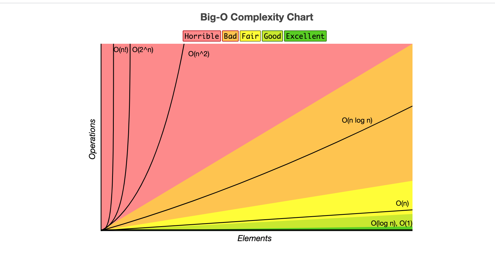

<h1 align="center"><a href="https://leetcode.com/problemset/algorithms/">CS_BASICS</a></h1>

<h5 align="center"><a href="https://www.bigocheatsheet.com/">pic_source</a></h5>

 

- Algorithm 
- Data Structure
- Network
- Linux basics 
- Database 
- System design 

## Resource

* [Resource.md](./doc/Resource.md) - `Resource` for coding interview (**keep updating**)
* [ref.md](./doc/ref.md) - Leetcode ref
* [MindMapCodeInterview](./doc/cheatsheet/mind_map_code_interview.png) - Mind map for coding interview 
* [CodeInterviewCheatsheet](./doc/cheatsheet/code_interview_cheatsheet.pdf) - Coding interview cheetsheet
* [repl.it](https://repl.it/) - Coding online!
* Visualization
	- [visualgo - DFS / BFS](https://visualgo.net/en/dfsbfs?slide=1) - DFS, BFS visualization
	- [visualgo - linkedlist](https://visualgo.net/en/list) - Linkedlist visualization
	- [visualgo - BST](https://visualgo.net/bn/bst) - binary search tree visualization
	- [toptal-sorting-algorithms](https://www.toptal.com/developers/sorting-algorithms)- sorting algorithms online 
* [How to: Work at Google](https://www.youtube.com/watch?v=XKu_SEDAykw) — Example Coding/Engineering Interview
* [bit_manipulation.md](./doc/bit_manipulation.md) - Bit Manipulation Cheet Sheet
* [Py TimeComplexity](https://wiki.python.org/moin/TimeComplexity) - Python TimeComplexity doc
* [Py data model](https://docs.python.org/3/reference/datamodel.html) - Python data model doc 
* [SQL exercises](https://www.w3resource.com/sql-exercises/) - w3resource SQL exercises
* [SQL tutorial](https://mode.com/sql-tutorial/) - mode.com sql tutorial
* [SQL zoo](https://sqlzoo.net/) - SQL test
* [Books](https://github.com/yennanliu/data_science_repo/tree/master/book)
* [freecodecamp - data-structures](https://www.freecodecamp.org/news/tag/data-structures/)
* [LC interview-experience](https://leetcode.com/discuss/interview-experience?currentPage=1&orderBy=hot&query=)
* [Cheatsheet](https://github.com/yennanliu/CS_basics/tree/master/doc/cheatsheet)
* LC Pattern
	- [LC pattern @ blind](https://www.teamblind.com/post/New-Year-Gift---Curated-List-of-Top-100-LeetCode-Questions-to-Save-Your-Time-OaM1orEU) : Curated-List-of-Top-100-LeetCode-Questions-to-Save-Your-Time
	- [Blind Curated 75](https://leetcode.com/list/xoqag3yj/)
	- [LC Algorithm Problem Classification](https://www.programcreek.com/2013/08/leetcode-problem-classification/)
	- [leetcode-patterns](https://github.com/SeanPrashad/leetcode-patterns)
	- [14-patterns-to-ace-any-coding-interview-question](https://hackernoon.com/14-patterns-to-ace-any-coding-interview-question-c5bb3357f6ed)
	- [grokking-the-coding-interview](https://www.educative.io/courses/grokking-the-coding-interview)
* LC problems
	- [leetcode_company_V1](https://github.com/yennanliu/CS_basics/tree/master/doc/leetcode_company_V1)
	- [leetcode_company_V1](./doc/leetcode_company_V2.md)
	- [leetcode_classics_collection](./doc/leetcode_classics_collection.md)
	- [leetcode_classics_collection_extra](./doc/leetcode_classics_collection_extra.md)

## Algorithms content

* [Bit Manipulation](https://github.com/yennanliu/CS_basics#bit-manipulation)
* [Array](https://github.com/yennanliu/CS_basics#array)
* [String](https://github.com/yennanliu/CS_basics#string)
* [Linked List](https://github.com/yennanliu/CS_basics#linked-list)
* [Stack](https://github.com/yennanliu/CS_basics#stack)
* [Queue](https://github.com/yennanliu/CS_basics#queue)
* [Heap](https://github.com/yennanliu/CS_basics#heap)
* [Tree](https://github.com/yennanliu/CS_basics#tree)
* [Hash Table](https://github.com/yennanliu/CS_basics#hash-table)
* [Math](https://github.com/yennanliu/CS_basics#math)
* [Two Pointers](https://github.com/yennanliu/CS_basics#two-pointers)
* [Sort](https://github.com/yennanliu/CS_basics#sort)
* [Recursion](https://github.com/yennanliu/CS_basics#recursion)
* [Binary Search](https://github.com/yennanliu/CS_basics#binary-search)
* [Binary Search Tree](https://github.com/yennanliu/CS_basics#binary-search-tree)
* [Breadth-First Search](https://github.com/yennanliu/CS_basics#breadth-first-search)
* [Depth-First Search](https://github.com/yennanliu/CS_basics#depth-first-search)
* [Backtracking](https://github.com/yennanliu/CS_basics#backtracking)
* [Dynamic Programming](https://github.com/yennanliu/CS_basics#dynamic-programming)
* [Greedy](https://github.com/yennanliu/CS_basics#greedy)
* [Graph](https://github.com/yennanliu/CS_basics#graph)
* [Geometry](https://github.com/yennanliu/CS_basics#geometry)
* [Simulation](https://github.com/yennanliu/CS_basics#simulation)
* [Design](https://github.com/yennanliu/CS_basics#Design)
* [Concurrency](https://github.com/yennanliu/CS_basics#Concurrency)

## Database

* [SQL](https://github.com/yennanliu/CS_basics#sql)

## Shell

* [Shell Script](https://github.com/yennanliu/CS_basics#shell-script)

 

# Progress 
## Data Structure basic
|  #  | Title | Solution | Use case | Comment | Status|
| --- | ----- | -------- | ---- | ----- | ---- |
||Queue| [Python ](./data_structure/python/queue2.py), [JS](./data_structure/js/queue.js) | | | AGAIN*|
||Stack| [Python ](./data_structure/python/stack.py), [JS stack (via linkedlist)](./data_structure/js/stack_linkedlist.js), [JS - stack (via array)](./data_structure/js/stack_array.js) | | | OK|
||LinkedList| [Python](./data_structure/python/linkedList.py), [JS](./data_structure/js/linkedlist.js) | | | OK**|
||Doubly LinkedList| [Python](./data_structure/python/doublylinkedlist.py), [JS](./data_structure/js/doublylinkedList.js) | | | AGAIN|
||Tree| [Python ](./data_structure/python/tree.py) | | | AGAIN**|
||Trie| [Python ](./data_structure/python/trie.py) | | | AGAIN|
||Heap| [Python ](./data_structure/python/heap.py), [Java](./algorithm/java/BinaryHeap.java) | | | AGAIN|
||Array| [Python ](./data_structure/python/array.py) | | | AGAIN*|
||Graph| [Python ](./data_structure/python/graph.py), [JS](./data_structure/js/graph.js). [Java-graph](./algorithm/java/Graph.java), [Java-graph-client](./algorithm/java/GraphClient.java) | | | OK***|
||Binary search Tree (BST)| [Python](./data_structure/python/binary_search_tree.py), [JS](./data_structure/js/binary_search_tree.js), [Scala](./data_structure/scala/binarySearch.scala), [Java](./data_structure/java/BST.java) | | | AGAIN| 
||Hash table| [Python](./data_structure/python/hash_table.py), [JS](./data_structure/js/hash_table.js) | usually for improving `time complexity B(O)` via extra space complexity (time-space tradeoff)|`good basic`| AGAIN****| 
||DirectedEdge|  [Java](./data_structure/java/DirectedEdge.java) | | | AGAIN|

## Algorithm basic
|  #  | Title | Solution | Use case | Comment | Status|
| --- | ----- | -------- | ---- | ----- | ---- |
||Binary search|[Python](./algorithm/python/binary_search.py) | | | AGAIN| 
||Linear search|[Python](./algorithm/python/linear_search.py) | | | AGAIN| 
||Breadth-first search (BFS)| [Python](./algorithm/python/bfs.py), [JS](./algorithm/js/bfs.js)|`FIND SHORTEST PATH`|| AGAIN***| 
||Depth-first search (DFS) |[Python](./algorithm/python/dfs.py), [JS](./algorithm/js/dfs.js)| `TO CHECK IF SOMETHING EXIST`| `inorder`, `postorder`, `postorder (can recreate a tree)`| AGAIN***| 
||Bubble sort| [Python](./algorithm/python/bubble_sort.py), [JS](./algorithm/js/bubble_sort.js) , [C](./algorithm/c/bubble_sort.c)| | | OK* (3)|  
||Insertion sort| [Python](./algorithm/python/insertion_sort.py), [JS](./algorithm/js/insertion_sort.js) |`stable` sort| work very fast for `nearly sorted` array|AGAIN| 
||Bucket sort| [Python](./algorithm/python/bucket_sort.py)  | | |AGAIN| 
||Quick sort| [Python](./algorithm/python/quick_sort.py)| | | AGAIN***| 
||Heap sort| [Python](./algorithm/python/heap_sort.py)| | | AGAIN**| 
||Merge sort|[Python](./algorithm/python/merge_sort.py), [JS](./algorithm/js/merge_sort.js), [Java](./algorithm/java/MergeSort.java)  | | | OK* (2)| 
||Pancake sort| [Python](./algorithm/python/pancake_sort.py) | | | AGAIN| 
||Selection sort| [Python](./algorithm/python/selection_sort.py), [JS](./algorithm/js/selection_sort.js) | | | AGAIN| 
||Topological sort| [Python](./algorithm/python/topological_sort.py) | | `Redraw` `DAG` so all edges point upwards (DAG : directed acyclic graph) | AGAIN| 
||md5 | [Python](./algorithm/python/md5.py) | | | AGAIN| 
||Union Find | [Python union find](./algorithm/python/union_find.py), [Python union find check cyclic](./algorithm/python/union_find_if_cyclic.py) | | | AGAIN| 
||Dynamic programming|[JS demo 1](./algorithm/js/dp_demo_1.js), [fibonacci_dp JS](./algorithm/js/fibonacci_dp.js) | | | AGAIN|
||Dijkstra algorithm|[Python](./algorithm/python/dijkstra.py),[Java](./algorithm/java/DijkstraSP.java)||| AGAIN***|
||Quick Find |[Python](./algorithm/python/quick_find.py), [Java](./algorithm/java/QuickFindUF.java) | init : O(N), union : O(N), find : O(1)|simple, but slow |AGAIN| 
||Quick Union | [Java](./algorithm/java/QuickUnionUF.java) | init : O(N), union : O(N), find : O(N)| lazy approach, route compression, optimized Quick Find|AGAIN| 
||Quick Union (Improvements) || lazy approach, path compression|AGAIN| 
||Priority Queue (`unsorted`) | [Java](./algorithm/java/UnorderedMaxPQ.java) | AGAIN| 

## Array 
|  #  | Title           |  Solution       |  Time           | Space           | Difficulty    | Note           | Status| 
|-----|---------------- | --------------- | --------------- | --------------- | ------------- |--------------|-----|
015 | [3 Sum](https://leetcode.com/problems/3sum/) |  [Python](./leetcode_python/Array/3sum.py) | _O(n^2)_ | _O(1)_  | Medium    | check with `# 001 Two Sum`, `#018 4 sum`, `Two Pointers`, `good basic`,`amazon`,`fb`| OK*** (4)
016 | [3 Sum Closest](https://leetcode.com/problems/3sum-closest/) | [Python](./leetcode_python/Array/3sum-closest.py) | _O(n^2)_   | _O(1)_  | Medium |`Two Pointers`, `basic`, `good trick`,`3 sum`,amazon| AGAIN**** (2)
018| [4 Sum](https://leetcode.com/problems/4sum/) | [Python](./leetcode_python/Array/4sum.py)   | _O(n^3)_  | _O(1)_    | Medium  | `k sum`, `Two Pointers`, check `#016 3 sum`, `good trick`, `fb` | AGAIN***** (3)
026 | [Remove Duplicates from Sorted Array](https://leetcode.com/problems/remove-duplicates-from-sorted-array/)|  [Python](./leetcode_python/Array/remove-duplicates-from-sorted-array.py), [Scala](./leetcode_scala/Array/removeDuplicates.scala) | _O(n)_ | _O(1)_| Easy | `Two Pointers`, `basic`, `good trick`,`M$` ,`fb` |  AGAIN********* (6)
027 | [Remove Element](https://leetcode.com/problems/remove-element/) | [Python](./leetcode_python/Array/remove-element.py), [Scala](./leetcode_scala/Array/removeElement.scala) | _O(n)_  | _O(1)_ | Easy  |`basic`, `amazon`| OK* (2) 
031 | [Next Permutation](https://leetcode.com/problems/next-permutation/)| [Python](./leetcode_python/Array/next-permutation.py),  [Scala](./leetcode_scala/Array/nextPermutation.scala)| _O(n)_ | _O(1)_ | Medium | `good TRICK`,, `google`,`amazon`, `fb` | AGAIN******** (5) (not start)
048 | [Rotate Image](https://leetcode.com/problems/rotate-image/)   | [Python](./leetcode_python/Array/rotate-image.py) | _O(n^2)_ | _O(1)_| Medium  |`trick`, `basic`, `transpose matrix`, `amazon`| OK** (2)
054 | [Spiral Matrix](https://leetcode.com/problems/spiral-matrix/) |  [Python](./leetcode_python/Array/spiral-matrix.py) | _O(m * n)_  | _O(1)_ | Medium |matrix,`amazon`| AGAIN** (2)
057 | [Insert Interval](https://leetcode.com/problems/insert-interval/) |  [Python](./leetcode_python/Array/insert-interval.py) |  |  | Medium | blind LC pattern, `056 	Merge Intervals`|  OK*  (1)
059 | [Spiral Matrix II](https://leetcode.com/problems/spiral-matrix-ii/) |  [Python](./leetcode_python/Array/spiral-matrix-ii.py) | _O(n^2)_ | _O(1)_ | Medium |check `# 054 Spiral Matrix`, `amazon`| AGAIN** (2)
066 | [Plus One](https://leetcode.com/problems/plus-one/)      |  [Python](./leetcode_python/Array/plus-one.py)| _O(n)_   | _O(1)_ | Easy |`basic`, `digit`, `google`| OK** (2)
073 | [Set Matrix Zeroes](https://leetcode.com/problems/set-matrix-zeroes/) |  [Python](./leetcode_python/Array/set-matrix-zeroes.py)  | _O(m * n)_ | _O(1)_ | Medium  |`matrix`, `amazon`| OK* (2)
080 | [Remove Duplicates from Sorted Array II](https://leetcode.com/problems/remove-duplicates-from-sorted-array-ii/)|  [Python](./leetcode_python/Array/remove-duplicates-from-sorted-array-ii.py)  | _O(n)_ | _O(1)_ | Medium  |`two pointers`,AGAIN, `basic`, `trick`, `fb`, `#26 Remove Duplicates from Sorted Array`| AGAIN********* (4)
118 | [Pascal's Triangle](https://leetcode.com/problems/pascals-triangle/)| [Python](./leetcode_python/Array/pascals-triangle.py)  | _O(n^2)_ | _O(1)_  | Easy  |`trick`, `basic`| AGAIN** (2) 
119 | [Pascal's Triangle II](https://leetcode.com/problems/pascals-triangle-ii/)| [Python](./leetcode_python/Array/pascals-triangle-ii.py) | _O(n^2)_ | _O(1)_  | Easy  |array, check with `# 118 Pascal's Triangle`, `amazon`| OK** (2)
121 | [Best Time to Buy and Sell Stock](https://leetcode.com/problems/best-time-to-buy-and-sell-stock/)| [Python](./leetcode_python/Array/best-time-to-buy-and-sell-stock.py) | _O(n)_ | _O(1)_ | Easy |`dp`,`basic`,`greedy`,`UBER`, `M$`, `amazon`, `fb`| OK** (4)
157 | [Read N Characters Given Read4](https://leetcode.com/problems/read-n-characters-given-read4/) |  [Python](./leetcode_python/Array/read-n-characters-given-read4.py) | _O(n)_ | _O(1)_ | Easy |🔒, `google`, `amazon`, `fb`| AGAIN**** (2)
163 | [Missing Ranges](https://leetcode.com/problems/missing-ranges/)| [Python](./leetcode_python/Array/missing-ranges.py) | _O(n)_  | _O(1)_ | Medium    | two pointer, 🔒, `google interview` | AGAIN** (3)
169 | [Majority Element](https://leetcode.com/problems/majority-element/) |[Python](./leetcode_python/Array/majority-element.py) | _O(n)_ | _O(1)_ | Easy || OK*
189 | [Rotate Array](https://leetcode.com/problems/rotate-array/)   | [Python](./leetcode_python/Array/rotate-array.py) | _O(n)_ | _O(1)_  | Easy |good basic, `amazon`| OK* (3)
209 | [Minimum Size Subarray Sum](https://leetcode.com/problems/minimum-size-subarray-sum/) | [Python](./leetcode_python/Array/minimum-size-subarray-sum.py) | _O(n)_ | _O(1)_ | Medium | good basic, sliding window, `Binary Search`, `trick`,`2 pointers`, `fb` | AGAIN******** (4)
215 | [Kth Largest Element in an Array](https://leetcode.com/problems/kth-largest-element-in-an-array/) | [Python](./leetcode_python/Array/kth-largest-element-in-an-array.py) | _O(n)_ ~ _O(n^2)_ | _O(1)_ |  Medium | EPI, `quick sort`, `amazon`,`fb`| OK* 
228 | [Summary Ranges](https://leetcode.com/problems/summary-ranges/) | [Python](./leetcode_python/Array/summary-ranges.py) | _O(n)_ | _O(1)_ | Medium |check `# 163 Missing Ranges`, `basic`, array, `google`| OK*** (3) 
229 | [Majority Element II](https://leetcode.com/problems/majority-element-ii/) | [Python](./leetcode_python/Array/majority-element-ii.py)  | _O(n)_ | _O(1)_ | Medium  || OK 
238 | [Product of Array Except Self](https://leetcode.com/problems/product-of-array-except-self/) | [Python](./leetcode_python/Array/product-of-array-except-self.py)  | _O(n)_ | _O(1)_ | Medium  | LintCode, `trick`, `Apple`, `M$`, `amazon`, `fb`| AGAIN***** (3)
240 | [Search a 2D Matrix II](https://leetcode.com/problems/search-a-2d-matrix-ii/) |  [Python](./leetcode_python/Array/search-a-2d-matrix-ii.py)  | _O(m + n)_ | _O(1)_ | Medium   | EPI, LintCode, `basic`, `matrix`, `trick`, `binary search`, check `# 74 Search a 2D Matrix`, `amazon`| AGAIN** (2)
243| [Shortest Word Distance](https://leetcode.com/problems/shortest-word-distance/)  | [Python](./leetcode_python/Array/shortest-word-distance.py)  | _O(n)_ |  _O(1)_ | Easy |🔒, `basic`| OK*
245| [Shortest Word Distance III](https://leetcode.com/problems/shortest-word-distance-iii/) | [Python](./leetcode_python/Array/shortest-word-distance-iii.py)  | _O(n)_ |  _O(1)_ | Medium  |🔒, check `Shortest Word Distance I II III`| OK*
251| [Flatten 2D Vector](https://leetcode.com/problems/flatten-2d-vector/) | [Python](./leetcode_python/Array/flatten-2d-vector.py)  | _O(1)_ |  _O(1)_ | Medium  |🔒, `basic`, `trick`, `queue`, check`# 341 Flatten Nested List Iterator`, `google`, `airbnb`, `twitter`, `amazon`| AGAIN****** (3)
277| [Find the Celebrity](https://leetcode.com/problems/find-the-celebrity/) | [Python](./leetcode_python/Array/find-the-celebrity.py)  | _O(n)_ |  _O(1)_ | Medium  |🔒,`rool`, `fb`, `trick`| OK****** (4)
289| [Game of Life](https://leetcode.com/problems/game-of-life/) | [Python](./leetcode_python/Array/game-of-life.py)  | _O(m * n)_ |  _O(1)_ | Medium  |simultaneous,matrix,`complex`, `google`, `amazon`| AGAIN*** (3)
293| [Flip Game](https://leetcode.com/problems/flip-game/) | [Python](./leetcode_python/Array/flip-game.py) | _O(n * (c+1))_ | _O(1)_ | Easy |🔒, `basic`| AGAIN*
311| [Sparse Matrix Multiplication](https://leetcode.com/problems/sparse-matrix-multiplication/) | [Python](./leetcode_python/Array/sparse-matrix-multiplication.py)   | _O(m * n * l)_ |  _O(m * l)_ | Medium |🔒, matrix, `basic`, `fb`|  OK** (2)
334| [Increasing Triplet Subsequence](https://leetcode.com/problems/increasing-triplet-subsequence/) | [Python](./leetcode_python/Array/increasing-triplet-subsequence.py) | _O(n)_ |  _O(1)_ | Medium |AGAIN, check `# 300 Longest Increasing Subsequence`, `trick`, `fb`, variables|OK***** (but again) (4)
370| [Range Addition](https://leetcode.com/problems/range-addition/) | [Python](./leetcode_python/Array/range-addition.py) | _O(k + n)_ |  _O(1)_ | Medium  |🔒, check `# 598 Range Addition II`| AGAIN (not start)
384| [Shuffle an Array](https://leetcode.com/problems/shuffle-an-array/) | [Python](./leetcode_python/Array/shuffle-an-array.py)  | _O(n)_ |  _O(n)_ | Medium   | EPI, `trick` | OK*
396| [Rotate Function](https://leetcode.com/problems/rotate-function/) | [Python](./leetcode_python/Array/rotate-function.py) | _O(n)_ |  _O(1)_ | Easy |math, `trick`, `amazon`| AGAIN** (2)
412| [Fizz Buzz](https://leetcode.com/problems/fizz-buzz/) | [Python](./leetcode_python/Array/fizz-buzz.py), [Scala](./leetcode_scala/Array/fizzBuzz.scala)| _O(n)_ |  _O(1)_ | Easy || OK 
414| [Third Maximum Number](https://leetcode.com/problems/third-maximum-number/) | [Python](./leetcode_python/Array/third-maximum-number.py) | _O(n)_ |  _O(1)_ | Easy |`good basic`, `amazon`| OK* (3)
419| [Battleships in a Board](https://leetcode.com/problems/battleships-in-a-board/) | [Python](./leetcode_python/Array/battleships-in-a-board.py)   | _O(m * n)_ |  _O(1)_ | Medium || AGAIN*
422| [Valid Word Square](https://leetcode.com/problems/valid-word-square/) | [Python](./leetcode_python/Array/valid-word-square.py)  | _O(m * n)_ |  _O(1)_ | Easy |🔒, `basic`, `matrix`| AGAIN*
442| [Find All Duplicates in an Array](https://leetcode.com/problems/find-all-duplicates-in-an-array/) | [Python](./leetcode_python/Array/find-all-duplicates-in-an-array.py) | _O(n)_ |  _O(1)_ | Medium || OK*
448| [Find All Numbers Disappeared in an Array](https://leetcode.com/problems/find-all-numbers-disappeared-in-an-array/) | [Python](./leetcode_python/Array/find-all-numbers-disappeared-in-an-array.py)| _O(n)_ |  _O(1)_ | Easy || OK 
531 | [Lonely Pixel I](https://leetcode.com/problems/lonely-pixel-i/) |  [Python](./leetcode_python/Array/lonely-pixel-i.py) | _O(m * n)_ | _O(m + n)_ | Medium | 🔒, `matrix`, `basic`| AGAIN*
533 | [Lonely Pixel II](https://leetcode.com/problems/lonely-pixel-ii/) | [Python](./leetcode_python/Array/lonely-pixel-ii.py)  | _O(m * n)_ | _O(m * n)_ | Medium  |🔒| AGAIN (not start*)
565 | [Array Nesting](https://leetcode.com/problems/array-nesting/) | [Python](./leetcode_python/Array/array-nesting.py) | _O(n)_ | _O(1)_ | Medium  || AGAIN (not start)
566 | [Reshape the Matrix](https://leetcode.com/problems/reshape-the-matrix/) | [Python](./leetcode_python/Array/reshape-the-matrix.py) | _O(m * n)_ | _O(m * n)_ | Easy |`basic`, `matrix`| AGAIN**
581 | [Shortest Unsorted Continuous Subarray](https://leetcode.com/problems/shortest-unsorted-continuous-subarray/) | [Python](./leetcode_python/Array/shortest-unsorted-continuous-subarray.py) | _O(n)_ | _O(1)_ | Easy  |`basic`| AGAIN*
605 | [Can Place Flowers](https://leetcode.com/problems/can-place-flowers/) | [Python](./leetcode_python/Array/can-place-flowers.py) | _O(n)_ | _O(1)_ | Easy |`pass vs continue`| OK*
624 | [Maximum Distance in Arrays](https://leetcode.com/problems/maximum-distance-in-arrays/) | [Python](./leetcode_python/Array/maximum-distance-in-arrays.py) | _O(n)_ | _O(1)_ | Easy | 🔒 | AGAIN*
643 | [Maximum Average Subarray I](https://leetcode.com/problems/maximum-average-subarray-i/) | [Python](./leetcode_python/Array/maximum-average-subarray-i.py) | _O(n)_ | _O(1)_ | Easy | `Math`, `basic` |  AGAIN*
661| [Image Smoother](https://leetcode.com/problems/image-smoother/) | [Python](./leetcode_python/Array/image-smoother.py)  | _O(m * n)_ |  _O(1)_ | Easy   |`matrix`,`basic`,`DL`, `amazon`| OK*** (3)
665| [Non-decreasing Array](https://leetcode.com/problems/non-decreasing-array/) | [Python](./leetcode_python/Array/non-decreasing-array.py) | _O(n)_ |  _O(1)_ | Easy || AGAIN (not start)
667| [Beautiful Arrangement II](https://leetcode.com/problems/beautiful-arrangement-ii/) |  [Python](./leetcode_python/Array/beautiful-arrangement-ii.py)  | _O(n)_ |  _O(1)_ | Medium  || AGAIN (not start)
670| [Maximum Swap](https://leetcode.com/problems/maximum-swap/) | [Python](./leetcode_python/Array/maximum-swap.py)| _O(logn)_ |  _O(logn)_ | Medium |`good basic`, AGAIN, reversed, str -> list, `fb`| AGAIN** (3)
674 | [Longest Continuous Increasing Subsequence](https://leetcode.com/problems/longest-continuous-increasing-subsequence/) | [Python](./leetcode_python/Array/longest-continuous-increasing-subsequence.py)  | _O(n)_ | _O(1)_ | Easy |`good basic`,`dp`,`2 pointers` ,`array` ,`fb`| OK*** (5)
697| [Degree of an Array](https://leetcode.com/problems/degree-of-an-array/) | [Python](./leetcode_python/Array/degree-of-an-array.py) | _O(n)_ | _O(n)_ | Easy || AGAIN (not start)
713 | [Subarray Product Less Than K](https://leetcode.com/problems/subarray-product-less-than-k/) | [Python](./leetcode_python/Array/subarray-product-less-than-k.py) | _O(n)_ | _O(1)_ | Medium |`basic`, `sliding window`| AGAIN*
717 | [1-bit and 2-bit Characters](https://leetcode.com/problems/1-bit-and-2-bit-characters/) | [Python](./leetcode_python/Array/1-bit-and-2-bit-characters.py) | _O(n)_ | _O(1)_ | Easy | Greedy |  AGAIN (not start)
723 | [Candy Crush](https://leetcode.com/problems/candy-crush/) | [Python](./leetcode_python/Array/candy-crush.py) | _O((R * C)^2)_ | _O(1)_ | Medium |`complex`| AGAIN (not start)
724 | [Find Pivot Index](https://leetcode.com/problems/find-pivot-index/) | [Python](./leetcode_python/Array/find-pivot-index.py)  | _O(n)_ | _O(1)_ | Easy || OK*
729 | [My Calendar I](https://leetcode.com/problems/my-calendar-i/) |  [Python](./leetcode_python/Array/my-calendar-i.py) | _O(nlogn)_ | _O(n)_ | Medium |`python class`| AGAIN* (not start)
731 | [My Calendar II](https://leetcode.com/problems/my-calendar-ii/) | [Python](./leetcode_python/Array/my-calendar-ii.py) | _O(n^2)_ | _O(n)_ | Medium |`trick`, `basic`| AGAIN** (not start)
747 | [Largest Number At Least Twice of Others](https://leetcode.com/problems/largest-number-at-least-twice-of-others/) | [Python](./leetcode_python/Array/largest-number-at-least-twice-of-others.py) | _O(n)_ | _O(1)_ | Easy |`good basic`, `data structure`| OK* 
755 | [Pour Water](https://leetcode.com/problems/pour-water/) | [Python](./leetcode_python/Array/pour-water.py) | _O(v * n)_ | _O(1)_ | Medium |`complex`| AGAIN (not start)
766 | [Toeplitz Matrix](https://leetcode.com/problems/toeplitz-matrix/) | [Python](./leetcode_python/Array/toeplitz-matrix.py)  | _O(m * n)_ | _O(1)_ | Easy |`basic`, `matrix`, `google`| AGAIN* (2)
769 | [Max Chunks To Make Sorted](https://leetcode.com/problems/max-chunks-to-make-sorted/) | [Python](./leetcode_python/Array/max-chunks-to-make-sorted.py) | _O(n)_ | _O(1)_ | Medium || AGAIN** (not start)
792 | [Number of Matching Subsequences](https://leetcode.com/problems/number-of-matching-subsequences/) | [Python](./leetcode_python/Array/number-of-matching-subsequences.py) | _O(n + w)_ | _O(1)_ | Medium |`trick`| AGAIN* (not start)
794 | [Valid Tic-Tac-Toe State](https://leetcode.com/problems/valid-tic-tac-toe-state/) | [Python](./leetcode_python/Array/valid-tic-tac-toe-state.py) | _O(1)_ | _O(1)_ | Medium |`complex`| AGAIN 
795 | [Number of Subarrays with Bounded Maximum](https://leetcode.com/problems/number-of-subarrays-with-bounded-maximum/) | [Python](./leetcode_python/Array/number-of-subarrays-with-bounded-maximum.py) | _O(n)_ | _O(1)_ | Medium || AGAIN (not start*)
807 | [Max Increase to Keep City Skyline](https://leetcode.com/problems/max-increase-to-keep-city-skyline/) |  [Python](./leetcode_python/Array/max-increase-to-keep-city-skyline.py) | _O(n^2)_ | _O(n)_ | Medium || AGAIN*
821 | [Shortest Distance to a Character](https://leetcode.com/problems/shortest-distance-to-a-character/) | [Python](./leetcode_python/Array/shortest-distance-to-a-character.py) | _O(n)_ | _O(1)_ | Easy |`basic`, `trick`| AGAIN** 
830 | [Positions of Large Groups](https://leetcode.com/problems/positions-of-large-groups/) | [Python](./leetcode_python/Array/positions-of-large-groups.py) | _O(n)_ | _O(1)_ | Easy |`basic`| AGAIN*
832 | [Flipping an Image](https://leetcode.com/problems/flipping-an-image/) | [Python](./leetcode_python/Array/flipping-an-image.py) | _O(n^2)_ | _O(1)_ | Easy || AGAIN*
835 | [Image Overlap](https://leetcode.com/problems/image-overlap/) | [Python](./leetcode_python/Array/image-overlap.py) | _O(n^4)_ | _O(n^2)_ | Medium || AGAIN (not start)
840 | [Magic Squares In Grid](https://leetcode.com/problems/magic-squares-in-grid/) | [Python](./leetcode_python/Array/magic-squares-in-grid.py) | _O(m * n)_ | _O(1)_ | Easy |`complex`| AGAIN (not start)
842 | [Split Array into Fibonacci Sequence](https://leetcode.com/problems/split-array-into-fibonacci-sequence/) | [Python](./leetcode_python/Array/split-array-into-fibonacci-sequence.py) | _O(n^3)_ | _O(n)_ | Medium |check `# 306 Addictive Number`, `basic`, `dfs`, `fibonacci`| AGAIN* (not start)
845 | [Longest Mountain in Array](https://leetcode.com/problems/longest-mountain-in-array/) | [Python](./leetcode_python/Array/longest-mountain-in-array.py) | _O(n)_ | _O(1)_ | Medium |`basic`, `trick`| AGAIN* (not start) 
849 | [Maximize Distance to Closest Person](https://leetcode.com/problems/maximize-distance-to-closest-person/) | [Python](./leetcode_python/Array/maximize-distance-to-closest-person.py) | _O(n)_ | _O(1)_ | Easy |`basic`, `trick`| AGAIN (not start*)
860 | [Lemonade Change](https://leetcode.com/problems/lemonade-change/) | [Python](./leetcode_python/Array/lemonade-change.py) | _O(n)_ | _O(1)_ | Easy |amazon| OK* (2)
0868 | [Transpose Matrix](https://leetcode.com/problems/transpose-matrix/) | [Python](./leetcode_python/Array/transpose-matrix.py) | _O(r * c)_ | _O(1)_ | Easy |`basic`| OK*
885 | [Spiral Matrix III](https://leetcode.com/problems/spiral-matrix-iii/) | [Python](./leetcode_python/Array/spiral-matrix-iii.py) | _O(max(m, n)^2)_ | _O(1)_ | Medium  |`basic`| AGAIN* (not start)
888 | [Fair Candy Swap](https://leetcode.com/problems/fair-candy-swap/) | [Python](./leetcode_python/Array/fair-candy-swap.py) | _O(m + n)_ | _O(m + n)_ | Easy |`basic`, `trick`| OK*
896 | [Monotonic Array](https://leetcode.com/problems/monotonic-array/) | [Python](./leetcode_python/Array/monotonic-array.py) | _O(n)_ | _O(1)_   | Easy  |`all`,`array` ,`fb`| OK
905 | [Sort Array By Parity](https://leetcode.com/problems/sort-array-by-parity/) | [Python](./leetcode_python/Array/sort-array-by-parity.py) | _O(n)_ | _O(1)_    | Easy  |`sort by lambda`| OK
909 | [Snakes and Ladders](https://leetcode.com/problems/snakes-and-ladders/) | [Python](./leetcode_python/Array/snakes-and-ladders.py)| _O(n^2)_ | _O(n^2)_ | Medium  |`complex`| AGAIN (not start)
915 | [Partition Array into Disjoint Intervals](https://leetcode.com/problems/partition-array-into-disjoint-intervals/) | [Python](./leetcode_python/Array/partition-array-into-disjoint-intervals.py) | _O(n)_ | _O(n)_ | Medium   |`basic`, `trick`| AGAIN* (not start)
918 | [Maximum Sum Circular Subarray](https://leetcode.com/problems/maximum-sum-circular-subarray/) |  [Python](./leetcode_python/Array/maximum-sum-circular-subarray.py)  | _O(n)_ | _O(1)_ | Medium |check `# 053 Maximum Subarray`, `basic`, `trick`| AGAIN* (not start)
921 | [Minimum Add to Make Parentheses Valid](https://leetcode.com/problems/minimum-add-to-make-parentheses-valid/) | [Python](./leetcode_python/Array/minimum-add-to-make-parentheses-valid.py) | _O(n)_ | _O(1)_  | Medium |`basic`, `trick`| AGAIN** 
922 | [Sort Array By Parity II](https://leetcode.com/problems/sort-array-by-parity-ii/) | [Python](./leetcode_python/Array/sort-array-by-parity-ii.py) | _O(n)_ | _O(1)_  | Easy |`basic`| AGAIN* 
923 | [3Sum With Multiplicity](https://leetcode.com/problems/3sum-with-multiplicity/) | [Python](./leetcode_python/Array/3sum-with-multiplicity.py)  | _O(n^2)_ | _O(n)_  | Medium  || AGAIN (not start)
932 | [Beautiful Array](https://leetcode.com/problems/beautiful-array/) | [Python](./leetcode_python/Array/beautiful-array.py) | _O(n)_ | _O(n)_  | Medium |`basic`, `trick`| AGAIN (not start)
941 | [Valid Mountain Array](https://leetcode.com/problems/valid-mountain-array/) | [Python](./leetcode_python/Array/valid-mountain-array.py)  | _O(n)_ | _O(1)_  | Easy  |`basic`, `good basic`| AGAIN* 
945 | [Minimum Increment to Make Array Unique](https://leetcode.com/problems/minimum-increment-to-make-array-unique/) | [Python](./leetcode_python/Array/minimum-increment-to-make-array-unique.py) | _O(nlogn)_ | _O(n)_    | Medium |`trick`, `good`| AGAIN** 
947 | [Most Stones Removed with Same Row or Column](https://leetcode.com/problems/most-stones-removed-with-same-row-or-column/) | [Python](./leetcode_python/Array/most-stones-removed-with-same-row-or-column.py) | _O(n)_ | _O(n)_   | Medium   | Union Find , `trick`| AGAIN (not start)
949 | [Largest Time for Given Digits](https://leetcode.com/problems/largest-time-for-given-digits/) | [Python](./leetcode_python/Array/largest-time-for-given-digits.py) | _O(1)_ | _O(1)_  | Easy || OK* 
950 | [Reveal Cards In Increasing Order](https://leetcode.com/problems/reveal-cards-in-increasing-order/) | [Python](./leetcode_python/Array/reveal-cards-in-increasing-order.py) | _O(n)_ | _O(n)_  | Medium  || AGAIN (not start)
954 | [Array of Doubled Pairs](https://leetcode.com/problems/array-of-doubled-pairs/) | [Python](./leetcode_python/Array/array-of-doubled-pairs.py) | _O(n + klogk)_ | _O(k)_  | Medium |`counter`, `dict`, `trick`| AGAIN** 
961 | [N-Repeated Element in Size 2N Array](https://leetcode.com/problems/n-repeated-element-in-size-2n-array/) | [Python](./leetcode_python/Array/n-repeated-element-in-size-2n-array.py)  | _O(n)_ | _O(1)_  | Easy  || OK 
004 | [Median of Two Sorted Arrays](https://leetcode.com/problems/median-of-two-sorted-arrays/) | | _O(n)_ | _O(1)_  | Hard |`fb`, amazon|  
010 | [Regular Expression Matching](https://leetcode.com/problems/regular-expression-matching/) | | _O(n)_ | _O(1)_  | Hard |`fb`|  
056 | [Merge Intervals](https://leetcode.com/problems/merge-intervals/) |  [Python](./leetcode_python/Array/merge-intervals.py)  | _O(n)_ | _O(1)_  | Medium |`good trick`,`twitter`,`M$`,`UBER`,`google`,`amazon`,`fb`| AGAIN******* (3) 
498 | [Diagonal Traverse](https://leetcode.com/problems/diagonal-traverse/) | [Python](./leetcode_python/Array/diagonal_traverse.py) | _O(n)_ | _O(1)_  | Medium |`matrix`,`google`,`fb`| AGAIN*** (3) (not start)
1014 | [Best Sightseeing Pair](https://leetcode.com/problems/best-sightseeing-pair/) | [Python](./leetcode_python/Array/best_sightseeing_pair.py) | | | Medium |dp, array, good basic, Spotify| AGAIN (not start)
287|[Find the Duplicate Number](https://leetcode.com/problems/find-the-duplicate-number/) | [Python](./leetcode_python/Array/find_the_duplicate_number.py) | | | Medium |good trick,binary search, cycle linked list, check `# 142 Linked List Cycle II`, `amazon`| AGAIN**** (not start)

## Hash Table 
|  #  | Title           |  Solution       |  Time           | Space           | Difficulty    | Status          | Note| 
|-----|---------------- | --------------- | --------------- | --------------- | ------------- |--------------|-----|
001| [Two Sum](https://leetcode.com/problems/two-sum/)| [Python](./leetcode_python/Hash_table/two-sum.py), [Java](./leetcode_java/hash-table/twoSum.java),[Scala](./leetcode_scala/Hash_table/twoSum.scala)     | _O(n)_| _O(n)_ | Easy |`good basic`, `hash table`, `apple`, `amazon`, `UBER`, `grab`, `fb`| OK* (but again)
003| [Longest Substring Without Repeating Characters](https://leetcode.com/problems/longest-substring-without-repeating-characters/) | [Python ](./leetcode_python/Hash_table/longest-substring-without-repeating-characters.py)  | _O(n)_ | _O(1)_ | Medium |`good trick`, `hash table`,`apple`,`amazon`,`fb`| AGAIN***** (3)
036| [Valid Sudoku](https://leetcode.com/problems/valid-sudoku/) | [Python ](./leetcode_python/Hash_table/valid-sudoku.py) | _O(9^2)_ | _O(9)_ | Easy  |`UBER`, `apple`, `amazon`| OK* 
049| [Group Anagrams](https://leetcode.com/problems/group-anagrams/)  | [Python](./leetcode_python/Hash_table/group-anagrams.py), [Scala](./leetcode_scala/Hash_table/group-anagrams.scala) | _O(n * glogg)_ | _O(n)_   | Medium |`good basic`, `trick`,`dict + sort`, `UBER`, `amazon`, `fb`| AGAIN*** (3)
170| [Two Sum III - Data structure design](https://leetcode.com/problems/two-sum-iii-data-structure-design/) | [Python ](./leetcode_python/Hash_table/two-sum-iii-data-structure-design.py)  | _O(n)_ | _O(n)_ | Easy | 🔒, `trick`,`good basic`, `linkedin`, `fb`| OK*** (4) 
187| [Repeated DNA Sequences](https://leetcode.com/problems/repeated-dna-sequences/) |  [Python ](./leetcode_python/Hash_table/repeated-dna-sequences.py)  | _O(n)_ | _O(n)_| Medium |`basic`,`trick`,`set`, `linkedin`| AGAIN**
202| [Happy Number](https://leetcode.com/problems/happy-number/) | [Python ](./leetcode_python/Hash_table/happy-number.py)   | _O(k)_  | _O(k)_  | Easy |`twitter`,`airbnb`, `UBER`| AGAIN** (3)
204| [Count Primes](https://leetcode.com/problems/count-primes/)  | [Python ](./leetcode_python/Hash_table/count-primes.py)  | _O(n)_  | _O(n)_   | Easy   |`basic`, `trick`, `M$`, `amazon`| AGAIN**** (3)
205| [Isomorphic Strings](https://leetcode.com/problems/isomorphic-strings/) | [Python ](./leetcode_python/Hash_table/isomorphic-strings.py)  | _O(n)_ | _O(1)_  | Easy  |`basic`, `trick`, `bloomberg`|  AGAIN**
217| [Contains Duplicate](https://leetcode.com/problems/contains-duplicate/)  | [Python ](./leetcode_python/Hash_table/contains-duplicate.py) | _O(n)_    | _O(n)_  | Easy  |`yahoo`, `airbnb`| OK 
219| [Contains Duplicate II](https://leetcode.com/problems/contains-duplicate-ii/)  | [Python ](./leetcode_python/Hash_table/contains-duplicate-ii.py) | _O(n)_  | _O(n)_  | Easy   |`basic`, `trick`, `hash table`| AGAIN*
244| [Shortest Word Distance II](https://leetcode.com/problems/shortest-word-distance-ii/) | [Python ](./leetcode_python/Hash_table/shortest-word-distance-ii.py) | ctor: _O(n)_, lookup: _O(a + b)_ | _O(n)_ | Medium |🔒| AGAIN (not start*)
246| [Strobogrammatic Number](https://leetcode.com/problems/strobogrammatic-number/) | [Python ](./leetcode_python/Hash_table/strobogrammatic-number.py)  | _O(n)_ | _O(1)_ | Easy  |🔒, `google`, `fb` | OK* (4)
249| [Group Shifted Strings](https://leetcode.com/problems/group-shifted-strings/) | [Python ](./leetcode_python/Hash_table/group-shifted-strings.py)  | _O(nlogn)_ | _O(n)_ | Easy |🔒,`apple`, `UBER`, `google` | AGAIN* (4) (not start)
266| [Palindrome Permutation](https://leetcode.com/problems/palindrome-permutation/) | [Python ](./leetcode_python/Hash_table/palindrome-permutation.py) | _O(n)_ |  _O(1)_ | Easy |🔒| OK 
288| [Unique Word Abbreviation](https://leetcode.com/problems/unique-word-abbreviation/) | [Python ](./leetcode_python/Hash_table/unique-word-abbreviation.py) | ctor: _O(n)_, lookup: _O(1)_ | _O(k)_ | Medium |🔒, ?, google| AGAIN (2)(not start)
290| [Word Pattern](https://leetcode.com/problems/word-pattern/) | [Python ](./leetcode_python/Hash_table/word-pattern.py)  | _O(n)_ | _O(c)_ | Easy | `basic`, chcek `# 205 Isomorphic Strings`,`good basic`, `for ptn, word in zip(pattern, words)`, `dropbox` , `UBER`| AGAIN* (3)
299| [Bulls and Cows](https://leetcode.com/problems/bulls-and-cows/) | [Python ](./leetcode_python/Hash_table/bulls-and-cows.py)   | _O(n)_ | _O(1)_ | Easy   |`trick`,`map(operator.eq, a, b)`,`amazon`, `airbnb`, `google`| AGAIN*  (3)
314| [Binary Tree Vertical Order Traversal](https://leetcode.com/problems/binary-tree-vertical-order-traversal/) |  [Python ](./leetcode_python/Hash_table/binary-tree-vertical-order-traversal.py)  | _O(n)_ | _O(n)_| Medium  | 🔒, `BFS`,`DFS`,`hash table`, `tree`, `trick`,`google`, `amazon`,`fb` | OK****  (5)
323| [Number of Connected Components in an Undirected Graph](https://leetcode.com/problems/number-of-connected-components-in-an-undirected-graph/) | [Python ](./leetcode_python/Hash_table/number-of-connected-components-in-an-undirected-graph.py) | _O(n)_ | _O(n)_| Medium  | 🔒 , Union Find, `graph`, `linkedin` |  AGAIN (not start)
325| [Maximum Size Subarray Sum Equals k](https://leetcode.com/problems/maximum-size-subarray-sum-equals-k/) | [Python ](./leetcode_python/Hash_table/maximum-size-subarray-sum-equals-k.py)  | _O(n)_ | _O(n)_|  Medium  | 🔒, `basic`, `good trick`, `dict`, `fb`| AGAIN********** (5)
356| [Line Reflection](https://leetcode.com/problems/line-reflection/) |  [Python ](./leetcode_python/Hash_table/line-reflection.py)  | _O(n)_| _O(n)_| Medium |🔒, Hash, Two Pointers,`math`,`google`| AGAIN (not start)
387| [First Unique Character in a String](https://leetcode.com/problems/first-unique-character-in-a-string/) |  [Python ](./leetcode_python/Hash_table/first-unique-character-in-a-string.py) | _O(n)_| _O(n)_| Easy |`amazon`, `apple`, `fb`| OK 
388| [Longest Absolute File Path](https://leetcode.com/problems/longest-absolute-file-path/) | [Python ](./leetcode_python/Hash_table/longest-absolute-file-path.py) | _O(n)_| _O(d)_| Medium |hash table, Stack, `google`| AGAIN** (1)
409| [Longest Palindrome](https://leetcode.com/problems/longest-palindrome/) | [Python ](./leetcode_python/Hash_table/longest-palindrome.py) | _O(n)_| _O(1)_| Easy || OK* 
424| [Longest Repeating Character Replacement](https://leetcode.com/problems/longest-repeating-character-replacement/) | [Python ](./leetcode_python/Hash_table/longest-repeating-character-replacement.py) | _O(n)_| _O(1)_| Medium |`silding window`, `two pointers`, `good trick`| AGAIN*** (3) 
438| [Find All Anagrams in a String](https://leetcode.com/problems/find-all-anagrams-in-a-string/) | [Python ](./leetcode_python/Hash_table/find-all-anagrams-in-a-string.py) | _O(n)_ | _O(1)_ | Easy |`trick`, `AGAIN`, `sliding window`,`acc Counter`,`amazon`,`fb`| AGAIN******** (5)
447| [Number of Boomerangs](https://leetcode.com/problems/number-of-boomerangs/) | [Python ](./leetcode_python/Hash_table/number-of-boomerangs.py) | _O(n^2)_ | _O(n)_ | Easy |`trick`, `google`| AGAIN (3) (not start)
454| [4Sum II](https://leetcode.com/problems/4sum-ii/) | [Python ](./leetcode_python/Hash_table/4sum-ii.py)  | _O(n^2)_ | _O(n^2)_ | Medium | `trick`, `basic`, `amazon`| AGAIN**
470| [Implement Rand10() Using Rand7()](https://leetcode.com/problems/implement-rand10-using-rand7/) |  [Python ](./leetcode_python/Hash_table/implement-rand10-using-rand7.py)  | _O(1)_  | _O(1)_  | Medium  |`trick`, `google`| AGAIN** (3)
473| [Matchsticks to Square](https://leetcode.com/problems/matchsticks-to-square/) |  [Python ](./leetcode_python/Hash_table/matchsticks-to-square.py)  | _O(n * s * 2^n)_  | _O(n * (2^n + s))_  | Medium  |`complex`,`hard`| AGAIN (not start)
523| [Continuous Subarray Sum](https://leetcode.com/problems/continuous-subarray-sum/) | [Python ](./leetcode_python/Hash_table/continuous-subarray-sum.py) | _O(n)_  | _O(k)_ | Medium |check `# 560 Subarray Sum Equals K`,`good trick`,`substring`, `hash table`,`AGAIN`,`M$`,`fb`| AGAIN********* (5)
532| [K-diff Pairs in an Array](https://leetcode.com/problems/k-diff-pairs-in-an-array/) | [Python ](./leetcode_python/Hash_table/k-diff-pairs-in-an-array.py)  | _O(n)_ | _O(n)_ | Easy |`basic`, `collections.Counter()`,`a-b =k -> a = k + b `, `amazon`| AGAIN** (3)
554| [Brick Wall](https://leetcode.com/problems/brick-wall/) | [Python ](./leetcode_python/Hash_table/brick-wall.py) | _O(n)_ | _O(m)_ | Medium  |`trick`,`hash map`, `bloomberg`, `fb` | OK***** (but again)(5)
560| [Subarray Sum Equals K](https://leetcode.com/problems/subarray-sum-equals-k/) | [Python ](./leetcode_python/Hash_table/subarray-sum-equals-k.py) | _O(n)_ | _O(n)_ | Medium | `must check`,check `# 523 Continuous Subarray Sum`,`basic`, `substring`,`good trick`,`google`,`fb`| AGAIN********* (4)
561| [Array Partition I](https://leetcode.com/problems/array-partition-i/) | [Python ](./leetcode_python/Hash_table/array-partition-i.py) | _O(r)_ | _O(r)_ | Easy  | | OK 
575| [Distribute Candies](https://leetcode.com/problems/distribute-candies/) | [Python ](./leetcode_python/Hash_table/distribute-candies.py)  | _O(n)_ | _O(n)_ | Easy  | | OK 
594| [Longest Harmonious Subsequence](https://leetcode.com/problems/longest-harmonious-subsequence/) | [Python ](./leetcode_python/Hash_table/longest-harmonious-subsequence.py) | _O(n)_ | _O(n)_ | Easy | `basic`, `good trick`| OK* (3)
599| [Minimum Index Sum of Two Lists](https://leetcode.com/problems/minimum-index-sum-of-two-lists/) | [Python ](./leetcode_python/Hash_table/minimum-index-sum-of-two-lists.py) | _O((m + n) * l)_ | _O(m * l)_ | Easy   | `yelp`| OK* 
609| [Find Duplicate File in System](https://leetcode.com/problems/find-duplicate-file-in-system/) | [Python ](./leetcode_python/Hash_table/find-duplicate-file-in-system.py) | _O(n * l)_ | _O(n * l)_ | Medium  | `collections.defaultdict(list)`, `dropbox`| OK* 
721| [Accounts Merge](https://leetcode.com/problems/accounts-merge/) | [Python ](./leetcode_python/Hash_table/accounts-merge.py) | _O(nlogn)_ | _O(n)_| Medium | `Union Find`,`path compression`, `complex`, `fb`| AGAIN** (4) (not start)
734| [Sentence Similarity](https://leetcode.com/problems/sentence-similarity/) | [Python ](./leetcode_python/Hash_table/sentence-similarity.py) | _O(n + p)_ | _O(p)_| Easy |good basic, graph, `hash table`,`collections.defaultdict(set)` ,`google`| OK*** (3)
737| [Sentence Similarity II](https://leetcode.com/problems/sentence-similarity-ii/) | [Python ](./leetcode_python/Hash_table/sentence-similarity-ii.py) | _O(n + p)_ | _O(p)_| Medium | trickm, DFS, Union Find, `complex`,check `# 734 Sentence Similarity`, `google`| AGAIN** (2)
748 | [Shortest Completing Word](https://leetcode.com/problems/shortest-completing-word/) |  [Python ](./leetcode_python/Hash_table/shortest-completing-word.py) | _O(n)_ | _O(1)_ | Easy |`collections.Counter`, `hash table`,`google`| AGAIN* (3)
760 | [Find Anagram Mappings](https://leetcode.com/problems/find-anagram-mappings/) | [Python ](./leetcode_python/Hash_table/find-anagram-mappings.py)  | _O(n)_ | _O(n)_ | Easy |`basic`, `collections.defaultdict`| OK
771 | [Jewels and Stones](https://leetcode.com/problems/jewels-and-stones/) | [Python ](./leetcode_python/Hash_table/jewels-and-stones.py)  | _O(m + n)_ | _O(n)_ | Easy |`amazon`| OK (2) 
811 | [Subdomain Visit Count](https://leetcode.com/problems/subdomain-visit-count/) | [Python ](./leetcode_python/Hash_table/subdomain-visit-count.py)  | _O(n)_ | _O(n)_ | Easy |`indeed`, `bloomberg`| AGAIN (not start)
822 | [Card Flipping Game](https://leetcode.com/problems/card-flipping-game/) | [Python ](./leetcode_python/Hash_table/card-flipping-game.py)  | _O(n)_ | _O(n)_ | Medium |`good basic`| AGAIN* (3)
825 | [Friends Of Appropriate Ages](https://leetcode.com/problems/friends-of-appropriate-ages/) | [Python ](./leetcode_python/Hash_table/friends-of-appropriate-ages.py)  | _O(a^2 + n)_ | _O(a)_ | Medium |`good basic`,`counter`,`AGAIN`,`fb`| AGAIN***** (5)
869 | [Reordered Power of 2](https://leetcode.com/problems/reordered-power-of-2/) | [Python ](./leetcode_python/Hash_table/reordered-power-of-2.py)  | _O(1)_ | _O(1)_ | Medium |`trick`,`basic`, `bit manipulation`, `bit`| AGAIN*
873 | [Length of Longest Fibonacci Subsequence](https://leetcode.com/problems/length-of-longest-fibonacci-subsequence/) | [Python ](./leetcode_python/Hash_table/length-of-longest-fibonacci-subsequence.py)  | _O(n^2)_ | _O(n)_ | Medium |`trick`, `DP`, `Fibonacci`, `set`| AGAIN**
957 | [Prison Cells After N Days](https://leetcode.com/problems/prison-cells-after-n-days/) | [Python ](./leetcode_python/Hash_table/prison-cells-after-n-days.py) | _O(1)_ | _O(1)_ | Medium |`trick`, `DP`, `mod`| AGAIN (not start)
966 | [Vowel Spellchecker](https://leetcode.com/problems/vowel-spellchecker/) | [Python ](./leetcode_python/Hash_table/vowel-spellchecker.py) | _O(n)_ | _O(w)_ | Medium |`trick`, `dict`, `set`| AGAIN (not start)
974| [Subarray Sums Divisible by K](https://leetcode.com/problems/subarray-sums-divisible-by-k/)|[Python ](./leetcode_python/Hash_table/subarray-sums-divisible-by-k.py)  | _O(n)_ | _O(k)_ | Medium  | variant of `# 560 Subarray Sum Equals K` , `trick`, `basic`|  AGAIN** (3) (not start)
463| [Island Perimeter](https://leetcode.com/problems/island-perimeter/)|[Python ](./leetcode_python/Hash_table/island_perimeter.py)  | _O(n)_ | _O(k)_ | Medium |`basic`,`hash table`, `google`, `fb`| OK** (1)
657| [Robot Return to Origin](https://leetcode.com/problems/robot-return-to-origin/)|[Python ](./leetcode_python/Array/rebot_return_to_origin.py)  ||| Easy |`amazon`| OK (2)

## Linked list 
|  #  | Title           |  Solution       |  Time           | Space           | Difficulty    | Note          | Status| 
|-----|---------------- | --------------- | --------------- | --------------- | ------------- |--------------|-----|
002| [Add Two Numbers](https://leetcode.com/problems/add-two-numbers/) | [Python](./leetcode_python/Linked_list/add-two-numbers.py) | _O(n)_   | _O(1)_  | Medium | check `# 445 Add Two Numbers II`, `basic`, `linked list`, `airbnb`, `amazon`, `fb`| OK* (but again)  
021| [Merge Two Sorted Lists](https://leetcode.com/problems/merge-two-sorted-lists/)| [Python](./leetcode_python/Linked_list/merge-two-sorted-lists.py) | _O(n)_ | _O(1)_ | Easy |`UBER`, `amazon`, `apple`, `fb`| OK** (3)(but again)
024| [Swap Nodes in Pairs](https://leetcode.com/problems/swap-nodes-in-pairs/)| [Python](./leetcode_python/Linked_list/swap-nodes-in-pairs.py)  | _O(n)_ | _O(1)_ | Easy  |`GOOD basic`, `good linked list basic`,`UBER`,`amazon`, `fb`| AGAIN********** (4)
061| [Rotate List](https://leetcode.com/problems/rotate-list/)| [Python](./leetcode_python/Linked_list/rotate-list.py)  | _O(n)_          | _O(1)_  | Medium   |`basic`|  AGAIN (2)
082| [Remove Duplicates from Sorted List II](https://leetcode.com/problems/remove-duplicates-from-sorted-list-ii/)| [Python](./leetcode_python/Linked_list/remove-duplicates-from-sorted-list-ii.py) | _O(n)_       | _O(1)_ | Medium |check `# 083 Remove Duplicates from Sorted List`| AGAIN (2)
083| [Remove Duplicates from Sorted List](https://leetcode.com/problems/remove-duplicates-from-sorted-list/)| [Python](./leetcode_python/Linked_list/remove-duplicates-from-sorted-list.py)| _O(n)_       | _O(1)_ | Easy  |`basic`| OK*  
092| [Reverse Linked List II](https://leetcode.com/problems/reverse-linked-list-ii/)| [Python](./leetcode_python/Linked_list/reverse-linked-list-ii.py) | _O(n)_  | _O(1)_  | Medium  |chck `# 206 Reverse Linked List`, `trick`|  AGAIN*** (3)
138| [Copy List with Random Pointer](https://leetcode.com/problems/copy-list-with-random-pointer/) | [Python](./leetcode_python/Linked_list/copy-list-with-random-pointer.py)  | _O(n)_   | _O(1)_          | Medium  |linked list,,`hash table`,`UBER`, `M$`, `amazon`, `fb`| AGAIN*** (5)
160| [Intersection of Two Linked Lists](https://leetcode.com/problems/intersection-of-two-linked-lists/)| [Python](./leetcode_python/Linked_list/intersection-of-two-linked-lists.py) | _O(m + n)_ | _O(1)_  | Easy  |`airbnb`, `amazon`,`fb`| OK*** (4)
203| [Remove Linked List Elements](https://leetcode.com/problems/remove-linked-list-elements/)| [Python](./leetcode_python/Linked_list/remove-linked-list-elements.py) |  _O(n)_  | _O(1)_| Easy  |linked list basic,`amazon`| AGAIN** (2)
206| [Reverse Linked List](https://leetcode.com/problems/reverse-linked-list/)| [Python](./leetcode_python/Linked_list/reverse-linked-list.py) | _O(n)_  | _O(1)_ | Easy  |`good basic`,`amazon`,`fb`| OK*** (4)
234| [Palindrome Linked List](https://leetcode.com/problems/palindrome-linked-list/)|[Python](./leetcode_python/Linked_list/palindrome-linked-list.py)| _O(n)_ | _O(1)_| Easy|linked list,`amazon`,`fb`| OK* (3) 
237| [Delete Node in a Linked List](https://leetcode.com/problems/delete-node-in-a-linked-list/)| [Python](./leetcode_python/Linked_list/delete-node-in-a-linked-list.py)| _O(1)_       | _O(1)_         | Easy         | LintCode | AGAIN 
328| [Odd Even Linked List](https://leetcode.com/problems/odd-even-linked-list/)|[Python](./leetcode_python/Linked_list/odd-even-linked-list.py) | _O(n)_  | _O(1)_   | Medium    |`basic` | OK** (2)
369| [Plus One Linked List](https://leetcode.com/problems/plus-one-linked-list/)| [Python](./leetcode_python/Linked_list/plus-one-linked-list.py) | _O(n)_  | _O(1)_ | Medium | 🔒, `basic`, `trick` | AGAIN* (2)
445| [Add Two Numbers II](https://leetcode.com/problems/add-two-numbers-ii/)| [Python](./leetcode_python/Linked_list/add-two-numbers-ii.py) | _O(m + n)_ | _O(m + n)_| Medium  |`trick`, linked list, string,`good basic`, `amazon`| AGAIN*** (3)
725 | [Split Linked List in Parts](https://leetcode.com/problems/split-linked-list-in-parts/) | [Python](./leetcode_python/Linked_list/split-linked-list-in-parts.py)  | _O(n + k)_ | _O(1)_ | Medium |linked list, good,`amazon`| AGAIN***** (2)
817 | [Linked List Components](https://leetcode.com/problems/linked-list-components/) | [Python](./leetcode_python/Linked_list/linked-list-components.py)  | _O(m + n)_ | _O(m)_ | Medium || OK* 
430 | [Flatten a Multilevel Doubly Linked List](https://leetcode.com/problems/flatten-a-multilevel-doubly-linked-list/) | [Python](./leetcode_python/Linked_list/flatten_a_multilevel_doubly_linked_list.py)  |  || Medium |`good trick`,`doubly linked list`,`AGAIN`,`dfs`, `fb`|  AGAIN********* (4)
708| [Insert into a Cyclic Sorted List](https://leetcode.com/problems/insert-into-a-sorted-circular-linked-list) |  [python](./leetcode_python/Linked_list/insert_into_a_cyclic_sorted_sist.py)  | _O(n)_ | _O(h)_ | Medium|`AGAIN`,`cyclic linked list`,`good trick`, `google`, `amazon`, `fb` |  AGAIN******** (4)
023| [Merge k sorted lists](https://leetcode.com/problems/merge-k-sorted-lists/) |  [python](./leetcode_python/Linked_list/merge-k-sorted-lists.py)  | _O(n)_ | _O(h)_ | Hard|linked list, check `#21 Merge Two Sorted Lists`, `amazon` | AGAIN* (not start)

## Stack 
|  #  | Title           |  Solution       |  Time           | Space           | Difficulty    | Note | Status | 
|-----|---------------- | --------------- | --------------- | --------------- | ------------- |--------------|-----|
020| [Valid Parentheses](https://leetcode.com/problems/valid-parentheses/)| [Python](./leetcode_python/Stack/valid-parentheses.py) | _O(n)_ | _O(n)_ | Easy |`good basic`,`fb`, `amazon`| OK** (3) 
071| [Simplify Path](https://leetcode.com/problems/simplify-path/)|  [Python](./leetcode_python/Stack/simplify-path.py) | _O(n)_ | _O(n)_ | Medium |`basic`, `stack`, `amazon`,`fb`| OK* (4)
101| [Symmetric Tree](https://leetcode.com/problems/symmetric-tree/)| [Python](./leetcode_python/Stack/symmetric-tree.py) | _O(n)_ | _O(h)_ | Easy |`good basic`,`bfs`, `dfs`, `linkedin`, `M$`,`amazon`, `fb`| AGAIN** (3) 
150| [Evaluate Reverse Polish Notation](https://leetcode.com/problems/evaluate-reverse-polish-notation/)|  [Python](./leetcode_python/Stack/evaluate-reverse-polish-notation.py) | _O(n)_| _O(n)_| Medium |stack, good trick,`amazon`| OK**** (3)
155| [Min Stack](https://leetcode.com/problems/min-stack/)     | [Python](./leetcode_python/Stack/min-stack.py)  | _O(n)_ | _O(1)_  | Easy |basic, `amazon`| AGAIN* (2)
173| [Binary Search Tree Iterator](https://leetcode.com/problems/binary-search-tree-iterator/)| [python](./leetcode_python/Stack/binary-search-tree-iterator.py) | _O(1)_| _O(h)_| Medium |`good basic`,`M$`, `linkedin`, `google`,`amazon`,`fb`| OK*** (3)
227| [Basic Calculator II](https://leetcode.com/problems/basic-calculator-ii/) |[python](./leetcode_python/Stack/basic-calculator-ii.py)| _O(n)_| _O(n)_| Medium |`basic`,`trick`,`stack`,`airbnb` ,`fb`| AGAIN****** (3)
232| [Implement Queue using Stacks](https://leetcode.com/problems/implement-queue-using-stacks/) | [python](./leetcode_python/Stack/implement-queue-using-stacks.py) | _O(1), amortized_| _O(n)_| Easy | stack, stack-queue, EPI, LintCode, `amazon`| OK** (2) 
255| [Verify Preorder Sequence in Binary Search Tree](https://leetcode.com/problems/verify-preorder-sequence-in-binary-search-tree/) | [python](./leetcode_python/Stack/verify-preorder-sequence-in-binary-search-tree.py) | _O(n)_| _O(1)_| Medium |🔒| AGAIN (not start)
331| [Verify Preorder Serialization of a Binary Tree](https://leetcode.com/problems/verify-preorder-serialization-of-a-binary-tree/) | [python](./leetcode_python/Stack/verify-preorder-serialization-of-a-binary-tree.py) | _O(n)_| _O(1)_| Medium || AGAIN (not start)
341| [Flatten Nested List Iterator](https://leetcode.com/problems/flatten-nested-list-iterator/)|  [python](./leetcode_python/Stack/flatten-nested-list-iterator.py) | _O(n)_ | _O(h)_ | Medium |🔒 Iterator, `good basic`,`amazon`,`fb***` | AGAIN**** (5)
385| [Mini Parser](https://leetcode.com/problems/mini-parser/)| [python](./leetcode_python/Stack/mini-parser.py) | _O(n)_        | _O(h)_          | Medium           || AGAIN 
394| [Decode String](https://leetcode.com/problems/decode-string/)| [python](./leetcode_python/Stack/decode-string.py) | _O(n)_  | _O(h)_ | Medium     |`stack good basics`,good basic, `amazon`, `google`| AGAIN***** (2) 
439| [Ternary Expression Parser](https://leetcode.com/problems/ternary-expression-parser/) | [python](./leetcode_python/Stack/ternary-expression-parser.py)| _O(n)_          | _O(1)_          | Medium      |🔒| AGAIN (not start)
456| [132 Pattern](https://leetcode.com/problems/132-pattern/) |  [python](./leetcode_python/Stack/132-pattern.py) | _O(n)_       | _O(n)_          | Medium       || AGAIN (not start)
636| [Exclusive Time of Functions](https://leetcode.com/problems/exclusive-time-of-functions/) |  [python](./leetcode_python/Stack/exclusive-time-of-functions.py)   | _O(n)_  | _O(n)_ | Medium |`trick`,`AGAIN`,`stack`,`UBER`, `fb`|  AGAIN********** (4)
682| [Baseball Game](https://leetcode.com/problems/baseball-game/) | [python](./leetcode_python/Stack/baseball-game.py)  | _O(n)_  | _O(n)_         | Easy|good basic, stack,`amazon`| OK* (3)
735| [Asteroid Collision](https://leetcode.com/problems/asteroid-collision/) | [python](./leetcode_python/Stack/asteroid-collision.py)  | _O(n)_  | _O(n)_      | Medium      || AGAIN 
739| [Daily Temperatures](https://leetcode.com/problems/daily-temperatures/) | [python](./leetcode_python/Stack/daily-temperatures.py)  | _O(n)_  | _O(n)_ | Medium |AGAIN, stack, good trick,`amazon`| AGAIN****** (4) 
853| [Car Fleet](https://leetcode.com/problems/car-fleet/)  | [python](./leetcode_python/Stack/car-fleet.py) | _O(nlogn)_  | _O(n)_      | Medium       || AGAIN (not start)
856| [Score of Parentheses](https://leetcode.com/problems/score-of-parentheses/) | [python](./leetcode_python/Stack/score-of-parentheses.py) | _O(n)_  | _O(1)_   | Medium   || AGAIN (not start)
872| [Leaf-Similar Trees](https://leetcode.com/problems/leaf-similar-trees/) |  [python](./leetcode_python/Stack/leaf-similar-trees.py) | _O(n)_  | _O(h)_         | Easy      || AGAIN* 
901| [Online Stock Span](https://leetcode.com/problems/online-stock-span/) | [python](./leetcode_python/Stack/online-stock-span.py) | _O(n)_  | _O(n)_      | Medium        || AGAIN (not start)
946| [Validate Stack Sequences](https://leetcode.com/problems/validate-stack-sequences/) |  [python](./leetcode_python/Stack/validate-stack-sequences.py)  | _O(n)_  | _O(n)_         | Medium           || AGAIN 

## Tree 
|  #  | Title           |  Solution   |  Time   | Space  | Difficulty    | Note | Status| 
|-----|---------------- | --------------- | --------------- | --------------- | ------------- |--------------|-----|
094 | [Binary Tree Inorder Traversal](https://leetcode.com/problems/binary-tree-inorder-traversal/)  | [python](./leetcode_python/Tree/binary-tree-inorder-traversal.py) | _O(n)_| _O(1)_| Medium   |`good basic`,`Morris Traversal`, `M$`, `fb` | AGAIN**** (3)
144 | [Binary Tree Preorder Traversal](https://leetcode.com/problems/binary-tree-preorder-traversal/) |  [python](./leetcode_python/Tree/binary-tree-preorder-traversal.py)  | _O(n)_| _O(1)_| Medium |`Morris Traversal`| AGAIN 
208 | [Implement Trie (Prefix Tree)](https://leetcode.com/problems/implement-trie-prefix-tree/) | [python](./leetcode_python/Tree/implement-trie-prefix-tree.py) | _O(n)_ | _O(1)_ | Medium |dict tree, trie, `amazon`,`fb`| AGAIN******* (4)
211 | [Add and Search Word - Data structure design](https://leetcode.com/problems/add-and-search-word-data-structure-design/) | [python](./leetcode_python/Tree/add-and-search-word-data-structure-design.py) | _O(min(n, h))_ | _O(min(n, h))_ | Medium |`Trie`, `DFS`, do `# 208 first`,`amazon` ,`fb`| AGAIN*** (not start) (4)
226| [Invert Binary Tree](https://leetcode.com/problems/invert-binary-tree/) |  [python](./leetcode_python/Tree/invert-binary-tree.py) | _O(n)_ | _O(h)_, _O(w)_ | Easy || AGAIN* 
307 | [Range Sum Query - Mutable](https://leetcode.com/problems/range-sum-query-mutable/) | [python](./leetcode_python/Tree/range-sum-query-mutable.py) | ctor: _O(n)_, update: _O(logn)_, query:  _O(logn)_ | _O(n)_ | Medium | LintCode, DFS, Segment Tree, BIT, check `#303 Range Sum Query - Immutable` | AGAIN* (2)(not start)
525| [Contiguous Array](https://leetcode.com/problems/contiguous-array/) |  [python](./leetcode_python/Tree/contiguous-array.py)  | _O(n)_ | _O(n)_ | Medium     | `good basic`, `array`, `hashmap`, `cache`, `AGAIN`, `fb`| AGAIN********* (5)
536 | [Construct Binary Tree from String](https://leetcode.com/problems/construct-binary-tree-from-string/) | [python](./leetcode_python/Tree/construct-binary-tree-from-string.py), [java](./leetcode_java/Tree/construct-binary-tree-from-string.java) | _O(n)_ | _O(h)_ | Medium  | 🔒, `trick`, check `# 606 Construct String from Binary Tree`, `amazon`| AGAIN**** (3) (not start)
538 | [Convert BST to Greater Tree](https://leetcode.com/problems/convert-bst-to-greater-tree/) |  [python](./leetcode_python/Tree/convert-bst-to-greater-tree.py) | _O(n)_ | _O(h)_ | Easy|good basic, dfs, bfs, tree, `amazon`| OK* (2) 
543 | [Diameter of Binary Tree](https://leetcode.com/problems/diameter-of-binary-tree/) | [python](./leetcode_python/Tree/diameter-of-binary-tree.py) | _O(n)_ | _O(h)_ | Easy |`trick`,`google`,`amazon`,`fb`| AGAIN**** (2)
545 | [Boundary of Binary Tree](https://leetcode.com/problems/boundary-of-binary-tree/) | [python](./leetcode_python/Tree/boundary-of-binary-tree.py) | _O(n)_ | _O(h)_ | Medium    |dfs, tree boundary, tree,🔒, `good basic`, `amazon`| AGAIN***** (3) 
548 | [Split Array with Equal Sum](https://leetcode.com/problems/split-array-with-equal-sum/) |[python](./leetcode_python/Tree/split-array-with-equal-sum.py) | _O(n^2)_ | _O(n)_ | Medium    |🔒, `good trick`, `array`| AGAIN*** (2)
563 |[Binary Tree Tilt](https://leetcode.com/problems/binary-tree-tilt/)| [python](./leetcode_python/Tree/binary-tree-tilt.py)| _O(n)_ | _O(n)_ | Easy | | AGAIN 
572 |[Subtree of Another Tree](https://leetcode.com/problems/subtree-of-another-tree/)| [python](./leetcode_python/Tree/subtree-of-another-tree.py) | _O(m * n)_ | _O(h)_ | Easy, tree,good basic, dfs, bfs |`amazon`,`fb`| AGAIN******* (3)
606 |[Construct String from Binary Tree](https://leetcode.com/problems/construct-string-from-binary-tree/)| [python](./leetcode_python/Tree/construct-string-from-binary-tree.py) | _O(n)_ | _O(h)_ | Easy |good basic, tree, dfs, bfs, `amazon`| OK*** (4)
617 |[Merge Two Binary Trees](https://leetcode.com/problems/merge-two-binary-trees/)|[python](./leetcode_python/Tree/merge-two-binary-trees.py) | _O(n)_ | _O(h)_ | Easy | tree, dfs, bfs, `good basic`, `amazon`| AGAIN*** (2)
623 |[Add One Row to Tree](https://leetcode.com/problems/add-one-row-to-tree/)| [python](./leetcode_python/Tree/add-one-row-to-tree.py)| _O(n)_ | _O(h)_ | Medium |`good basic`, `dfs`, `bfs` | AGAIN** (2)
637 |[Average of Levels in Binary Tree](https://leetcode.com/problems/average-of-levels-in-binary-tree/)|  [python](./leetcode_python/Tree/average-of-levels-in-binary-tree.py) | _O(n)_ | _O(h)_ | Easy |`bfs`, `dfs`, `good basic`, `fb`| OK* (3)
652 |[Find Duplicate Subtrees](https://leetcode.com/problems/find-duplicate-subtrees/)| [python](./leetcode_python/Tree/find-duplicate-subtrees.py) | _O(n)_ | _O(n)_ | Medium | AGAIN, good basic,dfs, Hash, `amazon`| AGAIN******* (4)
653 |[Two Sum IV - Input is a BST](https://leetcode.com/problems/two-sum-iv-input-is-a-bst/)| [python](./leetcode_python/Tree/two-sum-iv-input-is-a-bst.py) | _O(n)_ | _O(h)_ | Easy | Two Pointers,`2 sum`,`bfs`, `dfs`,`amazon`,`fb`| OK*** (3)
654 |[Maximum Binary Tree](https://leetcode.com/problems/maximum-binary-tree/)| [python](./leetcode_python/Tree/maximum-binary-tree.py)| _O(n)_ | _O(n)_ | Medium |LintCode, Descending Stack, `good basic` | AGAIN* (2)
655 | [Print Binary Tree](https://leetcode.com/problems/print-binary-tree/) | [python](./leetcode_python/Tree/print-binary-tree.py) | _O(n)_ | _O(h)_ | Medium | | AGAIN* (2) (not start)
662 | [Maximum Width of Binary Tree](https://leetcode.com/problems/maximum-width-of-binary-tree/) | [python](./leetcode_python/Tree/maximum-width-of-binary-tree.py) | _O(n)_ | _O(h)_ | Medium | AGAIN, bfs, dfs, `trick`, `amazon` | AGAIN****** (3)
663 | [Equal Tree Partition](https://leetcode.com/problems/equal-tree-partition/) | [python](./leetcode_python/Tree/equal-tree-partition.py) | _O(n)_ | _O(n)_ | Medium |AGAIN, 🔒 , Hash, tree, dfs ,`trick`, `good trick`, `amazon`| AGAIN******** (4) 
677 | [Map Sum Pairs](https://leetcode.com/problems/map-sum-pairs/) | [python](./leetcode_python/Tree/map-sum-pairs.py) | _O(n)_ | _O(t)_ | Medium |Trie, `trick`, `hard` | AGAIN* (2) (not start)
684 | [Redundant Connection](https://leetcode.com/problems/redundant-connection/) |[python](./leetcode_python/Tree/redundant-connection.py) | _O(n)_ | _O(n)_ | Medium | Union Find, `trick`, `basic` | AGAIN** (2) (not start)
687 | [Longest Univalue Path](https://leetcode.com/problems/longest-univalue-path/) | [python](./leetcode_python/Tree/longest-univalue-path.py) | _O(n)_ | _O(h)_ | Easy |`basic`, dfs, tree, `trick`, `google`| AGAIN** (3)
814 | [Binary Tree Pruning](https://leetcode.com/problems/binary-tree-pruning/) | [python](./leetcode_python/Tree/binary-tree-pruning.py) | _O(n)_ | _O(h)_ | Medium | DFS, `basic` | AGAIN* (2)
863 | [All Nodes Distance K in Binary Tree](https://leetcode.com/problems/all-nodes-distance-k-in-binary-tree/) | [python](./leetcode_python/Tree/all-nodes-distance-k-in-binary-tree.py)  | _O(n)_ | _O(n)_ | Medium | DFS + BFS, `trick`, `hard`, `amazon`| AGAIN***  (3) (not start*)
866 | [Smallest Subtree with all the Deepest Nodes](https://leetcode.com/problems/smallest-subtree-with-all-the-deepest-nodes/) | [python](./leetcode_python/Tree/smallest-subtree-with-all-the-deepest-nodes.py) | _O(n)_ | _O(h)_ | Medium | `DFS`, `trick`, `basic` |AGAIN** (2)
889 | [Construct Binary Tree from Preorder and Postorder Traversal](https://leetcode.com/problems/construct-binary-tree-from-preorder-and-postorder-traversal/) | [python](./leetcode_python/Tree/construct-binary-tree-from-preorder-and-postorder-traversal.py) | _O(n)_ | _O(h)_ | Medium | `DFS`, `stack`, `trick`| AGAIN** (2) (not start*)
897| [Increasing Order Search Tree](https://leetcode.com/problems/increasing-order-search-tree/) |  [python](./leetcode_python/Tree/increasing-order-search-tree.py) | _O(n)_   | _O(h)_   | Easy     | `DFS`, `good basic`,`inorder` |  AGAIN** (2) 
919| [Complete Binary Tree Inserter](https://leetcode.com/problems/complete-binary-tree-inserter/) |  [python](./leetcode_python/Tree/complete-binary-tree-inserter.py) | ctor: _O(n)_   insert: _O(1)_   get_root: _O(1)_   | _O(n)_ | Medium |`bst`| AGAIN**  (2)
938| [Range Sum of BST](https://leetcode.com/problems/range-sum-of-bst/) | [python](./leetcode_python/Tree/range-sum-of-bst.py)  | _O(n)_    | _O(h)_  | Medium   | DFS, check `# 108 Convert Sorted Array to Binary Search Tree`| AGAIN* (2) 
951| [Flip Equivalent Binary Trees](https://leetcode.com/problems/flip-equivalent-binary-trees/) | [python](./leetcode_python/Tree/flip-equivalent-binary-trees.py) | _O(n)_   | _O(h)_ | Medium |  DFS | AGAIN* (2) 
958| [Check Completeness of a Binary Tree](https://leetcode.com/problems/check-completeness-of-a-binary-tree/) |  [python](./leetcode_python/Tree/check-completeness-of-a-binary-tree.py) | _O(n)_  | _O(w)_ | Medium  | `BFS`, `DFS`, `basic` | AGAIN** (2)
965| [Univalued Binary Tree](https://leetcode.com/problems/univalued-binary-tree/) | [python](./leetcode_python/Tree/univalued-binary-tree.py)  | _O(n)_ | _O(h)_ | Easy  | `DFS`, `BFS`, `good basic`| AGAIN** (2)
971| [Flip Binary Tree To Match Preorder Traversal](https://leetcode.com/problems/flip-binary-tree-to-match-preorder-traversal/) |  [python](./leetcode_python/Tree/flip-binary-tree-to-match-preorder-traversal.py)  | _O(n)_  | _O(h)_   | Medium    | DFS, `trick`| AGAIN** (2) (not start)
979| [Distribute Coins in Binary Tree](https://leetcode.com/problems/distribute-coins-in-binary-tree/) |  [python](./leetcode_python/Tree/distribute-coins-in-binary-tree.py)  | _O(n)_          | _O(h)_          | Medium   | DFS, `trick` | AGAIN*** (2)
508| [ Most Frequent Subtree Sum](https://leetcode.com/problems/most-frequent-subtree-sum/) |  [python](./leetcode_python/Tree/most_frequent_subtree_sum.py)  ||| Medium   |tree, good basic,`amazon`| AGAIN*** (1)
297| [ Serialize and Deserialize Binary Tree](https://leetcode.com/problems/serialize-and-deserialize-binary-tree/) |  [python](./leetcode_python/Tree/serialize-and-deserialize-binary-tree.py) ||| Hard |tree, BFS, DFS, dequeue, check `#449 Serialize and Deserialize BST` ,`amazon`|  AGAIN**** (1)
701| [Insert into a Binary Search Tree](https://leetcode.com/problems/insert-into-a-binary-search-tree/) |  [python](./leetcode_python/Tree/insert-into-a-binary-search-tree.py) ||| Medium |good basic, BST, tree, BFS, DFS| OK*** (2)

## Heap 
|  #  | Title           |  Solution       |  Time           | Space           | Difficulty    | Note  | Status| 
|-----|---------------- | --------------- | --------------- | --------------- | ------------- |--------------|-----|
264| [Ugly Number II](https://leetcode.com/problems/ugly-number-ii/) | [python](./leetcode_python/Heap/ugly-number-ii.py)   | _O(n)_ | _O(1)_ | Medium   | CTCI, LintCode , BST, Heap | OK*
313| [Super Ugly Number](https://leetcode.com/problems/super-ugly-number/) | [python](./leetcode_python/Heap/super-ugly-number.py)   | _O(n * k)_ | _O(n + k)_ | Medium     | BST, Heap | AGAIN (not start*)
373 | [Find K Pairs with Smallest Sums](https://leetcode.com/problems/find-k-pairs-with-smallest-sums/) | [python](./leetcode_python/Heap/find-k-pairs-with-smallest-sums.py)  | _O(k * log(min(n, m, k)))_ | _O(min(n, m, k))_ | Medium || AGAIN (not start)
378 | [Kth Smallest Element in a Sorted Matrix](https://leetcode.com/problems/kth-smallest-element-in-a-sorted-matrix/) | [python](./leetcode_python/Heap/kth-smallest-element-in-a-sorted-matrix.py)  | _O(k * log(min(n, m, k)))_ | _O(min(n, m, k))_ | Medium | LintCode | AGAIN (not start)
846 | [Hand of Straights](https://leetcode.com/problems/hand-of-straights/) | [python](./leetcode_python/Heap/hand-of-straights.py) | _O(nlogn)_ | _O(n)_ | Medium || OK*
855 | [Exam Room](https://leetcode.com/problems/exam-room/) | [python](./leetcode_python/Heap/exam-room.py)  | seat: _O(logn)_   leave: _O(logn)_ | _O(n)_ | Medium | BST, Hash, `trick` | AGAIN* (2) (not start)
295 | [Find Median from Data Stream](https://leetcode.com/problems/find-median-from-data-stream/) | [python](./leetcode_python/Heap/find_median_from_data_stream.py)  | | | Hard |trick ,heap, stream, `amazon`|  AGAIN****** (5)
703 | [Kth Largest Element in a Stream](https://leetcode.com/problems/kth-largest-element-in-a-stream/) | [python](./leetcode_python/Heap/kth_largest_element_in_a_stream.py)  | | | Easy |heap, stream, `amazon`|  AGAIN** (2)

## Bit Manipulation 
|  #  | Title           |  Solution       |  Time           | Space           | Difficulty    | Note          | Status| 
|-----|---------------- | --------------- | --------------- | --------------- | ------------- |--------------|-----|
136 | [Single Number](https://leetcode.com/problems/single-number/) | [Python](./leetcode_python/Bit_Manipulation/single-number.py) | _O(n)_ | _O(1)_ | Easy|`airbnb`,`amazon`,`fb`| OK 
137 | [Single Number II](https://leetcode.com/problems/single-number-ii/) | [Python](./leetcode_python/Bit_Manipulation/single-number-ii.py)| _O(n)_ | _O(1)_  | Medium   || OK
190 | [Reverse Bits](https://leetcode.com/problems/reverse-bits/)  |[Python](./leetcode_python/Bit_Manipulation/reverse-bits.py) | _O(1)_        | _O(1)_          | Easy       || AGAIN (not stary)
191  |[Number of 1 Bits](https://leetcode.com/problems/number-of-1-bits/) | [Python](./leetcode_python/Bit_Manipulation/number-of-1-bits.py) | _O(1)_ | _O(1)_          | Easy       || OK* 
201 | [Bitwise AND of Numbers Range](https://leetcode.com/problems/bitwise-and-of-numbers-range/) | [Python](./leetcode_python/Bit_Manipulation/bitwise-and-of-numbers-range.py) | _O(1)_ | _O(1)_ | Medium || AGAIN (not start)
231 | [Power of Two](https://leetcode.com/problems/power-of-two/) | [Python](./leetcode_python/Bit_Manipulation/power-of-two.py)  | _O(1)_ | _O(1)_ | Easy |Bit Manipulation ,`amazon`| OK* (2)
260 | [Single Number III](https://leetcode.com/problems/single-number-iii/) | [Python](./leetcode_python/Bit_Manipulation/single-number-iii.py) | _O(n)_ | _O(1)_ | Medium  |`xor`, `^=`, `^`| AGAIN*
268| [Missing Number](https://leetcode.com/problems/missing-number/) | [Python](./leetcode_python/Bit_Manipulation/missing-number.py) | _O(n)_ |  _O(1)_ | Medium | `xor`,`amazon`,`fb`| OK* (2) 
318| [Maximum Product of Word Lengths](https://leetcode.com/problems/maximum-product-of-word-lengths/) | [Python](./leetcode_python/Bit_Manipulation/maximum-product-of-word-lengths.py) | _O(n)_ ~ _O(n^2)_ |  _O(n)_ | Medium   |Bit Manipulation, Counting Sort, Pruning| AGAIN (not start)
342 | [Power of Four](https://leetcode.com/problems/power-of-four/) | [Python](./leetcode_python/Bit_Manipulation/power-of-four.py) | _O(1)_ | _O(1)_ |Easy |`power of num`| OK* 
371 | [Sum of Two Integers](https://leetcode.com/problems/sum-of-two-integers/) | [Python](./leetcode_python/Bit_Manipulation/sum-of-two-integers.py) | _O(1)_ | _O(1)_ | Easy | `good basic`, `fb`| AGAIN********* (4)(NOT START)
389 | [Find the Difference](https://leetcode.com/problems/find-the-difference/) |  [Python](./leetcode_python/Bit_Manipulation/find-the-difference.py)  | _O(n)_ | _O(1)_ | Easy | | OK 
393 | [UTF-8 Validation](https://leetcode.com/problems/utf-8-validation/) |[Python](./leetcode_python/Bit_Manipulation/utf-8-validation.py)  | _O(n)_ | _O(1)_ | Medium | `utf-8 encoding`, `google`, `fb`| AGAIN**** (not start*) (4)
401 | [Binary Watch](https://leetcode.com/problems/binary-watch/) | [Python](./leetcode_python/Bit_Manipulation/binary-watch.py)  | _O(1)_ | _O(1)_ | Easy | | OK*
421 | [Maximum XOR of Two Numbers in an Array](https://leetcode.com/problems/maximum-xor-of-two-numbers-in-an-array/) | [Python](./leetcode_python/Bit_Manipulation/maximum-xor-of-two-numbers-in-an-array.py) | _O(n)_ | _O(n)_ | Medium || AGAIN (not start)
461 | [Hamming Distance](https://leetcode.com/problems/hamming-distance/) | [Python](./leetcode_python/Bit_Manipulation/hamming-distance.py) | _O(1)_ | _O(1)_ | Easy |`fb`| OK* (2)
462 | [Minimum Moves to Equal Array Elements II](https://leetcode.com/problems/minimum-moves-to-equal-array-elements-ii/) |[Python](./leetcode_python/Bit_Manipulation/minimum-moves-to-equal-array-elements-ii.py) | _O(n)_  on average | _O(1)_ | Medium || AGAIN* 
477 | [Total Hamming Distance](https://leetcode.com/problems/total-hamming-distance/) |[Python](./leetcode_python/Bit_Manipulation/total-hamming-distance.py) | _O(n)_ | _O(1)_ | Medium |bit manipulation, `fb`| AGAIN*** (not start*) (3)
645 | [Set Mismatch](https://leetcode.com/problems/set-mismatch/) | [Python](./leetcode_python/Bit_Manipulation/set-mismatch.py) | _O(n)_ | _O(1)_ | Easy |`amazon`| OK* (2) 
693 | [Binary Number with Alternating Bits](https://leetcode.com/problems/binary-number-with-alternating-bits/) | [Python](./leetcode_python/Bit_Manipulation/binary-number-with-alternating-bits.py) | _O(1)_ | _O(1)_ | Easy |`trick`| AGAIN*
762 | [Prime Number of Set Bits in Binary Representation](https://leetcode.com/problems/prime-number-of-set-bits-in-binary-representation/) |[Python](./leetcode_python/Bit_Manipulation/prime-number-of-set-bits-in-binary-representation.py)  | _O(1)_ | _O(1)_ | Easy |`basic`,`Bit_Manipulation`, `prime number`, `amazon`| OK* (3) 
868 | [Binary Gap](https://leetcode.com/problems/binary-gap/) | [Python](./leetcode_python/Bit_Manipulation/binary-gap.py) | _O(1)_ | _O(1)_ | Easy |`trick`, `linear scan`| AGAIN*
898 | [Bitwise ORs of Subarrays](https://leetcode.com/problems/bitwise-ors-of-subarrays/) | [Python](./leetcode_python/Bit_Manipulation/bitwise-ors-of-subarrays.py) | _O(n)_ | _O(1)_ | Medium || AGAIN (not start)

## String
|  #  | Title           |  Solution       |  Time           | Space        | Difficulty    | Status, Note       | Status| 
|-----|---------------- | --------------- | --------------- | --------------- | ------------- |--------------|-----|
005| [Longest Palindromic Substring](https://leetcode.com/problems/longest-palindromic-substring/) | [python](./leetcode_python/String/longest-palindromic-substring.py)  | _O(n)_ | _O(n)_ |  Medium | `Manacher's Algorithm`, `DP`, `UBER`, `amazon`, `fb` | AGAIN**** (3)
006| [ZigZag Conversion](https://leetcode.com/problems/zigzag-conversion/) |  [python](./leetcode_python/String/zigzag-conversion.py) | _O(n)_ | _O(1)_      | Easy       || AGAIN (not start)
008| [String to Integer (atoi)](https://leetcode.com/problems/string-to-integer-atoi/) | [python](./leetcode_python/String/string-to-integer-atoi.py)  | _O(n)_ | _O(1)_ | Easy|`regular expression`,`UBER`, `amazon`, `fb`| AGAIN*** (3) 
014| [Longest Common Prefix](https://leetcode.com/problems/longest-common-prefix/) |  [python](./leetcode_python/String/longest-common-prefix.py)  | _O(n * k)_   | _O(1)_  | Easy   |`good basic`| OK* 
028| [Implement strStr()](https://leetcode.com/problems/implement-strstr/) |  [python](./leetcode_python/String/implement-strstr.py)  | _O(n + k)_   | _O(k)_  | Easy  | `KMP Algorithm`, `fb` | OK (3) 
038| [Count and Say](https://leetcode.com/problems/count-and-say/) | [python](./leetcode_python/String/count-and-say.py) | _O(n * 2^n)_  | _O(2^n)_ | Easy | `recursion`, `iteration`, basic, `fb`| AGAIN*********** (5)
043| [Multiply Strings](https://leetcode.com/problems/multiply-strings/) | [python](./leetcode_python/String/multiply-strings.py) | _O(m * n)_ | _O(m + n)_  | Medium |`twitter`, `fb`| AGAIN*** (3) 
058| [Length of Last Word](https://leetcode.com/problems/length-of-last-word/) | [python](./leetcode_python/String/length-of-last-word.py)  | _O(n)_   | _O(1)_  | Easy       || OK 
067| [Add Binary](https://leetcode.com/problems/add-binary/)    | [python](./leetcode_python/String/add-binary.py)  | _O(n)_  | _O(1)_   | Easy   | `good basic`, `fb`, `amazon`| OK* (5) (but again)
076| [Minimum Window Substring](https://leetcode.com/problems/minimum-window-substring/)    | [python](./leetcode_python/String/minimum_window_substring.py)  |  |   | Hard   |`blind LC pattern` |  
125| [Valid Palindrome](https://leetcode.com/problems/valid-palindrome/) | [python](./leetcode_python/String/valid-palindrome.py) | _O(n)_  | _O(1)_ | Easy|`amazon`,`fb`| OK 
151| [Reverse Words in a String](https://leetcode.com/problems/reverse-words-in-a-string/) | [python](./leetcode_python/String/reverse-words-in-a-string.py)  | _O(n)_ | _O(1)_ | Medium |`amazon`,`fb`| OK 
161| [One Edit Distance](https://leetcode.com/problems/one-edit-distance/) |  [python](./leetcode_python/String/one-edit-distance.py)  | _O(m + n)_ | _O(1)_  | Medium  |🔒, `fb` | AGAIN**** (3)
165| [Compare Version Numbers](https://leetcode.com/problems/compare-version-numbers/) |  [python](./leetcode_python/String/compare-version-numbers.py) | _O(n)_ | _O(1)_ |Easy|good basic, string,`amazon`| AGAIN* (2) 
186| [Reverse Words in a String II](https://leetcode.com/problems/reverse-words-in-a-string-ii/) | [python](./leetcode_python/String/reverse-words-in-a-string-ii.py) | _O(n)_ | _O(1)_ | Medium   | 🔒, `M$`,`UBER`, `amazon` | AGAIN*  (2)
242| [Valid Anagram](https://leetcode.com/problems/valid-anagram/)| [python](./leetcode_python/String/valid-anagram.py) | _O(n)_ | _O(1)_  | Easy | LintCode,`amazon`,`fb`|OK 
271| [Encode and Decode Strings](https://leetcode.com/problems/encode-and-decode-strings/) | [python](./leetcode_python/String/encode-and-decode-strings.py)  | _O(n)_ | _O(1)_ | Medium |decode-encode, design, check `# 394 Decode String` ,🔒, `google`| AGAIN** (2) 
306| [Addictive Number](https://leetcode.com/problems/additive-number/) | [python](./leetcode_python/String/additive-number.py)  | _O(n^3)_ | _O(n)_ | Medium    | | AGAIN (not start*)
383| [Ransom Note](https://leetcode.com/problems/ransom-note/) |[python](./leetcode_python/String/ransom-note.py) | _O(n)_ | _O(1)_ | Easy   | EPI | OK*
405| [Convert a Number to Hexadecimal](https://leetcode.com/problems/convert-a-number-to-hexadecimal/) | [python](./leetcode_python/String/convert-a-number-to-hexadecimal.py) | _O(n)_ | _O(1)_ | Easy  | `basics` `decimal -> Hexadecimal`| AGAIN 
408| [Valid Word Abbreviation](https://leetcode.com/problems/valid-word-abbreviation/) | [python](./leetcode_python/String/valid-word-abbreviation.py) | _O(n)_ | _O(1)_ | Easy     | 🔒 | AGAIN (not start)
415| [Add Strings](https://leetcode.com/problems/add-strings/) | [python](./leetcode_python/String/add-strings.py)| _O(n)_ | _O(1)_ | Easy   | `basic`, `string add`, `Airbnb`, `google`, `fb`|  OK** (3)
434| [Number of Segments in a String](https://leetcode.com/problems/number-of-segments-in-a-string/) | [python](./leetcode_python/String/number-of-segments-in-a-string.py) | _O(n)_ | _O(1)_ | Easy    | | OK 
443| [String Compression](https://leetcode.com/problems/string-compression/) | [python](./leetcode_python/String/string-compression.py) | _O(n)_ | _O(1)_ | Easy   |`basics`| AGAIN**
459| [Repeated Substring Pattern](https://leetcode.com/problems/repeated-substring-pattern/) | [python](./leetcode_python/String/repeated-substring-pattern.py) | _O(n)_ | _O(n)_ | Easy  | good basic, string, `KMP Algorithm`, `amazon` | OK** (3) 
468| [Validate IP Address](https://leetcode.com/problems/validate-ip-address/) | [python](./leetcode_python/String/validate-ip-address.py) | _O(1)_ | _O(1)_ | Medium  | `ip basic`,`string`,`twitter`, `fb`| AGAIN**** (4)
482| [License Key Formatting](https://leetcode.com/problems/license-key-formatting/) | [python](./leetcode_python/String/license-key-formatting.py) | _O(n)_ | _O(1)_ | Easy |string, basic, `google`| AGAIN* (1)
520| [Detect Capital](https://leetcode.com/problems/detect-capital/) |  [python](./leetcode_python/String/detect-capital.py)  | _O(l)_ | _O(1)_ | Easy    | |  OK 
521| [Longest Uncommon Subsequence I](https://leetcode.com/problems/longest-uncommon-subsequence-i/) | [python](./leetcode_python/String/longest-uncommon-subsequence-i.py) | _O(min(a, b))_ | _O(1)_ | Easy     | | OK* 
522| [Longest Uncommon Subsequence II](https://leetcode.com/problems/longest-uncommon-subsequence-ii/) | [python](./leetcode_python/String/longest-uncommon-subsequence-ii.py)  | _O(l * n^2)_ | _O(1)_ | Medium   |  Sort | AGAIN (not start) 
524| [Longest Word in Dictionary through Deleting](https://leetcode.com/problems/longest-word-in-dictionary-through-deleting/) |  [python](./leetcode_python/String/longest-word-in-dictionary-through-deleting.py)  | _O((d * l)  * logd)_ | _O(1)_ | Medium    | Sort, `google` | AGAIN (not start)
539| [Minimum Time Difference](https://leetcode.com/problems/minimum-time-difference/) | [python](./leetcode_python/String/minimum-time-difference.py) | _O(nlogn)_ | _O(n)_ | Medium  | `basic`, `map & zip trick`| AGAIN**
541| [Reverse String II](https://leetcode.com/problems/reverse-string-ii/) | [python](./leetcode_python/String/reverse-string-ii.py)   | _O(n)_ | _O(1)_ | Easy  | | AGAIN* 
551 | [Student Attendance Record I](https://leetcode.com/problems/student-attendance-record-i/) | [python](./leetcode_python/String/student-attendance-record-i.py) | _O(n)_ | _O(1)_ | Easy || OK
556| [Next Greater Element III](https://leetcode.com/problems/next-greater-element-iii/) | [python](./leetcode_python/String/next-greater-element-iii.py) | _O(1)_ | _O(1)_ | Medium | | AGAIN (not start)
557| [Reverse Words in a String III](https://leetcode.com/problems/reverse-words-in-a-string-iii/) | [python](./leetcode_python/String/reverse-words-in-a-string-iii.py) | _O(n)_ | _O(1)_ | Easy    | | OK 
616| [Add Bold Tag in String](https://leetcode.com/problems/add-bold-tag-in-string/) | [python](./leetcode_python/String/add-bold-tag-in-string.py) | _O(n * d * l)_ | _O(n)_ |  Medium | 🔒, `google` | AGAIN (not start)
647| [Palindromic Substrings](https://leetcode.com/problems/palindromic-substrings/) | [python](./leetcode_python/String/palindromic-substrings.py) |_O(n)_ | _O(n)_ | Medium | `good basic`,`Manacher's Algorithm`, `Linkedin`,`amazon`,`fb` | OK** (4)
648| [Replace Words](https://leetcode.com/problems/replace-words/) | [python](./leetcode_python/String/replace-words.py) | _O(n)_ | _O(t)_ | Medium  | Trie, `good basic`| OK* 
657| [Judge Route Circle](https://leetcode.com/articles/judge-route-circle/) | [python](./leetcode_python/String/judge-route-circle.py)  | _O(n)_ | _O(1)_ | Easy    | | OK 
678| [Valid Parenthesis String](https://leetcode.com/problems/valid-parenthesis-string/) | [python](./leetcode_python/String/valid-palindrome.py)   | _O(n)_ | _O(1)_ | Medium    | | AGAIN** 
680| [Valid Palindrome II](https://leetcode.com/problems/valid-palindrome-ii/) |  [python](./leetcode_python/String/valid-palindrome-ii.py)  | _O(n)_  | _O(1)_    | Easy |`good basic`, `string`, `fb`| OK
681| [Next Closest Time](https://leetcode.com/problems/next-closest-time/) | [python](./leetcode_python/String/next-closest-time.py)  | _O(1)_  | _O(1)_  | Medium |`subset of set`, `<=`,`strptime`,  `google`,`fb`| OK*** (4)
686 | [Repeated String Match](https://leetcode.com/problems/repeated-string-match/) | [python](./leetcode_python/String/repeated-string-match.py)  | _O(n + m)_ | _O(1)_ | Easy | `Rabin-Karp Algorithm`, `google` | AGAIN* (2) 
696| [Count Binary Substrings](https://leetcode.com/problems/count-binary-substrings/) | [python](./leetcode_python/String/count-binary-substrings.py) | _O(n)_ | _O(1)_ | Easy|| AGAIN (not start*)
720| [Longest Word in Dictionary](https://leetcode.com/problems/longest-word-in-dictionary/) | [python](./leetcode_python/String/longest-word-in-dictionary.py) | _O(n)_ | _O(t)_ | Easy  | Trie | AGAIN (not start)
722| [Remove Comments](https://leetcode.com/problems/remove-comments/) | [python](./leetcode_python/String/remove-comments.py) | _O(n)_ | _O(k)_ | Medium || AGAIN (not start)
751| [IP to CIDR](https://leetcode.com/problems/ip-to-cidr/) |[python](./leetcode_python/String/ip-to-cidr.py) | _O(n)_ | _O(1)_ | Medium | `ip`| AGAIN (not start*)
758| [Bold Words in String](https://leetcode.com/contest/weekly-contest-66/problems/bold-words-in-string/) | [python](./leetcode_python/String/bold-words-in-string.py) | _O(n * l)_ | _O(t)_ |  Easy | 🔒, variant of [Add Bold Tag in String](https://leetcode.com/problems/add-bold-tag-in-string/) | AGAIN (not start)
791| [Custom Sort String](https://leetcode.com/problems/custom-sort-string/) | [python](./leetcode_python/String/custom-sort-string.py) | _O(n)_ | _O(1)_ | Medium |`tricky`, `good basic`,`amazon`, `fb`| OK****** (4) 
796| [Rotate String](https://leetcode.com/problems/rotate-string/) | [python](./leetcode_python/String/rotate-string.py) | _O(n)_ | _O(1)_ | Easy  | `KMP Algorithm`, `Rabin-Karp Algorithm` | OK 
804| [Unique Morse Code Words](https://leetcode.com/problems/unique-morse-code-words/) | [python](./leetcode_python/String/unique-morse-code-words.py)  | _O(n)_ | _O(n)_ | Easy    || OK* 
806| [Number of Lines To Write String](https://leetcode.com/problems/number-of-lines-to-write-string/) | [python](./leetcode_python/String/number-of-lines-to-write-string.py) | _O(n)_ | _O(1)_ | Easy  || OK*
809| [Expressive Words](https://leetcode.com/problems/expressive-words/) | [python](./leetcode_python/String/expressive-words.py) | _O(n + s)_ | _O(l + s)_ | Medium  || AGAIN (not start)
816| [Ambiguous Coordinates](https://leetcode.com/problems/ambiguous-coordinates/) | [python](./leetcode_python/String/ambiguous-coordinates.py) | _O(n^4)_ | _O(n)_ | Medium   || AGAIN (not start*)
819| [Most Common Word](https://leetcode.com/problems/most-common-word/) | [python](./leetcode_python/String/most-common-word.py) | _O(m + n)_ | _O(m + n)_ | Easy  |`regular expression`, `amazon`| OK** (2)
820| [Short Encoding of Words](https://leetcode.com/problems/short-encoding-of-words/) | [python](./leetcode_python/String/short-encoding-of-words.py) | _O(n)_ | _O(t)_ | Medium | Trie | AGAIN (not start)
824| [Goat Latin](https://leetcode.com/problems/goat-latin/) | [python](./leetcode_python/String/goat-latin.py) | _O(n + w^2)_ | _O(l)_ | Easy| `string basic`, `fb`| OK
831| [Masking Personal Information](https://leetcode.com/problems/masking-personal-information/) | [python](./leetcode_python/String/masking-personal-information.py) | _O(1)_ | _O(1)_ | Medium |`regular expression`| OK* 
833| [Find And Replace in String](https://leetcode.com/problems/find-and-replace-in-string/) | [python](./leetcode_python/String/find-and-replace-in-string.py) | _O(n + m)_ | _O(n)_ | Medium | Union Find | AGAIN (not start)
848 | [Shifting Letters](https://leetcode.com/problems/shifting-letters/) | [python](./leetcode_python/String/shifting-letters.py) | _O(n)_ | _O(1)_ | Medium |`remainder`, `basic`| AGAIN**
859 | [Buddy Strings](https://leetcode.com/problems/buddy-strings/) | [python](./leetcode_python/String/buddy-strings.py) | _O(n)_ | _O(1)_ | Easy || AGAIN*
880 | [Decoded String at Index](https://leetcode.com/problems/decoded-string-at-index/) |  [python](./leetcode_python/String/decoded-string-at-index.py) | _O(n)_ | _O(1)_ | Medium |`trick`| AGAIN (not start**)
884 | [Uncommon Words from Two Sentences](https://leetcode.com/problems/uncommon-words-from-two-sentences/) | [python](./leetcode_python/String/uncommon-words-from-two-sentences.py) | _O(m + n)_ | _O(m + n)_ | Easy |`collections Counter`, `trick`| OK* 
890 | [Find and Replace Pattern](https://leetcode.com/problems/find-and-replace-pattern/) | [python](./leetcode_python/String/find-and-replace-in-string.py) | _O(n * l)_ | _O(1)_ | Medium || AGAIN (not start)
893 | [Groups of Special-Equivalent Strings](https://leetcode.com/problems/groups-of-special-equivalent-strings/) | [python](./leetcode_python/String/groups-of-special-equivalent-strings.py) | _O(n * l)_ | _O(n)_ | Easy || AGAIN*
916 | [Word Subsets](https://leetcode.com/problems/word-subsets/) | [python](./leetcode_python/String/word-subsets.py) | _O(m + n)_ | _O(1)_ | Medium || AGAIN (not start)
917 | [Reverse Only Letters](https://leetcode.com/problems/reverse-only-letters/) | [python](./leetcode_python/String/reverse-only-letters.py) | _O(n)_ | _O(1)_ | Easy |`basic`,`stack`,`pointer`| OK* 
925 | [Long Pressed Name](https://leetcode.com/problems/long-pressed-name/) | [python](./leetcode_python/String/long-pressed-name.py) | _O(n)_ | _O(1)_ | Easy |`two pointer`, `basic`, `trick`| AGAIN*
929 | [Unique Email Addresses](https://leetcode.com/problems/unique-email-addresses/) |  [python](./leetcode_python/String/unique-email-addresses.py) | _O(n * l)_ | _O(n * l)_ | Easy || OK 
939 | [Minimum Area Rectangle](https://leetcode.com/problems/minimum-area-rectangle/) | [python](./leetcode_python/String/minimum-area-rectangle.py) | _O(n^1.5)_ on average | _O(n)_ | Medium || OK* 
942 | [DI String Match](https://leetcode.com/problems/di-string-match/) | [python](./leetcode_python/String/di-string-match.py) | _O(n)_ | _O(1)_      | Easy   || AGAIN (not start)
944 | [Delete Columns to Make Sorted](https://leetcode.com/problems/delete-columns-to-make-sorted/) | [python](./leetcode_python/String/delete-columns-to-make-sorted.py) | _O(n * l)_ | _O(1)_      | Medium     || AGAIN (not start)
953 | [Verifying an Alien Dictionary](https://leetcode.com/problems/verifying-an-alien-dictionary/) | [python](./leetcode_python/String/verifying-an-alien-dictionary.py) | _O(n * l)_ | _O(1)_ | Easy || AGAIN (not start)
955 | [Delete Columns to Make Sorted II](https://leetcode.com/problems/delete-columns-to-make-sorted-ii/) | [python](./leetcode_python/String/delete-columns-to-make-sorted-ii.py) | _O(n * l)_ | _O(n)_  | Medium   || AGAIN (not start)

## Queue
|  #  | Title           |  Solution       |  Time           | Space           | Difficulty    | Tag          | Note| 
|-----|---------------- | --------------- | --------------- | --------------- | ------------- |--------------|-----|
281| [Zigzag Iterator](https://leetcode.com/problems/zigzag-iterator/)| [Python](./leetcode_python/Queue/zigzag-iterator.py) | _O(n)_ | _O(k)_ | Medium  |`good basic`,🔒, `google`,`fb`| OK*** (3)
346| [Moving Average from Data Stream](https://leetcode.com/problems/moving-average-from-data-stream/)| [Python](./leetcode_python/Queue/moving-average-from-data-stream.py)  | _O(1)_ | _O(w)_  | Easy |🔒, queue, `google`, `fb`| OK** (4)
933| [Number of Recent Calls](https://leetcode.com/problems/number-of-recent-calls/)| [Python](./leetcode_python/Queue/number-of-recent-calls.py)  | _O(1)_ on average  | _O(w)_ | Easy|| AGAIN**
622| [Design Circular Queue](https://leetcode.com/problems/design-circular-queue/)|[Python](./leetcode_python/Queue/design_circular_queue.py) | | | Medium |`good basic`,`circular queue`,`amazon`,`fb`| AGAIN****** (2)
239| [Sliding Window Maximum](https://leetcode.com/problems/sliding-window-maximum/)|[Python](./leetcode_python/Queue/sliding-window-maximum.py) | | | Hard |deque, queue,`amazon`| AGAIN* (not start)

## Math 
|  #  | Title           |  Solution       |  Time           | Space           | Difficulty    | Note          | Status| 
|-----|---------------- | --------------- | --------------- | --------------- | ------------- |--------------|-----|
007| [Reverse Integer](https://leetcode.com/problems/reverse-integer/) |  [Python](./leetcode_python/Math/reverse-integer.py) | _O(1)_ | _O(1)_ | Easy |`0x7FFFFFFF`, amazon| OK* (2) 
009| [Palindrome Number](https://leetcode.com/problems/palindrome-number/) |  [Python](./leetcode_python/Math/palindrome-number.py)  | _O(1)_ | _O(1)_ | Easy |amazon| OK 
012| [Integer to Roman](https://leetcode.com/problems/integer-to-roman/) | [Python](./leetcode_python/Math/integer-to-roman.py) | _O(n)_ | _O(1)_ | Medium  |`math basic`,`twitter`, `fb`, amazon| AGAIN*** (3)
013| [Roman to Integer](https://leetcode.com/problems/roman-to-integer/) | [Python](./leetcode_python/Math/roman-to-integer.py) | _O(n)_ | _O(1)_ | Easy |`UBER`,`amazon`, `fb`| AGAIN*** (3)
029| [Divide Two Integers](https://leetcode.com/problems/divide-two-integers/) | [Python](./leetcode_python/Math/divide-two-integers.py) | _O(1)_ | _O(1)_ | Medium  |`binary search`,`trick`,`fb`| AGAIN*****  (3)
050| [Pow(x, n)](https://leetcode.com/problems/powx-n/)     | [Python](./leetcode_python/Math/powx-n.py) | _O(1)_| _O(1)_| Medium |`good trick`,`amazon`, `fb`, recursion| AGAIN****** (4) 
060| [Permutation Sequence](https://leetcode.com/problems/permutation-sequence/) | [Python](./leetcode_python/Math/permutation-sequence.py) | _O(n^2)_ | _O(n)_  | Medium         |`Cantor Ordering`,trick ,`amazon`| AGAIN*** (2)
089| [Gray Code](https://leetcode.com/problems/gray-code/)     | [Python](./leetcode_python/Math/gray-code.py) | _O(2^n)_ | _O(1)_  | Medium |bit op, math, `amazon`| AGAIN (2) (not start)
166| [Fraction to Recurring Decimal](https://leetcode.com/problems/fraction-to-recurring-decimal/) | [Python](./leetcode_python/Math/fraction-to-recurring-decimal.py)| _O(logn)_ | _O(1)_ | Medium    || AGAIN (not start)
168| [Excel Sheet Column Title](https://leetcode.com/problems/excel-sheet-column-title/) |[Python](./leetcode_python/Math/excel-sheet-column-title.py) | _O(logn)_ | _O(1)_ | Easy |math, AGAIN,`fb`| AGAIN**** (4)
171| [Excel Sheet Column Number](https://leetcode.com/problems/excel-sheet-column-number/) | [Python](./leetcode_python/Math/excel-sheet-column-number.py) | _O(n)_ | _O(1)_ | Easy  || AGAIN (not start)
172| [Factorial Trailing Zeroes](https://leetcode.com/problems/factorial-trailing-zeroes/) | [Python](./leetcode_python/Math/factorial-trailing-zeroes.py)  | _O(1)_ | _O(1)_ | Easy |`basic`, `iteration`, `recursion`| AGAIN* (2)
223| [Rectangle Area](https://leetcode.com/problems/rectangle-area/) |  [Python](./leetcode_python/Math/rectangle-area.py)  | _O(1)_ | _O(1)_ | Easy   || AGAIN 
258| [Add Digits](https://leetcode.com/problems/add-digits/) | [Python](./leetcode_python/Math/add-digits.py) | _O(1)_ | _O(1)_ | Easy         || AGAIN 
263| [Ugly Number](https://leetcode.com/problems/ugly-number/) | [Python](./leetcode_python/Math/ugly-number.py) | _O(1)_ | _O(1)_ | Easy         || OK*
292| [Nim Game](https://leetcode.com/problems/nim-game/) |[Python](./leetcode_python/Math/nim-game.py)  | _O(1)_ | _O(1)_ | Easy      | LintCode | OK* 
319 | [Bulb Switcher](https://leetcode.com/problems/bulb-switcher/) | [Python](./leetcode_python/Math/bulb-switcher.py) | _O(1)_ | _O(1)_ | Medium || AGAIN 
326 | [Power of Three](https://leetcode.com/problems/power-of-three/) |  [Python](./leetcode_python/Math/power-of-three.py) | _O(1)_ | _O(1)_ | Easy || OK 
338 | [Counting Bits](https://leetcode.com/problems/counting-bits/) |  [Python](./leetcode_python/Math/counting-bits.py) | _O(n)_ | _O(n)_ | Medium || OK* 
343 | [Integer Break](https://leetcode.com/problems/integer-break/) | [Python](./leetcode_python/Math/integer-break.py) | _O(logn)_ | _O(1)_ | Medium |`trick`, `DP` | AGAIN* (2)
365 | [Water and Jug Problem](https://leetcode.com/problems/water-and-jug-problem/) | [Python](./leetcode_python/Math/water-and-jug-problem.py)  | _O(logn)_ | _O(1)_ | Medium | `Bézout's identity` | AGAIN (not start)
372 | [Super Pow](https://leetcode.com/problems/super-pow/) | [Python](./leetcode_python/Math/super-pow.py)  | _O(n)_ | _O(1)_ |  Medium || AGAIN 
382 | [Linked List Random Node](https://leetcode.com/problems/linked-list-random-node/) | [Python](./leetcode_python/Math/linked-list-random-node.py) | _O(n)_ | _O(1)_ | Medium |`Reservoir Sampling` | AGAIN (not start)
386 | [Lexicographical Numbers](https://leetcode.com/problems/lexicographical-numbers/) | [Python](./leetcode_python/Math/lexicographical-numbers.py) | _O(n)_ | _O(1)_ | Medium || AGAIN (not start)
390 | [Elimination Game](https://leetcode.com/problems/elimination-game/) |  [Python](./leetcode_python/Math/elimination-game.py) | _O(logn)_ | _O(1)_ | Medium || AGAIN (not start)
398 | [Random Pick Index](https://leetcode.com/problems/random-pick-index/) |  [Python](./leetcode_python/Math/random-pick-index.py) | _O(n)_ | _O(1)_ | Medium | `Reservoir Sampling` , `fb`| OK* (4)
400 | [Nth Digit](https://leetcode.com/problems/nth-digit/) |  [Python](./leetcode_python/Math/nth-digit.py) | _O(logn)_ | _O(1)_ | Easy || AGAIN 
413 | [Arithmetic Slices](https://leetcode.com/problems/arithmetic-slices/) | [Python](./leetcode_python/Math/arithmetic-slices.py)| _O(n)_ | _O(1)_ | Medium || AGAIN (not start)
423 | [Reconstruct Original Digits from English](https://leetcode.com/problems/reconstruct-original-digits-from-english/) | [Python](./leetcode_python/Math/reconstruct-original-digits-from-english.py) | _O(n)_ | _O(1)_ | Medium | [GCJ2016 - Round 1B](https://code.google.com/codejam/contest/11254486/dashboard#s=p0)| AGAIN (not start)
441 | [Arranging Coins](https://leetcode.com/problems/arranging-coins/) |  [Python](./leetcode_python/Math/arranging-coins.py)| _O(nlogn)_ | _O(1)_ | Easy | Binary Search| OK 
453 | [Minimum Moves to Equal Array Elements](https://leetcode.com/problems/minimum-moves-to-equal-array-elements/) | [Python](./leetcode_python/Math/minimum-moves-to-equal-array-elements.py) | _O(n)_ | _O(1)_ | Easy || AGAIN 
458 | [Poor Pigs](https://leetcode.com/problems/poor-pigs/) | [Python](./leetcode_python/Math/poor-pigs.py) | _O(n)_ | _O(1)_ | Easy ||AGAIN 
469 | [Convex Polygon](https://leetcode.com/problems/convex-polygon/) | [Python](./leetcode_python/Math/convex-polygon.py)| _O(n)_ | _O(1)_ | Medium |🔒| AGAIN (not start)
470 | [Implement Rand10() Using Rand7()](https://leetcode.com/problems/implement-rand10-using-rand7/) | [Python](./leetcode_python/Math/implement-rand10-using-rand7.py) | _O(1)_ | _O(1)_ | Medium || AGAIN (not start)
478 | [Generate Random Point in a Circle](https://leetcode.com/problems/generate-random-point-in-a-circle/) | [Python](./leetcode_python/Math/generate-random-point-in-a-circle.py)| _O(1)_ | _O(1)_ | Medium || AGAIN (not start)
497 | [Random Point in Non-overlapping Rectangles](https://leetcode.com/problems/random-point-in-non-overlapping-rectangles/) | [Python](./leetcode_python/Math/random-point-in-non-overlapping-rectangles.py) | ctor: _O(n)_   pick: _O(logn)_ | _O(n)_ | Medium || AGAIN (not start)
519 | [Random Flip Matrix](https://leetcode.com/problems/random-flip-matrix/) | [Python](./leetcode_python/Math/random-flip-matrix.py) | ctor: _O(1)_   pick: _O(1)_ reset: _O(n)_ | _O(n)_ | Medium || AGAIN (not start)
528 | [Random Pick with Weight](https://leetcode.com/problems/random-pick-with-weight/) | [Python](./leetcode_python/Math/random-pick-with-weight.py) | ctor: _O(n)_   pick: _O(logn)_ | _O(n)_ | Medium || AGAIN (not start)
537 | [Complex Number Multiplication](https://leetcode.com/problems/complex-number-multiplication/) | [Python](./leetcode_python/Math/complex-number-multiplication.py) | _O(1)_ | _O(1)_ | Medium |math, `amazon`| OK (2)
553 | [Optimal Division](https://leetcode.com/problems/optimal-division/) |[Python](./leetcode_python/Math/optimal-division.py)| _O(n)_ | _O(1)_ | Medium |math, `amazon`| OK* (2) 
573 | [Squirrel Simulation](https://leetcode.com/problems/squirrel-simulation/) | [Python](./leetcode_python/Math/squirrel-simulation.py) | _O(n)_ | _O(1)_ | Medium |🔒| AGAIN (not start)
592 | [Fraction Addition and Subtraction](https://leetcode.com/problems/fraction-addition-and-subtraction/) | [Python](./leetcode_python/Math/fraction-addition-and-subtraction.py)| _O(nlogx)_ | _O(n)_ | Medium || AGAIN 
593 | [Valid Square](https://leetcode.com/problems/valid-square/) | [Python](./leetcode_python/Math/valid-square.py)| _O(1)_ | _O(1)_ | Medium || AGAIN 
598 | [Range Addition II](https://leetcode.com/problems/range-addition-ii/) | [Python](./leetcode_python/Math/range-addition-ii.py) | _O(p)_ | _O(1)_ | Easy || AGAIN 
625 | [Minimum Factorization](https://leetcode.com/problems/minimum-factorization/) | [Python](./leetcode_python/Math/minimum-factorization.py) | _O(loga)_ | _O(1)_ | Medium |🔒| OK*
628| [Maximum Product of Three Numbers](https://leetcode.com/problems/maximum-product-of-three-numbers/) | [Python](./leetcode_python/Math/maximum-product-of-three-numbers.py)  | _O(n)_ | _O(1)_ | Easy |`amazon`| OK (2) 
633| [Sum of Square Numbers](https://leetcode.com/problems/sum-of-square-numbers/) | [Python](./leetcode_python/Math/sum-of-square-numbers.py)  | _O(sqrt(c) * logc)_ | _O(1)_ | Easy || OK* 
634| [Find the Derangement of An Array](https://leetcode.com/problems/find-the-derangement-of-an-array/) | [Python](./leetcode_python/Math/find-the-derangement-of-an-array.py)  | _O(n)_ | _O(1)_ | Medium |🔒| AGAIN (not start)
640| [Solve the Equation](https://leetcode.com/problems/solve-the-equation/) | [Python](./leetcode_python/Math/solve-the-equation.py) | _O(n)_ | _O(n)_ | Medium |math, regular expression, `amazon`| AGAIN*** (2)
651 | [4 Keys Keyboard](https://leetcode.com/problems/4-keys-keyboard/) | [Python](./leetcode_python/Math/4-keys-keyboard.py)  | _O(1)_ | _O(1)_ | Medium |🔒, Math, DP | AGAIN (not start)
672 | [Bulb Switcher II](https://leetcode.com/problems/bulb-switcher-ii/) | [Python](./leetcode_python/Math/bulb-switcher-ii.py)  | _O(1)_ | _O(1)_ | Medium || AGAIN (not start)
728 | [Self Dividing Numbers](https://leetcode.com/problems/self-dividing-numbers/) | [Python](./leetcode_python/Math/self-dividing-numbers.py) | _O(n)_ | _O(1)_ | Medium || AGAIN 
754 | [Reach a Number](https://leetcode.com/problems/reach-a-number/) |[Python](./leetcode_python/Math/reach-a-number.py) | _O(logn)_ | _O(1)_ | Medium || OK*  
775 | [Global and Local Inversions](https://leetcode.com/problems/global-and-local-inversions/) | [Python](./leetcode_python/Math/global-and-local-inversions.py) | _O(n)_ | _O(1)_ | Medium |trick, math, string, `amazon`| AGAIN** (not start) (2)
779 | [K-th Symbol in Grammar](https://leetcode.com/problems/k-th-symbol-in-grammar/) | [Python](./leetcode_python/Math/k-th-symbol-in-grammar.py) | _O(1)_ | _O(1)_ | Medium || AGAIN (not start)
781 | [Rabbits in Forest](https://leetcode.com/problems/rabbits-in-forest/) | [Python](./leetcode_python/Math/rabbits-in-forest.py) | _O(n)_ | _O(n)_ | Medium || AGAIN (not start)
789 | [Escape The Ghosts](https://leetcode.com/problems/escape-the-ghosts/) | [Python](./leetcode_python/Math/escape-the-ghosts.py) | _O(n)_ | _O(1)_ | Medium || AGAIN 
800 | [Similar RGB Color](https://leetcode.com/problems/similar-rgb-color/) | [Python](./leetcode_python/Math/similar-rgb-color.py) | _O(1)_ | _O(1)_ | Easy |🔒| AGAIN (not start)
812 | [Largest Triangle Area](https://leetcode.com/problems/largest-triangle-area/) | [Python](./leetcode_python/Math/largest-triangle-area.py)| _O(n^3)_ | _O(1)_ | Easy || AGAIN (not start)
829 | [Consecutive Numbers Sum](https://leetcode.com/problems/consecutive-numbers-sum/) | [Python](./leetcode_python/Math/consecutive-numbers-sum.py) | _O(sqrt(n))_ | _O(1)_ | Medium || AGAIN 
836 | [Rectangle Overlap](https://leetcode.com/problems/rectangle-overlap/) | [Python](./leetcode_python/Math/rectangle-overlap.py) | _O(1)_ | _O(1)_ | Easy |similar as  223. Rectangle Area, `amazon` | AGAIN (2) 
858 | [Mirror Reflection](https://leetcode.com/problems/mirror-reflection/) | [Python](./leetcode_python/Math/mirror-reflection.py) | _O(1)_ | _O(1)_ | Medium || AGAIN (not start)
867 | [Prime Palindrome](https://leetcode.com/problems/prime-palindrome/) | [Python](./leetcode_python/Math/prime-palindrome.py) | _O(n^(1/2) * (logn + n^(1/2)))_ | _O(logn)_ | Medium || AGAIN*** 
883 | [Projection Area of 3D Shapes](https://leetcode.com/problems/projection-area-of-3d-shapes/) | [Python](./leetcode_python/Math/projection-area-of-3d-shapes.py)  | _O(n^2)_ | _O(1)_ | Easy || AGAIN
907 | [Sum of Subarray Minimums](https://leetcode.com/problems/sum-of-subarray-minimums/) | [Python](./leetcode_python/Math/sum-of-subarray-minimums.py) | _O(n)_ | _O(n)_ | Medium, Ascending Stack|| AGAIN (not start)  
908 | [Smallest Range I](https://leetcode.com/problems/smallest-range-i/) |[Python](./leetcode_python/Math/smallest-range-i.py) | _O(n)_ | _O(1)_   | Easy   || OK* (2) 
910 | [Smallest Range II](https://leetcode.com/problems/smallest-range-ii/) | [Python](./leetcode_python/Math/smallest-range-ii.py) | _O(nlogn)_ | _O(1)_      | Medium  || AGAIN (not start)
914 | [X of a Kind in a Deck of Cards](https://leetcode.com/problems/x-of-a-kind-in-a-deck-of-cards/) | [Python](./leetcode_python/Math/x-of-a-kind-in-a-deck-of-cards.py) | _O(n * (logn)^2)_ | _O(n)_  | Easy   || AGAIN (not start)
963 | [Minimum Area Rectangle II](https://leetcode.com/problems/minimum-area-rectangle-ii/) | [Python](./leetcode_python/Math/minimum-area-rectangle-ii.py) | _O(n^2)_ ~ _O(n^3)_ | _O(n^2)_      | Medium  || AGAIN (not start)
970 | [Powerful Integers](https://leetcode.com/problems/powerful-integers/) | [Python](./leetcode_python/Math/powerful-integers.py)  | _O((logn)^2)_ | _O(r)_      | Easy |`basic`| AGAIN* (2)
517 |[Super Washing Machines](https://leetcode.com/problems/super-washing-machines/) | [Python](./leetcode_python/Math/super-washing-machines.py) ||| Hard |`amazon`|  AGAIN (not start)

## Sort 
|  #  | Title           |  Solution       |  Time           | Space           | Difficulty    | Note| Status| 
|-----|---------------- | --------------- | --------------- | --------------- | ------------- |--------------|-----|
075| [Sort Colors](https://leetcode.com/problems/sort-colors/)   | [Python](./leetcode_python/Sort/sort-colors.py) | _O(n)_ | _O(1)_ | Medium |Tri Partition,`two pointers`, `M$`, `fb`| OK** (3) (but again) 
088| [Merge Sorted Array](https://leetcode.com/problems/merge-sorted-array/)| [Python](./leetcode_python/Sort/merge-sorted-array.py)  | _O(n)_ | _O(1)_ | Easy |`good basic`, `two pointers`, `M$`, `amazon`,`fb`| AGAIN***********  (4)
147| [Insertion Sort List](https://leetcode.com/problems/insertion-sort-list/)|[Python](./leetcode_python/Sort/insertion-sort-list.py) | _O(n^2)_ | _O(1)_ | Medium |`trick`| AGAIN* (2)
148| [Sort List](https://leetcode.com/problems/sort-list/)     | [Python](./leetcode_python/Sort/sort-list.py) | _O(nlogn)_      | _O(logn)_  | Medium |`basic`, check `# 21 Merge Two Sorted Lists`| AGAIN** (2)
179| [Largest Number](https://leetcode.com/problems/largest-number/) | [Python](./leetcode_python/Sort/largest-number.py) | _O(nlogn)_   | _O(1)_  | Medium|sort, sort with lambda,`amazon`| AGAIN** (2)
252| [Meeting Rooms](https://leetcode.com/problems/meeting-rooms/) | [Python](./leetcode_python/Sort/meeting-rooms.py) | _O(nlogn)_ | _O(n)_ | Easy |🔒,`UBER`,`amazon`, `fb`| OK 
253| [Meeting Rooms II](https://leetcode.com/problems/meeting-rooms-ii/) | [Python](./leetcode_python/Sort/meeting-rooms-ii.py)| _O(nlogn)_   | _O(n)_   | Medium   |🔒,`scanning line`, `trick`,`booking.com`,`good`,`UBER`, `amazon`,`google`,`fb`| AGAIN******* (3)
274| [H-Index](https://leetcode.com/problems/h-index/) |  [Python](./leetcode_python/Sort/h-index.py)  | _O(n)_ | _O(n)_ | Medium  |Counting Sort,`good trick`, `fb`|  AGAIN***** (3)  
280| [Wiggle Sort](https://leetcode.com/problems/wiggle-sort/) | [Python](./leetcode_python/Sort/wiggle-sort.py)  | _O(n)_ | _O(1)_| Medium  |🔒,`google`,`fb`|  OK*** (3) 
324| [Wiggle Sort II](https://leetcode.com/problems/wiggle-sort-ii/) | [Python](./leetcode_python/Sort/wiggle-sort-ii.py)  | _O(n)_  on average | _O(1)_   | Medium  | variant of [Sort Colors](https://leetcode.com/problems/sort-colors/) , Tri Partition, `google`| AGAIN**  (2)
347| [Top K Frequent Elements](https://leetcode.com/problems/top-k-frequent-elements/) | [Python](./leetcode_python/Sort/top-k-frequent-elements.py)  | _O(n)_ | _O(n)_| Medium  |  Quick Select, Heap, Bucket Sort,`Yelp`,`amazon`,`fb`|  OK*
406| [Queue Reconstruction by Height](https://leetcode.com/problems/queue-reconstruction-by-height/) |  [Python](./leetcode_python/Sort/queue-reconstruction-by-height.py) | _O(n * sqrt(n))_ | _O(n)_ | Medium  | `basic`,`trick`, `sort by key`, `insert`, `google` | AGAIN*** (3)
451| [Sort Characters By Frequency](https://leetcode.com/problems/sort-characters-by-frequency/) |  [Python](./leetcode_python/Sort/sort-characters-by-frequency.py)| _O(n)_ | _O(n)_| Medium |`collections.Counter(s).most_common`,`sorted(count_dict.items() with lambda`,good basic, `amazon`| OK* (3)
692| [Top K Frequent Words](https://leetcode.com/problems/top-k-frequent-words/) | [Python](./leetcode_python/Sort/top-k-frequent-words.py) | _O(n + klogk)_ on average | _O(n)_  | Medium | `good basic`,Quick Select, Heap, Bucket Sort, `heapq`, `yelp`, `UBER`,`amazon`,`fb` | OK**** (4)
937| [Reorder Log Files](https://leetcode.com/problems/reorder-log-files/) | [Python](./leetcode_python/Sort/reorder-log-files.py) | _O(nlogn * l)_ | _O(l)_   | Easy | `string`| OK* (2)
969| [Pancake Sorting](https://leetcode.com/problems/pancake-sorting/) | [Python](./leetcode_python/Sort/pancake-sorting.py) | _O(n^2)_ | _O(l)_  | Medium    || AGAIN (not start)*
973| [K Closest Points to Origin](https://leetcode.com/problems/k-closest-points-to-origin/) | [Python](./leetcode_python/Sort/k-closest-points-to-origin.py)  | _O(n)_ on average | _O(1)_     | Easy   | Quick Select, Heap| OK 
976| [Largest Perimeter Triangle](https://leetcode.com/problems/largest-perimeter-triangle/) | [Python](./leetcode_python/Sort/largest-perimeter-triangle.py) | _O(nlogn)_ | _O(1)_  | Easy | | OK*

## Two Pointers 
|  #  | Title           |  Solution       |  Time           | Space           | Difficulty    | Note          | Status| 
|-----|---------------- | --------------- | --------------- | --------------- | ------------- |--------------|-----|
019| [Remove Nth Node From End of List](https://leetcode.com/problems/remove-nth-node-from-end-of-list/)| [Python](./leetcode_python/Two_Pointers/remove-nth-node-from-end-of-list.py) | _O(n)_   | _O(1)_ | Medium |`linked list`,`two pointers`,`fb`| AGAIN**** (3)
086| [Partition List](https://leetcode.com/problems/partition-list/)| [Python](./leetcode_python/Two_Pointers/partition-list.py) | _O(n)_       | _O(1)_         | Medium         || OK* 
141| [Linked List Cycle](https://leetcode.com/problems/linked-list-cycle/)| [Python](./leetcode_python/Two_Pointers/linked-list-cycle.py) | _O(n)_ | _O(1)_ | Easy |`basic`,`amazon`, `fb`|  OK* (3)
142| [Linked List Cycle II](https://leetcode.com/problems/linked-list-cycle-ii/)| [Python](./leetcode_python/Two_Pointers/linked-list-cycle-ii.py) | _O(n)_ | _O(1)_   | Medium   || AGAIN* (2) (not start)
143| [Reorder List](https://leetcode.com/problems/reorder-list/)| [Python](./leetcode_python/Two_Pointers/reorder-list.py)| _O(n)_ |  _O(1)_   | Medium  |`good trick`,`inverse linkedlist`, `merge linkedlist` ,`fb`|  AGAIN**** (4)
167| [Two Sum II - Input array is sorted](https://leetcode.com/problems/two-sum-ii-input-array-is-sorted/) |  [Python](./leetcode_python/Two_Pointers/two-sum-ii-input-array-is-sorted.py) | _O(n)_   | _O(1)_ | Medium | two pointer, dict, binary search,`good basic`, `amazon`| OK*  (3)
259 | [3Sum Smaller](https://leetcode.com/problems/3sum-smaller/) | [Python](./leetcode_python/Two_Pointers/3sum-smaller.py) | _O(n^2)_ | _O(1)_   | Medium  | 🔒, LintCode, `good trick`, `google`, `fb`, check `#015 3 Sum`, check `#001 two sum`| AGAIN******** (4)
283 | [Move Zeroes](https://leetcode.com/problems/move-zeroes/) | [Python](./leetcode_python/Two_Pointers/move-zeroes.py) | _O(n)_ | _O(1)_  | Easy  | `basic`, `trick`, ,`two pointers`,`Shopee`,`fb`| AGAIN** (4)
344| [Reverse String](https://leetcode.com/problems/reverse-string/) | [Python](./leetcode_python/Two_Pointers/reverse-string.py) | _O(n)_ | _O(1)_ | Easy         | | OK 
345| [Reverse Vowels of a String](https://leetcode.com/problems/reverse-vowels-of-a-string/) | [Python](./leetcode_python/Two_Pointers/reverse-vowels-of-a-string.py) | _O(n)_ | _O(1)_ | Easy |`google`| OK 
349| [Intersection of Two Arrays](https://leetcode.com/problems/intersection-of-two-arrays/) | [Python](./leetcode_python/Two_Pointers/intersection-of-two-arrays.py) | _O(m + n)_ | _O(min(m, n))_ | Easy         | EPI, Hash, Binary Search, `fb` | OK
350| [Intersection of Two Arrays II](https://leetcode.com/problems/intersection-of-two-arrays-ii/) |  [Python](./leetcode_python/Two_Pointers/intersection-of-two-arrays-ii.py) | _O(m + n)_ | _O(1)_ | Easy         | EPI, Hash, Binary Search, `good basic`, `fb` | OK** (3)
360| [Sort Transformed Array](https://leetcode.com/problems/sort-transformed-array/) | [Python](./leetcode_python/Two_Pointers/sort-transformed-array.py) | _O(n)_ | _O(1)_ | Medium  |`trick`,🔒,`google` ,`fb`|  AGAIN*** (3)
457| [Circular Array Loop](https://leetcode.com/problems/circular-array-loop/) | [Python](./leetcode_python/Two_Pointers/circular-array-loop.py) | _O(n)_ | _O(1)_ | Medium   || AGAIN (not start)
567| [Permutation in String](https://leetcode.com/problems/permutation-in-string/) | [Python](./leetcode_python/Two_Pointers/permutation-in-string.py) | _O(n)_ | _O(1)_ | Medium |`Collections.counter good basic`,`sliding window`,`substring`, `good basic`,`M$`, `fb`| OK********* (5)
611| [Valid Triangle Number](https://leetcode.com/problems/valid-triangle-number/) | [Python](./leetcode_python/Two_Pointers/valid-triangle-number.py) | _O(n^2)_ | _O(1)_ | Medium    || AGAIN (not start)
777| [Swap Adjacent in LR String](https://leetcode.com/problems/swap-adjacent-in-lr-string/) | [Python](./leetcode_python/Two_Pointers/swap-adjacent-in-lr-string.py) | _O(n)_ | _O(1)_ | Medium   || AGAIN (not start)
826| [Most Profit Assigning Work](https://leetcode.com/problems/most-profit-assigning-work/) | [Python](./leetcode_python/Two_Pointers/most-profit-assigning-work.py)| _O(mlogm + nlogn)_ | _O(n)_ | Medium  |`trick`, `good basic`, `zip+sorted`| OK*  
844 | [Backspace String Compare](https://leetcode.com/problems/backspace-string-compare/) | [Python](./leetcode_python/Two_Pointers/backspace-string-compare.py) | _O(m + n)_ | _O(1)_ | Easy |`good basic`,`stack`,`google`, `fb`| OK* (4)
876 | [Middle of the Linked List](https://leetcode.com/problems/middle-of-the-linked-list/) | [Python](./leetcode_python/Two_Pointers/middle-of-the-linked-list.py) | _O(n)_ | _O(1)_ | Easy || AGAIN 
904 | [Fruit Into Baskets](https://leetcode.com/problems/fruit-into-baskets/) |[Python](./leetcode_python/Two_Pointers/fruit-into-baskets.py) | _O(n)_ | _O(1)_ | Medium || AGAIN (not start)
930 | [Binary Subarrays With Sum](https://leetcode.com/problems/binary-subarrays-with-sum/) | [Python](./leetcode_python/Two_Pointers/binary-subarrays-with-sum.py) | _O(n)_ | _O(1)_ | Medium |`trick`| AGAIN* (2) (not start)
977 | [Squares of a Sorted Array](https://leetcode.com/problems/squares-of-a-sorted-array/) | [Python](./leetcode_python/Two_Pointers/squares-of-a-sorted-array.py) | _O(n)_ | _O(1)_ | Easy || OK 
042 | [Trapping Rain Water](https://leetcode.com/problems/trapping-rain-water/) | [Python](./leetcode_python/Two_Pointers/trapping-rain-water.py) || | Hard |two pointer, `amazon`|  AGAIN (not start) 

## Recursion 
|  #  | Title     |  Solution     |  Time           | Space           | Difficulty    | Note | Status| 
|-----|---------------- | --------------- | --------------- | --------------- | ------------- |--------------|-----|
095| [Unique Binary Search Trees II](https://leetcode.com/problems/unique-binary-search-trees-ii/) |[Python](./leetcode_python/Recursion/unique-binary-search-trees-ii.py) | _O(4^n / n^(3/2)_   | _O(4^n / n^(3/2)_  | Medium   || AGAIN (not start)
098| [Validate Binary Search Tree](https://leetcode.com/problems/validate-binary-search-tree/)|[Python](./leetcode_python/Recursion/validate-binary-search-tree.py)| _O(n)_ | _O(1)_ | Medium |dfs,`BST`,`M$`,`amazon`, `fb`| AGAIN****** (5) 
100| [Same Tree](https://leetcode.com/problems/same-tree/)  |[Python](./leetcode_python/Recursion/same-tree.py) | _O(n)_ | _O(h)_| Easy|recursion, dfs, bfs, `good basic`,`amazon`| AGAIN****** (2)
104| [Maximum Depth of Binary Tree](https://leetcode.com/problems/maximum-depth-of-binary-tree/)| [Python](./leetcode_python/Recursion/maximum-depth-of-binary-tree.py) | _O(n)_ | _O(h)_ | Easy |DFS, BFS, good basic,`amazon`| AGAIN**** (2)
105| [Construct Binary Tree from Preorder and Inorder Traversal](https://leetcode.com/problems/construct-binary-tree-from-preorder-and-inorder-traversal/) | [Python](./leetcode_python/Recursion/construct-binary-tree-from-preorder-and-inorder-traversal.py) | _O(n)_ | _O(n)_ | Medium  |`trick`,`BST`,`M$`, `fb`| AGAIN*** (3)
106| [Construct Binary Tree from Inorder and Postorder Traversal](https://leetcode.com/problems/construct-binary-tree-from-inorder-and-postorder-traversal/) | [Python](./leetcode_python/Recursion/construct-binary-tree-from-inorder-and-postorder-traversal.py) | _O(n)_  | _O(n)_  | Medium  |`trick`,`BST`,`M$`, `fb`|  AGAIN*** (3)
108| [Convert Sorted Array to Binary Search Tree](https://leetcode.com/problems/convert-sorted-array-to-binary-search-tree/) | [Python](./leetcode_python/Recursion/convert-sorted-array-to-binary-search-tree.py) | _O(n)_        | _O(logn)_          | Medium    | `good concept`|  AGAIN*
109| [Convert Sorted List to Binary Search Tree](https://leetcode.com/problems/convert-sorted-list-to-binary-search-tree/) | [Python](./leetcode_python/Recursion/convert-sorted-array-to-binary-search-tree.py) | _O(n)_  | _O(logn)_  | Medium |`list`,`BST`,`good concept`, `fb`|  AGAIN*** (3)
110| [Balanced Binary Tree](https://leetcode.com/problems/balanced-binary-tree/) | [Python](./leetcode_python/Recursion/balanced-binary-tree.py) | _O(n)_| _O(h)_ | Easy |`good trick`,`dfs`, `bloomberg`,`amazon` ,`fb`|   AGAIN******** (3)
111| [Minimum Depth of Binary Tree](https://leetcode.com/problems/minimum-depth-of-binary-tree/)|[Python](./leetcode_python/Recursion/minimum-depth-of-binary-tree.py)| _O(n)_ | _O(h)_ | Easy |`good basic`,`dfs`,`BST`,`amazon`,`fb`|  AGAIN***** (3)
114| [Flatten Binary Tree to Linked List](https://leetcode.com/problems/flatten-binary-tree-to-linked-list/)| [Python](./leetcode_python/Recursion/flatten-binary-tree-to-linked-list.py)| _O(n)_        | _O(h)_          | Medium |`BST`, `dfs`, `M$`, `fb`|  AGAIN**** (4)
116| [Populating Next Right Pointers in Each Node](https://leetcode.com/problems/populating-next-right-pointers-in-each-node/)| [Python](./leetcode_python/Recursion/populating-next-right-pointers-in-each-node.py) | _O(n)_ | _O(1)_ | Medium |bfs, dfs, tree, recursion ,AGAIN,`fb`| AGAIN****** (5)
129| [Sum Root to Leaf Numbers](https://leetcode.com/problems/sum-root-to-leaf-numbers/) |[Python](./leetcode_python/Recursion/sum-root-to-leaf-numbers.py) | _O(n)_ | _O(h)_ | Medium |`trick`,`BST`, `dfs`, `fb`| AGAIN*** (4)
156| [Binary Tree Upside Down](https://leetcode.com/problems/binary-tree-upside-down/) | [Python](./leetcode_python/Recursion/binary-tree-upside-down.py) | _O(n)_ | _O(1)_ | Medium  |🔒|  AGAIN (not start) 
241| [Different Ways to Add Parentheses](https://leetcode.com/problems/different-ways-to-add-parentheses/) | [Python](./leetcode_python/Recursion/different-ways-to-add-parentheses.py)  | _O(n * 4^n / n^(3/2))_ | _O(n * 4^n / n^(3/2))_ | Medium   ||  AGAIN (not start)
298 | [Binary Tree Longest Consecutive Sequence](https://leetcode.com/problems/binary-tree-longest-consecutive-sequence/) | [Python](./leetcode_python/Recursion/binary-tree-longest-consecutive-sequence.py)  | _O(n)_ | _O(h)_ | Medium  |dfs, tree, 🔒, `google`| AGAIN*** (2)
333 | [Largest BST Subtree](https://leetcode.com/problems/largest-bst-subtree/) | [Python](./leetcode_python/Recursion/largest-bst-subtree.py)  | _O(n)_ | _O(h)_ | Medium    |🔒| AGAIN (not start)
337| [House Robber III](https://leetcode.com/problems/house-robber-iii/) | [Python](./leetcode_python/Recursion/house-robber-iii.py)  | _O(n)_          | _O(h)_          | Medium           || AGAIN (not start)
395| [Longest Substring with At Least K Repeating Characters](https://leetcode.com/problems/longest-substring-with-at-least-k-repeating-characters/) |[Python](./leetcode_python/Recursion/longest-substring-with-at-least-k-repeating-characters.py)  | _O(n)_  | _O(1)_  | Medium |`AGAIN`,`recursion`, `good trick`,`fb`| AGAIN************ (4)
404| [Sum of Left Leaves](https://leetcode.com/problems/sum-of-left-leaves/) | [Python](./leetcode_python/Recursion/sum-of-left-leaves.py)  | _O(n)_ | _O(h)_ | Easy, tree, bfs, dfs |`fb`| OK**** (3) 
437| [Path Sum III](https://leetcode.com/problems/path-sum-iii/) | [Python](./leetcode_python/Recursion/path-sum-iii.py) | _O(n)_ | _O(h)_ |Easy|`good trick`,`UBER`, `AMAZON`, `fb`| AGAIN*** (3)
544| [Output Contest Matches](https://leetcode.com/problems/output-contest-matches/) | [Python](./leetcode_python/Recursion/output-contest-matches.py)  | _O(n)_          | _O(n)_          | Medium           || AGAIN 
549 | [Binary Tree Longest Consecutive Sequence II](https://leetcode.com/problems/binary-tree-longest-consecutive-sequence-ii/) | [Python](./leetcode_python/Recursion/binary-tree-longest-consecutive-sequence-ii.py)  | _O(n)_ | _O(h)_ | Medium    |🔒| AGAIN (not start)
669| [Trim a Binary Search Tree](https://leetcode.com/problems/trim-a-binary-search-tree/) | [Python](./leetcode_python/Recursion/trim-a-binary-search-tree.py) | _O(n)_ | _O(h)_ | Easy|good basic, BST, dfs, recursion,`amazon`| AGAIN** (3)
671| [Second Minimum Node In a Binary Tree](https://leetcode.com/problems/second-minimum-node-in-a-binary-tree/) |[Python](./leetcode_python/Recursion/second-minimum-node-in-a-binary-tree.py) | _O(n)_          | _O(h)_ | Easy|dfs,tree| OK* (2)
117| [Populating Next Right Pointers in Each Node II](https://leetcode.com/problems/populating-next-right-pointers-in-each-node-ii/) |[Python](./leetcode_python/Recursion/populating-next-right-pointers-in-each-node-ii.py) | _O(n)_ | _O(h)_ | Medium | `Populating Next Right Pointers in Each Node I`, bfs, linked list, `amazon`, `fb`| AGAIN****** (3) 

## Binary Search 
|  #  | Title           |  Solution       |  Time           | Space           | Difficulty    | Tag, Note        | Status| 
|-----|---------------- | --------------- | --------------- | --------------- | ------------- |--------------|-----|
034| [Search for a Range](https://leetcode.com/problems/search-for-a-range/) |[Python](./leetcode_python/Binary_Search/search-for-a-range.py) | _O(logn)_ | _O(1)_   | Medium  || AGAIN* 
035| [Search Insert Position](https://leetcode.com/problems/search-insert-position/) | [Python](./leetcode_python/Binary_Search/search-insert-position.py) | _O(logn)_ | _O(1)_   | Medium      || AGAIN 
069| [Sqrt(x)](https://leetcode.com/problems/sqrtx/) | [Python](./leetcode_python/Binary_Search/sqrtx.py) | _O(logn)_ | _O(1)_ | Medium |math, binary search,`amazon`,`fb`| OK* (3) 
074| [Search a 2D Matrix](https://leetcode.com/problems/search-a-2d-matrix/) | [Python](./leetcode_python/Binary_Search/search-a-2d-matrix.py)  | _O(logm + logn)_ | _O(1)_ | Medium |binary search in 2D matrix,`amazon`| OK* (2)
081| [Search in Rotated Sorted Array II](https://leetcode.com/problems/search-in-rotated-sorted-array-ii/) | [Python](./leetcode_python/Binary_Search/search-in-rotated-sorted-array-ii.py) | _O(logn)_ | _O(1)_  | Medium |`binary search`,check `# 33 Search in Rotated Sorted Array` first,`array`, `fb`| OK***** (5)
153| [Find Minimum in Rotated Sorted Array](https://leetcode.com/problems/find-minimum-in-rotated-sorted-array/)         | [Python](./leetcode_python/Binary_Search/find-minimum-in-rotated-sorted-array.py)    | _O(logn)_  | _O(1)_ | Medium |binary search, good basic,`amazon`| AGAIN****** (2)
162| [Find Peak Element](https://leetcode.com/problems/find-peak-element/) |  [Python](./leetcode_python/Binary_Search/find-peak-element.py)| _O(logn)_  | _O(1)_  | Medium |`M$`, `google`, `fb`| AGAIN***  (3)
222| [Count Complete Tree Nodes](https://leetcode.com/problems/count-complete-tree-nodes/) |  [Python](./leetcode_python/Binary_Search/count-complete-tree-nodes.py)   | _O((logn)^2)_       | _O(1)_        | Medium      || AGAIN (not start)
275| [H-Index II](https://leetcode.com/problems/h-index-ii/) | [Python](./leetcode_python/Binary_Search/h-index-ii.py)  | _O(logn)_ | _O(1)_ | Medium |similar as `# 274 H-Index`, Binary Search, `fb` | AGAIN**** (3) 
278| [First Bad Version](https://leetcode.com/problems/first-bad-version/) | [Python](./leetcode_python/Binary_Search/first-bad-version.py) | _O(logn)_ | _O(1)_ | Easy | `good basic`,LintCode, `fb` | OK****** (4) (but again)
300| [Longest Increasing Subsequence](https://leetcode.com/problems/longest-increasing-subsequence/) | [Python](./leetcode_python/Binary_Search/longest-increasing-subsequence.py)  | _O(nlogn)_ | _O(n)_ | Medium |AGAIN,`DP good basic`, `binary search`,CTCI, LintCode, DP,`amazon`,`fb`| AGAIN****** (5)
367| [Valid Perfect Square](https://leetcode.com/problems/valid-perfect-square/)| [Python](./leetcode_python/Binary_Search/valid-perfect-square.py)    | _O(logn)_  | _O(1)_     | Medium     | similar as `# 69 Sqrt(x)` | OK*
374| [Guess Number Higher or Lower](https://leetcode.com/problems/guess-number-higher-or-lower/)| [Python](./leetcode_python/Binary_Search/guess-number-higher-or-lower.py)   | _O(logn)_          | _O(1)_          | Easy         | | OK* 
436 | [Find Right Interval](https://leetcode.com/problems/find-right-interval/) | [Python](./leetcode_python/Binary_Search/find-right-interval.py)  | _O(nlogn)_ | _O(n)_ | Medium | | AGAIN (not start)
475 | [Heaters](https://leetcode.com/problems/heaters/) | [Python](./leetcode_python/Binary_Search/heaters.py) | _O((m + n) * logn)_ | _O(1)_ | Easy | | AGAIN (not start) 
540|[Single Element in a Sorted Array](https://leetcode.com/problems/dsingle-element-in-a-sorted-array/)| [Python](./leetcode_python/Binary_Search/single-element-in-a-sorted-array.py) | _O(logn)_ | _O(1)_ | Medium | | OK* 
658 | [Find K Closest Elements](https://leetcode.com/problems/find-k-closest-elements/) | [Python](./leetcode_python/Binary_Search/find-k-closest-elements.py) | _O(logn + k)_ | _O(1)_ | Medium |`good trick`,`two pointers`,`binary search`,`amazon`,`fb`| OK**** (3) 
744 | [Find Smallest Letter Greater Than Target](https://leetcode.com/problems/find-smallest-letter-greater-than-target/) | [Python](./leetcode_python/Binary_Search/find-smallest-letter-greater-than-target.py) | _O(logn)_ | _O(1)_ | Easy | | OK* 
852 | [Peak Index in a Mountain Array](https://leetcode.com/problems/peak-index-in-a-mountain-array/) | [Python](./leetcode_python/Binary_Search/peak-index-in-a-mountain-array.py) | _O(logn)_ | _O(1)_ | Easy | | OK* 
875 | [Koko Eating Bananas](https://leetcode.com/problems/koko-eating-bananas/) | [Python](./leetcode_python/Binary_Search/koko-eating-bananas.py)  | _O(nlogr)_ | _O(1)_ | Medium | | OK*
894| [All Possible Full Binary Trees](https://leetcode.com/problems/all-possible-full-binary-trees/) | [Python](./leetcode_python/Binary_Search/all-possible-full-binary-trees.py) | _O(n * 4^n / n^(3/2))_ | _O(n * 4^n / n^(3/2))_ | Medium ||  AGAIN (not start)
911| [Online Election](https://leetcode.com/problems/online-election/) |  [Python](./leetcode_python/Binary_Search/online-election.py)| ctor: _O(n)_  query : _O(logn)_ | _O(n)_ | Medium    ||  AGAIN (not start)
33| [Search in Rotated Sorted Array](https://leetcode.com/problems/search-in-rotated-sorted-array/) | [Python](./leetcode_python/Binary_Search/search-in-rotated-sorted-array.py)||| Medium |`binary search`,`good basic` ,check `# 81 Search in Rotated Sorted Array II`,`UBER`,`amazon`,`fb`| AGAIN******* (3)
034| [Find First and Last Position of Element in Sorted Array](https://leetcode.com/problems/find-first-and-last-position-of-element-in-sorted-array/) |[Python](./leetcode_python/Binary_Search/find-first-and-last-position-of-element-in-sorted-array.py)||| Medium |`amazon`,`fb`| AGAIN**** (1)

## Binary Search Tree 
|  #  | Title           |  Solution       |  Time           | Space           | Difficulty    | Tag,Note        | Status| 
|-----|---------------- | --------------- | --------------- | --------------- | ------------- |--------------|-----|
220| [Contains Duplicate III](https://leetcode.com/problems/contains-duplicate-iii/)  | [python](./leetcode_python/Binary_Search_Tree/contains-duplicate-iii.py)   | _O(nlogk)_      | _O(k)_      | Medium  || AGAIN (not start)
230 | [Kth Smallest Element in a BST](https://leetcode.com/problems/kth-smallest-element-in-a-bst/) | [python](./leetcode_python/Binary_Search_Tree/kth-smallest-element-in-a-bst.py) | _O(max(h, k))_ | _O(min(h, k))_ | Medium |good BST basic, BST,`amazon`| AGAIN******* (2) 
235 | [Lowest Common Ancestor of a Binary Search Tree](https://leetcode.com/problems/lowest-common-ancestor-of-a-binary-search-tree/) |  [python](./leetcode_python/Binary_Search_Tree/lowest-common-ancestor-of-a-binary-search-tree.py) | _O(h)_ | _O(1)_ | Easy |BST, recursion, iteration, good basic, `LCA`, check `# 236 Lowest Common Ancestor of a Binary Tree`, `amazon`,`fb`| OK****** (but again)(4) 
270| [Closest Binary Search Tree Value](https://leetcode.com/problems/closest-binary-search-tree-value/)|   [python](./leetcode_python/Binary_Search_Tree/closest-binary-search-tree-value.py)  | _O(h)_   | _O(1)_ | Easy  | `good basic` ,🔒, `M$`, `google`,`fb`| OK***** (4)
285| [Inorder Successor in BST](https://leetcode.com/problems/inorder-successor-in-bst/)| [python](./leetcode_python/Binary_Search_Tree/inorder-successor-in-bst.py)  | _O(h)_ | _O(1)_ | Medium | BST, dfs, basic, 🔒,`amazon`,`fb` | OK* (2)
449|[Serialize and Deserialize BST](https://leetcode.com/problems/serialize-and-deserialize-bst/)| [python](./leetcode_python/Binary_Search_Tree/serialize-and-deserialize-bst.py) | _O(n)_ | _O(h)_ | Medium |`trick`,`serizlize deserizlize`,`tree`, `amazon`, `fb`| AGAIN****** (5)
450|[Delete Node in a BST](https://leetcode.com/problems/delete-node-in-a-bst/)| [python](./leetcode_python/Binary_Search_Tree/delete-node-in-a-bst.py) | _O(h)_ | _O(h)_ | Medium | AGAINM good trick, BST, tree, dfs | AGAIN**** (3)
530|[Minimum Absolute Difference in BST](https://leetcode.com/problems/minimum-absolute-difference-in-bst/)| [python](./leetcode_python/Binary_Search_Tree/minimum-absolute-difference-in-bst.py)  | _O(n)_ | _O(h)_ | Easy | | AGAIN*
776|[Split BST](https://leetcode.com/problems/split-bst/)| [python](./leetcode_python/Binary_Search_Tree/split-bst.py) | _O(n)_ | _O(h)_ | Medium | 🔒, trick, basic, AGAIN ,`amazon` | AGAIN*** (3) (not start***)
783|[Minimum Distance Between BST Nodes](https://leetcode.com/problems/minimum-distance-between-bst-nodes/)| [python](./leetcode_python/Binary_Search_Tree/minimum-distance-between-bst-nodes.py) | _O(n)_ | _O(h)_ | Easy | | OK* 
426|[Convert Binary Search Tree to Sorted Doubly Linked List](https://leetcode.com/problems/convert-binary-search-tree-to-sorted-doubly-linked-list/)| [Python](./leetcode_python/Binary_Search_Tree/convert_binary_search_tree_to_sorted_doubly_linked_list.py) ||| Medium |,`linked list`, `good basic` `UBER`, `lyft`, `amazon`, `google`,`fb`|  AGAIN*****  (5)

## Breadth-First Search 
|  #  | Title           |  Solution       |  Time           | Space           | Difficulty    | Tag          | Status| 
|-----|---------------- | --------------- | --------------- | --------------- | ------------- |--------------|-----|
102| [Binary Tree Level Order Traversal](https://leetcode.com/problems/binary-tree-level-order-traversal/)| [Python](./leetcode_python/Breadth-First-Search/binary-tree-level-order-traversal.py)| _O(n)_| _O(n)_| Easy  |`GOOD basic`, `dfs`, `bfs`,`UBER`, `apple`,`amazon`,`fb`|  AGAIN******* (5) (must)
107| [Binary Tree Level Order Traversal II](https://leetcode.com/problems/binary-tree-level-order-traversal-ii/)| [Python](./leetcode_python/Breadth-First-Search/binary-tree-level-order-traversal-ii.py) | _O(n)_| _O(n)_| Easy  |same as `# 102 Binary Tree Level Order Traversal`| OK* (2) 
103| [Binary Tree Zigzag Level Order Traversal](https://leetcode.com/problems/binary-tree-zigzag-level-order-traversal/)| [Python](./leetcode_python/Breadth-First-Search/binary-tree-zigzag-level-order-traversal.py) | _O(n)_| _O(n)_| Medium  |`amazon`,`fb`| OK 
127| [Word Ladder](https://leetcode.com/problems/word-ladder/)| [Python](./leetcode_python/Breadth-First-Search/word-ladder.py) | _O(n * d)_   | _O(d)_ | Hard/Medium |check #126 Word Ladder II, `bfs`,`trick`,  `UBER`, `amazon`, `M$`, `fb`| AGAIN******* (6)
130| [Surrounded Regions](https://leetcode.com/problems/surrounded-regions/)| [Python](./leetcode_python/Breadth-First-Search/surrounded-regions.py) | _O(m + n)_ | | Medium |`bfs`, `dfs`,`union find`,good basic, `amazon`| AGAIN***** (4)
133| [Clone Graph](https://leetcode.com/problems/clone-graph/)| [Python](./leetcode_python/Breadth-First-Search/clone-graph.py) | _O(n)_ | _O(n)_  | Medium  |good trick, `check #138 Copy List with Random Pointer `,`graph`,`dfs`,`bfs`, `UBER`, `google`,`amazon`,`fb`|  AGAIN******** (6)
207| [Course Schedule](https://leetcode.com/problems/course-schedule/)| [Python](./leetcode_python/Breadth-First-Search/course-schedule.py)  | _O(\|V\| + \|E\|)_   |  _O(\|E\|)_  |  Medium  |Topological Sort,`good trick`,`dfs`, `bfs` , `amazon`,`fb`| AGAIN******** (6) (BFS again) 
210| [Course Schedule II](https://leetcode.com/problems/course-schedule-ii/)| [Python](./leetcode_python/Breadth-First-Search/course-schedule-ii.py)    | _O(\|V\| + \|E\|)_   | _O(\|E\|)_  | Medium  |Topological Sort,check `# 207 Course Schedule ` first, `dfs`, `bfs` ,`amazon` ,`fb` | AGAIN******** (7) (BFS again)
261| [Graph Valid Tree](https://leetcode.com/problems/graph-valid-tree/)| [Python](./leetcode_python/Breadth-First-Search/graph-valid-tree.py)    | _O(\|V\| + \|E\|)_    | _O(\|V\| + \|E\|)_   | Medium  | AGAIN, bfs, dfs, grpah, 🔒, `graph`,`quick union`,`union find` ,`google`,`amazon`,`fb`| AGAIN************* (8)
286| [Walls and Gates](https://leetcode.com/problems/walls-and-gates/)|  [Python](./leetcode_python/Breadth-First-Search/walls-and-gates.py)     | _O(m * n)_ | _O(g)_  | Medium  | 🔒, `dfs`, `bfs` , `good basic`, `google`,`amazon`,`FB`| AGAIN******** (6)
310| [Minimum Height Trees](https://leetcode.com/problems/minimum-height-trees/)| [Python](./leetcode_python/Breadth-First-Search/minimum-height-trees.py)  | _O(n)_          | _O(n)_  | Medium |`complex`| AGAIN (3) (not start)
433| [Minimum Genetic Mutation](https://leetcode.com/problems/minimum-genetic-mutation/)| [Python](./leetcode_python/Breadth-First-Search/minimum-genetic-mutation.py)  | _O(n * b)_ | _O(b)_ | Medium |check `# 127 Word Ladder`, `good basic`| AGAIN*** (3)
444| [Sequence Reconstruction](https://leetcode.com/problems/sequence-reconstruction/)| [Python](./leetcode_python/Breadth-First-Search/sequence-reconstruction.py)    | _O(n * s)_  | _O(n)_ | Medium  | 🔒 Topological Sort , `google`, `airbnb`|  AGAIN** (3) (not start)
490| [The Maze](https://leetcode.com/problems/the-maze/)| [Python](./leetcode_python/Breadth-First-Search/the-maze.py) | _O(max(r, c) * w)_ | _O(w)_ | Medium | `basic`, `bfs`, `dfs`,`amazon`,`fb`| AGAIN**** (5)
505| [The Maze II](https://leetcode.com/problems/the-maze-ii/)|[Python](./leetcode_python/Breadth-First-Search/the-maze-ii.py) | _O(max(r, c) * wlogw)_ | _O(w)_ | Medium | `trick`,`bfs`,`dfs`,`AGAIN`, `google`, `fb`| AGAIN********* (6)
542| [01 Matrix](https://leetcode.com/problems/01-matrix/)|  [Python](./leetcode_python/Breadth-First-Search/01-matrix.py) | _O(m * n)_  | _O(m * n)_  | Medium | DP, `trick`,`queue`  | AGAIN*** (3) 
666| [Path Sum IV](https://leetcode.com/problems/path-sum-iv/)|  [Python](./leetcode_python/Breadth-First-Search/path-sum-iv.py)  | _O(n)_     | _O(w)_ | Medium |🔒 Topological Sort | AGAIN* (3) (not start)
742|[Closest Leaf in a Binary Tree](https://leetcode.com/problems/closest-leaf-in-a-binary-tree/)| [Python](./leetcode_python/Breadth-First-Search/closest-leaf-in-a-binary-tree.py)  | _O(n)_ | _O(n)_ | Medium | AGAIN, Graph, bfs, dfs, search, `good trick`, `amazon`| AGAIN********** (5)
743|[Network Delay Time](https://leetcode.com/problems/network-delay-time/)| [Python](./leetcode_python/Breadth-First-Search/network-delay-time.py) | _O(\|E\| * log\|V\|)_ | _O(\|E\|)_ | Medium | `Dijkstra's algorithm`  | AGAIN (not start)
752|[Open the Lock](https://leetcode.com/problems/open-the-lock/)| [Python](./leetcode_python/Breadth-First-Search/open-the-lock.py)  | _O(k * n^k + d)_ | _O(k * n^k + d)_ | Medium | |  AGAIN (not start)
787|[Cheapest Flights Within K Stops](https://leetcode.com/problems/cheapest-flights-within-k-stops/)| [Python](./leetcode_python/Breadth-First-Search/cheapest-flights-within-k-stops.py) | _O(\|E\| * log\|V\|)_ | _O(\|E\|)_ | Medium | `Dijkstra's algorithm`, dfs, bfs, graph, priority queue,`amazon`| AGAIN*** (2) (not start)
886|[Possible Bipartition](https://leetcode.com/problems/possible-bipartition/)| [Python](./leetcode_python/Breadth-First-Search/possible-bipartition.py) | _O(\|V\| + \|E\|)_ | _O(\|V\| + \|E\|)_| Medium |check `# 785 Is Graph Bipartite?`,`graph`, `AGAIN`,`union find` ,`fb` | AGAIN********** (6)
934|[Shortest Bridge](https://leetcode.com/problems/shortest-bridge/)| [Python](./leetcode_python/Breadth-First-Search/shortest-bridge.py) | _O(n^2)_ | _O(n^2)_ | Medium |  BFS, DFS, `complex`| AGAIN (not start)
967|[Numbers With Same Consecutive Differences](https://leetcode.com/problems/numbers-with-same-consecutive-differences/)| [Python](./leetcode_python/Breadth-First-Search/numbers-with-same-consecutive-differences.py) | _O(2^n)_ | _O(2^n)_ | Medium |`good trick` | AGAIN** (3)
675|[Cut Off Trees for Golf Event](https://leetcode.com/problems/cut-off-trees-for-golf-event/)| [Python](./leetcode_python/Breadth-First-Search/cut-off-trees-for-golf-event.py), [Java](./leetcode_java/Breadth-First-Search/cut-off-trees-for-golf-event.java) ||| Medium |tree, BFS, complex, `amazon` | AGAIN (not start)
126|[Word Ladder II](https://leetcode.com/problems/word-ladder-ii/)| [Python](./leetcode_python/Breadth-First-Search/word-ladder-ii.py) ||| Hard |bfs, check `# 127 Word Ladder`,`amazon` | AGAIN (not start)

## Depth-First Search 
|  #  | Title           |  Solution       |  Time           | Space           | Difficulty    | Tag     | Status| 
|-----|---------------- | --------------- | --------------- | --------------- | ------------- |--------------|-----|
112| [Path Sum](https://leetcode.com/problems/path-sum/) | [Python](./leetcode_python/Depth-First-Search/path-sum.py), [Scala](./leetcode_scala/Depth-First-Search/path-sum.scala)   | _O(n)_ | _O(h)_  | Easy  | `good concept`, `amazon`| OK*
113| [Path Sum II](https://leetcode.com/problems/path-sum-ii/)   | [Python](./leetcode_python/Depth-First-Search/path-sum-ii.py) | _O(n)_  | _O(h)_ | Medium  | similar as `112 Path Sum`,`good basic`, `amazon`, `fb`| AGAIN**** (4)
128| [Longest Consecutive Sequence](https://leetcode.com/problems/longest-consecutive-sequence/)   | [Python](./leetcode_python/Depth-First-Search/longest-consecutive-sequence.py) ||  | Blind Top 75 LC pattern |  AGAIN (1)
199| [Binary Tree Right Side View](https://leetcode.com/problems/binary-tree-right-side-view/) | [Python](./leetcode_python/Depth-First-Search/binary-tree-right-side-view.py) | _O(n)_     | _O(h)_ | Medium  |`good basic`, `dfs`, `bfs`,`apple`,`amazon`, `fb`| AGAIN*** (3) 
200| [Number of Islands](https://leetcode.com/problems/number-of-islands/) | [Python](./leetcode_python/Depth-First-Search/number-of-islands.py) | _O(m * n)_ | _O(m * n)_| Medium |`bfs`, `dfs`,`good basic`,check `# 694 Number of Distinct Islands`,`apple`, `Goldman Sachs`,`google`,`amazon`,`fb`| OK**** (4)
236 | [Lowest Common Ancestor of a Binary Tree](https://leetcode.com/problems/lowest-common-ancestor-of-a-binary-tree/) | [Python](./leetcode_python/Depth-First-Search/lowest-common-ancestor-of-a-binary-tree.py) | _O(n)_ | _O(h)_ | Medium | `trick`,EPI, `LCA`,check `235 Lowest Common Ancestor of a Binary Search Tree`,`apple`,`amazon`,`linkedin`,`fb` | AGAIN********* (5)
247| [Strobogrammatic Number II](https://leetcode.com/problems/strobogrammatic-number-ii/) |  [Python](./leetcode_python/Depth-First-Search/strobogrammatic-number-ii.py)  | _O(n^2 * 5^(n/2))_ | _O(n)_ | Medium |🔒,check `#246 Strobogrammatic Number`,`good trick`, `google`,`fb`| AGAIN********  (4)
250| [Count Univalue Subtrees](https://leetcode.com/problems/count-univalue-subtrees) | [Python](./leetcode_python/Depth-First-Search/count-univalue-subtrees.py)  | _O(n)_ | _O(h)_ | Medium      |🔒| AGAIN (not start)
257| [Binary Tree Paths](https://leetcode.com/problems/binary-tree-paths/) | [Python](./leetcode_python/Depth-First-Search/binary-tree-paths.py)  | _O(n * h)_ | _O(h)_ | Easy |`apple`, `google`, `amazon`, `fb`| OK******* (4)
332| [Reconstruct Itinerary](https://leetcode.com/problems/reconstruct-itinerary/) | [Python](./leetcode_python/Depth-First-Search/reconstruct-itinerary.py)  | _O(t! / (n1! * n2! * ... nk!))_ | _O(t)_ | Medium  |`yelp`, `google`| AGAIN* (3) (not start) 
339| [Nested List Weight Sum](https://leetcode.com/problems/nested-list-weight-sum/) | [Python](./leetcode_python/Depth-First-Search/nested-list-weight-sum.py)  | _O(n)_ | _O(h)_ | Easy |🔒,`good basic`,`bfs`, `linkedin`, `fb`| AGAIN*** (3)
364| [Nested List Weight Sum II](https://leetcode.com/problems/nested-list-weight-sum-ii/) | [Python](./leetcode_python/Depth-First-Search/nested-list-weight-sum-ii.py) | _O(n)_ | _O(h)_ | Medium |🔒, `linkedin`| AGAIN*
366| [Find Leaves of Binary Tree](https://leetcode.com/problems/find-leaves-of-binary-tree/) | [Python](./leetcode_python/Depth-First-Search/find-leaves-of-binary-tree.py)  | _O(n)_ | _O(h)_ | Medium    |🔒, `linkedin`| AGAIN* 
399| [Evaluate Division](https://leetcode.com/problems/evaluate-division/) |  [Python](./leetcode_python/Depth-First-Search/evaluate-division.py)  | _O(q * \|V\|!)_ | _O(e)_ | Medium  |`union find`, `dfs`, `AGAIN`, `good trick` `google`, `fb`| AGAIN*********** (6)
417 | [Pacific Atlantic Water Flow](https://leetcode.com/problems/pacific-atlantic-water-flow/) |  [Python](./leetcode_python/Depth-First-Search/pacific-atlantic-water-flow.py) | _O(m * n)_ | _O(m * n)_ | Medium |dfs, matrix, `m$`,`google`| AGAIN* (2)
464| [Can I Win](https://leetcode.com/problems/can-i-win/) |  [Python](./leetcode_python/Depth-First-Search/can-i-win.py) | _O(n!)_   | _O(n)_  | Medium   |`DP`, `linkedin`| AGAIN* (not start)
515| [Find Largest Value in Each Tree Row](https://leetcode.com/problems/find-largest-value-in-each-tree-row/) |  [Python](./leetcode_python/Depth-First-Search/find-largest-value-in-each-tree-row.py)  | _O(n)_ | _O(h)_ | Medium   |`good basic`,`linkedin`| AGAIN* (3) 
547| [Friend Circles](https://leetcode.com/problems/friend-circles/) | [Python](./leetcode_python/Depth-First-Search/friend-circles.py)  | _O(n^2)_  | _O(n)_ | Medium | Union Find,dfs, bfs,check `# 733 Flood Fill`,`bloomberg` ,`fb`| AGAIN*** (3) (not start)
582| [Kill Process](https://leetcode.com/problems/kill-process/) | [Python](./leetcode_python/Depth-First-Search/kill-process.py)  | _O(n)_ | _O(n)_ | Medium |🔒, DFS, BFS,`good basic` ,`bloomberg` | AGAIN** (3) 
638| [Shopping Offers](https://leetcode.com/problems/shopping-offers/) | [Python](./leetcode_python/Depth-First-Search/shopping-offers.py)  | _O(n * 2^n)_ | _O(n)_| Medium |`google`| AGAIN (not start*)
690| [Employee Importance](https://leetcode.com/problems/employee-importance/) |[Python](./leetcode_python/Depth-First-Search/employee-importance.py) | _O(n)_   | _O(h)_  | Easy | DFS, BFS,`good basic` ,`UBER`| OK** (3)
694| [Number of Distinct Islands](https://leetcode.com/problems/number-of-distinct-islands/) | [Python](./leetcode_python/Depth-First-Search/number-of-distinct-islands.py)  | _O(m * n)_   | _O(m * n)_  | Medium |good pattern, dfs, 🔒,  compare with `# 200 Number of Islands`, `amazon`| AGAIN***** (4)
695| [Max Area of Island](https://leetcode.com/problems/max-area-of-island/) | [Python](./leetcode_python/Depth-First-Search/max-area-of-island.py)  | _O(m * n)_  | _O(m * n)_ | Easy |`amazon`, `microsoft`, `linkedin`, `basic`| AGAIN* (3)
733| [Flood Fill](https://leetcode.com/problems/flood-fill/) | [Python](./leetcode_python/Depth-First-Search/flood-fill.py) | _O(m * n)_  | _O(m * n)_  | Easy |`fb`, `amazon`, `good basic`|  OK**** (4)
756| [Pyramid Transition Matrix](https://leetcode.com/problems/pyramid-transition-matrix/) |  [Python](./leetcode_python/Depth-First-Search/pyramid-transition-matrix.py) | _O(a^b)_     | _O(a^b)_  | Medium || AGAIN (3) (not start)
785| [Is Graph Bipartite?](https://leetcode.com/problems/is-graph-bipartite/) | [Python](./leetcode_python/Depth-First-Search/is-graph-bipartite.py) | _O(\|V\| + \|E\|)_ | _O(\|V\|)_ | Medium |`check #886 Possible Bipartition`,`AGAIN`,`graph`,`dfs`,`fb`, `amazon`| AGAIN*********** (6)
797| [All Paths From Source to Target](https://leetcode.com/problems/all-paths-from-source-to-target/) | [Python](./leetcode_python/Depth-First-Search/all-paths-from-source-to-target.py) | _O(p + r * n)_ | _O(n)_ | Medium |`graph`, `dfs classics`, `good basic`| AGAIN** (3)
802| [Find Eventual Safe States](https://leetcode.com/problems/find-eventual-safe-states/) | [Python](./leetcode_python/Depth-First-Search/find-eventual-safe-states.py) | _O(\|V\| + \|E\|)_  | _O(\|V\|)_ | Medium  |`Topological Sort`| AGAIN (3) (not start)
841| [Keys and Rooms](https://leetcode.com/problems/keys-and-rooms/) | [Python](./leetcode_python/Depth-First-Search/keys-and-rooms.py) | _O(n!)_          | _O(n)_          | Medium  |`google`, `bfs`, `dfs`, `good basic`| AGAIN*** (3) 
851| [Loud and Rich](https://leetcode.com/problems/loud-and-rich/) | [Python](./leetcode_python/Depth-First-Search/loud-and-rich.py)  | _O(q + r)_    | _O(q + r)_   | Medium |`amazon`,`defaultdict`, `good basic`| AGAIN*** (3)
491| [Increasing Subsequences](https://leetcode.com/problems/increasing-subsequences/) | [Python](./leetcode_python/Depth-First-Search/increasing_subsequences.py)  | | | Medium |`trick`,`dfs`,`dfs good trick`, `dp`,`yahoo` ,`fb`|  AGAIN***** (2)
711| [Number of Distinct Islands II](https://leetcode.com/problems/number-of-distinct-islands-ii/) | [Python](./leetcode_python/Depth-First-Search/number-of-distinct-islands-ii.py), [Java](./leetcode_java/Depth-First-Search/number-of-distinct-islands-ii.java) | | | Hard |complex, dfs, check `# 694 Number of Distinct Islands	`,`amazon`| AGAIN (not start) 
529| [Minesweeper](https://leetcode.com/problems/minesweeper/) | [Python](./leetcode_python/Depth-First-Search/minesweeper.py) | | | Medium | good basic, dfs, bfs,`amazon`| AGAIN**** (1)

## Backtracking 
|  #  | Title           |  Solution       |  Time           | Space           | Difficulty    | Tag, Note       | Status| 
|-----|---------------- | --------------- | --------------- | --------------- | ------------- |--------------|-----|
017| [Letter Combinations of a Phone Number](https://leetcode.com/problems/letter-combinations-of-a-phone-number/)| [Python](./leetcode_python/Backtracking/letter-combinations-of-a-phone-number.py)  | _O(n * 4^n)_ | _O(n)_ | Medium |`good trick`,`UBER`, `amazon`, `google`, `fb`| AGAIN***** (3)
022| [Generate Parentheses](https://leetcode.com/problems/generate-parentheses/)| [Python](./leetcode_python/Backtracking/generate-parentheses.py) | _O(4^n / n^(3/2))_ | _O(n)_   | Medium  |good basic, DFS, backtracking,`amazon`| AGAIN**** (2)
039| [Combination Sum](https://leetcode.com/problems/combination-sum/)| [Python](./leetcode_python/Backtracking/combination-sum.py) | _O(k * n^k)_ | _O(k)_ | Medium |`dfs`,`good basic`,`UBER`, `airbnb`, `amazon`,`fb`| OK** (3) (but again)
040| [Combination Sum II](https://leetcode.com/problems/combination-sum-ii/)| [Python](./leetcode_python/Backtracking/combination-sum-ii.py) | _O(k * C(n, k))_| _O(k)_     | Medium   | similar as `#39  Combination Sum`| AGAIN (not start)
046| [Permutations](https://leetcode.com/problems/permutations/)| [Python](./leetcode_python/Backtracking/permutations.py) | _O(n * n!)_  | _O(n)_ | Medium |`good concept`, `M$`, `linkedin`, `amazon`,`fb`| AGAIN** (3)
047| [Permutations II](https://leetcode.com/problems/permutations-ii/)| [Python](./leetcode_python/Backtracking/permutations-ii.py)| _O(n * n!)_   | _O(n)_    | Medium   | similar as `#46 Permutations`| AGAIN (not start)
077| [Combinations](https://leetcode.com/problems/combinations/)  | [Python](./leetcode_python/Backtracking/combinations.py) | _O(O(k * C(n, k)))_ | _O(k)_    | Medium     || AGAIN (not start)
079| [Word Search](https://leetcode.com/problems/word-search/) |  [Python](./leetcode_python/Backtracking/word-search.py)  | _O(m * n * l)_ | _O(l)_ | Medium    |`good concept`,`good trick`,`dfs`,`bloomberg`, `M$`, `amazon`,`fb`| AGAIN******* (3) 
093| [Restore IP Addresses](https://leetcode.com/problems/restore-ip-addresses/) | [Python](./leetcode_python/Backtracking/restore-ip-addresses.py)  | _O(1)_ | _O(1)_ | Medium|DFS, BFS,IP address,`amazon`|  AGAIN*** (3)
078| [Subsets](https://leetcode.com/problems/subsets/) | [Python](./leetcode_python/Backtracking/subsets.py) | _O(n * 2^n)_   | _O(1)_| Medium  |`good concept` , similar as `#90 Subsets II `, `UBER`, `amazon`, `fb`| AGAIN*** (3)
090| [Subsets II](https://leetcode.com/problems/subsets-ii/) | [Python](./leetcode_python/Backtracking/subsets-ii.py)  | _O(n * 2^n)_ | _O(1)_ | Medium |good basic, check `# 078 Subsets`, dfs, backtrack, `fb`| AGAIN******* (4) 
131| [Palindrome Partitioning](https://leetcode.com/problems/palindrome-partitioning/) |[Python](./leetcode_python/Backtracking/palindrome-partitioning.py) | _O(n^2)_ ~ _O(2^n)_ | _O(n^2)_ | Medium |dfs, backtracking, good pattern,`amazon`| AGAIN***** (3)
216| [Combination Sum III](https://leetcode.com/problems/combination-sum-iii/)| [Python](./leetcode_python/Backtracking/combination-sum-iii.py) | _O(k * C(n, k))_    | _O(k)_      | Medium      || AGAIN* 
254| [Factor Combinations](https://leetcode.com/problems/factor-combinations/) | [Python](./leetcode_python/Backtracking/factor-combinations.py)  | _O(nlogn)_ | _O(logn)_ | Medium   |🔒| AGAIN (not start)
267| [Palindrome Permutation II](https://leetcode.com/problems/palindrome-permutation-ii/) | [Python](./leetcode_python/Backtracking/palindrome-permutation-ii.py)  | _O(n * n!)_ |  _O(n)_ | Medium     |🔒| AGAIN (not start*)
294| [Flip Game II](https://leetcode.com/problems/flip-game-ii/) | [Python](./leetcode_python/Backtracking/flip-game-ii.py) | _O(n + c^2)_ | _O(c)_ | Medium    |🔒, DP, Hash | AGAIN* 
320| [Generalized Abbreviation](https://leetcode.com/problems/generalized-abbreviation/) |   [Python](./leetcode_python/Backtracking/generalized-abbreviation.py) | _O(n * 2^n)_ | _O(n)_ | Medium    |🔒| AGAIN (not start*)
526| [Beautiful Arrangement](https://leetcode.com/problems/beautiful-arrangement/) | [Python](./leetcode_python/Backtracking/beautiful-arrangement.py) | _O(n!)_ | _O(n)_  | Medium   || AGAIN (not start*)
676| [Implement Magic Dictionary](https://leetcode.com/problems/implement-magic-dictionary/) | [Python](./leetcode_python/Backtracking/implement-magic-dictionary.py)  | _O(n)_ | _O(d)_  | Medium | Trie, DFS | AGAIN (not start)
698| [Partition to K Equal Sum Subsets](https://leetcode.com/problems/partition-to-k-equal-sum-subsets/) | [Python](./leetcode_python/Backtracking/partition-to-k-equal-sum-subsets.py)  | _O(n * 2^n)_ | _O(2^n)_ | Medium | DFS, DP, Memoization, similar as `#416 Partition Equal Subset Sum, #473 Matchsticks to Square` | AGAIN (not start*)
718 | [Maximum Length of Repeated Subarray](https://leetcode.com/problems/maximum-length-of-repeated-subarray/) |  [Python](./leetcode_python/Backtracking/maximum-length-of-repeated-subarray.py)  | _O(m * n)_ | _O(min(m, n))_ | Medium | DP, Hash, Binary Search |  AGAIN (not start*)
784| [Letter Case Permutation](https://leetcode.com/problems/letter-case-permutation/)    | [Python](./leetcode_python/Backtracking/letter-case-permutation.py)  | _O(n * 2^n)_ | _O(1)_ | Medium, dfs, recursion, `good trick` |`fb`| AGAIN****** (3)

## Dynamic Programming 
|  #  | Title           |  Solution       |  Time           | Space           | Difficulty    | Tag          | Status| 
|-----|---------------- | --------------- | --------------- | --------------- | ------------- |--------------|-----|
053| [Maximum Subarray](https://leetcode.com/problems/maximum-subarray/)| [Python](./leetcode_python/Dynamic_Programming/maximum-subarray.py)  | _O(n)_     | _O(1)_    | Medium  |`DP`,`dp basic`,`amazon`,`fb`| AGAIN*** (4)
062| [Unique Paths](https://leetcode.com/problems/unique-paths/)    | [Python](./leetcode_python/Dynamic_Programming/unique-paths.py)  | _O(m * n)_      | _O(m + n)_   | Medium         |`dp`, `basic`| AGAIN*
063| [Unique Paths II](https://leetcode.com/problems/unique-paths-ii/) | [Python](./leetcode_python/Dynamic_Programming/unique-paths-ii.py)  |  _O(m * n)_ | _O(m + n)_   | Medium |`trick`, check `#062 Unique Paths`, `amazon`|  AGAIN* 
064| [Minimum Path Sum](https://leetcode.com/problems/minimum-path-sum/)|  [Python](./leetcode_python/Dynamic_Programming/minimum-path-sum.py) | _O(m * n)_ | _O(m + n)_  | Medium |`DP`, `amazon`| AGAIN* 
070| [Climbing Stairs](https://leetcode.com/problems/climbing-stairs/)|  [Python](./leetcode_python/Dynamic_Programming/climbing-stairs.py) | _O(logn)_    | _O(1)_          | Easy           | Matrix Exponentiation, `DP`, `recursion`|  OK*  
091| [Decode Ways](https://leetcode.com/problems/decode-ways/)   |  [Python](./leetcode_python/Dynamic_Programming/decode-ways.py) | _O(n)_ | _O(1)_   | Medium  |`good basic`,`dp`, `M$`, `UBER`, `amazon`,`fb`| AGAIN*********** (3)
096| [Unique Binary Search Trees](https://leetcode.com/problems/unique-binary-search-trees/) | [Python](./leetcode_python/Dynamic_Programming/unique-binary-search-trees.py)  | _O(n)_      | _O(1)_         | Medium         | Math|  AGAIN (not start)
120| [Triangle](https://leetcode.com/problems/triangle/)       | [Python](./leetcode_python/Dynamic_Programming/triangle.py)   | _O(m * n)_      | _O(n)_ | Medium |`amazon`| AGAIN* (not start) (2)
139| [Word Break](https://leetcode.com/problems/word-break/)     | [Python](./leetcode_python/Dynamic_Programming/word-break.py) |  _O(n * l^2)_  | _O(n)_ | Medium  |`dp`,`trick`,`UBER`,`yahoo`,`amazon`, `google`,`fb`| AGAIN******** (4) 
152| [Maximum Product Subarray](https://leetcode.com/problems/maximum-product-subarray/)|[Python](./leetcode_python/Dynamic_Programming/maximum-product-subarray.py)| _O(n)_ | _O(1)_ | Medium     || AGAIN (not start)
198| [House Robber](https://leetcode.com/problems/house-robber/)| [Python](./leetcode_python/Dynamic_Programming/house-robber.py) | _O(n)_ | _O(1)_ | Easy|dp basic,`amazon`| AGAIN*** (2)
213| [House Robber II](https://leetcode.com/problems/house-robber-ii/)| [Python](./leetcode_python/Dynamic_Programming/house-robber-iii.py) | _O(n)_          | _O(1)_          | Medium        || AGAIN (not start)
221| [Maximal Square](https://leetcode.com/problems/maximal-square/)|[Python](./leetcode_python/Dynamic_Programming/maximal-square.py) | _O(n^2)_   | _O(n)_ | Medium | EPI, dp, `amazon`,`fb` | AGAIN** (3) (not start)
256| [Paint House](https://leetcode.com/problems/paint-house/) | [Python](./leetcode_python/Dynamic_Programming/paint-house.py) | _O(n)_| _O(1)_| Medium |🔒| AGAIN (not start) 
276| [Paint Fence](https://leetcode.com/problems/paint-fence/) | [Python](./leetcode_python/Dynamic_Programming/paint-fence.py) | _O(n)_| _O(1)_| Easy |🔒| AGAIN 
279| [Perfect Squares](https://leetcode.com/problems/perfect-squares/)|  [Python](./leetcode_python/Dynamic_Programming/perfect-squares.py) | _O(n * sqrt(n))_  | _O(n)_ | Medium | dp, bfs, trick, Hash, `google` | AGAIN* 
303| [Range Sum Query - Immutable](https://leetcode.com/problems/range-sum-query-immutable/)| [Python](./leetcode_python/Dynamic_Programming/range-sum-query-immutable.py) | ctor: _O(n)_, lookup: _O(1)_  | _O(n)_          | Easy   || OK 
304| [Range Sum Query 2D - Immutable](https://leetcode.com/problems/range-sum-query-2d-immutable/)| [Python](./leetcode_python/Dynamic_Programming/range-sum-query-2d-immutable.py)  | ctor: _O(m * n)_, lookup: _O(1)_ | _O(m * n)_ | Medium |`dp`,`trick`,`fb`| AGAIN******* (5)
309| [Best Time to Buy and Sell Stock with Cooldown](https://leetcode.com/problems/best-time-to-buy-and-sell-stock-with-cooldown/) | [Python](./leetcode_python/Dynamic_Programming/best-time-to-buy-and-sell-stock-with-cooldown.py) | _O(n)_ | _O(1)_ | Medium || AGAIN (not start)
322| [Coin Change](https://leetcode.com/problems/coin-change/) | [Python](./leetcode_python/Dynamic_Programming/coin-change.py) | _O(n * k)_ | _O(k)_ | Medium |dp, bfs,`amazon`| AGAIN** (not start)
351| [Android Unlock Patterns](https://leetcode.com/problems/android-unlock-patterns/) | [Python](./leetcode_python/Dynamic_Programming/android-unlock-patterns.py)  | _O(9^2 * 2^9)_ | _O(9 * 2^9)_ | Medium | 🔒 Backtracking, DP, `google` | AGAIN (not start)
357| [Count Numbers with Unique Digits](https://leetcode.com/problems/count-numbers-with-unique-digits/) | [Python](./leetcode_python/Dynamic_Programming/count-numbers-with-unique-digits.py) | _O(n)_ | _O(1)_ | Medium | Backtracking, Math | AGAIN (not start)
361| [Bomb Enemy](https://leetcode.com/problems/bomb-enemy/) | [Python](./leetcode_python/Dynamic_Programming/bomb-enemy.py)  | _O(m * n)_ | _O(m * n)_ | Medium | 🔒 , `google` | AGAIN* (2) 
368| [Largest Divisible Subset](https://leetcode.com/problems/largest-divisible-subset/) | [Python](./leetcode_python/Dynamic_Programming/largest-divisible-subset.py)  | _O(n^2)_ | _O(n)_ | Medium | | AGAIN (not start)
375| [Guess Number Higher or Lower II](https://leetcode.com/problems/guess-number-higher-or-lower-ii/)| [Python](./leetcode_python//Dynamic_Programming/guess-number-higher-or-lower-ii.py)    | _O(n^2)_          | _O(n^2)_          | Medium         | | AGAIN (not start)
377| [Combination Sum IV](https://leetcode.com/problems/combination-sum-iv/)|  [Python](./leetcode_python//Dynamic_Programming/combination-sum-iv.py)   | _O(nlogn + n * t)_          | _O(t)_ | Medium |AGAIN, dp basic ,`fb`| AGAIN******** (3) 
416 | [Partition Equal Subset Sum](https://leetcode.com/problems/partition-equal-subset-sum/) |  [Python](./leetcode_python//Dynamic_Programming/partition-equal-subset-sum.py)  | _O(n * s)_ | _O(s)_ | Medium || AGAIN (not start)
418 | [Sentence Screen Fitting](https://leetcode.com/problems/sentence-screen-fitting/) | [Python](./leetcode_python//Dynamic_Programming/sentence-screen-fitting.py) | _O(r + n * c)_ | _O(n)_ | Medium |🔒, `dp`, `google`| AGAIN (not start)
467 | [Unique Substrings in Wraparound String](https://leetcode.com/problems/unique-substrings-in-wraparound-string/) | [Python](./leetcode_python//Dynamic_Programming/unique-substrings-in-wraparound-string.py) | _O(n)_ | _O(1)_ | Medium || AGAIN (not start)
471 | [Encode String with Shortest Length](https://leetcode.com/problems/encode-string-with-shortest-length/) | [Python](./leetcode_python//Dynamic_Programming/encode-string-with-shortest-length.py) | _O(n^3)_ on average | _O(n^2)_ | Medium |🔒, `dp`, `google`| AGAIN (not start)
472 | [Concatenated Words](https://leetcode.com/problems/concatenated-words/) |[Python](./leetcode_python//Dynamic_Programming/concatenated-words.py)  | _O(n * l^2)_ | _O(n * l)_ | Medium |`good trick`,`dp`, `dfs`,`amazon`| AGAIN******
474 | [Ones and Zeroes](https://leetcode.com/problems/ones-and-zeroes/) | [Python](./leetcode_python//Dynamic_Programming/ones-and-zeroes.py) | _O(s * m * n)_ | _O(m * n)_ | Medium |`dp`, `google`| AGAIN (not start)
486 | [Predict the Winner](https://leetcode.com/problems/predict-the-winner/) | [Python](./leetcode_python//Dynamic_Programming/predict-the-winner.py) | _O(n^2)_ | _O(n)_ | Medium |`good basic`,`dp`, `google`| AGAIN*****
509| [Fibonacci Number](https://leetcode.com/problems/fibonacci-number/)| [Python](./leetcode_python//Dynamic_Programming/fibonacci-number.py)  | _O(logn)_    | _O(1)_ | Easy | variant of [Climbing Stairs](https://leetcode.com/problems/climbing-stairs/), `Matrix Exponentiation`, Spotify | OK**
516 | [Longest Palindromic Subsequence](https://leetcode.com/problems/longest-palindromic-subsequence/) | [Python](./leetcode_python//Dynamic_Programming/longest-palindromic-subsequence.py)  | _O(n^2)_ | _O(n)_ | Medium |`good DP basic`,`dp`, `UBER`, `amazon`| AGAIN****** 
562 | [Longest Line of Consecutive One in Matrix](https://leetcode.com/problems/longest-line-of-consecutive-one-in-matrix/) | [Python](./leetcode_python//Dynamic_Programming/longest-line-of-consecutive-one-in-matrix.py)  | _O(m * n)_ | _O(n)_ | Medium |🔒, `dp`, `google`| AGAIN (not start)
576 | [Out of Boundary Paths](https://leetcode.com/problems/out-of-boundary-paths/) |  [Python](./leetcode_python//Dynamic_Programming/out-of-boundary-paths.py) | _O(N * m * n)_ | _O(m * n)_ | Medium |`dp`, `bfs`| AGAIN (not start)
583 | [Delete Operation for Two Strings](https://leetcode.com/problems/delete-operation-for-two-strings/) | [Python](./leetcode_python//Dynamic_Programming/delete-operation-for-two-strings.py) | _O(m * n)_ | _O(n)_ | Medium |`dp`, `google`|  AGAIN (not start)
650 | [2 Keys Keyboard](https://leetcode.com/problems/2-keys-keyboard/) | [Python](./leetcode_python//Dynamic_Programming/2-keys-keyboard.py) | _O(sqrt(n))_ | _O(1)_ | Medium |`dp`,`dp basic` ,`M$`| AGAIN*
673 | [Number of Longest Increasing Subsequence](https://leetcode.com/problems/number-of-longest-increasing-subsequence/) | [Python](./leetcode_python//Dynamic_Programming/number-of-longest-increasing-subsequence.py)  | _O(n^2)_ | _O(n)_ | Medium |`dp`,`good trick`, `fb`| AGAIN********** (3)
688 | [Knight Probability in Chessboard](https://leetcode.com/problems/knight-probability-in-chessboard/) | [Python](./leetcode_python//Dynamic_Programming/knight-probability-in-chessboard.py) | _O(k * n^2)_ | _O(n^2)_ | Medium |`dp`,`dp basic`,`AGAIN`, `M$`,`Goldman Sachs`, `google`, `fb`| AGAIN********* (5)
712 | [Minimum ASCII Delete Sum for Two Strings](https://leetcode.com/problems/minimum-ascii-delete-sum-for-two-strings/) | [Python](./leetcode_python//Dynamic_Programming/minimum-ascii-delete-sum-for-two-strings.py) | _O(m * n)_ | _O(n)_ | Medium |`dp`| AGAIN (not start)
714 | [Best Time to Buy and Sell Stock with Transaction Fee](https://leetcode.com/problems/best-time-to-buy-and-sell-stock-with-transaction-fee/) |  [Python](./leetcode_python//Dynamic_Programming/best-time-to-buy-and-sell-stock-with-transaction-fee.py)  | _O(n)_ | _O(1)_ | Medium |AGAIN, `good basic`, `dp`, `greedy`,`fb`| AGAIN******** (3) 
740 | [Delete and Earn](https://leetcode.com/problems/delete-and-earn/) |  [Python](./leetcode_python//Dynamic_Programming/delete-and-earn.py) | _O(n)_ | _O(1)_ | Medium || AGAIN (not start)
746 | [Min Cost Climbing Stairs](https://leetcode.com/problems/min-cost-climbing-stairs/) | [Python](./leetcode_python//Dynamic_Programming/min-cost-climbing-stairs.py) | _O(n)_ | _O(1)_ | Easy |`good dp basic`,`dp`, `amazon`| AGAIN**** (2)
750 | [Number Of Corner Rectangles](https://leetcode.com/problems/number-of-corner-rectangles/) | [Python](./leetcode_python//Dynamic_Programming/number-of-corner-rectangles.py) | _O(n * m^2)_ | _O(n * m)_ | Medium |`dp`,`fb`| AGAIN (3) (not start)
764 | [Largest Plus Sign](https://leetcode.com/problems/largest-plus-sign/) |  [Python](./leetcode_python//Dynamic_Programming/largest-plus-sign.py) | _O(n^2)_ | _O(n^2)_ | Medium |`dp`, complex ,`fb`| AGAIN (not start) (2)
788 | [Rotated Digits](https://leetcode.com/problems/rotated-digits/) | [Python](./leetcode_python//Dynamic_Programming/rotated-digits.py) | _O(logn)_ | _O(logn)_ | Easy |`Brute Force`, Memoization | OK*
790 | [Domino and Tromino Tiling](https://leetcode.com/problems/domino-and-tromino-tiling/) |[Python](./leetcode_python//Dynamic_Programming/domino-and-tromino-tiling.py) | _O(logn)_ | _O(1)_ | Medium | Matrix Exponentiation, `dp`, `google`| AGAIN (not start)
799 | [Champagne Tower](https://leetcode.com/problems/champagne-tower/) | [Python](./leetcode_python//Dynamic_Programming/champagne-tower.py) | _O(n^2)_ | _O(n)_ | Medium |`dp`| AGAIN
801 | [Minimum Swaps To Make Sequences Increasing](https://leetcode.com/problems/minimum-swaps-to-make-sequences-increasing/) | [Python](./leetcode_python//Dynamic_Programming/minimum-swaps-to-make-sequences-increasing.py) | _O(n)_ | _O(1)_ | Medium |`dp`, `amazon`, `fb`| AGAIN***** (not start) (2)
808 | [Soup Servings](https://leetcode.com/problems/soup-servings/) | [Python](./leetcode_python//Dynamic_Programming/soup-servings.py) | _O(1)_ | _O(1)_ | Medium || AGAIN (not start)
813 | [Largest Sum of Averages](https://leetcode.com/problems/largest-sum-of-averages/) | [Python](./leetcode_python//Dynamic_Programming/largest-sum-of-averages.py) | _O(k * n^2)_ | _O(n)_ | Medium |`dp`, `google`| AGAIN (not start)
823 | [Binary Trees With Factors](https://leetcode.com/problems/binary-trees-with-factors/) |  [Python](./leetcode_python/Dynamic_Programming/binary-trees-with-factors.py)  | _O(n^2)_ | _O(n)_ | Medium |`dp`| AGAIN (not start)
837 | [New 21 Game](https://leetcode.com/problems/new-21-game/) | [Python](./leetcode_python//Dynamic_Programming/new-21-game.py) | _O(n)_ | _O(n)_ | Medium |`dp`, `google`| AGAIN (not start)
838 | [Push Dominoes](https://leetcode.com/problems/push-dominoes/) | [Python](./leetcode_python/Dynamic_Programming/push-dominoes.py)  | _O(n)_ | _O(n)_ | Medium |`dp`,`two pointers`,`google`| AGAIN (not start)
877 | [Stone Game](https://leetcode.com/problems/stone-game/) | [Python](./leetcode_python/Dynamic_Programming/stone-game.py) | _O(n^2)_ | _O(n)_ | Medium | variant of [Predict the Winner](https://leetcode.com/problems/predict-the-winner/) |  AGAIN (not start)
926| [Flip String to Monotone Increasing](https://leetcode.com/problems/flip-string-to-monotone-increasing/) | [Python](./leetcode_python/Dynamic_Programming/flip-string-to-monotone-increasing.py) | _O(n)_ | _O(1)_ | Medium |`google`| AGAIN (not start)
931| [Minimum Falling Path Sum](https://leetcode.com/problems/minimum-falling-path-sum/) | [Python](./leetcode_python/Dynamic_Programming/minimum-falling-path-sum.py) | _O(n^2)_ | _O(1)_ | Medium |`google`, `goldman sachs`| AGAIN (not start)
935| [Knight Dialer](https://leetcode.com/problems/knight-dialer/) | [Python](./leetcode_python/Dynamic_Programming/knight-dialer.py) | _O(logn)_ | _O(1)_ | Medium | Matrix Exponentiation, `google`, `M$`, `fb`| AGAIN (not start)
518| [Coin Change 2](https://leetcode.com/problems/coin-change-2/) | [Python](./leetcode_python/Dynamic_Programming/coin_change_2.py) | _O(logn)_ | _O(1)_ | Medium | `dp basic`,`good trick`,check `# 322 Coin Change`,`dp`, `google`, `fb`| AGAIN******** (4)
494| [Target Sum](https://leetcode.com/problems/target-sum/) | [Python](./leetcode_python/Dynamic_Programming/target-sum.py) | _O(logn)_ | _O(1)_ | Medium |dp basic, `dp`, `fb`|  AGAIN***** (1)
 

## Greedy 
|  #  | Title           |  Solution       |  Time           | Space           | Difficulty    | Tag, Note   | Status| 
|-----|---------------- | --------------- | --------------- | --------------- | ------------- |--------------|-----|
011| [Container With Most Water](https://leetcode.com/problems/container-with-most-water/)|[Python](./leetcode_python/Greedy/container-with-most-water.py)  | _O(n)_ | _O(1)_ | Medium |`two pointers`,`fb`, amazon|  OK*
055| [Jump Game](https://leetcode.com/problems/jump-game/)     |[Python](./leetcode_python/Greedy/jump-game.py)  | _O(n)_ | _O(1)_| Medium|Greedy, DP, `amazon`| AGAIN*** (2)
122| [Best Time to Buy and Sell Stock II](https://leetcode.com/problems/best-time-to-buy-and-sell-stock-ii/)| [Python](./leetcode_python/Greedy/best-time-to-buy-and-sell-stock-ii.py) | _O(n)_ | _O(1)_ | Easy |compare with `#309 Best Time to Buy and Sell Stock with Cooldown `, `#714 Best Time to Buy and Sell Stock with Transaction Fee`, `amazon`| OK* (2)
134| [Gas Station](https://leetcode.com/problems/gas-station/)| [Python](./leetcode_python/Greedy/gas-station.py)   | _O(n)_ | _O(1)_ | Medium|greedy,`amazon`| AGAIN**** (3)
376| [Wiggle Subsequence](https://leetcode.com/problems/wiggle-subsequence/)| [Python](./leetcode_python/Greedy/wiggle-subsequence.py)   | _O(n)_          | _O(1)_       | Medium      || AGAIN* 
392| [Is Subsequence](https://leetcode.com/problems/is-subsequence/)| [Python](./leetcode_python/Greedy/is-subsequence.py)  | _O(n)_  | _O(1)_     | Medium    |`basics`| OK* 
397| [Integer Replacement](https://leetcode.com/problems/integer-replacement/)| [Python](./leetcode_python/Greedy/integer-replacement.py)  | _O(n)_          | _O(1)_   | Medium   |`Recursion basics`, Math |  OK*
402 | [Remove K Digits](https://leetcode.com/problems/remove-k-digits/) | [Python](./leetcode_python/Greedy/remove-k-digits.py)  | _O(n)_ | _O(n)_ | Medium | LintCode | AGAIN (not start*)
435 | [Non-overlapping Intervals](https://leetcode.com/problems/non-overlapping-intervals/) | [Python](./leetcode_python/Greedy/non-overlapping-intervals.py)  | _O(nlogn)_ | _O(1)_ | Medium | good trick, inverval, similiar as `#452 Minimum Number of Arrows to Burst Balloons`, Line Sweep, `google` |  AGAIN** (2)
452 | [Minimum Number of Arrows to Burst Balloons](https://leetcode.com/problems/minimum-number-of-arrows-to-burst-balloons/) | [Python](./leetcode_python/Greedy/minimum-number-of-arrows-to-burst-balloons.py) | _O(nlogn)_ | _O(1)_ | Medium | | AGAIN* 
455 | [Assign Cookies](https://leetcode.com/problems/assign-cookies/) | [Python](./leetcode_python/Greedy/assign-cookies.py) | _O(nlogn)_ | _O(1)_ | Easy | | OK* 
621 | [Task Scheduler](https://leetcode.com/problems/task-scheduler/) | [Python](./leetcode_python/Greedy/task-scheduler.py)  | _O(n)_ | _O(1)_ | Medium |`trick`,`array`,`greedy`, `fb` | AGAIN****** (6)
646 | [Maximum Length of Pair Chain](https://leetcode.com/problems/maximum-length-of-pair-chain/) | [Python](./leetcode_python/Greedy/maximum-length-of-pair-chain.py)  | _O(nlogn)_ | _O(1)_ | Medium | good basic, similar as `#435 Non-overlapping Intervals`, Line Sweep, `amazon` |  AGAIN*** (3)
649 | [Dota2 Senate](https://leetcode.com/problems/dota2-senate/) | [Python](./leetcode_python/Greedy/dota2-senate.py)  | _O(n)_ | _O(n)_ | Medium | complex question | AGAIN (not start*)
659 | [Split Array into Consecutive Subsequences](https://leetcode.com/problems/split-array-into-consecutive-subsequences/) | [Python](./leetcode_python/Greedy/split-array-into-consecutive-subsequences.py)  | _O(n)_ | _O(1)_ | Medium | | AGAIN (not start*)
738 | [Monotone Increasing Digits](https://leetcode.com/problems/monotone-increasing-digits/) | [Python](./leetcode_python/Greedy/monotone-increasing-digits.py) | _O(1)_ | _O(1)_ | Medium | greedy, string, trick, `Amazon`| AGAIN******* (3)
763 | [Partition Labels](https://leetcode.com/problems/partition-labels/) |  [Python](./leetcode_python/Greedy/partition-labels.py) | _O(n)_ | _O(n)_ | Medium |greedy,trick,dict,`amazon`| AGAIN**** (AGAIN)
767 | [Reorganize String](https://leetcode.com/problems/reorganize-string/) | [Python](./leetcode_python/Greedy/reorganize-string.py) | _O(n)_ | _O(1)_ | Medium |`greedy`,`counter`,`good trick`,`amazon`,`fb`| AGAIN****** (4)
861 | [Score After Flipping Matrix](https://leetcode.com/problems/score-after-flipping-matrix/) | [Python](./leetcode_python/Greedy/score-after-flipping-matrix.py)  | _O(r * c)_ | _O(1)_ | Medium || AGAIN (not start*)
870 | [Advantage Shuffle](https://leetcode.com/problems/advantage-shuffle/) | [Python](./leetcode_python/Greedy/advantage-shuffle.py) | _O(nlogn)_ | _O(n)_ | Medium || OK*
881 | [Boats to Save People](https://leetcode.com/problems/boats-to-save-people/)|[Python](./leetcode_python/Greedy/boats-to-save-people.py) | _O(nlogn)_ | _O(n)_ | Medium |`good trick`| OK*
948 | [Bag of Tokens](https://leetcode.com/problems/bag-of-tokens/) | [Python](./leetcode_python/Greedy/bag-of-tokens.py)  | _O(nlogn)_ | _O(1)_ | Medium |Two Pointers | AGAIN (not start)
962 | [Maximum Width Ramp](https://leetcode.com/problems/maximum-width-ramp/) | [Python](./leetcode_python/Greedy/maximum-width-ramp.py)  | _O(n)_ | _O(n)_ | Medium | Descending Stack |  AGAIN (not start)
1024 | [Video Stitching](https://leetcode.com/problems/video-stitching/) | [Python](./leetcode_python/Greedy/video_stitching.py) | | | Medium | Spotify | AGAIN (not start)

## Graph 
|  #  | Title           |  Solution       |  Time           | Space           | Difficulty    | Status          | Note| 
|-----|---------------- | --------------- | --------------- | --------------- | ------------- |--------------|-----|
959 | [Regions Cut By Slashes](https://leetcode.com/problems/regions-cut-by-slashes/)  | [C++](./C++/regions-cut-by-slashes.cpp) [Python](./Python/regions-cut-by-slashes.py) | _O(n^2)_| _O(n^2)_| Medium | Union Find | 
269 |[Alien Dictionary](https://leetcode.com/problems/alien-dictionary/)  | [Python](./leetcode_python/Graph/alien-dictionary.py) | | | Hard| dfs, bfs, topology sorting, `fb` |  AGAIN* (not start)

## Geometry 
|  #  | Title           |  Solution       |  Time           | Space           | Difficulty    | Status          | Note| 
|-----|---------------- | --------------- | --------------- | --------------- | ------------- |--------------|-----|
892 | [Surface Area of 3D Shapes](https://leetcode.com/problems/surface-area-of-3d-shapes/)  | [C++](./C++/surface-area-of-3d-shapes.cpp) [Python](./Python/surface-area-of-3d-shapes.py) | _O(n^2)_| _O(1)_| Easy  || 
0587 | [Erect the Fence](https://leetcode.com/problems/erect-the-fence/)  | [C++](./C++/erect-the-fence.cpp) [Python](./Python/erect-the-fence.py) | _O(nlogn)_| _O(n)_| Hard           || Convex Hull, `Monotone Chain` | 
0892 | [Surface Area of 3D Shapes](https://leetcode.com/problems/)||

## Design
|  #  | Title           |  Solution       |  Time           | Space           | Difficulty    | Tag          | Note| 
|-----|---------------- | --------------- | --------------- | --------------- | ------------- |--------------|-----|
0146| [LRU Cache](https://leetcode.com/problems/lru-cache/submissions/) | [Python](./leetcode_python/Design/lru-cache.py) | _O(1)_ | _O(k)_ | Hard |LRU,Least Recently Used, LinkedHashMap, LinkedList, `amazon`| AGAIN** (not start)
0225| [Implement Stack using Queues](https://leetcode.com/problems/implement-stack-using-queues/)     | [C++](./C++/implement-stack-using-queues.cpp) [Python](./Python/implement-stack-using-queues.py)  | push: _O(n)_, pop: _O(1)_, top: _O(1)_ | _O(n)_ | Easy ||
0284| [Peeking Iterator](https://leetcode.com/problems/peeking-iterator/)| [C++](./C++/peeking-iterator.cpp) [Python](./Python/peeking-iterator.py) | _O(1)_ | _O(1)_ | Medium |`google`|
0348| [Design Tic-Tac-Toe](https://leetcode.com/problems/design-tic-tac-toe/) | [Python](./leetcode_python/Design/design-tic-tac-toe.py) | _O(1)_ | _O(n^2)_ | Medium |🔒, `fb`|  AGAIN** (3)
0353| [Design Snake Game](https://leetcode.com/problems/design-snake-game/) | [C++](./C++/design-snake-game.cpp) [Python](./Python/design-snake-game.py) | _O(1)_ | _O(s)_ | Medium |🔒| Deque |
355| [Design Twitter](https://leetcode.com/problems/design-twitter/) | [Python](./leetcode_python/Design/design-twitter.py)  | _O(klogu)_ | _O(t + f)_ | Medium | good trick, data structure, heapq, defaultdict, `amazon` | AGAIN****** (3)
0359| [Logger Rate Limiter](https://leetcode.com/problems/logger-rate-limiter/) | [C++](./C++/logger-rate-limiter.cpp) [Python](./Python/logger-rate-limiter.py) | _O(1), amortized_ | _O(k)_ | Easy |🔒| Deque |
0362| [Design Hit Counter](https://leetcode.com/problems/design-hit-counter/) | [C++](./C++/design-hit-counter.cpp) [Python](./Python/design-hit-counter.py) | _O(1), amortized_ | _O(k)_ | Medium |🔒| Deque |
0379| [Design Phone Directory](https://leetcode.com/problems/design-phone-directory/) | [C++](./C++/design-phone-directory.cpp) [Python](./Python/design-phone-directory.py) | _O(1)_ | _O(n)_ | Medium |🔒| |
0380| [Insert Delete GetRandom O(1)](https://leetcode.com/problems/insert-delete-getrandom-o1/) | [Python](./leetcode_python/Design/insert_delete_get_random_O_1.py) | _O(1)_ | _O(n)_| Medium/Hard |set, list, dict, `amazon`,`fb`| OK* (3)
0381| [Insert Delete GetRandom O(1) - Duplicates allowed](https://leetcode.com/problems/insert-delete-getrandom-o1-duplicates-allowed/) | [C++](./C++/insert-delete-getrandom-o1-duplicates-allowed.cpp) [Python](./Python/insert-delete-getrandom-o1-duplicates-allowed.py) | _O(1)_ | _O(n)_ | Hard || |
432| [All O\`one Data Structure](https://leetcode.com/problems/all-oone-data-structure/) | [C++](./C++/all-oone-data-structure.cpp) [Python](./Python/all-oone-data-structure.py) | _O(1)_ | _O(n)_| Hard || |
460| [LFU Cache](https://leetcode.com/problems/lfu-cache/) | [Python](./leetcode_python/Design/lfu_cache.py)  | _O(1)_ | _O(k)_ | Hard | Least Frequently Used (LFU) cache, complex, `amazon`| AGAIN (not start)
535| [Encode and Decode TinyURL](https://leetcode.com/problems/encode-and-decode-tinyurl/) | [Python](./leetcode_python/Design/encode-and-decode-tinyurl.py) | _O(1)_ | _O(n)_ | Medium |`hash map`, "duplicated", "hash map collision" ,`UBER`, `amazon`,`google` ,`fb`, design|  OK* (3)
588| [Design In-Memory File System](https://leetcode.com/problems/design-in-memory-file-system/) | [C++](./C++/design-in-memory-file-system.cpp) [Python](./Python/design-in-memory-file-system.py) | ls: _O(l + klogk)_  mkdir: _O(l)_  addContentToFile: _O(l + c)_  readContentFromFile: _O(l + c)_ | _O(n + s)_ | Hard |🔒| |
0604| [Design Compressed String Iterator](https://leetcode.com/problems/design-compressed-string-iterator/) | [C++](./C++/design-compressed-string-iterator.cpp) [Python](./Python/design-compressed-string-iterator.py) | _O(1)_ | _O(1)_ | Easy |🔒| 
631| [Design Excel Sum Formula](https://leetcode.com/problems/design-excel-sum-formula/) | [C++](./C++/design-excel-sum-formula.cpp) [Python](./Python/design-excel-sum-formula.py) | set: _O((r * c)^2)_ get: _O(1)_ sum: _O((r * c)^2)_ | _O(r * c)_ | Hard |🔒| 
635| [Design Log Storage System](https://leetcode.com/problems/design-log-storage-system/) | [C++](./C++/design-log-storage-system.cpp) [Python](./Python/design-log-storage-system.py) | put: _O(1)_  retrieve: _O(n + dlogd)_ | _O(n)_ | Medium |🔒| 
642| [Design Search Autocomplete System](https://leetcode.com/problems/design-search-autocomplete-system/) | [Python](./leetcode_python/Design/design_search_autocomplete_system.py) | _O(p^2)_ | _O(p * t + s)_ | Hard |🔒, `amazon`| AGAIN** (not start) (4)
0715| [Range Module](https://leetcode.com/problems/range-module/) | [C++](./C++/range-module.cpp) [Python](./Python/range-module.py) | add: _O(n)_  remove: _O(n)_  query: _O(logn)_ | _O(n)_ | Hard || 
716| [Max Stack](https://leetcode.com/problems/max-stack/) | [C++](./C++/max-stack.cpp) [Python](./Python/max-stack.py) | push: _O(logn)_  pop: _O(logn)_  popMax: _O(logn)_  top: _O(1)_  peekMax: _O(1)_ | _O(n)_ | Easy || 
745| [Prefix and Suffix Search](https://leetcode.com/problems/prefix-and-suffix-search/) | [Python](./leetcode_python/Design/prefix-and-suffix-search.py) | ctor: _O(w * l^2)_  search : _O(p + s)_ | _O(t)_ | Hard | Trie, `fb`| Not start* (1) (good basic)
900| [RLE Iterator](https://leetcode.com/problems/rle-iterator/) | [C++](./C++/rle-iterator.cpp) [Python](./Python/rle-iterator.py) | _O(n)_ | _O(1)_ | Medium ||
1146| [Snapshot Array](https://leetcode.com/problems/snapshot-array/) | [C++](./C++/snapshot-array.cpp) [Python](./Python/snapshot-array.py) | set: _O(1)_  get: _O(logn)_ | _O(n)_ | Medium ||
1166| [Design File System](https://leetcode.com/problems/design-file-system/) | [C++](./C++/design-file-system.cpp) [Python](./Python/design-file-system.py) | create: _O(n)_ get: _O(n)_ | _O(n)_ | Medium |🔒| 
1172| [Dinner Plate Stacks](https://leetcode.com/problems/dinner-plate-stacks/) | [C++](./C++/dinner-plate-stacks.cpp) [Python](./Python/dinner-plate-stacks.py) | push: _O(logn)_ pop: _O(1)_, amortized popAtStack: _(logn)_ | _O(n * c)_ | Hard | | 
1206| [Design Skiplist](https://leetcode.com/problems/design-skiplist/) | [C++](./C++/design-skiplist.cpp) [Python](./Python/design-skiplist.py) | _O(logn)_, on average | _O(n)_ | Hard | | 
1236| [Web Crawler](https://leetcode.com/problems/web-crawler/) | [C++](./C++/web-crawler.cpp) [Python](./Python/web-crawler.py) | _O(\|V\| + \|E\|)_ | _O(\|V\|)_ | Medium |🔒, BFS, DFS |
1244| [Design A Leaderboard](https://leetcode.com/problems/design-a-leaderboard/) | [C++](./C++/design-a-leaderboard.cpp) [Python](./Python/design-a-leaderboard.py) | ctor: _O(1)_  add: _O(1)_  top: _O(n)_  reset: _O(1)_ | _O(n)_ | Medium | | 
1268| [Search Suggestions System](https://leetcode.com/problems/search-suggestions-system/) | [C++](./C++/search-suggestions-system.cpp) [Python](./Python/search-suggestions-system.py) | ctor: _O(n * l)_  suggest: _O(l^2)_ | _O(t)_ | Medium |Trie |
1286| [Iterator for Combination](https://leetcode.com/problems/iterator-for-combination/) | [C++](./C++/iterator-for-combination.cpp) [Python](./Python/iterator-for-combination.py) | _O(k)_ | _O(k)_ | Medium | Stack |

## Simulation 
|  #  | Title           |  Solution       |  Time           | Space           | Difficulty    | Status          | Note| 
|-----|---------------- | --------------- | --------------- | --------------- | ------------- |--------------|-----|
874 | [Walking Robot Simulation](https://leetcode.com/problems/walking-robot-simulation/)  | [C++](./C++/walking-robot-simulation.cpp) [Python](./Python/walking-robot-simulation.py) | _O(n + k)_| _O(k)_| Easy           ||| 

## Concurrency
|  #  | Title           |  Solution       |  Time           | Space           | Difficulty    | Tag          | Note| 
|-----|---------------- | --------------- | --------------- | --------------- | ------------- |--------------|-----|
1114| [Print in Order](https://leetcode.com/problems/print-in-order/)     | [C++](./C++/print-in-order.cpp) [Python](./Python/print-in-order.py)  | _O(n)_ | _O(1)_ | Easy ||
1115| [Print FooBar Alternately](https://leetcode.com/problems/print-foobar-alternately/)     | [C++](./C++/print-foobar-alternately.cpp) [Python](./Python/print-foobar-alternately.py)  | _O(n)_ | _O(1)_ | Medium ||
1116| [Print Zero Even Odd](https://leetcode.com/problems/print-zero-even-odd/)| [C++](./C++/print-zero-even-odd.cpp) [Python](./Python/print-zero-even-odd.py) | _O(n)_ | _O(1)_ | Medium ||
1117| [Building H2O](https://leetcode.com/problems/building-h2o/) | [C++](./C++/building-h2o.cpp) [Python](./Python/building-h2o.py) | _O(n)_ | _O(1)_| Hard |||
1188| [Design Bounded Blocking Queue](https://leetcode.com/problems/design-bounded-blocking-queue/) | [C++](./C++/design-bounded-blocking-queue.cpp) [Python](./Python/design-bounded-blocking-queue.py) | _O(n)_ | _O(1)_| Medium | 🔒 ||
1195| [Fizz Buzz Multithreaded](https://leetcode.com/problems/fizz-buzz-multithreaded/)| [C++](./C++/fizz-buzz-multithreaded.cpp) [Python](./Python/fizz-buzz-multithreaded.py) | _O(n)_ | _O(1)_ | Medium ||
1226| [The Dining Philosophers](https://leetcode.com/problems/the-dining-philosophers/)| [C++](./C++/the-dining-philosophers.cpp) [Python](./Python/the-dining-philosophers.py) | _O(n)_ | _O(1)_ | Medium ||
1242| [Web Crawler Multithreaded](https://leetcode.com/problems/web-crawler-multithreaded/)| [C++](./C++/web-crawler-multithreaded.cpp) [Python](./Python/web-crawler-multithreaded.py) |  _O(\|V\| + \|E\|)_ | _O(\|V\|)_ | Medium |🔒| | BFS, DFS |
1279| [Traffic Light Controlled Intersection](https://leetcode.com/problems/traffic-light-controlled-intersection/)| [C++](./C++/traffic-light-controlled-intersection.cpp) [Python](./Python/traffic-light-controlled-intersection.py) |  _O(n)_ | _O(1)_ | Easy |🔒| | |

## SQL
|  #  | Title           |  Solution       |  Time           | Space           | Difficulty    | Tag, Note      | Status| 
|-----|---------------- | --------------- | --------------- | --------------- | ------------- |--------------|-----|
0175| [Combine Two Tables](https://leetcode.com/problems/combine-two-tables/) | [MySQL](./leetcode_SQL/combine-two-tables.sql) | _O(m + n)_   | _O(m + n)_ | Easy     || OK 
0176| [Second Highest Salary](https://leetcode.com/problems/second-highest-salary/) | [MySQL](./leetcode_SQL/Second_Highest_Salary.sql)  | _O(n)_ | _O(1)_ | Easy |`amazon`,`fb`| OK 
0177| [Nth Highest Salary](https://leetcode.com/problems/nth-highest-salary/) | [MySQL](./leetcode_SQL/Nth_Highest_Salary.sql) | _O(n^2)_   | _O(n)_ | Medium|`MySQL PROCEDURE`, `SQL FAQ`| AGAIN*** (2)
0178| [Rank Scores](https://leetcode.com/problems/rank-scores/) | [MySQL](./leetcode_SQL/rank-scores.sql) | _O(n^2)_        | _O(n)_          | Medium |`trick`, `SQL var`,  ank, select same table| AGAIN** (3)
0180| [Consecutive Numbers](https://leetcode.com/problems/consecutive-numbers/) | [MySQL](./leetcode_SQL/consecutive-numbers.sql)  | _O(n)_   | _O(n)_ | Medium   |`SQL var`| OK* 
0181| [Employees Earning More Than Their Managers](https://leetcode.com/problems/employees-earning-more-than-their-managers/) | [MySQL](./leetcode_SQL/employees-earning-more-than-their-managers.sql) | _O(n^2)_   | _O(1)_ | Easy     || OK 
0182| [Duplicate Emails](https://leetcode.com/problems/duplicate-emails/) | [MySQL](./leetcode_SQL/duplicate-emails.sql) | _O(n^2)_ | _O(n)_  | Easy  || OK 
0183| [Customers Who Never Order](https://leetcode.com/problems/customers-who-never-order/) | [MySQL](./leetcode_SQL/customers-who-never-order.sql) | _O(n^2)_ | _O(1)_    | Easy       || OK 
0184| [Department Highest Salary](https://leetcode.com/problems/department-highest-salary/) | [MySQL](./leetcode_SQL/department-highest-salary.sql) | _O(n^2)_   | _O(n)_ | Medium   |`trick`, where, good basic| AGAIN*** (3) 
0185| [Department Top Three Salaries](https://leetcode.com/problems/department-top-three-salaries/) | [MySQL](./leetcode_SQL/department-top-three-salaries.sql) | _O(n^2)_  | _O(n)_ | Hard | similiar as `# 0177 Nth Highest Salary`, good trick| AGAIN**** (3) 
0196| [Delete Duplicate Emails](https://leetcode.com/problems/delete-duplicate-emails/) | [MySQL](./leetcode_SQL/delete-duplicate-emails.sql)  | _O(n^2)_ | _O(n)_ | Easy, delete command|| AGAIN (2) 
0197| [Rising Temperature](https://leetcode.com/problems/rising-temperature/) | [MySQL](./leetcode_SQL/rising-temperature.sql)  | _O(n^2)_ | _O(n)_    | Easy     || OK 
0262| [Trips and Users](https://leetcode.com/problems/trips-and-users/) | [MySQL](./leetcode_SQL/trips-and-users.sql) | _O((t * u) + tlogt)_ | _O(t)_       | Hard    || OK* 
0511| [Game Play Analysis I](https://leetcode.com/problems/game-play-analysis-i/) | [MySQL](./leetcode_SQL/game-play-analysis-i.sql) | _O(n)_ | _O(n)_    | Easy    |🔒|  OK 
0512| [Game Play Analysis II](https://leetcode.com/problems/game-play-analysis-ii/) | [MySQL](./leetcode_SQL/game-play-analysis-ii.sql)| _O(n)_ | _O(n)_ | Easy  |🔒, `2 col where` `good trick` | AGAIN**(4)
0534| [Game Play Analysis III](https://leetcode.com/problems/game-play-analysis-iii/) | [MySQL](./leetcode_SQL/game-play-analysis-iii.sql) | _O(nlogn)_ | _O(n)_  | Medium |🔒, `SQL var`, `tricky`, window func| AGAIN**** (4)
0550| [Game Play Analysis IV](https://leetcode.com/problems/game-play-analysis-iv/) | [MySQL](./leetcode_SQL/game-play-analysis-iv.sql) | _O(n)_ | _O(n)_| Medium|`tricky`, good basic, where min condition | OK*** (3) (but again)
578| [Get Highest Answer Rate Question](https://leetcode.com/problems/get-highest-answer-rate-question/description/)|[MySQL](./leetcode_SQL/get_highest_answer_rate_question.sql)||| Medium |`fb`, case condition|  OK* (3)
579| [Find Cumulative Salary of an Employee ](https://leetcode.com/articles/find-cumulative-salary-of-an-employee/)|[MySQL](./leetcode_SQL/find-cumulative-salary-of-an-employee.sql)||| Hard |window function, `amazon`| OK*** (3)(but again)
597| [Friend Requests I: Overall Acceptance Rate](https://leetcode.com/articles/friend-requests-i-overall-acceptance-rate/) |[MySQL](./leetcode_SQL/friend-requests-i-overall-acceptance-rate.sql)||| Medium |`fb`| OK* (2) 
602| [Friend Requests II: Who Has Most Friend?](https://leetcode.com/articles/friend-requests-ii-who-has-most-friend/) |[MySQL](./leetcode_SQL/friend-requests-ii-who-has-most-friend.sql)||| Medium |union all, `fb`| OK*** (2)
1045| [Customers Who Bought All Products](https://leetcode.com/problems/customers-who-bought-all-products/) | [MySQL](./leetcode_SQL/customers-who-bought-all-products.sql) | _O(n + k)_ | _O(n + k)_       | Medium     |🔒 | OK* (2) 
1050| [Actors and Directors Who Cooperated At Least Three Times](https://leetcode.com/problems/actors-and-directors-who-cooperated-at-least-three-times/) | [MySQL](./leetcode_SQL/actors-and-directors-who-cooperated-at-least-three-times.sql) | _O(n)_ | _O(n)_| Easy|🔒|  OK 
1068| [Product Sales Analysis I](https://leetcode.com/problems/product-sales-analysis-i/) | [MySQL](./leetcode_SQL/product-sales-analysis-i.sql) | _O(m + n)_ | _O(m + n)_      | Easy   |🔒|  OK 
1069| [Product Sales Analysis II](https://leetcode.com/problems/product-sales-analysis-ii/) | [MySQL](./leetcode_SQL/product-sales-analysis-ii.sql) | _O(n)_ | _O(n)_       | Easy       |🔒|  OK 
1070| [Product Sales Analysis III](https://leetcode.com/problems/product-sales-analysis-iii/) | [MySQL](./leetcode_SQL/product-sales-analysis-iii.sql) | _O(n)_ | _O(n)_       | Medium       |🔒| OK 
1075| [Project Employees I](https://leetcode.com/problems/project-employees-i/) | [MySQL](./leetcode_SQL/project-employees-i.sql) | _O(m + n)_ | _O(m + n)_       | Easy        |🔒 | OK 
1076| [Project Employees II](https://leetcode.com/problems/project-employees-ii/) | [MySQL](./leetcode_SQL/project-employees-ii.sql)  | _O(n)_ | _O(n)_=| Easy=|🔒|  OK (2) 
1077| [Project Employees III](https://leetcode.com/problems/project-employees-iii/) | [MySQL](./leetcode_SQL/project-employees-iii.sql)  | _O((m + n)^2)_ | _O(m + n)_   | Medium   |🔒, `tricky where`| AGAIN 
1082| [Sales Analysis I](https://leetcode.com/problems/sales-analysis-i/) |  [MySQL](./leetcode_SQL/sales-analysis-i.sql)  | _O(n)_ | _O(n)_ | Easy   |🔒, group by only 1 col | OK*** (3)
1083| [Sales Analysis II](https://leetcode.com/problems/sales-analysis-ii/) | [MySQL](./leetcode_SQL/sales-analysis-ii.sql) | _O(m + n)_ | _O(m + n)_   | Easy   |🔒| OK*
1084| [Sales Analysis III](https://leetcode.com/problems/sales-analysis-iii/) | [MySQL](./leetcode_SQL/sales-analysis-iii.sql) | _O(m + n)_ | _O(m + n)_| Easy |🔒 | OK** (2)
1097| [Game Play Analysis V](https://leetcode.com/problems/game-play-analysis-v/) | [MySQL](./leetcode_SQL/game-play-analysis-v.sql) | _O(n^2)_ | _O(n)_  | Hard  |🔒, `good basic`,`retention`, case condition, retention| AGAIN***** (4)
1098| [Unpopular Books](https://leetcode.com/problems/unpopular-books/) | [MySQL](./leetcode_SQL/unpopular-books.sql) | _O(m + n)_ | _O(n)_ | Medium  |🔒| OK* (2)
1107| [New Users Daily Count](https://leetcode.com/problems/new-users-daily-count/) |[MySQL](./leetcode_SQL/new-users-daily-count.sql) | _O(n)_ | _O(n)_ | Medium  |🔒|  OK*
1112| [Highest Grade For Each Student](https://leetcode.com/problems/highest-grade-for-each-student/) | [MySQL](./leetcode_SQL/highest-grade-for-each-student.sql) | _O(nlogn)_ | _O(n)_ | Medium  |🔒|  OK** (3)
1113| [Reported Posts](https://leetcode.com/problems/reported-posts/) | [MySQL](./leetcode_SQL/reported-posts.sql) | _O(n)_ | _O(n)_ | Easy |🔒| OK 
1126| [Active Businesses](https://leetcode.com/problems/active-businesses/) | [MySQL](./leetcode_SQL/active-businesses.sql) | _O(n)_ | _O(n)_  | Medium |🔒, `good basic`|  AGAIN**
1127| [User Purchase Platform](https://leetcode.com/problems//user-purchase-platform/) | [MySQL](./leetcode_SQL/user-purchase-platform.sql)  | _O(n)_ | _O(n)_  | Hard  |🔒, `complex`|  AGAIN*** (3)
1132| [Reported Posts II](https://leetcode.com/problems/reported-posts-ii/) | [MySQL](./leetcode_SQL/reported-posts-ii.sql)  | _O(m + n)_ | _O(n)_ | Medium   |🔒| OK**
1141| [User Activity for the Past 30 Days I](https://leetcode.com/problems/user-activity-for-the-past-30-days-i/) | [MySQL](./leetcode_SQL/user-activity-for-the-past-30-days-i.sql) | _O(n)_ | _O(n)_       | Easy      |🔒| AGAIN* (1)
1142| [User Activity for the Past 30 Days II](https://leetcode.com/problems/user-activity-for-the-past-30-days-ii/) | [MySQL](./leetcode_SQL/user-activity-for-the-past-30-days-ii.sql) | _O(n)_ | _O(n)_       | Easy           |🔒 | AGAIN* (1)
1148| [Article Views I](https://leetcode.com/problems/article-views-i/) | [MySQL](./leetcode_SQL/article-views-i.sql) | _O(nlogn)_ | _O(n)_     | Easy  |🔒| OK
1149| [Article Views II](https://leetcode.com/problems/article-views-ii/) | [MySQL](./leetcode_SQL/article-views-ii.sql) | _O(nlogn)_ | _O(n)_    | Medium  |🔒| OK*
1158| [Market Analysis I](https://leetcode.com/problems/market-analysis-i/) | [MySQL](./leetcode_SQL/market-analysis-i.sql) | _O(m + n)_ | _O(m + n)_ | Medium   |🔒| AGAIN*
1159| [Market Analysis II](https://leetcode.com/problems/market-analysis-ii/) | [MySQL](./leetcode_SQL/market-analysis-ii.sql) | _O(m + n)_ | _O(m + n)_   | Hard  |🔒| AGAIN* (1)
1164| [Product Price at a Given Date](https://leetcode.com/problems/product-price-at-a-given-date/) | [MySQL](./leetcode_SQL/product-price-at-a-given-date.sql) | _O(mlogn)_ | _O(m)_  | Medium   |🔒| AGAIN** (1)
1173| [Immediate Food Delivery I](https://leetcode.com/problems/immediate-food-delivery-i/) | [MySQL](./leetcode_SQL/immediate-food-delivery-i.sql) | _O(n)_ | _O(1)_ | Easy  |🔒| OK
1174| [Immediate Food Delivery II](https://leetcode.com/problems/immediate-food-delivery-ii/) | [MySQL](./leetcode_SQL/immediate-food-delivery-ii.sql) | _O(n)_ | _O(m)_  | Medium  |🔒| OK*
1179| [Reformat Department Table](https://leetcode.com/problems/reformat-department-table/) | [MySQL](./leetcode_SQL/reformat-department-table.sql) | _O(n)_ | _O(n)_       | Easy           |🔒| OK
1193| [Monthly Transactions I](https://leetcode.com/problems/monthly-transactions-i/) | [MySQL](./leetcode_SQL/monthly-transactions-i.sql) | _O(n)_ | _O(n)_       | Medium           |🔒| OK
1194| [Tournament Winners](https://leetcode.com/problems/tournament-winners/) | [MySQL](./leetcode_SQL/tournament-winners.sql) | _O(m + n + nlogn)_ | _O(m + n)_| Hard|🔒| AGAIN*
1204| [Last Person to Fit in the Elevator](https://leetcode.com/problems/last-person-to-fit-in-the-elevator/) | [MySQL](./leetcode_SQL/last-person-to-fit-in-the-elevator.sql) | _O(nlogn)_ | _O(n)_ | Medium|🔒| OK*
1205| [Monthly Transactions II](https://leetcode.com/problems/monthly-transactions-ii/) | [MySQL](./leetcode_SQL/monthly-transactions-ii.sql) | _O(n)_ | _O(n)_| Medium|🔒| OK* (1)
1211| [Queries Quality and Percentage](https://leetcode.com/problems/queries-quality-and-percentage/) | [MySQL](./leetcode_SQL/queries-quality-and-percentage.sql) | _O(n)_ | _O(n)_| Easy|| OK
1212| [Team Scores in Football Tournament](https://leetcode.com/problems/team-scores-in-football-tournament/) | [MySQL](./leetcode_SQL/team-scores-in-football-tournament.sql) | _O(nlogn)_ | _O(n)_| Medium| | OK* (1)
1225| [Report Contiguous Dates](https://leetcode.com/problems/report-contiguous-dates/) | [MySQL](./leetcode_SQL/report-contiguous-dates.sql) | _O(nlogn)_ | _O(n)_ | Hard  |🔒| AGAIN* (1)
1241| [Number of Comments per Post](https://leetcode.com/problems/number-of-comments-per-post/) | [MySQL](./leetcode_SQL/number-of-comments-per-post.sql) | _O(n)_ | _O(n)_| Easy |🔒, good basic| OK** (2)
1251| [Average Selling Price](https://leetcode.com/problems/average-selling-price/) | [MySQL](./leetcode_SQL/average-selling-price.sql) | _O(n)_ | _O(n)_| Easy|🔒, good basic| OK* (but again) (1)
1264| [Page Recommendations](https://leetcode.com/problems/page-recommendations/) | [MySQL](./leetcode_SQL/page-recommendations.sql) | _O(m + n)_ | _O(m)_| Medium|🔒| OK* (1)
1270| [All People Report to the Given Manager](https://leetcode.com/problems/all-people-report-to-the-given-manager/) | [MySQL](./leetcode_SQL/all-people-report-to-the-given-manager.sql) | _O(n)_ | _O(n)_| Medium|🔒, good basic| OK* (1)
1280| [Students and Examinations](https://leetcode.com/problems/students-and-examinations/) | [MySQL](./leetcode_SQL/students-and-examinations.sql) | _O((m * n) * log(m * n))_ | _O(m * n)_| Easy|🔒| OK (1)
1285| [Find the Start and End Number of Continuous Ranges](https://leetcode.com/problems/find-the-start-and-end-number-of-continuous-ranges/) | [MySQL](./leetcode_SQL/find-the-start-and-end-number-of-continuous-ranges.sql) | _O(n)_ | _O(n)_| Medium|🔒, variable| AGAIN (not start) (1)
1294| [Weather Type in Each Country](https://leetcode.com/problems/weather-type-in-each-country/) | [MySQL](./leetcode_SQL/weather-type-in-each-country.sql) | _O(m + n)_ | _O(n)_| Easy|🔒| OK (1)
1303| [Find the Team Size](https://leetcode.com/problems/find-the-team-size/) | [MySQL](./leetcode_SQL/find-the-team-size.sql) | _O(n)_ | _O(n)_       | Easy|🔒| ok (1)
1308| [Running Total for Different Genders](https://leetcode.com/problems/running-total-for-different-genders/) | [MySQL](./leetcode_SQL/running-total-for-different-genders.sql) | _O(nlogn)_ | _O(n)_| Medium|🔒, window func| OK* (1)
1321| [Restaurant Growth](https://leetcode.com/problems/restaurant-growth/) | [MySQL](./leetcode_SQL/restaurant-growth.sql) | _O(n^2)_ | _O(n)_| Medium|🔒, good basic| AGAIN** (1)
1322| [Ads Performance](https://leetcode.com/problems/ads-performance/) | [MySQL](./leetcode_SQL/ads-performance.sql) | _O(nlogn)_ | _O(n)_| Easy|🔒, good basic| AGAIN* (1)
1327| [List the Products Ordered in a Period](https://leetcode.com/problems/list-the-products-ordered-in-a-period/) | [MySQL](./leetcode_SQL/list-the-products-ordered-in-a-period.sql) | _O(n)_ | _O(n)_| Easy|🔒| OK
1336| [Number of Transactions per Visit](https://leetcode.com/problems/number-of-transactions-per-visit/) | [MySQL](./leetcode_SQL/number-of-transactions-per-visit.sql) | _O(m + n)_ | _O(m + n)_| Medium|🔒, complex, variable| AGAIN (not start)
1341| [Movie Rating](https://leetcode.com/problems/movie-rating/) | [MySQL](./leetcode_SQL/movie-rating.sql) | _O(nlogn)_ | _O(n)_| Medium|🔒| AGAIN (not start)
1350| [Students With Invalid Departments](https://leetcode.com/problems/students-with-invalid-departments/) | [MySQL](./leetcode_SQL/students-with-invalid-departments.sql) | _O(n)_ | _O(n)_| Easy|🔒| OK
1355| [Activity Participants](https://leetcode.com/problems/activity-participants/) | [MySQL](./leetcode_SQL/activity-participants.sql) | _O(n)_ | _O(n)_       | Medium|🔒| OK
1364| [Number of Trusted Contacts of a Customer](https://leetcode.com/problems/number-of-trusted-contacts-of-a-customer/) | [MySQL](./leetcode_SQL/number-of-trusted-contacts-of-a-customer.sql) | _O(n + m + l + nlogn)_ | _O(n + m + l)_| Medium|🔒| OK
1369| [Get the Second Most Recent Activity](https://leetcode.com/problems/get-the-second-most-recent-activity/) | [MySQL](./leetcode_SQL/get-the-second-most-recent-activity.sql) | _O(nlogn)_ | _O(n)_| Hard|🔒| AGAIN (not start)
1378| [Replace Employee ID With The Unique Identifier](https://leetcode.com/problems/replace-employee-id-with-the-unique-identifier/) | [MySQL](./leetcode_SQL/replace-employee-id-with-the-unique-identifier.sql) | _O(n)_ | _O(n)_| Easy|🔒| OK
1384| [Total Sales Amount by Year](https://leetcode.com/problems/total-sales-amount-by-year/) | [MySQL](./leetcode_SQL/total-sales-amount-by-year.sql) | _O(nlogn)_ | _O(n)_| Hard|🔒, complex| OK*
1393| [Capital Gain/Loss](https://leetcode.com/problems/capital-gainloss/) | [MySQL](./leetcode_SQL/capital-gainloss.sql) | _O(n)_ | _O(n)_| Medium|🔒| OK
1398| [Customers Who Bought Products A and B but Not C](https://leetcode.com/problems/customers-who-bought-products-a-and-b-but-not-c/) | [MySQL](./leetcode_SQL/customers-who-bought-products-a-and-b-but-not-c.sql) | _O(m + n)_ | _O(m + n)_| Medium|🔒| OK
1407| [Top Travellers](https://leetcode.com/problems/top-travellers/) | [MySQL](./leetcode_SQL/top-travellers.sql) | _O(m + nlogn)_ | _O(m + n)_| Easy|🔒, ifnull| OK*
1412| [Find the Quiet Students in All Exams](https://leetcode.com/problems/find-the-quiet-students-in-all-exams/) | [MySQL](./leetcode_SQL/find-the-quiet-students-in-all-exams.sql) | _O(m + nlogn)_ | _O(m + n)_| Hard|🔒, good trick| AGAIN* (1)
1421| [NPV Queries](https://leetcode.com/problems/npv-queries/) | [MySQL](./leetcode_SQL/npv-queries.sql) | _O(n)_ | _O(n)_| Medium|🔒| OK
1435| [Create a Session Bar Chart](https://leetcode.com/problems/create-a-session-bar-chart/) | [MySQL](./leetcode_SQL/create-a-session-bar-chart.sql) | _O(n)_ | _O(1)_| Easy|🔒| OK
1440| [Evaluate Boolean Expression](https://leetcode.com/problems/evaluate-boolean-expression/) | [MySQL](./leetcode_SQL/evaluate-boolean-expression.sql) | _O(n)_ | _O(n)_| Medium|🔒| OK
1445| [Apples & Oranges](https://leetcode.com/problems/apples-oranges/) | [MySQL](./leetcode_SQL/apples-oranges.sql) | _O(n)_ | _O(n)_| Medium|🔒| OK
1454| [Active Users](https://leetcode.com/problems/active-users/) | [MySQL](./leetcode_SQL/active-users.sql) | _O(nlogn)_ | _O(n)_| Medium|🔒, good basic, window func| AGAIN*** (1)
1459| [Rectangles Area](https://leetcode.com/problems/rectangles-area/) | [MySQL](./leetcode_SQL/rectangles-area.sql) | _O(n^2)_ | _O(n^2)_| Medium|🔒| OK*
1468| [Calculate Salaries](https://leetcode.com/problems/calculate-salaries/) | [MySQL](./leetcode_SQL/calculate-salaries.sql) | _O(m + n)_ | _O(m + n)_       | Easy|🔒| OK*
1479| [Sales by Day of the Week](https://leetcode.com/problems/sales-by-day-of-the-week/) | [MySQL](./leetcode_SQL/sales-by-day-of-the-week.sql) | _O(m + n)_ | _O(n)_| Hard|🔒, case, DAYOFWEEK| OK
1484| [Group Sold Products By The Date](https://leetcode.com/problems/group-sold-products-by-the-date/) | [MySQL](./leetcode_SQL/group-sold-products-by-the-date.sql) | _O(nlogn)_ | _O(n)_       | Easy           |🔒|
1495| [Friendly Movies Streamed Last Month](https://leetcode.com/problems/friendly-movies-streamed-last-month/) | [MySQL](./leetcode_SQL/friendly-movies-streamed-last-month.sql) | _O(n)_ | _O(n)_       | Easy           |🔒|
1501| [Countries You Can Safely Invest In](https://leetcode.com/problems/countries-you-can-safely-invest-in/) | [MySQL](./leetcode_SQL/countries-you-can-safely-invest-in.sql) | _O(n)_ | _O(n)_       | Medium           |🔒|
1511| [Customer Order Frequency](https://leetcode.com/problems/customer-order-frequency/) | [MySQL](./leetcode_SQL/customer-order-frequency.sql) | _O(n)_ | _O(n)_       | Easy           |🔒|
1517| [Find Users With Valid E-Mails](https://leetcode.com/problems/find-users-with-valid-e-mails/) | [MySQL](./leetcode_SQL/find-users-with-valid-e-mails.sql) | _O(n)_ | _O(n)_       | Easy           |🔒| 
1527| [Patients With a Condition](https://leetcode.com/problems/patients-with-a-condition/) | [MySQL](./leetcode_SQL/patients-with-a-condition.sql) | _O(n)_ | _O(n)_       | Easy           |🔒|
1532| [The Most Recent Three Orders](https://leetcode.com/problems/the-most-recent-three-orders/) | [MySQL](./leetcode_SQL/the-most-recent-three-orders.sql) | _O(nlogn)_ | _O(n)_       | Medium           |🔒 |
1543| [Fix Product Name Format](https://leetcode.com/problems/fix-product-name-format/) | [MySQL](./leetcode_SQL/fix-product-name-format.sql) | _O(nlogn)_ | _O(n)_       | Easy           |🔒|
1549| [The Most Recent Orders for Each Product](https://leetcode.com/problems/the-most-recent-orders-for-each-product/) | [MySQL](./leetcode_SQL/the-most-recent-orders-for-each-product.sql) | _O(nlogn)_ | _O(n)_       | Medium           |🔒|
1555| [Bank Account Summary](https://leetcode.com/problems/bank-account-summary/) | [MySQL](./leetcode_SQL/bank-account-summary.sql) | _O(m + n)_ | _O(m + n)_       | Medium           |🔒|
1565| [Unique Orders and Customers Per Month](https://leetcode.com/problems/unique-orders-and-customers-per-month/) | [MySQL](./leetcode_SQL/unique-orders-and-customers-per-month.sql) | _O(n)_ | _O(n)_       | Easy           |🔒 |
1571| [Warehouse Manager](https://leetcode.com/problems/warehouse-manager/) | [MySQL](./leetcode_SQL/warehouse-manager.sql) | _O(n)_ | _O(n)_       | Medium           |🔒|
1581| [Customer Who Visited but Did Not Make Any Transactions](https://leetcode.com/problems/customer-who-visited-but-did-not-make-any-transactions/) | [MySQL](./leetcode_SQL/customer-who-visited-but-did-not-make-any-transactions.sql) | _O(n)_ | _O(n)_       | Easy           |🔒|
1587| [Bank Account Summary II](https://leetcode.com/problems/bank-account-summary-ii/) | [MySQL](./leetcode_SQL/bank-account-summary-ii.sql) | _O(m + n)_ | _O(m + n)_       | Easy           |🔒|
1596| [The Most Frequently Ordered Products for Each Customer](https://leetcode.com/problems/the-most-frequently-ordered-products-for-each-customer/) | [MySQL](./leetcode_SQL/the-most-frequently-ordered-products-for-each-customer.sql) | _O(n)_ | _O(n)_       | Medium           |🔒|
1607| [Sellers With No Sales](https://leetcode.com/problems/sellers-with-no-sales/) | [MySQL](./leetcode_SQL/sellers-with-no-sales.sql) | _O(nlogm)_ | _O(n + m)_       | Medium           |🔒|
1613| [Find the Missing IDs](https://leetcode.com/problems/find-the-missing-ids/) | [MySQL](./leetcode_SQL/find-the-missing-ids.sql) | _O(n^2)_ | _O(n)_       | Medium           |🔒|
1623| [All Valid Triplets That Can Represent a Country](https://leetcode.com/problems/all-valid-triplets-that-can-represent-a-country/) | [MySQL](./leetcode_SQL/all-valid-triplets-that-can-represent-a-country.sql) | _O(n^3)_ | _O(n^3)_       | Easy           |🔒|
1633| [Percentage of Users Attended a Contest](https://leetcode.com/problems/percentage-of-users-attended-a-contest/) | [MySQL](./leetcode_SQL/percentage-of-users-attended-a-contest.sql) | _O(m + nlogn)_ | _O(n)_       | Easy           |🔒|
1635| [Hopper Company Queries I](https://leetcode.com/problems/hopper-company-queries-i/) | [MySQL](./leetcode_SQL/hopper-company-queries-i.sql) | _O(d + r + tlogt)_ | _O(d + r + t)_       | Hard           |🔒|
1645| [Hopper Company Queries II](https://leetcode.com/problems/hopper-company-queries-ii/) | [MySQL](./leetcode_SQL/hopper-company-queries-ii.sql) | _O(d + r + tlogt)_ | _O(d + r + t)_       | Hard           |🔒|
1651| [Hopper Company Queries III](https://leetcode.com/problems/hopper-company-queries-iii/) | [MySQL](./leetcode_SQL/hopper-company-queries-iii.sql) | _O(d + r + tlogt)_ | _O(d + r + t)_       | Hard           |🔒|
1661| [Average Time of Process per Machine](https://leetcode.com/problems/average-time-of-process-per-machine/) | [MySQL](./leetcode_SQL/average-time-of-process-per-machine.sql) | _O(n)_ | _O(n)_       | Easy           |🔒|
1667| [Fix Names in a Table](https://leetcode.com/problems/fix-names-in-a-table/) | [MySQL](./leetcode_SQL/fix-names-in-a-table.sql) | _O(nlogn)_ | _O(n)_       | Easy           |🔒|
1677| [Product's Worth Over Invoices](https://leetcode.com/problems/products-worth-over-invoices/) | [MySQL](./leetcode_SQL/products-worth-over-invoices.sql) | _O(nlogn)_ | _O(n)_       | Easy           |🔒|
1683| [Invalid Tweets](https://leetcode.com/problems/invalid-tweets/) | [MySQL](./leetcode_SQL/invalid-tweets.sql) | _O(n)_ | _O(n)_| Easy|🔒|
1693| [Daily Leads and Partners](https://leetcode.com/problems/daily-leads-and-partners/) | [MySQL](./leetcode_SQL/daily-leads-and-partners.sql) | _O(n)_ | _O(n)_       | Easy           |🔒|
1699| [Number of Calls Between Two Persons](https://leetcode.com/problems/number-of-calls-between-two-persons/) | [MySQL](./leetcode_SQL/number-of-calls-between-two-persons.sql) | _O(n)_ | _O(n)_       | Medium           |🔒|
1709| [Biggest Window Between Visits](https://leetcode.com/problems/biggest-window-between-visits/) | [MySQL](./leetcode_SQL/biggest-window-between-visits.sql) | _O(nlogn)_ | _O(n)_       | Medium           |🔒|
1715| [Count Apples and Oranges](https://leetcode.com/problems/count-apples-and-oranges/) | [MySQL](./leetcode_SQL/count-apples-and-oranges.sql) | _O(n)_ | _O(n)_       | Medium           |🔒|
1729| [Find Followers Count](https://leetcode.com/problems/find-followers-count/) | [MySQL](./leetcode_SQL/find-followers-count.sql) | _O(nlogn)_ | _O(n)_       | Easy           |🔒|
1731| [The Number of Employees Which Report to Each Employee](https://leetcode.com/problems/the-number-of-employees-which-report-to-each-employee/) | [MySQL](./leetcode_SQL/the-number-of-employees-which-report-to-each-employee.sql) | _O(nlogn)_ | _O(n)_       | Easy           |🔒|
1741| [Find Total Time Spent by Each Employee](https://leetcode.com/problems/find-total-time-spent-by-each-employee/) | [MySQL](./leetcode_SQL/find-total-time-spent-by-each-employee.sql) | _O(nlogn)_ | _O(n)_       | Easy           |🔒|
1747| [Leetflex Banned Accounts](https://leetcode.com/problems/leetflex-banned-accounts/) | [MySQL](./leetcode_SQL/leetflex-banned-accounts.sql) | _O(n^2)_ | _O(n)_       | Medium           |🔒|
1757| [Recyclable and Low Fat Products](https://leetcode.com/problems/recyclable-and-low-fat-products/) | [MySQL](./leetcode_SQL/recyclable-and-low-fat-products.sql) | _O(n)_ | _O(n)_       | Easy           |🔒|
1767| [Find the Subtasks That Did Not Execute](https://leetcode.com/problems/find-the-subtasks-that-did-not-execute/) | [MySQL](./leetcode_SQL/find-the-subtasks-that-did-not-execute.sql) | _O(n * c)_ | _O(n * c)_       | Hard           |🔒|
1777| [Product's Price for Each Store](https://leetcode.com/problems/products-price-for-each-store/) | [MySQL](./leetcode_SQL/products-price-for-each-store.sql) | _O(n)_ | _O(n)_       | Easy           |🔒|
1783| [Grand Slam Titles](https://leetcode.com/problems/grand-slam-titles/) | [MySQL](./leetcode_SQL/grand-slam-titles.sql) | _O(n)_ | _O(n)_       | Medium           |🔒|
1789| [Primary Department for Each Employee](https://leetcode.com/problems/primary-department-for-each-employee/) | [MySQL](./leetcode_SQL/primary-department-for-each-employee.sql) | _O(n)_ | _O(n)_       | Easy           |🔒|
1795| [Rearrange Products Table](https://leetcode.com/problems/rearrange-products-table/) | [MySQL](./leetcode_SQL/rearrange-products-table.sql) | _O(n)_ | _O(n)_       | Easy           |🔒|
1809| [Ad-Free Sessions](https://leetcode.com/problems/ad-free-sessions/) | [MySQL](./leetcode_SQL/ad-free-sessions.sql) | _O(n)_ | _O(n)_       | Easy           |🔒|
1811| [Find Interview Candidates](https://leetcode.com/problems/find-interview-candidates/) | [MySQL](./leetcode_SQL/find-interview-candidates.sql) | _O(nlogn)_ | _O(n)_       | Medium           |🔒|
1821| [Find Customers With Positive Revenue this Year](https://leetcode.com/problems/find-customers-with-positive-revenue-this-year/) | [MySQL](./leetcode_SQL/find-customers-with-positive-revenue-this-year.sql) | _O(n)_ | _O(n)_       | Easy           |🔒|
1831| [Maximum Transaction Each Day](https://leetcode.com/problems/maximum-transaction-each-day/) | [MySQL](./leetcode_SQL/maximum-transaction-each-day.sql) | _O(nlogn)_ | _O(n)_       | Medium           |🔒|
1841| [League Statistics](https://leetcode.com/problems/league-statistics/) | [MySQL](./leetcode_SQL/league-statistics.sql) | _O(nlogn)_ | _O(n)_       | Medium           |🔒|
1843| [Suspicious Bank Accounts](https://leetcode.com/problems/suspicious-bank-accounts/) | [MySQL](./leetcode_SQL/suspicious-bank-accounts.sql) | _O(nlogn)_ | _O(n)_       | Medium           |🔒|
1853| [Convert Date Format](https://leetcode.com/problems/convert-date-format/) | [MySQL](./leetcode_SQL/convert-date-format.sql) | _O(n)_ | _O(n)_       | Easy           |🔒|
1867| [Orders With Maximum Quantity Above Average](https://leetcode.com/problems/orders-with-maximum-quantity-above-average/) | [MySQL](./leetcode_SQL/orders-with-maximum-quantity-above-average.sql) | _O(n)_ | _O(n)_       | Easy           |🔒|
1873| [Calculate Special Bonus](https://leetcode.com/problems/calculate-special-bonus/) | [MySQL](./leetcode_SQL/calculate-special-bonus.sql) | _O(n)_ | _O(n)_       | Easy           |🔒|
1875| [Group Employees of the Same Salary](https://leetcode.com/problems/group-employees-of-the-same-salary/) | [MySQL](./leetcode_SQL/group-employees-of-the-same-salary.sql) | _O(nlogn)_ | _O(n)_       | Medium           |🔒|
1890| [The Latest Login in 2020](https://leetcode.com/problems/the-latest-login-in-2020/) | [MySQL](./leetcode_SQL/the-latest-login-in-2020.sql) | _O(n)_ | _O(n)_       | Easy           |🔒|
1892| [Page Recommendations II](https://leetcode.com/problems/page-recommendations-ii/) | [MySQL](./leetcode_SQL/page-recommendations-ii.sql) | _O(n * m)_ | _O(n * m)_       | Hard           |🔒|
1907| [Count Salary Categories](https://leetcode.com/problems/count-salary-categories/) | [MySQL](./leetcode_SQL/count-salary-categories.sql) | _O(n)_ | _O(n)_       | Medium           |🔒|
1917| [Leetcodify Friends Recommendations](https://leetcode.com/problems/leetcodify-friends-recommendations/) | [MySQL](./leetcode_SQL/leetcodify-friends-recommendations.sql) | _O(n^2)_ | _O(n^2)_       | Hard           |🔒|
1919| [Leetcodify Similar Friends](https://leetcode.com/problems/leetcodify-similar-friends/) | [MySQL](./leetcode_SQL/leetcodify-similar-friends.sql) | _O(n * l)_ | _O(n * l)_       | Hard           |🔒|
1934| [Confirmation Rate](https://leetcode.com/problems/confirmation-rate/) | [MySQL](./leetcode_SQL/confirmation-rate.sql) | _O(n + m)_ | _O(n + m)_       | Medium           |🔒|
1939| [Users That Actively Request Confirmation Messages](https://leetcode.com/problems/users-that-actively-request-confirmation-messages/) | [MySQL](./leetcode_SQL/users-that-actively-request-confirmation-messages.sql) | _O(nlogn)_ | _O(n)_       | Easy           |🔒|

## Shell Script
|  #  | Title           |  Solution       |  Time           | Space           | Difficulty    | Tag          | Note| 
|-----|---------------- | --------------- | --------------- | --------------- | ------------- |--------------|-----|
0192 | [Word Frequency](https://leetcode.com/problems/word-frequency/) | [Shell](./leetcode_shell/word-frequency.sh)  | _O(n)_ | _O(k)_ | Medium ||
0193 | [Valid Phone Numbers](https://leetcode.com/problems/valid-phone-numbers/) | [Shell](./leetcode_shell/valid-phone-numbers.sh) | _O(n)_ | _O(1)_ | Easy ||
0194 | [Transpose File](https://leetcode.com/problems/transpose-file/) | [Shell](./leetcode_shell/transpose-file.sh) | _O(n^2)_   | _O(n^2)_ | Medium ||
0195 | [Tenth Line](https://leetcode.com/problems/tenth-line/) | [Shell](./leetcode_shell/tenth-line.sh)   | _O(n)_ | _O(1)_  | Easy   ||
