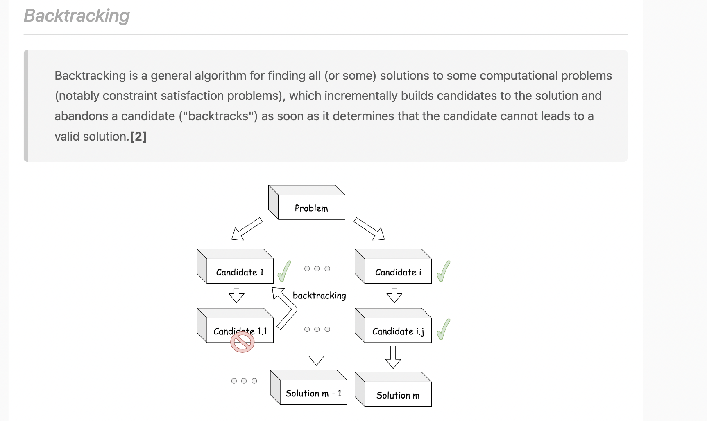

# Backtracking

> **Scope** — Systematic search with undo: the choose/explore/un-choose skeleton, `start_idx` control, duplicate skipping, pruning, and exactly one canonical template per must-know shape — the long tail of worked solutions and the hard-tier state-carrying templates live in its two satellites.
> **See also**: [backtrack_examples.md](./backtrack_examples.md) — the worked LC solutions for these templates; [backtrack_advanced.md](./backtrack_advanced.md) — Trie-pruned grid search, expression building, deletion budgets, memoised partitioning; [dfs.md](./dfs.md) — traversal without the undo step; [recursion.md](./recursion.md) — recursion mechanics; [tree_backtrack.md](./tree_backtrack.md) — root→leaf path problems; [dp.md](./dp.md) — when memoising the search beats exploring it.

## LeetCode Problem Lists

- [Backtracking](https://leetcode.com/problem-list/backtracking/)
- [Recursion](https://leetcode.com/problem-list/recursion/)

## Overview

Backtracking is a **brute-force search over a decision tree**: at each step we make a
choice, recurse deeper, then **undo** the choice ("backtrack") to try the next one. It is
the go-to pattern for generating **all** subsets / permutations / combinations, or finding
**any/one** valid configuration under constraints (N-Queens, Sudoku, word search).

### Key Properties

- **Core idea**: `choose → explore (recurse) → un-choose (undo)`
- **Time Complexity**: exponential — `O(b^d)`, where `b` = branching factor, `d` = decision-tree depth
- **Space Complexity**: `O(d)` recursion depth (excluding the output list)
- **When to Use**: the problem asks for *all* / *every* / *how many* configurations, or to *place / fill / partition* under constraints
- **Optimization path**: Backtrack (brute force) → add **pruning** → often → **DP** (memoize overlapping subproblems)
- **Algorithm**: DFS + recursion
- **Common data structures**: `dict` (counter for dedup), `set` (visited / constraints), `array`/`list` (the route)

### The 3 things every backtrack tracks

| Element | Meaning |
| ------- | ------- |
| **Route** (路徑) | choices made so far (the current path) |
| **Choice list** (選擇清單) | choices available right now |
| **End condition** | leaf of the decision tree — record the route and return |

<p align="center"></p>

> The three rows above map onto [Template 1](#template-1-choose--explore--un-choose-) —
> `path` is the route, the `for` loop is the choice list, the `if` at the top is the end condition.

### Time Complexity by Problem Type

| Problem type      | Typical Time      | Space (excl. output) | Example      |
| ----------------- | ----------------- | -------------------- | ------------ |
| Subsets           | O(2^n · n)        | O(n)                 | LC 78, 90    |
| Permutations      | O(n! · n)         | O(n)                 | LC 46, 47    |
| Combinations      | O(C(n,k) · k)     | O(k)                 | LC 77        |
| Combination Sum   | exponential       | O(target / min)      | LC 39, 40    |
| Partitioning      | O(2^n · n)        | O(n)                 | LC 131       |
| N-Queens          | O(n!)             | O(n)                 | LC 51        |

> The trailing `· n` / `· k` is the cost of copying each valid path into the result.
> **Pruning** trims branches and the constant factor but does **not** change the worst-case class.

### References

- [labuladong — Backtracking framework](https://labuladong.online/algo/essential-technique/backtrack-framework/#%E4%B8%80%E3%80%81%E5%85%A8%E6%8E%92%E5%88%97%E9%97%AE%E9%A2%98)
- [labuladong — Two views of backtracking](https://labuladong.online/algo/practice-in-action/two-views-of-backtrack/)
    - [Sudoku](https://labuladong.online/algo/practice-in-action/sudoku/)
    - [Generate parentheses](https://labuladong.online/algo/practice-in-action/generate-parentheses/)
    - [Partition to k equal sum subsets](https://labuladong.online/algo/practice-in-action/partition-to-k-equal-sum-subsets/)
- [LeetCode — A general approach to backtracking (Java)](https://leetcode.com/problems/subsets/solutions/27281/a-general-approach-to-backtracking-questions-in-java-subsets-permutations-combination-sum-palindrome-partitioning/)

## Problem Categories

Four shapes cover almost every backtracking question. The taxonomy below decides **which
template you reach for**; the code for each lives in [Templates & Algorithms](#templates--algorithms)
and the fully worked solutions in [backtrack_examples.md](./backtrack_examples.md).

| # | Shape | `start_idx`? | Canonical template | LC |
|---|-------|--------------|--------------------|----|
| 1 | Subsets (子集) | ✅ `i + 1` | [Template 3](#template-3-subsets--lc-78-) / [Template 4](#template-4-subsets-ii-skip-same-level-duplicates--lc-90-) | 78, 90 |
| 2 | Permutations (排列組合) | ❌ `visited[]` | [Template 5](#template-5-permutations--lc-46-) | 46, 47 |
| 3 | Combinations (組成) | ✅ `i + 1` | [Template 6](#template-6-combinations--lc-77) | 77, 216 |
| 4 | Combination Sum | ✅ `i` (reuse) or `i + 1` | [Template 7](#template-7-combination-sum--lc-39--lc-40-) | 39, 40 |
| 5 | Partitioning | ✅ `i + 1` on a substring / bucket | [Template 8](#template-8-palindrome-partitioning--lc-131-) / [Template 13](#template-13-k-bucket-partitioning--lc-698--lc-473) | 131, 698, 473 |
| 6 | Grid / word search | ❌ mark-and-restore the cell | [Template 9](#template-9-grid--word-search--lc-79-) | 79, 980, 1219 |
| 7 | Constraint satisfaction | ❌ one row / cell per depth | [Template 10](#template-10-n-queens--lc-51) / [Template 11](#template-11-sudoku-solver--lc-37) | 51, 37 |
| 8 | Parentheses / string building | ❌ counters as constraints | [backtrack_examples.md](./backtrack_examples.md#8-generate-parentheses--lc-22) | 20, 22, 93 |

### Type Notes

Working notes per shape — the mnemonic for the loop body, and the gotcha.

- Type 1) : `Subsets` (子集)
    - Problems : LC 78, 90, 17
    - [代碼隨想錄 - 0078.子集](https://github.com/youngyangyang04/leetcode-master/blob/master/problems/0078.%E5%AD%90%E9%9B%86.md)
    - (for loop call help func) +  start_idx + for loop + pop(-1)
    - backtrack. find minumum case. transform the problem to `tree-problem`. via `start` remove already used numbers and return all cases
    - Need `!cur.contains(nums[i])` -> to NOT add duplicated element
- `Subsets II`
    - LC 90
    - start idx + backtrack + dedup (seen)
    - dedup : can use dict counter or idx

- Type 2) : `Permutations (排列組合)` (全排列)
    - Problems : LC 46, 47
    - (for loop call help func) + contains + pop(-1)
    - backtrack. via `contains` remove already used numbers and return all cases
    - `NO NEED` to use start_idx

- Type 3) : `Combinations (組成)` 
    - LC 77
    - (for loop call help func) +  start_idx + for loop + + check if len == k + pop(-1)

- Type 4) : `Others`

- Parentheses (括弧)
    - LC 20, LC 22

## Templates & Algorithms

### Template Comparison Table

| Template | Shape | Loop / next index | Undo | LC |
|---|---|---|---|---|
| 1 | choose → explore → un-choose | `for i in start..n` | `path.pop()` | — |
| 2 | `start_idx` control | `i` (reuse) vs `i + 1` (once) | — | 39 vs 40 |
| 3 | Subsets | record at **every** node, `i + 1` | `remove(last)` | 78 |
| 4 | Subsets II | `i > start && a[i] == a[i-1]` skip | `remove(last)` | 90 |
| 5 | Permutations | scan **all**, skip `visited[i]` | `pop()` + `visited[i] = False` | 46, 47 |
| 6 | Combinations | stop at `len(path) == k` | `pop()` | 77 |
| 7 | Combination Sum | `i` reuse / `i + 1` once + `break` prune | `pop()` | 39, 40 |
| 8 | Palindrome partition | `for end in start+1..n`, palindrome gate | `remove(last)` | 131 |
| 9 | Grid / word search | 4-way from each cell | restore the cell | 79 |
| 10 | N-Queens | one row per depth, 3 constraint sets | remove from all 3 sets | 51 |
| 11 | Sudoku | one empty cell per depth, row/col/box sets | reset cell + sets | 37 |
| 12 | Pruning | `break` / `continue` before recursing | — | 39, 40 |
| 13 | k-bucket partition | for each bucket, sorted desc | `buckets[i] -= v` | 698, 473 |
| 14 | Mutable vs immutable state | — | undo **only** mutable state | 113, 1740 |

### Template 1: choose → explore → un-choose ⭐⭐⭐⭐⭐

The canonical `choose → explore → un-choose` skeleton, ready to adapt:

```python
# python
def backtrack(start_idx, path):
    if end_condition:            # e.g. len(path) == k, or start_idx == len(s)
        res.append(path[:])      # NOTE: copy the path, not the reference
        return
    for i in range(start_idx, n):
        path.append(nums[i])         # 1) choose
        backtrack(i + 1, path)       # 2) explore  (i -> reuse, i+1 -> use once)
        path.pop()                   # 3) un-choose (undo)

res = []
backtrack(0, [])
```

```java
// java
private void backtrack(int startIdx, List<Integer> path, int[] nums, List<List<Integer>> res) {
    if (endCondition) {                       // e.g. path.size() == k
        res.add(new ArrayList<>(path));       // NOTE: copy the path, not the reference
        return;
    }
    for (int i = startIdx; i < nums.length; i++) {
        path.add(nums[i]);                    // 1) choose
        backtrack(i + 1, path, nums, res);    // 2) explore (i -> reuse, i+1 -> use once)
        path.remove(path.size() - 1);         // 3) un-choose (undo)
    }
}
```

Two knobs turn this template into every variant:
- **`start_idx`** — controls the search space (combinations/subsets vs permutations)
- **early quit / pruning** — cut branches that cannot lead to a valid answer

#### Duplicate skipping — the same-level skip rule ⭐⭐⭐⭐⭐

We do **not** skip every duplicate — only a duplicate appearing at the *same recursion level*.
Three spellings of the same rule (fragments, not runnable classes):

```java
// LC 40
// java
// ...

/**
*  NOTE !!!   skip a duplicate at the same recursive level.
*
*   -> Key idea of the duplicate-skipping logic
*       •    We do not skip all duplicates.
*       •    We only skip a duplicate at the same recursive level.
*/

if (i > startIdx && candidates[i] == candidates[i - 1]) {
    continue;
}

// ...
```

```java
// LC 90
// java

// ...
for (int j = i; j < nums.length; j++) {
    /** 
     *  NOTE !!! below !!
     * 
     *  via below, we avoid add `duplicated` element
     * 
     */
    if (j > i && nums[j] == nums[j - 1]) {
        continue;
    }
    // ...
}
// ...
```

```java
// java
// LC 47
// ...

// Skip duplicates in the same recursion layer
if (i > 0 && nums[i] == nums[i - 1] && !used[i - 1])
    continue;
            
// ...
```

### Template 2: `start_idx` — `i` vs `i + 1` ⭐⭐⭐⭐⭐

`start_idx` (or `index`, or similar) is **used to control the search space** — to **avoid duplicates** and maintain order in the generated result.

-> Use `start_idx` when:

- You're generating **combinations/subsets**
- You want to **avoid duplicates**
- You want to **preserve order** of choices

Once you've decided you need a `start_idx`, the next question is **what to pass as the
next start index** — `i` (reuse the current element) or `i + 1` (move past it).

| Pass | Meaning | Analogy | Examples |
| ---- | ------- | ------- | -------- |
| `i`     | Reuse the **same element again** | **Unbounded knapsack** (infinite supply) | LC 39 (Combination Sum), LC 518 (Coin Change II), LC 377 |
| `i + 1` | Use **each element at most once** | **0/1 knapsack**, subsets | LC 40 (Combination Sum II), LC 78/90 (Subsets), LC 131, LC 494 |

> Permutations use neither — they revisit earlier elements, so they track a `visited[]`
> array / `contains` check instead of a `start_idx` (see [Problem Categories](#problem-categories)).

```java
// LC 39 Combination Sum — reuse allowed → pass i
for (int i = start; i < candidates.length; i++) {
    backtrack(i, remain - candidates[i]);      // can pick candidates[i] again
}

// LC 40 Combination Sum II — each used once → pass i + 1
for (int i = start; i < candidates.length; i++) {
    backtrack(i + 1, remain - candidates[i]);  // move past candidates[i]
}
```

> **Key takeaway**: reuse allowed → `i`; use once → `i + 1`.

### Template 3: Subsets — LC 78 ⭐⭐⭐⭐⭐

Record the path at **every** node (pre-order), and pass `i + 1` so each element is used once.
The `// ...` lines are elided boilerplate, not code.

```java
// java
// LC 78 - Subsets
public List<List<Integer>> subsets(int[] nums) {
    // ...
    this.getSubSet(start_idx, nums, cur, res);
    //System.out.println("(after) res = " + res);
    return res;
}

public void getSubSet(int start_idx, int[] nums, List<Integer> cur, List<List<Integer>> res){

    if (!res.contains(cur)){
        // NOTE !!! init new list via below
        res.add(new ArrayList<>(cur));
    }

    if (cur.size() > nums.length){
        return;
    }

    for (int i = start_idx; i < nums.length; i++){
        /**
         * NOTE !!!
         *
         *  for subset,
         *  we need "!cur.contains(nums[i])"
         *  -> to NOT add duplicated element
         */
        if (!cur.contains(nums[i])){
            cur.add(nums[i]);
            /**
             *  NOTE !!!
             *
             *   at LC 78 subset, we need to use `i+1` idx
             *   in recursive call
             *
             *   while at LC 39 Combination Sum,
             *   we use `i` directly
             *
             *
             *   e.g. next start_idx is ` i+1`
             */
            this.getSubSet(i+1, nums, cur, res);
            // undo
            cur.remove(cur.size()-1);
        }
    }
}
```

```python
# python
# LC 78 - Subsets
# IDEA : DFS
class Solution(object):
    def subsets(self, nums):
        def dfs(layer, start, tmp):
            if tmp not in res:
                res.append(tmp)
            if layer == len(nums):
                return
            ### NOTE : we have if condition first, then for loop
            for i in range(start, len(nums)):
                ### NOTE below can make loop start `start idx` updated each time
                dfs(layer+1, i+1, tmp + [nums[i]])
        nums.sort()
        res = []
        dfs(0, 0, [])
        return res
```

### Template 4: Subsets II (skip same-level duplicates) — LC 90 ⭐⭐⭐⭐⭐

```java
// java
// LC 90
private void backtrack(List<List<Integer>> list, List<Integer> tempList, int [] nums, int start){
    list.add(new ArrayList<>(tempList));
    for(int i = start; i < nums.length; i++){
        // skip duplicates
        /**
         *  NOTE !!!
         *
         *   below is the key shows how to simply skip duplicates
         *   (instead of using hashmap counter)
         */
        if(i > start && nums[i] == nums[i-1]){
            continue;
        }
        tempList.add(nums[i]);
        backtrack(list, tempList, nums, i + 1);
        tempList.remove(tempList.size() - 1);
    }
}
```

### Template 5: Permutations — LC 46 ⭐⭐⭐⭐⭐

```python
# python
# LC 46 - Permutations
# IDEA : BACKTRACK with a `visited` array (instead of `contains`)
class Solution(object):
    def permute(self, nums):
        res = []
        visited = [False] * len(nums)

        def dfs(path):
            if len(path) == len(nums):
                res.append(path[:])          # NOTE: copy the path
                return
            for i in range(len(nums)):
                if visited[i]:
                    continue
                visited[i] = True            # choose
                path.append(nums[i])
                dfs(path)                    # explore
                path.pop()                   # un-choose
                visited[i] = False

        dfs([])
        return res
```

```java
// java
// LC 46. Permutations
    List<List<Integer>> ans = new ArrayList<>();

    // IDEA : BACKTRACK
    public List<List<Integer>> permute(int[] nums) {

        if (nums.length == 1){
            List<List<Integer>> _ans = new ArrayList<>();
            List<Integer> cur = new ArrayList<>();
            cur.add(nums[0]);
            _ans.add(cur);
            return _ans;
        }

        List<Integer> cur = new ArrayList<>();
        /** NOTE !!! we don't need to set idx param */
        helper(nums, cur);

        return this.ans;
    }

    private void helper(int[] nums, List<Integer> cur){

        if (cur.size() > nums.length){
            return;
        }

        if (!this.ans.contains(cur) && cur.size() == nums.length){

            /** NOTE !!! we use below to add current ArrayList instance to ans */
            this.ans.add(new ArrayList<>(cur));
        }

        
        for (int i = 0; i < nums.length; i++){
            int val = nums[i];
            // input nums is array with distinct integers
            /** NOTE !!! ONLY do recursive, backtrack when meet distinct element */
            if(!cur.contains(val)){
                cur.add(val);
                // recursive call
                helper(nums, cur);
                // undo last op
                cur.remove(cur.size()-1); // NOTE !!! remove last element
            }
        }
    }
```

#### Permutations with duplicates — LC 47

A `Counter` replaces `visited[]`: decrement on choose, increment back on un-choose. The
alternative (sort + `i > 0 and a[i] == a[i-1] and not used[i-1]`) is the Java snippet in
[Duplicate skipping](#duplicate-skipping--the-same-level-skip-rule-).

```python
# python
# LC 47 - Permutations II
# IDEA : BACKTRACK with a Counter (decrement on choose, increment back on un-choose)
class Solution(object):
    def permuteUnique(self, nums):
        def help(res, cur, cnt):
            if len(cur) == len(nums):
                if cur not in res:
                    res.append(cur[:])
                    return
            if len(cur) > len(nums):
                return
            for x in _cnt:
                #print ("i = " + str(i) + " cur = " + str(cur))
                #if i not in cur:
                if _cnt[x] > 0:
                    cur.append(x)
                    _cnt[x] -= 1
                    help(res, cur, _cnt)
                    """
                    NOTE !!! : we UNDO the last op we just made (pop last element we put into array)
                    """
                    cur.pop(-1)
                    _cnt[x] += 1
        # edge case
        if not nums:
            return [[]]
        _cnt = Counter(nums)
        #print ("_cnt = " + str(_cnt))
        res = []
        cur = []
        help(res, cur, _cnt)
        return res
```

### Template 6: Combinations — LC 77

`start_idx` + a size gate. Stop as soon as `len(path) == k`.

```python
# python
# LC 77. Combinations
# IDEA : BACKTRACK
class Solution(object):
    def combine(self, n, k): 
        def dfs(current, start):
            if(len(current) == k):
                """
                Both of below approach are OK
                
                list(current) : transform current reference to list
                current[:] : shallow copy
                """
                result.append(list(current))
                return
            
            for i in range(start, n + 1):
                current.append(i)
                dfs(current, i + 1)
                current.pop()
            
        result = []
        dfs([], 1)
        return result

```

### Template 7: Combination Sum — LC 39 / LC 40 ⭐⭐⭐⭐

`i` in the recursive call means *reuse allowed* (LC 39); `i + 1` means *use once* (LC 40).
LC 40 additionally needs the same-level duplicate skip.

```java
// java
// https://leetcode.com/problems/subsets/solutions/27281/a-general-approach-to-backtracking-questions-in-java-subsets-permutations-combination-sum-palindrome-partitioning/
// LC 39 - Combination Sum
public List<List<Integer>> combinationSum(int[] nums, int target) {
    List<List<Integer>> list = new ArrayList<>();
    Arrays.sort(nums);
    backtrack(list, new ArrayList<>(), nums, target, 0);
    return list;
}

private void backtrack(List<List<Integer>> list, List<Integer> tempList, int [] nums, int remain, int start){
    if(remain < 0) return;
    else if(remain == 0) list.add(new ArrayList<>(tempList));
    else{ 
        for(int i = start; i < nums.length; i++){
            tempList.add(nums[i]);
            /** NOTE !!!
             *
             *   use i, since we need to use start from current (i) index in recursion call
             *    (reuse current index)
             */
            backtrack(list, tempList, nums, remain - nums[i], i);
            tempList.remove(tempList.size() - 1);
        }
    }
}
```

```java
// java
// https://leetcode.com/problems/subsets/solutions/27281/a-general-approach-to-backtracking-questions-in-java-subsets-permutations-combination-sum-palindrome-partitioning/
// LC 40 - Combination Sum II
 public List<List<Integer>> combinationSum2(int[] nums, int target) {
    List<List<Integer>> list = new ArrayList<>();
    Arrays.sort(nums);
    backtrack(list, new ArrayList<>(), nums, target, 0);
    return list;
    
}

private void backtrack(List<List<Integer>> list, List<Integer> tempList, int [] nums, int remain, int start){
    if(remain < 0) return;
    else if(remain == 0) list.add(new ArrayList<>(tempList));
    else{
        for(int i = start; i < nums.length; i++){
            if(i > start && nums[i] == nums[i-1]) continue; // skip duplicates
            tempList.add(nums[i]);
            backtrack(list, tempList, nums, remain - nums[i], i + 1);
            tempList.remove(tempList.size() - 1); 
        }
    }
}        
```

**Python — LC 40 with both prunings** (`sort()` first, so `break` is legal):

```python
# python
# LC 40 - Combination Sum II
def combinationSum2(candidates, target):
    def backtrack(start, path, current_sum):
        if current_sum == target:
            result.append(path[:])
            return

        for i in range(start, len(candidates)):
            # Pruning: skip duplicates at same level
            if i > start and candidates[i] == candidates[i-1]:
                continue

            # Pruning: early termination
            if current_sum + candidates[i] > target:
                break

            path.append(candidates[i])
            backtrack(i + 1, path, current_sum + candidates[i])
            path.pop()

    candidates.sort()
    result = []
    backtrack(0, [], 0)
    return result
```

### Template 8: Palindrome Partitioning — LC 131 ⭐⭐⭐⭐

The partition shape: loop `end` from `start + 1` to `n`, gate on a validity predicate
(`isPalindrome`), recurse from `end`. Swap the predicate and you get IP-address restoration
(LC 93) or word break (LC 140).

```java
// java
// https://leetcode.com/problems/subsets/solutions/27281/a-general-approach-to-backtracking-questions-in-java-subsets-permutations-combination-sum-palindrome-partitioning/
// LC 131 - Palindrome Partitioning
public List<List<String>> partition(String s) {
   List<List<String>> list = new ArrayList<>();
   backtrack(list, new ArrayList<>(), s, 0);
   return list;
}

public void backtrack(List<List<String>> list, List<String> tempList, String s, int start){
   if(start == s.length())
      list.add(new ArrayList<>(tempList));
   else{
      for(int i = start; i < s.length(); i++){
         if(isPalindrome(s, start, i)){
            tempList.add(s.substring(start, i + 1));

            // NOTE !!! `i+1`
            backtrack(list, tempList, s, i + 1);
            tempList.remove(tempList.size() - 1);
         }
      }
   }
}

public boolean isPalindrome(String s, int low, int high){
   while(low < high)
      if(s.charAt(low++) != s.charAt(high--)) return false;
   return true;
} 
```

```python
# python
# LC 131 Palindrome Partitioning
# IDEA : BACKTRCK, similar as LC 046 permutations
class Solution(object):
    def partition(self, s):
        def help(s, res, path):
            if not s:
                res.append(path)
                return
            for i in range(1, len(s)+1):
                if s[:i] == s[:i][::-1]:
                    help(s[i:], res, path + [s[:i]])
        # edge case
        if not s:
            return
        res = []
        path = []
        help(s, res, path)
        return res
```

### Template 9: Grid / Word Search — LC 79 ⭐⭐⭐⭐

Mark the cell, recurse 4-ways, restore the cell. The `visited[][]` matrix variant and the
count/max variants (LC 980, LC 1219) are in
[backtrack_examples.md §3](./backtrack_examples.md#3-word-search--lc-79-).

```python
# python
# LC 079 Word Search
# IDEA : DFS + backtracking
class Solution(object):
    def exist(self, board, word):
        if not board or not board[0]:
            return False

        self.rows = len(board)
        self.cols = len(board[0])

        for r in range(self.rows):
            for c in range(self.cols):
                if self.dfs(board, word, r, c, 0):
                    return True

        return False

    def dfs(self, board, word, r, c, idx):
        if r < 0 or r >= self.rows or c < 0 or c >= self.cols:
            return False
        if board[r][c] != word[idx]:
            return False
        if idx == len(word) - 1:
            return True

        # Mark current cell as visited
        temp = board[r][c]
        board[r][c] = "#"

        # Explore 4 directions
        found = (
            self.dfs(board, word, r + 1, c, idx + 1) or
            self.dfs(board, word, r - 1, c, idx + 1) or
            self.dfs(board, word, r, c + 1, idx + 1) or
            self.dfs(board, word, r, c - 1, idx + 1)
        )

        # NOTE !!! MUST save `found` first, THEN backtrack, THEN return found.
        # -> The restore (backtrack) must happen before return.
        # -> Returning directly from the recursive call skips the restore:
        #
        #   WRONG pattern:
        #     board[r][c] = "#"
        #     return (self.dfs(...) or self.dfs(...) or ...)
        #     board[r][c] = temp   # NEVER REACHED
        #
        #   CORRECT pattern:
        #     board[r][c] = "#"
        #     found = (self.dfs(...) or ...)   # collect result
        #     board[r][c] = temp               # backtrack (restore)
        #     return found                     # return after restore

        # Backtrack: restore original value
        board[r][c] = temp

        return found

```

### Template 10: N-Queens — LC 51

Classic backtracking with O(n!) search space, pruned by column/diagonal tracking.

```python
# python
# LC 51 - N-Queens
def solveNQueens(n):
    result = []
    cols = set()
    diag1 = set()   # row - col (top-left to bottom-right)
    diag2 = set()   # row + col (top-right to bottom-left)

    def backtrack(row, board):
        if row == n:
            result.append(["".join(r) for r in board])
            return
        for col in range(n):
            if col in cols or (row - col) in diag1 or (row + col) in diag2:
                continue
            cols.add(col); diag1.add(row - col); diag2.add(row + col)
            board[row][col] = 'Q'
            backtrack(row + 1, board)
            board[row][col] = '.'; cols.remove(col)
            diag1.remove(row - col); diag2.remove(row + col)

    backtrack(0, [['.']*n for _ in range(n)])
    return result
```

**Key pruning**: Three O(1) sets replace the O(n) column/diagonal scans. Time: O(n!), Space: O(n).

### Template 11: Sudoku Solver — LC 37

Backtrack cell by cell; prune using row/col/box sets.

```python
# python
# LC 37 - Sudoku Solver
def solveSudoku(board):
    rows = [set() for _ in range(9)]
    cols = [set() for _ in range(9)]
    boxes = [set() for _ in range(9)]

    empty = []
    for r in range(9):
        for c in range(9):
            if board[r][c] != '.':
                d = board[r][c]
                rows[r].add(d); cols[c].add(d); boxes[(r//3)*3+c//3].add(d)
            else:
                empty.append((r, c))

    def backtrack(idx):
        if idx == len(empty): return True
        r, c = empty[idx]
        box = (r//3)*3 + c//3
        for d in '123456789':
            if d in rows[r] or d in cols[c] or d in boxes[box]: continue
            board[r][c] = d
            rows[r].add(d); cols[c].add(d); boxes[box].add(d)
            if backtrack(idx + 1): return True
            board[r][c] = '.'; rows[r].remove(d); cols[c].remove(d); boxes[box].remove(d)
        return False

    backtrack(0)
```

> Pushing this further — eliminating a digit from peer cells the moment it is placed, and
> failing as soon as a cell has zero candidates — is **constraint propagation**, in
> [backtrack_advanced.md](./backtrack_advanced.md#template-4-constraint-propagation-early-termination).

### Template 12: Pruning Techniques ⭐⭐⭐⭐

**Definition**: Optimization methods to reduce the search space by eliminating branches that cannot lead to valid solutions.

**Types of Pruning**:

**1. Constraint-based Pruning**
- Early termination when constraints are violated
- Check validity before recursive calls

**2. Bound-based Pruning**
- Use upper/lower bounds to eliminate suboptimal paths
- Branch and bound technique

**3. Symmetry Pruning**
- Skip equivalent states to avoid duplicates
- Sort inputs to handle permutations

**4. Memoization Pruning**
- Cache results of subproblems
- Avoid recomputing same states

**Common Pruning Patterns** — an outline, not runnable code: `current_sum`, `target_length`,
`is_valid` and `result` stand in for whatever the problem supplies.

```python
# python
def backtrack_with_pruning(path, choices, target):
    # Early termination (constraint pruning)
    if current_sum > target:
        return  # No need to continue

    # Bound pruning
    if current_sum + min_remaining > target:
        return  # Cannot reach target

    # Base case
    if len(path) == target_length:
        if is_valid(path):
            result.append(path[:])
        return

    # Symmetry pruning
    for i in range(start_idx, len(choices)):
        # Skip duplicates (symmetry pruning)
        if i > start_idx and choices[i] == choices[i-1]:
            continue

        # Make choice
        path.append(choices[i])

        # Recursive call with pruning
        backtrack_with_pruning(path, choices, target)

        # Undo choice
        path.pop()
```

**Worked pruning — LC 39 Combination Sum** (`sort()` enables the `break`):

```python
# python
# LC 39 - Combination Sum (with sum + sorted-break pruning)
def combinationSum(candidates, target):
    def backtrack(start, path, current_sum):
        # Pruning: if current sum exceeds target
        if current_sum > target:
            return

        if current_sum == target:
            result.append(path[:])
            return

        for i in range(start, len(candidates)):
            # Pruning: if adding current number exceeds target
            if current_sum + candidates[i] > target:
                break  # Since array is sorted

            path.append(candidates[i])
            backtrack(i, path, current_sum + candidates[i])
            path.pop()

    candidates.sort()  # Enable break pruning
    result = []
    backtrack(0, [], 0)
    return result
```

### Template 13: k-Bucket Partitioning — LC 698 / LC 473

Assign each number to one of `k` buckets. Three prunings make it tractable: fail fast on
`sum % k != 0`, sort **descending** so large numbers fail early, and `break` instead of
trying a second *empty* bucket (it only relabels the same partition).

```python
# python
# LC 698 - Partition to K Equal Sum Subsets
def canPartitionKSubsets(nums, k):
    total = sum(nums)
    if total % k != 0:
        return False

    target = total // k
    nums.sort(reverse=True)  # Start with larger numbers

    def backtrack(index, buckets):
        if index == len(nums):
            return True

        for i in range(k):
            # Pruning techniques
            if buckets[i] + nums[index] > target:
                continue
            if i > 0 and buckets[i] == buckets[i-1]:
                continue

            buckets[i] += nums[index]
            if backtrack(index + 1, buckets):
                return True
            buckets[i] -= nums[index]

        return False

    return backtrack(0, [0] * k)
```

> **Variation — LC 473 (Matchsticks to Square)**: *the exact same k-bucket template with `k`
> hard-coded to 4* and `target = perimeter // 4`. Same three prunings apply: fail fast if
> `sum % 4 != 0` or `max(nums) > target`, sort **descending** first, and `if buckets[i] == 0:
> break` after an undo (trying a second *empty* bucket only relabels the same partition).

#### Return `true` up the stack immediately

A decision problem ("*can* it be partitioned?") returns as soon as one branch succeeds —
do not keep looping after a `true`:

```java
// java
// LC  698

// ...
if (backtrack_(nums, j + 1, k, subsetSum + nums[j], used)){
            return true;
        }

// ...
```

### Template 14: When to Undo — Mutable vs Immutable State ⭐⭐⭐⭐

```java
// java
// LC 79

// https://github.com/yennanliu/CS_basics/blob/master/leetcode_java/src/main/java/LeetCodeJava/BackTrack/WordSearch.java#L133


// In Java, primitive types like int are passed by value. This means when you do:

// dfsFind(board, word, x+1, y, visited, start_idx + 1)

//  1) You're passing a copy of start_idx + 1 to the recursive function. So, inside the recursive call, start_idx is a new variable, and changes to it won't affect the start_idx in the calling function.


// 2) We don't need start_idx -= 1; because start_idx is passed by value, not by reference. So modifying it in the recursive call doesn't affect the caller's start_idx. We're already handling the correct index in each recursive call by passing start_idx + 1.

```

**Important Note: When Backtracking is NOT Needed**

```java
// LC 1740
// NOTE !!! we don't need a `backtrack` below,
// since `int` is a `primitive dtype in java
//  ->     Each recursive call gets its own copy of move.
// if we use dtype such as Mutable shared state (e.g. List, Set)
// we need a backtrack (undo)

private int getPathLen(TreeNode root, int target, int dist) {
    if (root == null) {
        return -1;  // not found
    }
    if (root.val == target) {
        return dist;
    }
    int left = getPathLen(root.left, target, dist + 1);

    if (left != -1) {
        return left;
    }
    int right = getPathLen(root.right, target, dist + 1);

    // NOTE !!! we don't need a `backtrack` below,
    // since `int` is a `primitive dtype in java
    //  ->  Each recursive call gets its own copy of move.
    // if we use dtype such as Mutable shared state (e.g. List, Set)
    // we need a backtrack (undo)
    return right;
}
```

**When to Use Backtracking (Undo)**:

| Data Type | Need Backtrack? | Reason |
|-----------|-----------------|--------|
| Primitive types (`int`, `char`, `boolean`, etc.) | ❌ No | Passed by value; each recursive call gets its own copy |
| Mutable objects (`List`, `Set`, `Map`, `StringBuilder`, etc.) | ✅ Yes | Passed by reference; modifications affect all recursive calls |
| Immutable objects (`String`, `Integer`, etc.) | ❌ No | Modifications create new instances |

**Python equivalent — `int` accumulator vs `list` path (LC 113 Path Sum II)** ⭐

The same rule holds in Python. In a DFS that carries **both** a running sum (`cur_sum`,
an `int`) **and** a path (`cache`, a `list`), we `cache.pop()` but never "un-add"
`cur_sum`:

- **`cur_sum` (`int`) — NO backtrack.** Integers are **immutable**. `cur_sum += root.val`
  does NOT change the parent's integer in place; it **rebinds the local `cur_sum`** to a
  brand-new int object. When the child frame ends, the parent's `cur_sum` is untouched.
- **`cache` (`list`) — NEEDS backtrack.** There is only **one** list instance shared
  across the whole recursion tree. A child's `append` is visible to the parent, so we
  MUST `pop()` to restore state for the sibling branch.

```python
# python
# LC 113 - Path Sum II
# https://github.com/yennanliu/CS_basics/blob/master/leetcode_python/Depth-First-Search/path-sum-ii.py
class Solution(object):
    def pathSum(self, root, targetSum):
        self.res = []
        if not root:
            return self.res
        self.helper(root, targetSum, 0, [])
        return self.res

    def helper(self, root, targetSum, cur_sum, cache):
        if not root:
            return

        cur_sum += root.val        # int  -> rebinds LOCAL name to a NEW int (immutable)
        cache.append(root.val)     # list -> mutates the ONE shared list

        if not root.left and not root.right and cur_sum == targetSum:
            self.res.append(cache[:])   # snapshot, else later pops corrupt it

        self.helper(root.left,  targetSum, cur_sum, cache)
        self.helper(root.right, targetSum, cur_sum, cache)

        cache.pop()                # MUST backtrack the list ...
        # NOTE: NO `cur_sum -= root.val` — the int never changed for the parent
```

**Memory walk-through** — parent at `cur_sum = 5`, `cache = [5]`, step into a child of value `3`:

| | Going DOWN into child | Coming back UP to parent |
|---|---|---|
| **`cache` (list)** | `cache.append(3)` → `[5, 3]` (same object) | without `pop()` it stays `[5, 3]` → **parent corrupted → backtrack required** |
| **`cur_sum` (int)** | `cur_sum + 3` → `8` (new int, local) | child frame destroyed → parent's `cur_sum` still `5` → **no backtrack needed** |

> See also [python_trick.md §1-54](https://github.com/yennanliu/CS_basics/blob/master/doc/cheatsheet/python_trick.md) — `str`/`tuple`/`int` (immutable, no backtrack) vs `list.append` (mutable, needs `pop`).

**Why `cache.pop()` is necessary** — walk a 3-node tree:

Suppose the tree is:

```text
    1
   / \
  2   3
```

Without `cache.pop()`:

```text
visit 1: cache = [1]
visit 2: cache = [1,2]
return
visit 3: cache = [1,2,3]   # Wrong! 2 leaked into 3's path
```

With `cache.pop()`:

```text
visit 1: cache = [1]
visit 2: cache = [1,2]
return -> pop() => [1]
visit 3: cache = [1,3]     # Correct
```

> **Alternative (no explicit pop):** pass a *new* list each call (`path + [node.val]`) so every branch owns its own copy — then no `pop()` is needed; that is the form [tree_backtrack.md](./tree_backtrack.md) uses. The trade-off is extra copying vs. one shared list with backtrack.

## Summary & Quick Reference

### Decision Table — which backtrack shape? ⭐⭐⭐⭐⭐

| Problem Type      | Use `start_idx`? | Example Problem |
|-------------------|------------------|-----------------|
| Subsets           | ✅ Yes           | Leetcode 78     |
| Combinations      | ✅ Yes           | Leetcode 77     |
| Combination Sum   | ✅ Yes           | Leetcode 39     |
| Permutations      | ❌ No            | Leetcode 46     |
| N-Queens          | ❌ No            | Leetcode 51     |
| Partitioning      | ✅ Yes           | Leetcode 131    |

#### Sort, dedup, prune — when

| Question | Answer |
|---|---|
| Sort the input first? | Yes whenever you must **skip duplicates** (LC 40, 47, 90, 996) or want a `break` prune on a sorted candidate pool (LC 39, 216) |
| Skip duplicates how? | Same level only: `i > start && a[i] == a[i-1]` (index-based, LC 40/90) or `i > 0 && a[i] == a[i-1] && !used[i-1]` (visited-based, LC 47/996); a `Counter` is the third spelling |
| `break` or `continue`? | `break` when the pool is **sorted** and overflowing kills the whole tail (LC 39, 216); `continue` when only this one candidate is invalid (LC 698 bucket full) |
| Prune where? | **Before** recursing — check the constraint at the choice, not at the leaf (LC 526, 996) |
| When to stop pruning and memoise? | When the same *state* (not the same path) recurs — that is the [DP](./dp.md) boundary |

#### Problems that need `start_idx`

Combinations, subsets and multi-use elements: order does not matter, earlier choices must not
be revisited.

| Problem | Use of `start_idx` | Why? |
|--------|------------------|------|
| `Subsets` (Leetcode 78) | ✅ Yes | To avoid duplicate subsets |
| `Combination Sum` (Leetcode 39) | ✅ Yes | Reuse allowed, but in order |
| `Combination Sum II` (Leetcode 40) | ✅ Yes | No reuse, skip duplicates |
| `Combinations` (Leetcode 77) | ✅ Yes | Choose k out of n, in order |
| `Palindrome Partitioning` | ✅ Yes | Explore substrings from `start` |

#### Problems that do not use `start_idx`

Permutation-shaped problems: order matters, every ordering is a distinct answer, and earlier
choices are revisited.

| Problem | Use of `start_idx` | Why Not? |
|--------|------------------|---------|
| `Permutations` (Leetcode 46) | ❌ No | All orderings are valid |
| `Permutations II` (Leetcode 47) | ❌ No | Just skip duplicates smartly |
| `N-Queens` | ❌ No | One row per recursion depth |
| `Word Break II` | ❌ No | Choices depend on substring matches |

### Termination Condition Patterns

Three shapes of base case (fragments — pick the one the problem's "done" condition matches):

```python
# python
if len(current) == target_length:   # fixed-size result (permutations, combinations of size k)
    result.append(current[:])
    return

if sum(current) == target:          # value-based result (subset sum, coin change)
    result.append(current[:])
    return

if index == len(input):             # exhausted input (string partition, IP addresses)
    if is_valid(current):
        result.append(result_repr)
    return
```

### Branching Factor & Pruning Reference

| Problem | Branching Factor | Depth | Pruning | Worst Case |
|---------|----------------|-------|---------|------------|
| Subsets | 2 | n | None | O(2^n) |
| Permutations | n, n-1, ... | n | Used-set | O(n!) |
| Combinations | n-k+1 | k | Start index | O(C(n,k)) |
| N-Queens | n | n | 3 sets | O(n!) → much better in practice |
| Sudoku | 9 | 81 | Row/col/box | O(9^81) → O(1) per board in practice |

> Worst-case classes are in the [Time Complexity by Problem Type](#time-complexity-by-problem-type)
> table above; this table is about **what prunes them**.

### Interview Signal → Pattern

| When you hear… | Reach for… |
|--------|---------|
| "all possible combinations/permutations" | Standard backtracking + result.append(copy) |
| "place N non-attacking queens" | N-Queens with 3 pruning sets |
| "fill a grid with constraints" | Sudoku-style + row/col/box sets |
| "partition string into valid parts" | Index-based backtrack with is_valid check |
| "generate valid parentheses" | Track open/close counts as constraints |
| "too slow? prune harder" | Propagate constraints before recursing |

### Related Topics

- [backtrack_examples.md](./backtrack_examples.md) — worked LC solutions for every template here
- [backtrack_advanced.md](./backtrack_advanced.md) — Trie-pruned grid search (LC 212), expression building (LC 282), deletion budgets (LC 301), memoised / generic partitioning
- [tree_backtrack.md](./tree_backtrack.md) — root→leaf path backtracking on an explicit tree
- [dfs.md](./dfs.md) — DFS traversal without the undo step
- [dp.md](./dp.md) / [knapsack.md](./knapsack.md) — the memoised end of the same search
