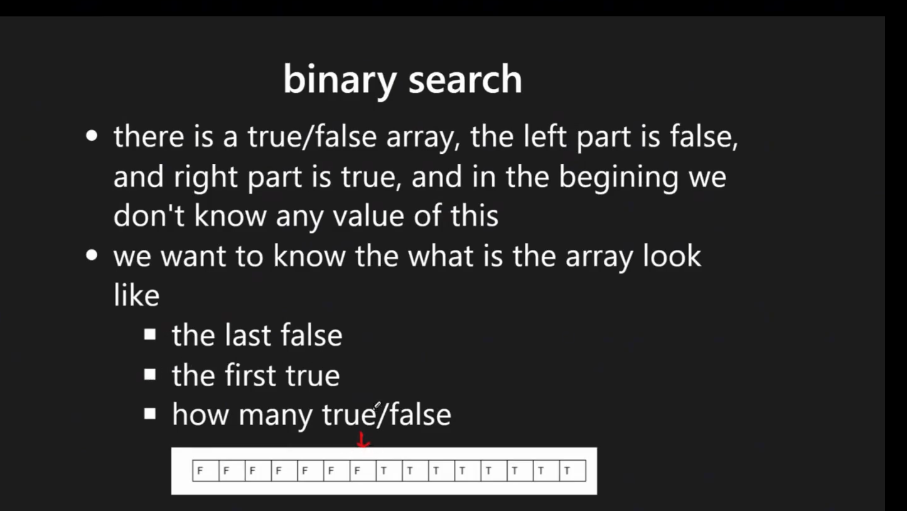

# Binary Search

## Overview

**Binary Search** is an efficient algorithm to find a target value in a **sorted search space** using two pointers.

### Key Properties
- **Time Complexity**: O(log n)
- **Space Complexity**: O(1) iterative, O(log n) recursive
- **Prerequisites**: Sorted array OR monotonic property
- **Search Space**: Not limited to fully sorted arrays - works with:
  - Fully sorted arrays
  - Partially sorted arrays
  - Rotated sorted arrays
  - Any space with monotonic properties

### Core Algorithm Steps
1. **Define boundaries**: Initialize `left` and `right` pointers to include all possible cases
2. **Define return values**: Determine what to return (index, value, -1, etc.)
3. **Define exit condition**: Choose appropriate loop condition (`<=`, `<`, or `< -1`)
4. **Update pointers**: Move boundaries based on comparison with target

### When to Use Binary Search
- **Sorted arrays**: Classic use case for finding exact values
- **Monotonic functions**: If `condition(k)` implies `condition(k+1)`, binary search applies
- **Search boundaries**: Finding first/last occurrence of a value
- **Optimization problems**: Finding minimum/maximum values satisfying constraints

### References
- **Frameworks**:
  - [labuladong Binary Search Framework](https://labuladong.online/algo/essential-technique/binary-search-framework/)
  - [Binary Search 101 Handbook](https://leetcode.com/problems/binary-search/discuss/423162/Binary-Search-101-The-Ultimate-Binary-Search-Handbook)
- **Problem Collections**:
  - [Binary Search in Action](https://labuladong.online/algo/frequency-interview/binary-search-in-action/)
  - [Binary Search Problem Set](https://labuladong.online/algo/problem-set/binary-search/)
- **Python Tools**:
  - [Python bisect module](https://github.com/yennanliu/CS_basics/blob/master/doc/cheatsheet/python_trick.md) - maintains sorted order during insertions


<p align="center"></p>


## Understanding Binary Search Pointer Behavior

### Core Insight: What Do `l` and `r` Actually Mean?

This is the **fundamental concept** that makes binary search work and explains why returning `l` is correct for insertion position problems like LC 35.

#### During the Loop: The Search Space Invariant

Throughout the binary search loop `while (l <= r)`:

- **Everything left of `l`** is strictly `< target`
- **Everything right of `r`** is strictly `> target`
- The possible location of `target` is always inside `[l, r]`

Each iteration removes half the search space while preserving this invariant.

```java
// Standard binary search pattern
while (l <= r) {
    int mid = l + (r - l) / 2;

    if (nums[mid] == target) {
        return mid;
    } else if (nums[mid] < target) {
        l = mid + 1;  // All elements [0..mid] are < target
    } else {
        r = mid - 1;  // All elements [mid..end] are > target
    }
}
```

#### When the Loop Ends: Pointer Positions

The loop terminates when `l > r`, which means `l == r + 1`.

At this exact moment, the array is split into two parts:

```
Visual Representation:

index:     0   ...   r   l   ...   n-1
value:   [< target]  gap  [> target]
```

**Key Properties When Loop Ends:**

1. `r` is the **last element smaller than target**
2. `l` is the **first element greater than or equal to target**
3. There is **no index between r and l** (since `r = l - 1`)

This is why `l` is the correct insertion position!

#### Visual Example

Let's trace through `nums = [1, 3, 5, 6], target = 4`:

```
Initial:
l=0, r=3
[1, 3, 5, 6]
 l        r

Step 1:
mid = 1, nums[1] = 3
3 < 4, so l = mid + 1 = 2
[1, 3, 5, 6]
       l  r

Step 2:
mid = 2, nums[2] = 5
5 > 4, so r = mid - 1 = 1
[1, 3, 5, 6]
    r  l

Loop ends (l > r):
- r points to 3 (last element < 4)
- l points to 5 (first element > 4)
- Insertion position is l = 2
```

#### Why Return `l`?

When binary search completes without finding the target:

```java
while (l <= r) {
    int mid = l + (r - l) / 2;
    if (nums[mid] == target) return mid;
    else if (nums[mid] < target) l = mid + 1;
    else r = mid - 1;
}

// Target not found
// At this point: l > r, specifically l == r + 1
return l;  // Correct insertion position
```

**Guarantee:**
- `nums[0..l-1] < target` (by construction during search)
- `nums[l..end] >= target` (by construction during search)

So `l` is either:
- The index where target should be inserted, or
- The index of the leftmost element equal to target

### Summary Table

| State | `l` Position | `r` Position | Meaning |
|-------|-------------|--------------|---------|
| **During loop** | First unchecked index >= target | Last unchecked index <= target | Search space is `[l, r]` |
| **Loop ends** | First element >= target | Last element < target | `l` is insertion point |
| **Visual** | `... r \| l ...` | No gap between them | `l = r + 1` |

### Application: Search Insert Position (LC 35)

```java
// LC 35 - The cleanest solution using pointer behavior
public int searchInsert(int[] nums, int target) {
    if (nums == null || nums.length == 0) {
        return 0;
    }

    int l = 0;
    int r = nums.length - 1;

    while (l <= r) {
        int mid = l + (r - l) / 2;

        if (nums[mid] == target) {
            return mid;
        } else if (nums[mid] < target) {
            l = mid + 1;
        } else {
            r = mid - 1;
        }
    }

    // Key insight: l is always the correct insertion position
    return l;
}
```

**Why this works without special cases:**

1. If target exists: we return mid during the loop
2. If target doesn't exist:
   - Loop ends with `l > r`
   - By invariant: `nums[0..l-1] < target` and `nums[l..end] >= target`
   - Therefore `l` is exactly where target should be inserted

### Common Mistake to Avoid

```java
// ❌ WRONG: Trying to handle "between mid and mid+1" during the loop
while (l <= r) {
    int mid = l + (r - l) / 2;
    if (nums[mid] == target) return mid;

    // This is unnecessary and error-prone!
    if (mid + 1 <= nums.length - 1 && target < nums[mid+1] && target > nums[mid]) {
        return mid + 1;
    }
    // ...
}
```

**Why this is wrong:** Binary search naturally converges to the correct position. Trust the pointer invariant and just return `l` after the loop.

---

## 1) Binary Search Types & Patterns

### 1.1) Basic Binary Search
- **Purpose**: Find exact target value in sorted array
- **Return**: Index of target, or -1 if not found
- **Complexity**: O(log n)

### 1.2) Search in Rotated Array
- **Key Concept**: Determine which half is sorted, then decide search direction
- **Applications**: Find target, find minimum element

#### Find Minimum in Rotated Sorted Array (LC 153)
```java
// Approach: Compare mid with boundaries to determine rotation point
while (r >= l) {
    int mid = (l + r) / 2;
    // Case 1: left subarray + mid is ascending -> search right
    if (nums[mid] >= nums[l]) {
        l = mid + 1;
    }
    // Case 2: right subarray + mid is ascending -> search left  
    else {
        r = mid - 1;
    }
}
```

```java
// Two-step approach: determine sorted half, then check target location
while (r >= l) {
    int mid = (l + r) / 2;
    
    if (nums[mid] == target) {
        return mid;
    }
    
    // Case 1: Left half is sorted (compare mid with left boundary)
    if (nums[mid] >= nums[l]) {
        // Check if target is in the sorted left half
        if (target >= nums[l] && target < nums[mid]) {
            r = mid - 1;  // Search left half
        } else {
            l = mid + 1;  // Search right half
        }
    }
    // Case 2: Right half is sorted
    else {
        // Check if target is in the sorted right half  
        if (target <= nums[r] && target > nums[mid]) {
            l = mid + 1;  // Search right half
        } else {
            r = mid - 1;  // Search left half
        }
    }
}
```

**Key Differences**:
- **LC 153** (Find Min): Only needs to determine which side to search
- **LC 33/81** (Find Target): Must check target location within sorted half

### 1.3) Recursive Binary Search
- **Use Cases**: When recursive approach is more intuitive
- **Space**: O(log n) due to call stack

### 1.4) Search in 2D Matrix (LC 74)
- **Approach 1**: Flatten matrix using `row = idx / cols`, `col = idx % cols`
- **Approach 2**: Row-by-row binary search
- **Time**: O(log(m×n))

### 1.5) Find Boundaries (LC 34)
**Purpose**: Find first and last occurrence of target
```java
// Template for finding boundaries
while (r >= l) {
    int mid = (l + r) / 2;
    
    if (nums[mid] == target) {
        // Key: Don't return immediately, continue searching
        if (findFirst) {
            r = mid - 1;  // Shrink right boundary to find leftmost
        } else {
            l = mid + 1;  // Shrink left boundary to find rightmost  
        }
    } else if (nums[mid] < target) {
        l = mid + 1;
    } else {
        r = mid - 1;
    }
}
// Post-processing needed to validate result
```

### 1.6) Left Boundary Search (LC 367, 875)
**Purpose**: Find the leftmost occurrence of target

```python
def find_left_boundary(nums, target):
    l, r = 0, len(nums) - 1
    
    while l <= r:
        mid = l + (r - l) // 2
        if nums[mid] < target:
            l = mid + 1
        elif nums[mid] > target:
            r = mid - 1
        else:  # nums[mid] == target
            r = mid - 1  # Keep searching left
    
    # Validate result
    if l >= len(nums) or nums[l] != target:
        return -1
    return l
```

```java
// Generic left boundary template
while (r >= l) {
    int mid = (l + r) / 2;
    if (condition(mid)) {
        r = mid - 1;  // Found valid, search for better (smaller) solution
    } else {
        l = mid + 1;  // Not valid, search larger values
    }
}
// Result is typically at index 'l'
```

### 1.7) Right Boundary Search
**Purpose**: Find the rightmost occurrence of target

```python
def find_right_boundary(nums, target):
    l, r = 0, len(nums) - 1
    
    while l <= r:
        mid = l + (r - l) // 2
        if nums[mid] < target:
            l = mid + 1
        elif nums[mid] > target:
            r = mid - 1
        else:  # nums[mid] == target
            l = mid + 1  # Keep searching right
    
    # Validate result  
    if r < 0 or nums[r] != target:
        return -1
    return r
```

### 1.8) Binary Search on Answer Space ⭐⭐⭐⭐⭐

**Critical Pattern** - One of the most important and frequently tested binary search applications in FAANG interviews.

#### Concept

Instead of searching for a value IN an array, we binary search on a **range of possible answers** and use a validation function to check feasibility.

**When to Use:**
- "Find minimum/maximum value that satisfies..."
- "What's the smallest/largest X such that..."
- "Can we achieve X? What's the optimal X?"
- Problem has **monotonic** property: if X works, then X+1 (or X-1) also works

**Key Recognition Keywords:**
- "Minimize the maximum..."
- "Maximize the minimum..."
- "Find the smallest capacity/speed/divisor..."
- "Can you split/allocate/distribute..."

**Common Problem Patterns:**
- LC 410: Split Array Largest Sum
- LC 1011: Capacity To Ship Packages Within D Days
- LC 875: Koko Eating Bananas
- LC 1283: Find the Smallest Divisor
- LC 1482: Minimum Number of Days to Make m Bouquets
- LC 2226: Maximum Candies Allocated to K Children

---

#### Template Pattern

**Structure:**
1. **Define search space**: [min_possible, max_possible]
2. **Binary search** on this range
3. **Validation function**: Check if current value satisfies constraints
4. **Update boundaries** based on minimization/maximization goal

```java
// Unified Template for Binary Search on Answer Space
public int binarySearchOnAnswer(int[] arr, int target) {
    // Step 1: Define search space boundaries
    int left = 1;              // Minimum possible answer
    int right = Integer.MAX_VALUE;  // Maximum possible answer (or sum, max element, etc.)

    // Step 2: Binary search on the answer space
    while (left < right) {  // or left <= right depending on problem
        int mid = left + (right - left) / 2;

        // Step 3: Check if 'mid' is a valid answer using validation function
        if (isValid(arr, mid, target)) {
            // If minimizing: valid answer found, try smaller
            right = mid;

            // If maximizing: valid answer found, try larger
            // left = mid + 1;
        } else {
            // If minimizing: mid is too small, try larger
            left = mid + 1;

            // If maximizing: mid is too large, try smaller
            // right = mid - 1;
        }
    }

    return left;  // or right, they converge to the same value
}

// Step 4: Validation function - checks if 'value' satisfies constraints
private boolean isValid(int[] arr, int value, int target) {
    // Problem-specific logic to check feasibility
    // Example: Can we split array into at most K subarrays with max sum <= value?
    // Returns true if 'value' is valid, false otherwise
    return true;  // placeholder
}
```

---

#### Decision Matrix: Minimize vs Maximize

| Goal | Valid Condition | Update Rule | Final Answer |
|------|----------------|-------------|--------------|
| **Minimize maximum** | If mid works | `right = mid` (try smaller) | `left` (smallest valid) |
| **Maximize minimum** | If mid works | `left = mid + 1` (try larger) | `left - 1` or `right` |

**Mnemonic:**
- **Minimize**: When valid, go **left** (smaller values)
- **Maximize**: When valid, go **right** (larger values)

---

#### Example 1: LC 410 - Split Array Largest Sum ⭐⭐⭐⭐⭐

**Problem:** Split array into m subarrays, minimize the largest sum among subarrays.

**Insight:** Binary search on possible "largest sum" values. For each mid, check if we can split array into ≤ m subarrays with each sum ≤ mid.

```java
// LC 410 - Split Array Largest Sum
class Solution {
    /**
     * time = O(N × log(sum))
     * space = O(1)
     *
     * Approach: Binary search on answer space [max_element, total_sum]
     */
    public int splitArray(int[] nums, int k) {
        // Step 1: Define search space
        int left = 0;   // Minimum: largest single element
        int right = 0;  // Maximum: sum of all elements

        for (int num : nums) {
            left = Math.max(left, num);  // Must fit largest element
            right += num;                // Upper bound is total sum
        }

        // Step 2: Binary search on possible "largest subarray sum"
        while (left < right) {
            int mid = left + (right - left) / 2;

            // Step 3: Check if we can split into ≤ k subarrays with max sum = mid
            if (canSplit(nums, k, mid)) {
                // Valid! Try smaller max sum (minimize)
                right = mid;
            } else {
                // Can't split with this sum, need larger max sum
                left = mid + 1;
            }
        }

        return left;  // Smallest valid maximum subarray sum
    }

    // Validation: Can we split array into at most k subarrays with max sum <= maxSum?
    private boolean canSplit(int[] nums, int k, int maxSum) {
        int subarrayCount = 1;  // Start with 1 subarray
        int currentSum = 0;

        for (int num : nums) {
            // Try to add num to current subarray
            if (currentSum + num <= maxSum) {
                currentSum += num;
            } else {
                // Start new subarray
                subarrayCount++;
                currentSum = num;

                // Early termination: too many subarrays needed
                if (subarrayCount > k) {
                    return false;
                }
            }
        }

        return true;  // Successfully split into ≤ k subarrays
    }
}
```

```python
# Python - LC 410
def splitArray(nums, k):
    """
    Time: O(n × log(sum))
    Space: O(1)
    """
    def can_split(max_sum):
        """Check if we can split into <= k subarrays with max sum <= max_sum"""
        subarray_count = 1
        current_sum = 0

        for num in nums:
            if current_sum + num <= max_sum:
                current_sum += num
            else:
                subarray_count += 1
                current_sum = num
                if subarray_count > k:
                    return False

        return True

    # Binary search on answer space
    left = max(nums)   # Min: largest element
    right = sum(nums)  # Max: total sum

    while left < right:
        mid = left + (right - left) // 2

        if can_split(mid):
            right = mid  # Try smaller (minimize)
        else:
            left = mid + 1

    return left
```

**Step-by-Step Trace:** `nums = [7,2,5,10,8], k = 2`

```
Search space: [10, 32]  (max element to sum)

Iteration 1: mid = 21
  Can split into [[7,2,5], [10,8]]? Sum = [14, 18] ≤ 21 ✓
  Valid! Try smaller: right = 21

Iteration 2: mid = 15
  Can split [[7,2,5], [10,8]]? Sum = [14, 18] ≤ 15 ✗ (18 > 15)
  Invalid! Need larger: left = 16

Iteration 3: mid = 18
  Can split [[7,2], [5,10], [8]]? Need 3 subarrays ✗ (k=2)
  Can split [[7,2,5], [10,8]]? Sum = [14, 18] ≤ 18 ✓
  Valid! Try smaller: right = 18

left = 16, right = 18
Iteration 4: mid = 17
  Can split? Need to check...

Final: left = 18 (minimum largest sum)
```

---

#### Example 2: LC 1011 - Capacity To Ship Packages

**Problem:** Ship packages within D days. Find minimum capacity needed.

```java
// LC 1011 - Capacity To Ship Packages Within D Days
class Solution {
    /**
     * time = O(N × log(sum))
     * space = O(1)
     */
    public int shipWithinDays(int[] weights, int days) {
        // Search space: [max_weight, sum_of_weights]
        int left = 0, right = 0;

        for (int weight : weights) {
            left = Math.max(left, weight);  // Must hold largest package
            right += weight;                // Upper bound
        }

        while (left < right) {
            int mid = left + (right - left) / 2;

            // Can we ship all packages within D days with capacity = mid?
            if (canShip(weights, days, mid)) {
                right = mid;  // Try smaller capacity (minimize)
            } else {
                left = mid + 1;
            }
        }

        return left;
    }

    // Check if we can ship within D days with given capacity
    private boolean canShip(int[] weights, int days, int capacity) {
        int daysNeeded = 1;
        int currentLoad = 0;

        for (int weight : weights) {
            if (currentLoad + weight <= capacity) {
                currentLoad += weight;
            } else {
                daysNeeded++;
                currentLoad = weight;

                if (daysNeeded > days) {
                    return false;
                }
            }
        }

        return true;
    }
}
```

---

#### Example 3: LC 875 - Koko Eating Bananas

**Problem:** Koko must eat all bananas within h hours. Find minimum eating speed.

```python
# LC 875 - Koko Eating Bananas
def minEatingSpeed(piles, h):
    """
    Time: O(n × log(max_pile))
    Space: O(1)
    """
    import math

    def can_finish(speed):
        """Check if Koko can finish with this speed"""
        hours_needed = sum(math.ceil(pile / speed) for pile in piles)
        return hours_needed <= h

    # Binary search on speed [1, max(piles)]
    left, right = 1, max(piles)

    while left < right:
        mid = left + (right - left) // 2

        if can_finish(mid):
            right = mid  # Try slower speed (minimize)
        else:
            left = mid + 1  # Need faster speed

    return left
```

---

#### Example 4: LC 1283 - Find the Smallest Divisor

**Problem:** Find smallest divisor such that sum(ceil(num/divisor)) ≤ threshold.

```java
// LC 1283 - Find the Smallest Divisor
class Solution {
    /**
     * time = O(N × log(max_num))
     * space = O(1)
     */
    public int smallestDivisor(int[] nums, int threshold) {
        int left = 1;
        int right = 0;

        for (int num : nums) {
            right = Math.max(right, num);
        }

        while (left < right) {
            int mid = left + (right - left) / 2;

            if (getDivisionSum(nums, mid) <= threshold) {
                right = mid;  // Valid, try smaller divisor (minimize)
            } else {
                left = mid + 1;  // Sum too large, need larger divisor
            }
        }

        return left;
    }

    private int getDivisionSum(int[] nums, int divisor) {
        int sum = 0;
        for (int num : nums) {
            sum += (num + divisor - 1) / divisor;  // Ceiling division
        }
        return sum;
    }
}
```

---

#### Common Patterns & Tricks

**Pattern 1: Minimize Maximum**
- Goal: Find smallest X where some maximum value ≤ X
- Update: `if valid: right = mid` (try smaller)
- Examples: LC 410, 1011, 1482

**Pattern 2: Maximize Minimum**
- Goal: Find largest X where some minimum value ≥ X
- Update: `if valid: left = mid + 1` (try larger)
- Examples: LC 1552, 2064

**Pattern 3: Count-Based Validation**
- Check: "Can we do it in at most K groups/days/operations?"
- Greedy approach: Try to fit as much as possible in each group
- Examples: LC 410 (subarrays), LC 1011 (days)

**Pattern 4: Sum-Based Validation**
- Check: "Is the sum/total within bounds?"
- Accumulate values and check threshold
- Examples: LC 1283 (division sum), LC 875 (hours)

---

#### Template Variations

**Variation 1: Closed Interval [left, right]**
```java
while (left <= right) {
    int mid = left + (right - left) / 2;
    if (isValid(mid)) {
        result = mid;  // Store potential answer
        right = mid - 1;  // Try to minimize
    } else {
        left = mid + 1;
    }
}
return result;
```

**Variation 2: Half-Open Interval [left, right)**
```java
while (left < right) {
    int mid = left + (right - left) / 2;
    if (isValid(mid)) {
        right = mid;  // Keep mid in range
    } else {
        left = mid + 1;
    }
}
return left;  // left == right
```

---

#### Interview Tips

**How to Recognize:**
1. Problem asks for "minimum/maximum" value
2. You can easily check "is X valid?" but not "what is the optimal X?"
3. Answer has monotonic property (if X works, X+1 or X-1 also works)

**Common Mistakes:**
1. **Wrong search space bounds**
   - Too narrow: Missing the optimal answer
   - Solution: Carefully analyze minimum (e.g., max element) and maximum (e.g., sum)

2. **Off-by-one in validation**
   ```java
   // ❌ WRONG: Using < instead of <=
   if (currentSum + num < maxSum) {...}

   // ✅ CORRECT: Must allow equality
   if (currentSum + num <= maxSum) {...}
   ```

3. **Wrong boundary update**
   - Minimize: `right = mid` (not `mid - 1`)
   - Maximize: `left = mid + 1`

4. **Inefficient validation**
   - Add early termination in validation function
   - Use greedy approach for O(n) validation

**Talking Points:**
- "This is a binary search on answer space problem"
- "I'll binary search on [min, max] and use a helper to validate"
- "The answer has monotonic property: if X works, larger X also works"
- "Time complexity: O(n × log(range)) where n is validation cost"

---

#### Related Problems (Sorted by Difficulty)

| Problem | Difficulty | Pattern | Key Insight |
|---------|------------|---------|-------------|
| LC 69 | Easy | Integer square root | Search on [0, x] |
| LC 875 | Medium | Minimize speed | Eating bananas, greedy validation |
| LC 1011 | Medium | Minimize capacity | Ship packages, similar to LC 410 |
| LC 1283 | Medium | Minimize divisor | Ceiling division, sum constraint |
| LC 410 | Hard | Minimize maximum | Split array, subarray sum |
| LC 1482 | Medium | Minimize days | Make bouquets, range validation |
| LC 1552 | Medium | Maximize minimum | Magnetic force, aggressive cows |
| LC 2226 | Medium | Maximize candies | Per-child allocation |

**Practice Progression:**
1. Start with LC 875 (clearest example)
2. Then LC 1011 (similar to 410 but easier)
3. Master LC 410 (classic, frequently asked)
4. Explore LC 1283, 1482 (variations)
5. Challenge: LC 1552, 2064 (maximize minimum pattern)

---

### 1.9) Related Algorithms & Data Structures

**Complementary Algorithms**:
- **Two Pointers**: For sorted arrays without random access
- **Sliding Window**: For subarray problems with certain properties
- **Recursion**: Alternative implementation approach

**Data Structures**:
- **Arrays**: Primary use case for binary search
- **Binary Search Trees**: Implicit binary search in tree traversal
- **Hash Tables**: O(1) lookup alternative when sorting not required

## 2) Binary Search Templates & Patterns

### Additional Resources
- [Binary-Search-101-The-Ultimate-Binary-Search-Handbook](https://leetcode.com/problems/binary-search/discuss/423162/Binary-Search-101-The-Ultimate-Binary-Search-Handbook)
- [Python Universal Binary Search Template](https://leetcode.com/discuss/general-discussion/786126/python-powerful-ultimate-binary-search-template-solved-many-problems)

#### 0-2-0) Loop Exit Conditions Comparison

**Key Difference**: The exit condition determines when the loop terminates and affects boundary handling.

| Condition | Boundary Type | When to Use | Key Characteristics |
|-----------|---------------|-------------|-------------------|
| `while (l <= r)` | **Closed [l, r]** | Standard binary search | • Most common approach<br>• Search space includes both l and r<br>• Need `l = mid + 1`, `r = mid - 1` |
| `while (l < r)` | **Half-open [l, r)** | Finding boundaries/insertion points | • Search space excludes r<br>• Loop ends when `l == r`<br>• Use `l = mid + 1`, `r = mid` |
| `while (l < r - 1)` | **Gap-based** | Avoiding infinite loops in special cases | • Ensures l and r are never adjacent<br>• Requires final check after loop<br>• Less common, used for complex conditions |

**Detailed Analysis:**

```java
// 1) while (l <= r) - CLOSED BOUNDARY [l, r]
while (l <= r) {
    int mid = l + (r - l) / 2;
    if (nums[mid] == target) return mid;
    else if (nums[mid] < target) l = mid + 1;  // MUST +1
    else r = mid - 1;                          // MUST -1
}
// Pros: Standard, easy to understand
// Cons: Can return -1 if not found
```

```java
// 2) while (l < r) - HALF-OPEN [l, r)
while (l < r) {
    int mid = l + (r - l) / 2;
    if (nums[mid] < target) l = mid + 1;       // +1 to exclude mid
    else r = mid;                              // NO -1, keep mid in range
}
// After loop: l == r, points to answer or insertion point
// Pros: Great for finding boundaries, no -1 return
// Cons: Requires different logic for different problems
```

```java
// 3) while (l < r - 1) - GAP-BASED
while (l < r - 1) {
    int mid = l + (r - l) / 2;
    if (condition(mid)) l = mid;
    else r = mid;
}
// Final check needed: examine both l and r
// Pros: Avoids infinite loops in complex conditions
// Cons: More complex, requires post-processing
```

**When to Use Each:**

- **`while (l <= r)`**: Classic binary search, finding exact values
- **`while (l < r)`**: Finding first/last occurrence, insertion position, peak finding
- **`while (l < r - 1)`**: Complex conditions where mid might equal l or r

#### Classic LeetCode Problems by Pattern

**Pattern 1: `while (l <= r)` - Exact Search**
- LC 704: Binary Search (basic implementation)
- LC 33: Search in Rotated Sorted Array
- LC 81: Search in Rotated Sorted Array II
- LC 74: Search a 2D Matrix
- LC 240: Search a 2D Matrix II
- LC 69: Sqrt(x)
- LC 367: Valid Perfect Square
- LC 441: Arranging Coins

**Pattern 2: `while (l < r)` - Boundary/Peak Finding**
- LC 34: Find First and Last Position of Element
- LC 35: Search Insert Position
- LC 162: Find Peak Element
- LC 852: Peak Index in a Mountain Array
- LC 153: Find Minimum in Rotated Sorted Array
- LC 154: Find Minimum in Rotated Sorted Array II
- LC 278: First Bad Version
- LC 658: Find K Closest Elements
- LC 744: Find Smallest Letter Greater Than Target

**Pattern 3: `while (l < r - 1)` - Complex Conditions**
- LC 410: Split Array Largest Sum (with validation function)
- LC 875: Koko Eating Bananas (with time calculation)
- LC 1011: Capacity To Ship Packages Within D Days
- LC 1060: Missing Element in Sorted Array
- LC 1482: Minimum Number of Days to Make m Bouquets

### 2.1) Standard Binary Search Template

**Key Principles**:
- **Initialization**: `left = 0, right = nums.length - 1` (closed interval)
- **Loop Condition**: `while (left <= right)`  
- **Pointer Updates**: `left = mid + 1`, `right = mid - 1`
- **Clarity Tip**: Use `else if` for all conditions to make logic explicit

> **Programming Tip**: Avoid using `else` - write all conditions as `else if` to clearly show all cases and avoid bugs.

```java
// Java Implementation
public int binarySearch(int[] nums, int target) {
    int left = 0;
    int right = nums.length - 1;
    
    // Use <= to search when left == right
    while (left <= right) {
        int mid = left + (right - left) / 2;  // Avoid overflow
        
        if (nums[mid] == target) {
            return mid;
        } else if (nums[mid] < target) {
            left = mid + 1;   // Target in right half
        } else {  // nums[mid] > target
            right = mid - 1;  // Target in left half
        }
    }
    return -1;  // Not found
}
```

```python
# Python Implementation  
def binary_search(nums, target):
    left, right = 0, len(nums) - 1
    
    # Closed boundary [left, right] - includes both endpoints
    while left <= right:
        mid = left + (right - left) // 2  # Avoid overflow
        
        if nums[mid] == target:
            return mid
        elif nums[mid] < target:
            left = mid + 1   # Search right half
        else:
            right = mid - 1  # Search left half
            
    return -1  # Target not found
```

### 2.2) Left Boundary Template

**Use Cases**: Find leftmost occurrence, insertion point, first valid solution

```java
/**
 * Key Differences from Standard Binary Search:
 * 1. When nums[mid] == target: shrink RIGHT boundary (right = mid - 1)
 * 2. Post-processing: validate the result before returning
 */
public int findLeftBoundary(int[] nums, int target) {
    int left = 0;
    int right = nums.length - 1;
    
    while (left <= right) {
        int mid = left + (right - left) / 2;
        
        if (nums[mid] < target) {
            left = mid + 1;
        } else if (nums[mid] > target) {
            right = mid - 1;
        } else {  // nums[mid] == target
            // DON'T return! Continue searching for leftmost occurrence
            right = mid - 1;  // Shrink right boundary
        }
    }
    
    // Validate result - check bounds and target match
    if (left >= nums.length || nums[left] != target) {
        return -1;
    }
    return left;
}
```

```python
# Python Left Boundary Implementation
def find_left_boundary(nums, target):
    left, right = 0, len(nums) - 1
    
    while left <= right:
        mid = left + (right - left) // 2
        
        if nums[mid] < target:
            left = mid + 1
        elif nums[mid] > target:
            right = mid - 1
        else:  # nums[mid] == target
            # Continue searching left for first occurrence
            right = mid - 1
    
    # Validate: check if left is within bounds and points to target
    if left >= len(nums) or nums[left] != target:
        return -1
    return left
```

### 2.3) Right Boundary Template

**Use Cases**: Find rightmost occurrence, last valid solution


```java
/**
 * Key Differences from Standard Binary Search:
 * 1. When nums[mid] == target: shrink LEFT boundary (left = mid + 1)
 * 2. Return left - 1 after validation
 */
public int findRightBoundary(int[] nums, int target) {
    int left = 0;
    int right = nums.length - 1;
    
    while (left <= right) {
        int mid = left + (right - left) / 2;
        
        if (nums[mid] < target) {
            left = mid + 1;
        } else if (nums[mid] > target) {
            right = mid - 1;
        } else {  // nums[mid] == target
            // DON'T return! Continue searching for rightmost occurrence
            left = mid + 1;  // Shrink left boundary
        }
    }
    
    // Validate result - return left - 1
    if (right < 0 || nums[right] != target) {
        return -1;
    }
    return right;
}
```


```python
# Python Right Boundary Implementation
def find_right_boundary(nums, target):
    left, right = 0, len(nums) - 1
    
    while left <= right:
        mid = left + (right - left) // 2
        
        if nums[mid] < target:
            left = mid + 1
        elif nums[mid] > target:
            right = mid - 1
        else:  # nums[mid] == target
            # Continue searching right for last occurrence
            left = mid + 1
    
    # Validate: check if right is within bounds and points to target
    if right < 0 or nums[right] != target:
        return -1
    return right
```

## 3) Summary & Quick Reference

### 3.1) When to Use Binary Search
✅ **Use Binary Search When:**
- Array is sorted (fully, partially, or rotationally)
- Search space has monotonic property
- Need O(log n) search performance
- Looking for boundaries or insertion points
- Optimization problems with binary nature

### 3.2) Template Selection Guide

| Problem Type | Template | Key Characteristics |
|-------------|----------|-------------------|
| **Exact Search** | Standard (`while l <= r`) | Return index or -1 |
| **Left Boundary** | Left Template | Find first occurrence |
| **Right Boundary** | Right Template | Find last occurrence |
| **Insert Position** | Left Template | Find insertion point |
| **Peak/Valley** | Half-open (`while l < r`) | Converge to answer |
| **Complex Conditions** | Gap-based (`while l < r-1`) | Avoid infinite loops |

### 3.3) Common Pitfalls & Tips

**🚫 Common Mistakes:**
- Integer overflow in `mid = (left + right) / 2` → Use `mid = left + (right - left) / 2`
- Wrong boundary updates (`mid` vs `mid ± 1`)
- Forgetting post-processing validation
- Infinite loops with `while l < r` and wrong updates

**✅ Best Practices:**
- Always use `else if` for clarity
- Validate results after boundary searches  
- Choose consistent boundary type (closed vs half-open)
- Test with edge cases: empty array, single element, duplicates

### 3.4) Time & Space Complexity
- **Time**: O(log n) for search, O(n) for validation if needed
- **Space**: O(1) iterative, O(log n) recursive

## 4) LeetCode Examples & Applications

This section demonstrates how to apply binary search patterns to solve specific problems.

### 4.1) Search in Rotated Sorted Array (LC 33, LC 81)
```python
# LC 033. Search in Rotated Sorted Array
# LC 081. Search in Rotated Sorted Array II
# V0
# IDEA : BINARY SEARCH
#        -> CHECK WHICH PART IS ORDERING
#        -> CHECK IF TARGET IS IN WHICH PART
# CASES :
#  1) if mid is on the right of pivot -> array[mid:] is ordering
#     -> check if mid in on the left or right on mid
#     -> binary search on left or right sub array
#  2) if mid in on the left of pivot  -> array[:mid] is ordering
#     -> check if mid in on the left or right on mid
#     -> binary search on left or right sub array
### NOTE : THE NESTED IF ELSE CONDITION 
class Solution(object):
    def search(self, nums, target):
        if not nums: return -1
        left, right = 0, len(nums) - 1
        while left <= right:
            mid = (left + right) // 2
            if nums[mid] == target:
                return mid
            #---------------------------------------------
            # Case 1 :  nums[mid:right] is ordering
            #---------------------------------------------
            # all we need to do is : 1) check if target is within mid - right, and move the left or right pointer
            if nums[mid] < nums[right]:
                # mind NOT use (" nums[mid] < target <= nums[right]")
                # mind the "<="
                if target > nums[mid] and target <= nums[right]: # check the relationship with target, which is different from the default binary search
                    left = mid + 1
                else:
                    right = mid - 1
            #---------------------------------------------
            # Case 2 :  nums[left:mid] is ordering
            #---------------------------------------------
            # all we need to do is : 1) check if target is within left - mid, and move the left or right pointer
            else:
                # # mind NOT use (" nums[left] <= target < nums[mid]")
                # mind the "<="
                if target < nums[mid] and target >= nums[left]:  # check the relationship with target, which is different from the default binary search
                    right = mid - 1
                else:
                    left = mid + 1
        return -1     
```

```java
// java
// LC 33
// V3
// IDEA : One Binary Search
// https://leetcode.com/problems/search-in-rotated-sorted-array/editorial/
public int search_4(int[] nums, int target) {
    int n = nums.length;
    int left = 0, right = n - 1;

    while (left <= right) {
        int mid = left + (right - left) / 2;

        // Case 1: find target
        if (nums[mid] == target) {
            return mid;
        }

        // Case 2: subarray on mid's left is sorted
        else if (nums[mid] >= nums[left]) {
            if (target >= nums[left] && target < nums[mid]) {
                right = mid - 1;
            } else {
                left = mid + 1;
            }
        }

        // Case 3: subarray on mid's right is sorted
        else {
            if (target <= nums[right] && target > nums[mid]) {
                left = mid + 1;
            } else {
                right = mid - 1;
            }
        }
    }

    return -1;
}
```

### 4.2) Two Sum II - Input Array is Sorted (LC 167)
**Approach**: Binary search for each element's complement
```python
# 167 Two Sum II - Input array is sorted
class Solution(object):
    def twoSum(self, numbers, target):
        for i in range(len(numbers)):
            l, r = i+1, len(numbers)-1
            tmp = target - numbers[i]
            while l <= r:
                mid = l + (r-l)//2
                if numbers[mid] == tmp:
                    return [i+1, mid+1]
                elif numbers[mid] < tmp:
                    l = mid+1
                else:
                    r = mid-1
```

### 4.3) Find Peak Element (LC 162, LC 852)
**Approach**: Compare mid with adjacent elements to determine search direction
```python
# LC 162 Find Peak Element, LC 852 Peak Index in a Mountain Array
# V0'
# IDEA : RECURSIVE BINARY SEARCH
class Solution(object):
    def findPeakElement(self, nums):

        def help(nums, l, r):
            if l == r:
                return l
            mid = l + (r - l) // 2
            if (nums[mid] > nums[mid+1]):
                return help(nums, l, mid) # r = mid
            return help(nums, mid+1, r) # l = mid + 1
            
        return help(nums, 0, len(nums)-1)
```

```java
// java
// LC 162
// V2
// IDEA: RECURSIVE BINARY SEARCH
// https://leetcode.com/problems/find-peak-element/editorial/
    // NOTE : ONLY have to compare index i with index i + 1 (its right element)
    //        ; otherwise, i-1 already returned as answer
    public int findPeakElement_2(int[] nums) {
        return search(nums, 0, nums.length - 1);
    }
    public int search(int[] nums, int l, int r) {
        if (l == r)
            return l;
        int mid = (l + r) / 2;
        if (nums[mid] > nums[mid + 1])
            return search(nums, l, mid);
        return search(nums, mid + 1, r);
    }

// V3
// IDEA: ITERATIVE BINARY SEARCH
// https://leetcode.com/problems/find-peak-element/editorial/
    public int findPeakElement_3(int[] nums) {
        int l = 0, r = nums.length - 1;
        while (l < r) {
            int mid = (l + r) / 2;
            if (nums[mid] > nums[mid + 1])
                r = mid;
            else
                l = mid + 1;
        }
        return l;
    }
```

### 4.4) Valid Perfect Square (LC 367) & Sqrt(x) (LC 69)
**Approach**: Binary search on the range [1, num] to find square root
```python
# 367 Valid Perfect Square, LC 69 Sqrt(x)
# V0'
# IDEA : BINARY SEARCH
class Solution(object):
    def isPerfectSquare(self, num):
        left, right = 0, num
        while left <= right:
            ### NOTE : there is NO mid * mid == num condition
            mid = (left + right) / 2
            if mid * mid >= num:
                right = mid - 1
            else:
                left = mid + 1
        ### NOTE this
        return left * left == num
```

```java
// java
// LC 367
public boolean isPerfectSquare(int num) {

    if (num < 2) {
        return true;
    }

    long left = 2;
    long right = num / 2; // NOTE !!!, "long right = num;" is OK as well
    long x;
    long guessSquared;

    while (left <= right) {
        x = (left + right) / 2;
        guessSquared = x * x;
        if (guessSquared == num) {
            return true;
        }
        if (guessSquared > num) {
            right = x - 1;
        } else {
            left = x + 1;
        }
    }
    return false;
}
```

### 4.5) Minimum Size Subarray Sum (LC 209)
**Approach**: Binary search on possible subarray lengths + sliding window validation
```python
# LC 209 Minimum Size Subarray Sum
### NOTE : there is also sliding window approach
# V1' 
# http://bookshadow.com/weblog/2015/05/12/leetcode-minimum-size-subarray-sum/
# IDEA : BINARY SEARCH 
class Solution:
    def minSubArrayLen(self, s, nums):
        size = len(nums)
        left, right = 0, size
        bestAns = 0
        while left <= right:
            mid = (left + right) / 2
            if self.solve(mid, s, nums):
                bestAns = mid
                right = mid - 1
            else:
                left = mid + 1
        return bestAns

    def solve(self, l, s, nums):
        sums = 0
        for x in range(len(nums)):
            sums += nums[x]
            if x >= l:
                sums -= nums[x - l]
            if sums >= s:
                return True
        return False
```

### 4.6) First Bad Version (LC 278)
**Approach**: Binary search to find the first occurrence where isBadVersion() returns true
```python
# LC 278
# V0
# IDEA : binary search
class Solution(object):
    def firstBadVersion(self, n):
        left = 1 
        right = n
        while right > left + 1:
            mid = (left + right)//2
            if SVNRepo.isBadVersion(mid):
                end = mid 
            else:
                left = mid 
        if SVNRepo.isBadVersion(left):
            return left
        return right 
```

### 4.7) Search Insert Position (LC 35)
**Approach**: Find leftmost position where target can be inserted
```python
# LC 035 Search Insert Position
# V1' 
# https://blog.csdn.net/fuxuemingzhu/article/details/70738108
class Solution(object):
    def searchInsert(self, nums, target):
        N = len(nums)
        left, right = 0, N #[left, right)
        while left < right:
            mid = left + (right - left) / 2
            if nums[mid] == target:
                return mid
            elif nums[mid] > target:
                right = mid
            else:
                left = mid + 1
        return left
```

### 4.8) Capacity To Ship Packages Within D Days (LC 1011)
**Approach**: Binary search on capacity + greedy validation
```python
# LC 1011
# V1
# IDEA : BINARY SEARCH
# https://leetcode.com/problems/capacity-to-ship-packages-within-d-days/discuss/390359/Simple-Python-Binary-Search
# V0
# IDEA : BINARY SEARCH
class Solution(object):
     def shipWithinDays(self, weights, D):
            """
            NOTE !!!
                -> for this help func,
                -> we ONLY need to check weights can split by offered max_wgt
                -> so the return val is boolean (True or False)
            """
            # help func
            def cannot_split(weights, D, max_wgt):
                s = 0
                days = 1
                for w in weights:
                    s += w
                    if s > max_wgt:
                        s = w
                        days += 1
                return days > D

            """
            NOTE this !!!
                -> for l, we use max(weights)
                -> for r, we use sum(weights)
            """
            l = max(weights)
            r = sum(weights)
            while l <= r:
                mid = l + (r - l) // 2
                if cannot_split(weights, D, mid):
                    l = mid + 1
                else:
                    r = mid - 1
            return l
```

### 4.9) Split Array Largest Sum (LC 410) [Hard]
**Approach**: Binary search on the maximum sum + greedy partitioning
```python
# LC 410 Split Array Largest Sum [Hard]
```

### 4.10) Koko Eating Bananas (LC 875)
**Approach**: Binary search on eating speed + time calculation validation

```java
// java
// LC 875

// V0
// IDEA : BINARY SEARCH (close boundary)
/**
 *  KEY !!!!
 *
 *   -> When r < l, it means the `smallest` valid eating speed is l
 *
 */
public int minEatingSpeed(int[] piles, int h) {

    if (piles.length == 0 || piles.equals(null)){
        return 0;
    }

    int l = 1; //Arrays.stream(piles).min().getAsInt();
    int r = Arrays.stream(piles).max().getAsInt();

    while (r >= l){
        int mid = (l + r) / 2;
        int _hour = getCompleteTime(piles, mid);
        if (_hour <= h){
            r = mid - 1;
        }else{
            l = mid + 1;
        }
    }

    return l;
}
```

### 4.11) Find K Closest Elements (LC 658)
**Approach**: Two pointers approach to shrink array to k elements
```python
# LC 658. Find K Closest Elements
# V1'
# https://blog.csdn.net/fuxuemingzhu/article/details/82968136
# IDEA : TWO POINTERS 
class Solution(object):
    def findClosestElements(self, arr, k, x):
        # since the array already sorted, arr[-1] must be the biggest one,
        # while arr[0] is the smallest one
        # so if the distance within arr[-1],  x >  arr[0],  x
        # then remove the arr[-1] since we want to keep k elements with smaller distance,
        # and vice versa (remove arr[0]) 
        while len(arr) > k:
            if x - arr[0] <= arr[-1] - x:
                arr.pop()
            else:
                arr.pop(0)
        return arr
```

### 4.12) Sqrt(x) (LC 69) - Alternative Implementation
**Approach**: Binary search with careful boundary handling
```python
# LC 069 Sqrt(x)
# V0
# IDEA : binary search
class Solution(object):
    def mySqrt(self, x):
        # edge case
        if not x or x <= 0:
            return 0
        if x == 1:
            return 1
        l = 0
        r = x-1
        while r >= l:
            mid = l + (r-l)//2
            #print ("l = " + str(l) + " r = " + str(r) + " mid = " + str(mid))
            sq = mid** 2
            if sq == x:
                return mid
            elif sq < x:
                if (mid+1)**2 > x:
                    return mid
                l = mid + 1
            else:
                r = mid - 1

# V0
# IDEA : binary search
class Solution(object):
    def mySqrt(self, num):
        if num <= 1:
            return num
        l = 0
        r = num - 1
        while r >= l:
            mid = l + (r - l) // 2
            if mid * mid == num:
                return mid
            elif mid * mid > num:
                r = mid - 1
            else:
                l = mid + 1
        return l if l * l < num else l - 1
```

### 4.13) Find First and Last Position of Element in Sorted Array (LC 34)
**Approach**: Use left and right boundary search templates
```python
# 34. Find First and Last Position of Element in Sorted Array
# V0
# IDEA : BINARY SEARCH
class Solution:
    def searchRange(self, nums: List[int], target: int) -> List[int]:
        
        def search(x):
            lo, hi = 0, len(nums)           
            while lo < hi:
                mid = (lo + hi) // 2
                if nums[mid] < x:
                    lo = mid+1
                else:
                    hi = mid                    
            return lo
        
        lo = search(target)
        hi = search(target+1)-1
        
        if lo <= hi:
            return [lo, hi]
                
        return [-1, -1]
```

```java
// java
// LC 34

// V0
// IDEA: BINARY SEARCH (fixed by gpt)
public int[] searchRange(int[] nums, int target) {
    int[] res = new int[]{-1, -1}; // Default result

    if (nums == null || nums.length == 0) {
        return res;
    }

    // Find the first occurrence of target
    int left = findBound(nums, target, true);
    if (left == -1) {
        return res; // Target not found
    }

    // Find the last occurrence of target
    int right = findBound(nums, target, false);

    return new int[]{left, right};
}

private int findBound(int[] nums, int target, boolean isFirst) {
    int l = 0, r = nums.length - 1;
    int bound = -1;

    while (l <= r) {
        int mid = l + (r - l) / 2;

        if (nums[mid] == target) {
            bound = mid;
            if (isFirst) {
                r = mid - 1; // Keep searching left
            } else {
                l = mid + 1; // Keep searching right
            }
        } else if (nums[mid] < target) {
            l = mid + 1;
        } else {
            r = mid - 1;
        }
    }

    return bound;
}
```


### 4.14) Search a 2D Matrix (LC 74)
**Approach**: Flatten 2D matrix to 1D using index conversion
```java
// java
// LC 74
// V1
// IDEA : BINARY SEARCH + FLATTEN MATRIX
// https://leetcode.com/problems/search-a-2d-matrix/editorial/
public boolean searchMatrix_2(int[][] matrix, int target) {
    int m = matrix.length;
    if (m == 0)
        return false;
    int n = matrix[0].length;

    // binary search
    /** NOTE !!! FLATTEN MATRIX */
    int left = 0, right = m * n - 1;
    int pivotIdx, pivotElement;
    while (left <= right) {
        pivotIdx = (left + right) / 2;
        /** NOTE !!! TRICK HERE :
         *
         *   pivotIdx / n : y index
         *   pivotIdx % n : x index
         */
        pivotElement = matrix[pivotIdx / n][pivotIdx % n];
        if (target == pivotElement)
            return true;
        else {
            if (target < pivotElement)
                right = pivotIdx - 1;
            else
                left = pivotIdx + 1;
        }
    }
    return false;
}
```

### 4.15) Find Minimum in Rotated Sorted Array (LC 153)
**Approach**: Compare mid with boundaries to find rotation point
```java
// java
// LC 153

    // V0
    // IDEA : BINARY SEARCH (CLOSED BOUNDARY)
    // https://youtu.be/nIVW4P8b1VA?si=AMhTJOUhDziBz-CV
    /**
     *  NOTE !!!
     *
     *  key : check current `mid point` is at  `left part` or `right part`
     *  if `at left part`
     *   -> nums[l] ~ nums[mid] is in INCREASING order
     *   -> need to search `RIGHT part`, since right part is ALWAYS SMALLER then left part
     *
     *  else, `at right part`
     *   -> need to search `LEFT part`
     */
    public int findMin(int[] nums) {
        int l = 0;
        int r = nums.length - 1;
        int res = nums[0];

        /** NOTE !!! closed boundary */
        while (l <= r) {

            // edge case : is array already in increasing order (e.g. [1,2,3,4,5])
            if (nums[l] < nums[r]) {
                res = Math.min(res, nums[l]);
                break;
            }

            int m = l + (r - l) / 2;
            res = Math.min(res, nums[m]);

            // case 1) mid point is at `LEFT part`
            // e.g. [3,4,5,1,2]
            if (nums[m] >= nums[l]) {
                l = m + 1;
            }
            // case 2) mid point is at `RIGHT part`
            // e.g. [5,1,2,3,4]
            else {
                r = m - 1;
            }
        }
        return res;
    }
```

### 4.16) Find First and Last Position - Alternative Implementation
**Approach**: Separate functions for finding first and last occurrences

```java
// java
// LC 34
    public int[] searchRange_1(int[] nums, int target) {
        int[] result = new int[2];
        result[0] = findFirst(nums, target);
        result[1] = findLast(nums, target);
        return result;
    }

    private int findFirst(int[] nums, int target) {
        int idx = -1;
        int start = 0;
        int end = nums.length - 1;
        while (start <= end) {
            int mid = (start + end) / 2;

            /** NOTE !!!
             *
             * 1) nums[mid] >= target (find right boundary)
             * 2) we put equals condition below  (nums[mid] == target)
             */
            if (nums[mid] >= target) {
                end = mid - 1;
            } else {
                start = mid + 1;
            }
            if (nums[mid] == target)
                idx = mid;
        }
        return idx;
    }

    private int findLast(int[] nums, int target) {
        int idx = -1;
        int start = 0;
        int end = nums.length - 1;
        while (start <= end) {
            int mid = (start + end) / 2;
            /** NOTE !!!
             *
             * 1) nums[mid] <= target (find left boundary)
             * 2) we put equals condition below  (nums[mid] == target)
             */
            if (nums[mid] <= target) {
                start = mid + 1;
            } else {
                end = mid - 1;
            }
            if (nums[mid] == target)
                idx = mid;
        }
        return idx;
    }
```

### 4.17) Find Smallest Letter Greater Than Target (LC 744)
**Pattern**: `while (l < r)` - Finding insertion position
```python
# LC 744 Find Smallest Letter Greater Than Target
class Solution(object):
    def nextGreatestLetter(self, letters, target):
        l, r = 0, len(letters)
        
        # Use half-open boundary [l, r)
        while l < r:
            mid = l + (r - l) // 2
            if letters[mid] <= target:  # Need strictly greater
                l = mid + 1
            else:
                r = mid
        
        # Handle circular array - if no letter greater than target, return first
        return letters[l % len(letters)]
```

### 4.18) Arranging Coins (LC 441)
**Pattern**: `while (l <= r)` - Finding exact value with mathematical property
```java
// LC 441 Arranging Coins
public int arrangeCoins(int n) {
    long l = 0, r = n;
    
    while (l <= r) {
        long mid = l + (r - l) / 2;
        long coins = mid * (mid + 1) / 2;  // Sum of 1+2+...+mid
        
        if (coins == n) {
            return (int) mid;
        } else if (coins < n) {
            l = mid + 1;
        } else {
            r = mid - 1;
        }
    }
    
    return (int) r;  // Return the complete rows we can form
}
```

### 4.19) Minimum Number of Days to Make m Bouquets (LC 1482)
**Pattern**: `while (l < r - 1)` - Complex validation with helper function
```python
# LC 1482 Minimum Number of Days to Make m Bouquets
class Solution(object):
    def minDays(self, bloomDay, m, k):
        if m * k > len(bloomDay):
            return -1
        
        def canMakeBouquets(days):
            bouquets = consecutive = 0
            for bloom in bloomDay:
                if bloom <= days:
                    consecutive += 1
                    if consecutive == k:
                        bouquets += 1
                        consecutive = 0
                else:
                    consecutive = 0
            return bouquets >= m
        
        l, r = min(bloomDay), max(bloomDay)
        
        while l < r:
            mid = l + (r - l) // 2
            if canMakeBouquets(mid):
                r = mid
            else:
                l = mid + 1
        
        return l
```

### 4.20) Search a 2D Matrix II (LC 240)
**Pattern**: `while (l <= r)` - Search with elimination technique
```python
# LC 240 Search a 2D Matrix II
class Solution(object):
    def searchMatrix(self, matrix, target):
        if not matrix or not matrix[0]:
            return False
        
        # Start from top-right corner
        row, col = 0, len(matrix[0]) - 1
        
        while row < len(matrix) and col >= 0:
            if matrix[row][col] == target:
                return True
            elif matrix[row][col] > target:
                col -= 1  # Move left
            else:
                row += 1  # Move down
        
        return False
```

### 4.21) Find Minimum in Rotated Sorted Array II (LC 154)
**Pattern**: `while (l < r)` - Handling duplicates in rotated array
```java
// LC 154 Find Minimum in Rotated Sorted Array II (with duplicates)
public int findMin(int[] nums) {
    int l = 0, r = nums.length - 1;
    
    while (l < r) {
        int mid = l + (r - l) / 2;
        
        if (nums[mid] < nums[r]) {
            // Right half is sorted, minimum is in left half (including mid)
            r = mid;
        } else if (nums[mid] > nums[r]) {
            // Left half is sorted, minimum is in right half
            l = mid + 1;
        } else {
            // nums[mid] == nums[r], can't determine which half to search
            // Reduce search space by 1
            r--;
        }
    }
    
    return nums[l];
}
```

### 4.22) Missing Element in Sorted Array (LC 1060)
**Pattern**: `while (l < r - 1)` - Finding missing elements with gap calculation
```python
# LC 1060 Missing Element in Sorted Array
class Solution(object):
    def missingElement(self, nums, k):
        def missing_count(idx):
            # How many numbers are missing up to nums[idx]
            return nums[idx] - nums[0] - idx
        
        n = len(nums)
        
        # If k-th missing number is beyond the array
        if k > missing_count(n - 1):
            return nums[-1] + k - missing_count(n - 1)
        
        l, r = 0, n - 1
        
        # Find the largest index where missing_count < k
        while l < r - 1:
            mid = l + (r - l) // 2
            if missing_count(mid) < k:
                l = mid
            else:
                r = mid
        
        # The k-th missing number is between nums[l] and nums[r]
        return nums[l] + k - missing_count(l)
```