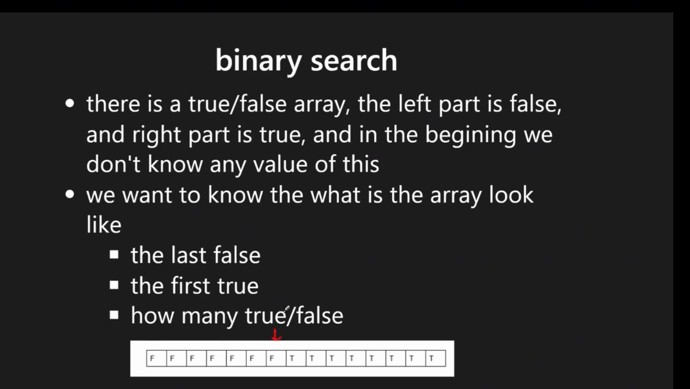

# Binary Search

> **Scope** — Halving a **monotonic** search space — the loop-invariant reasoning behind `l <= r` vs `l < r`, the boundary (lower/upper bound) templates, rotated arrays, and floating-point and 2D search.
> **See also** — *deep dives split out of this file*: [binary_search_on_answer.md](./binary_search_on_answer.md) — searching the *answer space*: the `canFinish` / `isValid` predicate, minimise-maximum vs maximise-minimum, and value-domain counting; [binary_search_examples.md](./binary_search_examples.md) — the worked-problem archive, one canonical solution per problem.
> *Neighbouring sheets*: [sort.md](./sort.md) — getting the array sorted first; [advanced_divide_and_conquer.md](./advanced_divide_and_conquer.md) — halving *with* a merge step; [bst.md](./bst.md) — the same invariant as a data structure; [heap.md](./heap.md) — k-th element without ordering; [monotonic_stack.md](./monotonic_stack.md) — the *positional* "next greater", which is the pattern lower bound is most often confused with.


## LeetCode Problem Lists

- [Binary Search](https://leetcode.com/problem-list/binary-search/)

## Overview

**Binary Search** is an efficient algorithm to find a target value in a **sorted search space** using two pointers.

### Key Properties
- **Time Complexity**: O(log n)
- **Space Complexity**: O(1) iterative, O(log n) recursive
- **Prerequisites**: Sorted array OR monotonic property
- **Search Space**: Not limited to fully sorted arrays - works with:
  - Fully sorted arrays
  - Partially sorted arrays
  - Rotated sorted arrays
  - Any space with monotonic properties

### Core Algorithm Steps
1. **Define boundaries**: Initialize `left` and `right` pointers to include all possible cases
2. **Define return values**: Determine what to return (index, value, -1, etc.)
3. **Define exit condition**: Choose appropriate loop condition (`<=`, `<`, or `< -1`)
4. **Update pointers**: Move boundaries based on comparison with target

### When to Use Binary Search
- **Sorted arrays**: Classic use case for finding exact values
- **Monotonic functions**: If `condition(k)` implies `condition(k+1)`, binary search applies
- **Search boundaries**: Finding first/last occurrence of a value
- **Optimization problems**: Finding minimum/maximum values satisfying constraints

### References
- **Frameworks**:
  - [labuladong Binary Search Framework](https://labuladong.online/algo/essential-technique/binary-search-framework/)
  - [Binary Search 101 Handbook](https://leetcode.com/problems/binary-search/discuss/423162/Binary-Search-101-The-Ultimate-Binary-Search-Handbook)
- **Problem Collections**:
  - [Binary Search in Action](https://labuladong.online/algo/frequency-interview/binary-search-in-action/)
  - [Binary Search Problem Set](https://labuladong.online/algo/problem-set/binary-search/)
- **Python Tools**:
  - [Python bisect module](https://github.com/yennanliu/CS_basics/blob/master/doc/cheatsheet/python_trick.md) - maintains sorted order during insertions
  - [Python Universal Binary Search Template](https://leetcode.com/discuss/general-discussion/786126/python-powerful-ultimate-binary-search-template-solved-many-problems) - one template, many problems


<p align="center"></p>


## Understanding Binary Search Pointer Behavior

### Core Insight: What Do `l` and `r` Actually Mean?

This is the **fundamental concept** that makes binary search work and explains why returning `l` is correct for insertion position problems like LC 35.

#### During the Loop: The Search Space Invariant

Throughout the binary search loop `while (l <= r)`:

- **Everything left of `l`** is strictly `< target`
- **Everything right of `r`** is strictly `> target`
- The possible location of `target` is always inside `[l, r]`

Each iteration removes half the search space while preserving this invariant.

```java
// Standard binary search pattern
while (l <= r) {
    int mid = l + (r - l) / 2;

    if (nums[mid] == target) {
        return mid;
    } else if (nums[mid] < target) {
        l = mid + 1;  // All elements [0..mid] are < target
    } else {
        r = mid - 1;  // All elements [mid..end] are > target
    }
}
```

#### When the Loop Ends: Pointer Positions

The loop terminates when `l > r`, which means `l == r + 1`.

At this exact moment, the array is split into two parts:

```text
Visual Representation:

index:     0   ...   r   l   ...   n-1
value:   [< target]  gap  [> target]
```

**Key Properties When Loop Ends:**

1. `r` is the **last element smaller than target**
2. `l` is the **first element greater than or equal to target**
3. There is **no index between r and l** (since `r = l - 1`)

This is why `l` is the correct insertion position!

#### Visual Example

Let's trace through `nums = [1, 3, 5, 6], target = 4`:

```text
Initial:
l=0, r=3
[1, 3, 5, 6]
 l        r

Step 1:
mid = 1, nums[1] = 3
3 < 4, so l = mid + 1 = 2
[1, 3, 5, 6]
       l  r

Step 2:
mid = 2, nums[2] = 5
5 > 4, so r = mid - 1 = 1
[1, 3, 5, 6]
    r  l

Loop ends (l > r):
- r points to 3 (last element < 4)
- l points to 5 (first element > 4)
- Insertion position is l = 2
```


### Summary Table

| State | `l` Position | `r` Position | Meaning |
|-------|-------------|--------------|---------|
| **During loop** | First unchecked index >= target | Last unchecked index <= target | Search space is `[l, r]` |
| **Loop ends** | First element >= target | Last element < target | `l` is insertion point |
| **Visual** | `... r \| l ...` | No gap between them | `l = r + 1` |

### Application: Search Insert Position (LC 35)

```java
// LC 35 - The cleanest solution using pointer behavior
public int searchInsert(int[] nums, int target) {
    if (nums == null || nums.length == 0) {
        return 0;
    }

    int l = 0;
    int r = nums.length - 1;

    while (l <= r) {
        int mid = l + (r - l) / 2;

        if (nums[mid] == target) {
            return mid;
        } else if (nums[mid] < target) {
            l = mid + 1;
        } else {
            r = mid - 1;
        }
    }

    // Key insight: l is always the correct insertion position
    return l;
}
```

**Why this works without special cases:**

1. If target exists: we return mid during the loop
2. If target doesn't exist:
   - Loop ends with `l > r`
   - By invariant: `nums[0..l-1] < target` and `nums[l..end] >= target`
   - Therefore `l` is exactly where target should be inserted

### Common Mistake to Avoid

```java
// ❌ WRONG: Trying to handle "between mid and mid+1" during the loop
while (l <= r) {
    int mid = l + (r - l) / 2;
    if (nums[mid] == target) return mid;

    // This is unnecessary and error-prone!
    // ❌ WRONG — can cause index out of bounds
    if (mid + 1 <= nums.length - 1 && target < nums[mid+1] && target > nums[mid]) {
        return mid + 1;
    }
    // ...
}
```

**Why this is wrong:** Binary search naturally converges to the correct position. Trust the pointer invariant and just return `l` after the loop.

---

## 1) Binary Search Types & Patterns

### 1.1) Types at a Glance

**Basic Binary Search — LC 704** (canonical template: §2.1)
- **Purpose**: Find exact target value in sorted array
- **Return**: Index of target, or -1 if not found
- **Complexity**: O(log n)

**Recursive Binary Search**
- **Use Cases**: When recursive approach is more intuitive
- **Space**: O(log n) due to call stack

**Search in Rotated Array** (§1.2)
- **Key Concept**: Determine which half is sorted, then decide search direction
- **Applications**: Find target, find minimum element

**Find Boundaries — left / right, i.e. lower / upper bound** (§1.3)
- **Purpose**: Find the first / last index satisfying a predicate instead of an exact value
- **Return**: The partition point — never `return mid`

**Search in 2D Matrix** (§2.3)
- **Approach 1**: Flatten matrix using `row = idx / cols`, `col = idx % cols`
- **Approach 2**: Row-by-row binary search
- **Time**: O(log(m×n))

**Binary Search on Answer Space** (§1.4)
- **Purpose**: Search a *range of candidate answers*, not an array
- **Return**: The boundary of a monotone feasibility predicate

### 1.2) Rotated Sorted Array — Find the Pivot

- **Key Concept**: Determine which half is sorted, then decide search direction
- **Applications**: Find target, find minimum element

#### Find Minimum in Rotated Sorted Array (LC 153) ⭐⭐⭐⭐⭐

##### Pattern: Find Rotation Point

A rotated sorted array always has this structure:

```text
[Left Higher Plateau] > [Right Lower Plateau]
e.g. [3, 4, 5, 1, 2]
      ^^^^^^^^  ^^^^
      left part  right part (contains minimum)
```

The **minimum is always at the rotation point** — the single "drop" in the array.

##### Core Idea

Check which side of `mid` is on which plateau, then move toward the **unsorted side** (which contains the minimum):

```text
Rotation examples (length 5):
[1, 2, 3, 4, 5]  → already sorted, min at index 0
[5, 1, 2, 3, 4]  → mid < r → right is sorted → go left (r = mid)
[4, 5, 1, 2, 3]  → mid < r → right is sorted → go left (r = mid)
[3, 4, 5, 1, 2]  → mid >= l → left is sorted → go right (l = mid + 1)
[2, 3, 4, 5, 1]  → mid >= l → left is sorted → go right (l = mid + 1)
```

**Decision Rule:**
- `nums[mid] >= nums[l]` → mid is on the **Left Plateau** → minimum is to the right → `l = mid + 1`
- `nums[mid] < nums[l]`  → mid is on the **Right Plateau** → minimum is at mid or left → `r = mid - 1`

##### Recommended Template (Closed Boundary, track `ans`)

```java
// LC 153 - Find Minimum in Rotated Sorted Array
// time = O(log N), space = O(1)
public int findMin(int[] nums) {
    int l = 0, r = nums.length - 1;
    int ans = nums[0];

    while (l <= r) {
        // Early exit: current window already sorted → minimum is at l
        if (nums[l] <= nums[r]) {
            ans = Math.min(ans, nums[l]);
            break;
        }

        int mid = l + (r - l) / 2;
        ans = Math.min(ans, nums[mid]);

        if (nums[mid] >= nums[l]) {
            l = mid + 1;  // left plateau → go right
        } else {
            r = mid - 1;  // right plateau → go left
        }
    }
    return ans;
}
```

##### Alternative Template (Open Boundary `r > l`, no `ans` variable)

```java
// Cleaner: converges l == r to the minimum index
// time = O(log N), space = O(1)
public int findMin(int[] nums) {
    int l = 0, r = nums.length - 1;
    while (r > l) {
        int mid = l + (r - l) / 2;
        if (nums[mid] < nums[r]) {
            r = mid;       // right side sorted → min could be at mid
        } else {
            l = mid + 1;   // left side sorted → min is to the right
        }
    }
    return nums[l];  // l == r → minimum
}
```

##### Visual Trace: `nums = [3,4,5,1,2]`

```text
l=0, r=4: nums[l]=3 > nums[r]=2 → rotated
  mid=2, nums[2]=5 >= nums[0]=3 → left plateau → l=3

l=3, r=4: nums[l]=1 < nums[r]=2 → sorted → ans=min(ans,1), break

Answer = 1 ✓
```

##### Template Comparison

| Template | Loop condition | Update | Return | Best when |
|----------|---------------|--------|--------|-----------|
| Closed `l <= r` + `ans` | `l <= r` | `l=mid+1` / `r=mid-1` | `ans` | Need to track candidate |
| Open `r > l` | `r > l` | `r=mid` / `l=mid+1` | `nums[l]` | Cleanest, converges to index |

##### Similar Problems

| LC # | Problem | Key Difference |
|------|---------|---------------|
| **153** | Find Minimum in Rotated Sorted Array | Unique elements, find min |
| **154** | Find Minimum in Rotated Sorted Array II | With duplicates — use `r--` when `nums[mid]==nums[r]` |
| **33** | Search in Rotated Sorted Array | Find target (not min) — check target location within sorted half |
| **81** | Search in Rotated Sorted Array II | Find target with duplicates |
| **189** | Rotate Array | Related concept, different task |

#### Search in Rotated Sorted Array (LC 33, LC 81)
```python
# LC 033. Search in Rotated Sorted Array
# LC 081. Search in Rotated Sorted Array II
# V0
# IDEA : BINARY SEARCH
#        -> CHECK WHICH PART IS ORDERING
#        -> CHECK IF TARGET IS IN WHICH PART
# CASES :
#  1) if mid is on the right of pivot -> array[mid:] is ordering
#     -> check if mid in on the left or right on mid
#     -> binary search on left or right sub array
#  2) if mid in on the left of pivot  -> array[:mid] is ordering
#     -> check if mid in on the left or right on mid
#     -> binary search on left or right sub array
### NOTE : THE NESTED IF ELSE CONDITION 
class Solution(object):
    def search(self, nums, target):
        if not nums: return -1
        left, right = 0, len(nums) - 1
        while left <= right:
            mid = (left + right) // 2
            if nums[mid] == target:
                return mid
            #---------------------------------------------
            # Case 1 :  nums[mid:right] is ordering
            #---------------------------------------------
            # all we need to do is : 1) check if target is within mid - right, and move the left or right pointer
            if nums[mid] < nums[right]:
                # mind NOT use (" nums[mid] < target <= nums[right]")
                # mind the "<="
                if target > nums[mid] and target <= nums[right]: # check the relationship with target, which is different from the default binary search
                    left = mid + 1
                else:
                    right = mid - 1
            #---------------------------------------------
            # Case 2 :  nums[left:mid] is ordering
            #---------------------------------------------
            # all we need to do is : 1) check if target is within left - mid, and move the left or right pointer
            else:
                # # mind NOT use (" nums[left] <= target < nums[mid]")
                # mind the "<="
                if target < nums[mid] and target >= nums[left]:  # check the relationship with target, which is different from the default binary search
                    right = mid - 1
                else:
                    left = mid + 1
        return -1     
```

```java
// LC 33 - Search in Rotated Sorted Array
// IDEA: Binary search — identify sorted half, narrow range
// time = O(log N), space = O(1)
public int search(int[] nums, int target) {
    int l = 0, r = nums.length - 1;
    while (l <= r) {
        int mid = (l + r) / 2;
        if (nums[mid] == target) return mid;
        if (nums[l] <= nums[mid]) {           // left half is sorted
            if (nums[l] <= target && target < nums[mid]) r = mid - 1;
            else l = mid + 1;
        } else {                               // right half is sorted
            if (nums[mid] < target && target <= nums[r]) l = mid + 1;
            else r = mid - 1;
        }
    }
    return -1;
}
```

**Key Differences**:
- **LC 153** (Find Min): Only needs to determine which side to search
- **LC 33/81** (Find Target): Must check target location within sorted half

### 1.3) Find Boundaries — Lower and Upper Bound (LC 34) ⭐⭐⭐⭐⭐

**Purpose**: Answer *bound* queries on a sorted array — the first index `>= target`, the
last index `<= target`, and everything that reduces to them (first/last occurrence, insertion
point, floor/ceiling lookups)

#### Recognition — "the smallest value >= target" is a Lower Bound ⭐⭐⭐⭐⭐

Before choosing a template, read the problem's own wording. A query phrased as
*「最小的 value >= target」* — **the smallest value that is at least X** — is a
lower bound, no matter how the problem dresses it up (intervals, timestamps, spell
strengths, LIS tails).

##### Pattern: Sort Once, Then One Bound Query per Element

| Wording in the problem | What you are asking for | Template |
|---|---|---|
| "smallest value **>=** X", "first one that is at least X" | **lower bound** | `findLeft` → `l` (`bisect_left`) |
| "smallest value **>** X", "strictly greater" | **upper bound** | `findRight` → `r + 1` (`bisect_right`) |
| "largest value **<=** X", "floor", "most recent before X" | **upper bound − 1** | `findRight` → `r` (`bisect_right - 1`) |
| "largest value **<** X" | **lower bound − 1** | `findLeft` → `l - 1` (`bisect_left - 1`) |

The shape is always the same three lines — and when the answer must be the element's
**original position**, pair the value with its index *before* sorting so the sort keeps
them glued together:

```python
# python - the generic "sort once, lower-bound each query" shape
# time = O(n log n) build + O(log n) per query, space = O(n)
import bisect

pairs = sorted((v, i) for i, v in enumerate(raw))   # NOTE !!! pair value WITH original idx
keys  = [v for v, _ in pairs]                       # bisect needs a plain sorted list

j = bisect.bisect_left(keys, x)                     # first value >= x
ans = pairs[j][1] if j < len(keys) else -1          # map sorted pos -> original idx
```

```java
// java - the same query, hand-rolled (identical to findLeft in the template below)
// time = O(log N), space = O(1)
private int lowerBound(int[] keys, int x) {
    int l = 0, r = keys.length - 1;
    while (l <= r) {
        int mid = l + (r - l) / 2;
        if (keys[mid] < x) l = mid + 1;   // strict < → equality falls right, pushing l left
        else r = mid - 1;
    }
    return l;                              // l == keys.length → no value >= x
}
```

##### Core Idea: Lower Bound vs Monotonic Stack

These two get confused constantly, because both sound like "find the next bigger thing".
They answer **different questions**:

```text
Monotonic stack : for each i, the FIRST element to its LEFT / RIGHT that is > (or <) nums[i]
                  -> a POSITIONAL neighbour; array order is the whole point

Lower bound     : for each query x, the SMALLEST value >= x in the WHOLE set
                  -> a VALUE ranking; position is irrelevant, so sort first
```

**Test to apply**: if reordering the input would change the answer, it is a monotonic
stack (a nearest-neighbour scan). If it would not — you would still want the same
minimal value — it is a lower bound, so sort once and binary search.

LC 436 (Find Right Interval) is the clean example of the second: it wants the interval
whose `start` is the **minimum start `>= end_i`** across *all* intervals, not the nearest
interval sitting to the right in the input array — so it is binary search, not a
monotonic stack.

```text
current.end
     ↓
all intervals' starts (sorted)
     ↓
first start >= end          → lower bound
```

> Worked solution for LC 436 — including the sort-with-index recipe — lives in
> [binary_search_examples.md](./binary_search_examples.md) §16.

##### Similar Problems: Bound Queries on a Sorted Set

| LC # | Problem | The query, in bound form |
|------|---------|--------------------------|
| **436** | Find Right Interval | smallest `start >= end_i` → lower bound, answer is the original index |
| **35** | Search Insert Position | smallest index with `nums[i] >= target` → lower bound, unvalidated |
| **34** | Find First and Last Position of Element in Sorted Array | lower bound and upper bound − 1 together |
| **744** | Find Smallest Letter Greater Than Target | strictly `>` → upper bound, then wrap with `% n` |
| **981** | Time Based Key-Value Store | largest `timestamp <= query` → upper bound − 1, per key |
| **1146** | Snapshot Array | same floor query, on a per-index version list |
| **300** | Longest Increasing Subsequence (O(N log N)) | smallest tail `>= x`, then overwrite it |
| **2300** | Successful Pairs of Spells and Potions | smallest potion `>= ceil(success / spell)`, then count the suffix |
| **1170** | Compare Strings by Frequency of the Smallest Character | count of words with freq `>` query → `n - upperBound` |

> **If the set mutates between queries** (insertions arriving over time), a sorted array
> plus binary search is no longer enough — reach for `SortedList` / a BST / a BIT instead.

#### Pattern: Two Independent Boundary Searches

A sorted array with duplicates looks like **three blocks**:

```text
nums = [5, 7, 7, 8, 8, 10],  target = 8

  [ < target ] [ == target ] [ > target ]
   5  7  7       8  8          10
   0  1  2       3  4          5
                 ^  ^
              first  last
```

Because the equal block is **contiguous**, one exact-match binary search is useless (it lands anywhere inside the block). Instead run **two separate searches**, each looking for a *block edge*:

- `findLeft`  → first index where `nums[i] >= target` (start of the equal block)
- `findRight` → last index where `nums[i] <= target` (end of the equal block)

##### Core Idea ⭐⭐⭐⭐⭐

**Key Idea**: Don't search for the value — search for the **partition point** between "too small" and "big enough". Never `return mid` early; keep shrinking to squeeze the pointer onto the edge.

The two helpers are **the same code differing by one character** (`<` vs `<=`) and they **never test equality at all**:

| Helper | Condition to move `l` | Where equality goes | Return |
|--------|----------------------|---------------------|--------|
| `findLeft`  | `nums[mid] < target`  | into the `else` → `r = mid - 1` (push left) | `l` |
| `findRight` | `nums[mid] <= target` | into the `if`   → `l = mid + 1` (push right) | `r` |

**Why this works** — on exit, `l` and `r` have crossed with `r == l - 1`, and they straddle the partition:

```text
after findLeft :  everything left of l is  < target   → l = first index >= target
after findRight:  everything right of r is > target   → r = last  index <= target
```

**Why `[l, r]` is also the validity check** (no need to re-read `nums`):

```text
target present  → l = first equal idx, r = last equal idx  → l <= r  ✅
target absent   → both searches collapse to the same gap:
                  l = insertion point p,  r = p - 1        → l >  r  ❌ return [-1,-1]
```

**Equivalence to Python `bisect`** — memorize this mapping, it makes the two helpers unforgettable:

```python
findLeft(nums, target)  ==  bisect.bisect_left(nums, target)       # count of elements < target
findRight(nums, target) ==  bisect.bisect_right(nums, target) - 1  # count of elements <= target, minus 1
```

##### Recommended Template (two helpers, closed boundary `l <= r`)

```python
# python - LC 34 Find First and Last Position of Element in Sorted Array
# IDEA: two binary searches — left boundary + right boundary
# time = O(log N), space = O(1)
class Solution:
    def searchRange(self, nums, target):
        l = self.findLeft(nums, target)
        r = self.findRight(nums, target)
        # NOTE !!! l <= r is the existence check (no nums[] lookup needed)
        return [l, r] if l <= r else [-1, -1]

    def findLeft(self, nums, target):
        l, r = 0, len(nums) - 1
        while l <= r:
            mid = l + (r - l) // 2
            # NOTE !!! strict `<` → equality falls to else → keep pushing LEFT
            if nums[mid] < target:
                l = mid + 1
            else:
                r = mid - 1
        return l   # NOTE !!! return l

    def findRight(self, nums, target):
        l, r = 0, len(nums) - 1
        while l <= r:
            mid = l + (r - l) // 2
            # NOTE !!! `<=` → equality goes into if → keep pushing RIGHT
            if nums[mid] <= target:
                l = mid + 1
            else:
                r = mid - 1
        return r   # NOTE !!! return r
```

```java
// java - LC 34 Find First and Last Position of Element in Sorted Array
// IDEA: two binary searches — left boundary + right boundary
// time = O(log N), space = O(1)
public int[] searchRange(int[] nums, int target) {
    int l = findLeft(nums, target);
    int r = findRight(nums, target);
    return l <= r ? new int[]{l, r} : new int[]{-1, -1};
}

private int findLeft(int[] nums, int target) {
    int l = 0, r = nums.length - 1;
    while (l <= r) {
        int mid = l + (r - l) / 2;
        if (nums[mid] < target) l = mid + 1;   // strict <
        else r = mid - 1;
    }
    return l;
}

private int findRight(int[] nums, int target) {
    int l = 0, r = nums.length - 1;
    while (l <= r) {
        int mid = l + (r - l) / 2;
        if (nums[mid] <= target) l = mid + 1;  // <= (the only difference)
        else r = mid - 1;
    }
    return r;
}
```

##### Alternative 1: One Helper, Called Twice (`target` and `target + 1`) ⭐⭐⭐⭐⭐

Cleanest trick — write only `bisect_left`, then note that the last occurrence of `target`
is one slot before the first occurrence of `target + 1`:

```python
# python - LC 34, half-open boundary [lo, hi)
# time = O(log N), space = O(1)
class Solution:
    def searchRange(self, nums, target):
        def search(x):
            """first index i where nums[i] >= x  (== bisect_left)"""
            lo, hi = 0, len(nums)          # NOTE: hi = len(nums), NOT len-1
            while lo < hi:
                mid = (lo + hi) // 2
                if nums[mid] < x:
                    lo = mid + 1
                else:
                    hi = mid               # NOTE: no -1 (half-open)
            return lo

        lo = search(target)
        hi = search(target + 1) - 1        # last idx of target = first idx of target+1, minus 1
        return [lo, hi] if lo <= hi else [-1, -1]
```

##### Alternative 2: Track `bound` on Equality (most explicit)

Keeps the `nums[mid] == target` branch, and records the best candidate seen so far:

```python
# python - LC 34, explicit "record then keep searching"
# time = O(log N), space = O(1)
class Solution:
    def searchRange(self, nums, target):
        def find_bound(is_first):
            l, r = 0, len(nums) - 1
            bound = -1
            while l <= r:
                mid = l + (r - l) // 2
                if nums[mid] == target:
                    bound = mid                      # record candidate
                    if is_first:
                        r = mid - 1                  # DON'T return — keep going left
                    else:
                        l = mid + 1                  # keep going right
                elif nums[mid] < target:
                    l = mid + 1
                else:
                    r = mid - 1
            return bound

        left = find_bound(True)
        if left == -1:                               # early exit: target absent
            return [-1, -1]
        return [left, find_bound(False)]
```

##### Alternative 3: `bisect` One-Liner (interview fallback / sanity check)

```python
# python - LC 34 via bisect
# time = O(log N), space = O(1)
import bisect
class Solution:
    def searchRange(self, nums, target):
        left = bisect.bisect_left(nums, target)
        if left >= len(nums) or nums[left] != target:
            return [-1, -1]
        return [left, bisect.bisect_right(nums, target) - 1]
```

##### Visual Trace: `nums = [5,7,7,8,8,10]`, `target = 8`

```text
findLeft (strict <, return l):
  l=0 r=5  mid=2  nums[2]=7 <  8  → l=3
  l=3 r=5  mid=4  nums[4]=8 !< 8  → r=3
  l=3 r=3  mid=3  nums[3]=8 !< 8  → r=2
  l=3 > r=2 → exit, return l=3          ✓ first index of 8

findRight (<=, return r):
  l=0 r=5  mid=2  nums[2]=7 <= 8  → l=3
  l=3 r=5  mid=4  nums[4]=8 <= 8  → l=5
  l=5 r=5  mid=5  nums[5]=10 > 8  → r=4
  l=5 > r=4 → exit, return r=4          ✓ last index of 8

l=3 <= r=4 → [3, 4] ✓
```

Absent target, `nums = [5,7,7,8,8,10]`, `target = 6`:

```text
findLeft  → l = 1   (insertion point)
findRight → r = 0   (= insertion point - 1)
l=1 > r=0 → [-1, -1] ✓
```

##### Template Comparison

| Template | Boundary | Loop | Update on "too small" | Return | Best when |
|----------|----------|------|----------------------|--------|-----------|
| Two helpers `<` / `<=` | Closed `[l, r]` | `l <= r` | `l = mid + 1` / `r = mid - 1` | `l` / `r` | Recommended — symmetric, no equality branch, `l <= r` validates |
| One helper, `target` & `target+1` | Half-open `[lo, hi)` | `lo < hi` | `lo = mid + 1` / `hi = mid` | `lo` | Least code to memorize; only works for integer targets |
| Track `bound` on `==` | Closed `[l, r]` | `l <= r` | keeps 3-way `if/elif/else` | `bound` | Most readable when explaining out loud |
| `bisect_left` / `bisect_right` | — | — | — | — | Python interviews where library use is allowed |

##### Common Pitfalls

- ❌ `return mid` when `nums[mid] == target` → lands mid-block, not on the edge
- ❌ Returning `r` from `findLeft` (or `l` from `findRight`) → off by one; **left search returns `l`, right search returns `r`**
- ❌ Mixing boundary styles: `hi = len(nums)` requires `while lo < hi` and `hi = mid` (no `-1`); `r = len(nums)-1` requires `while l <= r` and `r = mid - 1`
- ❌ Forgetting the empty-array case — both closed-boundary helpers handle it naturally (`l=0, r=-1` → loop skipped → `l=0 > r=-1` → `[-1,-1]`)
- ❌ Pre-checking `if target not in nums` — that's O(N) and destroys the O(log N) requirement

##### Similar Problems

| LC # | Problem | Key Difference |
|------|---------|---------------|
| **34** | Find First and Last Position of Element in Sorted Array | Baseline — both boundaries |
| **35** | Search Insert Position | `findLeft` alone, return `l` unvalidated |
| **704** | Binary Search | Exact match only, no duplicates to handle |
| **278** | First Bad Version | `findLeft` on a boolean predicate instead of `<` |
| **852 / 162** | Peak Index / Find Peak Element | Boundary on `nums[mid] < nums[mid+1]` |
| **744** | Find Smallest Letter Greater Than Target | `bisect_right` + wraparound modulo |
| **1146** | Snapshot Array | `bisect` on version list per index |
| **658** | Find K Closest Elements | `findLeft` to locate window start, then expand |
| **300** | Longest Increasing Subsequence (O(N log N)) | `bisect_left` to replace tails |
| **981** | Time Based Key-Value Store | `findRight` (largest timestamp `<=` query) |
| **436** | Find Right Interval | `findLeft` on sorted starts |
| **1898** | Maximum Number of Removable Characters | Boundary search on answer + feasibility check |

### 1.4) Binary Search on the Answer Space ⭐⭐⭐⭐⭐

Instead of searching for a value **in** an array, binary search a **range of candidate
answers** and use a feasibility predicate to decide which half to keep. It is the single
most under-practised tier-5 binary-search skill, so it has a sheet of its own:

> **Full treatment** — the `canFinish` / `isValid` framing, the minimise-vs-maximise
> decision matrix, the `left = max(nums)` / `right = sum(nums)` boundary recipe, the
> monotonic-predicate proof, value-domain counting, and every worked problem
> (LC 875, 410, 1011, 1283, 1482, 1231, 2616, 1631, 378, 287, 1539):
> **[binary_search_on_answer.md](./binary_search_on_answer.md)**.

**Recognition keywords**: "minimize the maximum", "maximize the minimum", "find the
smallest capacity / speed / divisor", "can we split / allocate / distribute".

### 1.5) Related Algorithms & Data Structures

**Complementary Algorithms**:
- **Two Pointers**: For sorted arrays without random access
- **Sliding Window**: For subarray problems with certain properties
- **Recursion**: Alternative implementation approach

**Data Structures**:
- **Arrays**: Primary use case for binary search
- **Binary Search Trees**: Implicit binary search in tree traversal
- **Hash Tables**: O(1) lookup alternative when sorting not required

## 2) Binary Search Templates & Patterns

### Additional Resources
- [Binary-Search-101-The-Ultimate-Binary-Search-Handbook](https://leetcode.com/problems/binary-search/discuss/423162/Binary-Search-101-The-Ultimate-Binary-Search-Handbook)
- [Python Universal Binary Search Template](https://leetcode.com/discuss/general-discussion/786126/python-powerful-ultimate-binary-search-template-solved-many-problems)

### 2.0) Loop Exit Conditions Comparison

**Key Difference**: The exit condition determines when the loop terminates and affects boundary handling.

| Condition | Boundary Type | When to Use | Key Characteristics |
|-----------|---------------|-------------|-------------------|
| `while (l <= r)` | **Closed [l, r]** | Standard binary search | • Most common approach<br>• Search space includes both l and r<br>• Need `l = mid + 1`, `r = mid - 1` |
| `while (l < r)` | **Half-open [l, r)** | Finding boundaries/insertion points | • Search space excludes r<br>• Loop ends when `l == r`<br>• Use `l = mid + 1`, `r = mid` |
| `while (l < r - 1)` | **Gap-based** | Avoiding infinite loops in special cases | • Ensures l and r are never adjacent<br>• Requires final check after loop<br>• Less common, used for complex conditions |

**Detailed Analysis:**

```java
// 1) while (l <= r) - CLOSED BOUNDARY [l, r]
while (l <= r) {
    int mid = l + (r - l) / 2;
    if (nums[mid] == target) return mid;
    else if (nums[mid] < target) l = mid + 1;  // MUST +1
    else r = mid - 1;                          // MUST -1
}
// Pros: Standard, easy to understand
// Cons: Can return -1 if not found
```

```java
// 2) while (l < r) - HALF-OPEN [l, r)
while (l < r) {
    int mid = l + (r - l) / 2;
    if (nums[mid] < target) l = mid + 1;       // +1 to exclude mid
    else r = mid;                              // NO -1, keep mid in range
}
// After loop: l == r, points to answer or insertion point
// Pros: Great for finding boundaries, no -1 return
// Cons: Requires different logic for different problems
```

```java
// 3) while (l < r - 1) - GAP-BASED
while (l < r - 1) {
    int mid = l + (r - l) / 2;
    if (condition(mid)) l = mid;
    else r = mid;
}
// Final check needed: examine both l and r
// Pros: Avoids infinite loops in complex conditions
// Cons: More complex, requires post-processing
```

**When to Use Each:**

- **`while (l <= r)`**: Classic binary search, finding exact values
- **`while (l < r)`**: Finding first/last occurrence, insertion position, peak finding
- **`while (l < r - 1)`**: Complex conditions where mid might equal l or r

#### Classic LeetCode Problems by Pattern

**Pattern 1: `while (l <= r)` - Exact Search**
- LC 704: Binary Search (basic implementation)
- LC 33: Search in Rotated Sorted Array
- LC 81: Search in Rotated Sorted Array II
- LC 74: Search a 2D Matrix
- LC 240: Search a 2D Matrix II
- LC 69: Sqrt(x)
- LC 367: Valid Perfect Square
- LC 441: Arranging Coins

**Pattern 2: `while (l < r)` - Boundary/Peak Finding**
- LC 34: Find First and Last Position of Element
- LC 35: Search Insert Position
- LC 162: Find Peak Element
- LC 852: Peak Index in a Mountain Array
- LC 153: Find Minimum in Rotated Sorted Array
- LC 154: Find Minimum in Rotated Sorted Array II
- LC 278: First Bad Version
- LC 658: Find K Closest Elements
- LC 744: Find Smallest Letter Greater Than Target

**Pattern 3: Validation-function problems** (LC 410, 875, 1011, 1060, 1482) — these binary
search the *answer*, not an index; see [binary_search_on_answer.md](./binary_search_on_answer.md).

### 2.1) Standard Binary Search Template — LC 704

**Key Principles**:
- **Initialization**: `left = 0, right = nums.length - 1` (closed interval)
- **Loop Condition**: `while (left <= right)`  
- **Pointer Updates**: `left = mid + 1`, `right = mid - 1`
- **Clarity Tip**: Use `else if` for all conditions to make logic explicit

> **Programming Tip**: Avoid using `else` - write all conditions as `else if` to clearly show all cases and avoid bugs.

```java
// Java Implementation
public int binarySearch(int[] nums, int target) {
    int left = 0;
    int right = nums.length - 1;
    
    // Use <= to search when left == right
    while (left <= right) {
        int mid = left + (right - left) / 2;  // Avoid overflow
        
        if (nums[mid] == target) {
            return mid;
        } else if (nums[mid] < target) {
            left = mid + 1;   // Target in right half
        } else {  // nums[mid] > target
            right = mid - 1;  // Target in left half
        }
    }
    return -1;  // Not found
}
```

```python
# Python Implementation  
def binary_search(nums, target):
    left, right = 0, len(nums) - 1
    
    # Closed boundary [left, right] - includes both endpoints
    while left <= right:
        mid = left + (right - left) // 2  # Avoid overflow
        
        if nums[mid] == target:
            return mid
        elif nums[mid] < target:
            left = mid + 1   # Search right half
        else:
            right = mid - 1  # Search left half
            
    return -1  # Target not found
```

### 2.2) Floating-Point Binary Search
For problems asking for a real-number answer (sqrt, optimal allocation, geometric problems):

```python
def sqrt(x: float, precision=1e-9) -> float:
    lo, hi = 0.0, max(1.0, x)
    while hi - lo > precision:
        mid = (lo + hi) / 2
        if mid * mid <= x:
            lo = mid
        else:
            hi = mid
    return lo

# General pattern: binary search on continuous domain
def minimize_real(lo: float, hi: float, iterations=100) -> float:
    for _ in range(iterations):   # fixed iterations avoids float precision issues
        mid = (lo + hi) / 2
        if feasible(mid):
            hi = mid
        else:
            lo = mid
    return (lo + hi) / 2
```

### 2.3) Search in 2D Matrix — Two Different Problems (LC 74 / LC 240)

**LC 74** (matrix rows and columns both sorted, values increase left-to-right, top-to-bottom):
```python
def searchMatrix(matrix, target):
    m, n = len(matrix), len(matrix[0])
    lo, hi = 0, m * n - 1
    while lo <= hi:
        mid = (lo + hi) // 2
        val = matrix[mid // n][mid % n]
        if val == target: return True
        elif val < target: lo = mid + 1
        else: hi = mid - 1
    return False
```

**LC 240** (each row sorted, each column sorted, but NOT globally sorted — use Staircase Search):
```python
def searchMatrix(matrix, target):
    row, col = 0, len(matrix[0]) - 1   # start top-right
    while row < len(matrix) and col >= 0:
        if matrix[row][col] == target: return True
        elif matrix[row][col] > target: col -= 1   # too big → go left
        else: row += 1                             # too small → go down
    return False
```
**Key insight**: Staircase Search on LC 240 eliminates one row or column per step → O(m+n). Do NOT treat LC 240 as a flat binary search — the matrix is NOT globally sorted.

**Java** — the same flatten, written out:
```java
// java
// LC 74
// V1
// IDEA : BINARY SEARCH + FLATTEN MATRIX
// https://leetcode.com/problems/search-a-2d-matrix/editorial/
public boolean searchMatrix_2(int[][] matrix, int target) {
    int m = matrix.length;
    if (m == 0)
        return false;
    int n = matrix[0].length;

    // binary search
    /** NOTE !!! FLATTEN MATRIX */
    int left = 0, right = m * n - 1;
    int pivotIdx, pivotElement;
    while (left <= right) {
        pivotIdx = (left + right) / 2;
        /** NOTE !!! TRICK HERE :
         *
         *   pivotIdx / n : y index
         *   pivotIdx % n : x index
         */
        pivotElement = matrix[pivotIdx / n][pivotIdx % n];
        if (target == pivotElement)
            return true;
        else {
            if (target < pivotElement)
                right = pivotIdx - 1;
            else
                left = pivotIdx + 1;
        }
    }
    return false;
}
```

### 2.4) Bitonic / Mountain Array — the Descending-Order Flip

A mountain (bitonic) array is not sorted, but it **is** the concatenation of two sorted
runs, so it takes three binary searches: a hill-climbing search for the peak, an ordinary
**ascending** search on the left run, then a **descending** search on the right run.

**The descending-order template** is the standard one with the comparison flipped:

```text
ascending : nums[mid] < target  -> go RIGHT (l = mid + 1)
descending: nums[mid] > target  -> go RIGHT (l = mid + 1)
```

A neat way to write both in one function: `if ((val < target) == ascending) l = mid + 1; else r = mid - 1;`

Worked example — LC 1095 Find in Mountain Array — in [binary_search_examples.md](./binary_search_examples.md).

### 2.5) Quick Reference — Other Binary-Search-Flavoured Problems

Famous problems that reuse a template already in this doc; listed so you recognise them, no new technique needed.

| LC | Problem | Which template |
|----|---------|----------------|
| 275 | H-Index II | boundary search on index: first `i` with `citations[i] >= n - i` (§1.3) |
| 1268 | Search Suggestions System | sort products, `lower_bound` the growing prefix (§1.3; LC 436 in binary_search_examples.md); Trie is the alternative |
| 349 / 350 | Intersection of Two Arrays I / II | sort the bigger array, binary search each element (hash set / two-pointer alternatives) |
| 792 | Number of Matching Subsequences | per-char sorted index list + `upper_bound` to jump to the next occurrence (the prefix-sum + lower-bound family — binary_search_examples.md §19) |
| 222 | Count Complete Tree Nodes | binary search the **last level's node index**, testing each candidate by walking its bit path — `O(log²n)` |
| 1044 | Longest Duplicate Substring | binary search on the **answer length** + Rabin-Karp rolling hash as the predicate (binary_search_on_answer.md) |
| 1385 | Find the Distance Value Between Two Arrays | sort `arr2`, binary search each `arr1[i]` for the closest neighbour |
| 1346 | Check If N and Its Double Exist | sort + binary search for `2*x` (hash set alternative) |

## 3) Summary & Quick Reference

### 3.1) When to Use Binary Search
✅ **Use Binary Search When:**
- Array is sorted (fully, partially, or rotationally)
- Search space has monotonic property
- Need O(log n) search performance
- Looking for boundaries or insertion points
- Optimization problems with binary nature

### 3.2) Template Selection Guide

One table for the whole sheet: given the shape of the input, this is the template to reach for.

| Problem type / input shape | Template | Worked example |
|---|---|---|
| **Exact search** in a sorted array | Standard closed boundary `while l <= r` — §2.1 | LC 704 |
| **Left boundary** (first index `>= target`) | Lower bound — §1.3 | LC 34, LC 35, LC 278 |
| **Right boundary** (last index `<= target`) | Upper bound − 1 — §1.3 | LC 34, LC 981 |
| **Insert position** | Lower bound, return `l` unvalidated — §1.3 | LC 35 |
| **Peak / valley**, no target value | Half-open `while l < r`, `r = mid` | LC 162, LC 852 |
| **Rotated** sorted array | Identify the sorted half — §1.2 | LC 33, LC 81, LC 153, LC 154 |
| Array goes **up then down** (mountain / bitonic) | Peak + two ordered searches, one **descending** — §2.4 | LC 1095 |
| **2D matrix** | Flatten if globally sorted, staircase if only rows+cols sorted — §2.3 | LC 74 vs LC 240 |
| **Real-number** answer, precision required | Floating-point / fixed-iteration — §2.2 | LC 69 (float variant) |
| "**Minimize the maximum**" / "**maximize the minimum**" | Binary search on answer — [binary_search_on_answer.md](./binary_search_on_answer.md) | LC 410, 875, 1011, 1231, 2616 |
| Values in a known range, **array NOT sorted** | Binary search the value domain + count — [binary_search_on_answer.md](./binary_search_on_answer.md) | LC 287, LC 378 |
| Feasibility needs a **graph walk** | Binary search on answer + BFS/DFS predicate — [binary_search_on_answer.md](./binary_search_on_answer.md) | LC 1631, LC 778 |
| `O(n log n)` LIS, weighted pick, sorted history | `lower_bound` on a maintained sorted array — [binary_search_examples.md](./binary_search_examples.md) | LC 300, LC 354, LC 528, LC 981 |

### 3.3) Common Pitfalls & Tips

**🚫 Common Mistakes:**
- Integer overflow in `mid = (left + right) / 2` → Use `mid = left + (right - left) / 2`
- Wrong boundary updates (`mid` vs `mid ± 1`)
- Forgetting post-processing validation
- Infinite loops with `while l < r` and wrong updates

**✅ Best Practices:**
- Always use `else if` for clarity
- Validate results after boundary searches  
- Choose consistent boundary type (closed vs half-open)
- Test with edge cases: empty array, single element, duplicates

### 3.4) Interview Signals — Which Pattern?

| Signal | Pattern |
|--------|---------|
| "find minimum/maximum X such that..." | Binary search on answer |
| "sorted array, find first/last occurrence" | Left/right boundary binary search |
| "the smallest value **>=** X" / "largest **<=** X", asked once per element | Sort once + lower/upper bound — §1.3 |
| "the **first** element to the left/right that is bigger" (positional) | Monotonic stack, NOT binary search — §1.3 |
| "matrix with row+col sorted" | Staircase search (NOT flat binary search) |
| "real number answer, precision required" | Floating-point binary search |
| "can we achieve X?" is monotonic | Binary search on monotonic predicate |
| O(n) solution exists but O(log n) asked | Think: what is the sorted search space? |
