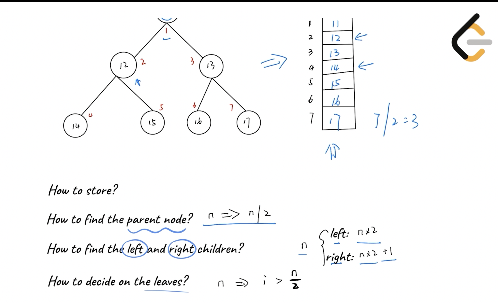
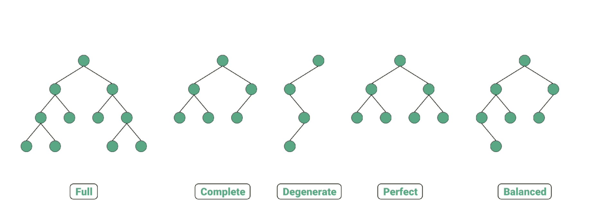
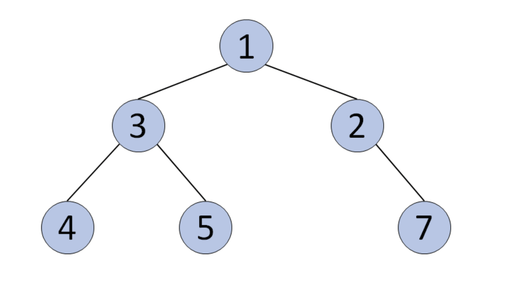

# Binary Tree

> **Scope** — Binary-tree-specific reasoning: **which direction DFS state flows** (down vs up), plus the 11 structural templates built on that.
> **See also**: [tree.md](./tree.md) — general tree concepts and traversal strategy; [tree2.md](./tree2.md) — ready-made per-pattern templates; [bst.md](./bst.md) — when the tree is ordered.

## LeetCode Problem Lists

- [Binary Tree](https://leetcode.com/problem-list/binary-tree/)
- [Tree](https://leetcode.com/problem-list/tree/)

## Time Complexity

| Data structure | Search   | Insert   | Delete   | Min/Max  |
| -------------- | -------- | -------- | -------- | -------- |
| Binary Tree    | O(n)     | O(n)     | O(n)     | O(n)     |

> General (unsorted) binary tree — no ordering, so every operation may visit all nodes. A *balanced* tree drops Search/Insert/Delete to **O(log n)**. Space is **O(n)** for storage plus **O(h)** for the recursion stack. For an ordered variant see [bst.md](./bst.md).

## Overview
**Binary Tree** is a hierarchical data structure where each node has at most two children (left and right). It forms the foundation for many advanced data structures like BST, Heap, and is crucial for understanding tree-based algorithms.

### Key Properties
- **Complexity**: see the [Time Complexity](#time-complexity) table above
- **Core Idea**: Hierarchical structure with recursive properties
- **When to Use**: Hierarchical data, searching, sorting, decision making, expression parsing

### References
- [Binary Tree Visualizer](https://www.cs.usfca.edu/~galles/visualization/BST.html)
- [Wikipedia - Binary Tree](https://en.wikipedia.org/wiki/Binary_tree)
- [Binary Tree - 演算法筆記](https://web.ntnu.edu.tw/~algo/BinaryTree.html)

## 0) Concept: Which Direction Does DFS State Flow? ⭐⭐⭐⭐⭐

> Before picking a template, answer one question: **where does the information a node needs come from — above it, or below it?** That single answer splits nearly every tree DFS problem into three shapes.

### 0-1) The Three DFS Shapes

| Shape | State flows | Signature | Answer is read | Classic LC |
|-------|-------------|-----------|----------------|------------|
| **A — Top-Down, Look-Back** | down, via a **parent** param | `dfs(node, parent, state)` | from a **global** | 112, 129, 1448, 298 |
| **B — Top-Down, Look-Forward** | down, decided **by the parent** | `dfs(node, state)` | from a **global** | 298, 687 |
| **C — Bottom-Up (post-order)** | **up**, via the **return value** | `dfs(node) -> state` | from the **return** (+ global) | 104, 543, 124, 337 |

**A and B are two spellings of the same top-down traversal.** C is a genuinely different algorithm. Choosing between A/B is style; choosing top-down vs bottom-up is *correctness*.

### 0-2) A vs B — Look-Back vs Look-Forward

Both solve LC 298 and both are O(n) time / O(h) space. The difference is **who owns the parent→child comparison**.

```python
# python
# LC 298 - Binary Tree Longest Consecutive Sequence
# STYLE A: LOOK-BACK — recurse first, compare against the parent I was handed
# time = O(n), space = O(h)
class Solution(object):
    def longestConsecutive(self, root):
        if not root:
            return 0
        self.max_len = 0
        self.dfs(root, None, 0)      # seed: no parent -> streak resets to 1
        return self.max_len

    def dfs(self, node, parent, curr_len):
        if not node:                 # <-- null handled HERE (base case)
            return
        # I decide MY OWN state from my parent's
        if parent and node.val == parent.val + 1:
            curr_len += 1
        else:
            curr_len = 1             # streak broke -> restart AT me
        self.max_len = max(self.max_len, curr_len)

        # ALWAYS recurse both sides - a broken streak can restart anywhere below
        self.dfs(node.left, node, curr_len)
        self.dfs(node.right, node, curr_len)
```

```python
# python
# LC 298 - Binary Tree Longest Consecutive Sequence
# STYLE B: LOOK-FORWARD — I compute each CHILD's state before calling it
# time = O(n), space = O(h)
class Solution(object):
    def longestConsecutive(self, root):
        if not root:
            return 0
        self.max_len = 0
        self.dfs(root, 1)            # seed: root is a streak of length 1
        return self.max_len

    def dfs(self, node, curr_len):
        self.max_len = max(self.max_len, curr_len)
        # I decide MY CHILDREN's state, and guard the null BEFORE recursing
        if node.left:                # <-- null handled HERE (call-site guard)
            self.dfs(node.left, curr_len + 1 if node.left.val == node.val + 1 else 1)
        if node.right:
            self.dfs(node.right, curr_len + 1 if node.right.val == node.val + 1 else 1)
```

#### Side-by-side

| | **A — Look-Back** | **B — Look-Forward** |
|---|---|---|
| Who does the compare | the **child**, about itself | the **parent**, about each child |
| Null handling | base case `if not node: return` | call-site guard `if node.left:` |
| Invocations on `n` nodes | **2n + 1** (nulls get called) | **n** (nulls never called) |
| Extra parameter | yes — `parent` (or `parent_val`) | none, reads `node.val` directly |
| Seed call | `dfs(root, None, 0)` | `dfs(root, 1)` |
| Compare logic written | **once** | **twice** (left + right) |
| N-ary tree (LC 589/1522) | `for c in node.children: dfs(c, node, s)` — unchanged | must re-nest the compare inside the loop |
| Graph / rebuilt-as-graph (LC 863) | natural — `parent` = "where I came from" | awkward — no fixed child set |

> **Measured**, not hand-waved: on a 15-node perfect tree Style A executes **31** calls, Style B executes **15**. The extra calls are the `None` children. Same O(n) — B just has a smaller constant.

#### Which to reach for

- **Default to A.** One copy of the transition logic, extends to n-ary and to graphs unchanged, and the `if not node` base case is the habit every other tree template already trains.
- **Reach for B** when the compare needs *both* endpoints of the edge and you want to avoid a null branch — or when you must **not** descend into a child at all (pruning), since B decides before recursing.
- **A leaks less state.** In B, `self.max_len` must be updated at the node (not at the child), or the root's own length is never counted.

#### The sentinel shortcut (and when it breaks)

Style A's `if parent and ...` disappears if you pass a **fake parent value** instead of a node:

```python
# python
# LC 298 - the `parent_val` sentinel variant of Style A
# IDEA: seed with (root.val - 1) so the root automatically satisfies "val == parent_val + 1" -> length 1
dfs(root, root.val - 1, 0)     # no `if parent` branch needed inside dfs
```

⚠️ **This only works when the state depends on the parent's *value*.** If you need the parent's **identity** — e.g. **LC 993 (Cousins in Binary Tree)**, where two nodes must have the same depth but a *different parent node* — you must pass the actual node. Passing `parent_val` there is silently wrong when two parents share a value.

### 0-3) Does the A/B choice apply to *every* tree DFS problem? — **No**

The A-vs-B question is only meaningful for **top-down** problems: ones where a node's answer is fully determined by the path **from the root down to it**. Ask:

```text
Can I answer for this node using ONLY what I learned on the way down?
├── YES -> Top-Down. Pick Style A or B freely (they are interchangeable).
│         Root-to-leaf sums, depth, path constraints, "ancestor so far".
└── NO, I need a fact about my SUBTREE (its height / best path / sum)
          -> Bottom-Up (Style C). A and B CANNOT express this.
             Depth, diameter, max path sum, balance, subtree aggregates.
```

**The tell for C**: the answer at a node **combines results from both children** (`left + right + node.val`), or the node returns something different from what the global tracks.

| LC | Problem | Shape | Why |
|----|---------|-------|-----|
| 112 / 113 | Path Sum I / II | **A or B** | running sum comes from above |
| 129 | Sum Root to Leaf Numbers | **A or B** | accumulate `num*10 + val` downward |
| 1448 | Count Good Nodes | **A or B** | carry `maxSoFar` down |
| 1026 | Max Diff Node vs Ancestor | **A or B** | carry `(min, max)` down |
| 298 | Longest Consecutive Sequence | **A or B** | streak length comes from above |
| 993 | Cousins in Binary Tree | **A only** | needs the parent **node**, not its value |
| 863 | All Nodes Distance K | **A only** | tree is walked as a graph; `parent` = came-from |
| 104 / 111 | Max / Min Depth | **C** | needs children's heights |
| 543 | Diameter | **C** | `left + right` at the node |
| 110 | Balanced Binary Tree | **C** | compares subtree heights |
| 124 | Max Path Sum | **C** | returns one arm, globals the two-arm sum |
| 687 | Longest Univalue Path | **B *and* C** | B for the downward arm, C to join arms → see Template 9 |
| 337 | House Robber III | **C** | returns a `(take, skip)` tuple → see Template 9 |
| 236 | LCA | **C** | needs "was p/q found below me" |

> **LC 298 is the rare problem solvable all three ways** — its path is strictly downward (so top-down works) *and* a subtree's best downward run is well-defined (so bottom-up works). Compare the C version in **Template 9 (Tree DP — Return Multiple States Bottom-Up)** below — it returns `cur_len` upward instead of threading it down. Most problems admit only one shape.

#### Converting A → C when you get stuck

If a top-down attempt needs subtree info, the mechanical fix is: **stop passing the accumulator down, start returning it up**, and keep the global for the answer.

```python
# python
# LC 298 - Style C (bottom-up): return "longest run STARTING at me, going down"
# IDEA: post-order; the global captures the best, the return value feeds my parent
# time = O(n), space = O(h)
def helper(node):
    if not node:
        return 0
    l, r = helper(node.left), helper(node.right)     # children FIRST
    cur = 1
    if node.left and node.left.val == node.val + 1:
        cur = max(cur, l + 1)
    if node.right and node.right.val == node.val + 1:
        cur = max(cur, r + 1)
    self.max_len = max(self.max_len, cur)            # global != return value
    return cur
```

### 0-4) Shared gotcha for all three — **reset, don't stop**

In LC 298 (and every "longest run of X" tree problem) a broken streak must **restart at 1**, never terminate the recursion:

```python
# ✅ correct - streak breaks, but keep exploring
else:
    curr_len = 1
    dfs(node.left, node, curr_len)

# 🚫 wrong - a longer streak may start deeper in this same subtree
else:
    return
```

Verified on 4000 random trees: Styles A, B and C agree with brute force on every case, including the zigzag tree below — the path `1→2→3→4` alternates left/right and is still valid, because **the only rule is parent → child**.

```text
    1
     \
      2        longest = 4  (1 -> 2 -> 3 -> 4)
     /
    3
     \
      4
```

---

## Problem Categories

### **Pattern 1: Tree Traversal**
- **Description**: Visit all nodes in specific order (preorder, inorder, postorder, level-order)
- **Recognition**: "Visit all nodes", "print tree", "serialize tree"
- **Examples**: LC 94, LC 144, LC 145, LC 102
- **Template**: Use Traversal Templates

### **Pattern 2: Tree Construction**
- **Description**: Build tree from traversal sequences or other representations
- **Recognition**: "Construct from", "build tree", "deserialize"
- **Examples**: LC 105, LC 106, LC 108, LC 297
- **Template**: Use Construction Template

### **Pattern 3: Path Problems**
- **Description**: Find paths with specific properties (sum, length, pattern)
- **Recognition**: "Path sum", "root to leaf", "longest path"
- **Examples**: LC 112, LC 113, LC 257, LC 124
- **Template**: Use Path Template with backtracking

### **Pattern 4: Tree Properties**
- **Description**: Check or calculate tree properties (height, balance, symmetry)
- **Recognition**: "Height", "balanced", "symmetric", "diameter"
- **Examples**: LC 104, LC 110, LC 101, LC 543
- **Template**: Use Property Check Template

### **Pattern 5: LCA & Distance**
- **Description**: Find common ancestors or calculate distances between nodes
- **Recognition**: "Lowest common ancestor", "distance between nodes"
- **Examples**: LC 236, LC 235, LC 863
- **Template**: Use LCA Template

### **Pattern 6: Binary Search on Trees**
- **Description**: Apply binary search technique on tree properties (height, node count, structure)
- **Recognition**: "O(log n) time", "complete binary tree", "count nodes", "find kth element"
- **Examples**: LC 222 (Count Complete Tree Nodes), LC 230 (Kth Smallest in BST)
- **Template**: Use Binary Search + Tree Properties Template
- **Key Insight**:
  - For complete binary trees, can use binary search on tree structure
  - Check left/right subtree properties to decide search direction
  - Time complexity can be reduced from O(n) to O(log²n)

### Complete Tree to Array Representation

-  Note if we use an `array` to represent the `complete binary tree`,and `store the root node at index 1`
    - so, index of the `parent` node of any node is `[index of the node / 2]`
    - so, index of the `left child` node is `[index of the node * 2]`
    - so, index of the `right child` node is `[index of the node * 2 + 1]`
    - https://github.com/yennanliu/CS_basics/blob/master/data_structure/python/MinHeap.py#L36-L40
    - [video](https://leetcode.com/explore/learn/card/heap/643/heap/4017/) : very good explanation!!!
    - properties
        - how to store ? 
            - via Array and index
        - how to find the parent node ?
            - n / 2
            - NOTE : `n is an "index"` in array
        - how to find the left and right children ?
            - left children : n * 2
            - right children : n * 2 + 1
        - how to check if a node is leaf node ?
            - check if i > (# of nodes) / 2
        - <p align="center"></p>


#### Example:

Let's say you have a complete binary tree like this:

```text
        10
       /  \
     15    20
    / \    /
   30 40  50
```

This tree as an **array (1-based)** would be:

```text
# `n is an "index"` in array

Index:   1   2   3   4   5   6
Value: [10, 15, 20, 30, 40, 50]
```

Relationships:

* Node at index 2 (15)

  * Parent: 2 / 2 = 1 → 10
  * Left child: 2 * 2 = 4 → 30
  * Right child: 2 * 2 + 1 = 5 → 40

---


- Array to Complete Tree
    - dev

- `Complete binary tree`
    - A complete binary tree is a binary tree in which every level, `except possibly the last`, is completely filled, and all nodes in the last level are as far left as possible.
    - [wiki](https://en.wikipedia.org/wiki/Binary_tree#:~:text=A%20complete%20binary%20tree%20is,tree%20is%20not%20necessarily%20perfect.)
    - example :
        - complete binary tree
        <p align="center"></p>
        - NOT complete binary tree
        <p align="center"></p>

## Templates & Algorithms

### Template Comparison Table
| Template Type | Use Case | Approach | Time | Space | When to Use |
|---------------|----------|----------|------|-------|--------------|
| **Recursive Traversal** | Simple traversal | Recursion | O(n) | O(h) | Default choice, clean code |
| **Iterative Traversal** | Memory limited | Stack/Queue | O(n) | O(h) | Avoid recursion overhead |
| **Morris Traversal** | Space limited | Threading | O(n) | O(1) | Constant space required |
| **Level Order** | BFS problems | Queue | O(n) | O(w) | Level-by-level processing |
| **Binary Search on Trees** | Complete/Balanced tree | Binary Search | O(log²n) | O(log n) | Optimize with tree structure |

### Universal Tree Template
```python
def tree_problem(root):
    """
    Universal template for most binary tree problems
    Can be adapted for traversal, calculation, or modification
    """
    # Base case
    if not root:
        return None  # or 0, [], depending on problem
    
    # Pre-order processing (before recursion)
    # process_current_node()
    
    # Recursive calls
    left_result = tree_problem(root.left)
    right_result = tree_problem(root.right)
    
    # Post-order processing (after recursion)
    # combine_results()
    
    return result
```

### Template 1: Tree Traversal (Recursive)
```python
# Preorder Traversal
def preorder(root):
    if not root:
        return []
    return [root.val] + preorder(root.left) + preorder(root.right)

# Inorder Traversal  
def inorder(root):
    if not root:
        return []
    return inorder(root.left) + [root.val] + inorder(root.right)

# Postorder Traversal
def postorder(root):
    if not root:
        return []
    return postorder(root.left) + postorder(root.right) + [root.val]
```

### Template 2: Tree Traversal (Iterative)
```python
# Iterative Inorder with Stack
def inorder_iterative(root):
    result, stack = [], []
    current = root
    
    while current or stack:
        # Go to leftmost node
        while current:
            stack.append(current)
            current = current.left
        
        # Current must be None, so pop from stack
        current = stack.pop()
        result.append(current.val)
        
        # Visit right subtree
        current = current.right
    
    return result

# Level Order with Queue
def level_order(root):
    if not root:
        return []
    
    result = []
    queue = collections.deque([root])
    
    while queue:
        level_size = len(queue)
        current_level = []
        
        for _ in range(level_size):
            node = queue.popleft()
            current_level.append(node.val)
            
            if node.left:
                queue.append(node.left)
            if node.right:
                queue.append(node.right)
        
        result.append(current_level)
    
    return result
```

### Template 3: Tree Construction
```python
def build_tree_from_traversals(preorder, inorder):
    """
    Construct tree from preorder and inorder traversals
    Key insight: First element in preorder is always root
    """
    if not preorder or not inorder:
        return None
    
    # Root is first element in preorder
    root = TreeNode(preorder[0])
    
    # Find root position in inorder to split left/right
    root_idx = inorder.index(root.val)
    
    # Recursively build subtrees
    # Left subtree: elements before root in inorder
    root.left = build_tree_from_traversals(
        preorder[1:root_idx+1],  # Skip root, take left elements
        inorder[:root_idx]       # Everything before root
    )
    
    # Right subtree: elements after root in inorder
    root.right = build_tree_from_traversals(
        preorder[root_idx+1:],   # Everything after left subtree
        inorder[root_idx+1:]     # Everything after root
    )
    
    return root
```

### Template 4: Path Problems
```python
def path_sum_template(root, target):
    """
    Template for path sum problems
    Can track paths, sums, or other properties
    """
    def dfs(node, current_sum, path):
        if not node:
            return
        
        # Update current state
        current_sum += node.val
        path.append(node.val)
        
        # Check if leaf node and condition met
        if not node.left and not node.right:
            if current_sum == target:
                result.append(path[:])  # Copy current path
        
        # Explore subtrees
        dfs(node.left, current_sum, path)
        dfs(node.right, current_sum, path)
        
        # Backtrack
        """
        NOTE !!! why do we need backtrack here ? (gemini)
        In simple terms, **backtracking** is the "undo" button for your recursion.


        ### 3. A Visual Example

        Imagine this tree:

        ```text
            1
           / \
           2   3

        ```

        **Without `path.pop()`:**

        1. Go to `1`: `path = [1]`
        2. Go to `2`: `path = [1, 2]`
        3. Finish `2`, go back to `1`.
        4. Go to `3`: `path = [1, 2, 3]`  <-- **ERROR!** (2 shouldn't be here)

        **With `path.pop()`:**

        1. Go to `1`: `path = [1]`
        2. Go to `2`: `path = [1, 2]`
        3. Finish `2`, **`pop()`**: `path = [1]`
        4. Go to `3`: `path = [1, 3]` <-- **CORRECT!**
        """
        path.pop()
    
    result = []
    dfs(root, 0, [])
    return result
```

### Template 5: Tree Properties
```python
def tree_property_template(root):
    """
    Calculate tree properties (height, diameter, balance)
    """
    def helper(node):
        if not node:
            return 0  # or (0, True) for multiple values
        
        # Get info from subtrees
        left_info = helper(node.left)
        right_info = helper(node.right)
        
        # Calculate current node's property
        current_property = calculate(left_info, right_info)
        
        # Update global result if needed
        self.result = max(self.result, current_property)
        
        return current_property
    
    self.result = 0
    helper(root)
    return self.result
```

### Template 6: LCA (Lowest Common Ancestor)
```python
def find_lca(root, p, q):
    """
    Find lowest common ancestor of nodes p and q
    """
    if not root or root == p or root == q:
        return root

    left = find_lca(root.left, p, q)
    right = find_lca(root.right, p, q)

    # Both found in different subtrees -> current is LCA
    if left and right:
        return root

    # One or both found in same subtree
    return left if left else right
```

### Template 7: Binary Search on Trees
```python
def count_complete_tree_nodes(root):
    """
    Count nodes in complete binary tree in O(log²n) time
    Key: Use binary search on tree structure
    """
    if not root:
        return 0

    def get_height(node):
        """Get height by going left"""
        height = 0
        while node:
            height += 1
            node = node.left
        return height

    left_height = get_height(root.left)
    right_height = get_height(root.right)

    if left_height == right_height:
        # Left subtree is perfect binary tree
        # Nodes in left = 2^left_height - 1
        # Plus root = 2^left_height
        return (1 << left_height) + count_complete_tree_nodes(root.right)
    else:
        # Right subtree is perfect binary tree
        # Height = right_height, nodes = 2^right_height - 1
        # Plus root = 2^right_height
        return (1 << right_height) + count_complete_tree_nodes(root.left)
```

### Template 8: Level Linking with O(1) Space (`next` pointer) ⭐⭐⭐⭐⭐

> **Pattern**: You are already standing on a fully-linked level, so you can walk it with `next` instead of a queue — and while walking it, you stitch together the level below with a **dummy head + moving tail**.
> **Key Idea**: The `next` chain of level `k` *is* the queue for level `k`. That removes the O(w) queue and gives **O(1) extra space**.
> Use when the tree is **not perfect** (missing children), which is exactly what makes the naive `root.left.next = root.right` trick fail.

```java
// java
// LC 117 - Populating Next Right Pointers in Each Node II
// IDEA: traverse level k via its own `next` chain; build level k+1's chain
//       using a dummy node + tail pointer. No queue needed.
/**
 * time = O(N), space = O(1)   // output pointers not counted
 */
public Node connect(Node root) {
    Node cur = root;                 // head of the level being traversed
    while (cur != null) {
        Node dummy = new Node(0);    // sentinel: dummy.next = head of NEXT level
        Node tail = dummy;           // grows the next level's chain

        while (cur != null) {        // walk current level via `next`
            if (cur.left != null) {
                tail.next = cur.left;
                tail = tail.next;
            }
            if (cur.right != null) {
                tail.next = cur.right;
                tail = tail.next;
            }
            cur = cur.next;
        }
        cur = dummy.next;            // drop down one level
    }
    return root;
}
```

```python
# python
# LC 117 - Populating Next Right Pointers in Each Node II
# IDEA: same as java - dummy head + tail builds the next level's `next` chain
class Solution:
    def connect(self, root):
        # time = O(N), space = O(1)
        cur = root
        while cur:
            dummy = Node(0)      # sentinel for the NEXT level
            tail = dummy
            while cur:           # walk current level through `next`
                if cur.left:
                    tail.next = cur.left
                    tail = tail.next
                if cur.right:
                    tail.next = cur.right
                    tail = tail.next
                cur = cur.next
            cur = dummy.next     # move down
        return root
```

**Variations**
- **LC 116 (Perfect tree)** — twist: every node has 0 or 2 children, so the dummy/tail bookkeeping collapses to `cur.left.next = cur.right; cur.right.next = cur.next.left`. The Template 8 code above still solves 116 unchanged — memorise 117, get 116 for free.

---

### Template 9: Tree DP — Return Multiple States Bottom-Up ⭐⭐⭐⭐⭐

> **Pattern**: Template 5 returns *one* number per subtree. When the parent's choice depends on what the child **chose to do**, return a **tuple of states** instead.
> **Recurrence** (LC 337): `take(n) = n.val + skip(L) + skip(R)`, `skip(n) = max(take(L), skip(L)) + max(take(R), skip(R))`.
> **Recognition**: "cannot pick two adjacent nodes", "cover every node", "each node has k modes" — any constraint that couples parent and child decisions.

```java
// java
// LC 337 - House Robber III
// IDEA: post-order DP. Each call returns {maxIfWeRobThisNode, maxIfWeSkipThisNode}.
//       Robbing a node forbids robbing its children -> must use children's "skip".
/**
 * time = O(N), space = O(H)   // H = tree height (recursion stack)
 */
public int rob(TreeNode root) {
    int[] res = robHelper(root);
    return Math.max(res[0], res[1]);
}

// returns int[]{ take, skip }
private int[] robHelper(TreeNode node) {
    if (node == null) {
        return new int[]{0, 0};
    }
    int[] l = robHelper(node.left);
    int[] r = robHelper(node.right);

    // rob current -> children MUST be skipped
    int take = node.val + l[1] + r[1];
    // skip current -> children are free to do whatever is best
    int skip = Math.max(l[0], l[1]) + Math.max(r[0], r[1]);

    return new int[]{take, skip};
}
```

```python
# python
# LC 337 - House Robber III
# IDEA: post-order DP returning (take, skip) per subtree
class Solution:
    def rob(self, root):
        # time = O(N), space = O(H)
        def helper(node):
            if not node:
                return (0, 0)             # (take, skip)
            l = helper(node.left)
            r = helper(node.right)
            take = node.val + l[1] + r[1]  # children must be skipped
            skip = max(l) + max(r)         # children free to choose
            return (take, skip)

        return max(helper(root))
```

**Variations** — same post-order "return info about my subtree" skeleton, different payload:

| LC | Problem | What each call returns |
|----|---------|------------------------|
| 337 | House Robber III | `(take, skip)` — the template above |
| 968 | Binary Tree Cameras | node state: `needsCover / hasCamera / covered` (greedy on 3 states) |
| 508 | Most Frequent Subtree Sum | subtree **sum**, tallied into a `HashMap` on the way up |
| 652 | Find Duplicate Subtrees | a **canonical string** `val,left,right`, tallied into a `HashMap`; append node when count hits exactly 2 |
| 563 | Binary Tree Tilt | subtree sum, while accumulating `abs(leftSum - rightSum)` into a global |
| 687 | Longest Univalue Path | longest same-value arm going down; global max = left arm + right arm |

```java
// java
// LC 652 - Find Duplicate Subtrees
// IDEA: serialize every subtree into a canonical id string, count ids in a map.
//       Two subtrees are identical iff their ids are equal.
//       NOTE: use a null marker ("#") - without it "1,2" is ambiguous.
/**
 * time = O(N^2) worst case (string building), space = O(N^2)
 */
public List<TreeNode> findDuplicateSubtrees(TreeNode root) {
    Map<String, Integer> cnt = new HashMap<>();
    List<TreeNode> res = new ArrayList<>();
    subtreeId(root, cnt, res);
    return res;
}

private String subtreeId(TreeNode node, Map<String, Integer> cnt, List<TreeNode> res) {
    if (node == null) {
        return "#";
    }
    String key = node.val + ","
            + subtreeId(node.left, cnt, res) + ","
            + subtreeId(node.right, cnt, res);

    int c = cnt.merge(key, 1, Integer::sum);
    if (c == 2) {   // == 2 (not >= 2) so each duplicate is reported once
        res.add(node);
    }
    return key;
}
```

```python
# python
# LC 652 - Find Duplicate Subtrees
# IDEA: canonical subtree id string + Counter
class Solution:
    def findDuplicateSubtrees(self, root):
        # time = O(N^2) worst case, space = O(N^2)
        cnt = collections.Counter()
        res = []

        def sid(node):
            if not node:
                return "#"                 # null marker keeps ids unambiguous
            key = "%s,%s,%s" % (node.val, sid(node.left), sid(node.right))
            cnt[key] += 1
            if cnt[key] == 2:              # report each duplicate exactly once
                res.append(node)
            return key

        sid(root)
        return res
```

---

### Template 10: Post-Order Structural Modification (return the new subtree) ⭐⭐⭐⭐

> **Pattern**: The recursion returns a **node** (possibly `null`), and the parent **reassigns** it: `node.left = helper(node.left)`. That single line is how you delete/prune a node without ever touching a parent pointer.
> **Key Idea**: Fix children first (post-order), then decide the fate of the current node. A node whose parent got deleted becomes a **new forest root**, so pass that fact down.
> **Recognition**: "delete nodes and return...", "prune", "remove subtrees that...".

```java
// java
// LC 1110 - Delete Nodes And Return Forest
// IDEA: DFS carrying `isRoot` (= my parent was deleted / I am the original root).
//       A surviving node that is a root gets collected. A deleted node returns null,
//       which detaches it from its parent, and marks its children as new roots.
/**
 * time = O(N), space = O(N)
 */
public List<TreeNode> delNodes(TreeNode root, int[] to_delete) {
    Set<Integer> toDel = new HashSet<>();
    for (int v : to_delete) {
        toDel.add(v);
    }
    List<TreeNode> forest = new ArrayList<>();
    walk(root, true, toDel, forest);
    return forest;
}

private TreeNode walk(TreeNode node, boolean isRoot, Set<Integer> toDel, List<TreeNode> forest) {
    if (node == null) {
        return null;
    }
    boolean deleted = toDel.contains(node.val);

    // I survive AND nobody points at me -> I head a tree in the forest
    if (isRoot && !deleted) {
        forest.add(node);
    }

    // children are "roots" exactly when I am deleted
    node.left = walk(node.left, deleted, toDel, forest);
    node.right = walk(node.right, deleted, toDel, forest);

    return deleted ? null : node;   // returning null detaches me from my parent
}
```

```python
# python
# LC 1110 - Delete Nodes And Return Forest
# IDEA: same - return None to detach, pass `is_root` down
class Solution:
    def delNodes(self, root, to_delete):
        # time = O(N), space = O(N)
        to_del = set(to_delete)
        forest = []

        def walk(node, is_root):
            if not node:
                return None
            deleted = node.val in to_del
            if is_root and not deleted:
                forest.append(node)
            # my children become roots iff I am deleted
            node.left = walk(node.left, deleted)
            node.right = walk(node.right, deleted)
            return None if deleted else node

        walk(root, True)
        return forest
```

**Variations**
- **LC 814 (Binary Tree Pruning)** — twist: no forest, single tree, and the delete test depends on the *already-pruned* children, so the check must come **after** both recursive calls.

```java
// java
// LC 814 - Binary Tree Pruning
// IDEA: prune children first, THEN test if I became a valueless leaf
/**
 * time = O(N), space = O(H)
 */
public TreeNode pruneTree(TreeNode root) {
    if (root == null) {
        return null;
    }
    root.left = pruneTree(root.left);
    root.right = pruneTree(root.right);

    // only decidable after children are pruned
    if (root.val == 0 && root.left == null && root.right == null) {
        return null;
    }
    return root;
}
```

```python
# python
# LC 814 - Binary Tree Pruning
class Solution:
    def pruneTree(self, root):
        # time = O(N), space = O(H)
        if not root:
            return None
        root.left = self.pruneTree(root.left)
        root.right = self.pruneTree(root.right)
        if root.val == 0 and not root.left and not root.right:
            return None
        return root
```

---

### Template 11: BFS with Positional Index (heap indexing on a general tree) ⭐⭐⭐⭐

> **Pattern**: Carry a **virtual array index** alongside each node in the BFS queue — `left = 2*i`, `right = 2*i + 1` — i.e. treat any binary tree as if it were embedded in the complete-tree array layout described above.
> **Key Idea**: The index encodes *horizontal position including the gaps*, which a plain level-order count cannot. Width of a level = `lastIndex - firstIndex + 1`.
> **Gotcha**: indices double every level and **overflow** on a 3000-deep skewed tree — normalise by subtracting the level's first index each round.

```java
// java
// LC 662 - Maximum Width of Binary Tree
// IDEA: BFS carrying the heap-style index of each node. Width of a level is
//       (index of last node) - (index of first node) + 1, so null gaps count.
/**
 * time = O(N), space = O(W)   // W = max level width
 */
public int widthOfBinaryTree(TreeNode root) {
    if (root == null) {
        return 0;
    }
    int res = 0;
    Queue<TreeNode> nodes = new LinkedList<>();
    Queue<Integer> idx = new LinkedList<>();
    nodes.add(root);
    idx.add(0);

    while (!nodes.isEmpty()) {
        int size = nodes.size();
        int first = 0, last = 0;

        for (int i = 0; i < size; i++) {
            TreeNode n = nodes.poll();
            int j = idx.poll();

            if (i == 0) {
                first = j;          // anchor of this level
            }
            j -= first;             // NOTE: re-base to 0 -> prevents overflow
            last = j;

            if (n.left != null) {
                nodes.add(n.left);
                idx.add(2 * j);
            }
            if (n.right != null) {
                nodes.add(n.right);
                idx.add(2 * j + 1);
            }
        }
        res = Math.max(res, last + 1);   // last - 0 + 1
    }
    return res;
}
```

```python
# python
# LC 662 - Maximum Width of Binary Tree
# IDEA: BFS with (node, heap_index); width = last_idx - first_idx + 1
class Solution:
    def widthOfBinaryTree(self, root):
        # time = O(N), space = O(W)
        if not root:
            return 0
        res = 0
        q = collections.deque([(root, 0)])

        while q:
            size = len(q)
            first = last = 0
            for i in range(size):
                node, j = q.popleft()
                if i == 0:
                    first = j          # anchor of this level
                j -= first             # re-base to 0 (keeps ints small)
                last = j
                if node.left:
                    q.append((node.left, 2 * j))
                if node.right:
                    q.append((node.right, 2 * j + 1))
            res = max(res, last + 1)
        return res
```

**Variations**
- **LC 958 (Check Completeness of a Binary Tree)** — twist: the same "gaps matter" idea, but simpler to push `null` children into the queue and assert that **once a `null` is popped, no non-null may follow**.

```java
// java
// LC 958 - Check Completeness of a Binary Tree
// IDEA: BFS enqueuing nulls too. In a complete tree all real nodes come first.
/**
 * time = O(N), space = O(W)
 */
public boolean isCompleteTree(TreeNode root) {
    Queue<TreeNode> q = new LinkedList<>();
    q.add(root);
    boolean seenNull = false;

    while (!q.isEmpty()) {
        TreeNode n = q.poll();
        if (n == null) {
            seenNull = true;          // a hole appeared
        } else {
            if (seenNull) {
                return false;         // real node AFTER a hole -> not complete
            }
            q.add(n.left);            // push nulls on purpose
            q.add(n.right);
        }
    }
    return true;
}
```

```python
# python
# LC 958 - Check Completeness of a Binary Tree
class Solution:
    def isCompleteTree(self, root):
        # time = O(N), space = O(W)
        q = collections.deque([root])
        seen_null = False
        while q:
            node = q.popleft()
            if not node:
                seen_null = True
            else:
                if seen_null:
                    return False      # non-null after a null -> not complete
                q.append(node.left)   # push nulls on purpose
                q.append(node.right)
        return True
```

---

## Problems by Pattern

### Pattern-Based Problem Classification

#### **Pattern 1: Tree Traversal Problems**
| Problem | LC # | Difficulty | Key Technique | Template |
|---------|------|------------|---------------|----------|
| Binary Tree Inorder Traversal | 94 | Easy | Stack/Recursion | Template 1/2 |
| Binary Tree Preorder Traversal | 144 | Easy | Stack/Recursion | Template 1/2 |
| Binary Tree Postorder Traversal | 145 | Easy | Stack/Recursion | Template 1/2 |
| Binary Tree Level Order Traversal | 102 | Medium | BFS with Queue | Template 2 |
| Binary Tree Zigzag Level Order | 103 | Medium | BFS + Direction | Template 2 |
| Binary Tree Right Side View | 199 | Medium | Level Order/DFS | Template 2 |
| Binary Tree Vertical Order | 314 | Medium | BFS + HashMap | Template 2 |
| Find Bottom Left Tree Value | 513 | Medium | Level Order | Template 2 |

#### **Pattern 1b: Level-Order Variants (identical BFS skeleton, different per-level reducer)**

> All of these are Template 2's `while queue: for _ in range(level_size)` loop with one line changed. Learn the skeleton once.

| Problem | LC # | Difficulty | The one line that changes |
|---------|------|------------|---------------------------|
| Level Order Traversal II | 107 | Medium | reverse the result list at the end (or `insert(0, level)`) |
| Average of Levels | 637 | Easy | `res.append(sum(level) / len(level))` |
| Find Largest Value in Each Row | 515 | Medium | `res.append(max(level))` |
| Maximum Level Sum | 1161 | Medium | track `sum(level)` + return the **1-indexed** level number of the max |
| Cousins in Binary Tree | 993 | Easy | same depth (same level) but different parent → track parent while enqueuing |
| Maximum Width of Binary Tree | 662 | Medium | carry heap index with each node → **Template 11** |
| Check Completeness | 958 | Medium | enqueue `null` children too → **Template 11** variation |
| Vertical Order Traversal | 987 | Hard | BFS by column like LC 314, but ties broken by `(row, value)` → must **sort** each column |

#### **Pattern 2: Tree Construction Problems**  
| Problem | LC # | Difficulty | Key Technique | Template |
|---------|------|------------|---------------|----------|
| Construct from Preorder & Inorder | 105 | Medium | Index mapping | Template 3 |
| Construct from Inorder & Postorder | 106 | Medium | Index mapping | Template 3 |
| Construct from Preorder & Postorder | 889 | Medium | Recursion | Template 3 |
| Convert Sorted Array to BST | 108 | Easy | Binary Search | Template 3 |
| Serialize and Deserialize Tree | 297 | Hard | BFS/DFS | Template 3 |
| Construct from String | 536 | Medium | Stack/Recursion | Template 3 |

#### **Pattern 3: Path Problems**
| Problem | LC # | Difficulty | Key Technique | Template |
|---------|------|------------|---------------|----------|
| Path Sum | 112 | Easy | DFS | Template 4 |
| Path Sum II | 113 | Medium | DFS + Backtrack | Template 4 |
| Binary Tree Paths | 257 | Easy | DFS + Path Track | Template 4 |
| Sum Root to Leaf Numbers | 129 | Medium | DFS | Template 4 |
| Binary Tree Maximum Path Sum | 124 | Hard | DFS + Global Max | Template 4 |
| Longest Consecutive Sequence | 298 | Medium | DFS + Counter | Template 4 (see §0-2: solvable top-down **and** bottom-up) |
| Path Sum III | 437 | Medium | Prefix Sum | Template 4 |

#### **Pattern 4: Tree Properties Problems**
| Problem | LC # | Difficulty | Key Technique | Template |
|---------|------|------------|---------------|----------|
| Maximum Depth | 104 | Easy | DFS/BFS | Template 5 |
| Minimum Depth | 111 | Easy | DFS/BFS | Template 5 |
| Balanced Binary Tree | 110 | Easy | Height Check | Template 5 |
| Diameter of Binary Tree | 543 | Easy | DFS + Max | Template 5 |
| Symmetric Tree | 101 | Easy | Mirror Check | Template 5 |
| Same Tree | 100 | Easy | Simultaneous DFS | Template 5 |

#### **Pattern 4b: Twists on the Property/Dual-DFS skeleton**

| Problem | LC # | Difficulty | The twist |
|---------|------|------------|-----------|
| Flip Equivalent Binary Trees | 951 | Medium | LC 100's dual DFS, but accept **either** pairing: `(L,L)&(R,R)` **OR** `(L,R)&(R,L)` |
| Merge Two Binary Trees | 617 | Easy | dual DFS where a missing node is not a mismatch — just return the other side |
| Max Difference Between Node and Ancestor | 1026 | Medium | **top-down** instead of bottom-up: push `(minSoFar, maxSoFar)` down; answer at each leaf is `max - min` |
| Most Frequent Subtree Sum | 508 | Medium | bottom-up subtree sum + frequency map → **Template 9** |
| Binary Tree Tilt / Longest Univalue Path | 563 / 687 | Easy / Medium | return one value up, accumulate a different value into a global → **Template 9** |

#### **Pattern 5: LCA & Distance Problems**
| Problem | LC # | Difficulty | Key Technique | Template |
|---------|------|------------|---------------|----------|
| Lowest Common Ancestor | 236 | Medium | DFS | Template 6 |
| LCA of BST | 235 | Easy | BST Property | Template 6 |
| Distance K from Target | 863 | Medium | Graph Convert | Template 6 |
| LCA of Deepest Leaves | 1123 | Medium | DFS + Depth | Template 6 |

#### **Pattern 6: Binary Search on Trees Problems**
| Problem | LC # | Difficulty | Key Technique | Template |
|---------|------|------------|---------------|----------|
| Count Complete Tree Nodes | 222 | Medium | Binary Search on Height | Template 7 |
| Kth Smallest in BST | 230 | Medium | Inorder + Binary Search | Template 7 |
| Closest BST Value | 270 | Easy | Binary Search on BST | Template 7 |
| Closest BST Value II | 272 | Hard | Inorder + Two Pointers | Template 7 |

### Complete Problem List by Difficulty

#### Easy Problems (Foundation)
- LC 94: Binary Tree Inorder Traversal - Basic traversal
- LC 100: Same Tree - Tree comparison
- LC 101: Symmetric Tree - Mirror property check
- LC 104: Maximum Depth - Basic recursion
- LC 108: Convert Sorted Array to BST - Array to tree
- LC 110: Balanced Binary Tree - Height calculation
- LC 111: Minimum Depth - BFS for shortest path
- LC 112: Path Sum - Simple path tracking
- LC 144: Binary Tree Preorder Traversal - Stack usage
- LC 145: Binary Tree Postorder Traversal - Stack manipulation
- LC 226: Invert Binary Tree - Tree modification
- LC 235: LCA of BST - BST properties
- LC 257: Binary Tree Paths - Path collection
- LC 543: Diameter of Binary Tree - Global max pattern
- LC 572: Subtree of Another Tree - Tree matching

#### Medium Problems (Core)
- LC 102: Binary Tree Level Order Traversal - BFS foundation
- LC 103: Binary Tree Zigzag Level Order - Level with direction
- LC 105: Construct from Preorder & Inorder - Index mapping
- LC 106: Construct from Inorder & Postorder - Array slicing
- LC 113: Path Sum II - Backtracking paths
- LC 114: Flatten Binary Tree - In-place modification
- LC 116: Populating Next Right Pointers - Level connection
- LC 129: Sum Root to Leaf Numbers - Number construction
- LC 173: Binary Search Tree Iterator - Iterator design
- LC 199: Binary Tree Right Side View - Level last element
- LC 222: Count Complete Tree Nodes - Binary search on tree
- LC 230: Kth Smallest in BST - Inorder property
- LC 236: Lowest Common Ancestor - Classic LCA
- LC 298: Binary Tree Longest Consecutive - Path tracking
- LC 314: Binary Tree Vertical Order - Column indexing
- LC 437: Path Sum III - Prefix sum on tree
- LC 513: Find Bottom Left Tree Value - Level order variant
- LC 536: Construct from String - Parsing to tree
- LC 654: Maximum Binary Tree - Monotonic stack
- LC 863: All Nodes Distance K - Graph conversion

#### Hard Problems (Advanced)
- LC 124: Binary Tree Maximum Path Sum - Global optimization
- LC 297: Serialize and Deserialize - String to tree
- LC 834: Sum of Distances in Tree - Rerooting technique
- LC 968: Binary Tree Cameras - Greedy on tree

## 2) LC Example

### 2-1) Construct Binary Tree from Preorder and Inorder Traversal — LC 105
```python
# python
# LC 105. Construct Binary Tree from Preorder and Inorder Traversal
# V0
# IDEA : BST property
class Solution(object):
    def buildTree(self, preorder, inorder):
        if len(preorder) == 0:
            return None
        if len(preorder) == 1:
            return TreeNode(preorder[0])
        ### NOTE : init root like below (via TreeNode and root value (preorder[0]))
        root = TreeNode(preorder[0])
        """
        NOTE !!!
        -> # we get index of root.val from "INORDER" to SPLIT TREE
        """
        index = inorder.index(root.val)  # the index of root at inorder, and we can also get the length of left-sub-tree, right-sub-tree ( preorder[1:index+1]) for following using
        # recursion for root.left
        #### NOTE : the idx is from "INORDER"
        #### NOTE : WE idx from inorder in preorder as well 
        #### NOTE : preorder[1 : index + 1] (for left sub tree)
        root.left = self.buildTree(preorder[1 : index + 1], inorder[ : index]) ### since the BST is symmery so the length of left-sub-tree is same in both Preorder and Inorder, so we can use the index to get the left-sub-tree of Preorder as well
        # recursion for root.right 
        root.right = self.buildTree(preorder[index + 1 : ], inorder[index + 1 :]) ### since the BST is symmery so the length of left-sub-tree is same in both Preorder and Inorder, so we can use the index to get the right-sub-tree of Preorder as well
        return root
```

### 2-2) Construct Binary Tree from Inorder and Postorder Traversal — LC 106
```python
# python
# LC 106 Construct Binary Tree from Inorder and Postorder Traversal
# V0
# IDEA : Binary Tree property, same as LC 105 
class Solution(object):
    def buildTree(self, inorder, postorder):
        if not inorder:
            return None
        if len(inorder) == 1:
            return TreeNode(inorder[0])
        ### NOTE : we get root from postorder
        root = TreeNode(postorder[-1])
        """
        ### NOTE : the index is from inorder
        ### NOTE : we get index of root in inorder
        #    -> and this idx CAN BE USED IN BOTH inorder, postorder (Binary Tree property)
        """
        idx = inorder.index(root.val)
        ### NOTE : inorder[:idx], postorder[:idx]
        root.left = self.buildTree(inorder[:idx], postorder[:idx])
        ### NOTE : postorder[idx:-1]
        root.right =  self.buildTree(inorder[idx+1:], postorder[idx:-1])
        return root
```


### 2-3) Binary Tree Paths — LC 257
```python
# LC 257 Binary Tree Paths

# V0
# IDEA : BFS
class Solution:
    def binaryTreePaths(self, root):
        res = []
        ### NOTE : we set q like this : [[root, cur]]
        cur = ""
        q = [[root, cur]]
        while q:
            for i in range(len(q)):
                node, cur = q.pop(0)
                ### NOTE : if node exist, but no sub tree (i.e. not root.left and not root.right)
                #         -> append cur to result
                if node:
                    if not node.left and not node.right:
                        res.append(cur + str(node.val))
                ### NOTE : we keep cur to left sub tree
                if node.left:
                    q.append((node.left, cur + str(node.val) + '->'))
                ### NOTE : we keep cur to left sub tree
                if node.right:
                    q.append((node.right, cur + str(node.val) + '->'))
        return res

# V0'
# IDEA : DFS 
class Solution:
    def binaryTreePaths(self, root):
        ans = []
        def dfs(r, tmp):
            if r.left:
                dfs(r.left, tmp + [str(r.left.val)])
            if r.right:
                dfs(r.right, tmp + [str(r.right.val)])
            if not r.left and not r.right:
                ans.append('->'.join(tmp))
        if not root:
            return []
        dfs(root, [str(root.val)])
        return ans
```

### 2-4) Binary Tree Longest Consecutive Sequence — LC 298

> See **§0-2 / §0-3** for the Look-Back vs Look-Forward vs Bottom-Up comparison — LC 298 is the rare problem that all three shapes solve.

```python
# LC 298 Binary Tree Longest Consecutive Sequence
# V0
# IDEA : DFS
class Solution(object):
    def longestConsecutive(self, root):
        if not root:
            return 0

        self.result = 0
        self.helper(root, 1)

        return self.result

    def helper(self, root, curLen):
        self.result = curLen if curLen > self.result else self.result
        if root.left:
            if root.left.val == root.val + 1:
                self.helper(root.left, curLen + 1)
            else:
                self.helper(root.left, 1)
        if root.right:
            if root.right.val == root.val + 1:
                self.helper(root.right, curLen + 1)
            else:
                self.helper(root.right, 1)

# V0'
# IDEA : BFS
class Solution(object):
    def longestConsecutive(self, root):
        if root is None:
            return 0

        stack = list()
        stack.append((root, 1))
        maxLen = 1
        while len(stack) > 0:
            node, pathLen = stack.pop()
            if node.left is not None:
                if node.val + 1 == node.left.val:
                    stack.append((node.left, pathLen + 1))
                    maxLen = max(maxLen, pathLen + 1)
                else:
                    stack.append((node.left, 1))
            if node.right is not None:
                if node.val + 1 == node.right.val:
                    stack.append((node.right, pathLen + 1))
                    maxLen = max(maxLen, pathLen + 1)
                else:
                    stack.append((node.right, 1))

        return maxLen
```

### 2-5) Binary Search Tree Iterator — LC 173
```python
# LC 173. Binary Search Tree Iterator

# V0
# IDEA : STACK + tree
class BSTIterator(object):
    def __init__(self, root):
        """
        :type root: TreeNode
        """
        self.stack = []
        self.inOrder(root)

    def inOrder(self, root):
        if not root:
            return
        self.inOrder(root.right)
        self.stack.append(root.val)
        self.inOrder(root.left)

    def hasNext(self):
        """
        :rtype: bool
        """
        return len(self.stack) > 0

    def next(self):
        """
        :rtype: int
        """
        return self.stack.pop()
```

### 2-6) Count Complete Tree Nodes (Binary Search on Trees) — LC 222
```java
// LC 222. Count Complete Tree Nodes
// Java Implementation

// V0 - BFS Approach
// IDEA: Level-order traversal to count all nodes
/**
 * time = O(N)
 * space = O(N)
 */
public int countNodes_BFS(TreeNode root) {
    if (root == null) {
        return 0;
    }

    List<TreeNode> collected = new ArrayList<>();
    Queue<TreeNode> q = new LinkedList<>();
    q.add(root);

    while (!q.isEmpty()) {
        TreeNode cur = q.poll();
        collected.add(cur);

        if (cur.left != null) {
            q.add(cur.left);
        }
        if (cur.right != null) {
            q.add(cur.right);
        }
    }

    return collected.size();
}

// V1 - DFS Approach
// IDEA: Recursively count nodes in left and right subtrees
/**
 * time = O(N)
 * space = O(log N)
 */
public int countNodes_DFS(TreeNode root) {
    if (root == null) {
        return 0;
    }

    // Recursively count the nodes in the left subtree
    int leftCount = countNodes_DFS(root.left);

    // Recursively count the nodes in the right subtree
    int rightCount = countNodes_DFS(root.right);

    // Return the total count (current node + left subtree + right subtree)
    return 1 + leftCount + rightCount;
}

// V2 - Optimized Binary Search Approach for Complete Binary Tree
// IDEA: Use complete tree property + binary search on height
/**
 * time = O(log²N)
 * space = O(log N)
 *
 * Key Insight:
 * - In a complete binary tree, at least one subtree is a perfect binary tree
 * - For perfect binary tree with height h: nodes = 2^h - 1
 * - Check left and right subtree heights to determine which is perfect
 */
public int countNodes_Optimized(TreeNode root) {
    if (root == null) {
        return 0;
    }

    int leftHeight = getHeight(root.left);
    int rightHeight = getHeight(root.right);

    if (leftHeight == rightHeight) {
        // Left subtree is perfect binary tree
        // Nodes in left = 2^leftHeight - 1, plus root = 2^leftHeight
        return (1 << leftHeight) + countNodes_Optimized(root.right);
    } else {
        // Right subtree is perfect binary tree
        // Height = rightHeight, nodes = 2^rightHeight - 1, plus root = 2^rightHeight
        return (1 << rightHeight) + countNodes_Optimized(root.left);
    }
}

/**
 * Helper: Get height by traversing left path only
 * Works because in complete tree, leftmost path gives height
 */
private int getHeight(TreeNode node) {
    int height = 0;
    while (node != null) {
        height++;
        node = node.left;
    }
    return height;
}
```

## Pattern Selection Strategy

```text
Problem Analysis Flowchart:

1. Does the problem require visiting nodes in specific order?
   ├── YES → Use Traversal Templates (1 or 2)
   │   ├── Need all nodes level by level? → Level Order (Template 2)
   │   ├── Need specific order (pre/in/post)? → Template 1
   │   └── Need iterative approach? → Template 2
   └── NO → Continue to 2

2. Does the problem involve building/modifying tree structure?
   ├── YES → Use Construction Template (3)
   │   ├── From traversal sequences? → Template 3
   │   ├── From array/string? → Template 3 variant
   │   └── Serialize/Deserialize? → Custom Template 3
   └── NO → Continue to 3

3. Does the problem involve paths from root to leaves?
   ├── YES → Use Path Template (4)
   │   ├── Need all paths? → Template 4 with result collection
   │   ├── Need path sum? → Template 4 with sum tracking
   │   └── Need max/min path? → Template 4 with optimization
   └── NO → Continue to 4

4. Does the problem ask for tree properties?
   ├── YES → Use Property Template (5)
   │   ├── Height/Depth? → Template 5 basic
   │   ├── Balance/Symmetry? → Template 5 with comparison
   │   └── Diameter/Width? → Template 5 with global max
   └── NO → Continue to 5

5. Does the problem involve finding ancestors or distances?
   ├── YES → Use LCA Template (6)
   │   ├── Common ancestor? → Template 6
   │   └── Distance between nodes? → Template 6 + path tracking
   └── NO → Continue to 6

6. Does the problem require O(log n) time or involve complete/balanced tree optimization?
   ├── YES → Use Binary Search on Trees Template (7)
   │   ├── Complete binary tree? → Template 7 with height optimization
   │   ├── BST with kth element? → Template 7 with inorder traversal
   │   └── Need log time complexity? → Template 7 with binary search
   └── NO → Use Universal Template or reconsider problem type
```

### Decision Framework
1. **Identify pattern**: Look for keywords (traversal, path, construct, property, ancestor)
2. **Choose template**: Match problem requirements to template capabilities
3. **Adapt solution**: Modify template for specific constraints
4. **Optimize**: Consider iterative vs recursive, space vs time tradeoffs

## Summary & Quick Reference

### Complexity Quick Reference
| Operation | Time | Space | Notes |
|-----------|------|-------|-------|
| Traversal (any order) | O(n) | O(h) | h = height, O(log n) balanced |
| Level Order | O(n) | O(w) | w = max width |
| Construction | O(n) | O(n) | Building entire tree |
| Path Finding | O(n) | O(h) | May need O(n) for all paths |
| Property Check | O(n) | O(h) | Single pass usually sufficient |
| LCA | O(n) | O(h) | Can optimize to O(log n) for BST |
| Binary Search on Trees | O(log²n) | O(log n) | For complete/balanced trees |
| Serialize/Deserialize | O(n) | O(n) | String representation |

### Template Quick Reference
| Template | Best For | Avoid When | Key Code Pattern |
|----------|----------|------------|------------------|
| Universal | General recursion | Need iterative | `if not root: return` |
| Traversal Recursive | Clean code | Stack overflow risk | Order determines position |
| Traversal Iterative | Large trees | Simple recursion works | Stack/Queue manipulation |
| Construction | Building trees | Modifying existing | Index mapping crucial |
| Path | Root-to-leaf | Any path in tree | Backtracking pattern |
| Property | Tree metrics | Path problems | Bottom-up calculation |
| LCA | Common ancestors | Simple traversal | Return early pattern |
| Binary Search on Trees | Complete/Balanced trees | General trees | Height comparison + recursion |

### Common Patterns & Tricks

#### **Pattern: Global Variable for Optimization**
```python
class Solution:
    def maxPathSum(self, root):
        self.max_sum = float('-inf')
        
        def helper(node):
            if not node:
                return 0
            left = max(0, helper(node.left))
            right = max(0, helper(node.right))
            self.max_sum = max(self.max_sum, left + right + node.val)
            return max(left, right) + node.val
        
        helper(root)
        return self.max_sum
```

#### **Pattern: Level Processing with Delimiter**
```python
def rightSideView(root):
    if not root:
        return []
    result, queue = [], [root, None]
    
    while queue:
        node = queue.pop(0)
        if node:
            if queue[0] is None:  # Last node in level
                result.append(node.val)
            if node.left:
                queue.append(node.left)
            if node.right:
                queue.append(node.right)
        elif queue:  # Level delimiter
            queue.append(None)
    
    return result
```

### Problem-Solving Steps
1. **Analyze**: Identify tree structure and required output
2. **Choose**: Select appropriate template based on pattern
3. **Implement**: Adapt template to specific requirements
4. **Optimize**: Consider iterative alternatives, pruning
5. **Test**: Check null root, single node, skewed tree

### Common Mistakes & Tips

**🚫 Common Mistakes:**
- **Forgetting base case**: Always check `if not root`
- **Modifying during traversal**: Can break tree structure
- **Not handling null children**: Check before accessing `.left/.right`
- **Wrong traversal order**: Preorder ≠ Inorder ≠ Postorder
- **Reference vs value**: Python passes object references

**✅ Best Practices:**
- **Use meaningful variable names**: `left_height` not `l`
- **Handle edge cases first**: Empty tree, single node
- **Consider both recursive and iterative**: Know tradeoffs
- **Track state carefully**: Use helper functions for clarity
- **Test with skewed trees**: Worst case for recursion depth

### Interview Tips
1. **Clarify**: Ask about tree properties (balanced? BST? complete?)
2. **Draw**: Visualize small examples (3-5 nodes)
3. **Approach**: Start with recursive, mention iterative alternative
4. **Complexity**: Always state time and space complexity
5. **Edge cases**: null, single node, all left/right skewed

### Related Topics
- **Binary Search Tree (BST)**: When nodes follow left < root < right
- **Heap**: Complete binary tree with heap property
- **Graph**: Trees are special case of graphs (acyclic, connected)
- **Trie**: Tree for prefix matching
- **B-Tree**: Self-balancing tree for databases

### Java Implementation Notes
```java
// Java TreeNode definition
class TreeNode {
    int val;
    TreeNode left, right;
    TreeNode(int x) { val = x; }
}

// Use Queue interface with LinkedList
Queue<TreeNode> queue = new LinkedList<>();

// Stack for iterative traversal
Stack<TreeNode> stack = new Stack<>();
```

### Python Implementation Notes
```python
# TreeNode definition
class TreeNode:
    def __init__(self, val=0, left=None, right=None):
        self.val = val
        self.left = left
        self.right = right

# Use collections.deque for O(1) operations
from collections import deque
queue = deque([root])

# List as stack (append/pop)
stack = []
```

---
**Must-Know Problems for Interviews**: LC 94, 102, 104, 105, 110, 124, 222, 226, 236, 297, 543
**Advanced Problems**: LC 124, 222 (optimized), 297, 437, 863, 968
**Keywords**: binary tree, traversal, DFS, BFS, recursion, path, LCA, construction, binary search on trees, complete tree
