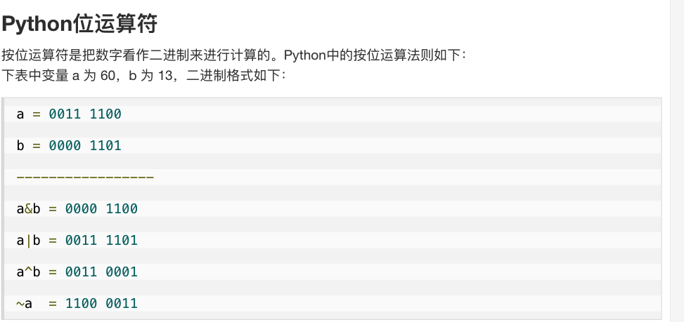
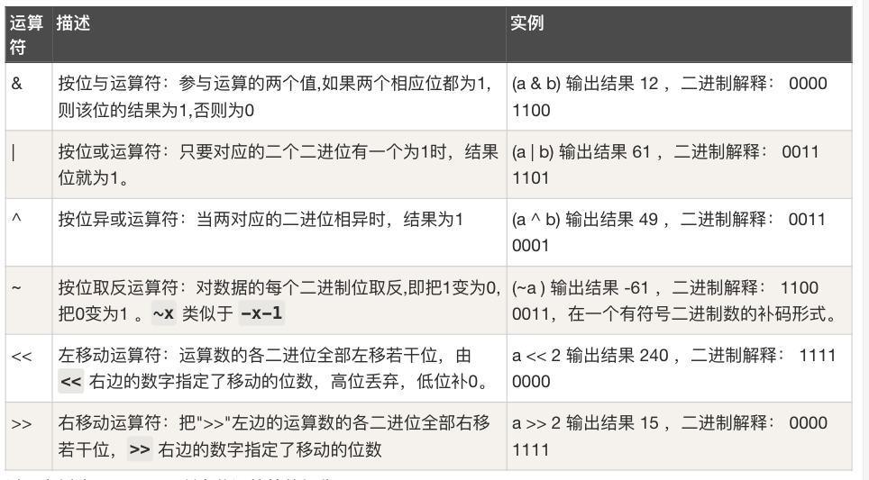

# Bit Manipulation

## LeetCode Problem Lists

- [Bit Manipulation](https://leetcode.com/problem-list/bit-manipulation/)
- [Bitmask](https://leetcode.com/problem-list/bitmask/)

## Overview

Bit manipulation operates directly on the **binary representation** of integers. Because
each operation is a single CPU instruction, bitwise tricks turn many `O(n)` scans into
`O(1)` arithmetic, and let a small integer act as a compact **set** (bitmask) of up to
32/64 flags.

### Key Properties
- **Time Complexity**: `O(1)` per bit op; `O(number of bits)` ≈ `O(32)` for whole-word scans
- **Space Complexity**: `O(1)` — a mask reuses one integer instead of an array/set
- **Core Idea**: read/flip individual bits with `&` `|` `^` `~` `<<` `>>`; XOR cancels pairs (`a ^ a = 0`)
- **When to Use**: pairing/cancellation problems, counting set bits, subset enumeration
  (bitmask), power-of-two checks, adding without `+`, packing flags into one number

### Quick Reference — the tricks you must memorize ⭐⭐⭐⭐⭐

| Goal | Expression |
| ---- | ---------- |
| Test if `i`-th bit is set | `(x >> i) & 1` |
| Set `i`-th bit | `x \| (1 << i)` |
| Clear `i`-th bit | `x & ~(1 << i)` |
| Toggle `i`-th bit | `x ^ (1 << i)` |
| Lowest set bit (isolate) | `x & -x` |
| Clear lowest set bit | `x & (x - 1)` |
| Is power of two? | `x > 0 && (x & (x - 1)) == 0` |
| Is even? | `(x & 1) == 0` |
| XOR self-cancel | `a ^ a = 0`, `a ^ 0 = a` |

### References
- [LeetCode — Bit Manipulation card](https://leetcode.com/explore/learn/card/bit-manipulation/)
- [bit_manipulation.md](https://github.com/yennanliu/CS_basics/blob/master/doc/bit_manipulation.md)
- [leetcode-easy-bitwise-xor-summary](https://steveyang.blog/2022/07/02/leetcode-easy-bitwise-xor-summary/)

## 0) Concept
- Base
    - [Ref](https://leetcode.com/explore/learn/card/bit-manipulation/669/bit-manipulation-concepts/4494/)
    - The actual value of a base-X number is determined by each digit and its location.
    - example :
        - 123.45 (base 10) = 1 * 10^2 + 2 * 10^1 + 3 * 10^0 + 4 * 10^(-1) + 5 * 10^(-2)
        - 720.5 (base 8) = 7 * 8^2 + 2 * 8^1 + 0 * 8^0 + 5 * 8^(-1)
    - In computer science, the binary system is most commonly used. It has two digits: 0, and 1. Octal (base-8) and hexadecimal (base 16) are also commonly used. Octal has eight digits: 0, 1, 2, 3, 4, 5, 6, and 7.

- [bit VS byte VS char](http://web.ntnu.edu.tw/~algo/Bit.html)
    - basic
        - bit : binary number (use 2 as base : 0, 1)
        - Hexadecimal Number : use 16 as base : 0123456789abcdef (lower, upper case are same)
    - byte : 8 bytes (字節)
    - char : 16 bytes (字符)
    - ref:
        - [java example](https://github.com/yennanliu/JavaHelloWorld/blob/main/src/main/java/Advances/IOFlow/demo1.java#L25)
- ref
    - [bit_manipulation.md](https://github.com/yennanliu/CS_basics/blob/master/doc/bit_manipulation.md)
    - [python-operators.html](https://www.runoob.com/python/python-operators.html)
    - [leetcode-easy-bitwise-xor-summary](https://steveyang.blog/2022/07/02/leetcode-easy-bitwise-xor-summary/)

<p align="center"></p>
<p align="center"></p>

## 1) Core Operations

### 1-1) The 6 operators

| Op | Name | Rule | Example (4-bit) |
| -- | ---- | ---- | --------------- |
| `&`  | AND | 1 only if **both** bits 1 | `0110 & 1010 = 0010` |
| `\|`  | OR  | 1 if **either** bit 1 | `0110 \| 1010 = 1110` |
| `^`  | XOR | 1 if bits **differ** | `0110 ^ 1010 = 1100` |
| `~`  | NOT | flip every bit (`~x = -x - 1`) | `~0110 = ...1001` |
| `<<` | left shift | append `n` zeros → `x * 2^n` | `0011 << 1 = 0110` |
| `>>` | right shift | drop `n` low bits → `x // 2^n` | `0110 >> 1 = 0011` |

> **XOR identities** (the heart of many LC problems): `a ^ a = 0`, `a ^ 0 = a`,
> XOR is **commutative & associative** → XOR-ing a whole list cancels every value that
> appears an even number of times, leaving only the odd-count one.

### 1-2) Single-bit tricks (with code)

```java
// java
int  testBit(int x, int i)  { return (x >> i) & 1; }   // 1 if bit i is set, else 0
int  setBit(int x, int i)   { return x | (1 << i); }   // force bit i to 1
int  clearBit(int x, int i) { return x & ~(1 << i); }  // force bit i to 0
int  toggleBit(int x, int i){ return x ^ (1 << i); }   // flip bit i
int  lowestSetBit(int x)    { return x & -x; }         // isolate lowest 1-bit
int  clearLowestBit(int x)  { return x & (x - 1); }    // turn OFF lowest 1-bit
```

```python
# python
def test_bit(x, i):    return (x >> i) & 1     # 1 if bit i is set, else 0
def set_bit(x, i):     return x | (1 << i)     # force bit i to 1
def clear_bit(x, i):   return x & ~(1 << i)    # force bit i to 0
def toggle_bit(x, i):  return x ^ (1 << i)     # flip bit i
def lowest_set_bit(x): return x & -x           # isolate lowest 1-bit
def clear_lowest(x):   return x & (x - 1)      # turn OFF lowest 1-bit
```

### 1-3) Counting set bits (population count)

**Key Idea**: `x & (x - 1)` clears the lowest set bit, so the loop runs **once per 1-bit**
(Brian Kernighan's algorithm) → `O(popcount)` instead of `O(32)`.

```java
// java
// IDEA: each `x &= (x - 1)` removes exactly one set bit
public int countBits(int x) {
    int count = 0;
    while (x != 0) {
        x &= (x - 1);   // clear lowest set bit
        count++;
    }
    return count;
    // built-in: Integer.bitCount(x)
}
```

```python
# python
# IDEA: each `x &= (x - 1)` removes exactly one set bit
def count_bits(x):
    count = 0
    while x:
        x &= (x - 1)    # clear lowest set bit
        count += 1
    return count
    # built-in: bin(x).count("1")
```

**Visual trace** — `count_bits(12)`, `12 = 1100`:

```text
x = 1100   x & (x-1) = 1100 & 1011 = 1000   count = 1
x = 1000   x & (x-1) = 1000 & 0111 = 0000   count = 2
x = 0000   stop                              → 2 set bits
```

## 2) LC Example

### 2-1) Gray Code — LC 89
```python
# LC 89 Gray Code
# V0
# IDEA : bit op
# https://blog.csdn.net/qqxx6661/article/details/78371259
# DEMO
# i = 0 bin(i) = 0b0 bin(i >> 1) = 0b0 bin(i >> 1) ^ i  = 0b0
# i = 1 bin(i) = 0b1 bin(i >> 1) = 0b0 bin(i >> 1) ^ i  = 0b1
# i = 2 bin(i) = 0b10 bin(i >> 1) = 0b1 bin(i >> 1) ^ i  = 0b11
# i = 3 bin(i) = 0b11 bin(i >> 1) = 0b1 bin(i >> 1) ^ i  = 0b10
# i = 4 bin(i) = 0b100 bin(i >> 1) = 0b10 bin(i >> 1) ^ i  = 0b110
# i = 5 bin(i) = 0b101 bin(i >> 1) = 0b10 bin(i >> 1) ^ i  = 0b111
# i = 6 bin(i) = 0b110 bin(i >> 1) = 0b11 bin(i >> 1) ^ i  = 0b101
# i = 7 bin(i) = 0b111 bin(i >> 1) = 0b11 bin(i >> 1) ^ i  = 0b100
# i = 8 bin(i) = 0b1000 bin(i >> 1) = 0b100 bin(i >> 1) ^ i  = 0b1100
# i = 9 bin(i) = 0b1001 bin(i >> 1) = 0b100 bin(i >> 1) ^ i  = 0b1101
# i = 10 bin(i) = 0b1010 bin(i >> 1) = 0b101 bin(i >> 1) ^ i  = 0b1111
# i = 11 bin(i) = 0b1011 bin(i >> 1) = 0b101 bin(i >> 1) ^ i  = 0b1110
# i = 12 bin(i) = 0b1100 bin(i >> 1) = 0b110 bin(i >> 1) ^ i  = 0b1010
# i = 13 bin(i) = 0b1101 bin(i >> 1) = 0b110 bin(i >> 1) ^ i  = 0b1011
# i = 14 bin(i) = 0b1110 bin(i >> 1) = 0b111 bin(i >> 1) ^ i  = 0b1001
# i = 15 bin(i) = 0b1111 bin(i >> 1) = 0b111 bin(i >> 1) ^ i  = 0b1000
class Solution(object):
    def grayCode(self, n):
        res = []
        size = 2**n
        for i in range(size):
            print ("i = " + str(i) + " bin(i) = " + str(bin(i)) + " bin(i >> 1) = " + str(bin(i >> 1))  + " bin(i >> 1) ^ i  = " + str( bin((i >> 1) ^ i) )  )
            """
            NOTE : 
              step 1) we move 1 digit right in every iteration (i >> 1), for keep adding space
              step 2) we do (i >> 1) ^ i. for getting "inverse" binary code with i
              step 3) append and return the result 
            """
            res.append((i >> 1) ^ i)
        return res

# V1'
# https://ithelp.ithome.com.tw/articles/10213273
# DEMO
# In [23]: add=1

# In [24]: add = add << 1

# In [25]: add
# Out[25]: 2

# In [26]: add = add << 1

# In [27]: add
# Out[27]: 4

# In [28]: add = add << 1

# In [29]: add
# Out[29]: 8

# In [30]: add = add << 1

# In [31]: add
# Out[31]: 16

# In [32]: add = add << 1

# In [33]: add
# Out[33]: 32
#
class Solution:
    def grayCode(self, n):
        res = [0]
        add = 1
        for _ in range(n):
            for i in range(add):
                res.append(res[add - 1 - i] + add);
            add <<= 1
        return res
```

```java
// java
// LC 89 Gray Code
// IDEA: i-th gray code = i ^ (i >> 1)
class Solution {
    public List<Integer> grayCode(int n) {
        List<Integer> res = new ArrayList<>();
        int size = 1 << n;                 // 2^n codes
        for (int i = 0; i < size; i++) {
            res.add(i ^ (i >> 1));         // reflect to get the "inverse" binary code
        }
        return res;
    }
}
```

### 2-2) Reverse Bits — LC 190
```python
# 190. Reverse Bits
# V0
class Solution:
    def reverseBits(self, n):
        s = bin(n)[2:]
        s = "0"*(32 - len(s)) + s
        t = s[::-1]
        return int(t,2)

# V0'
# DEMO
# n = 10100101000001111010011100
# n =       10100101000001111010011100
class Solution:
    def reverseBits(self, n):
        n = bin(n)[2:]         # convert to binary, and remove the usual 0b prefix
        print ("n = " + str(n))
        n = '%32s' % n         # print number into a pre-formatted string with space-padding
        print ("n = " + str(n))
        n = n.replace(' ','0') # Convert the useful space-padding into zeros
        # Now we have a  proper binary representation, so we can make the final transformation
        return int(n[::-1],2)

# V0'' 
class Solution(object):
    def reverseBits(self, n):
        #b = bin(n)[:1:-1]
        b = bin(n)[2:][::-1]
        return int(b + '0'*(32-len(b)), 2)
```

```java
// java
// LC 190 Reverse Bits
// IDEA: pull off the lowest bit of n, push it onto res from the left, 32 times
public class Solution {
    public int reverseBits(int n) {
        int res = 0;
        for (int i = 0; i < 32; i++) {
            res <<= 1;               // make room for the next bit
            res |= (n & 1);          // copy n's lowest bit into res
            n >>>= 1;                // unsigned shift — must NOT sign-extend (LC 190 treats n as unsigned 32-bit)
        }
        return res;
    }
}
```

### 2-3) Power of Two — LC 231
```python
# LC 231. Power of Two
# NOTE : there is also brute force approach
# V0'
# IDEA : BIT OP
# IDEA : Bitwise operators : Turn off the Rightmost 1-bit
# https://leetcode.com/problems/power-of-two/solution/
class Solution(object):
    def isPowerOfTwo(self, n):
        if n == 0:
            return False
        return n & (n - 1) == 0
```

```java
// java
// LC 231 Power of Two
// IDEA: a power of two has exactly ONE set bit -> x & (x-1) removes it, leaving 0
class Solution {
    public boolean isPowerOfTwo(int n) {
        // n > 0 rules out 0 and negatives (which have set sign bit)
        return n > 0 && (n & (n - 1)) == 0;
    }
}
```

### 2-4) Add Binary — LC 67
```python
# LC 67. Add Binary
# V0
# IDEA : Bit-by-Bit Computation
class Solution:
    def addBinary(self, a, b):
        n = max(len(a), len(b))
        """
        NOTE : zfill syntax
            -> fill n-1 "0" to a string at beginning

            example :
                In [10]: x = '1'

                In [11]: x.zfill(2)
                Out[11]: '01'

                In [12]: x.zfill(3)
                Out[12]: '001'

                In [13]: x.zfill(4)
                Out[13]: '0001'

                In [14]: x.zfill(10)
                Out[14]: '0000000001'
        """
        a, b = a.zfill(n), b.zfill(n)
        
        carry = 0
        answer = []
        for i in range(n - 1, -1, -1):
            if a[i] == '1':
                carry += 1
            if b[i] == '1':
                carry += 1
                
            if carry % 2 == 1:
                answer.append('1')
            else:
                answer.append('0')
            
            carry //= 2
        
        if carry == 1:
            answer.append('1')
        answer.reverse()
        
        return ''.join(answer)

# V0'
# IDEA : py default
class Solution:
    def addBinary(self, a, b) -> str:
        return '{0:b}'.format(int(a, 2) + int(b, 2))

# V0''
# IDEA : Bit Manipulation
class Solution:
    def addBinary(self, a, b) -> str:
        x, y = int(a, 2), int(b, 2)
        while y:
            answer = x ^ y
            carry = (x & y) << 1
            x, y = answer, carry
        return bin(x)[2:]
```

```java
// java
// LC 67 Add Binary
// IDEA: bit-by-bit addition from the right, carrying over
class Solution {
    public String addBinary(String a, String b) {
        StringBuilder sb = new StringBuilder();
        int i = a.length() - 1, j = b.length() - 1, carry = 0;
        while (i >= 0 || j >= 0 || carry != 0) {
            int sum = carry;
            if (i >= 0) sum += a.charAt(i--) - '0';
            if (j >= 0) sum += b.charAt(j--) - '0';
            sb.append(sum % 2);      // current bit
            carry = sum / 2;         // carry to next position
        }
        return sb.reverse().toString();
    }
}
```

### 2-5) Sum of Two Integers — LC 371
```python
# 371. Sum of Two Integers
# V0'
# https://blog.csdn.net/fuxuemingzhu/article/details/79379939
#########
# XOR op:
#########
# https://stackoverflow.com/questions/14526584/what-does-the-xor-operator-do
# XOR is a binary operation, it stands for "exclusive or", that is to say the resulting bit evaluates to one if only exactly one of the bits is set.
# -> XOR : RETURN 1 if only one "1", return 0 else 
# -> XOR extra : Exclusive or or exclusive disjunction is a logical operation that is true if and only if its arguments differ. It is symbolized by the prefix operator J and by the infix operators XOR, EOR, EXOR, ⊻, ⩒, ⩛, ⊕, ↮, and ≢. Wikipedia
# a | b | a ^ b
# --|---|------
# 0 | 0 | 0
# 0 | 1 | 1
# 1 | 0 | 1
# 1 | 1 | 0
# This operation is performed between every two corresponding bits of a number.
# Example: 7 ^ 10
# In binary: 0111 ^ 1010
#   0111
# ^ 1010
# ======
#   1101 = 13
class Solution(object):
    def getSum(self, a, b):
        """
        :type a: int
        :type b: int
        :rtype: int
        """
        # 32 bits integer max
        MAX = 2**31-1  #0x7FFFFFFF
        # 32 bits interger min
        MIN = 2**31    #0x80000000
        # mask to get last 32 bits
        mask = 2**32-1 #0xFFFFFFFF
        while b != 0:
            # ^ get different bits and & gets double 1s, << moves carry
            a, b = (a ^ b) & mask, ((a & b) << 1) & mask
        # if a is negative, get a's 32 bits complement positive first
        # then get 32-bit positive's Python complement negative
        return a if a <= MAX else ~(a ^ mask)

# V0''
# https://blog.csdn.net/fuxuemingzhu/article/details/79379939
class Solution():
    def getSum(self, a, b):
        MAX = 2**31-1  #0x7fffffff
        MIN = 2**31    #0x80000000
        mask = 2**32-1 #0xFFFFFFFF
        while b != 0:
            a, b = (a ^ b) & mask, ((a & b) << 1)
        return a if a <= MAX else ~(a ^ mask)
```

```java
// java
// LC 371 Sum of Two Integers
// IDEA: a ^ b = sum without carry; (a & b) << 1 = the carry; loop until no carry left
class Solution {
    public int getSum(int a, int b) {
        while (b != 0) {
            int carry = (a & b) << 1;   // positions where both are 1 carry left
            a = a ^ b;                  // add bits with no carry
            b = carry;                  // fold the carry back in next round
        }
        return a;
    }
}
```

### 2-6) Single Number — LC 136

**Key Idea**: XOR every element. Pairs cancel (`a ^ a = 0`), leaving the lone number.

```python
# python
# LC 136 Single Number
# IDEA: XOR all -> duplicates cancel, single element remains
class Solution(object):
    def singleNumber(self, nums):
        res = 0
        for n in nums:
            res ^= n        # a ^ a = 0, a ^ 0 = a
        return res
```

```java
// java
// LC 136 Single Number
// time = O(N), space = O(1)
class Solution {
    public int singleNumber(int[] nums) {
        int res = 0;
        for (int n : nums) res ^= n;   // pairs cancel, single survives
        return res;
    }
}
```

### 2-7) Single Number II — LC 137

Every element appears **3 times** except one. Plain XOR fails (it only cancels pairs). Use
**bit-counting mod 3**: for each of the 32 bit positions, count the 1s across all numbers;
`count % 3` is the bit of the unique number.

```python
# python
# LC 137 Single Number II
# IDEA: for each bit position, sum of set bits % 3 = that bit of the answer
class Solution(object):
    def singleNumber(self, nums):
        res = 0
        for i in range(32):
            bit_sum = 0
            for n in nums:
                bit_sum += (n >> i) & 1        # count 1s at position i
            bit = bit_sum % 3                  # 0 or 1 -> the unique number's bit
            if bit:
                res |= (1 << i)
        # handle negative numbers (Python ints are unbounded)
        if res >= 2**31:
            res -= 2**32
        return res
```

```java
// java
// LC 137 Single Number II
// IDEA: count set bits per position mod 3
// time = O(32 * N), space = O(1)
class Solution {
    public int singleNumber(int[] nums) {
        int res = 0;
        for (int i = 0; i < 32; i++) {
            int bitSum = 0;
            for (int n : nums) bitSum += (n >> i) & 1;
            if (bitSum % 3 != 0) res |= (1 << i);   // set bit i in answer
        }
        return res;
    }
}
```

### 2-8) Single Number III — LC 260

Two numbers appear once, the rest in pairs. XOR of all = `a ^ b` (the two singles). Isolate
**any** differing bit with `xor & -xor`, then split all numbers into two groups by that bit
— each single lands in its own group and XOR within a group recovers it.

```python
# python
# LC 260 Single Number III
# IDEA: XOR all -> a^b; pick a set bit to split nums into 2 groups; XOR each group
class Solution(object):
    def singleNumber(self, nums):
        xor = 0
        for n in nums:
            xor ^= n                 # xor = a ^ b
        diff = xor & (-xor)          # lowest set bit where a, b differ
        a = 0
        for n in nums:
            if n & diff:             # group with that bit set
                a ^= n
        b = xor ^ a
        return [a, b]
```

```java
// java
// LC 260 Single Number III
// time = O(N), space = O(1)
class Solution {
    public int[] singleNumber(int[] nums) {
        int xor = 0;
        for (int n : nums) xor ^= n;      // a ^ b
        int diff = xor & (-xor);          // isolate a differing bit
        int a = 0;
        for (int n : nums) {
            if ((n & diff) != 0) a ^= n;  // group split by that bit
        }
        return new int[]{a, xor ^ a};
    }
}
```

### 2-9) Number of 1 Bits — LC 191

**Key Idea**: `n & (n - 1)` clears the lowest set bit — loop runs once per set bit.

```python
# python
# LC 191 Number of 1 Bits (Hamming weight)
class Solution(object):
    def hammingWeight(self, n):
        count = 0
        while n:
            n &= (n - 1)       # drop lowest set bit
            count += 1
        return count
```

```java
// java
// LC 191 Number of 1 Bits
// time = O(popcount), space = O(1)
public class Solution {
    public int hammingWeight(int n) {
        int count = 0;
        while (n != 0) {
            n &= (n - 1);      // clear lowest set bit
            count++;
        }
        return count;
    }
}
```

### 2-10) Counting Bits — LC 338

Return `popcount(i)` for every `i` in `[0, n]`. **DP over bits**: `dp[i] = dp[i >> 1] + (i & 1)`
— `i` has the same set bits as `i/2` plus its own lowest bit. `O(n)` overall.

```python
# python
# LC 338 Counting Bits
# IDEA: dp[i] = dp[i >> 1] + (i & 1)
class Solution(object):
    def countBits(self, n):
        dp = [0] * (n + 1)
        for i in range(1, n + 1):
            dp[i] = dp[i >> 1] + (i & 1)   # bits of i/2, plus i's lowest bit
        return dp
```

```java
// java
// LC 338 Counting Bits
// time = O(N), space = O(N)
class Solution {
    public int[] countBits(int n) {
        int[] dp = new int[n + 1];
        for (int i = 1; i <= n; i++) {
            dp[i] = dp[i >> 1] + (i & 1);
        }
        return dp;
    }
}
```

### 2-11) Missing Number — LC 268

`nums` holds `n` distinct values from `[0, n]` with one missing. XOR all indices `0..n` with
all values — every present number cancels with its index, leaving the missing one.

```python
# python
# LC 268 Missing Number
# IDEA: XOR indices 0..n with all values -> matches cancel, missing survives
class Solution(object):
    def missingNumber(self, nums):
        res = len(nums)              # start with index n (loop below only reaches n-1)
        for i, n in enumerate(nums):
            res ^= i ^ n
        return res
```

```java
// java
// LC 268 Missing Number
// time = O(N), space = O(1)
class Solution {
    public int missingNumber(int[] nums) {
        int res = nums.length;       // include index n
        for (int i = 0; i < nums.length; i++) {
            res ^= i ^ nums[i];      // cancel each index with its value
        }
        return res;
    }
}
```

### 2-12) Subsets (bitmask) — LC 78

Every subset of an `n`-element array maps to an `n`-bit number in `[0, 2^n)`: bit `i` set
⇔ include `nums[i]`. Enumerating masks is an iterative alternative to backtracking.

```python
# python
# LC 78 Subsets — bitmask enumeration
# IDEA: mask in [0, 2^n); bit i set -> take nums[i]
class Solution(object):
    def subsets(self, nums):
        n = len(nums)
        res = []
        for mask in range(1 << n):          # 2^n subsets
            subset = []
            for i in range(n):
                if mask & (1 << i):         # is bit i set?
                    subset.append(nums[i])
            res.append(subset)
        return res
```

```java
// java
// LC 78 Subsets — bitmask enumeration
// time = O(2^n * n), space = O(1) extra
class Solution {
    public List<List<Integer>> subsets(int[] nums) {
        int n = nums.length;
        List<List<Integer>> res = new ArrayList<>();
        for (int mask = 0; mask < (1 << n); mask++) {   // 2^n subsets
            List<Integer> subset = new ArrayList<>();
            for (int i = 0; i < n; i++) {
                if ((mask & (1 << i)) != 0) subset.add(nums[i]);
            }
            res.add(subset);
        }
        return res;
    }
}
```

### 2-13) Bitwise AND of Numbers Range — LC 201

AND of all numbers in `[left, right]` = their **common binary prefix** padded with zeros
(any differing low bit becomes 0 somewhere in the range). Shift both right until equal,
counting shifts, then shift the common prefix back.

```python
# python
# LC 201 Bitwise AND of Numbers Range
# IDEA: result is the common high-bit prefix of left and right
class Solution(object):
    def rangeBitwiseAnd(self, left, right):
        shift = 0
        while left < right:            # strip differing low bits
            left >>= 1
            right >>= 1
            shift += 1
        return left << shift           # restore the common prefix, low bits = 0
```

```java
// java
// LC 201 Bitwise AND of Numbers Range
// time = O(log N), space = O(1)
class Solution {
    public int rangeBitwiseAnd(int left, int right) {
        int shift = 0;
        while (left < right) {         // find common prefix
            left >>= 1;
            right >>= 1;
            shift++;
        }
        return left << shift;          // pad differing low bits with 0
    }
}
```

## 3) Bitmask DP

A **bitmask** lets an integer represent a **set of visited/chosen items** (bit `i` set ⇔ item
`i` in the set). When a DP state needs "which subset of ≤ ~20 items have I used", the mask
**is** the state — enabling exponential subset problems to run in `O(2^n · n)`.

### 3-1) Subset enumeration (LC 78 recap)

Iterating `mask` from `0` to `2^n − 1` visits **every** subset exactly once; bit tests pick
members (see [2-12](#2-12-subsets-bitmask--lc-78)). Handy mask idioms:

```python
# python
mask & (1 << i)          # is item i in the subset?
mask | (1 << i)          # add item i
mask & ~(1 << i)         # remove item i
bin(mask).count("1")     # size of the subset
sub = (sub - 1) & mask   # enumerate all SUB-masks of `mask` (classic trick)
```

### 3-2) TSP-style bitmask DP (Held–Karp)

The **Travelling Salesman** family is the canonical bitmask DP: `dp[mask][i]` = min cost of a
path that has **visited exactly the cities in `mask`** and currently sits at city `i`.

```text
state : dp[mask][i]      mask = set of visited cities, i = current city
trans : dp[mask | (1<<j)][j] = min( dp[mask][i] + dist[i][j] )   for j not in mask
answer: min over i of dp[FULL][i] (+ dist[i][start] for a cycle)
time  : O(2^n · n^2)     space : O(2^n · n)
```

```java
// java
// Held–Karp TSP skeleton: dp[mask][i] = min cost visiting `mask`, ending at city i
int tsp(int[][] dist) {
    int n = dist.length, FULL = (1 << n) - 1;
    int[][] dp = new int[1 << n][n];
    for (int[] row : dp) Arrays.fill(row, Integer.MAX_VALUE / 2);
    dp[1][0] = 0;                             // start at city 0, only it visited
    for (int mask = 1; mask <= FULL; mask++) {
        for (int i = 0; i < n; i++) {
            if ((mask & (1 << i)) == 0) continue;         // i must be in mask
            for (int j = 0; j < n; j++) {
                if ((mask & (1 << j)) != 0) continue;     // j must NOT be visited yet
                int next = mask | (1 << j);
                dp[next][j] = Math.min(dp[next][j], dp[mask][i] + dist[i][j]);
            }
        }
    }
    int ans = Integer.MAX_VALUE;
    for (int i = 0; i < n; i++) ans = Math.min(ans, dp[FULL][i] + dist[i][0]); // close cycle
    return ans;
}
```

> **When to reach for bitmask DP**: `n` is small (≤ ~20 so `2^n` is tractable) and the state
> is "which subset have I used/visited". Related LC: 847 (Shortest Path Visiting All Nodes),
> 1349 (Maximum Students Taking Exam), 691 (Stickers to Spell Word), 526 (Beautiful Arrangement).