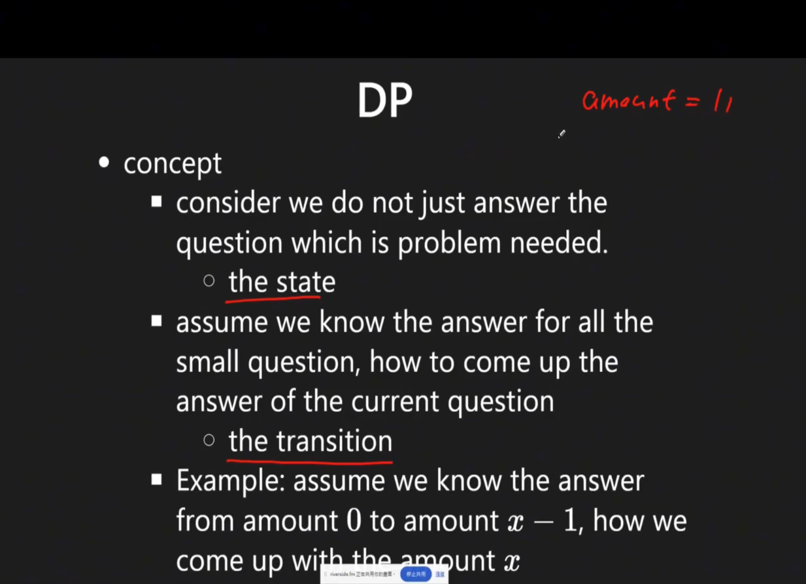

# Dynamic Programming (DP)

> **Scope** — The main DP sheet — state design, the pattern catalogue, and one canonical template per must-know DP family; the worked-solution archive, the rare techniques, and the five heaviest sub-topics live in their own sheets and are linked from here.
> **See also** — *split out of this file*: [dp_examples.md](./dp_examples.md) — the worked LC solution archive and the problems-by-pattern index; [dp_advanced.md](./dp_advanced.md) — game theory, tree DP, interval and string deep dives, probability DP; [knapsack.md](./knapsack.md) — 0/1 vs unbounded, subset sum, combinations vs permutations ([knapsack_01_zh.md](./knapsack_01_zh.md) — 0/1 背包的中文詳解版); [dp_string.md](./dp_string.md) — the two-sequence grid family; [dp_bitmask.md](./dp_bitmask.md) — state compression; [dp_digit.md](./dp_digit.md) — counting numbers by digit; [dp_monotonic_stack.md](./dp_monotonic_stack.md) — stack-carried DP values.
> *Neighbouring sheets*: [dp_pattern.md](./dp_pattern.md) — terse template index, one section per classic pattern; [recursion_to_dp.md](./recursion_to_dp.md) — converting a working recursion into DP step by step; [kadane_algorithm.md](./kadane_algorithm.md) — the maximum-subarray family in depth; [stock_trading.md](./stock_trading.md) — the LC 121/122/188/309/714 state machine.

## LeetCode Problem Lists

- [Dynamic Programming](https://leetcode.com/problem-list/dynamic-programming/)
- [Memoization](https://leetcode.com/problem-list/memoization/)

## Overview
**Dynamic Programming** is an algorithmic paradigm that solves complex problems by breaking them down into simpler subproblems and storing their solutions to avoid redundant computations.

### Key Properties
- **Time Complexity**: Problem-specific, typically O(n²) or O(n³)
- **Space Complexity**: O(n) to O(n²) for memoization table
- **Core Idea**: Trade space for time by memoizing overlapping subproblems
- **When to Use**: Problems with optimal substructure and overlapping subproblems
- **Key Techniques**: Memoization (top-down) and Tabulation (bottom-up)

### Core Characteristics
- **Optimal Substructure**: Optimal solution contains optimal solutions to subproblems
- **Overlapping Subproblems**: Same subproblems solved multiple times
- **Memoization**: Store results to avoid recomputation
- **State Transition**: Define relationship between states

- Core var: `state`, `transition`
- NOTE !!! can put `everything` into `state`

<p align="center"></p>

### Step

Step 1. define `dp def`
Step 2. define `dp eq`
Step 3. check boundary condition, req, edge case
Step 4. get the result

### References
- [Dynamic Programming Patterns](https://leetcode.com/discuss/general-discussion/458695/dynamic-programming-patterns)
- [DP Tutorial](https://www.geeksforgeeks.org/dynamic-programming/) 

## Problem Categories

### **Category 1: Linear DP**
- **Description**: Single sequence problems with linear dependencies
- **Examples**: LC 70 (Climbing Stairs), LC 198 (House Robber), LC 300 (LIS)
- **Pattern**: dp[i] depends on dp[i-1], dp[i-2], etc.
- **Sub-shape — prefix partition**: dp[i] instead scans *every* cut point j < i and tests the whole
  segment s[j:i] — LC 139 (Word Break), LC 132, LC 279. See [Template 1b](#template-1b-prefix-partition-dp---lc-139).

### **Category 2: Grid/2D DP**
- **Description**: Problems on 2D grids or matrices
- **Examples**: LC 62 (Unique Paths), LC 64 (Minimum Path Sum), LC 221 (Maximal Square)
- **Pattern**: dp[i][j] depends on neighbors

### **Category 3: Interval DP**
- **Description**: Problems on intervals or subarrays
- **Examples**: LC 312 (Burst Balloons), LC 1000 (Minimum Cost to Merge Stones)
- **Pattern**: dp[i][j] for interval [i, j]

### **Category 3-2: Game Theory / Minimax DP** → [dp_advanced.md](./dp_advanced.md)
- **Description**: Two-player optimal play on arrays; each player picks from either end
- **Examples**: LC 486 (Predict the Winner), LC 877 (Stone Game), LC 1140 (Stone Game II)
- **Pattern**: `dp[i][j]` = max relative score difference (current player minus opponent) on `nums[i..j]`
- **Recurrence**: `dp[i][j] = max(nums[i] - dp[i+1][j], nums[j] - dp[i][j-1])` — derivation and template in [dp_advanced.md](./dp_advanced.md)

### **Category 4: Tree DP**
- **Description**: DP on tree structures
- **Examples**: LC 337 (House Robber III), LC 968 (Binary Tree Cameras)
- **Pattern**: State at each node depends on children
- **📚 Implementation**: Tree DP problems use DFS traversal for implementation. See **dfs.md Template 6 (Bottom-up DFS)** for the DFS traversal patterns used in tree DP solutions

- **Sub-patterns**: bottom-up (post-order) tree DP and re-rooting DP (two-pass DFS) — both in [dp_advanced.md](./dp_advanced.md)

### **Category 5: State Machine DP**
- **Description**: Problems with multiple states and transitions
- **Examples**: LC 714 (Stock with Fee), LC 309 (Stock with Cooldown), LC 122 (Stock II)
- **Pattern**: Multiple DP arrays for different states
- **Key Characteristic**: State transitions depend on previous state + action constraints

- **Sub-patterns**: 2-state (LC 122), 3-state with cooldown (LC 309), 2k-state for k transactions (LC 123 / 188) — all in [stock_trading.md](./stock_trading.md)

### **Category 6: Knapsack DP**
- **Description**: Selection problems with constraints
- **Examples**: LC 416 (Partition Equal Subset), LC 494 (Target Sum)
- **Pattern**: dp[i][j] for items and capacity/target

### **Category 7: String DP**
- **Description**: String matching, transformation, and subsequence problems
- **Examples**: LC 72 (Edit Distance), LC 1143 (LCS), LC 5 (Longest Palindromic Substring)
- **Pattern**: dp[i][j] for positions in two strings

### **Category 8: State Compression DP**
- **Description**: Use bitmask to represent states, optimize space complexity
- **Examples**: LC 691 (Stickers to Spell Word), LC 847 (Shortest Path Visiting All Nodes)
- **Pattern**: dp[mask] where mask represents visited/selected items

### **Category 9: Monotonic Stack + DP** → [dp_monotonic_stack.md](./dp_monotonic_stack.md)

**Signal**: a brute-force that **removes elements round by round** (each element is deleted once a
bigger element reaches it), or an area/rectangle question over a histogram. Both are O(n^2) if
simulated and O(n) with a monotonic stack that carries a DP value.

| Problem | LC | What the stack carries |
|---------|----|------------------------|
| Steps to Make Array Non-decreasing | 2289 | `dp[i]` = rounds element `i` survives; a popped chain contributes `max(...)` |
| Largest Rectangle in Histogram | 84 | index of the previous smaller bar → width of the rectangle ending here |
| Maximal Rectangle | 85 | LC 84 applied row by row over a running histogram |
| Maximal Square / Count Square Submatrices | 221 / 1277 | `dp[i][j] = 1 + min(up, left, up-left)` (grid DP, not a stack) |
| Flip String to Monotone Increasing | 926 | one-pass counter DP |

[**dp_monotonic_stack.md**](./dp_monotonic_stack.md) covers, in full: the survival-round transition
with a worked trace, the LC 2289 template in Java and Python, the histogram area DP, the maximal
square recurrence, and the LC 926 one-pass DP.

## Templates & Algorithms

### Template Comparison Table
| Template Type | Use Case | State Definition | When to Use |
|---------------|----------|------------------|-------------|
| **1D Linear** | Single sequence | dp[i] = state at position i | Fibonacci-like problems |
| **2D Grid** | Matrix paths | dp[i][j] = state at (i,j) | Path counting, min/max |
| **Interval** | Subarray/substring | dp[i][j] = [i,j] interval | Palindrome, partition |
| **Knapsack** | Selection with limit | dp[i][w] = items & weight | 0/1, unbounded selection |
| **State Machine** | Multiple states | dp[i][state] = at i in state | Buy/sell stocks |

### Universal DP Template
```python
def dp_solution(input_data):
    # Step 1: Define state
    # dp[i] represents...
    
    # Step 2: Initialize base cases
    dp = initialize_dp_array()
    dp[0] = base_value
    
    # Step 3: State transition
    for i in range(1, n):
        # Apply recurrence relation
        dp[i] = f(dp[i-1], dp[i-2], ...)
    
    # Step 4: Return answer
    return dp[n-1]
```

### Template 1: 1-D Linear DP ⭐⭐⭐⭐⭐ — LC 53

```python
def linear_dp(nums):
    """Classic 1D DP for sequence problems"""
    n = len(nums)
    if n == 0:
        return 0

    # State: dp[i] = optimal value at position i
    dp = [0] * n
    dp[0] = nums[0]

    for i in range(1, n):
        # Transition: current vs previous
        dp[i] = max(dp[i-1], nums[i])
        # Or with skip: dp[i] = max(dp[i-1], dp[i-2] + nums[i])

    return dp[n-1]
```

#### Recurrence catalogue (1-D)

| Problem Type | Recurrence | Example | Time | Space |
|--------------|------------|---------|------|-------|
| **Fibonacci** | dp[i] = dp[i-1] + dp[i-2] | LC 70 Climbing Stairs | O(n) | O(1) |
| **House Robber** | dp[i] = max(dp[i-1], dp[i-2] + nums[i]) | LC 198 House Robber | O(n) | O(1) |
| **Decode Ways** | dp[i] = dp[i-1] + dp[i-2] (if valid) | LC 91 Decode Ways | O(n) | O(1) |
| **Word Break** → [Template 1b](#template-1b-prefix-partition-dp---lc-139) | dp[i] = OR(dp[j] AND s[j:i] in dict) | LC 139 Word Break | O(n²) cuts, O(n³) with the slice | O(n) |

#### Maximum subarray (Kadane) → kadane_algorithm.md

`dp[i] = max(nums[i], dp[i-1] + nums[i])` is the same 1-D shape with a "restart or extend" choice, so
it needs no table at all. [**kadane_algorithm.md**](./kadane_algorithm.md) covers that family in full —
LC 53, LC 152 (max product), LC 918 (circular), LC 1191 (repeated array) — including index tracking
and the divide-and-conquer variant.

### Template 1a: 1-D Array Sizing and Loop Bounds (`n` vs `n+1`)

**Key Question**: Why do some 1D DP problems loop from `0 to n`, while others loop from `0 to n+1`?

The difference comes down to **what a single index in your DP array represents**. Two reasons cover almost
every problem; the third — physical "steps" vs "goals", LC 746 — is in [dp_advanced.md](./dp_advanced.md).

#### **1. "Indices" vs "Count" (The Offset)**

This is the most frequent reason for the difference.

- **Loop to `n` (Array size = `n`)**: You are treating the index as a **specific element** in the input array
  - `dp[i]` means "the best result using the i-th element"
  - Example: `dp[3]` represents "result at element index 3"

- **Loop to `n+1` (Array size = `n+1`)**: You are treating the index as a **quantity** or **length**
  - `dp[i]` means "the best result using the first i elements"
  - Example: `dp[3]` represents "result using first 3 elements"

**Example: LC 198 (House Robber)**
```python
# Approach 1: Array size = n (index-based)
def rob_v1(nums):
    n = len(nums)
    if n == 0: return 0
    if n == 1: return nums[0]

    dp = [0] * n
    dp[0] = nums[0]
    dp[1] = max(nums[0], nums[1])

    for i in range(2, n):  # Loop to n
        dp[i] = max(dp[i-1], dp[i-2] + nums[i])

    return dp[n-1]  # Answer at last index

# Approach 2: Array size = n+1 (count-based)
def rob_v2(nums):
    n = len(nums)
    dp = [0] * (n + 1)  # Extra space for "0 houses"
    dp[0] = 0  # Robbing 0 houses = 0
    dp[1] = nums[0] if n > 0 else 0

    for i in range(2, n + 1):  # Loop to n+1
        dp[i] = max(dp[i-1], dp[i-2] + nums[i-1])  # Note: nums[i-1]

    return dp[n]  # Answer at position n
```

#### **2. Handling the "Empty" Base Case**

Many DP problems need a base case representing "nothing" (target sum = 0, empty string, etc.).

**Examples**:
- **Knapsack/Coin Change**: Need `dp[target + 1]` because `dp[0]` represents sum = 0
- **Longest Common Subsequence**: Use `(n+1) x (m+1)` matrix where first row/column = empty string

```python
# LC 322: Coin Change
def coinChange(coins, amount):
    dp = [float('inf')] * (amount + 1)  # Need amount+1
    dp[0] = 0  # Base case: 0 coins needed for amount 0

    for i in range(1, amount + 1):  # Loop to amount+1
        for coin in coins:
            if i >= coin:
                dp[i] = min(dp[i], dp[i - coin] + 1)

    return dp[amount] if dp[amount] != float('inf') else -1
```

#### **Comparison Summary**

| Feature | Loop `0` to `n` | Loop `0` to `n+1` |
|---------|-----------------|-------------------|
| **Array Size** | `new int[n]` | `new int[n + 1]` |
| **`dp[i]` meaning** | Result at element `i` | Result considering first `i` items |
| **Typical Base Case** | `dp[0]` and `dp[1]` | `dp[0]` is the "empty" state |
| **Access Pattern** | `dp[i]` ↔ `nums[i]` | `dp[i]` ↔ `nums[i-1]` |
| **Final Answer** | `dp[n - 1]` | `dp[n]` |
| **Use Case** | Direct element mapping | Count/quantity problems, "goal" beyond array |

---

#### **Side-by-Side Example: LC 70 (Climbing Stairs)**

```python
# Style 1: Array size = n+1 (RECOMMENDED for this problem)
def climbStairs_v1(n):
    if n <= 2:
        return n

    dp = [0] * (n + 1)
    dp[1] = 1
    dp[2] = 2

    for i in range(3, n + 1):
        dp[i] = dp[i-1] + dp[i-2]

    return dp[n]

# Style 2: Array size = n (requires careful handling)
def climbStairs_v2(n):
    if n <= 2:
        return n

    dp = [0] * n
    dp[0] = 1  # 1 way to reach step 1
    dp[1] = 2  # 2 ways to reach step 2

    for i in range(2, n):
        dp[i] = dp[i-1] + dp[i-2]

    return dp[n-1]
```

**Note**: For Climbing Stairs, the `n+1` style is more intuitive because:
- `dp[i]` naturally represents "number of ways to reach step i"
- Step `n` is the goal, so `dp[n]` is the answer
- Avoids the mental overhead of mapping "step i" to "index i-1"

### Template 1b: Prefix Partition DP ⭐⭐⭐⭐ — LC 139

Template 1a's `n+1` sizing exists for exactly this shape. `dp[i]` is a claim about a **prefix
length**, never about "the character at index `i`" — and this is the one 1-D family whose
transition inspects a **whole segment** `s[j:i]` instead of a fixed offset like `dp[i-1]` or
`dp[i-2]`. Everything else in the family swaps out one thing: the test applied to that segment.

#### 🎯 Pattern (LC 139 — Word Break)

| Aspect | Detail |
|--------|--------|
| **Pattern** | Prefix partition — outer loop over prefix *length*, inner loop over the cut point |
| **State** | `dp[i]` = can `s[:i]`, the first `i` characters, be segmented into dictionary words? |
| **Base** | `dp[0] = True` — the empty prefix is vacuously segmented |
| **Transition** | `dp[i] = OR over j < i of (dp[j] AND s[j:i] in dict)` |
| **Answer** | `dp[n]`, **not** `dp[n-1]` — the table has `n+1` slots |
| **Complexity** | O(n²) cuts × O(L) per slice+hash → O(n³) worst case, O(n) space (see below) |

#### 💡 Core Idea

**Guess the last word.** If `s[:i]` splits at all, then whatever the split is, it ends with one
final word. That word occupies `s[j:i]` for some cut point `j`, and everything before it is the
smaller problem `s[:j]` — which `dp[j]` has already answered. So enumerate every place the last
word could start and ask two questions:

```text
        j                 i
s:  [ ---- dp[j] ---- ][ s[j:i] ]
      already solved     one word?
```

`dp[i]` is true the moment **some** `j` answers yes to both — which is why the inner loop can
`break` on the first hit. It is an OR over cut points, not a count.

```text
s = "leetcode", dict = {"leet", "code"}

i=0                     dp[0] = True   (base: empty prefix)
i=1..3   no j works     dp[1..3] = False
i=4      j=0: dp[0] AND "leet" in dict  -> dp[4] = True
i=5..7   no j works     dp[5..7] = False
i=8      j=4: dp[4] AND "code" in dict  -> dp[8] = True
                                           ^ answer = dp[n] = dp[8]
```

**Read `i` as a boundary, not a character.** `i` is the frontier between "already segmented" and
"not yet looked at", so it legitimately reaches `n` — one past the last character. That is the
same frontier the BFS formulation queues up, and it is why `dp` is sized `n+1`.

#### Code

```python
# python
# IDEA: PREFIX PARTITION DP — dp[i] = can s[:i] be cut into dictionary words
# LC 139 - Word Break
# time = O(n^2) cuts * O(L) slice+hash, space = O(n + dictionary)
class Solution(object):
    def wordBreak(self, s, wordDict):
        n = len(s)
        words = set(wordDict)          # set, not list — see the trap below

        dp = [False] * (n + 1)         # NOTE: n+1 slots, indexed by prefix LENGTH
        dp[0] = True                   # the empty prefix is always segmentable

        for i in range(1, n + 1):      # i = end boundary of the prefix
            for j in range(i):         # j = start of the candidate last word
                if dp[j] and s[j:i] in words:
                    dp[i] = True
                    break              # one valid cut is enough — it is an OR
        return dp[n]
```

```java
// java
// IDEA: PREFIX PARTITION DP — dp[i] = can s[:i] be cut into dictionary words
// LC 139 - Word Break
// time = O(n^2) cuts * O(L) substring+hash, space = O(n + dictionary)
public boolean wordBreak(String s, List<String> wordDict) {
    int n = s.length();
    Set<String> words = new HashSet<>(wordDict);

    boolean[] dp = new boolean[n + 1];   // NOTE: n+1 slots, indexed by prefix LENGTH
    dp[0] = true;                        // the empty prefix is always segmentable

    for (int i = 1; i <= n; i++) {       // i = end boundary of the prefix
        for (int j = 0; j < i; j++) {    // j = start of the candidate last word
            if (dp[j] && words.contains(s.substring(j, i))) {
                dp[i] = true;
                break;                   // one valid cut is enough — it is an OR
            }
        }
    }
    return dp[n];
}
```

#### ⚠️ Three traps

1. **`in wordDict` on the raw list.** `s[j:i] in wordDict` against a *list* is a linear scan with a
   string compare at each step — O(k·L) per lookup, so the whole solve degrades to O(n²·k·L) and
   TLEs. `set(wordDict)` makes it one hash. This is the single most common reason a correct-looking
   Word Break times out.
2. **Looping over the dictionary instead of over the cut points.** The inner loop is `range(i)` —
   *positions* — not `for w in wordDict`. The word-driven loop is the BFS/greedy formulation and
   needs a `visited` set to avoid re-expanding a boundary; mixing the two is where most buggy
   attempts land.
3. **Returning `dp[-1]` after mis-sizing.** With `n` slots instead of `n+1` there is nowhere to put
   the `dp[0] = True` base case, and every answer collapses to `False`.

#### Complexity, stated honestly

The doubled loop is O(n²) iterations, but each one **builds and hashes a substring** of length up
to `n`. Counting that:

| Accounting | Bound | When it is the right one to quote |
|------------|-------|-----------------------------------|
| Treat slice + hash as O(1) | **O(n²)** | The usual interview shorthand |
| Charge the slice its real cost | **O(n³)** | Python `s[j:i]` / Java `substring` — the strict bound |
| Cap the inner loop at the longest word `L` | **O(n·L²)** | The optimisation below; `L ≤ 20` on LC 139 |

A last word longer than the longest dictionary entry can never match, so the inner loop only needs
to reach back `L` characters:

```python
# python
# IDEA: same DP, inner loop capped by the longest word — O(n * L^2), effectively linear in n
L = max(map(len, words))
for i in range(1, n + 1):
    for j in range(max(0, i - L), i):
        if dp[j] and s[j:i] in words:
            dp[i] = True
            break
```

#### Similar LeetCode Problems

Every one of these is the same `dp[i] = f(dp[j], segment(j, i))` skeleton. Only the **segment test**
and the **combining operator** change:

| Problem | Segment test on `s[j:i]` | Combine | Note |
|---------|--------------------------|---------|------|
| **LC 139** Word Break | is it a dictionary word? | OR | The template above |
| **LC 140** Word Break II | is it a dictionary word? | collect | Memoise *lists of sentences*, not booleans; backtrack from the same table |
| **LC 472** Concatenated Words | is it one of the *other* words? | OR | Sort by length so only strictly shorter words are in the dict |
| **LC 132** Palindrome Partitioning II | is it a palindrome? | `min(+1)` | Precompute the palindrome table first, then the identical cut loop |
| **LC 91** Decode Ways | is it a valid 1–2 digit code? | sum | Segment length is capped at 2, so the inner loop degenerates to `dp[i-1] + dp[i-2]` |
| **LC 279** Perfect Squares | is `i - j` a perfect square? | `min(+1)` | Same shape over integers rather than characters |
| **LC 1043** Partition Array for Max Sum | is the run ≤ `k` long? | `max` | Carries the running segment max alongside `j` |
| **LC 322** Coin Change | is `i - j` a coin? | `min(+1)` | The unbounded-knapsack spelling of the same recurrence |

> **Not this template**: [LC 131 Palindrome Partitioning](./backtrack.md) enumerates *every* split
> rather than deciding one, so it is backtracking — DP prunes to a yes/no or an optimum, and cannot
> enumerate exponentially many outputs any faster. LC 140 is the hybrid: DP to prove a split exists,
> then backtracking to list them.

### Template 2: 2-D Grid DP ⭐⭐⭐⭐⭐ — LC 64

#### 🎯 Pattern (LC 64 — Minimum Path Sum)

| Aspect | Detail |
|--------|--------|
| **Pattern** | 2D Grid DP — move right/down only |
| **State** | `dp[i][j]` = min cost to reach cell `(i, j)` from `(0, 0)` |
| **Transition** | `dp[i][j] = grid[i][j] + min(dp[i-1][j], dp[i][j-1])` |
| **Base Cases** | First row: prefix sum left→right; First col: prefix sum top→bottom |
| **Answer** | `dp[m-1][n-1]` |
| **Time** | O(m × n) |
| **Space** | O(m × n) standard, O(n) space-optimized |

#### 💡 Core Idea

> At each cell, the minimum cost path must have come from either **above** or **left** (only two options since movement is right/down only). Take the minimum of the two and add the current cell's value.

**Why no `visited` array needed** (unlike LC 1631):
- Movement is one-directional (right/down only) → no cycles, no revisiting
- Each cell is computed exactly once in row-major order
- DP fills naturally from top-left to bottom-right

#### The 2-D DP implementation (standard)

```java
public int minPathSum(int[][] grid) {
    int m = grid.length;
    int n = grid[0].length;
    int[][] dp = new int[m][n];

    // Base: starting cell
    dp[0][0] = grid[0][0];

    // Base: first column — only one way (from above)
    for (int i = 1; i < m; i++)
        dp[i][0] = dp[i - 1][0] + grid[i][0];

    // Base: first row — only one way (from left)
    for (int j = 1; j < n; j++)
        dp[0][j] = dp[0][j - 1] + grid[0][j];

    // Fill rest: min of coming from above vs left
    for (int i = 1; i < m; i++)
        for (int j = 1; j < n; j++)
            dp[i][j] = grid[i][j] + Math.min(dp[i - 1][j], dp[i][j - 1]);

    return dp[m - 1][n - 1];
}
```

#### **⚠️ LC 64 vs LC 1631: When to Use DP vs Dijkstra**

| | LC 64 (Min Path Sum) | LC 1631 (Min Effort Path) |
|---|---|---|
| **Movement** | Right + Down only | All 4 directions |
| **Cost** | Accumulative sum | Max of step differences |
| **Revisit cells?** | No (one direction) | Yes (better path possible) |
| **Algorithm** | 2D DP | Dijkstra + min-heap |
| **`visited` needed?** | No | Yes |
| **Why DP works** | No cycles, DAG structure | DP fails: can revisit |

**Rule**: If movement is constrained to one direction (right/down) → use **2D DP**. If all 4 directions are allowed → use **Dijkstra** (or BFS with priority).

#### Recurrence catalogue (2-D)

| Problem Type | Recurrence | Example | Time | Space |
|--------------|------------|---------|------|-------|
| **Unique Paths** | dp[i][j] = dp[i-1][j] + dp[i][j-1] | LC 62 Unique Paths | O(m×n) | O(n) |
| **Min Path Sum** | dp[i][j] = min(dp[i-1][j], dp[i][j-1]) + grid[i][j] | LC 64 Min Path Sum | O(m×n) | O(n) |
| **LCS** | dp[i][j] = dp[i-1][j-1] + 1 if match else max(...) | LC 1143 LCS | O(m×n) | O(n) |
| **Edit Distance** | dp[i][j] = min(insert, delete, replace) | LC 72 Edit Distance | O(m×n) | O(n) |

> The Python transcription, the in-place variant, the O(m) rolling-row form, the top-down memoised
> form, the four-approach comparison table, the similar-problem map and the
> `[[1,3,1],[1,5,1],[4,2,1]]` trace are in [dp_advanced.md](./dp_advanced.md); the counting twin
> LC 62 (Unique Paths) is worked in [dp_examples.md](./dp_examples.md).

### Template 3: Interval DP — LC 312


**🎯 Key Insight**: Think about which element to process **LAST**, not first!

This is the hallmark of interval DP problems like Burst Balloons, Matrix Chain Multiplication, and similar problems where the order of operations matters.

**Core Pattern**:
- **State**: `dp[i][j]` = optimal value for interval `(i, j)` (often exclusive)
- **Transition**: For each element `k` in `(i, j)`, assume `k` is the **last** element processed
- **Why "Last"?** When `k` is last, the subproblems on left and right are independent

**The 3-Level Nested Loop Structure**:
```text
for length in [2, 3, ..., n+1]:        # Build from small to large intervals
    for left in [0, 1, ..., n-length]: # Try all possible left boundaries
        right = left + length           # Calculate right boundary
        for k in [left+1, ..., right-1]: # Try each element as LAST
            # dp[left][right] = combine(dp[left][k], dp[k][right], cost)
```

#### Burst Balloons — LC 312 (exclusive boundaries)

**Problem**: Burst all balloons to maximize coins. Bursting balloon `i` gives `nums[i-1] * nums[i] * nums[i+1]` coins.

**Key Insight**:
- Add boundaries `[1, ...nums..., 1]` to handle edge cases
- `dp[i][j]` = max coins from bursting balloons **between** `i` and `j` (exclusive)
- When `k` is the **last** balloon burst in `(i, j)`, its neighbors are `i` and `j`

**Why This Works**:
- If we think "which balloon to burst first?", the problem is hard because neighbors change
- If we think "which balloon to burst last?", when we burst `k` last:
  - All balloons in `(i, k)` are already gone → subproblem `dp[i][k]`
  - All balloons in `(k, j)` are already gone → subproblem `dp[k][j]`
  - Only `i`, `k`, `j` remain → coins = `balloons[i] * balloons[k] * balloons[j]`

**Python Implementation**:
```python
def maxCoins(nums):
    """LC 312: Burst Balloons - Classic Interval DP"""
    n = len(nums)

    # Step 1: Add boundary balloons with value 1
    balloons = [1] + nums + [1]

    # Step 2: dp[i][j] = max coins from bursting balloons between i and j (exclusive)
    dp = [[0] * (n + 2) for _ in range(n + 2)]

    # Step 3: Build from small intervals to large
    for length in range(2, n + 2):  # length of interval
        for left in range(n + 2 - length):  # left boundary
            right = left + length  # right boundary

            # Step 4: Try each balloon k as the LAST to burst in (left, right)
            for k in range(left + 1, right):
                # Coins from bursting k last (only left, k, right remain)
                coins = balloons[left] * balloons[k] * balloons[right]
                # Add coins from left and right subproblems
                total = coins + dp[left][k] + dp[k][right]
                dp[left][right] = max(dp[left][right], total)

    # Answer: burst all balloons between boundaries 0 and n+1
    return dp[0][n + 1]
```

**Java Implementation**:
```java
// LC 312: Burst Balloons
public int maxCoins(int[] nums) {
    int n = nums.length;

    // Add boundaries: [1, ...nums..., 1]
    int[] balloons = new int[n + 2];
    balloons[0] = 1;
    balloons[n + 1] = 1;
    for (int i = 0; i < n; i++) {
        balloons[i + 1] = nums[i];
    }

    // dp[i][j] = max coins from bursting balloons between i and j (exclusive)
    int[][] dp = new int[n + 2][n + 2];

    // Iterate over interval lengths (from 2 up to n+1)
    for (int len = 2; len <= n + 1; len++) {
        // i is the left boundary
        for (int i = 0; i <= n + 1 - len; i++) {
            int j = i + len; // j is the right boundary

            // Pick k as the LAST balloon to burst in interval (i, j)
            for (int k = i + 1; k < j; k++) {
                int currentCoins = balloons[i] * balloons[k] * balloons[j];
                int total = currentCoins + dp[i][k] + dp[k][j];
                dp[i][j] = Math.max(dp[i][j], total);
            }
        }
    }

    return dp[0][n + 1];
}
```

#### **Key Characteristics of This Pattern**

| Aspect | Detail |
|--------|--------|
| **State Definition** | `dp[i][j]` = optimal value for interval `(i, j)` or `[i, j]` |
| **Loop Order** | Length (outer) → Left boundary → Split point `k` |
| **Transition** | Try each `k` as the **last** element processed |
| **Time Complexity** | O(n³) - three nested loops |
| **Space Complexity** | O(n²) - 2D DP table |
| **Key Insight** | Process elements in reverse order of dependency |

#### **Common Problems Using This Pattern**

| Problem | LC # | Key Technique | Difficulty |
|---------|------|---------------|------------|
| **Burst Balloons** | 312 | Last balloon to burst | Hard |
| **Matrix Chain Multiplication** | N/A | Last matrix multiply | Classic |
| **Minimum Cost to Merge Stones** | 1000 | Last merge operation | Hard |
| **Remove Boxes** | 546 | Last box to remove | Hard |
| **Palindrome Partitioning II** | 132 | Min cuts (variant) | Hard |
| **Strange Printer** | 664 | Last character to print | Hard |

> The inclusive-boundary variant, the top-down memoised form, the worked `nums = [3,1,5,8]` trace,
> the recognition checklist, the common mistakes, the O(n³)/O(n²) derivation, the abstract
> split-point / matrix-chain skeletons and the backward-i + forward-j loop-order rule are in
> [dp_advanced.md](./dp_advanced.md).

### Template 4: 0/1 Knapsack ⭐⭐⭐⭐⭐ — LC 416

#### 🎯 Core Idea

**0/1 Knapsack** = each item may be taken **at most once** (0 or 1 time).

> Given a set of items (each with weight and value) and a capacity, find the maximum value you can pack **without exceeding the capacity** and **using each item at most once**.

| Aspect | Detail |
|--------|--------|
| **State** | `dp[w]` = best value achievable with capacity exactly `w` |
| **Transition** | `dp[w] = max(dp[w], dp[w - weight[i]] + value[i])` |
| **Loop order** | Outer: items; Inner: capacity **backward** (`W → weight[i]`) |
| **Why backward** | Prevents using the same item twice in one pass |
| **Time** | O(n × W) |
| **Space** | O(W) with 1-D optimization |

---

#### 💡 Why Must the Inner Loop Go Backward?

This is **the most critical detail** in 0/1 Knapsack.

**Intuition**: in a 1-D DP array, when we process item `i` we need `dp[w - weight[i]]` to still reflect the state **before** item `i` was considered. If we iterate forward, the update to a smaller index `dp[w - weight[i]]` happens earlier in the same pass, so a later index `dp[w]` would pick it up — effectively using item `i` twice.

**Concrete trace — LC 416, `nums = [3]`, `target = 6`:**

```text
# Goal: can we pick some numbers that sum to 6?
# Only num = 3 is available, so the answer should be False.

dp = [True, False, False, False, False, False, False]
        0      1      2      3      4      5      6

❌ Forward iteration (WRONG):
   for s in range(3, 7):       # 3, 4, 5, 6
       dp[s] = dp[s] or dp[s - 3]

   s=3: dp[3] = dp[0] = True   ← 3 used once (ok so far)
   s=6: dp[6] = dp[3] = True   ← dp[3] was just SET by the same num!
                                   This counts 3 twice: 3 + 3 = 6 ❌

✅ Backward iteration (CORRECT):
   for s in range(6, 2, -1):   # 6, 5, 4, 3
       dp[s] = dp[s] or dp[s - 3]

   s=6: dp[6] = dp[3] = False  ← dp[3] is still its OLD value ✓
   s=5: dp[5] = dp[2] = False
   s=4: dp[4] = dp[1] = False
   s=3: dp[3] = dp[0] = True   ← 3 used once ✓

   Result: dp[6] = False  ✓ Correct!
```

**Key invariant**: when computing `dp[s]` in the backward pass, `dp[s - num]` has not been touched yet in this iteration, so it still holds the "pre-item-i" value. This guarantees each item is used **at most once**.

---

#### Code Templates

```python
# python — general 0/1 Knapsack (max value)
# time = O(n * W), space = O(W)
def knapsack_01(weights, values, capacity):
    dp = [0] * (capacity + 1)
    for i in range(len(weights)):
        for w in range(capacity, weights[i] - 1, -1):   # backward!
            dp[w] = max(dp[w], dp[w - weights[i]] + values[i])
    return dp[capacity]


# python — LC 416 (boolean variant: can we reach sum target?)
# time = O(n * target), space = O(target)
def canPartition(nums):
    total = sum(nums)
    if total % 2:
        return False
    target = total // 2

    dp = [False] * (target + 1)
    dp[0] = True                             # empty subset sums to 0

    for num in nums:
        for s in range(target, num - 1, -1): # backward!
            dp[s] = dp[s] or dp[s - num]

    return dp[target]
```

```java
// java — general 0/1 Knapsack (max value)
// time = O(n * W), space = O(W)
public int knapsack01(int[] weights, int[] values, int W) {
    int[] dp = new int[W + 1];
    for (int i = 0; i < weights.length; i++) {
        for (int w = W; w >= weights[i]; w--) {   // backward!
            dp[w] = Math.max(dp[w], dp[w - weights[i]] + values[i]);
        }
    }
    return dp[W];
}

// java — LC 416 (boolean variant)
public boolean canPartition(int[] nums) {
    int total = 0;
    for (int n : nums) total += n;
    if (total % 2 != 0) return false;
    int target = total / 2;

    boolean[] dp = new boolean[target + 1];
    dp[0] = true;

    for (int num : nums) {
        for (int s = target; s >= num; s--) {     // backward!
            dp[s] = dp[s] || dp[s - num];
        }
    }
    return dp[target];
}
```

---

#### When to Use 0/1 Knapsack

| Signal in problem | Why it implies 0/1 Knapsack |
|-------------------|-----------------------------|
| "each element used **at most once**" | Defines the 0/1 constraint |
| "partition array into two subsets" | Reduce to: can subset sum = total/2? |
| "minimize / maximize difference between two groups" | Partition → knapsack |
| "assign + or − to reach target" | LC 494 hidden knapsack |
| "choose items within a budget" | Classic knapsack framing |

**Quick rule**: if items cannot be reused → 0/1 Knapsack with **backward** inner loop.

---

#### 0/1 Knapsack vs Unbounded Knapsack

| | **0/1 Knapsack** | **Unbounded Knapsack** |
|---|---|---|
| **Reuse** | Each item at most once | Each item unlimited times |
| **Inner loop direction** | **Backward** (`W → weight`) | Forward (`weight → W`) |
| **Example** | LC 416, 494, 1049 | LC 322, 518 |
| **Why direction differs** | Backward reads OLD dp[w-weight] | Forward reads NEW dp[w-weight] (allows reuse) |

---

#### Similar LeetCode Problems

| LC # | Problem | Variant | Key Transformation |
|------|---------|---------|-------------------|
| **416** | Partition Equal Subset Sum | Boolean | `dp[s]` = can we reach sum s? |
| **494** | Target Sum | Count ways | `sum1 = (total + target) / 2`; count subsets |
| **1049** | Last Stone Weight II | Integer | Maximize subset sum ≤ total/2 |
| **474** | Ones and Zeroes | 2-D capacity | dp[i][j] = max strings using ≤ i zeros, ≤ j ones |
| **879** | Profitable Schemes | 2-D capacity | dp[profit][members] counting |
| **2915** | Length of Longest Subsequence | Boolean | Same backward pattern |

---

#### Recurrence catalogue (knapsack)

| Variant | State Definition | Transition | Example |
|---------|------------------|------------|---------|
| **0/1 Knapsack** | dp[i][w] = max value with i items, weight w | dp[i][w] = max(dp[i-1][w], dp[i-1][w-weight[i]] + value[i]) | LC 416 Partition |
| **Unbounded** | dp[w] = max value with weight w | dp[w] = max(dp[w], dp[w-weight[i]] + value[i]) | LC 322 Coin Change |
| **Bounded** | dp[i][w] with a per-item count cap | Binary-split each item into 0/1 copies, then 0/1 knapsack | LC 2585 Ways to Earn Points |

#### Loop order cheat sheet → knapsack.md

Everything in the knapsack family is decided by two choices: **which loop is outer**, and **which
direction the inner loop runs**. Memorise this table; the reasoning behind every row is in
[knapsack.md](./knapsack.md).

| Goal | Outer loop | Inner loop | Recurrence | LC |
|------|-----------|------------|------------|----|
| **0/1** — each item at most once | items | capacity, **backward** | `dp[w] = max(dp[w], dp[w-wt] + val)` | 416, 494, 1049 |
| **Unbounded, count combinations** — `{1,2}` == `{2,1}` | items | amount, forward | `dp[a] += dp[a-coin]` | 518 |
| **Unbounded, count permutations** — `{1,2}` != `{2,1}` | amount | items | `dp[a] += dp[a-coin]` | 377 |
| **Unbounded, min/max** — order irrelevant | either | either | `dp[a] = min(dp[a], dp[a-coin] + 1)` | 322, 279 |

**Quick rule**: *cannot* reuse an item → 0/1, backward inner loop. *Can* reuse → unbounded, forward
inner loop; then ask whether order matters to pick the loop nesting.

---

> **Going deeper** — the subset-sum reduction (LC 416 / 494 / 1049), the unbounded and bounded
> variants, and the combinations-vs-permutations loop-order rule all live in
> [**knapsack.md**](./knapsack.md); a Traditional Chinese walkthrough of the 0/1 case is in
> [**knapsack_01_zh.md**](./knapsack_01_zh.md). This template plus the recognition table above is the
> part worth memorising; the rest is reference.

### Template 5: State Machine DP — LC 121 / LC 309

> The whole LC 121/122/123/188/309/714 family — every variant, every state count — is worked in
> [**stock_trading.md**](./stock_trading.md). What follows is the two shapes worth memorising.

```python
def state_machine_dp(prices, fee=0):
    """DP with multiple states (stock problems)"""
    if not prices:
        return 0

    n = len(prices)
    # States: hold stock, not hold stock
    hold = -prices[0]
    cash = 0

    for i in range(1, n):
        # Transition between states
        prev_hold = hold
        hold = max(hold, cash - prices[i])  # Buy
        cash = max(cash, prev_hold + prices[i] - fee)  # Sell

    return cash
```

#### With a cooldown — LC 309

```python
def state_machine_with_cooldown(prices):
    """
    DP with 3 states for stock with cooldown

    State Definition:
    - hold: Currently holding a stock
    - sold: Just sold a stock today (enters cooldown)
    - rest: In cooldown or doing nothing (not holding stock)

    Key Constraint: After selling, must cooldown for 1 day before buying again
    """
    if not prices:
        return 0

    # Initialize states
    hold = -prices[0]  # Buy on day 0
    sold = 0           # Can't sell on day 0
    rest = 0           # Doing nothing

    for i in range(1, len(prices)):
        prev_sold = sold

        # State transitions
        # 1. SOLD: Sell today (must have held yesterday)
        sold = hold + prices[i]

        # 2. HOLD: Either continue holding OR buy today (after cooldown)
        hold = max(hold, rest - prices[i])

        # 3. REST: rest: either stayed in rest, or just came out of sold cooldown
        rest = max(rest, prev_sold)

    # Max profit when not holding stock
    return max(sold, rest)
```

### Template 6: Memoization → Tabulation → Rolling Variables ⭐⭐⭐⭐⭐ — LC 198

> The space-optimisation ladder: write the recursion, cache it, flip it to a table, then collapse the
> table to `k` variables. [recursion_to_dp.md](./recursion_to_dp.md) walks the first two rungs in detail.

#### Step 1 — top-down memoization

```python
def top_down_dp(nums):
    """Top-down DP with memoization"""
    memo = {}

    def dp(i):
        # Base case
        if i < 0:
            return 0
        if i == 0:
            return nums[0]

        # Check memo
        if i in memo:
            return memo[i]

        # Recurrence relation
        result = max(dp(i-1), dp(i-2) + nums[i])
        memo[i] = result
        return result

    return dp(len(nums) - 1)
```

#### Step 2 — collapse the table into `k` rolling variables

```python
def fibonacci_variants():
    """Common Fibonacci-like patterns"""

    # 1. Classic Fibonacci
    def fibonacci(n):
        if n <= 1:
            return n
        prev2, prev1 = 0, 1
        for _ in range(2, n + 1):
            current = prev1 + prev2
            prev2, prev1 = prev1, current
        return prev1

    # 2. Climbing Stairs
    def climbStairs(n):
        if n <= 2:
            return n
        prev2, prev1 = 1, 2
        for _ in range(3, n + 1):
            current = prev1 + prev2
            prev2, prev1 = prev1, current
        return prev1
```

#### Return the rolling variable, not the loop temp — LC 198 ⭐⭐⭐⭐⭐

The update block creates a third name, `cur` (the freshly computed `dp[i]`). At the end of the
function it is tempting to `return cur` — it is, after all, the last value computed. Return the
**newest rolling variable** instead.

```python
# python
# LC 198 - House Robber
# IDEA: dp[i] = max(dp[i-1], dp[i-2] + nums[i]) -> only 2 vars needed
# time = O(n), space = O(1)
def rob(nums):
    if not nums:
        return 0
    n = len(nums)
    if n == 1:
        return nums[0]          # p2's seed reads nums[1], so n == 1 must leave early

    # invariant at the top of iteration i:  p1 = dp[i-2],  p2 = dp[i-1]
    p1 = nums[0]                        # dp[0]
    p2 = max(nums[0], nums[1])          # dp[1]

    for i in range(2, n):
        cur = max(p1 + nums[i], p2)     # dp[i]
        p1 = p2                         # oldest -> newest
        p2 = cur

    return p2                           # NOT `cur`
```

**Why `p2` and not `cur`:**

1. **`cur` may never be bound.** For `n == 2` the loop is `range(2, 2)` — empty — so the body never
   runs and `cur` is never created. `return cur` then raises `UnboundLocalError`, on a perfectly
   valid input (`[2, 7] -> 7`). `p2` is seeded *before* the loop, so it always exists.
2. **`p2` carries the invariant, `cur` doesn't.** `p2 = dp[last index computed]` is true after the
   seeding lines *and* after every iteration. `cur` only means "the value from the most recent
   iteration" — a statement about the loop, not about the answer.
3. **When both are defined they are equal.** The last statement of the body is `p2 = cur`, so
   whenever `cur` exists, `p2 == cur`. `p2` is correct in strictly more cases, at zero cost.

So the rule generalizes past this problem: **the answer lives in a variable that is valid before the
loop starts**, which is exactly the newest rolling variable. Same reasoning applies to LC 70
(`return p2`, not the `cur` inside the loop) and to every other fixed-window recurrence in this
section.

```text
n = 2, nums = [2, 7]

  p1 = 2                  <- dp[0]
  p2 = max(2, 7) = 7      <- dp[1]
  for i in range(2, 2):   <- zero iterations, `cur` never assigned

  return p2  -> 7         ✅
  return cur -> UnboundLocalError  ❌
```

Java shows the same bug in a different costume — a `cur` declared outside the loop needs a dummy
initializer, and whatever dummy you pick is silently returned when the loop doesn't run:

```java
// java
// LC 198 - House Robber
// IDEA: same 2-variable rolling window; return the rolling var, not the temp
// time = O(n), space = O(1)
public int rob(int[] nums) {
    if (nums == null || nums.length == 0) return 0;
    int n = nums.length;
    if (n == 1) return nums[0];

    int p1 = nums[0];                       // dp[0]
    int p2 = Math.max(nums[0], nums[1]);    // dp[1]

    for (int i = 2; i < n; i++) {
        int cur = Math.max(p1 + nums[i], p2);
        p1 = p2;
        p2 = cur;
    }
    return p2;   // hoisting `cur` out of the loop just to return it would need `int cur = 0;`
                 // -> returns 0 for n == 2 instead of the real answer
}
```

#### Rolling-variable checklist

| Step | Question to ask |
|------|-----------------|
| **1. Depth** | How many steps back does the recurrence read? That's how many variables. |
| **2. Invariant** | Write `p1 = dp[i-k] … pk = dp[i-1]` as a comment above the loop. |
| **3. Seed** | Do the seeds satisfy the recurrence (not just the problem statement)? |
| **4. Start index** | Loop from the first `i` whose whole window is seeded (here `i = 4`). |
| **5. Update order** | Oldest → newest, or one tuple assignment. Never newest → oldest. |
| **6. Return** | Return the **newest rolling variable** (`p3` / `p2`), never the loop-body temp — the temp is unbound when the loop runs zero times. Make sure the `n < start` cases returned early. |


> The candy-bar / Tribonacci walkthrough, the visual window trace, the update-order bug, the seeding
> rule, the table of other problems with this update shape and the `k`-steps-back (deque / circular
> buffer) generalisation are in [dp_advanced.md](./dp_advanced.md).

### Template 7: Longest Increasing Subsequence ⭐⭐⭐⭐ — LC 300

> `dp[i]` = length of the LIS ending at index `i`, answer = `max(dp)`. The O(n log n) follow-up keeps a
> `tails` array and binary-searches the insert position instead.

```java
// java
// LC 300. Longest Increasing Subsequence

/**  NOTE !!!
 *
 *  1. use 1-D DP
 *  2. Key Insight (Important):
 *
 *     - dp[i] = best LIS ending exactly at index i
 *
 *     - Inner loop checks:
 *          - "Can I extend a smaller LIS ending at j by appending nums[i]?"
 *
 *      - maxLen tracks the global maximum across all endpoints
 *
 */

// V0
// IDEA: 1D DP - O(n²) solution
public int lengthOfLIS(int[] nums) {
    if(nums == null || nums.length < 1) {
        return 0;
    }

    int n = nums.length;
    int[] dp = new int[n];

    // Each element itself is an increasing subsequence of length 1
    for(int i = 0; i < n; i++) {
        dp[i] = 1;
    }

    int res = 1;

    for(int i = 1; i < n; i++) {
        for(int j = 0; j < i; j++) {
            /**
             * NOTE !!!
             *
             *  `nums[i] > nums[j]` condition  !!!
             *
             *  -> ONLY if `right element is bigger than left element`,
             *     new length is calculated and DP array is updated
             *
             *  -> This ensures we're building an INCREASING subsequence
             *
             *  -> We check all previous elements (j < i) to see if we can
             *     extend their subsequences by adding nums[i]
             *
             */
            if(nums[i] > nums[j]) {
                dp[i] = Math.max(dp[i], dp[j] + 1);
                res = Math.max(res, dp[i]);
            }
        }
    }

    return res;
}
```

**LIS Pattern Explanation:**

| Aspect | Explanation |
|--------|-------------|
| **State Definition** | `dp[i]` = length of longest increasing subsequence ending at index `i` |
| **Initialization** | `dp[i] = 1` for all i (each element is a subsequence of length 1) |
| **Transition** | `dp[i] = max(dp[i], dp[j] + 1)` if `nums[i] > nums[j]` for all `j < i` |
| **Key Condition** | `nums[i] > nums[j]` ensures we only extend increasing subsequences |
| **Time Complexity** | O(n²) - nested loops through array |
| **Space Complexity** | O(n) - 1D DP array |
| **Result** | `max(dp[i])` for all i - maximum value in DP array |

**Why the condition `nums[i] > nums[j]` is critical:**
- We iterate through all previous elements `j` (where `j < i`)
- We check if current element `nums[i]` can extend the subsequence ending at `j`
- Only when `nums[i] > nums[j]`, we can append `nums[i]` to maintain increasing order
- `dp[j] + 1` represents extending the LIS ending at `j` by adding `nums[i]`

**Example Walkthrough:**
```text
Input: nums = [10, 9, 2, 5, 3, 7, 101, 18]

Initial: dp = [1, 1, 1, 1, 1, 1, 1, 1]

i=1, nums[1]=9:  No j where nums[j] < 9, dp[1] = 1
i=2, nums[2]=2:  No j where nums[j] < 2, dp[2] = 1
i=3, nums[3]=5:  nums[2]=2 < 5, dp[3] = dp[2]+1 = 2
i=4, nums[4]=3:  nums[2]=2 < 3, dp[4] = dp[2]+1 = 2
i=5, nums[5]=7:  nums[2]=2,nums[3]=5,nums[4]=3 < 7
                 dp[5] = max(dp[2]+1, dp[3]+1, dp[4]+1) = 3
i=6, nums[6]=101: Can extend from multiple, dp[6] = 4
i=7, nums[7]=18: Can extend from multiple, dp[7] = 4

Result: max(dp) = 4
LIS: [2, 3, 7, 101] or [2, 5, 7, 101] or others
```

### Template 8: Edit Distance ⭐⭐⭐⭐ — LC 72

**Pattern**: the minimum number of insert / delete / replace operations that turn `word1` into
`word2` (Levenshtein distance). The recognition checklist, the three-operation intuition, the
top-down and space-optimised variants and the visual table are in
[dp_advanced.md](./dp_advanced.md); the whole two-sequence family is in [dp_string.md](./dp_string.md).

#### **State Definition**:
- `dp[i][j]` = minimum operations to convert `word1[0...i-1]` to `word2[0...j-1]`

#### **Base Cases**:
- `dp[i][0] = i` (delete all i characters from word1 to get empty string)
- `dp[0][j] = j` (insert all j characters into empty string to get word2)

#### **Transition**:
```text
If word1[i-1] == word2[j-1]:
    dp[i][j] = dp[i-1][j-1]  (no operation needed)
Else:
    dp[i][j] = 1 + min(
        dp[i-1][j],     # Delete from word1
        dp[i][j-1],     # Insert into word1
        dp[i-1][j-1]    # Replace in word1
    )
```

#### **Python Implementation (Bottom-Up)**:
```python
def minDistance(word1, word2):
    """LC 72: Edit Distance - Bottom-Up DP"""
    m, n = len(word1), len(word2)
    # dp[i][j] = min operations to convert word1[:i] to word2[:j]
    dp = [[0] * (n + 1) for _ in range(m + 1)]

    # Base cases
    for i in range(m + 1):
        dp[i][0] = i
    for j in range(n + 1):
        dp[0][j] = j

    # Fill DP table
    for i in range(1, m + 1):
        for j in range(1, n + 1):
            if word1[i-1] == word2[j-1]:
                dp[i][j] = dp[i-1][j-1]
            else:
                dp[i][j] = 1 + min(
                    dp[i-1][j],    # Delete
                    dp[i][j-1],    # Insert
                    dp[i-1][j-1]   # Replace
                )

    return dp[m][n]
```

#### **Java Implementation (Bottom-Up)**:
```java
// LC 72: Edit Distance - Standard approach
public int minDistance(String word1, String word2) {
    int m = word1.length();
    int n = word2.length();

    int[][] dp = new int[m + 1][n + 1];

    // Base cases
    for (int i = 0; i <= m; i++) {
        dp[i][0] = i;  // Delete all characters
    }
    for (int j = 0; j <= n; j++) {
        dp[0][j] = j;  // Insert all characters
    }

    // Fill DP table
    for (int i = 1; i <= m; i++) {
        for (int j = 1; j <= n; j++) {
            if (word1.charAt(i - 1) == word2.charAt(j - 1)) {
                dp[i][j] = dp[i - 1][j - 1];
            } else {
                dp[i][j] = 1 + Math.min(
                    dp[i - 1][j],    // Delete
                    Math.min(
                        dp[i][j - 1],    // Insert
                        dp[i - 1][j - 1] // Replace
                    )
                );
            }
        }
    }

    return dp[m][n];
}
```

#### **Comparison: LC 72 vs LC 1143 (LCS)**

| Aspect | LC 72 (Edit Distance) | LC 1143 (LCS) |
|--------|----------------------|-------------|
| **Goal** | **Minimize** operations needed | **Maximize** matching characters |
| **Operations** | Insert, Delete, Replace | Only match or skip |
| **Match** | No cost (no operation) | +1 to length |
| **Mismatch** | 1 + min(3 options) | max(skip left, skip right) |
| **DP Transition** | `dp[i][j] = 1 + min(dp[i-1][j], dp[i][j-1], dp[i-1][j-1])` | `dp[i][j] = dp[i-1][j-1] + 1` or `max(dp[i-1][j], dp[i][j-1])` |

### Template 9: Longest Common Subsequence — LC 1143

```python
def lcs_dp(text1, text2):
    """LCS pattern for string matching"""
    m, n = len(text1), len(text2)
    # dp[i][j] = LCS length of text1[:i] and text2[:j]
    dp = [[0] * (n + 1) for _ in range(m + 1)]

    for i in range(1, m + 1):
        for j in range(1, n + 1):
            if text1[i-1] == text2[j-1]:
                dp[i][j] = dp[i-1][j-1] + 1
            else:
                dp[i][j] = max(dp[i-1][j], dp[i][j-1])

    return dp[m][n]
```

#### The two-sequence grid → dp_string.md

Almost every two-string problem is the **same grid**: `dp[i][j]` = the answer for the first `i`
characters of `s1` and the first `j` characters of `s2`. Only the transition changes.

| Move | Meaning |
|------|---------|
| **Diagonal** `dp[i-1][j-1]` | consume a character from **both** strings (they matched) |
| **Vertical** `dp[i-1][j]` | skip / delete a character from `s1` |
| **Horizontal** `dp[i][j-1]` | skip / insert a character from `s2` |

| Problem | LC | On match | On mismatch |
|---------|----|----------|-------------|
| Longest Common Subsequence | 1143 | `1 + dp[i-1][j-1]` | `max(dp[i-1][j], dp[i][j-1])` |
| Edit Distance | 72 | `dp[i-1][j-1]` | `1 + min(replace, delete, insert)` |
| Distinct Subsequences | 115 | `dp[i-1][j-1] + dp[i-1][j]` | `dp[i-1][j]` |
| Interleaving String | 97 | `dp[i-1][j] && s1[i-1]==s3[i+j-1]` (or the `s2` side) | `False` |

The templates for LC 72 and LC 1143 stay above (Template 8 — Edit Distance, Template 9 — LCS).

### Template 10: Palindrome Substring DP ⭐⭐⭐⭐⭐ — LC 5

**Problem archetype**: LC 647 (Count Palindromic Substrings), LC 5 (Longest Palindromic Substring)

#### 🎯 Approach Comparison

| Approach | Time | Space | When to Use |
|---|---|---|---|
| Brute Force | O(n³) | O(1) | Never in interviews |
| 2D DP (length-based) — [dp_advanced.md](./dp_advanced.md) | O(n²) | O(n²) | Need full dp table for other queries |
| 2D DP (backward-i) | O(n²) | O(n²) | Same as above, slightly cleaner |
| **Two Pointers (expand center)** ⭐ | O(n²) | **O(1)** | **Default — simpler, space-optimal** |
| Manacher's Algorithm — [dp_advanced.md](./dp_advanced.md) | O(n) | O(n) | Competitive programming / optimal |

---

#### 💡 Core DP Idea

**State**: `dp[i][j] = True` if `s[i..j]` is a palindrome.

**Transition** — a substring is palindrome if and only if:
```text
dp[i][j] = True
  when:  s[i] == s[j]
  AND    (j - i <= 2   ← length ≤ 3, no inner to check)
         OR dp[i+1][j-1]  ← inner substring is also palindrome
```

**Why `j - i <= 2` is the base case?**
- Length 1 (`i == j`): always a palindrome — single char
- Length 2 (`j - i == 1`): palindrome iff `s[i] == s[j]` — "aa"
- Length 3 (`j - i == 2`): palindrome iff outer chars match — "aba"; inner is a single char, always valid

---

#### Approach 1: 2D DP — Backward-i + Forward-j ⭐

```python
# IDEA: loop i backward so dp[i+1][...] is always ready when computing dp[i][...]
def countSubstrings_dp_backward(s):
    # time = O(n^2), space = O(n^2)
    n = len(s)
    dp = [[False] * n for _ in range(n)]
    count = 0

    for i in range(n - 1, -1, -1):   # i backward: ensures dp[i+1][j-1] is computed
        for j in range(i, n):         # j forward:  ensures dp[i][j-1] is computed
            if s[i] == s[j] and (j - i <= 2 or dp[i+1][j-1]):
                dp[i][j] = True
                count += 1

    return count
```

**Why backward-i?**
`dp[i][j]` depends on `dp[i+1][j-1]` (the inner substring). To read row `i+1` when filling row `i`, iterate `i` from `n-1` down to `0`.

---

#### Approach 2: Two Pointers — Expand Around Center ⭐⭐ (Recommended)

**Key insight**: every palindrome has a center. Expand outward from each possible center and count.
- **Odd-length** palindrome: center is one character — expand from `(i, i)`
- **Even-length** palindrome: center is between two characters — expand from `(i, i+1)`

```python
# IDEA: expand around center — O(1) space, no dp table needed
def countSubstrings_two_pointers(s):
    # time = O(n^2), space = O(1)
    count = 0
    n = len(s)

    def expand(l, r):
        cnt = 0
        while l >= 0 and r < n and s[l] == s[r]:
            cnt += 1
            l -= 1
            r += 1
        return cnt

    for i in range(n):
        count += expand(i, i)      # odd-length  (center at i)
        count += expand(i, i + 1)  # even-length (center between i and i+1)

    return count
```

**Visual trace for `s = "aaa"`:**
```text
Center i=0:
  odd  (0,0): "a"          → count +1
  even (0,1): "aa"         → count +1

Center i=1:
  odd  (1,1): "a"→(0,2)"aaa" → count +2  (expands to full string)
  even (1,2): "aa"         → count +1

Center i=2:
  odd  (2,2): "a"          → count +1
  even (2,3): out of bounds → count +0

Total = 6  ✓
```

---

#### Key Decision: DP vs Two Pointers

```text
Need the full dp[i][j] table? (e.g., for partitioning / further DP)
  YES → Use 2D DP (Approach 1)
  NO  → Use Two Pointers (Approach 2) — simpler + O(1) space
```

---

#### Common Mistakes

1. **Checking `dp[i+1][j-1]` without the `j-i <= 2` guard**: When `j-i == 1`, `dp[i+1][j-1]` = `dp[i+1][i]` (invalid index). Always pair with `j - i <= 2` as base case.
2. **Wrong loop direction in backward-i DP**: Forgetting that `i` must go from `n-1` to `0` so `dp[i+1][...]` is already filled.
3. **Missing even-length center in expand**: Always call `expand(i, i)` AND `expand(i, i+1)` to cover both odd/even palindromes.

> The length-based table order, Manacher's O(n) algorithm and the similar-problem map are in
> [dp_advanced.md](./dp_advanced.md); [palindrome.md](./palindrome.md) covers the non-DP palindrome
> toolkit.

### Template 11: State Compression (Bitmask DP) → dp_bitmask.md

**When it applies**: the state is "which subset of items have I used", and `n <= 20` (so `2^n` masks
is tractable). `dp[mask]` = best answer having already handled exactly the items in `mask`.

```python
# python — the shape of every bitmask DP
# time = O(2^n * n), space = O(2^n)
for mask in range(1 << n):
    for i in range(n):
        if mask & (1 << i):                      # item i already used
            prev = mask ^ (1 << i)
            dp[mask] = best(dp[mask], dp[prev] + cost(prev, i))
```

| Bit op | Meaning |
|--------|---------|
| `mask & (1 << i)` | is item `i` in the set? |
| `mask \| (1 << i)` | add item `i` |
| `mask ^ (1 << i)` | remove item `i` (only when it is present) |
| `sub = (sub - 1) & mask` | enumerate submasks of `mask` |
| `bin(mask).count('1')` | popcount = how many items used |

[**dp_bitmask.md**](./dp_bitmask.md) covers, in full: the complete bit-operation reference, TSP and
assignment templates, submask-enumeration DP, complexity sizing, and the classic pitfalls
(`1L << n` for `n >= 31`, wrong submask loop, popcount-as-index).

---

### Template 12: Digit DP → dp_digit.md

**When it applies**: "how many numbers in `[L, R]` satisfy some **digit-level** property?" — the
range is far too large to iterate, but the number has only ~18 digits.

**The three state variables** (memorise these; everything else is problem-specific):

| State | Meaning | Why it exists |
|-------|---------|---------------|
| `pos` | which digit position we are filling | the recursion index |
| `tight` | is the prefix still equal to the bound's prefix? | if yes, this digit is capped at `bound[pos]`; if no, `0..9` is free |
| `started` | have we placed a non-zero digit yet? | separates a real leading digit from padding zeros |

**Range trick**: `answer(L, R) = count(R) - count(L - 1)`.


[**dp_digit.md**](./dp_digit.md) covers, in full: the universal template with commentary, LC 233
(count digit `1`), LC 902 (numbers built from a digit set), digit-sum and no-consecutive-digit
variants, pruning, and the memoisation-key pitfalls.

**Keywords**: DP, dynamic programming, memoization, tabulation, optimal substructure, overlapping subproblems, state transition, knapsack, LCS, LIS, interval DP, tree DP, state machine, bitmask, monotonic stack, mono stack, stack DP

---

## Summary & Quick Reference

### Is It a DP Problem?

```text
DP Problem Identification Flowchart:

1. Can the problem be broken into subproblems?
   ├── NO → Not a DP problem
   └── YES → Continue to 2

2. Do subproblems overlap?
   ├── NO → Use Divide & Conquer
   └── YES → Continue to 3

3. Does it have optimal substructure?
   ├── NO → Not a DP problem
   └── YES → Use DP, continue to 4

4. What type of DP pattern?
   ├── Single sequence → Linear DP (Template 1)
   ├── 2D grid/matrix → Grid DP (Template 2)
   ├── Interval/substring → Interval DP (Template 3)
   ├── Selection with limit → Knapsack (Template 4)
   └── Multiple states → State Machine (Template 5)

5. Implementation approach?
   ├── Recursive structure clear → Top-down memoization
   └── Iterative structure clear → Bottom-up tabulation
```

#### DP vs other approaches

| Problem Type | Use DP | Use Alternative | Alternative |
|-------------|--------|-----------------|-------------|
| Optimization (min/max) | ✅ | Sometimes | Greedy if optimal |
| Count ways/paths | ✅ | - | - |
| Decision (yes/no) | ✅ | Sometimes | Greedy/DFS |
| All solutions needed | ❌ | ✅ | Backtracking |
| No overlapping subproblems | ❌ | ✅ | Divide & Conquer |
| Greedy choice property | ❌ | ✅ | Greedy |

### Which DP Pattern?

#### Quick Pattern Selection Table

| Problem Type | Recognition Keywords | DP Category | Example Problems |
|--------------|---------------------|-------------|------------------|
| **Fibonacci-like** | "nth number", "climbing stairs", "decode ways" | Linear DP | LC 70, 91, 746 |
| **House Robber** | "non-adjacent", "cannot pick consecutive" | Linear DP | LC 198, 213, 337 |
| **Prefix Partition** | "break/segment a string", "cut into valid pieces" | [Prefix Partition DP](#template-1b-prefix-partition-dp---lc-139) | LC 139, 140, 132, 279 |
| **Longest Increasing** | "longest increasing", "LIS", "envelope" | Linear DP | LC 300, 354, 673 |
| **Path Counting** | "unique paths", "number of ways to reach" | Grid DP | LC 62, 63, 980 |
| **Path Sum (Min/Max)** | "minimum path sum", "maximum sum" | Grid DP | LC 64, 120, 174 |
| **Square/Rectangle** | "maximal square", "largest rectangle" | Grid DP | LC 221, 85 |
| **Interval Problems** | "burst balloons", "merge stones", "palindrome partition" | Interval DP | LC 312, 1000, 516 |
| **Tree Problems** | "house robber on tree", "tree cameras" | Tree DP | LC 337, 968 |
| **Tree Re-rooting** | "for every node compute", "sum of distances" | Re-rooting DP | LC 834, 2581 |
| **Stock Trading** | "buy and sell stock", "transaction", "cooldown" | State Machine | LC 122, 309, 714 |
| **Knapsack (0/1)** | "subset sum", "partition", "target sum" | Knapsack DP | LC 416, 494 |
| **Knapsack (Unbounded)** | "coin change", "unlimited supply" | Knapsack DP | LC 322, 518 |
| **Edit Distance** | "edit distance", "minimum operations" | String DP | LC 72, 583, 712 |
| **LCS/LPS** | "longest common subsequence", "palindrome" | String DP | LC 1143, 516, 647 |
| **Bitmask/Subset** | "visit all nodes", "assign tasks", "TSP" | State Compression | LC 847, 1723, 691 |


#### Signal → pattern

| Signal | Pattern |
|--------|---------|
| "max/min subarray with sliding constraint" | Monotonic queue DP |
| "answer for every node as root" | Re-rooting (2 DFS passes) |
| "largest rectangle / maximal square" | Stack DP or DP on prefix heights |
| "game: two players pick optimally" | Minimax DP: dp[i][j] = score diff |
| "count numbers with digit constraint" | Digit DP: (pos, tight, accumulator) |
| "break string into valid words" | [Prefix partition DP](#template-1b-prefix-partition-dp---lc-139): dp[i] over prefix lengths + word set |
| "stock buy/sell variants" | State machine (held/sold/rest) |
| "edit distance, LCS, interleaving" | 2D DP → 1D space optimization |

### Complexity Quick Reference
| Pattern | Time Complexity | Space Complexity | Space Optimization |
|---------|-----------------|------------------|-------------------|
| 1D Linear | O(n) | O(n) | O(1) with variables |
| 2D Grid | O(m×n) | O(m×n) | O(n) with rolling array |
| Interval | O(n³) typical | O(n²) | Usually not possible |
| 0/1 Knapsack | O(n×W) | O(n×W) | O(W) with 1D array |
| State Machine | O(n×k) | O(k) | Already optimized |

### State Definition Guidelines
```python
# 1D: Position/index based
dp[i] = "optimal value considering first i elements"

# 2D: Two dimensions
dp[i][j] = "optimal value for subproblem (i, j)"

# Interval: Range based  
dp[i][j] = "optimal value for interval [i, j]"

# Boolean: Decision problems
dp[i] = "whether target i is achievable"
```

### Problem-Solving Steps
1. **Identify if DP applicable**: Check for overlapping subproblems
2. **Define state**: What does dp[i] represent?
3. **Find recurrence**: How do states relate?
4. **Identify base cases**: Initial values
5. **Determine iteration order**: Bottom-up direction
6. **Optimize space**: Can we use rolling array?

### Common Mistakes & Tips

**🚫 Common Mistakes:**
- Wrong state definition
- Missing base cases
- Incorrect iteration order
- Not handling edge cases
- Integer overflow in large problems

**✅ Best Practices:**
- Start with recursive solution, then optimize
- Draw small examples to find patterns
- Check array bounds carefully
- Consider space optimization after correctness
- Use meaningful variable names for states

### Interview Tips
1. **Start simple**: Write recursive solution first
2. **Identify subproblems**: Draw recursion tree
3. **Add memoization**: Convert to top-down DP
4. **Consider bottom-up**: Often more efficient
5. **Optimize space**: Impress with rolling array
6. **Test with examples**: Trace through small inputs

### Related Topics
- **Greedy**: When local optimal leads to global
- **Backtracking**: When need all solutions
- **Divide & Conquer**: No overlapping subproblems
- **Graph Algorithms**: DP on graphs (shortest path)
- **Binary Search**: Optimization problems with monotonicity

---
