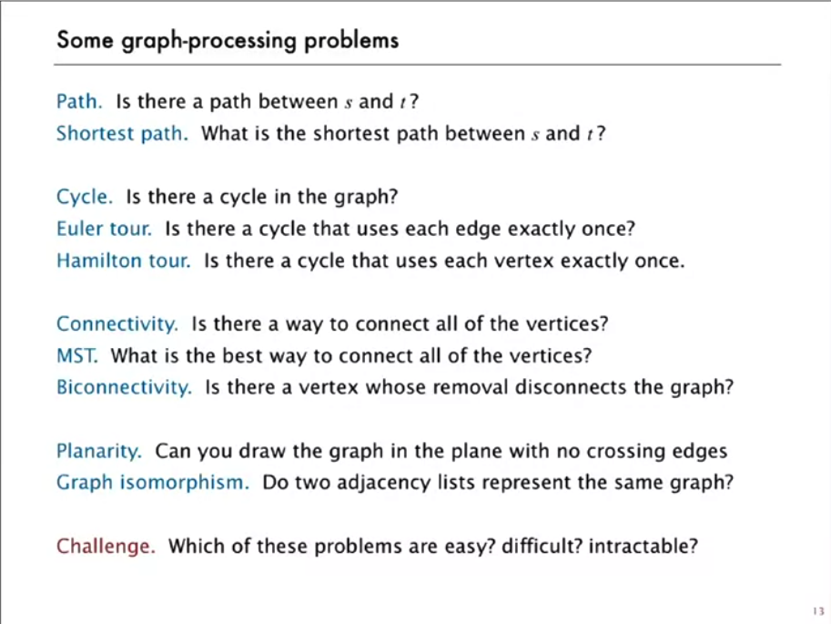
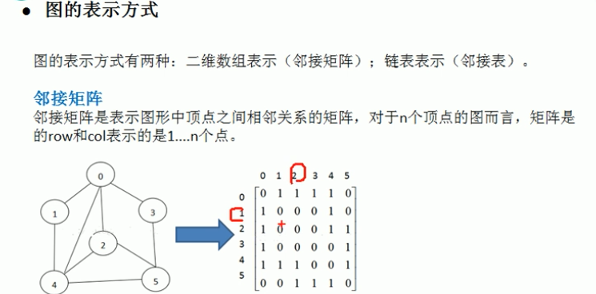
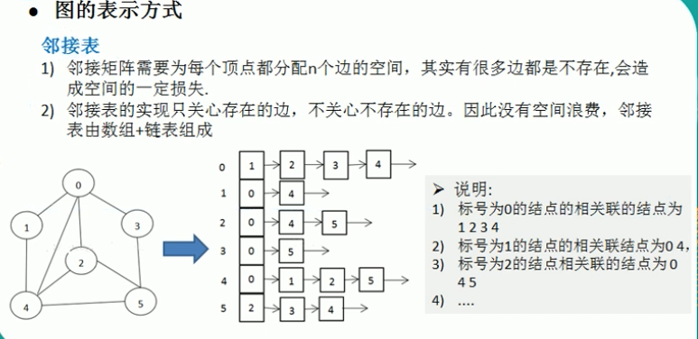

# Graph Algorithms

> **Scope** — Graph representation, traversal, connectivity, cycle detection and the general graph-problem catalogue.
> **See also** — *deep dives split out of this file*: [graph_advanced.md](./graph_advanced.md) — Tarjan (SCC, bridges, articulation points), Euler circuits, max flow / min cut, bipartite matching and k-colouring; [graph_examples.md](./graph_examples.md) — the worked-solution archive (LC 133 / 200 / 207 / 323 / 329 / 399 / 695 / 742 / 802 / 815 / 886 / 947 / 1319).
> *Neighbouring sheets*: [bfs.md](./bfs.md) — breadth-first traversal; [dfs.md](./dfs.md) — depth-first traversal; [topology_sorting.md](./topology_sorting.md) — DAG ordering; [union_find.md](./union_find.md) — undirected connectivity; [shortest_path_comparison.md](./shortest_path_comparison.md) — **choosing** a weighted shortest-path algorithm; [Dijkstra.md](./Dijkstra.md) — non-negative weights; [Bellman-Ford.md](./Bellman-Ford.md) — negative weights / bounded hops; [Floyd-Warshall.md](./Floyd-Warshall.md) — all-pairs.

## LeetCode Problem Lists

- [Graph Theory](https://leetcode.com/problem-list/graph/)

## Overview
**Graph algorithms** are techniques for solving problems on graph data structures consisting of vertices (nodes) and edges (connections between nodes).

### Key Properties
- **Complexity**: see the [Complexity Quick Reference](#complexity-quick-reference) table in the summary
- **Core Idea**: Model relationships and connections between entities
- **When to Use**: Network problems, dependencies, paths, connectivity
- **Key Algorithms**: BFS, DFS, Dijkstra, Union-Find, Topological Sort

### Core Characteristics
- **Directed vs Undirected**: One-way or two-way edges
- **Weighted vs Unweighted**: Edges with or without costs
- **Cyclic vs Acyclic**: Contains cycles or not
- **Connected vs Disconnected**: All nodes reachable or not

<p align="center"></p>

## Problem Categories

### **Category 1: Graph Traversal**
- **Description**: Explore all nodes using BFS or DFS
- **Examples**: LC 200 (Number of Islands), LC 133 (Clone Graph)
- **Pattern**: Visit all connected components

### **Category 2: Shortest Path**
- **Description**: Find minimum distance between nodes
- **Examples**: LC 743 (Network Delay), LC 787 (Cheapest Flights)
- **Pattern**: Dijkstra, Bellman-Ford, Floyd-Warshall

### **Category 3: Union-Find (DSU)**
- **Description**: Detect cycles, find connected components
- **Examples**: LC 684 (Redundant Connection), LC 721 (Accounts Merge)
- **Pattern**: Union by rank, path compression

### **Category 4: Topological Sort**
- **Description**: Order nodes with dependencies
- **Examples**: LC 207 (Course Schedule), LC 210 (Course Schedule II)
- **Pattern**: DFS or Kahn's algorithm (BFS)

### **Category 5: Bipartite Graphs**
- **Description**: Check if graph can be colored with 2 colors
- **Examples**: LC 785 (Is Graph Bipartite), LC 886 (Possible Bipartition)
- **Pattern**: BFS/DFS with coloring

### **Category 6: Minimum Spanning Tree**
- **Description**: Connect all nodes with minimum cost
- **Examples**: LC 1135 (Connecting Cities), LC 1584 (Min Cost Connect Points)
- **Pattern**: Kruskal's or Prim's algorithm

## Templates & Algorithms

### Which Sheet Owns Which Algorithm ⭐⭐⭐⭐⭐

This sheet owns **representation, traversal, connectivity and cycle detection**. Every
weighted or ordering algorithm has a dedicated sheet — go there for the implementation
rather than re-deriving it here.

| Need | Template here | Owning sheet |
|---|---|---|
| Build a graph from an LC input format | Graph Representations, below | this sheet |
| Visit every node, count components | Template 1 / Template 2 | [bfs.md](./bfs.md), [dfs.md](./dfs.md) |
| Shortest path, **unweighted** | Template 1 (BFS) | [bfs.md](./bfs.md) |
| Shortest path, **weighted** | — | see the table below |
| Order nodes with dependencies | Template 4 (Kahn) | [topology_sorting.md](./topology_sorting.md) |
| Dynamic connectivity, merge sets | Template 3 (DSU) | [union_find.md](./union_find.md) |
| Detect a cycle | Template 5 | this sheet |
| Two groups / conflict colouring | Template 6 | this sheet |
| SCC, bridges, articulation points, Euler circuit, max flow, k-colouring | — | [graph_advanced.md](./graph_advanced.md) |
| One worked solution per problem | — | [graph_examples.md](./graph_examples.md) |

#### Weighted shortest path — see the dedicated docs

These have full docs of their own; re-stating their implementations here is what let
`graph.md` drift out of sync with them.

| Need | Doc | Complexity | Anchor LC |
|---|---|---|---|
| Single source, **non-negative** weights | [Dijkstra.md](./Dijkstra.md) | O((V+E) log V) | LC 743 |
| Single source, **negative** weights / bounded hops / negative-cycle detection | [Bellman-Ford.md](./Bellman-Ford.md) | O(V·E) | LC 787 |
| **All pairs**, dense graph | [Floyd-Warshall.md](./Floyd-Warshall.md) | O(V³) | LC 1334 |
| Unweighted, or 0-1 weights | [bfs.md](./bfs.md) — plain BFS / 0-1 BFS with a deque | O(V+E) | LC 1091, LC 1368 |

Not sure which? → [shortest_path_comparison.md](./shortest_path_comparison.md).

### Graph Representations — How to Build Them ⭐⭐⭐⭐⭐

Almost every LC graph problem hands you one of a handful of input shapes. Recognising the
shape and converting it is the first thirty seconds of the solution.

| LC input shape | Build | Typical problems |
|---|---|---|
| `edges = [[u,v], ...]` | adjacency list, **both** directions if undirected | LC 323, 684, 1971 |
| `edges = [[u,v,w], ...]` | adjacency list of `(neighbor, weight)` pairs | LC 743, 787 |
| `isConnected[i][j]` / `graph[i][j]` | already an adjacency **matrix** | LC 547, 1334 |
| `graph[i] = [neighbors]` | already an adjacency **list** | LC 785, 797, 802 |
| a grid `char[][]` / `int[][]` | **implicit** — cell = node, 4 or 8 neighbours = edges | LC 200, 695, 1091 |
| a `Node` object with `neighbors` | pointer graph — traverse with a `{original: copy}` map | LC 133 |
| pairs of strings (`["a","b"]`) | implicit — discover nodes from the input into a `defaultdict` | LC 399, 721 |

**Which representation**

| | Space | `u→v` edge test | Iterate neighbours of `u` | Use when |
|---|---|---|---|---|
| Adjacency list | O(V + E) | O(deg u) | O(deg u) | sparse — the LC default |
| Adjacency matrix | O(V²) | O(1) | O(V) | dense, or `V` small (Floyd-Warshall) |
| Edge list | O(E) | O(E) | O(E) | Kruskal, Bellman-Ford — algorithms that sweep edges |

An **edge list** needs no build step at all: `edges` as handed to you *is* the
representation. Sort it for Kruskal, iterate it `V-1` times for Bellman-Ford.

#### **Adjacency List**
```python
# For edges list
graph = defaultdict(list)
for u, v in edges:
    graph[u].append(v)
    graph[v].append(u)  # Undirected

# For weighted edges
graph = defaultdict(list)
for u, v, w in edges:
    graph[u].append((v, w))
```

#### **Adjacency Matrix**
```python
# For unweighted
graph = [[0] * n for _ in range(n)]
for u, v in edges:
    graph[u][v] = 1
    graph[v][u] = 1  # Undirected

# For weighted
graph = [[float('inf')] * n for _ in range(n)]
for u, v, w in edges:
    graph[u][v] = w
```

#### **Grid as Graph**
```python
# 4-directional movement
directions = [(0, 1), (1, 0), (0, -1), (-1, 0)]

# 8-directional movement
directions = [(0, 1), (1, 0), (0, -1), (-1, 0),
              (1, 1), (1, -1), (-1, 1), (-1, -1)]

# Check bounds
def is_valid(r, c, rows, cols):
    return 0 <= r < rows and 0 <= c < cols
```

#### **Directed vs Undirected, and In/Out-Degree**
```python
# undirected: add BOTH directions -- forgetting this is the most common graph bug
for u, v in edges:
    graph[u].append(v)
    graph[v].append(u)

# directed: one direction only, and degree splits into two counts
out_deg = [0] * n
in_deg = [0] * n
for u, v in edges:
    graph[u].append(v)
    out_deg[u] += 1
    in_deg[v] += 1
```

- **Undirected**: `sum(degrees) == 2 * E`. A tree has exactly `V - 1` edges and no cycle.
- **Directed**: sources have `in_deg == 0` (Kahn's starting set, Template 4); sinks have
  `out_deg == 0` (LC 802 eventual safe states).
- Some problems are answered by the degrees alone, with no traversal — LC 997 Find the
  Town Judge (`in == n-1 and out == 0`), LC 2924 Find Champion II (`in == 0`, and unique),
  LC 1361 Validate Binary Tree Nodes. The pattern and its pitfalls live in
  [topology_sorting.md](./topology_sorting.md#template-10-in-degree-signature-answer-read-straight-off-the-degrees-).

<p align="center"></p>

<p align="center"></p>

### Universal Graph Template

*An outline, not runnable code — `process_component` stands for whatever the problem asks you to do with each component (count it, collect it, aggregate over it):*

```python
def graph_algorithm(n, edges):
    # Build adjacency list
    graph = collections.defaultdict(list)
    for u, v in edges:
        graph[u].append(v)
        graph[v].append(u)  # For undirected
    
    # Track visited nodes
    visited = set()
    
    # Process each component
    result = 0
    for node in range(n):
        if node not in visited:
            # Process component
            process_component(node, graph, visited)
            result += 1
    
    return result
```

### Visited-Set Discipline ⭐⭐⭐⭐

*Where* you mark a node decides whether the traversal terminates and whether it is correct.

- **Mark on enqueue, not on dequeue** (BFS). Marking on dequeue lets the same node enter
  the queue many times — still correct, but quadratic in the worst case.
- **Count or reach a node** → one shared `visited` set; each node is processed once.
- **Enumerate paths** → no shared set; push on the way down and **pop on the way up**
  (Template 2's LC 797 variation).
- **Directed cycle detection** → three states, not a boolean (Template 5).
- On a grid you may mutate the input instead of allocating `visited` (`grid[r][c] = '0'`) —
  O(1) extra space, but it destroys the input; say so out loud in an interview.

#### **Three ways to record it**
```python
# Set for simple visited
visited = set()

# Array for state tracking
# 0: unvisited, 1: visiting, 2: visited
state = [0] * n

# Dictionary for path reconstruction
parent = {}
```

### Template 1: BFS Traversal — LC 102
```python
def bfs_template(graph, start):
    """Breadth-first search template"""
    from collections import deque
    
    visited = set([start])
    queue = deque([start])
    level = 0
    
    while queue:
        # Process level by level
        size = len(queue)
        for _ in range(size):
            node = queue.popleft()
            
            # Process node
            for neighbor in graph[node]:
                if neighbor not in visited:
                    visited.add(neighbor)
                    queue.append(neighbor)
        level += 1
    
    return level
```

### Template 2: DFS Traversal — LC 200 ⭐⭐⭐⭐⭐
```python
def dfs_template(graph, start):
    """Depth-first search template"""
    visited = set()
    path = []
    
    def dfs(node):
        visited.add(node)
        path.append(node)
        
        for neighbor in graph[node]:
            if neighbor not in visited:
                dfs(neighbor)
        
        # Backtrack if needed
        # path.pop()
    
    dfs(start)
    return visited
```

#### Variation: enumerate ALL paths (backtracking, no `visited` set) — LC 797

*Twist*: the graph is a **DAG**, so there is no cycle to guard against — drop the `visited` set entirely and instead push/pop the current path (classic backtracking). A shared `visited` set would be **wrong** here: it would block a node from appearing in more than one path.

```java
// java
// LC 797 - All Paths From Source to Target
// IDEA: DFS + backtracking on a DAG. No visited set (DAG => no cycles),
//       and a node may legitimately appear in many different paths.
// time = O(2^n * n), space = O(n) excluding output
import java.util.*;

public class Solution {
    public List<List<Integer>> allPathsSourceTarget(int[][] graph) {
        List<List<Integer>> res = new ArrayList<>();
        List<Integer> path = new ArrayList<>();
        path.add(0);                       // start node is always in the path
        dfs(graph, 0, path, res);
        return res;
    }

    private void dfs(int[][] graph, int u, List<Integer> path, List<List<Integer>> res) {
        if (u == graph.length - 1) {
            res.add(new ArrayList<>(path));   // NOTE: copy, not the live list
            return;
        }
        for (int v : graph[u]) {
            path.add(v);
            dfs(graph, v, path, res);
            path.remove(path.size() - 1);     // backtrack
        }
    }
}
```

```python
# python
# LC 797 - All Paths From Source to Target
# IDEA: DFS + backtracking on a DAG (no visited set needed)
# time = O(2^n * n), space = O(n) excluding output
class Solution(object):
    def allPathsSourceTarget(self, graph):
        n = len(graph)
        res, path = [], [0]

        def dfs(u):
            if u == n - 1:
                res.append(path[:])    # copy!
                return
            for v in graph[u]:
                path.append(v)
                dfs(v)
                path.pop()             # backtrack

        dfs(0)
        return res

# [[1,2],[3],[3],[]] -> [[0,1,3],[0,2,3]]
```

**Rule of thumb**: *count / reach* a node → `visited` set (each node once). *Enumerate paths* → backtracking, mark on the way down and **unmark on the way up**.

### Template 3: Union-Find (DSU) — LC 684 ⭐⭐⭐⭐
```python
class UnionFind:
    def __init__(self, n):
        self.parent = list(range(n))
        self.rank = [0] * n
        self.count = n
    
    def find(self, x):
        """Find with path compression"""
        if self.parent[x] != x:
            self.parent[x] = self.find(self.parent[x])
        return self.parent[x]
    
    def union(self, x, y):
        """Union by rank"""
        px, py = self.find(x), self.find(y)
        if px == py:
            return False
        
        if self.rank[px] < self.rank[py]:
            px, py = py, px
        self.parent[py] = px
        if self.rank[px] == self.rank[py]:
            self.rank[px] += 1
        
        self.count -= 1
        return True
    
    def connected(self, x, y):
        return self.find(x) == self.find(y)
```

### Template 4: Topological Sort (Kahn's BFS) — LC 207 ⭐⭐⭐⭐⭐

> Ordering variants — lexicographic order, all orders, parallel scheduling, tree centroid, DP on the DAG — live in [topology_sorting.md](./topology_sorting.md).

```python
def topological_sort_bfs(n, edges):
    """Kahn's algorithm for topological sort"""
    from collections import deque
    
    graph = collections.defaultdict(list)
    indegree = [0] * n
    
    for u, v in edges:
        graph[u].append(v)
        indegree[v] += 1
    
    queue = deque([i for i in range(n) if indegree[i] == 0])
    result = []
    
    while queue:
        node = queue.popleft()
        result.append(node)
        
        for neighbor in graph[node]:
            indegree[neighbor] -= 1
            if indegree[neighbor] == 0:
                queue.append(neighbor)
    
    return result if len(result) == n else []
```

### Template 5: Cycle Detection — Directed vs Undirected ⭐⭐⭐⭐

The directed case needs **three** states, because a node that already finished is not a cycle — only a node still on the current DFS path is. The undirected case needs no states at all: an edge joining two nodes already in the same component *is* the cycle.

*Both are outlines — `n` and `graph` come from the enclosing solution, and the directed sketch shows only the recursive core:*

```python
# Directed graph - DFS with states
def has_cycle_directed(graph):
    # 0: unvisited, 1: visiting, 2: visited
    state = [0] * n
    
    def dfs(node):
        if state[node] == 1:  # Back edge
            return True
        if state[node] == 2:
            return False
        
        state[node] = 1
        for neighbor in graph[node]:
            if dfs(neighbor):
                return True
        state[node] = 2
        return False

# Undirected graph - Union-Find
def has_cycle_undirected(edges):
    uf = UnionFind(n)
    for u, v in edges:
        if not uf.union(u, v):
            return True  # Already connected
    return False
```

**Connected components** are the same walk, counted rather than searched — run the traversal from every still-unvisited node and increment a counter (the Universal Graph Template above is exactly this). Worked out for LC 323, LC 547 and LC 1319 in [graph_examples.md](./graph_examples.md).

### Template 6: Bipartite Check (2-Coloring) — LC 785 ⭐⭐⭐⭐

**Definition**: A graph is bipartite if its vertices can be colored using only two colors such that no two adjacent vertices have the same color. Equivalent to checking if the graph has no odd-length cycles.

**Time Complexity**: O(V + E) - visit each vertex and edge once
**Space Complexity**: O(V) - for color array and queue/recursion stack

**Use Cases**:
- Graph coloring problems
- Matching problems (assignment, scheduling)
- Conflict detection
- Resource allocation
- Network flow problems

**Key Properties**:
- All trees are bipartite
- Graphs with odd cycles are NOT bipartite
- Complete bipartite graphs K(m,n) are bipartite
- Can be solved using BFS or DFS with 2-coloring

#### **Approach 1: BFS with Coloring**
```python
def is_bipartite_bfs(graph):
    """Check if graph is bipartite using BFS"""
    from collections import deque

    n = len(graph)
    colors = [-1] * n  # -1: uncolored, 0: color A, 1: color B

    # Handle disconnected components
    for start in range(n):
        if colors[start] != -1:
            continue

        # BFS coloring
        queue = deque([start])
        colors[start] = 0

        while queue:
            node = queue.popleft()

            for neighbor in graph[node]:
                if colors[neighbor] == -1:
                    # Color with opposite color
                    colors[neighbor] = 1 - colors[node]
                    queue.append(neighbor)
                elif colors[neighbor] == colors[node]:
                    # Same color conflict - not bipartite
                    return False

    return True
```

#### **Approach 2: DFS with Coloring**
```python
def is_bipartite_dfs(graph):
    """Check if graph is bipartite using DFS"""
    n = len(graph)
    colors = [-1] * n

    def dfs(node, color):
        colors[node] = color

        for neighbor in graph[node]:
            if colors[neighbor] == -1:
                # Recursively color with opposite color
                if not dfs(neighbor, 1 - color):
                    return False
            elif colors[neighbor] == colors[node]:
                # Same color conflict
                return False

        return True

    # Check each component
    for i in range(n):
        if colors[i] == -1:
            if not dfs(i, 0):
                return False

    return True
```

> Union-Find bipartite detection, maximum bipartite matching and greedy k-colouring are in [graph_advanced.md](./graph_advanced.md); LC 886 Possible Bipartition is worked in [graph_examples.md](./graph_examples.md).

#### **Performance Comparison**

| Approach | Time | Space | Best Use Case |
|----------|------|-------|---------------|
| BFS | O(V+E) | O(V) | Level-by-level processing |
| DFS | O(V+E) | O(V) | Simple recursive solution |
| Union-Find | O(E⋅α(V)) | O(V) | Dynamic conflict detection |
| Grid-specific | O(R⋅C) | O(R⋅C) | 2D grid problems |

#### **Common Patterns & Tips**

**Pattern Recognition:**
- Graph coloring → Bipartite check
- Conflict/compatibility → Build conflict graph
- Two groups assignment → Bipartite partition
- Matching problems → Bipartite matching

**Implementation Tips:**
- Always handle disconnected components
- Use 0/1 or -1/1 for colors consistently
- Check conflicts immediately when coloring
- Consider Union-Find for dynamic scenarios

**Edge Cases:**
- Empty graph (bipartite by definition)
- Single node (bipartite)
- No edges (bipartite)
- Self-loops (not bipartite if exists)
- Disconnected components (check all)

---

## Summary & Quick Reference

### Decision Table — Which Graph Pattern?

```text
Graph Algorithm Selection Flowchart:

1. What is the problem asking for?
   ├── Find shortest path → Continue to 2
   ├── Check connectivity → Use Union-Find or DFS/BFS
   ├── Order with dependencies → Use Topological Sort
   ├── Detect cycles → Use DFS with states or Union-Find
   └── Traverse all nodes → Use BFS or DFS

2. For shortest path problems:
   ├── Unweighted graph → Use BFS
   ├── Non-negative weights → Use Dijkstra
   ├── Negative weights → Use Bellman-Ford
   └── All pairs → Use Floyd-Warshall

3. For connectivity problems:
   ├── Static graph → Use DFS/BFS once
   ├── Dynamic connections → Use Union-Find
   └── Count components → Use either approach

4. For traversal problems:
   ├── Level-by-level → Use BFS
   ├── Path finding → Use DFS with backtracking
   └── State space search → Use BFS for optimal

5. Is the graph special?
   ├── Tree → Simpler DFS/BFS
   ├── DAG → Topological sort possible
   ├── Bipartite → Two-coloring
   └── Grid → Treat as implicit graph
```

### Complexity Quick Reference
| Algorithm | Time Complexity | Space Complexity | Notes |
|-----------|-----------------|------------------|-------|
| BFS/DFS | O(V + E) | O(V) | Standard traversal |
| Dijkstra | O((V+E)logV) | O(V) | With binary heap |
| Bellman-Ford | O(VE) | O(V) | Handles negative weights |
| Floyd-Warshall | O(V³) | O(V²) | All pairs |
| Union-Find | O(α(n)) | O(V) | Near constant |
| Topological Sort | O(V + E) | O(V) | Linear time |

### Interview Signal → Pattern

| Signal | Pattern |
|--------|---------|
| "shortest path, non-negative weights" | Dijkstra |
| "shortest path, negative weights / cycles" | Bellman-Ford |
| "all-pairs shortest path" | Floyd-Warshall |
| "course prerequisites, ordering" | Topological sort (Kahn's BFS) |
| "connected components, union" | Union-Find |
| "remove edge/vertex disconnects graph" | Bridges/Articulation (Tarjan) |
| "max flow, bipartite matching" | Ford-Fulkerson / Edmonds-Karp |
| "island counting, flood fill" | DFS/BFS on grid |
| "use every edge/transition exactly once" | Euler circuit — Hierholzer (LC 753, 332) |
| "ratios / conversions / exchange-rate queries" | Weighted DFS or weighted Union-Find (LC 399) |
| "longest path, but moves are strictly increasing" | Implicit DAG → DFS + memo (LC 329) |
| "connected because they share a row/email/attribute" | Make the attribute a DSU node (LC 947, 721) |
| "enumerate every path, not just reachability" | DFS + backtracking, no shared visited set (LC 797) |

### Problems by Pattern

#### **Graph Traversal Problems**
| Problem | LC # | Key Technique | Difficulty |
|---------|------|---------------|------------|
| Number of Islands | 200 | DFS/BFS on grid | Medium |
| Max Area of Island | 695 | DFS with counting | Medium |
| Clone Graph | 133 | BFS/DFS with map | Medium |
| Pacific Atlantic Water | 417 | Multi-source DFS | Medium |
| Word Ladder | 127 | BFS shortest path | Hard |
| Surrounded Regions | 130 | DFS from boundary | Medium |
| Evaluate Division | 399 | Weighted DFS (ratio graph) — [graph_examples.md](./graph_examples.md#2-9-evaluate-division--lc-399) | Medium |
| Longest Increasing Path in Matrix | 329 | DFS + memo on implicit DAG — [graph_examples.md](./graph_examples.md#2-10-longest-increasing-path-in-a-matrix--lc-329) | Hard |
| All Paths From Source to Target | 797 | DFS backtracking on a DAG | Medium |
| Keys and Rooms | 841 | Plain DFS/BFS reachability from node 0 | Medium |
| Find if Path Exists in Graph | 1971 | BFS/DFS or Union-Find connectivity | Easy |
| Find the Town Judge | 997 | In-degree/out-degree counting, no adjacency list needed — [topology_sorting.md](./topology_sorting.md#variation-a--degree-signature-lookup-lc-997-find-the-town-judge) | Easy |

#### **Shortest Path Problems**
| Problem | LC # | Key Technique | Difficulty |
|---------|------|---------------|------------|
| Network Delay Time | 743 | Dijkstra | Medium |
| Cheapest Flights K Stops | 787 | Modified Dijkstra | Medium |
| Path with Min Effort | 1631 | Dijkstra on grid | Medium |
| Bus Routes | 815 | BFS on routes | Hard |
| Shortest Path Binary Matrix | 1091 | BFS | Medium |

#### **Union-Find Problems**
| Problem | LC # | Key Technique | Difficulty |
|---------|------|---------------|------------|
| Number of Connected Components | 323 | Basic Union-Find | Medium |
| Redundant Connection | 684 | Detect cycle | Medium |
| Accounts Merge | 721 | Union-Find with map | Medium |
| Number of Provinces | 547 | Union-Find or DFS | Medium |
| Satisfiability of Equality | 990 | Union-Find | Medium |
| Most Stones Removed | 947 | DSU on shared row/col attribute — [graph_examples.md](./graph_examples.md#2-11-most-stones-removed-with-same-row-or-column--lc-947) | Medium |
| Make Network Connected | 1319 | DSU: components + spare edges | Medium |

#### **Topological Sort Problems**
| Problem | LC # | Key Technique | Difficulty |
|---------|------|---------------|------------|
| Course Schedule | 207 | Cycle detection | Medium |
| Course Schedule II | 210 | Topological order | Medium |
| Alien Dictionary | 269 | Build graph + sort | Hard |
| Minimum Height Trees | 310 | Leaf removal | Medium |
| Parallel Courses | 1136 | Level-wise BFS | Medium |

#### **Bipartite Problems**
| Problem | LC # | Key Technique | Difficulty |
|---------|------|---------------|------------|
| Is Graph Bipartite | 785 | BFS coloring | Medium |
| Possible Bipartition | 886 | DFS coloring | Medium |
| Flower Planting With No Adjacent | 1042 | Greedy k-coloring (degree < k) | Medium |

#### **Advanced Graph Problems**
| Problem | LC # | Key Technique | Difficulty |
|---------|------|---------------|------------|
| Critical Connections | 1192 | Tarjan bridges — [graph_advanced.md](./graph_advanced.md#template-1-tarjans-low-link-dfs--scc-bridges-articulation-points--lc-1192-) | Hard |
| Find Eventual Safe States | 802 | Cycle detection | Medium |
| Reconstruct Itinerary | 332 | Hierholzer's algorithm | Hard |
| Cracking the Safe | 753 | de Bruijn graph + Euler circuit — [graph_advanced.md](./graph_advanced.md#template-2-euler-path--circuit-hierholzer--lc-753-) | Hard |
| Minimum Spanning Tree | 1135 | Kruskal ([union_find.md](./union_find.md)) / Prim ([heap.md](./heap.md)) | Medium |

### Problem-Solving Steps
1. **Identify graph type**: Directed/undirected, weighted/unweighted
2. **Choose representation**: Adjacency list vs matrix
3. **Select algorithm**: Based on problem requirements
4. **Handle edge cases**: Empty graph, disconnected components
5. **Track state properly**: Visited nodes, paths, distances
6. **Optimize if needed**: Space or time improvements

### Common Mistakes & Tips

**🚫 Common Mistakes:**
- Not handling disconnected components
- Incorrect visited state management
- Missing cycle detection in recursive DFS
- Wrong graph representation choice
- Not considering edge cases (self-loops, multiple edges)

**✅ Best Practices:**
- Use adjacency list for sparse graphs
- Clear visited tracking strategy
- Handle both directed and undirected cases
- Consider using Union-Find for dynamic connectivity
- Test with disconnected components

### Interview Tips
1. **Clarify graph properties**: Directed? Weighted? Connected?
2. **Draw small examples**: Visualize the problem
3. **Choose right representation**: List vs matrix
4. **State complexities**: Time and space upfront
5. **Handle edge cases**: Empty, single node, cycles
6. **Optimize incrementally**: Start simple, then improve

### Related Topics
- **Trees**: Special case of graphs (connected, acyclic)
- **Dynamic Programming**: DP on graphs (paths, trees)
- **Greedy Algorithms**: MST algorithms
- **Heap/Priority Queue**: Used in Dijkstra, Prim's
- **Recursion/Backtracking**: DFS implementation
