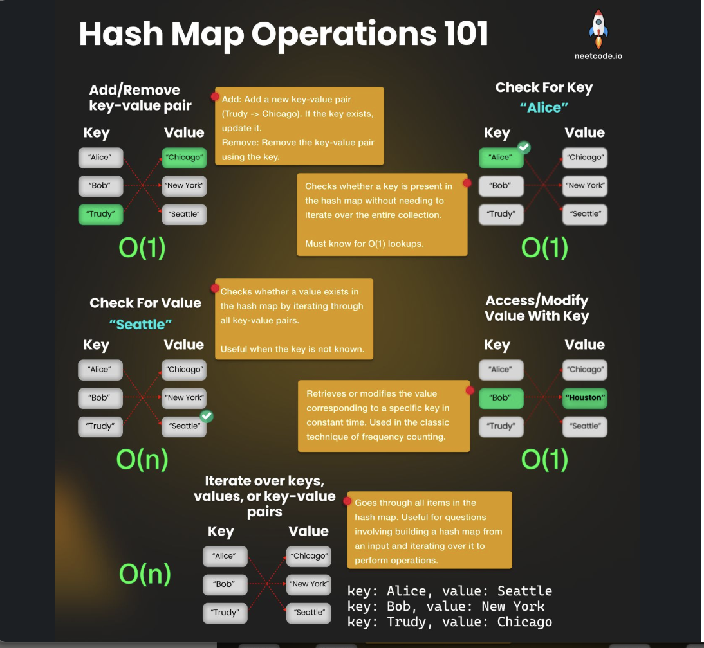
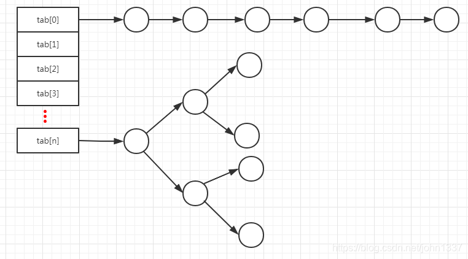
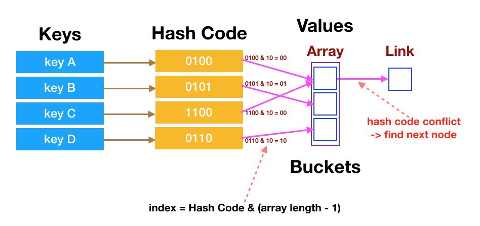

# Hash Map Cheatsheet

> **Scope** — Key→value problem patterns — lookup, grouping, index maps, prefix-sum maps, remapping.
> **See also** — *deep dives split out of this file*: [hash_map_examples.md](./hash_map_examples.md) — the worked-solution archive, the single-problem deep dives (bucket sort, rolling hash, split-and-probe, max-frequency arithmetic) and the ordered-map (Java `TreeMap` / Python `SortedDict`) reference.
> *Neighbouring sheets*: [hashing.md](./hashing.md) — how hashing works, plus counting and rolling-hash idioms; [set.md](./set.md) — membership only, no values; [Collection.md](./Collection.md) — picking a container in the first place.

## LeetCode Problem Lists

- [Hash Table](https://leetcode.com/problem-list/hash-table/)

## Time Complexity

| Data structure | Search   | Insert   | Delete   | Min/Max  |
| -------------- | -------- | -------- | -------- | -------- |
| Hash Map (avg) | O(1)     | O(1)     | O(1)     | O(n)     |

> Average case shown. **Worst case (all keys collide): O(n).** Min/Max requires a full scan since hashing imposes no ordering.

## Overview
Hash Map (Hash Table/Dictionary) is a fundamental data structure that provides efficient key-value storage and retrieval operations.

### Key Properties
- **Complexity**: see the [Time Complexity](#time-complexity) table above; space is **O(n)**
- **Implementation**: Array + Linked List/Red-Black Tree (Java HashMap)
- **Hash Collisions**: Handled via chaining or open addressing

### When Hash Collisions Occur
- **Load Factor > 0.75**: Performance degrades
- **Poor Hash Function**: Many keys map to same bucket
- **Java HashMap**: Converts linked list to red-black tree when length > 8
- **Resolution**: chaining (a list or tree per bucket) or open addressing — see [hash_map_collision.md](https://github.com/yennanliu/CS_basics/blob/master/doc/hash_map_collision.md)

<p align="center"></p>

- [NC - HashMap under the hood](https://www.linkedin.com/posts/neetcodeio_how-do-hashmaps-work-under-the-hood-activity-7298370869301526530-DsIi?utm_source=social_share_send&utm_medium=member_desktop_web&rcm=ACoAAA6fzw4BpOSBO1YeSrJwPZ-dNBhjC3jXTDE)

### Why Lookup Is O(1)

- FAQ
    - why hashmap search time complexity ~= O(1) ? explain ?
        - TL;DR : O(1) is avg and best case. worst case could be O(N) (hash collision)
        - hash func matters -> how to storage data & possible hash collision happens
        - OP
            - insert
                - get key, get hash val via hash func
                - find bucket in memory based on hash val
                - save key and value in the bucket
            - query
                - get index based on key
                - find bucket location based on index
                    - NOTE !!! use bit op (`int pos = (n - 1) & hash`), so this op can be O(1) time complexity. (find bucket address directly, NO need to loop over all items)
                - loop over all elements under that key (if there is one element, then do once)
                - return value
        <p align="center"></p>
        <p align="center"></p>
        - [ref 1](https://blog.csdn.net/junqing_wu/article/details/104606619)
        - [ref 2](https://blog.csdn.net/john1337/article/details/104727895)

### When to Use / When Not to Use

- When to use 
	- Use case that need data IO with ~ O(1) time complexity
    - optimization via cache (space - time tradeoff)
    - `sum, pair, continuous`
    - avoid double loop (O(N^2))

- When Not to use
	- When data is time sequence 
	- When data is in ordering 
	- https://www.reddit.com/r/learnprogramming/comments/29t4s4/when_is_it_bad_to_use_a_hash_table/

### Basic Operations

- `get` : get value from dict with default value if key not existed
```text
In [10]: d = {'a': 1, 'b': 2}
    ...: d['a']
Out[10]: 1

In [11]: d.get('a')
Out[11]: 1

In [12]: d.get('c', 0)
Out[12]: 0

In [13]: d.get('z')

In [14]:
```

- `setdefault()`
	- https://www.w3schools.com/python/ref_dictionary_setdefault.asp
```python
#-------------------------------------------------------------------------------
# setdefault : will creatte key if key NOT existed (with value as well if defined)
#-------------------------------------------------------------------------------

# syntax
d.setdefault(new_key)
d.setdefault(new_key, new_value)

# 662 Maximum Width of Binary Tree
car = {
  "brand": "Ford",
  "model": "Mustang",
  "year": 1964
}

# example 1) insert key "my_key", since my_key not existed, -> make it as new key and value as None (since not defined)
car.setdefault("my_key")
print (car)
# In [18]: car
# Out[18]: {'brand': 'Ford', 'model': 'Mustang', 'year': 1964, 'my_key': None}

# example 2) insert key "color", since my_key not existed, -> make it as new key and value as white
car.setdefault("color", "white")
print (car)
# Out[22]:
# {'brand': 'Ford',
#  'model': 'Mustang',
#  'year': 1964,
#  'my_key': None,
#  'color': 'white'}
```

- `Sort` on ***hashmap (dict)***
```python
# https://stackoverflow.com/questions/613183/how-do-i-sort-a-dictionary-by-value

x = {1: 2, 3: 4, 4: 3, 2: 1, 0: 0}
In [11]: x.items()
Out[11]: dict_items([(1, 2), (3, 4), (4, 3), (2, 1), (0, 0)])

#----------------------------------
# Sort hashMap by key/value !!!
#----------------------------------
x = {1: 2, 3: 4, 4: 3, 2: 1, 0: 0}
# note : have to use sorted(xxx, key=yyy), instead of xxx.sorted(....)
### NOTE this !!! : x.items()
sorted_x = sorted(x.items(), key=lambda kv: kv[1])
print (sorted_x)
# [(0, 0), (2, 1), (1, 2), (4, 3), (3, 4)]

x = {1: 2, 3: 4, 4: 3, 2: 1, 0: 0}
sorted_x = sorted(x.items(), key=lambda kv: kv[0])
print (sorted_x)
# [(0, 0), (1, 2), (2, 1), (3, 4), (4, 3)]

# 451  Sort Characters By Frequency
import collections
class Solution(object):
    def frequencySort(self, s):
        count = collections.Counter(s)
        count_dict = dict(count)
        """
        NOTE this !!!
            1. use sorted()
            2. count_dict.items()
        """
        count_tuple_sorted = sorted(count_dict.items(), key=lambda kv : -kv[1])
        res = ''
        for item in count_tuple_sorted:
            res += item[0] * item[1]
        return res
```

```text
# dict values -> array
In [6]:
   ...: mydict = {'a':['a1','a2','a3'], 'b':['b1','b2','b3']}
   ...:
   ...: res = [mydict[x] for x in mydict]
   ...:
   ...: print (res)
[['a1', 'a2', 'a3'], ['b1', 'b2', 'b3']]
```

### References

- [Java HashMap](https://bbs.huaweicloud.com/blogs/276884?utm_source=juejin&utm_medium=bbs-ex&utm_campaign=other&utm_content=content)
    - Low level : Array + Linked list / red-black tree
        - if Linked list length > 8 -> transform Linked list to red-black tree
        - if Linked list length < 6 -> transform red-black tree back to Linked list
- N sum:
    - [n_sum.md](https://github.com/yennanliu/CS_basics/blob/master/doc/cheatsheet/n_sum.md)
- LC Ref
    - [prefix_sum.md](https://github.com/yennanliu/CS_basics/blob/master/doc/cheatsheet/prefix_sum.md)
- Ref 
	- https://blog.techbridge.cc/2017/01/21/simple-hash-table-intro/
	- https://www.freecodecamp.org/news/hash-tables/

## Templates & Algorithms

### Template Comparison Table

| # | Template | Map shape | Recognise it by | Typical LC |
|---|----------|-----------|-----------------|------------|
| 1 | Frequency counter | `{item: count}` | "count", "frequency", "anagram", "top-K" | 242, 49, 347, 451 |
| 2 | Seen-before index map | `{value: index}` | "find a pair", "target sum", complement | 1, 15, 532, 1010 |
| 3 | Grouping by a computed key | `{canonical_key: [items]}` | "group", "same line", "same signature" | 49, 149, 609, 987 |
| 4 | Prefix sum → count map | `{prefixSum: count}` / `{prefixSum: firstIndex}` | "subarray sum equals / divisible by K" | 560, 974, 525, 325 |
| 5 | Sliding window + char counts | `{char: count in window}` | "longest / shortest substring such that ..." | 3, 76, 424, 438, 567 |
| 6 | Rank map | `{value: rank}` | "according to the order given in ..." | 953, 791, 105 |
| 7 | Bijection (two maps) | `{x: y}` **and** `{y: x}` | "one-to-one", "isomorphic", "follows the pattern" | 205, 290 |
| 8 | Caching / memoization | `{state: result}` | "O(1) get and put", "memoize the recursion" | 146, 460, 139, 322 |
| 9 | Graph / tree node map | `{node: neighbours}`, `{child: parent}` | "clone", "parent pointer", "serialize a subtree" | 133, 138, 652, 1257 |
| 10 | Virtual map (remapping) | `{badIndex: goodIndex}` | "pick at random, excluding ..." | 710 |
| 11 | Map + another structure | map + heap / stack / second map | "top-K with a heap", "next greater" | 347, 496, 739 |

> Patterns that are really a deep dive on one or two problems — bucket sort for O(n) top-K, rolling hash, split-and-probe pair lookup, max-frequency arithmetic, and the ordered map (`TreeMap` / `SortedDict`) — live in [hash_map_examples.md](./hash_map_examples.md#templates--algorithms).

### Template 1: Frequency Counter
```python
# Universal Counting Template
def counting_pattern(arr):
    count = {}  # or collections.defaultdict(int)
    result = []
    
    # Count frequency
    for item in arr:
        count[item] = count.get(item, 0) + 1
        # or count[item] += 1 with defaultdict
    
    # Process based on frequency
    for key, freq in count.items():
        if meets_condition(freq):
            result.append(key)
    
    return result

# Examples: LC 49, LC 242, LC 451, LC 347, LC 692
```

### Template 2: Seen-Before Index Map (Two-Sum Shape)
```python
# Two Sum Pattern Template
def two_sum_pattern(nums, target):
    seen = {}  # {value: index}
    
    for i, num in enumerate(nums):
        complement = target - num
        
        if complement in seen:
            return [seen[complement], i]
        
        seen[num] = i
    
    return []

# Variations:
# - Multiple pairs: collect all instead of returning first
# - K-diff pairs: check for num+k and num-k
# - Examples: LC 1, LC 167, LC 15, LC 532, LC 1010
```

### Template 3: Grouping by a Computed Key

**Pattern**: hash the *canonical form* of an item, not the item itself — everything that shares that form lands in the same bucket. The simplest canonical form is a sorted string (LC 49); the general case is any normalized invariant of a relationship (LC 149).

```python
# LC 049 Group Anagrams
# IDEA : HASH TABLE
class Solution:
    def groupAnagrams(self, strs):
        res = {}
        for item in strs:
            k = ''.join(sorted(item))  # sort the string 
            if k not in res:  #  check if exists in res 
                res[k] = []
            res[k].append(item)  # if same, put all the same string into dict k 
        return [res[x] for x in res]  # output the result 
```

#### Generalized: the key is a normalized invariant ⭐⭐⭐⭐

**Pattern**: The map key is not a raw value — it is a **canonical form of a relationship** between values. Two items collide in the map exactly when they share the property you care about.

**Key Idea (geometry)**: "Same line through anchor P" ⇔ "same direction vector `(dx, dy)`". Raw `(dx, dy)` is not a valid key (`(1,2)` and `(2,4)` are the same line), and `dy/dx` as a float loses precision / divides by zero. **Normalize**: divide by `gcd`, then force a canonical sign.

```java
// java
// LC 149 - Max Points on a Line
// IDEA: anchor at each point, group the others by a gcd-normalized slope key
// time = O(n^2), space = O(n)
public int maxPoints(int[][] points) {
    int n = points.length;
    if (n <= 2) return n;
    int best = 1;
    for (int i = 0; i < n; i++) {
        Map<String, Integer> slopeCount = new HashMap<>();
        for (int j = i + 1; j < n; j++) {
            int dx = points[j][0] - points[i][0];
            int dy = points[j][1] - points[i][1];
            int g = gcd(Math.abs(dx), Math.abs(dy));
            if (g != 0) { dx /= g; dy /= g; }
            // canonical direction: force dx > 0, or dx == 0 && dy > 0
            if (dx < 0 || (dx == 0 && dy < 0)) { dx = -dx; dy = -dy; }
            String key = dx + "/" + dy;
            int cnt = slopeCount.merge(key, 1, Integer::sum);
            best = Math.max(best, cnt + 1);   // +1 for the anchor point itself
        }
    }
    return best;
}

private int gcd(int a, int b) { return b == 0 ? a : gcd(b, a % b); }
```

```python
# python
# LC 149 - Max Points on a Line
# IDEA: anchor at each point, group the others by a gcd-normalized slope key
# time = O(n^2), space = O(n)
from collections import defaultdict
from math import gcd

def maxPoints(points: list) -> int:
    n = len(points)
    if n <= 2:
        return n
    best = 1
    for i in range(n):
        slope_count = defaultdict(int)
        x1, y1 = points[i]
        for j in range(i + 1, n):
            dx, dy = points[j][0] - x1, points[j][1] - y1
            g = gcd(abs(dx), abs(dy))
            if g:
                dx, dy = dx // g, dy // g
            if dx < 0 or (dx == 0 and dy < 0):     # canonical sign
                dx, dy = -dx, -dy
            slope_count[(dx, dy)] += 1
            best = max(best, slope_count[(dx, dy)] + 1)   # +1 = anchor point
    return best
```

**Three traps** (all are the usual interview follow-ups):
1. **Float slope** `dy/dx` — precision loss + `ZeroDivisionError` on vertical lines. Use the reduced pair instead.
2. **Missing sign normalization** — `(1,2)` and `(-1,-2)` are the same line but two different keys. Force one canonical direction.
3. **Forgetting `+1`** — the map counts *partners* of the anchor; the anchor itself is not in the map.

**Variations** (same "invent a canonical key" move):

| Problem | LC# | The twist — what the key encodes |
|---------|-----|----------------------------------|
| Minimum Area Rectangle | 939 | Key = the point itself in a set; iterate **diagonal pairs** `(x1,y1),(x2,y2)` with `x1!=x2 && y1!=y2` and test whether the other two corners exist |
| Most Stones Removed with Same Row or Column | 947 | Key = `row` and `~col` (bitwise-not keeps rows and cols in disjoint id spaces) → union-find over a map |
| Vertical Order Traversal of a Binary Tree | 987 | Key = **column offset** `col` (root = 0, left = `col-1`, right = `col+1`); value = list of `(row, val)` to sort |
---

### Template 4: Prefix Sum → Count Map ⭐⭐⭐⭐⭐

**The prefix-sum array first** — `nums[i..j] sum = preSum[j+1] - preSum[i]`:

```python
# (algorithm book (labu) p.350)
my_array = [1,2,3,4,5]
my_array_pre = [0] * (len(my_array)+1)
cur = 0
for i in range(len(my_array)):
    cur += my_array[i]
    my_array_pre[i+1] += cur

# In [17]: print ("my_array = " + str(my_array))
#     ...: print ("my_array_pre = " + str(my_array_pre))
# my_array = [1, 2, 3, 4, 5]
# my_array_pre = [0, 1, 3, 6, 10, 15]

#-----------------------------------------------
# Get sub array sum !!!!!!!
#    -> nums[i..j] sum = preSum[j+1] - preSum[i]
#-----------------------------------------------

# example 1 : sum of [1,2]
my_array_pre[1+1] - my_array_pre[0]  # 1's index is 0, and 2's index is 1. (my_array = [1, 2, 3, 4, 5])

# example 2 : sum of [2,3,4]
my_array_pre[3+1] - my_array_pre[1] # 2's index is 1, and 4's index is 3. (my_array = [1, 2, 3, 4, 5])
```

```python
# Prefix Sum Pattern Template
def prefix_sum_pattern(nums, target):
    prefix_sum = 0
    sum_count = {0: 1}  # {sum: count/index}
    result = 0

    for num in nums:
        prefix_sum += num

        # Check if (prefix_sum - target) exists
        if prefix_sum - target in sum_count:
            result += sum_count[prefix_sum - target]

        # Update current prefix sum count
        sum_count[prefix_sum] = sum_count.get(prefix_sum, 0) + 1

    return result

# For max length problems, store index instead of count:
# sum_index = {0: -1}, then calculate i - sum_index[prefix_sum - target]
# Examples: LC 560, LC 325, LC 525, LC 523
```

**Key Differences by Problem Type**:
- **Count problems** (LC 560, 930, 974): Store `{sum: count}`, check then update
  - **LC 974 variant**: Use modulo `{remainder: count}`, **MUST handle negative remainders!**
- **Max length problems** (LC 325, 525): Store `{sum: first_index}`, only update if new
  - **LC 525 variant**: Transform problem (0→-1, 1→+1), initialize with `{0: -1}`, store first occurrence only
- **Existence problems** (LC 523): Store `{sum: any_index}`, just need to find one

#### Core Pattern: Count ALL Subarrays Summing to k — LC 560

**Core Concept**: Use hashmap to count ALL subarray combinations that sum to target in O(N) time with single loop.

**Key Insight**:
```text
If we want subarray[i,j] to sum to k:
  presum[j] - presum[i-1] = k
  → presum[i-1] = presum[j] - k

So at index j, check if (presum[j] - k) exists in map!
```

**Critical Implementation Details**:

1. **Use Count, NOT Index**:
   ```java
   Map<Integer, Integer> map = new HashMap<>();  // {prefixSum: count}
   ```
   - Same prefix sum can occur MULTIPLE times
   - We need to count ALL valid subarrays, not just find one
   - Example: `[1, -1, 1, -1]` with k=0 has multiple solutions

2. **Initialize with `map.put(0, 1)`**:
   ```java
   map.put(0, 1);  // Handle subarrays starting from index 0
   ```
   - When `presum[j] == k`, then `presum[j] - k = 0`
   - Need to count these subarrays starting from beginning

3. **Check BEFORE Update** (Critical Order):
   ```java
   for (int num : nums) {
       presum += num;

       // 1. CHECK first: count how many previous prefix sums = (presum - k)
       if (map.containsKey(presum - k)) {
           count += map.get(presum - k);  // Add ALL occurrences
       }

       // 2. UPDATE after: add current prefix sum for future iterations
       map.put(presum, map.getOrDefault(presum, 0) + 1);
   }
   ```
   - **Why this order?** Prevents counting current subarray with itself
   - Current prefix sum should only be available for FUTURE iterations

**Why This Pattern Gets ALL Combinations**:
- Map stores ALL previously seen prefix sums with their counts
- When we check `presum - k`, we get count of ALL previous occurrences
- Each previous occurrence represents a valid starting point
- `count += map.get(presum - k)` adds ALL valid subarrays ending at current index

**Example Walkthrough** (`nums = [1,1,1], k = 2`):
```text
i=0: num=1, presum=1
  - Check: (1-2)=-1 not in map → count=0
  - Update: map={0:1, 1:1}

i=1: num=1, presum=2
  - Check: (2-2)=0 in map, count += map[0] = 1 → count=1
  - Update: map={0:1, 1:1, 2:1}

i=2: num=1, presum=3
  - Check: (3-2)=1 in map, count += map[1] = 1 → count=2
  - Update: map={0:1, 1:1, 2:1, 3:1}

Result: count=2 (subarrays [1,1] and [1,1])
```

**Related LC Problems (Same Pattern)**:
- LC 560: Subarray Sum Equals K (exact pattern)
- LC 325: Maximum Size Subarray Sum Equals k (store index instead of count)
- LC 930: Binary Subarrays with Sum
- **LC 974: Subarray Sums Divisible by K** (use modulo `{remainder: count}`, **handle negatives!**)

**When to Use Count vs Index**:
| Problem Type | Map Value | Example | Special Notes |
|-------------|-----------|---------|---------------|
| Count ALL subarrays | `count` | LC 560, 930, 974 | Check before update |
| Count (with modulo) | `count` | **LC 974** | **Use remainder as key; handle negatives!** |
| Find LONGEST subarray | `index` (first occurrence) | LC 325, 525 | Store only first occurrence |
| Find LONGEST (with transformation) | `index` (first occurrence) | **LC 525** | **Transform 0→-1, 1→+1; init {0:-1}** |
| Find if EXISTS | `boolean/index` | LC 523 | Any occurrence works |

**Common Mistakes**:
1. ❌ Using `{prefixSum: index}` for counting problems
2. ❌ Updating map before checking (causes self-counting)
3. ❌ Forgetting `map.put(0, 1)` initialization
4. ❌ Not handling the case where prefix sum itself equals k
5. ❌ **[LC 974] Forgetting to handle negative remainders** (Java/Python `-7 % 5 = -2`, need to add k to get 3)

---

### Template 5: Sliding Window with Hash Map
```python
# Sliding Window with HashMap Template
def sliding_window_hashmap(s, pattern):
    if len(pattern) > len(s):
        return []
    
    pattern_count = {}
    window_count = {}
    
    # Count pattern frequency
    for char in pattern:
        pattern_count[char] = pattern_count.get(char, 0) + 1
    
    left = 0
    result = []
    
    for right in range(len(s)):
        # Expand window
        char = s[right]
        window_count[char] = window_count.get(char, 0) + 1
        
        # Contract window if needed
        while window_size_condition_met():
            # Check if current window is valid
            if window_count == pattern_count:
                result.append(left)
            
            # Remove leftmost character
            left_char = s[left]
            window_count[left_char] -= 1
            if window_count[left_char] == 0:
                del window_count[left_char]
            left += 1
    
    return result

# Examples: LC 3, LC 76, LC 438, LC 567
```

**The map-equality shortcut** (LC 567 Permutation in String): for a *fixed-size* window you do not need a "matched" counter — compare the two frequency maps directly.

```java
// LC 567
// ...
     /** NOTE !!!
     *
     *  we use below trick to
     *
     *  -> 1) check if `new reached s2 val` is in s1 map
     *  -> 2) check if 2 map are equal
     *
     *  -> so we have more simple code, and clean logic
     */
    if (map2.equals(map1)) {
        return true;
    }
// ...
```

---

### Template 6: Rank Map — Value to Position ⭐⭐⭐⭐⭐

**Pattern**: When the problem defines its **own ordering** ("this alien alphabet", "this permutation"), precompute `value -> rank` once, then every comparison becomes an O(1) integer compare instead of an O(m) scan.

**Recognize it**: the phrase "according to the order given in ..." — that's a rank map.

```java
// java
// LC 953 - Verifying an Alien Dictionary
// IDEA: char -> rank map turns an arbitrary alphabet into comparable ints
// time = O(total chars), space = O(1)  (26 keys)
public boolean isAlienSorted(String[] words, String order) {
    int[] rank = new int[26];                       // char -> position in `order`
    for (int i = 0; i < order.length(); i++) rank[order.charAt(i) - 'a'] = i;
    for (int i = 0; i + 1 < words.length; i++) {
        if (!inOrder(words[i], words[i + 1], rank)) return false;
    }
    return true;
}

private boolean inOrder(String a, String b, int[] rank) {
    int n = Math.min(a.length(), b.length());
    for (int i = 0; i < n; i++) {
        int ra = rank[a.charAt(i) - 'a'], rb = rank[b.charAt(i) - 'a'];
        if (ra != rb) return ra < rb;
    }
    return a.length() <= b.length();                // prefix must come first: "app" < "apple"
}

// LC 791 - Custom Sort String  (counting sort, no comparator needed)
// time = O(n + m), space = O(1)
public String customSortString(String order, String s) {
    int[] cnt = new int[26];
    for (char c : s.toCharArray()) cnt[c - 'a']++;
    StringBuilder sb = new StringBuilder();
    for (char c : order.toCharArray()) {            // ranked chars first, in rank order
        while (cnt[c - 'a'] > 0) { sb.append(c); cnt[c - 'a']--; }
    }
    for (char c = 'a'; c <= 'z'; c++) {             // unranked chars: any order
        while (cnt[c - 'a'] > 0) { sb.append(c); cnt[c - 'a']--; }
    }
    return sb.toString();
}
```

```python
# python
# LC 953 - Verifying an Alien Dictionary
# IDEA: map every word to a list of ranks, then plain list comparison does the lexicographic work
# time = O(total chars), space = O(total chars)
def isAlienSorted(words: list, order: str) -> bool:
    rank = {c: i for i, c in enumerate(order)}
    keys = [[rank[c] for c in w] for w in words]
    # python list compare == lexicographic compare, and [1,2] < [1,2,3] handles the prefix rule
    return all(keys[i] <= keys[i + 1] for i in range(len(keys) - 1))

# python
# LC 791 - Custom Sort String
# IDEA: rank map as a sort key; unranked chars get rank len(order) (stable sort keeps them last)
# time = O(n log n + m), space = O(n)
def customSortString(order: str, s: str) -> str:
    rank = {c: i for i, c in enumerate(order)}
    return "".join(sorted(s, key=lambda c: rank.get(c, len(order))))
```

**The prefix rule is the bug everyone hits**: after the common prefix matches, the *shorter* word must come first. `["apple", "app"]` is **not** sorted.

**Variation — value → index map to split an array (LC 105 / LC 106)**: same map, but the "rank" is *position in inorder*, which turns the O(n²) "scan inorder for the root" into O(1) and the whole build into O(n).

```python
# python
# LC 105 - Construct Binary Tree from Preorder and Inorder Traversal
# IDEA: {value: index in inorder} → O(1) root split
# time = O(n), space = O(n)
def buildTree(preorder: list, inorder: list):
    idx = {v: i for i, v in enumerate(inorder)}   # values are unique (given)
    pre = [0]                                     # pointer into preorder

    def build(lo, hi):
        if lo > hi:
            return None
        node = TreeNode(preorder[pre[0]])
        pre[0] += 1
        mid = idx[node.val]                       # O(1) instead of inorder.index(...)
        node.left = build(lo, mid - 1)
        node.right = build(mid + 1, hi)
        return node

    return build(0, len(inorder) - 1)
```

---

### Template 7: Bijection (Two-Way Mapping)

**Pattern**: Maintain two maps (`x→y` and `y→x`) and check consistency in **both directions**. Required any time the mapping must be one-to-one (LC 205 Isomorphic Strings, LC 290 Word Pattern).

**Why two maps?** One map catches `a→b` conflicts; the second catches `b→a` conflicts (two different `x` values mapping to the same `y`).

```python
# LC 205 Isomorphic Strings
def isIsomorphic(s: str, t: str) -> bool:
    s2t, t2s = {}, {}
    for a, b in zip(s, t):
        if s2t.get(a, b) != b or t2s.get(b, a) != a:
            return False
        s2t[a] = b
        t2s[b] = a
    return True

# LC 290 Word Pattern
def wordPattern(pattern: str, s: str) -> bool:
    words = s.split()
    if len(pattern) != len(words):
        return False
    p2w, w2p = {}, {}
    for p, w in zip(pattern, words):
        if p2w.get(p, w) != w or w2p.get(w, p) != p:
            return False
        p2w[p] = w
        w2p[w] = p
    return True
```

**Common mistake**: Using only one map — fails when two keys map to the same value (`"aa"` vs `"ab"`).

---

### Template 8: Hash Map for Caching / Memoization
```python
# Caching/Memoization Template
class CacheTemplate:
    def __init__(self, capacity):
        self.capacity = capacity
        self.cache = {}  # key -> value
        self.usage = {}  # key -> usage_info
    
    def get(self, key):
        if key in self.cache:
            self.update_usage(key)
            return self.cache[key]
        return -1
    
    def put(self, key, value):
        if len(self.cache) >= self.capacity:
            self.evict()
        
        self.cache[key] = value
        self.update_usage(key)
    
    def update_usage(self, key):
        # Update usage tracking
        pass
    
    def evict(self):
        # Remove least recently/frequently used
        pass

# Examples: LC 146 (LRU), LC 460 (LFU)
```

> Top-down DP with a dict keyed on the subproblem state (LC 139, 1048, 322) is the same template — worked out in [hash_map_examples.md → Hash Map + Memoization / DP](./hash_map_examples.md#hash-map--memoization--dp).

---

### Template 9: Graph Problems with Hash Map
```python
# Graph with HashMap Template
def graph_hashmap_pattern(graph_input):
    # Build adjacency list/map
    graph = {}  # node -> [neighbors] or node -> {neighbor: weight}
    
    for edge in graph_input:
        node1, node2 = edge[0], edge[1]
        if node1 not in graph:
            graph[node1] = []
        if node2 not in graph:
            graph[node2] = []
        
        graph[node1].append(node2)
        graph[node2].append(node1)  # for undirected
    
    # Process using DFS/BFS with visited tracking
    visited = set()
    result = []
    
    def dfs(node):
        if node in visited:
            return
        
        visited.add(node)
        result.append(node)
        
        for neighbor in graph.get(node, []):
            dfs(neighbor)
    
    return result

# Examples: LC 133, LC 200, LC 694, LC 1257
```

---

### Template 10: Virtual Map (Remapping)

#### Core Idea

When you need to **randomly sample from a range with holes** (blacklisted values), instead of rejection-sampling (which wastes calls to `random`), **remap** the bad slots to valid replacements in O(1) pick time.

**Key insight**: If there are `M` blacklisted numbers in `[0, N)`, there are exactly `N - M` valid numbers. So only ever pick a random index in `[0, N-M)` — call this `bound`. Any blacklisted index that falls inside that range gets **redirected** to a valid index pulled from the tail `[bound, N)`.

#### Pattern Steps

1. **Compute `bound = N - blacklist.length`** — this is the safe random range.
2. **Build `blackSet`** for O(1) membership tests.
3. **Walk `last` pointer from `N-1` downward**, skipping blacklisted values, to collect valid replacement targets.
4. **For every blacklisted `b < bound`**, map `b → last` (the next valid tail index).
5. **On `pick()`**: draw `idx = random.nextInt(bound)`; return `mapping.getOrDefault(idx, idx)`.

#### Visualization

```text
n=10, blacklist=[2,3,5,8]   →   bound = 10 - 4 = 6

RANDOM RANGE  [0, bound)
|----|----|----|----|----|----|
  0    1    2    3    4    5
             X    X         X
             ↑bad inside range — must remap

TAIL RANGE  [bound, n)
|----|----|----|----|
  6    7    8    9
             X            ← also blacklisted, skip it

Remapping (last starts at 9, walks left skipping blacklisted):
  b=2  →  last=9 (valid)  → map 2→9,  last=8
  b=3  →  last=8 (blacklisted, skip) → last=7 (valid) → map 3→7, last=6
  b=5  →  last=6 (valid)  → map 5→6,  last=5

Final mapping: { 2→9, 3→7, 5→6 }

pick() result for each index in [0,5]:
  0 → 0   (not mapped, return directly)
  1 → 1
  2 → 9   (remapped)
  3 → 7   (remapped)
  4 → 4
  5 → 6   (remapped)

Valid numbers returned: {0,1,4,6,7,9} ✓ uniformly distributed
```

#### Java Template

```java
// LC 710 - Random Pick with Blacklist
class Solution {
    private Map<Integer, Integer> mapping = new HashMap<>();
    private Random random = new Random();
    private int bound;

    public Solution(int n, int[] blacklist) {
        bound = n - blacklist.length;

        Set<Integer> blackSet = new HashSet<>();
        for (int b : blacklist) blackSet.add(b);

        int last = n - 1;
        for (int b : blacklist) {
            if (b < bound) {
                // Skip tail values that are also blacklisted
                while (blackSet.contains(last)) last--;
                mapping.put(b, last);
                last--;
            }
        }
    }

    public int pick() {
        int idx = random.nextInt(bound);
        return mapping.getOrDefault(idx, idx);  // remap if blacklisted, else return directly
    }
}
```

#### Python Template

```python
import random

class Solution:
    def __init__(self, n: int, blacklist: list[int]):
        self.bound = n - len(blacklist)
        black_set = set(blacklist)
        self.mapping = {}

        last = n - 1
        for b in blacklist:
            if b < self.bound:
                while last in black_set:
                    last -= 1
                self.mapping[b] = last
                last -= 1

    def pick(self) -> int:
        idx = random.randrange(self.bound)
        return self.mapping.get(idx, idx)
```

#### Complexity

| Operation | Time | Space |
|-----------|------|-------|
| Constructor | O(B) where B = blacklist size | O(B) |
| `pick()` | O(1) | O(1) |

#### Why This Works

- `bound = N - B` equals the count of valid numbers, so `random.nextInt(bound)` always hits a valid slot count.
- Blacklisted indices inside `[0, bound)` are rare "bad slots" — exactly B of them need remapping.
- The tail `[bound, N)` also has exactly B slots total, and the non-blacklisted ones among them are the replacements. The two-pointer walk guarantees a 1-to-1 pairing.
- Non-blacklisted indices in `[0, bound)` fall through `getOrDefault` unchanged → no extra cost.

#### Similar / Related LC Problems

| Problem | LC# | Difficulty | Key Idea |
|---------|-----|------------|----------|
| Random Pick with Blacklist | 710 | Hard | Virtual remap (this pattern) |
| Random Pick Index | 398 | Medium | Reservoir sampling |
| Random Pick with Weight | 528 | Medium | Prefix sum + binary search |
| Shuffle an Array | 384 | Medium | Fisher-Yates (in-place swap map) |

---

### Template 11: Combining Hash Maps with Other Structures

#### 1. Multiple Hash Maps
```python
# Track multiple relationships simultaneously
def complex_problem(arr):
    index_map = {}      # value -> index
    freq_map = {}       # value -> frequency
    reverse_map = {}    # index -> value
    
    for i, val in enumerate(arr):
        index_map[val] = i
        freq_map[val] = freq_map.get(val, 0) + 1
        reverse_map[i] = val
```

#### 2. Hash Map + Other Data Structures
```python
# Hash Map + Priority Queue (Heap)
import heapq
from collections import defaultdict

def top_k_frequent(nums, k):
    count = defaultdict(int)
    for num in nums:
        count[num] += 1
    
    # Use heap with frequency
    heap = []
    for num, freq in count.items():
        heapq.heappush(heap, (-freq, num))  # Max heap using negative values
    
    result = []
    for _ in range(k):
        result.append(heapq.heappop(heap)[1])
    return result
```

> For the O(n) heap-free answer to top-K, see [Bucket Sort via Hash Map](./hash_map_examples.md#bucket-sort-via-hash-map-top-k-frequency-on); for `next greater` answers keyed by a monotonic stack, see [Monotonic Stack + Hash Map](./hash_map_examples.md#monotonic-stack--hash-map).

## Summary & Quick Reference

### Problem → Pattern Decision Table

| Recognise it by | Pattern | Template | Time / Space | Problems |
|-----------------|---------|----------|--------------|----------|
| Frequency of elements, characters or patterns; "most frequent", "anagram", duplicates | Counting / frequency map | [T1](#template-1-frequency-counter) | O(n) / O(n) | 242, 49, 451, 347, 692, 387, 819, 811, 1207, 383, 299, 349, 350 |
| A pair, triplet or complement that hits a target; "two sum", "k-diff", "divisible by 60" | Seen-before index map | [T2](#template-2-seen-before-index-map-two-sum-shape) | O(n) / O(n) | 1, 15, 16, 18, 167, 532, 653, 1010, 1679, 1711, 2006 |
| Items that belong together under some *derived* form; "group", "same line", "same row or column" | Grouping by a computed key | [T3](#template-3-grouping-by-a-computed-key) | O(n·k) / O(n) | 49, 149, 609, 939, 947, 987 |
| A subarray property: sum equals k, sum divisible by k, equal 0s and 1s, exactly k odds | Prefix sum → count map | [T4](#template-4-prefix-sum--count-map-) | O(n) / O(n) | 560, 325, 523, 525, 930, 974, 1248, 724 |
| A window that grows and shrinks on a condition over characters | Sliding window + char counts | [T5](#template-5-sliding-window-with-hash-map) | O(n) / O(k) | 3, 76, 424, 438, 567, 159, 340, 904, 1004, 1208, 1234 |
| "According to the order given in ...", a custom alphabet, a permutation, an index split | Rank map | [T6](#template-6-rank-map--value-to-position-) | O(n) / O(n) | 953, 791, 105, 106 |
| A mapping that must be one-to-one in **both** directions | Bijection (two maps) | [T7](#template-7-bijection-two-way-mapping) | O(n) / O(n) | 205, 290 |
| "Design a cache", O(1) get + put, eviction, or a recursion worth memoizing | Caching / memoization | [T8](#template-8-hash-map-for-caching--memoization) | O(1) amortised / O(n) | 146, 460, 705, 706, 380, 381, 432, 355, 981, 1244, 139, 322, 1048 |
| Node relationships: clone, parent pointers, subtree signatures, equations as edges | Graph / tree node map | [T9](#template-9-graph-problems-with-hash-map) | O(n) / O(n) | 133, 138, 652, 721, 734, 399, 947, 1257 |
| "Pick uniformly at random, but never these values" | Virtual map (remapping) | [T10](#template-10-virtual-map-remapping) | O(1) per pick / O(B) | 710, 398, 528, 384 |
| The map alone is not enough — you also need order, a heap, or a stack | Map + another structure | [T11](#template-11-combining-hash-maps-with-other-structures) | varies | 347, 496, 503, 739, 853, 729, 846, 352 |

> Worst case for every row above is **O(n) per operation** if all keys collide. Per-problem tables (difficulty and a one-line insight for each of ~90 problems) are in [hash_map_examples.md → Problems by Pattern](./hash_map_examples.md#problems-by-pattern).

### Key Insights and Recognition Cues

1. **Space-Time Tradeoff**: Hash maps trade extra O(n) space for O(1) average lookup time
2. **Prefix Sum Magic**: `subarray[i,j] = prefixSum[j] - prefixSum[i-1]`
3. **Sliding Window State**: Use hash map to maintain window properties efficiently
4. **Complement Thinking**: Instead of checking all pairs, store elements and check complements
5. **Index vs Value**: Decide whether to store indices, values, or both as hash map values
6. **Frequency Counting**: Most string/array problems can be solved with frequency analysis

**Interview signals to watch for:**
- "Find duplicate / repeated substring" → rolling hash or binary search + hash
- "Map one set of values to another consistently" → bijection (two maps)
- "Optimize caching" → LRU with OrderedDict / doubly-linked list
- Follow-up "What if the array is very large?" → space-efficient hash (rolling hash, coordinate compression)

### Implementation Best Practices

#### Python Best Practices
```python
# 1. Use defaultdict for cleaner counting code
from collections import defaultdict
count = defaultdict(int)  # No need for get(key, 0)

# 2. Use Counter for frequency problems
from collections import Counter
freq = Counter(arr)  # Automatically counts frequencies

# 3. Handle edge cases with dict.get()
value = my_dict.get(key, default_value)

# 4. Clean up zero counts to save space
if count[key] == 0:
    del count[key]

# 5. Use enumerate when you need both index and value
for i, val in enumerate(arr):
    ...        # use both i and val
```

#### Java Best Practices
```java
// 1. Use getOrDefault to avoid null checks
map.put(key, map.getOrDefault(key, 0) + 1);

// 2. Use containsKey for existence checks
if (map.containsKey(key)) { /* ... */ }

// 3. Initialize with appropriate capacity
Map<String, Integer> map = new HashMap<>(expectedSize);

// 4. Use putIfAbsent for first occurrence
map.putIfAbsent(key, index);  // Only puts if key doesn't exist
```

**Performance**:

1. **Choose Right Hash Function**: Python's built-in hash is usually optimal
2. **Avoid Unnecessary Rehashing**: Pre-size maps when possible
3. **Memory Cleanup**: Remove zero-count entries in frequency maps
4. **Use Appropriate Load Factor**: Default 0.75 is usually optimal

### Common Mistakes to Avoid

1. **Hash Collision Assumption**: Remember that worst-case time complexity is O(n), not O(1)

2. **Index Out of Bounds**: 
   ```python
   # Wrong: Can cause index errors
   if target - nums[i] in seen:
       return [i, seen[target - nums[i]]]
   seen[nums[i]] = i
   
   # Right: Check existence first
   if target - nums[i] in seen:
       return [seen[target - nums[i]], i]
   seen[nums[i]] = i
   ```

3. **Modifying Dict During Iteration**:
   ```python
   # Wrong: Can cause runtime errors
   for key in my_dict:
       if condition:
           del my_dict[key]
   
   # Right: Collect keys first
   to_delete = [k for k, v in my_dict.items() if condition]
   for k in to_delete:
       del my_dict[k]
   ```

4. **Ignoring Edge Cases**:
   - Empty input arrays
   - Single element arrays
   - All elements the same
   - Target not achievable

5. **Wrong Data Structure Choice**:
   - Use `set()` for existence checks only
   - Use `dict()` when you need key-value mapping
   - Use `Counter()` for frequency counting

### Interview Preparation Checklist

- [ ] Master all 6 templates and when to use each
- [ ] Practice 3-5 problems from each category
- [ ] Understand time/space complexity for each pattern
- [ ] Know common edge cases and how to handle them
- [ ] Practice explaining hash collision resolution
- [ ] Be comfortable with both Python dict and Java HashMap APIs
- [ ] Understand when NOT to use hash maps (sorted data, range queries, etc.)
