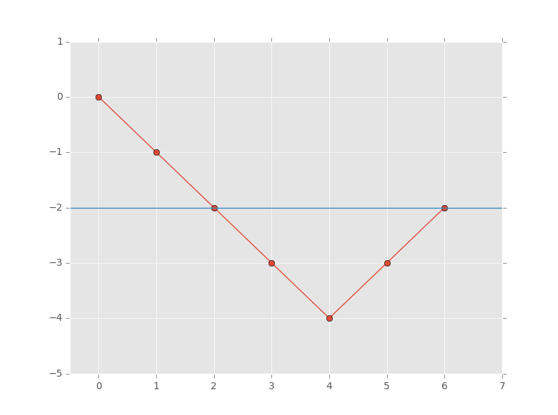

# Hash Map — Worked Examples

> **Scope** — The worked-solution archive for the hash-map family: one canonical solution per problem, the pattern-specific templates that are really single-problem deep dives, and the ordered-map (Java `TreeMap` / Python `SortedDict`) reference.
> **See also** — *parent sheet*: [hash_map.md](./hash_map.md) — the canonical templates, the problem→pattern decision table and the interview tips this archive backs.
> *Neighbouring sheets*: [prefix_sum.md](./prefix_sum.md) — the prefix-sum family in its own right; [hashing.md](./hashing.md) — how hashing works, plus counting and rolling-hash idioms; [set.md](./set.md) — membership only, no values.

## LeetCode Problem Lists

- [Hash Table](https://leetcode.com/problem-list/hash-table/)

## Overview

This file is the long tail of [hash_map.md](./hash_map.md). It holds three kinds of material that would otherwise bury the templates in the main sheet:

- **Templates & Algorithms** — patterns that are, in practice, a deep dive on one or two problems (bucket sort, rolling hash, split-and-probe, max-frequency arithmetic), plus the ordered-map reference (`TreeMap` / `SortedDict`), which is a *sorted* map and therefore not what the main sheet owns.
- **LC Examples** — the worked solutions, one canonical version per problem per language.
- **Problems by Pattern** — the full per-category problem tables.

### Key Properties
- **Complexity**: see the [Time Complexity](./hash_map.md#time-complexity) table in the main sheet
- **Core Idea**: every section here is an application of one of the [templates](./hash_map.md#templates--algorithms) in the main sheet — the template is the thing to memorise, these are the rehearsals
- **When to Use**: after you know which template a problem needs and want to see it written out in full

## Templates & Algorithms

### Ordered Map — Java TreeMap / Python SortedDict

> ⚠️ **Python has NO built-in `TreeMap`** — the stdlib ships no ordered map at all.
> The de-facto replacement is `SortedDict` from the third-party **`sortedcontainers`**
> package (preinstalled on LeetCode). See the
> [`SortedDict` vs `TreeMap`](#sorteddict-vs-treemap-implementation-differences)
> comparison below for where they actually differ.

```python
# Python - SortedDict (from sortedcontainers)
from sortedcontainers import SortedDict

# TreeMap Pattern Template
def treemap_pattern(data, target):
    # SortedDict keeps keys in sorted order
    tree_map = SortedDict()

    # Basic operations
    tree_map[key] = value           # O(log n) insert
    value = tree_map.get(key)       # O(1) !! backed by a hash dict, NOT a tree walk
    del tree_map[key]               # O(log n) delete

    # Ordered access — keys() is an INDEXABLE sorted view (O(log n) random access)
    keys = tree_map.keys()
    first_key = keys[0]  if tree_map else None          # firstKey()
    last_key  = keys[-1] if tree_map else None          # lastKey()
    tree_map.peekitem(0)                                # firstEntry() -> (k, v)
    tree_map.peekitem(-1)                               # lastEntry()  -> (k, v)

    # Floor / Ceiling — use the SortedDict's OWN bisect methods.
    # ❌ do NOT do `bisect.bisect_left(list(tree_map.keys()), target)`
    #    -> list(...) copies every key = O(n), killing the O(log n) win
    i = tree_map.bisect_left(target)    # first index with key >= target
    j = tree_map.bisect_right(target)   # first index with key >  target

    ceil_key  = keys[i]     if i < len(tree_map) else None   # ceilingKey(target)
    floor_key = keys[j - 1] if j > 0             else None   # floorKey(target)

    # Range query: all keys in [lo, hi]
    for k in tree_map.irange(lo, hi):                   # subMap(lo, true, hi, true)
        process(k, tree_map[k])

    return tree_map

# Examples: LC 853, LC 729/731/732, LC 846, LC 352, LC 981
```

#### Java `TreeMap` → Python `SortedDict` API Mapping ⭐⭐⭐⭐⭐

| Java `TreeMap` | Python `SortedDict` | Note |
|---|---|---|
| `firstKey()` / `lastKey()` | `d.keys()[0]` / `d.keys()[-1]` | |
| `firstEntry()` / `lastEntry()` | `d.peekitem(0)` / `d.peekitem(-1)` | returns `(k, v)` tuple |
| `floorKey(x)` (largest ≤ x) | `d.keys()[d.bisect_right(x) - 1]` | guard `idx >= 0` |
| `ceilingKey(x)` (smallest ≥ x) | `d.keys()[d.bisect_left(x)]` | guard `idx < len(d)` |
| `lowerKey(x)` (strictly < x) | `d.keys()[d.bisect_left(x) - 1]` | guard `idx >= 0` |
| `higherKey(x)` (strictly > x) | `d.keys()[d.bisect_right(x)]` | guard `idx < len(d)` |
| `subMap(lo, true, hi, true)` | `d.irange(lo, hi)` | inclusive both ends |
| `headMap(hi, true)` | `d.irange(maximum=hi)` | |
| `tailMap(lo, true)` | `d.irange(minimum=lo)` | |
| `pollFirstEntry()` / `pollLastEntry()` | `d.popitem(0)` / `d.popitem(-1)` | |
| `descendingMap()` | `reversed(d)` / `d.keys()[::-1]` | |
| `new TreeMap<>(comparator)` | `SortedDict(key_func)` | key **transform**, not a comparator |

⚠️ **The #1 gotcha**: Java's `floorKey/ceilingKey` hand you a **key** (or `null`);
Python's `bisect_*` hand you an **index** that can be `-1` or `len(d)`.
**Always guard the index** before subscripting:

```python
# python — the safe floor/ceiling idiom
i = d.bisect_left(x)
ceil_key = d.keys()[i] if i < len(d) else None      # ceilingKey(x)

j = d.bisect_right(x) - 1
floor_key = d.keys()[j] if j >= 0 else None         # floorKey(x)
```

```java
// Java - TreeMap Pattern
import java.util.*;

// TreeMap Pattern Template
public void treeMapPattern(int[] data) {
    // TreeMap maintains sorted order by key (Red-Black Tree)
    TreeMap<Integer, Integer> treeMap = new TreeMap<>();

    // Basic operations - O(log n)
    treeMap.put(key, value);        // Insert
    Integer value = treeMap.get(key);  // Search
    treeMap.remove(key);            // Delete

    // Ordered operations - O(log n)
    Integer firstKey = treeMap.firstKey();   // Min key
    Integer lastKey = treeMap.lastKey();     // Max key
    Integer floorKey = treeMap.floorKey(k);  // Largest key <= k
    Integer ceilKey = treeMap.ceilingKey(k); // Smallest key >= k

    // Lower/Higher (exclusive)
    Integer lower = treeMap.lowerKey(k);     // Largest key < k
    Integer higher = treeMap.higherKey(k);   // Smallest key > k

    // Range queries - O(k log n) where k is range size
    Map.Entry<Integer, Integer> firstEntry = treeMap.firstEntry();
    Map.Entry<Integer, Integer> lastEntry = treeMap.lastEntry();

    // Iterate in sorted order - O(n)
    for (Map.Entry<Integer, Integer> entry : treeMap.entrySet()) {
        int key = entry.getKey();
        int val = entry.getValue();
        // Process in sorted order
    }

    // SubMap views (range queries)
    SortedMap<Integer, Integer> subMap = treeMap.subMap(fromKey, toKey);
    SortedMap<Integer, Integer> headMap = treeMap.headMap(toKey);
    SortedMap<Integer, Integer> tailMap = treeMap.tailMap(fromKey);
}
```

#### **`SortedDict` vs `TreeMap`: implementation differences**

They solve the same problems, but they are **not the same data structure**:

| | Python `SortedDict` | Java `TreeMap` |
|---|---|---|
| **Source** | `pip install sortedcontainers` — **NOT stdlib** (preinstalled on LeetCode) | `java.util`, built-in |
| **Implementation** | `dict` + `SortedList` of keys (list-of-lists, B-tree-ish) | Red-black tree (self-balancing BST) |
| **`d[k]` / `get(k)`** | **O(1)** — plain hash lookup | **O(log n)** — tree descent |
| **insert / delete** | O(log n) amortized | O(log n) |
| **floor / ceiling** | O(log n) via `bisect_*` (returns an **index**) | O(log n) via `floorKey/ceilingKey` (returns a **key** or `null`) |
| **k-th smallest key** | **O(log n)** — `d.keys()[k]` ✅ | ❌ not supported (O(n) iteration) |
| **Custom ordering** | `SortedDict(key_func)` — a key **transform** only | `Comparator` — arbitrary 2-arg logic |
| **Duplicate keys** | ❌ | ❌ |
| **Thread-safe** | ❌ | ❌ (use `ConcurrentSkipListMap`) |

**Takeaways:**
1. `SortedDict` is *faster* than `TreeMap` for plain value lookups (O(1) hash vs O(log n) walk).
2. `SortedDict` supports **index access** (`keys()[k]`) in O(log n) — great for
   "k-th smallest key" problems, which `TreeMap` cannot do without an order-statistic tree.
3. `TreeMap`'s `Comparator` is strictly more expressive than `SortedDict`'s key function.
4. If imports are restricted to stdlib, fall back to `bisect` on a plain list
   (O(log n) search, but **O(n) insert** due to list shifting) — fine for small `n`.

**TreeMap vs HashMap Comparison:**

| Feature | HashMap | TreeMap |
|---------|---------|---------|
| **Ordering** | No ordering | Sorted by key |
| **Underlying Structure** | Hash Table + Linked List/Red-Black Tree (collision) | Red-Black Tree |
| **Insert/Delete/Search** | O(1) average, O(n) worst | O(log n) |
| **Iteration** | No specific order | Sorted order by key |
| **Floor/Ceiling** | Not supported | O(log n) |
| **Range Queries** | Not supported | O(k log n) |
| **Use Case** | Fast lookups, no ordering needed | Ordered iteration, range queries, floor/ceiling |
| **Memory** | Less (hash table) | More (tree nodes + pointers) |

**When to Use TreeMap:**
- Need keys in sorted order
- Need floor/ceiling operations (closest key)
- Need range queries (all keys in [a, b])
- Need first/last key efficiently
- Problems involving intervals, ranges, or ordering constraints

**When NOT to Use TreeMap:**
- Only need fast O(1) lookups without ordering
- Memory is constrained (TreeMap uses more memory)
- Don't need ordered operations (HashMap is faster)

**Common TreeMap Patterns:**

1. **Pattern 1: Ordered Map for Sorting**
   ```java
   // LC 853 - Car Fleet
   // Convert HashMap to TreeMap for sorted iteration
   Map<Integer, Integer> map = new HashMap<>();
   // ... populate map ...
   TreeMap<Integer, Integer> sorted = new TreeMap<>(map);
   ```

2. **Pattern 2: Interval Management**
   ```java
   // LC 729/731/732 - My Calendar series
   // Use TreeMap to check overlapping intervals
   TreeMap<Integer, Integer> calendar = new TreeMap<>();

   public boolean book(int start, int end) {
       Integer prev = calendar.floorKey(start);
       Integer next = calendar.ceilingKey(start);

       if ((prev == null || calendar.get(prev) <= start) &&
           (next == null || end <= next)) {
           calendar.put(start, end);
           return true;
       }
       return false;
   }
   ```

3. **Pattern 3: Consecutive Elements**
   ```java
   // LC 846 - Hand of Straights
   // Use TreeMap to process smallest elements first
   TreeMap<Integer, Integer> count = new TreeMap<>();
   // ... count frequency ...

   while (!count.isEmpty()) {
       int first = count.firstKey();
       // Process consecutive sequence starting from first
   }
   ```

4. **Pattern 4: Range/Stream Problems**
   ```java
   // LC 352 - Data Stream as Disjoint Intervals
   // Maintain disjoint intervals in sorted order
   TreeMap<Integer, int[]> intervals = new TreeMap<>();

   public void addNum(int val) {
       Integer lower = intervals.floorKey(val);
       Integer higher = intervals.ceilingKey(val);
       // Merge intervals if needed
   }
   ```

**Classic LeetCode Problems:**

| Problem | LC# | Difficulty | Key TreeMap Operation |
|---------|-----|------------|----------------------|
| Car Fleet | 853 | Medium | Sort by position (key) |
| My Calendar I | 729 | Medium | floorKey/ceilingKey for overlap check |
| My Calendar II | 731 | Medium | Count overlapping bookings |
| My Calendar III | 732 | Hard | Maximum overlapping count |
| Hand of Straights | 846 | Medium | firstKey for smallest element |
| Data Stream as Disjoint Intervals | 352 | Hard | Merge intervals with floor/ceiling |
| Time Based Key-Value Store | 981 | Medium | floorKey for timestamp lookup |
| Count of Smaller Numbers After Self | 315 | Hard | Ordered iteration |
| Contains Duplicate III | 220 | Medium | floorKey/ceilingKey for range check |
| The Skyline Problem | 218 | Hard | Multiset with TreeMap |

**Example: LC 853 - Car Fleet**

```python
# Python - LC 853 Car Fleet
def carFleet(target, position, speed):
    # Use sorted iteration (similar to TreeMap)
    cars = sorted(zip(position, speed), reverse=True)  # Sort by position descending

    stack = []
    for pos, spd in cars:
        time = (target - pos) / spd  # Time to reach target
        if not stack or time > stack[-1]:
            stack.append(time)

    return len(stack)

# Alternative using SortedDict
from sortedcontainers import SortedDict

def carFleet_v2(target, position, speed):
    car_map = SortedDict()
    for p, s in zip(position, speed):
        car_map[-p] = s  # Negative for reverse order

    fleets = 0
    prev_time = 0

    for neg_pos, spd in car_map.items():
        pos = -neg_pos
        time = (target - pos) / spd
        if time > prev_time:
            fleets += 1
            prev_time = time

    return fleets
```

```java
// Java - LC 853 Car Fleet
/**
 * time = O(N log N)
 * space = O(N)
 */
public int carFleet(int target, int[] position, int[] speed) {
    // Build HashMap first
    Map<Integer, Integer> map = new HashMap<>();
    for (int i = 0; i < position.length; i++) {
        map.put(position[i], speed[i]);
    }

    // Convert to TreeMap for sorted iteration (descending order)
    TreeMap<Integer, Integer> treeMap = new TreeMap<>(Collections.reverseOrder());
    treeMap.putAll(map);

    int fleets = 0;
    double prevTime = 0;

    // Iterate from position closest to target (sorted order)
    for (Map.Entry<Integer, Integer> entry : treeMap.entrySet()) {
        int pos = entry.getKey();
        int spd = entry.getValue();
        double time = (double)(target - pos) / spd;

        // If current car takes longer, it forms a new fleet
        if (time > prevTime) {
            fleets++;
            prevTime = time;
        }
    }

    return fleets;
}
```

**Example: LC 729 - My Calendar I**

```java
// Java - LC 729 My Calendar I
/**
 * time = O(log N) per operation
 * space = O(N)
 */
class MyCalendar {
    TreeMap<Integer, Integer> calendar;

    public MyCalendar() {
        calendar = new TreeMap<>();
    }

    public boolean book(int start, int end) {
        // Find largest start time <= current start
        Integer prev = calendar.floorKey(start);

        // Find smallest start time >= current start
        Integer next = calendar.ceilingKey(start);

        // Check no overlap with previous booking
        if (prev != null && calendar.get(prev) > start) {
            return false;
        }

        // Check no overlap with next booking
        if (next != null && next < end) {
            return false;
        }

        calendar.put(start, end);
        return true;
    }
}
```

```python
# python
# LC 729 - My Calendar I
# V1) Closest 1:1 translation of the Java floorKey / ceilingKey solution
from sortedcontainers import SortedDict

class MyCalendar:
    # time = O(log N) per booking, space = O(N)
    def __init__(self):
        self.calendar = SortedDict()   # start -> end

    def book(self, start: int, end: int) -> bool:
        keys = self.calendar.keys()

        # floorKey(start): largest key <= start
        i = self.calendar.bisect_right(start)
        prev = keys[i - 1] if i > 0 else None

        # ceilingKey(start): smallest key >= start
        j = self.calendar.bisect_left(start)
        nxt = keys[j] if j < len(keys) else None

        if (prev is None or self.calendar[prev] <= start) and \
           (nxt is None or end <= nxt):
            self.calendar[start] = end
            return True
        return False
```

```python
# python
# LC 729 - My Calendar I
# V2) More idiomatic — SortedList of (start, end) tuples.
#     ONE structure, no key/value split; the overlap check reads directly.
#     This is the version to write in an interview.
from sortedcontainers import SortedList

class MyCalendar:
    # time = O(log N) per booking, space = O(N)
    def __init__(self):
        self.books = SortedList()      # sorted list of (start, end)

    def book(self, start: int, end: int) -> bool:
        i = self.books.bisect_left((start, end))
        if i > 0 and self.books[i - 1][1] > start:            # prev event overlaps
            return False
        if i < len(self.books) and end > self.books[i][0]:    # next event overlaps
            return False
        self.books.add((start, end))
        return True
```

```python
# python
# LC 729 - My Calendar I
# V3) Zero-dependency fallback (stdlib only) — search stays O(log N),
#     but list.insert() shifts elements => O(N) per booking.
#     Fine for LC 729's constraints (<= 1000 calls).
import bisect

class MyCalendar:
    # time = O(N) per booking, space = O(N)
    def __init__(self):
        self.books = []                # sorted list of (start, end)

    def book(self, start: int, end: int) -> bool:
        i = bisect.bisect_left(self.books, (start, end))
        if i > 0 and self.books[i - 1][1] > start:
            return False
        if i < len(self.books) and end > self.books[i][0]:
            return False
        self.books.insert(i, (start, end))
        return True
```

**Interview Tips for TreeMap Problems:**

1. **Recognition Patterns:**
   - "sorted order", "smallest/largest", "floor/ceiling" → Think TreeMap
   - "overlapping intervals" → TreeMap with floorKey/ceilingKey
   - "consecutive elements" → TreeMap.firstKey() for greedy processing
   - "range queries" → TreeMap.subMap()

2. **Common Mistakes:**
   - Forgetting O(log n) complexity vs O(1) for HashMap
   - Not handling null returns from floor/ceiling operations
   - Using TreeMap when HashMap would suffice
   - Not considering memory overhead of tree structure
   - **(Python)** treating `bisect_left/right` output as a **key** — it's an **index**;
     forgetting the `idx >= 0` / `idx < len(d)` guard → `IndexError` or a silent wrap-around
     (`keys()[-1]` returns the MAX key, not "nothing"!)
   - **(Python)** `bisect.bisect_left(list(d.keys()), x)` — the `list(...)` copy is O(n);
     call `d.bisect_left(x)` instead

3. **Optimization:**
   - If only need sorted iteration once, sort array instead (O(n log n) vs maintaining TreeMap)
   - If range queries are rare, consider lazy sorting
   - For Python, `sortedcontainers` library provides efficient SortedDict

4. **Edge Cases:**
   - Empty TreeMap (firstKey/lastKey throw exceptions)
   - Null values from floor/ceiling operations
   - Duplicate keys (TreeMap doesn't allow, use value as counter)
   - Reverse order iteration (use descendingMap() in Java)
### Bucket Sort via Hash Map (Top-K Frequency, O(n))

**When asked for top-K frequent, ask: "Can you do O(n)?"** — The bucket trick avoids a heap.

**Idea**: Create buckets where `bucket[freq]` holds all elements with that frequency. Scan buckets from highest freq down to collect top-K.

```python
# LC 347 Top K Frequent Elements — O(n) bucket approach
from collections import Counter

def topKFrequent(nums: list, k: int) -> list:
    count = Counter(nums)
    # bucket[i] = list of numbers that appear exactly i times
    bucket = [[] for _ in range(len(nums) + 1)]
    for num, freq in count.items():
        bucket[freq].append(num)

    result = []
    for freq in range(len(bucket) - 1, 0, -1):
        result.extend(bucket[freq])
        if len(result) >= k:
            return result[:k]
    return result

# LC 692 Top K Frequent Words — bucket + sort within bucket
from collections import Counter

def topKFrequent_words(words: list, k: int) -> list:
    count = Counter(words)
    bucket = [[] for _ in range(len(words) + 1)]
    for word, freq in count.items():
        bucket[freq].append(word)

    result = []
    for freq in range(len(bucket) - 1, 0, -1):
        bucket[freq].sort()          # alphabetical within same frequency
        result.extend(bucket[freq])
        if len(result) >= k:
            return result[:k]
    return result
```

| Approach | Time | Space | When |
|----------|------|-------|------|
| Heap (nlargest) | O(n log k) | O(n) | Default |
| Bucket sort | O(n) | O(n) | When O(n) is explicitly required |

---

### Hash Map + Memoization / DP

**Pattern**: Use a dict as a top-down DP cache (memoization). The key is the subproblem state (index, remaining target, visited set, etc.).

```python
# LC 139 Word Break — {index: bool}
def wordBreak(s: str, wordDict: list) -> bool:
    word_set = set(wordDict)
    memo = {}

    def dp(i):
        if i == len(s):
            return True
        if i in memo:
            return memo[i]
        for j in range(i + 1, len(s) + 1):
            if s[i:j] in word_set and dp(j):
                memo[i] = True
                return True
        memo[i] = False
        return False

    return dp(0)

# LC 1048 Longest String Chain — {word: longest_chain_ending_here}
def longestStrChain(words: list) -> int:
    words.sort(key=len)
    dp = {}   # word -> longest chain ending at this word
    best = 1
    for word in words:
        dp[word] = 1
        for i in range(len(word)):
            prev = word[:i] + word[i+1:]   # remove one character
            if prev in dp:
                dp[word] = max(dp[word], dp[prev] + 1)
        best = max(best, dp[word])
    return best

# LC 322 Coin Change — classic DP, memo keyed by amount
def coinChange(coins: list, amount: int) -> int:
    memo = {}
    def dp(rem):
        if rem < 0: return float('inf')
        if rem == 0: return 0
        if rem in memo: return memo[rem]
        memo[rem] = min(dp(rem - c) + 1 for c in coins)
        return memo[rem]
    res = dp(amount)
    return res if res != float('inf') else -1
```

**Key rule**: Always check `if state in memo: return memo[state]` **before** computing. Store result **before** returning.

---

### Monotonic Stack + Hash Map

**Pattern**: Use a stack to process elements in a monotonic order; use a hash map to record the answer for each element by index or value.

```python
# LC 496 Next Greater Element I
# map each element of nums1 to its next-greater in nums2
def nextGreaterElement(nums1: list, nums2: list) -> list:
    next_greater = {}   # val -> next greater val in nums2
    stack = []          # monotonic decreasing stack

    for num in nums2:
        # pop all elements smaller than current — current is their next greater
        while stack and stack[-1] < num:
            next_greater[stack.pop()] = num
        stack.append(num)

    return [next_greater.get(n, -1) for n in nums1]

# LC 503 Next Greater Element II (circular array)
def nextGreaterElements(nums: list) -> list:
    n = len(nums)
    result = [-1] * n
    stack = []  # stores indices

    for i in range(2 * n):   # traverse twice for circular
        while stack and nums[stack[-1]] < nums[i % n]:
            result[stack.pop()] = nums[i % n]
        if i < n:
            stack.append(i)
    return result

# LC 739 Daily Temperatures — index-based answer map
def dailyTemperatures(temps: list) -> list:
    result = [0] * len(temps)
    stack = []  # monotonic decreasing stack of indices

    for i, t in enumerate(temps):
        while stack and temps[stack[-1]] < t:
            j = stack.pop()
            result[j] = i - j
        stack.append(i)
    return result
```

**Recognition cues**: "next greater/smaller", "how many days until warmer", "span of prices", "largest rectangle".

---

### Rolling Hash (Rabin-Karp)

**When**: Find duplicate/matching substrings in O(n) expected time. Better than O(n²) naive substring comparison.

**Idea**: Hash each window using polynomial rolling hash. Slide the window by removing the leftmost character and adding the new rightmost one in O(1).

```python
# LC 187 Repeated DNA Sequences — find all length-10 substrings appearing ≥ 2 times
def findRepeatedDnaSequences(s: str) -> list:
    if len(s) <= 10:
        return []
    seen, repeated = set(), set()
    for i in range(len(s) - 9):
        sub = s[i:i+10]
        if sub in seen:
            repeated.add(sub)
        seen.add(sub)
    return list(repeated)

# General Rabin-Karp rolling hash template
def rabin_karp(s: str, pattern: str) -> list:
    """Return all start indices where pattern occurs in s."""
    n, m = len(s), len(pattern)
    if m > n:
        return []

    BASE = 26
    MOD = (1 << 61) - 1   # Mersenne prime — minimises collisions

    def char_val(c):
        return ord(c) - ord('a')

    # Precompute BASE^(m-1) mod MOD
    power = pow(BASE, m - 1, MOD)

    # Hash of pattern and first window
    p_hash = 0
    w_hash = 0
    for i in range(m):
        p_hash = (p_hash * BASE + char_val(pattern[i])) % MOD
        w_hash = (w_hash * BASE + char_val(s[i])) % MOD

    result = []
    for i in range(n - m + 1):
        if w_hash == p_hash and s[i:i+m] == pattern:  # verify on hash match
            result.append(i)
        if i < n - m:
            # Roll: remove leftmost, add new rightmost
            w_hash = (w_hash - char_val(s[i]) * power) % MOD
            w_hash = (w_hash * BASE + char_val(s[i + m])) % MOD

    return result

# LC 1044 Longest Duplicate Substring — binary search + rolling hash
def longestDupSubstring(s: str) -> str:
    BASE, MOD = 31, (1 << 61) - 1

    def has_dup(length):
        if length == 0:
            return ""
        power = pow(BASE, length - 1, MOD)
        h = 0
        for c in s[:length]:
            h = (h * BASE + ord(c) - ord('a')) % MOD
        seen = {h: 0}
        for i in range(1, len(s) - length + 1):
            h = (h - (ord(s[i-1]) - ord('a')) * power) % MOD
            h = (h * BASE + ord(s[i+length-1]) - ord('a')) % MOD
            if h in seen:
                # verify (collision guard)
                start = seen[h]
                if s[start:start+length] == s[i:i+length]:
                    return s[i:i+length]
            seen[h] = i
        return ""

    lo, hi, ans = 0, len(s) - 1, ""
    while lo <= hi:
        mid = (lo + hi) // 2
        dup = has_dup(mid)
        if dup:
            ans = dup
            lo = mid + 1
        else:
            hi = mid - 1
    return ans
```

**Collision guard**: Always verify with `s[i:i+m] == pattern` when hashes match — hash collisions are rare but possible.

| Problem | LC# | Difficulty | Technique |
|---------|-----|------------|-----------|
| Repeated DNA Sequences | 187 | Medium | Set of substrings / rolling hash |
| Longest Duplicate Substring | 1044 | Hard | Binary search + rolling hash |
| Rabin-Karp string match | - | - | Template above |

---

### Word → Index Map for Pair Lookup (Split-and-Probe) ⭐⭐⭐⭐

**Pattern**: To find **pairs** among `n` strings without an O(n²) double loop, put every string in a `word -> index` map, then for each word enumerate its O(k) split points and *probe* the map for the piece that would complete the answer. Cost drops from `O(n^2 * k)` to `O(n * k^2)`.

**Key Idea (LC 336)**: `w = prefix + suffix`. `w + partner` is a palindrome in exactly two shapes:
- `suffix` is a palindrome → `partner = reverse(prefix)` sits on the **right**
- `prefix` is a palindrome → `partner = reverse(suffix)` sits on the **left**

```java
// java
// LC 336 - Palindrome Pairs
// IDEA: word -> index map; for each split point, probe for the reversed other half
// time = O(n * k^2), space = O(n * k)   (n words, k = max word length)
public List<List<Integer>> palindromePairs(String[] words) {
    Map<String, Integer> index = new HashMap<>();   // word -> its index
    for (int i = 0; i < words.length; i++) index.put(words[i], i);

    List<List<Integer>> res = new ArrayList<>();
    for (int i = 0; i < words.length; i++) {
        String w = words[i];
        for (int j = 0; j <= w.length(); j++) {
            String pref = w.substring(0, j), suf = w.substring(j);
            if (isPal(pref)) {                      // partner goes on the LEFT
                String back = new StringBuilder(suf).reverse().toString();
                Integer k = index.get(back);
                if (k != null && !back.equals(w)) res.add(Arrays.asList(k, i));
            }
            if (j != w.length() && isPal(suf)) {    // partner goes on the RIGHT
                String back = new StringBuilder(pref).reverse().toString();
                Integer k = index.get(back);
                if (k != null && !back.equals(w)) res.add(Arrays.asList(i, k));
            }
        }
    }
    return res;
}

private boolean isPal(String s) {
    int i = 0, j = s.length() - 1;
    while (i < j) if (s.charAt(i++) != s.charAt(j--)) return false;
    return true;
}
```

```python
# python
# LC 336 - Palindrome Pairs
# IDEA: {word: index}; for each split point, probe for the reversed other half
# time = O(n * k^2), space = O(n * k)
def palindromePairs(words: list) -> list:
    index = {w: i for i, w in enumerate(words)}
    res = []
    for i, w in enumerate(words):
        n = len(w)
        for j in range(n + 1):
            pref, suf = w[:j], w[j:]
            if pref == pref[::-1]:                 # partner goes on the LEFT
                back = suf[::-1]
                if back in index and back != w:
                    res.append([index[back], i])
            if j != n and suf == suf[::-1]:        # partner goes on the RIGHT
                back = pref[::-1]
                if back in index and back != w:
                    res.append([i, index[back]])
    return res
```

**Two guards that make it correct** (both are dedup logic, and both are the interview follow-up):
- `back != w` — a word must not pair with itself (words are guaranteed distinct).
- `j != n` in the second branch — without it, the empty-suffix split and the empty-prefix split of a `w` / `reverse(w)` pair each emit both ordered pairs, so every such pair is reported **twice**.

**Handles the empty string for free**: `words = ["a", ""]` yields both `[0,1]` and `[1,0]`, because `""` is a palindrome on both sides.

---

### Frequency Map + Max-Frequency Arithmetic (Greedy Scheduling) ⭐⭐⭐⭐

**Pattern**: A counting map whose *individual* counts don't matter — only **`maxFreq`** and **how many keys tie for it** (`countOfMax`, a one-entry count-of-counts). The answer is then a closed-form formula, no simulation and no heap.

**Key Idea (LC 621)**: the most frequent task dictates the layout. It creates `maxFreq - 1` full frames of width `n + 1`, plus a final frame holding every task tied for the max.

```text
tasks = AAABBB, n = 2   → maxFreq = 3, countOfMax = 2 (A and B)

  | A B idle | A B idle | A B
  \___ n+1 ___/\___ n+1 __/ \_countOfMax_/

  slots = (3-1)*(2+1) + 2 = 8
```

**Recurrence**: `answer = max(len(tasks), (maxFreq - 1) * (n + 1) + countOfMax)`
The `max(len(tasks), ...)` matters when there are **so many distinct tasks that no idling is ever needed** — the formula would under-count.

```java
// java
// LC 621 - Task Scheduler
// IDEA: only the max frequency and how many tasks tie for it matter
// time = O(N), space = O(1)  (26 keys)
public int leastInterval(char[] tasks, int n) {
    int[] freq = new int[26];
    int maxFreq = 0;
    for (char t : tasks) maxFreq = Math.max(maxFreq, ++freq[t - 'A']);
    int countOfMax = 0;
    for (int f : freq) if (f == maxFreq) countOfMax++;
    int slots = (maxFreq - 1) * (n + 1) + countOfMax;
    return Math.max(tasks.length, slots);           // no idle time needed if tasks are diverse
}

// LC 767 - Reorganize String  (same max-frequency test, then even/odd fill)
// time = O(n), space = O(n)
public String reorganizeString(String s) {
    int[] cnt = new int[26];
    int maxFreq = 0, maxChar = 0;
    for (char c : s.toCharArray()) {
        cnt[c - 'a']++;
        if (cnt[c - 'a'] > maxFreq) { maxFreq = cnt[c - 'a']; maxChar = c - 'a'; }
    }
    int n = s.length();
    if (maxFreq > (n + 1) / 2) return "";           // impossible

    char[] res = new char[n];
    int i = 0;
    while (cnt[maxChar] > 0) {                      // most frequent char at even slots first
        res[i] = (char) ('a' + maxChar); i += 2; cnt[maxChar]--;
    }
    for (int c = 0; c < 26; c++) {
        while (cnt[c] > 0) {
            if (i >= n) i = 1;                      // wrap to odd slots
            res[i] = (char) ('a' + c); i += 2; cnt[c]--;
        }
    }
    return new String(res);
}
```

```python
# python
# LC 621 - Task Scheduler
# IDEA: (maxFreq - 1) frames of width (n + 1), plus every task tied for maxFreq
# time = O(N), space = O(1)  (26 keys)
from collections import Counter

def leastInterval(tasks: list, n: int) -> int:
    freq = Counter(tasks)
    max_freq = max(freq.values())
    count_of_max = sum(1 for f in freq.values() if f == max_freq)
    return max(len(tasks), (max_freq - 1) * (n + 1) + count_of_max)

# python
# LC 767 - Reorganize String
# IDEA: feasible iff max_freq <= (n+1)//2; fill slots 0,2,4,... then 1,3,5,... in freq order
# time = O(n log 26) ~ O(n), space = O(n)
def reorganizeString(s: str) -> str:
    freq = Counter(s)
    if max(freq.values()) > (len(s) + 1) // 2:
        return ""
    res = [''] * len(s)
    i = 0
    for ch, cnt in freq.most_common():          # most frequent first — this is what makes it work
        for _ in range(cnt):
            if i >= len(s):
                i = 1                           # even slots exhausted → switch to odd slots
            res[i] = ch
            i += 2
    return "".join(res)
```

**Why the even/odd fill works**: two copies placed at `i` and `i+2` are never adjacent, and the only risk is the wrap point — which is safe precisely because `max_freq <= (n+1)//2` guarantees the most frequent char fits entirely in the even slots.

| Problem | LC# | What `maxFreq` decides |
|---------|-----|------------------------|
| Task Scheduler | 621 | Total time = frames of the most frequent task |
| Reorganize String | 767 | Feasibility: `maxFreq <= (n+1)/2` |

---

## LC Examples

### 2-1) Contiguous Array (LC 525)

**Core Pattern: Transform + Prefix Sum + HashMap**

#### Key Concept
Finding if there are `at least 2 indexes` with `SAME count` (running sum).

This is the same as finding `any 2 x-axis with same y-axis` in the visualization below.

#### Pattern Breakdown

**1. Problem Transformation:**
```text
Transform the binary array:
- Treat 0 as -1
- Treat 1 as +1

Why? Equal 0s and 1s → sum of transformed array = 0
```

**2. HashMap Structure:**
```java
Map<Integer, Integer> map = new HashMap<>();
// {count: first_index_where_count_occurred}

map.put(0, -1); // Initialize for subarrays starting at index 0
```

**3. Core Logic:**
```text
count: running sum (cumulative)
  - +1 for each 1
  - -1 for each 0

If count(i) == count(j) where i < j:
  → Elements between i and j sum to 0
  → Subarray [i+1, j] is balanced (equal 0s and 1s)
  → Length = j - i
```

**4. Why Store FIRST Occurrence Only?**
```text
To maximize length, we want the earliest index with this count.
If count appears at indices [3, 7, 10]:
  - Store index 3
  - When we see count again at index 10, length = 10 - 3 = 7 (maximum)
```

**5. Why Initialize map.put(0, -1)?**
```text
If from index 0 to i, count = 0:
  → Entire subarray [0, i] is balanced
  → Length = i - (-1) = i + 1 ✓

Without this initialization, we'd miss subarrays starting at index 0.
```

#### Visual Example
Sequence: `[0, 0, 0, 0, 1, 1]`
Count progression (0→-1, 1→+1): 0 → -1 → -2 → -3 → -4 → -3 → -2

The count returns to **-2** at both index 2 and index 5. Length = 5 - 2 = **4**, which is the subarray `nums[3..5] = [0, 1, 1]` — wait, let's be precise: the subarray is `nums[index2+1 .. index5] = nums[3..5] = [0,1,1]`... actually the indices in the map represent where the running count was last seen, so length = `i - map[count]` = `5 - 1 = 4`, giving subarray `nums[2..5] = [0,0,1,1]` (4 elements, 2 zeros and 2 ones ✓).

<p align="center"></p>

#### Mathematical Reasoning

**Why Same Count Means Balanced Subarray:**
```text
Let count(i) = cumulative sum at index i

If count(i) == count(j) where i < j:
  count(j) - count(i) = 0

This means:
  sum of elements from index (i+1) to j = 0

In transformed array (0→-1, 1→+1):
  sum = 0 means equal number of -1s and +1s
  → equal number of 0s and 1s in original array
```

#### Implementation Template

```java
// Java Template
public int findMaxLength(int[] nums) {
    // Map: {count: first_index_where_count_occurred}
    Map<Integer, Integer> map = new HashMap<>();

    // Initialize: handle subarrays starting at index 0
    map.put(0, -1);

    int maxLen = 0;
    int count = 0;

    for (int i = 0; i < nums.length; i++) {
        // Transform: 0 → -1, 1 → +1
        count += (nums[i] == 1) ? 1 : -1;

        // If count seen before: calculate subarray length
        if (map.containsKey(count)) {
            maxLen = Math.max(maxLen, i - map.get(count));
        } else {
            // Store FIRST occurrence only (for max length)
            map.put(count, i);
        }
    }

    return maxLen;
}
```

```python
# Python Template
def findMaxLength(nums):
    # Map: {count: first_index_where_count_occurred}
    d = {0: -1}  # Initialize for subarrays starting at index 0

    max_len = 0
    count = 0

    for i, num in enumerate(nums):
        # Transform: 0 → -1, 1 → +1
        count += 1 if num == 1 else -1

        # If count seen before: calculate subarray length
        if count in d:
            max_len = max(max_len, i - d[count])
        else:
            # Store FIRST occurrence only (for max length)
            d[count] = i

    return max_len
```

#### Key Differences from LC 560 Pattern

| Aspect | LC 560 (Subarray Sum K) | LC 525 (Contiguous Array) |
|--------|-------------------------|---------------------------|
| **Goal** | Count ALL subarrays | Find LONGEST subarray |
| **Map Value** | `count` (occurrences) | `index` (first occurrence) |
| **Map Update** | Always increment count | Only if new count |
| **Check Formula** | `presum - k` | Same `count` |
| **Initialization** | `{0: 1}` | `{0: -1}` |

#### Related Problems (Same Pattern)

- **LC 525**: Contiguous Array (exactly this pattern)
- **LC 1124**: Longest Well-Performing Interval (similar transformation)
- **LC 523**: Continuous Subarray Sum (modulo transformation)
- **LC 325**: Maximum Size Subarray Sum Equals k (prefix sum + index)

---

### 2-1-1) Subarray Sums Divisible by K (LC 974)

**Core Pattern: Prefix Sum + Modular Arithmetic + HashMap**

#### Key Concept
Count ALL subarrays whose sum is divisible by K using remainder tracking.

If two prefix sums have the **same remainder mod K**, their difference is divisible by K.

#### Pattern Breakdown

**1. Mathematical Foundation:**
```text
If prefix[i] % k == prefix[j] % k  (where j < i)

Then:
  (prefix[i] - prefix[j]) % k == 0

Which means:
  prefix[i] - prefix[j] = sum of nums[j+1 .. i]

Therefore:
  The subarray [j+1, i] has a sum divisible by k
```

**2. HashMap Structure:**
```java
Map<Integer, Integer> map = new HashMap<>();
// {remainder: count}  ← Store COUNT, not index (similar to LC 560)

map.put(0, 1); // Initialize for subarrays starting from beginning
```

**3. Why Store Remainder COUNT (Not Index)?**
```text
This is a "count ALL subarrays" problem (like LC 560).

If remainder 3 appears at indices [2, 5, 8]:
  - When we reach index 5: add 1 (subarray from index 2 to 5)
  - When we reach index 8: add 2 (subarrays from 2→8 and 5→8)

Total: 3 valid subarrays
```

**4. Critical: Handle Negative Remainders**
```java
int remainder = prefixSum % k;

// MUST adjust negative remainders to positive
if (remainder < 0) {
    remainder += k;
}

// Or use this one-liner:
remainder = ((prefixSum % k) + k) % k;
```

**Why?** In Java/Python, `-7 % 5 = -2`, but we need remainder 3 (since -2 ≡ 3 mod 5).

**5. Initialization: Why map.put(0, 1)?**
```text
If prefixSum % k == 0 at some index i:
  → The entire subarray [0, i] is divisible by k
  → We need to count this case

Without initialization, we'd miss these subarrays.
```

#### Visual Example

**Input:** `nums = [4, 5, 0, -2, -3, 1]`, `k = 5`

**Prefix sums:** `[4, 9, 9, 7, 4, 5]`

**Remainders (mod 5):** `[4, 4, 4, 2, 4, 0]`

| Index | Num | PrefixSum | Remainder | Map State | Count Added | Total Count |
|-------|-----|-----------|-----------|-----------|-------------|-------------|
| - | - | 0 | 0 | {0:1} | - | 0 |
| 0 | 4 | 4 | 4 | {0:1, 4:1} | 0 | 0 |
| 1 | 5 | 9 | 4 | {0:1, 4:2} | +1 | 1 |
| 2 | 0 | 9 | 4 | {0:1, 4:3} | +2 | 3 |
| 3 | -2 | 7 | 2 | {0:1, 4:3, 2:1} | 0 | 3 |
| 4 | -3 | 4 | 4 | {0:1, 4:4, 2:1} | +3 | 6 |
| 5 | 1 | 5 | 0 | {0:2, 4:4, 2:1} | +1 | **7** |

**Result:** 7 subarrays with sum divisible by 5

**Subarrays found:**
1. `[4,5,0,-2,-3,1]` (entire array, remainder 0 at end)
2. `[5]` (remainder 4 at indices 0 and 1)
3. `[5,0]` (remainder 4 at indices 0 and 2)
4. `[5,0,-2,-3]` (remainder 4 at indices 0 and 4)
5. `[0]` (remainder 4 at indices 1 and 2)
6. `[0,-2,-3]` (remainder 4 at indices 1 and 4)
7. `[-2,-3]` (remainder 4 at indices 2 and 4)

#### Implementation Template

```java
// Java Template
public int subarraysDivByK(int[] nums, int k) {
    // Map: {remainder: count}
    Map<Integer, Integer> map = new HashMap<>();
    map.put(0, 1); // Handle subarrays from beginning

    int count = 0;
    int prefixSum = 0;

    for (int num : nums) {
        prefixSum += num;

        // Calculate remainder (handle negatives!)
        int remainder = prefixSum % k;
        if (remainder < 0) {
            remainder += k;
        }
        // Or: int remainder = ((prefixSum % k) + k) % k;

        // Add count of all previous same remainders
        count += map.getOrDefault(remainder, 0);

        // Update remainder count
        map.put(remainder, map.getOrDefault(remainder, 0) + 1);
    }

    return count;
}
```

```python
# Python Template
def subarraysDivByK(nums, k):
    # Map: {remainder: count}
    remainder_count = {0: 1}

    count = 0
    prefix_sum = 0

    for num in nums:
        prefix_sum += num

        # Calculate remainder (Python % handles negatives correctly)
        remainder = prefix_sum % k

        # Add count of all previous same remainders
        count += remainder_count.get(remainder, 0)

        # Update remainder count
        remainder_count[remainder] = remainder_count.get(remainder, 0) + 1

    return count
```

**Note:** Python's `%` operator always returns positive remainders, so no adjustment needed.

#### Optimization: Array Instead of HashMap

Since remainders are always in range `[0, k-1]`, use an array for better performance:

```java
public int subarraysDivByK(int[] nums, int k) {
    int[] remainderCount = new int[k];
    remainderCount[0] = 1;

    int count = 0;
    int prefixSum = 0;

    for (int num : nums) {
        prefixSum += num;
        int remainder = ((prefixSum % k) + k) % k;

        count += remainderCount[remainder];
        remainderCount[remainder]++;
    }

    return count;
}
```

**Time Complexity:** O(N)
**Space Complexity:** O(K) instead of O(N)

#### Key Differences from Related Problems

| Aspect | LC 560 (Sum = K) | LC 974 (Divisible by K) | LC 525 (Equal 0/1) |
|--------|------------------|-------------------------|---------------------|
| **Goal** | Count subarrays | Count subarrays | Find longest |
| **Map Key** | `prefixSum` | `prefixSum % k` | `count` |
| **Map Value** | `count` | `count` | `first_index` |
| **Check Formula** | `presum - k` | Same `remainder` | Same `count` |
| **Special Handling** | None | **Negative remainders!** | Transform 0→-1 |
| **Initialization** | `{0: 1}` | `{0: 1}` | `{0: -1}` |

#### Critical: Why Negative Remainder Handling Matters

**Example:** `nums = [-1, -2, -3]`, `k = 5`

Without adjustment:
```text
prefixSum = -1: remainder = -1 (wrong!)
prefixSum = -3: remainder = -3 (wrong!)
prefixSum = -6: remainder = -1 (wrong!)
```

With adjustment:
```text
prefixSum = -1: remainder = 4 (correct: -1 ≡ 4 mod 5)
prefixSum = -3: remainder = 2 (correct: -3 ≡ 2 mod 5)
prefixSum = -6: remainder = 4 (correct: -6 ≡ 4 mod 5)
```

Now remainders 4 match → subarray `[-1]` and `[-2, -3]` have the same remainder → subarray `[-2, -3]` has sum divisible by 5 ✓

#### Related Problems (Same Pattern)

- **LC 974**: Subarray Sums Divisible by K (exactly this pattern)
- **LC 523**: Continuous Subarray Sum (divisible, but length ≥ 2 constraint)
- **LC 560**: Subarray Sum Equals K (no modulo, simpler)
- **LC 1248**: Count Nice Subarrays (transform + count pattern)

---

### 2-1-2) Count Number of Nice Subarrays (LC 1248)

**Core Pattern: Transform Odd Numbers → Prefix Sum Count (same as LC 560)**

#### Key Concept
Count subarrays with **exactly k odd numbers** by treating each number as 0 (even) or 1 (odd), then applying the prefix sum + hashmap pattern.

#### Core Idea

**Transform:** Replace each element with `num % 2` (1 if odd, 0 if even).

Now the problem becomes: **count subarrays whose sum equals k** — exactly LC 560!

```text
map: {oddCount: frequency}
     → "How many times has this odd-count appeared so far?"

At index i with current oddCount:
  → Find how many previous positions had exactly (oddCount - k) odds
  → Those form subarrays with exactly k odds ending at i
```

**Why `map.put(0, 1)`?**
```text
If oddCount == k at index i:
  → Entire subarray [0, i] has exactly k odds
  → oddCount - k = 0, must have {0: 1} pre-initialized
```

#### Implementation Template

```java
// Java - LC 1248
public int numberOfSubarrays(int[] nums, int k) {
    // map: {oddCount: frequency}
    Map<Integer, Integer> map = new HashMap<>();
    map.put(0, 1);  // base case: 0 odds seen 1 time

    int res = 0, oddCount = 0;

    for (int num : nums) {
        if (num % 2 == 1) oddCount++;  // treat odd as +1

        // How many previous positions had (oddCount - k) odds?
        res += map.getOrDefault(oddCount - k, 0);

        // Update count AFTER checking (critical order!)
        map.put(oddCount, map.getOrDefault(oddCount, 0) + 1);
    }

    return res;
}
```

```python
# python - LC 1248
# IDEA: prefix ODD-count + hashmap (same shape as LC 560)
# time: O(n), space: O(n)
# ref: leetcode_python/Array/count-number-of-nice-subarrays.py
class Solution:
    def numberOfSubarrays(self, nums, k):
        total_cnt = 0
        prefix_cnt = 0                 # running count of odd numbers so far

        cnt_map = {0: 1}              # {odd_count : frequency}; base case 0 odds seen once

        for val in nums:
            if val % 2 == 1:          # treat odd as +1 (even contributes 0)
                prefix_cnt += 1

            # NOTE: += get(prefix_cnt - k), NOT += 1
            #   there may be MULTIPLE earlier prefixes with the same odd count,
            #   each one gives a distinct valid subarray ending here
            total_cnt += cnt_map.get(prefix_cnt - k, 0)

            # record current prefix count AFTER checking (avoid self-count)
            cnt_map[prefix_cnt] = cnt_map.get(prefix_cnt, 0) + 1

        return total_cnt
```

> **Why `+= cnt_map.get(prefix_cnt - k, 0)` and not `+= 1`?**
> `prefix_cnt - k` (the "complement" odd-count) may have been reached at several
> earlier indices. Each of those start positions pairs with the current index to
> form a subarray with exactly `k` odds, so we add the full frequency — the same
> "2-sum on prefix values" trick as LC 560.

#### Alternative: Sliding Window (atMost trick)

```java
// Exactly k = atMost(k) - atMost(k-1)
public int numberOfSubarrays(int[] nums, int k) {
    return atMost(nums, k) - atMost(nums, k - 1);
}

private int atMost(int[] nums, int k) {
    int l = 0, res = 0, oddCount = 0;
    for (int r = 0; r < nums.length; r++) {
        if (nums[r] % 2 == 1) oddCount++;
        while (oddCount > k) {
            if (nums[l] % 2 == 1) oddCount--;
            l++;
        }
        res += (r - l + 1);
    }
    return res;
}
```

#### Key Differences from Related Problems

| Aspect | LC 560 (Sum = K) | LC 930 (Binary Sum = K) | LC 1248 (Nice Subarrays) |
|--------|-----------------|------------------------|--------------------------|
| **Transform** | None (use values directly) | Values are 0/1 already | `num % 2` → 0 or 1 |
| **Map Key** | `prefixSum` | `prefixSum` | `oddCount` |
| **Map Value** | `count` | `count` | `count` |
| **Init** | `{0: 1}` | `{0: 1}` | `{0: 1}` |

#### Related Problems (Same Pattern)

- **LC 560**: Subarray Sum Equals K (exact same pattern, no transform)
- **LC 930**: Binary Subarrays with Sum (values are 0/1, same idea)
- **LC 974**: Subarray Sums Divisible by K (modulo variant)
- **LC 1248**: Count Nice Subarrays (this problem — transform to 0/1 then LC 560)

---

### 2-2) Continuous Subarray Sum — LC 523
- Similar concept as Contiguous Array (LC 525)

```python
# 523 Continuous Subarray Sum
# IDEA : HASH TABLE
# -> if sum(nums[i:j]) % k == 0 for some i < j, 
#   ->  then sum(nums[:j]) % k == sum(nums[:i]) % k  !!!!
#   -> So we just need to use a dict to keep track of sum(nums[:i]) % k 
#   -> and the corresponding index i. Once some later sum(nums[:i']) % k == sum(nums[:i]) % k and i' - i > 1, so we return True.
class Solution(object):
    def checkSubarraySum(self, nums, k):
        """
        # _dict = {0:-1} : for edge case (need to find a continuous subarray of size AT LEAST two )
        # https://leetcode.com/problems/continuous-subarray-sum/discuss/236976/Python-solution
        # 0: -1 is for edge case that current sum mod k == 0
        # demo :
                In [93]: nums = [0]
                    ...: k = 1
                    ...:
                    ...:
                    ...: s = Solution()
                    ...: r = s.checkSubarraySum(nums, k)
                    ...: print (r)
                0
                i - _dict[tmp] = 1
                False
        """
        ### NOTE : we need to init _dict as {0:-1}
        _dict = {0:-1}
        tmp = 0
        for i in range(len(nums)):
            tmp += nums[i]
            if k != 0:
                ### NOTE : we get remainder of tmp by k
                tmp = tmp % k
            # if tmp in _dict, means there is the other sub part make sub array sum % k == 0
            if tmp in _dict:
                ### only if continuous sub array with length >= 2
                if i - _dict[tmp] > 1:
                    return True
            else:
                _dict[tmp] = i
        return False
```

### 2-3) Group Anagrams — LC 49

**Idea**: sort each string to build a canonical hash key; group strings sharing the key.

> The canonical solution lives with the grouping template in [hash_map.md → Template 3: Grouping by a Computed Key](./hash_map.md#template-3-grouping-by-a-computed-key).

### 2-3') Longest Substring Without Repeating Characters — LC 3
```python
# LC 003
# IDEA : TWO POINTER + SLIDING WINDOW + DICT (NOTE this method !!!!)
#       -> use a hash table (d) record visited "element" (e.g. : a,b,c,...)
#          (but NOT sub-string)
class Solution(object):
    def lengthOfLongestSubstring(self, s):
        d = {}
        # left pointer
        l = 0
        res = 0
        """
        NOTE !!!

        we move right pointer first, then left pointer
        """
        # NOTE !!! right pointer
        for r in range(len(s)):
            """
            ### NOTE : deal with "s[r] in d" case ONLY !!! 
            ### NOTE : if already visited, means "repeating"
            #      -> then we need to update left pointer (l)
            """
            if s[r] in d:
                """
                NOTE !!! this
                -> via max(l, d[s[r]] + 1) trick,
                   we can get the "latest" idx of duplicated s[r], and start from that one
                """
                l = max(l, d[s[r]] + 1)
            # if not visited yet, record the alphabet
            # and re-calculate the max length
            d[s[r]] = r
            res = max(res, r -l + 1)
        return res
```

### 2-4) Count Primes — LC 204
```python
# LC 204 Count Primes
# IDEA : dict
# https://leetcode.com/problems/count-primes/discuss/1343795/python%3A-sieve-of-eretosthenes
# prime(x) : check if x is a prime
# prime(0) = 0
# prime(1) = 0
# prime(2) = 0
# prime(3) = 1
# prime(4) = 2
# prime(5) = 3
# python 3
class Solution:
    def countPrimes(self, n):
        # using sieve of eretosthenes algorithm
        if n < 2: return 0
        nonprimes = set()
        for i in range(2, round(n**(1/2))+1):
            if i not in nonprimes:
                for j in range(i*i, n, i):
                    nonprimes.add(j)
        return n - len(nonprimes) - 2  # remove prime(1), prime(2)
```

### 2-5) Valid Sudoku — LC 36
```python
# python
# LC 036 Valid Sudoku
class Solution(object):
    def isValidSudoku(self, board):
        """
        :type board: List[List[str]]
        :rtype: bool
        """
        n = len(board)
        return self.isValidRow(board) and self.isValidCol(board) and self.isValidNineCell(board)
        
    def isValidRow(self, board):
        n = len(board)
        for r in range(n):
            row = [x for x in board[r] if x != '.']
            if len(set(row)) != len(row): # if not repetition 
                return False
        return True

    def isValidCol(self, board):
        n = len(board)
        for c in range(n):
            col = [board[r][c] for r in range(n) if board[r][c] != '.']
            if len(set(col)) != len(col): # if not repetition 
                return False
        return True

    def isValidNineCell(self, board):
        n = len(board)
        for r in range(0, n, 3):
            for c in range(0, n, 3):
                cell = []
                for i in range(3):
                    for j in range(3):
                        num = board[r + i][c + j]
                        if num != '.':
                            cell.append(num)
                if len(set(cell)) != len(cell): # if not repetition 
                    return False
        return True
```
```java
// java
// LC 036 Valid Sudoku
// backtrack
// (algorithm book (labu) p.311)
boolean backtrack(char[][] board, int i, int j){

    int m = 9, n = 9;
    
    if (j == n){
        // if visit last col, start from next row
        return backtrack(board, i + 1, 0);
    }

    if (i == m){
        // found one solution, trigger base case
        return true;
    }

    if (board[i][j] != '.'){
        // if there id default number, then no need to looping
        return backtrack(board, i, j + 1);
    }

    for (char ch = '1'; ch <= '9'; ch++){
        // if there is no valid number, negelect it
        if (!isValid(board, i, j, ch)){
            continue;
        }

        board[i][j] = ch;

        // if found one solution, return it and terminate the program
        if (backtrack(board, i, j+1)){
            return true;
        }

        board[i][j] = '.';
    }

    // if looping 1 ~ 9, still can't find a solution
    // -> change a number to loop
    return false;
}

boolean isValid(char[][] board, int r, int c, char n){
    for (int i = 0; i < 9; i++){
        // check if row has duplicate
        if (board[r][i] == n) return false;
        // check if col has duplicate
        if (board[i][c] == n) return false;
        // check if "3 x 3 matrix" has duplicate
        if (board[ (r/3) * 3 + i / 3 ][ (c/3) * 3 + i % 3] == n) return false;
    }
    return true;
}  
```

### 2-6) Pairs of Songs With Total Durations Divisible by 60 — LC 1010
```python
# LC 1010. Pairs of Songs With Total Durations Divisible by 60
# IDEA : dict
# IDEA : NOTE : we only count "NUMBER OF PAIRS", instead get all pairs indexes
class Solution(object):
    def numPairsDivisibleBy60(self, time):
        rem = {}
        pairs = 0
        for t in time:
            #print ("rem = " + str(rem))
            t %= 60
            if (60 - t) % 60 in rem:
                """
                NOTE : this trick
                -> we append "all 60 duration combinations count" via the existing times of element "(60 - t) % 60" 
                """
                pairs += rem[(60 - t) % 60]
            if t not in rem:
                rem[t] = 1
            else:
                ### NOTE : here : we plus 1 when an element already exist
                rem[t] += 1
        return pairs
```

### 2-7) Subarray Sum Equals K — LC 560
```python
# LC 560 : Subarray Sum Equals K

# IDEA : HASH TABLE + sub array sum
# IDEA : https://blog.csdn.net/fuxuemingzhu/article/details/82767119
class Solution(object):
    def subarraySum(self, nums, k):
        n = len(nums)
        d = collections.defaultdict(int)
        d[0] = 1
        sum = 0
        res = 0
        for i in range(n):
            sum += nums[i]
            # if sum - k in d
            #  -> if sum - (every _ in d) == k
            if sum - k in d:
                res += d[sum - k]
            d[sum] += 1
        return res
```
```java
// LC 560 : Subarray Sum Equals K
// java
// (algorithm book (labu) p.350)
// V1 : brute force + cum sum
int subarraySum(int[] nums, int k){
    int n = nums.length;
    // init pre sum
    int[] sum = new int[n+1];
    sum[0] = 0;
    for (int i = 0; i < n; i++){
        sum[i+1] = sum[i] + nums[i];
    }

    int ans = 0;
    // loop over all sub array
    for (int i=1; i <= n; i++){
        for (int j=0; j < i; j++){
            // sum of nums[j...i-1]
            if (sum[i] - sum[j] == k){
                ans += 1;
            }
        }
    }
    return ans;
}

// (algorithm book (labu) p.350)
// V2 : hash map + cum sum
int subarraySum(int[] nums, int k){
    int n = nums.length;
    // map :  key : prefix, value : prefix exists count
    // init hash map
    HashMap<Integer, Integer> preSum = new HashMap<Integer, Integer>();

    // base case
    preSum.put(0,1);

    int ans = 0;
    int sum0_i = 0;

    for (int i = 0; i < n; i++){
        sum0_i += nums[i];
        // for presum : nums[0..j]
        int sum0_j = sum0_i - k;
        // if there is already presum, update the ans directly
        if (preSum.containsKey(sum0_j)){
            ans += preSum.get(sum0_j);
        }
        // add prefix and nums[0..i] and record exists count
        preSum.put(sum0_i, preSum.getOrDefault(sum0_i,0) + 1);
    }
    return ans;
}
```

### 2-8) K-diff Pairs in an Array — LC 532
```python
# LC 532 K-diff Pairs in an Array
# V0
# IDEA : HASH TABLE
import collections
class Solution(object):
    def findPairs(self, nums, k):
        answer = 0
        cnt = collections.Counter(nums)
        # NOTE THIS : !!! we use set(nums) for reduced time complexity, and deal with k == 0 case separately
        for num in set(nums):
            """
            # [b - a] = k
            #  -> b - a = +k or -k
            #  -> b = k + a or b = -k + a
            #  -> however, 0 <= k <= 10^7, so ONLY b = k + a is possible

            2 cases
                -> case 1) k > 0 and num + k in cnt
                -> case 2) k == 0 and cnt[num] > 1
            """
            # case 1) k > 0 and num + k in cnt
            if k > 0 and num + k in cnt: # | a - b | = k -> a - b = +k or -k, but here don't have to deal with "a - b = -k" case, since this sutuation will be covered when go through whole nums  
                answer += 1
            # case 2) k == 0 and cnt[num] > 1
            if k == 0 and cnt[num] > 1:  # for cases k = 0 ->  pair like (1,1) will work. (i.e. 1 + (-1))
                answer += 1
        return answer

# V0'
# IDEA : SORT + BRUTE FORCE + BREAK
class Solution(object):
    def findPairs(self, nums, k):
        # edge case
        if not nums and k:
            return 0
        nums.sort()
        res = 0
        tmp = []
        for i in range(len(nums)):
            for j in range(i+1, len(nums)):
                if abs(nums[j] - nums[i]) == k:
                    cur = [nums[i], nums[j]]
                    cur.sort()
                    if cur not in tmp:
                        res += 1
                        tmp.append(cur)
                elif abs(nums[j] - nums[i]) > k:
                    break
        return res
```

### 2-9) Sentence Similarity — LC 734
```python
# LC 734. Sentence Similarity
# V0'
# https://zxi.mytechroad.com/blog/hashtable/leetcode-734-sentence-similarity/
import collections
class Solution(object):
    def areSentencesSimilar(self, words1, words2, pairs):
        if len(words1) != len(words2): return False
        similars = collections.defaultdict(set)
        for w1, w2 in pairs:
            similars[w1].add(w2)
            similars[w2].add(w1)
        for w1, w2 in zip(words1, words2):
            if w1 != w2 and w2 not in similars[w1]:
                return False
        return True

# V0
# IDEA : array op
#   -> Apart from edge cases
#   -> there are cases we need to consider
#     -> 1) if sentence1[i] == sentence2[i]
#     -> 2) if sentence1[i] != sentence2[i] and
#           -> [sentence1[i], sentence2[i]] in similarPairs
#           -> [sentence2[i], sentence1[i]] in similarPairs
class Solution(object):
    def areSentencesSimilar(self, sentence1, sentence2, similarPairs):
        # edge case
        if sentence1 == sentence2:
            return True
        if len(sentence1) != len(sentence2):
            return False
        for i in range(len(sentence1)):
            tmp = [sentence1[i], sentence2[i]]
            """
            NOTE : below condition
                1) sentence1[i] != sentence2[i]
                  AND
                2) (tmp not in similarPairs and tmp[::-1] not in similarPairs)

                -> return false
            """
            if sentence1[i] != sentence2[i] and (tmp not in similarPairs and tmp[::-1] not in similarPairs):
                return False
        return True
```

### 2-10) LRU Cache — LC 146
```python
# LC 146 LRU Cache
# note : there is also array/queue approach
# IDEA : Ordered dictionary
# https://leetcode.com/problems/lru-cache/solution/
# IDEA : 
#       -> There is a structure called ordered dictionary, it combines behind both hashmap and linked list. 
#       -> In Python this structure is called OrderedDict 
#       -> and in Java LinkedHashMap.
from collections import OrderedDict
class LRUCache(OrderedDict):

    def __init__(self, capacity):
        """
        :type capacity: int
        """
        self.capacity = capacity

    def get(self, key):
        """
        :type key: int
        :rtype: int
        """
        if key not in self:
            return - 1
        
        self.move_to_end(key)
        return self[key]

    def put(self, key, value):
        """
        :type key: int
        :type value: int
        :rtype: void
        """
        if key in self:
            self.move_to_end(key)
        self[key] = value
        if len(self) > self.capacity:
            self.popitem(last = False)
```

### 2-11) Find All Anagrams in a String — LC 438
```python
# LC 438. Find All Anagrams in a String
# IDEA : SLIDING WINDOW + collections.Counter()
class Solution(object):
    def findAnagrams(self, s, p):
        ls, lp = len(s), len(p)
        cp = collections.Counter(p)
        cs = collections.Counter()
        ans = []
        for i in range(ls):
            cs[s[i]] += 1
            if i >= lp:
                cs[s[i - lp]] -= 1
                ### BE AWARE OF IT
                if cs[s[i - lp]] == 0:
                    del cs[s[i - lp]]
            if cs == cp:
                ans.append(i - lp + 1)
        return ans
```

### 2-12) Brick Wall — LC 554
```python
# LC 554. Brick Wall
# IDEA : HASH TABLE + COUNTER UPDATE (looping every element in the list and cumsum and 
import collections
class Solution(object):
    def leastBricks(self, wall):
        _counter = collections.Counter()
        count = 0
        # go through every sub-wall in wall
        for w in wall:
            cum_sum = 0
            # go through every element in sub-wall
            for i in range(len(w) - 1):
                cum_sum += w[i]
                ### NOTE we can update collections.Counter() via below
                _counter.update([cum_sum])
                count = max(count, _counter[cum_sum])
        return len(wall) - count
```

### 2-13) Maximum Size Subarray Sum Equals k — LC 325

```java
// LC 325 — prefix sum + hashmap, store FIRST occurrence (max length variant)
// Key: prefixSum[j] - prefixSum[i] = k  →  check if (curSum - k) exists in map
public int maxSubArrayLen(int[] nums, int k) {
    Map<Integer, Integer> preSumMap = new HashMap<>();
    preSumMap.put(0, -1); // handle subarrays starting at index 0

    int curSum = 0, maxSize = 0;
    for (int i = 0; i < nums.length; i++) {
        curSum += nums[i];
        if (preSumMap.containsKey(curSum - k)) {
            maxSize = Math.max(maxSize, i - preSumMap.get(curSum - k));
        }
        preSumMap.putIfAbsent(curSum, i); // store FIRST occurrence only
    }
    return maxSize;
}
```

### 2-14) Smallest Common Region — LC 1257

```java
// java
// LC 1257

// IDEA: HASHMAP (fixed by gpt)
// TODO: validate
public String findSmallestRegion_0_1(List<List<String>> regions, String region1, String region2) {

    // Map each region to its parent
    /**
     *  NOTE !!!
     *
     *   map : {child : parent}
     *
     *   -> so the key is child, and the value is its parent
     *
     */
    Map<String, String> parentMap = new HashMap<>();

    for (List<String> regionList : regions) {
        String parent = regionList.get(0);
        for (int i = 1; i < regionList.size(); i++) {
            parentMap.put(regionList.get(i), parent);
        }
    }

    // Track ancestors of region1
    /**  NOTE !!!
     *
     *  we use `set` to track `parents` (ancestors)
     *  if exists, add it to set,
     *  and set `current region` as its `parent`
     *
     */
    Set<String> ancestors = new HashSet<>();
    while (region1 != null) {
        ancestors.add(region1);
        region1 = parentMap.get(region1);
    }

    // Traverse region2’s ancestors until we find one in region1’s ancestor set
    while (!ancestors.contains(region2)) {
        region2 = parentMap.get(region2);
    }

    return region2;
}
```

---

### 2-15) Tuple with Same Product (LC 1726)

**Core Idea: Pair Product Frequency → Combination Counting**

Given an array of distinct positive integers, count tuples `(a, b, c, d)` such that `a * b = c * d`.

#### Key Insight

1. Compute **every pair product** `nums[i] * nums[j]` for all `i < j`
2. Count **how many pairs** share the same product
3. If a product appears `n` times, choose any 2 pairs → `C(n, 2) = n*(n-1)/2` combinations
4. Each pair combination generates **8 tuples** (permutations of `(a,b,c,d)`)

**Why 8?** Given two pairs `(a,b)` and `(c,d)` with `a*b = c*d`:
- Swap within pair 1: `(a,b)` or `(b,a)` → 2 choices
- Swap within pair 2: `(c,d)` or `(d,c)` → 2 choices
- Swap which pair is `(a,b)` vs `(c,d)` → 2 choices
- Total: `2 × 2 × 2 = 8`

#### Pattern

```text
Step 1: Build productCount map
  for i in [0, n):
    for j in (i, n):
      productCount[nums[i]*nums[j]]++

Step 2: For each count n >= 2:
  ans += C(n, 2) * 8
       = n*(n-1)/2 * 8
       = 4 * n * (n-1)
```

#### Java Implementation

```java
// LC 1726 - Tuple with Same Product
// Time: O(N^2)  Space: O(N^2)
public int tupleSameProduct(int[] nums) {
    Map<Integer, Integer> productCount = new HashMap<>();

    // Step 1: count frequency of each pair product
    for (int i = 0; i < nums.length; i++) {
        for (int j = i + 1; j < nums.length; j++) {
            int product = nums[i] * nums[j];
            productCount.put(product, productCount.getOrDefault(product, 0) + 1);
        }
    }

    // Step 2: for each product with n pairs, C(n,2) * 8 tuples
    int ans = 0;
    for (int count : productCount.values()) {
        if (count >= 2) {
            ans += count * (count - 1) / 2 * 8;
            // equivalent: ans += 4 * count * (count - 1);
        }
    }
    return ans;
}
```

#### Key Formula Equivalence

```text
C(n,2) * 8
= n*(n-1)/2 * 8
= 4 * n * (n-1)
```

Both forms are correct. The `4 * count * (count - 1)` form avoids integer division.

#### Related Problems (Same Pattern)

| Problem | LC# | Difficulty | Pattern |
|---------|-----|------------|---------|
| Tuple with Same Product | 1726 | Medium | Pair product → C(n,2) × 8 |
| Number of Good Pairs | 1512 | Easy | Pair count → C(n,2) |
| Number of Boomerangs | 447 | Medium | Pair distance frequency → n*(n-1) |
| Count Number of Texts | 2266 | Medium | Frequency → combination count |

**Key Difference from LC 1512 (Good Pairs):**
- LC 1512: count pairs where `nums[i] == nums[j]` → `C(n,2)` per value
- LC 1726: count **tuples** from pairs sharing product → `C(n,2) * 8` per product

---

### 2-16) Minimum Operations to Sort Binary Tree by Level (LC 2471)

**Core Pattern: BFS per level + Minimum Swaps to Sort via `{value: index}` HashMap**

> LC 2471 - Minimum Number of Operations to Sort a Binary Tree by Level
> https://leetcode.com/problems/minimum-number-of-operations-to-sort-a-binary-tree-by-level/

#### Key Concept

Each operation swaps **any two nodes' values within the same level**. To sort the
whole tree level-by-level, the answer is simply the **sum, over every level, of the
minimum number of swaps needed to sort that level's value array**.

So the problem decomposes into two independent pieces:
1. **BFS** to collect each level's values into an array.
2. **Min-swaps-to-sort** each array — this is where the hashmap shines.

#### The HashMap Trick: Minimum Swaps to Sort an Array

**Key Idea**: To sort an array using the *fewest* swaps, repeatedly place the
**correct value at each index in one swap**. To do an O(1) swap, we must know
**where each value currently lives** → that's the `{value: index}` hashmap.

```text
pos = {value: current_index}   # O(1) lookup of "where is value v right now?"

For each index i (left → right):
  correct_val = sorted_arr[i]            # what SHOULD be at index i
  if arr[i] != correct_val:
     swap_idx = pos[correct_val]         # where correct_val currently is
     # 1) UPDATE the map BEFORE swapping (critical!)
     pos[arr[i]]      = swap_idx         # the value we move away keeps its new home
     pos[correct_val] = i                # correct_val is now at i
     # 2) swap in the array
     arr[i], arr[swap_idx] = arr[swap_idx], arr[i]
     swaps += 1
```

**⚠️ Critical: update the map BEFORE the swap.** After swapping, `arr[i]` no longer
holds the displaced value, so you can't recover its old key. Record both new
positions in the map first, then mutate the array.

**Why this is minimal**: every successful swap puts at least one element into its
final sorted position, so we never "waste" a swap. (This is the cycle-decomposition
result: an array needs `n - (#cycles)` swaps; the greedy index pass realizes exactly
that count.)

#### Implementation

```python
# python - LC 2471
from collections import deque

class Solution(object):
    def minimumOperations(self, root):
        # time  = O(N log M)  (M = widest level; sorting dominates per level)
        # space = O(M)
        q = deque([root])
        ops = 0

        while q:
            size = len(q)
            level = []
            for _ in range(size):
                node = q.popleft()
                level.append(node.val)
                if node.left:
                    q.append(node.left)
                if node.right:
                    q.append(node.right)

            ops += self.min_swaps(level)   # add this level's cost

        return ops

    def min_swaps(self, arr):
        # min swaps to sort `arr` via {value: index} hashmap
        n = len(arr)
        sorted_arr = sorted(arr)
        pos = {v: i for i, v in enumerate(arr)}   # {value: current index}
        swaps = 0

        for i in range(n):
            correct_val = sorted_arr[i]
            if arr[i] != correct_val:
                swap_idx = pos[correct_val]

                # update map BEFORE swapping (so we don't lose arr[i]'s key)
                pos[arr[i]] = swap_idx
                pos[correct_val] = i

                # swap
                arr[i], arr[swap_idx] = arr[swap_idx], arr[i]
                swaps += 1

        return swaps
```

```java
// java - LC 2471
/**
 * time  = O(N log M)   // M = widest level; sorting dominates
 * space = O(M)
 */
public int minimumOperations(TreeNode root) {
    Queue<TreeNode> q = new LinkedList<>();
    q.offer(root);
    int ops = 0;

    while (!q.isEmpty()) {
        int size = q.size();
        List<Integer> level = new ArrayList<>();
        for (int i = 0; i < size; i++) {
            TreeNode node = q.poll();
            level.add(node.val);
            if (node.left != null)  q.offer(node.left);
            if (node.right != null) q.offer(node.right);
        }
        ops += minSwaps(level);
    }
    return ops;
}

// min swaps to sort via {value: index} map
private int minSwaps(List<Integer> arr) {
    int n = arr.size();
    Integer[] sorted = arr.toArray(new Integer[0]);
    Arrays.sort(sorted);

    Map<Integer, Integer> pos = new HashMap<>();   // {value: current index}
    for (int i = 0; i < n; i++) pos.put(arr.get(i), i);

    int swaps = 0;
    for (int i = 0; i < n; i++) {
        int correctVal = sorted[i];
        if (!arr.get(i).equals(correctVal)) {
            int swapIdx = pos.get(correctVal);

            // update map BEFORE swapping
            pos.put(arr.get(i), swapIdx);
            pos.put(correctVal, i);

            // swap
            int tmp = arr.get(i);
            arr.set(i, arr.get(swapIdx));
            arr.set(swapIdx, tmp);
            swaps++;
        }
    }
    return swaps;
}
```

#### Visual Trace — `min_swaps([3, 1, 2])`

```text
sorted = [1, 2, 3]
pos    = {3:0, 1:1, 2:2}

i=0: correct=1, arr[0]=3 (mismatch)
     swap_idx = pos[1] = 1
     update map: pos[3]=1, pos[1]=0  → pos = {3:1, 1:0, 2:2}
     swap arr[0],arr[1] → arr = [1, 3, 2]   swaps=1

i=1: correct=2, arr[1]=3 (mismatch)
     swap_idx = pos[2] = 2
     update map: pos[3]=2, pos[2]=1  → pos = {3:2, 1:0, 2:1}
     swap arr[1],arr[2] → arr = [1, 2, 3]   swaps=2

i=2: correct=3, arr[2]=3 (match) → skip

Result: 2 swaps
```

#### Why a HashMap (not a linear scan)?

Without the map, finding `swap_idx` (where `correct_val` lives) is an O(n) scan,
making `min_swaps` O(n²). The `{value: index}` map turns that lookup into O(1), so
each level costs O(n log n) (sorting) instead of O(n²).

| Approach | Find swap target | min_swaps total |
|----------|------------------|-----------------|
| Linear scan each step | O(n) | O(n²) |
| **`{value: index}` hashmap** | **O(1)** | **O(n log n)** |

#### Related Problems (Same "Min Swaps to Sort" Idea)

| Problem | LC# | Notes |
|---------|-----|-------|
| Min Operations to Sort Tree by Level | 2471 | BFS level + min swaps per level |
| Minimum Swaps to Group All 1's Together | 1151 / 2134 | Sliding window variant |
| Couples Holding Hands | 765 | Cycle/union-find min swaps |
| First Missing Positive | 41 | Index-placement swap idea |

---

### 2-17) Maximum Swap (LC 670)

**Core Pattern: `{digit: last index}` HashMap + greedy left-to-right scan**

> LC 670 - Maximum Swap
> https://leetcode.com/problems/maximum-swap/
> Given an integer, swap two digits **at most once** to get the maximum value.

#### Core Idea

To maximize the number with a single swap, we want to bring the **largest possible
digit as far left as possible**. Scanning left-to-right, at the **first** position
whose digit can be beaten by a larger digit appearing **later**, swap it with the
**last (rightmost) occurrence** of that larger digit — and stop.

The hashmap is the enabler: precompute `{digit: last index}` for digits `0-9` so
that "does a larger digit exist to my right, and where is its rightmost copy?" is an
O(1) lookup instead of an O(n) scan.

```text
Why LAST occurrence of the larger digit?
  - Moving a big digit further LEFT raises the most significant place → biggest gain.
  - Among equal large digits, taking the RIGHTMOST one leaves larger digits to the
    left untouched, keeping the tail as large as possible.

Why the FIRST improvable position (and stop)?
  - The leftmost place we can increase dominates all lower places → one swap there
    beats any swap further right. Only one swap is allowed, so return immediately.
```

Since there are only 10 distinct digits, the map has ≤ 10 keys → effectively O(1) space.

#### Visual Trace — `num = 2736`

```text
digits = [2, 7, 3, 6]

Step 1 — build {digit: last index}:
  {2:0, 7:1, 3:2, 6:3}

Step 2 — scan left→right, for each digit look for a larger digit later:
  i=0, cur=2: check d=9..3 → d=7 exists at last[7]=1 > 0  ✓
              swap digits[0] and digits[1] → [7, 2, 3, 6]
              return 7236   (stop — only one swap allowed)

Result: 7236
```

`num = 9973` → every digit already has no larger digit to its right → no swap → `9973`.

#### Pattern (Python)

```python
# python
# LC 670 - Maximum Swap
# IDEA: {digit: last index} hashmap + greedy left scan
# time = O(n)  (n = number of digits), space = O(1)  (<= 10 keys)
class Solution(object):
    def maximumSwap(self, num):
        digits = list(str(num))

        # last occurrence index of each digit
        last = {int(d): i for i, d in enumerate(digits)}

        for i in range(len(digits)):
            cur = int(digits[i])
            # try the biggest digit (9..cur+1) that appears LATER
            for d in range(9, cur, -1):
                if last.get(d, -1) > i:
                    j = last[d]
                    digits[i], digits[j] = digits[j], digits[i]
                    return int("".join(digits))   # only ONE swap → stop

        return num   # already maximal
```

#### Pattern (Java)

```java
// java
// LC 670 - Maximum Swap
// time = O(n), space = O(1)  (<= 10 keys)
public int maximumSwap(int num) {
    char[] digits = String.valueOf(num).toCharArray();

    // last occurrence index of each digit 0-9
    int[] last = new int[10];
    for (int i = 0; i < digits.length; i++) {
        last[digits[i] - '0'] = i;
    }

    for (int i = 0; i < digits.length; i++) {
        int cur = digits[i] - '0';
        // try the biggest digit (9..cur+1) that appears LATER
        for (int d = 9; d > cur; d--) {
            if (last[d] > i) {
                // swap and return (only one swap allowed)
                char tmp = digits[i];
                digits[i] = digits[last[d]];
                digits[last[d]] = tmp;
                return Integer.parseInt(new String(digits));
            }
        }
    }
    return num; // already maximal
}
```

#### Alternative — 3 pointers (no hashmap)

Track `max_idx` (rightmost index of the largest digit seen so far) while scanning
**right-to-left**, and remember the best `(left, right)` pair to swap. Same O(n) time,
O(1) space, but the hashmap version reads more directly.

```python
# python — 3-pointer variant
def maximumSwap(num):
    digits = list(str(num))
    left = right = 0
    max_idx = len(digits) - 1
    for i in range(len(digits) - 1, -1, -1):
        if digits[i] > digits[max_idx]:
            max_idx = i                 # new largest digit to the right
        elif digits[i] < digits[max_idx]:
            left, right = i, max_idx    # candidate swap (keep the leftmost such i)
    digits[left], digits[right] = digits[right], digits[left]
    return int("".join(digits))
```

#### Approach Comparison

| Approach | Time | Space | Note |
|----------|------|-------|------|
| Brute force (try every pair) | O(n²) | O(n) | Simple, keep max candidate |
| `{digit: last index}` hashmap | O(n) | O(1) | Greedy: first improvable pos → last-larger digit |
| 3 pointers (`left/right/max_idx`) | O(n) | O(1) | Right-to-left, no map |

#### Similar Problems

| Problem | LC# | Relation |
|---------|-----|----------|
| Maximum Swap | 670 | `{digit: last index}` + greedy left scan |
| Next Greater Element III | 556 | Digit rearrangement for next larger number |
| Next Permutation | 31 | Pivot + successor + reverse suffix (adjacent idea) |
| Remove K Digits | 402 | Greedy monotonic stack on digits |
| Largest Number | 179 | Custom sort of number strings |
| Create Maximum Number | 321 | Greedy digit selection across arrays |

---

### 2-18) Longest Repeating Character Replacement (LC 424)

**Core Pattern: Sliding Window + HashMap (frequency count) + `max_freq` tracking**

#### Key Concept
Given string `s` and integer `k`, you may replace **at most `k`** characters. Return the length of the longest substring made of a single repeating letter you can achieve.

**Key Insight**: For any window, the number of characters we must replace is:
```text
replacements_needed = window_size - (count of the most frequent char)
                    = (r - l + 1) - max_freq
```
A window is **valid** when `replacements_needed <= k`. Keep the largest valid window.

#### Pattern Breakdown

1. **Expand `r`**, update `cnt_map[s[r]] += 1`.
2. **Track `max_freq`** = highest single-char count seen in the window.
3. **Shrink `l`** while `(r - l + 1) - max_freq > k` (too many replacements needed).
4. **Record** `max_len = max(max_len, r - l + 1)`.

> **Order matters**: update the hash map **first**, then validate with the `while` loop.
> This differs from prefix-sum hashmap problems (LC 523, 525) where you check *before* updating.

#### Two Variants of the Validity Check

| Variant | Check | Cost | Note |
|---------|-------|------|------|
| **`max_freq` tracker** | `(r-l+1) - max_freq > k` | O(1) per step | Preferred — no scan of map values |
| `max(cnt_map.values())` | `(r-l+1) - max(cnt_map.values()) > k` | O(26) per step | Simpler to reason about; still O(n) since values bounded by 26 |

> **Why we don't need to *decrease* `max_freq` when shrinking**: `max_freq` only ever reflects the best window found so far. Even if it becomes "stale" (larger than the true current max), the answer stays correct — `max_len` can only grow when a genuinely longer valid window appears, which requires a new, higher `max_freq`.

#### Implementation Template

```python
# Python — Sliding Window + max_freq  (from leetcode_python/Hash_table/longest-repeating-character-replacement.py)
# time = O(n), space = O(1)  (only 26 uppercase letters)
class Solution:
    def characterReplacement(self, s, k):
        cnt_map = {}       # {char: count in current window}
        l = 0
        max_freq = 0       # highest single-char freq seen in the window
        max_len = 0

        for r in range(len(s)):
            # 1. update hash map FIRST
            cnt_map[s[r]] = cnt_map.get(s[r], 0) + 1

            # 2. track max frequency
            max_freq = max(max_freq, cnt_map[s[r]])

            # 3. shrink while replacements needed exceed k
            #    (no need to update max_freq here — removing s[l] can't raise it)
            while (r - l + 1) - max_freq > k:
                cnt_map[s[l]] -= 1
                l += 1

            # 4. record best valid window
            max_len = max(max_len, r - l + 1)

        return max_len
```

```java
// Java — Sliding Window + maxFreq
// time = O(n), space = O(1)  (26 letters)
public int characterReplacement(String s, int k) {
    int[] cnt = new int[26];
    int l = 0, maxFreq = 0, maxLen = 0;

    for (int r = 0; r < s.length(); r++) {
        cnt[s.charAt(r) - 'A']++;
        maxFreq = Math.max(maxFreq, cnt[s.charAt(r) - 'A']);

        // shrink window when too many replacements needed
        while ((r - l + 1) - maxFreq > k) {
            cnt[s.charAt(l) - 'A']--;
            l++;
        }
        maxLen = Math.max(maxLen, r - l + 1);
    }
    return maxLen;
}
```

#### Complexity
```text
Time  = O(n)   -> r moves n times; l only moves forward (at most n times total)
Space = O(1)   -> hash map holds at most 26 uppercase letters
```

#### Why O(n) — the two-pointer argument
```text
r advances 0 -> n-1 exactly once.
l NEVER moves backward; across the whole run it advances at most n times.
Total work = O(n + n) = O(n).
```

#### Contrast with Other Sliding-Window Hash Map Problems

| Problem | LC# | Window valid when | Map role |
|---------|-----|-------------------|----------|
| Longest Repeating Char Replacement | 424 | `size - max_freq <= k` | Frequency of window chars |
| Longest Substring w/o Repeating | 3 | no duplicate char | `{char: last index}` |
| Max Consecutive Ones III | 1004 | zeros in window `<= k` | Count of zeros (same idea, binary) |
| Min Window Substring | 76 | window covers target | Need vs. have counts |

#### Related Problems (Same Pattern)
- **LC 424**: Longest Repeating Character Replacement (this pattern)
- **LC 1004**: Max Consecutive Ones III (binary special case: `size - ones <= k`)
- **LC 1493**: Longest Subarray of 1's After Deleting One Element
- **LC 340**: Longest Substring with At Most K Distinct Characters

---

### 2-19) Partition Labels — LC 763

**Idea**: a `{char: last index}` map turns "where does this letter last appear?" into an O(1) lookup; then a greedy left-to-right scan extends the current partition to the furthest last-index seen so far and cuts the moment the scan index reaches it.

```python
# LC 763 Partition Labels
# IDEA : GREEDY
class Solution(object):
    def partitionLabels(self, S):
        # note : this trick for get max index for each element in S
        lindex = { c: i for i, c in enumerate(S) }
        j = anchor = 0
        ans = []
        for i, c in enumerate(S):
            ### NOTE : trick here
            #          -> via below line of code, we can get the max idx of current substring which "has element only exist in itself"
            #          -> e.g. the index we need to do partition 
            j = max(j, lindex[c])
            print ("i = " + str(i) + "," + " c = " + str(c) + "," +   " j = " + str(j) + "," +  " ans = " + str(ans))
            if i == j:
                ans.append(j - anchor + 1)
                anchor = j + 1
        return ans
```

---

## Problems by Pattern

### Category 1: Counting and Frequency (25 problems)

| Problem | LC# | Difficulty | Template | Key Insight |
|---------|-----|------------|----------|-------------|
| Valid Anagram | 242 | Easy | Counting | Compare character frequencies |
| Group Anagrams | 49 | Medium | Counting | Sort string as key |
| Sort Characters by Frequency | 451 | Medium | Counting | Sort by frequency |
| Top K Frequent Elements | 347 | Medium | Counting + Heap | Count + priority queue |
| Top K Frequent Words | 692 | Medium | Counting + Heap | Count + custom comparator |
| Most Common Word | 819 | Easy | Counting | Clean input, count words |
| Subdomain Visit Count | 811 | Easy | Counting | Split domains, count visits |
| Find All Anagrams in String | 438 | Medium | Sliding Window | Window frequency matching |
| Word Pattern | 290 | Easy | Counting | Bijection between pattern & words |
| Isomorphic Strings | 205 | Easy | Counting | Character mapping |
| First Unique Character | 387 | Easy | Counting | Find first with freq=1 |
| Unique Number of Occurrences | 1207 | Easy | Counting | Frequency of frequencies |
| Find Anagram Mappings | 760 | Easy | Counting | Index mapping |
| Vowels of All Substrings | 2063 | Medium | Counting | Contribution of each vowel |
| Maximum Number of Balloons | 1189 | Easy | Counting | Count limiting character |
| Number of Good Pairs | 1512 | Easy | Counting | n*(n-1)/2 pairs |
| Decode the Message | 2325 | Easy | Counting | Character substitution |
| Sort Array by Frequency | 1636 | Easy | Counting | Sort by frequency then value |
| Check if Two Strings are Equivalent | 1662 | Easy | Counting | Build strings and compare |
| Baseball Game | 682 | Easy | Counting | Simulate game rules |
| Number of Arithmetic Triplets | 2367 | Easy | Counting | Check differences |
| Count Elements | 1426 | Easy | Counting | Count x where x+1 exists |
| Distribute Candies | 575 | Easy | Counting | Min of types and n/2 |
| Intersection of Two Arrays | 349 | Easy | Counting | Set intersection |
| Intersection of Two Arrays II | 350 | Easy | Counting | Frequency intersection |

### Category 2: Two Sum Variants (15 problems)

| Problem | LC# | Difficulty | Template | Key Insight |
|---------|-----|------------|----------|-------------|
| Two Sum | 1 | Easy | Two Sum | Store complement indices |
| Two Sum II | 167 | Easy | Two Pointers | Sorted array advantage |
| 3Sum | 15 | Medium | Two Sum | Fix one, find pairs |
| 3Sum Closest | 16 | Medium | Two Sum | Track closest sum |
| 4Sum | 18 | Medium | Two Sum | Fix two, find pairs |
| Two Sum IV - BST | 653 | Easy | Two Sum | In-order + hash set |
| K-diff Pairs in Array | 532 | Medium | Two Sum | Handle k=0 case |
| Pairs of Songs with Total Duration Divisible by 60 | 1010 | Medium | Two Sum | Modular arithmetic |
| Count Number of Pairs with Absolute Difference K | 2006 | Easy | Two Sum | Check num+k, num-k |
| Find All K-Distant Indices | 2200 | Easy | Two Sum | Distance constraint |
| Max Number of K-Sum Pairs | 1679 | Medium | Two Sum | Remove pairs greedily |
| Two Sum Less Than K | 1099 | Easy | Two Sum | Track maximum valid sum |
| Two Sum - Data Structure | 170 | Easy | Design | Add/Find operations |
| Count Good Meals | 1711 | Medium | Two Sum | Powers of 2 as targets |
| Count Pairs With XOR in Range | 1803 | Hard | Trie + Two Sum | XOR properties |

### Category 3: Prefix Sum and Subarray (17 problems)

| Problem | LC# | Difficulty | Template | Key Insight |
|---------|-----|------------|----------|-------------|
| **Subarray Sum Equals K** | **560** | **Medium** | **Prefix Sum** | **{sum: count} pattern, check before update** |
| Maximum Size Subarray Sum Equals k | 325 | Medium | Prefix Sum | Store first occurrence index |
| Continuous Subarray Sum | 523 | Medium | Prefix Sum | Modular arithmetic, store index |
| **Contiguous Array** | **525** | **Medium** | **Prefix Sum + Transform** | **Transform 0→-1, 1→+1; store {count: first_index}** |
| Binary Subarrays with Sum | 930 | Medium | Prefix Sum | Same as LC 560, count pattern |
| **Subarray Sums Divisible by K** | **974** | **Medium** | **Prefix Sum + Modulo** | **{remainder: count}; MUST handle negative remainders!** |
| Count Number of Nice Subarrays | 1248 | Medium | Prefix Sum | Transform odd→1, even→0 |
| Subarray Sum Equals K II | 1074 | Hard | Prefix Sum | 2D matrix version |
| Minimum Size Subarray Sum | 209 | Medium | Sliding Window | Contract when sum ≥ target |
| Number of Subarrays with Bounded Maximum | 795 | Medium | Prefix Sum | Inclusion-exclusion |
| Shortest Subarray with Sum at Least K | 862 | Hard | Deque | Monotonic deque optimization |
| Count of Range Sum | 327 | Hard | Merge Sort | Count inversions variant |
| Range Sum Query - Immutable | 303 | Easy | Prefix Sum | Precompute prefix sums |
| Range Sum Query 2D | 304 | Medium | Prefix Sum | 2D prefix sum array |
| Subarray Product Less Than K | 713 | Medium | Sliding Window | Contract when product ≥ k |
| Maximum Average Subarray I | 643 | Easy | Sliding Window | Fixed window size |
| Find Pivot Index | 724 | Easy | Prefix Sum | Left sum = right sum |

### Category 4: Sliding Window with Hash Map (12 problems)

| Problem | LC# | Difficulty | Template | Key Insight |
|---------|-----|------------|----------|-------------|
| Longest Substring Without Repeating Characters | 3 | Medium | Sliding Window | Track last occurrence |
| Minimum Window Substring | 76 | Hard | Sliding Window | Contract when valid |
| Permutation in String | 567 | Medium | Sliding Window | Fixed window size |
| Find All Anagrams in String | 438 | Medium | Sliding Window | Match frequency maps |
| Longest Substring with At Most Two Distinct Characters | 159 | Medium | Sliding Window | Track character count |
| Longest Substring with At Most K Distinct Characters | 340 | Medium | Sliding Window | Generalize distinct limit |
| Fruit Into Baskets | 904 | Medium | Sliding Window | At most 2 types |
| Longest Repeating Character Replacement | 424 | Medium | Sliding Window | Track max frequency — [detailed pattern](#2-18-longest-repeating-character-replacement-lc-424) |
| Get Equal Substrings Within Budget | 1208 | Medium | Sliding Window | Cost constraint |
| Max Consecutive Ones III | 1004 | Medium | Sliding Window | Flip at most K zeros |
| Substring with Concatenation of All Words | 30 | Hard | Sliding Window | Multiple word matching |
| Replace the Substring for Balanced String | 1234 | Medium | Sliding Window | Make all frequencies ≤ n/4 |

### Category 5: Design and Caching (10 problems)

| Problem | LC# | Difficulty | Template | Key Insight |
|---------|-----|------------|----------|-------------|
| LRU Cache | 146 | Medium | OrderedDict | Combine hash + doubly linked list |
| LFU Cache | 460 | Hard | Hash + Heap | Track frequency and recency |
| Design HashMap | 706 | Easy | Array + Chaining | Handle collisions |
| Design HashSet | 705 | Easy | Array + Chaining | Similar to HashMap |
| All O(1) Data Structure | 432 | Hard | Hash + DLL | Complex multi-level structure |
| Insert Delete GetRandom O(1) | 380 | Medium | Hash + Array | Maintain index mapping |
| Insert Delete GetRandom O(1) - Duplicates | 381 | Hard | Hash + Array | Handle duplicates |
| Design Twitter | 355 | Medium | Hash + Heap | User feeds and following |
| Time Based Key-Value Store | 981 | Medium | Hash + Binary Search | Timestamp-based storage |
| Design A Leaderboard | 1244 | Medium | Hash + Sort | Score tracking |

### Category 6: Graph and Tree with Hash Map (8 problems)

| Problem | LC# | Difficulty | Template | Key Insight |
|---------|-----|------------|----------|-------------|
| Clone Graph | 133 | Medium | Hash + DFS | Node mapping during traversal |
| Copy List with Random Pointer | 138 | Medium | Hash + DFS | Node mapping for random pointers |
| Find Duplicate Subtrees | 652 | Medium | Hash + DFS | Serialize subtrees as keys |
| Sentence Similarity | 734 | Easy | Hash + Set | Bidirectional similarity mapping |
| Accounts Merge | 721 | Medium | Hash + Union Find | Email to account mapping |
| Evaluate Division | 399 | Medium | Hash + DFS | Build equation graph |
| Most Stones Removed | 947 | Medium | Hash + Union Find | Connect same row/col stones |
| Smallest Common Region | 1257 | Medium | Hash + Set | Parent mapping + LCA |
### Other High-Frequency Hash-Map Problems (No New Template)

| Problem | LC# | Diff | One-line takeaway |
|---------|-----|------|-------------------|
| Find Duplicate File in System | 609 | Medium | Group-by-canonical-key (Template 1) where the key is **file content** and the value is the list of paths |
| Degree of an Array | 697 | Easy | One pass building `value -> (count, first_index, last_index)`; answer = shortest span among max-count values |
| First Unique Character in a String | 387 | Easy | Count pass, then a second pass in original order — the second pass is what preserves "first" |
| Ransom Note | 383 | Easy | Counter subtraction; `Counter(ransom) <= Counter(mag)` in Python |
| Bulls and Cows | 299 | Medium | Bulls in pass 1; cows = `sum(min(count_secret[d], count_guess[d]))` over non-bull digits |
| Roman to Integer / Integer to Roman | 13 / 12 | Easy / Medium | Static lookup map + greedy; the subtractive pairs (`IV`, `IX`, ...) belong **in** the map |
| Jewels and Stones | 771 | Easy | The canonical "membership map beats nested loop" warm-up |

---

## Summary & Quick Reference

| Looking for | Go to |
|---|---|
| Which template a problem needs | [hash_map.md → Problem → Pattern Decision Table](./hash_map.md#problem--pattern-decision-table) |
| A canonical template to memorise | [hash_map.md → Templates & Algorithms](./hash_map.md#templates--algorithms) |
| A full worked solution | [LC Examples](#lc-examples) above |
| Every problem in a category | [Problems by Pattern](#problems-by-pattern) above |
| Sorted-map operations (floor/ceiling/range) | [Ordered Map — Java TreeMap / Python SortedDict](#ordered-map--java-treemap--python-sorteddict) above |
| Interview tips and common mistakes | [hash_map.md → Summary & Quick Reference](./hash_map.md#summary--quick-reference) |
