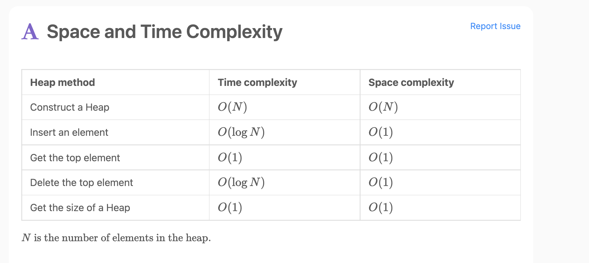
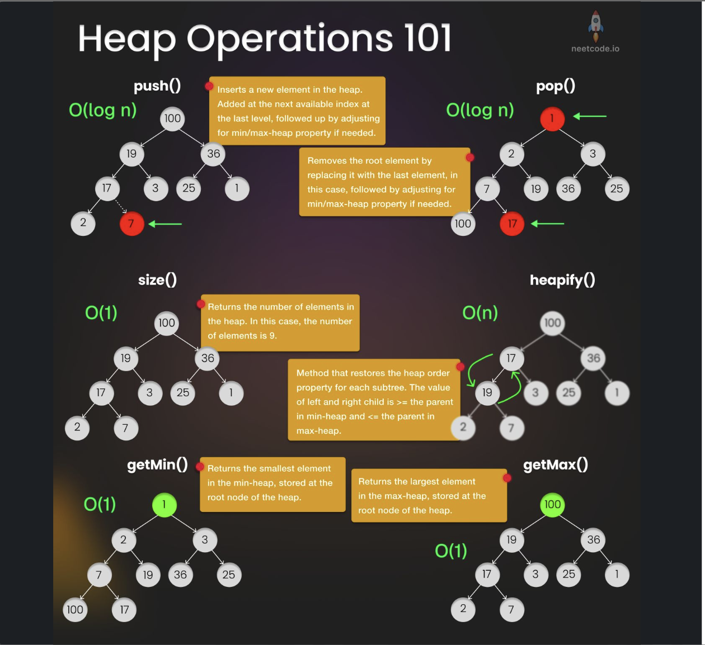
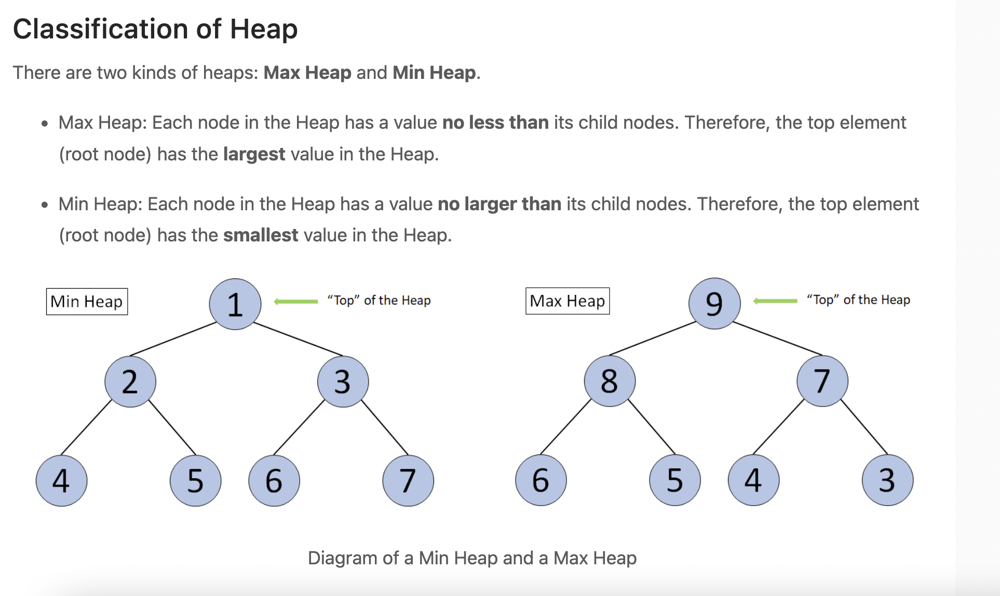

# Heap & Priority Queue

> **Scope** — Both the heap (the structure) and the priority queue (the ADT it implements), in Python and Java. Formerly split across `heap.md` + `priority_queue.md`, which solved the same problems twice.
> **See also** — *deep dives split out of this file*: [heap_advanced.md](./heap_advanced.md) — lazy deletion, sweep-line "alive" heaps, regret greedy, resource-pool allocators, grid best-first search; [heap_examples.md](./heap_examples.md) — the worked LC solution archive, one canonical solution per problem per language; [heap_language_apis.md](./heap_language_apis.md) — the full `heapq` / `PriorityQueue` API reference and the peek-without-popping rules.
> *Neighbouring sheets*: [priority_queue.md](./priority_queue.md) — redirect stub; [monotonic_queue.md](./monotonic_queue.md) — when a deque beats a heap for sliding-window extrema; [Dijkstra.md](./Dijkstra.md) — the canonical PQ algorithm; [streaming_algorithms.md](./streaming_algorithms.md) — top-k over a stream; [sort.md](./sort.md) — heap sort in context.

## LeetCode Problem Lists

- [Heap (Priority Queue)](https://leetcode.com/problem-list/heap-priority-queue/)

## Time Complexity

| Data structure | Search   | Insert   | Delete   | Min/Max  |
| -------------- | -------- | -------- | -------- | -------- |
| Heap           | O(n)     | O(log n) | O(log n) | O(1)     |

> Peek of the top element (min for a min-heap / max for a max-heap) is **O(1)**; finding the *opposite* extreme is **O(n)**. Building a heap from `n` existing items is **O(N)** via heapify — *not* `O(N log N)`. Space is **O(N)**.

## Overview
**Heap** is a complete binary tree that satisfies the heap property, making it ideal for efficient access to the largest or smallest element in a dataset. It's the foundation for priority queues and heap sort algorithms.

<p align="center"></p>

<p align="center"></p>

### Key Properties
- **Complexity**: see the [Time Complexity](#time-complexity) table above
- **Core Idea**: Complete binary tree where parent-child relationship follows heap property
- **When to Use**: Need frequent access to min/max element, priority scheduling, sorting

### Heap Types
- **Min Heap**: Parent ≤ Children (root contains minimum)
- **Max Heap**: Parent ≥ Children (root contains maximum)

<p align="center"></p>

### Priority Queue Relationship
- **Priority Queue**: Abstract data type with priority-based access
- **Heap**: Common implementation of priority queue
- **Key Difference**: Priority Queue is concept, Heap is implementation


### Implementation
- Usually implemented using **Binary Heap** (min-heap or max-heap)
- Can also use balanced BST or Fibonacci heap for advanced operations
- Python: `heapq` module (min-heap by default)
- Java: `PriorityQueue` class (min-heap by default)


### Problem Categories

#### **Pattern 1: Kth Element Problems**
- **Description**: Find the kth largest/smallest element in a dataset
- **Examples**: LC 215, 703, 1492 - Kth Largest Element, Kth Largest in Stream, Kth Factor
- **Pattern**: Use min/max heap of size k, maintain heap property

#### **Pattern 2: Top K Problems**
- **Description**: Find top k elements with highest/lowest frequency or value, or make frequencies unique
- **Examples**:
  - Top K: LC 347, 692, 973 - Top K Frequent Elements, Top K Words, K Closest Points
  - Frequency Uniqueness: LC 1647, 1481 - Make Frequencies Unique, Least Unique After K Removals
- **Pattern**: Count frequency, use heap to maintain top k results or ensure unique frequencies

#### **Pattern 3: Merge Problems**
- **Description**: Merge multiple sorted arrays/lists efficiently
- **Examples**: LC 23, 373, 378 - Merge k Lists, K Smallest Pairs, Kth Smallest in Matrix
- **Pattern**: Use min heap to track current minimum from each source

#### **Pattern 4: Sliding Window Extrema**
- **Description**: Find min/max in sliding windows efficiently
- **Examples**: LC 239, 480, 1438 - Sliding Window Maximum, Sliding Median, Longest Subarray
- **Pattern**: Use heap with lazy deletion or deque for extrema tracking

#### **Pattern 5: Scheduling Problems**
- **Description**: Schedule tasks or events based on priority/timing
- **Examples**: LC 1353, 502, 630, 621, 1834 - Max Events, IPO, Course Schedule III, Task Scheduler, Single-Threaded CPU
- **Pattern**: Use heap to maintain events by start/end time or priority
- **Key Insight (time sweep + deadline heap)**: sort by window **start** so items enter the heap in time order; heap by window **end** so each time slot serves the **most urgent (earliest deadline)** item; lazy-delete expired tops
- **Signature**: *"one item per unit of time"* + *"each item has a validity window / deadline"* → see [heap_examples.md § LC 1353](./heap_examples.md#7-maximum-number-of-events-that-can-be-attended--lc-1353)

#### **Pattern 6: Data Stream Problems**
- **Description**: Handle continuous data stream with min/max queries
- **Examples**: LC 295, 480, 1825 - Find Median, Sliding Median, Finding MK Average
- **Pattern**: Use two heaps (min + max) to maintain balanced structure

#### **Pattern 7: Grid Shortest Path with Range Jumps**
- **Description**: Find shortest path in grid where each cell can jump to a range of cells
- **Examples**: LC 2617 - Minimum Number of Visited Cells in a Grid
- **Pattern**: DP + Per-row/column PQs with lazy deletion
- **Key Insight**: Standard BFS is O(N²) per cell; PQ reduces to O(log N) per cell
- **Similar**: LC 778 (Swim in Rising Water), LC 1631 (Path With Minimum Effort)

#### **Pattern 8: Lazy Deletion (Stale Heap Entries)** ⭐⭐⭐⭐⭐
- **Description**: Values in the heap get **updated/invalidated**, but a binary heap has no
  "decrease-key" / "remove arbitrary element" op — so we push the new value and leave the old one behind
- **Examples**: LC 3092, 2349, 1834, 480, 1825, 2336, 621, 1353, 2406
- **Pattern**: **Heap = candidates (may be stale)** + **HashMap = source of truth** →
  clean the top only *at read time*, only *until the top is valid*
- **Key Insight**: You never search the heap for the stale entry. You only ever check `heap[0]`,
  and a stale entry costs at most one pop over the whole run → amortized O(log n)
- **See**: [heap_advanced.md § Lazy Deletion](./heap_advanced.md#1-lazy-deletion--heap--hashmap-of-truth-) · [heap_examples.md § LC 3092](./heap_examples.md#18-most-frequent-ids--lc-3092)

#### **Pattern 9: Sweep Line + Heap of "Alive" Intervals** ⭐⭐⭐⭐⭐
- **Description**: Sweep a coordinate; the heap holds every interval **currently covering** it
- **Examples**: LC 218 The Skyline Problem, LC 1851 Minimum Interval to Include Each Query
- **Pattern**: heap of `(value, endCoordinate)` → insert on start, **lazy-evict** at the top when `end <= pos`, read `heap[0]`
- **Signature**: *"at every x, what is the max/min over all intervals covering x?"*
- **See**: [heap_advanced.md § Sweep Line](./heap_advanced.md#2-sweep-line--max-heap-of-alive-intervals-)

#### **Pattern 10: Bounded "Regret" Heap (k free passes)** ⭐⭐⭐⭐
- **Description**: k free resources + a budget for everything else, decided **online**
- **Examples**: LC 1642 Furthest Building You Can Reach, LC 1792 Maximum Average Pass Ratio
- **Pattern**: optimistically give every item a free pass; min-heap capped at k; the evicted (smallest) item is paid from the budget
- **Contrast**: LC 630 evicts the **largest** (max-heap replace) — same "commit then regret" idea, opposite comparator
- **See**: [heap_advanced.md § Bounded Regret Heap](./heap_advanced.md#3-bounded-regret-heap--keep-the-k-best-pay-for-the-rest-)

#### **Pattern 11: Two Heaps as Resource Pools** ⭐⭐⭐⭐
- **Description**: Allocator simulation — not every "two heaps" problem is a median problem
- **Examples**: LC 1942 Smallest Unoccupied Chair, LC 1606 Find Servers, LC 1801 Orders in Backlog, LC 2073 Process Tasks Using Servers
- **Pattern**: `free` = min-heap by **resource id**, `busy` = min-heap by **release time** → RELEASE → ASSIGN → OCCUPY
- **See**: [heap_advanced.md § Resource Pools](./heap_advanced.md#5-two-heaps-as-resource-pools-free-pool--busy-pool-)


#### **Pattern 12: Greedy String/Sequence Building with Constraint** ⭐⭐⭐⭐
- **Description**: Build a string/sequence greedily using the most frequent element, but skip it when adding it would violate a constraint (e.g., 3 consecutive same chars). Use a max-heap to always have the current most frequent element ready.
- **Examples**: LC 1405 (Longest Happy String), LC 767 (Reorganize String), LC 621 (Task Scheduler), LC 358 (Rearrange String k Distance Apart)
- **Pattern**: Max-heap ordered by count; on each step try the top element — if it violates the constraint, temporarily use the 2nd element, then put the 1st back
- **Key Trick**: Two-case loop
  1. **Case 1 — constraint violated**: poll `second`, append it, decrement, re-add if > 0; then re-add `first` (it was NOT consumed)
  2. **Case 2 — safe**: append `first`, decrement, re-add if > 0
- **See**: [Java Template 7](#template-7-greedy-string-building-with-consecutive-constraint--lc-1405) — the run-length cap (1 vs 2) is what makes LC 767 and LC 1405 differ

#### **Pattern 13: PQ + Cooldown Queue (k-Distance Scheduling)** ⭐⭐⭐⭐
- **Description**: Greedily pick the most frequent element from a max-heap, then lock it in a cooldown queue for k steps before it can be reused. This is the canonical pattern for "same element must be at least k distance apart" problems.
- **Examples**: LC 358 (Rearrange String k Distance Apart), LC 621 (Task Scheduler), LC 767 (Reorganize String — k=2 special case)
- **Pattern**: Max-heap picks next element; after use, element enters a cooldown queue with `releaseTime = time + k`; when `time == releaseTime`, element is moved back to the heap
- **Key Insight**: PQ alone cannot track "last used position" — the cooldown queue acts as a k-slot delay line that automatically re-enables elements after k steps
- **When to Use**:
  1. Problem says "same element at least k apart" or "cooldown of k"
  2. Need to greedily pick most frequent available element
  3. Elements cycle through available → used → cooling → available
- **Difference from Pattern 7**: Pattern 7 checks a look-back window and swaps elements; Pattern 8 uses an explicit cooldown queue to enforce the distance, which is cleaner for variable k


### References
- [LeetCode Heap Learn Card](https://leetcode.com/explore/learn/card/heap/)
- [GeeksforGeeks Heap Guide](https://www.geeksforgeeks.org/heap-data-structure/)


- [Python heapq documentation](https://docs.python.org/3/library/heapq.html)
- [Java PriorityQueue](https://docs.oracle.com/javase/8/docs/api/java/util/PriorityQueue.html)
- [Priority Queue Implementation Notes](https://docs.python.org/3/library/heapq.html#priority-queue-implementation-notes)


## Templates & Algorithms

### Template Comparison Table

The canonical templates live here in **both languages**. The tier-4 specialisations were split out
into [heap_advanced.md](./heap_advanced.md) — the right-hand column says where each one went.

| Template | Use case | Complexity | Where |
|---|---|---|---|
| **Universal Heap** | general min/max access | O(log N) push/pop | below |
| **Kth Element** | kth largest / smallest | O(N log k) | below |
| **Top K Frequency** | most / least frequent | O(N log k) | below |
| **Merge K Sources** | merge sorted arrays / lists | O(N log k) | below |
| **Two Heap System** | median of a stream | O(log N) per op | below |
| **Window Extrema (2 heaps)** | variable window needing max **and** min | O(N log N) | below |
| **Interval Scheduling** | meeting rooms, one event per day | O(N log N) | below |
| **Greedy + Constraint** | build a string with no k-in-a-row | O(N log Σ) | below |
| **PQ + Cooldown Queue** | k-distance / task scheduling | O(N log Σ) | below |
| **Graph Shortest Path** | Dijkstra with a PQ | O(E log V) | [Dijkstra.md](./Dijkstra.md) |
| **Lazy Deletion** | pushed values change or expire | O(log N) amortised | [heap_advanced.md](./heap_advanced.md#1-lazy-deletion--heap--hashmap-of-truth-) |
| **Sweep + Alive Heap** | max/min over intervals covering x | O(N log N) | [heap_advanced.md](./heap_advanced.md#2-sweep-line--max-heap-of-alive-intervals-) |
| **Bounded Regret Heap** | k free passes + a budget | O(N log k) | [heap_advanced.md](./heap_advanced.md#3-bounded-regret-heap--keep-the-k-best-pay-for-the-rest-) |
| **Greedy with Regret** | undo the worst past decision | O(N log N) | [heap_advanced.md](./heap_advanced.md#4-greedy-with-regret--undo-the-worst-past-decision-) |
| **Resource Pools (2 heaps)** | free-by-id + busy-by-release-time | O(N log N) | [heap_advanced.md](./heap_advanced.md#5-two-heaps-as-resource-pools-free-pool--busy-pool-) |
| **Sort + Fixed-Size Heap** | objective = `sum(A) × max/min(B)` | O(N log N) | [heap_advanced.md](./heap_advanced.md#6-sort-by-one-criterion--fixed-size-heap-on-the-other) |
| **Grid Best-First** | expand the cheapest cell | O(MN log MN) | [heap_advanced.md](./heap_advanced.md#7-min-heap-best-first-search-on-a-grid) |
| **Grid Range Jumps** | each cell jumps to a range | O(MN log(M+N)) | [heap_advanced.md](./heap_advanced.md#8-grid-shortest-path-with-range-jumps) |
| **Frequency Uniqueness** | make all frequencies distinct | O(N + K log K) | [heap_advanced.md](./heap_advanced.md#9-frequency-uniqueness--greedy--heap--hashset) |
| **Heap + Dedup Set** | uniqueness constraint | O(log N) | [heap_advanced.md](./heap_advanced.md#10-heap-with-deduplication) |

### Universal Heap Template
```python
def solve_with_heap(nums, k=None):
    import heapq
    
    # Create heap (min heap by default in Python)
    heap = []
    
    # Build heap approach 1: Insert elements one by one
    for num in nums:
        heapq.heappush(heap, num)
    
    # Build heap approach 2: Heapify existing array
    # heapq.heapify(nums)  # O(N) time
    
    # Access min element (don't remove): heap[0]
    # Remove min element: heapq.heappop(heap)
    # Insert element: heapq.heappush(heap, value)
    
    # For max heap, use negative values
    # max_heap = [-x for x in nums]
    # heapq.heapify(max_heap)
    # max_val = -max_heap[0]  # Get max without removing
    # max_val = -heapq.heappop(max_heap)  # Remove and get max
    
    return heap
```

```java
// Java Universal Template
public class HeapSolution {
    public void solveWithHeap(int[] nums, int k) {
        // Min Heap
        PriorityQueue<Integer> minHeap = new PriorityQueue<>();
        
        // Max Heap
        PriorityQueue<Integer> maxHeap = new PriorityQueue<>((a, b) -> Integer.compare(b, a));
        
        // Add elements
        for (int num : nums) {
            minHeap.offer(num);
        }
        
        // Access min: minHeap.peek()
        // Remove min: minHeap.poll()
        // Add element: minHeap.offer(value)
    }
}
```


### Specific Pattern Templates

#### **1. Kth Element Template**

**💡 Key Insight:**
- **`kth smallest element` = biggest element from a Max PQ of size k**
  - Use **max heap** of size k to find kth smallest
  - The root (peek) of the max heap is the kth smallest element
  - Why? Keep only the k smallest elements; the largest among them is the kth smallest overall

- **`kth largest element` = smallest element from a Min PQ of size k**
  - Use **min heap** of size k to find kth largest
  - The root (peek) of the min heap is the kth largest element
  - Why? Keep only the k largest elements; the smallest among them is the kth largest overall

```python
def find_kth_largest(nums, k):
    import heapq

    # Method 1: Min heap of size k
    heap = []
    for num in nums:
        if len(heap) < k:
            heapq.heappush(heap, num)
        elif num > heap[0]:
            heapq.heapreplace(heap, num)

    return heap[0]  # kth largest

def find_kth_smallest(nums, k):
    import heapq

    # Method 1: Max heap of size k (use negative values)
    heap = []
    for num in nums:
        if len(heap) < k:
            heapq.heappush(heap, -num)
        elif num < -heap[0]:
            heapq.heapreplace(heap, -num)

    return -heap[0]  # kth smallest
```

**Variations of this template** (same size-k invariant, only the *comparator* changes):

| LC | Problem | The twist |
|----|---------|-----------|
| 1985 | Find the Kth Largest Integer in the Array | Elements are **numeric strings** → default lexicographic order is wrong. Compare by `(len, string)`: longer string = bigger number, equal length falls back to lexicographic. Min-heap of size k, answer = `heap[0]`. |
| 1337 | The K Weakest Rows in a Matrix | Push the tuple `(soldierCount, rowIndex)` so ties break by row index; keep a max-heap of size k, then read out. |

```python
# python
# LC 1985 - Find the Kth Largest Integer in the Array
# time = O(N log k), space = O(k)
# IDEA: kth largest -> min-heap of size k; key = (len, s) makes string order == numeric order
import heapq

def kthLargestNumber(nums, k):
    heap = []
    for s in nums:
        heapq.heappush(heap, (len(s), s))
        if len(heap) > k:
            heapq.heappop(heap)
    return heap[0][1]
```

```java
// java
// LC 1985 - Find the Kth Largest Integer in the Array
// time = O(N log k), space = O(k)
// IDEA: min-heap of size k; comparator = length first, then lexicographic
public String kthLargestNumber(String[] nums, int k) {
    PriorityQueue<String> minHeap = new PriorityQueue<>(
        (a, b) -> a.length() != b.length() ? Integer.compare(a.length(), b.length()) : a.compareTo(b));

    for (String s : nums) {
        minHeap.offer(s);
        if (minHeap.size() > k) minHeap.poll();
    }
    return minHeap.peek();
}
```

#### **2. Top K Frequency Template**
```python
def top_k_frequent(nums, k):
    from collections import Counter
    import heapq
    
    # Count frequencies
    count = Counter(nums)
    
    # Method 1: Min heap approach
    heap = []
    for num, freq in count.items():
        heapq.heappush(heap, (freq, num))
        if len(heap) > k:
            heapq.heappop(heap)
    
    return [item[1] for item in heap]
    
    # Method 2: Max heap approach
    # heap = [(-freq, num) for num, freq in count.items()]
    # heapq.heapify(heap)
    # return [heapq.heappop(heap)[1] for _ in range(k)]
```

**Variations of this template** (count first, then let a heap order the counts):

| LC | Problem | The twist |
|----|---------|-----------|
| 451 | Sort Characters By Frequency | Same `Counter` + **max heap**, but you *emit* `char * freq` instead of just the key. Bucket sort is the O(N) alternative. |
| 1338 | Reduce Array Size to The Half | Max heap of counts; keep popping and accumulating until `removed >= n/2`; answer = number of pops. Greedy = always delete the most frequent value. |
| 1405 | Longest Happy String | Max heap on **remaining count** + a "last used letter" guard — same shape as LC 767 Reorganize String, but the guard allows the same letter **twice** in a row (`aab` is legal, `aaa` is not). |
| 1054 | Distant Barcodes | LC 767 with distance 2: max heap on remaining count, fill even indices first then odd indices. |

#### **3. Merge K Sources Template**
```python
def merge_k_sorted_arrays(arrays):
    import heapq
    
    heap = []
    result = []
    
    # Initialize heap with first element from each array
    for i, arr in enumerate(arrays):
        if arr:  # Check if array is not empty
            heapq.heappush(heap, (arr[0], i, 0))
    
    while heap:
        val, array_idx, element_idx = heapq.heappop(heap)
        result.append(val)
        
        # Add next element from same array
        if element_idx + 1 < len(arrays[array_idx]):
            next_val = arrays[array_idx][element_idx + 1]
            heapq.heappush(heap, (next_val, array_idx, element_idx + 1))
    
    return result
```

**Variants** — merging *nested* sources (LC 1439) or a *virtual* grid (LC 373 / 378), plus the
LC 632 "smallest covering range" twist: [heap_advanced.md § K-Way Merge Variants](./heap_advanced.md#11-k-way-merge-variants).

#### **4. Two Heap System Template (Median)**
```python
class MedianFinder:
    def __init__(self):
        import heapq
        self.small = []  # max heap (use negative values)
        self.large = []  # min heap
    
    def addNum(self, num):
        import heapq
        
        # Add to appropriate heap
        if len(self.small) == len(self.large):
            heapq.heappush(self.large, -heapq.heappushpop(self.small, -num))
        else:
            heapq.heappush(self.small, -heapq.heappushpop(self.large, num))
    
    def findMedian(self):
        if len(self.small) == len(self.large):
            return (self.large[0] - self.small[0]) / 2.0
        else:
            return float(self.large[0])
```

#### **5. Sliding Window Extrema — Two Heaps + Index Expiry** ⭐⭐⭐⭐

**Core Idea**

A deque gives O(1) sliding-window max, but it only tracks **one** extreme and only for a
**fixed-size** window. When the window is **variable-size** or you need **max and min at the same
time**, use two heaps and expire entries by **index**:

```text
maxHeap = (-value, index)     minHeap = (value, index)
stale  <=>  index < left      (the element has fallen out of the window)
```

Nothing is ever removed when `left` advances — entries are dropped only when they reach the top.

**Worked example — LC 1438 Longest Continuous Subarray With Absolute Diff ≤ Limit**

The window is valid iff `max(window) - min(window) <= limit`. Keep both heaps; when the window is
invalid, jump `left` **past the older of the two offending extremes** (that is the only way to
destroy the violating pair), then lazy-purge both heaps.

```python
# python
# LC 1438 - Longest Continuous Subarray With Absolute Diff Less Than or Equal to Limit
# time = O(N log N), space = O(N)
# IDEA: two heaps hold window max/min; shrink past the older extreme; purge stale indices lazily
import heapq

class Solution(object):
    def longestSubarray(self, nums, limit):
        max_h = []   # max-heap: (-val, idx)
        min_h = []   # min-heap: ( val, idx)
        left = 0
        res = 0

        for i, v in enumerate(nums):
            heapq.heappush(max_h, (-v, i))
            heapq.heappush(min_h, (v, i))

            # window invalid -> must drop at least one of the two extremes
            while -max_h[0][0] - min_h[0][0] > limit:
                # NOTE !!! move left PAST the earlier of the two extreme indices
                left = min(max_h[0][1], min_h[0][1]) + 1
                # lazy delete: anything left of the window is stale
                while max_h[0][1] < left:
                    heapq.heappop(max_h)
                while min_h[0][1] < left:
                    heapq.heappop(min_h)

            res = max(res, i - left + 1)

        return res
```

```java
// java
// LC 1438 - Longest Continuous Subarray With Absolute Diff Less Than or Equal to Limit
// time = O(N log N), space = O(N)
// IDEA: max-heap + min-heap of {val, idx}; shrink past older extreme; lazy-purge stale indices
public int longestSubarray(int[] nums, int limit) {
    PriorityQueue<int[]> maxH = new PriorityQueue<>((a, b) -> Integer.compare(b[0], a[0]));  // {val, idx}
    PriorityQueue<int[]> minH = new PriorityQueue<>((a, b) -> Integer.compare(a[0], b[0]));

    int left = 0, res = 0;

    for (int i = 0; i < nums.length; i++) {
        maxH.offer(new int[]{nums[i], i});
        minH.offer(new int[]{nums[i], i});

        while (maxH.peek()[0] - minH.peek()[0] > limit) {
            left = Math.min(maxH.peek()[1], minH.peek()[1]) + 1;
            while (maxH.peek()[1] < left) maxH.poll();
            while (minH.peek()[1] < left) minH.poll();
        }

        res = Math.max(res, i - left + 1);
    }
    return res;
}
```

> **Heap vs monotonic deque**: LC 1438 also has an O(N) two-deque solution. Use the heap version
> when the eviction rule is **not** "oldest first" (e.g. you evict by value or by an arbitrary
> predicate) — a monotonic deque cannot express that.

**Variations of this template** (same "max-heap + expire by index/coordinate" shape):

| LC | Problem | The twist |
|----|---------|-----------|
| 1696 | Jump Game VI | `dp[i] = nums[i] + max(dp[j])` for `i-k <= j < i`. Max-heap of `(dp[j], j)`; before reading, pop while `j < i-k`. The heap holds **DP values**, not raw input. |
| 1499 | Max Value of Equation | Rewrite `y_i + y_j + |x_i - x_j|` (with `x_j - x_i <= k`, `i < j`) as `(y_i - x_i) + (y_j + x_j)`. Max-heap of `(y_i - x_i, x_i)`; pop while `x_j - x_top > k`; expiry is by **coordinate**, not index. |

### Java Template Library (`PriorityQueue`)

> The 5 templates above are Python-first. The 8 below are the same problem space written
> against Java's `PriorityQueue`. They were previously a separate `priority_queue.md`; the
> table pairs each Java template with its Python counterpart so you can read either side.

| Java template (below) | Python counterpart (above) | Anchor problem |
|---|---|---|
| Template 1: Top K Elements | 1. Kth Element Template | LC 215 |
| Template 2: K-Way Merge | 3. Merge K Sources Template | LC 23 |
| Template 3: Two Heaps (Median) | 4. Two Heap System Template | LC 295 |
| Template 4: Interval Scheduling | *(no Python counterpart here — see the LC 1353 pointer below)* | LC 253 |
| Template 5: Graph Shortest Path | — see [Dijkstra.md](./Dijkstra.md) | LC 743 |
| Template 6: Custom Priority | 2. Top K Frequency Template | LC 347 |
| Template 7: Greedy String Building | *(no Python counterpart)* | LC 1405 |
| Template 8: PQ + Cooldown Queue | *(no Python counterpart)* | LC 358 |

#### Java Template Comparison Table
| Template Type | Use Case | Heap Type | Complexity | When to Use |
|---------------|----------|-----------|------------|-------------|
| **Top K Elements** | Find K largest/smallest | Min/Max heap | O(n log k) | Fixed K selection |
| **K-Way Merge** | Merge sorted lists | Min heap | O(n log k) | Multiple sorted sources |
| **Two Heaps** | Find median | Min + Max heap | O(log n) | Stream median/percentile |
| **Interval Scheduling** | Process intervals | Min heap | O(n log n) | Meeting rooms, events |
| **Graph Shortest Path** | Dijkstra's | Min heap | O(E log V) | Weighted graphs |
| **Custom Priority** | Complex ordering | Custom comparator | O(log n) | Multi-criteria sorting |
| **Greedy + Constraint** | Build string avoiding consecutive repeats | Max heap | O(n log k) | Reorganize/happy string |
| **PQ + Cooldown Queue** | k-distance apart scheduling | Max heap + Queue | O(n log k) | Rearrange k-dist, task scheduler |

### Template 1: Top K Elements Pattern — LC 215
```python
# Python - Find K largest elements
def topKElements(nums, k):
    import heapq
    
    # Min heap of size k for k largest
    min_heap = []
    
    for num in nums:
        heapq.heappush(min_heap, num)
        if len(min_heap) > k:
            heapq.heappop(min_heap)
    
    return min_heap  # Contains k largest elements

# With custom key for frequency
def topKFrequent(nums, k):
    from collections import Counter
    import heapq
    
    count = Counter(nums)
    # Use negative count for max heap effect
    return heapq.nlargest(k, count.keys(), key=count.get)
```

```java
// Java - Top K elements with frequency
public int[] topKFrequent(int[] nums, int k) {
    Map<Integer, Integer> map = new HashMap<>();
    for (int n : nums) {
        map.put(n, map.getOrDefault(n, 0) + 1);
    }
    
    // Min heap based on frequency
    PriorityQueue<Integer> pq = new PriorityQueue<>(
        (a, b) -> Integer.compare(map.get(a), map.get(b))
    );
    
    for (int key : map.keySet()) {
        pq.add(key);
        if (pq.size() > k) {
            pq.poll();
        }
    }
    
    int[] result = new int[k];
    for (int i = k - 1; i >= 0; i--) {
        result[i] = pq.poll();
    }
    return result;
}
```

### Template 2: K-Way Merge Pattern — LC 23
```python
# Python - Merge K sorted lists
def mergeKSortedLists(lists):
    import heapq
    
    min_heap = []
    
    # Initialize with first element from each list
    for i, lst in enumerate(lists):
        if lst:
            heapq.heappush(min_heap, (lst[0], i, 0))
    
    result = []
    while min_heap:
        val, list_idx, elem_idx = heapq.heappop(min_heap)
        result.append(val)
        
        # Add next element from same list
        if elem_idx + 1 < len(lists[list_idx]):
            next_val = lists[list_idx][elem_idx + 1]
            heapq.heappush(min_heap, (next_val, list_idx, elem_idx + 1))
    
    return result
```

```java
// Java - Merge K sorted arrays
public int[] mergeKSortedArrays(int[][] arrays) {
    PriorityQueue<int[]> pq = new PriorityQueue<>(
        (a, b) -> Integer.compare(a[0], b[0])  // Compare values
    );
    
    int totalSize = 0;
    // Initialize PQ with first element from each array
    for (int i = 0; i < arrays.length; i++) {
        if (arrays[i].length > 0) {
            pq.offer(new int[]{arrays[i][0], i, 0});
            totalSize += arrays[i].length;
        }
    }
    
    int[] result = new int[totalSize];
    int idx = 0;
    
    while (!pq.isEmpty()) {
        int[] curr = pq.poll();
        result[idx++] = curr[0];
        
        int arrIdx = curr[1];
        int elemIdx = curr[2];
        
        if (elemIdx + 1 < arrays[arrIdx].length) {
            pq.offer(new int[]{
                arrays[arrIdx][elemIdx + 1], 
                arrIdx, 
                elemIdx + 1
            });
        }
    }
    
    return result;
}
```

**Variants of this skeleton** (LC 632, 355, 373, 378, 1439):
[heap_advanced.md § K-Way Merge Variants](./heap_advanced.md#11-k-way-merge-variants).

### Template 3: Two Heaps Pattern (Median Finding) — LC 295

> Python side: [4. Two Heap System Template](#4-two-heap-system-template-median) above — the same
> two-heap invariant, written with `heappushpop` instead of an explicit rebalance.

```java
// Java - Two heaps for median
class MedianFinder {
    private PriorityQueue<Integer> small;  // Max heap
    private PriorityQueue<Integer> large;  // Min heap
    
    public MedianFinder() {
        small = new PriorityQueue<>(Collections.reverseOrder());
        large = new PriorityQueue<>();
    }
    
    public void addNum(int num) {
        small.offer(num);
        
        // Balance property
        if (!small.isEmpty() && !large.isEmpty() && 
            small.peek() > large.peek()) {
            large.offer(small.poll());
        }
        
        // Size property
        if (small.size() > large.size() + 1) {
            large.offer(small.poll());
        }
        if (large.size() > small.size() + 1) {
            small.offer(large.poll());
        }
    }
    
    public double findMedian() {
        if (small.size() > large.size()) {
            return small.peek();
        }
        if (large.size() > small.size()) {
            return large.peek();
        }
        return (small.peek() + large.peek()) / 2.0;
    }
}
```

### Template 4: Interval Scheduling Pattern — LC 253
```python
# Python - Meeting rooms (minimum rooms needed)
def minMeetingRooms(intervals):
    import heapq
    
    if not intervals:
        return 0
    
    # Sort by start time
    intervals.sort(key=lambda x: x[0])
    
    # Min heap to track end times
    heap = []
    heapq.heappush(heap, intervals[0][1])
    
    for i in range(1, len(intervals)):
        # If current meeting starts after earliest end
        if intervals[i][0] >= heap[0]:
            heapq.heappop(heap)
        
        # Add current meeting end time
        heapq.heappush(heap, intervals[i][1])
    
    return len(heap)
```

```java
// Java - Interval scheduling
public int minMeetingRooms(int[][] intervals) {
    if (intervals.length == 0) return 0;
    
    // Sort by start time
    Arrays.sort(intervals, (a, b) -> Integer.compare(a[0], b[0]));
    
    // Min heap for end times
    PriorityQueue<Integer> pq = new PriorityQueue<>();
    pq.offer(intervals[0][1]);
    
    for (int i = 1; i < intervals.length; i++) {
        // Room becomes free
        if (intervals[i][0] >= pq.peek()) {
            pq.poll();
        }
        pq.offer(intervals[i][1]);
    }
    
    return pq.size();
}
```

**Variation: Maximum Number of Events That Can Be Attended (LC 1353)** — twist: the heap holds **end days of currently-open events** and you sweep *day by day* (not interval by interval), attending the event that **ends soonest** each day. LC 253 counts concurrent intervals; LC 1353 *picks one per day* greedily.

```java
// java
// LC 1353 - Maximum Number of Events That Can Be Attended
// IDEA: sort by start day; each day push all events that opened, drop expired ones,
//       then attend the one with the earliest end day (min-heap)
// time = O(n log n), space = O(n)
public int maxEvents(int[][] events) {
    Arrays.sort(events, (a, b) -> Integer.compare(a[0], b[0]));
    PriorityQueue<Integer> pq = new PriorityQueue<>();   // end days of open events
    int i = 0, n = events.length, res = 0, day = 0;

    while (i < n || !pq.isEmpty()) {
        // idle -> jump to the next start day, otherwise advance one day
        day = pq.isEmpty() ? events[i][0] : day + 1;

        while (i < n && events[i][0] <= day) pq.offer(events[i++][1]);   // now open
        while (!pq.isEmpty() && pq.peek() < day) pq.poll();              // expired

        if (!pq.isEmpty()) { pq.poll(); res++; }   // attend earliest-ending event
    }
    return res;
}
```

Python side of LC 1353, with the day-jumping vs scan-every-day trade-off written out:
[heap_examples.md § LC 1353](./heap_examples.md#7-maximum-number-of-events-that-can-be-attended--lc-1353).

### Template 5: Graph Shortest Path (Dijkstra) — LC 743

Owned by [Dijkstra.md](./Dijkstra.md). The PQ is just `(distance, node)` guarded by a
lazy-deletion `if d > dist[u]: continue`; nothing heap-specific is added by repeating it here.

### Template 6: Custom Priority Pattern
```python
# Python - Custom priority with multiple criteria
class Task:
    def __init__(self, name, priority, deadline):
        self.name = name
        self.priority = priority
        self.deadline = deadline
    
    def __lt__(self, other):
        # Higher priority first, then earlier deadline
        if self.priority != other.priority:
            return self.priority > other.priority
        return self.deadline < other.deadline

def processTasks(tasks):
    import heapq
    
    heap = []
    for task in tasks:
        heapq.heappush(heap, task)
    
    result = []
    while heap:
        task = heapq.heappop(heap)
        result.append(task.name)
    
    return result
```

```java
// Java - Custom comparator for complex ordering
class Task {
    String name;
    int priority;
    int deadline;
    
    Task(String name, int priority, int deadline) {
        this.name = name;
        this.priority = priority;
        this.deadline = deadline;
    }
}

public List<String> processTasks(List<Task> tasks) {
    PriorityQueue<Task> pq = new PriorityQueue<>((a, b) -> {
        // Higher priority first
        if (a.priority != b.priority) {
            return Integer.compare(b.priority, a.priority);
        }
        // Earlier deadline first
        return Integer.compare(a.deadline, b.deadline);
    });
    
    for (Task task : tasks) {
        pq.offer(task);
    }
    
    List<String> result = new ArrayList<>();
    while (!pq.isEmpty()) {
        result.add(pq.poll().name);
    }
    
    return result;
}
```

### Template 7: Greedy String Building with Consecutive Constraint — LC 1405
```java
// Java - Longest Happy String (LC 1405) / Reorganize String (LC 767)
// IDEA: Max-heap by count; two-case loop:
//   Case 1: top char would create 3 consecutive → use 2nd, put 1st back
//   Case 2: safe → use top char directly
// time = O((a+b+c) * log(3)) = O(n), space = O(1) heap size bounded by alphabet

class ValCnt {
    char val;
    int cnt;
    ValCnt(char val, int cnt) { this.val = val; this.cnt = cnt; }
}

public String longestDiverseString(int a, int b, int c) {
    PriorityQueue<ValCnt> pq = new PriorityQueue<>((x, y) -> Integer.compare(y.cnt, x.cnt));
    if (a > 0) pq.add(new ValCnt('a', a));
    if (b > 0) pq.add(new ValCnt('b', b));
    if (c > 0) pq.add(new ValCnt('c', c));

    StringBuilder sb = new StringBuilder();

    while (!pq.isEmpty()) {
        ValCnt first = pq.poll();
        int len = sb.length();

        // Case 1: adding `first` would create 3 consecutive → use second instead
        if (len >= 2
                && sb.charAt(len - 1) == first.val
                && sb.charAt(len - 2) == first.val) {

            if (pq.isEmpty()) break;          // no alternative → stop

            ValCnt second = pq.poll();        // use 2nd most frequent
            sb.append(second.val);
            second.cnt--;

            if (second.cnt > 0) pq.add(second);
            pq.add(first);                    // first was NOT used, put it back

        // Case 2: safe to use the most frequent character
        } else {
            sb.append(first.val);
            first.cnt--;
            if (first.cnt > 0) pq.add(first);
        }
    }

    return sb.toString();
}
```

**Key Observations:**
- Always greedily pick the most frequent (max-heap ensures this).
- When the constraint is about to be violated, **temporarily skip** the top element and use the next — then **put the top back unchanged**.
- `first` is only consumed in Case 2; in Case 1 it is re-inserted untouched.
- Works for any "at most K consecutive" constraint by changing the look-back window check.

**Variant: Reorganize String (LC 767) — at most 1 consecutive**
```java
// Only Case 1 check changes: len >= 1 && sb.charAt(len-1) == first.val
// Everything else is identical to the template above.
```

### Template 8: PQ + Cooldown Queue (k-Distance Scheduling) — LC 358
```java
// Java - Rearrange String k Distance Apart (LC 358)
// IDEA: Max-heap picks most frequent available char;
//       cooldown queue locks used chars for k steps.
//
// Flow: PQ → poll → append → cooldown.offer([char, releaseTime])
//       when time == releaseTime → move back to PQ
//
// time = O(n log 26) = O(n), space = O(26) = O(1)

public String rearrangeString(String s, int k) {
    if (k <= 1) return s;

    int[] freq = new int[26];
    for (char c : s.toCharArray()) {
        freq[c - 'a']++;
    }

    // Max-heap ordered by remaining frequency
    PriorityQueue<Integer> pq = new PriorityQueue<>((a, b) -> Integer.compare(freq[b], freq[a]));
    for (int i = 0; i < 26; i++) {
        if (freq[i] > 0) pq.offer(i);
    }

    // Cooldown queue: [charIndex, remainingCount]
    // Size reaches k → front element has cooled for k steps → re-enable
    Queue<int[]> cooldown = new LinkedList<>();
    StringBuilder res = new StringBuilder();

    while (!pq.isEmpty()) {
        int idx = pq.poll();
        res.append((char) ('a' + idx));
        freq[idx]--;

        // Enter cooldown with current remaining count
        cooldown.offer(new int[]{idx, freq[idx]});

        // Release from cooldown after k steps
        if (cooldown.size() == k) {
            int[] ready = cooldown.poll();
            if (ready[1] > 0) {
                pq.offer(ready[0]);  // re-add to heap
            }
        }
    }

    return res.length() == s.length() ? res.toString() : "";
}
```

**Key Observations:**
- The cooldown queue acts as a **fixed-size delay line of length k**. When its size reaches k, the oldest entry has waited exactly k steps and is ready.
- If `pq` is empty but `cooldown` still has entries → impossible to place anything → return `""`.
- **Alternative cooldown approach**: store `[char, releaseTime]` and check `cooldown.peek()[1] == time` instead of checking queue size. Both are equivalent.
- This pattern generalizes: LC 621 (Task Scheduler) uses the same idea but counts idle slots; LC 767 is k=2 special case.

**Comparison: Cooldown Queue vs Skip-and-Swap (Template 7)**
| Aspect | Cooldown Queue (Template 8) | Skip-and-Swap (Template 7) |
|--------|----------------------------|---------------------------|
| Best for | Variable k, large k | Small k (k=2 or k=3) |
| Mechanism | Explicit queue delays re-entry | Look-back window + swap |
| Impossible detection | `pq.isEmpty()` while cooldown non-empty | N/A (stops when no option) |
| Cleaner for | LC 358, LC 621 | LC 1405, LC 767 |
## Language APIs

Full reference — every `heapq` call with its output, the peek rules, the partial-order traps:
[heap_language_apis.md](./heap_language_apis.md).

| What you need | Python `heapq` | Java `PriorityQueue` |
|---|---|---|
| Min-heap | `h = []` | `new PriorityQueue<>()` |
| Max-heap | push negated keys: `heappush(h, -v)` | `new PriorityQueue<>(Collections.reverseOrder())` |
| Build from a list — **O(N)**, not O(N log N) | `heapq.heapify(lst)` | `new PriorityQueue<>(collection)` |
| Push | `heapq.heappush(h, v)` | `pq.offer(v)` |
| Pop top | `heapq.heappop(h)` | `pq.poll()` |
| **Peek** top — O(1) | `h[0]` — there is **no `peek()`** | `pq.peek()` |
| Pop then push (one sift) | `heapq.heapreplace(h, v)` | `pq.poll(); pq.offer(v);` |
| Push then pop (one sift) | `heapq.heappushpop(h, v)` | `pq.offer(v); pq.poll();` |
| Top k largest / smallest | `heapq.nlargest(k, it)` / `nsmallest` | size-k min-/max-heap, then drain |
| Empty check | `if h:` | `pq.isEmpty()` |
| Custom order | tuple keys, or `__lt__` on the class | comparator lambda |

**Three rules that prevent most heap bugs**

1. **Only index `0` is meaningful.** `h[1]`, `h[-1]`, and iterating a Java `PriorityQueue` all give
   *partial* order, not sorted order.
2. **Comparators use `Integer.compare(a, b)` / `Long.compare(a, b)`, never `a - b`** — subtraction
   overflows on large or negative values.
3. **Guard the empty case.** `h[0]` raises `IndexError`; Java's `peek()` returns `null` while
   `element()` throws. In a `while` condition put the emptiness test **first** so it short-circuits.

```python
# python
# the size-k idiom, written once
import heapq

def k_largest(nums, k):                 # time = O(N log k), space = O(k)
    h = []
    for v in nums:
        if len(h) < k:
            heapq.heappush(h, v)
        elif v > h[0]:                  # peek, then replace in one sift
            heapq.heapreplace(h, v)
    return h                            # h[0] == the kth largest

def k_smallest(nums, k):                # max-heap = negate on the way in and out
    h = []
    for v in nums:
        heapq.heappush(h, -v)
        if len(h) > k:
            heapq.heappop(h)
    return [-x for x in h]              # -h[0] == the kth smallest
```

## Summary & Quick Reference

### Decision Table — Which Heap Pattern?

Read top to bottom; the first row that matches is the pattern.

| If the problem says… | Reach for | Heap shape | Classic LC |
|---|---|---|---|
| "kth largest" / "kth smallest" | Kth Element | size-k **min**-heap for kth largest; size-k **max**-heap for kth smallest | 215, 703, 378, 1492, 1985, 1337 |
| "top k frequent" / "k closest" | Top K Frequency | `Counter` → size-k heap on the count / distance | 347, 692, 973, 658, 451, 1338, 1054 |
| "merge k sorted …" / a sorted grid | Merge K Sources | min-heap of `(value, sourceIdx, elemIdx)` | 23, 373, 378, 632, 786, 1439 |
| "median" / "balanced halves" of a stream | Two Heap System | max-heap of the small half + min-heap of the large half, sizes within 1 | 295, 480, 1825 |
| variable-size window needing **max and min** | Window Extrema (2 heaps) | two heaps of `(value, index)`, stale iff `index < left` | 1438, 1696, 1499 |
| "minimum rooms / groups" — count overlaps | Interval Scheduling | sort by start, min-heap of end times, heap size = answer | 253, 2406, 1094 |
| "one item per unit of time" + a deadline | Interval Scheduling (day sweep) | sort by start, min-heap of **end** days, attend the earliest deadline | 1353, 1834, 1705 |
| "no k identical in a row" / "k apart" | Greedy + Constraint, or PQ + Cooldown Queue | max-heap on remaining count (+ a k-slot delay line) | 1405, 767, 621, 358, 1054 |
| weighted shortest path on a graph | Dijkstra — [Dijkstra.md](./Dijkstra.md) | min-heap of `(distance, node)` | 743, 787, 1514, 1631 |
| a pushed value later **changes or expires** | Lazy Deletion — [heap_advanced.md](./heap_advanced.md#1-lazy-deletion--heap--hashmap-of-truth-) | heap of candidates + hashmap of truth; clean the **top** at read time | 3092, 2349, 2034, 480, 1825, 239 |
| "at every x, the max over all intervals covering x" | Sweep + Alive Heap — [heap_advanced.md](./heap_advanced.md#2-sweep-line--max-heap-of-alive-intervals-) | max-heap of `(value, end)`, evict when `end <= x` | 218, 1851 |
| "k ladders / k free upgrades" + a budget | Bounded Regret Heap — [heap_advanced.md](./heap_advanced.md#3-bounded-regret-heap--keep-the-k-best-pay-for-the-rest-) | min-heap capped at k; the evicted smallest is paid for | 1642, 1792 |
| you only discover you overcommitted **later** | Greedy with Regret — [heap_advanced.md](./heap_advanced.md#4-greedy-with-regret--undo-the-worst-past-decision-) | take everything, then `poll()` the worst decision | 871, 630, 502 |
| "smallest free chair / server / seat" | Resource Pools — [heap_advanced.md](./heap_advanced.md#5-two-heaps-as-resource-pools-free-pool--busy-pool-) | free-by-id heap + busy-by-release-time heap | 1942, 1606, 1801, 2073, 2102 |
| objective is `sum(A) × max/min(B)` | Sort + Fixed-Size Heap — [heap_advanced.md](./heap_advanced.md#6-sort-by-one-criterion--fixed-size-heap-on-the-other) | sort by B, size-k heap over A | 857, 1383 |
| a grid where cost is minimax or accumulated | Grid Best-First — [heap_advanced.md](./heap_advanced.md#7-min-heap-best-first-search-on-a-grid) | min-heap seeded from a boundary, expand the cheapest | 407, 778, 1631, 1368, 675 |
| each grid cell jumps to a **range** of cells | Grid Range Jumps — [heap_advanced.md](./heap_advanced.md#8-grid-shortest-path-with-range-jumps) | one PQ per row + one per column, lazy pop | 2617 |
| "make all frequencies unique" | Frequency Uniqueness — [heap_advanced.md](./heap_advanced.md#9-frequency-uniqueness--greedy--heap--hashset) | max-heap decrement, or a used-frequency set | 1647, 1481 |
| **fixed**-size window, only the max needed | *not a heap* — [monotonic_queue.md](./monotonic_queue.md) | monotonic deque, O(1) amortised | 239, 1425 |
| a one-off kth element, no updates | *not a heap* — quickselect, O(N) average | — | 215 |

### Complexity Quick Reference

| Operation | Binary heap | Sorted array | Balanced BST |
|---|---|---|---|
| Build from n items | **O(n)** (heapify) | O(n log n) | O(n log n) |
| Insert | O(log n) | O(n) | O(log n) |
| Delete min/max | O(log n) | O(1) | O(log n) |
| Peek min/max | O(1) | O(1) | O(log n) |
| Search / delete arbitrary | O(n) | O(log n) / O(n) | O(log n) |
| Merge two structures | O(n + m) | O(n + m) | O(n + m) |
| Space | O(n) | O(n) | O(n) |

Consequences worth stating out loud in an interview:

- **No decrease-key, no remove-arbitrary.** Everything in
  [heap_advanced.md](./heap_advanced.md) exists to work around that.
- A **size-k** heap turns `O(N log N)` into `O(N log k)` and `O(N)` space into `O(k)`.
- The *opposite* extreme is O(n): a min-heap tells you nothing cheap about its maximum.

### Common Patterns & Tricks

#### **Max Heap in Python (Using Negation)**
```python
import heapq

# Create max heap by negating values
max_heap = [-x for x in nums]
heapq.heapify(max_heap)

# Insert into max heap
heapq.heappush(max_heap, -val)

# Get max value (remember to negate back)
max_val = -max_heap[0]  # peek
max_val = -heapq.heappop(max_heap)  # pop
```

#### **Heap with Custom Objects**
```python
# Method 1: Using tuples (automatic comparison)
heap = []
heapq.heappush(heap, (priority, data))

# Method 2: Using custom class with __lt__
class Task:
    def __init__(self, priority, data):
        self.priority = priority
        self.data = data

    def __lt__(self, other):
        return self.priority < other.priority

heap = []
heapq.heappush(heap, Task(1, "high priority"))
```

#### **Tie-Breaking**
```python
# python
# a heap of (key, payload) compares the payload when keys tie -> unorderable types crash.
# push a monotone counter as the second element so the comparison never reaches the payload.
import heapq, itertools

counter = itertools.count()
heapq.heappush(pq, (priority, next(counter), payload))   # FIFO among equal priorities
```

### Common Mistakes & Tips

**🚫 Common Mistakes**

1. **Wrong heap direction.** Min-heap of size k for "kth **largest**"; max-heap of size k for
   "kth **smallest**". Say the invariant out loud before coding: *"the heap holds the k largest
   seen so far, so its top is the answer."*
2. **Forgetting to negate back** when faking a max-heap in Python — negate on push *and* on read.
3. **Letting the heap grow unbounded** in a kth-element problem: pop as soon as `len(h) > k`, or
   you have paid `O(N log N)` for nothing.
4. **Unbalanced two-heap system.** Re-establish `|len(small) - len(large)| <= 1` after *every*
   insertion, not just when the median is read.
5. **`a - b` comparators in Java** — overflows. Use `Integer.compare` / `Long.compare`.
6. **Cleaning stale entries at write time.** Lazy deletion cleans the **top**, at **read** time,
   with a `while` (several stale entries can stack up) and an emptiness guard.
7. **Reading `h[1]` / `h[-1]`** expecting the 2nd smallest or the largest. A heap is only
   partially ordered.

**✅ Best Practices**

1. `heapify` an existing list — O(N) beats N × O(log N).
2. Use `heapreplace` / `heappushpop` when you were going to replace the top anyway (one sift).
3. Push a tuple whose **first** element is the ordering key; add a counter to break ties.
4. Consider the alternative first: sorting for static data, quickselect for a one-off kth,
   a monotonic deque for a fixed-size window, a `TreeMap` / `SortedList` when you truly need
   arbitrary deletion.
5. Test `k == 1`, `k == n`, an empty input, and all-equal elements.

### Interview Tips

1. **Ask first**: duplicates allowed? can `k > n`? stream or static? do values get updated?
2. **Name the pattern** from the decision table above, then state the heap's invariant — that one
   sentence is what the interviewer is listening for.
3. **State complexity in terms of k**, not just n: `O(N log k)` time, `O(k)` space is the whole
   reason a heap beats sorting.
4. **Expect the follow-ups**: "what if the values change?" (lazy deletion), "what if the window is
   fixed?" (monotonic deque), "what if you need the kth element repeatedly?" (keep the heap).

### Related Topics

- [Dijkstra.md](./Dijkstra.md) — the canonical PQ algorithm; its `if d > dist[u]: continue` is a
  lazy delete
- [monotonic_queue.md](./monotonic_queue.md) — the O(1) alternative for fixed-size window extrema
- [sort.md](./sort.md) — heap sort, and when sorting beats a heap
- [streaming_algorithms.md](./streaming_algorithms.md) — top-k over an unbounded stream
- [greedy.md](./greedy.md) — the exchange arguments that make the regret patterns correct
- [intervals.md](./intervals.md) / [scanning_line.md](./scanning_line.md) — the non-heap half of
  the interval-scheduling family

### Language-Specific Notes

- **Python `heapq`** — min-heap only; negate for a max-heap; `heappush`, `heappop`, `heapify`,
  `heapreplace`, `heappushpop`, `nlargest`, `nsmallest`, `merge`.
- **Java `PriorityQueue`** — min-heap by default; `new PriorityQueue<>(Collections.reverseOrder())`
  or a comparator built from `Integer.compare` for a max-heap; `offer`, `poll`, `peek`, `size`.
- **C++ `priority_queue`** — **max**-heap by default; use
  `priority_queue<int, vector<int>, greater<int>>` for a min-heap.