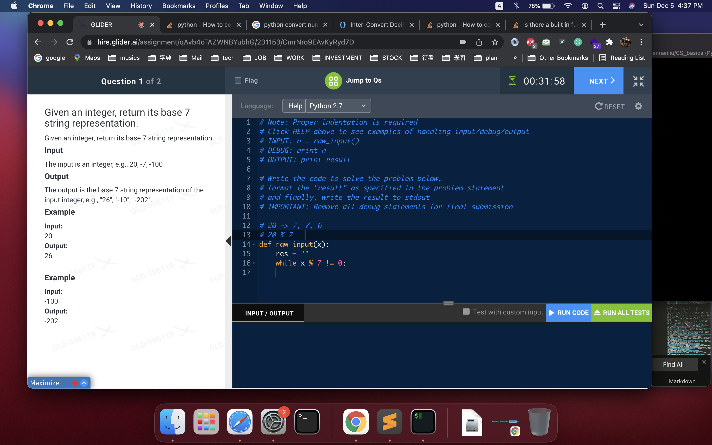

# Math

> **Scope** — Numeric manipulation in interviews — digit extraction, overflow-safe arithmetic, base conversion, roots, and pow. Formula-level counting lives next door.
> **See also**: [combinatorics_math_patterns.md](./combinatorics_math_patterns.md) — counting, primes, modular arithmetic, geometry; [bit_manipulation.md](./bit_manipulation.md) — the bit-level view; [add_x_sum.md](./add_x_sum.md) — addition across input shapes.

## LeetCode Problem Lists

- [Math](https://leetcode.com/problem-list/math/)
- [Number Theory](https://leetcode.com/problem-list/number-theory/)

## 1) General form

### 1-1) Basic OP

#### 1-1-0) transform `10 based interger to N based`
- to 4 base
- to 7 base ..

<p align="center"></p>
```python
# python
# 504. Base 7

# V0
# IDEA : MATH : 10 based -> 7 based
"""
### NOTE :
    1) for negative num : transform to positive int first, do 10 based -> 7 based op
                          then add "-" at beginning
    2) for positive num : do 10 based -> 7 based op
                        -> keep checking if num % N == 0
                        -> if not == 0, keep do  num = num % N, and append cur result to res
                        -> reverse res
                        -> make array to string
                        -> return result
    3) example:
        100 (10 based) -> "202" (7 based)

        tmp = 100
        a, b = divmod(tmp, 7)  -> a = 14, b = 2,  tmp  = 14
        a, b = divmod(tmp, 7)  -> a= 2, b = 0, tmp = 2
        a, b = divmod(tmp, 7)  -> a = 0, b = 2

        -> so res = [2,0,2]
"""

# V1
class Solution(object):
    def convertToBase7(self, num):
        # edge case
        if num == 0:
            return '0'
        tmp = abs(num)
        res = []
        while tmp > 0:
            a, b = divmod(tmp, 7)
            res.append(str(b))
            tmp = a
        res = res[::-1]
        _res = "".join(res)
        if num > 0:
            return _res
        else:
            return "-" + _res

# test
#----------------
# exmaple :
# 7 base
# 20 -> 26
# -100 -> -202
#----------------
num = 20   # 26
num = -100 # -202
s = Solution()
r = s.convertToBase7(num)
print (r)

# V2
# https://www.itread01.com/content/1544603062.html
# https://kknews.cc/code/jlv38qp.html
class Solution(object):
    def convertToBase7(self, num):
        # edge case
        if num == 0:
            return '0'
        tmp = abs(num)
        res = []
        while tmp:
            i = tmp % 7
            res.append(str(i))
            tmp = tmp // 7
        res = res[::-1]
        _res = "".join(res)
        if num > 0:
            return _res
        else:
            return "-" + _res 
```

#### 1-1-0') transform `N based integer to 10 based`
```python
# V1
# LC 1022. Sum of Root To Leaf Binary Numbers
def convertToBaseN(num, n):
    return int(str(num), n)

In [34]: int("100",7)
Out[34]: 49

In [35]: int("14",7)
Out[35]: 11

In [36]: int("66",7)
Out[36]: 48
```

#### 1-1-1) check prime number
```python
# LC 762 Prime Number of Set Bits in Binary Representation
def check_prime(x):
    if x <= 1:
        return False
    for i in range(2, int(x**(0.5)+1)):
        if x % i == 0:
            return False
    return True
```

#### 1-1-2) count prime number
```python
# LC 204 Count Primes
# V0
# IDEA : set
# https://leetcode.com/problems/count-primes/discuss/1343795/python%3A-sieve-of-eretosthenes
# prime(x) : number of prime in [0, x]
# prime(0) = 0
# prime(1) = 0
# prime(2) = 0
# prime(3) = 1
# prime(4) = 2
# prime(5) = 3
class Solution:
    def countPrimes(self, n):
        # using sieve of eretosthenes algorithm
        if n < 2: return 0
        nonprimes = set()
        for i in range(2, round(n**(1/2))+1):
            if i not in nonprimes:
                for j in range(i*i, n, i):
                    nonprimes.add(j)
        return n - len(nonprimes) - 2  # remove prime(1), prime(2)
```

```java
// java
// algorithm book (labu) p.362
// V1
int countPrimes(int n){
    boolean[] isPrime = new boolean[n];

    // init array to true
    Arrays.fill(isPrime, true);

    // prime number start from 2
    for (int i = 2; i < n; i++){
        if (isPrime[i]){
            // if i is prime, then i's multiple is NOT prime
            for (int j = 2 * i; j < n; j += i){
                isPrime[j] = false;
            }
        }
    }

    int count = 0;
    for (int i = 2; i < n; i++){
        if (isPrime[i]){
            count ++;
        }
    }
    return count;
}
```

```java
// java
// algorithm book (labu) p.363
// V1' (optimization)
int countPrimes(int n){
    boolean[] isPrime = new boolean[n];

    // init array to true
    Arrays.fill(isPrime, true);

    // prime number start from 2
    for (int i = 2; i * i  < n; i++){
        if (isPrime[i]){
            // if i is prime, then i's multiple is NOT prime
            /** optimize here :  make j start from i * i, instead of 2 * i */
            // (the only difference between V1 and V1')
            for (int j = i * i; j < n; j += i){
                isPrime[j] = false;
            }
        }
    }

    int count = 0;
    for (int i = 2; i < n; i++){
        if (isPrime[i]){
            count ++;
        }
    }
    return count;
}
```

#### 1-1-3) Keep Remainder to Avoid Overflow (Repunit / Modular Arithmetic)

**Core Idea:**
When building a number digit-by-digit (e.g. 1 → 11 → 111 → ...), the number grows exponentially and overflows `int`/`long`.
Instead of storing the full number, **only keep the remainder mod k** at each step.

This works because:
```text
(a * 10 + 1) % k  ==  ((a % k) * 10 + 1) % k
```
So the remainder after adding a new digit can always be computed from the *previous* remainder alone.

**Pattern:**
```java
int remainder = 0;
for (int len = 1; len <= k; len++) {
    remainder = (remainder * 10 + 1) % k;  // build next repunit mod k
    if (remainder == 0) return len;         // found divisible repunit
}
return -1;
```

**Key insight — Pigeonhole Principle:**
There are only `k` possible remainders (0 to k-1). After `k` steps, if no remainder is 0, a remainder must repeat → cycle with no solution → return -1. So we only need to loop up to `k` times.

**Quick check — early exit:**
A number made only of 1s never ends in 0, 2, 4, 5, 6, or 8, so it can never be divisible by 2 or 5:
```java
if (k % 2 == 0 || k % 5 == 0) return -1;
```

**Similar LC problems using this remainder trick:**
| Problem | Pattern |
|---------|---------|
| LC 1015 - Smallest Integer Divisible by K | repunit mod k |
| LC 29  - Divide Two Integers | avoid overflow with bit ops |
| LC 166 - Fraction to Recurring Decimal | detect cycle via remainder map |
| LC 523 - Continuous Subarray Sum | prefix sum mod k |
| LC 974 - Subarray Sums Divisible by K | prefix sum mod k |

```java
// LC 1015 full solution
public int smallestRepunitDivByK(int k) {
    if (k % 2 == 0 || k % 5 == 0) return -1;
    int remainder = 0;
    for (int len = 1; len <= k; len++) {
        remainder = (remainder * 10 + 1) % k;
        if (remainder == 0) return len;
    }
    return -1;
}
```

#### 1-1-4) Check if 4 points form a valid square (Pairwise Distance Trick)

**Core Idea:**
Given 4 points in any order, checking angles/slopes directly is messy (division by zero, floating point). Instead, compute the **6 pairwise squared distances** among the 4 points and reason about them as a multiset.

**Why 6 distances?**
4 points → C(4,2) = 6 pairs. For a square:

```text
A ----- B
|       |
|       |
D ----- C
```

```text
AB = side
BC = side
CD = side
DA = side
AC = diagonal
BD = diagonal
```

So after sorting the 6 squared distances, you always get **4 equal (smaller) values + 2 equal (larger) values**.

**Pattern — a valid square has:**
- side > 0 (no overlapping points)
- 4 equal sides
- 2 equal diagonals
- diagonal > side

```python
# LC 593. Valid Square
class Solution(object):
    def validSquare(self, p1, p2, p3, p4):
        points = [p1, p2, p3, p4]
        dists = []

        for i in range(4):
            for j in range(i + 1, 4):
                dists.append(self.get_len(
                    points[i][0], points[i][1],
                    points[j][0], points[j][1]
                ))

        dists.sort()

        return (
            dists[0] > 0 and                 # no overlapping points
            dists[0] == dists[1] ==
            dists[2] == dists[3] and         # four equal sides
            dists[4] == dists[5] and         # two equal diagonals
            dists[4] > dists[0]              # diagonal longer than side
        )

    def get_len(self, x1, y1, x2, y2):
        # use squared distance -> avoid float/sqrt precision issues
        return (x1 - x2) ** 2 + (y1 - y2) ** 2
```

**Alternative (set-based) form:**
Since a valid square has exactly 2 distinct distance values (side², diagonal²), and diagonal is always > side for a real square, you can just check `len(set(distances)) == 2` (plus the `0 not in distances` guard for overlapping points):

```python
class Solution(object):
    def validSquare(self, p1, p2, p3, p4):
        def dist(a, b):
            return (a[0] - b[0]) ** 2 + (a[1] - b[1]) ** 2

        points = [p1, p2, p3, p4]
        lookup = set(
            dist(points[i], points[j])
            for i in range(4) for j in range(i + 1, 4)
        )
        return 0 not in lookup and len(lookup) == 2
```

#### 1-1-5) Weighted Rotation Sum — Telescoping Recurrence (avoid O(n²) brute force)

**Pattern:**
Brute-force recomputing `F(k) = sum(i * arr_k[i])` for every rotation `k` costs O(n) per rotation → O(n²) total. Instead, derive an **O(1) transition** from `F(k-1)` to `F(k)` and slide through all `n` rotations in O(n).

**Core Idea:**
Write out a few rotations by hand and compare term by term (`nums = [A, B, C, D]`, `n = 4`):

```text
F(0) = 0*A + 1*B + 2*C + 3*D
F(1) = 0*D + 1*A + 2*B + 3*C
F(2) = 0*C + 1*D + 2*A + 3*B
F(3) = 0*B + 1*C + 2*D + 3*A
```

Every element's weight goes up by 1 when you rotate — **except** the element that just wrapped from the back to the front, whose weight drops from `n-1` down to `0`. So:

```text
sum = A + B + C + D                 # total sum, weight-independent

F(1) = F(0) + sum - 4*D             # D's weight: 3 -> 0, i.e. -4*D; everything else: +1 each -> +sum
F(2) = F(1) + sum - 4*C
F(3) = F(2) + sum - 4*B
```

Generalizing, the element that wraps into position 0 for `F(k)` is `nums[n-k]`, giving the recurrence:

```text
F(k) = F(k-1) + sum(nums) - n * nums[n-k]
```

This is the same "**maintain a running aggregate instead of recomputing from scratch**" philosophy as prefix sums — just applied to a *weighted* sum instead of a plain sum.

```python
# LC 396. Rotate Function
# time = O(n), space = O(1)
class Solution(object):
    def maxRotateFunction(self, nums):
        size = len(nums)
        total = sum(nums)
        f = sum(i * x for i, x in enumerate(nums))  # F(0)

        ans = f
        for i in range(size - 1, 0, -1):
            # nums[i] is the element wrapping to front: weight n-1 -> 0
            f += total - size * nums[i]
            ans = max(ans, f)
        return ans
```

**Similar LC problems (same "O(1) transition between states" idea):**
| Problem | Pattern |
|---------|---------|
| LC 396 - Rotate Function | telescoping weighted-sum recurrence: `F(k) = F(k-1) + sum - n*nums[n-k]` |
| LC 238 - Product of Array Except Self | running prefix/suffix product instead of recomputing per index |
| LC 303 - Range Sum Query - Immutable | precomputed prefix sum instead of recomputing per query |
| LC 189 - Rotate Array | actual physical rotation (reverse trick) — contrast: no aggregate formula, just rearranges elements |

#### 1-1-6) Greedy Zigzag Construction — closed-form O(1) instead of simulation

**Problem shape (LC 3993 - Maximum Value of an Alternating Sequence):**
Given `n`, `s`, `m` — build a length-`n` alternating (zigzag) sequence with `seq[0] = s` and `|seq[i] - seq[i-1]| <= m`. Return the **maximum element** that can appear in any valid sequence.

**Core Idea:**
Don't search / DP over sequences. Ask only: *what does one extra peak cost?* Then the answer is a formula.

Three greedy observations pin everything down:

1. **Always start by going up.** Starting with a down-step (`seq[0] > seq[1]`) wastes the first move and every later peak is lower. So use the `seq[0] < seq[1] > seq[2] < ...` shape.
2. **Every up-step should be `+m`** — the largest jump allowed.
3. **Every down-step should be `-1`** — the *smallest* legal drop, because the inequality is **strict** (`>`), so the minimum decrease is 1. Dropping more just lowers all following peaks.

So the sequence is a sawtooth that climbs `m` and gives back only `1`:

```text
n = 6, s = 3, m = 5

              s+2m-1=12          s+3m-2=16
                 /\                 /\
      s+m=8    /    \             /
        /\    /      \           /
       /   \ /   s+2m-2=11      /
      /   s+m-1=7              /
   s=3

seq = [3, 8, 7, 12, 11, 16]
       ^  +5 -1  +5  -1  +5
```

**Counting the moves:**
- Peaks sit at odd indices `1, 3, 5, ...` → number of up-steps `k = n // 2`
- Between `k` peaks there are `k - 1` down-steps, each costing exactly `1`

```text
max = s + k*m - (k - 1)
    = s + k*(m - 1) + 1        , where k = n // 2
```

**Edge case:** `n == 1` → a length-1 sequence is alternating by definition, and it must equal `s`. (The formula would give `s + 1`, which is wrong, so guard it explicitly.)

**Pattern:**
```python
# python
# LC 3993. Maximum Value of an Alternating Sequence
# time = O(1), space = O(1)
class Solution(object):
    def maximumValue(self, n, s, m):
        # IDEA: GREEDY ZIGZAG -> CLOSED FORM
        # go up by m, come down by only 1 (strict inequality), repeat

        # edge case: length-1 sequence is just [s]
        if n == 1:
            return s

        k = n // 2                 # number of "up" moves == number of peaks
        return s + k * (m - 1) + 1  # == s + k*m - (k-1)
```

```java
// java
// LC 3993 - Maximum Value of an Alternating Sequence
// time = O(1), space = O(1)
public long maximumValue(int n, int s, int m) {
    // IDEA: GREEDY ZIGZAG -> CLOSED FORM
    if (n == 1) {
        return s;
    }
    long k = n / 2;                    // peaks == up moves
    return s + k * (m - 1) + 1;        // use long: n, s up to 1e9
}
```

**Sanity check:**

| n | s | m | k = n//2 | s + k*(m-1) + 1 | sequence |
|---|---|---|----------|-----------------|----------|
| 1 | 3 | 5 | — | `3` (edge case) | `[3]` |
| 2 | 4 | 3 | 1 | `4 + 1*2 + 1 = 7` | `[4, 7]` |
| 4 | 3 | 5 | 2 | `3 + 2*4 + 1 = 12` | `[3, 8, 7, 12]` |
| 5 | 3 | 5 | 2 | `3 + 2*4 + 1 = 12` | `[3, 8, 7, 12, 11]` |
| 4 | 3 | 1 | 2 | `3 + 2*0 + 1 = 4` | `[3, 4, 3, 4]` |

Note `n = 4` and `n = 5` give the same answer — an even trailing step can only go *down* from the last peak, so it never raises the max.

**Key takeaways (transferable):**
- **"Strict inequality" ⇒ the minimal step is 1, not 0.** That `-1` is where the `(m - 1)` comes from.
- When constraints are only on *adjacent* pairs, the optimum is usually a **greedy repeating unit**; count how many units fit, then multiply.
- Constraints like `1 <= n, s <= 1e9` are a strong hint that the intended answer is **O(1) math**, not simulation — and that you need 64-bit ints.

**Similar LC problems:**
| Problem | Pattern |
|---------|---------|
| LC 3993 - Maximum Value of an Alternating Sequence | greedy zigzag (`+m` / `-1`) → closed form `s + (n//2)*(m-1) + 1` |
| LC 376 - Wiggle Subsequence | alternating up/down, but *pick* elements (greedy count of direction flips) |
| LC 280 - Wiggle Sort | construct an alternating array in-place by swapping adjacent violators |
| LC 324 - Wiggle Sort II | strict alternating + no equal neighbors → sort then interleave halves |
| LC 1846 - Maximum Element After Decreasing and Rearranging | maximize final element under `|adjacent diff| <= 1` → greedy `prev + 1` |
| LC 1936 - Add Minimum Number of Rungs | adjacent gap capped at `dist` → `ceil(gap/dist) - 1` per gap (counting, not simulation) |
| LC 453 - Minimum Moves to Equal Array Elements | reframe "increment n-1" as "decrement 1" → `sum - n*min`, O(1) math |
| LC 462 - Minimum Moves to Equal Array Elements II | move to median; closed-form cost instead of trying each target |

#### 1-1-7) Split `n` into `k` parts as evenly as possible → **max product** (`divmod` pattern) ⭐⭐⭐⭐⭐

**Problem shape (LC 343 - Integer Break):**
Break `n` into a sum of `k >= 2` positive integers and maximize their product.

##### Core Idea

Two independent questions — solve them separately:

1. **Given a FIXED `k`, how should the parts be sized?** → **as evenly as possible** (`divmod`)
2. **Which `k` is best?** → try them all (`O(n²)`), or use math (`O(log n)`, see below)

**Why "as evenly as possible" is optimal (exchange argument):**

For a fixed sum and fixed count, the product is maximized when all parts are equal (**AM–GM inequality**). With *integers* you can't always be exactly equal, so parts must differ by **at most 1**.

```text
Proof sketch — suppose two parts differ by >= 2, i.e.  a >= b + 2
Replace (a, b) with (a-1, b+1)  -> sum is unchanged

  (a-1)(b+1) = ab + a - b - 1
             >= ab + 1          , since a - b >= 2

  -> product STRICTLY increases
  -> keep rebalancing until every pair differs by <= 1
```

**So the split is fully determined by `divmod`:**

```text
q, r = divmod(n, k)          # q = n // k  (商數), r = n % k  (餘數)

  ->  r     parts have value (q + 1)      <-- the "leftover" r units are spread
  ->  (k-r) parts have value  q               one-by-one over r parts

Sanity check the sum:
  r*(q+1) + (k-r)*q  =  r*q + r + k*q - r*q  =  k*q + r  =  n   ✅

Max product for that k:
  P(n, k) = (q + 1)^r  *  q^(k - r)
```

##### Visual Example

```text
n = 10, k = 3
  q, r = divmod(10, 3) = (3, 1)
  -> 1 part  of q+1 = 4
  -> 2 parts of q   = 3
  -> [4, 3, 3]   sum = 10 ✅   product = 4*3*3 = 36

Compare with UNEVEN splits of the same n and k:
  [8, 1, 1] -> 8      [6, 2, 2] -> 24     [5, 4, 1] -> 20
  [4, 3, 3] -> 36  <-- max, and it is the "even" one ✅
```

Full sweep of `k` for `n = 10`:

| k | `divmod(10, k)` = (q, r) | parts | product |
|---|--------------------------|-------|---------|
| 2 | (5, 0) | `[5, 5]` | 25 |
| 3 | (3, 1) | `[4, 3, 3]` | **36** ⭐ |
| 4 | (2, 2) | `[3, 3, 2, 2]` | 36 ⭐ |
| 5 | (2, 0) | `[2, 2, 2, 2, 2]` | 32 |
| 6 | (1, 4) | `[2, 2, 2, 2, 1, 1]` | 16 |
| 7 | (1, 3) | `[2, 2, 2, 1, 1, 1, 1]` | 8 |

→ answer = 36. Notice the product **rises then falls** — parts near 3 are the sweet spot (see "Why 3?" below).

##### Pattern — the reusable `divmod` helper

```python
# python
# GENERAL PATTERN: split n into k parts as evenly as possible
def get_product(n, k):
    """
    Split n into k parts as evenly as possible,
    return their (maximum) product.
    """
    ### NOTE !!! get q (商數), r (餘數) via divmod
    q = n // k
    r = n % k

    ### NOTE !!!
    #   r      parts have value q + 1   (the remainder is spread 1 unit each)
    #   k - r  parts have value q
    product = 1

    ### NOTE !!! build the product from q, r
    for _ in range(r):
        product *= (q + 1)

    for _ in range(k - r):
        product *= q

    return product


# one-liner form (same thing, via pow)
def get_product(n, k):
    q, r = divmod(n, k)
    return (q + 1) ** r * q ** (k - r)


# the parts themselves (when you need the list, not the product)
def split_evenly(n, k):
    q, r = divmod(n, k)
    return [q + 1] * r + [q] * (k - r)
```

```java
// java
// GENERAL PATTERN: split n into k parts as evenly as possible
long getProduct(int n, int k) {
    int q = n / k;          // 商數
    int r = n % k;          // 餘數

    long product = 1;
    for (int i = 0; i < r; i++)     product *= (q + 1);   // r parts of q+1
    for (int i = 0; i < k - r; i++) product *= q;         // k-r parts of q
    return product;
}
```

##### Applying it — LC 343 Integer Break

```python
# python
# LC 343. Integer Break
# IDEA: MATH — for each k, split evenly (divmod); take max over all k
# time = O(n^2), space = O(1)
class Solution(object):
    def integerBreak(self, n):
        # edge case: k >= 2 is FORCED, so 2 must become 1 + 1
        if n == 2:
            return 1

        max_product = 1

        # try every possible number of parts
        for k in range(2, n + 1):
            max_product = max(max_product, self.get_product(n, k))

        return max_product

    def get_product(self, n, k):
        q, r = n // k, n % k
        # r parts of (q+1),  k-r parts of q
        product = 1
        for _ in range(r):
            product *= (q + 1)
        for _ in range(k - r):
            product *= q
        return product
```

> **NOTE on the loop bound:** `range(2, n + 1)` is the safe/complete range (`k = n` → all 1s).
> `range(2, n)` also passes here because the all-1s product is `1`, which never beats
> `max_product`'s initial value of `1`. But `k <= n` is the correct general bound —
> `k > n` is impossible since every part must be `>= 1`.

##### Why the answer is "as many **3**s as possible" — the O(log n) shortcut

The `divmod` sweep above tells you *how* to split for a given `k`; a bit of calculus tells you *which part size* wins, so you can skip the loop entirely.

```text
Splitting n into parts of size x gives n/x parts -> product = x^(n/x)
Maximize  f(x) = x^(1/x)   ->   maximum at x = e ≈ 2.718

Integer candidates around e:
  2^(1/2) ≈ 1.414
  3^(1/3) ≈ 1.442   <-- WINNER
  4^(1/4) ≈ 1.414   (== 2, since 4 = 2+2 -> 2*2 = 4)

Also, by direct comparison:
  x >= 5  ->  3 * (x - 3) > x     -> ALWAYS split a part of size >= 5
  x == 4  ->  2 * 2 == 4          -> splitting 4 is neutral
  part == 1 is pure waste (multiplying by 1 does nothing)

=> every part in the optimum is a 3 or a 2, and we prefer 3s.
```

**Careful with the remainder** — never leave a `1` hanging:

```text
n % 3 == 0  ->  3^(n/3)                    e.g. 9  = 3+3+3      -> 27
n % 3 == 2  ->  3^(n/3) * 2                e.g. 11 = 3+3+3+2    -> 54
n % 3 == 1  ->  3^(n/3 - 1) * 4            e.g. 10 = 3+3+4      -> 36
                ^^^^^^^^^^^^^^^ borrow one 3 back and use 2+2,
                because 3*1 = 3  <  2*2 = 4
```

```python
# python
# LC 343 - O(log n) math solution
# time = O(log n) (pow), space = O(1)
class Solution(object):
    def integerBreak(self, n):
        # n = 2 -> 1,  n = 3 -> 2  (forced to split, so we lose)
        if n < 4:
            return n - 1

        if n % 3 == 0:
            return 3 ** (n // 3)
        elif n % 3 == 2:
            return 3 ** (n // 3) * 2
        else:                      # n % 3 == 1 -> use 2*2 instead of 3*1
            return 3 ** (n // 3 - 1) * 4
```

```python
# python
# LC 343 - O(n) DP solution (safest if you can't recall the math)
# dp[x] = max product of breaking x  (x itself allowed as a "part" for x >= 4)
# time = O(n), space = O(n)
class Solution(object):
    def integerBreak(self, n):
        if n <= 3:
            return n - 1
        dp = [0] * (n + 1)
        dp[2], dp[3] = 2, 3        # NOTE: 3 (not 2), because 3 can stay whole here
        for x in range(4, n + 1):
            dp[x] = max(3 * dp[x - 3], 2 * dp[x - 2])
        return dp[n]
```

##### Solution Comparison

| Approach | Time | Space | Note |
|----------|------|-------|------|
| Brute force `divmod` over all `k` | `O(n²)` | `O(1)` | **Most intuitive**; the `get_product` pattern above |
| DP `dp[x] = max(3*dp[x-3], 2*dp[x-2])` | `O(n)` | `O(n)` | Safe fallback; note `dp[3] = 3` (not 2) |
| Math (as many 3s as possible) | `O(log n)` | `O(1)` | Needs the `n % 3 == 1 → use 4` insight |

##### Common Pitfalls

| Pitfall | Why it breaks | Fix |
|---------|---------------|-----|
| Returning `n` for `n = 2, 3` | `k >= 2` is **mandatory** — you must split | `if n < 4: return n - 1` |
| `n % 3 == 1` → `3^(n//3) * 1` | Multiplying by `1` wastes a unit | Borrow a 3 back: `3^(n//3 - 1) * 4` |
| `dp[3] = 2` in the DP | Inside `dp`, a `3` may stay **whole** as a factor | `dp[3] = 3` (only the final answer is forced to split) |
| Splitting unevenly (`[8,1,1]`) | Violates AM–GM | `divmod` → `r` parts of `q+1`, `k-r` of `q` |
| Java `int` overflow | `3^19` already exceeds `int` for larger `n` | Use `long` / Python big ints |

##### Similar Problems

| Problem | LC# | Key Difference |
|---------|-----|----------------|
| **Integer Break** | **343** | **Max product of an integer partition — the base pattern** |
| Maximize Number of Nice Divisors | 1808 | Same "as many 3s as possible" trick, but answer is `mod 1e9+7` → needs fast pow |
| Maximum Product After K Increments | 2233 | Max product ⇒ keep values **even** — always increment the current min (heap) |
| Minimum Moves to Equal Array Elements II | 462 | Even-out toward the **median**; cost formula instead of simulation |
| Minimize Maximum of Array | 2439 | Spread a prefix evenly → `ceil(prefixSum / count)` |
| Split Array Largest Sum | 410 | Split into `k` parts minimizing the max sum — binary search (parts not free-sized) |
| Capacity To Ship Packages Within D Days | 1011 | Same even-split-under-constraint shape, solved by binary search |
| Maximum Candies Allocated to K Children | 2226 | Binary search on part size; `divmod` counts how many parts fit |
| Divide Array in Sets of K Consecutive Numbers | 1296 | Even grouping, but by value adjacency (greedy + counter) |
| Fair Distribution of Cookies | 2305 | Even split with *fixed* items → backtracking (can't use `divmod`) |
| Distribute Candies Among Children | 2929 | Counting splits, not maximizing product (combinatorics / inclusion–exclusion) |

**Key takeaways (transferable):**
- **Fixed sum + fixed count → maximize product ⇒ make parts equal.** With integers that means `divmod`: `r` parts of `q+1`, `k-r` parts of `q`.
- The exchange argument (`a >= b+2` ⇒ rebalancing strictly improves) is the standard way to *prove* "even is optimal" in an interview.
- The mirror image also holds: to **minimize** a product / sum-of-squares for a fixed sum, make parts as **unequal** as possible; to **minimize the max**, make them as even as possible.
- When only *adjacent* structure matters, look for a closed form (`O(1)`/`O(log n)`) instead of looping — same philosophy as [1-1-6](#1-1-6-greedy-zigzag-construction--closed-form-o1-instead-of-simulation).

#### 1-1-8) Fast Power (Binary Exponentiation) ⭐⭐⭐⭐⭐

**Pattern:** compute `x^n` in `O(log n)` instead of `O(n)` by squaring the base and halving the exponent.

**Core Idea — read the exponent in binary:**

```text
x^n  =  (x^2)^(n/2)              , n even
     =  x * (x^2)^((n-1)/2)      , n odd

-> equivalently: n = sum of powers of 2 (its binary bits)
   x^13 = x^(1101b) = x^8 * x^4 * x^1
```

So keep a running `res`, and every time the current bit of `n` is 1, multiply the current square into `res`:

```text
x = 2, n = 13 (1101b)

step | bit | x (running square) | res
-----|-----|--------------------|------------
  0  |  1  | 2                  | 1 * 2   = 2       <- x^1
  1  |  0  | 4                  | 2                 (skip)
  2  |  1  | 16                 | 2 * 16  = 32      <- x^1 * x^4
  3  |  1  | 256                | 32 * 256 = 8192   <- x^1 * x^4 * x^8

2^13 = 8192  ✅
```

```java
// java
// LC 50 - Pow(x, n)
// IDEA: FAST POWER (BINARY EXPONENTIATION) - square the base, halve the exponent
// time = O(log n), space = O(1)
public double myPow(double x, int n) {
    /** NOTE !!! promote to long FIRST
     *  -n overflows when n == Integer.MIN_VALUE (-2^31 has no positive int)
     */
    long N = n;
    if (N < 0) {
        x = 1 / x;
        N = -N;
    }

    double res = 1.0;
    while (N > 0) {
        // if current bit is 1 -> accumulate the current square
        if ((N & 1) == 1) {
            res *= x;
        }
        x *= x;      // x -> x^2 -> x^4 -> x^8 ...
        N >>= 1;
    }
    return res;
}
```

```python
# python
# LC 50. Pow(x, n)
# IDEA: FAST POWER (BINARY EXPONENTIATION)
# time = O(log n), space = O(1)
class Solution(object):
    def myPow(self, x, n):
        # negative exponent -> invert the base
        if n < 0:
            x, n = 1 / x, -n

        res = 1.0
        while n:
            ### NOTE !!! if current bit is 1, accumulate the current square
            if n & 1:
                res *= x
            x *= x        # x -> x^2 -> x^4 -> x^8 ...
            n >>= 1
        return res
```

##### Variation — **modular** fast power (`x^n mod m`)

Twist: multiply under a modulus so the intermediate values never overflow. This is the exact helper LC 1808 (referenced in [1-1-7](#1-1-7-split-n-into-k-parts-as-evenly-as-possible--max-product-divmod-pattern-)) needs, and it also powers modular inverse via Fermat: `inv(a) = a^(m-2) mod m` for prime `m`.

```java
// java
// GENERAL PATTERN: (base ^ exp) % mod
// DOMAIN: exp >= 0, mod > 0, mod < ~3e9 (so `res * base` fits in a long).
//         Negative base -> use Math.floorMod(base, mod); negative exp needs a modular inverse.
// time = O(log exp), space = O(1)
long powMod(long base, long exp, long mod) {
    long res = 1 % mod;      // NOTE: `1 % mod`, not `1` -> handles mod == 1
    base %= mod;
    while (exp > 0) {
        if ((exp & 1) == 1) {
            res = res * base % mod;   // use long, `int * int` overflows
        }
        base = base * base % mod;
        exp >>= 1;
    }
    return res;
}
```

```python
# python
# GENERAL PATTERN: (base ** exp) % mod
# DOMAIN: exp >= 0, mod > 0. A negative `exp` never terminates here
#         (`exp >>= 1` on a negative int floors to -1 forever) -> use a modular inverse instead.
# time = O(log exp), space = O(1)
def pow_mod(base, exp, mod):
    res = 1 % mod
    base %= mod
    while exp:
        if exp & 1:
            res = res * base % mod
        base = base * base % mod
        exp >>= 1
    return res

# python builtin does exactly this:
#   pow(base, exp, mod)
```

**Common Pitfalls:**

| Pitfall | Why it breaks | Fix |
|---------|---------------|-----|
| `n = -n` on an `int` | `Integer.MIN_VALUE` has no positive `int` counterpart | cast to `long` **before** negating |
| recursion without memo of `half` | `myPow(x, n/2) * myPow(x, n/2)` recomputes → `O(n)` | compute `half` **once**, then `half * half` |
| `res * base` in `int` under a mod | overflows before the `%` runs | keep everything in `long` |
| forgetting `x = 1/x` for `n < 0` | returns `x^abs(n)` | invert the base up front |

#### 1-1-9) GCD / LCM — Euclid's Algorithm ⭐⭐⭐⭐

**Pattern:** `gcd(a, b) = gcd(b, a % b)`, bottoming out at `gcd(a, 0) = a`. Runs in `O(log(min(a,b)))`.

**Why it works:** any common divisor of `a` and `b` also divides `a - k*b`, so the set of common divisors is unchanged when you replace `a` by `a % b`. Each step at least halves the larger value → logarithmic.

```text
gcd(48, 18)
  -> gcd(18, 48 % 18 = 12)
  -> gcd(12, 18 % 12 = 6)
  -> gcd(6,  12 % 6  = 0)
  -> 6

lcm(a, b) = a * b / gcd(a, b)
          = a / gcd(a, b) * b        <-- divide FIRST to avoid overflow
```

```java
// java
// GENERAL PATTERN: Euclid gcd / lcm
// time = O(log(min(a,b))), space = O(1)
int gcd(int a, int b) {
    a = Math.abs(a);
    b = Math.abs(b);
    while (b != 0) {
        int t = a % b;
        a = b;
        b = t;
    }
    return a;          // NOTE: gcd(x, 0) == x, gcd(0, 0) == 0
}                      // (caveat: Math.abs(Integer.MIN_VALUE) stays negative -> use long if that's reachable)

long lcm(int a, int b) {
    // NOTE !!! lcm with 0 is 0 -> guard first, else gcd(0, 0) == 0 divides by zero
    if (a == 0 || b == 0) {
        return 0;
    }
    // NOTE !!! divide BEFORE multiplying, else a*b can overflow
    return (long) Math.abs(a) / gcd(a, b) * Math.abs(b);
}
```

```python
# python
# GENERAL PATTERN: Euclid gcd / lcm
# time = O(log(min(a,b))), space = O(1)
def my_gcd(a, b):
    a, b = abs(a), abs(b)
    while b:
        a, b = b, a % b
    return a

def my_lcm(a, b):
    ### NOTE !!! lcm with 0 is 0 -> guard first, else my_gcd(0, 0) == 0 divides by zero
    if a == 0 or b == 0:
        return 0
    return abs(a) // my_gcd(a, b) * abs(b)

# python builtin:
#   from math import gcd, lcm      # lcm needs python 3.9+
```

##### Applying it — LC 149 Max Points on a Line

**Key Idea:** never compare slopes as floats (`dy/dx` blows up on vertical lines and loses precision). Instead use the **reduced direction vector** `(dx/g, dy/g)` where `g = gcd(dx, dy)`, then **normalize the sign** so `(1, 2)` and `(-1, -2)` hash to the same line.

```java
// java
// LC 149 - Max Points on a Line
// IDEA: GCD-REDUCED SLOPE AS HASH KEY (no float division)
// time = O(n^2), space = O(n)
public int maxPoints(int[][] points) {
    int n = points.length;
    if (n <= 2) {
        return n;
    }

    int best = 1;
    for (int i = 0; i < n; i++) {
        // slope -> how many points share it with points[i]
        Map<String, Integer> cnt = new HashMap<>();
        for (int j = i + 1; j < n; j++) {
            int dx = points[j][0] - points[i][0];
            int dy = points[j][1] - points[i][1];

            /** NOTE !!! reduce by gcd -> canonical direction vector */
            int g = gcd(dx, dy);
            if (g != 0) {
                dx /= g;
                dy /= g;
            }

            /** NOTE !!! normalize sign, so (1,2) and (-1,-2) are the SAME line */
            if (dx < 0 || (dx == 0 && dy < 0)) {
                dx = -dx;
                dy = -dy;
            }

            int c = cnt.merge(dx + "/" + dy, 1, Integer::sum);
            best = Math.max(best, c + 1);   // +1 -> include points[i] itself
        }
    }
    return best;
}
```

```python
# python
# LC 149. Max Points on a Line
# IDEA: GCD-REDUCED SLOPE AS HASH KEY (no float division)
# time = O(n^2), space = O(n)
from math import gcd

class Solution(object):
    def maxPoints(self, points):
        n = len(points)
        if n <= 2:
            return n

        best = 1
        for i in range(n):
            cnt = {}
            x1, y1 = points[i]
            for j in range(i + 1, n):
                dx = points[j][0] - x1
                dy = points[j][1] - y1

                ### NOTE !!! reduce by gcd -> canonical direction
                g = gcd(abs(dx), abs(dy))
                if g:
                    dx //= g
                    dy //= g

                ### NOTE !!! normalize sign
                if dx < 0 or (dx == 0 and dy < 0):
                    dx, dy = -dx, -dy

                cnt[(dx, dy)] = cnt.get((dx, dy), 0) + 1
                best = max(best, cnt[(dx, dy)] + 1)   # +1 -> points[i] itself
        return best
```

##### Variation — LC 365 Water and Jug Problem (**Bézout's identity**)

Twist: instead of BFS over states, note that every reachable amount is `a*x + b*y` for integers `a, b`, and Bézout says that set is exactly the multiples of `gcd(x, y)`. So the whole problem collapses to one `gcd` check — `O(log(min(x,y)))` instead of BFS.

```java
// java
// LC 365 - Water and Jug Problem
// IDEA: BEZOUT -> reachable amounts == multiples of gcd(x, y)
// time = O(log(min(x,y))), space = O(1)
public boolean canMeasureWater(int x, int y, int target) {
    if (target == 0) {
        return true;                       // NOTE: guard first, gcd(0,0) == 0
    }
    if ((long) x + y < target) {
        return false;                      // can't hold more than both jugs
    }
    return target % gcd(x, y) == 0;
}
```

```python
# python
# LC 365. Water and Jug Problem
# IDEA: BEZOUT -> reachable amounts == multiples of gcd(x, y)
# time = O(log(min(x,y))), space = O(1)
from math import gcd

class Solution(object):
    def canMeasureWater(self, x, y, target):
        if target == 0:
            return True                    # guard first (gcd(0,0) == 0)
        if x + y < target:
            return False
        return target % gcd(x, y) == 0
```

**Where GCD shows up:**

| Problem | Use of gcd |
|---------|-----------|
| LC 149 - Max Points on a Line | reduce `(dx, dy)` to a canonical slope key |
| LC 365 - Water and Jug Problem | Bézout: reachable ⟺ multiple of `gcd(x, y)` |
| LC 1015 - Smallest Integer Divisible by K | see [1-1-3](#1-1-3-keep-remainder-to-avoid-overflow-repunit--modular-arithmetic) — the `k % 2 / k % 5` guard is a `gcd(k, 10) > 1` argument |

#### 1-1-10) Integer Square Root — Binary Search & Newton ⭐⭐⭐⭐

**Pattern:** `isqrt(x)` = largest `r` with `r*r <= x`. Two standard templates.

**Template A — binary search on the answer** (the transferable one: works for any monotone predicate, e.g. cube root, "smallest divisor", capacity problems):

```java
// java
// LC 69 - Sqrt(x)
// IDEA: BINARY SEARCH ON ANSWER, keep last feasible mid
// time = O(log x), space = O(1)
public int mySqrt(int x) {
    if (x < 2) {
        return x;                    // 0 -> 0, 1 -> 1
    }
    int lo = 1, hi = x / 2, ans = 1; // NOTE: for x >= 2, isqrt(x) <= x/2
    while (lo <= hi) {
        int mid = lo + (hi - lo) / 2;
        /** NOTE !!! cast to long -> mid * mid overflows int */
        long sq = (long) mid * mid;
        if (sq == x) {
            return mid;
        } else if (sq < x) {
            ans = mid;               // feasible -> remember, then push right
            lo = mid + 1;
        } else {
            hi = mid - 1;
        }
    }
    return ans;
}
```

```python
# python
# LC 69. Sqrt(x)
# IDEA: BINARY SEARCH ON ANSWER, keep last feasible mid
# time = O(log x), space = O(1)
class Solution(object):
    def mySqrt(self, x):
        if x < 2:
            return x
        lo, hi, ans = 1, x // 2, 1
        while lo <= hi:
            mid = lo + (hi - lo) // 2
            sq = mid * mid
            if sq == x:
                return mid
            elif sq < x:
                ans = mid            # feasible -> remember it
                lo = mid + 1
            else:
                hi = mid - 1
        return ans
```

**Template B — Newton's method** (quadratic convergence, ~5 lines; the interview "one-liner"):

```text
r_next = (r + x / r) / 2      # integer division is fine, it converges DOWN to isqrt(x)
loop while r * r > x
```

```java
// java
// LC 69 - Sqrt(x)  (Newton)
// time = O(log x), space = O(1)
public int mySqrtNewton(int x) {
    long r = x;                     // NOTE: long, r*r overflows int
    while (r * r > x) {
        r = (r + x / r) / 2;
    }
    return (int) r;                 // x == 0 -> loop never runs -> 0
}
```

```python
# python
# LC 69. Sqrt(x)  (Newton)
# time = O(log x), space = O(1)
class Solution(object):
    def mySqrt(self, x):
        r = x
        while r * r > x:
            r = (r + x // r) // 2
        return r
```

##### Variation — LC 367 Valid Perfect Square

Twist: same Newton loop, but the answer is the *equality* check instead of the floor value.

```java
// java
// LC 367 - Valid Perfect Square
// time = O(log num), space = O(1)
public boolean isPerfectSquare(int num) {
    long r = num;
    while (r * r > num) {
        r = (r + num / r) / 2;
    }
    return r * r == num;            // only difference vs LC 69
}
```

```python
# python
# LC 367. Valid Perfect Square
# time = O(log num), space = O(1)
class Solution(object):
    def isPerfectSquare(self, num):
        r = num
        while r * r > num:
            r = (r + num // r) // 2
        return r * r == num
```

##### Variation — LC 633 Sum of Square Numbers

Twist: two pointers over `[0, isqrt(c)]` — shrink from the top, grow from the bottom, `O(sqrt(c))`.

```python
# python
# LC 633. Sum of Square Numbers
# IDEA: TWO POINTERS on [0, isqrt(c)]
# time = O(sqrt(c)), space = O(1)
from math import isqrt

class Solution(object):
    def judgeSquareSum(self, c):
        a, b = 0, isqrt(c)
        while a <= b:
            cur = a * a + b * b
            if cur == c:
                return True
            elif cur < c:
                a += 1               # need bigger -> raise the low end
            else:
                b -= 1               # too big -> lower the high end
        return False
```

```java
// java
// LC 633 - Sum of Square Numbers
// time = O(sqrt(c)), space = O(1)
public boolean judgeSquareSum(int c) {
    long a = 0, b = (long) Math.sqrt(c);
    while (a <= b) {
        long cur = a * a + b * b;
        if (cur == c) {
            return true;
        } else if (cur < c) {
            a++;
        } else {
            b--;
        }
    }
    return false;
}
```

#### 1-1-11) Randomized Sampling Templates ⭐⭐⭐⭐⭐

Four templates that cover almost every "return a random ..." interview question. The shared trick: **pick uniformly from an *array*, and keep the array packed**.

| Goal | Template | LC |
|------|----------|-----|
| Uniform random permutation | Fisher–Yates (backwards swap) | 384 |
| Random index by **weight** | prefix sum + binary search | 528 |
| Random index of a value, **streaming / O(1) space** | reservoir sampling | 398 |
| `insert` / `remove` / `getRandom` all `O(1)` | array + `val -> index` map, swap-with-last | 380 |

##### A) Fisher–Yates shuffle — LC 384

**Key Idea:** walk from the back; for each `i`, swap `a[i]` with a random `a[j]` where `j ∈ [0, i]` (**inclusive**). Every permutation gets probability exactly `1/n!`.

```java
// java
// LC 384 - Shuffle an Array
// IDEA: FISHER-YATES (swap a[i] with a random j in [0, i])
// time = O(n) per shuffle, space = O(n)
class Solution {
    private final int[] original;
    private final Random rand = new Random();

    public Solution(int[] nums) {
        this.original = nums.clone();
    }

    public int[] reset() {
        return original.clone();
    }

    public int[] shuffle() {
        int[] a = original.clone();
        for (int i = a.length - 1; i > 0; i--) {
            /** NOTE !!! nextInt(i + 1) -> j in [0, i] INCLUSIVE
             *  using nextInt(n) here (a fixed bound) makes it NON-uniform
             */
            int j = rand.nextInt(i + 1);
            int t = a[i];
            a[i] = a[j];
            a[j] = t;
        }
        return a;
    }
}
```

```python
# python
# LC 384. Shuffle an Array
# IDEA: FISHER-YATES
# time = O(n) per shuffle, space = O(n)
import random

class Solution(object):
    def __init__(self, nums):
        self.original = nums[:]

    def reset(self):
        return self.original[:]

    def shuffle(self):
        arr = self.original[:]
        for i in range(len(arr) - 1, 0, -1):
            ### NOTE !!! randint is INCLUSIVE on both ends -> j in [0, i]
            j = random.randint(0, i)
            arr[i], arr[j] = arr[j], arr[i]
        return arr
```

##### B) Weighted random pick — LC 528

**Key Idea:** turn weights into a **prefix sum**, then throw a dart at `[1, total]` and binary-search the **leftmost prefix >= target**. Weight `w[i]` occupies exactly `w[i]` of the `total` slots.

```text
w       = [1, 3, 2]
prefix  = [1, 4, 6]      total = 6

target: 1        -> idx 0   (prob 1/6)
        2,3,4    -> idx 1   (prob 3/6)
        5,6      -> idx 2   (prob 2/6)
```

```java
// java
// LC 528 - Random Pick with Weight
// IDEA: PREFIX SUM + BINARY SEARCH (leftmost prefix >= target)
// time = O(n) build / O(log n) per pick, space = O(n)
class Solution {
    private final int[] prefix;
    private final int total;
    private final Random rand = new Random();

    public Solution(int[] w) {
        prefix = new int[w.length];
        int s = 0;
        for (int i = 0; i < w.length; i++) {
            s += w[i];
            prefix[i] = s;
        }
        total = s;
    }

    public int pickIndex() {
        /** NOTE !!! target in [1, total] (nextInt is exclusive on the bound) */
        int target = rand.nextInt(total) + 1;

        int lo = 0, hi = prefix.length - 1;
        while (lo < hi) {               // lower-bound style: NO `lo <= hi`
            int mid = lo + (hi - lo) / 2;
            if (prefix[mid] < target) {
                lo = mid + 1;
            } else {
                hi = mid;               // NOTE: hi = mid (not mid - 1)
            }
        }
        return lo;
    }
}
```

```python
# python
# LC 528. Random Pick with Weight
# IDEA: PREFIX SUM + BINARY SEARCH (leftmost prefix >= target)
# time = O(n) build / O(log n) per pick, space = O(n)
import random

class Solution(object):
    def __init__(self, w):
        self.prefix = []
        s = 0
        for x in w:
            s += x
            self.prefix.append(s)
        self.total = s

    def pickIndex(self):
        target = random.randint(1, self.total)   # inclusive [1, total]
        lo, hi = 0, len(self.prefix) - 1
        while lo < hi:
            mid = lo + (hi - lo) // 2
            if self.prefix[mid] < target:
                lo = mid + 1
            else:
                hi = mid
        return lo

# builtin shortcut (still O(log n)): bisect.bisect_left(self.prefix, target)
```

##### C) Reservoir sampling — LC 398

**Key Idea:** to pick 1 uniform item from an **unknown-length stream in `O(1)` space**: when you see the `k`-th matching item, keep it with probability `1/k`.

```text
Proof for k = 3 items:
  P(keep #3) = 1/3
  P(keep #2) = 1/2 * (1 - 1/3) = 1/2 * 2/3 = 1/3
  P(keep #1) = 1   * (1 - 1/2) * (1 - 1/3) = 1/2 * 2/3 = 1/3   ✅ uniform
```

```java
// java
// LC 398 - Random Pick Index
// IDEA: RESERVOIR SAMPLING (keep the k-th match with prob 1/k)
// time = O(n) per pick, space = O(1) extra
class Solution {
    private final int[] nums;
    private final Random rand = new Random();

    public Solution(int[] nums) {
        this.nums = nums;
    }

    public int pick(int target) {
        int count = 0, res = -1;
        for (int i = 0; i < nums.length; i++) {
            if (nums[i] != target) {
                continue;
            }
            count++;
            /** NOTE !!! nextInt(count) == 0 happens with prob 1/count */
            if (rand.nextInt(count) == 0) {
                res = i;
            }
        }
        return res;
    }
}
```

```python
# python
# LC 398. Random Pick Index
# IDEA: RESERVOIR SAMPLING (keep the k-th match with prob 1/k)
# time = O(n) per pick, space = O(1) extra
import random

class Solution(object):
    def __init__(self, nums):
        self.nums = nums

    def pick(self, target):
        count = 0
        res = -1
        for i, v in enumerate(self.nums):
            if v != target:
                continue
            count += 1
            ### NOTE !!! keep index i with probability 1 / count
            if random.randint(1, count) == 1:
                res = i
        return res
```

> **Trade-off:** a `value -> [indices]` hash map makes `pick` `O(1)` but costs `O(n)` memory.
> Reservoir sampling is the answer the interviewer wants when they add *"the array is huge / a stream"*.

##### D) `insert` / `remove` / `getRandom` in O(1) — LC 380

**Key Idea:** `getRandom` needs a **dense array** (index → value); `remove` needs a **map** (value → index). To delete in `O(1)` without leaving a hole, **swap the victim with the last element, then pop**.

```text
arr = [a, b, c, d]      idx = {a:0, b:1, c:2, d:3}
remove(b):
  1) move last (d) into b's slot ->  arr = [a, d, c, d]  idx[d] = 1
  2) pop the tail               ->  arr = [a, d, c]
  3) drop b from the map        ->  idx = {a:0, d:1, c:2}   ✅ still dense
```

```java
// java
// LC 380 - Insert Delete GetRandom O(1)
// IDEA: ARRAY (dense) + MAP (val -> index), delete by SWAP-WITH-LAST
// time = O(1) all ops, space = O(n)
class RandomizedSet {
    private final List<Integer> arr = new ArrayList<>();
    private final Map<Integer, Integer> idx = new HashMap<>();   // val -> position
    private final Random rand = new Random();

    public boolean insert(int val) {
        if (idx.containsKey(val)) {
            return false;
        }
        idx.put(val, arr.size());
        arr.add(val);
        return true;
    }

    public boolean remove(int val) {
        Integer i = idx.get(val);
        if (i == null) {
            return false;
        }
        /** NOTE !!! move the LAST element into the hole, then pop the tail */
        int last = arr.get(arr.size() - 1);
        arr.set(i, last);
        idx.put(last, i);
        arr.remove(arr.size() - 1);   // remove by INDEX -> O(1)
        idx.remove(val);              // NOTE: remove val AFTER the put above
        return true;
    }

    public int getRandom() {
        return arr.get(rand.nextInt(arr.size()));
    }
}
```

```python
# python
# LC 380. Insert Delete GetRandom O(1)
# IDEA: ARRAY (dense) + MAP (val -> index), delete by SWAP-WITH-LAST
# time = O(1) all ops, space = O(n)
import random

class RandomizedSet(object):
    def __init__(self):
        self.arr = []
        self.idx = {}                 # val -> position in arr

    def insert(self, val):
        if val in self.idx:
            return False
        self.idx[val] = len(self.arr)
        self.arr.append(val)
        return True

    def remove(self, val):
        if val not in self.idx:
            return False
        ### NOTE !!! overwrite the hole with the last element, then pop
        i = self.idx[val]
        last = self.arr[-1]
        self.arr[i] = last
        self.idx[last] = i
        self.arr.pop()
        del self.idx[val]             # NOTE: delete AFTER re-pointing `last`
        return True

    def getRandom(self):
        return self.arr[random.randint(0, len(self.arr) - 1)]
```

**Common Pitfalls:**

| Pitfall | Why it breaks | Fix |
|---------|---------------|-----|
| Fisher–Yates with `rand.nextInt(n)` (fixed bound) | biased — not all `n!` permutations equally likely | bound must shrink: `nextInt(i + 1)` |
| LC 528 dart in `[0, total)` compared with `<=` | off-by-one → zero-weight entries can be picked | pick `[1, total]` + leftmost `prefix >= target` |
| LC 528 binary search written as `lo <= hi` | that's exact-match search; here no prefix equals the target in general | lower-bound form: `while lo < hi`, `hi = mid` |
| LC 380 `del self.idx[val]` **before** `self.idx[last] = i` | when `val == last` you delete the entry you just wrote | re-point `last` first, delete `val` last |
| LC 380 `list.remove(value)` in Java | that's remove-by-value → `O(n)` and wrong for `Integer` | `arr.remove(arr.size() - 1)` (by index) |

#### 1-1-12) Quick reference — other high-frequency math LC

Small patterns that don't need a full template, plus pointers to sibling cheatsheets (avoid duplicating them here).

| Problem | One-line pattern | See also |
|---------|------------------|----------|
| LC 9 - Palindrome Number | reverse only **half** the digits (`while x > rev`), compare `x == rev \|\| x == rev/10`; no string, no overflow | — |
| LC 172 - Factorial Trailing Zeroes | zeros = count of factor **5** (2s are plentiful): `while n: n //= 5; res += n` (Legendre's formula) | [1-1-1](#1-1-1-check-prime-number) |
| LC 202 - Happy Number | digit-square-sum until 1 or a repeat → **cycle detection** (hash set, or Floyd fast/slow) | — |
| LC 12 - Integer to Roman | greedy over a descending value/symbol table (incl. `900/400/90/40/9/4`) | [2-3-1](#2-3-1-integer-to-roman--lc-12) |
| LC 171 - Excel Sheet Column Number | plain base-26 Horner: `res = res*26 + (ch - 'A' + 1)` | [2-1-1](#2-1-1-excel-sheet-column-number--lc-171) |
| LC 2 / 66 / 67 / 415 / 43 / 7 | digit-by-digit add / multiply with carry, reverse integer | `add_x_sum.md` |
| LC 62 / 60 | `C(n, k)` paths, factorial number system | `combinatorics_math_patterns.md` |
| LC 89 / 477 | Gray code (`i ^ (i >> 1)`), Hamming distance by bit column | `bit_manipulation.md` |

## 2) LC Example

### 2-1) Excel Sheet Column Title — LC 168

```python
# 168 Excel Sheet Column Title
# https://leetcode.com/problems/excel-sheet-column-title/discuss/205987/Python-Solution-with-explanation

# V0
# https://www.jianshu.com/p/591d3a2ab45d
class Solution(object):
    def convertToTitle(self, n):
        tar = "ABCDEFGHIJKLMNOPQRSTUVWXYZ"
        res = ""
        while n > 0:
            # why (n-1) ? : idx start from 0
            m = (n-1) % 26
            #result += tar[m]
            res = (tar[m] + res)
            if m == 0:
                # why n=n+1 ? : since there is no 0 residual (m = (n-1) % 26), so we need to "pass" this case
                n = n + 1
            n = (n-1) // 26
        return res
# V0'
class Solution:
    def convertToTitle(self, n):
        """
        :type n: int
        :rtype: str
        """
        d='0ABCDEFGHIJKLMNOPQRSTUVWXYZ'
        res=''
        if n<=26:
            return d[n]
        else:
            while n > 0:
                n,r=divmod(n,26)
                # This is the catcha on this problem where when r==0 as a result of n%26. eg, n=52//26=2, r=52%26=0. 
                #To get 'AZ' as known for 52, n-=1 and r+=26. Same goes to 702.
                if r == 0:
                    n-=1
                    r+=26
                res = d[r] + res
        return res
```

### 2-1-1) Excel Sheet Column Number — LC 171

> **Variation of [2-1](#2-1-excel-sheet-column-title--lc-168):** the *inverse* direction (title → number). This one is the easy direction — there is **no `n-1` / `r == 0` fixup**, because you never divide. Plain base-26 Horner accumulation, with digits `A..Z = 1..26` instead of `0..25`.

```java
// java
// LC 171 - Excel Sheet Column Number
// IDEA: BASE-26 HORNER (A..Z == 1..26, i.e. "bijective base 26")
// time = O(n), space = O(1)
public int titleToNumber(String columnTitle) {
    int res = 0;
    for (char ch : columnTitle.toCharArray()) {
        /** NOTE !!! `+ 1` -> 'A' is 1 (NOT 0); that is why 168 needs the -1 fixup */
        res = res * 26 + (ch - 'A' + 1);
    }
    return res;
}
```

```python
# python
# LC 171. Excel Sheet Column Number
# IDEA: BASE-26 HORNER (A..Z == 1..26)
# time = O(n), space = O(1)
class Solution(object):
    def titleToNumber(self, columnTitle):
        res = 0
        for ch in columnTitle:
            ### NOTE !!! 'A' maps to 1, not 0
            res = res * 26 + (ord(ch) - ord('A') + 1)
        return res

# "A"  -> 1
# "AB" -> 1*26 + 2  = 28
# "ZY" -> 26*26 + 25 = 701
```

**Why 168 is harder than 171 — "bijective base 26" has no digit `0`:**

```text
encode (168):  n -> title    needs  (n-1) % 26  and  n = (n-1) // 26
                             because a "digit" of 26 (Z) must borrow from the next place

decode (171):  title -> n    no fixup: res = res*26 + d,  d in [1, 26]
```

### 2-2) Solve the Equation — LC 640

```python
# LC 640. Solve the Equation
# V0
# IDEA : replace + eval + math
# https://leetcode.com/problems/solve-the-equation/discuss/105362/Simple-2-liner-(and-more)
# eval : The eval() method parses the expression passed to this method and runs python expression (code) within the program.
# -> https://www.runoob.com/python/python-func-eval.html
class Solution(object):
    def solveEquation(self, equation):
        tmp = equation.replace('x', 'j').replace('=', '-(')
        z = eval(tmp + ")" , {'j':1j})
        # print ("equation = " + str(equation))
        # print ("tmp = " + str(tmp))
        # print ("z = " + str(z))
        a, x = z.real, -z.imag
        return 'x=%d' % (a / x) if x else 'No solution' if a else 'Infinite solutions'
```

### 2-3) Roman to Integer — LC 13

```java
// java
// LC 13

// V0-1
// IDEA: MAP + STR OP (fixed by gpt)
public int romanToInt_0_1(String s) {
    if (s == null || s.isEmpty()) {
        return 0;
    }

    Map<Character, Integer> map = new HashMap<>();
    map.put('I', 1);
    map.put('V', 5);
    map.put('X', 10);
    map.put('L', 50);
    map.put('C', 100);
    map.put('D', 500);
    map.put('M', 1000);

    int total = 0;
    int prev = 0;

    /**
     * NOTE !!!
     *
     * loop reversely (from  idx = s.len() - 1)
     */
    for (int i = s.length() - 1; i >= 0; i--) {
        int curr = map.get(s.charAt(i));
        if (curr < prev) {
            total -= curr;
        } else {
            total += curr;
        }
        /**
         * NOTE !!!
         *
         *  set `prev` as curr
         */
        prev = curr;
    }

    return total;
}
```

### 2-3-1) Integer to Roman — LC 12

> **Variation of [2-3](#2-3-roman-to-integer--lc-13):** the *inverse* direction (number → roman). The trick that removes all the special-casing: put the six **subtractive** forms (`900 CM`, `400 CD`, `90 XC`, `40 XL`, `9 IX`, `4 IV`) **into the value table** itself. Then it is a plain descending greedy — no `if` for "is this a 4 or a 9".

```java
// java
// LC 12 - Integer to Roman
// IDEA: GREEDY over a DESCENDING value table that already contains 900/400/90/40/9/4
// time = O(1) (num <= 3999), space = O(1)
public String intToRoman(int num) {
    /** NOTE !!! subtractive pairs are baked into the table -> no special cases */
    int[] vals    = {1000, 900, 500, 400, 100, 90, 50, 40, 10, 9, 5, 4, 1};
    String[] syms = {"M", "CM", "D", "CD", "C", "XC", "L", "XL", "X", "IX", "V", "IV", "I"};

    StringBuilder sb = new StringBuilder();
    for (int i = 0; i < vals.length && num > 0; i++) {
        // take the biggest symbol that still fits, as many times as possible
        while (num >= vals[i]) {
            num -= vals[i];
            sb.append(syms[i]);
        }
    }
    return sb.toString();
}
```

```python
# python
# LC 12. Integer to Roman
# IDEA: GREEDY over a DESCENDING value table (subtractive forms included)
# time = O(1) (num <= 3999), space = O(1)
class Solution(object):
    def intToRoman(self, num):
        vals = [1000, 900, 500, 400, 100, 90, 50, 40, 10, 9, 5, 4, 1]
        syms = ["M", "CM", "D", "CD", "C", "XC", "L", "XL", "X", "IX", "V", "IV", "I"]

        res = []
        for v, s in zip(vals, syms):
            if num == 0:
                break
            ### NOTE !!! divmod gives "how many of this symbol" in one step
            cnt, num = divmod(num, v)
            res.append(s * cnt)
        return "".join(res)

# 3749 -> "MMMDCCXLIX"
# 1994 -> "MCMXCIV"
#    4 -> "IV"
```

**LC 12 vs LC 13 (encode vs decode):**

| | LC 12 (int → roman) | LC 13 (roman → int) |
|---|---|---|
| Direction | encode | decode |
| Core trick | descending greedy over a value table **with** subtractive pairs | scan right→left, subtract when `curr < prev` |
| Handling `IV`/`IX`/... | baked into the table | detected by the `curr < prev` comparison |
| Loop | greedy `while num >= vals[i]` | single pass, `prev` carry |