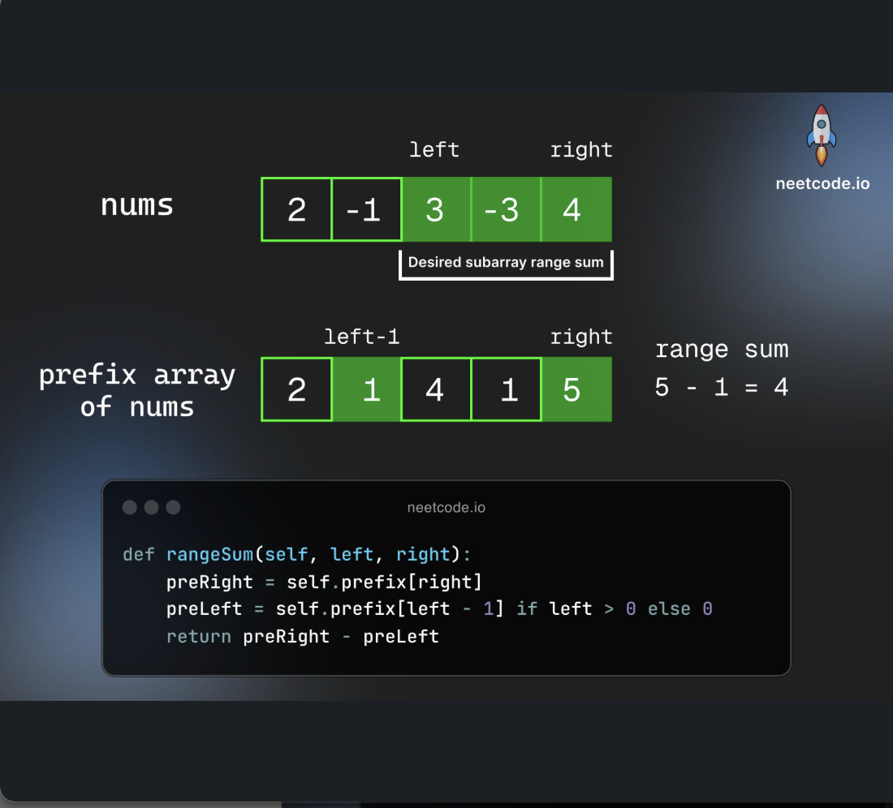
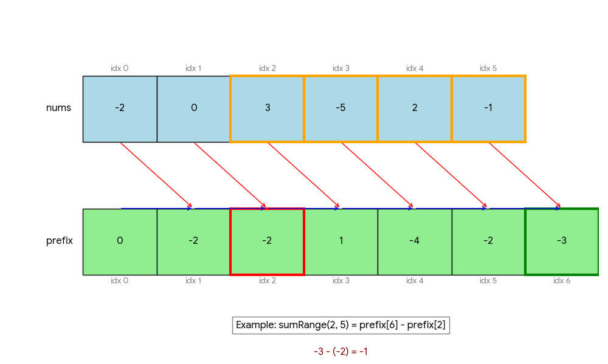

# Prefix Sum (前缀和)

> **Scope** — Prefix / running sums — subarray sums, 2D prefix sums, prefix + hashmap counting.
> **See also**: [prefix_sum_advanced.md](./prefix_sum_advanced.md) — templates 9–13, the ones that borrow another structure; [prefix_sum_examples.md](./prefix_sum_examples.md) — the worked problems no template already solves; [difference_array.md](./difference_array.md) — range *updates* instead of range queries; [binary_indexed_tree.md](./binary_indexed_tree.md) — when the array also changes; [kadane_algorithm.md](./kadane_algorithm.md) — max subarray without prefix sums; [tree_backtrack.md](./tree_backtrack.md) — the root→leaf path DFS that template 14 generalises.

<p align="center"></p>

## LeetCode Problem Lists

- [Prefix Sum](https://leetcode.com/problem-list/prefix-sum/)

## Overview

**Prefix Sum** is a preprocessing technique that allows us to compute the sum of any subarray in O(1) time after O(n) preprocessing. The core idea is to precompute cumulative sums from the beginning of the array to each position.

### Key Properties
- **Time Complexity**: 
  - Preprocessing: O(n)
  - Query subarray sum: O(1)
  - Overall: O(n) preprocessing + O(1) per query
- **Space Complexity**: O(n) for storing prefix sums
- **Core Idea**: `prefixSum[i] = nums[0] + nums[1] + ... + nums[i-1]`
- **Subarray Sum**: `sum(i, j) = prefixSum[j+1] - prefixSum[i]`
- **When to Use**: 
  - Multiple range sum queries
  - Subarray problems with conditions
  - Converting O(n²) to O(n) with HashMap
  - 2D range sum queries

### References
- [Fucking Algorithm - Prefix Sum](https://labuladong.github.io/algo/2/19/22/)
- [LeetCode Prefix Sum Problems](https://leetcode.com/tag/prefix-sum/)
- [LeetCode Problem Set Discussion](https://leetcode.com/discuss/general-discussion/563022/prefix-sum-problems)
- [Hash Map Cheatsheet](https://github.com/yennanliu/CS_basics/blob/master/doc/cheatsheet/hash_map.md)

## Problem Categories

### **Pattern 1: Basic Range Sum** — LC 303
- **Description**: Calculate sum of elements in any given range [i, j]
- **Examples**: LC 303 - Range Sum Query, LC 304 - Range Sum Query 2D
- **Pattern**: Direct application of prefix sum formula
- **Key Insight**: `sum[i:j] = prefixSum[j+1] - prefixSum[i]`

### **Pattern 2: Subarray Sum Equals Target** — LC 560
- **Description**: Find/count subarrays with sum equal to target value
- **Examples**: LC 560 - Subarray Sum Equals K, LC 325 - Maximum Size Subarray Sum Equals k
- **Pattern**: Use HashMap to store prefix sums and check if `(current_sum - target)` exists
- **Key Insight**: If `prefixSum[j] - prefixSum[i] = k`, then `prefixSum[i] = prefixSum[j] - k`

### **Pattern 3: Subarray with Divisibility/Modulo** — LC 523
- **Description**: Problems involving divisibility, remainders, or modulo operations
- **Examples**: LC 523 - Continuous Subarray Sum, LC 974 - Subarray Sums Divisible by K
- **Pattern**: Store remainders instead of actual sums in HashMap
- **Key Insight**: If `(prefixSum[j] - prefixSum[i]) % k = 0`, then `prefixSum[j] % k = prefixSum[i] % k`

### **Pattern 4: Range Addition/Difference Array** — LC 370
- **Description**: Efficiently apply range updates to arrays
- **Examples**: LC 370 - Range Addition, LC 1094 - Car Pooling
- **Pattern**: Use difference array technique with prefix sum
- **Key Insight**: Add at start, subtract at end+1, then compute prefix sum

### **Pattern 5: 2D Prefix Sum** — LC 304
- **Description**: Calculate sum of any rectangular region in 2D matrix
- **Examples**: LC 304 - Range Sum Query 2D, LC 1314 - Matrix Block Sum
- **Pattern**: Build 2D prefix sum matrix, use inclusion-exclusion principle
- **Key Insight**: `sum = total - left - top + topleft`

### **Pattern 6: Transform and Count** — LC 1248
- **Description**: Transform array elements and use prefix sum for counting
- **Examples**: LC 1248 - Count Nice Subarrays, LC 926 - Flip String to Monotone
- **Pattern**: Convert elements to 0/1, then apply prefix sum with conditions
- **Key Insight**: Transform problem to simpler prefix sum problem

### **Pattern 7: Sum of Distances (Left-Right Split)** — LC 2615
- **Description**: Calculate sum of absolute differences between indices efficiently
- **Examples**: LC 2615 - Sum of Distances (LC 2121 - Intervals Between Identical Elements is the **same problem**), LC 1685 - Sum of Absolute Differences, LC 2602 - Minimum Operations to Make All Array Elements Equal
- **Pattern**: Group by value, then split each group into left/right parts and use the `count * value - sum` formula
- **Key Insight**: For index `i`, distance = `(i * countLeft - sumLeft) + (sumRight - i * countRight)`, which collapses to `total - 2*prefixSum + i*(2*rank - groupSize)`

### **Pattern 8: Prefix Maximum (Greedy Chunk / Partition)** — LC 769
- **Description**: Track the running maximum of the array. When `maxSoFar == i`, the prefix `[0..i]` contains exactly the elements `{0, 1, ..., i}` and can form an independent sorted chunk.
- **Examples**: LC 769 - Max Chunks To Make Sorted, LC 768 - Max Chunks To Make Sorted II, LC 2012 - Sum of Beauty in the Array
- **Pattern**: Single pass with a `maxSoFar` variable; increment chunk count whenever `maxSoFar == currentIndex`
- **Key Insight**: Because the array is a permutation of `[0, n-1]`, if the max value seen so far equals the current index, all values needed for positions `0..i` are already present in `arr[0..i]`

## 0) Concept

### How to Build the Prefix Sum Array (核心)

The whole technique rests on **one core line**. Memorize this and the rest follows:

```python
for i in range(len(cnt)):
    prefix[i + 1] = prefix[i] + cnt[i]
```

**Step-by-step:**

```python
cnt = [1, 0, 1, 1, 1]

# Step 1: allocate size n+1, fill with 0
#   the leading prefix[0] = 0 is the "empty sum" sentinel
#   -> lets sum(0, r) work without a special case
prefix = [0] * (len(cnt) + 1)
# prefix = [0, 0, 0, 0, 0, 0]

# Step 2: each prefix[i+1] = running total up to (and including) cnt[i]
for i in range(len(cnt)):
    prefix[i + 1] = prefix[i] + cnt[i]

# prefix = [0, 1, 1, 2, 3, 4]
```

**Trace (why the index is `i + 1`, not `i`):**

```text
cnt:        [ 1,  0,  1,  1,  1 ]
index i:      0   1   2   3   4

prefix[0] = 0                 ← sentinel (empty prefix)
prefix[1] = prefix[0] + cnt[0] = 0 + 1 = 1
prefix[2] = prefix[1] + cnt[1] = 1 + 0 = 1
prefix[3] = prefix[2] + cnt[2] = 1 + 1 = 2
prefix[4] = prefix[3] + cnt[3] = 2 + 1 = 3
prefix[5] = prefix[4] + cnt[4] = 3 + 1 = 4

prefix = [0, 1, 1, 2, 3, 4]
          ↑                 ↑
       empty sum        sum of ALL cnt
```

> **Key:** `prefix` is one element LONGER than `cnt`. `prefix[i+1]` answers
> "sum of the first `i+1` elements" = `cnt[0] + ... + cnt[i]`.

**One-liner alternative** (`itertools.accumulate` with a leading 0):

```python
from itertools import accumulate
prefix = list(accumulate(cnt, initial=0))   # [0, 1, 1, 2, 3, 4]
```

### Why `sum(l, r) = prefix[r+1] - prefix[l]`

<p align="center"></p>

```text
Given nums:    [ a,  b,  c,  d,  e ]
Index:           0   1   2   3   4

Build prefix array (size n+1, prefix[0] = 0):

prefix[0] = 0
prefix[1] = a
prefix[2] = a + b
prefix[3] = a + b + c
prefix[4] = a + b + c + d
prefix[5] = a + b + c + d + e

Visual:

prefix:  0 |  a  | a+b | a+b+c | a+b+c+d | a+b+c+d+e |
index:   0    1      2      3        4          5

To get sum(l=1, r=3) = nums[1] + nums[2] + nums[3] = b + c + d:

prefix[r+1] = prefix[4] = a + b + c + d
prefix[l]   = prefix[1] = a
                           ─────────────
prefix[4] - prefix[1]   =     b + c + d  ✓

Visually (what gets cancelled out):

prefix[4]:  [ a | b | c | d ]
prefix[1]:  [ a ]
            ─────────────────
difference:     [ b | c | d ]   ← this is sum(1, 3)
```

**Why size `n+1`?** The extra `prefix[0] = 0` handles the edge case when `l = 0`:
```text
sum(0, 2) = prefix[3] - prefix[0]
          = (a + b + c) - 0
          = a + b + c  ✓
```
Without it, we'd need special `if (left == 0)` checks (see V0 in LC 303).

### Concrete Example — LC 303

```text
nums = [-2, 0, 3, -5, 2, -1]

Step 1: Build prefix array
prefix = [0, -2, -2, 1, -4, -2, -3]
              ↑    ↑  ↑   ↑   ↑   ↑
              -2  -2+0 ...        sum of all

Step 2: Query
sumRange(0, 2) = prefix[3] - prefix[0] = 1 - 0 = 1       ✓  (-2+0+3)
sumRange(2, 5) = prefix[6] - prefix[2] = -3 - (-2) = -1  ✓  (3-5+2-1)
sumRange(0, 5) = prefix[6] - prefix[0] = -3 - 0 = -3     ✓  (-2+0+3-5+2-1)
```

### Two Styles Comparison

| Style | Prefix Size | Build | Query `sum(l, r)` | Edge Case |
|-------|-------------|-------|--------------------|-----------|
| **Size `n+1`** (recommended) | `n + 1` | `prefix[i+1] = prefix[i] + nums[i]` | `prefix[r+1] - prefix[l]` | No special case needed |
| **Size `n`** | `n` | `prefix[i] = prefix[i-1] + nums[i]` | `prefix[r] - (l > 0 ? prefix[l-1] : 0)` | Need `if (l == 0)` check |

## Templates & Algorithms

### Template Comparison Table

| Template Type | Use Case | Key Data Structure | When to Use |
|---------------|----------|-------------------|-------------|
| **Basic Prefix Sum** | Range sum queries | Array | Need multiple range sum calculations |
| **HashMap + Prefix Sum** | Subarray with target sum | HashMap | Find/count subarrays with specific sum |
| **Modulo Prefix Sum** | Divisibility problems | HashMap with remainders | Subarray sum divisible by k |
| **Difference Array** | Range updates | Array with start/end markers | Multiple range additions |
| **2D Prefix Sum** | Rectangle sum queries | 2D matrix | 2D range sum calculations |
| **Sum of Distances** | Absolute difference sums | HashMap + Prefix Sum | Sum of |i-j| for matching elements |

### Universal Template

```python
def prefix_sum_solve(nums, target):
    """
    Universal prefix sum template for most problems
    """
    # Step 1: Initialize prefix sum and result
    prefix_sum = 0
    result = 0
    
    # Step 2: HashMap for storing prefix sums (if needed)
    prefix_map = {0: 1}  # Handle subarrays starting from index 0
    
    # Step 3: Iterate through array
    for num in nums:
        # Update prefix sum
        prefix_sum += num
        
        # Check condition based on problem type
        if prefix_sum - target in prefix_map:
            result += prefix_map[prefix_sum - target]
        
        # Update map
        prefix_map[prefix_sum] = prefix_map.get(prefix_sum, 0) + 1
    
    return result
```

### Template 1: Basic Prefix Sum (Range Queries) — LC 303

```python
class PrefixSum:
    def __init__(self, nums):
        """Build prefix sum array for range queries"""
        self.prefix = [0] * (len(nums) + 1)
        for i in range(len(nums)):
            self.prefix[i + 1] = self.prefix[i] + nums[i]
    
    def range_sum(self, left, right):
        """Get sum of elements from index left to right (inclusive)"""
        return self.prefix[right + 1] - self.prefix[left]
```

```java
// Java implementation
class PrefixSum {
    private int[] prefix;
    
    public PrefixSum(int[] nums) {
        prefix = new int[nums.length + 1];
        for (int i = 0; i < nums.length; i++) {
            prefix[i + 1] = prefix[i] + nums[i];
        }
    }
    
    public int rangeSum(int left, int right) {
        return prefix[right + 1] - prefix[left];
    }
}
```

### Template 2: HashMap + Prefix Sum (Subarray Target Sum) — LC 560

```python
def subarray_sum_equals_k(nums, k):
    """Count subarrays with sum equal to k"""
    count = 0
    prefix_sum = 0
    prefix_map = {0: 1}  # Important: initialize with {0: 1}
    
    for num in nums:
        prefix_sum += num
        
        # Check if (prefix_sum - k) exists
        if prefix_sum - k in prefix_map:
            count += prefix_map[prefix_sum - k]
        
        # Update map
        prefix_map[prefix_sum] = prefix_map.get(prefix_sum, 0) + 1
    
    return count
```

```java
// Java implementation
public int subarraySum(int[] nums, int k) {
    int count = 0, prefixSum = 0;
    Map<Integer, Integer> map = new HashMap<>();
    map.put(0, 1);  // Handle subarrays starting from index 0
    
    for (int num : nums) {
        prefixSum += num;
        
        if (map.containsKey(prefixSum - k)) {
            count += map.get(prefixSum - k);
        }
        
        map.put(prefixSum, map.getOrDefault(prefixSum, 0) + 1);
    }
    
    return count;
}
```

> **Why the map stores a count, not an index** — the same prefix sum can be reached at
> many positions, and every one of them starts a valid subarray ending here. Storing the
> latest index would count one of them; storing how many times the sum has been seen counts
> all of them, which is why the update is `map[sum] += 1` and the read is `count += map[sum - k]`.

### Template 3: Modulo Prefix Sum (Divisibility Problems) — LC 974

**Core Mathematical Insight:**
```text
Let prefix[i] = sum of nums[0..i]

A subarray sum nums[j+1..i] is divisible by k:
  (prefix[i] - prefix[j]) % k == 0

This implies:
  prefix[i] % k == prefix[j] % k

So if we see the SAME remainder again at index i vs a previous index j,
the subarray nums[j+1..i] has sum divisible by k.

map stores: { remainder -> earliest index }

If the current remainder already exists in the map
AND the distance (i - map[remainder]) >= 2, we found a valid subarray.
```

```python
def subarray_divisible_by_k(nums, k):
    """Count subarrays with sum divisible by k"""
    count = 0
    prefix_sum = 0
    remainder_map = {0: 1}  # remainder -> count
    
    for num in nums:
        prefix_sum += num
        remainder = prefix_sum % k
        
        # Handle negative remainders
        if remainder < 0:
            remainder += k
        
        if remainder in remainder_map:
            count += remainder_map[remainder]
        
        remainder_map[remainder] = remainder_map.get(remainder, 0) + 1
    
    return count
```

### Template 4: Difference Array (Range Updates) — LC 370

```python
def range_addition(length, updates):
    """Apply multiple range additions efficiently"""
    # Step 1: Create difference array
    diff = [0] * (length + 1)
    
    # Step 2: Apply range updates to difference array
    for start, end, val in updates:
        diff[start] += val
        diff[end + 1] -= val
    
    # Step 3: Compute prefix sum to get final result
    result = []
    current_sum = 0
    for i in range(length):
        current_sum += diff[i]
        result.append(current_sum)
    
    return result
```

### Template 5: 2D Prefix Sum — LC 304

```python
class NumMatrix:
    def __init__(self, matrix):
        """Build 2D prefix sum matrix"""
        if not matrix or not matrix[0]:
            return
        
        m, n = len(matrix), len(matrix[0])
        self.prefix = [[0] * (n + 1) for _ in range(m + 1)]
        
        for i in range(1, m + 1):
            for j in range(1, n + 1):
                self.prefix[i][j] = (matrix[i-1][j-1] + 
                                   self.prefix[i-1][j] + 
                                   self.prefix[i][j-1] - 
                                   self.prefix[i-1][j-1])
    
    def sumRegion(self, row1, col1, row2, col2):
        """Calculate sum of rectangle from (row1,col1) to (row2,col2)"""
        return (self.prefix[row2+1][col2+1] - 
                self.prefix[row1][col2+1] - 
                self.prefix[row2+1][col1] + 
                self.prefix[row1][col1])
```

### Template 6: Transform and Count — LC 1248

```python
def count_nice_subarrays(nums, k):
    """Count subarrays with exactly k odd numbers"""
    # Transform: odd -> 1, even -> 0
    transformed = [1 if x % 2 == 1 else 0 for x in nums]

    # Now it's subarray sum equals k problem
    count = 0
    prefix_sum = 0
    prefix_map = {0: 1}

    for val in transformed:
        prefix_sum += val

        if prefix_sum - k in prefix_map:
            count += prefix_map[prefix_sum - k]

        prefix_map[prefix_sum] = prefix_map.get(prefix_sum, 0) + 1

    return count
```

> **You do not have to materialise the transformed array.** `transformed` above makes the
> "odd → 1, even → 0" step visible, but testing `x % 2` inside the same loop that maintains
> the prefix sum is the form to write under time pressure — the transform is one predicate,
> not a pass.

### Template 7: Sum of Distances (Left-Right Split) — LC 2615

This pattern efficiently calculates sum of absolute differences `|i - j|` between indices.

#### Core Idea

Two moves, in this order:

1. **Group the indices by value** (`{value: [indices]}`), because `|i - j|` only ever runs between
   equal values — every group is an independent, self-contained sub-problem.
2. **Inside a group, drop the absolute value by splitting at the pivot.** Everything to the left is
   `pivot - other`, everything to the right is `other - pivot`; no bars survive, and each half is
   `count * pivot ∓ sum` — a prefix sum away.

> **The group's indices arrive sorted for free.** You append `i` while scanning left to right, so
> each list is already increasing. That is what makes the whole thing `O(n)` — sorting the groups
> would cost `O(n log n)` and buys nothing. Never sort here; it is the giveaway that the grouping
> step was not understood.

#### The Derivation

**Setup — the notation the rest of this section uses**

```text
indices = [i_0, i_1, i_2, ..., i_{m-1}]   the sorted indices of ONE value
m       = len(indices)

For the element at RANK k inside that group:
  idx       = indices[k]      its position in the ORIGINAL array
  left_cnt  = k               how many equal values sit before it
  right_cnt = m - 1 - k       how many sit after it

Prefix sum over the group (size m+1, leading sentinel):
  prefix[0]     = 0                                  the empty sum
  prefix[k]     = i_0 + i_1 + ... + i_{k-1}          first k     → everything LEFT of rank k
  prefix[k + 1] = i_0 + i_1 + ... + i_k              first k + 1 → the left part, plus idx itself
  prefix[m]     = i_0 + i_1 + ... + i_{m-1}          the whole group
```

> **Two different indices are in play, and confusing them is the classic slip.** `k` is the rank
> *within the group* — it indexes `indices` and `prefix`. `idx = indices[k]` is the position *in
> `nums`* — it is the value being summed over, and it is where the answer is written
> (`res[idx]`, never `res[k]`).

**Reading a prefix index — the one rule the whole derivation leans on**

```text
prefixSum[i] = nums[0] + nums[1] + ... + nums[i-1]

  -> so, when we say prefixSum[i],
     we are summing the values in [0, i-1]   ← i is EXCLUSIVE, i itself is NOT in the sum

Applied to a group's indices:

  -> i_0 + i_1 + ... + i_{k-1}          is   prefix[k]
     (everything strictly LEFT of rank k)          upper end k is excluded, so idx is out ✓

  -> i_{k+1} + i_{k+2} + ... + i_{m-1}  is   prefix[m] - prefix[k + 1]
     (everything strictly RIGHT of rank k)         whole group, minus the first k+1 (which ends AT idx)
```

**Concrete example** — group `[2, 5, 8, 12]`, `m = 4`, so `prefix = [0, 2, 7, 15, 27]`:

```text
rank k:      0   1   2    3
indices:     2   5   8   12
prefix:  0   2   7  15   27
         ↑                ↑
    prefix[0]         prefix[4] = prefix[m]

At rank k = 2  (idx = 8):

  left part  = i_0 + i_1                  = 2 + 5  = 7
             = prefix[k]  = prefix[2]     = 7                       ✓ (8 is NOT included)

  right part = i_3                        = 12
             = prefix[m] - prefix[k + 1]
             = prefix[4] - prefix[3]      = 27 - 15 = 12            ✓ (8 is NOT included)

Contrast the off-by-one:
  prefix[m] - prefix[k] = 27 - 7 = 20 = 8 + 12   ← still carries idx itself, hence prefix[k+1]
```


**1) Left distance** — every index to the left is smaller, so `|idx - i| = idx - i` and the bars drop:

```text
left = (idx - i_0) + (idx - i_1) + ... + (idx - i_{k-1})

     = (idx + idx + ... + idx)  -  (i_0 + i_1 + ... + i_{k-1})
       └─── k copies of idx ──┘     └── sum of the first k ──┘

     = idx * k - (i_0 + ... + i_{k-1})

     = idx * left_cnt - prefix[k]
```

**2) Right distance** — every index to the right is larger, so `|idx - i| = i - idx`:

```text
right = (i_{k+1} - idx) + (i_{k+2} - idx) + ... + (i_{m-1} - idx)

      = (i_{k+1} + i_{k+2} + ... + i_{m-1})  -  (idx + ... + idx)
        └───── sum of the right part ──────┘     └ m-1-k copies ┘

      = (total_sum - sum_up_to_and_including_idx) - idx * (m - 1 - k)

      = (prefix[m] - prefix[k + 1]) - idx * right_cnt
```

> **Why the right part subtracts `prefix[k + 1]` and not `prefix[k]`.** `prefix[k]` stops *before*
> `idx`, so `prefix[m] - prefix[k]` still contains `idx` — pairing that with `right_cnt = m - 1 - k`
> overshoots the answer by exactly `idx`. The sum and the count have to agree on whether the pivot
> is in the right part; `prefix[k + 1]` with `m - 1 - k` says it is not.

**3) Total distance**

```text
res[idx] = left + right
         = (idx * left_cnt - prefix[k])  +  ((prefix[m] - prefix[k + 1]) - idx * right_cnt)
```

That is `O(1)` per element after an `O(m)` prefix pass over the group, so `O(n)` overall — against
`O(n^2)` for comparing every pair.

#### Visual Explanation

```text
One group's indices: [2, 5, 8, 12]        m = 4
rank k:               0  1  2   3

prefix = [0, 2, 7, 15, 27]
          ↑                ↑
       empty sum        prefix[m] = whole group

Take rank k = 2  →  idx = 8, left_cnt = 2, right_cnt = m-1-k = 1

  left  = idx * left_cnt - prefix[k]
        = 8 * 2 - prefix[2]                    prefix[2] = 2 + 5 = 7
        = 16 - 7 = 9                           → |8-2| + |8-5| = 6 + 3 = 9 ✓

  right = (prefix[m] - prefix[k+1]) - idx * right_cnt
        = (27 - 15) - 8 * 1                    prefix[3] = 2 + 5 + 8 = 15
        = 12 - 8 = 4                           → |12-8| = 4 ✓

  res[8] = 9 + 4 = 13
```

**End to end on the LC 2615 example** — `nums = [1,3,1,1,2]`, expected `[5,0,3,4,0]`:

```text
groups:  1 -> [0, 2, 3]      3 -> [1]      2 -> [4]

Group [0, 2, 3]:  m = 3,  prefix = [0, 0, 2, 5]

 k=0  idx=0  left_cnt=0 right_cnt=2   left = 0*0 - prefix[0] = 0
                                      right = (5 - prefix[1]) - 0*2 = 5 - 0 = 5   res[0] = 5 ✓
 k=1  idx=2  left_cnt=1 right_cnt=1   left = 2*1 - prefix[1] = 2 - 0 = 2
                                      right = (5 - prefix[2]) - 2*1 = 3 - 2 = 1   res[2] = 3 ✓
 k=2  idx=3  left_cnt=2 right_cnt=0   left = 3*2 - prefix[2] = 6 - 2 = 4
                                      right = (5 - prefix[3]) - 3*0 = 0           res[3] = 4 ✓

Single-index groups keep res = 0  →  res[1] = res[4] = 0 ✓
```

#### Python Template
```python
def sum_of_distances(nums):
    """
    LC 2615: Calculate sum of |i - j| for all j where nums[j] == nums[i]
    Time: O(n), Space: O(n)
    """
    from collections import defaultdict

    n = len(nums)
    result = [0] * n

    # Step 1: Group indices by value
    index_map = defaultdict(list)
    for i, num in enumerate(nums):
        index_map[num].append(i)

    # Step 2: For each group, calculate distances using prefix sum
    for indices in index_map.values():
        m = len(indices)
        if m == 1:
            continue  # Single element has distance 0

        # prefix[k] = sum of the first k indices  (size m+1, prefix[0] = 0)
        prefix = [0] * (m + 1)
        for k in range(m):
            prefix[k + 1] = prefix[k] + indices[k]

        # Calculate distance for each index in group
        for k in range(m):
            idx = indices[k]

            # Left part: idx * left_cnt - prefix[k]
            left_cnt = k
            left_dist = idx * left_cnt - prefix[k]

            # Right part: (prefix[m] - prefix[k+1]) - idx * right_cnt
            right_cnt = m - 1 - k
            right_dist = (prefix[m] - prefix[k + 1]) - idx * right_cnt

            result[idx] = left_dist + right_dist

    return result
```

#### Java Template
```java
// LC 2615 - Sum of Distances
public long[] distance(int[] nums) {
    int n = nums.length;
    long[] res = new long[n];
    Map<Integer, List<Integer>> map = new HashMap<>();

    // Step 1: Group indices by value
    for (int i = 0; i < n; i++) {
        map.computeIfAbsent(nums[i], k -> new ArrayList<>()).add(i);
    }

    // Step 2: Calculate distances using prefix sum
    for (List<Integer> indices : map.values()) {
        int m = indices.size();
        if (m == 1) continue;

        // prefix[k] = sum of the first k indices  (size m+1, prefix[0] = 0)
        long[] prefix = new long[m + 1];
        for (int k = 0; k < m; k++) {
            prefix[k + 1] = prefix[k] + indices.get(k);
        }

        // Calculate distance for each index
        for (int k = 0; k < m; k++) {
            int idx = indices.get(k);

            // Left: idx * left_cnt - prefix[k]
            long left = (long) idx * k - prefix[k];

            // Right: (prefix[m] - prefix[k+1]) - idx * right_cnt
            long right = (prefix[m] - prefix[k + 1]) - (long) idx * (m - 1 - k);

            res[idx] = left + right;
        }
    }

    return res;
}
```

#### Alternative: Running Sum Approach (No Prefix Array)
```python
def sum_of_distances_optimized(nums):
    """Space-optimized version using running sums"""
    from collections import defaultdict

    n = len(nums)
    result = [0] * n
    index_map = defaultdict(list)

    for i, num in enumerate(nums):
        index_map[num].append(i)

    for indices in index_map.values():
        m = len(indices)
        if m == 1:
            continue

        # Calculate total sum once
        total_sum = sum(indices)

        prefix_sum = 0
        for i, idx in enumerate(indices):
            # Left: idx * i - prefix_sum
            # Right: (total_sum - prefix_sum - idx) - idx * (m - i - 1)
            left_dist = idx * i - prefix_sum
            right_dist = (total_sum - prefix_sum - idx) - idx * (m - i - 1)

            result[idx] = left_dist + right_dist
            prefix_sum += idx

    return result
```

#### The Same Thing in One Line (the identity worth memorising)

The left/right split is how you *derive* the answer at the whiteboard, but the two halves collapse
algebraically into a single expression — no branch, no `countLeft` / `countRight` bookkeeping:

```text
left  = idx * i           - prefixSum
right = (total - prefixSum - idx) - idx * (m - i - 1)

left + right
  = idx*i - prefixSum + total - prefixSum - idx - idx*m + idx*i + idx
  = total - 2 * prefixSum + idx * (2*i - m)
                             ↑
                    the -idx and +idx cancel
```

```python
# python
# LC 2615 - Sum of Distances  (collapsed form)
# IDEA: total - 2*prefixSum + idx*(2i - m) is exactly leftDist + rightDist
# time = O(n), space = O(n)
from collections import defaultdict

def distance(nums):
    groups = defaultdict(list)
    for i, v in enumerate(nums):
        groups[v].append(i)

    res = [0] * len(nums)
    for group in groups.values():
        total, prefix_sum, m = sum(group), 0, len(group)
        for i, idx in enumerate(group):
            res[idx] = total - prefix_sum * 2 + idx * (2 * i - m)
            prefix_sum += idx
    return res
```

> **The `m == 1` guard becomes unnecessary.** For a single-occurrence group the formula reads
> `idx - 0 + idx*(0 - 1) = 0` on its own, which is the answer the problem asks for. The split form
> needs `if m == 1: continue` only because it is written as two pieces.

#### Formula Summary

At rank `k` of a group of size `m`, with `idx = indices[k]` and `prefix` the size-`m+1` prefix sum:

| Component | Formula | Meaning |
|-----------|---------|---------|
| **Left count / sum** | `left_cnt = k`, `sum_left = prefix[k]` | the `k` equal values before `idx` |
| **Right count / sum** | `right_cnt = m - 1 - k`, `sum_right = prefix[m] - prefix[k + 1]` | the equal values after `idx`, pivot excluded |
| **Left Distance** | `idx * left_cnt - prefix[k]` | Sum of `(idx - smaller_idx)` |
| **Right Distance** | `(prefix[m] - prefix[k + 1]) - idx * right_cnt` | Sum of `(larger_idx - idx)` |
| **Total Distance** | `left + right` → `res[idx]` | Sum of all `\|idx - other_idx\|` |

#### Similar Problems — the `count * value − sum` family

Every one of these is the same identity; what changes is *what the sorted list holds* and *where it
comes from*.

| Problem | The sorted list is… | Difference from LC 2615 |
|---|---|---|
| **LC 2121** Intervals Between Identical Elements | indices grouped by value | **The identical problem.** LC 2615's statement says so outright — same input, same output, different title |
| **LC 1685** Sum of Absolute Differences in a Sorted Array | the *values*, already sorted | no grouping and no hash map — the array itself is the group, so it is the one-group case |
| **LC 2602** Minimum Operations to Make All Array Elements Equal | the sorted values, plus a prefix array | the pivot is a **query**, not an element, so binary search for its insertion point first, then apply the same two halves |
| **LC 2448** Minimum Cost to Make Array Equal | values sorted, carrying weights | each element counts `w` times: the counts become weight sums, so prefix over `w` and over `w*v` |
| **LC 462** Minimum Moves to Equal Array Elements II | the sorted values | asks only for the *minimum* over pivots, which the median gives — no per-element pass needed |
| **LC 834** Sum of Distances in Tree | — | the "line" is a tree, so the left/right split becomes subtree / everything-else, computed by re-rooting |

> **Recognising it in the room.** The trigger is a sum of `|x − y|` over a set you can sort. Sorting
> removes the absolute value — everything before the pivot subtracts, everything after adds — and
> once the bars are gone, each half is `count × pivot ∓ sum`, which prefix sums answer in `O(1)`.
> Say that sentence and the `O(n^2)` brute force is already behind you.

### Template 8: Prefix Maximum (Greedy Chunk / Partition) — LC 769

**Core Idea:** For a permutation of `[0, n-1]`, the prefix `arr[0..i]` can be an independent sorted chunk if and only if `max(arr[0..i]) == i`. Track this with a single `maxSoFar` variable.

```java
// Java — LC 769 Max Chunks To Make Sorted
// Time: O(n)  Space: O(1)
public int maxChunksToSorted(int[] arr) {
    int chunks = 0, maxSoFar = 0;
    for (int i = 0; i < arr.length; i++) {
        maxSoFar = Math.max(maxSoFar, arr[i]);
        if (maxSoFar == i) chunks++;   // all values 0..i are present in arr[0..i]
    }
    return chunks;
}
```

```python
# Python — LC 769
def maxChunksToSorted(arr):
    chunks = max_so_far = 0
    for i, val in enumerate(arr):
        max_so_far = max(max_so_far, val)
        if max_so_far == i:
            chunks += 1
    return chunks
```

**Equivalent prefix-sum formulation** (also O(n)/O(1)):
```java
// prefixSum of arr == prefixSum of sorted arr  →  same multiset in [0..i]
int chunks = 0, prefixSum = 0, sortedPrefixSum = 0;
for (int i = 0; i < arr.length; i++) {
    prefixSum += arr[i];
    sortedPrefixSum += i;           // sorted array is [0,1,2,...,n-1]
    if (prefixSum == sortedPrefixSum) chunks++;
}
```

> **Why comparing sums is enough for LC 769.** The values are a permutation of `0..n-1`, so
> a prefix of `arr` can only have the same sum as the same-length prefix of the sorted array
> if it holds the same *set* of values — in some order. That is exactly the condition for the
> prefix to be a self-contained chunk, which is why the sum test needs no sorting.

**When to upgrade to PrefixMax + SuffixMin (LC 768, general arrays):**
```java
// If values are NOT a permutation, use:
// max(arr[0..i-1]) < min(arr[i..n-1])  →  valid cut point
int[] prefixMax = arr.clone(), suffixMin = arr.clone();
for (int i = 1; i < n; i++) prefixMax[i] = Math.max(prefixMax[i-1], prefixMax[i]);
for (int i = n-2; i >= 0; i--) suffixMin[i] = Math.min(suffixMin[i+1], suffixMin[i]);
int chunks = 0;
for (int i = 0; i < n; i++)
    if (i == 0 || suffixMin[i] > prefixMax[i-1]) chunks++;
```

> **The same pair asked about an element, not a cut.** LC 2012 keeps `prefixMax` and
> `suffixMin` but tests `prefixMax[i] < nums[i] < suffixMin[i]`, and only the suffix side
> needs an array — worked through in
> [prefix_sum_examples.md § Prefix max / suffix min scans](./prefix_sum_examples.md#prefix-max--suffix-min-scans).


## Advanced Templates

Templates **9–14** moved to **[prefix_sum_advanced.md](./prefix_sum_advanced.md)**. They are the
ones that stop being "build the array, subtract two entries" and start borrowing another
structure:

| # | Template | The borrowed idea | LC |
|---|---|---|---|
| 9 | [Complement trick — total − middle window](./prefix_sum_advanced.md#template-9-complement-trick--total--middle-window---lc-1423) ⭐⭐⭐⭐⭐ | a wrap-around choice becomes one contiguous window to *exclude* | 1423 |
| 10 | [Prefix sum + monotonic deque](./prefix_sum_advanced.md#template-10-prefix-sum--monotonic-deque-shortest-subarray-allows-negatives---lc-862) | a deque, because negatives break the two-pointer window | 862 |
| 11 | [Row-pair compression](./prefix_sum_advanced.md#template-11-row-pair-compression--collapse-2d-into-1d-prefix-sum---lc-363) ⭐⭐⭐⭐ | collapse 2D to 1D by fixing a pair of rows | 363, 1074 |
| 12 | [Prefix XOR](./prefix_sum_advanced.md#template-12-prefix-xor---lc-1310) ⭐⭐⭐⭐ | XOR is its own inverse, so the same subtraction identity holds | 1310 |
| 13 | [Sparse difference array via HashMap](./prefix_sum_advanced.md#template-13-sparse-difference-array-via-hashmap-line-sweep---lc-2021) ⭐⭐⭐⭐⭐ | a hash map instead of an array, when the coordinates are huge | 2021 |
| 14 | [Prefix sum on a tree](./prefix_sum_advanced.md#template-14-prefix-sum-on-a-tree-dfs--hashmap--backtrack---lc-437) ⭐⭐⭐⭐⭐ | the DFS stack *is* the array — Template 2 plus an undo on the way back up | 437 |


## Problems by Pattern

### Pattern-Based Problem Classification

#### **Pattern 1: Basic Range Sum Problems**
| Problem | LC # | Key Technique | Difficulty | Template |
|---------|------|---------------|------------|----------|
| Range Sum Query - Immutable | 303 | Basic prefix sum array | Easy | Template 1 |
| Range Sum Query 2D - Immutable | 304 | 2D prefix sum | Medium | Template 5 |
| Product of Array Except Self | 238 | Left/right prefix products | Medium | Modified Template 1 |
| Running Sum of 1d Array | 1480 | Direct prefix sum | Easy | Template 1 |
| Find Pivot Index | 724 | Left sum vs right sum | Easy | Template 1 |

#### **Pattern 2: Subarray Sum Equals Target Problems**
| Problem | LC # | Key Technique | Difficulty | Template |
|---------|------|---------------|------------|----------|
| Subarray Sum Equals K | 560 | HashMap + prefix sum | Medium | Template 2 |
| Maximum Size Subarray Sum Equals k | 325 | HashMap with indices | Medium | Template 2 |
| Subarray Sum Equals K II | 713 | Product version | Medium | Modified Template 2 |
| Binary Subarrays With Sum | 930 | Transform to sum equals | Medium | Template 6 |
| Number of Subarrays with Bounded Maximum | 795 | Range sum technique | Medium | Template 2 |
| Longest Well-Performing Interval | 1124 | First-occurrence map + score-1 trick | Medium | Template 2 variant |

#### **Pattern 3: Subarray with Divisibility/Modulo Problems**
| Problem | LC # | Key Technique | Difficulty | Template |
|---------|------|---------------|------------|----------|
| Subarray Sums Divisible by K | 974 | Modulo prefix sum | Medium | Template 3 |
| Continuous Subarray Sum | 523 | Modulo with length check | Medium | Template 3 |
| Make Sum Divisible by P | 1590 | Advanced modulo technique | Medium | Template 3 |
| Check If Array Pairs Are Divisible by k | 1497 | Frequency of remainders | Medium | Modified Template 3 |

#### **Pattern 4: Range Addition/Updates Problems**
| Problem | LC # | Key Technique | Difficulty | Template |
|---------|------|---------------|------------|----------|
| Range Addition | 370 | Difference array | Medium | Template 4 |
| Car Pooling | 1094 | Timeline simulation | Medium | Template 4 |
| Corporate Flight Bookings | 1109 | Range updates | Medium | Template 4 |
| Maximum Population Year | 1854 | Event processing | Easy | Template 4 |
| Meeting Rooms II | 253 | Overlap counting | Medium | Template 4 |
| Brightest Position on Street | 2021 | Sparse diff array (HashMap) | Medium | Template 13 |
| Describe the Painting | 1943 | Sparse diff array (HashMap) | Medium | Template 13 |

#### **Pattern 5: 2D Matrix Problems**
| Problem | LC # | Key Technique | Difficulty | Template |
|---------|------|---------------|------------|----------|
| Range Sum Query 2D | 304 | 2D prefix sum | Medium | Template 5 |
| Matrix Block Sum | 1314 | 2D range queries | Medium | Template 5 |
| Number of Submatrices That Sum to Target | 1074 | 2D + HashMap | Hard | Template 5 + 2 |
| Maximum Side Length Square | 1292 | Binary search + 2D prefix | Medium | Template 5 |

#### **Pattern 6: Transform and Count Problems**
| Problem | LC # | Key Technique | Difficulty | Template |
|---------|------|---------------|------------|----------|
| Count Number of Nice Subarrays | 1248 | Transform odd/even | Medium | Template 6 |
| Flip String to Monotone Increasing | 926 | Transform 0/1 counting | Medium | Template 6 |
| Max Chunks To Make Sorted | 769 | Sum comparison | Medium | Template 6 |
| Longest Arithmetic Subsequence | 1027 | Transform differences | Medium | Template 6 |

#### **Pattern 7: Sum of Distances Problems**
| Problem | LC # | Key Technique | Difficulty | Template |
|---------|------|---------------|------------|----------|
| Sum of Distances | 2615 | Group + left-right split | Medium | Template 7 |
| Intervals Between Identical Elements | 2121 | **The same problem as 2615**, different title | Medium | Template 7 |
| Sum of Absolute Differences in a Sorted Array | 1685 | One group — the array is already sorted, no map | Medium | Template 7 |
| Minimum Operations to Make All Array Elements Equal | 2602 | Pivot is a **query**: binary search its rank, then the same two halves | Hard | Template 7 + binary search |
| Minimum Cost to Make Array Equal | 2448 | Weighted — prefix over `w` and over `w*v` | Hard | Template 7 weighted |
| Minimum Moves to Equal Array Elements II | 462 | Only the best pivot is wanted, and that is the median | Medium | Template 7 (median shortcut) |
| Sum of Distances in Tree | 834 | Tree version (DFS + reroot) | Hard | Template 7 + DFS |
| Minimum Total Distance Traveled | 2463 | DP + distance calculation | Hard | Template 7 + DP |

#### **Pattern 8: Prefix Maximum Problems**
| Problem | LC # | Key Technique | Difficulty | Template |
|---------|------|---------------|------------|----------|
| Max Chunks To Make Sorted | 769 | Prefix max == index | Medium | Template 8 |
| Max Chunks To Make Sorted II | 768 | PrefixMax + SuffixMin arrays | Hard | Template 8 |
| Find the Longest Turbulent Subarray | 978 | Running state tracking | Medium | Modified Template 8 |
| Sum of Beauty in the Array | 2012 | PrefixMax + SuffixMin, per element | Medium | Template 8 variant |

#### **Advanced/Mixed Pattern Problems**
| Problem | LC # | Key Technique | Difficulty | Template |
|---------|------|---------------|------------|----------|
| Maximum Sum of Two Non-Overlapping Subarrays | 1031 | Multiple prefix arrays | Medium | Template 1 + DP |
| Subarrays with K Different Integers | 992 | At most K technique | Hard | Template 2 |
| Minimum Window Subsequence | 727 | Sliding window + prefix | Hard | Template 2 + SW |
| Split Array With Same Average | 805 | Subset sum problem | Hard | Template 2 |
| Largest Rectangle in Histogram | 84 | Stack + prefix sum | Hard | Template 1 + Stack |

### Additional Practice Problems

#### **Easy Problems (Foundation Building)**
| Problem | LC # | Focus Area | Template |
|---------|------|------------|----------|
| Two Sum | 1 | HashMap fundamentals | Modified Template 2 |
| Contains Duplicate II | 219 | Sliding window + map | Template 2 |
| Maximum Average Subarray I | 643 | Fixed size subarray | Template 1 |
| Degree of an Array | 697 | Element frequency | Template 2 |

#### **Medium Problems (Core Patterns)**
| Problem | LC # | Focus Area | Template |
|---------|------|------------|----------|
| Contiguous Array | 525 | Balance 0s and 1s | Template 6 |
| Shortest Unsorted Continuous Subarray | 581 | Array analysis | Template 1 |
| Random Pick with Weight | 528 | Weighted random | Template 1 |
| Path Sum III | 437 | Tree + prefix sum | [Template 14](./prefix_sum_advanced.md#template-14-prefix-sum-on-a-tree-dfs--hashmap--backtrack---lc-437) |

#### **Hard Problems (Advanced Techniques)**
| Problem | LC # | Focus Area | Template |
|---------|------|------------|----------|
| Count of Range Sum | 327 | Merge sort + prefix | Advanced |
| Reverse Pairs | 493 | Merge sort technique | Advanced |
| Create Maximum Number | 321 | Greedy + prefix | Advanced |
| Count Different Palindromic Subsequences | 730 | DP + prefix | Advanced |

## Pattern Selection Strategy

### Decision Framework for Prefix Sum Problems

```text
Problem Analysis Flowchart:

1. Need multiple range sum queries?
   ├── YES → Use Template 1 (Basic Prefix Sum)
   └── NO → Continue to 2

2. Looking for subarrays with specific sum/count?
   ├── YES → Continue to 2a
   └── NO → Continue to 3
   
   2a. Exact sum target?
       ├── YES → Use Template 2 (HashMap + Prefix Sum)
       └── NO → Continue to 2b
   
   2b. Divisibility or modulo involved?
       ├── YES → Use Template 3 (Modulo Prefix Sum)
       └── NO → Continue to 2c
   
   2c. Count odd/even or binary transformation?
       ├── YES → Use Template 6 (Transform and Count)
       └── NO → Use Template 2

3. Multiple range updates needed?
   ├── YES → Use Template 4 (Difference Array)
   └── NO → Continue to 4

4. 2D matrix operations?
   ├── YES → Use Template 5 (2D Prefix Sum)
   └── NO → Continue to 5

5. Special cases:
   ├── Product instead of sum → Modified Template 1
   ├── Tree path sums → Template 2 + Tree traversal
   ├── Sliding window + prefix → Combine templates
   └── Advanced merge/sort → Custom approach
```

### Template Selection Guide

| Problem Keywords | Recommended Template | Example Problems |
|------------------|---------------------|------------------|
| "range sum", "query" | Template 1 | LC 303, 304 |
| "subarray sum equals", "count subarrays" | Template 2 | LC 560, 325 |
| "divisible by", "remainder", "modulo" | Template 3 | LC 974, 523 |
| "range addition", "updates", "intervals" | Template 4 | LC 370, 1094 |
| "2D", "matrix", "rectangle" | Template 5 | LC 304, 1314 |
| "odd numbers", "binary", "transform" | Template 6 | LC 1248, 926 |
| "sum of distances", "absolute differences", "identical elements", any `sum of \|x-y\|` over a sortable set | Template 7 | LC 2615, 2121, 1685, 2602 |
| "max chunks", "partition to sort", "split into sorted segments" | Template 8 | LC 769, 768 |
| "take from both ends", "remove from left or right" | Template 9 | LC 1423, 1658 |
| "shortest subarray with sum ≥ K" **and negatives allowed** | Template 10 | LC 862 (vs LC 209 window) |
| "submatrix sum ≤ k", "count submatrices", "rectangle + condition" | Template 11 | LC 363, 1074 |
| "XOR of subarray", "even count of every letter", "parity" | Template 12 | LC 1310, 1915, 1738 |

> Templates **9–13** are written out in [prefix_sum_advanced.md](./prefix_sum_advanced.md).

### Problem Identification Patterns

#### **Identify Template 1 Usage:**
- Problem mentions: "range sum query", "immutable array", "multiple queries"
- Input: Array + multiple (left, right) queries
- Output: Sum of elements in range [left, right]

#### **Identify Template 2 Usage:**
- Problem mentions: "subarray sum equals K", "count subarrays", "target sum"
- Key insight: Need to find pairs (i, j) where `prefixSum[j] - prefixSum[i] = target`
- HashMap stores: `{prefixSum: count}` or `{prefixSum: index}`

#### **Identify Template 3 Usage:**
- Problem mentions: "divisible by K", "remainder", "modulo", "continuous sum"
- Key insight: `(prefixSum[j] - prefixSum[i]) % k = 0` means same remainders
- HashMap stores: `{remainder: count}` or `{remainder: index}`

#### **Identify Template 4 Usage:**
- Problem mentions: "range updates", "add value to range", "difference array"
- Multiple operations of type: "add val to indices [start, end]"
- Key insight: Mark start/end points, then compute prefix sum
- **If the coordinate range is huge or negative → use Template 13 (HashMap) instead**

#### **Identify Template 5 Usage:**
- Problem mentions: "2D matrix", "rectangle sum", "submatrix"
- Need sum of rectangle from (r1,c1) to (r2,c2)
- Formula: `total - left - top + topleft`

#### **Identify Template 6 Usage:**
- Problem mentions: "count odd/even", "binary conditions", "transform array"
- First transform array (e.g., odd→1, even→0), then apply prefix sum
- Reduces to simpler prefix sum problem

#### **Identify Template 7 Usage:**
- Problem mentions: "sum of distances", "absolute differences", "identical elements"
- The real trigger is broader: **a sum of `|x - y|` over a set you are allowed to sort.** Sorting
  removes the absolute value, and each side is then `count * pivot ∓ sum`
- Need to calculate `sum of |i - j|` for elements with same value
- Key insight: Split into left/right parts, use `count * value - sum` formula
- HashMap stores: `{value: [list of indices]}` — and the lists come out sorted for free, so do
  **not** sort them
- Time complexity reduces from O(n²) to O(n)
- If the pivot is a *query* rather than an element (LC 2602), binary search for its rank first —
  the two halves are unchanged

#### **Identify Template 8 Usage:**
- Problem mentions: "max chunks", "partition array so each part can be sorted independently", "split to sort"
- Input array is a permutation of `[0, n-1]` (or can be generalized with prefix/suffix arrays)
- Key insight: `maxSoFar == i` means prefix `[0..i]` is a complete, self-contained set ready to sort
- Equivalent check: prefix sum of `arr[0..i]` equals prefix sum of sorted array `[0..i]`


## Worked Examples

Eight problems live in **[prefix_sum_examples.md](./prefix_sum_examples.md)** — the ones the
templates above do not already solve end to end:

| Group | Problems |
|---|---|
| [Subarray sums with a HashMap](./prefix_sum_examples.md#subarray-sums-with-a-hashmap) | LC 325, 523, 1124, 926 |
| [Fixed and paired windows](./prefix_sum_examples.md#fixed-and-paired-windows) | LC 1031 |
| [2D prefix sums](./prefix_sum_examples.md#2d-prefix-sums) | LC 1292 |
| [Range updates](./prefix_sum_examples.md#range-updates) | LC 1094 |
| [Prefix max / suffix min scans](./prefix_sum_examples.md#prefix-max--suffix-min-scans) | LC 2012 |

Five problems that used to have their own example section do not: LC 370, 560, 769, 1248 and
2615 are each solved by the template that names them, and the second copies added nothing the
template lacked. What the copies *did* have — the reasoning about why the map counts rather than
indexes, why the sum test is enough for LC 769, and why the transform need not be materialised —
is grafted into the templates as notes.


## Summary & Quick Reference

### Complexity Quick Reference

| Operation | Time | Space | Notes |
|-----------|------|-------|--------|
| Build prefix sum array | O(n) | O(n) | One-time preprocessing |
| Range sum query | O(1) | O(1) | After preprocessing |
| Subarray sum with HashMap | O(n) | O(n) | Average case, O(n²) worst case |
| 2D prefix sum build | O(mn) | O(mn) | For m×n matrix |
| 2D range query | O(1) | O(1) | After preprocessing |
| Difference array updates | O(k) | O(n) | k updates, n array size |

### Template Quick Reference

| Template | Pattern | Key Code Snippet |
|----------|---------|------------------|
| **Template 1** | Basic Range Sum | `prefix[i+1] = prefix[i] + nums[i]` |
| **Template 2** | HashMap + Target | `if prefix_sum - k in map: count += map[prefix_sum - k]` |
| **Template 3** | Modulo/Divisibility | `remainder = prefix_sum % k; if remainder in map...` |
| **Template 4** | Range Updates | `diff[start] += val; diff[end+1] -= val` |
| **Template 5** | 2D Matrix | `prefix[i][j] = val + left + top - topleft` |
| **Template 6** | Transform Count | `transform array first, then apply prefix sum` |
| **Template 7** | Sum of Distances | `left = idx*countLeft - sumLeft; right = sumRight - idx*countRight` — or in one line, `total - 2*prefixSum + idx*(2*i - m)` |
| **Template 8** | Prefix Maximum | `maxSoFar = max(maxSoFar, arr[i]); if (maxSoFar == i) chunks++` |
| **Template 9** | Complement (both ends) | `ans = total - min(window of length n-k)` |
| **Template 10** | Monotonic Deque (negatives) | `while p[i]-p[dq[0]]>=k: ans=min(ans,i-dq.popleft())` |
| **Template 11** | Row-Pair Compression | `for top: for bot: colSum[c]+=mat[bot][c]` → 1D solver |
| **Template 12** | Prefix XOR | `p[i+1] = p[i] ^ a[i]; xor(l,r) = p[r+1] ^ p[l]` |
| **Template 13** | Sparse Diff (HashMap) | `d[start]+=v; d[end+1]-=v; for k in sorted(d): cur+=d[k]` |

> Templates **9–13** are written out in [prefix_sum_advanced.md](./prefix_sum_advanced.md).

### Core Mathematical Insights

#### **Prefix Sum Formula**
```python
# For 1D array: sum of subarray [i, j] (inclusive)
subarray_sum = prefix[j + 1] - prefix[i]

# For 2D matrix: sum of rectangle from (r1,c1) to (r2,c2)
rectangle_sum = prefix[r2+1][c2+1] - prefix[r1][c2+1] - prefix[r2+1][c1] + prefix[r1][c1]
```

#### **HashMap Key Insights**
```python
# If prefix_sum[j] - prefix_sum[i] = k
# Then prefix_sum[i] = prefix_sum[j] - k
# So check if (current_prefix_sum - k) exists in map

# For divisibility: if (sum[j] - sum[i]) % k = 0
# Then sum[j] % k = sum[i] % k
# So check if (current_sum % k) exists in remainder map
```

### Common Patterns & Tricks

#### **Pattern 1: Two Sum Extended**
```python
# Convert "find subarray with sum = k" to "find two prefix sums with diff = k"
def subarray_sum_equals_k(nums, k):
    prefix_sum = 0
    count = 0
    prefix_map = {0: 1}  # Critical: handle subarrays from index 0
    
    for num in nums:
        prefix_sum += num
        count += prefix_map.get(prefix_sum - k, 0)
        prefix_map[prefix_sum] = prefix_map.get(prefix_sum, 0) + 1
    
    return count
```

#### **Pattern 2: Difference Array Magic**
```python
# Apply multiple range updates [start, end, val] efficiently
def range_addition(length, updates):
    diff = [0] * (length + 1)  # Extra space for end+1 indexing
    
    for start, end, val in updates:
        diff[start] += val      # Mark start
        diff[end + 1] -= val    # Mark end+1 (undo effect)
    
    # Convert difference array to result using prefix sum
    result = []
    current = 0
    for i in range(length):
        current += diff[i]      # This is prefix sum computation!
        result.append(current)
    
    return result
```

#### **Pattern 3: Transform Before Sum**
```python
# Many problems can be reduced to simpler prefix sum problems
def count_nice_subarrays(nums, k):
    # Transform: odd numbers → 1, even numbers → 0
    # Problem becomes: count subarrays with sum = k
    binary_array = [1 if x % 2 == 1 else 0 for x in nums]
    return subarray_sum_equals_k(binary_array, k)
```

### Problem-Solving Steps

1. **Identify the Pattern**
   - Read problem carefully for keywords (range, subarray, sum, count, etc.)
   - Check if multiple queries or single pass needed
   - Look for mathematical relationships (divisibility, modulo, etc.)

2. **Choose the Right Template**
   - Use decision flowchart to select appropriate template
   - Consider time/space complexity requirements
   - Check if transformation needed before applying prefix sum

3. **Handle Edge Cases**
   - Empty arrays or single elements
   - Negative numbers (especially for modulo operations)
   - Integer overflow for large sums
   - Zero values and their impact on divisibility

4. **Optimize Implementation**
   - Initialize HashMap with base case (usually `{0: 1}`)
   - Handle negative remainders in modulo operations
   - Use one-pass algorithm when possible
   - Consider space optimization if only counts needed

### Common Mistakes & Tips

**🚫 Common Mistakes:**
- **Forgetting base case**: Not initializing HashMap with `{0: 1}` for subarray problems
- **Off-by-one errors**: Incorrect indexing in prefix sum arrays
- **Negative remainders**: Not handling `remainder < 0` in modulo operations  
- **HashMap timing**: Adding to map before vs after checking condition
- **2D indexing**: Confusing row/column indices in 2D prefix sum
- **Range updates**: Forgetting to subtract at `end+1` in difference array

**✅ Best Practices:**
- **Always** initialize prefix sum arrays with size `n+1` for 1-based indexing
- **Always** add `{0: 1}` to HashMap for subarray problems to handle edge cases
- **Double-check** the order: check condition first, then update HashMap
- **Handle negatives**: Use `remainder = (remainder % k + k) % k` for modulo
- **Validate bounds**: Check array bounds when using `end+1` indexing
- **Test edge cases**: Empty arrays, single elements, all negatives

### Interview Tips

1. **Pattern Recognition**
   - If you see "subarray sum equals K" → immediate HashMap + prefix sum
   - If you see "range queries" → basic prefix sum array
   - If you see "divisible by K" → modulo technique with HashMap
   - If you see "multiple range updates" → difference array

2. **Communication Strategy**
   - Explain the mathematical insight: "We're looking for pairs of prefix sums"
   - Draw examples showing how prefix sums work
   - Mention time complexity improvement: "This reduces O(n²) to O(n)"
   - Discuss space-time tradeoffs

3. **Implementation Tips**
   - Start with brute force to verify understanding
   - Then optimize using appropriate prefix sum template
   - Explain why HashMap initialization matters
   - Walk through a small example step by step

4. **Follow-up Discussions**
   - Discuss variations: "What if we need maximum length instead of count?"
   - Explain extension to 2D: "How would this work for matrices?"
   - Consider constraints: "What if numbers are very large?" (overflow)

### Related Topics

- **HashMap/Hash Table**: Essential for most advanced prefix sum problems
- **Sliding Window**: Can be combined with prefix sum for optimization
- **Two Sum**: Many prefix sum problems are extensions of two sum
- **Dynamic Programming**: Prefix sums often used as DP optimization
- **Binary Search**: Can be combined with prefix sum for range queries
- **Segment Trees**: Alternative for range sum with updates
- **Monotonic Stack**: Sometimes combined with prefix sum for optimization
- **Tree DFS**: a root→node chain is an array, so Template 2 counts downward paths — [Template 14](./prefix_sum_advanced.md#template-14-prefix-sum-on-a-tree-dfs--hashmap--backtrack---lc-437), LC 437

### Advanced Extensions

- **Sparse Arrays**: Use coordinate compression with prefix sum
- **Online Queries**: Segment trees or Fenwick trees for updates + queries
- **2D Range Updates**: 2D difference arrays with 2D prefix sum
- **Weighted Prefix Sum**: Handle different weights for elements
- **Circular Arrays**: Modify templates to handle circular conditions

This comprehensive cheatsheet covers all major prefix sum patterns and provides systematic approaches for solving 40+ LeetCode problems efficiently.
