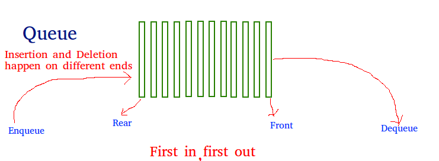
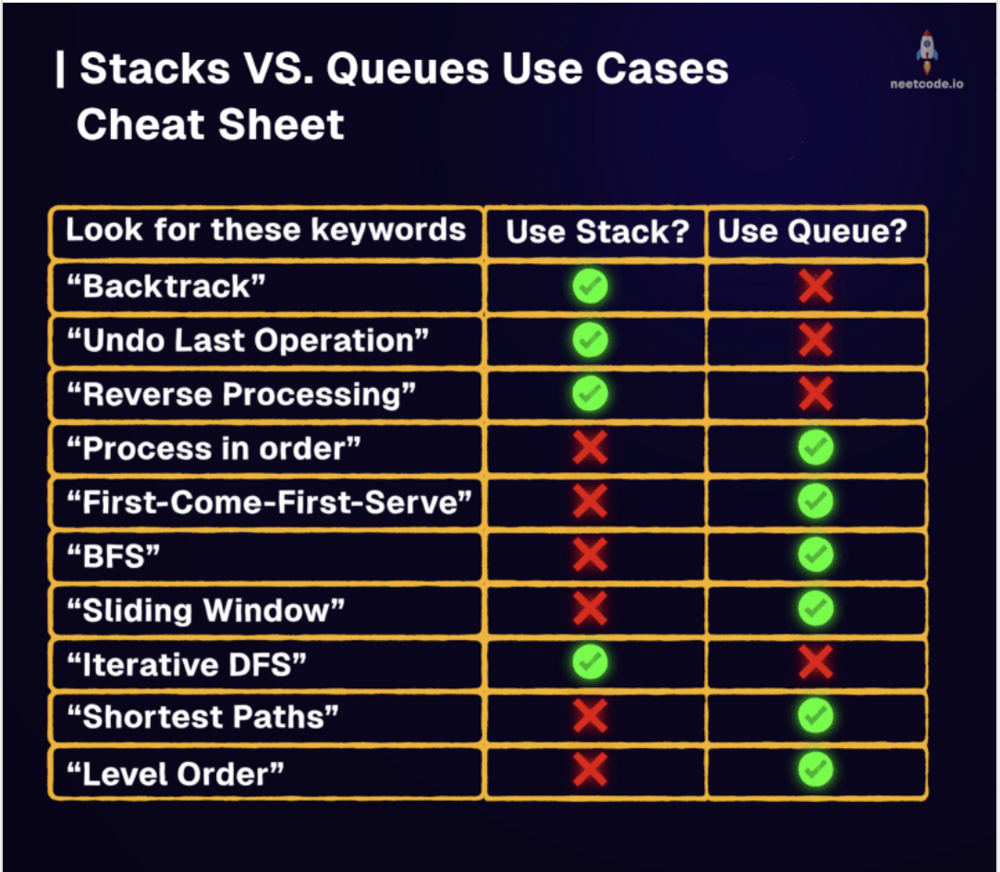

# Queue Data Structure

## LeetCode Problem Lists

- [Queue](https://leetcode.com/problem-list/queue/)

## Time Complexity

| Data structure | Search   | Insert   | Delete   | Min/Max  |
| -------------- | -------- | -------- | -------- | -------- |
| Queue          | O(n)     | O(1)     | O(1)     | O(n)     |

> Insert = enqueue (rear), Delete = dequeue (front), both **O(1)**. Min/Max over a sliding window can be made **O(1)** amortized with a monotonic deque ([monotonic_queue.md](./monotonic_queue.md)).

<p align="center"></p>

<p align="center"></p>

## Overview
**Queue** is a linear data structure that follows the First In First Out (FIFO) principle. Elements are added at the rear (enqueue) and removed from the front (dequeue), similar to a real-world queue or line.

### Key Properties
- **Time Complexity**: 
  - Enqueue: O(1)
  - Dequeue: O(1) for linked list, O(n) for array
  - Peek/Front: O(1)
  - Search: O(n)
- **Space Complexity**: O(n)
- **Core Idea**: First element added is the first to be removed (FIFO)
- **When to Use**: BFS traversal, level-order processing, task scheduling, buffering

### Implementation Options
- **Array-based**: Fixed size, circular buffer for efficiency
- **Linked List**: Dynamic size, efficient operations
- **Deque**: Double-ended queue for both ends access
- **Priority Queue**: Elements processed by priority (covered separately)

### References
- [Java Queue Interface](https://docs.oracle.com/javase/8/docs/api/java/util/Queue.html)
- [Python collections.deque](https://docs.python.org/3/library/collections.html#collections.deque)
- [Queue vs Stack Comparison](https://www.geeksforgeeks.org/difference-between-stack-and-queue-data-structures/)

## Problem Categories

### **Pattern 1: BFS & Level-Order Traversal** — LC 102
- **Description**: Layer-by-layer processing in trees and graphs
- **Examples**: LC 102, 103, 107, 199, 513, 515, 637
- **Pattern**: Process all nodes at current level before next level

### **Pattern 2: Sliding Window with Queue** — LC 239
- **Description**: Maintaining window state with FIFO ordering
- **Examples**: LC 239, 346, 362, 933, 1438
- **Pattern**: Use deque for O(1) operations at both ends

### **Pattern 3: Design Queue Variants** — LC 232
- **Description**: Implementing queue with constraints or special features
- **Examples**: LC 225, 232, 622, 641, 1670
- **Pattern**: Use stacks, arrays, or linked lists with specific logic

### **Pattern 4: Monotonic Queue** — LC 239
- **Description**: Maintaining increasing/decreasing order in queue
- **Examples**: LC 239, 862, 907, 1425, 1696
- **Pattern**: Remove elements that break monotonic property

### **Pattern 5: Stream Processing** — LC 346
- **Description**: Processing continuous data streams
- **Examples**: LC 346, 352, 362, 703, 933
- **Pattern**: Fixed-size window or time-based eviction

### **Pattern 6: Task Scheduling & Simulation** — LC 621
- **Description**: Simulating real-world queuing systems
- **Examples**: LC 621, 1429, 1834, 2073
- **Pattern**: Process tasks in order with constraints

## Templates & Algorithms

### Template Comparison Table
| Template Type | Use Case | Implementation | Complexity | When to Use |
|---------------|----------|----------------|------------|-------------|
| **Basic Queue** | Simple FIFO | Array/LinkedList | O(1) ops | General queue operations |
| **Circular Queue** | Fixed size buffer | Array with pointers | O(1) ops | Bounded buffer, ring buffer |
| **Deque** | Both ends access | Double linked list | O(1) ops | Sliding window, palindrome |
| **Monotonic Queue** | Order maintenance | Deque with logic | O(1) amortized | Max/min in window |
| **Queue with Stacks** | Queue using stacks | Two stacks | O(1) amortized | Interview problems |
| **Level-Order BFS** | Tree/graph traversal | Queue + size tracking | O(n) | Layer processing |

### Template 1: Basic Queue Operations
```python
# Python - Using collections.deque (recommended)
from collections import deque

class Queue:
    def __init__(self):
        self.queue = deque()
    
    def enqueue(self, item):
        self.queue.append(item)  # Add to rear
    
    def dequeue(self):
        if not self.is_empty():
            return self.queue.popleft()  # Remove from front
        return None
    
    def front(self):
        if not self.is_empty():
            return self.queue[0]
        return None
    
    def is_empty(self):
        return len(self.queue) == 0
    
    def size(self):
        return len(self.queue)

# Using list (less efficient for dequeue)
class SimpleQueue:
    def __init__(self):
        self.queue = []
    
    def enqueue(self, item):
        self.queue.append(item)
    
    def dequeue(self):
        if self.queue:
            return self.queue.pop(0)  # O(n) operation
        return None
```

```java
// Java - Using LinkedList
import java.util.*;

class Queue<T> {
    private LinkedList<T> queue;
    
    public Queue() {
        queue = new LinkedList<>();
    }
    
    public void enqueue(T item) {
        queue.addLast(item);  // Add to rear
    }
    
    public T dequeue() {
        if (!isEmpty()) {
            return queue.removeFirst();  // Remove from front
        }
        return null;
    }
    
    public T front() {
        if (!isEmpty()) {
            return queue.getFirst();
        }
        return null;
    }
    
    public boolean isEmpty() {
        return queue.isEmpty();
    }
    
    public int size() {
        return queue.size();
    }
}

// Using Java Queue interface
Queue<Integer> queue = new LinkedList<>();
queue.offer(1);  // enqueue
queue.poll();    // dequeue
queue.peek();    // front
```

### Template 2: Level-Order BFS Pattern — LC 102
```python
# Python - Tree level-order traversal
def levelOrder(root):
    if not root:
        return []
    
    result = []
    queue = deque([root])
    
    while queue:
        level_size = len(queue)
        current_level = []
        
        # Process all nodes at current level
        for _ in range(level_size):
            node = queue.popleft()
            current_level.append(node.val)
            
            if node.left:
                queue.append(node.left)
            if node.right:
                queue.append(node.right)
        
        result.append(current_level)
    
    return result

# Graph BFS with distance
def bfs(graph, start):
    visited = set([start])
    queue = deque([(start, 0)])  # (node, distance)
    
    while queue:
        node, dist = queue.popleft()
        
        for neighbor in graph[node]:
            if neighbor not in visited:
                visited.add(neighbor)
                queue.append((neighbor, dist + 1))
    
    return visited
```

```java
// Java - Level-order traversal
public List<List<Integer>> levelOrder(TreeNode root) {
    List<List<Integer>> result = new ArrayList<>();
    if (root == null) return result;
    
    Queue<TreeNode> queue = new LinkedList<>();
    queue.offer(root);
    
    while (!queue.isEmpty()) {
        int levelSize = queue.size();
        List<Integer> currentLevel = new ArrayList<>();
        
        for (int i = 0; i < levelSize; i++) {
            TreeNode node = queue.poll();
            currentLevel.add(node.val);
            
            if (node.left != null) {
                queue.offer(node.left);
            }
            if (node.right != null) {
                queue.offer(node.right);
            }
        }
        
        result.add(currentLevel);
    }
    
    return result;
}
```

### Template 3: Circular Queue Pattern — LC 622
```python
# Python - Fixed size circular queue
class CircularQueue:
    def __init__(self, k):
        self.queue = [0] * k
        self.capacity = k
        self.head = 0
        self.count = 0
    
    def enqueue(self, value):
        if self.is_full():
            return False
        
        # Calculate tail position
        tail = (self.head + self.count) % self.capacity
        self.queue[tail] = value
        self.count += 1
        return True
    
    def dequeue(self):
        if self.is_empty():
            return False
        
        self.head = (self.head + 1) % self.capacity
        self.count -= 1
        return True
    
    def front(self):
        if self.is_empty():
            return -1
        return self.queue[self.head]
    
    def rear(self):
        if self.is_empty():
            return -1
        tail = (self.head + self.count - 1) % self.capacity
        return self.queue[tail]
    
    def is_empty(self):
        return self.count == 0
    
    def is_full(self):
        return self.count == self.capacity
```

```java
// Java - Circular Queue
class CircularQueue {
    private int[] queue;
    private int head;
    private int count;
    private int capacity;
    
    public CircularQueue(int k) {
        queue = new int[k];
        capacity = k;
        head = 0;
        count = 0;
    }
    
    public boolean enqueue(int value) {
        if (isFull()) return false;
        
        int tail = (head + count) % capacity;
        queue[tail] = value;
        count++;
        return true;
    }
    
    public boolean dequeue() {
        if (isEmpty()) return false;
        
        head = (head + 1) % capacity;
        count--;
        return true;
    }
    
    public int front() {
        if (isEmpty()) return -1;
        return queue[head];
    }
    
    public int rear() {
        if (isEmpty()) return -1;
        int tail = (head + count - 1) % capacity;
        return queue[tail];
    }
    
    public boolean isEmpty() {
        return count == 0;
    }
    
    public boolean isFull() {
        return count == capacity;
    }
}
```

### Template 4: Monotonic Queue Pattern — LC 239
```python
# Python - Monotonic decreasing queue for sliding window maximum
class MonotonicQueue:
    def __init__(self):
        self.queue = deque()
    
    def push(self, val):
        # Remove smaller elements from rear
        while self.queue and self.queue[-1] < val:
            self.queue.pop()
        self.queue.append(val)
    
    def pop(self, val):
        # Remove if it's the front element
        if self.queue and self.queue[0] == val:
            self.queue.popleft()
    
    def max(self):
        # Front is always the maximum
        return self.queue[0] if self.queue else None

# Sliding window maximum
def maxSlidingWindow(nums, k):
    from collections import deque
    
    dq = deque()  # Store indices
    result = []
    
    for i in range(len(nums)):
        # Remove indices outside window
        while dq and dq[0] <= i - k:
            dq.popleft()
        
        # Remove smaller elements
        while dq and nums[dq[-1]] <= nums[i]:
            dq.pop()
        
        dq.append(i)
        
        # Add to result after first window
        if i >= k - 1:
            result.append(nums[dq[0]])
    
    return result
```

```java
// Java - Monotonic Queue
class MonotonicQueue {
    private LinkedList<Integer> queue;
    
    public MonotonicQueue() {
        queue = new LinkedList<>();
    }
    
    public void push(int val) {
        // Remove smaller elements from rear
        while (!queue.isEmpty() && queue.getLast() < val) {
            queue.pollLast();
        }
        queue.addLast(val);
    }
    
    public void pop(int val) {
        // Remove if it's the front element
        if (!queue.isEmpty() && queue.getFirst() == val) {
            queue.pollFirst();
        }
    }
    
    public int max() {
        return queue.isEmpty() ? -1 : queue.getFirst();
    }
}

// Sliding window maximum
public int[] maxSlidingWindow(int[] nums, int k) {
    Deque<Integer> dq = new LinkedList<>();
    int[] result = new int[nums.length - k + 1];
    int idx = 0;
    
    for (int i = 0; i < nums.length; i++) {
        // Remove indices outside window
        while (!dq.isEmpty() && dq.peekFirst() <= i - k) {
            dq.pollFirst();
        }
        
        // Remove smaller elements
        while (!dq.isEmpty() && nums[dq.peekLast()] <= nums[i]) {
            dq.pollLast();
        }
        
        dq.offerLast(i);
        
        // Add to result after first window
        if (i >= k - 1) {
            result[idx++] = nums[dq.peekFirst()];
        }
    }
    
    return result;
}
```

### Template 5: Queue Using Stacks Pattern — LC 232
```python
# Python - Implement queue using two stacks
class MyQueue:
    def __init__(self):
        self.in_stack = []   # For enqueue
        self.out_stack = []  # For dequeue
    
    def push(self, x):
        self.in_stack.append(x)
    
    def pop(self):
        self.peek()  # Ensure out_stack has elements
        return self.out_stack.pop()
    
    def peek(self):
        if not self.out_stack:
            # Transfer all from in_stack to out_stack
            while self.in_stack:
                self.out_stack.append(self.in_stack.pop())
        return self.out_stack[-1] if self.out_stack else None
    
    def empty(self):
        return len(self.in_stack) == 0 and len(self.out_stack) == 0
```

```java
// Java - Queue using stacks
class MyQueue {
    private Stack<Integer> inStack;
    private Stack<Integer> outStack;
    
    public MyQueue() {
        inStack = new Stack<>();
        outStack = new Stack<>();
    }
    
    public void push(int x) {
        inStack.push(x);
    }
    
    public int pop() {
        peek();  // Ensure outStack has elements
        return outStack.pop();
    }
    
    public int peek() {
        if (outStack.isEmpty()) {
            // Transfer all from inStack to outStack
            while (!inStack.isEmpty()) {
                outStack.push(inStack.pop());
            }
        }
        return outStack.peek();
    }
    
    public boolean empty() {
        return inStack.isEmpty() && outStack.isEmpty();
    }
}
```

### Template 6: Stream Processing Pattern — LC 346
```python
# Python - Moving average from data stream
class MovingAverage:
    def __init__(self, size):
        self.queue = deque()
        self.window_sum = 0
        self.size = size
    
    def next(self, val):
        self.queue.append(val)
        self.window_sum += val
        
        if len(self.queue) > self.size:
            removed = self.queue.popleft()
            self.window_sum -= removed
        
        return self.window_sum / len(self.queue)

# Hit counter for last 5 minutes
class HitCounter:
    def __init__(self):
        self.queue = deque()
    
    def hit(self, timestamp):
        self.queue.append(timestamp)
    
    def getHits(self, timestamp):
        # Remove hits older than 5 minutes (300 seconds)
        while self.queue and self.queue[0] <= timestamp - 300:
            self.queue.popleft()
        return len(self.queue)
```

```java
// Java - Moving average
class MovingAverage {
    private Queue<Integer> queue;
    private int windowSum;
    private int size;
    
    public MovingAverage(int size) {
        queue = new LinkedList<>();
        this.size = size;
        windowSum = 0;
    }
    
    public double next(int val) {
        queue.offer(val);
        windowSum += val;
        
        if (queue.size() > size) {
            windowSum -= queue.poll();
        }
        
        return (double) windowSum / queue.size();
    }
}
```

### Template 7: Flatten-to-Queue Iterator Pattern — LC 341
> **Key Idea**: an iterator over a *nested* structure becomes trivial once the structure is flattened into a **FIFO queue** in the constructor. `next()` = `popleft()`, `hasNext()` = `queue is non-empty`.

```java
// LC 341 - Flatten Nested List Iterator
// IDEA: Eagerly DFS-flatten the nested list into a queue; next()/hasNext() are O(1)
// time = O(N) constructor + O(1) per next/hasNext, space = O(N)
public class NestedIterator implements Iterator<Integer> {
    private final Deque<Integer> queue = new ArrayDeque<>();

    public NestedIterator(List<NestedInteger> nestedList) {
        flatten(nestedList);
    }

    private void flatten(List<NestedInteger> list) {
        for (NestedInteger ni : list) {
            if (ni.isInteger()) {
                queue.addLast(ni.getInteger());
            } else {
                flatten(ni.getList()); // recurse into sub-list
            }
        }
    }

    @Override
    public Integer next() { return queue.pollFirst(); }

    @Override
    public boolean hasNext() { return !queue.isEmpty(); }
}
```

```python
# python
# LC 341 - Flatten Nested List Iterator
# IDEA: Eagerly DFS-flatten the nested list into a deque; next()/hasNext() are O(1)
# time = O(N) constructor + O(1) per next/hasNext, space = O(N)
from collections import deque

class NestedIterator:
    def __init__(self, nestedList):
        self.q = deque()
        self._flatten(nestedList)

    def _flatten(self, lst):
        for ni in lst:
            if ni.isInteger():
                self.q.append(ni.getInteger())
            else:
                self._flatten(ni.getList())   # recurse into sub-list

    def next(self):
        return self.q.popleft()

    def hasNext(self):
        return len(self.q) > 0
```

> **Interview follow-up**: "what if the list is huge / infinite?" → switch to the **lazy stack** variant: push `nestedList` reversed onto a stack, and in `hasNext()` keep popping+expanding while the top is a list. Same amortized O(1), but only O(depth + top-level size) extra space instead of O(N).

### Template 8: First-Unique Queue (Queue + Count Map) Pattern — LC 387
> **Key Idea**: keep a queue of *candidate* elements and a count map. Before answering, **evict from the front** every candidate whose count has grown past 1. Front is then the first still-unique element. Works **online** (streaming), unlike the count-then-rescan solution.

```java
// LC 387 - First Unique Character in a String
// IDEA: Queue of candidate indices + freq map; evict front while it's no longer unique
// time = O(N) (each index enqueued/dequeued once), space = O(N)
public int firstUniqChar(String s) {
    int[] cnt = new int[26];
    Deque<Integer> q = new ArrayDeque<>(); // candidate indices, in arrival order

    for (int i = 0; i < s.length(); i++) {
        cnt[s.charAt(i) - 'a']++;
        q.addLast(i);
        // front is only valid while it is still unique
        while (!q.isEmpty() && cnt[s.charAt(q.peekFirst()) - 'a'] > 1) {
            q.pollFirst();
        }
    }
    return q.isEmpty() ? -1 : q.peekFirst();
}
```

```python
# python
# LC 387 - First Unique Character in a String
# IDEA: Queue of candidate indices + freq map; evict front while it's no longer unique
# time = O(N) (each index enqueued/dequeued once), space = O(N)
from collections import deque, defaultdict

def firstUniqChar(s):
    cnt = defaultdict(int)
    q = deque()  # candidate indices, in arrival order

    for i, c in enumerate(s):
        cnt[c] += 1
        q.append(i)
        # front is only valid while it is still unique
        while q and cnt[s[q[0]]] > 1:
            q.popleft()

    return q[0] if q else -1
```

> **Variation — LC 1429 (First Unique Number)**: same structure, but the eviction loop moves into `showFirstUnique()` and `add()` only updates the count + enqueues. That makes it a *design* problem with amortized O(1) per call.

### Template 9: Queue Rotation / Simulation Pattern — LC 1823
> **Key Idea**: when a problem describes people/cards **cycling through a line**, literally simulate it: `q.addLast(q.pollFirst())` rotates one step; `q.pollFirst()` eliminates. The deque *is* the circle.

```java
// LC 1823 - Find the Winner of the Circular Game (Josephus)
// IDEA: Rotate k-1 survivors to the back, then eliminate the front; repeat until 1 left
// time = O(N * k), space = O(N)
public int findTheWinner(int n, int k) {
    Deque<Integer> q = new ArrayDeque<>();
    for (int i = 1; i <= n; i++) q.addLast(i);

    while (q.size() > 1) {
        for (int i = 0; i < k - 1; i++) {
            q.addLast(q.pollFirst()); // survivors go to the back
        }
        q.pollFirst();                // k-th player is out
    }
    return q.peekFirst();
}

// O(N) time / O(1) space math alternative (Josephus recurrence):
// f(1) = 0 ; f(i) = (f(i-1) + k) % i ; answer = f(n) + 1
public int findTheWinnerMath(int n, int k) {
    int ans = 0;
    for (int i = 2; i <= n; i++) ans = (ans + k) % i;
    return ans + 1;
}
```

```python
# python
# LC 1823 - Find the Winner of the Circular Game (Josephus)
# IDEA: Rotate k-1 survivors to the back, then eliminate the front; repeat until 1 left
# time = O(N * k), space = O(N)
from collections import deque

def findTheWinner(n, k):
    q = deque(range(1, n + 1))
    while len(q) > 1:
        q.rotate(-(k - 1))   # move k-1 survivors to the back
        q.popleft()          # k-th player is out
    return q[0]

# O(N) time / O(1) space math alternative
def findTheWinnerMath(n, k):
    ans = 0
    for i in range(2, n + 1):
        ans = (ans + k) % i
    return ans + 1
```

**Variations of the same simulation idea:**

- **LC 950 (Reveal Cards In Increasing Order)** — *twist: simulate the process **backwards***. Sort ascending, then walk the sorted deck from largest to smallest; each step undo one round: move the back card to the front, then push the new card to the front.
- **LC 649 (Dota2 Senate)** — *twist: two queues instead of one*. Queue the indices of each party; each round pop one from each, the smaller index wins and is re-queued at `index + n` (i.e. next round).

```java
// LC 950 - Reveal Cards In Increasing Order
// IDEA: Reverse-simulate the reveal: undo "move top to bottom", then undo "reveal"
// time = O(N log N) (sort), space = O(N)
public int[] deckRevealedIncreasing(int[] deck) {
    Arrays.sort(deck);
    Deque<Integer> q = new ArrayDeque<>();
    for (int i = deck.length - 1; i >= 0; i--) {
        if (!q.isEmpty()) q.addFirst(q.pollLast()); // undo: bottom card back to top
        q.addFirst(deck[i]);                        // undo: put the revealed card back
    }
    int[] ans = new int[deck.length];
    int i = 0;
    for (int v : q) ans[i++] = v;
    return ans;
}

// LC 649 - Dota2 Senate
// IDEA: Two index queues; smaller index bans the other and re-enters at index + n
// time = O(N), space = O(N)
public String predictPartyVictory(String senate) {
    int n = senate.length();
    Queue<Integer> radiant = new LinkedList<>(), dire = new LinkedList<>();
    for (int i = 0; i < n; i++) {
        if (senate.charAt(i) == 'R') radiant.offer(i);
        else dire.offer(i);
    }
    while (!radiant.isEmpty() && !dire.isEmpty()) {
        int r = radiant.poll(), d = dire.poll();
        if (r < d) radiant.offer(r + n); // R acts first, survives to next round
        else dire.offer(d + n);
    }
    return radiant.isEmpty() ? "Dire" : "Radiant";
}
```

```python
# python
# LC 950 - Reveal Cards In Increasing Order
# time = O(N log N) (sort), space = O(N)
from collections import deque

def deckRevealedIncreasing(deck):
    deck.sort()
    q = deque()
    for x in reversed(deck):
        if q:
            q.appendleft(q.pop())  # undo: bottom card back to top
        q.appendleft(x)            # undo: put the revealed card back
    return list(q)

# LC 649 - Dota2 Senate
# time = O(N), space = O(N)
def predictPartyVictory(senate):
    n = len(senate)
    radiant = deque(i for i, c in enumerate(senate) if c == 'R')
    dire    = deque(i for i, c in enumerate(senate) if c == 'D')
    while radiant and dire:
        r, d = radiant.popleft(), dire.popleft()
        if r < d:
            radiant.append(r + n)  # R acts first, survives to next round
        else:
            dire.append(d + n)
    return "Radiant" if radiant else "Dire"
```

### Template 10: Queue of Active Window Effects Pattern — LC 995
> **Key Idea**: when an operation at index `i` affects the next `k` indices, don't re-apply it `k` times. Push its start index into a queue, **expire it from the front** once `front + k <= i`, and let `queue.size()` tell you how many effects are still active at `i`. (Same trick as a difference array, but expressed with a queue.)

```java
// LC 995 - Minimum Number of K Consecutive Bit Flips
// IDEA: Queue holds start indices of flips still covering i; parity of queue size = current value
// time = O(N), space = O(k)
public int minKBitFlips(int[] nums, int k) {
    int n = nums.length, res = 0;
    Deque<Integer> flips = new ArrayDeque<>(); // start indices of active flips

    for (int i = 0; i < n; i++) {
        // expire flips whose window [start, start + k) no longer covers i
        while (!flips.isEmpty() && flips.peekFirst() + k <= i) {
            flips.pollFirst();
        }
        // effective value = nums[i] flipped flips.size() times
        if ((nums[i] + flips.size()) % 2 == 0) { // still 0 -> must start a flip here
            if (i + k > n) return -1;            // window would run off the end
            flips.addLast(i);
            res++;
        }
    }
    return res;
}
```

```python
# python
# LC 995 - Minimum Number of K Consecutive Bit Flips
# IDEA: Queue holds start indices of flips still covering i; parity of queue size = current value
# time = O(N), space = O(k)
from collections import deque

def minKBitFlips(nums, k):
    n, res = len(nums), 0
    flips = deque()  # start indices of active flips

    for i, x in enumerate(nums):
        # expire flips whose window [start, start + k) no longer covers i
        while flips and flips[0] + k <= i:
            flips.popleft()
        # effective value = x flipped len(flips) times
        if (x + len(flips)) % 2 == 0:   # still 0 -> must start a flip here
            if i + k > n:
                return -1               # window would run off the end
            flips.append(i)
            res += 1
    return res
```

## Problems by Pattern

### Pattern-Based Problem Tables

#### **BFS & Level-Order Problems**
| Problem | LC # | Key Technique | Difficulty |
|---------|------|---------------|------------|
| Binary Tree Level Order Traversal | 102 | Queue + level tracking | Medium |
| Binary Tree Zigzag Level Order | 103 | Queue + direction flag | Medium |
| Binary Tree Level Order II | 107 | Queue + reverse result | Medium |
| Binary Tree Right Side View | 199 | Queue + last in level | Medium |
| Find Bottom Left Tree Value | 513 | Queue + track level | Medium |
| Find Largest Value in Each Tree Row | 515 | Queue + max per level | Medium |
| Average of Levels in Binary Tree | 637 | Queue + sum per level | Easy |
| Maximum Width of Binary Tree | 662 | Queue + position encoding | Medium |
| Populating Next Right Pointers | 116 | Queue + level connection | Medium |
| N-ary Tree Level Order Traversal | 429 | Queue + multiple children | Medium |

#### **Sliding Window Queue Problems**
| Problem | LC # | Key Technique | Difficulty |
|---------|------|---------------|------------|
| Sliding Window Maximum | 239 | Monotonic deque | Hard |
| Moving Average from Data Stream | 346 | Fixed size queue | Easy |
| Design Hit Counter | 362 | Time-based eviction | Medium |
| Number of Recent Calls | 933 | Time window queue | Easy |
| Longest Subarray Absolute Diff | 1438 | Two deques (min/max) | Medium |
| Jump Game VI | 1696 | DP + monotonic queue | Medium |
| Constrained Subsequence Sum | 1425 | DP + monotonic queue | Hard |

#### **Design Queue Problems**
| Problem | LC # | Key Technique | Difficulty |
|---------|------|---------------|------------|
| Implement Stack using Queues | 225 | Two queues or rotation | Easy |
| Implement Queue using Stacks | 232 | Two stacks | Easy |
| Design Circular Queue | 622 | Array with pointers | Medium |
| Design Circular Deque | 641 | Double-ended circular | Medium |
| Design Front Middle Back Queue | 1670 | Two deques balance | Medium |
| Design Most Recently Used Queue | 1756 | Deque + set | Medium |

#### **Monotonic Queue Problems**
| Problem | LC # | Key Technique | Difficulty |
|---------|------|---------------|------------|
| Sliding Window Maximum | 239 | Decreasing monotonic | Hard |
| Shortest Subarray with Sum K | 862 | Prefix sum + monotonic | Hard |
| Sum of Subarray Minimums | 907 | Monotonic stack/queue | Medium |
| Maximum Score of Good Subarray | 1793 | Monotonic boundaries | Hard |
| Jump Game VI | 1696 | DP + monotonic queue | Medium |
| Longest Continuous Subarray | 1438 | Two monotonic queues | Medium |
| Maximum Sum Circular Subarray | 918 | Prefix sums over doubled array + deque (window ≤ n) — see [monotonic_queue.md](./monotonic_queue.md) | Medium |

#### **Iterator & Queue Simulation Problems**
| Problem | LC # | Key Technique | Difficulty |
|---------|------|---------------|------------|
| Flatten Nested List Iterator | 341 | Flatten-to-queue in constructor (Template 7) | Medium |
| First Unique Character in a String | 387 | Queue of candidates + count map (Template 8) | Easy |
| First Unique Number | 1429 | Same as 387, as a design/streaming problem | Medium |
| Find the Winner of the Circular Game | 1823 | Rotate-and-eliminate / Josephus (Template 9) | Medium |
| Reveal Cards In Increasing Order | 950 | Reverse simulation with a deque (Template 9) | Medium |
| Dota2 Senate | 649 | Two index queues, re-queue at `i + n` (Template 9) | Medium |
| Minimum Number of K Consecutive Bit Flips | 995 | Queue of active window effects (Template 10) | Hard |

#### **Stream Processing Problems**
| Problem | LC # | Key Technique | Difficulty |
|---------|------|---------------|------------|
| Moving Average from Data Stream | 346 | Fixed window | Easy |
| Data Stream as Disjoint Intervals | 352 | Interval merging | Hard |
| Design Hit Counter | 362 | Time-based queue | Medium |
| Logger Rate Limiter | 359 | Time window | Easy |
| Number of Recent Calls | 933 | Time window | Easy |
| Finding MK Average | 1825 | Multiple queues | Hard |

#### **Task Scheduling Problems**
| Problem | LC # | Key Technique | Difficulty |
|---------|------|---------------|------------|
| Task Scheduler | 621 | Queue + cooling time | Medium |
| Design a Number Container | 2349 | Queue per number | Medium |
| Time Needed to Buy Tickets | 2073 | Queue simulation | Easy |
| Single-Threaded CPU | 1834 | Queue + priority queue | Medium |
| Number of Visible People in Queue | 1944 | Monotonic stack | Hard |

## Pattern Selection Strategy

```text
Problem Analysis Flowchart:

1. Is it a tree/graph traversal problem?
   ├── YES → Use BFS with Queue
   │         ├── Level-order → Track level size
   │         └── Shortest path → Track distance
   └── NO → Continue to 2

2. Do you need to maintain window order?
   ├── YES → Use Sliding Window Queue
   │         ├── Max/Min → Monotonic queue
   │         └── Fixed size → Regular queue
   └── NO → Continue to 3

3. Is it a design problem?
   ├── YES → Choose appropriate structure
   │         ├── Fixed size → Circular queue
   │         ├── Both ends → Deque
   │         └── Stack behavior → Queue with rotation
   └── NO → Continue to 4

4. Need monotonic property?
   ├── YES → Use Monotonic Queue
   │         ├── Increasing → Remove larger from rear
   │         └── Decreasing → Remove smaller from rear
   └── NO → Continue to 5

5. Processing data stream?
   ├── YES → Use Stream Processing
   │         ├── Time window → Remove old entries
   │         └── Count window → Fixed size queue
   └── NO → Use basic queue operations
```


## Basic Operations Reference

### Python collections.deque

```python
from collections import deque

# Create deque
dq = deque()
dq = deque([1, 2, 3])
dq = deque(maxlen=10)  # Fixed size

# Add elements
dq.append(4)       # Add to right: [1,2,3,4]
dq.appendleft(0)   # Add to left: [0,1,2,3,4]
dq.extend([5,6])   # Extend right: [0,1,2,3,4,5,6]
dq.extendleft([-2,-1]) # Extend left: [-1,-2,0,1,2,3,4,5,6]

# Remove elements
val = dq.pop()     # Remove from right
val = dq.popleft() # Remove from left

# Access elements
first = dq[0]      # Access by index
last = dq[-1]      # Last element

# Other operations
dq.rotate(2)       # Rotate right by 2
dq.rotate(-1)      # Rotate left by 1
dq.reverse()       # Reverse in-place
dq.clear()         # Remove all elements

# Check state
size = len(dq)
is_empty = len(dq) == 0
count = dq.count(value)
index = dq.index(value)
```

### Java Queue & Deque Operations
```java
import java.util.*;

// Queue interface (FIFO)
Queue<Integer> queue = new LinkedList<>();
queue.offer(1);    // Add to rear (returns boolean)
queue.add(2);      // Add to rear (throws exception)
Integer val = queue.poll();  // Remove from front (returns null)
val = queue.remove();        // Remove from front (throws exception)
val = queue.peek();          // View front (returns null)
val = queue.element();       // View front (throws exception)

// Deque interface (double-ended)
Deque<Integer> deque = new LinkedList<>();
// or ArrayDeque for better performance
Deque<Integer> deque = new ArrayDeque<>();

// Add operations
deque.addFirst(1);     // Add to front
deque.addLast(2);      // Add to rear
deque.offerFirst(0);   // Add to front (returns boolean)
deque.offerLast(3);    // Add to rear (returns boolean)

// Remove operations
val = deque.removeFirst(); // Remove from front
val = deque.removeLast();  // Remove from rear
val = deque.pollFirst();   // Remove from front (returns null)
val = deque.pollLast();    // Remove from rear (returns null)

// Peek operations
val = deque.peekFirst();   // View front
val = deque.peekLast();    // View rear
val = deque.getFirst();    // View front (throws exception)
val = deque.getLast();     // View rear (throws exception)

// Stack operations on Deque
deque.push(5);         // Push to front (stack top)
val = deque.pop();     // Pop from front (stack top)
```

## Summary & Quick Reference

### Complexity Quick Reference
| Operation | Array Queue | Linked Queue | Deque | Circular Queue |
|-----------|-------------|--------------|-------|----------------|
| Enqueue | O(1) | O(1) | O(1) | O(1) |
| Dequeue | O(n) | O(1) | O(1) | O(1) |
| Peek Front | O(1) | O(1) | O(1) | O(1) |
| Peek Rear | O(1) | O(1) | O(1) | O(1) |
| Space | O(n) | O(n) | O(n) | O(k) fixed |

### Template Quick Reference
| Template | Pattern | Key Code |
|----------|---------|----------|
| **BFS** | Level processing | `for _ in range(level_size)` |
| **Circular** | Fixed buffer | `(head + count) % capacity` |
| **Monotonic** | Order maintenance | `while q and q[-1] < val: q.pop()` |
| **Two Stacks** | Queue simulation | `if not out: transfer from in` |
| **Sliding** | Window tracking | `if i >= k-1: result.append()` |
| **Stream** | Time/count window | `while old: queue.popleft()` |

### Common Patterns & Tricks

#### **Level-Order Processing**
```python
# Process nodes level by level
level_size = len(queue)
for _ in range(level_size):
    node = queue.popleft()
    # Process node
    # Add children
```

#### **Circular Index Calculation**
```python
# Wrap around in circular buffer
tail_index = (head + count) % capacity
next_index = (current + 1) % capacity
```

#### **Monotonic Property Maintenance**
```python
# Decreasing monotonic queue
while queue and queue[-1] < new_val:
    queue.pop()
queue.append(new_val)
```

#### **Two-Stack Queue Optimization**
```python
# Amortized O(1) operations
if not out_stack:
    while in_stack:
        out_stack.append(in_stack.pop())
```

### Problem-Solving Steps

1. **Identify Queue Usage**
   - FIFO processing needed?
   - Level-by-level traversal?
   - Sliding window with order?
   - Stream processing?

2. **Choose Implementation**
   - Simple queue → deque or LinkedList
   - Fixed size → Circular queue
   - Both ends → Deque
   - Priority → Priority Queue (separate DS)

3. **Handle Edge Cases**
   - Empty queue operations
   - Full queue (for bounded queues)
   - Single element scenarios
   - Wraparound in circular queues

4. **Optimize Operations**
   - Use deque for O(1) operations
   - Circular buffer for fixed size
   - Two stacks for interview problems
   - Monotonic for min/max queries

### Common Mistakes & Tips

**🚫 Common Mistakes:**
- Using list.pop(0) in Python (O(n) operation)
- Forgetting to track level size in BFS
- Not handling circular wraparound correctly
- Mixing up queue.poll() vs queue.remove() in Java
- Not maintaining monotonic property correctly

**✅ Best Practices:**
- Always use collections.deque in Python
- Use ArrayDeque over LinkedList in Java for better performance
- Track queue size explicitly for level-order
- Clear old elements in sliding window
- Use modulo for circular indexing

### Interview Tips

1. **Clarify Requirements**
   - Fixed or dynamic size?
   - Need access to both ends?
   - Thread safety required?
   - Space constraints?

2. **BFS vs DFS Decision**
   - BFS → Shortest path, level-order
   - DFS → Path finding, backtracking
   - Queue for BFS, Stack for DFS

3. **Implementation Choice**
   - Python: Always prefer deque
   - Java: ArrayDeque for performance
   - Consider circular for bounded problems

4. **Common Follow-ups**
   - Make it thread-safe
   - Handle multiple producers/consumers
   - Implement with different constraints
   - Optimize space/time complexity

### Advanced Techniques

#### **Lock-Free Queue**
- Used in concurrent programming
- Compare-and-swap operations
- Michael & Scott algorithm

#### **Priority Deque**
- Combines priority queue and deque
- Double-ended priority queue
- Interval heap implementation

#### **Persistent Queue**
- Immutable queue with versioning
- Functional programming style
- Uses two stacks internally

### Related Topics
- **Stack**: LIFO vs FIFO comparison
- **Priority Queue**: Ordered processing
- **BFS**: Primary application of queues
- **Circular Buffer**: Fixed-size queue implementation
- **Producer-Consumer**: Classic queue application

## LC Examples

### 2-1) Sliding Window Maximum — LC 239
> Maintain a decreasing deque of indices; front is always the current window maximum.

```java
// LC 239 - Sliding Window Maximum
// IDEA: Monotonic deque — remove out-of-window front, remove smaller rear, front = max
// time = O(N), space = O(k)
public int[] maxSlidingWindow(int[] nums, int k) {
    int n = nums.length;
    int[] ans = new int[n - k + 1];
    Deque<Integer> dq = new ArrayDeque<>(); // indices, decreasing by value
    for (int i = 0; i < n; i++) {
        while (!dq.isEmpty() && dq.peekFirst() < i - k + 1) dq.pollFirst();
        while (!dq.isEmpty() && nums[dq.peekLast()] < nums[i]) dq.pollLast();
        dq.addLast(i);
        if (i >= k - 1) ans[i - k + 1] = nums[dq.peekFirst()];
    }
    return ans;
}
```

### 2-2) Design Circular Queue — LC 622
> Fixed-size array; track head index and count; use modular arithmetic for wrap-around.

```java
// LC 622 - Design Circular Queue
// IDEA: Fixed array + head pointer + count; tail = (head + count - 1) % capacity
// time = O(1) all ops, space = O(k)
class MyCircularQueue {
    int[] data;
    int head, count, capacity;
    public MyCircularQueue(int k) { data = new int[k]; capacity = k; }
    public boolean enQueue(int value) {
        if (isFull()) return false;
        data[(head + count) % capacity] = value;
        count++;
        return true;
    }
    public boolean deQueue() {
        if (isEmpty()) return false;
        head = (head + 1) % capacity;
        count--;
        return true;
    }
    public int Front() { return isEmpty() ? -1 : data[head]; }
    public int Rear()  { return isEmpty() ? -1 : data[(head + count - 1) % capacity]; }
    public boolean isEmpty() { return count == 0; }
    public boolean isFull()  { return count == capacity; }
}
```