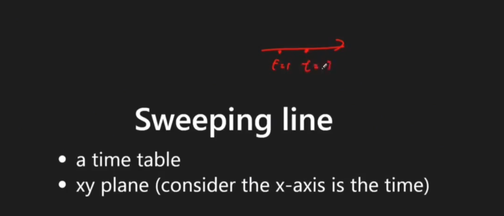

# Scanning Line (Line Sweep) Algorithm

## Overview
**Scanning Line** (also known as Line Sweep or Sweep Line) is an algorithmic paradigm that processes geometric objects by imagining a vertical line sweeping across the plane from left to right, processing events as they occur.

Key: transform `change` to `event`, so we can handle the `changed state` via program, instead of dealing with `continouous info`.


<p align="center"></p>

 
### Key Properties
- **Time Complexity**: O(n log n) for sorting + O(n) for processing
- **Space Complexity**: O(n) for storing events
- **Core Idea**: Convert interval problems into event-based processing
- **When to Use**: Interval overlaps, skyline problems, calendar conflicts, geometric intersections

### Algorithm Principle
1. Convert intervals into events (start/end points)
2. Sort events by position (and type if at same position)
3. Process events in order while maintaining state
4. Track maximum/minimum or other statistics during sweep

### References
- [NTNU Algorithm Notes](https://web.ntnu.edu.tw/~algo/Point2.html)
- [Line Sweep Tutorial](https://hackmd.io/@meyr543/SkrRZCwfj)
- [Computational Geometry](https://www.cs.princeton.edu/~rs/AlgsDS07/)

## Problem Categories

### **Pattern 1: Interval Overlap**
- **Description**: Finding maximum overlapping intervals at any point
- **Examples**: LC 253, 1094, 2021, 2406, 2848
- **Pattern**: Track active intervals using counter

### **Pattern 2: Skyline Problems**
- **Description**: Computing visible outline from overlapping rectangles
- **Examples**: LC 218, 850, 391
- **Pattern**: Process building start/end with heights

### **Pattern 3: Calendar Booking**
- **Description**: Managing calendar events and conflicts
- **Examples**: LC 729, 731, 732, 1851
- **Pattern**: Track booking counts at each time point

### **Pattern 4: Employee Free Time**
- **Description**: Finding common free time across schedules
- **Examples**: LC 759, 986, 1229
- **Pattern**: Merge intervals then find gaps

### **Pattern 5: Range Updates**
- **Description**: Applying updates to ranges efficiently
- **Examples**: LC 370, 1109, 1893, 2251
- **Pattern**: Difference array with sweep line

### **Pattern 6: Geometric Intersection**
- **Description**: Finding intersections of geometric objects
- **Examples**: LC 836, 223, 391, 850
- **Pattern**: Sort by x-coordinate, track y-intervals

## Templates & Algorithms

### Template Comparison Table
| Template Type | Use Case | Event Types | Complexity | When to Use |
|---------------|----------|-------------|------------|-------------|
| **Basic Sweep** | Count overlaps | Start/End | O(n log n) | Meeting rooms, intervals |
| **Weighted Sweep** | Sum of overlaps | Start/End + value | O(n log n) | Brightness, bandwidth |
| **Skyline** | Height tracking | Start/End + height | O(n log n) | Building outline |
| **Difference Array** | Range updates | Update points | O(n) | Batch updates |
| **Interval Merge** | Combine intervals | Start/End | O(n log n) | Free time, union |
| **2D Sweep** | Rectangle area | X and Y events | O(n² log n) | Area calculation |

### Template 1: Basic Interval Overlap
```python
# Python - Count maximum overlapping intervals
def maxOverlap(intervals):
    events = []
    
    # Create events for each interval
    for start, end in intervals:
        events.append((start, 1))   # Start event
        events.append((end, -1))     # End event
    
    # Sort events (by time, then by type)
    events.sort(key=lambda x: (x[0], -x[1]))  # Process start before end at same time
    
    # Sweep through events
    max_overlap = 0
    current_overlap = 0
    
    for time, delta in events:
        current_overlap += delta
        max_overlap = max(max_overlap, current_overlap)
    
    return max_overlap

# With position tracking
def maxOverlapPosition(intervals):
    events = []
    for start, end in intervals:
        events.append((start, 1))
        events.append((end, -1))
    
    events.sort(key=lambda x: (x[0], -x[1]))
    
    max_overlap = 0
    max_position = 0
    current_overlap = 0
    
    for time, delta in events:
        current_overlap += delta
        if current_overlap > max_overlap:
            max_overlap = current_overlap
            max_position = time
    
    return max_overlap, max_position
```

```java
// Java - Maximum interval overlap
public int maxOverlap(int[][] intervals) {
    List<int[]> events = new ArrayList<>();
    
    // Create events
    for (int[] interval : intervals) {
        events.add(new int[]{interval[0], 1});   // Start
        events.add(new int[]{interval[1], -1});  // End
    }
    
    // Sort events
    Collections.sort(events, (a, b) -> {
        if (a[0] != b[0]) return a[0] - b[0];
        return b[1] - a[1];  // Start before end
    });
    
    // Sweep
    int maxOverlap = 0;
    int currentOverlap = 0;
    
    for (int[] event : events) {
        currentOverlap += event[1];
        maxOverlap = Math.max(maxOverlap, currentOverlap);
    }
    
    return maxOverlap;
}
```

### Template 2: Weighted Interval Overlap
```python
# Python - Sum of overlapping values (e.g., brightness)
def maxWeightedOverlap(weighted_intervals):
    events = []
    
    # weighted_intervals: [(start, end, weight)]
    for start, end, weight in weighted_intervals:
        events.append((start, weight))   # Add weight
        events.append((end, -weight))    # Remove weight
    
    events.sort()
    
    max_weight = 0
    current_weight = 0
    result_position = 0
    
    for position, delta in events:
        current_weight += delta
        if current_weight > max_weight:
            max_weight = current_weight
            result_position = position
    
    return max_weight, result_position

# Track all positions with their weights
def allWeightedPositions(weighted_intervals):
    from collections import defaultdict
    events = defaultdict(int)
    
    for start, end, weight in weighted_intervals:
        events[start] += weight
        events[end] -= weight
    
    sorted_positions = sorted(events.keys())
    positions_weights = {}
    current_weight = 0
    
    for pos in sorted_positions:
        current_weight += events[pos]
        positions_weights[pos] = current_weight
    
    return positions_weights
```

```java
// Java - Weighted intervals
public int maxWeightedOverlap(int[][] weightedIntervals) {
    // weightedIntervals: [start, end, weight]
    TreeMap<Integer, Integer> events = new TreeMap<>();
    
    for (int[] interval : weightedIntervals) {
        events.put(interval[0], 
                  events.getOrDefault(interval[0], 0) + interval[2]);
        events.put(interval[1], 
                  events.getOrDefault(interval[1], 0) - interval[2]);
    }
    
    int maxWeight = 0;
    int currentWeight = 0;
    
    for (int delta : events.values()) {
        currentWeight += delta;
        maxWeight = Math.max(maxWeight, currentWeight);
    }
    
    return maxWeight;
}
```

### Template 3: Skyline Problem
```python
# Python - Building skyline
def getSkyline(buildings):
    events = []
    
    # buildings: [[left, right, height]]
    for left, right, height in buildings:
        events.append((left, -height))  # Start (negative for max heap)
        events.append((right, height))  # End
    
    events.sort(key=lambda x: (x[0], x[1]))
    
    result = []
    heights = [0]  # Ground level
    
    import heapq
    for x, h in events:
        if h < 0:  # Building start
            heapq.heappush(heights, h)
        else:  # Building end
            heights.remove(-h)
            heapq.heapify(heights)
        
        # Check if max height changed
        max_h = -heights[0]
        if not result or result[-1][1] != max_h:
            result.append([x, max_h])
    
    return result
```

```java
// Java - Skyline
public List<List<Integer>> getSkyline(int[][] buildings) {
    List<int[]> events = new ArrayList<>();
    
    for (int[] b : buildings) {
        events.add(new int[]{b[0], -b[2]});  // Start
        events.add(new int[]{b[1], b[2]});   // End
    }
    
    Collections.sort(events, (a, b) -> {
        if (a[0] != b[0]) return a[0] - b[0];
        return a[1] - b[1];
    });
    
    List<List<Integer>> result = new ArrayList<>();
    TreeMap<Integer, Integer> heights = new TreeMap<>();
    heights.put(0, 1);  // Ground
    
    for (int[] event : events) {
        int x = event[0], h = event[1];
        
        if (h < 0) {  // Start
            heights.put(-h, heights.getOrDefault(-h, 0) + 1);
        } else {  // End
            if (heights.get(h) == 1) {
                heights.remove(h);
            } else {
                heights.put(h, heights.get(h) - 1);
            }
        }
        
        int maxH = heights.lastKey();
        if (result.isEmpty() || 
            result.get(result.size() - 1).get(1) != maxH) {
            result.add(Arrays.asList(x, maxH));
        }
    }
    
    return result;
}
```

### Template 4: Calendar Booking
```python
# Python - Calendar with multiple bookings
class MyCalendarTwo:
    def __init__(self):
        self.events = []  # List of (time, delta)
    
    def book(self, start, end):
        # Temporarily add new booking
        self.events.append((start, 1))
        self.events.append((end, -1))
        self.events.sort()
        
        # Check if triple booking
        booked = 0
        for time, delta in self.events:
            booked += delta
            if booked >= 3:
                # Remove the temporary booking
                self.events.remove((start, 1))
                self.events.remove((end, -1))
                return False
        
        return True
```

```java
// Java - Calendar booking
class MyCalendarTwo {
    List<int[]> events;
    
    public MyCalendarTwo() {
        events = new ArrayList<>();
    }
    
    public boolean book(int start, int end) {
        events.add(new int[]{start, 1});
        events.add(new int[]{end, -1});
        
        Collections.sort(events, (a, b) -> {
            if (a[0] != b[0]) return a[0] - b[0];
            return a[1] - b[1];
        });
        
        int booked = 0;
        for (int[] event : events) {
            booked += event[1];
            if (booked >= 3) {
                events.remove(new int[]{start, 1});
                events.remove(new int[]{end, -1});
                return false;
            }
        }
        
        return true;
    }
}
```

### Template 5: Difference Array Pattern
```python
# Python - Range addition using sweep line
def rangeAddition(length, updates):
    # updates: [[start, end, inc]]
    diff = [0] * (length + 1)
    
    for start, end, inc in updates:
        diff[start] += inc
        diff[end + 1] -= inc
    
    # Sweep to get final values
    result = [0] * length
    current = 0
    for i in range(length):
        current += diff[i]
        result[i] = current
    
    return result

# 2D range addition
def rangeAddition2D(m, n, updates):
    diff = [[0] * (n + 1) for _ in range(m + 1)]
    
    for r1, c1, r2, c2, inc in updates:
        diff[r1][c1] += inc
        diff[r1][c2 + 1] -= inc
        diff[r2 + 1][c1] -= inc
        diff[r2 + 1][c2 + 1] += inc
    
    # 2D prefix sum
    result = [[0] * n for _ in range(m)]
    for i in range(m):
        for j in range(n):
            result[i][j] = diff[i][j]
            if i > 0:
                result[i][j] += result[i-1][j]
            if j > 0:
                result[i][j] += result[i][j-1]
            if i > 0 and j > 0:
                result[i][j] -= result[i-1][j-1]
    
    return result
```

### Template 6: Interval Merge with Sweep
```python
# Python - Merge overlapping intervals using sweep
def mergeIntervals(intervals):
    if not intervals:
        return []
    
    events = []
    for start, end in intervals:
        events.append((start, 1))
        events.append((end, -1))
    
    events.sort(key=lambda x: (x[0], -x[1]))
    
    merged = []
    active = 0
    start = 0
    
    for time, delta in events:
        if active == 0 and delta == 1:
            start = time  # New interval starts
        
        active += delta
        
        if active == 0:  # Interval ends
            merged.append([start, time])
    
    return merged
```

## Problems by Pattern

### Pattern-Based Problem Tables

#### **Interval Overlap Problems**
| Problem | LC # | Key Technique | Difficulty |
|---------|------|---------------|------------|
| Meeting Rooms II | 253 | Basic sweep line | Medium |
| Car Pooling | 1094 | Capacity tracking | Medium |
| Brightest Position on Street | 2021 | Weighted intervals | Medium |
| Maximum Population Year | 1854 | Year range counting | Easy |
| Maximum Sum Obtained | 2848 | Points on line | Medium |
| Describe the Painting | 1943 | Segment merging | Medium |
| Divide Intervals Into Minimum Number of Groups | 2406 | Event sweep, max concurrent overlaps | Medium |

#### **Skyline Problems**
| Problem | LC # | Key Technique | Difficulty |
|---------|------|---------------|------------|
| The Skyline Problem | 218 | Height tracking | Hard |
| Rectangle Area II | 850 | 2D sweep | Hard |
| Perfect Rectangle | 391 | Corner counting | Hard |
| Falling Squares | 699 | Segment tree + sweep | Hard |

#### **Calendar Booking Problems**
| Problem | LC # | Key Technique | Difficulty |
|---------|------|---------------|------------|
| My Calendar I | 729 | No overlap check | Medium |
| My Calendar II | 731 | Double booking | Medium |
| My Calendar III | 732 | K-booking | Hard |
| Minimum Interval to Include Query | 1851 | Query + sweep | Hard |

#### **Employee Schedule Problems**
| Problem | LC # | Key Technique | Difficulty |
|---------|------|---------------|------------|
| Employee Free Time | 759 | Interval gaps | Hard |
| Interval List Intersections | 986 | Two pointers | Medium |
| Meeting Scheduler | 1229 | Common slots | Medium |
| Remove Covered Intervals | 1288 | Sorting + sweep | Medium |

#### **Range Update Problems**
| Problem | LC # | Key Technique | Difficulty |
|---------|------|---------------|------------|
| Range Addition | 370 | Difference array | Medium |
| Corporate Flight Bookings | 1109 | Difference array | Medium |
| Plates Between Candles | 2055 | Prefix + binary search | Medium |
| Count Integers in Intervals | 2276 | Interval merge | Hard |

#### **Geometric Problems**
| Problem | LC # | Key Technique | Difficulty |
|---------|------|---------------|------------|
| Rectangle Overlap | 836 | 2D overlap | Easy |
| Rectangle Area | 223 | Area calculation | Medium |
| Number of Airplanes in Sky | 391 | Time points | Medium |
| Line Reflection | 356 | Coordinate mapping | Medium |

## Pattern Selection Strategy

```
Problem Analysis Flowchart:

1. Are you counting overlapping intervals?
   ├── YES → Use Basic Sweep Line
   │         ├── Fixed capacity? → Track current count
   │         └── Variable weight? → Track weighted sum
   └── NO → Continue to 2

2. Is it about building heights/skyline?
   ├── YES → Use Skyline Template
   │         ├── 1D skyline → Height events
   │         └── 2D rectangles → Coordinate compression
   └── NO → Continue to 3

3. Managing calendar/bookings?
   ├── YES → Use Calendar Template
   │         ├── Single booking → Simple overlap
   │         ├── Double booking → Count = 2 check
   │         └── K-booking → Count = K check
   └── NO → Continue to 4

4. Finding free time/gaps?
   ├── YES → Use Interval Merge
   │         ├── Merge all intervals
   │         └── Find gaps between merged
   └── NO → Continue to 5

5. Batch range updates?
   ├── YES → Use Difference Array
   │         ├── 1D ranges → Simple difference
   │         └── 2D ranges → 2D difference
   └── NO → Use appropriate combination
```

## Summary & Quick Reference

### Complexity Quick Reference
| Operation | Time Complexity | Space | Notes |
|-----------|-----------------|-------|-------|
| Event Creation | O(n) | O(n) | 2 events per interval |
| Event Sorting | O(n log n) | O(1) | Dominant operation |
| Sweep Processing | O(n) | O(1) | Single pass |
| With TreeMap/Heap | O(n log n) | O(n) | For skyline problems |
| Difference Array | O(n + m) | O(m) | m = range size |
| 2D Sweep | O(n² log n) | O(n²) | Rectangle problems |

### Template Quick Reference
| Template | Pattern | Key Code |
|----------|---------|----------|
| **Basic Sweep** | Count overlaps | `events.sort(); count += delta` |
| **Weighted** | Sum values | `weight += delta * value` |
| **Skyline** | Track heights | `heapq for max height` |
| **Calendar** | Booking conflicts | `if count >= k: reject` |
| **Difference** | Range updates | `diff[start]++; diff[end+1]--` |
| **Merge** | Combine intervals | `if active==0: new interval` |

### Common Patterns & Tricks

#### **Event Ordering Rule**
```python
# Critical: Handle events at same position correctly
# Start before End at same position
events.sort(key=lambda x: (x[0], -x[1]))
# OR End before Start (depends on problem)
events.sort(key=lambda x: (x[0], x[1]))
```

#### **Interval to Events Conversion**
```python
# Standard conversion
for start, end in intervals:
    events.append((start, +1))  # Enter
    events.append((end, -1))     # Exit
    
# Inclusive vs Exclusive endpoints
events.append((end, -1))     # Exclusive end
events.append((end+1, -1))   # Inclusive end
```

#### **Maximum Tracking Pattern**
```python
max_value = 0
current = 0
max_position = 0

for pos, delta in events:
    current += delta
    if current > max_value:
        max_value = current
        max_position = pos
```

#### **Skyline Height Management**
```python
# Use negative for max heap in Python
import heapq
heights = [0]  # Ground level
heapq.heappush(heights, -height)  # Add
max_height = -heights[0]           # Get max
```

### Problem-Solving Steps

1. **Identify Event Types**
   - What marks the start of an interval?
   - What marks the end?
   - Are there other event types?

2. **Design Event Structure**
   - Position/time
   - Event type (start/end)
   - Additional data (value, id, etc.)

3. **Determine Sort Order**
   - Primary: By position/time
   - Secondary: Start vs End handling
   - Tertiary: By value if needed

4. **Process Events**
   - Maintain running state
   - Update maximum/minimum
   - Check constraints

5. **Handle Edge Cases**
   - Same position events
   - Empty intervals
   - Single point intervals
   - Overlapping endpoints

### Common Mistakes & Tips

**🚫 Common Mistakes:**
- Wrong event ordering at same position
- Off-by-one errors with inclusive/exclusive ends
- Not handling empty interval list
- Forgetting to track position of maximum
- Using wrong data structure for height tracking

**✅ Best Practices:**
- Always clarify inclusive vs exclusive intervals
- Use TreeMap/TreeSet for dynamic height queries
- Consider difference array for range updates
- Test with overlapping endpoints
- Visualize the sweep line movement

### Interview Tips

1. **Problem Recognition**
   - \"Maximum overlapping\" → Sweep line
   - \"Skyline/outline\" → Height tracking
   - \"Free time\" → Merge then find gaps
   - \"Range updates\" → Difference array

2. **Clarify Requirements**
   - Are intervals inclusive or exclusive?
   - Can intervals have zero length?
   - How to handle same-position events?
   - Is the answer count or specific intervals?

3. **Optimization Opportunities**
   - Coordinate compression for large ranges
   - Segment tree for dynamic updates
   - Binary search for point queries
   - Lazy propagation for range updates

4. **Common Follow-ups**
   - Handle dynamic interval additions
   - Query at specific points
   - Find k-th largest overlap
   - Support interval modifications

### Advanced Techniques

#### **Coordinate Compression**
```python
# Compress large coordinate space
coords = set()
for start, end in intervals:
    coords.add(start)
    coords.add(end)
coord_map = {v: i for i, v in enumerate(sorted(coords))}
```

#### **Segment Tree Integration**
- Use for dynamic updates
- Query range maximum/minimum
- Lazy propagation for efficiency

#### **Persistent Data Structure**
- Track history of changes
- Query at any timestamp
- Useful for temporal databases

### Related Topics
- **Interval Problems**: Merge, insert, remove intervals
- **Greedy Algorithms**: Activity selection
- **Computational Geometry**: Line intersection
- **Data Stream**: Processing events in order
- **Difference Array**: Efficient range updates

## LC Examples

### 2-1) Meeting Rooms II (LC 253) — Sweep Line Peak Count
> Emit +1 on start, -1 on end; sort events; peak concurrent count = min rooms needed.

```java
// LC 253 - Meeting Rooms II
// IDEA: Sweep line — +1 on start, -1 on end; sort (end before start at ties); track peak
// time = O(N log N), space = O(N)
public int minMeetingRooms(int[][] intervals) {
    List<int[]> events = new ArrayList<>();
    for (int[] inv : intervals) {
        events.add(new int[]{inv[0], 1});
        events.add(new int[]{inv[1], -1});
    }
    events.sort((a, b) -> a[0] != b[0] ? a[0] - b[0] : a[1] - b[1]); // end before start at same time
    int rooms = 0, maxRooms = 0;
    for (int[] e : events) { rooms += e[1]; maxRooms = Math.max(maxRooms, rooms); }
    return maxRooms;
}
```

```python
# LC 253 Meeting Rooms II
# NOTE : there're also priority queue, sorting approaches

# V0
# IDEA : SCANNING LINE : Sort all time points and label the start and end points. Move a vertical line from left to right.
class Solution:
     def minMeetingRooms(self, intervals):
            lst = []
            """
            NOTE THIS !!!
            """
            for start, end in intervals:
                lst.append((start, 1))
                lst.append((end, -1))
            # all of below sort work
            #lst.sort()
            lst.sort(key = lambda x : [x[0], x[1]])
            res, curr_rooms = 0, 0
            for t, n in lst:
                curr_rooms += n
                res = max(res, curr_rooms)
            return res

# V0''
# IDEA : SCANNING LINE
# Step 1 : split intervals to points, and label start, end point
# Step 2 : reorder the points
# Step 3 : go through every point, if start : result + 1, if end : result -1, and record the maximum result in every iteration
class Solution:
    def minMeetingRooms(self, intervals):
        if intervals is None or len(intervals) == 0:
            return 0

        tmp = []

        # set up start and end points 
        for inter in intervals:
            tmp.append((inter[0], True))
            tmp.append((inter[1], False))

        # sort 
        tmp = sorted(tmp, key=lambda v: (v[0], v[1]))

        n = 0
        max_num = 0
        for arr in tmp:
            # start point +1 
            if arr[1]:
                n += 1
            # end point -1 
            else:
                n -= 1 # release the meeting room
            max_num = max(n, max_num)
        return max_num
```

### 2-2) Brightest Position on Street (LC 2021) — Weighted Sweep Line
> Emit +1 at p−r and −1 at p+r+1; track position with maximum accumulated brightness.

```java
// LC 2021 - Brightest Position on Street
// IDEA: Sweep line — +1 at range start, -1 at range end+1; track max brightness position
// time = O(N log N), space = O(N)
public int brightestPosition(int[][] lights) {
    List<int[]> events = new ArrayList<>();
    for (int[] light : lights) {
        events.add(new int[]{light[0] - light[1], 1});
        events.add(new int[]{light[0] + light[1] + 1, -1});
    }
    events.sort((a, b) -> a[0] - b[0]);
    int brightness = 0, maxBrightness = 0, ans = 0;
    for (int[] e : events) {
        brightness += e[1];
        if (brightness > maxBrightness) { maxBrightness = brightness; ans = e[0]; }
    }
    return ans;
}
```

```python
# LC 2021. Brightest Position on Street
# V0
# IDEA : Scanning line, LC 253 MEETING ROOM II
class Solution:
    def brightestPosition(self, lights: List[List[int]]) -> int:
        # light range array
        light_r = []
        for p,r in lights:
            light_r.append((p-r,'start'))
            light_r.append((p+r+1,'end'))
        light_r.sort(key = lambda x:x[0])
        # focus on the boundary of light range 
        
        bright = collections.defaultdict(int)
        power = 0
        for l in light_r:
            if 'start' in l:
                power += 1
            else:
                power -= 1
            bright[l[0]] = power # NOTE : we update "power" in each iteration
                
        list_bright = list(bright.values())
        list_position = list(bright.keys())
        
        max_bright = max(list_bright)
        max_bright_index = list_bright.index(max_bright)
        
        return list_position[max_bright_index]

# V0'
# IDEA : Scanning line, meeting room
from collections import defaultdict
class Solution(object):
    def brightestPosition(self, lights):
        # edge case
        if not lights:
            return
        _lights = []
        for x in lights:
            """
            NOTE this !!!
             -> 1) scanning line trick
             -> 2) we add 1 to idx for close session (_lights.append([x[0]+x[1]+1, -1]))
            """
            _lights.append([x[0]-x[1], 1])
            _lights.append([x[0]+x[1]+1, -1])
        _lights.sort(key = lambda x : x)
        #print ("_lights = " + str(_lights))
        d = defaultdict(int)
        up = 0
        for a, b in _lights:
            if b == 1:
                up += 1
            else:
                up -= 1
            d[a] = up
        print ("d = " + str(d))
        _max = max(d.values())
        res = [i for i in d if d[i] == _max]
        #print ("res = " + str(res))
        return min (res)

# V1
# IDEA : LC 253 MEETING ROOM II
# https://leetcode.com/problems/brightest-position-on-street/discuss/1494005/Python%3A-Basically-meeting-room-II
# IDEA :
# So, the only difference in this problem in comparison to meeting room II is that we have to convert our input into intervals, which is straightforward and basically suggested to use by the first example. So, here is my code and here is meeting rooms II https://leetcode.com/problems/meeting-rooms-ii/
class Solution:
    def brightestPosition(self, lights: List[List[int]]) -> int:
        intervals, heap, res, best = [], [], 0, 0
        for x, y in lights:
            intervals.append([x-y, x+y])
            
        intervals.sort()

        for left, right in intervals:            
            while heap and heap[0] < left: 
                heappop(heap)
            heappush(heap, right)
            if len(heap) > best:
                best = len(heap)
                res = left
        return res
```

### 2-3) Divide Intervals Into Minimum Number of Groups (LC 2406) — Sweep Line Peak Count
> Same as Meeting Rooms II; inclusive endpoints mean start before end at tie-breaking.

```java
// LC 2406 - Divide Intervals Into Minimum Number of Groups
// IDEA: Sweep line — +1 on start, -1 on end; start before end at same time (inclusive overlap)
// time = O(N log N), space = O(N)
public int minGroups(int[][] intervals) {
    List<int[]> events = new ArrayList<>();
    for (int[] inv : intervals) {
        events.add(new int[]{inv[0], 1});
        events.add(new int[]{inv[1], -1});
    }
    events.sort((a, b) -> a[0] != b[0] ? a[0] - b[0] : b[1] - a[1]); // start(+1) before end(-1)
    int cur = 0, max = 0;
    for (int[] e : events) { cur += e[1]; max = Math.max(max, cur); }
    return max;
}
```

### 2-4) My Calendar II (LC 731) — Track Double-Booked Intervals
> New booking is invalid only if it overlaps a double-booked segment; otherwise record overlap.

```java
// LC 731 - My Calendar II
// IDEA: Track booked and overlaps lists; reject if new booking intersects any overlap
// time = O(N^2), space = O(N)
class MyCalendarTwo {
    List<int[]> booked = new ArrayList<>(), overlaps = new ArrayList<>();
    public boolean book(int start, int end) {
        for (int[] ov : overlaps)
            if (start < ov[1] && end > ov[0]) return false; // triple overlap
        for (int[] bk : booked)
            if (start < bk[1] && end > bk[0])
                overlaps.add(new int[]{Math.max(start, bk[0]), Math.min(end, bk[1])});
        booked.add(new int[]{start, end});
        return true;
    }
}
```