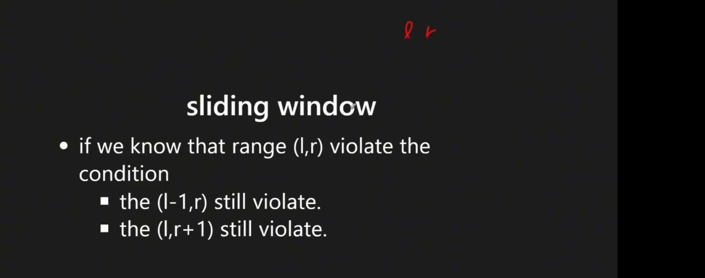
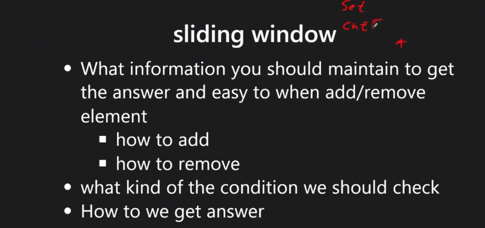
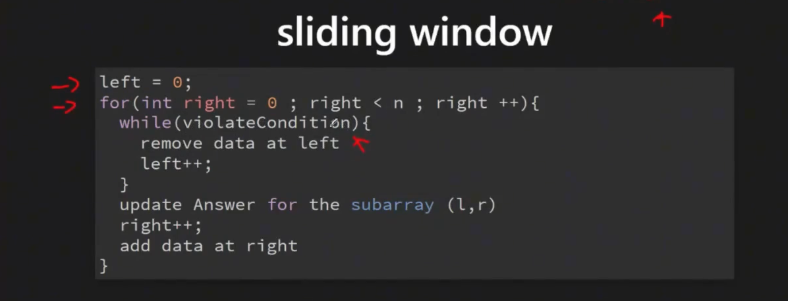

# Sliding Window 

## Overview

**Sliding Window** is a technique that uses two pointers to maintain a "window" over arrays or strings, expanding and contracting to find optimal solutions efficiently.

### Key Properties
- **Time Complexity**: O(n) - each element is visited at most twice
- **Space Complexity**: O(1) for pointers, O(k) for window state
- **Core Idea**: Maintain a window [left, right] that slides over the data structure
- **Two-Phase Process**: 
  - **Expand**: Move right pointer to grow window
  - **Contract**: Move left pointer to shrink window when invalid

### When to Use Sliding Window
- **Subarray/Substring Problems**: Finding optimal subarrays with specific properties
- **Window-based Constraints**: Problems involving fixed or variable window sizes  
- **Optimization**: Min/max length, count, or sum within constraints
- **Character/Element Tracking**: Problems requiring frequency counting

### References
- [labuladong Sliding Window Guide](https://labuladong.online/algo/essential-technique/sliding-window-framework/)
- [Sliding Window Template Collection](https://leetcode.com/discuss/general-discussion/657507/sliding-window-for-beginners-problems-template-sample-solutions/)

## 0) Concept  
### Core Components
1. **Two Pointers**: `left` and `right` to define window boundaries
2. **Loop Structure**:
    - `while-while`: Outer loop expands, inner loop contracts
    - `for-while`: For loop expands, while loop contracts
    - **Key Insight**: 1st loop finds acceptable solution, 2nd loop optimizes to find the best
3. **Window State**: Track elements, counts, or sums within current window
4. **Validity Condition**: Define when window is valid/invalid


<p align="center"></p>

<p align="center"></p>

<p align="center"></p>


### 0-1) Problem Categories

#### **Fixed Size Window**
- **Description**: Window size is predetermined and constant
- **Examples**: LC 438 (Find All Anagrams), LC 567 (Permutation in String)
- **Pattern**: Maintain exact window size, slide one position at a time

#### **Variable Size Window - Maximum**
- **Description**: Find maximum window size satisfying constraints
- **Examples**: LC 3 (Longest Substring), LC 424 (Character Replacement)
- **Pattern**: Expand until invalid, record max, then contract

#### **Variable Size Window - Minimum**  
- **Description**: Find minimum window size satisfying constraints
- **Examples**: LC 209 (Minimum Subarray Sum), LC 76 (Minimum Window Substring)
- **Pattern**: Contract until invalid, record min, then expand

#### **Subarray Counting**
- **Description**: Count subarrays/substrings meeting criteria
- **Examples**: LC 713 (Subarray Product), LC 992 (Subarrays with K Different)
- **Pattern**: For each right position, count valid left positions

#### **String Matching (Hash-based)**
- **Description**: Track character frequencies in window
- **Examples**: LC 567 (Permutation), LC 438 (Anagrams), LC 76 (Window Substring)
- **Pattern**: Use HashMap/Counter to track character counts

### 0-2) Core Algorithms & Data Structures
- **Techniques**: Two pointers, sliding window, frequency counting
- **Data Structures**: HashMap, Counter, Set, Array
- **Helper Tools**: Collections.Counter (Python), HashMap.getOrDefault (Java)

## 1) Sliding Window Templates & Patterns

### 1.1) Template Comparison

| Template Type | Use Case | Loop Structure | When to Use |
|---------------|----------|----------------|-------------|
| **Fixed Size** | Exact window size | `for` with size management | Anagrams, permutations, k-size problems |
| **Variable Max** | Maximum valid window | `for-while` (expand-contract) | Longest substring problems |
| **Variable Min** | Minimum valid window | `while-while` (contract-expand) | Minimum window problems |
| **Counting** | Count valid subarrays | `for` with counting logic | Subarray counting problems |

### 1.2) Universal Sliding Window Template

```python
# Python Universal Template
def sliding_window(s, condition):
    # Initialize window state
    left = 0
    window_state = {}  # or Counter, set, etc.
    result = initialize_result()
    
    # Expand window with right pointer
    for right in range(len(s)):
        # Add current element to window
        update_window_state(s[right])
        
        # Contract window while invalid
        while not is_valid(window_state):
            # Remove leftmost element
            remove_from_window(s[left])
            left += 1
        
        # Update result with current valid window
        result = update_result(result, left, right)
    
    return result
```

```java
// Java Universal Template  
public ResultType slidingWindow(String s) {
    // Initialize window state
    int left = 0;
    Map<Character, Integer> window = new HashMap<>();
    ResultType result = initializeResult();
    
    // Expand window with right pointer
    for (int right = 0; right < s.length(); right++) {
        char rightChar = s.charAt(right);
        window.put(rightChar, window.getOrDefault(rightChar, 0) + 1);
        
        // Contract window while invalid
        while (!isValid(window)) {
            char leftChar = s.charAt(left);
            window.put(leftChar, window.get(leftChar) - 1);
            if (window.get(leftChar) == 0) {
                window.remove(leftChar);
            }
            left++;
        }
        
        // Update result with current valid window
        result = updateResult(result, left, right);
    }
    
    return result;
}
```

### 1.3) Template 1: Fixed Size Window

**Use Cases**: Anagrams, permutations, k-length substrings
**Pattern**: Maintain exact window size, slide one position at a time

```python
# Fixed Size Window Template
def fixed_window(s, k):
    window = {}
    result = []
    
    for i in range(len(s)):
        # Add current element to window
        window[s[i]] = window.get(s[i], 0) + 1
        
        # Remove element that's outside window
        if i >= k:
            left_char = s[i - k]
            window[left_char] -= 1
            if window[left_char] == 0:
                del window[left_char]
        
        # Process window when it reaches target size
        if i >= k - 1:
            # Check condition and update result
            if meets_condition(window):
                result.append(i - k + 1)
    
    return result
```

```java
// Fixed Size Window Template - Java
public List<Integer> fixedWindow(String s, int k) {
    Map<Character, Integer> window = new HashMap<>();
    List<Integer> result = new ArrayList<>();
    
    for (int i = 0; i < s.length(); i++) {
        // Add current element
        char cur = s.charAt(i);
        window.put(cur, window.getOrDefault(cur, 0) + 1);
        
        // Remove element outside window
        if (i >= k) {
            char leftChar = s.charAt(i - k);
            window.put(leftChar, window.get(leftChar) - 1);
            if (window.get(leftChar) == 0) {
                window.remove(leftChar);
            }
        }
        
        // Process when window is full
        if (i >= k - 1 && meetsCondition(window)) {
            result.add(i - k + 1);
        }
    }
    return result;
}
```

### 1.4) Template 2: Variable Size Window (Maximum Length)

**Use Cases**: Longest substring problems, maximum valid window
**Pattern**: Expand until invalid, record max, then contract

```python
# Variable Size Window (Maximum) Template
def max_window(s):
    left = 0
    window = {}
    max_len = 0
    
    for right in range(len(s)):
        # Expand window
        window[s[right]] = window.get(s[right], 0) + 1
        
        # Contract while invalid
        while not is_valid(window):
            window[s[left]] -= 1
            if window[s[left]] == 0:
                del window[s[left]]
            left += 1
        
        # Update maximum length
        max_len = max(max_len, right - left + 1)
    
    return max_len
```

### 1.5) Template 3: Variable Size Window (Minimum Length)

**Use Cases**: Minimum window substring, smallest valid window
**Pattern**: Expand until valid, record min, then try to contract

```python
# Variable Size Window (Minimum) Template  
def min_window(s, target):
    left = 0
    window = {}
    target_count = Counter(target)
    min_len = float('inf')
    result = ""
    
    for right in range(len(s)):
        # Expand window
        window[s[right]] = window.get(s[right], 0) + 1
        
        # Contract while valid
        while is_valid(window, target_count):
            # Update minimum
            if right - left + 1 < min_len:
                min_len = right - left + 1
                result = s[left:right + 1]
            
            # Try to shrink
            window[s[left]] -= 1
            if window[s[left]] == 0:
                del window[s[left]]
            left += 1
    
    return result if min_len != float('inf') else ""
```

### 1.6) Template 4: Counting Subarrays

**Use Cases**: Count subarrays meeting criteria
**Pattern**: For each right position, count valid left positions

```python
# Subarray Counting Template
def count_subarrays(nums, condition):
    left = 0
    count = 0
    window_state = initialize_state()
    
    for right in range(len(nums)):
        # Add current element
        update_window_state(nums[right])
        
        # Shrink window while invalid
        while not is_valid(window_state):
            remove_from_window(nums[left])
            left += 1
        
        # Count valid subarrays ending at 'right'
        count += right - left + 1
    
    return count
```
## 2) Problems by Template Pattern

### 2.1) Template Classification Guide

#### **Fixed Size Window Problems**
| Problem | LC # | Key Technique | Difficulty |
|---------|------|---------------|------------|
| Find All Anagrams in a String | 438 | Character frequency matching | Medium |
| Permutation in String | 567 | Character frequency matching | Medium |
| Maximum Average Subarray I | 643 | Fixed window sum | Easy |
| Contains Duplicate II | 219 | Fixed window with HashSet | Easy |
| Maximum Number of Vowels | 1456 | Fixed window counting | Medium |

#### **Variable Size - Maximum Length**
| Problem | LC # | Key Technique | Difficulty |
|---------|------|---------------|------------|
| Longest Substring Without Repeating Characters | 3 | Character uniqueness tracking | Medium |
| Longest Repeating Character Replacement | 424 | Frequency + max character count | Medium |
| Max Consecutive Ones III | 1004 | K flips constraint | Medium |
| Longest Substring with At Most K Distinct Characters | 340 | Distinct character counting | Medium |
| Longest Substring with At Most Two Distinct Characters | 159 | Two distinct constraint | Medium |

#### **Variable Size - Minimum Length** 
| Problem | LC # | Key Technique | Difficulty |
|---------|------|---------------|------------|
| Minimum Window Substring | 76 | Character coverage tracking | Hard |
| Minimum Size Subarray Sum | 209 | Running sum comparison | Medium |
| Smallest Subarray with Sum ≥ K | 862 | Prefix sum + deque | Hard |
| Minimum Window with Characters | 1176 | Diet plan constraint | Hard |

#### **Counting Subarrays**
| Problem | LC # | Key Technique | Difficulty |
|---------|------|---------------|------------|
| Subarray Product Less Than K | 713 | Product constraint | Medium |
| Subarrays with K Different Integers | 992 | Exactly K = At most K - At most (K-1) | Hard |
| Number of Subarrays with Bounded Maximum | 795 | Bounded value constraint | Medium |
| Count Number of Nice Subarrays | 1248 | Odd number counting | Medium |

#### **Advanced Sliding Window**
| Problem | LC # | Key Technique | Difficulty |
|---------|------|---------------|------------|
| Sliding Window Maximum | 239 | Monotonic deque | Hard |
| Sliding Window Median | 480 | Two heaps | Hard |
| Minimum Swaps to Group All 1's Together | 1151 | Optimization with fixed window | Medium |
| Grumpy Bookstore Owner | 1052 | State change optimization | Medium |

### 2.2) Template Selection Strategy

```
Problem Analysis Flowchart:

1. Is window size fixed?
   ├── YES → Use Fixed Size Template
   └── NO → Continue to 2

2. Are you finding maximum length?
   ├── YES → Use Variable Max Template  
   └── NO → Continue to 3

3. Are you finding minimum length?
   ├── YES → Use Variable Min Template
   └── NO → Continue to 4

4. Are you counting subarrays?
   ├── YES → Use Counting Template
   └── NO → Use custom approach
```

## 3) LeetCode Examples

### 3.1) Fixed Size Window Examples

#### LC 567: Permutation in String (Template: Fixed Size)


```java
// java
// LC 567
    // V0
    // IDEA: HASHMAP + SLIDING WINDOW (fixed by gpt)
    public boolean checkInclusion(String s1, String s2) {
        if (!s1.isEmpty() && s2.isEmpty()) {
            return false;
        }
        if (s1.equals(s2)) {
            return true;
        }
        /** NOTE !!!
         *
         *  we init 2 map, one for s1 counter, the other one as track `s2 sub str counter`
         */
        Map<String, Integer> map1 = new HashMap<>();
        Map<String, Integer> map2 = new HashMap<>();
        for (String x : s1.split("")) {
            String k = String.valueOf(x);
            map1.put(x, map1.getOrDefault(k, 0) + 1);
        }

        // 2 pointers (for s2)
        /** NOTE !!!
         *
         *  we have 2 pointers (for s2) that can track character cnt in s2 within l, r pointers
         */
        int l = 0;
        for (int r = 0; r < s2.length(); r++) {
            String val = String.valueOf(s2.charAt(r));
            map2.put(val, map2.getOrDefault(val, 0) + 1);

            /** NOTE !!!
             *
             *  we use below trick to
             *
             *  -> 1) check if `new reached s2 val` is in s1 map
             *  -> 2) check if 2 map are equal
             *
             *  -> so we have more simple code, and clean logic
             */
            if (map2.equals(map1)) {
                return true;
            }

            /**
             *  NOTE !!!
             *
             *  If the window size exceeds the size of s1, move the left pointer
             *  -> means the `permutation str in s2 of s1` IS NOT FOUND YET,
             *  -> in this case, we need to move s2 left pointer, and update tracking map
             */
            if ((r - l + 1) >= s1.length()) {
                // update map
                String leftVal = String.valueOf(s2.charAt(l));
                map2.put(leftVal, map2.get(leftVal) - 1);
                /**
                 * NOTE !!!
                 *
                 *  if can't find permutation at current window ([l,r]),
                 *  then we move left pointer 1 idx (e.g. l += 1)
                 *  for moving and checking next window
                 */
                l += 1;
                if (map2.get(leftVal) == 0) {
                    map2.remove(leftVal);
                }
            }
        }

        return false;
    }
```

```python
# LC 567 Permutation in String
# V0 
import collections
class Solution(object):
    def checkInclusion(self, s1, s2):
        l1, l2 = len(s1), len(s2)
        c1 = collections.Counter(s1)
        c2 = collections.Counter()
        p = q = 0
        while q < l2:
            c2[s2[q]] += 1
            if c1 == c2:
                return True
            q += 1
            if q - p + 1 > l1:
                c2[s2[p]] -= 1
                if c2[s2[p]] == 0:
                    del c2[s2[p]]
                p += 1
        return False
```

#### LC 438: Find All Anagrams in a String (Template: Fixed Size)

```java
// LC 438
    // V0
    // IDEA: HASHMAP + 2 POINTERS (fixed by gpt)
    public List<Integer> findAnagrams(String s, String p) {
        List<Integer> res = new ArrayList<>();
        // edge
        if (s == null || p == null || s.isEmpty() || p.isEmpty() || p.length() > s.length()) {
            return res;
        }
        if (s.equals(p)) {
            res.add(0);
            return res;
        }

        // init p map
        Map<String, Integer> p_map = new HashMap<>();
        for (String x : p.split("")) {
            p_map.put(x, p_map.getOrDefault(x, 0) + 1);
        }

        String[] s_arr = s.split("");
        Map<String, Integer> s_map = new HashMap<>();

        int l = 0;
        for (int r = 0; r < s_arr.length; r++) {
            String key = s_arr[r];
            s_map.put(key, s_map.getOrDefault(key, 0) + 1);

            /**
             *  NOTE !!!
             *
             *   need `while loop` below
             *   so we can `shrink` left pointer (window)
             *   to make the sub string size equals to `p`
             *
             *   (could be `if` logic as well here)
             *   (e.g. if (r - l + 1 > p.length()) )
             */
            // shrink window if size > p.length()
            while (r - l + 1 > p.length()) {
                String leftKey = s_arr[l];
                /**
                 *  NOTE !!!
                 *
                 *   need to update s_map
                 */
                s_map.put(leftKey, s_map.get(leftKey) - 1);
                if (s_map.get(leftKey) == 0) {
                    s_map.remove(leftKey);
                }
                l++;
            }

            /**
             *  NOTE !!!
             *
             *  if same size, compare s_map, and p_map
             */
            // if same size, compare
            if (r - l + 1 == p.length() && isEqaual(p_map, s_map)) {
                res.add(l);
            }
        }

        return res;
    }

    private boolean isEqaual(Map<String, Integer> p_map, Map<String, Integer> s_map) {
        if (p_map.size() != s_map.size()) {
            return false;
        }
        for (String k : p_map.keySet()) {
            if (!s_map.containsKey(k) || !s_map.get(k).equals(p_map.get(k))) {
                return false;
            }
        }
        return true;
    }

    // V0-1
    // IDEA: HASHMAP + SLIDE WINDOW (gpt)
    /**
     *  Why `slide window` is needed trick for this problem?
     *
     *
     *  Yes 👍 the sliding window (or two-pointer) is the needed trick for that group of problems like “longest substring without repeating characters”.
     *
     * Here’s why:
     *  •   A brute force way would check all substrings → O(n²) or worse.
     *  •   But with a sliding window, you keep a “window” [left, right] over the string/array and expand right step by step.
     *  •   If the constraint is violated (like duplicate chars appear, or the sum is too large), you shrink from the left until it’s valid again.
     *  •   This way each index moves at most once → O(n) total.
     *
     * That’s the exact “trick” behind those problems. The hard part is usually:
     *  1.  What condition makes the window valid/invalid? (duplicate chars, sum > k, etc.)
     *  2.  When to update the answer? (on every valid window, or only when shrinking).
     *
     */
    public List<Integer> findAnagrams_0_1(String s, String p) {
        List<Integer> res = new ArrayList<>();
        if (s == null || p == null || s.isEmpty() || p.isEmpty() || p.length() > s.length()) {
            return res;
        }

        // Build p_map (pattern frequency)
        Map<String, Integer> p_map = new HashMap<>();
        for (String x : p.split("")) {
            p_map.put(x, p_map.getOrDefault(x, 0) + 1);
        }

        Map<String, Integer> s_map = new HashMap<>();
        String[] s_arr = s.split("");
        int window = p.length();

        for (int i = 0; i < s_arr.length; i++) {
            String val = s_arr[i];

            /**  NOTE !!!
             *
             *  we `add` element to s_amp anyway,
             *  via `sliding window`  we DON'T need to handle cases
             *  such as 1) if the element in p_map, 2) if the element cnt > the one in p_map ...
             *
             *  -> via `sliding window`, we can simply ONLY compare
             *     if s_map and p_map qre equals when `sliding window` size equals to p size
             */
            // add current char to s_map
            s_map.put(val, s_map.getOrDefault(val, 0) + 1);

            /**  NOTE !!!
             *
             *  sliding window
             */
            // maintain sliding window size
            if (i >= window) {
                String leftChar = s_arr[i - window];
                if (s_map.get(leftChar) == 1) {
                    s_map.remove(leftChar);
                } else {
                    s_map.put(leftChar, s_map.get(leftChar) - 1);
                }
            }

            // compare maps only when window size matches
            if (i >= window - 1 && isEqual(p_map, s_map)) {
                res.add(i - window + 1);
            }
        }

        return res;
    }

    private boolean isEqual(Map<String, Integer> p_map, Map<String, Integer> s_map) {
        if (p_map.size() != s_map.size()) {
            return false;
        }
        for (String k : p_map.keySet()) {
            if (!s_map.containsKey(k) || !p_map.get(k).equals(s_map.get(k))) {
                return false;
            }
        }
        return true;
    }
```

```python
# LC 438 Find All Anagrams in a String
# V0
# IDEA : SLIDING WINDOW + collections.Counter()
class Solution(object):
    def findAnagrams(self, s, p):
        """
        :type s: str
        :type p: str
        :rtype: List[int]
        """
        ls, lp = len(s), len(p)
        cp = collections.Counter(p)
        cs = collections.Counter()
        ans = []
        for i in range(ls):
            cs[s[i]] += 1
            if i >= lp:
                cs[s[i - lp]] -= 1
                ### BE AWARE OF IT
                if cs[s[i - lp]] == 0:
                    del cs[s[i - lp]]
            if cs == cp:
                ans.append(i - lp + 1)
        return ans
```

### 3.2) Variable Size Window Examples

#### LC 3: Longest Substring Without Repeating Characters (Template: Variable Max)

```python
# LC 003 Longest Substring Without Repeating Characters
# V0'
# IDEA : SLIDING WINDOW + DICT
#       -> use a hash table (d) record visited "element" (e.g. : a,b,c,...)
#          (but NOT sub-string)
class Solution(object):
    def lengthOfLongestSubstring(self, s):
        d = {}
        # left pointer
        l = 0
        res = 0
        # right pointer
        for r in range(len(s)):
            """
            ### NOTE : we deal with "s[r] in d" case first 
            ### NOTE : if already visited, means "repeating"
            #      -> then we need to update left pointer (l)
            """
            if s[r] in d:
                """
                NOTE !!! this
                -> via max(l, d[s[r]] + 1) trick,
                   we can get the "latest" idx of duplicated s[r], and start from that one
                """
                l = max(l, d[s[r]] + 1)
            # if not visited yet, record the alphabet
            # and re-calculate the max length
            d[s[r]] = r
            res = max(res, r -l + 1)
        return res

# V0'
# IDEA : SLIDING WINDOW + DICT
#       -> use a hash table (d) record visited "element" (e.g. : a,b,c,...)
#          (but NOT sub-string)
class Solution(object):
    def lengthOfLongestSubstring(self, s):
        d = {}
        # left pointer
        l = 0
        res = 0
        # right pointer
        for r in range(len(s)):
            """
            ### NOTE : we deal with "s[r] in d" case first 
            ### NOTE : if already visited, means "repeating"
            #      -> then we need to update left pointer (l)
            """
            if s[r] in d:
                """
                NOTE !!! this
                -> via max(l, d[s[r]] + 1) trick,
                   we can get the "latest" idx of duplicated s[r], and start from that one
                """
                l = max(l, d[s[r]] + 1)
            # if not visited yet, record the alphabet
            # and re-calculate the max length
            d[s[r]] = r
            res = max(res, r -l + 1)
        return res
```

```java
// java
// V0
// IDEA : SLIDING WINDOW + HASH SET
public int lengthOfLongestSubstring(String s) {

    if (s.equals("")){
        return 0;
    }

    if (s.equals(" ")){
        return 1;
    }

    if (s.length() == 1){
        return 1;
    }

    int ans = 0;
    char[] s_array = s.toCharArray();
    for (int i = 0; i < s_array.length-1; i++){
        int j = i;
        Set<String> set = new HashSet<String>();
        while (j < s_array.length){
            String cur = String.valueOf(s_array[j]);
            if (set.contains(cur)){
                ans = Math.max(ans, set.size());
                break;
            }else{
                set.add(cur);
                ans = Math.max(ans, set.size());
                j += 1;
            }
        }
    }

    return ans;
}
```

### 3.3) Counting Subarrays Examples

#### LC 713: Subarray Product Less Than K (Template: Counting)
```python
# LC 713 Subarray Product Less Than K
# V0 
# IDEA : SLIDING WINDOW 
# MAINTAIN 2 INDEX : left, i, SO THE SLIDING WINDOW IS : [left, i]
# CHECK IF THE PRODUCT OF ALL DIGITS IN THE WINDOW [left, i] < k
# IF NOT, REMOVE CURRENT LEFT, AND DO LEFT ++
# REPEAT ABOVE PROCESS AND GO THOROUGH ALL ARRAY  
class Solution:
    def numSubarrayProductLessThanK(self, nums, k):
        # init values
        product = 1
        i = 0
        result = 0
        
        for j, num in enumerate(nums):
            ### NOTE : we get product first
            product *= num
            ### NOTE : the while loop condition : product >= k
            #         -> if product >= k, we do the corresponding op
            while i <= j and product >= k:
                ### NOTE this trick
                #    -> divided the number back, since this number already make the product > k 
                product = product // nums[i]
                ### NOTE : move i to 1 right index
                i += 1
            ### NOTE : , the number of intervals with subarray product less than k and with right-most coordinate right, is right - left + 1
            #    -> https://leetcode.com/problems/subarray-product-less-than-k/solution/           
            result += (j - i + 1)           
        return result
```

### 3.4) Minimum Window Examples

#### LC 209: Minimum Size Subarray Sum (Template: Variable Min)
```python
# LC 209 Minimum Size Subarray Sum
# V0
# IDEA : SLIDING WINDOW : start, end
class Solution:
    def minSubArrayLen(self, s, nums):
        if nums is None or len(nums) == 0:
            return 0

        n = len(nums)
        minLength = n + 1
        sum = 0
        j = 0
        for i in range(n):
            ### NOTE the while loop condition (j < n and sum < s)
            while j < n and sum < s:
                sum += nums[j]
                j += 1
            # NOTE : we need to check if sum >= s here
            if sum >= s:
                minLength = min(minLength, j - i)

            ### NOTE : we need to get min length of sub array
            #          so once it meats the condition (sum >= s)
            #          we should update the minLength (minLength = min(minLength, j - i))
            #          and move to next i and roll back _sum (_sum -= nums[i])
            sum -= nums[i]
            
        ### NOTE : if minLength == n + 1, means there is no such subarray, so return 0 instead
        if minLength == n + 1:
            return 0         
        return minLength
```

#### LC 424: Longest Repeating Character Replacement (Template: Variable Max)
```python
# lc 424. Longest Repeating Character Replacement
# V0
# IDEA : SLIDING WINDOW + DICT + 2 POINTERS
from collections import Counter
class Solution(object):
    def characterReplacement(self, s, k):
        table = Counter()
        res = 0
        p1 = p2 = 0
        # below can be either while or for loop
        while p2 < len(s):
            table[s[p2]] += 1
            p2 += 1
            """
            ### NOTE : if remain elements > k, means there is no possibility to make this substring as "longest substring containing the same letter"
               ->  remain elements = p1 - p2 - max(table.values())
               ->  e.g. if we consider "max(table.values()" as the "repeating character", then "p2 - p1 - max(table.values()" is the count of elements we need to replace
               ->  so we need to clear "current candidate" for next iteration
            """
            while p2 - p1 - max(table.values()) > k:
                table[s[p1]] -= 1
                p1 += 1
            res = max(res, p2 - p1)
        return res
    
# V0'
from collections import defaultdict
class Solution:
    def characterReplacement(self, s, k):
        cnt = defaultdict(int)
        maxLen = 0
        l = 0
        # below can be either while or for loop
        for r in range(len(s)):
            cnt[s[r]] += 1
            ### NOTE : this condition
            while r - l + 1 - max(cnt.values()) > k:
                cnt[s[l]] -= 1
                l += 1
            maxLen = max(maxLen, r - l + 1)     

        return maxLen
```

```java
// java
// LC 424
// V2
// IDEA : Sliding Window (Slow)
// https://leetcode.com/problems/longest-repeating-character-replacement/editorial/
public int characterReplacement_4(String s, int k) {
    HashSet<Character> allLetters = new HashSet();

    // collect all unique letters
    for (int i = 0; i < s.length(); i++) {
        allLetters.add(s.charAt(i));
    }

    int maxLength = 0;
    for (Character letter : allLetters) {
        int start = 0;
        int count = 0;
        // initialize a sliding window for each unique letter
        for (int end = 0; end < s.length(); end += 1) {
            if (s.charAt(end) == letter) {
                // if the letter matches, increase the count
                count += 1;
            }
            // bring start forward until the window is valid again
            while (!isWindowValid(start, end, count, k)) {
                if (s.charAt(start) == letter) {
                    // if the letter matches, decrease the count
                    count -= 1;
                }
                start += 1;
            }
            // at this point the window is valid, update maxLength
            maxLength = Math.max(maxLength, end + 1 - start);
        }
    }
    return maxLength;
}

private Boolean isWindowValid(int start, int end, int count, int k) {
    // end + 1 - start - count is different element count
    return end + 1 - start - count <= k;
}
```

### 3.5) Advanced Examples

#### LC 413: Arithmetic Slices (Template: Custom)
```python
# LC 413 Arithmetic Slices
# V0
# IDEA : SLIDING DINDOW + 2 pointers
# STEPS:
#   -> step 1) loop over nums from idx=2 (for i in range(2, len(A)))
#   -> step 2) use the other pointer j, "look back to idx = 0" via while loop
#       -> if there is any case fit condition, add to result
#   -> step 3) return ans
class Solution(object):
    def numberOfArithmeticSlices(self, A):
        # edge case
        if not A or len(A) < 3:
            return 0
        res = 0
        j = 2
        for i in range(2, len(A)):
            # use the other pointer j, "look back to idx = 0" via while loop
            j = i
            while j-2 >= 0:
                # if there is any case fit condition, add to result
                if A[j] - A[j-1] == A[j-1] - A[j-2]:
                    res += 1
                    j -= 1
                else:
                    break
        return res 
```

#### LC 1151: Minimum Swaps to Group All 1's Together (Template: Fixed Size)
```python
# LC 1151 Minimum Swaps to Group All 1's Together
# V0
# IDEA : Sliding Window with Two Pointers
# IDEA : core : Find which sub-array HAS MOST "1", since it means it needs MINIMUM SWAP for getting all "1" toogether
# https://leetcode.com/problems/minimum-swaps-to-group-all-1s-together/solution/
class Solution:
    def minSwaps(self, data):
        ones = sum(data)
        cnt_one = max_one = 0
        left = right = 0
        while right < len(data):
            # updating the number of 1's by adding the new element
            cnt_one += data[right]
            right += 1
            # maintain the length of the window to ones
            if right - left > ones:
                # updating the number of 1's by removing the oldest element
                cnt_one -= data[left]
                left += 1
            # record the maximum number of 1's in the window
            max_one = max(max_one, cnt_one)
        return ones - max_one
```

#### LC 763: Partition Labels (Template: Custom Greedy + Sliding Window)

```java
// java
// LC 763 Partition Labels

// V0-2
// IDEA: GREEDY + hashMap record last idx + sliding window (fixed by gpt)
public List<Integer> partitionLabels_0_2(String s) {
    List<Integer> res = new ArrayList<>();

    if (s == null || s.length() == 0) {
        return res;
    }

    // Map each character to its last index
    Map<Character, Integer> lastIndexMap = new HashMap<>();
    for (int i = 0; i < s.length(); i++) {
        lastIndexMap.put(s.charAt(i), i);
    }

    int l = 0;
    while (l < s.length()) {
        int end = lastIndexMap.get(s.charAt(l));
        int r = l;

        // Expand the window to include all characters in the current segment
        while (r < end) {
            end = Math.max(end, lastIndexMap.get(s.charAt(r)));
            r++;
        }

        res.add(end - l + 1);
        l = end + 1;
    }

    return res;
}
```

## 4) Summary & Quick Reference

### 4.1) Template Quick Reference

| Template | Time | Space | Key Pattern | When to Use |
|----------|------|-------|-------------|-------------|
| **Fixed Size** | O(n) | O(k) | `for i in range(n)` | Window size predetermined |
| **Variable Max** | O(n) | O(k) | `for-while` expand-contract | Find maximum valid length |
| **Variable Min** | O(n) | O(k) | `while-while` contract-expand | Find minimum valid length |
| **Counting** | O(n) | O(k) | `for` with `count += right-left+1` | Count subarrays/substrings |

### 4.2) Common Patterns & Tricks

#### **Character Frequency Tracking**
```python
# Track character counts in window
window = {}
window[char] = window.get(char, 0) + 1

# Remove character from window
window[char] -= 1
if window[char] == 0:
    del window[char]
```

#### **Validity Conditions**
```python
# Common validity checks
def is_valid_permutation(window, target):
    return window == target

def is_valid_distinct_k(window, k):
    return len(window) <= k

def is_valid_sum(current_sum, target):
    return current_sum >= target
```

#### **Result Updates**
```python
# Maximum length problems
max_len = max(max_len, right - left + 1)

# Minimum length problems  
if is_valid:
    min_len = min(min_len, right - left + 1)

# Counting problems
count += right - left + 1  # All subarrays ending at 'right'
```

### 4.3) Problem-Solving Steps

1. **Identify Pattern**: Fixed size, variable max/min, or counting?
2. **Choose Template**: Select appropriate template based on pattern
3. **Define Window State**: HashMap, set, sum, or counter?
4. **Define Validity**: What makes the window valid/invalid?
5. **Update Logic**: When and how to update the result?

### 4.4) Common Mistakes & Tips

**🚫 Common Mistakes:**
- Wrong loop structure (using wrong template)
- Forgetting to handle window state correctly
- Incorrect validity condition logic
- Missing edge cases (empty input, single element)

**✅ Best Practices:**
- Use `collections.Counter` for character frequency problems
- Always handle the case when removing elements from HashMap
- Test with edge cases: empty string, single character, all same characters
- Consider if the problem needs "exactly k" vs "at most k"
- For "exactly k" problems: use "at most k - at most (k-1)"

### 4.5) Time & Space Complexity Analysis
- **Time**: O(n) - each element visited at most twice
- **Space**: O(k) where k is window size or number of unique elements
- **Optimization**: Use arrays instead of HashMaps when character set is limited (e.g., only lowercase letters)

### 4.6) Related Algorithms
- **Two Pointers**: Foundation for sliding window
- **Hash Table**: For frequency tracking
- **Deque**: For sliding window maximum/minimum
- **Prefix Sum**: For sum-based sliding window problems