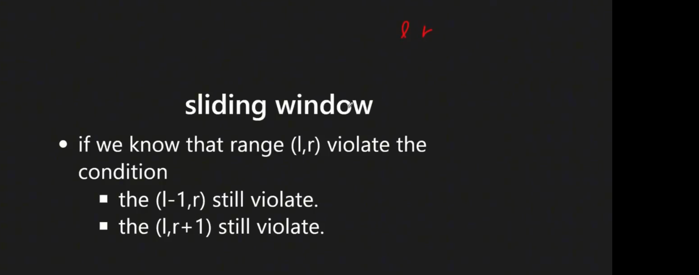
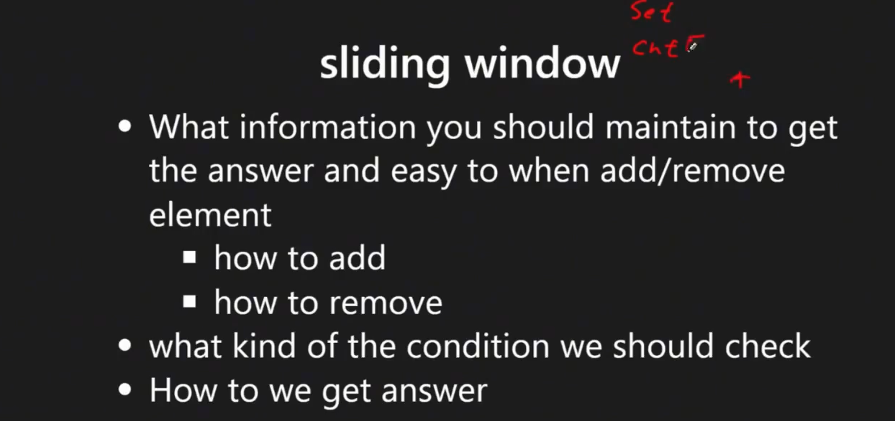
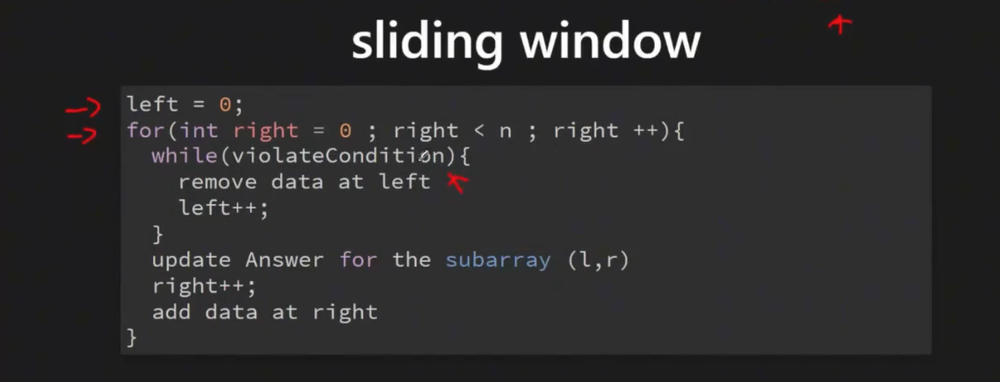

# Sliding Window

> **Scope** — Windows that grow and shrink on a condition — fixed-size, variable-size, at-most-k, and exactly-k by subtraction; owns the expand/contract loop and the six canonical window templates.
> **See also** — *split out of this file*: [sliding_window_examples.md](./sliding_window_examples.md) — the worked LC solution archive, one canonical solution per problem per language; [sliding_window_advanced.md](./sliding_window_advanced.md) — deque extrema, at-most-K generalisations, exactly-K beyond one instance, complement / word-level / bucketed windows.
> *Neighbouring sheets*: [2_pointers.md](./2_pointers.md) — pointers that converge instead of trailing; [hash_map.md](./hash_map.md) — the counting map most windows carry; [monotonic_queue.md](./monotonic_queue.md) — window extrema in O(n); [prefix_sum.md](./prefix_sum.md) — when the window can be negative-valued.

## LeetCode Problem Lists

- [Sliding Window](https://leetcode.com/problem-list/sliding-window/)
- [Two Pointers](https://leetcode.com/problem-list/two-pointers/)

## Overview

**Sliding Window** is a technique that uses two pointers to maintain a "window" over arrays or strings, expanding and contracting to find optimal solutions efficiently.

### Key Properties
- **Time Complexity**: O(n) - each element is visited at most twice
- **Space Complexity**: O(1) for pointers, O(k) for window state
- **Core Idea**: Maintain a window [left, right] that slides over the data structure
- **Two-Phase Process**: 
  - **Expand**: Move right pointer to grow window
  - **Contract**: Move left pointer to shrink window when invalid

### When to Use Sliding Window
- **Subarray/Substring Problems**: Finding optimal subarrays with specific properties
- **Window-based Constraints**: Problems involving fixed or variable window sizes  
- **Optimization**: Min/max length, count, or sum within constraints
- **Character/Element Tracking**: Problems requiring frequency counting

### References
- [labuladong Sliding Window Guide](https://labuladong.online/algo/essential-technique/sliding-window-framework/)
- [Sliding Window Template Collection](https://leetcode.com/discuss/general-discussion/657507/sliding-window-for-beginners-problems-template-sample-solutions/)

## Problem Categories

### Core Components
1. **Two Pointers**: `left` and `right` to define window boundaries
2. **Loop Structure**:
    - `while-while`: Outer loop expands, inner loop contracts
    - `for-while`: For loop expands, while loop contracts
    - **Key Insight**: 1st loop finds acceptable solution, 2nd loop optimizes to find the best
3. **Window State**: Track elements, counts, or sums within current window
4. **Validity Condition**: Define when window is valid/invalid


<p align="center"></p>

<p align="center"></p>

<p align="center"></p>


### The Five Window Shapes

#### **Fixed Size Window**
- **Description**: Window size is predetermined and constant
- **Examples**: LC 438 (Find All Anagrams), LC 567 (Permutation in String)
- **Pattern**: Maintain exact window size, slide one position at a time

#### **Variable Size Window - Maximum**
- **Description**: Find maximum window size satisfying constraints
- **Examples**: LC 3 (Longest Substring), LC 424 (Character Replacement)
- **Pattern**: Expand until invalid, record max, then contract

#### **Variable Size Window - Minimum**  
- **Description**: Find minimum window size satisfying constraints
- **Examples**: LC 209 (Minimum Subarray Sum), LC 76 (Minimum Window Substring)
- **Pattern**: Contract until invalid, record min, then expand

#### **Subarray Counting**
- **Description**: Count subarrays/substrings meeting criteria
- **Examples**: LC 713 (Subarray Product), LC 992 (Subarrays with K Different)
- **Pattern**: For each right position, count valid left positions

#### **String Matching (Hash-based)**
- **Description**: Track character frequencies in window
- **Examples**: LC 567 (Permutation), LC 438 (Anagrams), LC 76 (Window Substring)
- **Pattern**: Use HashMap/Counter to track character counts

### Window State & Helper Tools
- **Techniques**: Two pointers, sliding window, frequency counting
- **Data Structures**: HashMap, Counter, Set, Array
- **Helper Tools**: Collections.Counter (Python), HashMap.getOrDefault (Java)

### Fixed-Size Window vs Variable-Size Window
| Type | When to Use | Shrink Condition | Example |
|------|------------|-----------------|---------|
| Fixed size k | Window size is given | `right - left + 1 > k` | LC 567 (Permutation in String) |
| Variable (minimize) | Find smallest valid window | Shrink while window is valid | LC 76 (Min Window Substring) |
| Variable (maximize) | Find largest valid window | Shrink while window is invalid | LC 3 (Longest No-Repeat) |
| Exactly K → AtMost | Count windows with exact constraint | N/A — use subtraction trick | LC 992, LC 1248 |

## Templates & Algorithms

Six templates cover every must-know sliding-window shape. Template 2 is the one to write from
memory first — every variable-size window in the family is that loop with a different validity
test and a different result update.

### Template Comparison Table

| # | Template | Shape | Result update | Time / Space | Anchor problems |
|---|----------|-------|---------------|--------------|-----------------|
| 1 | Fixed-Size Window | `for i` + evict `i - k` | test when `i >= k - 1` | O(n) / O(k) | LC 643, 438, 567 |
| 2 | Grow-Then-Shrink (the `while` invariant) | `for right` + `while invalid: shrink` | any valid window | O(n) / O(k) | the base of 3–6 |
| 3 | Longest Window Satisfying P | shrink **while invalid** | `max(res, r - l + 1)` | O(n) / O(k) | LC 3, 424, 1004 |
| 4 | Shortest Window Satisfying P | shrink **while valid** | `min(res, r - l + 1)` | O(n) / O(k) | LC 209, 76 |
| 5 | Char-Count Window (`have`/`need`) | freq map + match counter | on `have == need` | O(n) / O(charset) | LC 76, 438, 567 |
| 6 | Exactly K via At-Most Subtraction | two at-most passes | `count += r - l + 1` | O(n) / O(k) | LC 992, 1248, 930 |

> Rows 3 and 4 differ by **one word**: longest shrinks while the window is *invalid*, shortest
> shrinks while it is *valid*. Get that word wrong and the answer is silently off.

### Template 1: Fixed-Size Window ⭐⭐⭐⭐⭐

**Worked instances**: LC 643, LC 438, LC 567, LC 1456, LC 219 — see [sliding_window_examples.md](./sliding_window_examples.md).

> *Outline, not runnable* — `meets_condition` / `meetsCondition` is the problem-specific test
> you fill in.

**Use Cases**: Anagrams, permutations, k-length substrings
**Pattern**: Maintain exact window size, slide one position at a time

```python
# Fixed Size Window Template
def fixed_window(s, k):
    window = {}
    result = []
    
    for i in range(len(s)):
        # Add current element to window
        window[s[i]] = window.get(s[i], 0) + 1
        
        # Remove element that's outside window
        if i >= k:
            left_char = s[i - k]
            window[left_char] -= 1
            if window[left_char] == 0:
                del window[left_char]
        
        # Process window when it reaches target size
        if i >= k - 1:
            # Check condition and update result
            if meets_condition(window):
                result.append(i - k + 1)
    
    return result
```

```java
// Fixed Size Window Template - Java
public List<Integer> fixedWindow(String s, int k) {
    Map<Character, Integer> window = new HashMap<>();
    List<Integer> result = new ArrayList<>();
    
    for (int i = 0; i < s.length(); i++) {
        // Add current element
        char cur = s.charAt(i);
        window.put(cur, window.getOrDefault(cur, 0) + 1);
        
        // Remove element outside window
        if (i >= k) {
            char leftChar = s.charAt(i - k);
            window.put(leftChar, window.get(leftChar) - 1);
            if (window.get(leftChar) == 0) {
                window.remove(leftChar);
            }
        }
        
        // Process when window is full
        if (i >= k - 1 && meetsCondition(window)) {
            result.add(i - k + 1);
        }
    }
    return result;
}
```

### Template 2: Grow-Then-Shrink — the `while` Invariant ⭐⭐⭐⭐⭐

**The single most important idiom on this sheet.** One `for` advances `right` and adds an
element; one `while` advances `left` until the window is valid again. Because `left` never moves
backwards, every element is added once and removed at most once → O(n), however the validity
test is written.

```text
for right in range(n):         # 1. expand: the window may now be invalid
    add(a[right])
    while not valid(window):   # 2. restore the invariant (may run 0 times)
        remove(a[left]); left += 1
    update_result(left, right)  # 3. the window is valid HERE, and only here
```

Those three slots are the whole design space: what `add`/`remove` maintain, what `valid` tests,
and what `update_result` records. Templates 3–6 are this loop with the slots filled in.

> *Outline, not runnable* — `is_valid`, `update_window_state` and `update_result` are the
> problem-specific slots.

```python
# Python Universal Template
def sliding_window(s, condition):
    # Initialize window state
    left = 0
    window_state = {}  # or Counter, set, etc.
    result = initialize_result()
    
    # Expand window with right pointer
    for right in range(len(s)):
        # Add current element to window
        update_window_state(s[right])
        
        # Contract window while invalid
        while not is_valid(window_state):
            # Remove leftmost element
            remove_from_window(s[left])
            left += 1
        
        # Update result with current valid window
        result = update_result(result, left, right)
    
    return result
```

```java
// Java Universal Template  
public ResultType slidingWindow(String s) {
    // Initialize window state
    int left = 0;
    Map<Character, Integer> window = new HashMap<>();
    ResultType result = initializeResult();
    
    // Expand window with right pointer
    for (int right = 0; right < s.length(); right++) {
        char rightChar = s.charAt(right);
        window.put(rightChar, window.getOrDefault(rightChar, 0) + 1);
        
        // Contract window while invalid
        while (!isValid(window)) {
            char leftChar = s.charAt(left);
            window.put(leftChar, window.get(leftChar) - 1);
            if (window.get(leftChar) == 0) {
                window.remove(leftChar);
            }
            left++;
        }
        
        // Update result with current valid window
        result = updateResult(result, left, right);
    }
    
    return result;
}
```

### Template 3: Longest Window Satisfying P — LC 3 ⭐⭐⭐⭐⭐

**Use Cases**: Longest substring problems, maximum valid window
**Pattern**: Expand until invalid, record max, then contract

**Invariant**: shrink **while the window is invalid**, so at the bottom of each iteration the
window is the longest valid one ending at `right`. Record `r - l + 1` *after* the `while`, never
inside it.

```java
// LC 3 - Longest Substring Without Repeating Characters
// IDEA: Sliding window with HashSet to track characters in window
// time = O(N), space = O(min(N, charset))
public int lengthOfLongestSubstring(String s) {
    Set<Character> set = new HashSet<>();
    int l = 0, ans = 0;
    for (int r = 0; r < s.length(); r++) {
        while (set.contains(s.charAt(r))) {
            set.remove(s.charAt(l++));
        }
        set.add(s.charAt(r));
        ans = Math.max(ans, r - l + 1);
    }
    return ans;
}
```

```python
# LC 003 Longest Substring Without Repeating Characters
# IDEA : SLIDING WINDOW + DICT
#       -> use a hash table (d) record visited "element" (e.g. : a,b,c,...)
#          (but NOT sub-string)
class Solution(object):
    def lengthOfLongestSubstring(self, s):
        d = {}
        # left pointer
        l = 0
        res = 0
        # right pointer
        for r in range(len(s)):
            """
            ### NOTE : we deal with "s[r] in d" case first 
            ### NOTE : if already visited, means "repeating"
            #      -> then we need to update left pointer (l)
            """
            if s[r] in d:
                """
                NOTE !!! this
                -> via max(l, d[s[r]] + 1) trick,
                   we can get the "latest" idx of duplicated s[r], and start from that one
                """
                l = max(l, d[s[r]] + 1)
            # if not visited yet, record the alphabet
            # and re-calculate the max length
            d[s[r]] = r
            res = max(res, r -l + 1)
        return res
```

> The Java version shrinks one character at a time; the Python version **jumps** `left` straight
> to `d[c] + 1` using the last-seen index. Same invariant, two spellings — the jump is why
> `max(l, ...)` is needed, so a stale index can never pull `left` backwards.

### Template 4: Shortest Window Satisfying P — LC 209 ⭐⭐⭐⭐⭐

**Use Cases**: Minimum window substring, smallest valid window
**Pattern**: Expand until valid, record min, then try to contract

**Invariant**: shrink **while the window is valid**, recording the length *before* each shrink.
This is Template 3 with the `while` condition negated — nothing else changes.

```java
// LC 209 - Minimum Size Subarray Sum
// IDEA: Sliding window — shrink left when sum >= target, record min length
// time = O(N), space = O(1)
public int minSubArrayLen(int target, int[] nums) {
    int l = 0, sum = 0, minLen = Integer.MAX_VALUE;
    for (int r = 0; r < nums.length; r++) {
        sum += nums[r];
        while (sum >= target) {
            minLen = Math.min(minLen, r - l + 1);
            sum -= nums[l++];
        }
    }
    return minLen == Integer.MAX_VALUE ? 0 : minLen;
}
```

```python
# LC 209 Minimum Size Subarray Sum
# IDEA : SLIDING WINDOW : start, end
class Solution:
    def minSubArrayLen(self, s, nums):
        if nums is None or len(nums) == 0:
            return 0

        n = len(nums)
        minLength = n + 1
        sum = 0
        j = 0
        for i in range(n):
            ### NOTE the while loop condition (j < n and sum < s)
            while j < n and sum < s:
                sum += nums[j]
                j += 1
            # NOTE : we need to check if sum >= s here
            if sum >= s:
                minLength = min(minLength, j - i)

            ### NOTE : we need to get min length of sub array
            #          so once it meats the condition (sum >= s)
            #          we should update the minLength (minLength = min(minLength, j - i))
            #          and move to next i and roll back _sum (_sum -= nums[i])
            sum -= nums[i]
            
        ### NOTE : if minLength == n + 1, means there is no such subarray, so return 0 instead
        if minLength == n + 1:
            return 0         
        return minLength
```

### Template 5: Char-Count Window with the have/need Counter — LC 76 ⭐⭐⭐⭐⭐

**Pattern**: a frequency map of what the window *needs*, plus a single integer counting how much
of it the window *has*. The counter is what makes validity O(1) instead of an O(charset) map
comparison on every step — the detail interviewers push on.

Classic "shrink when valid" variable-size window:

```python
from collections import Counter

def minWindow(s, t):
    need = Counter(t)
    missing = len(t)
    best = ""
    left = 0

    for right, c in enumerate(s):
        if need[c] > 0:
            missing -= 1
        need[c] -= 1

        if missing == 0:              # valid window found
            # Shrink from left
            while need[s[left]] < 0:
                need[s[left]] += 1
                left += 1
            if not best or right - left + 1 < len(best):
                best = s[left:right+1]
            # Break window to search for next
            need[s[left]] += 1
            missing += 1
            left += 1

    return best
```

```java
// LC 76 - Minimum Window Substring
// IDEA: Sliding window with frequency maps; shrink when window is valid
// time = O(N + M), space = O(N + M)
public String minWindow(String s, String t) {
    Map<Character, Integer> need = new HashMap<>(), window = new HashMap<>();
    for (char c : t.toCharArray()) need.merge(c, 1, Integer::sum);
    int l = 0, valid = 0, start = 0, minLen = Integer.MAX_VALUE;
    for (int r = 0; r < s.length(); r++) {
        char c = s.charAt(r);
        window.merge(c, 1, Integer::sum);
        if (need.containsKey(c) && window.get(c).equals(need.get(c))) valid++;
        while (valid == need.size()) {
            if (r - l + 1 < minLen) { minLen = r - l + 1; start = l; }
            char d = s.charAt(l++);
            if (need.containsKey(d)) {
                if (window.get(d).equals(need.get(d))) valid--;
                window.merge(d, -1, Integer::sum);
            }
        }
    }
    return minLen == Integer.MAX_VALUE ? "" : s.substring(start, start + minLen);
}
```

> Two spellings of the same counter: Python tracks `missing` (characters still owed, counting
> down to 0), Java tracks `valid` (characters fully satisfied, counting up to `need.size()`).
> The map-equality shortcut — comparing two frequency maps directly — is only affordable for a
> **fixed**-size window; see LC 438 / LC 567 in [sliding_window_examples.md](./sliding_window_examples.md).

### Template 6: Exactly K via At-Most Subtraction — LC 992 ⭐⭐⭐⭐⭐

**Core Insight:**
"Exactly K" problems are often difficult to solve directly, but can be transformed using the powerful formula:

```text
Exactly K = At Most K - At Most (K-1)
```

**Why This Works:**
```text
At Most K: All subarrays with ≤ K distinct/count
At Most (K-1): All subarrays with ≤ K-1 distinct/count

Difference: Only subarrays with EXACTLY K distinct/count
```

**Proof by Example:**
```text
Array: [1, 2, 1, 2, 3]
K = 2 (exactly 2 distinct integers)

At Most 2 distinct:
[1], [1,2], [1,2,1], [1,2,1,2], [2], [2,1], [2,1,2], [1], [1,2], [2], [2,3], [3]
Count = 12

At Most 1 distinct:
[1], [2], [1], [2], [3]
Count = 5

Exactly 2 distinct = 12 - 5 = 7 ✓
[1,2], [1,2,1], [1,2,1,2], [2,1], [2,1,2], [1,2], [2,3]
```

#### The counting slot: `count += right - left + 1`

Once `[left, right]` is the *longest* valid window ending at `right`, every one of its suffixes
is valid too — so exactly `right - left + 1` subarrays end at `right`. That one line is what
turns Template 3 into a counter.

**Use Cases**: Count subarrays meeting criteria
**Pattern**: For each right position, count valid left positions

> *Outline, not runnable* — `initialize_state`, `update_window_state`, `is_valid` and
> `remove_from_window` are the problem-specific slots; the worked example below fills them in.

```python
# Subarray Counting Template
def count_subarrays(nums, condition):
    left = 0
    count = 0
    window_state = initialize_state()
    
    for right in range(len(nums)):
        # Add current element
        update_window_state(nums[right])
        
        # Shrink window while invalid
        while not is_valid(window_state):
            remove_from_window(nums[left])
            left += 1
        
        # Count valid subarrays ending at 'right'
        count += right - left + 1

    return count
```

#### Worked example — Subarrays with K Different Integers

**Problem:** Count subarrays with exactly K distinct integers.

```python
# Python - LC 992 Subarrays with K Different Integers
def subarraysWithKDistinct(nums, k):
    """
    Count subarrays with exactly K distinct integers.

    Time: O(n)
    Space: O(k)

    Key: Use Exactly K = At Most K - At Most (K-1) transformation
    """
    def at_most_k_distinct(k):
        """Count subarrays with at most K distinct integers."""
        left = 0
        count = 0
        freq = {}

        for right in range(len(nums)):
            # Add right element
            freq[nums[right]] = freq.get(nums[right], 0) + 1

            # Shrink while > k distinct
            while len(freq) > k:
                freq[nums[left]] -= 1
                if freq[nums[left]] == 0:
                    del freq[nums[left]]
                left += 1

            # Count subarrays ending at right
            count += right - left + 1

        return count

    # Edge case
    if k == 0:
        return 0

    # Exactly K = At Most K - At Most (K-1)
    return at_most_k_distinct(k) - at_most_k_distinct(k - 1)

# Example:
# nums = [1,2,1,2,3], k = 2
# at_most_k(2) = 12
# at_most_k(1) = 5
# exactly_k(2) = 12 - 5 = 7 ✓
```

```java
// Java - LC 992 Subarrays with K Different Integers
/**
 * time = O(N)
 * space = O(K)
 */
public int subarraysWithKDistinct(int[] nums, int k) {
    // Exactly K = At Most K - At Most (K-1)
    return atMostK(nums, k) - atMostK(nums, k - 1);
}

private int atMostK(int[] nums, int k) {
    if (k == 0) return 0;

    int left = 0;
    int count = 0;
    Map<Integer, Integer> freq = new HashMap<>();

    for (int right = 0; right < nums.length; right++) {
        // Add right element
        freq.put(nums[right], freq.getOrDefault(nums[right], 0) + 1);

        // Shrink while > k distinct
        while (freq.size() > k) {
            freq.put(nums[left], freq.get(nums[left]) - 1);
            if (freq.get(nums[left]) == 0) {
                freq.remove(nums[left]);
            }
            left++;
        }

        // Count subarrays ending at right
        count += right - left + 1;
    }

    return count;
}
```

#### Problems using this transformation

| Problem | LC# | Difficulty | Transformation | Key Insight |
|---------|-----|------------|----------------|-------------|
| **Subarrays with K Different Integers** | **992** | **Hard** | Exactly K distinct = atMost(K) - atMost(K-1) | Core example |
| Count Vowel Substrings of a String | 2062 | Medium | Exactly 5 vowels = atMost(5) - atMost(4) | Consonant resets window (vowels-only) |
| Count Nice Subarrays | 1248 | Medium | Exactly K odds = atMost(K) - atMost(K-1) | Transform odd→1, even→0 |
| Binary Subarrays With Sum | 930 | Medium | Exactly sum K = atMost(K) - atMost(K-1) | Subarray sum |
| Longest Substring with At Most K Distinct | 340 | Medium | Direct atMost(K) for max length | No subtraction needed |
| Fruits Into Baskets | 904 | Medium | atMost(2) distinct for max length | Simplified K=2 |
| Max Consecutive Ones III | 1004 | Medium | atMost(K) zeros for max length | Count zeros ≤ K |

> The reset twist for restricted alphabets (LC 2062), the one-pass prefix alternative (LC 1248),
> the visual proof and the "why is direct exactly-K hard" argument all live in
> [sliding_window_advanced.md](./sliding_window_advanced.md).

## Summary & Quick Reference

### Which Template? — Decision Table

| Problem Type | Template | Key Pattern | Examples |
|--------------|----------|-------------|----------|
| Find **exact** window size | 1 — Fixed Size | `for i` with size tracking | LC 438, 567, 643 |
| Find **maximum** valid window | 3 — Longest Window | `for-while`, shrink while **invalid** | LC 3, 424, 1004 |
| Find **minimum** valid window | 4 — Shortest Window | `for-while`, shrink while **valid** | LC 76, 209 |
| Match a character multiset | 5 — Char-Count (`have`/`need`) | freq map + match counter | LC 76, 438, 567 |
| **Count** valid subarrays | 6 — Counting slot | `count += right-left+1` | LC 713, 992 |
| **Exactly K** distinct/unique | 6 — At-Most Subtraction | `atMostK(k) - atMostK(k-1)` | LC 992, 1248, 930 |
| Window max/min in O(1) | *not a template here* | monotonic deque | LC 239 → [monotonic_queue.md](./monotonic_queue.md) |
| Values may be **negative** | *not a window at all* | prefix sum + HashMap | LC 560, 974 → [prefix_sum.md](./prefix_sum.md) |

**How to read**: Start with your problem goal (maximum/minimum/count/exact), then choose the matching template. Template 2 underlies rows 2-6 — it is the loop, not a separate answer.

### Template Complexity Reference

| Template | Time | Space | Where the space goes |
|----------|------|-------|----------------------|
| 1 — Fixed Size | O(n) | O(k) | the window's own contents |
| 2 — Grow-Then-Shrink | O(n) | O(k) | whatever the window state holds |
| 3 — Longest Window | O(n) | O(k) | freq map / counter |
| 4 — Shortest Window | O(n) | O(k) | freq map / counter |
| 5 — Char-Count | O(n + m) | O(charset) | two maps sized by the alphabet |
| 6 — Exactly K via At-Most | O(n) | O(k) | one map, two passes over the array |

> O(n) throughout because `left` never moves backwards: each element is added once and removed at
> most once. **Optimization**: use a fixed `int[26]` / `int[128]` array instead of a HashMap when
> the character set is bounded — same asymptotics, materially faster and simpler to compare.

### Problems by Pattern

#### **Fixed Size Window Problems**
| Problem | LC # | Key Technique | Difficulty |
|---------|------|---------------|------------|
| Find All Anagrams in a String | 438 | Character frequency matching | Medium |
| Permutation in String | 567 | Character frequency matching | Medium |
| Maximum Average Subarray I | 643 | Fixed window sum | Easy |
| Contains Duplicate II | 219 | Fixed window with HashSet | Easy |
| Maximum Number of Vowels | 1456 | Fixed window counting | Medium |

#### **Variable Size - Maximum Length**
| Problem | LC # | Key Technique | Difficulty |
|---------|------|---------------|------------|
| Longest Substring Without Repeating Characters | 3 | Character uniqueness tracking | Medium |
| Longest Repeating Character Replacement | 424 | Frequency + max character count | Medium |
| Max Consecutive Ones III | 1004 | K flips constraint | Medium |
| Longest Substring with At Most K Distinct Characters | 340 | Distinct character counting | Medium |
| Longest Substring with At Most Two Distinct Characters | 159 | Two distinct constraint | Medium |

#### **Variable Size - Minimum Length** 
| Problem | LC # | Key Technique | Difficulty |
|---------|------|---------------|------------|
| Minimum Window Substring | 76 | Character coverage tracking | Hard |
| Minimum Size Subarray Sum | 209 | Running sum comparison | Medium |
| Smallest Subarray with Sum ≥ K | 862 | Prefix sum + deque | Hard |
| Minimum Window with Characters | 1176 | Diet plan constraint | Hard |

#### **Counting Subarrays**
| Problem | LC # | Key Technique | Difficulty |
|---------|------|---------------|------------|
| Subarray Product Less Than K | 713 | Product constraint | Medium |
| Subarrays with K Different Integers | 992 | Exactly K = At most K - At most (K-1) | Hard |
| Count Vowel Substrings of a String | 2062 | Exactly 5 vowels = atMost(5) - atMost(4) (consonant resets) | Medium |
| Number of Subarrays with Bounded Maximum | 795 | Bounded value constraint | Medium |
| Count Number of Nice Subarrays | 1248 | Odd number counting | Medium |

#### **Advanced Sliding Window**
| Problem | LC # | Key Technique | Difficulty |
|---------|------|---------------|------------|
| Sliding Window Maximum | 239 | Monotonic deque | Hard |
| Sliding Window Median | 480 | Two heaps | Hard |
| Minimum Swaps to Group All 1's Together | 1151 | Optimization with fixed window | Medium |
| Grumpy Bookstore Owner | 1052 | State change optimization | Medium |

### Common Patterns & Tricks

#### **Character Frequency Tracking**
```python
# Track character counts in window
window = {}
window[char] = window.get(char, 0) + 1

# Remove character from window
window[char] -= 1
if window[char] == 0:
    del window[char]
```

#### **Validity Conditions**
```python
# Common validity checks
def is_valid_permutation(window, target):
    return window == target

def is_valid_distinct_k(window, k):
    return len(window) <= k

def is_valid_sum(current_sum, target):
    return current_sum >= target
```

#### **Result Updates**
```python
# Maximum length problems
max_len = max(max_len, right - left + 1)

# Minimum length problems  
if is_valid:
    min_len = min(min_len, right - left + 1)

# Counting problems
count += right - left + 1  # All subarrays ending at 'right'
```

### Problem-Solving Steps

1. **Identify Pattern**: Fixed size, variable max/min, or counting?
2. **Choose Template**: Select appropriate template based on pattern
3. **Define Window State**: HashMap, set, sum, or counter?
4. **Define Validity**: What makes the window valid/invalid?
5. **Update Logic**: When and how to update the result?

### Common Mistakes & Tips

**🚫 Common Mistakes:**
- Wrong loop structure (using wrong template)
- Forgetting to handle window state correctly
- Incorrect validity condition logic
- Missing edge cases (empty input, single element)

**✅ Best Practices:**
- Use `collections.Counter` for character frequency problems
- Always handle the case when removing elements from HashMap
- Test with edge cases: empty string, single character, all same characters
- Consider if the problem needs "exactly k" vs "at most k"
- For "exactly k" problems: use "at most k - at most (k-1)"

### Interview Signals

| Signal | Pattern |
|--------|---------|
| "longest substring/subarray with constraint" | Variable window, expand right, shrink left |
| "minimum window containing all chars" | Shrink-when-valid (LC 76) |
| "window of fixed size k" | Fixed window, slide together |
| "exactly k distinct/odd/..." | AtMost(k) - AtMost(k-1) |
| "window maximum/minimum in O(n)" | Monotonic deque |
| "permutation/anagram in string" | Fixed window + Counter comparison |

### Where the Rest Lives

| Looking for | Sheet |
|---|---|
| A worked solution to LC 567, 438, 1004, 424, 1838, 713, 413, 1151, 763 | [sliding_window_examples.md](./sliding_window_examples.md) |
| Deque extrema, at-most-K-distinct family, exactly-K deep dive, complement / word-level / bucketed windows | [sliding_window_advanced.md](./sliding_window_advanced.md) |
| The full monotonic-deque family (LC 239, 862, 1438, 1499) | [monotonic_queue.md](./monotonic_queue.md) |
| Windows that may contain negatives → prefix sum + HashMap | [prefix_sum.md](./prefix_sum.md) |
| Converging (not trailing) pointers | [2_pointers.md](./2_pointers.md) |
