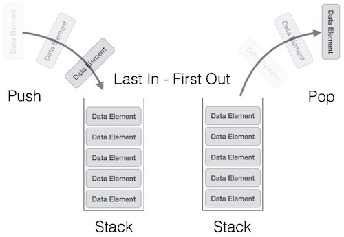
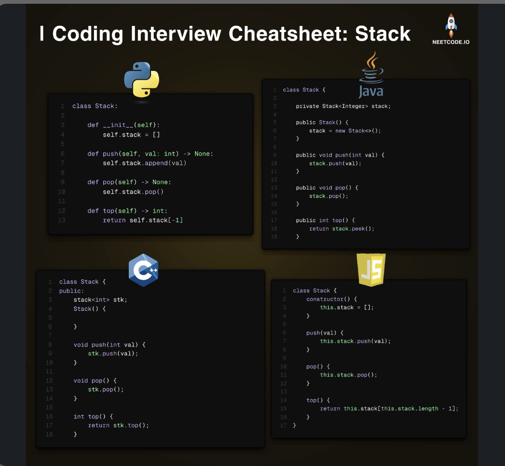

# Stack

> **Scope** — LIFO fundamentals and the canonical stack templates: bracket matching, min-stack, the short monotonic-stack form, explicit-stack traversal and the scope/context ledger.
> **See also**: [stack_expression_parsing.md](./stack_expression_parsing.md) — calculators, decode-string and postfix evaluation, the whole expression-parsing family; [stack_examples.md](./stack_examples.md) — the worked-solution archive behind these templates; [monotonic_stack.md](./monotonic_stack.md) — next-greater / previous-smaller / span problems in depth; [queue.md](./queue.md) — the FIFO counterpart; [iterator.md](./iterator.md) — stack-backed iterators.

## LeetCode Problem Lists

- [Stack](https://leetcode.com/problem-list/stack/)
- [Monotonic Stack](https://leetcode.com/problem-list/monotonic-stack/)

## Time Complexity

| Data structure | Search   | Insert   | Delete   | Min/Max  |
| -------------- | -------- | -------- | -------- | -------- |
| Stack          | O(n)     | O(1)     | O(1)     | O(n)     |

> Insert = push, Delete = pop, peek — all at the top, all **O(1)**. Min/Max can be made **O(1)** with an auxiliary min/max-stack ([monotonic_stack.md](./monotonic_stack.md)). Space is **O(n)**.

## Overview

<p align="center"></p>

**Stack** is a data structure with Last-In-First-Out (LIFO) property. Each operation adds/removes from the top of the stack.

### Key Properties
- **Complexity**: see the [Time Complexity](#time-complexity) table above
- **Core Principle**: Last element added is the first one removed
- **Use Case**: Problems involving order reversal, pattern matching, or maintaining context

<p align="center"></p>

### References

- Ref
    - [fuck-Algorithm - single stack](https://github.com/labuladong/fucking-Algorithm/blob/master/%E6%95%B0%E6%8D%AE%E7%BB%93%E6%9E%84%E7%B3%BB%E5%88%97/%E5%8D%95%E8%B0%83%E6%A0%88.md)
    - [fuck-Algorithm - implement array via stack / stack via array ](https://github.com/labuladong/fucking-Algorithm/blob/master/%E6%95%B0%E6%8D%AE%E7%BB%93%E6%9E%84%E7%B3%BB%E5%88%97/%E9%98%9F%E5%88%97%E5%AE%9E%E7%8E%B0%E6%A0%88%E6%A0%88%E5%AE%9E%E7%8E%B0%E9%98%9F%E5%88%97.md)
    - [Java Stack](https://blog.csdn.net/oChangWen/article/details/72859556) — low level: array
- Video
    - [Stack Fundamentals](https://www.bilibili.com/list/525438321?sort_field=pubtime&spm_id_from=333.999.0.0&oid=779764003&bvid=BV1my4y1Z7jj)

## Problem Categories

Ten shapes cover almost every stack question. The **Where** column says which template
below owns the code, or which sheet the worked solutions moved to.

| Category | What the stack holds | LC | Where |
|---|---|---|---|
| **Bracket / nesting validation** | the openers still owed a closer | 20, 921, 1541, 1614 | [Template 2](#template-2-bracket-matching--lc-20-) |
| **Bracket repair / measurement** | *indices* of unmatched brackets | 1249, 32, 856 | [stack_examples.md](./stack_examples.md) |
| **Monotonic — next greater / smaller** | elements still waiting for an answer | 496, 503, 739, 84, 907, 2104 | [Template 3](#template-3-monotonic-stack--next-greater--smaller--lc-739-), [monotonic_stack.md](./monotonic_stack.md) |
| **Monotonic — greedy removal** | the best prefix built so far | 402, 316, 1081, 1673 | [stack_examples.md](./stack_examples.md) |
| **Monotonic — span accumulation** | `[value, span]` pairs, streaming | 901, 735 | [stack_examples.md](./stack_examples.md) |
| **Stack with `[element, count]` pairs** | a run-length-compressed prefix | 1047, 1209, 1544 | [stack_examples.md](./stack_examples.md) |
| **O(1) aggregate on a stack** | one `min` / `max` / delta *state* per layer | 155, 716, 1381, 895 | [Template 4](#template-4-min-stack--o1-getmin--lc-155-) |
| **Expression parsing** | operands / deferred terms / open scopes | 224, 227, 772, 394, 150, 682 | [stack_expression_parsing.md](./stack_expression_parsing.md) |
| **Scope / context ledger** | the *enclosing* context, keyed by depth | 388, 636, 591, 71 | [Template 6](#template-6-scope--context-ledger--lc-388-lc-636-) |
| **Order reversal / paused traversal** | work not yet done | 144, 145, 173, 341, 445 | [Template 5](#template-5-explicit-stack--iterative-traversal--lc-144-lc-145-) |

### Stack Variants Worth Knowing

- Single stack
- Build queue via stack
     - LC 232 (use `2 stack`)
- Build stack via queue
- **Stack with Pair (char, count)**
     - Store `[element, count]` pairs instead of raw elements
     - LC 1047 (k=2 special case, simple pop)
     - LC 1209 (k consecutive duplicates removal)
     - LC 1544 (Make The String Great)
     - LC 394 (Decode String, stack with count for repetition)
     - LC 726 (Number of Atoms)

## Templates & Algorithms

### Template Comparison Table

| Template | Stack element | Loop shape | Complexity | When to Use |
|---|---|---|---|---|
| 1 — Basic operations | anything | — | O(1) per op | push / pop / peek idioms |
| 2 — Bracket matching | opener chars | one pass, pop on closer | O(n) / O(n) | validate nesting, >1 bracket type |
| 3 — Monotonic stack | `(value, index)` | `while` inside `for` | O(n) / O(n) | next greater / smaller / span |
| 4 — Min stack | value + one aggregate *state* per layer | — | O(1) per op | O(1) `getMin()` / `getMax()`; prefix aggregates, path state |
| 5 — Explicit stack | pending nodes | `while stack` | O(n) / O(h) | iterative traversal, order reversal |
| 6 — Scope ledger | enclosing context per depth | one pass, trim to depth | O(n) / O(depth) | indented input, start/end events |

### Template 1: Basic Stack Operations

**Stack push (insert):**
```java
// Java
Stack<Integer> stack = new Stack<>();
stack.push(element);  // O(1)
```

```python
# Python
stack = []
stack.append(element)  # O(1)
```

**Stack pop (remove top):**
```java
// Java
int top = stack.pop();  // O(1), throws if empty
```

```python
# Python
top = stack.pop()  # O(1), raises if empty
```

**Stack peek (view top):**
```java
// Java
int top = stack.peek();  // O(1), throws if empty
if (!stack.isEmpty()) {
    top = stack.peek();
}
```

```python
# Python
top = stack[-1]  # O(1), raises if empty
if stack:
    top = stack[-1]
```

---

### Template 2: Bracket Matching — LC 20 ⭐⭐⭐⭐⭐

> The single most-asked stack pattern. **Push openers, and on a closer check that the top is its partner.** A stack is required (not a counter) as soon as there is **more than one bracket type**, because order matters: `([)]` is invalid.

```text
Core Idea:
  - Opener  -> push it (we owe a matching closer)
  - Closer  -> stack must be non-empty AND top must be the matching opener
               (else fail fast)
  - End     -> stack must be EMPTY (no unmatched openers left)

When to Use:
  - Validate / repair / measure balanced sequences
  - Any "nesting must be well-formed" check (brackets, tags, expressions)

Counter vs Stack (interview discriminator):
  - ONE bracket type only  -> a running balance counter is enough, O(1) space
                              (LC 921, LC 1541, LC 1614)
  - MULTIPLE bracket types -> MUST use a stack (LC 20)
  - Need the POSITION of the offending bracket -> stack of INDICES
                              (LC 1249, LC 32)

Similar LC:
  - LC 20    Valid Parentheses                        (base template)
  - LC 1249  Minimum Remove to Make Valid Parentheses (stack of indices -> delete)
  - LC 921   Minimum Add to Make Parentheses Valid    (balance counter)
  - LC 32    Longest Valid Parentheses                (index stack + `-1` base)
  - LC 856   Score of Parentheses                     (stack of partial scores)
  - LC 1541  Minimum Insertions to Balance a Parentheses String  ( `(` needs `))` )
  - LC 1614  Maximum Nesting Depth of the Parentheses (max depth = max balance)
```

```java
// java
// LC 20 - Valid Parentheses
// IDEA: STACK — push openers, pop-and-verify on closers, stack must end empty
// time = O(n), space = O(n)
public boolean isValid(String s) {

    // closer -> its matching opener
    Map<Character, Character> pairs = new HashMap<>();
    pairs.put(')', '(');
    pairs.put(']', '[');
    pairs.put('}', '{');

    Deque<Character> st = new ArrayDeque<>();

    for (char c : s.toCharArray()) {
        if (pairs.containsKey(c)) {
            /**
             *  NOTE !!!  a closer needs BOTH checks:
             *   1) stack NOT empty  (e.g. ")" alone)
             *   2) top is the matching opener (e.g. "(]" must fail)
             *
             *  NOTE !!! unbox to `char` before comparing —
             *  comparing two Character objects with `!=` compares REFERENCES.
             */
            if (st.isEmpty()) {
                return false;
            }
            char top = st.pop();
            if (top != pairs.get(c)) {
                return false;
            }
        } else {
            st.push(c);
        }
    }

    /** NOTE !!! leftover openers => invalid (e.g. "(((") */
    return st.isEmpty();
}
```

```python
# python
# LC 20 - Valid Parentheses
# IDEA: STACK — push openers, pop-and-verify on closers, stack must end empty
# time = O(n), space = O(n)
class Solution(object):
    def isValid(self, s):
        pairs = {')': '(', ']': '[', '}': '{'}
        stack = []
        for c in s:
            # closer
            if c in pairs:
                # NOTE !!! empty stack OR wrong partner -> invalid
                if not stack or stack.pop() != pairs[c]:
                    return False
            # opener
            else:
                stack.append(c)
        # NOTE !!! leftover openers -> invalid
        return not stack
```

**The bracket family — four twists on the same template** (worked solutions in [stack_examples.md](./stack_examples.md)):

| LC | Twist | Stack holds |
|----|-------|-------------|
| 1249 | repair, not just validate | *indices* of unmatched `(` |
| 921 | one bracket type only, so a counter suffices — O(1) space | nothing (the stack degenerates to its size) |
| 32 | length of the longest valid run | indices plus a `-1` **base** sentinel |
| 856 | fold a score out of the nesting | the partial **result** of each depth |

---

### Template 3: Monotonic Stack — Next Greater / Smaller — LC 739 ⭐⭐⭐⭐

> **Key Idea**: the stack holds the elements that are **still waiting for an answer**, kept in
> monotonic order. Flip the comparison to flip the direction — `top < cur` pops for *next
> greater*, `top > cur` pops for *next smaller*. Every element is pushed once and popped at
> most once, so a `while` nested in a `for` is still **O(n)**.
>
> This sheet keeps **one** short form. The full family (previous-smaller, spans, histogram,
> subarray min/max sums, and the greedy-removal variants) is
> [monotonic_stack.md](./monotonic_stack.md)'s subject; the worked solutions are in
> [stack_examples.md](./stack_examples.md).

- Store `(value, index)` — the index is what turns "found it" into a *distance* or a *width*.

```python
# python
# LC 739, LC 503 - Find next `big number`
# ...
stack = [] # [[idx, val]]
for i, val in enumerate(tmp):
    while stack and stack[-1][1] < val:
        _idx, _val = stack.pop(-1)
        res[tmp[_idx]] = i - _idx
    stack.append([i, val]) 
# ...
```

```java
// java
// LC 239
// LC 496
// ...

// Traverse the array from right to left
for (int i = 0; i < n; i++) {
    // Maintain a decreasing monotonic stack
    /** NOTE !!! below */
    while (!stack.isEmpty() && nums[stack.peek()] <= nums[i]) {
        stack.pop();  // Pop elements from the stack that are smaller or equal to the current element
    }
    
    // If stack is not empty, the next greater element is at the top of the stack
    if (!stack.isEmpty()) {
        result[i] = nums[stack.peek()];
    }
    
    // Push the current element's index onto the stack
    stack.push(i);
}

// ...
```

| Want | Pop while | Read the answer | LC |
|---|---|---|---|
| next **greater** element / warmer day | `top < cur` | when `cur` pops `top` | 496, 503, 739 |
| next **smaller** element, or left+right bounds | `top > cur` | when `cur` pops `top` | 84, 907, 2104 |
| **span** back to the last bigger value | `top <= cur`, accumulating the popped spans | the accumulated count | 901 |
| **circular** array | same, over `nums * 2` with `idx % n` | same | 503 |

---

### Template 4: Min Stack — O(1) getMin — LC 155 ⭐⭐⭐⭐

**Pattern: one aggregate per layer** — `min_values[i] == min(stack[0..i])`

The stack you are asked for is the ordinary one. The trick is a **second array that
mirrors it layer for layer**, holding not the elements but *the answer to the query
for everything at or below that layer*. For LC 155 the query is "minimum", so
`min_values = 每一層 stack 對應的 minimum`. This is the design-problem face of a
[prefix aggregate](./prefix_sum.md), and the same idea shows up far outside stacks —
see [the classics table](#the-same-idea-beyond-stacks--the-classics-) at the end of
this template.

#### The general form — one aggregate per layer

```text
Invariant:  min_values[i] = min(stack[0], stack[1], ..., stack[i])
            -> min_values is NOT the elements sorted; it is a STATE per layer

push(v):    min_values.append(min(v, min_values[-1]))   # new layer, new state
pop():      min_values.pop()                             # the popped layer's state goes with it
getMin():   min_values[-1]                               # the top layer's state IS the answer

push -2, 0, -3        then pop()
  stack      = [-2,  0, -3]      stack      = [-2,  0]
  min_values = [-2, -2, -3]      min_values = [-2, -2]   <- getMin() = -2, nothing recomputed
                  ^    ^    ^
                  |    |    min of all three
                  |    min of the first two (0 did not beat -2)
                  min of the first one
```

Three consequences fall straight out of the invariant:

- **The two arrays are always the same length** — every `push` appends to both, every
  `pop` removes from both. No `if` in `pop()`, no comparing the popped value against the
  min: `min_values[-1]` is a *state* that belongs to the layer, not a copy of an element,
  so popping the layer is the whole job. That is why V0 below does not need the
  `stack.pop() == mins[-1]` check that the space-saving variant needs.
- **Duplicates are free.** `push(0); push(0); pop()` leaves `min_values = [0]`, because
  each `0` got its own layer. The variant that stores only *new* minima has to write `<=`
  to get this right — the classic LC 155 bug (see
  [monotonic_stack.md § 2-16](./monotonic_stack.md#2-16-min-stack-lc-155--auxiliary-non-increasing-stack-)).
- **Any aggregate that is a function of the prefix works the same way** — `max`, a running
  sum, a running GCD, a pending delta (LC 1381), a frequency count (LC 895). Replace
  `min(...)` in `push` and nothing else changes.

#### Why O(1) — the state was computed at push time

`getMin()` reads one array cell. There is no scan, because the work was moved to `push`,
and `push` only has to combine **two** numbers: the new value and the answer for the layer
below. That is the whole argument — each operation touches the top of two arrays and
nothing else.

The point of *keeping every layer's state* instead of one `self.min` variable is `pop()`.
A single variable can be lowered when a smaller value arrives, but cannot be **raised**
back when that value leaves — the earlier minimum was overwritten. The array remembers it,
because it was never overwritten; it was one layer down the whole time.

| Approach | `push` | `pop` | `getMin` | Why it falls short |
|---|---|---|---|---|
| one `self.min` variable | O(1) | **O(n)** | O(1) | after popping the min, the previous min has to be rescanned |
| heap (`heapq`) | O(log n) | O(log n) with lazy deletion | O(1) | pays a log for an ordering the stack never uses |
| `{value: count}` map | O(1) | O(1) | **O(n)** | `min(counts)` is a scan (this is `min-stack.py`'s V0-1) |
| **per-layer `min_values`** | O(1) | O(1) | O(1) | the answer for the current top was fixed when the top was pushed |

```python
# LC 155. Min Stack
# V0
# IDEA: 2 ARRAYS — stack holds the elements, min_values holds each layer's minimum
# time = O(1) per operation, space = O(n)
class MinStack(object):

    def __init__(self):
        self.stack = []
        # min_values[i] == min(stack[0..i]) — a STATE per layer, not the elements sorted
        self.min_values = []

    def push(self, val):
        self.stack.append(val)
        if not self.min_values:
            self.min_values.append(val)
        else:
            self.min_values.append(min(val, self.min_values[-1]))

    def pop(self):
        # the popped layer's state leaves with it — no comparison needed
        self.min_values.pop()
        return self.stack.pop()

    def top(self):
        return self.stack[-1]

    def getMin(self):
        # the top layer's state IS the current minimum — O(1)
        return self.min_values[-1]
```

```python
# V1: the same invariant in one stack of (value, min_so_far) tuples
# time = O(1) per operation, space = O(n)
class MinStack(object):

    def __init__(self):
        self.stack = []

    def push(self, x):
        if not self.stack:
            self.stack.append((x, x))
        else:
            self.stack.append((x, min(x, self.stack[-1][1])))

    def pop(self):
        self.stack.pop()

    def top(self):
        return self.stack[-1][0]

    def getMin(self):
        return self.stack[-1][1]
```

#### The same idea beyond stacks — the classics ⭐⭐⭐⭐

The invariant needs a container that **only changes at one end**, so that "the state one
layer down" is still valid when the top goes away. Four things in the LC catalogue behave
like that. Read the table by the first column: find what is playing the stack in your
problem, and the aggregate you need to carry per layer follows.

| What plays the stack | Per-layer state | Query it answers | Classic LC |
|---|---|---|---|
| **an explicit stack** | `min` / `max` so far | `getMin()` / `getMax()` in O(1) | **155** Min Stack, **716** Max Stack (`peekMax`) |
| | a pending delta for everything below | bulk `increment(k, val)` in O(1) | **1381** Design a Stack With Increment Operation |
| | one stack per frequency level | pop the most frequent in O(1) | **895** Maximum Frequency Stack |
| **two stacks forming a queue** (LC 232) | `min` / `max` so far in *each* stack | window min / max in amortised O(1), without a monotonic deque | **239** Sliding Window Maximum, **1438** Longest Continuous Subarray With Absolute Diff ≤ Limit |
| **an array that only grows** — index = layer | prefix `min` / `max` / `sum` / `product` | "best value at or before `i`" for every `i` | **121** Best Time to Buy and Sell Stock, **2016** Maximum Difference Between Increasing Elements, **42** Trapping Rain Water, **238** Product of Array Except Self, **303** Range Sum Query, **769** Max Chunks To Make Sorted, **915** Partition Array into Disjoint Intervals, **1477** Find Two Non-overlapping Sub-arrays Each With Target Sum |
| **the recursion stack** — the root-to-node path | `(lo, hi)` / `max` / prefix value along the path | a per-node answer about its ancestors | **1026** Maximum Difference Between Node and Ancestor, **98** Validate Binary Search Tree, **1448** Count Good Nodes in Binary Tree, **129** Sum Root to Leaf Numbers |

Two rules decide how much of the state to keep:

- **Keep the whole array when a later query asks about a layer that is not the top.**
  LC 42 needs `left_max[i]` for *every* `i` on the second pass; LC 238 needs every prefix
  product; LC 769 / 915 compare a prefix max against a suffix min at each split. One
  variable cannot answer for a layer it has already moved past.
- **Collapse it to one variable when only the top is ever queried and nothing pops.**
  LC 121 asks "min so far" once per index and never goes back, so `min_values` is a single
  `lo` — the array's last cell, kept and the rest thrown away. LC 155 cannot do this
  because `pop()` *does* go back.

```python
# LC 239 (as a min queue) / LC 1438 - a queue built from two min stacks
# IDEA: a queue is two stacks (LC 232). Give each stack its per-layer min and the
#       queue's min is the smaller of the two tops — no monotonic deque needed.
#       Swap min -> max for LC 239 itself; run one of each for LC 1438.
# time = O(1) amortised per operation, space = O(n)
class MinQueue(object):

    def __init__(self):
        self.inbox, self.outbox = [], []      # each entry: (value, min_so_far)

    @staticmethod
    def _push(st, v):
        st.append((v, v if not st else min(v, st[-1][1])))

    def push(self, v):
        self._push(self.inbox, v)

    def pop(self):
        if not self.outbox:                   # refill: each element moves once
            while self.inbox:
                self._push(self.outbox, self.inbox.pop()[0])
        return self.outbox.pop()[0]

    def getMin(self):
        return min(st[-1][1] for st in (self.inbox, self.outbox) if st)
```

```python
# LC 1026 - Maximum Difference Between Node and Ancestor
# IDEA: the recursion stack IS the stack; (lo, hi) is that layer's aggregate over the
#       root-to-node path. Returning from the call pops it — no bookkeeping at all.
# time = O(n), space = O(h)
def maxAncestorDiff(root):
    def dfs(node, lo, hi):
        if not node:
            return hi - lo
        lo, hi = min(lo, node.val), max(hi, node.val)
        return max(dfs(node.left, lo, hi), dfs(node.right, lo, hi))
    return dfs(root, root.val, root.val)
```

Where the depth lives for each row: the LC 1381 delta trick in
[design_examples.md § 6](./design_examples.md#6-stack--auxiliary-state--o1-min-and-lazy-increment-lc-155--lc-1381-),
the deque form of LC 239 in
[monotonic_queue.md](./monotonic_queue.md#template-1-sliding-window-maximum-decreasing-deque--lc-239),
prefix arrays in [prefix_sum.md](./prefix_sum.md), LC 121 in
[stock_trading.md](./stock_trading.md), and the `(lo, hi)` bounds pattern in
[bst_advanced.md](./bst_advanced.md).

---

### Template 5: Explicit Stack — Iterative Traversal — LC 144, LC 145 ⭐⭐⭐⭐

> **Key Idea**: recursion's call stack, made **explicit**. Push the work not yet done, pop it to
> do it. **Preorder** pushes `right` *before* `left`, because a stack flips whatever you feed it.
> **Postorder** is the cheapest trick in trees: run preorder as `root → right → left`, then
> **reverse the output**.
>
> The *paused* form of the same stack — an iterator that must stop between elements — is
> LC 173 / LC 341 in [stack_examples.md](./stack_examples.md), and the wider family is
> [iterator.md](./iterator.md).

```python
# python
# LC 144 - Binary Tree Preorder Traversal
# IDEA: EXPLICIT STACK — push RIGHT before LEFT so LEFT is popped first
# time = O(n), space = O(h)
class Solution(object):
    def preorderTraversal(self, root):
        if not root:
            return []
        res, stack = [], [root]
        while stack:
            node = stack.pop()
            res.append(node.val)
            # NOTE !!! right first -> left ends up on TOP
            if node.right:
                stack.append(node.right)
            if node.left:
                stack.append(node.left)
        return res


# LC 145 - Binary Tree Postorder Traversal
# IDEA: preorder variant (root -> RIGHT -> LEFT), then REVERSE => left-right-root
# time = O(n), space = O(h)
class Solution(object):
    def postorderTraversal(self, root):
        if not root:
            return []
        res, stack = [], [root]
        while stack:
            node = stack.pop()
            res.append(node.val)
            # NOTE !!! mirrored order compared with preorder
            if node.left:
                stack.append(node.left)
            if node.right:
                stack.append(node.right)
        return res[::-1]   # root-right-left  ->  left-right-root
```

```java
// java
// LC 144 - Binary Tree Preorder Traversal
// IDEA: EXPLICIT STACK — push RIGHT before LEFT so LEFT is popped first
// time = O(n), space = O(h)
public List<Integer> preorderTraversal(TreeNode root) {
    List<Integer> res = new ArrayList<>();
    if (root == null) {
        return res;
    }
    Deque<TreeNode> st = new ArrayDeque<>();
    st.push(root);
    while (!st.isEmpty()) {
        TreeNode node = st.pop();
        res.add(node.val);
        /** NOTE !!! right pushed FIRST, so left is popped FIRST */
        if (node.right != null) {
            st.push(node.right);
        }
        if (node.left != null) {
            st.push(node.left);
        }
    }
    return res;
}

// LC 145 - Binary Tree Postorder Traversal
// IDEA: preorder with LEFT/RIGHT swapped (root-right-left), then REVERSE
// time = O(n), space = O(h)
public List<Integer> postorderTraversal(TreeNode root) {
    LinkedList<Integer> res = new LinkedList<>();
    if (root == null) {
        return res;
    }
    Deque<TreeNode> st = new ArrayDeque<>();
    st.push(root);
    while (!st.isEmpty()) {
        TreeNode node = st.pop();
        /** NOTE !!! addFirst == "append then reverse", done incrementally */
        res.addFirst(node.val);
        if (node.left != null) {
            st.push(node.left);
        }
        if (node.right != null) {
            st.push(node.right);
        }
    }
    return res;
}
```

---

### Template 6: Scope / Context Ledger — LC 388, LC 636 ⭐⭐⭐⭐⭐

> **Key Idea**: the stack does not hold *characters* — it holds **the enclosing context** (a path prefix, a running function, an open tag). Entering a scope **pushes** context, leaving it **pops**, and the answer is computed against `stack[-1]` / `stack[depth]` — the context you are currently inside.
>
> This is the pattern behind the highest-frequency Google stack questions, and it is *not* bracket matching: the "brackets" are implicit (indentation depth, start/end log events).

```text
Core Idea:
  - Stack index == NESTING DEPTH. stack[d] = accumulated context at depth d.
  - On entering depth d : trim the stack down to d, then push the new context
  - On leaving  a scope : pop, and hand the accumulated value back to the parent
  - The parent is ALWAYS stack[-1] — that is what makes it a stack problem

When to Use:
  - Indented / tab-delimited input   -> depth = number of leading tabs (LC 388)
  - start/end (or open/close) events -> the "running" item is the stack top (LC 636)
  - Any "who is my parent?" question during a single left-to-right scan

Similar LC:
  - LC 388  Longest Absolute File Path       (depth-indexed prefix lengths)
  - LC 636  Exclusive Time of Functions      (running function = stack top)
  - LC 591  Tag Validator                    (open-tag stack + scope rules)
  - LC 71   Simplify Path                    (stack_examples.md; ".." pops the parent dir)
```

```java
// java
// LC 388 - Longest Absolute File Path
// IDEA: SCOPE STACK indexed by DEPTH — stack.get(d) = length of the path prefix at depth d
// time = O(n), space = O(depth)
public int lengthLongestPath(String input) {

    int res = 0;

    /**
     *  NOTE !!!
     *   stack.get(d) = length of "dir1/dir2/.../" for the current branch at depth d
     *   (already includes the trailing '/')
     *   -> index in the list IS the nesting depth
     */
    List<Integer> stack = new ArrayList<>();
    stack.add(0); // depth 0 has an empty prefix

    for (String line : input.split("\n")) {

        // depth = number of leading '\t'
        int depth = 0;
        while (depth < line.length() && line.charAt(depth) == '\t') {
            depth++;
        }
        String name = line.substring(depth);

        /** NOTE !!! we LEFT the previous deeper scopes -> pop back to `depth` */
        while (stack.size() > depth + 1) {
            stack.remove(stack.size() - 1);
        }

        if (name.contains(".")) {
            // a FILE never becomes a parent -> just measure it
            res = Math.max(res, stack.get(depth) + name.length());
        } else {
            // a DIRECTORY becomes the context of depth+1 (+1 for the '/')
            stack.add(stack.get(depth) + name.length() + 1);
        }
    }

    return res;
}
```

```python
# python
# LC 388 - Longest Absolute File Path
# IDEA: SCOPE STACK indexed by DEPTH — stack[d] = length of the path prefix at depth d
# time = O(n), space = O(depth)
class Solution(object):
    def lengthLongestPath(self, input):
        res = 0
        stack = [0]   # stack[d] = prefix length at depth d (trailing '/' included)

        for line in input.split('\n'):
            name = line.lstrip('\t')
            depth = len(line) - len(name)   # number of leading tabs

            # NOTE !!! we left deeper scopes -> trim the stack back to this depth
            while len(stack) > depth + 1:
                stack.pop()

            if '.' in name:
                # file: measure, never push (a file has no children)
                res = max(res, stack[depth] + len(name))
            else:
                # dir: becomes the prefix for depth+1, +1 for the '/'
                stack.append(stack[depth] + len(name) + 1)

        return res

# Trace: "dir\n\tsubdir2\n\t\tfile.ext"
#   "dir"        d=0 -> stack = [0, 4]           ("dir/")
#   "subdir2"    d=1 -> stack = [0, 4, 12]       ("dir/subdir2/")
#   "file.ext"   d=2 -> res = 12 + 8 = 20
```

```java
// java
// LC 636 - Exclusive Time of Functions
// IDEA: SCOPE STACK of function ids — the RUNNING function is always the stack top
// time = O(n), space = O(n)
public int[] exclusiveTime(int n, List<String> logs) {

    int[] res = new int[n];
    Deque<Integer> stack = new ArrayDeque<>(); // ids of functions currently RUNNING
    int prev = 0;  // timestamp where the current "run slice" started

    for (String log : logs) {
        String[] p = log.split(":");       // {id, "start"|"end", timestamp}
        int id = Integer.parseInt(p[0]);
        int t = Integer.parseInt(p[2]);

        if (p[1].equals("start")) {
            /**
             *  NOTE !!!
             *   the caller (stack top) ran during [prev, t) -> credit it,
             *   then it gets PREEMPTED by the new callee
             */
            if (!stack.isEmpty()) {
                res[stack.peek()] += t - prev;
            }
            stack.push(id);
            prev = t;
        } else {
            /**
             *  NOTE !!!
             *   "end at t" is INCLUSIVE -> the slice is [prev, t], hence `+ 1`
             *   and the caller resumes at t + 1
             */
            res[stack.pop()] += t - prev + 1;
            prev = t + 1;
        }
    }

    return res;
}
```

```python
# python
# LC 636 - Exclusive Time of Functions
# IDEA: SCOPE STACK of function ids — the RUNNING function is always the stack top
# time = O(n), space = O(n)
class Solution(object):
    def exclusiveTime(self, n, logs):
        res = [0] * n
        stack = []    # ids of functions currently RUNNING (top = executing now)
        prev = 0      # start of the current time slice

        for log in logs:
            fid, typ, t = log.split(':')
            fid, t = int(fid), int(t)

            if typ == 'start':
                # the caller ran on [prev, t) before being preempted
                if stack:
                    res[stack[-1]] += t - prev
                stack.append(fid)
                prev = t
            else:
                # 'end' timestamp is INCLUSIVE -> [prev, t] => + 1
                res[stack.pop()] += t - prev + 1
                prev = t + 1

        return res
```

---

## Summary & Quick Reference

### Decision Table — Which Stack Pattern?

| Problem Type | Pattern | Key Idea | Examples |
|--------------|---------|----------|----------|
| Find **next greater/smaller** element | Monotonic Stack | Maintain increasing/decreasing order | LC 496, 503, 739 |
| **Remove adjacent duplicates** | Stack with Pair [element, count] | Track counts, pop when k reached | LC 1047, 1209, 1544 |
| **Decode strings** with brackets | Stack with Count | Use pairs for nested repetitions | LC 394, 726 |
| **Arithmetic expressions** | Stack with Operators | Handle precedence and evaluation | LC 224, 227 |
| **Remove k digits** for min number | Greedy + Monotonic | Pop larger digits when beneficial | LC 402 |
| **Lexicographically smallest** with duplicates | Monotonic + Last Occurrence | Greedy removal with "appears later" check | LC 316, 1081 |
| **Streaming/online** frequency | Stack with Span Pairs | Accumulate counts in pairs | LC 901 |
| **FIFO from LIFO** | Two Stacks | Use input/output stacks for queue | LC 232 |
| **O(1) min / max** alongside push / pop | Per-layer aggregate | `min_values[i] = min(stack[0..i])`, popped with its layer | LC 155, 716, 1381 |
| **Balanced-bracket** validation | Bracket Matching | Push openers, pop-and-verify on closers | LC 20, 1249, 32 |
| **Nesting context** (indent, start/end events) | Scope / Context Ledger | `stack[depth]` = the enclosing context | LC 388, 636, 591 |
| **Reverse** a forward-only sequence | Push-all, then pop | Popping yields reverse order | LC 445, 234, 143 |
| **Iterative** traversal / lazy iterator | Explicit Stack | Stack holds work not yet done | LC 144, 145, 173, 341 |
| **Postfix / RPN** evaluation | Operand Stack | Operator pops two, pushes the result | LC 150, 682 |

**How to read**: Find your problem goal in the leftmost column, then use the pattern and examples as a starting point.

### Pattern Complexity

Per-*pattern* cost. The per-*operation* cost of the structure itself is the
[Time Complexity](#time-complexity) table at the top.

| Pattern | Time | Space | Why |
|---|---|---|---|
| Bracket matching | O(n) | O(n), or O(1) with one bracket type | one pass, each char pushed at most once |
| Monotonic stack | O(n) | O(n) | each element pushed once, popped at most once |
| Greedy removal (`k` drops) | O(n) | O(n) | same amortised argument; `k` bounds the pops |
| `[element, count]` pairs | O(n) | O(n) | the stack is a run-length encoding of the prefix |
| Min stack | O(1) per op | O(n) | one auxiliary entry per push |
| Explicit-stack traversal | O(n) | O(h) | only the current root-to-node path is pending |
| Scope ledger | O(n) | O(depth) | one entry per open scope |
| Expression parsing | O(n) | O(n) | stack depth = nesting depth |

### Common Traps

- **Monotonic Stack**: Critical pattern for problems involving "next greater/smaller" — check if the pattern requires increasing or decreasing order
- **Stack with Pair**: For adjacent duplicate removal or nested counting problems, store `[element, count]` pairs
- **Greedy Removal**: Some problems benefit from greedily removing elements while maintaining an invariant
- **Empty-stack check first**: every `pop()` / `peek()` driven by a closer needs `!stack.isEmpty()` in front of it.
- **`Character` vs `char` in Java**: `!=` on two boxed `Character`s compares references — unbox before comparing.
- **Integer division truncates toward zero** in these problems; Python's `//` *floors*, so use `int(a / b)`.
- **Push children in reverse** when a stack must yield left-to-right order.

### Where the Rest Lives

| Looking for | File |
|---|---|
| Calculators (LC 224 / 227 / 772), decode string (LC 394), postfix (LC 150) | [stack_expression_parsing.md](./stack_expression_parsing.md) |
| Worked solutions for the problems named above | [stack_examples.md](./stack_examples.md) |
| Next-greater / previous-smaller / histogram theory | [monotonic_stack.md](./monotonic_stack.md) |
| Iterator design (LC 173, 341, 284) | [iterator.md](./iterator.md) |
| FIFO, deque, monotonic queue | [queue.md](./queue.md), [monotonic_queue.md](./monotonic_queue.md) |

