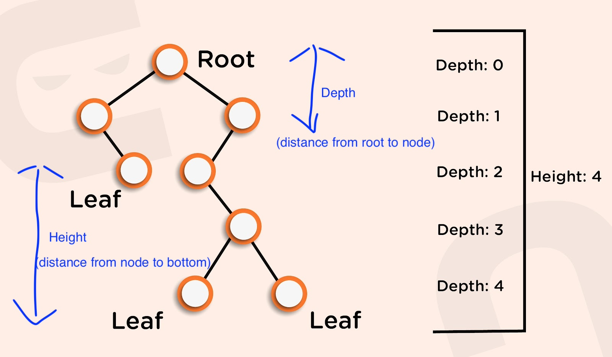
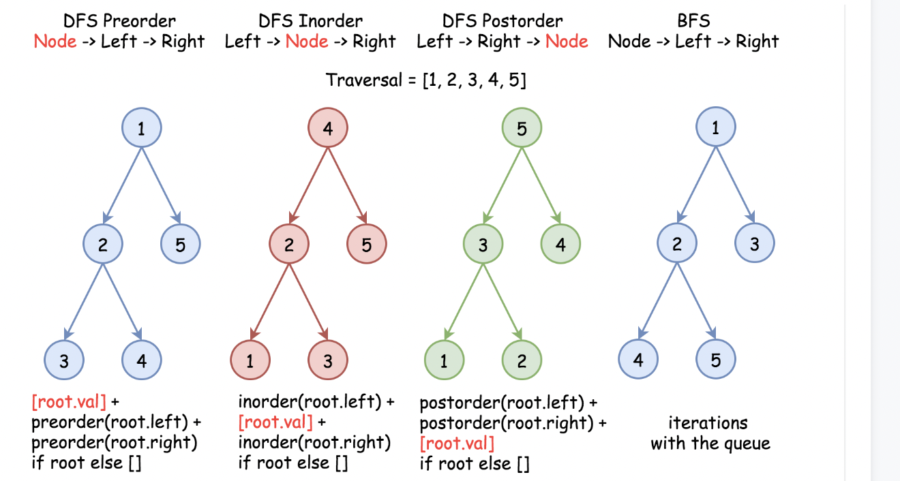

# Tree Data Structure - Concepts & Patterns

> **Scope** — Tree concepts, tree types, traversal-order strategy and the canonical traversal templates — the *why* and *which*, with the heavy algorithm write-ups and the worked-problem archive split into their own sheets.
> **See also** — *deep dives split out of this file*: [tree_lca_distance.md](./tree_lca_distance.md) — LCA, node distance, parent maps and root-to-leaf path templates; [tree_codec.md](./tree_codec.md) — subtree serialization and tree ⟷ string codecs; [tree_construction.md](./tree_construction.md) — building a tree from traversals, strings and index ranges; [tree_examples.md](./tree_examples.md) — the worked LC archive for the patterns taught here.
> *Neighbouring sheets*: [tree2.md](./tree2.md) — one numbered, copy-paste template per pattern; [binary_tree.md](./binary_tree.md) — binary-tree DFS state-flow and structural templates; [bst.md](./bst.md) — ordered trees; [tree_backtrack.md](./tree_backtrack.md) — root→leaf path problems that undo state on the way back up.

## LeetCode Problem Lists

- [Tree](https://leetcode.com/problem-list/tree/)
- [Binary Tree](https://leetcode.com/problem-list/binary-tree/)
- [Depth-First Search](https://leetcode.com/problem-list/depth-first-search/)

## Time Complexity

| Data structure | Search   | Insert   | Delete   | Min/Max  |
| -------------- | -------- | -------- | -------- | -------- |
| Tree (general) | O(n)     | O(n)     | O(n)     | O(n)     |

> General tree (no ordering guarantee) — every operation may visit all nodes. A *balanced* tree drops these to **O(log n)**. Space is **O(n)** for storage plus **O(h)** for the recursion stack. For an **ordered** tree with O(log n) operations see [bst.md](./bst.md).

## Overview

**Tree** is a hierarchical data structure consisting of nodes connected by edges, with one root node and no cycles. Trees are fundamental in computer science for organizing data efficiently.

### Key Properties
- **Nodes**: Elements that store data and references to children
- **Root**: The topmost node with no parent
- **Leaves**: Nodes with no children  
- **Height**: Distance from root to deepest leaf
- **Depth**: Distance from root to a specific node
- **Complexity**: see the [Time Complexity](#time-complexity) table above

### Tree Array Representation
Trees can be efficiently represented using arrays, especially for complete binary trees:

```text
# Tree Structure
      1
     / \
    2   3
   / \  
  4   5

# Array Representation: [1, 2, 3, 4, 5]
# Index mapping:
# - Root at index 0
# - For node at index i:
#   - Left child at index 2*i + 1  
#   - Right child at index 2*i + 2
#   - Parent at index (i-1)/2
```

### References
- [Neetcode Tree Types](https://www.linkedin.com/posts/neetcodeio_must-know-tree-structures-in-coding-interviews-activity-7301790861690892288-_0ni)
- [Array Representation Guide](https://www.prepbytes.com/blog/tree/array-representation-of-binary-tree/)
- [GeeksforGeeks Implementation](https://www.geeksforgeeks.org/binary-tree-array-implementation/)

## 0) Core Concepts

### 0-1) Tree Types Classification

#### **Basic Tree Types**
| Type | Description | Key Properties | Use Cases |
|------|-------------|----------------|-----------|
| **General Tree** | Node with any number of children | Flexible structure | File systems, org charts |
| **[Binary Tree](https://github.com/yennanliu/CS_basics/blob/master/doc/cheatsheet/binary_tree.md)** | Each node has ≤ 2 children | Simple structure, recursive | Expression trees, decision trees |
| **Complete Binary Tree** | All levels filled except possibly last | Efficient array representation | Heaps, priority queues |
| **Perfect Binary Tree** | All levels completely filled | 2^h - 1 nodes | Theoretical analysis |
| **[BST](https://github.com/yennanliu/CS_basics/blob/master/doc/cheatsheet/bst.md)** | Left < Root < Right ordering | O(log n) search/insert/delete | Search operations, databases |
| **[Heap](https://github.com/yennanliu/CS_basics/blob/master/doc/cheatsheet/heap.md)** | Parent-child ordering property | Fast min/max extraction | Priority queues, sorting |
| **[Trie](https://github.com/yennanliu/CS_basics/blob/master/doc/cheatsheet/trie.md)** | Prefix tree for strings | Efficient string operations | Auto-complete, spell check |

### 0-2) Common Tree Patterns

The nine recurring shapes. Each row names the **one** place the code for that pattern lives —
no pattern is written out twice in this family of sheets.

| # | Pattern | Core idea | Code lives in | Examples |
|---|---------|-----------|---------------|----------|
| 1 | **Path-Based** | carry the accumulated value (sum, max-so-far, path) DOWN through DFS parameters | [tree_lca_distance.md](./tree_lca_distance.md) — root-to-leaf path templates | LC 112, 113, 257, 437, 1448 |
| 2 | **Subtree Validation** | post-order — validate both children before deciding for the parent | [Template 3: Postorder](#template-3-postorder-traversal) | LC 98, 101, 110 |
| 3 | **Height vs Depth** | height is computed bottom-up (post-order); depth is carried top-down (pre-order) | [0-3) Top-Down vs Bottom-Up](#0-3-top-down-vs-bottom-up-dfs--two-strategies-for-tree-problems) | LC 104, 111, 543 |
| 4 | **Tree Construction** | one traversal gives the structure, the other gives the position; or split an index range at the chosen root | [tree_construction.md](./tree_construction.md) | LC 105, 106, 654, 108 |
| 5 | **Serialization** | encode = DFS that **returns a string**; decode = recursive descent that **consumes a prefix** | [tree_codec.md](./tree_codec.md) | LC 297, 449, 606, 536 |
| 6 | **Move Parent** | build a parent map, treat the tree as an undirected graph, then BFS in all directions | [tree_lca_distance.md](./tree_lca_distance.md) — move-parent pattern | LC 863, 742, 1740 |
| 7 | **Node Path** | fingerprint each subtree as `val,left,right` with `#` for null, then hash the string | [tree_codec.md](./tree_codec.md) | LC 652, 572, 508 |
| 8 | **Node Deletion with State** | carry `isDeleted` for the node and `isParentDeleted` for its parent; a survivor whose parent died becomes a forest root | [tree_examples.md](./tree_examples.md) — LC 1110 | LC 1110, 1325, 669 |
| 9 | **Get Node Distance** | pre-order DFS carrying `depth` DOWN, returning it UP on a hit; `-1` is the not-found sentinel because `0` is a valid answer | [tree_lca_distance.md](./tree_lca_distance.md) — distance between nodes | LC 1740, 863, 1123 |

> Patterns 2 and 3 are the two halves of every tree recursion, so they are spelled out below; the
> other seven are one hop away in the sheet named in the table.
> **Reference** (pattern 2): [Subtree Validation Video](https://www.bilibili.com/video/BV1ue4y1Y7Mf/)

### 0-3) Top-Down vs Bottom-Up DFS — Two Strategies for Tree Problems

<p align="center"></p>

> Reference: [MaximumDepthOfBinaryTree.java](https://github.com/yennanliu/CS_basics/blob/master/leetcode_java/src/main/java/LeetCodeJava/Recursion/MaximumDepthOfBinaryTree.java)

**Core Distinction:**
- **Top-down**: Pass state **down** from parent to children via parameters. The answer accumulates during traversal (pre-order position).
- **Bottom-up**: Collect results **up** from children to parent via return values. The answer is built after subtrees are solved (post-order position).

```text
Top-Down (Pre-order)                Bottom-Up (Post-order)
─────────────────────               ──────────────────────
      1  ← start here                    1  ← combine here
     / \  pass depth=1                  / \  return heights
    2   3  depth=2                     2   3  left=1, right=1
   / \     depth=3                    / \     left=2, right=0
  4   5  → update global max        4   5  → return max+1
```

**Pattern 1: Top-Down (pass state down, pre-order)**

The parent passes accumulated state (depth, path, max-so-far) to children. Typically uses a **global variable** or **output parameter** to collect the final answer.

```java
// LC 104 — Top-Down: pass depth down, update global max
// 3 variants: (a) void helper + global var, (b) void helper + depth param, (c) return depth param

// Variant A: void helper + global var (simplest top-down)
int maxDepth = 0;

public int maxDepth_topDown(TreeNode root) {
    dfs(root, 1);       // start at depth 1
    return maxDepth;
}

private void dfs(TreeNode root, int depth) {
    if (root == null) return;

    // Pre-order position: update answer with current state
    maxDepth = Math.max(maxDepth, depth);

    // Pass depth+1 DOWN to children
    dfs(root.left, depth + 1);
    dfs(root.right, depth + 1);
}
```

**Pattern 2: Bottom-Up (collect results up, post-order)**

Each node asks its children for their results, then combines them. The return value carries the answer upward. **No global variable needed.**

```java
// LC 104 — Bottom-Up: children return their depth, parent adds 1
public int maxDepth_bottomUp(TreeNode root) {
    if (root == null) return 0;

    // Post-order: solve children FIRST
    int leftDepth  = maxDepth_bottomUp(root.left);
    int rightDepth = maxDepth_bottomUp(root.right);

    // Combine: take max of children, add 1 for current node
    return 1 + Math.max(leftDepth, rightDepth);
}
```

**Comparison:**

| Aspect | Top-Down | Bottom-Up |
|--------|----------|-----------|
| Direction | Root → Leaves (pre-order) | Leaves → Root (post-order) |
| State passing | Via **parameters** (depth, path, max) | Via **return values** |
| Global variable | Often needed | Usually not needed |
| Return type of helper | Often `void` | Returns computed value |
| Mental model | "What do I know so far?" | "What did my children find?" |
| Code simplicity | More verbose (extra params) | More concise |

**When to Use Which:**

```text
Use TOP-DOWN when:
  → You need to pass parent/ancestor info to children
  → Path tracking: carry path, sum, or max-so-far downward
  → Early termination: can stop when condition met at a node
  → Examples: LC 112 (Path Sum), LC 129 (Sum Root to Leaf),
              LC 1448 (Count Good Nodes), LC 257 (Binary Tree Paths)

Use BOTTOM-UP when:
  → Answer depends on BOTH children's results
  → Need to compute subtree properties (height, size, balance)
  → Validation: check property holds for entire subtree
  → Examples: LC 104 (Max Depth), LC 110 (Balanced Tree),
              LC 543 (Diameter), LC 124 (Max Path Sum),
              LC 236 (LCA), LC 652 (Find Duplicate Subtrees),
              LC 968 (Binary Tree Cameras)
```

**LC Problems by Strategy:**

| LC # | Problem | Top-Down | Bottom-Up | Notes |
|------|---------|:--------:|:---------:|-------|
| 104 | Maximum Depth | Yes | Yes | Both work; bottom-up is simpler |
| 111 | Minimum Depth | Yes | Yes | Bottom-up needs null-child guard |
| 110 | Balanced Binary Tree | - | Yes | Must check subtree heights first |
| 112 | Path Sum | Yes | - | Carry remaining sum downward |
| 113 | Path Sum II | Yes | - | Top-down + backtracking |
| 124 | Max Path Sum | - | Yes | Combine left+right at each node |
| 129 | Sum Root to Leaf Numbers | Yes | - | Carry running number downward |
| 236 | Lowest Common Ancestor | - | Yes | Find targets in subtrees first |
| 257 | Binary Tree Paths | Yes | - | Carry path string downward |
| 543 | Diameter of Binary Tree | - | Yes | Track max(left+right) globally |
| 968 | Binary Tree Cameras | - | Yes | Greedy 3-state: 0=uncovered, 1=camera, 2=covered |
| 1448 | Count Good Nodes | Yes | - | Carry max-so-far downward |

**Hybrid Pattern: Bottom-Up + Global Variable**

Some problems use bottom-up return values to compute subtree info, but also maintain a global variable to track a cross-subtree answer (e.g., diameter, max path sum).

```java
// LC 543 — Diameter: bottom-up height + global max update
int diameter = 0;

public int diameterOfBinaryTree(TreeNode root) {
    height(root);
    return diameter;
}

private int height(TreeNode root) {
    if (root == null) return 0;

    int left  = height(root.left);   // bottom-up: get children's height
    int right = height(root.right);

    // Global update: diameter passes THROUGH this node
    diameter = Math.max(diameter, left + right);

    // Return value: height of subtree (for parent to use)
    return 1 + Math.max(left, right);
}
```

**Interview Tip:**
> LC 104 (Max Depth) is the best problem to practice both strategies. Start with bottom-up (3 lines), then rewrite as top-down (global var + void helper). Understanding both unlocks the full tree problem toolkit.

### 0-4) Traversal Order Selection Strategy

```text
When to use which traversal:

1. No specific root processing needed?
   → Any order works (preorder/inorder/postorder)

2. Need parent data for children?
   → Use PREORDER (root → left → right)

3. Need children data for parent?
   → Use POSTORDER (left → right → root)

4. Processing sorted data (BST)?
   → Use INORDER (left → root → right)

5. Level-by-level processing?
   → Use BFS/Level-order traversal

6. Need to move upward (to parent) or explore all directions?
   → Use MOVE PARENT pattern (Build parent map + BFS)

7. Need to compare or identify subtrees?
   → Use NODE PATH pattern (Subtree serialization with post-order)
```

#### Pre-order vs Post-order for Leaf Collection (LC 872)

> Reference: [LeafSimilarTrees.java](https://github.com/yennanliu/CS_basics/blob/master/leetcode_java/src/main/java/LeetCodeJava/Stack/LeafSimilarTrees.java)

When collecting leaf nodes (e.g., LC 872 Leaf-Similar Trees), **any DFS order that visits left before right** produces the same left-to-right leaf sequence. However, there are practical differences:

**Pre-order (recommended for leaf collection):**
```java
private void getLeafSeq(TreeNode root, List<Integer> list) {
    if (root == null) return;

    // Check leaf BEFORE recursing into children
    if (root.left == null && root.right == null) {
        list.add(root.val);
        return;  // ← Early exit: skip 2 unnecessary null-child calls
    }

    getLeafSeq(root.left, list);
    getLeafSeq(root.right, list);
}
```

**Post-order (also correct, but slightly wasteful):**
```java
private void getLeafSeq(TreeNode root, List<Integer> list) {
    if (root == null) return;

    getLeafSeq(root.left, list);   // ← calls null, returns immediately
    getLeafSeq(root.right, list);  // ← calls null, returns immediately

    // Check leaf AFTER recursing (children were both null)
    if (root.left == null && root.right == null) {
        list.add(root.val);
    }
}
```

**Why both produce the same result:** The leaf sequence depends only on left-before-right visitation order, NOT on when the leaf check happens. Since a leaf has no children, post-order's recursive calls to `null` return immediately before the leaf check — the leaf is still added in the same left-to-right order.

**Why pre-order is preferred:**

| Aspect | Pre-order | Post-order |
|--------|-----------|------------|
| Leaf sequence | Left → Right | Left → Right (same) |
| Early exit at leaf | Yes (`return` after adding) | No (already recursed into null children) |
| Unnecessary null calls per leaf | 0 | 2 |
| Best for | Leaf collection, path building | Height, subtree properties |

**Interview answer:**
> "I chose pre-order because it allows an immediate return once a leaf is identified, avoiding two redundant recursive calls to null children. Any DFS that visits left before right produces the same leaf sequence."

**Related problems where traversal order matters for leaf/path collection:**

| LC # | Problem | Recommended Order | Why |
|------|---------|-------------------|-----|
| 872 | Leaf-Similar Trees | Pre-order | Early exit at leaf |
| 257 | Binary Tree Paths | Pre-order | Build path top-down |
| 112 | Path Sum | Pre-order | Carry remaining sum down |
| 104 | Maximum Depth | Post-order | Need children's height first |
| 110 | Balanced Binary Tree | Post-order | Validate subtree heights |

### 0-5) Traversal Quick-Reference Table (Interview Cheat Sheet)

> Inspired by LC 113 Path Sum II — key insight: the traversal choice determines the algorithm structure.

| Traversal  | Order              | Core Use Case                              | When to Choose                                                      |
|------------|--------------------|--------------------------------------------|---------------------------------------------------------------------|
| Pre-order  | root → left → right | Build path **top-down**                  | root-to-leaf paths, carry parent info to children, DFS + backtrack  |
| Post-order | left → right → root | Compute subtree results **bottom-up**    | height/depth, subtree sum, max path, DP on trees                    |
| In-order   | left → root → right | Process nodes in **sorted order**        | BST validation, kth smallest, sorted traversal                      |
| BFS        | level by level      | Level-by-level processing                | min depth, zigzag, right side view, connect next pointer            |

#### Interview Quick-Check Tips

**Step 1 — What does the problem ask for?**

| Problem asks for...                                    | Use                                                    |
|--------------------------------------------------------|--------------------------------------------------------|
| All root-to-leaf paths / path with sum                 | Pre-order DFS + backtracking                           |
| Count paths (any start/end) with target sum            | Pre-order DFS + prefix sum HashMap                     |
| Tree height / max depth                                | Post-order DFS                                         |
| Subtree property (sum, size, max)                      | Post-order DFS                                         |
| Identify / compare subtrees by structure               | Post-order DFS + serialize `val,left,right` + HashMap  |
| Find duplicate subtrees                                | Post-order DFS + subtree serialization + HashMap count |
| BST sorted order / kth smallest                        | In-order DFS                                           |
| Validate BST                                           | In-order DFS                                           |
| Level-by-level / min depth                             | BFS                                                    |
| Connect same-level nodes                               | BFS                                                    |


**Interview Trick (from LC 113):**
> If the problem asks for **"root → leaf path"**, it is **almost always pre-order DFS + backtracking**.

**Interview Trick (from LC 437):**
> If the path **does NOT need to start/end at root/leaf** and asks for count,
> use **Pre-order DFS + Prefix Sum HashMap** (the "2-sum on tree" pattern).

#### Classic LC Problems by Traversal Type

**Pre-order DFS + Backtracking (root → leaf path)**

| LC #  | Problem                        | Key Idea                                      |
|-------|--------------------------------|-----------------------------------------------|
| 112   | Path Sum                       | Pre-order DFS, check leaf with remaining sum  |
| 113   | Path Sum II                    | Pre-order DFS + backtrack, collect all paths  |
| 257   | Binary Tree Paths              | Pre-order DFS + backtrack, build string paths |
| 437   | Path Sum III                   | Pre-order DFS + prefix sum HashMap, 2-sum trick: check (curSum-target) in map |
| 129   | Sum Root to Leaf Numbers       | Pre-order DFS, carry running number           |
| 404   | Sum of Left Leaves             | Pre-order DFS, carry an `isLeft` flag down; add value only at a leaf reached as a left child |

**Post-order DFS (bottom-up subtree computation)**

| LC #  | Problem                              | Key Idea                                                     |
|-------|--------------------------------------|--------------------------------------------------------------|
| 104   | Maximum Depth of Binary Tree         | Post-order, return max(left, right) + 1                      |
| 543   | Diameter of Binary Tree              | Post-order, track max left+right at each node                |
| 124   | Binary Tree Maximum Path Sum         | Post-order, track global max through root                    |
| 110   | Balanced Binary Tree                 | Post-order, return height or -1 if unbalanced                |
| 572   | Subtree of Another Tree              | Post-order serialization or recursive match                  |
| 236   | Lowest Common Ancestor               | Post-order, return node when both targets found              |
| 652   | Find Duplicate Subtrees              | Post-order + serialize subtree → `val,left,right` + HashMap |
| 968   | Binary Tree Cameras                  | Post-order greedy, 3 states: uncovered/camera/covered        |
| 563   | Binary Tree Tilt                     | Post-order, return subtree SUM upward while accumulating `abs(leftSum - rightSum)` into a global — classic "return one thing, collect another" |

**In-order DFS (BST / sorted order)**

| LC #  | Problem                              | Key Idea                                         |
|-------|--------------------------------------|--------------------------------------------------|
| 98    | Validate Binary Search Tree          | In-order, check ascending order                  |
| 230   | Kth Smallest Element in BST          | In-order traversal, count to k                   |
| 501   | Find Mode in BST                     | In-order, track current/prev with count          |
| 538   | Convert BST to Greater Tree          | Reverse in-order (right → root → left)           |
| 700   | Search in a Binary Search Tree       | In-order search leveraging BST property          |

**BFS / Level-order**

| LC #  | Problem                              | Key Idea                                         |
|-------|--------------------------------------|--------------------------------------------------|
| 102   | Binary Tree Level Order Traversal    | BFS with queue, collect each level               |
| 111   | Minimum Depth of Binary Tree         | BFS, return level when first leaf found          |
| 116   | Populating Next Right Pointers       | BFS level-order, connect siblings                |
| 199   | Binary Tree Right Side View          | BFS, take last node of each level                |
| 103   | Zigzag Level Order Traversal         | BFS + alternate direction per level              |
| 117   | Populating Next Right Pointers II    | Level linking on a NON-perfect tree — dummy-head sweep, O(1) space (see Template 4-1) |
| 637   | Average of Levels in Binary Tree     | BFS, sum each level then divide by `levelSize`   |
| 987   | Vertical Order Traversal             | Tag `(col, row, val)`, sort col → row → val (see Template 4-2) |

## 1) Tree Templates & Algorithms

### 1.1) Universal Tree Template

**Core Principle**: Tree problems are naturally recursive - solve for current node using solutions from subtrees.

```python
# Universal Tree Template
def solve_tree_problem(root, params):
    # Base case
    if not root:
        return base_case_value
    
    # Process current node (preorder position)
    process_current_node(root, params)
    
    # Recursively solve subtrees
    left_result = solve_tree_problem(root.left, updated_params)
    right_result = solve_tree_problem(root.right, updated_params)
    
    # Combine results (postorder position)
    result = combine_results(root, left_result, right_result)
    
    return result
```

```java
// Java Universal Tree Template
public ResultType solveTreeProblem(TreeNode root, ParamType params) {
    // Base case
    if (root == null) {
        return defaultValue;
    }
    
    // Preorder: Process current node
    processCurrentNode(root, params);
    
    // Recursive calls
    ResultType leftResult = solveTreeProblem(root.left, updatedParams);
    ResultType rightResult = solveTreeProblem(root.right, updatedParams);
    
    // Postorder: Combine results
    ResultType result = combineResults(root.val, leftResult, rightResult);
    
    return result;
}
```

### 1.2) Template Selection Guide

| Pattern | Template | When to Use | Example Problems |
|---------|----------|-------------|------------------|
| **DFS Recursive** | Standard recursion | Most tree problems | LC 104, 110, 226 |
| **DFS Iterative** | Stack-based | Avoid recursion depth limits | LC 94, 144, 145 |
| **BFS Level-order** | Queue-based | Level processing needed | LC 102, 199, 515 |
| **Divide & Conquer** | Bottom-up recursion | Need subtree results | LC 124, 543, 687 |
| **Path Tracking** | DFS with path state | Path-related problems | LC 112, 257, 437 |
| **Move Parent** | Parent map + BFS | Bidirectional exploration | LC 863, 742, 1740 |
| **Node Path** | Subtree serialization | Subtree comparison/detection | LC 652, 572 |

### 1.3) Core Operations

#### 1.3.1) Tree Traversal Strategies

**Two Main Approaches:**

1. **Depth-First Search (DFS)** - Go deep before going wide
   - **Preorder**: Root → Left → Right (top-down processing)
   - **Inorder**: Left → Root → Right (sorted order for BST)  
   - **Postorder**: Left → Right → Root (bottom-up processing)

2. **Breadth-First Search (BFS)** - Process level by level
   - **Level-order**: Process all nodes at depth d before depth d+1

<p align="center"></p>

### 1.4) DFS Traversal Templates

#### **Template 1: Preorder Traversal**
*Root → Left → Right | Use when you need parent data for processing children*

```python
# Recursive Preorder
def preorder_recursive(root, result):
    if not root:
        return
    
    result.append(root.val)      # Process root first
    preorder_recursive(root.left, result)   # Then left subtree
    preorder_recursive(root.right, result)  # Then right subtree

# Iterative Preorder  
def preorder_iterative(root):
    if not root:
        return []
    
    result = []
    stack = [root]
    
    while stack:
        node = stack.pop()
        result.append(node.val)   # Process current node
        
        # Add children to stack (right first, then left)
        if node.right:
            stack.append(node.right)
        if node.left:
            stack.append(node.left)
    
    return result
```

```java  
// Java Preorder Implementation
public void preorderRecursive(TreeNode root, List<Integer> result) {
    if (root == null) return;
    
    result.add(root.val);              // Process root
    preorderRecursive(root.left, result);   // Process left
    preorderRecursive(root.right, result);  // Process right
}
```

#### **Template 2: Inorder Traversal**
*Left → Root → Right | Use for BST to get sorted order*

```python
# Recursive Inorder
def inorder_recursive(root, result):
    if not root:
        return
    
    inorder_recursive(root.left, result)   # Process left subtree first
    result.append(root.val)                # Then process root
    inorder_recursive(root.right, result)  # Finally process right subtree

# Iterative Inorder
def inorder_iterative(root):
    result = []
    stack = []
    current = root
    
    while stack or current:
        # Go to leftmost node
        while current:
            stack.append(current)
            current = current.left
        
        # Process current node
        current = stack.pop()
        result.append(current.val)
        
        # Move to right subtree
        current = current.right
    
    return result
```

```java
// Java Inorder Implementation
public void inorderRecursive(TreeNode root, List<Integer> result) {
    if (root == null) return;
    
    inorderRecursive(root.left, result);    // Left subtree
    result.add(root.val);                   // Current node
    inorderRecursive(root.right, result);   // Right subtree
}
```

#### **Template 3: Postorder Traversal**
*Left → Right → Root | Use when you need children data for parent processing*

```python
# Recursive Postorder
def postorder_recursive(root, result):
    if not root:
        return
    
    postorder_recursive(root.left, result)   # Process left subtree first
    postorder_recursive(root.right, result)  # Then right subtree  
    result.append(root.val)                  # Finally process root

# Iterative Postorder (using two stacks)
def postorder_iterative(root):
    if not root:
        return []
    
    result = []
    stack1 = [root]
    stack2 = []
    
    # First pass: collect nodes in reverse postorder
    while stack1:
        node = stack1.pop()
        stack2.append(node)
        
        if node.left:
            stack1.append(node.left)
        if node.right:
            stack1.append(node.right)
    
    # Second pass: pop from stack2 to get postorder
    while stack2:
        result.append(stack2.pop().val)
    
    return result
```

#### **Template 4: Level-Order Traversal (BFS)**
*Process nodes level by level | Use for level-based problems*

```python
# Basic Level-Order Traversal
from collections import deque

def level_order_traversal(root):
    if not root:
        return []
    
    result = []
    queue = deque([root])
    
    while queue:
        level_size = len(queue)
        current_level = []
        
        # Process all nodes at current level
        for _ in range(level_size):
            node = queue.popleft()
            current_level.append(node.val)
            
            # Add children to queue for next level
            if node.left:
                queue.append(node.left)
            if node.right:
                queue.append(node.right)
        
        result.append(current_level)
    
    return result

# Simple level-order (flat list)
def level_order_simple(root):
    if not root:
        return []
    
    result = []
    queue = deque([root])
    
    while queue:
        node = queue.popleft()
        result.append(node.val)
        
        if node.left:
            queue.append(node.left)
        if node.right:
            queue.append(node.right)
    
    return result
```

```java
// Java Level-Order Implementation
public List<List<Integer>> levelOrder(TreeNode root) {
    List<List<Integer>> result = new ArrayList<>();
    if (root == null) return result;
    
    Queue<TreeNode> queue = new LinkedList<>();
    queue.offer(root);
    
    while (!queue.isEmpty()) {
        int levelSize = queue.size();
        List<Integer> currentLevel = new ArrayList<>();
        
        for (int i = 0; i < levelSize; i++) {
            TreeNode node = queue.poll();
            currentLevel.add(node.val);
            
            if (node.left != null) queue.offer(node.left);
            if (node.right != null) queue.offer(node.right);
        }
        
        result.add(currentLevel);
    }
    
    return result;
}
```

#### **Template 4-1: Level Linking with O(1) Space (Dummy Head Sweep) — LC 116 / LC 117** ⭐⭐⭐⭐⭐

*The BFS queue costs O(W) space. When the node already has a `next` pointer, the level itself can act as the queue.*

**Key Idea**: keep a pointer `cur` on the head of the **current** level. Sweep that level by following the `next` pointers we built on the previous round, and append every child to a **dummy-headed linked list** — that list IS the next level. No queue, no recursion, O(1) extra space.

**Why the dummy head**: children may be missing (LC 117 is a general binary tree, not a perfect one), so you cannot compute "the next node" by position. The dummy + `tail` pointer skips holes automatically, which is exactly why the *same* code solves LC 116 (perfect tree) and LC 117 (any tree).

```java
// java
// LC 117 - Populating Next Right Pointers in Each Node II
//          (LC 116 = perfect-tree special case; this code solves both)
// IDEA: sweep the CURRENT level via the `next` pointers already built, and
//       string the children onto a dummy-headed list = the NEXT level.
class Solution {
    public Node connect(Node root) {
        // time = O(N), space = O(1)  -> no queue, no recursion stack
        Node cur = root;                     // head of the level being swept
        while (cur != null) {
            Node dummy = new Node(0);        // sentinel head of the NEXT level
            Node tail = dummy;               // last node appended to next level

            while (cur != null) {            // walk current level left -> right
                if (cur.left != null)  { tail.next = cur.left;  tail = tail.next; }
                if (cur.right != null) { tail.next = cur.right; tail = tail.next; }
                cur = cur.next;              // NOTE: move via `next`, not a queue
            }

            cur = dummy.next;                // drop down to the next level's head
        }
        return root;
    }
}
```

```python
# python
# LC 117 - Populating Next Right Pointers in Each Node II
# IDEA: dummy-head list builds the next level while we sweep the current one
class Solution:
    def connect(self, root):
        # time = O(N), space = O(1)
        cur = root
        while cur:
            dummy = Node(0)      # sentinel for next level
            tail = dummy
            while cur:           # sweep current level through `next`
                if cur.left:
                    tail.next = cur.left
                    tail = tail.next
                if cur.right:
                    tail.next = cur.right
                    tail = tail.next
                cur = cur.next
            cur = dummy.next     # descend one level
        return root
```

**Trace** (`root = [1,2,3,4,5,null,7]`):

```text
level 1:  1                      dummy -> 2 -> 3
level 2:  2 -> 3                 dummy -> 4 -> 5 -> 7   (3 has no left child; dummy skips the hole)
level 3:  4 -> 5 -> 7            dummy -> null  -> stop
```

**When to reuse this**: any "connect / compare nodes on the same level" question where the node carries a spare pointer (LC 116, LC 117). If the node has **no** `next` field, fall back to Template 4 (queue BFS).

#### **Template 4-2: Coordinate-Annotated Traversal (Vertical Order) — LC 987** ⭐⭐⭐⭐

*Pattern: when output order is NOT the traversal order, do not fight the traversal — tag each node with its `(col, row)` coordinate, then sort.*

**Key Idea**: DFS once, emitting a triple `(col, row, val)` with `left → (row+1, col-1)`, `right → (row+1, col+1)`. Then sort by `col → row → val` and group by `col`. The **third sort key (`val`)** is the whole difficulty of LC 987: two nodes can share the exact same `(row, col)`, and the tie is broken by value — that is what separates LC 987 from the simpler "vertical order" variants.

```java
// java
// LC 987 - Vertical Order Traversal of a Binary Tree
// IDEA: annotate every node with (col, row) during DFS, then sort col -> row -> val
class Solution {
    public List<List<Integer>> verticalTraversal(TreeNode root) {
        // time = O(N log N)  (the sort dominates), space = O(N)
        List<int[]> nodes = new ArrayList<>();   // {col, row, val}
        dfs(root, 0, 0, nodes);

        nodes.sort((a, b) -> a[0] != b[0] ? a[0] - b[0]     // 1) column
                           : a[1] != b[1] ? a[1] - b[1]     // 2) row (top -> bottom)
                           : a[2] - b[2]);                  // 3) value (tie break!)

        List<List<Integer>> res = new ArrayList<>();
        for (int i = 0; i < nodes.size(); i++) {
            // new bucket whenever the column changes
            if (i == 0 || nodes.get(i)[0] != nodes.get(i - 1)[0]) res.add(new ArrayList<>());
            res.get(res.size() - 1).add(nodes.get(i)[2]);
        }
        return res;
    }

    private void dfs(TreeNode node, int row, int col, List<int[]> nodes) {
        if (node == null) return;
        nodes.add(new int[]{col, row, node.val});
        dfs(node.left,  row + 1, col - 1, nodes);   // left  -> col - 1
        dfs(node.right, row + 1, col + 1, nodes);   // right -> col + 1
    }
}
```

```python
# python
# LC 987 - Vertical Order Traversal of a Binary Tree
# IDEA: collect (col, row, val) triples, sort them, group by col
class Solution:
    def verticalTraversal(self, root):
        # time = O(N log N), space = O(N)
        nodes = []   # (col, row, val)  -> tuple order IS the sort order

        def dfs(node, row, col):
            if not node:
                return
            nodes.append((col, row, node.val))
            dfs(node.left, row + 1, col - 1)
            dfs(node.right, row + 1, col + 1)

        dfs(root, 0, 0)
        nodes.sort()          # col -> row -> val, exactly the required order

        res = []
        prev_col = None
        for col, row, val in nodes:
            if col != prev_col:
                res.append([])
                prev_col = col
            res[-1].append(val)
        return res
```

**Generalization**: the "annotate + sort" trick applies whenever the answer is keyed on a *position* rather than a *visit order* — vertical order, "top view" (`min row` per column), "bottom view" (`max row` per column), or LC 662-style width indexing. Traversal choice (DFS vs BFS) becomes irrelevant once the coordinates are explicit.

#### **Template 5: Morris Traversal (O(1) Space Tree Traversal)**
*In-order traversal with O(1) space using threaded binary tree*

**Core Concept:** Morris Traversal uses each node's empty right pointer as a temporary thread back to its in-order successor, enabling O(n) time, O(1) space traversal without a recursion stack.

```python
# In-order Morris Traversal — O(n) time, O(1) space
def inorderMorris(root):
    result = []
    curr = root
    while curr:
        if not curr.left:
            result.append(curr.val)
            curr = curr.right
        else:
            # Find in-order predecessor
            pred = curr.left
            while pred.right and pred.right is not curr:
                pred = pred.right
            if not pred.right:          # Thread: set predecessor → curr
                pred.right = curr
                curr = curr.left
            else:                        # Unthread: restore tree
                pred.right = None
                result.append(curr.val)
                curr = curr.right
    return result
# Pre/post-order variants follow the same thread-manipulation pattern.
```

```java
// Java — Morris In-Order (LC 94)
// time = O(N), space = O(1)
public List<Integer> inorderTraversal(TreeNode root) {
    List<Integer> result = new ArrayList<>();
    TreeNode current = root;
    while (current != null) {
        if (current.left == null) {
            result.add(current.val);
            current = current.right;
        } else {
            TreeNode pred = current.left;
            while (pred.right != null && pred.right != current)
                pred = pred.right;
            if (pred.right == null) {   // first visit: create thread
                pred.right = current;
                current = current.left;
            } else {                    // second visit: unthread + process
                pred.right = null;
                result.add(current.val);
                current = current.right;
            }
        }
    }
    return result;
}
```

**Performance:** O(n) time, O(1) space. Use when interviewer asks for O(1) space traversal.
**Pre-order variant:** process node on *first* visit (when creating thread) instead of second.
**Post-order:** requires reversing right spines — complex, rarely asked; prefer iterative stack.

| Traversal Method | Time | Space | Modifies Tree |
|-----------------|------|-------|---------------|
| Recursive | O(n) | O(h) | No |
| Iterative Stack | O(n) | O(h) | No |
| **Morris** | O(n) | **O(1)** | Temporarily (restored) |

##### Morris **threading family** — temporary thread vs. permanent rewire

Both the Morris traversal above and the O(1) **flatten** (LC 114) share the **same core step**: from the current node, find the **rightmost node of its left subtree** (the in-order predecessor) and use its empty `right` pointer to "thread" somewhere. They differ only in what they do with that thread:

| Variant | Thread points to | Restored? | Purpose | Example |
|---------|------------------|-----------|---------|---------|
| **Morris traversal** | in-order successor (`curr`) | ✅ yes (unthread on 2nd visit) | Visit nodes O(1) space | LC 94, 144 |
| **Morris rewire (flatten)** | original right subtree (`curr.right`) | ❌ no (permanent) | Restructure tree in-place | LC 114 |

```python
# Morris REWIRE pattern — permanent threading (LC 114 Flatten Binary Tree to Linked List)
# time = O(n), space = O(1)
def flatten(root):
    curr = root
    while curr:
        if curr.left:
            # find left subtree's rightmost node (in-order predecessor)
            rightmost = curr.left
            while rightmost.right:
                rightmost = rightmost.right
            # splice: predecessor.right -> original right subtree (PERMANENT, not restored)
            rightmost.right = curr.right
            curr.right = curr.left   # move left subtree to the right
            curr.left = None         # clear left
        curr = curr.right            # advance down the new right spine
```

**Mental model:** for each node with a left child, the left subtree is "inserted" between the node and its original right subtree, because the left subtree's pre-order traversal must come immediately after the node and before the right subtree. The rightmost node of the left subtree is exactly where the right subtree should re-attach.

```text
   curr                 curr
   /  \                    \
  L    R     ───►          L            (curr.right = curr.left)
   \                        \
    ...                     ...
      \                       \
     L_rightmost            L_rightmost
                              \
                               R         (L_rightmost.right = R)
```

> **When to reach for this:** any "in-place, O(1) space, restructure a tree along its right spine" problem. The `while rightmost.right` predecessor-finding step is the signature. Recognize it as the **same machinery** as Morris traversal — only the thread's destination and whether you restore it change.

---

### 1.5) Tree Node Initialization

```python
# Python TreeNode Class
class TreeNode:
    def __init__(self, val=0, left=None, right=None):
        self.val = val
        self.left = left
        self.right = right

# Create a simple tree
root = TreeNode(1)
root.left = TreeNode(2)
root.right = TreeNode(3)
root.left.left = TreeNode(4)
root.left.right = TreeNode(5)
```

```java
// Java TreeNode Class
public class TreeNode {
    int val;
    TreeNode left;
    TreeNode right;
    
    TreeNode() {}
    TreeNode(int val) { this.val = val; }
    TreeNode(int val, TreeNode left, TreeNode right) {
        this.val = val;
        this.left = left;
        this.right = right;
    }
}
```

## 2) Problems by Pattern Classification

### 2.1) Problem Categories & Templates

#### **Tree Traversal Problems**
| Problem | LC # | Pattern | Template | Difficulty |
|---------|------|---------|----------|------------|
| Binary Tree Preorder Traversal | 144 | DFS Preorder | Preorder Template | Easy |
| Binary Tree Inorder Traversal | 94 | DFS Inorder | Inorder Template | Easy |
| Binary Tree Postorder Traversal | 145 | DFS Postorder | Postorder Template | Easy |
| Binary Tree Level Order Traversal | 102 | BFS Level-order | BFS Template | Medium |
| Binary Tree Zigzag Level Order | 103 | BFS with alternating | BFS + Direction | Medium |

#### **Tree Property Problems**
| Problem | LC # | Pattern | Template | Difficulty |
|---------|------|---------|----------|------------|
| Maximum Depth of Binary Tree | 104 | DFS Bottom-up | Postorder Height | Easy |
| Minimum Depth of Binary Tree | 111 | BFS/DFS | BFS Early Stop | Easy |
| Balanced Binary Tree | 110 | DFS Height Check | Height Validation | Easy |
| Symmetric Tree | 101 | DFS Comparison | Mirror Validation | Easy |
| Same Tree | 100 | DFS Comparison | Tree Comparison | Easy |

#### **Path-Based Problems**
| Problem | LC # | Pattern | Template | Difficulty |
|---------|------|---------|----------|------------|
| Binary Tree Maximum Path Sum | 124 | DFS Path Tracking | Global Max Update | Hard |
| Path Sum | 112 | DFS Path Validation | Path Accumulation | Easy |
| Path Sum II | 113 | DFS Path Collection | Path + Backtrack | Medium |
| Path Sum III | 437 | DFS Prefix Sum | Path Count Tracking | Medium |
| Sum Root to Leaf Numbers | 129 | DFS Path Calculation | Path Value Building | Medium |
| Count Good Nodes in Binary Tree | 1448 | DFS Path Max | Path State Tracking | Medium |
| Diameter of Binary Tree | 543 | DFS Path Length | Longest Path | Easy |
| Longest Univalue Path | 687 | DFS Path Pattern | Same Value Path | Medium |

#### **Distance and LCA Problems**
| Problem | LC # | Pattern | Template | Difficulty |
|---------|------|---------|----------|------------|
| Lowest Common Ancestor | 236 | DFS Post-order | LCA Standard | Medium |
| LCA of BST | 235 | BST Property | Value Comparison | Easy |
| Distance in Binary Tree | 1740 | LCA + Distance | Path Distance | Medium |
| All Nodes Distance K | 863 | Graph + BFS | Tree to Graph | Medium |
| Smallest Subtree w/ Deepest Nodes | 865/1123 | LCA + Depth Comparison | Result(node, dist) DFS | Medium |

#### **Height and Depth Problems**
| Problem | LC # | Pattern | Template | Difficulty |
|---------|------|---------|----------|------------|
| Maximum Depth | 104 | DFS Bottom-up | Height Calculation | Easy |
| Minimum Depth | 111 | BFS/DFS | Depth to Leaf | Easy |
| Balanced Binary Tree | 110 | DFS Height Validation | Balance Check | Easy |
| Find Bottom Left Tree Value | 513 | BFS Level-order | Leftmost at Depth | Medium |

#### **Tree Construction Problems**
| Problem | LC # | Pattern | Template | Difficulty |
|---------|------|---------|----------|------------|
| Construct Binary Tree from Preorder and Inorder | 105 | Divide & Conquer | Tree Building | Medium |
| Construct Binary Tree from Inorder and Postorder | 106 | Divide & Conquer | Tree Building | Medium |
| Serialize and Deserialize Binary Tree | 297 | Tree Encoding | String Conversion | Hard |
| Construct String from Binary Tree | 606 | DFS String Building | String Construction | Easy |

#### **Tree Modification Problems**
| Problem | LC # | Pattern | Template | Difficulty |
|---------|------|---------|----------|------------|
| Invert Binary Tree | 226 | DFS Node Swapping | Tree Inversion | Easy |
| Flatten Binary Tree to Linked List | 114 | DFS Restructuring | Tree Flattening | Medium |
| Merge Two Binary Trees | 617 | DFS Combination | Tree Merging | Easy |
| Delete Nodes And Return Forest | 1110 | DFS + State Tracking | Tree Deletion + Forest Formation | Medium |

#### **Subtree Comparison Problems (Node Path Pattern)**
| Problem | LC # | Pattern | Template | Difficulty |
|---------|------|---------|----------|------------|
| Find Duplicate Subtrees | 652 | Node Path Serialization | Subtree Hashing | Medium |
| Subtree of Another Tree | 572 | Node Path Comparison | Subtree Matching | Easy |
| Count Univalue Subtrees | 250 | Node Path Validation | Subtree Property Check | Medium |

### 2.2) Pattern Selection Guide

```text
Problem Analysis Decision Tree:

1. Need to process all nodes?
   ├── Yes: Choose appropriate traversal (preorder/inorder/postorder/level-order)
   └── No: Continue

2. Need information from children for parent?
   ├── Yes: Use POSTORDER traversal
   └── No: Continue

3. Need information from parent for children?
   ├── Yes: Use PREORDER traversal
   └── No: Continue

4. Processing level by level?
   ├── Yes: Use BFS/Level-order traversal
   └── No: Continue

5. Need to move upward (to parent) or explore multi-directionally?
   ├── Yes: Use MOVE PARENT pattern (Build parent map + BFS)
   └── No: Continue

6. Need to compare or find duplicate subtrees?
   ├── Yes: Use NODE PATH pattern (Subtree serialization)
   └── No: Continue

7. Working with BST and need sorted order?
   ├── Yes: Use INORDER traversal
   └── No: Use any suitable approach
```

## 3) Summary & Quick Reference

### 3.1) Tree Algorithm Complexity Summary

| Operation | Balanced Tree | Unbalanced Tree | Space Complexity |
|-----------|---------------|------------------|------------------|
| **Search** | O(log n) | O(n) | O(h) recursion |
| **Insert** | O(log n) | O(n) | O(h) recursion |
| **Delete** | O(log n) | O(n) | O(h) recursion |
| **Traversal** | O(n) | O(n) | O(h) recursion |
| **Height Calculation** | O(n) | O(n) | O(h) recursion |

### 3.2) Traversal Quick Reference

| Traversal | Order | Use Case | Key Characteristics |
|-----------|-------|----------|-------------------|
| **Preorder** | Root → Left → Right | Tree copying, serialization | Process parent before children |
| **Inorder** | Left → Root → Right | BST sorted output | Process left, then root, then right |
| **Postorder** | Left → Right → Root | Tree deletion, calculations | Process children before parent |
| **Level-order** | Level by level | Tree printing, shortest path | Use queue, process by levels |

### 3.3) Problem-Solving Templates

#### **Path Tracking Template**
```python
def solve_path_problem(root, target):
    def dfs(node, current_path, current_sum):
        if not node:
            return
        
        # Add current node to path
        current_path.append(node.val)
        current_sum += node.val
        
        # Check if we found target
        if not node.left and not node.right:  # Leaf node
            if current_sum == target:
                result.append(current_path[:])  # Add copy of path
        
        # Recurse to children
        dfs(node.left, current_path, current_sum)
        dfs(node.right, current_path, current_sum)
        
        # Backtrack
        current_path.pop()
    
    result = []
    dfs(root, [], 0)
    return result
```

### 3.4) Common Patterns & Tricks

#### **Height vs Depth Pattern**
```python
# Height (bottom-up, postorder)
def height(node):
    if not node:
        return 0
    return 1 + max(height(node.left), height(node.right))

# Depth (top-down, preorder)
def calculate_depth(node, depth=0):
    if not node:
        return
    
    node.depth = depth  # Assign depth to node
    calculate_depth(node.left, depth + 1)
    calculate_depth(node.right, depth + 1)
```

#### **Global Variable Pattern**
```python
class Solution:
    def __init__(self):
        self.max_sum = float('-inf')  # Global result
    
    def max_path_sum(self, root):
        def dfs(node):
            if not node:
                return 0
            
            left_max = max(0, dfs(node.left))   # Ignore negative paths
            right_max = max(0, dfs(node.right))
            
            # Update global maximum
            self.max_sum = max(self.max_sum, node.val + left_max + right_max)
            
            # Return maximum path through this node
            return node.val + max(left_max, right_max)
        
        dfs(root)
        return self.max_sum
```

### 3.5) Common Mistakes & Tips

**🚫 Common Mistakes:**
- Forgetting base cases in recursion
- Modifying tree structure incorrectly during traversal
- Not handling null nodes properly
- Using wrong traversal order for the problem
- Stack overflow due to deep recursion (use iterative approach)

**✅ Best Practices:**
- Always check for null nodes first
- Use helper functions to pass additional parameters
- Consider iterative solutions for very deep trees
- Validate input and handle edge cases
- Use meaningful variable names (left_result, right_result)
- Test with balanced and unbalanced trees

### 3.6) Interview Tips

1. **Clarify the Problem**: Ask about null inputs, tree structure, expected output format
2. **Start with Recursive Solution**: Most tree problems have elegant recursive solutions
3. **Consider Iterative Alternative**: If recursion depth might be an issue
4. **Trace Through Examples**: Walk through small examples to verify logic
5. **Analyze Complexity**: Always discuss time and space complexity
6. **Handle Edge Cases**: Empty tree, single node, very deep trees

### 3.7) Related Topics
- **Binary Search Trees**: Ordering property enables efficient operations
- **Heaps**: Complete binary trees with heap property
- **Tries**: Prefix trees for string operations  
- **Segment Trees**: For range query problems
- **Graph Algorithms**: Trees are special cases of graphs

---

## Advanced Tree Techniques — Binary Lifting, Re-rooting, Morris Traversal

### Binary Lifting — LCA in O(log n) per Query

```python
import math

def build_binary_lifting(root, n):
    """Preprocess tree for O(log n) LCA queries."""
    LOG = max(1, int(math.log2(n)) + 1)
    parent = [[-1] * n for _ in range(LOG)]
    depth = [0] * n

    # BFS to set parent[0] and depth
    from collections import deque
    queue = deque([root.val])
    visited = {root.val}
    # ... (wire up parent[0][v] = direct parent of v)

    # Fill sparse table: parent[k][v] = 2^k-th ancestor of v
    for k in range(1, LOG):
        for v in range(n):
            if parent[k-1][v] != -1:
                parent[k][v] = parent[k-1][parent[k-1][v]]
    return parent, depth

def lca(u, v, parent, depth, LOG):
    # Bring u and v to the same depth
    if depth[u] < depth[v]: u, v = v, u
    diff = depth[u] - depth[v]
    for k in range(LOG):
        if (diff >> k) & 1:
            u = parent[k][u]
    if u == v: return u
    # Move both up until they meet
    for k in range(LOG - 1, -1, -1):
        if parent[k][u] != parent[k][v]:
            u = parent[k][u]; v = parent[k][v]
    return parent[0][u]
```

**Time**: O(n log n) preprocessing, O(log n) per LCA query.
**Use for**: LC 236 (LCA) when query count is large, path sum between any two nodes.

### Re-rooting DP — Answer for Every Root

```python
# LC 310 Minimum Height Trees — find roots minimizing tree height
# Equivalent: find centroid(s) of tree
def findMinHeightTrees(n, edges):
    if n == 1: return [0]
    from collections import defaultdict, deque
    graph = defaultdict(set)
    for u, v in edges:
        graph[u].add(v); graph[v].add(u)

    leaves = deque(i for i in range(n) if len(graph[i]) == 1)
    remaining = n
    while remaining > 2:
        remaining -= len(leaves)
        new_leaves = deque()
        while leaves:
            leaf = leaves.popleft()
            neighbor = next(iter(graph[leaf]))
            graph[neighbor].remove(leaf)
            if len(graph[neighbor]) == 1:
                new_leaves.append(neighbor)
        leaves = new_leaves
    return list(leaves)
```

### Tree Serialization / Deserialization — LC 297

See [tree_codec.md](./tree_codec.md) for the pre-order + null-marker codec (Python and Java), the parenthesis format (LC 606 / 536) and the depth-prefix format (LC 1028).

### Morris Traversal (O(1) Space) — Compact Reference

See the full In-order Morris template (Python + Java) in [Template 5: Morris Traversal](#template-5-morris-traversal-o1-space-tree-traversal) above. Key idea: thread each node's empty `right` pointer to its in-order successor, then unthread on the second visit — O(n) time, O(1) space. Pre/post-order variants follow the same threading.

### Interview tips — trees
| Signal | Pattern |
|--------|---------|
| "diameter / longest path" | Post-order: return height, track max diameter |
| "lowest common ancestor" | Recursive: if root is one of nodes, return root |
| "LCA with many queries" | Binary lifting (sparse table) |
| "answer for each node as root" | Re-rooting DP (2 DFS) |
| "serialize/deserialize tree" | Pre-order DFS with null markers |
| "validate BST" | In-order should be strictly increasing |
| "balanced BST from sorted array" | Mid-point recursion |
| "O(1) space traversal" | Morris threading |
| "path sum between any two nodes" | Post-order: track max path through each node |
