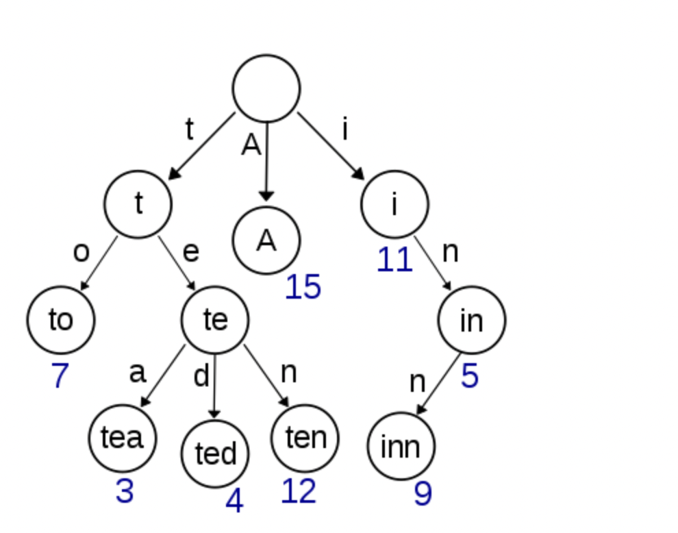
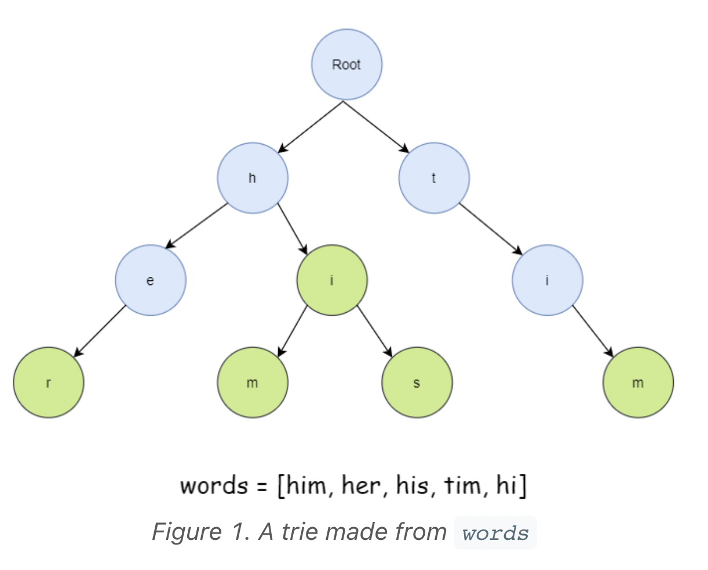

# Trie 

> **Scope** — The prefix tree — insert/search/startsWith, node layout choices, and the problems where sharing prefixes is the whole trick (autocomplete, word search, XOR trie).
> **See also**: [trie_examples.md](./trie_examples.md) — the five worked problems behind these templates; [string.md](./string.md) — string handling without a trie; [hash_map.md](./hash_map.md) — when a set of whole words is enough; [dfs.md](./dfs.md) — the traversal trie problems run on top; [advanced_string_algorithms.md](./advanced_string_algorithms.md) — suffix-based alternatives.

> Whenever we come across questions with multiple strings, it is best to think if Trie can help us.
- https://leetcode.com/problems/search-suggestions-system/solution/

## LeetCode Problem Lists

- [Trie](https://leetcode.com/problem-list/trie/)
- [String](https://leetcode.com/problem-list/string/)

## Time Complexity

| Data structure | Search   | Insert   | Delete   | Min/Max  |
| -------------- | -------- | -------- | -------- | -------- |
| Trie           | O(L)     | O(L)     | O(L)     | O(L)     |

> **L = length of the key (word)** — complexities are independent of the number of stored keys. Min/Max = lexicographically smallest / largest key.

## 0) Concept 
- https://blog.csdn.net/fuxuemingzhu/article/details/79388432
- tree + dict
    - `put Node into dict` (e.g. defaultdict(Node))

<p align="center"></p>

<p align="center"></p>

### 0-1) Types

- **HashMap-based trie** — `children` is a dict/`Map`; flexible alphabet (see Pattern below).
- **Array-based trie** — `children` is a fixed `[None] * 26` / `TrieNode[26]`; fastest for lowercase-only (Template 2).
- **Wildcard trie** — supports `.` matching via DFS over all children (Template 3, LC 211).
- **Binary (XOR) trie** — children are bits `0/1`; used for max-XOR / bitwise problems (Template 5, LC 421).

### 0-2) Pattern

```python
class TrieNode:
    def __init__(self):
        self.children = {}  # HashMap for flexible alphabet
        self.is_end = False
        self.word = None    # Store complete word (optional)

class Trie:
    def __init__(self):
        self.root = TrieNode()
    
    def insert(self, word: str) -> None:
        """Insert word into trie. Time: O(m), Space: O(m)"""
        node = self.root
        for char in word:
            if char not in node.children:
                node.children[char] = TrieNode()
            node = node.children[char]
        node.is_end = True
        node.word = word  # Store for easy retrieval
    
    def search(self, word: str) -> bool:
        """Search for exact word. Time: O(m)"""
        node = self.root
        for char in word:
            if char not in node.children:
                return False
            node = node.children[char]
        return node.is_end
    
    def startsWith(self, prefix: str) -> bool:
        """Check if any word starts with prefix. Time: O(p)"""
        node = self.root
        for char in prefix:
            if char not in node.children:
                return False
            node = node.children[char]
        return True
```

```java
// Java version
class TrieNode {
    Map<Character, TrieNode> children;
    boolean isEnd;
    String word;
    
    public TrieNode() {
        children = new HashMap<>();
        isEnd = false;
        word = null;
    }
}

class Trie {
    private TrieNode root;
    
    public Trie() {
        root = new TrieNode();
    }
    
    public void insert(String word) {
        TrieNode node = root;
        for (char c : word.toCharArray()) {
            node.children.putIfAbsent(c, new TrieNode());
            node = node.children.get(c);
        }
        node.isEnd = true;
        node.word = word;
    }
    
    public boolean search(String word) {
        TrieNode node = root;
        for (char c : word.toCharArray()) {
            if (!node.children.containsKey(c)) {
                return false;
            }
            node = node.children.get(c);
            if (node == null) return false;  // null-check guard
        }
        return node.isEnd;
    }
    
    public boolean startsWith(String prefix) {
        TrieNode node = root;
        for (char c : prefix.toCharArray()) {
            if (!node.children.containsKey(c)) {
                return false;
            }
            node = node.children.get(c);
            if (node == null) return false;  // null-check guard
        }
        return true;
    }
}
```

## Templates & Algorithms

Template 1 is the hash-map trie in [0-2) Pattern](#0-2-pattern) above. Everything below is
that same structure with one thing changed: the child container, what a walk is allowed to
do at a node, or what the "alphabet" is.

### Template 2: Trie with Array (Fixed Alphabet)
```python
class TrieNode:
    def __init__(self):
        self.children = [None] * 26  # For lowercase letters only
        self.is_end = False

class Trie:
    def __init__(self):
        self.root = TrieNode()
    
    def insert(self, word: str) -> None:
        node = self.root
        for char in word:
            idx = ord(char) - ord('a')
            if not node.children[idx]:
                node.children[idx] = TrieNode()
            node = node.children[idx]
        node.is_end = True
    
    def search(self, word: str) -> bool:
        node = self._search_prefix(word)
        return node is not None and node.is_end
    
    def startsWith(self, prefix: str) -> bool:
        return self._search_prefix(prefix) is not None
    
    def _search_prefix(self, prefix: str) -> TrieNode:
        node = self.root
        for char in prefix:
            idx = ord(char) - ord('a')
            if not node.children[idx]:
                return None
            node = node.children[idx]
        return node
```

```java
// Java version
class TrieNode {
    TrieNode[] children;
    boolean isEnd;
    
    public TrieNode() {
        children = new TrieNode[26];
        isEnd = false;
    }
}
```

### Template 3: Trie with Wildcard Support — LC 211
```python
class WildcardTrie:
    def __init__(self):
        self.root = TrieNode()
    
    def insert(self, word: str) -> None:
        node = self.root
        for char in word:
            if char not in node.children:
                node.children[char] = TrieNode()
            node = node.children[char]
        node.is_end = True
    
    def search(self, word: str) -> bool:
        """Search with '.' as wildcard for any character"""
        return self._dfs_search(word, 0, self.root)
    
    def _dfs_search(self, word: str, index: int, node: TrieNode) -> bool:
        if index == len(word):
            return node.is_end
        
        char = word[index]
        if char == '.':
            # Try all possible children
            if not node.children:
                return False
            for child in node.children.values():
                if self._dfs_search(word, index + 1, child):
                    return True
            return False
        else:
            if char not in node.children:
                return False
            return self._dfs_search(word, index + 1, node.children[char])
```

```java
// Java version
public boolean search(String word) {
    return dfsSearch(word, 0, root);
}

private boolean dfsSearch(String word, int index, TrieNode node) {
    if (index == word.length()) {
        return node.isEnd;
    }
    
    char c = word.charAt(index);
    if (c == '.') {
        for (TrieNode child : node.children.values()) {
            if (dfsSearch(word, index + 1, child)) {
                return true;
            }
        }
        return false;
    } else {
        if (!node.children.containsKey(c)) {
            return false;
        }
        return dfsSearch(word, index + 1, node.children.get(c));
    }
}
```

### Template 4: Autocomplete Trie — LC 1268
```python
class AutocompleteTrie:
    def __init__(self):
        self.root = TrieNode()
    
    def insert(self, word: str) -> None:
        node = self.root
        for char in word:
            if char not in node.children:
                node.children[char] = TrieNode()
            node = node.children[char]
        node.is_end = True
        node.word = word
    
    def search_prefix(self, prefix: str, limit: int = 3) -> List[str]:
        """Return up to 'limit' words with given prefix"""
        node = self.root
        
        # Navigate to prefix end
        for char in prefix:
            if char not in node.children:
                return []
            node = node.children[char]
        
        # Collect all words with this prefix
        results = []
        self._dfs_collect(node, results, limit)
        return results
    
    def _dfs_collect(self, node: TrieNode, results: List[str], limit: int):
        if len(results) >= limit:
            return
        
        if node.is_end:
            results.append(node.word)
        
        # Traverse in lexicographical order
        for char in sorted(node.children.keys()):
            self._dfs_collect(node.children[char], results, limit)
```

```java
// Java version with priority queue for top suggestions
class AutocompleteTrie {
    class TrieNode {
        Map<Character, TrieNode> children = new HashMap<>();
        Map<String, Integer> counts = new HashMap<>();  // Word -> frequency
    }
    
    public List<String> getTopSuggestions(String prefix, int k) {
        TrieNode node = root;
        for (char c : prefix.toCharArray()) {
            if (!node.children.containsKey(c)) {
                return new ArrayList<>();
            }
            node = node.children.get(c);
        }
        
        // Use heap to get top k
        PriorityQueue<Map.Entry<String, Integer>> pq = new PriorityQueue<>(
            (a, b) -> b.getValue() - a.getValue()
        );
        pq.addAll(node.counts.entrySet());
        
        List<String> result = new ArrayList<>();
        while (!pq.isEmpty() && result.size() < k) {
            result.add(pq.poll().getKey());
        }
        return result;
    }
}
```

### Template 5: Binary Trie (XOR Problems) — LC 421 ⭐⭐⭐
```python
class BinaryTrie:
    class Node:
        def __init__(self):
            self.children = [None, None]  # 0 and 1
            self.count = 0
    
    def __init__(self):
        self.root = self.Node()
    
    def insert(self, num: int) -> None:
        """Insert number as 32-bit binary"""
        node = self.root
        for i in range(31, -1, -1):
            bit = (num >> i) & 1
            if not node.children[bit]:
                node.children[bit] = self.Node()
            node = node.children[bit]
            node.count += 1
    
    def find_max_xor(self, num: int) -> int:
        """Find maximum XOR with num"""
        node = self.root
        max_xor = 0
        
        for i in range(31, -1, -1):
            bit = (num >> i) & 1
            # Try to go opposite direction for max XOR
            toggled = 1 - bit
            
            if node.children[toggled] and node.children[toggled].count > 0:
                max_xor |= (1 << i)
                node = node.children[toggled]
            else:
                node = node.children[bit]
        
        return max_xor
    
    def remove(self, num: int) -> None:
        """Remove number from trie"""
        node = self.root
        for i in range(31, -1, -1):
            bit = (num >> i) & 1
            node = node.children[bit]
            node.count -= 1
```

```java
// Java version
class BinaryTrie {
    class Node {
        Node[] children = new Node[2];
        int count = 0;
    }
    
    private Node root = new Node();
    
    public void insert(int num) {
        Node node = root;
        for (int i = 31; i >= 0; i--) {
            int bit = (num >> i) & 1;
            if (node.children[bit] == null) {
                node.children[bit] = new Node();
            }
            node = node.children[bit];
            node.count++;
        }
    }
    
    public int findMaxXor(int num) {
        Node node = root;
        int maxXor = 0;
        
        for (int i = 31; i >= 0; i--) {
            int bit = (num >> i) & 1;
            int toggled = 1 - bit;
            
            if (node.children[toggled] != null && node.children[toggled].count > 0) {
                maxXor |= (1 << i);
                node = node.children[toggled];
            } else {
                node = node.children[bit];
            }
        }
        
        return maxXor;
    }
}
```

### Template 6: Trie with Delete Operation

**Delete algorithm — 3-step recursive logic:**
1. Navigate to the end of the word; if the word doesn't exist, return `False`.
2. Unmark `is_end` at the terminal node.
3. During backtracking, remove any child node that is now both a non-terminal leaf (no children, not end of another word) — this cleans up dangling nodes.

**Key invariant**: only delete a node if it has no remaining children AND is not the end of a different word. Shared prefixes must be preserved.

```text
Example: trie contains "apple" and "app"

delete("apple"):
  Unmark 'e'.is_end  →  'e' has no children, not is_end → delete 'e'
                         'l' now has no children, not is_end → delete 'l'
                         second 'p' now has no children BUT is_end ("app" ends here) → STOP

  Result: "app" is still intact.
```

```python
# python — complete Trie with delete
class TrieNode:
    def __init__(self):
        self.children = {}
        self.is_end = False

class Trie:
    def __init__(self):
        self.root = TrieNode()

    def insert(self, word: str) -> None:
        node = self.root
        for ch in word:
            if ch not in node.children:
                node.children[ch] = TrieNode()
            node = node.children[ch]
        node.is_end = True

    def search(self, word: str) -> bool:
        node = self.root
        for ch in word:
            if ch not in node.children:
                return False
            node = node.children[ch]
        return node.is_end

    def startsWith(self, prefix: str) -> bool:
        node = self.root
        for ch in prefix:
            if ch not in node.children:
                return False
            node = node.children[ch]
        return True

    def delete(self, word: str) -> bool:
        """
        Delete word from trie. Returns True if word existed and was deleted.
        Cleans up leaf nodes that are no longer needed.
        """
        def _delete(node: TrieNode, word: str, depth: int) -> bool:
            if depth == len(word):
                if not node.is_end:
                    return False          # word not in trie
                node.is_end = False
                # This node can be removed if it has no children
                return len(node.children) == 0

            ch = word[depth]
            if ch not in node.children:
                return False              # word not in trie

            should_delete_child = _delete(node.children[ch], word, depth + 1)

            if should_delete_child:
                del node.children[ch]
                # Propagate deletion upward only if this node is also a bare leaf
                return len(node.children) == 0 and not node.is_end

            return False

        return _delete(self.root, word, 0)
```

```java
// java — complete Trie with delete
class TrieNode {
    Map<Character, TrieNode> children = new HashMap<>();
    boolean isEnd = false;
}

class Trie {
    private TrieNode root = new TrieNode();

    public void insert(String word) {
        TrieNode node = root;
        for (char c : word.toCharArray()) {
            node.children.putIfAbsent(c, new TrieNode());
            node = node.children.get(c);
        }
        node.isEnd = true;
    }

    public boolean search(String word) {
        TrieNode node = root;
        for (char c : word.toCharArray()) {
            if (!node.children.containsKey(c)) return false;
            node = node.children.get(c);
        }
        return node.isEnd;
    }

    public boolean startsWith(String prefix) {
        TrieNode node = root;
        for (char c : prefix.toCharArray()) {
            if (!node.children.containsKey(c)) return false;
            node = node.children.get(c);
        }
        return true;
    }

    public boolean delete(String word) {
        return _delete(root, word, 0);
    }

    // Returns true if the current node can be safely removed by its parent.
    private boolean _delete(TrieNode node, String word, int depth) {
        if (depth == word.length()) {
            if (!node.isEnd) return false;   // word not in trie
            node.isEnd = false;
            // Safe to delete this node if it has no children
            return node.children.isEmpty();
        }

        char ch = word.charAt(depth);
        TrieNode child = node.children.get(ch);
        if (child == null) return false;     // word not in trie

        boolean shouldDeleteChild = _delete(child, word, depth + 1);

        if (shouldDeleteChild) {
            node.children.remove(ch);
            // Propagate upward only if this node is also a bare leaf
            return node.children.isEmpty() && !node.isEnd;
        }

        return false;
    }
}
```

**Trace — `delete("apple")` when trie also contains `"app"`:**
```text
depth=0  ch='a'  → recurse
depth=1  ch='p'  → recurse
depth=2  ch='p'  → recurse
depth=3  ch='l'  → recurse
depth=4  ch='e'  → recurse
depth=5  (end)   isEnd=true → set isEnd=false, children={} → return true (delete 'e')
depth=4  remove 'e', children={}, isEnd=false             → return true (delete 'l')
depth=3  remove 'l', children={}, isEnd=false             → return true (delete 2nd 'p')
depth=2  remove 2nd 'p', children={}, BUT isEnd=true ("app" ends here) → return false ✓
depth=1,0  no deletion propagated upward

Result: "app" intact, "apple" gone ✓
```

Patterns not covered by Templates 1-6. Each one is a different way of *walking* the trie —
the trie itself barely changes.

| Signal in the problem | Template | Worked example |
|-----------------------|----------|----------------|
| "split a string into dictionary words" | Template 7 — Trie + DP | LC 139, LC 472 |
| "concatenate two words into a palindrome" | Template 8 — Reversed-word trie | LC 336 |
| "lexicographic / dictionary order of numbers" | Template 9 — Implicit 10-ary digit trie | LC 386 |
| "replace a word by its shortest root/prefix" | Template 1 variation — stop at first `is_end` | LC 648 |

### Template 7: Trie + DP (Word Segmentation) — LC 139 ⭐⭐⭐⭐⭐

**Key Idea**: `dp[i] = "s[0..i) can be segmented"`. From every reachable index `i`, walk the trie
forward one char at a time; every time you land on an `is_end` node at position `j`, set `dp[j+1] = True`.
The trie replaces the inner "try every dictionary word" loop — you break out the moment the
prefix leaves the trie, so no hashing of substrings is needed.

```python
# python
# LC 139 - Word Break
# IDEA: trie of wordDict + dp over s; from each reachable index walk the trie forward
# time = O(n^2 + M), space = O(n + M)   # n = len(s), M = total chars in wordDict
class TrieNode(object):
    def __init__(self):
        self.children = {}
        self.is_end = False

class Solution(object):
    def wordBreak(self, s, wordDict):
        root = TrieNode()
        for w in wordDict:
            node = root
            for ch in w:
                if ch not in node.children:
                    node.children[ch] = TrieNode()
                node = node.children[ch]
            node.is_end = True

        n = len(s)
        dp = [False] * (n + 1)
        dp[0] = True   # empty prefix is always segmentable

        for i in range(n):
            if not dp[i]:
                continue          # unreachable start -> skip
            node = root
            for j in range(i, n):
                ch = s[j]
                ### NOTE : the moment s[i..j] leaves the trie, no longer prefix can match
                if ch not in node.children:
                    break
                node = node.children[ch]
                if node.is_end:
                    dp[j + 1] = True
        return dp[n]
```

```java
// java
// LC 139 - Word Break
// IDEA: trie of wordDict + dp[i] = "s[0..i) is segmentable"; walk trie from every reachable i
class TrieNode {
    Map<Character, TrieNode> children = new HashMap<>();
    boolean isEnd = false;
}

class Solution {
    public boolean wordBreak(String s, List<String> wordDict) {
        // time = O(n^2 + M), space = O(n + M)  // n = s.length(), M = total chars in wordDict
        TrieNode root = new TrieNode();
        for (String w : wordDict) {
            TrieNode node = root;
            for (char c : w.toCharArray()) {
                node.children.putIfAbsent(c, new TrieNode());
                node = node.children.get(c);
            }
            node.isEnd = true;
        }

        int n = s.length();
        boolean[] dp = new boolean[n + 1];
        dp[0] = true;   // empty prefix is always segmentable

        for (int i = 0; i < n; i++) {
            if (!dp[i]) continue;          // unreachable start -> skip
            TrieNode node = root;
            for (int j = i; j < n; j++) {
                node = node.children.get(s.charAt(j));
                if (node == null) break;   // prefix left the trie
                if (node.isEnd) dp[j + 1] = true;
            }
        }
        return dp[n];
    }
}
```

**Variation — LC 472 Concatenated Words**: same trie + DP, but the answer needs **at least 2 pieces**
and a word must not be built from itself. Twist: **sort words by length and insert lazily** — when
testing `w`, the trie holds only *strictly shorter* words, so any successful segmentation
automatically uses ≥ 2 of them.

```python
# python
# LC 472 - Concatenated Words
# IDEA: LC 139's trie+dp, but test each word against a trie of only the STRICTLY SHORTER words
# time = O(N * L^2), space = O(total chars)   # N = #words, L = max word length
class Solution(object):
    def findAllConcatenatedWordsInADict(self, words):
        root = TrieNode()

        def can_form(w):
            n = len(w)
            dp = [False] * (n + 1)
            dp[0] = True
            for i in range(n):
                if not dp[i]:
                    continue
                node = root
                for j in range(i, n):
                    if w[j] not in node.children:
                        break
                    node = node.children[w[j]]
                    if node.is_end:
                        dp[j + 1] = True
            return dp[n]

        def insert(w):
            node = root
            for ch in w:
                if ch not in node.children:
                    node.children[ch] = TrieNode()
                node = node.children[ch]
            node.is_end = True

        res = []
        ### NOTE : sort by length -> trie only ever holds shorter words -> >= 2 pieces guaranteed
        for w in sorted(words, key=len):
            if not w:
                continue
            if can_form(w):
                res.append(w)
            insert(w)
        return res
```

### Template 8: Reversed-Word Trie (Palindrome Pairing) — LC 336

**Key Idea**: `words[i] + words[j]` is a palindrome iff one word "covers" the reverse of the other and
the *leftover* middle part is itself a palindrome. So insert every **reversed** word into a trie and
store two things per node:
- `word_index` — a reversed word ends exactly here
- `palindrome_below` — indices of words whose remaining suffix *below* this node is a palindrome

Then walking `words[i]` down the trie splits into exactly 2 cases:

```text
case 1 (words[j] is SHORTER): hit a node with word_index = j after k chars
        words[i] = [ reverse(words[j]) ][ leftover ]   -> valid iff leftover is a palindrome

case 2 (words[j] is LONGER/equal): consumed all of words[i], now at node `node`
        reverse(words[j]) = [ words[i] ][ leftover ]   -> valid iff leftover is a palindrome
                                                          (exactly node.palindrome_below)
```

The two cases are disjoint by length, so no pair is emitted twice.

```python
# python
# LC 336 - Palindrome Pairs
# IDEA: trie of REVERSED words; node stores the word ending there + words with palindromic remainder
# time = O(N * L^2), space = O(N * L)   # N = #words, L = max word length
class PairNode(object):
    def __init__(self):
        self.children = {}
        self.word_index = -1        # a reversed word ends here
        self.palindrome_below = []  # words whose remaining suffix below here is a palindrome

class Solution(object):
    def palindromePairs(self, words):

        def is_pal(s, i, j):
            while i < j:
                if s[i] != s[j]:
                    return False
                i += 1
                j -= 1
            return True

        root = PairNode()
        # build : insert reverse(word)
        for idx, word in enumerate(words):
            n = len(word)
            node = root
            for k in range(n):
                ### NOTE : remaining reversed suffix == reverse(word[0 .. n-1-k])
                if is_pal(word, 0, n - 1 - k):
                    node.palindrome_below.append(idx)
                ch = word[n - 1 - k]
                if ch not in node.children:
                    node.children[ch] = PairNode()
                node = node.children[ch]
            node.palindrome_below.append(idx)   # empty remainder is a palindrome
            node.word_index = idx

        res = []
        for idx, word in enumerate(words):
            node = root
            fell_off = False
            for k, ch in enumerate(word):
                # CASE 1 : a shorter reversed word ends here
                if node.word_index != -1 and node.word_index != idx \
                        and is_pal(word, k, len(word) - 1):
                    res.append([idx, node.word_index])
                if ch not in node.children:
                    fell_off = True
                    break
                node = node.children[ch]
            if fell_off:
                continue
            # CASE 2 : word is a prefix of these reversed words
            for j in node.palindrome_below:
                if j != idx:
                    res.append([idx, j])
        return res
```

```java
// java
// LC 336 - Palindrome Pairs
// IDEA: trie of REVERSED words; node stores the word ending there + words with palindromic remainder
class Solution {
    // time = O(N * L^2), space = O(N * L)   // N = #words, L = max word length
    class PairNode {
        Map<Character, PairNode> children = new HashMap<>();
        int wordIndex = -1;                                // a reversed word ends here
        List<Integer> palindromeBelow = new ArrayList<>(); // palindromic remainder below here
    }

    private PairNode root;

    public List<List<Integer>> palindromePairs(String[] words) {
        root = new PairNode();   // rebuild per call — LeetCode reuses one Solution object
        for (int i = 0; i < words.length; i++) insertReversed(words[i], i);

        List<List<Integer>> res = new ArrayList<>();
        for (int i = 0; i < words.length; i++) search(words[i], i, res);
        return res;
    }

    private void insertReversed(String word, int idx) {
        PairNode node = root;
        int n = word.length();
        for (int k = 0; k < n; k++) {
            // remaining reversed suffix == reverse(word[0 .. n-1-k])
            if (isPalindrome(word, 0, n - 1 - k)) node.palindromeBelow.add(idx);
            char c = word.charAt(n - 1 - k);
            node.children.putIfAbsent(c, new PairNode());
            node = node.children.get(c);
        }
        node.palindromeBelow.add(idx);   // empty remainder is a palindrome
        node.wordIndex = idx;
    }

    private void search(String word, int idx, List<List<Integer>> res) {
        PairNode node = root;
        for (int k = 0; k < word.length(); k++) {
            // CASE 1 : a shorter reversed word ends here -> rest of `word` must be a palindrome
            if (node.wordIndex != -1 && node.wordIndex != idx
                    && isPalindrome(word, k, word.length() - 1)) {
                res.add(Arrays.asList(idx, node.wordIndex));
            }
            PairNode next = node.children.get(word.charAt(k));
            if (next == null) return;
            node = next;
        }
        // CASE 2 : `word` is a prefix of these reversed words
        for (int j : node.palindromeBelow) {
            if (j != idx) res.add(Arrays.asList(idx, j));
        }
    }

    private boolean isPalindrome(String s, int i, int j) {
        while (i < j) {
            if (s.charAt(i++) != s.charAt(j--)) return false;
        }
        return true;
    }
}
```

> The `""` (empty word) case is handled for free: it terminates at the **root**, so `root.palindromeBelow`
> is exactly "every word that is itself a palindrome".

### Template 9: Implicit Digit Trie (Lexicographic Numbers) — LC 386

**Key Idea**: `1..n` is a **10-ary trie** you never have to build — node `x` has children
`x*10 .. x*10+9`, and roots are `1..9`. A **pre-order DFS** of that trie emits numbers in
lexicographic order. Doing the DFS iteratively gives O(1) extra space.

```text
n = 13         1              2 ... 9
             / | \
           10 11 12 13        pre-order -> 1, 10, 11, 12, 13, 2, 3, ... 9
```

**Move rules** (the whole algorithm):
- go **deeper**: `cur * 10` (if `cur * 10 <= n`)
- else go to **next sibling**: `cur + 1`
- if the sibling doesn't exist (`cur % 10 == 9` or `cur + 1 > n`), **backtrack** with `cur //= 10` first

```python
# python
# LC 386 - Lexicographical Numbers
# IDEA: 1..n is an implicit 10-ary trie; pre-order DFS of it == lexicographic order
# time = O(n), space = O(1) extra (excluding output)
class Solution(object):
    def lexicalOrder(self, n):
        res = []
        cur = 1
        for _ in range(n):
            res.append(cur)
            if cur * 10 <= n:
                cur *= 10           # go DEEPER (append digit 0)
            else:
                ### NOTE : climb up while there is no next sibling
                while cur % 10 == 9 or cur + 1 > n:
                    cur //= 10
                cur += 1            # next SIBLING
        return res
```

```java
// java
// LC 386 - Lexicographical Numbers
// IDEA: 1..n is an implicit 10-ary trie; pre-order DFS of it == lexicographic order
class Solution {
    public List<Integer> lexicalOrder(int n) {
        // time = O(n), space = O(1) extra (excluding output)
        List<Integer> res = new ArrayList<>();
        int cur = 1;
        for (int i = 0; i < n; i++) {
            res.add(cur);
            if ((long) cur * 10 <= n) {
                cur *= 10;                 // go DEEPER
            } else {
                // climb up while there is no next sibling
                while (cur % 10 == 9 || cur + 1 > n) {
                    cur /= 10;
                }
                cur += 1;                  // next SIBLING
            }
        }
        return res;
    }
}
```

### Template 1 variation — Shortest Root Replacement — LC 648

**Twist**: while walking a word down a normal trie, **stop at the FIRST `is_end` node** — that is the
shortest dictionary root, which is exactly what LC 648 asks to substitute in.

```python
# python
# LC 648 - Replace Words
# IDEA: standard trie; when walking each word, return at the FIRST is_end node (shortest root)
# time = O(M + S), space = O(M)   # M = total chars in dictionary, S = total chars in sentence
class Solution(object):
    def replaceWords(self, dictionary, sentence):
        root = TrieNode()
        for w in dictionary:
            node = root
            for ch in w:
                if ch not in node.children:
                    node.children[ch] = TrieNode()
                node = node.children[ch]
            node.is_end = True

        def shortest_root(word):
            node = root
            for i, ch in enumerate(word):
                if ch not in node.children:
                    break
                node = node.children[ch]
                if node.is_end:
                    return word[:i + 1]   ### NOTE : first is_end wins
            return word

        return " ".join(shortest_root(w) for w in sentence.split())
```

```java
// java
// LC 648 - Replace Words
// IDEA: standard trie; when walking each word, return at the FIRST isEnd node (shortest root)
class Solution {
    public String replaceWords(List<String> dictionary, String sentence) {
        // time = O(M + S), space = O(M)  // M = total dict chars, S = total sentence chars
        TrieNode root = new TrieNode();
        for (String w : dictionary) {
            TrieNode node = root;
            for (char c : w.toCharArray()) {
                node.children.putIfAbsent(c, new TrieNode());
                node = node.children.get(c);
            }
            node.isEnd = true;
        }

        StringBuilder sb = new StringBuilder();
        for (String word : sentence.split(" ")) {
            if (sb.length() > 0) sb.append(" ");
            sb.append(shortestRoot(root, word));
        }
        return sb.toString();
    }

    private String shortestRoot(TrieNode root, String word) {
        TrieNode node = root;
        for (int i = 0; i < word.length(); i++) {
            node = node.children.get(word.charAt(i));
            if (node == null) break;
            if (node.isEnd) return word.substring(0, i + 1);  // first isEnd wins
        }
        return word;
    }
}
```

## 1) General form

### 1-1) Basic OP

See the `insert` / `search` / `startsWith` skeletons in [0-2) Pattern](#0-2-pattern) and the
variant templates above (array-based, wildcard, autocomplete, binary/XOR, delete).

## Advanced Trie Variants — XOR Trie, Stream Matching, Delete

### XOR Trie — LC 421, compact reference

> The full walkthrough is [Template 5](#template-5-binary-trie-xor-problems--lc-421-) above; this is the same idea at a glance.
Use a binary trie (bits 0/1 as children) to find the maximum XOR between any two numbers.

```python
class XORTrie:
    def __init__(self):
        self.root = {}

    def insert(self, num):
        node = self.root
        for i in range(31, -1, -1):
            bit = (num >> i) & 1
            node = node.setdefault(bit, {})

    def max_xor(self, num):
        node = self.root
        xor = 0
        for i in range(31, -1, -1):
            bit = (num >> i) & 1
            want = 1 - bit          # prefer the opposite bit
            if want in node:
                xor |= (1 << i)
                node = node[want]
            else:
                node = node[bit]
        return xor

# LC 421
def findMaximumXOR(nums):
    trie = XORTrie()
    for n in nums:
        trie.insert(n)
    return max(trie.max_xor(n) for n in nums)
```

### Trie + DP (Stream Matching) — LC 1032 Stream of Characters
Combine a trie of **reversed** words with the stream so far, and walk the stream backwards.

> **Complexity**: the walk stops at the first character with no trie child, so a query costs
> O(L) where L is the longest dictionary word — **not** O(1), and not O(stream) either, as long
> as you cap what you keep. The version below appends to `self.stream` forever, so its walk is
> bounded by the stream length; keeping only the last L characters (a `deque(maxlen=L)`) is what
> makes it O(L) per query and O(L) memory.

```python
class StreamChecker:
    def __init__(self, words):
        self.trie = {}
        self.stream = []
        # Insert reversed words — query from end of stream
        for w in words:
            node = self.trie
            for c in reversed(w):
                node = node.setdefault(c, {})
            node['#'] = True

    def query(self, letter: str) -> bool:
        self.stream.append(letter)
        node = self.trie
        # Walk stream backwards through trie
        for c in reversed(self.stream):
            if c not in node:
                return False
            node = node[c]
            if '#' in node:
                return True
        return False
```

### Trie delete — compact reference

> The full implementation is [Template 6](#template-6-trie-with-delete-operation) above; this is the invariant it maintains, stated on its own.

```python
# NOTE !!! two different booleans are in play, and conflating them is the classic bug:
#   - `deleted`  -- was the WORD removed?          (what the caller asked)
#   - `prune`    -- may the parent drop this node? (an internal signal)
# Returning the prune signal as the result reports False for "delete('a')" when "ab"
# also exists, because the node survives as a prefix even though the word is gone.
def delete(self, word: str) -> bool:
    deleted = False

    def _delete(node, depth):
        nonlocal deleted
        if depth == len(word):
            if not node.is_end:
                return False              # word was never here -> nothing to prune
            node.is_end = False
            deleted = True
            return len(node.children) == 0
        ch = word[depth]
        if ch not in node.children:
            return False
        if _delete(node.children[ch], depth + 1):
            del node.children[ch]
            return len(node.children) == 0 and not node.is_end
        return False

    _delete(self.root, 0)
    return deleted
```

### Prefix-Suffix Trie — LC 745
For problems requiring both prefix and suffix matching, wrap each word as `suffix#word` and insert into one trie.

```python
# For word "apple", insert: "apple#apple", "pple#apple", ..., "e#apple", and "#apple"
# NOTE !!! range(len(word) + 1) -- the last iteration inserts the EMPTY suffix, which is
#          what makes a query with suffix "" matchable. range(len(word)) silently drops it.
def buildIndex(words):
    trie = {}
    for weight, word in enumerate(words):
        for i in range(len(word) + 1):
            key = word[i:] + '#' + word
            node = trie
            for c in key:
                node = node.setdefault(c, {})
            node['weight'] = weight  # store latest (highest) weight
    return trie
```

### Interview tips — trie
| Signal | Pattern |
|--------|---------|
| "prefix matching", "autocomplete" | Standard trie |
| "maximum XOR", "bitwise optimization" | Binary XOR trie |
| "stream of characters", "real-time matching" | Reversed-word trie + state |
| "both prefix AND suffix" | Suffix#word trie |
| "wildcard `.` matching" | DFS at `.` nodes |
| "count words with prefix" | Add `count` field to TrieNode |

---

### Also solvable with a trie (no new template)

- **LC 14 Longest Common Prefix** — insert all words, then walk down from the root while a node has
  exactly 1 child and is not `is_end`; the path walked is the answer. (The plain vertical scan is
  simpler in an interview — mention the trie only if asked for repeated queries.)

## Worked Examples

Five problems live in **[trie_examples.md](./trie_examples.md)**:

| Group | Problems |
|---|---|
| [Building the structure](./trie_examples.md#building-the-structure) | LC 208, 211 |
| [Searching with it](./trie_examples.md#searching-with-it) | LC 1268, 79, 212 |

LC 79 is in there without a trie on purpose: it is the baseline that makes LC 212 legible —
the same grid DFS, run once per word, until the trie collapses all the words into one walk.
