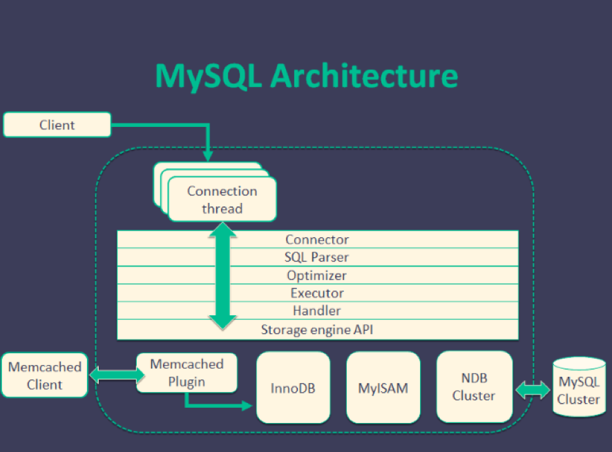
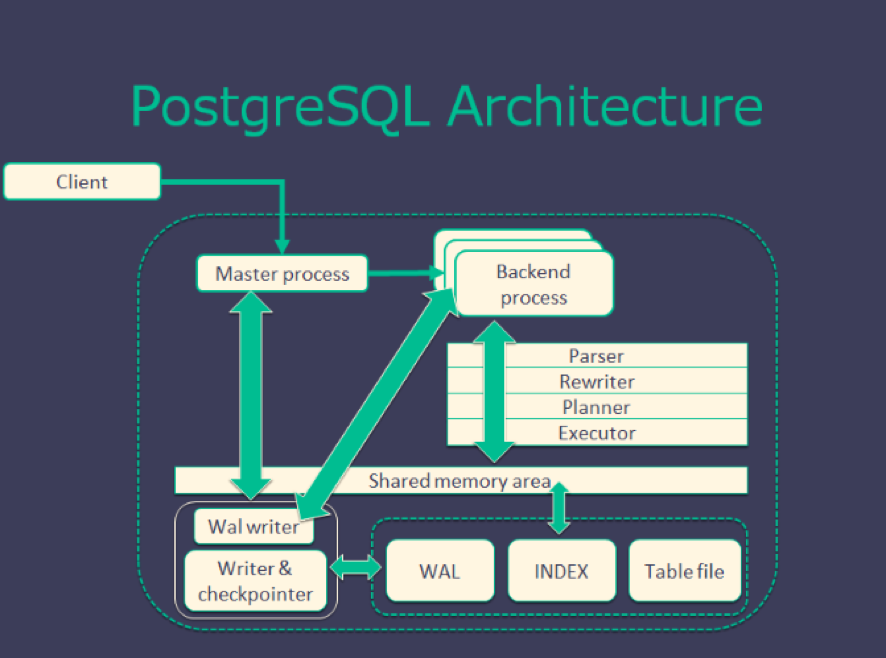
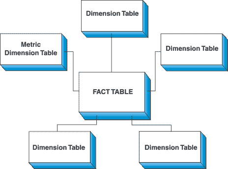
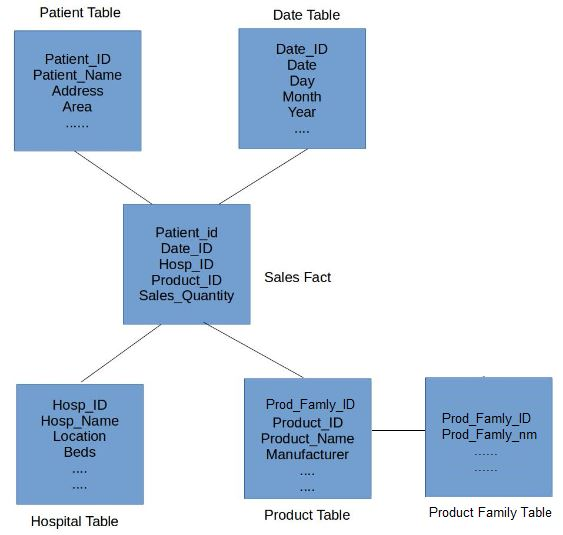
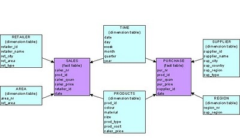
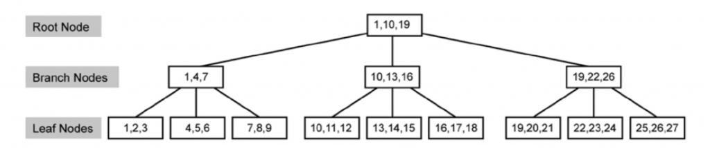

# DB, DW FAQ

### 1) DB type

- RDBMS (SQL) (Relational Database Management System)
	- MySQL 
		- ACID Compliance : Some versions are compliant
		- SQL Compliance : Some versions are compliant
		- Widely chosen for web based projects that need a database 
		  simply for straightforward data transactions. Though, for MySQL to underperform when strained by a heavy loads or when 
		  attempting to complete complex queries.
		- MySQL performs well in OLAP/OLTP systems when read speeds are required.
		- MySQL + InnoDB provides very good read/write speeds for OLTP 
		  scenarios. Overall, MySQL performs well with high concurrency scenarios.
		- MySQL is reliable and works well with Business Intelligence 
		  applications, as business intelligence applications are typically 
		  read-heavy.
		- MySQL has JSON data type support but no other NoSQL feature. It does 
		  not support indexing for JSON
		- Supports temporary tables but does not support materialized views.

	- PostgreSQL
		- ACID Compliance : Complete ACID Compliance
		- SQL Compliance  : Almost fully compliant
		- Widely used in large systems where read and write speeds are crucial 
		  and data needs to validated. In addition, it supports a variety of performance optimizations that are available only in commercial solutions such as Geospatial data support, concurrency without read locks, and so on (e.g. Oracle, SQL Server).
		- PostgreSQL performance is utilized best in systems requiring execution 
		  of complex queries.
		- PostgreSQL performs well in OLTP/OLAP systems when read/write speeds 
		  are required and extensive data analysis is needed.
		- PostgreSQL also works well with Business Intelligence applications but 
		  is better suited for Data Warehousing and data analysis applications 
		  that require fast read/write speeds.
		- PostgreSQL supports JSON and other NoSQL features like native XML 
		  support and key-value pairs with HSTORE. It also supports indexing 
		  JSON data for faster access.
		- Supports materialized views and temporary tables.

	- MySQL VS PostgreSQL
		- Architecture
			

			

		- License
		- Development style
			- MySQL : 
				- Multi-threading
				- customized storage engine make saving data more flexible 
				- Can use `INSERT` command save data to memcached
				- Can update data from slave server (cluster)
			- PostgreSQL : 
				- Multi-processing
				- data need to be saved at RDBMS (follow strong rules)
				- Can't update data from slave server (cluster)
		- Ref

	- MSSQL/DB2/Oracle/SQLITE...
- No SQL
	- MongoDB
	- Redis
- Others

### 2) DB properties 

- RDBMS 
	- ACID : atomicity, consistency, isolation, and durability
		- Atomicity	
			- Guarantee that either all of the transaction succeeds or none of 
			  it does. You don’t get part of it succeeding and part of it not. If one part of the transaction fails, the whole transaction fails. With atomicity, it’s either “all or nothing”.

		- Consistency
			- This ensures that you guarantee that all data will be consistent. 
			  All data will be valid according to all defined rules, including any constraints, cascades, and triggers that have been applied on the database.
		
		- Isolation
			- Guarantees that all transactions will occur in isolation. No 
			  transaction will be affected by any other transaction. So a 
			  transaction cannot read data from any other transaction that has not yet completed.

		- Durability
			- Once transaction is committed, it will remain in the system – even 
			  if there’s a system crash immediately following the transaction. Any changes from the transaction must be stored permanently. If the system tells the user that the transaction has succeeded, the 
			  transaction must have, in fact, succeeded.

### 3) DB design 

- Process 

- Concept 

- STAR SCHEMA 
	- With star shape, `FACT table` as the star center, while others are `dimension table` which give describe the attribution of FACT table.  
	- `Dimension tables` are independent with each other 
	

- SNOWFLAKE SCHEMA
	- Is an extension of STAR SHEMA actually
	- `FACT table` at center, `dimension table` at the rest, the difference is that : `dimension table` is extenable. i.e. 
	can track multiples `dimension table` together 
	- Pro : Can split the data count at each dimension table -> fast operation like `join`
	- Con : Have to maintain extra tables 
	

- GALAXY SCHEMA
	- Galaxy schema contains many fact tables with some common dimensions (conformed dimensions). This schema is a combination of many data marts.
	

- Example 

### 4) Index

- What's database index ? 

- A database index is a data structure that improves the speed of data retrieval operations on a database table at the cost of additional writes and storage space to maintain the index data structure. Indexes are used to quickly locate data without having to search every row in a database table every time a database table is accessed. Indexes can be created using one or more columns of a database table, providing the basis for both rapid random lookups and efficient access of ordered records.

- An index is a copy of selected columns of data from a table that can be searched very efficiently that also includes a low-level disk block address or direct link to the complete row of data it was copied from. Some databases extend the power of indexing by letting developers create indexes on functions or expressions. For example, an index could be created on upper(last_name), which would only store the upper-case versions of the last_name field in the index. Another option sometimes supported is the use of partial indices, where index entries are created only for those records that satisfy some conditional expression. A further aspect of flexibility is to permit indexing on user-defined functions, as well as expressions formed from an assortment of built-in functions.

- https://en.wikipedia.org/wiki/Database_index

- Why index ?
	- ***FULL TABLE SCAN -> INDEX SCAN (balanced tree) -> INDEX SEEK***

	-  Full table scan : 
		- This is known as a Full Table Scan or simply a Table Scan. A Table Scan is the costliest among the data search methods.

	- Index scan :
		- Index Scan is nothing but scanning on the data pages from the first page to the last page. If there is an index on a table, and if the query is touching a larger amount of data, which means the query is retrieving more than 50 percent or 90 percent of the data, and then the optimizer would just scan all the data pages to retrieve the data rows. If there is no index, then you might see a Table Scan (Index Scan) in the execution plan.

	- Index seek : 
		- Index seeks are generally preferred for the highly selective queries. What that means is that the query is just requesting a fewer number of rows or just retrieving the other 10 (some documents says 15 percent) of the rows of the table.

	- In general query optimizer tries to use an Index Seek which means that the optimizer has found a useful index to retrieve recordset. But if it is not able to do so either because there is no index or no useful indexes on the table, then SQL Server has to scan all the records that satisfy the query condition.

	- https://www.got-it.ai/solutions/sqlquerychat/sql-help/general-sql/sql-table-scan-index-scan-vs-index-seek/

	- https://blog.sqlauthority.com/2007/03/30/sql-server-index-seek-vs-index-scan-table-scan/

- Type of index  ? 
	- Clustered index 
		- Only one per table
		- Saved in the `DB hard disk`
		- Use "B-Tree" (Balanced Tree) as data structure with components : Root/intermediate/leaf node  
		- Heap (when no index, data is non-ordering) ->  B-tree (when index, data is ordering)
		- If `primary key` already set, DB will set primary key as clustered index by default 
		- ***AVOID*** set `frequent updated`column as clustered index, since the system has to spend time on data reordering when every time data updated 
		- ***AVOID*** set `unique data` column as clustered index, since this index is not an `effieicnt filter` for `where` sql syntax
		- ***AVOID*** set `too long/much` column as clustered index, since it will give system heavy loading where reordering 
	- Non-Clustered index 
		- Can be many per table  (but < 5 ideally)
		- point to data with clustered index in DB hard disk
		- Use "B-Tree" data structure for ordering 
		- Supplement of clustered index 
	- Covering Index
		- One index on `multiple` columns 
		- Leverage the `existing` non-Clustered index, copy the column (with covering Index) to the leaf node, so index scan/seek can be processed via balanced tree as well 
		- `Hight densidy` column is a good choice 
		- Not include more than 3 columns ideally 
	- Index with include
		- Index include column
	- Indexed View
		- `View` is a `logical` definition in the DB, not a real table, Indexed View can be used as `intermedia view` that let query can just start from that, but not always go to the original table with complex syntax. 
	- Filtered Index 

	- https://en.wikipedia.org/wiki/Database_index

	- (clustered index pic) 
	

- Trade off between using index and not
	- Main concern : The ***COST of INDEX MAINTENANCE*** when data get updated

	- https://www.qa-knowhow.com/?p=377

- What happen at low level DB server when implement a new index ?  

### 5) DB tuning 
- Order of attack (cheapest and highest-yield first)
	- step 1) `find the slow query` — `slow query log`, `pg_stat_statements`, or the APM's top-N by total time. Optimising a query nobody runs is wasted work
	- step 2) `read the plan` — `EXPLAIN ANALYZE`. Look for `Seq Scan` on a big table, a row-estimate that is orders of magnitude off (stale stats -> `ANALYZE`), a nested loop over many rows, or a sort spilling to disk
	- step 3) `index` — add/redesign so the predicate and the join key are covered (see 8/9). Then re-check the plan actually uses it
	- step 4) `rewrite the query` — remove `SELECT *`, avoid a function on an indexed column (`WHERE date(ts) = …` kills the index), replace correlated subqueries with joins, paginate by keyset instead of `OFFSET`, batch N+1 round trips into one statement
	- step 5) `schema` — right data types, partition by time on a huge append-only table, denormalize a read-hot join
	- step 6) `server / infra` — connection pooling (a DB dies of too many connections long before too much CPU), buffer pool / `shared_buffers` sizing, read replicas, then caching in front
- Measure one change at a time, against realistic data volume — plans flip as tables grow

### 6) DB management 
- `Backup & restore` : full + incremental (or WAL/binlog for point-in-time recovery). A backup is only real once a `restore has been rehearsed` and timed against the RTO/RPO
- `HA` : primary + replicas with automatic failover; know whether replication is `async` (fast, can lose the last writes) or `sync` (no loss, slower writes)
- `Schema migration` : versioned and forward-only (Flyway/Liquibase/Alembic), expand-then-contract for zero downtime — add the column, backfill, dual-write, switch reads, drop the old one
- `Monitoring` : connections, replication lag, slow queries, buffer hit rate, lock waits, disk headroom, and the age of the last successful backup
- `Access control` : least-privilege roles, no shared superuser, separate credentials per service, encryption in transit and at rest
- `Maintenance` : statistics refresh (`ANALYZE`), bloat/vacuum (Postgres), index rebuilds, retention/archival jobs

### 7) Case study 
- NeoDDL on gcloud 
	- https://medium.com/traveloka-engineering/data-modelling-and-processing-in-travel-super-app-8011a6ecafe6

### 8) Clustered indexing
- A `clustered index` defines the `physical order of the rows` — the table IS the index (its leaf level holds the full row)
	- therefore `at most ONE per table`
	- InnoDB always has one: the `PRIMARY KEY` (or the first unique-not-null key, or a hidden row id)
	- a range scan on the clustered key is sequential I/O -> very fast
- A `secondary (non-clustered) index` stores `key -> pointer`. In InnoDB the pointer is the primary key, so a lookup is `two` B+tree walks: index -> PK -> row (a "bookmark lookup"). A `covering index` (one that contains every column the query needs) skips the second walk
- Design consequence : keep the PK `short, monotonic and immutable`
	- a random UUID PK scatters inserts across the whole B+tree (page splits, poor cache locality) and bloats every secondary index — prefer an auto-increment id or a time-ordered ULID/UUIDv7
- Postgres differs : its tables are heaps, so there is no clustered index — `CLUSTER` is a one-off physical reorder, not a maintained property

### 9) Indexing
- Structure : almost always a `B+tree` — `O(log n)` lookup, and leaves are linked so range scans and `ORDER BY` come free. Others: `hash` (equality only), `bitmap` (low-cardinality, analytics), `GIN/GiST` (full-text, arrays, geo), `LSM-tree` (write-heavy stores)
- `Composite index + leftmost prefix` : an index on `(a, b, c)` serves `WHERE a`, `WHERE a AND b`, `WHERE a AND b AND c`. `WHERE b` alone generally cannot use it — some engines can "skip scan" a low-cardinality leading column (Oracle, MySQL 8 for some plans, PostgreSQL 18), but never count on it. Put the equality columns first, the range column last
- `Selectivity` : an index pays off when it eliminates most rows. On a column with 2 values the planner will (correctly) prefer a full scan
- Things that silently disable an index
	- a function or cast on the column : `WHERE YEAR(created_at) = 2026` defeats a plain index on `created_at` -> rewrite as a range `WHERE created_at >= '2026-01-01' AND < '2027-01-01'`, or build a matching `expression / functional index` (Postgres, MySQL 8, Oracle) so the predicate is indexed as written
	- a leading wildcard : `LIKE '%foo'`
	- `OR` across different columns (often), and implicit type conversion (`WHERE varchar_col = 123`)
	- `IS NULL` / `!=` on some engines
- Cost : every index is `written on every INSERT/UPDATE/DELETE` and consumes memory in the buffer pool. Unused and duplicate indexes are pure overhead — an index on `(a)` is *usually* redundant when `(a, b)` exists, but check first: the narrower index is smaller (so cheaper to scan) and a `UNIQUE (a)` constraint is not implied by `(a, b)` at all

### 10) normalization, denormalization
- `Normalization` — remove redundancy so every fact lives in exactly one place
	- `1NF` : atomic values, no repeating groups
	- `2NF` : 1NF + no partial dependency on part of a composite key
	- `3NF` : 2NF + no transitive dependency (a non-key column depending on another non-key column)
	- BCNF and beyond exist; `3NF is where OLTP schemas stop` in practice
	- Benefit : no update anomalies — change a customer's address once, not in 40,000 order rows
- `Denormalization` — deliberately duplicate data to avoid joins
	- Cost : the copies can disagree, and every write must maintain them
	- Use when reads dominate and the join is the bottleneck: a `star schema` in a warehouse (facts + wide dimensions), a materialized view, or a counter column instead of `COUNT(*)`
- Rule of thumb : `normalize the write model, denormalize the read model` — the same split as [CQRS](../java/cqrs.md). See also 15) below

### 11) SQL performance tuning
- ref
	- https://docs.aws.amazon.com/redshift/latest/dg/c-optimizing-query-performance.html
	- http://udayarumilli.com/sql-server-performance-tuning-interview-questions-part-1/
	- https://stackify.com/postgresql-performance-tutorial/
	- https://www.revsys.com/writings/postgresql-performance.html
	- https://www.mssqltips.com/sqlservertip/1429/sql-server-dba-performance-tuning-interview-questions/
	- https://aws.amazon.com/tw/blogs/big-data/top-10-performance-tuning-techniques-for-amazon-redshift/

### 12) Data model examples ?
- Data models of major corps :  `Netflix, linkedin , yelp, uber, ads, e-commerce`
-  Kimball - Star schema
	- Inmon = bottom up approach.
	- pros and cons of each approach. (3rd NF vs star schema , why or why not)
	- surrogate keys or no surrogate keys (pros and cons)
		- https://www.sisense.com/blog/when-and-how-to-use-surrogate-keys/
		- https://www.mssqltips.com/sqlservertip/5431/surrogate-key-vs-natural-key-differences-and-when-to-use-in-sql-server/
		- https://www.geeksforgeeks.org/surrogate-key-in-dbms/
- ref
	- https://www.teamblind.com/post/Facebook-DE-decision-wzQRWoCS
	- https://github.com/yennanliu/CS_basics/tree/master/doc/faq/faq_data_model.md

### 13) What do you understand by data mart?
-  Data marts are for the most part intended for a solitary branch of business. They are designed for the individual departments.
- We had a data warehouse that was holding the information pertaining to all these departments and then we have few data marts built on top of this data warehouse. These DataMart were specific to each department. In simple words, you can say that a DataMart is a subset of a data warehouse.
- e.g. :  I used to work for a health insurance provider company that had different departments in it like Finance, Reporting, Sales and so forth.

### 14) Explain SQL keys ?
- Ref
	- https://begriffs.com/posts/2018-01-01-sql-keys-in-depth.html

### 15) DB normalization VS Denormalization
 - https://www.explainthis.io/zh-hant/swe/database-denormalization

### 16) Index pros and cons

| Pros | Cons |
|------|------|
| Turns a full scan into `O(log n)` for lookups and ranges | Every write must maintain every affected index |
| Serves `ORDER BY` / `GROUP BY` without a sort | Extra storage, and buffer-pool space competing with the data |
| Enforces uniqueness (`UNIQUE`) | A low-selectivity index is never used — pure cost |
| A covering index answers the query from the index alone | More indexes = more plans for the optimiser to get wrong |
| Speeds up joins on the foreign key | Bloat/fragmentation needs occasional rebuilding |

- https://learn.lianglianglee.com/%E6%96%87%E7%AB%A0/%E9%9D%A2%E8%AF%95%E6%9C%80%E5%B8%B8%E8%A2%AB%E9%97%AE%E7%9A%84%20Java%20%E5%90%8E%E7%AB%AF%E9%A2%98.md

### 17) Mysql Index
- Engine : `InnoDB` (default, transactional, row-level locking, clustered PK). MyISAM is legacy — table locks, no transactions
- Structure : `B+tree`. The PK index is `clustered` (leaves hold the rows); every secondary index leaf holds `<indexed columns, primary key>` — so a non-covering secondary lookup costs a second walk back into the PK tree (`回表`)
- Index types : `PRIMARY`, `UNIQUE`, ordinary `KEY`, `composite`, `prefix` (`KEY(url(64))` for long strings), `FULLTEXT`, `SPATIAL`
- Reading a plan
	- `EXPLAIN SELECT …` → the `type` column is the headline: `system > const > eq_ref > ref > range > index > ALL` (`ALL` = full table scan)
	- `key` = the index chosen, `rows` = estimated rows examined, `Extra` = `Using index` (covering — good), `Using filesort` / `Using temporary` (a sort or temp table — usually fixable with an index)
	- `EXPLAIN ANALYZE` (8.0.18+) executes it and reports actual timings
- Practical rules
	- index the columns in `WHERE`, `JOIN` and `ORDER BY`; respect the leftmost prefix
	- keep the PK short and monotonic (see 8)
	- `LIMIT n OFFSET 100000` re-reads 100k rows — paginate by the last seen key instead
	- watch the buffer pool hit rate (`innodb_buffer_pool_size` is the single most important MySQL setting)

## Ref
- Edureka DW tutorial
	- https://www.youtube.com/watch?v=9gOw3joU4a8&list=PL9ooVrP1hQOEDSc5QEbI8WYVV_EbWKJwX
- DW general
	- https://deliveroo.engineering/2017/11/23/engineering-interviews.html
	- https://www.2ndquadrant.com/en/postgresql/postgresql-vs-mysql/
	- https://blog.xuite.net/jack101257/twblog/138494904-%E4%BC%81%E6%A5%AD%E8%B3%87%E6%96%99%E5%80%89%E5%84%B2DWH%E7%B0%A1%E4%BB%8B
	- http://relyky.blogspot.com/2011/04/data-warehousedimensional-data-model.html
