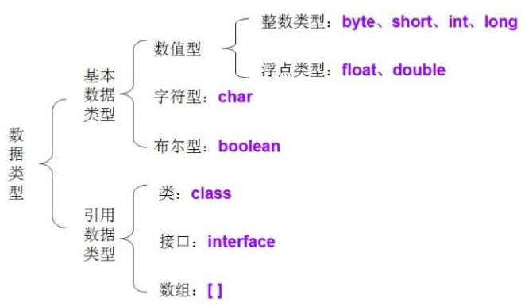

# Java Basics FAQ

> **Scope** — core language mechanics: primitives vs references, strings, initialisation order, `Object`'s methods, nested classes, reflection, I/O and the date/time API.
> **See also**: [`faq_OOP.md`](./faq_OOP.md) (OOP pillars, overriding, SOLID) ·
> [`java_collection.md`](./java_collection.md) (collections) ·
> [`java_exception.md`](./java_exception.md) (exceptions) ·
> [`java_generics.md`](./java_generics.md) (generics) ·
> [`jvm.md`](./jvm.md) (class loading, memory, GC).

---

## 1) Primitives vs Reference Types ⭐⭐⭐⭐⭐

<p align="center"></p>

| Primitive | Bits | Range / note | Default |
|-----------|------|--------------|---------|
| `byte` | 8 | −128 … 127 | `0` |
| `short` | 16 | ±32 K | `0` |
| `int` | 32 | ±2.1 B | `0` |
| `long` | 64 | ±9.2 E18 | `0L` |
| `float` | 32 | IEEE 754 | `0.0f` |
| `double` | 64 | IEEE 754 | `0.0d` |
| `char` | 16 | An unsigned UTF-16 code unit | `'\u0000'` |
| `boolean` | JVM-defined | `true` / `false` | `false` |

**Reference types** are classes, interfaces, arrays and enums. The variable holds a
reference; the object lives on the heap. Sizes are fixed by the spec, so an `int` is 32
bits on a 64-bit JVM too.

Only **fields** get default values. A local variable must be assigned before use — the
compiler enforces it.

### `==` vs `equals`

| | `==` | `equals()` |
|---|------|-----------|
| Primitives | Compares values | n/a |
| References | Compares **identity** (same object) | Compares **logical equality**, as the class defines it |

`Object.equals` is identity, so a class that does not override it behaves like `==`.
`String`, the wrappers, `List`/`Map` etc. all override it.

```java
// java
String a = new String("123");
String b = new String("123");
a == b;          // false — two distinct objects
a.equals(b);     // true  — same characters

String c = "123";
String d = "123";
c == d;          // true  — both refer to the same pooled literal
```

### Autoboxing and the `Integer` cache ⭐⭐⭐⭐

```java
// java
Integer i = 1;      // boxing   -> Integer.valueOf(1)
int n = i;          // unboxing -> i.intValue()

Integer a = 127, b = 127;
a == b;             // true  — values in [-128, 127] come from a cache
Integer x = 128, y = 128;
x == y;             // false — new objects
```

Two consequences: **always compare boxed values with `equals`**, and beware the NPE that
unboxing hides — `Integer count = map.get(k); if (count > 0)` throws when the key is
missing. The ternary operator can unbox unexpectedly too:
`flag ? 1 : someInteger` unboxes both branches.

---

## 2) Strings ⭐⭐⭐⭐⭐

`String` is **immutable** and `final`. Every "modification" makes a new object, which is
what makes strings safe to share across threads, cacheable in the pool, and safe as map
keys (their hash never changes).

### The string constant pool

Literals are interned in a pool held in the heap, so identical literals are one object.
`new String("x")` deliberately creates a second object outside the pool; `"x".intern()`
returns the pooled one.

```java
// java
String s1 = "ab";                  // pooled
String s2 = "a" + "b";             // folded at COMPILE time -> the same literal
s1 == s2;                          // true

String part = "a";
String s3 = part + "b";            // built at RUNTIME -> a new object
s1 == s3;                          // false
s1.equals(s3);                     // true
```

### `String` vs `StringBuilder` vs `StringBuffer`

| | `String` | `StringBuilder` | `StringBuffer` |
|---|----------|-----------------|----------------|
| Mutable | No | Yes | Yes |
| Thread-safe | Yes (immutable) | **No** | Yes (`synchronized`) |
| Speed | Slowest for repeated edits | Fastest | Slower than builder |
| Use | Values, keys, constants | Building a string in one thread — the normal case | Legacy; a shared buffer (rare) |

Concatenation **in a loop** is the classic mistake: each `+=` allocates a new string and
copies, making it `O(n²)`. Use a `StringBuilder`. (A single-expression `a + b + c` is
already compiled into one builder / `invokedynamic` call, so it is fine.)

---

## 3) Operators & Numeric Gotchas ⭐⭐⭐

```java
// java
int a = 5;
int b = a++;    // b = 5, then a = 6   (post-increment: assign, then add)
int c = ++a;    // a = 7, then c = 7   (pre-increment:  add, then assign)
```

- **Integer division truncates**: `5 / 2 == 2`; `5 % -2 == 1` (the sign follows the
  dividend).
- **Silent overflow**: `Integer.MAX_VALUE + 1` wraps to `Integer.MIN_VALUE`. Use
  `Math.addExact` to throw instead, and `left + (right - left) / 2` in binary search.
- **Floating point is inexact**: `0.1 + 0.2 != 0.3`. Use `BigDecimal` (constructed from a
  **string**, not a double) for money.
- `&&` / `||` short-circuit; `&` / `|` do not (and also work bitwise).
- `>>` keeps the sign, `>>>` shifts in zeros.

---

## 4) Variables, `static` and `final` ⭐⭐⭐⭐

| | Member variable (成員變數) | Local variable (局部變數) |
|---|---------------------------|--------------------------|
| Declared in | The class body | A method or block |
| Lives in | Heap (with the instance), or the class's metadata if `static` | The thread's stack frame |
| Lifetime | As long as the instance / the class | Until the block exits |
| Default value | Yes | **No** — must be assigned |
| Access modifiers | Allowed | Not allowed (only `final`) |

**`static`** binds to the class, not an instance: one copy, shared, accessible as
`ClassName.member`, initialised when the class is initialised. A `static` method cannot
touch instance state or `this`, and it is **hidden**, not overridden, in a subclass —
dispatch happens on the *reference* type at compile time.

Use `static` for constants (`static final`), stateless helpers and factory methods. Mutable
`static` state is shared across every thread in the JVM — a common source of both races
and memory leaks.

**`final`**: a `final` variable cannot be rebound (the object it points to can still
mutate), a `final` method cannot be overridden, a `final` class cannot be extended.
`final` fields also carry safe-publication guarantees — see [`jmm.md`](./jmm.md).

### Initialisation order

```text
first use of the class →  static fields + static blocks   (once, in source order)
new Foo()              →  instance fields + instance blocks
                       →  constructor body (after its implicit/explicit super(...))
```

Superclass initialisers always complete before the subclass's. This is why calling an
overridable method from a constructor is dangerous: the subclass's fields are still at
their defaults when its override runs.

---

## 5) `Object`'s Methods ⭐⭐⭐⭐

Every class inherits these, and the first three are asked about constantly:

| Method | Contract |
|--------|----------|
| `equals(Object)` | Reflexive, symmetric, transitive, consistent; `x.equals(null)` is false |
| `hashCode()` | Equal objects **must** have equal hash codes; override it whenever you override `equals` |
| `toString()` | Override it — the default `Foo@1b6d3586` is useless in logs |
| `getClass()` | The runtime class (`final`) |
| `clone()` | Shallow copy; needs `Cloneable`, else `CloneNotSupportedException` |
| `wait` / `notify` / `notifyAll` | Monitor coordination — see [`java_multi_thread.md`](./java_multi_thread.md) |
| `finalize()` | Deprecated; never rely on it. Use try-with-resources or `Cleaner` |

```java
// java
@Override public boolean equals(Object o) {
    if (this == o) return true;
    if (!(o instanceof Point p)) return false;     // pattern matching, Java 16+
    return x == p.x && y == p.y;
}
@Override public int hashCode() { return Objects.hash(x, y); }
```

Breaking the contract makes objects "vanish" from a `HashMap`/`HashSet`: the lookup
computes a different bucket than the insert did. A `record` generates both correctly —
see [`java_modern.md`](./java_modern.md).

### Shallow vs deep copy

`clone()` copies field values, so referenced objects are **shared**. A deep copy
re-creates them:

```java
// java
// Shallow: both lists point at the same elements
// Deep:    copy constructor / serialization round-trip / manual per-field copy
Person copy = new Person(original.name(), new ArrayList<>(original.hobbies()));
```

For value types, prefer **immutability** over copying: nothing to copy if nothing can
change.

---

## 6) Ways to Create an Object ⭐⭐⭐

| Way | Example | Runs a constructor? |
|-----|---------|---------------------|
| `new` | `new Foo()` | Yes |
| Reflection | `Foo.class.getDeclaredConstructor().newInstance()` | Yes |
| `clone()` | `foo.clone()` | No |
| Deserialization | `ObjectInputStream.readObject()` | No |
| Factory / builder | `List.of()`, `Integer.valueOf(1)` | Indirectly |

The two that skip the constructor are exactly why a singleton must also defend
`readResolve()` and `clone()`.

---

## 7) Nested Classes ⭐⭐⭐

| Kind | Declaration | Holds a reference to the outer instance? |
|------|-------------|------------------------------------------|
| **Static nested** | `static class Node` | No — the default choice |
| **Inner** | `class Iter` | **Yes** — `Outer.this` |
| **Local** | Declared inside a method | Yes |
| **Anonymous** | `new Comparator<>() { … }` | Yes |

An inner class keeping the outer instance alive is a real leak source (a long-lived
listener pinning an `Activity`/service). Make nested helper classes `static` unless they
genuinely need the enclosing instance. Lambdas do **not** create a class per instance and
their `this` is the enclosing one — see
[`java_functional.md`](./java_functional.md).

---

## 8) Reflection & Annotations ⭐⭐⭐

Reflection inspects and manipulates classes at runtime — the mechanism behind Spring,
Jackson, JUnit and every DI container.

```java
// java
Class<?> type = Class.forName("com.acme.Order");
Object instance = type.getDeclaredConstructor().newInstance();
Method m = type.getDeclaredMethod("total");
m.setAccessible(true);                 // bypasses access checks (restricted by JPMS)
Object result = m.invoke(instance);

for (Field f : type.getDeclaredFields())
    if (f.isAnnotationPresent(Column.class)) { ... }
```

Costs and cautions: no compile-time checking (a rename becomes a runtime failure), slower
than a direct call and harder for the JIT to inline, and it breaks encapsulation. Frameworks
cache `Method`/`Field` handles or generate bytecode to pay the cost once.

**Annotations** are metadata; `@Retention(RUNTIME)` is what makes them visible to
reflection (`SOURCE` is compile-time only, e.g. `@Override`). A **dynamic proxy**
(`java.lang.reflect.Proxy` + `InvocationHandler`) implements an interface at runtime and
routes every call through one handler — how `@Transactional` and RPC stubs work; see
[`java_spring.md`](./java_spring.md).

---

## 9) I/O and NIO ⭐⭐⭐

Classic `java.io` is **stream-based and blocking**; `java.nio` adds buffers, channels and
non-blocking selectors.

| | Byte streams | Character streams |
|---|-------------|-------------------|
| Base classes | `InputStream` / `OutputStream` | `Reader` / `Writer` |
| For | Binary data | Text (they apply a charset) |
| Buffered wrapper | `BufferedInputStream` | `BufferedReader` |

```java
// java
// Modern, and enough for most needs:
String text = Files.readString(Path.of("in.txt"));                 // 11+
List<String> lines = Files.readAllLines(path, StandardCharsets.UTF_8);
try (Stream<String> stream = Files.lines(path)) { ... }            // lazy, closeable

try (var in  = new BufferedReader(new FileReader("in.txt"));
     var out = new BufferedWriter(new FileWriter("out.txt"))) {    // auto-closed
    in.transferTo(out);
}
```

Rules: **always specify the charset** (the platform default differs across machines — UTF-8
became the default only in Java 18), always buffer (an unbuffered per-byte read is a
syscall per byte), and always close via try-with-resources.

**NIO** matters for servers: one thread can watch thousands of connections through a
`Selector`, which is how Netty and non-blocking servlet containers scale. With virtual
threads (Java 21) plain blocking code reaches similar scale — see
[`java_modern.md`](./java_modern.md).

### Serialization and `transient`

Implementing `Serializable` lets the JVM write an object graph to bytes. A field marked
**`transient`** is skipped — use it for secrets (passwords, tokens), caches and anything
not part of the persistent state (an open connection, a logger).

```java
// java
public class User implements Serializable {
    private static final long serialVersionUID = 1L;   // pin it, or refactors break reads
    private String name;
    private transient String password;                 // never written out
}
```

Java serialization is best avoided in new code: it is a well-known deserialization-attack
surface, couples your class shape to your wire format, and skips constructors. Prefer
JSON/Protobuf with an explicit schema.

---

## 10) Date & Time (`java.time`) ⭐⭐⭐

The Java 8 API replaced `Date`/`Calendar`, which were mutable and not thread-safe.

| Class | Represents |
|-------|-----------|
| `LocalDate` / `LocalTime` / `LocalDateTime` | A date/time with **no** zone — a birthday, an opening hour |
| `Instant` | A point on the UTC timeline — **what you store and log** |
| `ZonedDateTime` | An instant rendered in a zone, DST-aware |
| `Duration` / `Period` | Machine time (seconds) / human time (months, days) |

```java
// java
Instant now = Instant.now();                                  // UTC, immutable
LocalDate due = LocalDate.now().plusDays(30);                 // returns a NEW value
ZonedDateTime local = now.atZone(ZoneId.of("Asia/Taipei"));
Duration.between(start, end).toMillis();
```

All of these are immutable and thread-safe, unlike `SimpleDateFormat` — which needs a
`ThreadLocal` or, better, replacing with `DateTimeFormatter`.

---

## 11) Common Interview Q&A

**Q: Is Java pass-by-value or pass-by-reference?**
Always **pass-by-value** — but for objects the value passed is the *reference*. So a
method can mutate the object you passed, and cannot make your variable point somewhere
else.

**Q: Why is `String` immutable?**
Thread safety without synchronisation, the constant pool (sharing would be unsafe
otherwise), a cacheable `hashCode` for map keys, and security — a validated file path or
URL cannot be changed after the check.

**Q: `a++` vs `++a` in an expression?** See §3.

**Q: Can you override a `static` method?**
No. Redeclaring it in a subclass **hides** it; the reference type decides which runs.

**Q: What does `final` on a parameter or a collection buy you?**
Only that the *binding* cannot change. `final List<String> xs` can still be added to;
use `List.copyOf(xs)` for an unmodifiable one.

**Q: `int` vs `Integer` — when does it matter?**
Nullability (`Integer` can be `null`), identity comparison (`==` on boxed values),
performance (boxing allocates), and collections (they store objects only).

**Q: What is `serialVersionUID`?**
The version stamp deserialization checks. Omit it and the compiler derives one from the
class shape, so any refactor makes old bytes unreadable.

**Q: `throw` vs `throws`?** See [`java_exception.md`](./java_exception.md).

---

## 12) Recap Checklist

```text
[ ] Primitive vs reference; defaults; == vs equals
[ ] Integer cache, autoboxing NPEs
[ ] String immutability, the constant pool, StringBuilder in loops
[ ] Integer overflow, floating point, BigDecimal for money
[ ] static/final semantics; static methods are hidden, not overridden
[ ] Static → instance → constructor initialisation order
[ ] Object's methods, and the equals/hashCode contract
[ ] Shallow vs deep copy; the five ways to create an object
[ ] static nested vs inner class, and the leak an inner class causes
[ ] Reflection: what it enables, what it costs; RUNTIME retention
[ ] Charsets, buffering and try-with-resources for I/O; transient
[ ] java.time: Instant for storage, LocalDate for calendar dates
```

---

## References

- [JavaGuide — Java basics](https://javaguide.cn/java/basis/java-basic-questions-01.html)
- [`faq_OOP.md`](./faq_OOP.md) · [`java_collection.md`](./java_collection.md) · [`java_exception.md`](./java_exception.md) · [`java_generics.md`](./java_generics.md)
- [`jvm.md`](./jvm.md) — class loading, memory areas and GC
- [`java_functional.md`](./java_functional.md) · [`java_modern.md`](./java_modern.md)
