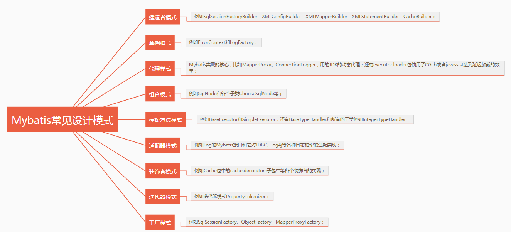

# Java Design Pattern

> **Scope** — the GoF patterns that actually come up in Java interviews and code review, each with a minimal snippet and the place the JDK or Spring already uses it.
> **See also**: [`faq_OOP.md`](./faq_OOP.md) — the principles (SOLID, composition) the
> patterns apply; [`java_spring.md`](./java_spring.md) — the framework built from them.

Concise reference to the most interview-relevant patterns with minimal Java snippets.

## 0) Categories

| Category | Purpose | Examples |
|----------|---------|----------|
| Creational | How objects are created | Singleton, Factory, Builder |
| Structural | How objects are composed | Decorator, Adapter, Proxy |
| Behavioral | How objects interact | Strategy, Observer, Template Method |

---

## 1) Singleton (Creational)

One instance, global access. Thread-safe, lazy, and efficient version:

```java
// Bill Pugh holder idiom — lazy, thread-safe, no locking
public class Config {
    private Config() {}
    private static class Holder { static final Config INSTANCE = new Config(); }
    public static Config getInstance() { return Holder.INSTANCE; }
}
```

`enum` singletons are also safe against reflection & serialization:
```java
public enum Config { INSTANCE; }
```
**Watch out**: singletons are global state — hard to test, can hide dependencies.

---

## 2) Factory Method (Creational)

Defer instantiation to a method so callers depend on an interface, not a concrete class.

```java
interface Shape { void draw(); }
class Circle implements Shape { public void draw() {} }
class Square implements Shape { public void draw() {} }

class ShapeFactory {
    static Shape create(String type) {
        return switch (type) {
            case "circle" -> new Circle();
            case "square" -> new Square();
            default -> throw new IllegalArgumentException(type);
        };
    }
}
```

---

## 3) Builder (Creational)

Construct complex/optional-heavy objects step by step; avoids telescoping constructors.

```java
class User {
    private final String name;   // required
    private final int age;       // optional
    private User(Builder b) { this.name = b.name; this.age = b.age; }

    static class Builder {
        private final String name;
        private int age;
        Builder(String name) { this.name = name; }
        Builder age(int age) { this.age = age; return this; }
        User build() { return new User(this); }
    }
}
// usage: new User.Builder("Sam").age(30).build();
```

---

## 4) Strategy (Behavioral)

Encapsulate interchangeable algorithms; swap behavior at runtime.

```java
interface SortStrategy { void sort(int[] a); }

class Sorter {
    private SortStrategy strategy;
    Sorter(SortStrategy s) { this.strategy = s; }
    void setStrategy(SortStrategy s) { this.strategy = s; }
    void run(int[] a) { strategy.sort(a); }
}
// A lambda IS a strategy: new Sorter(a -> Arrays.sort(a));
```

---

## 5) Observer (Behavioral)

One-to-many: subject notifies subscribers on state change (pub/sub, event listeners).

```java
interface Observer { void update(String event); }

class Subject {
    private final List<Observer> observers = new ArrayList<>();
    void subscribe(Observer o) { observers.add(o); }
    void notifyAll(String event) { observers.forEach(o -> o.update(event)); }
}
```

---

## 6) Decorator (Structural)

Add responsibilities dynamically by wrapping — an alternative to subclassing.

```java
interface Coffee { double cost(); }
class Espresso implements Coffee { public double cost() { return 2.0; } }

class MilkDecorator implements Coffee {
    private final Coffee inner;
    MilkDecorator(Coffee c) { this.inner = c; }
    public double cost() { return inner.cost() + 0.5; }
}
// usage: new MilkDecorator(new Espresso())  → 2.5
```
Java I/O (`BufferedReader(new FileReader(...))`) is a real-world decorator chain.

---

## 7) Adapter (Structural)

Make an existing class fit an interface the caller expects — without changing either.

```java
// java
interface Payment { void pay(long cents); }               // what our code wants

class StripeClient { void charge(BigDecimal amount) { ... } }   // what the vendor gives

class StripeAdapter implements Payment {                  // the translation layer
    private final StripeClient client;
    StripeAdapter(StripeClient client) { this.client = client; }
    public void pay(long cents) { client.charge(BigDecimal.valueOf(cents, 2)); }
}
```

Use it at every third-party boundary: your domain keeps one interface, and swapping the
vendor changes one class.

---

## 8) Proxy (Structural)

Same interface, but the proxy controls access — adding laziness, caching, remoting,
security or metrics around the real object.

```java
// java
class CachingRepo implements Repo {
    private final Repo delegate;
    private final Map<Long, Order> cache = new ConcurrentHashMap<>();
    CachingRepo(Repo delegate) { this.delegate = delegate; }
    public Order find(long id) { return cache.computeIfAbsent(id, delegate::find); }
}
```

Java's `java.lang.reflect.Proxy` builds one at runtime from an interface plus an
`InvocationHandler` — the mechanism behind `@Transactional`, `@Cacheable` and RPC stubs
(see [`java_spring.md`](./java_spring.md)).

> **Decorator vs Proxy**: both wrap. A decorator *adds behaviour the caller asked for*
> and is stacked deliberately; a proxy *controls access* to a subject the caller thinks
> it is using directly.

---

## 9) Template Method (Behavioral)

The base class fixes the algorithm's skeleton and lets subclasses fill in steps.

```java
// java
abstract class Importer {
    public final void run(Path file) {      // final: the ORDER is the contract
        var rows = read(file);
        var valid = validate(rows);
        save(valid);
    }
    protected abstract List<Row> read(Path file);
    protected List<Row> validate(List<Row> rows) { return rows; }   // optional hook
    protected abstract void save(List<Row> rows);
}
```

`JdbcTemplate`, `RestTemplate` and `AbstractList` are template methods. Its functional
cousin — pass the varying step in as a lambda — is usually the better choice today.

---

## 10) Patterns in the Wild

Recognising them in libraries is the fastest way to remember them:

| Pattern | JDK | Spring / MyBatis |
|---------|-----|------------------|
| Factory | `Calendar.getInstance()`, `List.of` | `BeanFactory`, `SqlSessionFactory` |
| Builder | `StringBuilder`, `Stream.Builder` | `SqlSessionFactoryBuilder` |
| Singleton | `Runtime.getRuntime()` | Default bean scope |
| Decorator | `BufferedReader(new FileReader(...))` | `HttpServletRequestWrapper` |
| Proxy | `java.lang.reflect.Proxy` | AOP, `MapperProxy` |
| Adapter | `Arrays.asList`, `Collections.enumeration` | `HandlerAdapter` |
| Template method | `AbstractList`, `InputStream` | `JdbcTemplate`, MyBatis `BaseExecutor` |
| Observer | `PropertyChangeListener`, `Flow` | `ApplicationEvent` |
| Strategy | `Comparator` | `Resource` loaders |
| Iterator | `Iterator` | `Cursor` |

<p align="center"></p>

---

## 11) When to Use — Quick Map

| Need | Pattern |
|------|---------|
| Exactly one shared instance | Singleton |
| Decide concrete type at runtime | Factory |
| Many optional constructor params | Builder |
| Swap an algorithm at runtime | Strategy |
| Notify many on a change | Observer |
| Add behavior without subclassing | Decorator |
| Make an incompatible API fit | Adapter |
| Control or instrument access | Proxy |
| Fix the steps, vary the details | Template Method |

> **A pattern is a name for a shape you already needed** — reaching for one before the
> need exists is how a two-class problem becomes six interfaces. Prefer the simplest thing
> that works, then refactor toward the pattern when a second variation appears.

> **DI (Dependency Injection)** — supply a class's collaborators from outside
> instead of constructing them internally; improves testability and decoupling.
> - https://github.com/ChaoLiou/Blog/issues/74
> - https://www.freecodecamp.org/news/a-quick-intro-to-dependency-injection-what-it-is-and-when-to-use-it-7578c84fa88f/
