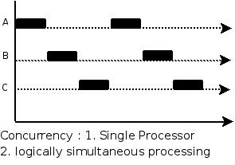
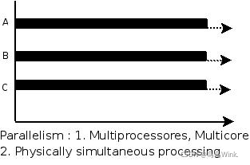

# Java Multi-thread FAQ

> **Scope** — writing correct concurrent Java: thread lifecycle, `synchronized` and `ReentrantLock`, CAS and atomics, thread pools, `CompletableFuture`, `ThreadLocal` and the concurrent collections.
> **See also**: [`jmm.md`](./jmm.md) — *why* visibility and ordering need these tools;
> [`jvm.md`](./jvm.md) — safepoints and thread dumps;
> [`java_modern.md`](./java_modern.md) — virtual threads.

---

## 1) Concurrency vs Parallelism ⭐⭐⭐

- **並發 Concurrency** — several tasks are *in progress* over the same period; on one core
  they interleave in slices. It is about **structure**: dealing with many things at once.
- **並行 Parallelism** — several tasks *execute at the same instant* on different cores.
  It is about **execution**: doing many things at once.

<p align="center"></p>
<p align="center"></p>

**同步 Sync vs 非同步 Async** is a different axis: a synchronous call does not return until
the result is ready; an asynchronous call returns immediately and the result arrives later
(callback, `Future`, event). Blocking/non-blocking describes whether the *thread* waits.

---

## 2) Threads: Lifecycle and Basics ⭐⭐⭐⭐

```java
// java
Thread t = new Thread(() -> work());   // Runnable — prefer over extending Thread
t.start();                             // start() spawns; run() would just call the method
t.join();                              // wait for it to finish
```

Java's six thread states (`Thread.State`):

```text
NEW ──start()──► RUNNABLE ◄──────────────┐
                  │  │                    │
                  │  └─ waiting for a monitor ──► BLOCKED ──┘
                  │
                  ├─ wait() / join() / park()        ──► WAITING
                  ├─ sleep(t) / wait(t) / join(t)    ──► TIMED_WAITING
                  └─ run() returns or throws         ──► TERMINATED
```

Note that `RUNNABLE` covers both "running on a CPU" and "ready but not scheduled" — the
JVM does not distinguish them. `BLOCKED` means specifically *waiting to enter a
`synchronized` block*, which is what makes a thread dump readable.

| Method | Releases the lock? | Notes |
|--------|-------------------|-------|
| `Object.wait()` | **Yes** | Must hold the monitor; always call in a `while` loop guarding the condition |
| `Thread.sleep(ms)` | **No** | Pure delay |
| `Thread.join()` | n/a | Waits for another thread to terminate |
| `Thread.yield()` | No | A hint to the scheduler; rarely useful |
| `LockSupport.park()` | No | The primitive under `ReentrantLock` |

**Interruption is cooperative.** `t.interrupt()` sets a flag (and makes a blocking call
throw `InterruptedException`); it does not stop anything by force. `Thread.stop()` is
deprecated and unsafe — it can leave objects half-mutated. In a `catch
(InterruptedException e)`, either rethrow it or call
`Thread.currentThread().interrupt()` to restore the flag.

---

## 3) `synchronized` ⭐⭐⭐⭐⭐

Mutual exclusion plus the visibility guarantees of §4 in [`jmm.md`](./jmm.md).

```java
// java
public synchronized void a() { ... }         // locks `this`
public static synchronized void b() { ... }  // locks the Class object
public void c() {
    synchronized (lockObject) { ... }        // locks an explicit object — preferred
}
```

- An instance method and a static method of the same class lock **different** monitors, so
  they do not exclude each other. A common bug.
- It is **reentrant**: a thread already holding the monitor can re-enter.
- Never lock on a `String` literal or a boxed `Integer` — the constant pool and the
  integer cache mean unrelated code may share your lock. Use a `private final Object`.
- Lock the **smallest** critical section that keeps the invariant, and never call an
  unknown/blocking method while holding a lock.

**Under the hood**: `monitorenter`/`monitorexit` bytecodes on the object's mark word.
HotSpot upgrades locks in one direction only — *biased* (a single thread, no CAS; disabled
by default in JDK 15, removed in 18) → *lightweight* (CAS spin, low contention) →
*heavyweight* (OS mutex, threads parked). This is why uncontended `synchronized` is nearly free and contended
`synchronized` is expensive.

---

## 4) `ReentrantLock` and AQS ⭐⭐⭐⭐

```java
// java
private final ReentrantLock lock = new ReentrantLock();

lock.lock();
try {
    // critical section
} finally {
    lock.unlock();          // ALWAYS in finally — an exception must not leak the lock
}
```

| | `synchronized` | `ReentrantLock` |
|---|----------------|-----------------|
| Level | JVM keyword | `java.util.concurrent` API |
| Release | Automatic on exit/exception | **You must** `unlock()` in `finally` |
| Try / timeout | No | `tryLock()`, `tryLock(t, unit)` |
| Interruptible wait | No | `lockInterruptibly()` |
| Fairness | Unfair only | `new ReentrantLock(true)` for FIFO (slower) |
| Condition queues | One (`wait`/`notify`) | Many (`newCondition()` per predicate) |
| Reentrant | Yes | Yes |

Prefer `synchronized` for simple mutual exclusion (less to get wrong, and the JVM
optimises it); reach for `ReentrantLock` when you need a timeout, interruptibility,
fairness or multiple condition queues.

Related: `ReentrantReadWriteLock` (many readers or one writer — worth it only when reads
dominate and are slow), and `StampedLock` (adds an optimistic read mode; not reentrant).

**AQS** (`AbstractQueuedSynchronizer`) is the shared engine behind `ReentrantLock`,
`Semaphore`, `CountDownLatch` and `ReadWriteLock`: an `int` state manipulated by CAS, plus
a FIFO queue of threads parked with `LockSupport`. Knowing that one class powers all of
them is a good answer to "how does `java.util.concurrent` work?".

---

## 5) Optimistic vs Pessimistic Locking, CAS ⭐⭐⭐⭐

| | 悲觀鎖 Pessimistic | 樂觀鎖 Optimistic |
|---|-------------------|------------------|
| Assumption | Conflict is likely | Conflict is rare |
| Mechanism | Take the lock first (`synchronized`, `ReentrantLock`, `SELECT … FOR UPDATE`) | Read, compute, then check-and-swap (CAS, or a version column) |
| Cost | Blocking, context switches | Retries under contention |
| Best for | Write-heavy, contended | Read-heavy, low contention |

**CAS** (compare-and-swap) is a single atomic CPU instruction: *if the memory location
still holds the expected value, replace it*. It is how the atomic classes avoid locks.

```java
// java
AtomicInteger counter = new AtomicInteger();
counter.incrementAndGet();                    // CAS retry loop, no lock
counter.updateAndGet(x -> x * 2);
counter.compareAndSet(expected, updated);
```

Two things to say about CAS in an interview:

- **The ABA problem**: a value can change A → B → A between your read and your swap, so
  the CAS succeeds even though the world moved. Fix with a version stamp —
  `AtomicStampedReference`.
- **Spin cost**: under heavy contention threads burn CPU retrying. `LongAdder` beats
  `AtomicLong` for hot counters precisely because it spreads the contention across cells
  and sums them only when read.

The atomic family: `AtomicInteger/Long/Boolean/Reference`, `AtomicIntegerArray`,
`AtomicReferenceFieldUpdater`, `LongAdder`/`LongAccumulator`.

---

## 6) Thread Pools ⭐⭐⭐⭐⭐

Creating a thread per task does not scale — each costs ~1 MB of stack and a syscall. A
pool reuses threads and gives you a queue, a bound and a rejection policy.

```java
// java
ThreadPoolExecutor pool = new ThreadPoolExecutor(
        8,                                      // corePoolSize   — kept alive
        32,                                     // maximumPoolSize
        60L, TimeUnit.SECONDS,                  // keepAlive for threads above core
        new ArrayBlockingQueue<>(1_000),        // BOUNDED work queue
        new ThreadFactoryBuilder().setNameFormat("order-%d").build(),   // named threads!
        new ThreadPoolExecutor.CallerRunsPolicy());
```

**How a task is admitted** — the order surprises people:

```text
1. threads < corePoolSize      → create a new thread
2. else queue has room         → enqueue          ← the queue fills BEFORE extra threads
3. else threads < maximumPool  → create a new thread
4. else                        → rejection policy
```

So with an **unbounded** queue, `maximumPoolSize` is never reached and tasks pile up until
the heap dies — which is exactly what `Executors.newFixedThreadPool` and
`newCachedThreadPool` do (unbounded queue / unbounded threads respectively). Prefer
constructing `ThreadPoolExecutor` yourself with a bounded queue.

| Rejection policy | Behaviour |
|------------------|-----------|
| `AbortPolicy` (default) | Throws `RejectedExecutionException` |
| `CallerRunsPolicy` | The submitting thread runs the task — natural backpressure |
| `DiscardPolicy` / `DiscardOldestPolicy` | Silently drops — only for lossy work |

**Sizing**: CPU-bound → about `cores + 1`. I/O-bound → `cores × (1 + waitTime/serviceTime)`;
in practice, measure. Always **name your threads** — an unnamed `pool-1-thread-7` in a
production stack trace tells you nothing.

Other rules: shut down with `shutdown()` then `awaitTermination()` (`shutdownNow()`
interrupts and returns pending tasks); never submit a task that waits on another task in
the *same* bounded pool (self-deadlock); and remember an exception in a `submit()`ted task
is captured in the `Future` and is silent until you call `get()`.

---

## 7) `CompletableFuture` ⭐⭐⭐⭐

`Future.get()` blocks, which throws away the point of asynchrony.
`CompletableFuture` composes instead.

```java
// java
CompletableFuture<User>  user  = CompletableFuture.supplyAsync(() -> loadUser(id), pool);
CompletableFuture<Stats> stats = CompletableFuture.supplyAsync(() -> loadStats(id), pool);

user.thenCombine(stats, Page::new)                 // join two results
    .thenApply(Page::render)                       // transform
    .orTimeout(2, TimeUnit.SECONDS)                // 9+
    .exceptionally(ex -> fallbackPage(ex))         // recover
    .thenAccept(this::send);                       // consume
```

| Method | Does |
|--------|------|
| `supplyAsync` / `runAsync` | Start work (pass **your** executor — the default is the common ForkJoinPool) |
| `thenApply` / `thenCompose` | Map / flatMap (`thenCompose` when the function itself returns a future) |
| `thenCombine` / `allOf` / `anyOf` | Fan-in |
| `exceptionally` / `handle` / `whenComplete` | Error handling; `handle` sees both outcomes |
| `*Async` variants | Run the callback on the executor rather than the completing thread |

Two traps: work submitted without an explicit executor lands on the **shared common pool**
(sized `cores − 1`, shared with parallel streams — blocking there starves everything),
and an unhandled exception is invisible unless a terminal `exceptionally`/`whenComplete`
is attached.

---

## 8) Concurrent Collections & Coordination ⭐⭐⭐⭐

| Need | Use | Not |
|------|-----|-----|
| Shared map | `ConcurrentHashMap` (CAS + per-bucket `synchronized`, lock-free reads) | `Hashtable`, `Collections.synchronizedMap` (one global lock) |
| Producer/consumer hand-off | `ArrayBlockingQueue` / `LinkedBlockingQueue` (bounded!) | A `List` plus `wait`/`notify` |
| Mostly-read list | `CopyOnWriteArrayList` | `synchronizedList` |
| Counter under contention | `LongAdder` | `AtomicLong`, `synchronized` |
| Sorted concurrent map | `ConcurrentSkipListMap` | `TreeMap` + lock |

`ConcurrentHashMap`'s atomic helpers (`computeIfAbsent`, `merge`, `putIfAbsent`) are how
you make check-then-act safe; `map.get(k)` followed by `map.put(k, v)` is a race no matter
how thread-safe the map is. Note it rejects `null` keys and values, unlike `HashMap`.

Coordination primitives:

| Class | Use |
|-------|-----|
| `CountDownLatch` | Wait for N events. **One-shot** |
| `CyclicBarrier` | N threads meet and continue together. **Reusable** |
| `Semaphore` | Limit concurrent access to a resource |
| `Phaser` | A barrier with a dynamic number of parties |
| `Exchanger` | Two threads swap objects |

More worked examples of these — plus thread-pool monitoring, graceful shutdown and
backpressure — are in
[`../backend/be_programming_notes_pt2.md`](../backend/be_programming_notes_pt2.md).

---

## 9) `ThreadLocal` ⭐⭐⭐

Per-thread state without passing it through every signature: request ids, user context,
non-thread-safe helpers like `SimpleDateFormat`.

```java
// java
private static final ThreadLocal<SimpleDateFormat> FORMAT =
        ThreadLocal.withInitial(() -> new SimpleDateFormat("yyyy-MM-dd"));

try {
    return FORMAT.get().format(date);
} finally {
    FORMAT.remove();     // MANDATORY in a pooled thread
}
```

Each thread holds a `ThreadLocalMap` whose **keys are weak references** to the
`ThreadLocal` object but whose **values are strong**. In a thread pool the thread lives
forever, so a value you never `remove()` leaks — and worse, the next request served by
that thread can read the previous request's data.

`InheritableThreadLocal` copies values to child threads (but not to pooled ones). Under
virtual threads, per-thread caching loses its point; *scoped values* are the successor.

---

## 10) Deadlock, Livelock, Starvation ⭐⭐⭐⭐

```java
// java
// Thread A: synchronized(lock1) { synchronized(lock2) { ... } }
// Thread B: synchronized(lock2) { synchronized(lock1) { ... } }   ← classic deadlock
```

All four Coffman conditions must hold: mutual exclusion, hold-and-wait, no pre-emption,
circular wait (see [`../cs_basic.md`](../cs_basic.md)). Break any one:

- **Order your locks globally** (by id, by hash) — the fix that scales.
- Acquire everything at once, or use `tryLock(timeout)` and back off.
- Shrink critical sections; better, avoid shared mutable state so no lock is needed.

**Livelock**: threads keep responding to each other and make no progress (two people
stepping aside in a corridor) — randomised backoff fixes it. **Starvation**: a thread never
gets the resource; fair locks or priority adjustments help.

**Detecting one in production**: `jstack <pid>` prints a "Found one Java-level deadlock"
section naming both threads and both monitors. That is usually the whole investigation.

---

## 11) Common Interview Q&A

**Q: `start()` vs `run()`?**
`start()` asks the JVM for a new thread that then calls `run()`. Calling `run()` directly
just executes it on the current thread — no concurrency at all.

**Q: `Runnable` vs `Callable`?**
`Callable<V>` returns a value and may throw a checked exception; `Runnable` returns
nothing and cannot. `ExecutorService.submit` accepts both and returns a `Future`.

**Q: Why is `volatile` not enough for a counter?**
It gives visibility and ordering but not atomicity — `count++` is read-modify-write. Use
`AtomicInteger` or a lock. See [`jmm.md`](./jmm.md).

**Q: Why must `wait()` be inside a `while` loop?**
Because of spurious wakeups and because another thread may change the condition between
the `notify` and your re-acquisition of the lock. Re-check the predicate after waking.

**Q: `notify()` vs `notifyAll()`?**
`notify()` wakes one arbitrary waiter — if waiters are waiting for *different* conditions
you can wake the wrong one and stall. `notifyAll()` is the safe default; multiple
`Condition`s on a `ReentrantLock` are the precise alternative.

**Q: How does `ConcurrentHashMap` stay thread-safe without locking the whole map?**
Java 7 used segment striping; Java 8+ uses CAS to install a bucket head and
`synchronized` on that head node for updates within a bucket, so writes contend only when
they hit the same bucket. Reads are lock-free (`volatile` reads of the table).

**Q: How do you make a class thread-safe?**
In order of preference: make it **immutable**; confine state to one thread
(`ThreadLocal`, an actor-style queue); delegate to a thread-safe collection; and only then
guard mutable state with a lock — documenting *which* lock guards *which* field.

**Q: Do virtual threads change any of this?**
They change the *cost model*, not the correctness rules: races, deadlocks and visibility
still exist. Pools stop being the way to limit concurrency; a `Semaphore` is. See
[`java_modern.md`](./java_modern.md).

---

## 12) Recap Checklist

```text
[ ] Concurrency vs parallelism; sync/async vs blocking/non-blocking
[ ] Six thread states; which methods release the lock
[ ] Interruption is cooperative; restore the flag
[ ] synchronized: what object is locked, reentrancy, lock upgrades
[ ] ReentrantLock's four extras, and unlock() in finally
[ ] Optimistic vs pessimistic; CAS, the ABA problem, LongAdder
[ ] ThreadPoolExecutor's admission order and why unbounded queues kill
[ ] Rejection policies; sizing CPU- vs I/O-bound pools; name your threads
[ ] CompletableFuture composition, and never using the default common pool
[ ] ConcurrentHashMap atomic helpers vs get-then-put races
[ ] ThreadLocal.remove() in pooled threads
[ ] Four deadlock conditions and lock ordering; find it with jstack
```

---

## References

- [`jmm.md`](./jmm.md) — happens-before, `volatile`, `final` semantics
- [`java_collection.md`](./java_collection.md) — collection internals
- [`../backend/be_programming_notes_pt2.md`](../backend/be_programming_notes_pt2.md) — thread pools, `CompletableFuture` and coordination in production shapes
- [JavaGuide — concurrency questions](https://javaguide.cn/java/concurrent/java-concurrent-questions-01.html)
- *Java Concurrency in Practice*, Goetz et al.
