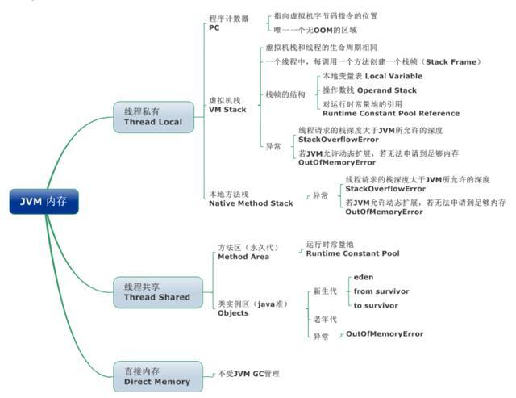
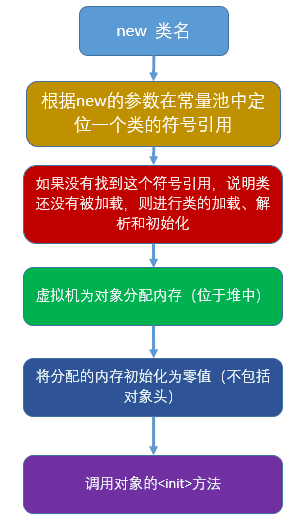
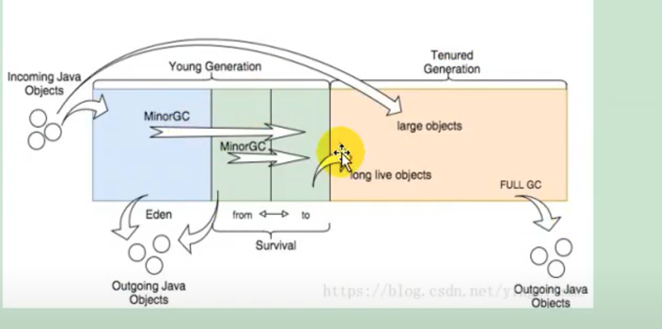
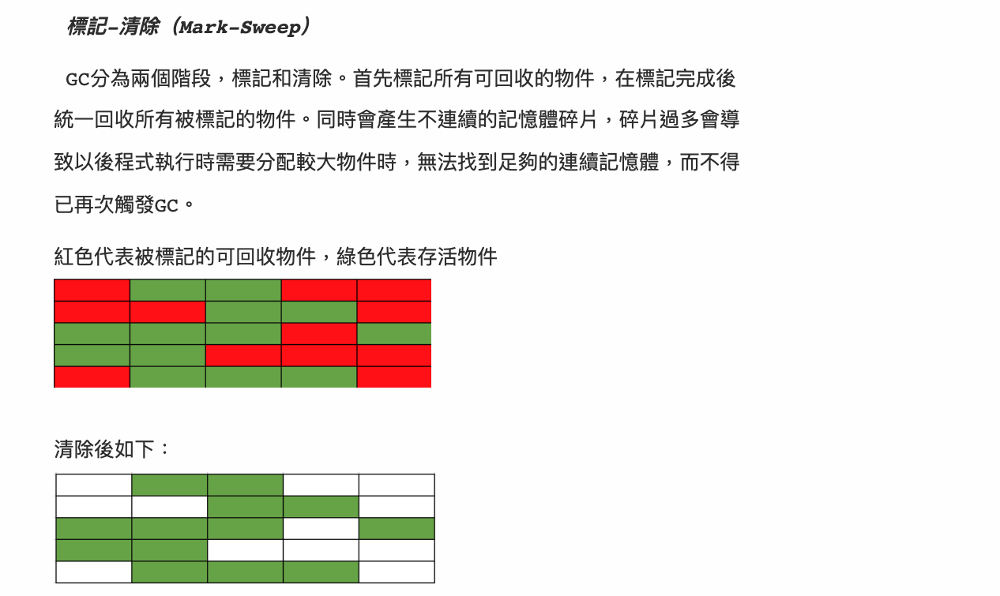
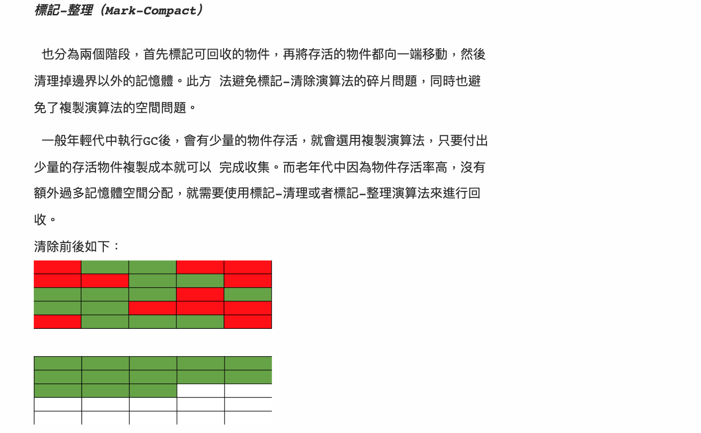
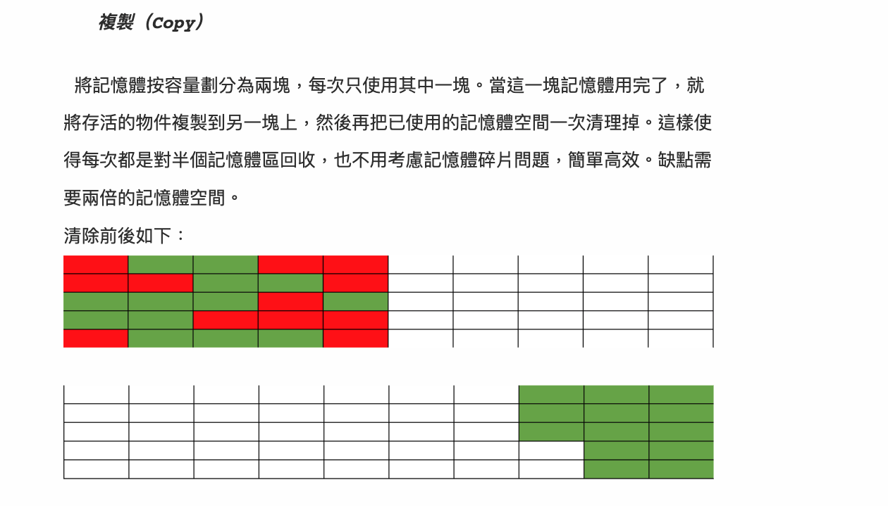
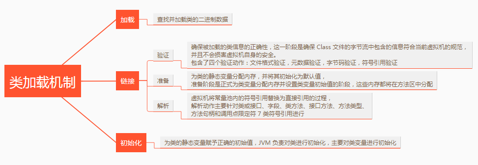
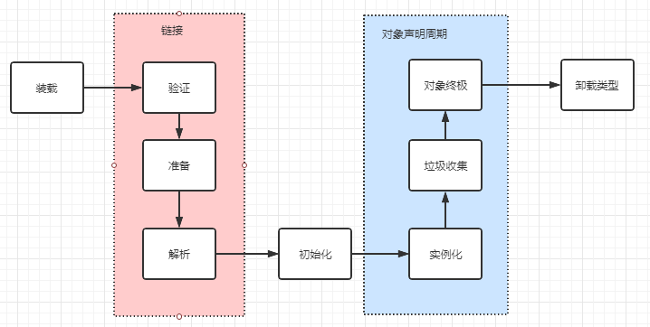
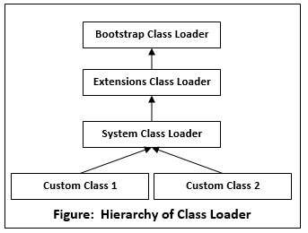

# JVM FAQ

> **Scope** — how the JVM stores, executes and reclaims: runtime memory areas, object creation, garbage collection and collectors, reference strengths, class loading, JIT, and the flags/tools used to diagnose a sick JVM.
> **See also**: [`jmm.md`](./jmm.md) — the *memory model* (visibility and ordering across
> threads, a different topic from the memory *areas* below);
> [`faq_performance_tune.md`](../faq_performance_tune.md) — tuning method.

---

## 1) Runtime Memory Areas ⭐⭐⭐⭐⭐

```text
┌──────────────────────── JVM process ────────────────────────┐
│  Per thread (created and destroyed with the thread)         │
│   ├── PC register      current bytecode address; the only   │
│   │                    area that never throws OOM           │
│   ├── JVM stack        one frame per method call:           │
│   │                    local vars, operand stack, return    │
│   │                    address, dynamic linking             │
│   └── Native method    the same, for native (JNI) calls     │
│                                                             │
│  Shared by all threads                                      │
│   ├── Heap             every object and array. GC lives here│
│   └── Method area      class metadata, static fields, the   │
│       (Metaspace 8+)   runtime constant pool, JIT code      │
│                                                             │
│  Off-heap: direct byte buffers, thread stacks, code cache   │
└─────────────────────────────────────────────────────────────┘
```

<p align="center"></p>

| Area | Shared? | Holds | Failure |
|------|---------|-------|---------|
| PC register | Per thread | Address of the current instruction | — |
| JVM stack | Per thread | Stack frames | `StackOverflowError` when one thread's stack cannot grow; `OutOfMemoryError: unable to create new native thread` is a *different* failure — the OS refused a new thread (native memory or an OS/cgroup thread limit), not a deep call chain |
| Native stack | Per thread | Native frames | Same |
| **Heap** | Shared | Objects, arrays | `OutOfMemoryError: Java heap space` |
| **Metaspace** | Shared | Class metadata, statics, constant pool | `OutOfMemoryError: Metaspace` |
| Direct memory | Shared | `ByteBuffer.allocateDirect`, NIO | `OutOfMemoryError: Direct buffer memory` |

**Stack vs heap** — the question behind most memory questions:

| | Stack | Heap |
|---|-------|------|
| Scope | One thread, one frame | Whole JVM |
| Lifetime | Popped when the method returns | Until unreachable, then GC |
| Contains | Primitives and **references** | The objects those references point to |
| Size | Small (`-Xss`, ~512 KB–1 MB) | Large (`-Xms`/`-Xmx`) |
| Managed by | Push/pop, free | The garbage collector |

**Java 8 removed PermGen.** Class metadata moved to **Metaspace**, which lives in native
memory and grows on demand (bounded by `-XX:MaxMetaspaceSize`), so the classic
`OutOfMemoryError: PermGen space` from redeploying a web app repeatedly is gone —
though a classloader leak now exhausts native memory instead.

---

## 2) How an Object Is Created ⭐⭐⭐

`new Foo()` runs these steps:

1. **Resolve** the symbolic reference in the constant pool; load/link/initialise the class
   if it has not been (see §6).
2. **Allocate** memory. Either *bump the pointer* (compacting collectors keep the heap
   contiguous) or take from a *free list*. Concurrency is handled by a per-thread
   allocation buffer (**TLAB**) so allocation is a pointer bump with no locking.
3. **Zero** the memory — which is why fields have default values (`0`, `false`, `null`).
4. **Set the object header**: mark word (hash, GC age, lock state) and the class pointer.
5. **Run `<init>`**: field initialisers and the constructor body, after `super()`.

<p align="center"></p>

An object is therefore *header + instance fields + padding* (aligned to 8 bytes).
`-XX:+UseCompressedOops` (default under 32 GB heaps) stores 64-bit references as 32-bit
offsets, cutting object size and cache pressure — which is why a heap of 31 GB can hold
more objects than one of 33 GB.

**Escape analysis** may prove an object never escapes its method and then remove the
allocation entirely (scalar replacement) or elide its locks.

---

## 3) Garbage Collection ⭐⭐⭐⭐⭐

<p align="center"></p>

### What is garbage?

Not "unreferenced" — **unreachable**. The JVM traverses from **GC roots** (stack locals,
static fields, JNI references, active monitors); anything not reached is collectable.

Reference counting is *not* used: it cannot collect cycles (`a.b = b; b.a = a`), which is
exactly why Java does tracing instead.

### The three base algorithms

| Algorithm | How | Pros | Cons |
|-----------|-----|------|------|
| **Mark-Sweep** | Mark live, free the rest in place | Simple, no moving | **Fragmentation**; two passes |
| **Mark-Compact** | Mark, then slide survivors together | No fragmentation, fast allocation | Moving objects costs time |
| **Copying** | Copy survivors to an empty half | Very fast when few survive, no fragmentation | Wastes half the space |

<p align="center"></p>
<p align="center"></p>
<p align="center"></p>

### Generational collection

Two empirical facts drive the design: **most objects die young**, and **few old objects
reference young ones**. So the heap is split and each part gets the algorithm that suits
it — copying for the young generation (few survivors), compaction for the old.

```text
Classic generational layout (Serial / Parallel). G1 and later collectors keep the
same generational *idea* but implement it with same-sized regions, not fixed spaces.

┌──────────── Young generation ────────────┐┌──── Old generation ────┐
│   Eden (80%)   │  S0 (10%)  │  S1 (10%)  ││   long-lived objects   │
└────────────────┴────────────┴────────────┘└────────────────────────┘
    ↑ new objects      ↑ survivors ping-pong      ↑ promoted after
      allocate here      between S0 and S1          enough survivals
```

1. Allocation goes to **Eden** (in a TLAB).
2. Eden fills → **minor GC**: live objects are copied to the empty survivor space, all
   ages +1; Eden and the other survivor are wiped wholesale.
3. The object is **promoted** to the old generation once it is old enough — after
   `-XX:MaxTenuringThreshold` survivals (15 is the *maximum*, and collectors lower it
   adaptively), or earlier if the survivor space cannot hold it. Objects too large for
   Eden are allocated straight into the old generation / a humongous region.
4. The old generation fills → **major / full GC**, which is much more expensive.

### Stop-the-world

To look at the object graph without it changing underneath, a collector brings the
application threads to a **safepoint**. What differs is *how much* work happens inside
that pause. Serial and Parallel do everything there. G1 keeps several phases concurrent
but still evacuates in a pause. ZGC and Shenandoah do marking, reference processing and
relocation concurrently behind load barriers, leaving only short fixed-cost pauses
(and Epsilon never collects at all).

Pauses are a classic cause of p99 latency spikes — throughput looks fine while one
request in a thousand waited for a collection — but they are not the only one, so read
the GC log before blaming GC (§8).

### Collectors

| Collector | Young / Old | Flag | Character |
|-----------|-------------|------|-----------|
| **Serial** | Copying / Mark-Compact | `-XX:+UseSerialGC` | One thread, full STW. Small heaps, containers with 1 CPU |
| **Parallel (Throughput)** | Copying / Mark-Compact | `-XX:+UseParallelGC` | Multi-threaded STW. Maximum throughput, pauses not bounded. Default through Java 8 |
| **CMS** (removed in 14) | Copying / concurrent Mark-Sweep | `-XX:+UseConcMarkSweepGC` | Historic low-pause option; fragments, needs a fallback full GC |
| **G1** | Region-based, both | `-XX:+UseG1GC` | **Default since Java 9.** Heap split into equal-sized regions (`G1HeapRegionSize`, chosen ergonomically as a power of two in 1–32 MB, targeting ~2048 regions); collects the regions with most garbage first ("garbage first") to hit a pause target (`-XX:MaxGCPauseMillis=200`) |
| **ZGC** | Region-based, concurrent | `-XX:+UseZGC` | Sub-millisecond pauses on multi-TB heaps; almost everything concurrent (coloured pointers, load barriers) |
| **Shenandoah** | Region-based, concurrent | `-XX:+UseShenandoahGC` | Same goal as ZGC, concurrent compaction via Brooks pointers |
| **Epsilon** | None | `-XX:+UseEpsilonGC` | No-op collector for benchmarking |

Choosing: batch/throughput work → Parallel. Ordinary services → G1 (leave it alone unless
a pause target is missed). Large heaps with strict latency SLOs → ZGC/Shenandoah.

> `System.gc()` merely *suggests* a full GC. It is disabled by
> `-XX:+DisableExplicitGC` in most production configs — never call it in application code.

---

## 4) Reference Strengths ⭐⭐⭐

| Type | Eligible for clearing when | Use |
|------|---------------------------|-----|
| **Strong** `Object o = new Object()` | Never, while it stays reachable | Normal code |
| **Soft** `SoftReference<T>` | Softly reachable *and* the collector decides memory pressure warrants it — timing is entirely at its discretion | Memory-sensitive caches |
| **Weak** `WeakReference<T>` | Weakly reachable (no strong/soft path). Cleared by *some* subsequent GC, not guaranteed to be the next one | `WeakHashMap`, canonical maps, listener registries — keys that should not keep the value alive |
| **Phantom** `PhantomReference<T>` | Phantom reachable, after finalization; `get()` always returns `null` | Post-mortem cleanup via a `ReferenceQueue` (what `Cleaner` uses instead of `finalize`) |

None of these is a scheduling promise: reachability makes a referent *eligible*, and the
collector clears it whenever it next runs and gets to it.

---

## 5) Memory Leaks in Java ⭐⭐⭐⭐

A GC'd language still leaks — a leak is **an object that stays reachable but is never used
again**. The usual sources:

| Leak | Why it holds on |
|------|-----------------|
| A `static` collection used as a cache | Static fields are GC roots and live for the classloader's lifetime |
| Unremoved listeners / callbacks | The publisher holds a strong reference to every subscriber |
| `ThreadLocal` in a pooled thread | The thread outlives the request; always `remove()` in a `finally` |
| Unclosed streams, connections, `ExecutorService` | Native handles and threads keep objects alive |
| A key whose `hashCode` changes after insertion | The entry can no longer be found, and never removed |
| `substring` on huge strings (pre-Java 7u6) | The substring shared the parent's char array |
| Classloader leaks in app servers | One retained class keeps its entire classloader — and every class it loaded |

**Diagnosis**: watch old-generation occupancy after full GCs (`jstat -gcutil`). If it
trends upward and never returns to baseline, take a heap dump (`jmap -dump:live,format=b,file=heap.hprof <pid>`
or `-XX:+HeapDumpOnOutOfMemoryError`) and open it in **Eclipse MAT** — the "dominator
tree" and "leak suspects" report name the retaining root directly.

---

## 6) Class Loading ⭐⭐⭐⭐

### Lifecycle

```text
Load → Link (Verify → Prepare → Resolve) → Initialise → Use → Unload
```

- **Load**: read the `.class` bytes, build the runtime representation, create the
  `Class<?>` object.
- **Verify**: reject bytecode that would break the JVM (bad stack maps, illegal casts).
- **Prepare**: allocate static fields and set them to **default** values (not the
  initialiser's value yet).
- **Resolve**: replace symbolic references with direct ones (may be lazy).
- **Initialise**: run `<clinit>` — static initialisers and static field assignments, in
  source order, after the superclass is initialised. Triggered lazily by the first
  **active use** (JLS §12.4.1): `new`, invoking a static method, reading or assigning a
  static field, running the class's `main`, or a reflective call that asks for
  initialisation (`Class.forName(name)` does; `Class.forName(name, false, loader)` and
  `getDeclaredMethod` do not). Two exceptions worth knowing: reading a **compile-time
  constant** (`static final int X = 42`) is inlined by the compiler and initialises
  nothing, and touching a subclass does not initialise it through a *field* declared only
  in the parent.

<p align="center"></p>

A class is **unloaded** only when its classloader becomes unreachable — which is why a
retained classloader keeps every class it ever loaded alive (§5).

<p align="center"></p>

### The loader hierarchy and parent delegation

| Loader | Loads |
|--------|-------|
| **Bootstrap** (native, no Java object) | Core JDK classes (`java.*`) |
| **Platform / Extension** | JDK modules beyond the core |
| **Application (System)** | Your classpath / modulepath |
| **Custom** | Plugins, hot reload, app-server isolation, encrypted or generated bytecode |

**Parent delegation**: a loader asks its parent before trying itself. So a class you name
`java.lang.String` can never shadow the real one — this is both a security property and a
uniqueness guarantee. Frameworks that need isolation (Tomcat per-webapp loaders, OSGi)
deliberately break delegation.

**Class identity is (loader, name)**: the same bytecode loaded by two loaders gives two
distinct classes, and casting between them throws `ClassCastException`. That surprise is
the root of most "impossible" classloading bugs.

`ClassLoader.loadClass()` implements delegation, `findClass()` is what a custom loader
overrides, and `defineClass()` turns bytes into a `Class`.

<p align="center"></p>

---

## 7) Execution: Interpreter, JIT and AOT ⭐⭐⭐

The JVM starts by **interpreting** bytecode and profiles as it goes. Hot methods and loops
are compiled to native code by the **JIT** (tiered: C1 compiles quickly with light
optimisation, C2 recompiles the hottest code aggressively). Because the JIT has runtime
profiles, it can do what a static compiler cannot: inline through virtual calls it
observes to be monomorphic, unroll, eliminate bounds checks, escape-analyse, and
**deoptimise** back to the interpreter when an assumption breaks.

Consequences worth knowing:

- **Warm-up matters**: the first thousand iterations of a benchmark measure the
  interpreter. Use JMH, never a hand-rolled `System.nanoTime()` loop.
- Compiled code lives in the **code cache** (`-XX:ReservedCodeCacheSize`); exhausting it
  silently drops the JVM back to interpretation.
- `-XX:+PrintCompilation` and JITWatch show what got compiled and inlined.
- **CDS** (`-XX:SharedArchiveFile`, and AppCDS) memory-maps a pre-parsed archive of class
  metadata so start-up skips repeated class loading. Still an ordinary JVM, still JIT'd —
  little peak-throughput cost.
- **AOT native images** (GraalVM `native-image`) compile the whole application ahead of
  time into a native executable: milliseconds to start and a small footprint, but no JIT
  profile-guided peak throughput, and reflection/dynamic proxies must be declared at build
  time. This is why serverless Java gravitates to native images and long-running services
  usually do not.

**JRE / JDK / JIT**: the JRE is the runtime (JVM + core libraries), the JDK is the JRE
plus development tools (`javac`, `jstack`, `jmap`), and the JIT is the compiler *inside*
the JVM. Since Java 11 there is no separate JRE download — you use `jlink` to make one.

---

## 8) Flags, Tools and Diagnosis ⭐⭐⭐⭐

### Flags you actually set

| Flag | Meaning |
|------|---------|
| `-Xms` / `-Xmx` | Initial / maximum heap. **Set them equal** in production to avoid resize pauses |
| `-Xss` | Thread stack size |
| `-XX:MaxMetaspaceSize` | Cap on class metadata |
| `-XX:+UseG1GC` / `-XX:+UseZGC` | Collector choice |
| `-XX:MaxGCPauseMillis` | G1's pause target |
| `-XX:NewRatio` / `-XX:SurvivorRatio` | Young:old and Eden:survivor sizing (rarely needed with G1) |
| `-XX:+HeapDumpOnOutOfMemoryError -XX:HeapDumpPath=…` | **Always on.** The dump is the only evidence after an OOM |
| `-Xlog:gc*:file=gc.log:time,uptime` | Unified GC logging (9+; `-XX:+PrintGCDetails` before that) |
| `-XX:+UseContainerSupport` `-XX:MaxRAMPercentage=75` | Size the heap from the **container** limit, not the host's RAM |

### Command-line tools (all ship with the JDK)

| Tool | Answers |
|------|---------|
| `jps` | Which JVMs are running, and their PIDs |
| `jstat -gcutil <pid> 1s` | Live GC: generation occupancy, collection counts and time |
| `jmap -histo:live <pid>` / `-dump:...` | What is on the heap / a full dump |
| `jstack <pid>` | Thread dump — **the** tool for hangs and deadlocks (it names deadlocks explicitly) |
| `jcmd <pid> <command>` | The modern superset: `GC.heap_info`, `Thread.print`, `VM.flags`, `JFR.start` |
| `jinfo` | Read/modify manageable flags at runtime |
| **JFR + JMC** | Low-overhead always-on production profiler (`-XX:StartFlightRecording`) |
| **VisualVM**, **MAT**, **async-profiler** | GUI monitoring, heap-dump analysis, CPU/alloc flame graphs |

### Reading the runtime from code

```java
// java
Runtime rt = Runtime.getRuntime();
long used = rt.totalMemory() - rt.freeMemory();     // bytes currently in use
double pct = 100.0 * used / rt.maxMemory();         // % of -Xmx
```

### Triage cheat-sheet

| Symptom | First move |
|---------|-----------|
| `OutOfMemoryError: Java heap space` | Heap dump → MAT dominator tree. Leak, or genuinely too small? |
| `OutOfMemoryError: Metaspace` | Count loaded classes (`jcmd GC.class_stats`); suspect a classloader leak or a proxy/bytecode generator |
| `OutOfMemoryError: unable to create native thread` | Thread leak — `jstack` and count; check `-Xss` and OS limits |
| `StackOverflowError` | Unbounded recursion (read the repeating frames in the trace) |
| Latency spikes, CPU fine | GC log → pause distribution; is the collector or the pause target wrong? |
| High CPU | `top -H -p <pid>` → convert the thread id to hex → find it in `jstack`; or async-profiler |
| Application hangs | `jstack` twice, 10 s apart; look for `BLOCKED` threads and the deadlock section |

---

## 9) Common Interview Q&A

**Q: Where do objects live — always the heap?**
Almost always, but escape analysis lets the JIT stack-allocate or scalar-replace objects
that provably never escape their method.

**Q: `int` size on a 64-bit JVM?**
32 bits. Java's primitive widths are fixed by the language spec, not the platform. What
does change is **reference** width (and compressed oops).

**Q: Minor vs major vs full GC?**
Minor collects the young generation only (frequent, cheap). Major collects the old
generation. Full collects everything including Metaspace, and is the most expensive.

**Q: Does Java have memory leaks?**
Yes — see §5. The GC frees *unreachable* objects, not *unused* ones.

**Q: What is a safepoint?**
A point where a thread's state is known to the JVM, so it can be paused for GC, a thread
dump or deoptimisation. "Time to safepoint" can itself be a latency source — a long
counted loop may not poll for one.

**Q: Why did PermGen become Metaspace?**
PermGen was a fixed-size heap region that was hard to size and a constant source of OOM on
redeploy. Metaspace uses native memory and grows on demand.

**Q: Reflection — what does it cost?**
It bypasses compile-time checking, blocks some inlining, and had a real per-call overhead
(much reduced by modern JITs and method handles). Frameworks cache `Method` objects and
generate bytecode to avoid it in hot paths.

**Q: How would you find why a service pauses for 2 s every few minutes?**
Turn on GC logging, correlate pauses with full GCs; if GC is innocent, check safepoint
time (`-Xlog:safepoint`), then look outside the JVM (page cache, CPU throttling in a
container, a stop-the-world dependency).

---

## 10) Recap Checklist

```text
[ ] Name the runtime areas and which are per-thread vs shared
[ ] Stack vs heap: what each holds, who frees it, which error each throws
[ ] Object creation steps; TLAB; compressed oops; escape analysis
[ ] Reachability from GC roots, not reference counting — and why (cycles)
[ ] Mark-sweep / mark-compact / copying, and where each is used
[ ] Eden → survivor → tenured; minor vs major vs full
[ ] G1 as the default; when ZGC/Shenandoah instead; what STW costs
[ ] Strong / soft / weak / phantom references
[ ] Class lifecycle and parent delegation; class identity = (loader, name)
[ ] Interpreter → C1 → C2, deoptimisation, and warm-up in benchmarks
[ ] Flags: -Xms/-Xmx, HeapDumpOnOutOfMemoryError, MaxRAMPercentage
[ ] jps / jstat / jstack / jmap / jcmd / JFR — which question each answers
```

---

## References

- [`jmm.md`](./jmm.md) — the Java Memory Model (visibility, ordering, happens-before)
- [`java_multi_thread.md`](./java_multi_thread.md) — threads, locks and pools
- [JavaGuide — JVM memory areas](https://javaguide.cn/java/jvm/memory-area.html)
- [Oracle — HotSpot GC tuning guide](https://docs.oracle.com/en/java/javase/21/gctuning/)
- [Baeldung — Java classloaders](https://www.baeldung.com/java-classloaders)
