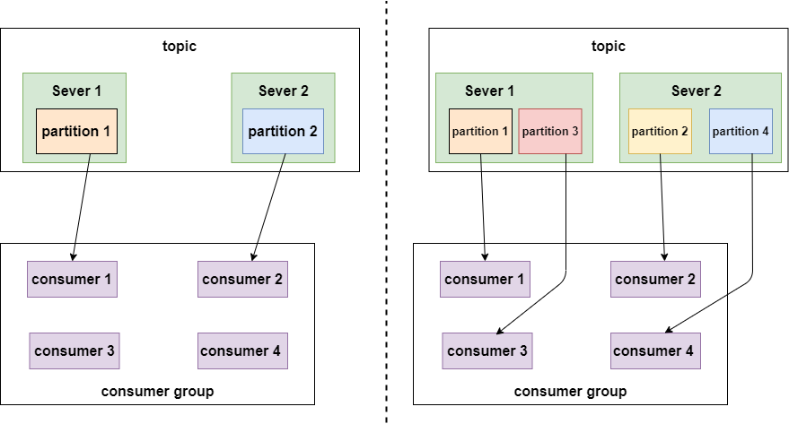
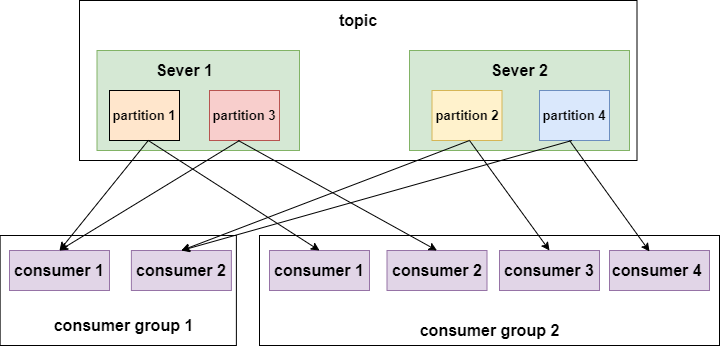
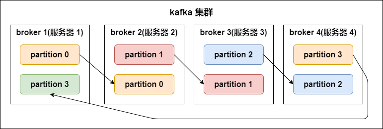
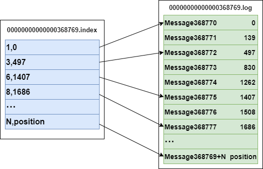
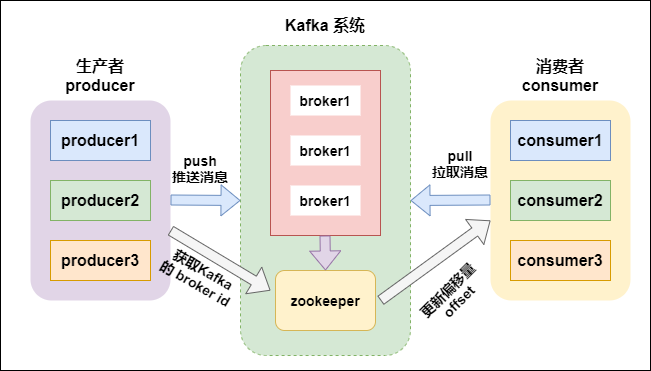
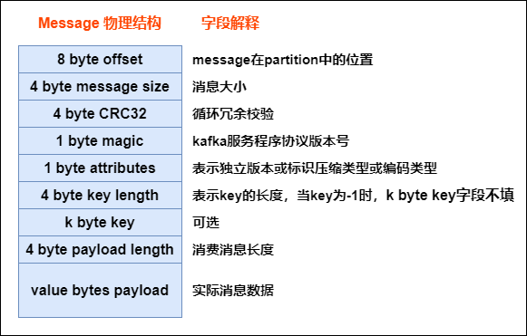
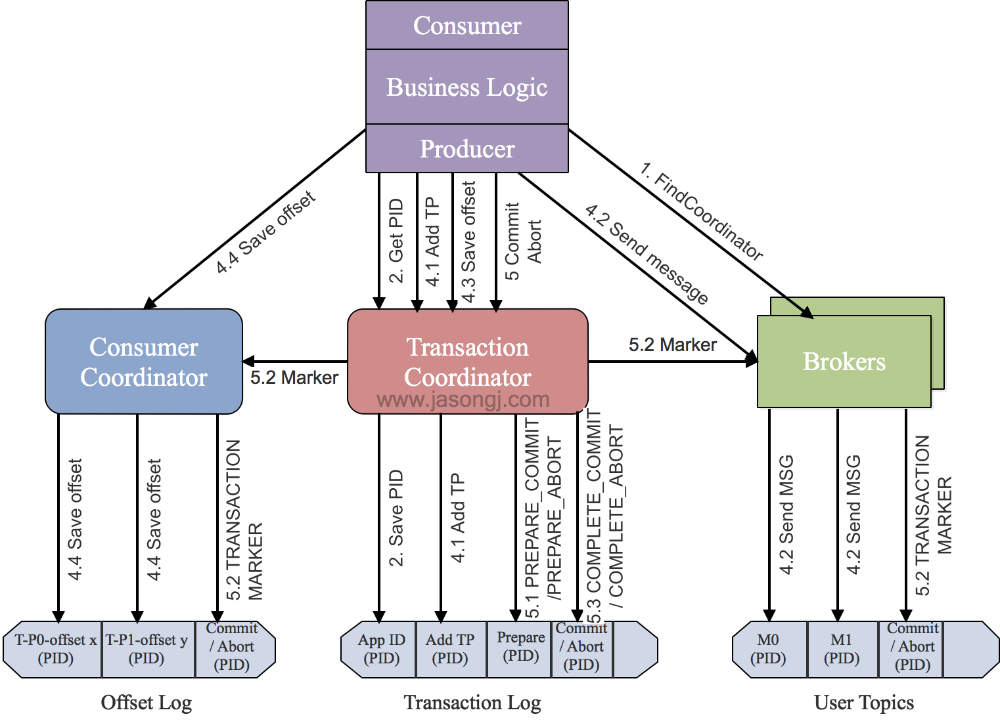

# Kafka FAQ

### 1) Explain kafka architecture ?
- Feature
	- kafka is a sustainable `distributed` pub-sub (publish-subscribe) message system
	- developed by Linkedin via scala
	- can work with both online and offline msg. Data saved on disk with replica -> prevent data lost
- Component
	- `Broker`
		- kafka cluster has many nodes
		- A broker is a node/server
	- `Topic`
		- every event on kafka belongs to a class, which is "topic"
		- each topic for different data source (feeds of messages)
		- can have unlimit topics
		- producer-subscriber use "topic" as basic unit. Can split further via topic partition
	- `Partition`
		- each topic has multiple partitions
		- NOTE : same broker can have multiple partition
				-> broker count has NO relation to partition count
		- each topic has a partition id. Start from 0
		- NOTE !!! : 
			- data in each partition can be ordering. But CAN'T guarantee global data (all data in topic) is ordering
			- ordering : keep the same ordering in producer's data and data read by consumer
		- partition defines the MAX "con-current" consumer in the same consumer group
		- So, we can raise consuming speed, if we have more partition
		<p align="center"></p>
		<p align="center"></p>
	-  Partition replicas
		- replication-factor
			- define how many replicas (on different brokers).
			- `# of replicas == # of broker` in general
			- Each `partition` has its own `leader replica` and `follower replica`
				- e.g. 1 leader, N followers -> N replicas
			- the follower replica which is in sync called "in-sync-replicas(ISR)"
			- NOTE !!! : `producer and consumer` BOTH `read and write` data from `leader replica`, NOT interact with follower replica
			- For data reliability when data I/O
			- if leader down, then will raise the other follower as new leader
		<p align="center"></p>
	- `Segment`
		- each partition has `multiple` segments.
			- Each segment has 2 parts:
				- `.index` : index file (for .log). for finding offset in .log file
				- `.log` :  record actual event data
			- Name convention
				- consider "global partition". Start from 0
				- Next segment name if last partition's MAX offset (offset msg count)
				- offset is 64 bit Long, 20 digit nunber, filled with 0 if no digit
		- example:
			- ` 3,497` in `index` : means 3rd msg in .log file, and its offset = 497
			- `Message 368772` in `log` : means it's 368772 rd msg in global partition
			- .log and .index
			```bash
			# file structure
			/<topic_name>-<partition_name>
			/.../xxx.index
			/.../xxx.log

			# index file
			00000000000000000000.index   // <offset>.index
			# log content
			00000000000000000000.log     // <offset>.log
			```
			```bash
			# example
			-rw-r--r--. 1 root root 389k  1月  17  18:03   00000000000000000000.index
			-rw-r--r--. 1 root root 1.0G  1月  17  18:03   00000000000000000000.log
			-rw-r--r--. 1 root root  10M  1月  17  18:03   00000000000000077894.index
			-rw-r--r--. 1 root root 127M  1月  17  18:03   00000000000000077894.log
			```
		<p align="center"></p>
	- `Producer`
		- msg producer, send msg to kafka broker
		- write data to `leader replica`
	- `Consumer`
		- msg consumer (client), read msg from kafka
		- consumer MUST belong to a consumer group
		- read data from `leader replica`
		- NOTE !!! : `# of consumer` should `<=` `# of partition in topic`
			- since same data should ONLY be consumed by one consumer under same consumer group at once
	- `Consumer group`
		- each consumer belogs to a specific `consumer group` (we can define consumer's group name)
		- SAME consumer in SAME consunmer group ONLY consume same msg ONCE
		- each consumer has a ID (group ID). All consumers can subscribe all partition under a topic
		- each partition CAN ONLY be consumed by A consumer under a consumer group
- Pic
	<p align="center"></p>

- Ref
	- https://www.gushiciku.cn/pl/g6Tu/zh-tw

### 1') Kafka message structure ?
- As below, every msg sent from producer will be pre-processed via kafka, then saved as below structure (in kafka broker). Only last field is the actual data from broker
- Pic
	<p align="center"></p>

### 1'') How kafka find .log file via index ?
- A partition on disk is a series of `segments`. Each segment is a set of files named by the `base offset` of its first record:
	- `00000000000000368769.log` : the records
	- `00000000000000368769.index` : a `SPARSE` map of `relative offset -> byte position` in the .log
	- `00000000000000368769.timeindex` : `timestamp -> relative offset` (used by `offsetsForTimes`)
- Lookup of offset `N` is 3 steps, all `O(log n)` then a short scan:
	- step 1) `binary search on the file NAMES` -> the segment whose base offset is the largest one <= N
	- step 2) `binary search inside the .index` -> the nearest indexed entry <= N, giving a byte position
	- step 3) `sequential scan` from that position in the .log until the record with offset N
- Why sparse (one entry per `log.index.interval.bytes`, 4KB by default) : a dense index would be as large as the data. Sparse index = small enough to stay in page cache, scan cost bounded by the interval
- Reading is then a `sendfile()` from page cache to socket (zero copy), which is the other half of why kafka is fast

### 1''') Explain how does zookeeper (ZK) work in kafka ? how kafka interact with offset via ZK ?
- What ZK held (kafka <= 2.x)
	- broker registration + liveness (ephemeral nodes)
	- `controller election` (the broker that assigns partition leaders)
	- topic / partition / replica metadata, config, ACL, quota
- Offsets
	- `kafka 0.8 and before` : consumer offsets were committed to ZK -> ZK writes became the bottleneck (ZK is built for low-write coordination, not per-message commits)
	- `kafka 0.9+` : offsets are committed to an internal compacted topic `__consumer_offsets`, keyed by `<group, topic, partition>`. ZK is no longer in the consume path
- `KRaft` (KIP-500, production-ready in 3.3, ZK removed in 4.0) : metadata moves into an internal Raft-replicated log managed by controller brokers
	- no external ZK to operate, faster failover, and metadata scales to millions of partitions
- Interview one-liner : "ZK coordinated the cluster, never the data path; offsets left ZK in 0.9 and ZK itself left in KRaft"

### 2) How does kafka implement `exactly once` ?
- please check below ` Idempotence (冪等性)`, ` transactional (事務性)`
- TL;DR
	- PID (producer ID), sequence number
	- transaction

### 3) How kafka avoid data missing ?
- Producer 
	- Via `ACK`
	- Can use `sync`, `async` mode send data to kafka
	- Mode
		- Sync
			- send a batch data to kafka, wait for kafka's response
				- producer wait 10 sec (?), if no ACK response, mark as failure
				- producer retry 3 times (?), if no ACK response, mark as failure
		- Async
			- send a batch data to kafka, ONLY offer a `callback()` method
			- save data in producer's buffer first, buffer size is about 20k
			- if meat threshold, then can send data (to kafka)
			- size of batch data is about 500
			- NOTE : if there is no ACK from kafka broker, but producer buffer is full, developer can decide mechanisms whether clean buffer or not (programmatically)
- Broker
	- Via `Partition replicas` avoid data missing
- Consumer
	- Each consumer record/maintain its own offset. can avoid data missing
	- We can save offset on client's file system, DB, Redis...

### 3') Explain kafka `ACK` ?
- `request.required.acks` : how to acknowledge when kafka writes producers' messgage to its (kafka) copy
- A tradeoff between efficiency (response speed) and reliability (fault tolerance) 
- cases
	- `ack = 1 (default)`
		- when producer -> kafka broker. if kafka leader comfirms msg received successfully -> Success, will lost data if leader down before followers sync
	- `ack = 0`
		- whenever producer -> kafka broker, mark it as success. Highest speed, will lost data if broker down
	- `ack = -1 (or all)`
		- when producer -> kafka broker, have to wait `leader and ALL followers' confirmation`. Slowest speed, but make sure NO data lost. 
- Ref
	- https://blog.51cto.com/u_15193673/2850009
	- https://blog.51cto.com/u_15278282/2932140
	- https://blog.csdn.net/lbh199466/article/details/89917693

### 4) Explain kafka basic data model ?
- `Record` : `key`, `value`, `headers`, `timestamp`, and the broker-assigned `offset`
- `Topic` : a named, append-only log. A logical stream, split into partitions
- `Partition` : the unit of ordering, storage and parallelism
	- ordering is guaranteed `WITHIN a partition ONLY`, never across a topic
	- the partition is chosen by `hash(key) % partitions` — so the same key always lands in the same partition (that is how per-entity ordering is achieved)
	- a null key -> sticky/round-robin batching across partitions
- `Segment` : the files a partition is stored as (see 1'')
- `Replica` : each partition has `replication.factor` copies — one `leader` (all reads/writes) and followers that fetch from it
- `Consumer group` : a set of consumers sharing a subscription. One partition -> at most one consumer in the group, so `partition count is the ceiling on parallelism`
- `Offset` : a consumer's position in a partition. Data is NOT deleted on read — it is retained by `retention.ms` / `retention.bytes`, or compacted by key (`cleanup.policy=compact`), which is what makes replay possible

```text
topic "orders"
 ├─ partition 0 : [0][1][2][3][4]        ← ordered, immutable, append-only
 ├─ partition 1 : [0][1][2]                 leader on broker A, followers on B,C
 └─ partition 2 : [0][1][2][3]
consumer group "billing" : c1 → p0, c2 → p1+p2   (a 4th consumer would idle)
```

### 5) Explain how does kafka save data (low level, file system level) ?
- File
	- .log : file save data
	- .idnex : file save .log files' index 

### 6) Explain kafka master, slaves relation ? regarding data partition, ... ?
- Kafka has NO cluster-wide master for data. Leadership is `per partition`, so load spreads across every broker
	- `leader replica` : serves ALL produce and consume traffic for that partition
	- `follower replica` : does nothing but fetch from the leader to stay in sync (it is a hot standby, not a read replica — though `follower fetching` for locality exists since 2.4)
- The `controller` (one broker, elected via ZK or KRaft) is the cluster-level coordinator: it detects broker failure and reassigns partition leaders
- Failover : if a leader dies, the controller promotes a replica `from the ISR`
	- `unclean.leader.election.enable=false` (default) : refuse to promote an out-of-sync replica -> availability suffers, data does not
	- `= true` : promote anyway -> stays available, silently loses records
- `Preferred leader` : the first replica in the assignment list; kafka rebalances back to it so leadership stays evenly spread
- Durability knobs work together : `replication.factor=3` + `min.insync.replicas=2` + `acks=all` means a write is acknowledged only once 2 replicas hold it, so one broker can die with no loss

### 7) Steps when a consumer consumes a kafka topic ?
- step 1) `bootstrap` : connect to `bootstrap.servers`, fetch cluster metadata (which broker leads which partition)
- step 2) `find the group coordinator` : the broker that owns this group's partition of `__consumer_offsets`
- step 3) `join + sync group` : the coordinator picks a leader consumer, which runs the assignor (`range`, `roundrobin`, `sticky`, or `cooperative-sticky` — the last avoids a stop-the-world rebalance) and hands back the assignment
- step 4) `position` : for each assigned partition, start from the committed offset, or from `auto.offset.reset` (`earliest` / `latest`) if there is none
- step 5) `poll loop` : `poll()` fetches batches from each partition leader, and also sends heartbeats and triggers rebalances. Process the records, then commit
	- `enable.auto.commit=true` : commits in the background -> `at most once` risk (committed then crashed before processing)
	- manual `commitSync` AFTER processing -> `at least once`, so make the consumer idempotent
- step 6) `rebalance` when a member joins/leaves or `max.poll.interval.ms` is exceeded (usually "processing was too slow") — partitions are reassigned and step 3 repeats
- step 7) `close()` : leaves the group cleanly so the group does not wait for `session.timeout.ms` to notice

### 8) Explain kafka's Idempotence (冪等性)
- Idempotence -> when run same process multiple times, the result SHOULD BE THE SAME
- core concept : PID（Producer ID), sequence number
- kafka gives each producer a PID, also maintain a `<PID, Partition> -> sequence number` mapping for each Partition in each producer
- Can ONLY make sure Idempotence inside producer, can't guarantee if producer down and restart
- Can ONLY make sure Idempotence inside single partition, can't across topic-partition
- Implementation
	- Broker
		- when get event
			- If `sequence number = "<PID, Partition>"'s sequence number + 1 `: broker accept this event
			- If `sequence number < "<PID, Partition>"'s sequence number`: duplicated event, broker will neglect it
			- If `sequence number > "<PID, Partition>"'s sequence number`: there is data missing, broker will raise `OutOfOrderSequenceException` exception
	- Producer
		- `PID（Producer ID)` :
			- use `Properties.put(“enable.idempotence”,true);` enable Idempotence
			- recognize each producer client
			- every producer gets a global unique PID when init
			- if producer resrart, it will get a new PID
			- for each PID,  sequence number starts from 0
			- each topic-partition has a independent sequence number
			- apply PID via ZK:
				- step 1) get `/latest_producer_id_block` from zk for lastest allocated PID
				- step 2) if such node is new, start PID from 0 (0-1000), get 1000 PID at once (default)
				- step 3) if such node existed, get its data, get PID based on block_end
				- step 4) get PID, and write such inform back to ZK, if writes success -> whole process OK, if fail, means maybe node already updated/other, will redo from step 1)
		- `Sequence number` : 
			- every msg (from producer client) has this value, for checking if a record is duplicated
- Ref
	- https://blog.csdn.net/zc19921215/article/details/108466393#:~:text=Kafka%E5%B9%82%E7%AD%89%E6%80%A7%EF%BC%9A,number%E8%BF%99%E4%B8%A4%E4%B8%AA%E6%A6%82%E5%BF%B5%E3%80%82

### 9) Explain kafka's transactional (事務性)
- offer "partition writing" `ATOM` -> ONLY when ALL ops success, then commit and say these ops are success, else -> rollback (e.g. ALL success or ALL failure)
- core concept :
	- TransactionalId
	-  `_transaction_state（Topic)`
	- Producer epoch
	- ControlBatch (aka Control Mesage, Transaction Marker)
		- special event sent from producer to kafka topic.
		- 2 types: COMMIT, ABORT (commuit success or not)
	- TransactionCoordinator
- why not use producer id (PID), but introduce TransactionalId ?
	- producer id (PID) get refreshed when producer restart, so `we use TransactionalId make each event unique`
- make sure "exactly once"
- Implementation
	- step 1) find `Tranaction Corordinator (TC)`
		- producer sends `FindCoordinatorRequest` to a broker, then finds a TC, and gets its node_id, host, port
	- step 2) init initTransaction
		- producer sends `InitpidRequest` to TC, gets PID (producer ID), TC will record `<TransactionalId,pid>` to Transaction Log, state infromation (e.g. `Empty/Ongoing/PrepareCommit/PrepareAbort/CompleteCommit/CompleteAbort/Dead`) is also included
		- Commit/Abort non-completed tasks
		- add PIC with epoch, make transaction in producer
	- step 3) begin Transaction
		- run producer's `beginTransacion()`. Will mark a transaction as "start" state in local record. 
	- step 4) read-process-write
		- Once producer start sending event, TC will save `<Transaction, Topic, Partition>` to Transaction Log, and set it "start" state, also record the time.
		- Broker will save sent event in its disk (without commit/abort). If there is an "abort", msg on broker will NOT be canceled, but changed state to "abort"
	- step 5) commitTransaction/abortTransaction
		- while producer run commit/abort, TC will do 2 phase commit
			- phase 1 : modify Transaction log to `PREPARE_COMMIT` or `PREPARE_ABORT`
			- phase 2 : modify all events written by Transaction Marker to committed or aborted
		- once Transaction Marker complete writing, TC will write final status to Transaction log and mark such transaction is completed
- pic
	<p align="center"></p>
- Ref
	- https://blog.csdn.net/zc19921215/article/details/108466393#:~:text=Kafka%E5%B9%82%E7%AD%89%E6%80%A7%EF%BC%9A,number%E8%BF%99%E4%B8%A4%E4%B8%AA%E6%A6%82%E5%BF%B5%E3%80%82

### 9') Explain Transaction Coordinator and it mechanism ?
- `Transaction Coordinator (TC)` is a module `inside a broker` — the transactional counterpart of the group coordinator
- Which broker : `hash(transactional.id) % partitions of __transaction_state` — so one transactional producer always talks to the same TC, and the TC's state survives failover because `__transaction_state` is a replicated, compacted topic
- What it owns
	- the transaction log : `<transactional.id, PID, producer epoch, state, partitions involved, timeout>`
	- states : `Empty -> Ongoing -> PrepareCommit / PrepareAbort -> CompleteCommit / CompleteAbort`
	- writing `Transaction Markers (control batches)` into every partition the transaction touched
- Mechanism = `two-phase commit` (detail in 9 above): phase 1 writes PREPARE_* to the transaction log (the point of no return), phase 2 writes the markers to the data partitions, then the final state goes back to the log
- `Zombie fencing` : `InitPidRequest` bumps the `producer epoch`, so an old producer instance that comes back from a GC pause is rejected — this is what makes "exactly once" hold across a producer restart
- Reader side : a consumer with `isolation.level=read_committed` skips records whose transaction is aborted or still open (it reads only up to the `LSO`, the last stable offset)

### 10) Explain AR（Assigned Replicas), ISR (In-sync replica), and OSR（Out-of-Sync Replicas）?
- `AR (Assigned Replicas)` : every replica assigned to the partition. `AR = ISR + OSR`
- `ISR (In-Sync Replicas)` : the replicas (leader included) that have caught up with the leader within `replica.lag.time.max.ms` (30s by default). Only an ISR member may be elected leader (unless unclean election is enabled), and `acks=all` means "acknowledged by all of the ISR"
- `OSR (Out-of-Sync Replicas)` : replicas that have fallen behind — a slow disk, a network partition, or a broker restarting. They keep fetching and rejoin the ISR once caught up
- Why it matters : `min.insync.replicas` counts the ISR, so if too many replicas fall out, producers with `acks=all` start failing with `NotEnoughReplicas` — the cluster chooses consistency over availability, by design
- `HW (high watermark)` = the smallest offset replicated to all of the ISR; consumers can never read past it, which is why an un-replicated record is invisible rather than lost-after-read
- Ref
	- http://hk.noobyard.com/article/p-azlfvsay-mq.html
	- https://www.gushiciku.cn/pl/pTAJ/zh-tw

### 11) Describe kafka limitation ?
- auto scale : it's hard to scale down if scale out first (modify partition data in topics)
	- can have 2 kafka clusters, if one wants to scale up/down still. (Use the other service request first, avoid downtime)
- keep published event in `ordering in global`

### 12) Explain why kafka can do high I/O ?
- ordering read/write
- zero copy
- split file
- batch transmit
- data compression
- Ref
	- https://iter01.com/639107.html

### 13) Explain kafka topic partition strategy ?
- Range strategy
- RoundRobin strategy
- Ref
	- https://iter01.com/639107.html


### 14) What's if multiple consumers in same consumer group ? 

- Can multiple Kafka consumers read same message from the partition ?

- [swf ref](https://stackoverflow.com/questions/35561110/can-multiple-kafka-consumers-read-same-message-from-the-partition)
- [o relly ref](https://www.oreilly.com/library/view/kafka-the-definitive/9781491936153/ch04.html#:~:text=Kafka%20consumers%20are%20typically%20part,the%20partitions%20in%20the%20topic.)
- https://youtu.be/a_Oafk7fAjY?si=w6V-rpDUMjyswRRw&t=1538

- Kafka consumers are typically part of a consumer group. When multiple consumers are subscribed to a topic and belong to the `same consumer group`, `each consumer` in the group will receive messages from a different `subset` of the partitions in the topic.

- 如果ㄧ個consumer group 裡有複數個consumer -> 每個consumer只會收到topic`部分`的訊息
- 如果consumer 分屬不同 consumer group (訂閱同個topic) -> 每個consumer都會收到topic`全部`訊息

- In same group : No
 	- Two consumers (Consumer 1, 2) within the same group (Group 1) `CAN NOT` consume the same message from partition (Partition 0)

- In different group : Yes
	- Two consumers in two groups (Consumer 1 from Group 1, Consumer 1 from Group 2) CAN consume the same message from partition (Partition 0).


### 15) streaming model ?

- Msg queue (e.g. rebbitMQ)
	- each serve can only read part of msg fro queue

- pub - sub (e.g. publish, subscriber)

- https://youtu.be/7YS0gOAXnWM?si=WUqoQTs7IE7ljsNP&t=546

Note : In kafka, the concept of "consumer group" offers the generic of mix above
 - multiple consumers in same group ~= reading from queue


## Ref
- https://blog.csdn.net/ajianyingxiaoqinghan/article/details/107171104
- https://so.csdn.net/so/search?spm=1001.2101.3001.4498&q=Kafka%E6%8A%80%E6%9C%AF%E7%9F%A5%E8%AF%86%E6%80%BB%E7%BB%93&t=&u=
- https://github.com/IcyBiscuit/Java-Guide/blob/master/docs/system-design/distributed-system/message-queue/Kafka%E5%B8%B8%E8%A7%81%E9%9D%A2%E8%AF%95%E9%A2%98%E6%80%BB%E7%BB%93.md